# 如何使用 Kinsta APM 解决 WooCommerce 性能问题(真实例子)

> 原文：<https://kinsta.com/blog/woocommerce-apm/>

知道如何解决 WooCommerce 的性能问题是你的在线业务成功的关键。你的电子商务网站越吸引用户，他们的网上购物体验就越好。他们的用户体验越好，他们就越有可能下单。总而言之，这意味着更多的销售和利润。因此，性能是你的 Woocommerce 商店成功的核心。

[根据一项研究](https://kinsta.com/learn/page-speed/#slow-how-slow)， **46%** 的用户不会重访表现不佳的网站。因此，对于电子商务网站来说，由于性能问题而错失潜在销售机会是很常见的。如果你没有优化你的网站性能，在[的季节性高流量](https://kinsta.com/blog/ecommerce-strategies/#optimize)日，比如黑色星期五和网络星期一，你会损失更多。

虽然你可以使用许多技术来加速你的电子商务网站，但是快速解决一个紧迫的性能问题是具有挑战性的。它需要主动监控站点的整体环境。这就是像 [Kinsta APM](https://kinsta.com/apm-tool/) 这样的[应用程序性能监控工具](https://kinsta.com/blog/apm-tools/)非常有用的地方。

在本文中，您将了解电子商务网站的各种组件，为什么您需要 APM 工具来监控您的电子商务网站的性能，以及如何使用 Kinsta APM 来保持 WooCommerce 网站的最高性能。

请记住，你的最终目标是增加商店的收入。所以一定要下载我们的免费电子书**， [10 种提高你的网络商务产品页面转化率的方法](https://kinsta.com/ebooks/wordpress/ecommerce-conversion-rate/?utm_source=Blog&utm_medium=Link&utm_campaign=WooCommerce+Conversions+Ebook)。**

 **准备开始了吗？我们走吧！

## 电子商务网站的各个组成部分

为了以最佳的性能运行一个电子商务网站，所有的部分都很重要。从托管基础设施和电子商务平台到第三方集成和结账流程，一切都很重要！

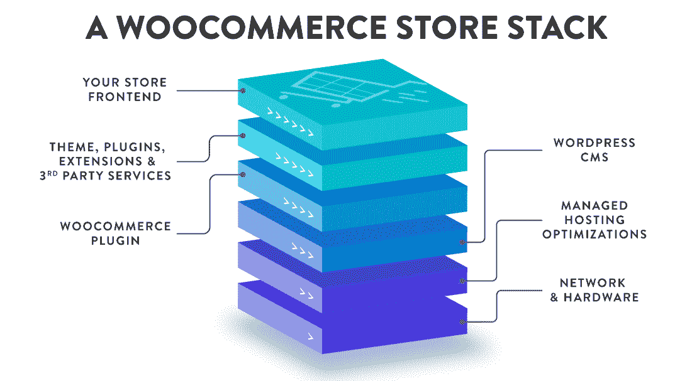

A typical WooCommerce store stack

无论你是在卖精酿啤酒，还是在卖无人机培训课程，像 WooCommerce 这样的 T2 电子商务平台都可以让你轻松快速地建立并推出一个在线商店。

它的各种扩展也使得用许多基本组件扩展商店的功能变得非常简单。

Tracking various ecommerce components is complex

链条中的环节越多，出现问题时就越难找到有缺陷的环节。所有这些复杂性都会导致性能和可用性问题的增加。它会影响您快速响应性能问题并在问题影响到客户之前解决问题的能力。

解决办法？使用[应用性能监控](https://kinsta.com/blog/application-performance-monitoring/)工具。

我们已经明确设计了 Kinsta APM 来监控 WordPress 站点的性能，包括在 Kinsta 托管的 [WooCommerce 商店。](https://kinsta.com/woocommerce-hosting/)

[46%的用户不会重访表现不佳的网站...这就是为什么监控你的电子商务网站的表现对你的声誉和收入至关重要。💰点击此处了解更多关于我们内置 APM 工具的信息⬇️ 点击推文](https://twitter.com/intent/tweet?url=https%3A%2F%2Fkinsta.com%2Fblog%2Fwoocommerce-apm%2F&via=kinsta&text=46%25+of+users+won%E2%80%99t+revisit+a+poorly+performing+site...+which+is+why+monitoring+your+ecommerce+site%27s+performance+is+essential+for+your+reputation+and+your+revenue.+%F0%9F%92%B0+Learn+more+about+our+built-in+APM+tool+right+here+...&hashtags=speed%2CWooCommerce)

## 对 WooCommerce 网站使用 Kinsta APM 的好处

你的 WooCommerce 网站的性能问题会从多方面对你的在线业务造成重大损害。您可以使用 Kinsta APM 来防止或克服这些问题。它的一些好处包括:

### 增加销售和收入

性能对于一个电子商务网站的底线至关重要。维护一个高性能的站点需要理解许多指标和开发技能。Kinsta APM 让您和您的员工更轻松地完成这项任务。因此，对销售和收入的影响是使用 Kinsta APM 的最大好处。

### bitters 用户体验

衡量用户的满意度很有挑战性，因为当面临速度或性能问题时，他们可能会默默走开。更糟糕的是，他们可能会去你竞争对手的地盘。像 Kinsta APM 这样有用的 APM 工具可以让你了解性能，从而确保你的客户对你的 WooCommerce 商店满意。

### 窗帘损害品牌声誉

在数字时代，文字传播得相当快。用户不再怀疑你的电子商务网站是否表现完美。他们期待着。因此，当它们由于网站速度变慢或中断而中断时，你不仅失去了一笔销售，也失去了你的品牌的声誉和信任。Kinsta APM 可以通过帮助您保持网站的最佳性能来减少这种机会。

### 提高生产力和幸福感

表现更好的网站也意味着内部员工生产力的提高。例如，您的开发团队不必花费太多时间来解决性能问题。支持人员不必管理那么多的票证。您的营销团队可以在更短的时间内完成更多的活动。当站点被调整到性能良好时，每个人都更加高效和快乐。

### 腾出时间进行创新

尝试创新战略以推动业务增长是电子商务营销的基石之一。无论您是开发人员还是营销人员，Kinsta APM 的简单性推动了协作，促进了有效的业务增长战略。它还支持更快地解决问题，从而更有信心地推出新功能。

### 降低托管和 IT 基础设施成本

通过识别性能瓶颈，Kinsta APM 可以帮助您充分利用您的主机基础设施。它使你能够微调你的 WooCommerce 网站，以更好地扩展你的网站。此外，通过识别麻烦的插件、扩展和第三方服务，Kinsta APM 让您走上削减不良 IT 资产的正确道路。

## 如何修复 Kinsta APM 的 WooCommerce 性能问题

现在是时候检查一些真实世界的例子，并探索如何使用 Kinsta APM 来修复 WooCommerce 的性能问题。

### 了解 Kinsta APM 的基础知识

首先，首先！在你用 Kinsta APM 对你的 WooCommerce 网站进行故障诊断之前，有必要了解它的各种术语以及你如何理解它的见解。您可以参考我们的 [Kinsta APM 知识库](https://kinsta.com/help/apm-tool/#apm-tool-terminology)开始使用。

如果你有更多关于 Kinsta APM 的问题，我建议你阅读 [Kinsta APM FAQ](https://kinsta.com/help/apm-tool/#kinsta-apm-faq) 部分。

### 测试 WooCommerce 网站和设置

Kinsta APM 只适用于 Kinsta 托管的 WordPress 网站。对于本文，我建立了一个测试 WooCommerce 站点来模拟在线商店最常见的性能问题。我使用一个真实的[域名](https://kinsta.com/blog/choose-domain-name/)来确保一个 [SSL/TSL 握手](https://kinsta.com/knowledgebase/tls-vs-ssl/#how-do-tls-and-ssl-work-to-secure-data)发生。

以下是测试站点的详细信息:

*   服务器栈:Nginx 1.19.4，PHP 7.3.24-3，MariaDB 5.5.5
*   版本:5.5.3
*   主题:[雅特主题](https://kinsta.com/blog/fastest-wordpress-theme/#astra) 2.6.1
*   主要插件:WooCommerce 4.7.1、 [WooCommerce 购物车废弃恢复](https://kinsta.com/blog/abandoned-cart-email/#cart-abandonment-emails-in-woocommerce)、Kinsta 必备插件、Akismet 反垃圾邮件。

此外，我使用自定义插件来说明独特的例子，稍微定制了网站。这里的主要目的是教授如何在各种情况下使用 Kinsta APM 来解决几个 WooCommerce 性能问题。

### 1.WooCommerce APM 示例:结账时第三方 API 调用缓慢

大多数电子商务网站依靠第三方集成来处理支付和运输等关键流程。许多 WooCommerce 网站也使用第三方插件进行电子邮件营销，比如 Mailchimp 和 T2 MailerLite。

然而，[第三方服务](https://kinsta.com/blog/third-party-performance/)会对你的 WooCommerce 网站的表现产生重大影响。如果它影响了你的结账过程，那么你应该更加认真地对待它。

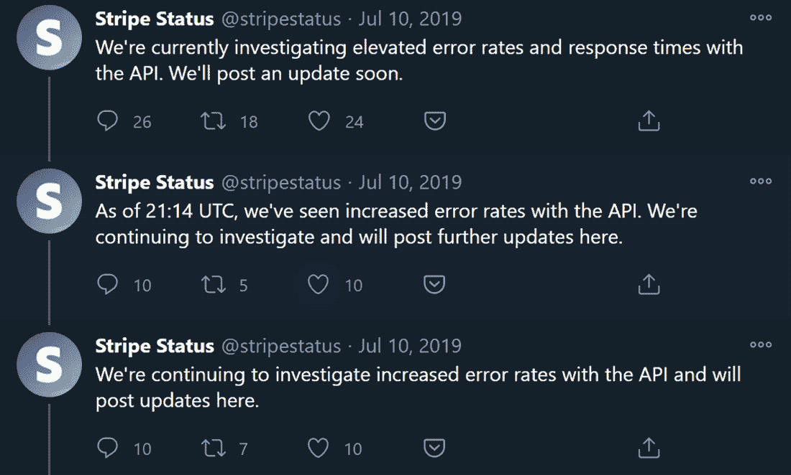

Stripe’s API faced a major outage last year.

在本例中，每当用户向购物车中添加产品时，站点的响应时间都太长。有时，网站需要超过 5 秒的时间来响应。这是放弃购物车的绝佳方法。

让我们启动 Kinsta APM 来诊断问题。

首先，进入你网站的 [MyKinsta 仪表板](https://kinsta.com/MyKinsta)，然后前往**监控**部分。

点击**性能监控**部分下的**启用**按钮，让 Kinsta APM 收集您站点的性能指标。

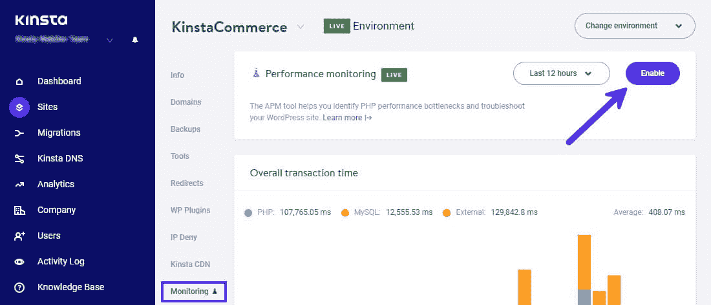

Enabling Kinsta APM in the MyKinsta dashboard.

如果您之前已经启用了 Kinsta APM(如这里)，您可以在图表和表格中看到过去的性能数据。

启用 Kinsta APM 后，我测试了站点，并等待性能指标填充到 Kinsta APM 仪表板中。

理想情况下，在深入研究数据之前，至少等待 5 分钟。这将确保 Kinsta APM 收集了足够的性能数据来提供可操作的结果。

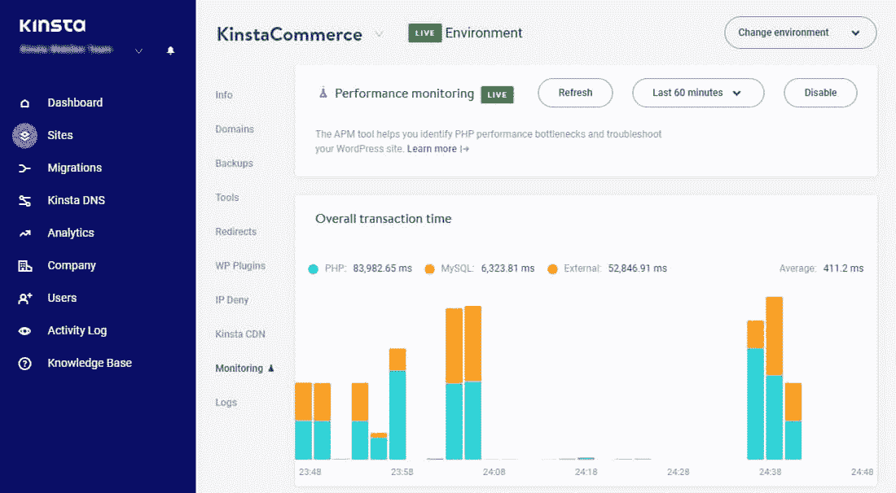

The Kinsta APM main dashboard screen.

使用 **Enable** / **Disable** 按钮左侧的下拉菜单，您还可以更改 Kinsta APM 处理性能指标的持续时间。

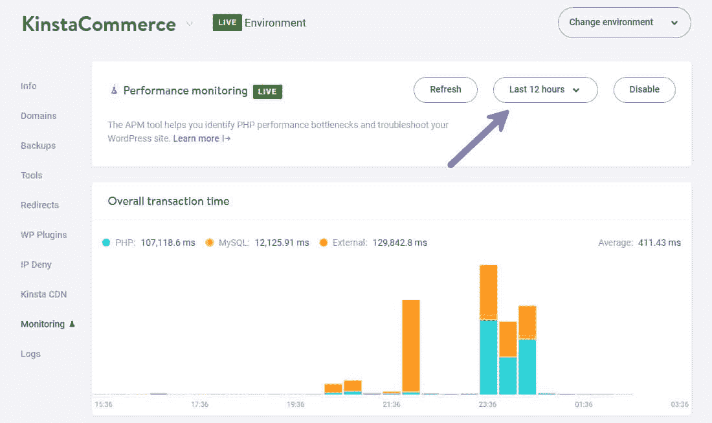

Changing the total duration used by Kinsta APM.

在**总事务时间**图表中，您可以看到**外部**调用占据了大部分空间。它暗示，第三方服务可能是放缓背后的罪魁祸首。

接下来，您可以向下滚动到**最慢事务**表，查看执行时间最长的请求或后台任务。

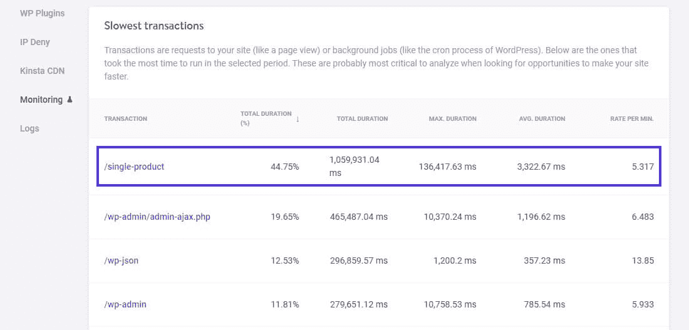

A list of the slowest transactions in Kinsta APM.

您可以看到对**/单一产品** URL 的请求占用了最多的时间。在 WooCommerce 网站上，这个端点指的是任何产品页面。

单击**/单产品**事务，获取其最慢事务的精选样本。

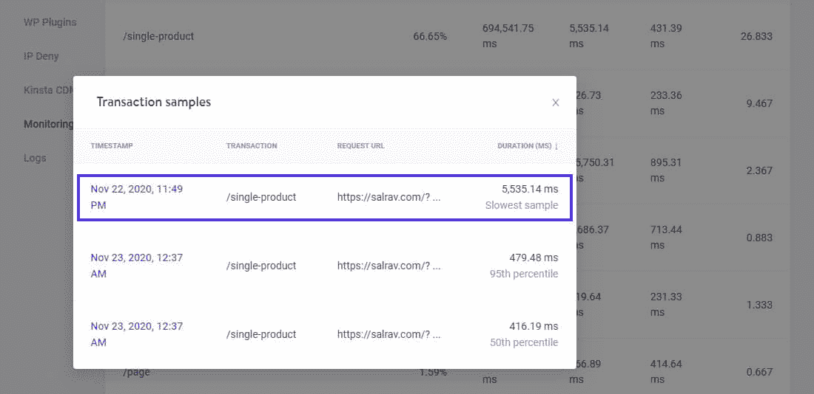

Transaction samples of the slowest transaction.

这里，查看最慢的事务样本，因为其持续时间为 **5，535.14 ms** (或 5 秒以上)。这远远超过了预期的响应时间。让我们单击这个事务示例来更深入地了解它。

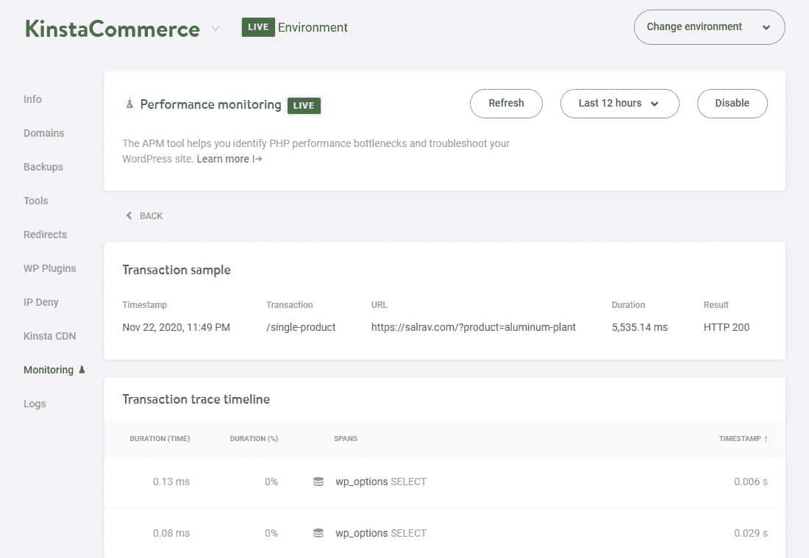

Transaction sample details in Kinsta APM.

现在您将看到这个示例的**事务跟踪时间线**。它将列出该事务中发生的所有过程的时间戳细节。

向下滚动时间线，找到最慢的跨度。

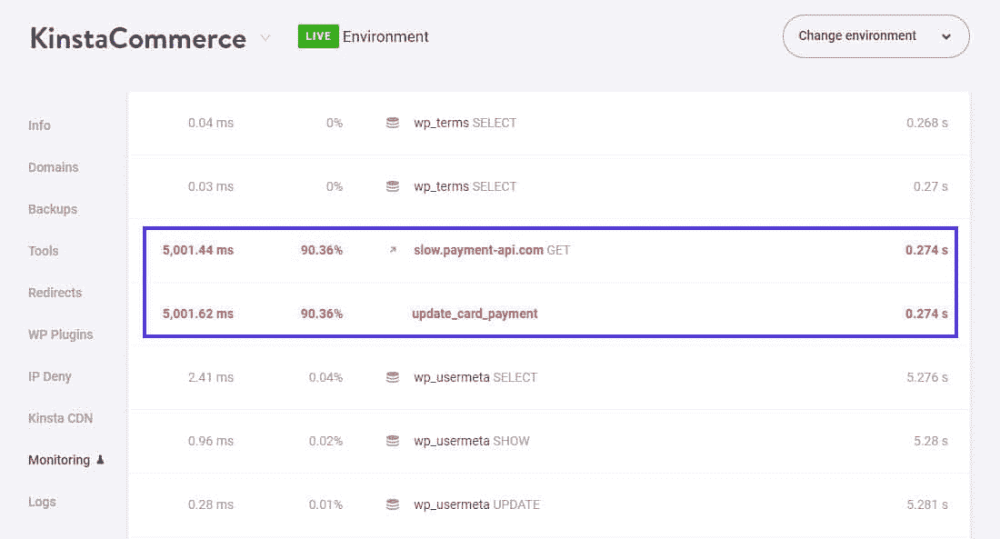

Finding the slowest spans in the transaction trace timeline.

金斯塔 APM 强调跨度，需要你最大的关注与红色。

这里的跨度是**slow.payment-api.com**和**更新 _ 卡 _ 支付**。单击这两个跨度，查看它们的详细概述以及完整的堆栈跟踪和其他相关信息。

## 注册订阅时事通讯

### 想知道我们是怎么让流量增长超过 1000%的吗？

加入 20，000 多名获得我们每周时事通讯和内部消息的人的行列吧！

[Subscribe Now](#newsletter)

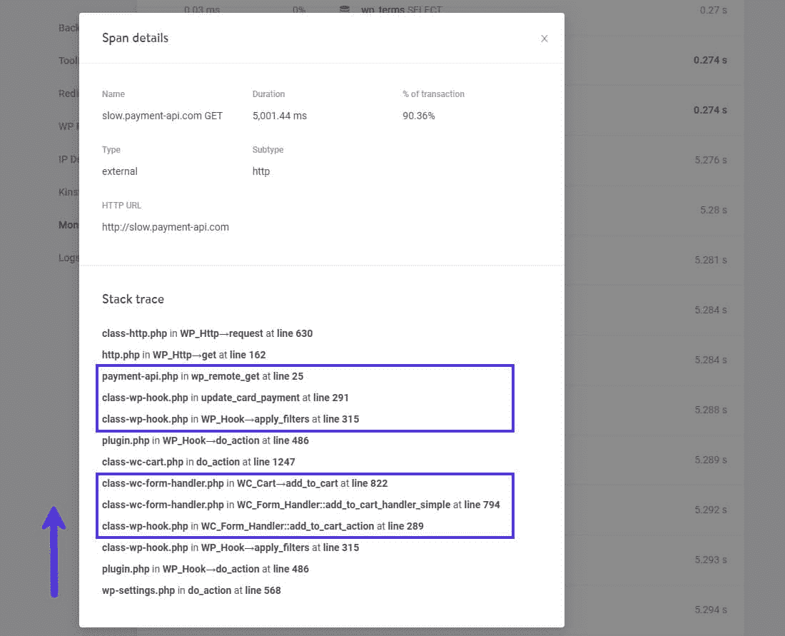

‘Span details’ and ‘Stack trace’ in Kinsta APM.

通过查看 **Span details** 部分，您可以推断这是一个外部 [HTTP 请求](https://kinsta.com/blog/make-fewer-http-requests/)。

**堆栈跟踪**部分帮助您识别发出这个 HTTP 请求所涉及的所有进程。这里我们可以看到**WC _ Form _ Handler::add _ to _ cart _ action**被占用。再往上，我们看到它还涉及一个名为 payment-api.php**的非核心 WordPress 脚本。**

把这些记下来作为证据。然而，我们还需要调查一个跨度。

让我们来看看关于它的细节。

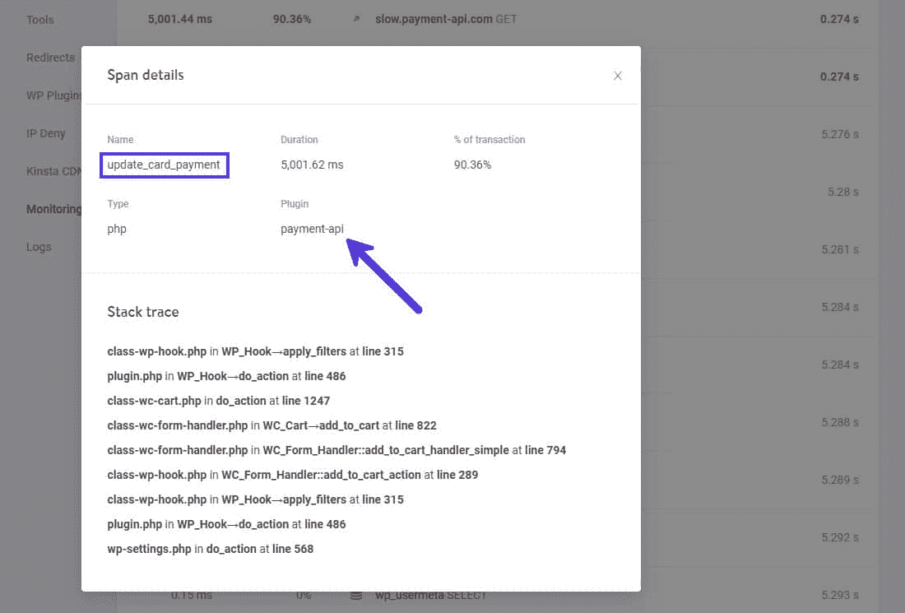

‘Span details’ for a PHP script run by a plugin.

Kinsta APM 在这里最闪耀。它深入研究了与这个跨度相关的所有过程，然后给出了一些上下文。你可以看到这是一个名为 **update_card_payment** 的 PHP 脚本/函数，位于 **payment-api** 插件内。

现在，您已经收集了足够的证据，可以对从哪里开始故障诊断过程做出合理的判断。

我会通过查看 **payment-api** 插件，特别是一个名为 **update_card_payment** 的 PHP 脚本或函数来进行诊断。

如果你或你的员工没有技术专长来解决这些问题，你可以[雇佣一个 WordPress 开发者](https://kinsta.com/blog/hire-wordpress-developer/)来研究它们。

接下来，我会联系插件作者，查看他们的支付 API，因为它的响应速度非常慢。Kinsta APM 可以引导您快速识别性能问题的根本原因。你用这些知识做什么取决于你自己！

### 信息

在大多数情况下，解决由 Kinsta APM 工具识别的性能相关问题不在我们的支持范围之内。如果你在优化你的 WordPress 网站方面需要额外的帮助，我们建议联系我们的[合作伙伴](https://kinsta.com/partners/)。

### 2.WooCommerce APM 示例:慢速 WooCommerce 管理仪表板

在线商店的后端性能与其前端性能一样重要。虽然缓慢的 WooCommerce admin dashboard 会对你的工作效率产生负面影响，但更快的后端可以提高你管理日常任务的效率，以及你对客户订单的响应速度。

拥有一个高效的 WooCommerce 仪表盘还能让你为你的网上商店的成功做更多重要的事情，比如数字营销。

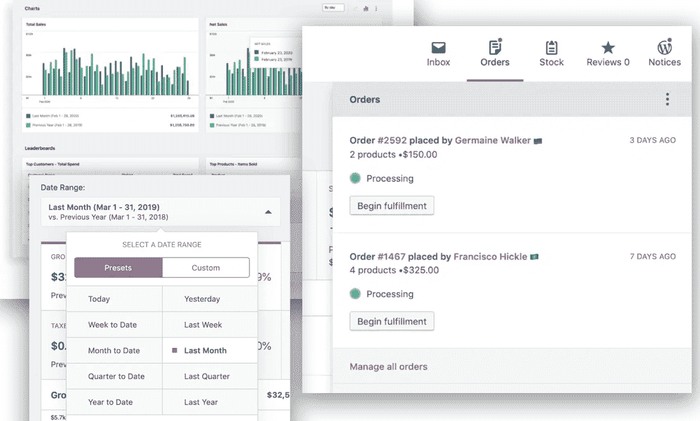

WooCommerce 4.0 introduced a streamlined dashboard.

理想情况下，[后端优化从前端优化开始](https://kinsta.com/blog/speed-up-woocommerce/#frontend-optimizations-first-backend-optimizations-second)，因为在大多数情况下，加速前端也会修复后端的性能问题。有了 Kinsta APM，您不再需要像这样依靠猜测。您将看到整个站点的准确性能数据，帮助您修复任何性能问题。

在本例中，管理员和商店经理的管理仪表板运行缓慢。这对于打理网店的日常运营并不理想。

让我们启动 Kinsta APM，看看有什么问题。

启用 Kinsta APM 后，我等待了 15 分钟以上才开始研究性能数据。在等待的时候，我像往常一样使用 WooCommerce 后端。

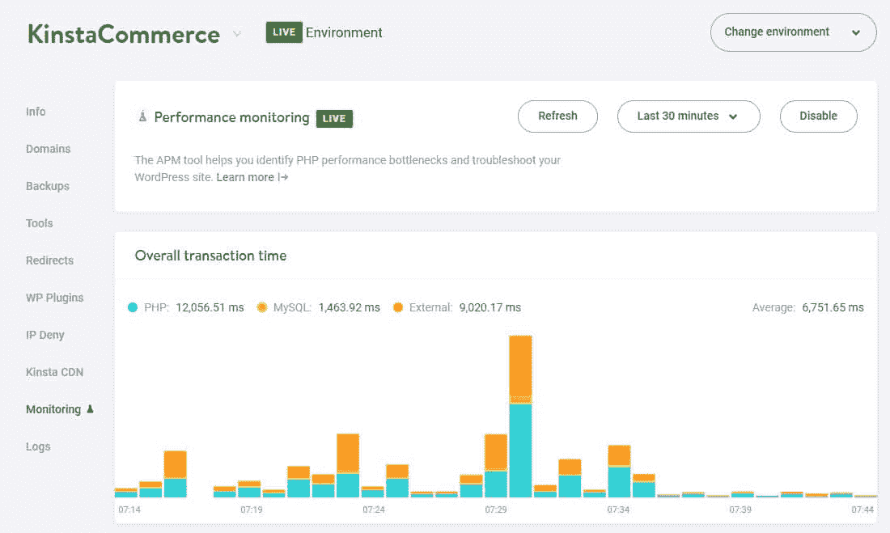

Performance metrics in Kinsta APM’s main dashboard screen.

**总事务时间**图表表明 PHP 进程占用的时间最多，其次是外部调用。

查看**最慢事务**表会让我们更好地了解哪些请求占用了大部分时间。

Finding the slowest transactions in Kinsta APM.

从上面的图表可以清楚地看出，两个事务占用了大部分时间: **/wp-admin/admin-ajax.php** 和 **/wp-admin** 。

需要一个给你带来竞争优势的托管解决方案吗？Kinsta 为您提供了令人难以置信的速度、一流的安全性和自动伸缩功能。[查看我们的计划](https://kinsta.com/plans/?in-article-cta)

高管理-Ajax 使用率是 WordPress 网站所有者面临的最常见的性能问题之一。让我们进一步调查这个交易。

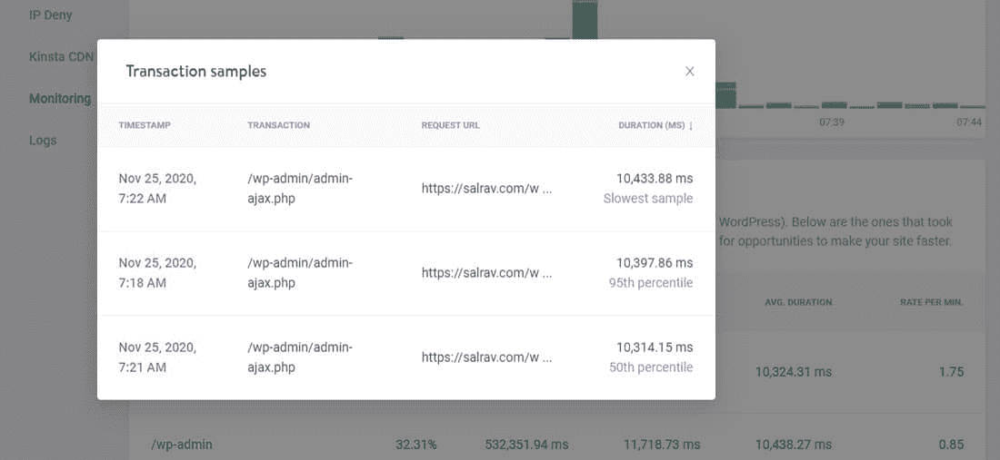

Transaction samples for admin-ajax.php requests.

所有的**admin-ajax.php**交易样本的持续时间几乎相同。超过 10 秒的事务持续时间是异常高的。

让我们看看它最慢的样本。

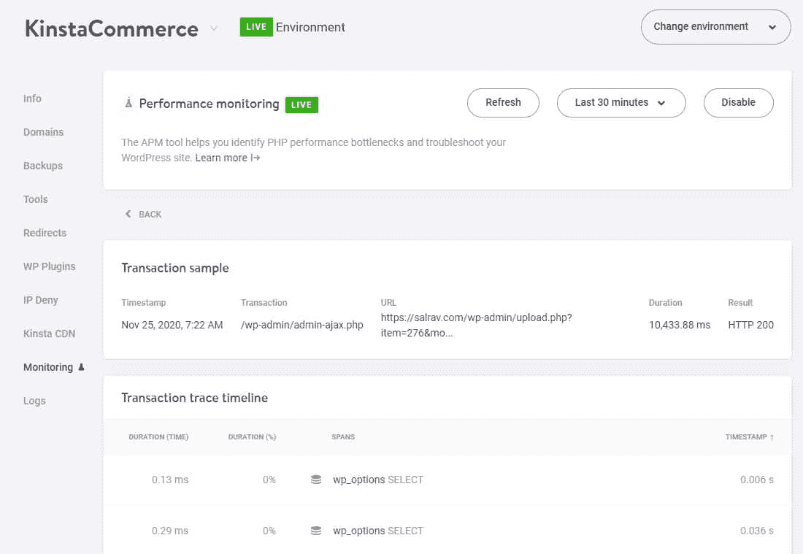

The slowest transaction sample for the admin-ajax.php request.

向下滚动**事务跟踪时间线**以找到感兴趣的跨度。在大多数情况下，Kinsta APM 会突出显示它们。

然而，情况并非总是如此，就像这个例子:

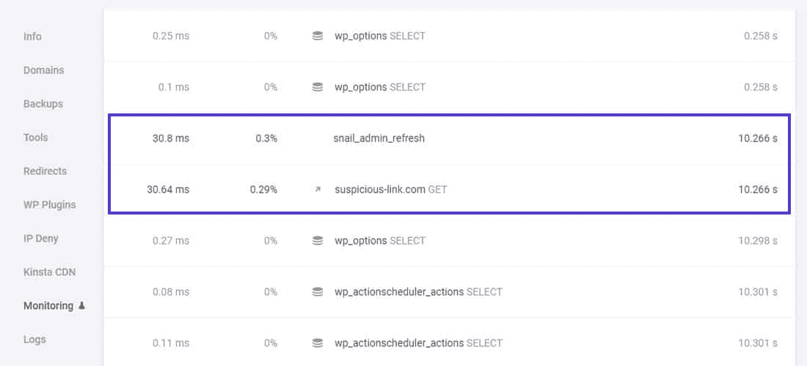

Finding the slowest spans in the transaction trace timeline.

可以观察到两个持续时间异常高的跨度: **snail_admin_refresh** PHP 进程和【suspicious-link.com】T2 GET 外部 HTTP 请求。

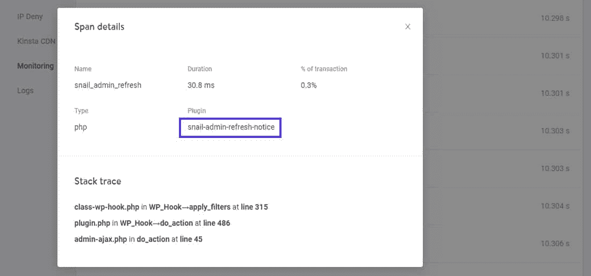

Examining the slowest span’s details in Kinsta APM.

检查 span 细节将把您指向运行这个 PHP 进程的插件。这里是一个名为**蜗牛-管理-刷新-通知**的插件。我写它是为了在 WordPress 仪表盘中输出一个可怕的通知，就像[一些流行的 WordPress 插件](https://www.matteoduo.com/upselling-advertising-crossselling-wordpress-org-dashboard/)。

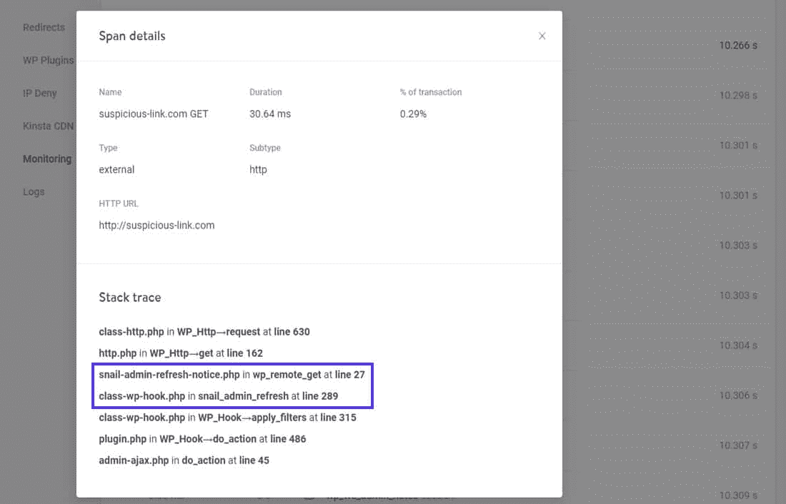

Inspecting the stack trace on another slow span.

查看**suspicious-link.com 获得** span 的**栈跟踪**，你可以发现它与同一个插件有关。

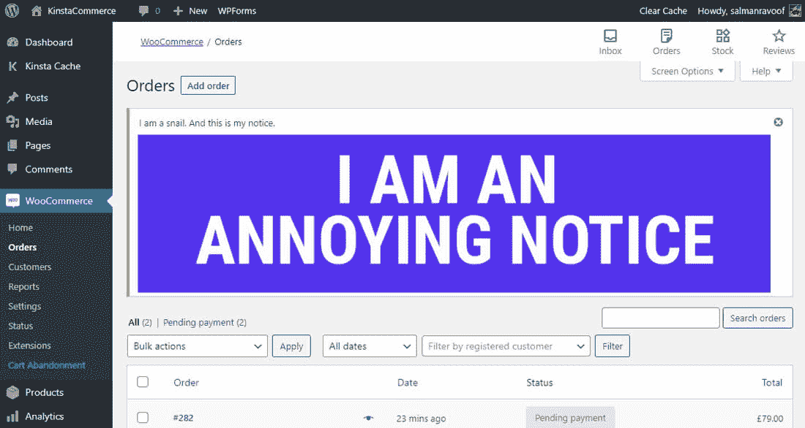

The annoying WordPress admin notice.

在这里，经济放缓的原因直接表现在脸上。然而，情况并非总是如此。如果多个用户同时使用 WooCommerce dashboard，他们会对服务器资源造成更大的负担。这甚至可能导致某些用户无法访问仪表板。

通过帮助您快速确定任何性能问题的根本原因，Kinsta APM 使您的 WooCommerce 仪表板始终保持最佳性能！

### 3.WooCommerce APM 示例:慢速商店和产品页面

用户不能等待缓慢的页面加载，尤其是当它是一个商店或产品页面。根据[谷歌的可用性研究](https://www.thinkwithgoogle.com/intl/en-aunz/marketing-strategies/app-and-mobile/mobile-page-speed-load-time/)，用户会在页面响应时间超过 2.5 秒时放弃该页面。

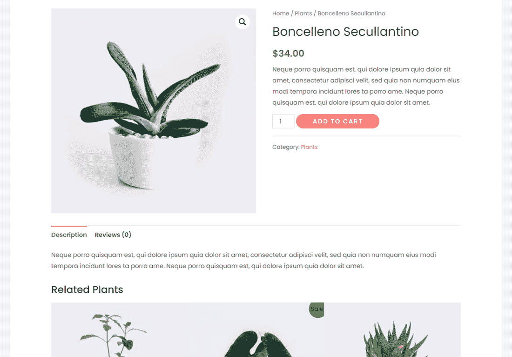

One of the product pages in the test WooCommerce site.

WooCommerce 商店或产品页面加载缓慢可能有多种原因:

*   商店页面可能一次加载太多产品。
*   由于未经优化的图像、脚本、第三方请求等原因，产品页面可能会很大。
*   商店或产品页面可能会在每个请求页面上加载许多不可缓存的动态内容。
*   插件或主题可以在每个产品页面上插入自定义脚本，以实现额外的功能(例如，社交共享计数器、相关产品)。

在这个例子中，我们将诊断我们的测试网站 WooCommerce 上缓慢的产品页面。他们花了异常长的时间来回应，这通常对转化率是灾难性的。

让我们启用 Kinsta APM 并尝试加载一些产品页面。

我将测试他们至少 5 分钟，然后看看网站的性能指标。

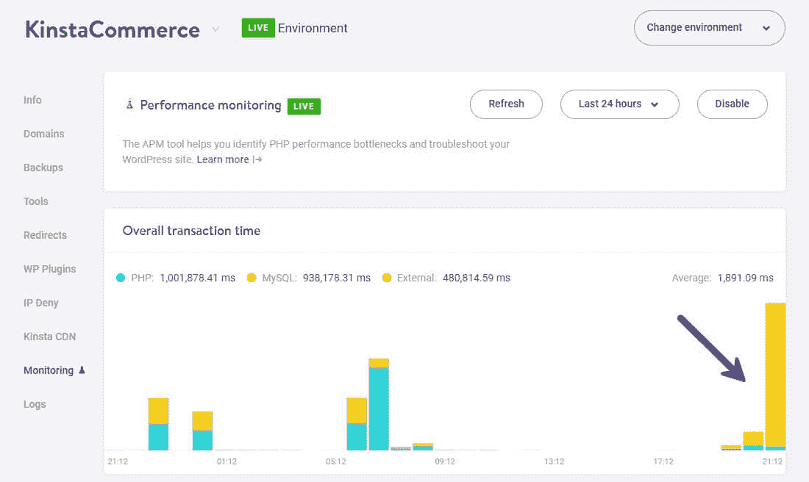

Notice the sharp increase in MySQL-related transaction time.

从**总事务时间**图表中，您可以观察到 MySQL 查询所用时间的急剧上升。从时间戳来看，都是最近的。

让我们选择一个较短的持续时间来关注这些最近的交易。这将从我们当前的诊断中排除所有旧的性能指标。

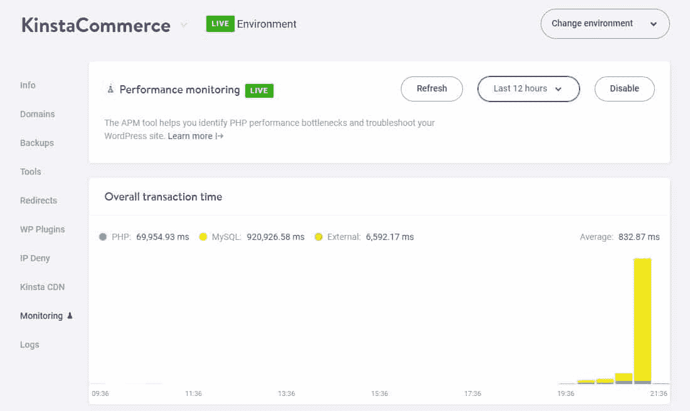

Choosing a shorter duration in Kinsta APM.

现在让我们查看一下**最慢的事务**表，看看哪些请求占用了最多的时间。

Requests for individual product pages is the slowest.

不出所料，**/单一产品**交易占据了总持续时间的大部分。当用户访问任何一个产品页面时，WooCommerce 就会触发这个请求。

它的最大持续时间( **136，417.63 ms** )特别高。

我们去看看。

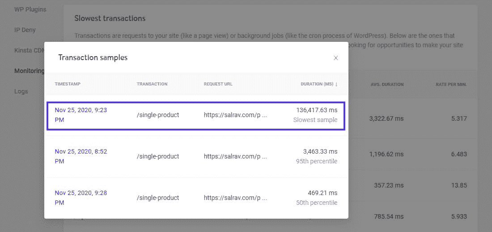

Transaction samples for the individual product page requests.

我将点击最慢的样本来检查它。滚动浏览它的**事务跟踪时间线**会让我们更好地了解是什么导致了这个性能问题。

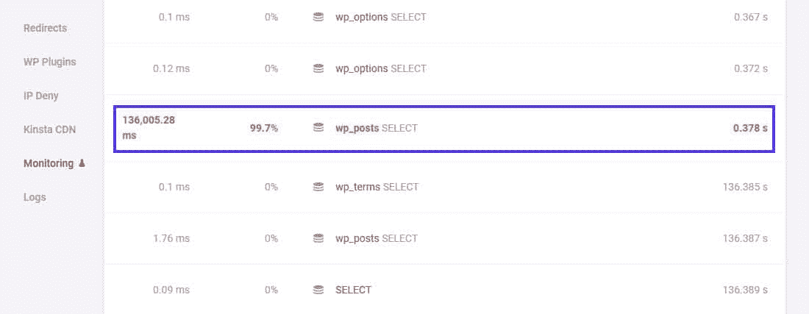

The troublesome span is highlighted in bold red.

您可以看到，Kinsta APM 用鲜红色突出显示了征税跨度。看它的图标，您可以推断它是一个数据库查询。

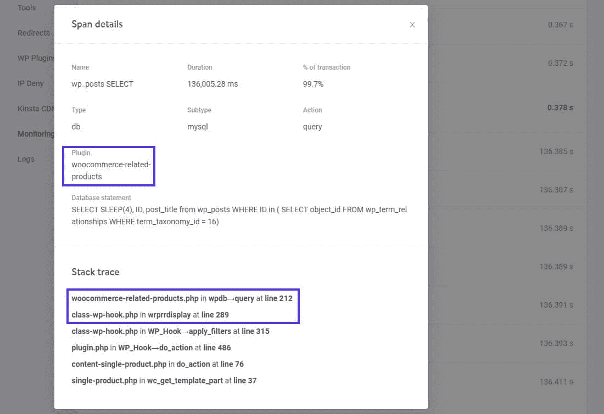

‘Span details’ and ‘Stack trace’ of the slow database query.

Kinsta APM 处理这个 span 的堆栈跟踪，并识别生成这个繁重数据库查询的插件。

在这里，它是一个名为**woo commerce-related-products**的插件。这是一个 [WooCommerce 扩展](https://kinsta.com/blog/woocommerce-extensions/)，它基于各种标准为每个单独的产品页面动态生成一个相关产品的滑块。

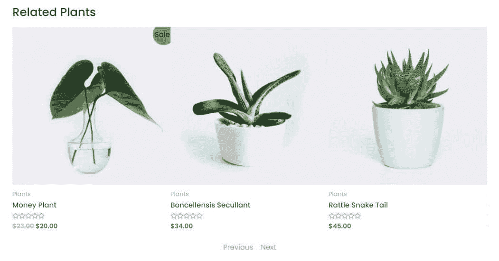

The ‘related products’ slider on a product page.

在 **Span details** 下，还可以看到我注入到这个 WooCommerce 扩展中的数据库语句来模拟这个性能问题。

对于销售数百(或数千)种产品的大型 WooCommerce 商店，引入新功能或更新现有功能可能会导致意外的性能问题。像上面这样的问题很常见。Kinsta APM 使诊断和修复它们变得更加容易。

[沮丧。烦恼。失望。如果您的电子商务网站有性能问题，客户可能会感觉到的所有事情。😬利用我们内置的 APM 功能提前解决问题&尽快开始监控您的站点✅ 点击推文](https://twitter.com/intent/tweet?url=https%3A%2F%2Fkinsta.com%2Fblog%2Fwoocommerce-apm%2F&via=kinsta&text=Frustration.+Annoyance.+Disappointment.+All+things+customers+could+feel+if+your+ecommerce+site+has+performance+issues.+%F0%9F%98%AC+Get+in+front+of+the+problem+with+our+built-in+APM+feature+%26amp%3B+start+monitoring+your+site+ASAP+%E2%9C%85&hashtags=APM%2CEcommerceTips)

## 摘要

我们生活在一个快节奏的世界里，你几乎可以全天候访问任何东西。无论是小企业还是大企业，WordPress 和 WooCommerce 都让在网上卖东西变得超级简单。而且你可以找到两者的快速主题([快速 WordPress 主题](https://kinsta.com/blog/fastest-wordpress-theme/)，[快速 WooCommerce 主题](https://kinsta.com/blog/fastest-woocommerce-theme/))。

用户体验是网店成功的关键，主要取决于它的表现。然而，正如本文所示，监控 WooCommerce 商店的性能是很有挑战性的。

在本文中，您了解了如何使用 Kinsta APM 来解决 WooCommerce 的性能问题，比如长时间的 API 调用、缓慢的仪表板和缓慢的数据库查询。通过帮助您消除猜测，Kinsta APM 使您能够跟踪性能问题，并以最小的中断快速解决它们。

今天就与 Kinsta APM 开展业务，在当今竞争激烈的市场中获得显著优势！

* * *

让你所有的[应用程序](https://kinsta.com/application-hosting/)、[数据库](https://kinsta.com/database-hosting/)和 [WordPress 网站](https://kinsta.com/wordpress-hosting/)在线并在一个屋檐下。我们功能丰富的高性能云平台包括:

*   在 MyKinsta 仪表盘中轻松设置和管理
*   24/7 专家支持
*   最好的谷歌云平台硬件和网络，由 Kubernetes 提供最大的可扩展性
*   面向速度和安全性的企业级 Cloudflare 集成
*   全球受众覆盖全球多达 35 个数据中心和 275 多个 pop

在第一个月使用托管的[应用程序或托管](https://kinsta.com/application-hosting/)的[数据库，您可以享受 20 美元的优惠，亲自测试一下。探索我们的](https://kinsta.com/database-hosting/)[计划](https://kinsta.com/plans/)或[与销售人员交谈](https://kinsta.com/contact-us/)以找到最适合您的方式。**