# 加速你的网络商店的 17 种有效方法(2022 终极指南)

> 原文：<https://kinsta.com/blog/speed-up-woocommerce/>

对于电子商务网站来说，速度就是金钱。你的网站加载越快，购物体验就越好。更好的用户体验转化为更好的 SEO、更高的 ROI 和更满意的客户。这最终会带来更大的收入和利润。

如今，购物者期望获得高分辨率的图像和视频、实时聊天、用户评论、实时库存、个性化以及大量其他动态工具。

网上购物者的注意力持续时间很短。因此，如果你没有正确地执行这些功能，他们期望的更快更流畅的购买体验的所有功能都是减慢你的电子商务网站速度的功能。

WooCommerce 是世界上最受欢迎的电子商务平台，可以按照你的要求自由使用和调整。带有突出显示 PoPs 的 Kinsta 罐" width = " 800 " height = " 500 "/>带有 POPs 的 Kinsta 罐

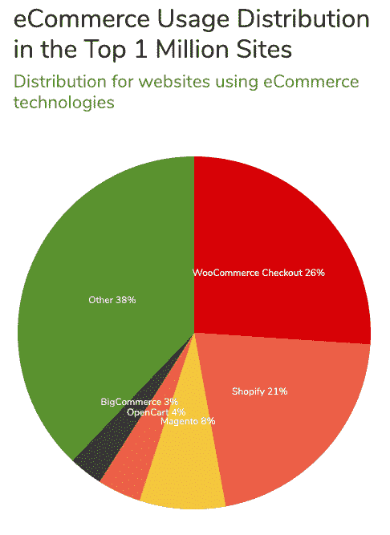

WooCommerce leads the ecommerce pack (Image source: BuiltWith)\

迄今为止，WooCommerce 已经被**下载了 8800 万次**。截至目前，它已经在[超过**500 万**网站](https://kinsta.com/wordpress-market-share/#woocommerce)上使用。

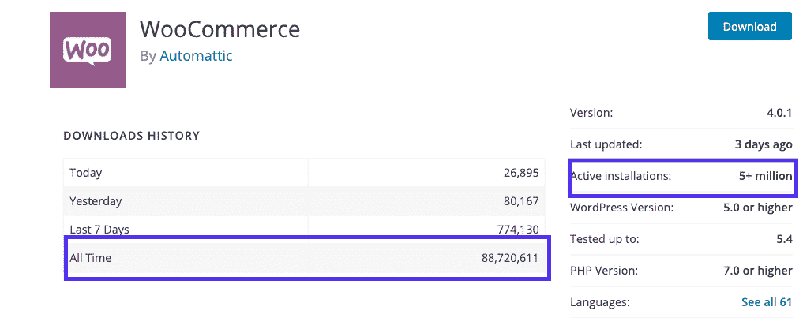

WooCommerce plugin downloads and usage stats

与其他[流行的购物平台](https://kinsta.com/blog/wordpress-ecommerce-plugins/)不同，如果你使用 WooCommerce，你不必向它支付一定比例的收入。不过，运营一家 WooCommerce 支持的商店会产生一些管理费用。

但是有一个条件！由于 WooCommerce 是免费的，只有有限的支持，你有责任保持它的最佳状态。好消息是，如果你知道自己在做什么，就很容易搞定！

想学习如何可靠地加速你的 WooCommerce 网站吗？

> Kinsta 把我宠坏了，所以我现在要求每个供应商都提供这样的服务。我们还试图通过我们的 SaaS 工具支持达到这一水平。
> 
> <footer class="wp-block-kinsta-client-quote__footer">
> 
> 
> 
> <cite class="wp-block-kinsta-client-quote__cite">Suganthan Mohanadasan from @Suganthanmn</cite></footer>

[View plans](https://kinsta.com/plans/)

这本指南是给你的！

请记住，你的最终目标是增加商店的收入。所以一定要下载我们的免费电子书**， [10 种提高你的网络商务产品页面转化率的方法](https://kinsta.com/ebooks/wordpress/ecommerce-conversion-rate/?utm_source=Blog&utm_medium=Link&utm_campaign=WooCommerce+Conversions+Ebook)。**

 **## 为什么速度对网上商店很重要

第一印象很重要，速度是用户注意到你网站的第一件事。在谷歌的一项研究中， [53%的移动用户离开了一个加载时间超过 **3 秒**的网站](https://www.thinkwithgoogle.com/marketing-resources/data-measurement/mobile-page-speed-new-industry-benchmarks/)。

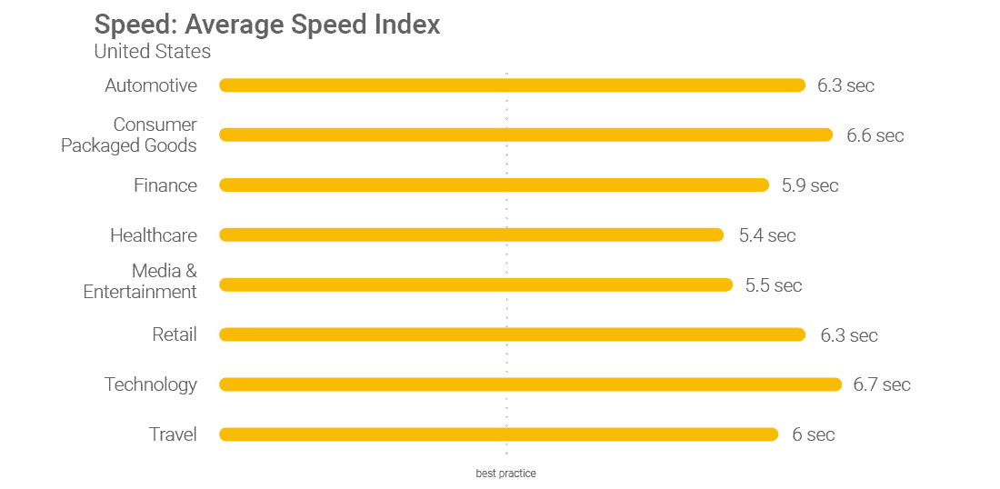

3 seconds is best practice (Image source: Think with Google)

> “ ***2 秒*** *是电子商务网站可接受性的门槛。在谷歌，我们的目标是不到半秒。*"
> –[麦乐·欧耶，谷歌技术主管](https://youtu.be/OpMfx_Zie2g?t=567)

在另一项全球调查中， **80%** 的用户表示，他们发现一个[下载缓慢的网站比一个暂时关闭的](https://kinsta.com/learn/page-speed/#slow-how-slow)网站更令人沮丧。同一项研究还发现，如果一个网站加载速度太慢，73%的 T4 用户会转向竞争对手的网站。

即使页面响应时间延迟 100 毫秒，也会损害用户体验和在线收入。[根据 Akamai](https://www.akamai.com/uk/en/about/news/press/2017-press/akamai-releases-spring-2017-state-of-online-retail-performance-report.jsp) 的说法， **100 毫秒**的延迟影响转换率 **7%** ，而 **2 秒**的延迟增加跳出率高达 **103%** 。

如果你的网站每天产生 **$1000** 的收入，页面加载时间 100 毫秒的延迟可能会让你每年损失**25，550** 美元的销售额。

生意越大，跌得越大。例如，亚马逊预计，如果它的页面加载速度慢一秒钟，每年就会损失 16 亿美元的收入。

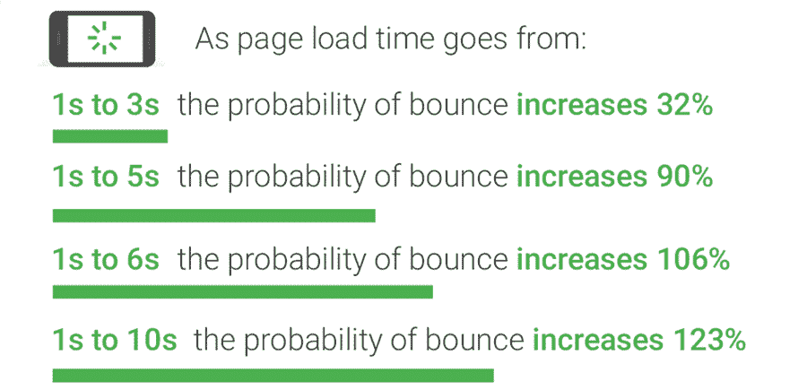

Page load time is vital (Image source: Think with Google)

上述数据表明，如果你的网站需要 6 秒或更长的时间来加载，那么你失去的用户是你的网站在 3 秒内加载的两倍。

除了用户体验，你的网站速度也会影响搜索引擎优化。网站速度和性能是谷歌网站排名算法的主要因素。

谷歌已经转向移动优先索引，超过 50%的页面显示在搜索结果中。尽管如此，来自 HTTPArchive.org 的[数据显示，运行](https://httparchive.org/reports/loading-speed?start=earliest&end=latest&view=list) [WordPress](https://kinsta.com/knowledgebase/what-is-wordpress/) 的移动网站的平均加载时间在去年有所恶化。

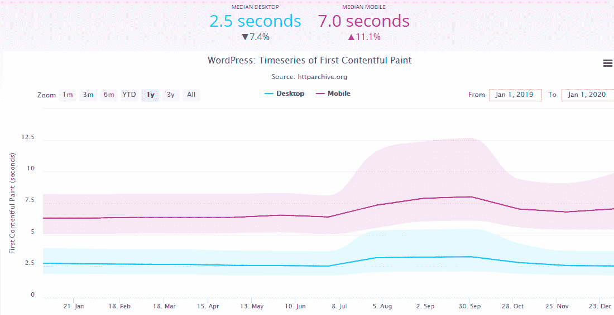

How top WordPress sites perform (Image source: HTTPArchive.org)

在流量高峰期，比如[网络星期一和黑色星期五](https://kinsta.com/blog/ecommerce-strategies/)，让你的网站尽可能快地运行更是至关重要。随着优惠的不断涌现，确保购物者不会放弃你的网站对完成销售至关重要。

鉴于这些统计数据，加快你的 WooCommerce 商店可以给你一个明显的竞争优势。

## 测量网络商店的速度

你不能衡量的，你就不能改进！

现在你已经理解了为什么速度对你的 WooCommerce 商店很重要，是时候学习如何衡量它了。当你试图[加速你的 WordPress 站点](https://kinsta.com/learn/speed-up-wordpress/)时，知道如何衡量改进是很重要的。

一个[网站速度测试](https://kinsta.com/blog/website-speed-test/)是测试你的网上商店的[响应能力](https://kinsta.com/blog/responsive-web-design/)的完美工具。但是如果你没有正确地做到这一点，当你的网站变得更快的时候，你的网站在你看来可能会变得更慢。

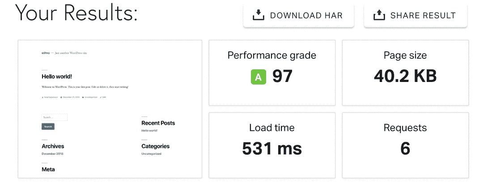

A website speed test report (Image source: Pingdom)

我们建议你开始使用这些网站速度测试工具中的一个: [WebPagetest](https://kinsta.com/blog/ttfb/#measure-ttfb-with-webpagetest) 、 [Pingdom](https://kinsta.com/blog/pingdom-speed-test/) 、 [Google PageSpeed Insights](https://kinsta.com/blog/google-pagespeed-insights/) 或 [GTMetrix](https://kinsta.com/blog/gtmetrix-speed-test/) 。

你也可以使用免费的 WordPress 插件[查询监视器](https://kinsta.com/blog/query-monitor/)来查明表现不佳的主题、插件和功能。它帮助你调试低效的数据库查询、臃肿的函数、PHP 错误、HTTP API 调用等。

没有一个速度测试工具是完美的，但是选择一个并坚持下去。以后你可以朝着其他的方向努力。

Gary Illyes, Webmaster Trends Analyst, Google

实际绩效[和感知绩效](https://blog.teamtreehouse.com/perceived-performance)之间存在差异。用户体验比驱动网站的技术魔法更重要。

因此，使用下面提到的技术来增强你网站的整体用户体验，而不仅仅是获得一个高速的分数。

## 如何加速电子商务

速度测试报告会给你一个可行的计划来优化你的慢速 WooCommerce 网站。激动吗？我们开始吧！

### 1.优化 WooCommerce 设置以提高性能

让我们从优化 [WooCommerce 插件](https://kinsta.com/blog/woocommerce-plugins/)的设置开始。

首先，[更改你的登录页面网址](https://kinsta.com/blog/wordpress-login-url/#change-login-page)。默认情况下，每个 WordPress 站点的登录网址都是【domain.com/wp-admin/】*。虽然这很容易记住，但它带来了一个主要问题:每个人都知道它，包括机器人和黑客。*

 *将您的登录 URL 更改为独特的名称将保护您免受恶意行为者的暴力攻击。它还会帮助你对抗限速 HTTP [错误](https://kinsta.com/knowledgebase/429-too-many-requests/) [比如 429 过多请求](https://kinsta.com/knowledgebase/429-too-many-requests/)。

免费插件如 [WPS 隐藏登录](https://wordpress.org/plugins/wps-hide-login/)和[重命名 wp-login.php](https://wordpress.org/plugins/rename-wp-login/)让这个任务变得超级简单。

如果你的电子商务网站也有一个博客，你可以限制你博客上的文章数量。WordPress 默认设置这个限制为 10 篇文章，但是你可以设置一个更低的限制。

虽然这可能看起来微不足道，但是如果你运行一个高流量的博客，性能节省就会增加(这里是如何[增加你的网站流量](https://kinsta.com/blog/how-to-drive-traffic-to-your-website/))。你可以在 **WordPress Dashboard →设置→阅读**下找到这个选项。

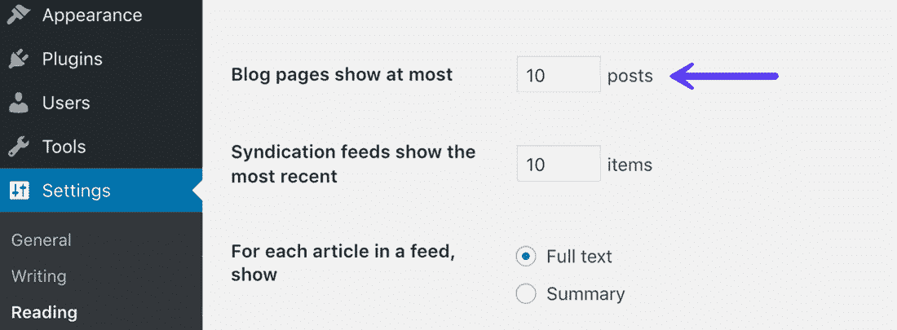

Limit the number of posts in your blog feed

接下来，在您的网站上禁用 pingbacks。它们通常会生成毫无价值的垃圾邮件。你的网站产生的查询越少越好。

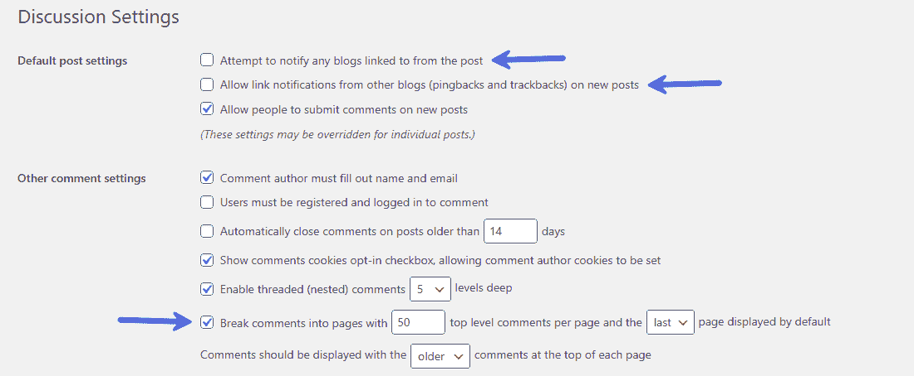

Optimize the discussion settings

如果你的帖子或页面上有很多用户评论，那么 WordPress 也会给你一个选项，把它们分成小块。同样的设置也适用于分解你的产品页面上的[评论](https://kinsta.com/blog/best-wordpress-review-plugins/)。

保持这个数字在 10 到 20 之间，以优化您的产品页面加载时间。

如果你不喜欢商店里有商品评论，你可以在 **WooCommerce → Settings** 下禁用它们。这将有助于加快您的网站，因为它消除了加载一些脚本和部件。

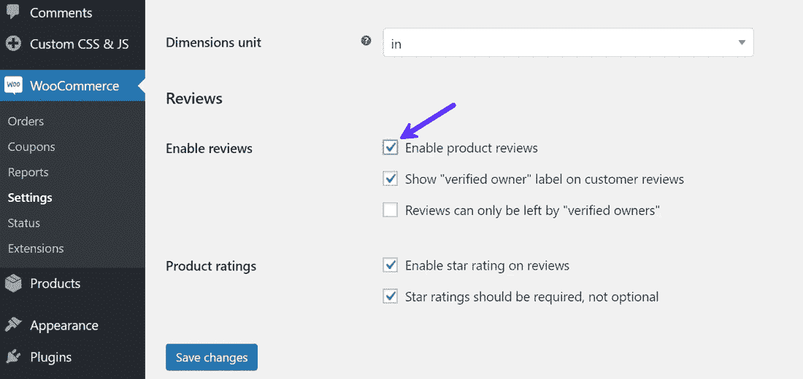

Disable product reviews if you don’t need them

最后，从你的网站上移除任何不必要/过时的主题和插件。你安装的主题和插件越少，维护它们和[解决性能问题](https://kinsta.com/blog/debugging-wordpress-performance/)就越容易。

### 2.获得快速 WooCommerce 主题

使用正确的 WooCommerce 主题很重要。那里有成千上万的主题，所以选择最适合你的*永远是一个挑战。*

 *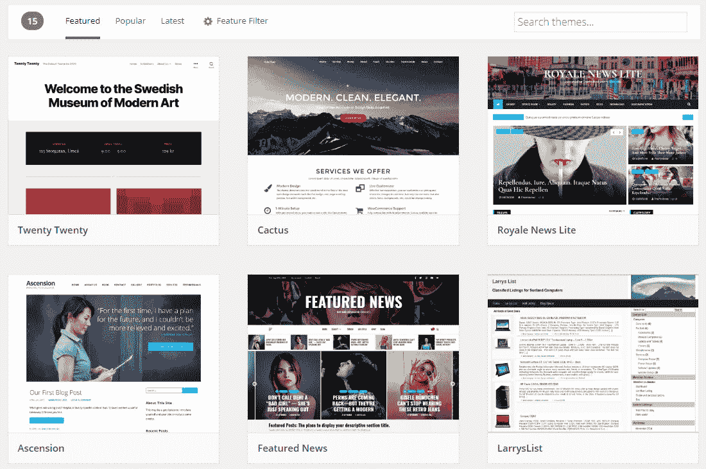

Featured themes on WordPress.org

一个带有惊人内置特性的美丽主题在纸上听起来可能很棒，但在实际使用中可能会失败。对于一个电子商务网站，你需要确保它与 WooCommerce 完全兼容。

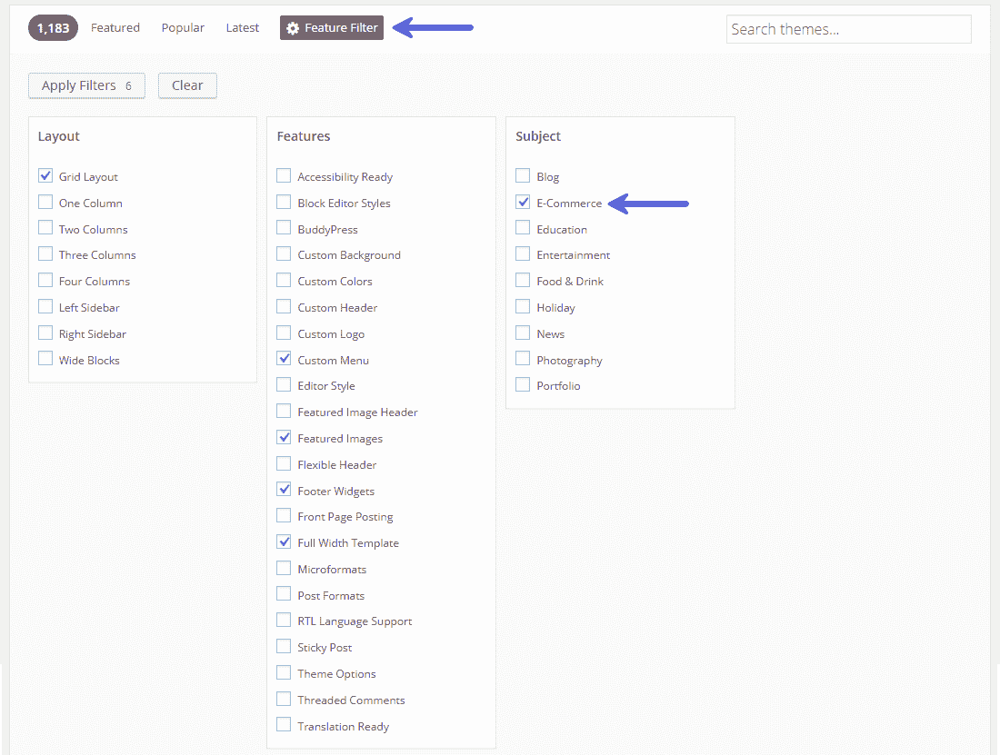

Filter down your ecommerce theme search

WP Rocket 测试了一系列流行的 WooCommerce 主题的速度，得出了以下结果。

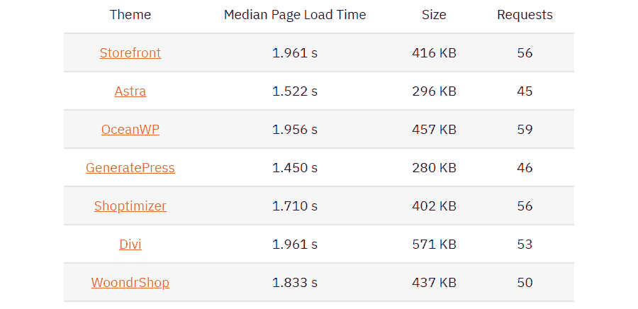

Opt for a fast WooCommerce theme (Image source: WP Rocket)

正如在 [WordPress 加速文章](https://kinsta.com/learn/speed-up-wordpress/#wordpress-theme)中提到的，Astra、OceanWP 和 GeneratePress 也是 Kinsta 的最爱。它们是超快速、轻量级的 WordPress 主题。你会在本教程中找到 10+个额外的非常[快速的主题。](https://kinsta.com/blog/fastest-wordpress-theme/)

当与 Elementor 或 Beaver Builder 等页面构建器配合使用时，它们可以帮助你创建几乎任何网站。

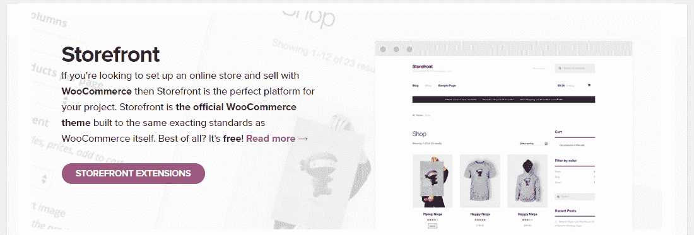

Storefront is WooCommerce’s official theme

[店面](https://woocommerce.com/storefront/)是 WooCommerce 提供的免费主题，而 [Shoptimizer](https://www.commercegurus.com/product/shoptimizer/) 、 [Divi](https://www.elegantthemes.com/gallery/divi/) 和 [WoondrShop](https://www.proteusthemes.com/wordpress-themes/woondershop/) 是高级主题。因为这些主题是为运行一个电子商务网站而构建的，所以没有必要安装第三方插件来获得你想要的所有功能。

如果你预算不足，从免费主题开始[并在以后](https://kinsta.com/blog/wordpress-free-vs-paid-themes/)升级到高级解决方案是完全可以的。

我们建议留下页面生成器以减少膨胀。相反，选择一个支持 [WordPress 的块编辑器 Gutenberg](https://kinsta.com/blog/gutenberg-wordpress-editor/) 的主题。

为了决定主题，我们建议你列出你在网上商店需要的所有功能。然后选择一个涵盖你大部分功能需求的主题。这将帮助你减少对臃肿的多功能主题和第三方插件的依赖。

这就引出了下一个建议。

### 3.少用插件和 WooCommerce 扩展

WordPress 的库中有 **54，000+免费插件**。在野外甚至有更多的高级插件。因此，很容易忘乎所以，安装几十个。

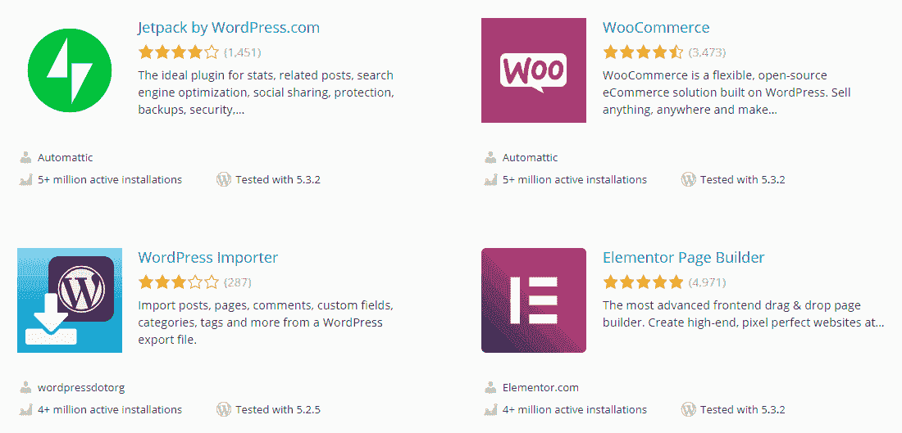

There’s a plugin for almost anything

许多流行的插件，尤其是与性能和安全相关的插件，[在某些主机环境中不能很好地工作](https://kinsta.com/knowledgebase/banned-plugins/)。

如果你觉得很难决定要安装哪个插件，那就去看看 Kinsta 的[精选列表中各种用途的最佳 WordPress 插件](https://kinsta.com/best-wordpress-plugins/)。从搜索引擎优化到图像压缩，你一定会在其中发现一些瑰宝。

WooCommerce 的功能可以通过其广泛的免费和高级 WooCommerce 扩展来扩展。它们的工作方式和插件一样。

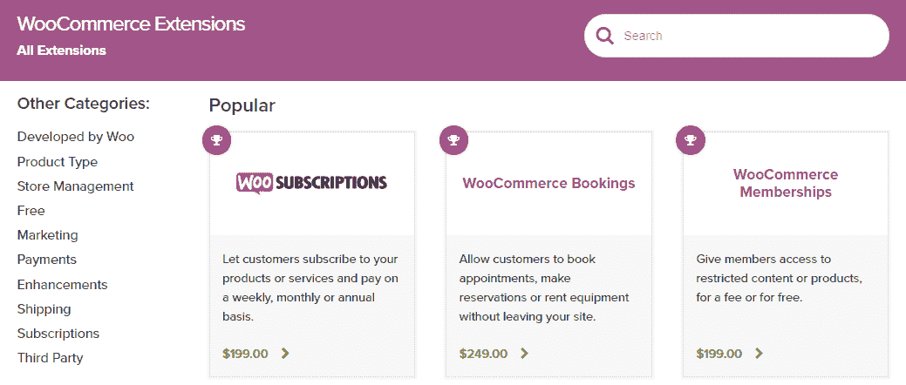

WooCommerce extensions enhance your store’s functionality

与普遍的看法相反，你安装的插件数量并不总是导致性能问题。但是这只有在插件是用最佳编码实践构建的情况下才成立。

当插件太多的时候，检查你安装的每个插件的质量就成了一件麻烦的事情。这是考虑到你有技能和专业知识来彻底审查他们。

少数插件甚至会与其他插件产生冲突。当你的网站上有几十个插件时，插件冲突发生的概率会成倍增加。

因此，要注意你安装的插件和 WooCommerce 扩展的类型。

### 4.增加 WordPress 内存限制

WordPress 默认为 PHP 分配 32 MB [内存。如果遇到任何崩溃，它会自动尝试将这个限制增加到 40 MB(对于单个站点)或 64 MB(对于多站点)。](https://kinsta.com/knowledgebase/php-memory-limit/)

在大多数情况下，这个[内存限制](https://kinsta.com/knowledgebase/wordpress-memory-limit/)对于一个 WooCommerce 网站来说是不够的。您甚至可能会在仪表板上收到一条错误消息，例如:

"*已耗尽 xxxxxx 字节的允许内存大小"*

建议[将这个限制增加到 256 MB](https://kinsta.com/blog/wordpress-http-error/#increase-php-memory-limit) 。在编辑文件之前，请务必备份文件。万一出错，你可以用原来的文件替换编辑过的文件。

### 信息

Kinsta 的所有计划都设置了 256 MB 的默认内存限制。如果您的站点由我们托管，您应该不会遇到任何与内存相关的问题。了解更多关于我们的[免费迁移](https://kinsta.com/wordpress-migration/)的信息。

### 5.压缩图像并优化交付

图片占据了所有网站页面的大部分，对于电子商务网站来说更是如此。WooCommerce 网站上充斥着产品图片和横幅。

如果你不[优化图片的大小和交付](https://kinsta.com/blog/optimize-images-for-web/)，它们会让你的网站瘫痪🐌

HTTPArchive 跟踪许多流行网页的大小和数量。以下是 2021 年 WordPress 网站的[状态的可视化展示:](https://kinsta.com/blog/wordpress-statistics/)

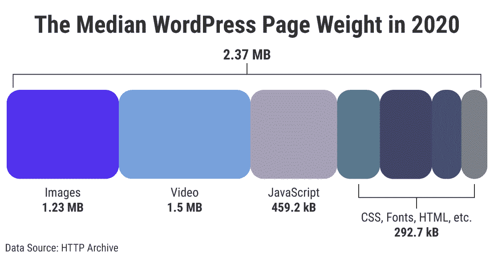

Images are a heavy resource

虽然视频是比图像更重要的资源，但在大多数情况下，它们是按需加载的。因此，它们不会像图像那样影响感知的页面加载速度。

根据 HTTP Archive 的图片报告的 [*状态，通过*](https://httparchive.org/reports/state-of-images?lens=wordpress&start=2016_07_01&end=latest&view=list)*[懒加载隐藏和离屏图片](https://kinsta.com/blog/wordpress-lazy-load/)，每页可以节省 **545 KB** 。*

通过将 JPEG 压缩级别设置为 85 或更低，每页可以进一步节省 40.3 KB。这个指标直接来自谷歌的移动网站速度测试工具[灯塔](https://developers.google.com/web/tools/lighthouse)。

遵循以下 5 条规则来优化你的 WooCommerce 商店(以及整个网络)的图片:

1.  为你的图片选择合适的格式(JPEG，PNG， [SVG](https://kinsta.com/blog/what-is-an-svg-file/) ， [WebP](https://kinsta.com/blog/webp/) )。
2.  使用正确的工具有效地压缩图像。
3.  使用响应图像优化各种设备的交付。
4.  延迟加载屏幕外和隐藏的图像。
5.  将图像交付卸载到[快速 cdn](https://kinsta.com/help/kinsta-cdn/)。

WooCommerce 3.3 [引入了](https://woocommerce.wordpress.com/2017/12/11/wc-3-3-image-size-improvements/)图像大小的改进，如动态缩略图大小调整、模糊图像修复和背景缩略图大小调整。所有这些特性使得使用像[这样的插件为 WooCommerce 相关图片重新生成缩略图](https://kinsta.com/blog/regenerate-thumbnails/#how-to-regenerate-thumbnails-in-wordpress)变得多余。

Customizing WooCommerce’s Product Images (Image source: WooCommerce)

如果您是从全新安装开始，您可以在将图像上传到您的站点之前对其进行压缩。以下是一些热门的在线图像压缩建议:

*   [Compressor.io](https://compressor.io/)
*   [Squoosh.app](https://squoosh.app/)
*   [Shrinkme.app](https://shrinkme.app/)
*   [Kraken.io](https://kraken.io/web-interface)
*   [imagiy。我](https://imagify.io/optimizer/)
*   [TinyJPG](https://tinyjpg.com/) | [TinyPNG](https://tinypng.com/)

Compress images with minimal loss in quality (Image source: Compressor.io)

你的网站上已经有很多图片了吗？然后你可以使用一个 [WordPress 插件来自动优化图片](https://kinsta.com/blog/optimize-images-for-web/#image-optimization-wordpress-plugins)。根据我们的经验，以下是一贯表现最佳的产品:

*   [矮像素](https://wordpress.org/plugins/shortpixel-image-optimiser/)
*   [意象](https://wordpress.org/plugins/imagify/)
*   [reSmush.it](https://wordpress.org/plugins/resmushit-image-optimizer/)
*   [最佳摩尔](https://wordpress.org/plugins/optimole-wp/)

这些插件中的大多数也支持图像的延迟加载。WordPress 核心团队正计划添加[惰性加载图片作为内置特性](https://make.wordpress.org/core/2020/01/29/lazy-loading-images-in-wordpress-core/)。这将利用新的**加载 **< img >** 标签的** HTML 属性。

不过，关于图像优化还有最后一件事。尽可能避免使用图像压缩插件，尤其是那些使用服务器资源来压缩图像的插件。

相反，使用一个将图像压缩任务卸载到外部服务器的服务。或者更好的是，在上传图片到你的网站之前，调整图片的大小并进行压缩。

对于深入的教程，Kinsta 关于针对 web 和性能的[图像优化的文章](https://kinsta.com/blog/optimize-images-for-web/#benefits-of-formatting-images)是一个很好的入门资源。
T3】

### 6.通过 CDN 交付静态资源

内容交付网络(CDN)是一组战略性地分布在世界各地的服务器。这些服务器位置被称为存在点(pop)。

CDN 的主要功能是缓存和交付静态资源，如图像、JavaScript、 [CSS](https://kinsta.com/blog/wordpress-css/) 等。功能更强大的 cdn 还可以托管和传送音频和视频等动态内容。

即使你的网站运行在世界上最快的服务器上，它仍然受到地理位置的限制。一个 [WordPress CDN](https://kinsta.com/blog/wordpress-cdn/) 将减少个人用户和网站资源之间的距离，减少网络延迟和第一字节(TTFB) 的[时间。](https://kinsta.com/blog/ttfb/)

Kinsta CDN with PoPs highlighted

根据请求来自哪里，它会自动分配最近的 CDN PoP 来交付缓存的资源。结果是更快的网站和更好的用户体验。

如果你是 Kinsta 的客户，我们只提供提供谷歌最好的 C2 机器的位置，不收取额外费用。您可以选择最适合您和您的用户的地区，并从五大洲的 26 个数据中心中进行选择。

您的 WooCommerce 商店可以使用我们的 275+CDN pop 运行最高速度。

例如，如果你的 WooCommerce 商店托管在美国的服务器上，一个来自印度的用户试图打开你的网站，CDN 将从最近的 PoP 提供网站的资产。在这里，它将来自孟加拉鲁鲁(印度)。

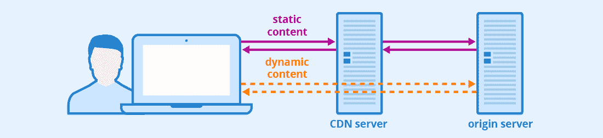

CDNs are perfect for delivering static content (Image source: Seobility)

一般来说，pop 数量越多，全球传播越广，你的网站对用户来说就越快。

Kinsta 对其 CDN 进行了测试，结果不言自明。对于远离主机服务器的用户来说，使用 CDN 可以减少 50%以上的站点加载时间。

除了缓存，许多 cdn 还包括其他性能增强功能，如卓越的动态图像压缩、HTTP/2 支持、[热链接保护](https://kinsta.com/blog/hotlinking/)和[附加安全性](https://kinsta.com/secure-wordpress-hosting/)。

对于更快的 WooCommerce 商店，我们建议您获得一个[快速 CDN](https://kinsta.com/help/kinsta-cdn/) 。您可以查看一些受欢迎的 cdn:

*   [Cloudflare](https://www.cloudflare.com/cdn/)
*   [Sucuri CDN](https://sucuri.net/website-performance/)
*   [堆栈路径](https://www.stackpath.com/)

### 7.剥离未使用的脚本和样式表

大多数 WordPress 主题和插件在你网站的所有页面上加载脚本和样式表。即使页面上没有使用这些资产，它们也会加载它们。

例如，[联系人表单 7](https://kinsta.com/blog/contact-form-7/) [在每个页面](https://contactform7.com/loading-javascript-and-stylesheet-only-when-it-is-necessary/)上加载其脚本和样式表。它的表单可能只在联系人页面上使用，但是资产会加载到所有页面上。完全没有必要！

从页面中剥离这些未使用的资产将有助于减少膨胀并加快页面加载速度。WooCommerce 及其扩展(如[智能优惠券](https://woocommerce.com/products/smart-coupons/)和[跟进](https://woocommerce.com/products/follow-up-emails/))容易受到这个问题的影响。

例如，没有必要在商店主页或商店页面上加载与支付网关相关的脚本。您可以将此类脚本限制为仅在结帐和订单确认页面上加载。同样，从你的[结账页面](https://kinsta.com/blog/woocommerce-one-page-checkout/)中删除[滑块和传送带](https://kinsta.com/blog/wordpress-slider/)的脚本和样式。

如果你想知道要消除哪些资产，看看你的网站速度测试报告中的[瀑布图](https://gtmetrix.com/blog/how-to-read-a-waterfall-chart-for-beginners/)。它会让你了解正在加载的不必要的资产。

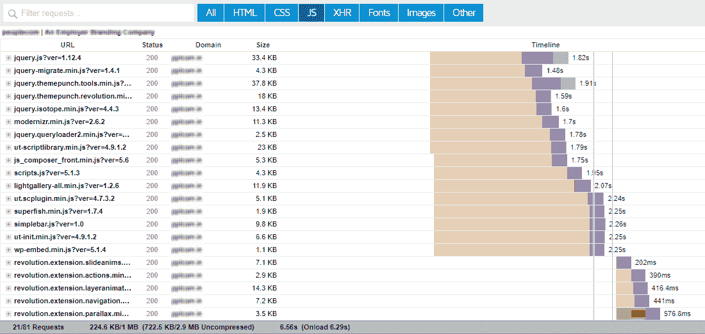

GTMetrix’s Waterfall Chart

Chrome 浏览器的 **DevTools** 下的**网络**标签也是一个很好的入手点。它会让你对[有一个全面的了解，一个网页如何加载](https://developers.google.com/web/tools/chrome-devtools/network/reference#summary)。

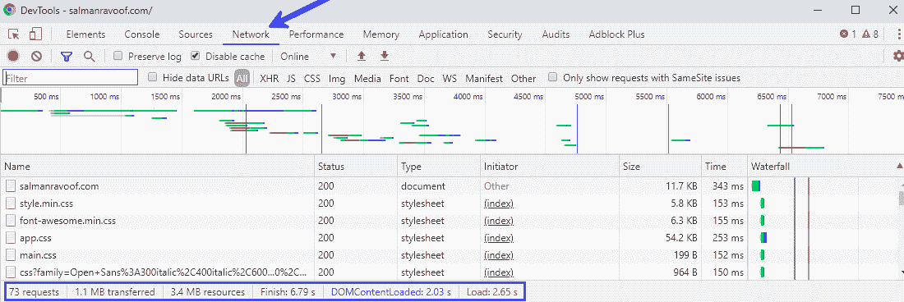

Use the Network tab in Google Chrome DevTools

去掉页面运行不必要的脚本和样式。首先优化你的主页和登陆页面，因为这些是大多数用户的第一个入口。

你可以使用 [wp_dequeue_script](https://developer.wordpress.org/reference/functions/wp_dequeue_script/) 和 [wp_dequeue_style](https://developer.wordpress.org/reference/functions/wp_dequeue_style/) 函数来移除你不需要的脚本和样式。一个简单的方法是通过一个名为[资产清理:页面速度加速器](https://wordpress.org/plugins/wp-asset-clean-up/)的插件。

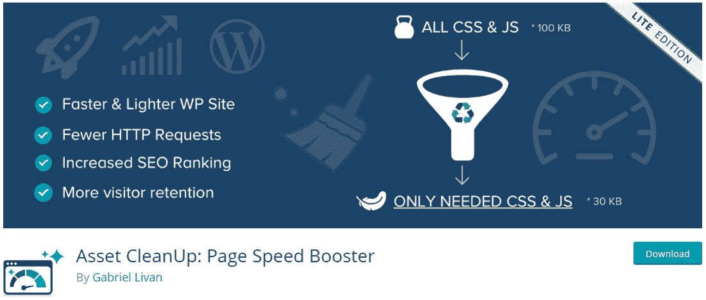

Clean up your WordPress assets

资产清理扫描将加载到页面上的所有脚本和样式表。您可以禁用页面上不使用的选项。完成更改后，测试页面的设计和功能是否正确。

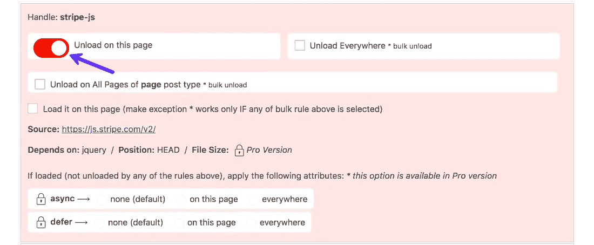

Unloading Stripe payment gateway script with Asset Cleanup

该插件的专业版允许您为资产设置 [*异步*或*延迟*属性。应用此设置会将 JavaScript 从页面的关键呈现路径中移除。它应该有助于改善您的网站的感知页面加载时间。](https://kinsta.com/learn/speed-up-wordpress/#clear-js-from-the-critical-rendering-path)

消除不必要的 CSS 和 JS 资产的另一个好处是，你的网站将[发出更少的 HTTP 请求](https://kinsta.com/blog/make-fewer-http-requests/)。

作为一个免费的替代方案，您可以结合使用[自动优化和异步 JavaScript 插件](https://kinsta.com/blog/eliminate-render-blocking-javascript-css/#plugins)来获得相同的结果。如果你使用自动优化插件，这里是我们完整的关于最佳设置的[逐步指南](https://kinsta.com/blog/autoptimize-settings/)。

### 8.HTTP/2 极其重要

如果我们在几年前写这篇文章，我们会把这一节的标题定为“**减少 HTTP 请求的数量**”由于浏览器与网站交流方式的实质性改进(反之亦然)，这种优化的需要现在已经过时了。

HTTP 1.1 是 HTTP 协议的第一次重大更新，早在 1997 年就已经完成。这是在社交媒体、流媒体服务、智能手机应用甚至 WordPress 出现之前。从那以后，网络呈指数级增长。

[HTTP/2 对 HTTP 1.1 协议](https://kinsta.com/learn/what-is-http2/)进行了改进，并于 2015 年加入，以满足互联网不断增长的需求。它带来了速度、效率和安全性方面的惊人改进。

HTTP 1.1 vs HTTP/2 (Image source: Cloudflare)

HTTP/2 的性能提高有多种原因:

*   单个 TCP 连接上更好的多路复用和并行性。
*   用霍夫曼编码算法压缩报头。
*   ALPN 扩展用于更快的加密。
*   主动服务器推送而不是等待请求。

所有这些都意味着一个至关重要的优势:使网站加载速度更快，即使它们拥有各种类型的资源。

通常，WooCommerce 商店提供大量资源密集型资产，如图像、样式表和脚本。像这样的网站将会因为转换到 HTTP/2 而受益匪浅。

您可以通过 key dn 使用 HTTP/2 测试工具[来检查您的站点是否配置为使用 HTTP/2。截至目前，](https://tools.keycdn.com/http2-test)[各大浏览器都支持 HTTP/2](https://caniuse.com/#search=http2) 。没有理由不利用它巨大的性能优势。

如果你的主机提供商还不支持 HTTP/2，开始寻找一个新的。 **Kinsta 在其所有服务器和 CDN 上支持 HTTP/2 和 TLS 1.3。**

此外， [HTTP/3 即将推出](https://kinsta.com/blog/http3/)，它将使网站加载速度更快。

### 9.缓存 WooCommerce 来加速它

缓存是临时存储来自一个请求的资源(缓存)，以便可以快速执行后续请求。缓存可以存储在服务器或用户设备上。

这是加速你的网上商店的最简单的方法之一。也是最重要的一点。

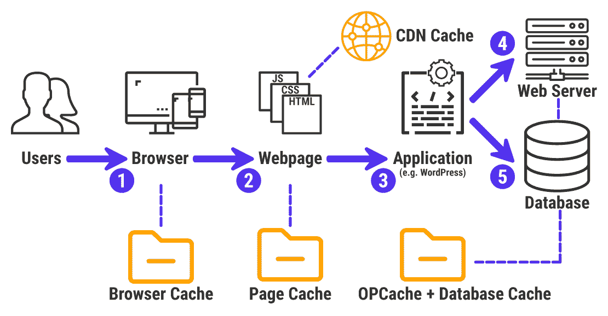

How web caching works

1.  用户通过他们的浏览器请求一个网站。例如，他们在浏览器中输入*。*
**   然后，浏览器请求向用户显示网页(HTML 文档)。一个 [DNS 服务器](https://kinsta.com/knowledgebase/what-is-dns/)处理这个请求，结果暴露了托管服务器的 IP。*   返回网页由应用程序(例如 WordPress、Joomla 等)处理。)托管在 web 服务器上。对于静态网站，应用程序甚至都不是必需的。*   应用程序运行脚本(例如 PHP、JavaScript 等。)和(5)查询数据库(例如 MySQL、MongoDB 等。)来建立一个网页。然后，它将网页返回给浏览器，由浏览器呈现并显示给用户。*

 *如果一切顺利，以上所有步骤最多需要几秒钟就能执行。

但这只是单个用户的一个请求。如果几千个用户同时有多个请求怎么办？这将给服务器带来巨大的负载，最终导致网站运行速度变慢。

这就是缓存的用处。它减少了生成页面视图所需的工作量，从而减少了 WordPress 对 PHP 和数据库的依赖。缓存使得 [WordPress 的运行速度几乎和静态网站](https://kinsta.com/blog/wordpress-vs-static-html/)一样快，如果不是一样的话。

web 缓存有两种主要类型，每种都有自己的子集:

**服务器端缓存**

*   [字节码缓存(OPCache)](https://kinsta.com/blog/wordpress-cache/#bytecode-cache)
*   [对象缓存](https://kinsta.com/blog/wordpress-cache/#object-cache)
*   [页面缓存](https://kinsta.com/blog/wordpress-cache/#page-cache)
*   [CDN 缓存](https://kinsta.com/blog/wordpress-cache/#cdn-cache)

**客户端缓存**

## 注册订阅时事通讯

### 想知道我们是怎么让流量增长超过 1000%的吗？

加入 20，000 多名获得我们每周时事通讯和内部消息的人的行列吧！

[Subscribe Now](#newsletter)

*   [浏览器缓存](https://wp-rocket.me/blog/different-types-of-caching/)

缓存不仅使网站加载更快，而且还减少了服务器的负载。Kinsta 关于 WordPress cache 的文章[是一个很好的详细解释资源。](https://kinsta.com/blog/wordpress-cache/)

如果你的 WooCommerce 商店是由 Kinsta 托管的，那么缓存是在服务器级别进行的。因此，你不需要使用缓存插件。

Kinsta 配置缓存规则，以便与 WooCommerce 无缝协作。这可以确保您的用户有一个顺畅的结账体验，不会出现任何问题。

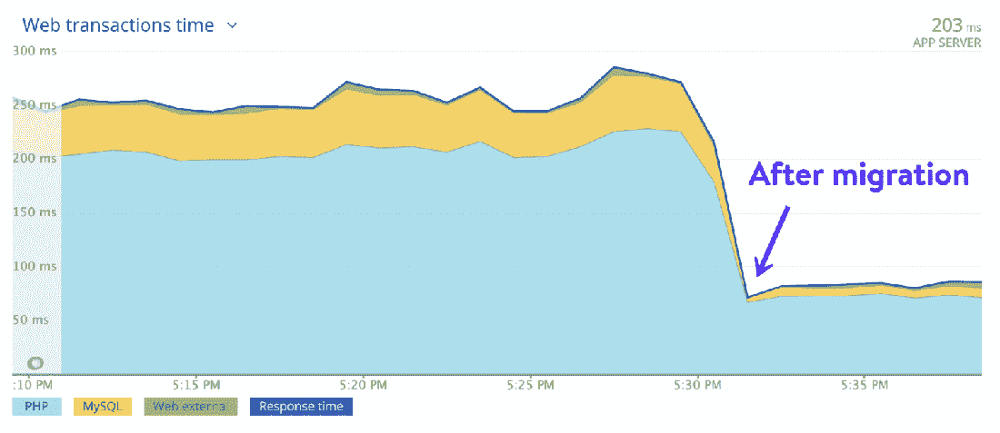

WordPress load times after migrating to Kinsta’s new servers

如果你的主机提供商不处理服务器级别的缓存，那么你需要依靠第三方缓存插件来完成这项工作。虽然它们不是理想的解决方案，但有总比没有好。

以下是我们推荐的 WordPress 缓存插件:

*   WP 火箭(溢价)
*   [W3 总缓存](https://kinsta.com/blog/wordpress-caching-plugins/#w3-total-cache)(空闲)
*   [缓存启用码](https://kinsta.com/blog/wordpress-caching-plugins/#cache-enabler)(免费)

更多选项，请查看 Kinsta 在 [WordPress 缓存插件](https://kinsta.com/blog/wordpress-caching-plugins/)上的帖子。

### 10.清理你的 WooCommerce 数据库

一个[数据库](https://kinsta.com/knowledgebase/wordpress-database/)是你网站所有数据的一个有组织的集合。在 WooCommerce 商店中，它包括:

*   **站点内容**如产品页面、类别、标签、用户数据、评论、站点范围设置、主题、插件等。
*   **交易数据**，如订单详情、付款、库存等。

每次用户访问你的商店，他们都在请求你的网站内容，这些内容大多是静态的，不会有太大变化。但是当他们下订单时，他们会提出一个动态的请求。

如果您不优化商店的数据库，处理这些请求可能需要很长时间。最终，缓慢的服务器响应时间导致缓慢的网站。因此，您必须通过删除不必要的垃圾来清理和优化数据库。

这里有 6 种方法可以加速和微调你的 WooCommerce 数据库。

#### 删除旧版本

如果你的 WooCommerce 商店已经建立了很长时间，它的页面、帖子和产品将会充满旧版本。是时候清理这些了。

最简单的方法是通过插件，如 [WP-Sweep](https://wordpress.org/plugins/wp-sweep/) 或 [WP Rocket](https://wp-rocket.me/) 。

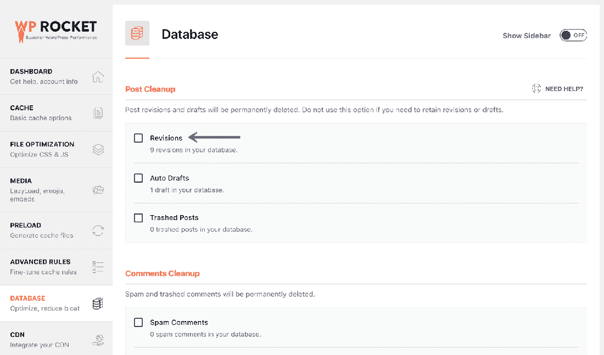

Deleting old revisions with WP Rocket

如果你对 WP-CLI(T1)很熟悉，那么你也可以通过 SSH(SSH)连接到你的服务器(T3)并运行一些简单的 T4 命令(T5)来做同样的事情。这是你可以做到的。

#### 限制存储的修订数量

你可以通过[限制文章和页面的修订数量](https://kinsta.com/blog/wordpress-revisions/#how-to-limit-revisions-in-wordpress)来避免大量的旧修订。如果你倾向于经常更新你的网站内容，这将有助于你防止修改失控。

设置限制的一个简单方法是将下面的代码片段添加到您的*文件中。确保将其添加到定义 **ABSPATH** 的行之前。*

 *`define('WP_POST_REVISIONS', 15);`

在上面的代码中，我将限制设置为 15。你可以把它修改成你想要的任何数量，但是尽量保持在 15 以下。

或者，你可以使用一个免费的插件，比如 [WP 版本控制](https://wordpress.org/plugins/wp-revisions-control/)来做同样的事情。

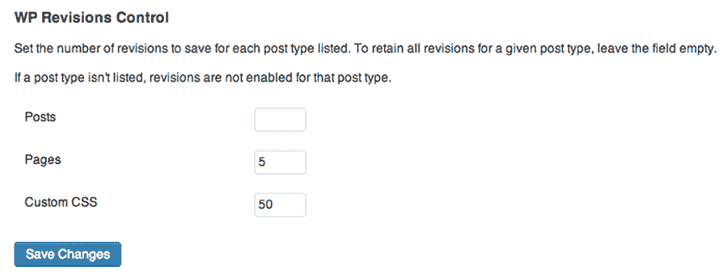

Set the number of revisions with WP Revisions Control

#### 完全禁用修订(如果它们是不必要的)

您可以从您的网站上完全禁用修订版。你所需要做的就是将下面的代码添加到你的 wp-config.php 文件中。和以前一样，确保将这个代码片段添加到定义了 **ABSPATH** 的那一行的上方。

`define('WP_POST_REVISIONS', false);`

或者你可以使用一个免费的插件，比如[禁用发布版本](https://wordpress.org/plugins/disable-post-revision/)来做同样的事情。

在禁用修订之前，我们建议您删除所有仍然存在的旧修订。通过这种方式，你的网站数据库将完全免于修改。

#### 清除过期的瞬变

瞬变是以自定义名称和过期时间存储的缓存数据。它们通常存储在 WordPress 数据库中的 **wp_options** 表下。

瞬变类似于[选项](https://developer.wordpress.org/plugins/settings/options-api/)，除了它们有一个额外的过期时间属性。它们对于存储临时数据很有用，比如来自远程 API 或大型查询的响应。

WordPress 瞬态 API 定义了如何自动处理瞬态和删除过期的瞬态。然而，[事情并不总是按计划进行](https://kinsta.com/blog/debugging-wordpress-performance/#wordpress-staging)。

有时，一个损坏的临时缓存可以创建近百万个垃圾条目，而且看不到尽头。随着时间的推移，客户会话会越来越多，在数据库表中会产生数千个不必要的行。在这种情况下，臃肿的数据库会使您的网站瘫痪。

免费的[删除过期的瞬变](https://wordpress.org/plugins/delete-expired-transients/)插件是[清除所有过期瞬变](https://kinsta.com/knowledgebase/wp-options-autoloaded-data/#clean-up-transients)的一个简单方法。

Deleted all your expired transients easily

#### 清理您的数据库表

你的 WooCommerce 数据库存储了经营你的电子商务商店所需的一切。随着数据在数据库中的表之间被添加、删除和移动，效率会变得很低，最终会存储许多对存储运行并不重要的东西。

您需要通过清理数据库表来清除这些不必要的数据。特别是 [wp_options 表](https://kinsta.com/knowledgebase/wp-options-autoloaded-data/#troubleshooting-autoloaded-data)，容易变得臃肿，损害数据库性能。

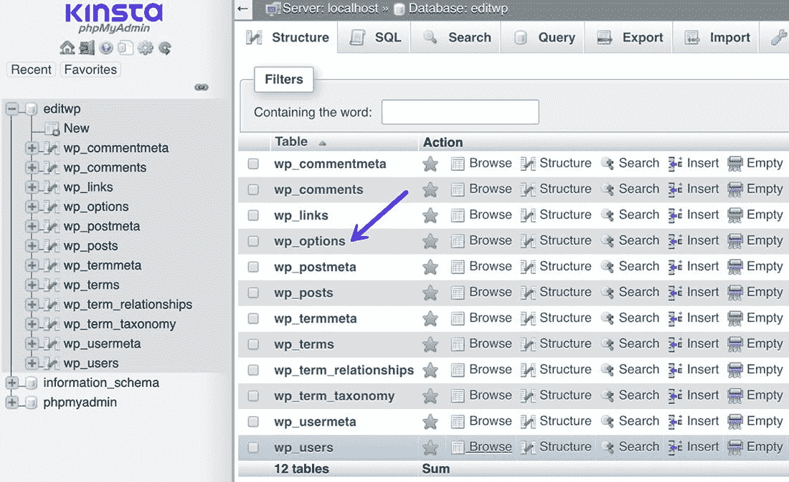

The wp_options table in WordPress database

数据库管理是保持你的 WordPress 站点尽可能快速运行的关键。

手动优化数据库是一个耗时的过程。你可以使用免费的 [WP-Optimize](https://wordpress.org/plugins/wp-optimize/) 插件来检查哪些数据库表有不必要的数据，并删除那些浪费的空间。它还可以检索因数据碎片而丢失的存储空间。

您可以安排 WP-Optimize 定期清理和优化您的数据库。

#### 禁用对数据库造成负担的非关键功能

WooCommerce 的主题和插件有很多很酷的特性，从一开始看起来很棒，但最终却破坏了数据库。

一个这样的例子是使用“流行产品”和“相关产品”插件。这些特性会引起大量的站点范围的查询，尤其是当你有很多产品的时候。如果您需要这些功能，请尝试将它们手动插入您的页面。像[高级定制字段](https://kinsta.com/blog/advanced-custom-fields/)这样的插件在这方面很有帮助。

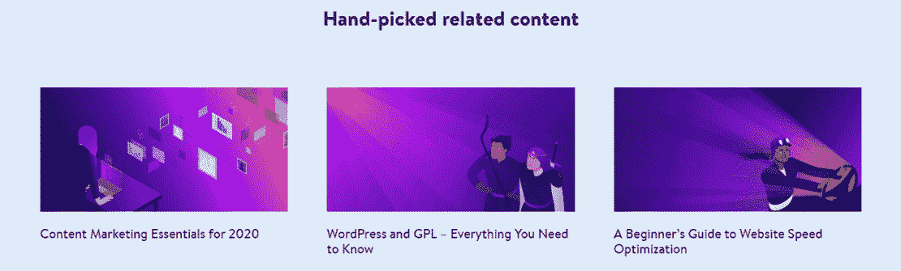

Kinsta inserts its ‘Related Content’ posts manually

另一个例子是图像优化插件，它在网站托管的同一服务器上压缩图像，而不是在外部压缩。这最终会占用大量的服务器资源。

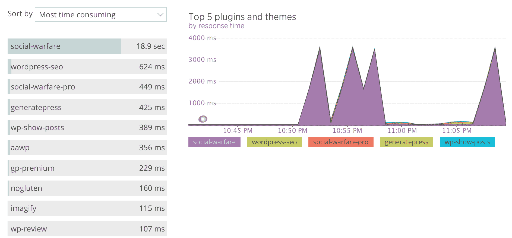

Social Warfare plugin can tax the server resources

此外，远离给你的网站添加计数器的插件。例如，在用户名旁边添加查看/帖子/评论的数量。与多个用户进行冗长的讨论会给你的数据库带来处理这些数据的压力。

这个建议同样适用于社交计数器。尽量减少使用自动生成的计数器，以最大限度地提高数据库性能。

你的电子商务网站需要一个超快的、可靠的、完全安全的主机吗？Kinsta 提供所有这些服务，并由 WooCommerce 专家提供 24/7 的世界级支持。[查看我们的计划](https://kinsta.com/plans/?in-article-cta)

像内务管理一样，[微调你的 WordPress 数据库](https://kinsta.com/learn/speed-up-wordpress/#database)是一个持续的过程。

记住这一点，Kinsta 已经实现了一个自动化系统来解决数据库性能问题。根据您站点的需求，自动化系统每周扫描和微调您的 MySQL 数据库一次，以确保数据库的最高性能。如果系统检测到无法自动修复的异常情况，它会通知系统管理员团队立即采取行动。

如果你的网站托管在其他地方，这里有一些数据库优化插件，让你的工作更容易:

提醒:在编辑你的数据库或 WordPress 核心文件之前，一定要备份。

### 11.优化您的商店，获得移动优先体验

截至 2020 年 1 月，全球互联网用户[超过 40 亿](https://www.statista.com/outlook/243/100/ecommerce/worldwide)。手机网民几乎一样多。预计到 2024 年将增长到 50 多亿。

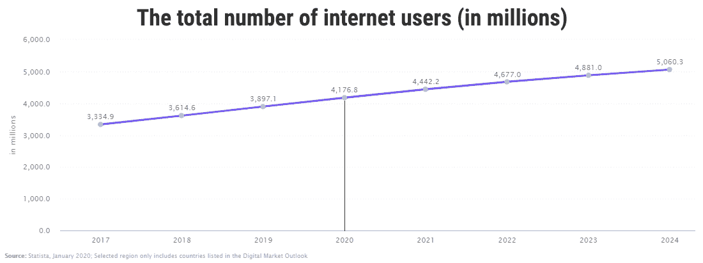

There are billions of us (Image source: Statista)

2019 年，移动设备在全球网站流量方面超过了台式机，产生了总浏览量的 52.6%。在一些国家，如印度和尼日利亚，[手机占据了网页浏览量的 70%+T3。](https://www.statista.com/statistics/430830/share-of-mobile-internet-traffic-countries/)

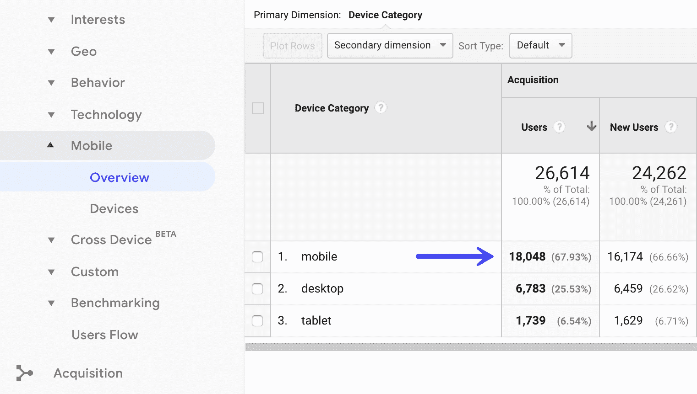

Mobile traffic from Google Analytics

根据一项涉及 37 个国家 5 亿多网购者的研究，智能手机占 T2 网站访问量的 65%，占 T4 电子商务订单的 46%。

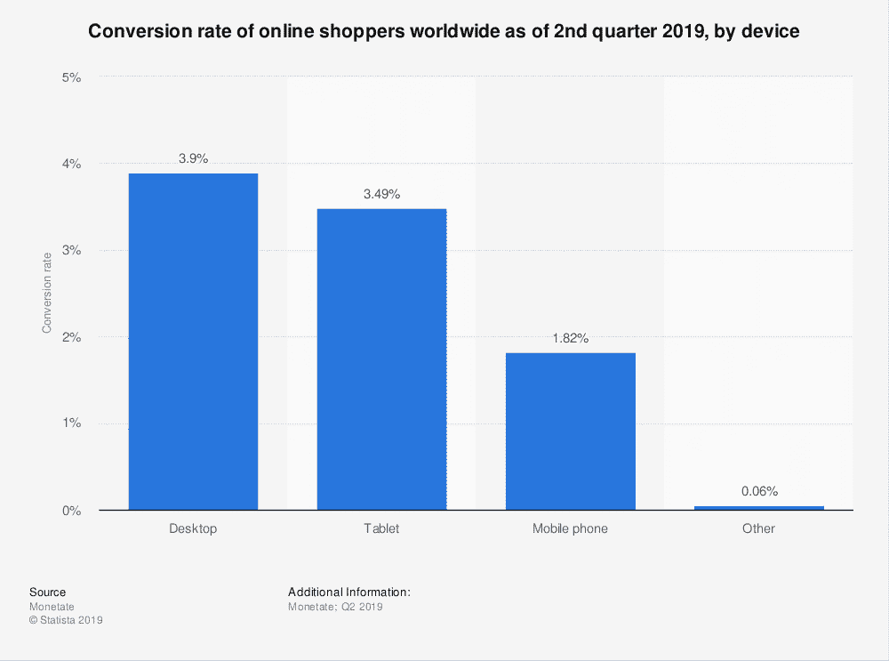

Mobile shopping has massive growth potential (Image source: Statista)

令人惊讶的是，手机的[转化率](https://kinsta.com/blog/conversion-tracking/)还不到台式机的一半。这里有巨大的发展空间。

Speed counts a lot for mobile shoppers (Image source: Think with Google)

你可以从让你的 WooCommerce 商店移动友好开始。你可以使用[谷歌的移动友好测试](https://search.google.com/test/mobile-friendly)工具来检查你的网站是否通过了最低移动可用性标准。

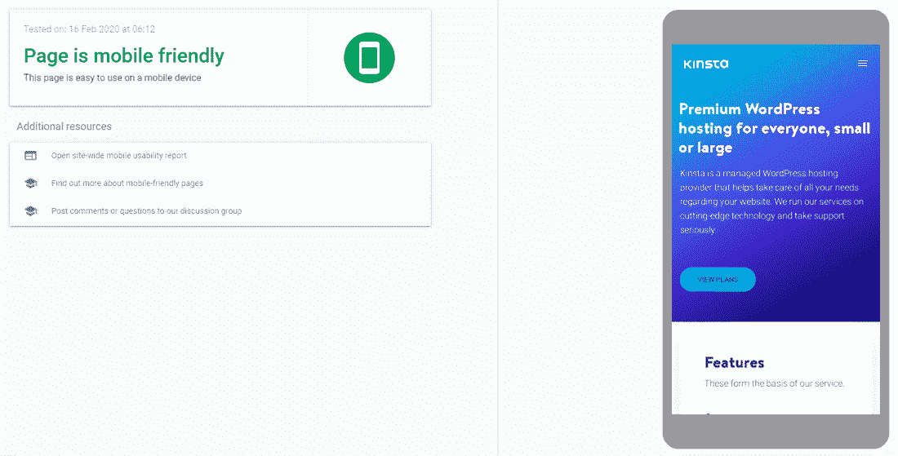

Google’s Mobile Friendly Test

该测试将向您展示您的网站在移动设备上的外观快照。如果发现任何移动可用性问题，它还会列出这些问题。

让你的 WordPress 网站移动友好的最简单的方法是[使用响应主题](https://kinsta.com/blog/web-design-best-practices/#mobile-responsiveness)。本文前面提到的所有主题都是开箱即用的，在移动设备上看起来很棒。

移动购物者不喜欢无休止地滚动。因此，尽可能保持你的商店页面简洁。不要用太多的内容使它们过于拥挤。

如果你的商店里有很多商品，让手机购物者更容易通过搜索找到它们。您可以安装 [WooCommerce 产品搜索](https://woocommerce.com/products/woocommerce-product-search/)插件，帮助您的客户使用实时产品过滤器快速找到产品。

Simplify product search with filters (Image source: WooCommerce)

最后，[简化网上购物者的结账体验](https://kinsta.com/learn/woocommerce-guide/#chapter-13-optimizing-the-checkout-process)。下单步骤越少，购物体验越好。这里有几个 WooCommerce 扩展可以帮你做到这一点:

*   [WooCommerce 社交登录](https://woocommerce.com/products/woocommerce-social-login/) —无需耗时的帐户创建或登录过程。让你的用户用他们的社交账户登录，比如脸书、推特、谷歌等。
*   [变化样本和照片](https://woocommerce.com/products/variation-swatches-and-photos/) —告别烦人的[下拉菜单](https://kinsta.com/knowledgebase/wordpress-dropdown-menu/)选择产品变化。取而代之的是，为你的用户提供易于点击的产品选项按钮。
*   不要让你的客户那么容易就放弃你的网站。允许他们立即购买他们想要的东西，不需要额外的步骤。如果你认为[顾客结账](https://woocommerce.com/posts/guest-checkout-right-for-store/)非常适合你的商店，那么你可以考虑启用它。
*   [结帐字段编辑器](https://woocommerce.com/products/woocommerce-checkout-field-editor/) —从您的结帐页面添加、删除或更改字段。例如，如果你只销售数字产品，你不需要收集送货地址。
*   [Bolt](https://woocommerce.com/products/bolt-checkout/)/[Stripe](https://woocommerce.com/products/stripe/)/[Amazon Pay](https://woocommerce.com/products/pay-with-amazon/)/[PayPal](https://woocommerce.com/products/woocommerce-gateway-paypal-checkout/)——支付是移动购物体验的克星。您可以从[不同的 WooCommerce 支付网关扩展](https://kinsta.com/blog/woocommerce-payment-gateways/)中进行选择，以便更轻松地收款。

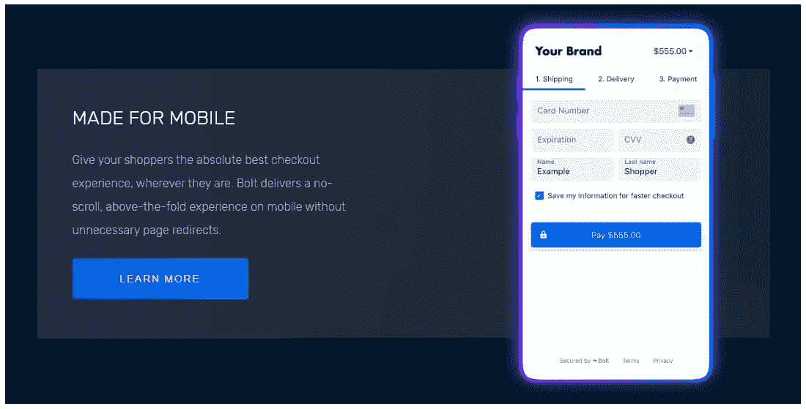

Easy mobile checkouts with Bolt

最终，移动购物不仅仅是购物。许多用户主要使用它来查找产品信息和检查/比较价格。让您的用户在移动设备上获得出色的在线商店体验。

### 12.禁用获取刷新片段 AJAX 请求

当用户对他们的购物车进行任何更改时，WooCommerce 使用**Get refresh Fragments**AJAX 请求来动态更新购物车内容。从用户体验的角度来看，刷新购物车页面而不重新加载似乎很棒。

但是大多数时候它会降低网站的速度，主要是那些托管在共享服务器上的网站。另外，很多网站最终都没有使用这个功能。

为了验证，我们在 Pingdom 工具上测试了一个最新的 WooCommerce 商店，结果如下:

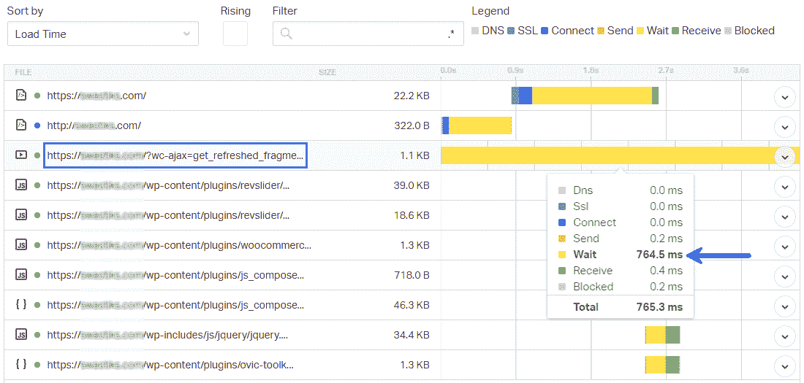

That’s a lot of wait time for one request

尽管大小只有 **1.1 KB** ，但是**WC-Ajax = get _ refreshed _ fragments**请求需要 **0.76 秒**来执行。如果你的网站只需要 3 秒或更少的时间来加载，那就超过了页面加载时间的 25%。这个测试站点托管在一个云 VPS 上，所以你可以想象一个更便宜的托管计划的加载时间。

WebNots 的这篇文章更详细地讨论了这个问题。你可以使用免费的[禁用购物车碎片](https://github.com/littlebizzy/disable-cart-fragments/tree/1.3.0)或[禁用购物车碎片 Optimocha](https://wordpress.org/plugins/disable-cart-fragments/) 插件来禁用这个征税请求。

如果您禁用此请求，建议您在 **WooCommerce → Products** 设置面板中启用“成功添加后重定向至购物车页面”选项。

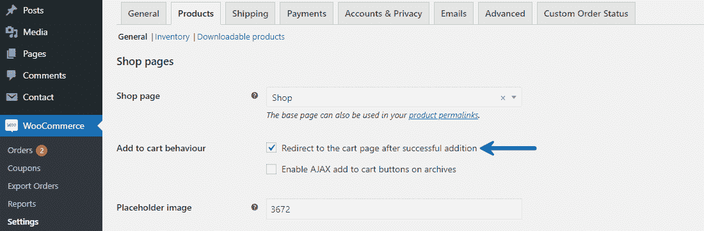

Remember to enable this setting afterward

启用此行为将确保用户在将产品添加到购物车后被重定向到**购物车**页面。

## 优化 WooCommerce 管理面板

速度不仅仅是商店前端的重要因素。一个敏捷的后端对于轻松管理你的商店和在需要的时候做出快速改变同样重要。

在你的 WooCommerce 管理面板上高效地工作是富有成效的关键。这也让你有时间做更多对你的网上商店的成功至关重要的事情，比如网上营销。

以下是修复 WooCommerce 仪表盘运行缓慢的几种方法。

### 前端优化第一，后端优化第二

这个问题仅仅发生在 [WordPress 管理面板](https://kinsta.com/knowledgebase/wordpress-admin/)而不是整个网站吗？如果是后者，那么首先应用前面列出的所有优化。

为什么？因为在大多数情况下，让你的 WooCommerce 商店在前端加载更快也会优化后端。我们可以把这归因于释放了服务器上的资源。

如果你的管理面板在优化前端后仍然滞后，那么继续下面的建议。

### 13.消除膨胀，定期更新一切

确保经常更新 WordPress、WooCommerce、插件、扩展和主题。如果一个主题或插件不再被开发者支持，那么是时候考虑抛弃它们了。

同样，如果一个主题/插件给你的仪表板增加了不必要的臃肿，开始寻找更好的替代品。例如，你可能想考虑在你的仪表板上提供攻击性广告的[插件的替代品。](https://www.matteoduo.com/upselling-advertising-crossselling-wordpress-org-dashboard/)

Example of banner in WordPress admin

这个问题如此普遍，以至于有些[插件专门致力于消除一些最流行的 WordPress 插件的膨胀](https://wordpress.org/plugins/so-clean-up-wp-seo/)。

### 14.禁用对象和数据库缓存

缓存插件是加速你的 WordPress 站点的一个好方法。但是，如果配置不当，它们可能会导致意想不到的结果。这包括减慢你的后端。

例如， [W3 总缓存](https://kinsta.com/blog/wordpress-caching-plugins/#w3-total-cache)是 WordPress 最流行的缓存插件之一。它是免费的，支持大量的缓存选项，做 JS 和 CSS 缩小，与 CDN 集成，被 100 多万网站使用。

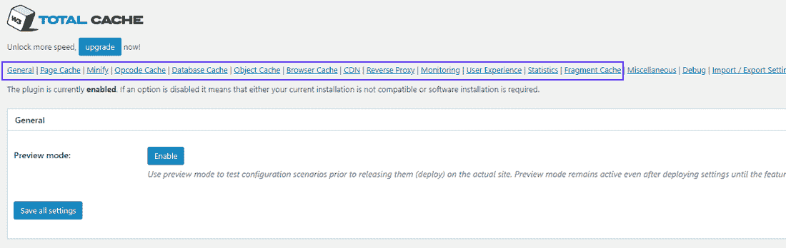

Cache options in W3 Total Cache

W3 Total Cache 具有以下缓存选项:

*   页面缓存。
*   操作码缓存。
*   数据库缓存。
*   对象缓存。
*   浏览器缓存。
*   碎片缓存。

有很多选项是令人困惑的，特别是对于不了解每种缓存类型的初学者。

对象和数据库缓存通过减少数据库查询的数量来加快网站的速度，但这是以将工作转移到服务器内存为代价的。

理想情况下，如果你的托管服务器足够智能或强大，这不会造成问题。例如，如果你的 WordPress 站点是由 Kinsta 托管的，你不需要担心缓存，因为它已经在服务器层面实现了。

不幸的是，**并非每个主机提供商都是如此**。

在这种情况下，您需要依赖第三方缓存插件，如 W3 Total Cache。其简单的设置使得只需一次点击即可轻松启用所有类型的缓存。

在 [**W3 总缓存→通用设置**面板中，禁用对象缓存和/或数据库缓存](https://kinsta.com/blog/w3-total-cache/)。然后检查你是否看到你的管理面板的反应有任何改善。

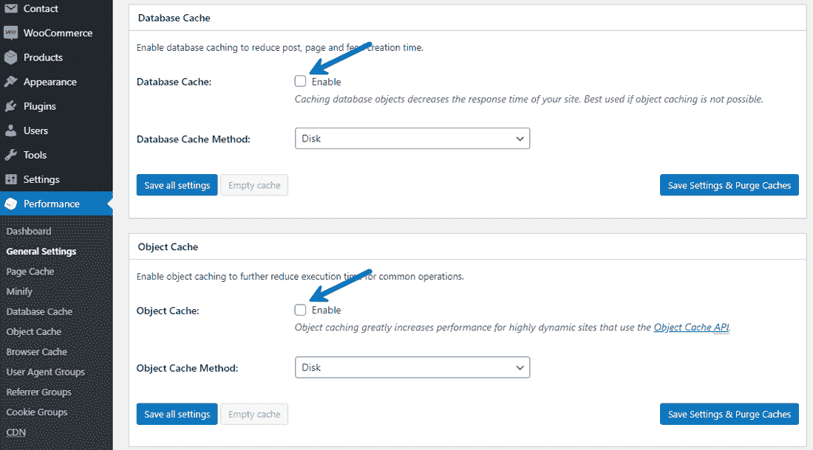

Disable Database and Object Cache

尝试缓存并不像勾选或取消插件设置中的选项那么简单。在进行更改并刷新旧缓存后，您还应该检查您的站点是否正常工作。

[Kinsta 客户](https://kinsta.com/plans/?plan=visits-business1&interval=month)可以利用 [MyKinsta 仪表板](https://kinsta.com/mykinsta/)中内置的[代码缩减功能](https://kinsta.com/help/kinsta-cdn-code-minification/)来提升他们的整体优化。这个特性允许客户通过简单的点击来实现 CSS 和 JavaScript 的自动缩小，有效地加速了他们的站点，而不需要手动操作。

### 15.删除资源使用率高的插件

一些 WordPress 插件在你的网络服务器上是一个巨大的资源猪。它们最终会占用服务器的大部分 CPU 和 RAM。

可以使用免费的[查询监控插件](https://wordpress.org/plugins/query-monitor/)来查找麻烦的插件。它会显示你的网站正在加载的所有脚本、样式和 HTTP API 调用，以及它们的大小和加载时间。找出请求数量最多、加载速度最慢的服务器。

在下面的测试网站上，[经典编辑器插件](https://wordpress.org/plugins/classic-editor/)在管理员端加载最慢。其他插件如[登录器](https://wordpress.org/plugins/loginizer/)、[多功能一体 WP 迁移](https://wordpress.org/plugins/all-in-one-wp-migration/)和 [WP 面包房(以前的视觉作曲家)](https://wpbakery.com/)也显示出潜在的膨胀。

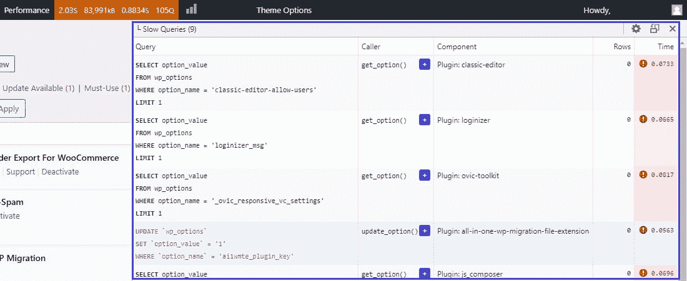

Query Monitor helps you troubleshoot performance issues

我们发现迁移和经典编辑器插件是不必要的。移除这两个插件大大提高了管理速度。

拥有国际受众的 WooCommerce 商店使用类似于 [WPML](https://wpml.org/) 的翻译插件，以[多种语言](https://kinsta.com/blog/wordpress-multilingual/)动态服务网站。这是一个很棒的插件，有很多功能，但是它也会[大大降低你的管理后端](https://wpml.org/forums/topic/extremely-slow-admin/)的速度。

您可以通过切换到精益翻译插件(如 [Polylang](https://wordpress.org/plugins/polylang/) )来获得一些性能优势。它没有那么多的功能，但对于大多数用例来说都很棒。

有很多正在进行的进程/扫描的插件会降低你的 WordPress 后端速度。一些例子包括网站地图生成器、分析图和图表、页面生成器和聊天插件。

### 信息

如果您安装了查询监视器，请记住在完成后卸载它，因为它使用大量的服务器资源来执行扫描。

### 16.为 WordPress 使用正确的 CDN 设置

CDN 有助于以闪电般的速度为世界各地的用户提供 WooCommerce 商店服务。它通过保存站点资源的快照，并从最近的服务器将它们发送给用户来做到这一点。

大多数 cdn 默认禁用 WordPress 后端的缓存。但有些 cdn 没有，这可能会大大降低您商店管理面板的速度。在这种情况下，您需要从 CDN 的缓存中排除您的管理仪表板，以提高其性能。

如果你正在使用 Cloudflare，你可以[在 WordPress 管理页面上设置一个页面规则来禁用 Cloudflare 特性](https://kinsta.com/blog/cloudflare-settings-wordpress/#page-rules)。下面是如何做到这一点:

1.  转到您的 Cloudflare 控制面板下的**页面规则**部分。
2.  在 URL 字段中添加 ***example.com/wp-admin/*** 。
3.  在设置字段中，选择**缓存级别**和**绕过**选项。
4.  您还可以添加额外的设置，如**禁用性能**和**禁用安全**(不推荐)。这些设置是可选的。
5.  然后点击**保存并部署**。

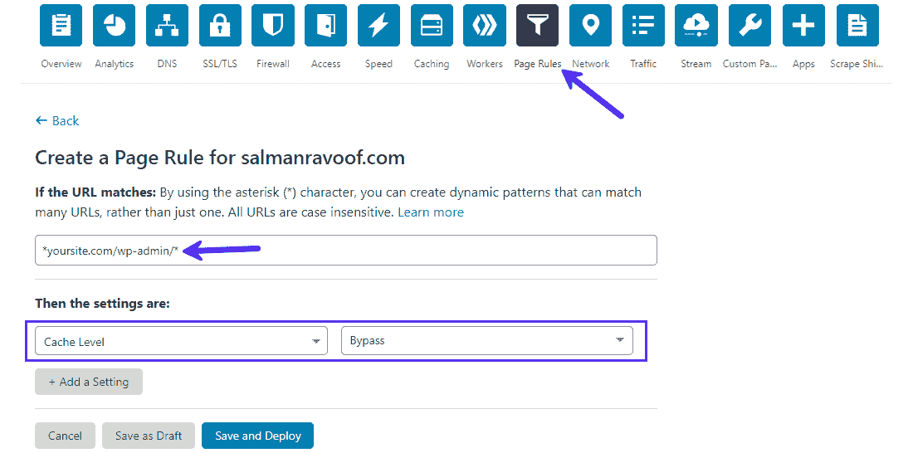

Cloudflare Page Rules to bypass WordPress admin

设置生效大约需要 3 分钟。

如果你正在使用 KeyCDN，那么你可以使用他们的 [WordPress Cache Enabler 插件](https://www.keycdn.com/support/wordpress-cache-enabler-plugin)来做同样的事情。对于其他 cdn，请联系他们的支持来解决这个问题。

### 17.简化 WordPress 心跳 API

WordPress Heartbeat API 通过保持浏览器和服务器之间的定期连接来实现近乎实时的更新。API 每隔 15-60 秒向服务器发送请求，然后在收到数据时触发事件(或回调)。

它允许一些惊人的功能，如自动保存文章，锁定文章，登录到期警告。然而，当你以管理员身份登录时，每分钟向服务器发送几个请求会降低你的管理面板的速度。

WP Rocket 的免费[心跳控制插件](https://kinsta.com/blog/admin-ajax-php/#using-heartbeat-control-plugin-to-reduce-ajax-requests)允许你在仪表盘、前端和帖子编辑器上管理这些 API 请求的频率。它甚至让您选择完全禁用 API。

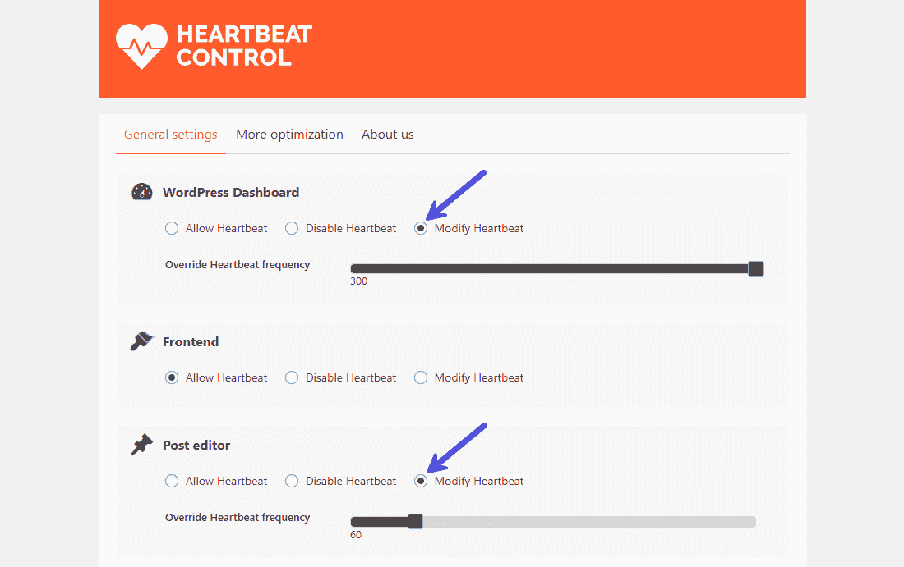

Modify or disable WordPress Heartbeat API

从增加时间的频率开始。如果这不能解决你的 WooCommerce 后端的速度问题，考虑禁用 heartbeat API。

如果应用所有上述优化仍然不能解决你的 WooCommerce 商店的速度问题，那么…

## WooCommerce 速度始于高质量的主机服务

就像跑一辆爆胎的车，无论你做多少优化，如果你的网站托管在一个糟糕的服务器上，它也不会变得更快。网站性能的很大一部分取决于你的主机服务质量。

WordPress 网站有不同类型的托管，分为两大类:[托管和非托管](https://kinsta.com/blog/managed-wordpress-hosting/)。第一种对大多数用户来说是完美的，因为主机提供商处理 WordPress 的所有服务器优化。后者更适合技术熟练的用户，他们可以自己调整和管理服务器。

对于一个 WooCommerce 网站，选择[托管 WordPress 主机](https://kinsta.com/woocommerce-hosting/)。请记住，托管往往比非托管更昂贵。

你可以从 4 种主要的托管类型中选择。每一个都有自己的优缺点，所以选择一个符合你的预算和目标。我在下面的信息图中比较了它们的各种特性。

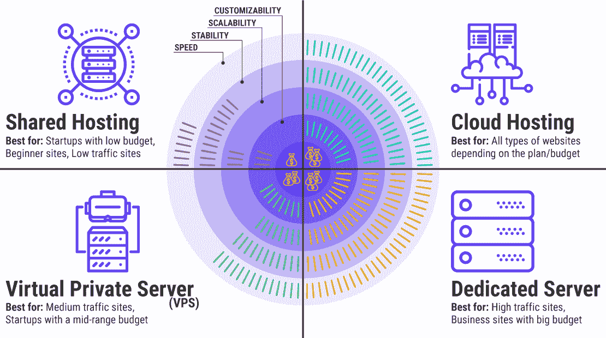

4 main types of Managed WordPress Hosting

每种类型的主机可以在不同价位的多个计划下提供。所以，当你在预算范围内寻找一个主机时，看看它提供的功能，决定它是否满足你的要求。

WooCommerce 网站天生具有难以置信的动态性。它们会产生大量无法缓存的数据和请求。

例如，结帐页面对每个用户都是唯一的，不能从缓存中提供。因此，服务器需要足够健壮，以便平稳地运行您的站点，即使您的站点吸引的流量很低。

在决定一个 WooCommerce 托管计划时，你应该留意的推荐特征是:

*   [服务器级缓存](https://kinsta.com/blog/wordpress-cache/),具有特定于 WooCommerce 的缓存规则。
*   2 到 4 个 PHP 工人处理 WooCommerce 的未缓存请求，而不会超时。
*   WordPress 内存限制为 128 MB 或更多(256 MB 是 Kinsta 的默认值)。
*   [可扩展的基础设施](https://kinsta.com/help/scalable-cloud-hosting/)应对流量和负载的激增。
*   [自动每日备份](https://kinsta.com/help/wordpress-backups/)(每小时优先)，确保您的电子商务数据安全可靠。
*   完全[安全的托管平台](https://kinsta.com/secure-wordpress-hosting/)，具有常规恶意软件扫描、IP 地理定位和滥用 IP 拦截等安全功能，免费 SSL、SFTP、SSH、HTTP/2 和 TLS 1.3。
*   [Nginx](https://kinsta.com/blog/nginx-vs-apache/) 或 LiteSpeed web 服务器软件。
*   对开发者友好特性的支持: [PHP 8](https://kinsta.com/blog/php-8/) 、LXC 容器、 [WP-CLI](https://kinsta.com/blog/wp-cli/) 、Git、 [MariaDB](https://kinsta.com/blog/mariadb-vs-mysql/) 、 [Staging environments](https://kinsta.com/help/staging-environment/) 等。
*   分布在世界各地的[数据中心](https://kinsta.com/knowledgebase/best-data-center/)的高正常运行时间。选择服务器靠近目标受众的服务器。
*   [Cloudflare 集成](https://kinsta.com/cloudflare-integration/)提高性能和安全性。
*   可靠的 [24/7 支持团队](https://kinsta.com/kinsta-support/)快速解决任何问题。
*   伟大的用户评论和恒星的跟踪记录。

考虑到这些要求，您可以安全地消除共享主机。

虚拟专用服务器(VPS) 就像共享主机，除了你在一个共享服务器上有一个虚拟空间专门给你。如果你预算紧张，你可以从中档 VPS 计划开始。然而，如果你的网站吸引了更多的流量，那么你必须尽快升级。

这给我们留下了**云托管**和**专用服务器**选项。如果它们能满足你的要求，对 WooCommerce 网站来说都是很好的选择。

与云托管计划相比，专用服务器计划的价格更高，从每月约 50 美元到每月数千美元不等。

Kinsta 的[商业云托管计划](https://kinsta.com/plans/)检查了所有推荐的 WooCommerce 要求。它基于容器的主机服务对于 WooCommerce 来说是[的完美之选](https://kinsta.com/woocommerce-hosting/)，因为它可以自动扩展以处理突发的流量和负载激增。

如果你想进一步扩展功能，Kinsta 提供了 Redis、额外备份、 [Nginx 反向代理](https://kinsta.com/blog/reverse-proxy/)等附加功能。

以下是 Kinsta 将一个电子商务网站迁移到[谷歌云平台的新计算优化虚拟机](https://kinsta.com/blog/boosting-wordpress-performance/) (C2)后性能提升的例子。

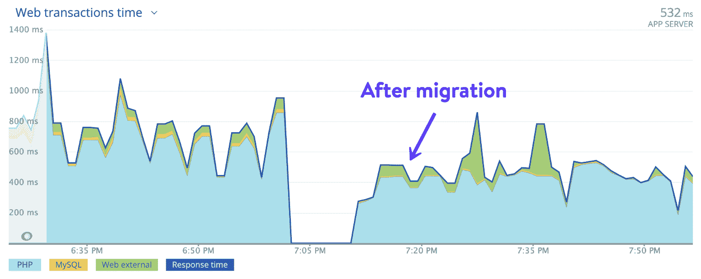

Massive performance benefits after migration

从大约 665 毫秒到大约 500 毫秒，性能提升了 25%!

如果你在市场营销上花了大量的钱，如果你的网站运行缓慢，你就会失去所有的线索，所以选择速度最快的 WordPress 托管解决方案是非常值得的。

最终，你最好每个月多花几美元在高质量的虚拟主机上，而不是花几个小时拔你的头发，想知道为什么你的网站仍然有很高的跳出率。

[If your site is generating $1k/day, a 100-millisecond delay might cost you $25k in lost sales annually. Scary, uh?😱💸 Stop losing money and read this guide on speeding up WooCommerce!Click to Tweet](https://twitter.com/intent/tweet?url=https%3A%2F%2Fkinsta.com%2Fblog%2Fspeed-up-woocommerce%2F&via=kinsta&text=If+your+site+is+generating+%241k%2Fday%2C+a+100-millisecond+delay+might+cost+you+%2425k+in+lost+sales+annually.+Scary%2C+uh%3F%F0%9F%98%B1%F0%9F%92%B8+Stop+losing+money+and+read+this+guide+on+speeding+up+WooCommerce%21&hashtags=webperf%2Conlinestore)

## 摘要

对于一个电子商务网站来说，时间就是金钱。一个快速的 WooCommerce 商店可以提升用户体验、搜索引擎优化、收入和投资回报率。

虽然你不必遵循这篇文章中列出的所有速度优化技巧，但我们建议你通读它们。这将有助于您识别站点中的任何瓶颈。没有人喜欢等待网站加载。让我们加速 WooCommerce！

* * *

让你所有的[应用程序](https://kinsta.com/application-hosting/)、[数据库](https://kinsta.com/database-hosting/)和 [WordPress 网站](https://kinsta.com/wordpress-hosting/)在线并在一个屋檐下。我们功能丰富的高性能云平台包括:

*   在 MyKinsta 仪表盘中轻松设置和管理
*   24/7 专家支持
*   最好的谷歌云平台硬件和网络，由 Kubernetes 提供最大的可扩展性
*   面向速度和安全性的企业级 Cloudflare 集成
*   全球受众覆盖全球多达 35 个数据中心和 275 多个 pop

在第一个月使用托管的[应用程序或托管](https://kinsta.com/application-hosting/)的[数据库，您可以享受 20 美元的优惠，亲自测试一下。探索我们的](https://kinsta.com/database-hosting/)[计划](https://kinsta.com/plans/)或[与销售人员交谈](https://kinsta.com/contact-us/)以找到最适合您的方式。******