# 欧洲和英国的云计算现状

> 原文：<https://kinsta.com/blog/cloud-computing-in-europe/>

最近，全世界对远程信息服务的需求急剧增长，在线提供服务和销售产品的公司也以同样的速度增长。公共机构和政府也不得不调整他们的组织以满足对在线服务日益增长的需求。

如今，在商品和服务的交换中，远程信息处理通道发挥着至关重要的作用，支持这种交换的基础设施成为向个人、企业和公共组织提供复杂服务的关键要素。

在这种情况下，云计算技术在全球经济中扮演着战略角色，提供基础设施和服务，这对在超复杂的全球经济中保持竞争力至关重要。

云基础设施的速度、可扩展性和安全性是所有行业和规模的私有、非营利和公共参与者的必备条件。[云技术的应用正在全球范围内飞速发展🚀。想了解更多关于欧洲云计算的情况吗？继续读...☁️☁️ 点击推文](https://twitter.com/intent/tweet?url=https%3A%2F%2Fkinsta.com%2Fblog%2Fcloud-computing-in-europe%2F&via=kinsta&text=The+adoption+of+cloud+technologies+is+proceeding+blazing+fast+all+over+the+world+%F0%9F%9A%80.+Want+to+learn+more+about+the+state+of+cloud+computing+in+Europe%3F+Keep+reading...+%E2%98%81%EF%B8%8F%E2%98%81%EF%B8%8F&hashtags=cloud%2Chosting)

这一演变正在影响世界所有主要经济体，尽管由于世界不同地区的工业、社会和监管体系的特殊性，影响程度不同，特点也不同。

尽管地区之间存在差异，但未来几年的道路似乎已经确定。根据 Gartner 的数据:

> 到 2024 年，超过 45%的系统基础设施、基础设施软件、应用软件和业务流程外包的 IT 支出将从传统解决方案转向云。这种演变使得云计算成为自数字时代早期以来 IT 市场中最具持续破坏性的力量之一。

鉴于云技术在当今经济中具有竞争力并不断发展的必要性，我们决定提供一份关于全球不同地区云计算状态的深度概述。

在本文中，我们将探讨欧洲的云技术现状，包括欧盟和英国。

正如我们将在以下章节中更详细地解释的那样，欧盟国家采用云技术的情况各不相同，但所有欧洲国家都有一个共同的特点:云计算技术受到严格的监管。这意味着云基础设施和服务提供商必须满足数据安全、隐私保护和基础设施主权的严格要求。

> 需要在这里大声喊出来。Kinsta 太神奇了，我用它做我的个人网站。支持是迅速和杰出的，他们的服务器是 WordPress 最快的。
> 
> <footer class="wp-block-kinsta-client-quote__footer">
> 
> 
> 
> <cite class="wp-block-kinsta-client-quote__cite">Phillip Stemann</cite></footer>

[View plans](https://kinsta.com/plans/)

我们将了解云技术在企业中最普遍的国家，云技术的采用在各个国家是如何监管的，以及谷歌如何在遵守国家和国际法规的同时支持企业采用云技术。

快乐阅读！

## 欧洲云计算的现状

根据欧盟统计局最近的一份报告，欧盟统计局:

*   2021 年，41%的欧洲企业使用云计算服务，主要用于云中的电子邮件托管和文件存储
*   这些企业中有 73%使用了与应用安全、企业[数据库托管](https://kinsta.com/database-hosting/)以及使用计算平台进行[应用开发、测试和调试](https://kinsta.com/application-hosting/)相关的高级云服务

**从 2020 年到 2021 年，欧洲云服务的使用总体增长了 5%。**

奔向云有几个原因，对更高效率的追求是一个主要因素:公司不是创建或扩展自己的技术基础设施，而是访问第三方在云上提供的现成资源。

通过采用云基础设施，公司获得了具有安全性、可扩展性和高性能的一流技术。同时，它们避免了占用资源的需要，将投资成本转化为运营成本，并获得了更大的运营灵活性。

对于中小型企业和初创公司来说，云技术开启了新的商业机会，这在几年前还是不可想象的。事实上，对基础设施的大量投资和雇用高技能员工来管理基础设施已不再是必要条件。

然而，尽管欧盟统计局的报告显示，超过 98%的拥有 10 名或 10 名以上员工/合作者的欧盟公司可以访问互联网，但只有 41%的公司在使用云服务，各国之间存在相当大的差异。

下图比较了 2020 年和 2021 年欧盟国家企业对云服务的使用情况。瑞典和芬兰在 2021 年以 75%的企业使用云服务的比例位居榜首，其次是荷兰和丹麦，分别为 65%和 60%的企业。

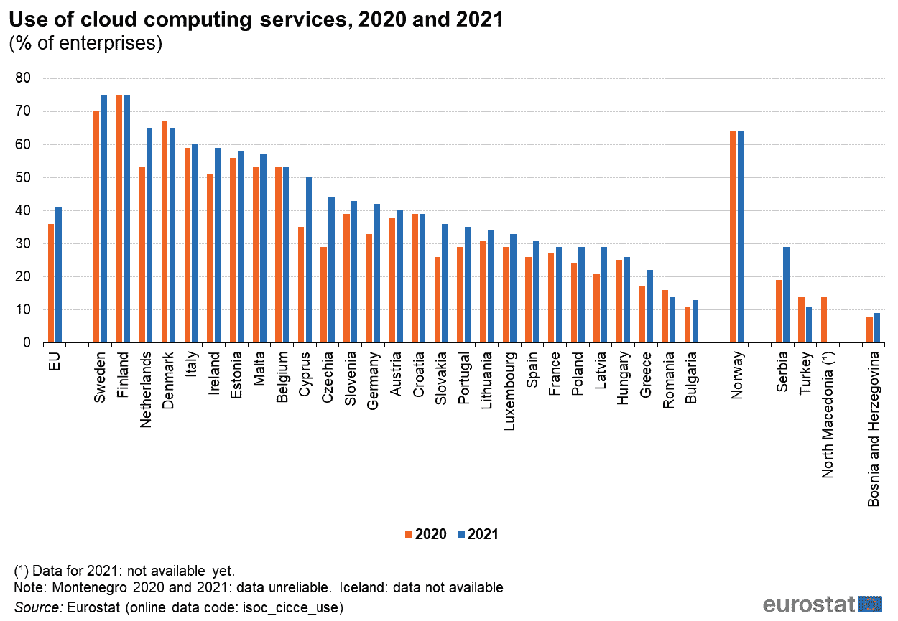

Adoption of cloud computing services in the European Union (Image source: [Eurostat](https://ec.europa.eu/eurostat/statistics-explained/index.php?title=Cloud_computing_-_statistics_on_the_use_by_enterprises))

详细地说:

*   瑞典(75%)
*   芬兰(75%)
*   荷兰(65%)
*   丹麦(65%)
*   意大利(60%)
*   爱尔兰(59%)
*   爱沙尼亚(58%)
*   马耳他(57%)
*   比利时(53%)

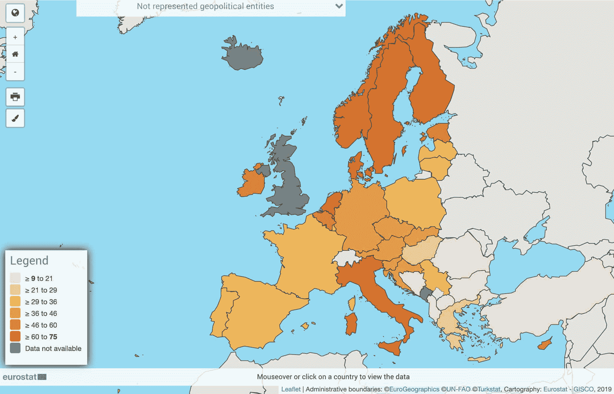

A map showing the adoption of cloud technologies per country in the EU in 2021 (Image source: [Eurostat](https://ec.europa.eu/eurostat/databrowser/view/isoc_cicce_use/default/map?lang=en))

在欧盟，云服务在信息和通信行业以及专业、技术和科学领域应用最为广泛。

纵观各种规模的公司，云服务在大公司中的使用率最高并不奇怪，但在中小型公司中的采用率也有很大增长。

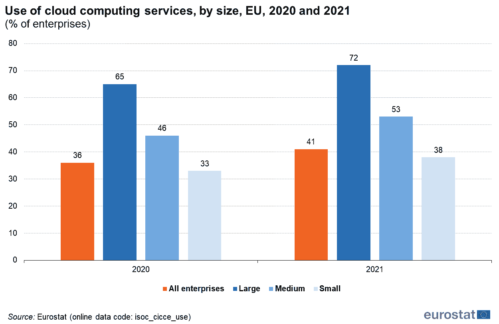

Adoption of cloud computing services in the EU by company size (Image source: [Eurostat](https://ec.europa.eu/eurostat/databrowser/view/isoc_cicce_use/default/map?lang=en))

另一个有助于了解欧洲云市场状况的有趣细分是按服务模式对云服务选择的细分。

2021 年的欧洲，绝大多数公司(94%)使用 [SaaS(软件即服务)](https://kinsta.com/blog/growing-saas-company/)服务，包括电子邮件服务、办公应用、财务或会计应用、安全、ERP、CRM 等。

74%的企业使用至少一种 [IaaS(基础设施即服务)](https://kinsta.com/blog/what-is-iaas/)服务，即数据库托管、文件存储或计算能力。

最后，21%的欧洲企业使用 [PaaS(平台即服务)](https://kinsta.com/blog/what-is-paas/)服务，其中包括用于应用程序开发、测试和/或部署的云托管服务。

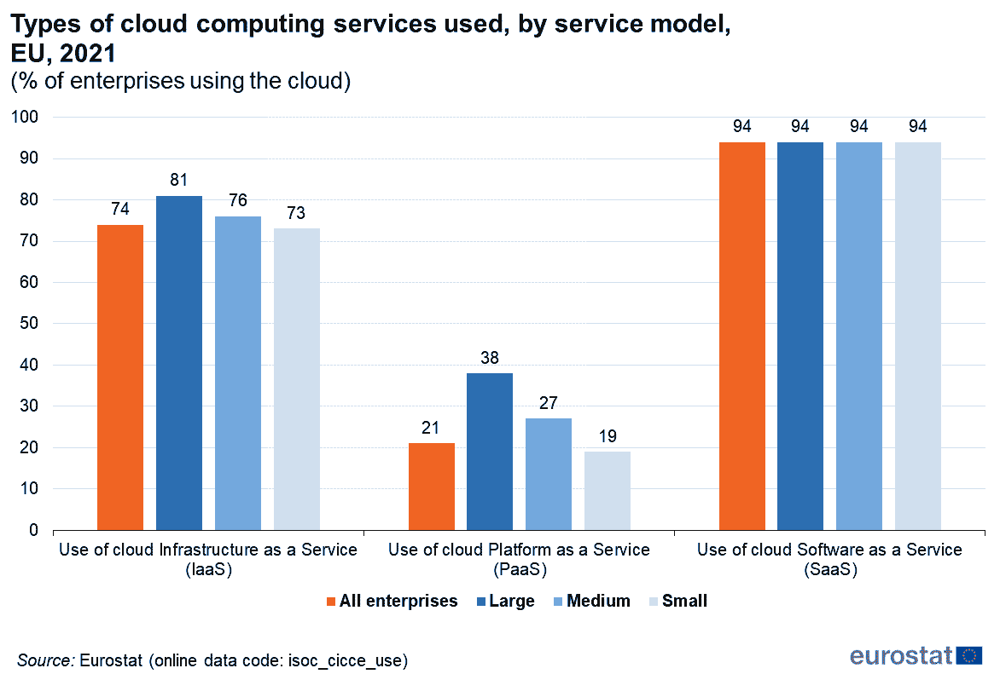

Breakdown of cloud services by service model in EU in 2021 (Image source: [Eurostat](https://ec.europa.eu/eurostat/databrowser/view/isoc_cicce_use/default/map?lang=en))

欧盟统计局报告中最后一个有趣的区别是关于企业对云服务的依赖程度。欧统局的研究假设，企业使用的云服务的复杂程度越高，对云服务的依赖程度就越高。

基于这一假设，样本中的公司根据所使用的云服务类型分为三类:

*   **使用基本云服务**的公司，如“电子邮件即云服务”、“办公软件即云服务”或“存储文件或运行企业自有软件的计算能力”
*   **使用中间云服务**的公司，如“财务或会计软件应用程序作为云服务”、“ERP 软件应用程序作为云服务”或“CRM 软件应用程序作为云服务”，但没有复杂的服务。
*   **使用高级云服务**的公司，如“安全软件应用程序”、“托管企业数据库”或“为应用程序开发、测试或部署提供托管环境的计算平台”

欧盟统计局的数据显示，接受调查的公司中有 30%表示他们至少使用一种复杂的云服务。在采用这些服务方面，瑞典(60%)、丹麦(59%)、芬兰(57%)、荷兰(56%)和意大利(48%)依次排名。

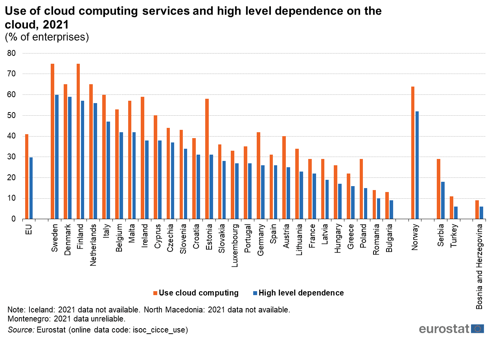

Service usage and cloud dependence in the EU (Image source: [Eurostat](https://ec.europa.eu/eurostat/databrowser/view/isoc_cicce_use/default/map?lang=en))

## 针对云服务提供商的欧洲法规和要求

根据欧盟统计局的研究，很明显，欧洲公司对云计算技术的采用正在稳步增长，预计这一趋势将在未来几年继续下去。

然而，在欧洲采用云技术需要符合数据主权、保护和隐私的要求，以及保护竞争的法规。

根据欧洲议会 2020 年的白皮书:

> 欧盟成员国越来越担心的另一个问题是，它们对本国境内产生的数据缺乏控制。全球公共云市场目前主要由美国和亚洲公司主导，鉴于 2018 年美国云法案赋予美国执法机构获取外国人个人数据的广泛治外法权，欧洲政府和欧洲的行业参与者已经开始担心使用非欧洲数据服务。欧洲政府已经开始放弃非欧盟公司提供的云解决方案，转而部署欧洲设计的云解决方案。

这带来了一个特别复杂的竞争格局，非欧盟云基础设施和服务提供商必须适应这一格局才能在市场中运营。

为了满足欧盟设定的数字主权要求，“同时推动欧洲组织的下一波增长和转型”，谷歌推出了[谷歌云主权解决方案](https://cloud.google.com/blog/products/identity-security/advancing-digital-sovereignty-on-europes-terms)，并与多家欧洲公司合作，包括德国的[T-Systems](https://www.t-systems.com/de/en/cloud-services/managed-platform-services/sovereign-cloud/sovereign-cloud-powered-by-google-cloud)、法国的[S3NS](https://www.s3ns.io/en/news/partnership-announcement)、西班牙的[min sait](https://www.minsait.com/en/news/media-room/google-cloud-partners-minsait-boost-digital-sovereignity-spain)和意大利的[Telecom Italia](https://www.gruppotim.it/it/archivio-stampa/corporate/2020/CS-TIM-Google-04-03-2020.html):

> 我们的主权解决方案旨在支持数据、运营和软件主权要求，增强客户对迁移到云的敏感数据的控制和透明度。例如，主权解决方案可以帮助支持遵守欧洲法规(如 GDPR)和法律裁决(如 Schrems II)。

所有主要的云基础设施提供商都在采取措施，使其产品和服务符合欧洲法规。在谷歌的主要竞争对手中，微软和 AWS 都采用了自己的程序来确保数据安全、保密和主权。

[微软推出了](https://blogs.microsoft.com/blog/2022/07/19/microsoft-cloud-for-sovereignty-the-most-flexible-and-comprehensive-solution-for-digital-sovereignty/) [微软云主权](https://www.microsoft.com/en-us/industry/sovereignty/cloud)，为整个微软云提供派驻选项，包括微软 365、Dynamics 365 和 Azure，而[亚马逊 AWS 确保](https://aws.amazon.com/compliance/eu-data-protection/)使用 AWS 云服务的组织能够[完全符合](https://aws.amazon.com/it/blogs/security/new-idc-whitepaper-released-trusted-cloud-overcoming-the-tension-between-data-sovereignty-and-accelerated-digital-transformation/)欧洲法规。

虽然这是总体情况，但应该注意的是，欧盟不同国家采用云计算的速度并不相同。

接下来的部分提供了主要欧盟市场的细分。我们将了解企业最广泛使用的云服务，尝试了解欧洲背景下各国市场的特殊性，以及谷歌云如何满足各个市场的特殊性，以提供符合当地法规的尖端技术。

## 法国的云计算

根据欧盟统计局的数据，法国企业对云计算的采用略有增加，从 2020 年的 27%上升到 2021 年的 29%。与其他欧洲国家相比，这些数值并不算很高，但仍与总体增长保持一致。

在 2021 年使用一项或多项云计算服务的法国公司中，云存储服务(76%)和云中的电子邮件(67%)等基础服务的采用率最高。复杂的服务也被法国公司广泛使用，59%的企业使用数据库托管服务。

下面是细目分类:

1.  **基本服务**
    *   67%的人在云中使用电子邮件服务
    *   76%使用云存储服务
    *   54%的人在云中使用办公软件
2.  **中间服务**
    *   44%使用财务或会计软件应用程序
    *   30%使用 CRM 软件应用程序
    *   22%将计算能力用于企业自己的软件服务
    *   31%使用 ERP 软件应用程序
3.  **尖端服务**
    *   51%使用安全应用程序
    *   59%使用数据库托管服务
    *   25%使用云服务，如应用程序开发、测试或部署平台

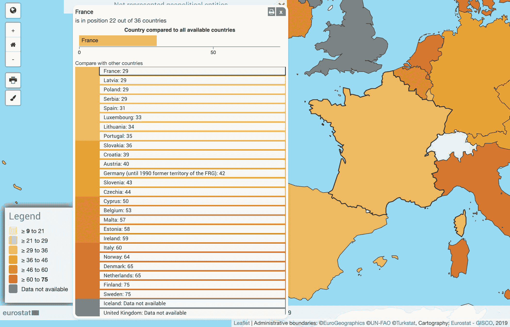

Cloud computing service adoption in France in 2021 (Image source: [Eurostat](https://ec.europa.eu/eurostat/databrowser/view/isoc_cicce_use/default/map?lang=en))

尽管法国并不是向云计算冲刺最快的国家之一，但法国感受到了云计算技术的重要性，不仅在当前的市场形势下如此，在未来的前景中也是如此。特别值得一提的是，*竞争管理局*表示数字部门是重中之重，[启动了一项生态系统调查](https://www.autoritedelaconcurrence.fr/en/communiques-de-presse/autorite-de-la-concurrence-starts-proceedings-ex-officio-analyse-competition)，调查结果将于 2023 年公布:

> 因此，云为消费者、公司和公共管理部门提供了多种优势，可以轻松快速地访问计算资源。云还允许新类型的工作组织，这在新冠肺炎疫情引发的危机期间尤其有用。这一观点出现在法国和欧洲云市场蓬勃发展的时候，预计未来几年平均年增长率将超过 25%，这给经济带来了巨大的价值创造挑战。云技术的发展伴随着公共机构对创新技术研发的大力支持，以支持经济以及欧洲和法国工业的数字化。最近支持法国云计算产业的国家计划就是一个例证。

在法国，云计算技术是政府和公共机构关注的焦点，因为它们对国民经济产生了影响，并且在未来会越来越大。法国政府拨款 18 亿欧元支持[法国云生态系统](https://www.entreprises.gouv.fr/fr/actualites/numerique/strategie-nationale-cloud-lancement-du-plan-industriel-de-soutien-la-filiere)，目标如下:

*   法国云服务提供商获得了足够的技术和商业基础，从而在当今的关键市场上具有竞争力。
*   政府机构、大型企业和战略公司为其敏感数据使用可信云(*cloud de confidence*)产品。
*   法国数据经济的发展围绕着基于可信云产品的数据空间。

### 法国的谷歌云

使用最先进的云技术满足法国主权标准和 *[云安全](https://www.lemondeinformatique.fr/actualites/lire-le-gouvernement-reoriente-sa-strategie-sur-le-cloud-de-confiance-82937.html)* 要求的需求促使[谷歌云和法国网络安全公司 Thales](https://www.thalesgroup.com/en/group/investors/press_release/thales-and-google-cloud-announce-strategic-partnership-jointly) 合作，共同提供可信的云产品:

> 谷歌云的服务将定期得到新创新的增强和补充，将带来弹性、敏捷性和技术开放性，使公司能够透明和自主地创新，而不会受到供应商的束缚。作为 40 多年来网络安全领域的领导者，泰雷兹将通过其网络安全运营中心确保加密密钥、访问、身份和网络威胁监控的管理，为法国的主权要求提供必要的保证。因此，泰雷兹提供了法国客户所需的信任和安全级别，以便他们可以将其最敏感的应用程序迁移到云，同时保持控制。

但是，除了与泰雷兹的合作关系，还有更多。为了回应法国当局对安全和数据主权的担忧，谷歌宣布在巴黎开设新的云区域。那一次，谷歌云法国公司董事总经理安东尼·西罗特在谷歌云博客上写道:

> 在谷歌云，我们认识到，要想真正全球化，我们也必须本地化。这意味着我们需要尽可能接近我们的客户、他们的位置、他们的法规和他们的价值观。

并且:

> 新法兰西地区(europe-west 9)旨在帮助打破法国采用云的障碍，将独特的可扩展、可持续、安全和创新技术置于触手可及的范围内，以便法国组织能够接受和推动数字化转型。

位于巴黎的新[云区域](https://kinsta.com/feature-updates/google-cloud-paris-data-center/)将允许法国的企业和公共行政部门托管和“运行他们的应用程序，在本地存储数据，并更好地利用实时数据、分析和人工智能技术。”

这是蓬勃发展的市场中的重要一步，因为它确立了谷歌云在法国的存在符合[法国和欧洲的安全和主权要求](https://cloud.google.com/blog/products/infrastructure/google-cloud-region-in-paris-france-now-open):

> 在整个欧洲，各行各业各种规模的公司都在寻求将其任务关键型工作负载和数据迁移到云中。但是，尽管云的优势已经得到证实，从敏捷性到可扩展性到性能和创新潜力，许多 IT 决策者还是因为缺乏信任而选择了较少的技术能力。除了强大的嵌入式安全功能之外，Google Cloud 还提供各种控制来帮助满足您独特的合规性、隐私和数字主权需求，例如在欧洲地理区域保存数据的能力、本地管理和客户支持、对管理访问的全面可见性和控制，以及使用您在 Google Cloud 基础架构之外控制和管理的密钥对数据进行加密。

谷歌云对法国经济的影响将是相当大的。最近的研究估计，到 2027 年，国内生产总值将增长 24 至 26 亿欧元，新增就业岗位将达到 13，000 至 14，000 个。

## 德国的云计算

根据欧盟统计局的报告，德国是欧洲采用云计算技术增长最快的国家之一，**使用云服务的企业从 2020 年的 33%上升到 2021 年的 42%**。

但是德国公司采用云计算有什么不同呢？

欧盟统计局的数据显示，大多数德国企业使用基本的云服务，而少数企业使用中等复杂性的服务。其中相当一部分都使用高复杂性的云服务，如数据库或应用程序托管和安全应用程序。

详细地说:

1.  **基本服务**
    *   65%的人在云中使用电子邮件服务
    *   61%使用云存储服务
    *   55%的人在云中使用办公软件
2.  **中间服务**
    *   40%使用财务或会计软件应用程序
    *   21%使用 CRM 软件应用程序
    *   25%将计算能力用于企业自己的软件服务
    *   18%使用 ERP 软件应用程序
3.  **尖端服务**
    *   48%的人使用安全应用程序
    *   33%使用数据库托管服务
    *   23%使用云服务，如应用程序开发、测试或部署平台

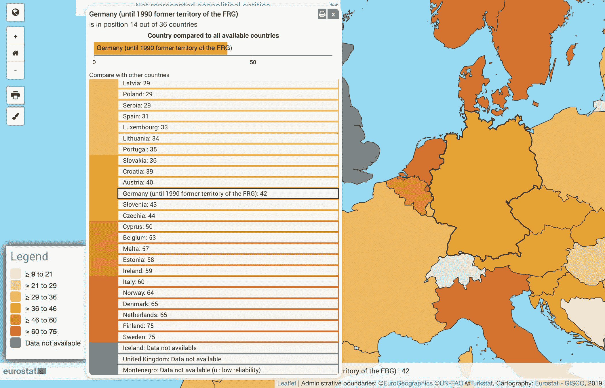

Cloud computing service adoption in Germany in 2021 (Image source: [Eurostat](https://ec.europa.eu/eurostat/databrowser/view/isoc_cicce_use/default/map?lang=en))

其他研究人员证实了德国对云计算服务需求的强劲增长。根据 ISG 提供商 Lens 的一项研究，对云计算服务的需求增长如此之快，以至于到 2025 年将占数据中心容量的一半以上:

> 数字化的使用越来越多，加上现代企业对弹性和灵活性的需求不断增加，推动了对云服务的需求不断增长。为了提高灵活性，企业正在数据中心和托管及托管设施中使用云技术，以便在最合适的基础设施中快速部署新服务。对服务支持的需求增加了，因为处理这种架构和技术很复杂，而且在大多数情况下，内部工作人员无法管理。企业正在减少对自己硬件的投资，并依靠云提供商的灵活性和可扩展性来降低资本支出。

根据 ISG 的报告，云计算的增长推动了德国数字网络的扩张和数字化的进步，法兰克福德 CIX 节点的[数据吞吐量的快速增长就是明证，从 2020 年 1 月的 7.5 Tbit/s 增长到 2022 年 10 月的 14 Tbit/s 以上。这在不到三年的时间里几乎翻了一番。](https://www.de-cix.net/en/locations/frankfurt/statistics)

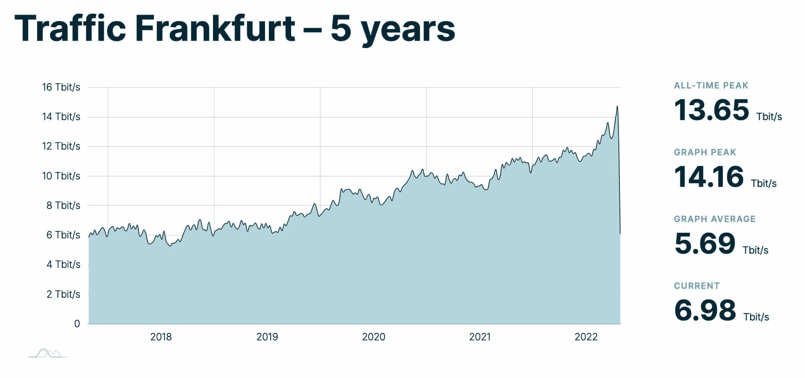

Frankfurt traffic statistics (Image source: [DE CIX](https://www.de-cix.net/en/locations/frankfurt/statistics))

不断增长的需求加上不断减少的资源，使得人们对数据中心的建设有了更多的认识。[数据中心能效](https://en.wikipedia.org/wiki/Power_usage_effectiveness)稳步提升，[ISG 报告称](https://research.isg-one.com/reportaction/Quadrant-NextGen-2022-Germany/Marketing):

> 2020 年，平均超级用户效率(PUE)值为 1.63，但目前每个新数据中心的平均 PUE 值正在降至 1.3 及以下。

### 德国的谷歌云

德国在欧洲和全球经济中扮演着重要角色，所以看到谷歌对德国市场的关注就不足为奇了。谷歌在德国的第一个办公室于 2001 年开业，到 2021 年，他们在德国各地的四个办公室雇用了 2500 名员工。

2021 年，[谷歌宣布了一项到 2030 年**10 亿欧元的庞大投资计划**](https://cloud.google.com/blog/products/infrastructure/google-invests-1-billion-euros-in-germanys-digital-future)，包括在法兰克福扩展云区域，在柏林-勃兰登堡引入一个新的云区域，分为三个区域，以及在可再生能源领域的广泛投资计划:

> 随着我们在法兰克福一个新的谷歌所有的 Hanau 设施中的云区域的扩展，在柏林-勃兰登堡的新的谷歌云区域，以及在可再生能源方面的广泛投资计划，我们的承诺是明确的:谷歌正在投资德国的潜力，并支持向数字化和可持续经济的过渡。从现在(2021 年)到 2030 年，这一数字基础设施和清洁能源投资总额将达到约 10 亿欧元。

早在 2020 年，[谷歌公开宣布了](https://blog.google/outreach-initiatives/sustainability/our-third-decade-climate-action-realizing-carbon-free-future/)到 2030 年利用[无碳能源](https://cloud.google.com/sustainability/region-carbon)开展业务的目标，旨在*向云客户提供业内最干净的云之一，同时帮助欧洲实现其雄心勃勃的气候目标*。

考虑到这一点，谷歌选择 [ENGIE Deutschland](https://www.engie.com/en/journalists/press-releases/engie-and-google-sign-24-7-carbon-free-energy-supply-agreement-in-germany-and-strengthen-existing-collaboration) 作为他们在德国的无碳能源供应商:

> 这是欧洲第一个此类能源供应，重点是为谷歌运营的每个小时采购无碳能源。这一新协议不仅将为欧洲的行业和更多 24/7 无碳能源合同绘制路线图，还将为我们的云客户提供另外两个可以降低碳足迹的区域。重要的是，通过与我们的能源供应商合作，改变向客户提供清洁能源的方式，谷歌正在支持德国电网更广泛的脱碳。

这是一个创新的合作伙伴关系，旨在促进可再生能源的使用，包括现有的无碳能源、风能、太阳能和下一代技术，以及使用人工智能的，其明确目标是推进先进基础设施和清洁能源项目的发展，帮助加快数字化转型，并为德国和欧洲公司确保可持续的未来。

与欧洲其他国家一样，谷歌云在德国的另一个重要因素是提供符合欧盟安全、隐私和数字主权要求的云解决方案，而不损害功能或创新。带着这个目标，谷歌推出了[云。按欧洲的说法](https://cloud.google.com/blog/products/identity-security/helping-build-the-digital-future-on-europes-terms):

> 作为该计划的一部分，我们将继续展示我们提供云服务的承诺，提供最高级别的数字主权，同时为欧洲的企业和组织带来下一波增长和转型。

作为该计划的一部分，[谷歌](https://www.googlecloudpresscorner.com/2021-09-07-T-Systems-and-Google-Cloud-Partner-to-Deliver-Sovereign-Cloud-for-Germany)和 [T-Systems](https://www.t-systems.com/de/en/newsroom/news/t-systems-and-google-cloud-partner-to-deliver-sovereign-cloud-for-germany-450474) 宣布合作在德国为私人和公共组织建立主权云服务。

## 云计算在意大利

根据欧盟统计局的报告，意大利是采用云技术速度较快的欧洲国家之一。**2021 年，60%的意大利企业使用至少一项云服务。**

这些企业中的绝大多数使用基本服务，如云中的电子邮件托管(96%)，但更高级服务的使用也相当普遍，70%的企业使用安全软件应用程序。

以下是云技术在意大利的采用情况:

1.  **基本服务**
    *   96%的人在云中使用电子邮件服务
    *   58%使用云存储服务
    *   58%的人在云中使用办公软件
2.  **中间服务**
    *   52%使用财务或会计软件应用程序
    *   19%使用 CRM 软件应用程序
    *   14%将计算能力用于企业自己的软件服务
    *   20%使用 ERP 软件应用程序
3.  **尖端服务**
    *   70%使用安全应用程序
    *   39%使用数据库托管服务
    *   10%使用云服务，如应用程序开发、测试或部署平台

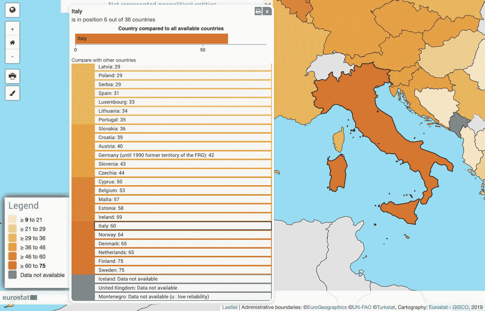

Cloud computing service adoption in Italy in 2021 (Image source: [Eurostat](https://ec.europa.eu/eurostat/databrowser/view/isoc_cicce_use/default/map?lang=en))

根据意大利米兰理工大学[云转型观测站](https://www.osservatori.net/it/ricerche/osservatori-attivi/cloud-transformation)，[2021 年意大利](https://www.osservatori.net/it/ricerche/comunicati-stampa/cloud-italia-mercato)云市场价值**38.4 亿欧元**，**比 2020 年**增长 16%。

从观察站收集的数据来看，SaaS 服务不再是该国的驱动力。2021 年，增长最强劲的是 PaaS(平台即服务)，比上一年增长了+31%，IaaS(基础设施即服务)增长了+23%。

这些都是显著的增长率，尽管云的采用并不总是伴随着适当的组织措施。云转型观察站指出 *34%的公司报告称，他们尚未伴随这一技术之旅采取针对 IT 部门的组织变革行动，如丰富现有员工的技能、用云技术专家强化组织结构或审查相关业务流程。*

简而言之，为了充分利用云提供的增长和发展潜力，组织现代化也是必要的。

关于服务部署模式，在意大利，公共云和混合云的支出份额最大，2021 年支出约 23.9 亿欧元，比 2020 年增长 19%。

在这一领域，PaaS 服务在 2021 年实现了最高增长，总支出达到 3.9 亿欧元，比 2020 年增长了+31%。

仍然参考服务部署模型，混合云和多云策略在大型企业中最受欢迎，这些企业平均使用来自 5 个不同提供商的服务。

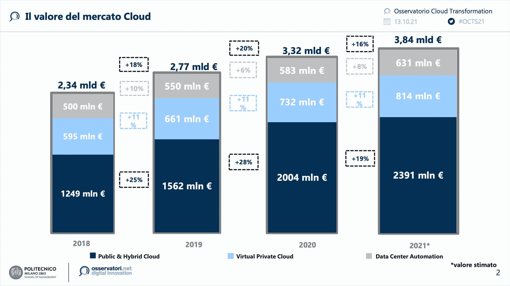

Value of the Cloud market in Italy (Image source: 2021 Research from the Cloud Transformation Observatory of Politecnico di Milano – [osservatori.net](https://www.osservatori.net/))

根据云转型观察站的报告，企业转向云服务的好处是[多种多样的](https://www.osservatori.net/it/ricerche/comunicati-stampa/cloud-italia-mercato):

> 好处有很多:从应用程序的可伸缩性、灵活性和可移植性的增加，到与快速开发相关的更广泛的设计灵活性，到更低的软件实现和管理成本。

但是，哪些经济/制造业部门受意大利云计算采用增长的影响最大？

看数据，似乎没有一个部门被排除在外，无论是公共部门还是私营部门。

在私营部门中，[银行业表现突出](https://www.corriere.it/economia/risparmio/22_marzo_21/banche-piu-53-miliardi-digitale-testa-cloud-mobile-banking-cybersicurezza-831f035e-a8f6-11ec-8325-fd7a7d1851e8.shtml)，云计算投资增长 64%:

> **云计算**，去年是研究和调查中最受关注的领域，今年是十大投资重点中最常被报道的项目，尤其是大型银行(图片来源:[ABI 实验室 2022_](https://www.abilab.it/documents/20124/1184379/3.+Forum+ABI+Lab+22+03+21+Scenario.pdf/a616d16f-61c4-35b2-2272-88588b3c8c50?t=1648544372826) )

如果云计算的采用影响了很大一部分私营经济，那么公共部门就有望迎来一场真正的云革命。为了确保国家的技术自主性、安全控制数据并提高数字服务的弹性，数字转型部和国家网络安全局起草了 [Strategia Cloud Italia](https://innovazione.gov.it/dipartimento/focus/strategia-cloud-italia/) ，其中包括“公共行政数据和数字服务云迁移路径战略指南”:

> 向云的迁移使公共行政部门能够提供符合隐私保护原则、欧洲和国家机构建议的数字服务以及安全、高效和可靠的技术基础设施，同时保持国家对数据的战略自主性、安全性和国家控制的必要保证(图片来源:[Team per la Trasformazione Digitale](https://docs.italia.it/italia/cloud-italia/strategia-cloud-italia-docs/it/stabile/in_sintesi.html))

### 意大利的谷歌云

该国与云相关的兴奋与最近在米兰[新谷歌云区域](https://kinsta.com/feature-updates/google-cloud-milan-data-center/) ( *欧洲-西方 8* )的[开放](https://blog.google/intl/it-it/prodotti/cloud/il-cloud-pensato-per-litalia-apre-la-nuova-google-cloud-region-di-milano/)以及计划于 2022 年底在都灵开放第二个云区域相结合。

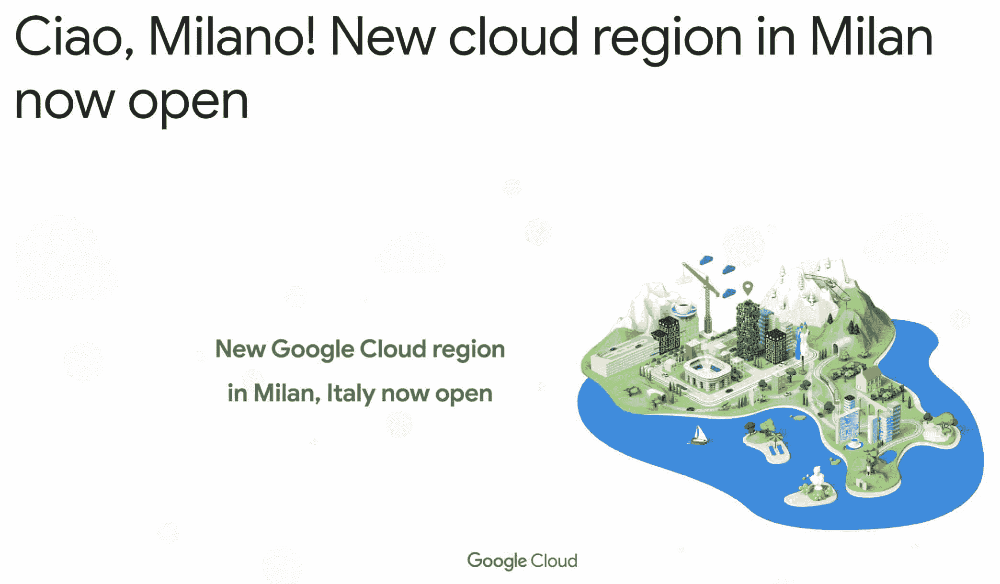

A new Google Cloud Region in Milan. (Image source: [Google Cloud](https://blog.google/intl/it-it/prodotti/cloud/il-cloud-pensato-per-litalia-apre-la-nuova-google-cloud-region-di-milano/))

新的云区域将使意大利用户能够存储数据，利用“快速、可靠、安全”的云服务，并从位于意大利的数据中心开发和部署高可用性、低延迟的应用程序。所有这一切都归功于一个被定义为“[行业最干净的云](https://cloud.google.com/sustainability)”的云解决方案

在与 TIM 和 Banca Intesa 合作的两个新的[云区](https://kinsta.com/knowledgebase/google-cloud-data-center-locations/)开放之前，都灵大学进行了一项[研究，该研究计算出到 2025 年仅皮埃蒙特和伦巴第地区的诱发效应就可能高达**33 亿欧元和 65，000 个新工作岗位**。这还不包括随着企业采用云基础设施，这两个新数据中心将对整个国民经济和生产系统产生的结构性影响。](https://www.noovle.com/it/news/apertura-nuove-google-cloud-region/)

[根据谷歌](https://blog.google/intl/it-it/prodotti/cloud/il-cloud-pensato-per-litalia-apre-la-nuova-google-cloud-region-di-milano/):

> 新米兰地区旨在提供创新的公共、私有和混合云服务，帮助各种规模和行业的意大利公司加速数字化转型。

此外，谷歌云的新数据中心将有力推动已经开始的经济现代化进程，以及公共和私人组织以及私人公民的基础设施迁移:

## 注册订阅时事通讯

### 想知道我们是怎么让流量增长超过 1000%的吗？

加入 20，000 多名获得我们每周时事通讯和内部消息的人的行列吧！

[Subscribe Now](#newsletter)

> 这一新区域代表了建设地方能力的具体步骤，以满足意大利数字经济在数据可用性和驻留、数字主权和可持续性方面的需求。

转到技术方面，新的云区域将拥有[标准谷歌云服务](https://cloud.google.com/gcp/):计算引擎、谷歌 Kubernetes 引擎、云存储、持久磁盘、CloudSQL 和云身份。

此外，意大利谷歌云客户将受益于数据驻留控制、默认加密、组织政策和 VPC 服务控制。

在意大利拥有两个云区域的一个战略特点将是安全性:在同一个国家拥有两个区域将允许意大利谷歌云客户拥有一个复制的本地站点，以确保更好的灾难恢复和高地理可用性。

6 月 15 日，在米兰举行的两个云区域的[发布会](https://www.youtube.com/watch?v=PlwAjKHNIZQ)上，谷歌云意大利区经理 Fabio Fregi 强调:

> 谷歌是唯一一家在我们国家拥有两个区域的云提供商，这使得两个网站可以相互进行灾难恢复，这是意大利的一项独特功能，可以转化为可靠性、可用性和安全性。

但是不仅仅是安全。联合圣保罗银行信息系统执行董事 Enrico Bagnasco 强调了全国基础设施可扩展性和数据存储的重要性:

> 能够依靠强大的基础设施弹性和增长速度来满足业务需求，同时能够关闭和控制成本，从而非常灵活地分配成本，这对我们来说至关重要，就像在意大利境内拥有数据至关重要一样，因为对于一家受到高度监管的银行来说，数据方面是一个关键问题。

然而，谷歌云在意大利的存在并不仅限于基础设施。米兰和都灵两个数据中心的开放是一个更大投资计划(约 9 亿美元)的一部分，该计划既关注云基础设施的创建，也关注推动其在该国采用的**高级技术技能**。

甚至在米兰开设云区之前，谷歌就已经启动了三个不同的培训项目:

*   [open Future](https://www.openingfuture.it/):一个致力于中小企业、创业公司、学生和教师数字培训和发展的门户网站，由谷歌、TIM 和联合圣保罗银行合作而成。
*   Google Cloud Pro :一个关于云技术的免费培训项目，与 TIM 合作开发，面向整个意大利开发者生态系统。学生可以参加三种不同的教育课程——云工程师、云架构师或数据工程师——在课程结束时，他们可以参加考试，获得谷歌云认证。
*   数字意大利(Italia in Digitale):致力于中小企业和个人数字培训的项目。这些课程介绍了涵盖数字经济各个方面的主题:数字营销、数据管理、与客户沟通、启动在线业务、使用数据分析工具等。

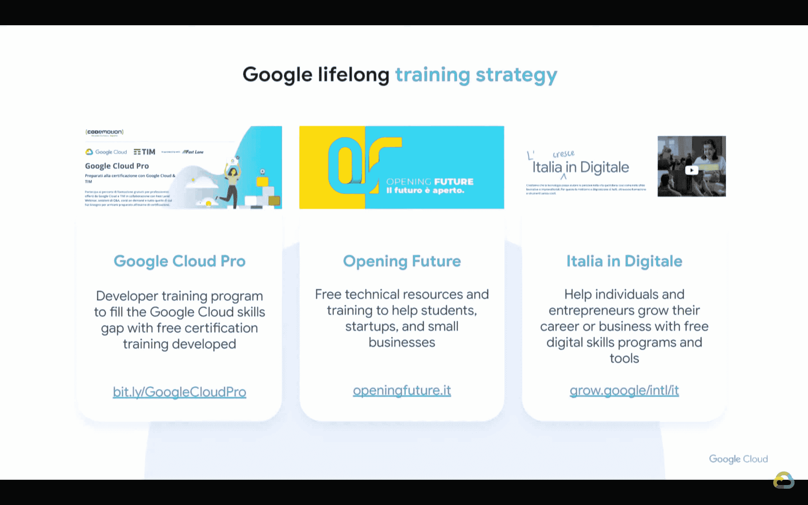

Google lifelong training strategy (Image source: [Google Cloud Events](https://www.youtube.com/watch?v=PlwAjKHNIZQ&t=6278s))

你可以在谷歌意大利博客文章中了解更多信息。

## 云计算在西班牙

与所有欧盟国家一样，**在 2020 年(26%)至 2021 年(31%)期间，西班牙使用至少一种云计算服务的公司数量显著增加**。

在至少使用一种云计算服务的 31%的企业中，绝大多数使用云中的电子邮件托管(82%)和云存储服务(80%)。使用高级云服务的公司比例也很高，62%使用安全应用程序，69%使用数据库托管服务。

详细地说:

1.  **基本服务**
    *   82%的人在云中使用电子邮件服务
    *   80%使用云存储服务
    *   63%的人在云中使用办公软件
2.  **中间服务**
    *   40%使用财务或会计软件应用程序
    *   38%的人使用 CRM 软件应用程序
    *   35%将计算能力用于企业自己的软件服务
    *   33%使用 ERP 软件应用程序
3.  **尖端服务**
    *   62%的人使用安全应用程序
    *   69%使用数据库托管服务
    *   28%使用云服务，如应用程序开发、测试或部署平台

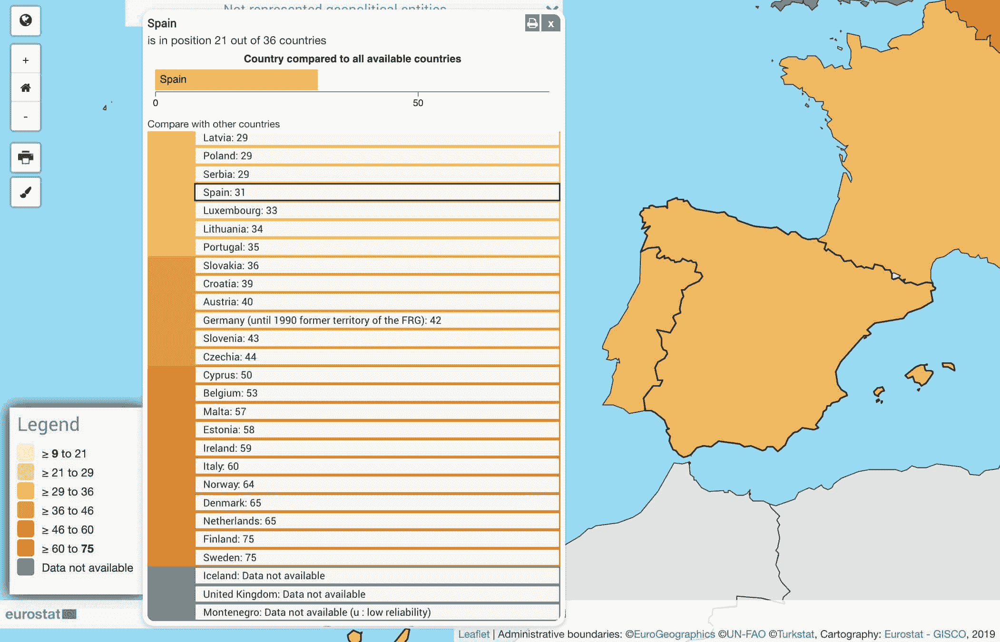

Cloud computing service adoption in Spain in 2021 (Image source: [Eurostat](https://ec.europa.eu/eurostat/databrowser/view/isoc_cicce_use/default/map?lang=en))

欧盟统计局的数据得到了欧盟委员会 [DESI 报告](https://digital-strategy.ec.europa.eu/en/policies/countries-digitisation-performance)(数字经济和社会指数)的证实，该报告显示，2021 年西班牙企业在云计算等高新技术方面仍然落后，27%的西班牙企业采用了云技术，而欧洲的平均采用率为 34%。你可以[从欧盟委员会网站下载完整的报告](https://digital-strategy.ec.europa.eu/en/policies/countries-digitisation-performance)。

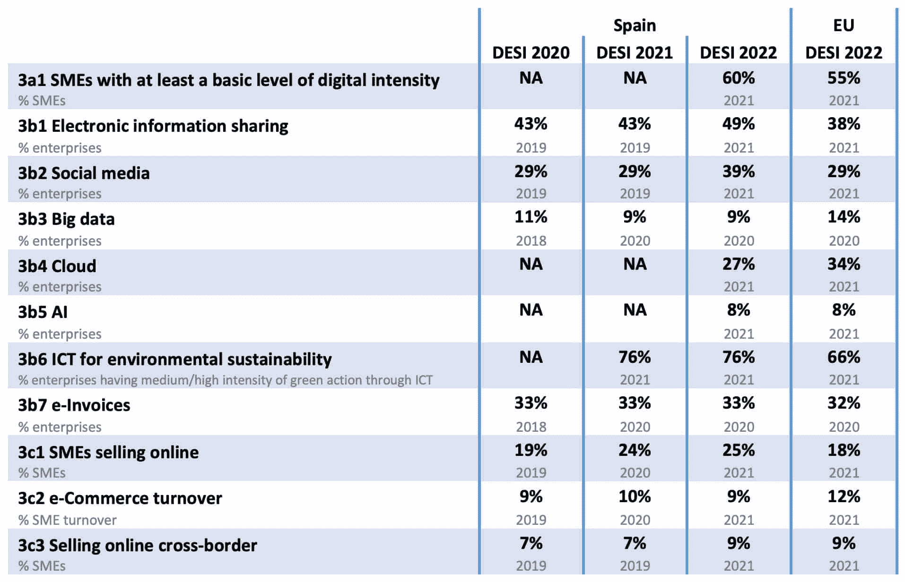

Spain in the Digital Economy and Society Index (Source [DESI country profile Spain](https://digital-strategy.ec.europa.eu/en/policies/desi-spain))

但正如世界其他主要经济体一样，西班牙对云技术的兴趣越来越浓厚。西班牙当局意识到了[数字化和采用云技术](https://espanadigital.gob.es/en)作为该国公共和私营组织发展和现代化的资源和机遇的重要性。

[据 Nubes](https://www.nubes.red/observatorio/informes) 称，一个由*asociación espa OLA de Startups*、**支持的项目，西班牙的公共云市场在 2020 年**创造了约 28.6 亿欧元的收入，其中大部分来自软件即服务领域，约 10.6 亿欧元([在此下载报告](https://www.nubes.red/s/INFORME-AES_-Mercado-cloud-computing-Espaa_R2R_Abril-2022.pdf))。

### 西班牙的谷歌云

早在 2020 年，谷歌云和西班牙电信[宣布了一项新的合作伙伴关系](https://www.googlecloudpresscorner.com/2020-06-11-Google-Cloud-and-Telefonica-Partner-to-Accelerate-Digital-Transformation-for-Spanish-Businesses)，以加速西班牙公司的数字化转型。他们提出了几个目标，包括:

*   推动公司的数字化，支持西班牙的公共管理，帮助西班牙在新冠肺炎事件后实现经济复苏
*   在西班牙推出一个云区
*   使用谷歌云的移动边缘计算平台联合开发 5G 解决方案组合

然后，在 2022 年 4 月，谷歌云西班牙国家领导人艾萨克·赫尔南德斯(Isaac Hernandez)最终宣布与西班牙电信(Telefónica)在[合作](https://cloud.google.com/blog/products/infrastructure/new-google-cloud-region-in-madrid-spain-now-open)开设[马德里云区域](https://kinsta.com/feature-updates/google-cloud-madrid-data-center/) ( *欧洲-西南 1* ):

> 新马德里地区(欧洲-西南 1)旨在帮助满足西班牙企业不断增长的技术需求，提供具有高国际安全和数据保护标准的低延迟、高可用性云服务，所有这些都基于业界最干净的云。

新的云区域旨在[根据当地法规创造新的数字化转型机会](https://www.telefonica.com/en/communication-room/google-cloud-and-telefonica-partner-to-accelerate-digital-transformation-for-spanish-businesses/)。它已经满足了政府对安全和主权的要求，这在高度管控的行业(如政府、医疗保健和金融服务)中尤为重要:

> 在马德里建立一个新区域有助于消除采用云的这些障碍，使西班牙企业和政府实体能够满足其在西班牙的可用性、数据驻留和可持续性需求，同时加快其数字化转型。

信任、安全、隐私和主权是云计算市场中公司的必备条件。为此，谷歌还与 Minsait 合作，共同为西班牙的公共和私人组织提供主权云解决方案。

该合作伙伴关系旨在通过鼓励创新，同时保持最敏感数据的私密性、安全性和主权，为公共和私营组织构建增强的可信云服务。该倡议得到了经济事务和数字转型部的支持。

谷歌在西班牙的承诺是广泛的。它还包括开发采用云技术的新技能。艾萨克·埃尔南德斯报道:

> 谷歌已经通过我们在西班牙的“与谷歌一起成长”计划帮助培训了 100 多万人，我们还计划在马拉加开设一个网络安全卓越中心，并在未来几年与 Indra Minsait 合作，支持创建人工智能实验室 Granada。

## 荷兰的云计算

根据欧盟统计局的数据，荷兰云计算技术的采用率正在快速增长，**从 2020 年使用至少一种云服务的企业的 53%上升到 2021 年的 65%**。

根据这一数据，在企业采用云技术的比率方面，荷兰在欧洲国家中排名第三。

但这还不是全部。根据欧盟统计局的数据，荷兰在采用复杂服务(如企业数据库托管服务)方面也领先于欧洲，有 78%的公司采用了复杂服务。

这是细目分类:

1.  **基本服务**
    *   82%的人在云中使用电子邮件服务
    *   81%使用云存储服务
    *   72%的人在云中使用办公软件
2.  **中间服务**
    *   66%的人使用财务或会计软件
    *   49%的人使用 CRM 软件应用程序
    *   28%将计算能力用于企业自己的软件服务
    *   35%使用 ERP 软件应用程序
3.  **尖端服务**
    *   64%使用安全应用程序
    *   78%使用数据库托管服务
    *   30%使用云服务，如应用程序开发、测试或部署平台

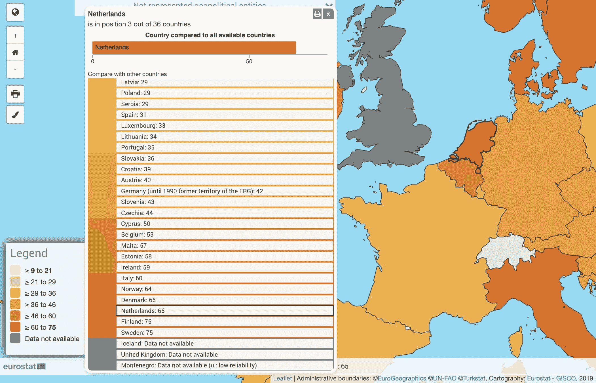

Cloud computing service adoption in the Netherlands in 2021 (Image source: [Eurostat](https://ec.europa.eu/eurostat/databrowser/view/isoc_cicce_use/default/map?lang=en))

荷兰无疑是处于数字化转型前沿的国家之一。根据数字经济与社会指数( [DESI 2022](https://digital-strategy.ec.europa.eu/en/policies/desi) )报告:

Struggling with downtime and WordPress problems? Kinsta is the hosting solution designed to save you time! [Check out our features](https://kinsta.com/features/)

> 在 2022 年版的数字经济和社会指数(DESI)中，荷兰在 27 个欧盟成员国中排名第三。该国一直是欧盟中表现最好的国家，尽管分数已经很高，但仍然能够在一些关键领域取得进展。

平均而言，荷兰企业的排名远高于欧洲其他国家，特别是在使用云技术(60%)、大数据(27%)和社交媒体(49%)的企业中。

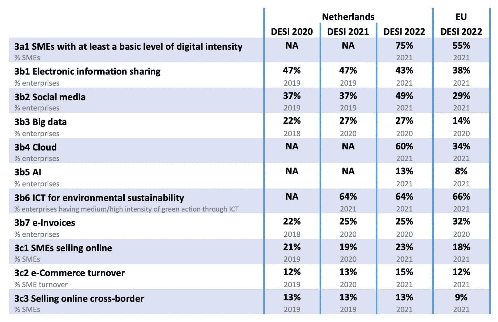

the Netherlands in the Digital Economy and Society Index (Source [DESI country profile Netherlands](https://digital-strategy.ec.europa.eu/en/policies/desi-netherlands))

虽然仍有需要改进的地方，但在经济和社会的云技术采用和数字化方面，荷兰是欧洲乃至世界上最先进的国家之一(另见[荷兰数字化战略 2.0](https://www.nederlanddigitaal.nl/documenten/publicaties/2019/11/13/english-version-of-the-dutch-digitalisation-strategy-2.0) )。

### 荷兰的谷歌云

鉴于荷兰在欧洲经济舞台上的重要性，早在 2016 年，谷歌就在荷兰格罗宁根省的 Eemshaven 投资 6 亿欧元建立了一个新的数据中心，这并不奇怪。

后来在 2018 年，[谷歌宣布](https://cloud.google.com/blog/products/gcp/google-cloud-platform-opens-region-in-the-netherlands)5 亿欧元的校园扩建；2019 年 6 月，一个[进一步扩张的 Eemshaven](https://www.google.com/about/datacenters/locations/eemshaven/)；而在 2020 年，[在 Middenmeer](https://www.google.com/intl/it/about/datacenters/locations/middenmeer/) 的一个新址。

这使得谷歌在荷兰数据中心的总投资达到 25 亿欧元。

此外，谷歌表示，其荷兰数据中心致力于使用可再生能源运行所有数据中心:

> 自 2017 年以来，我们一直将我们所有的年度电力消耗与 100%的可再生能源相匹配，并且在 2020 年，我们承诺到 2030 年，我们所有的数据中心和校园都将全天候使用无碳能源。为了帮助在荷兰实现这一目标，Google 与 Delfzijl 和 Zeeland (Krammer 和 Bouwdokken)的风力发电场以及 Delfzijl Sunport 的太阳能公园达成协议，为数据中心购买可再生能源。

### 来自荷兰云社区的见解:西蒙·贝斯德曼访谈

荷兰云计算社区的常务董事 Simon Besteman 向我们深入介绍了荷兰云计算的现状。

#### 关于 DCC(荷兰云社区)

> [荷兰云社区](https://dutchcloudcommunity.nl/) (DCC)是托管和云领域的一个分支机构，最近由两个分支机构合并而成:
> 
> *   ISP Connect，一个活跃于共享/虚拟主机领域的协会
> *   另一个组织是信息技术外包公司协会
> 
> 一位记者描述得很好:一个政党俱乐部，把成千上万的客户放在一台服务器上，另一个政党有成千上万的服务器供一个客户使用。
> 
> 这两个协会之间的区别被现实-市场-所掩盖，因为各方都参与了主机托管的各个方面。2020 年，DCC 作为一个拥有约一百名成员的组织成立。
> 
> 没有适用于托管公司的 SBI 代码，所以很难说出荷兰活跃的托管公司的确切数目。如果您在服务器上托管一些客户数据，您是 IT 公司还是托管公司？
> 
> DCC 的使命不仅是确保一个健康的部门，而且是自由和开放的互联网。DCC 在这方面发挥了积极作用。大约有 100 名成员，来自业内的大公司，也有小公司。
> 
> DCC 有会员和合作伙伴。合作伙伴通常是该行业的供应商，他们可以通过与 DCC 的合作关系与该行业进行沟通。这样，他们可以传播他们的信息。DCC 是这些合作伙伴能够以一种简单的方式联系到所有成员的地方——例如，在一年一度的烧烤会上。
> 
> 合作伙伴被视为赞助商。有的付钱成为合伙人；一些人分享知识作为回报，会员可以获得免费的建议，这当然包括会员成为这个合作伙伴的客户的选择。

#### DCC 做什么

> 荷兰云社区主要活跃在四个领域:
> 
> *   **宣传:**该行业正忙着从一个年轻的、不受监管的行业向一个受到严格监管的行业过渡，类似于电信行业。在报道荷兰公司托管的内容时，请考虑好的流程。
> *   教育行业对受过良好教育的年轻人需求很大。与高等技术学校共同设立了学士学习课程。它是作为一门双修课程设置的；学生每周在办公室工作四天，在教育部门工作一天。两门课程:网络工程和云安全与软件开发。
> *   **知识中心:** DCC 确保知识的共享。每个季度都有主题日，来自特定领域的专家分享知识。还有六个不同的工作组，成员和合作伙伴在安全、法律事务、可持续发展、社会责任等领域开展合作。“乌克兰云”就是一个例子，在这个项目中，荷兰的托管公司免费从乌克兰公司手中接管了托管服务，因此它仍然可以使用——尤其是在一个城市遭到轰炸的情况下。
> *   **社区:**每年 DCC 都会在 Cloudfest(德国的一大盛事)组织烧烤。在这里，荷兰之夜是一项盛事，大约 500 人聚集在一起交流知识。
> 
> 已经存在了一段时间的主机商，比如说，超过 10-15 年。他们有时非常重视自己的服务器，这可能会推迟转向云解决方案。对于许多方面来说，转向云是基于便利性和成本做出的选择，转向 Google Cloud、AWS 甚至本地私有云解决方案。

#### 使用 DCC 的公司数量

> 荷兰的收养率相当高，比利时的收养率略低。云优先政策不再只是大公司的专利，现在也适用于中小企业。
> 
> 2019 年，荷兰拥有 20 名以上员工的公司中有 75%在使用云，2021 年为 93%。COVID 疫情在这方面帮了大忙，比如在家工作。

#### 最高采用率

> 商业服务/贸易的采用率最高。教育和非营利组织在某种程度上落后于其他部门。这可能是因为大多数非营利组织都是由志愿者运营的，并且通常没有足够的知识和预算来支持云计算的愿望。学校有补贴选项，但不是所有学校都意识到这一点。

#### 云服务的各种用途

> *   办公室/生产力
> *   备份/存储
> *   流程/交易
> *   财务管理
> *   客户关系管理
> *   物流
> *   情报/分析
> *   发展
> 
> SaaS 在疫情期间从 65%猛增至 80%。与“旧”系统相比，许多人看到了无负担的巨大力量…尽管总有经理和管理员保护他们自己的系统以免丢掉工作。
> 
> 云在荷兰的采用率如此之高，是因为那里有一种务实的文化。我们有许多由年轻人拥有的公司，许多初创公司，没有一家初创公司会管理自己的 IT 基础设施和软件。

#### 云市场的总价值

> 2021 年，全球云市场成交额超过 2750 亿欧元。自 2017 年以来，该市场每年增长 20%至 30%。营业额的最大部分，大约 50%，是通过销售 SaaS 服务产生的。您可以在荷兰消费者与市场管理局的市场研究云服务文档(荷兰语内容)中了解更多信息。

#### 该地区最大的玩家

> 提供云服务的主要有三方，分别是[亚马逊网络服务(AWS)](https://kinsta.com/aws-market-share/) 、[微软 Azure](https://kinsta.com/azure-market-share/) a >、[谷歌云平台(GCP)](https://kinsta.com/google-cloud-market-share/) 。这三方有时被称为“超大规模”，因为他们占了所提供和使用的云服务的大部分。
> 
> 很大一部分客户/用户使用本地服务提供商/服务提供商，这也为用户开始使用公共云打开了大门。他们经常使用三个主要团体中的一个来提供他们自己的云服务。
> 
> 云服务市场近年来增长迅猛。这将在未来几年继续增长。将继续投资云服务的新用户和公司将继续推动增长。

我们要感谢[西蒙·贝斯特曼](https://dutchcloudcommunity.nl/het-team/simon-besteman/)参与此次采访。

## 欧盟其他国家的云计算

虽然云市场在较大的欧洲国家/市场增长迅速，但云计算技术在欧洲其他国家/市场的采用率却参差不齐。从北欧国家的最高位置到东欧和南欧国家的较低采用率不等。

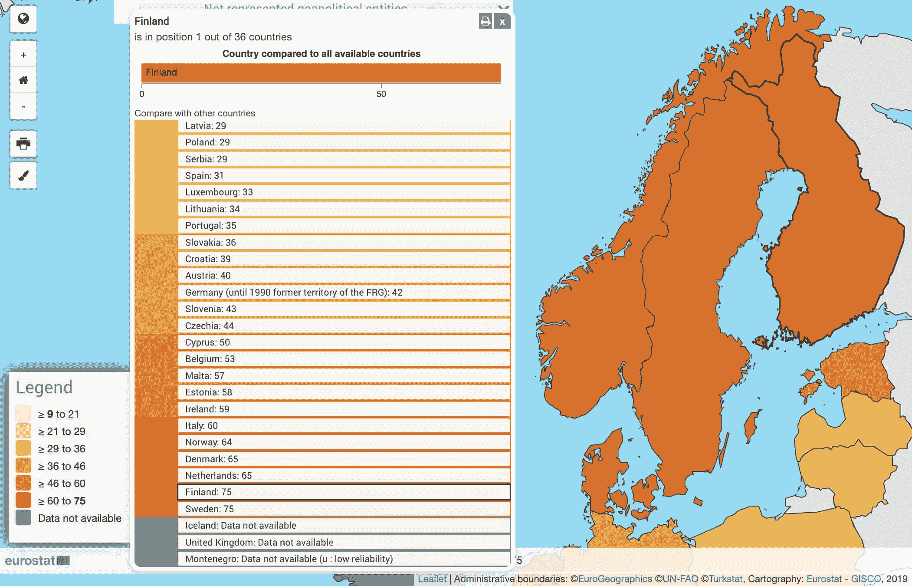

Cloud computing service adoption in Northern Europe in 2021 (Image source: [Eurostat](https://ec.europa.eu/eurostat/databrowser/view/isoc_cicce_use/default/map?lang=en))

在北欧国家中，云技术的采用率是惊人的:

*   芬兰 75%
*   Sweeden 75%
*   丹麦 65%
*   挪威 64%

根据欧盟统计局的数据，芬兰和瑞典在欧洲排名第一，2021 年有 75%的企业采用了至少一种云技术。丹麦和挪威(挪威不是欧盟成员国)紧随其后，分别占 65%和 64%。

奥地利(40%)、比利时(53%)、捷克(44%)、爱沙尼亚(58%)和爱尔兰(59%)的收养率也很高。

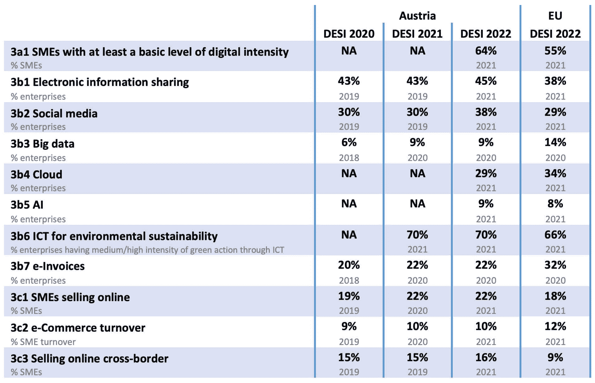

Austria in the Digital Economy and Society Index (Source [DESI country profile Austria](https://digital-strategy.ec.europa.eu/en/policies/desi-austria))

东欧和南欧国家的情况大不相同，那里云技术的平均采用率低于 30%。

## 英国云计算的现状

根据美国国际贸易管理局的数据，[英国是欧洲最大的云市场](https://www.trade.gov/market-intelligence/united-kingdom-cloud-services-market)，也是全球第二大 ICT 市场，仅次于美国。

此外:

> 英国的科技风险投资在世界上排名第三(仅次于美国和中国)，超过任何其他欧洲国家(超过法国和德国的总和)，在面临挑战的情况下，2020 年达到创纪录的 210 亿美元。

2020 年，英国公共云服务的收入约为 120 亿美元。AWS、微软 Azure 和谷歌云再次成为顶级玩家。

ITA 报告称，到 2020 年，对公共云服务的需求将大幅增长，这一市场趋势既影响了大型企业，也影响了中小型企业:

> 事实上，英国企业正在稳步采用云优先的方法，越来越多的公司可以预见到有一天他们会将大部分 IT 转移到云。

ITA 报告强调的英国企业的另一个特点是采用多云战略和云原生解决方案。英国公司似乎更喜欢能够为其 IT 投资提供最大价值的**提供商，并希望能够移动其数据和避免供应商锁定**，尽管这最终可能会导致更大的复杂性。

最近的几份报告证实了 ITA 的数据。[英国议会](https://post.parliament.uk/research-briefings/post-pn-0629/)表示，据估计 **89%的英国大型组织使用至少一种基于云的服务**，预计到 2023 年，英国云市场的价值**将超过 350 亿英镑(比 2019 年增长了 73%)。**

对未来几年的预测似乎没有什么不同。[据商业资讯](https://www.businesswire.com/news/home/20220929005398/en/United-Kingdom-Cloud-Computing-Market-Report-2022-Growing-Dependency-on-Internet-Based-Devices-and-Services-Fuels-Sector---ResearchAndMarkets.com)报道，英国的云市场预计将在 2023-2027 年间取得令人瞩目的增长。人工智能、[、物联网](https://kinsta.com/knowledgebase/what-is-iot/)和机器学习等新兴技术的普及将进一步推动云市场的增长。

在英国广泛采用云计算技术的一个障碍是担心数据从英国转移到外国。英国议会报告称:

> 由于云的动态特性，数据会定期移动。组织不太可能知道其数据的确切位置，除非他们要求将其保留在特定位置。一些利益相关者对在英国没有法律控制权的司法管辖区存储属于英国组织和个人的数据表示担忧。

此外:

> 欧洲政策研究中心估计，西方世界 92%的数据存储在美国，4%存储在欧洲。

该报告还指出，英国目前没有合法的数据居住要求，英国和欧盟组织之间的数据继续自由流动将取决于欧盟对英国隐私保护充分性的评估。

与此同时:

> 为了避免过渡期后可能出现的任何监管障碍，谷歌的英国用户现在由谷歌有限责任公司(美国)提供服务，而以前他们属于谷歌爱尔兰有限公司。

### 英国的谷歌云

谷歌早在 2003 年就在英国开设了第一个[办公室，2017 年](https://about.google/intl/en-GB/google-in-uk/)在伦敦开设了[数据中心。今天，谷歌在英国雇佣了【6,400 多名员工。](https://cloud.google.com/blog/products/gcp/google-cloud-platform-now-open-in-london)

英国在云计算技术方面处于领先地位。为此，谷歌继续在英国大举投资。2021 年，美国和英国之间铺设了一条新的[海底电缆](https://blog.google/around-the-globe/google-europe/united-kingdom/our-grace-hopper-subsea-cable-has-landed-uk/)(格蕾丝·赫柏)，并投入 10 亿美元购买中央圣吉尔斯开发区，达到容纳谷歌英国办事处 10，000 名员工的能力。

## 金斯塔的云服务:从 SaaS 到谷歌云上的 PaaS

由于最近的国际事件和市场的演变，许多公司和专业人员已经将他们的产品和服务转移到远程信息处理渠道。拥有一个始终快速、安全且可扩展的网站，以保持高标准的服务质量，从未像现在这样重要。说到电子商务，像[速度](https://kinsta.com/blog/migrate-to-kinsta/)、[安全性](https://kinsta.com/blog/cloud-security/)、可伸缩性和可靠性等特性是必备的。

这就是为什么越来越多的[公司正在将](https://kinsta.com/wordpress-migration/)从传统的 web 托管解决方案(如共享、专用或 VPS 托管服务)迁移到更加灵活、可靠和高性能的云解决方案。

虽然对于缺乏大公司资源和技能的小公司和专业人士来说，[采用云托管解决方案](https://kinsta.com/blog/wordpress-on-google-cloud/)乍看起来似乎过于复杂，但是[小企业](https://kinsta.com/small-business-hosting/)如果想在市场上保持竞争力并与他们的网站一起成长，就不能放弃云计算的优势。

这就是为什么 **Kinsta 是谷歌云和所有行业和规模的实体之间的完美中介**,这些实体希望利用尖端的云服务，而不跳过直接采用云解决方案可能出现的所有障碍。

**Kinsta 的使命是提供基于[谷歌云平台](https://kinsta.com/blog/google-cloud-hosting/)的最佳云托管服务，以最简单的方式和市场上最具竞争力的价格提供。**对于 Kinsta 的客户来说，在谷歌云[上安装网站或应用程序只需要点击几下](https://kinsta.com/feature-updates/new-mykinsta/)。

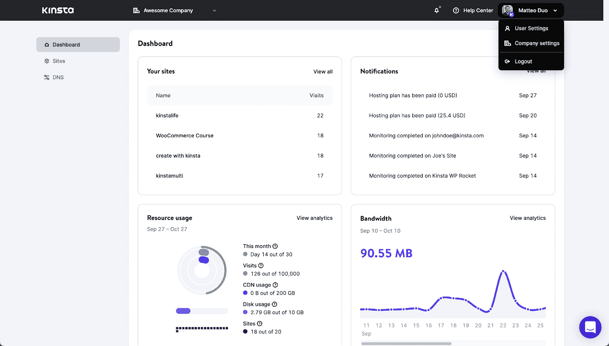

A look at the new MyKinsta dashboard.

### Kinsta 的 PaaS 服务模型

[Kinsta 的整个基础设施](https://kinsta.com/blog/cloud-platform-for-developers/)基于谷歌云的高级层网络。高级层和标准层的[区别在于，对于前者，传输中的数据几乎全部通过谷歌的私有互联网主干网。这意味着更少的跳跃、更低的延迟和更高的性能。](https://cloud.google.com/network-tiers?hl=it)

在有 C2 计算优化虚拟机的地区，Kinsta 的所有客户都将从中受益。这些机器采用[超高性能](https://kinsta.com/blog/boosting-wordpress-performance/)处理计算密集型工作负载，适用于:

*   计算密集型工作负载
*   高性能 web 服务
*   游戏(AAA 游戏服务器)
*   广告服务
*   高性能计算(HPC)
*   媒体转码
*   AI/ML

但 Kinsta 的服务并不仅限于谷歌云托管。我们通过一系列企业服务来完善我们的产品，打造一个在行业中独一无二的平台。

无论选择何种计划，所有 Kinsta 客户都可以从以下工具中受益:

*   **MyKinsta:** Kinsta 强大的[托管仪表板](https://kinsta.com/MyKinsta/)在内部开发，尽可能简单地让我们所有的客户完全控制网站、应用程序和数据库。
*   开发者工具:包括 [SSH](https://kinsta.com/knowledgebase/ssh-vs-ssl/) 和 [WP-CLI](https://kinsta.com/blog/wp-cli/) 等等。
*   **暂存环境:**适用于所有站点。
*   **免费的 Cloudflare 集成:**为了确保更高的安全性并进一步提高我们所有客户网站的性能，我们在所有计划中实施了 [Cloudflare 集成](https://kinsta.com/cloudflare-integration/)。因此，我们的客户获得了一个免费的集成防火墙，具有 [DDoS 攻击保护](https://kinsta.com/blog/what-is-a-ddos-attack/)、 [CDN](https://kinsta.com/help/kinsta-cdn/) 、 [HTTP/3 支持](https://kinsta.com/blog/http3/)、自动 [SSL 证书](https://kinsta.com/blog/free-ssl-certificate/)和[通配符支持](https://kinsta.com/knowledgebase/wildcard-ssl/)，无论他们的计划如何。
*   我们免费的本地开发工具套件，用于在几分钟内构建、测试和部署 WordPress 站点。 [DevKinsta](https://kinsta.com/devkinsta/) 允许你在本地机器上创建 WordPress 网站，只需点击几下，并提供强大的开发和管理工具，如 [Adminer](https://kinsta.com/blog/adminer/) 和 [MailHog](https://kinsta.com/blog/mailhog/) 。一旦工作完成，您只需点击一下鼠标，就可以将本地站点转移到 Kinsta 上的[临时环境](https://kinsta.com/wordpress-staging/)。

除了这一切，还有一个在知识和响应速度方面处于行业顶端的[支持服务](https://kinsta.com/blog/web-hosting-support/)，以及许多其他工具，这些工具允许只需几次点击就可以执行复杂(如果不是完全危险的话)的操作，例如在网站数据库上的[搜索和替换](https://kinsta.com/knowledgebase/wordpress-search-and-replace/)、[用户管理](https://kinsta.com/help/mykinsta-user-roles/)、启用[调试模式](https://kinsta.com/help/wordpress-enable-debug/)、[将网站](https://kinsta.com/help/transfer-wordpress-site/)移入和移出 Kinsta，等等。

但这还不是全部。为了让我们的客户更接近他们的市场目标，Kinsta 让所有谷歌云数据中心尽快可用。我们有一篇知识库文章，列出了当前可用的 35 个数据中心的完整列表，解释了如何为您在 [MyKinsta](https://kinsta.com/mykinsta/) 的站点选择[最佳数据中心](https://kinsta.com/knowledgebase/best-data-center/)。

为了更贴近我们在欧洲主要市场的读者和客户，我们从一开始就决定尽可能多语种地本地化我们的服务和发布在我们网站和博客上的内容。

目前，我们的读者和客户可以阅读我们网站和 [MyKinsta dashboard](https://kinsta.com/help/multilingual-support/) 的以下语言内容:

*   英语🇺🇸
*   [意大利语](https://kinsta.com/it/) 🇮🇹
*   [葡萄牙语](https://kinsta.com/pt/) 🇵🇹
*   [法国](https://kinsta.com/fr/) 🇫🇷
*   [德国](https://kinsta.com/de/) 🇩🇪
*   [日语](https://kinsta.com/jp/) 🇯🇵
*   [荷兰](https://kinsta.com/nl/) 🇳🇱
*   西班牙语 🇪🇸
*   [瑞典](https://kinsta.com/se/) 🇸🇪
*   [丹麦](https://kinsta.com/dk/) 🇩🇰

我们还在以下时间( **UTC** )提供法语、意大利语、葡萄牙语和西班牙语的多语言支持:

*   英语 00:00–24:00
*   法语 06:00–17:00
*   意大利语 06:00–14:00
*   葡萄牙语 09:00–17:00
*   西班牙语 14:00–24:00

简而言之，Kinsta 是获得谷歌云平台基础设施能力的完美门户，但其高附加值服务使我们的产品无与伦比。

由于我们的 [30 天退款保证](https://kinsta.com/knowledgebase/refund-policy/)，您可以免费试用 Kinsta，您可以尝试[我们 MyKinsta 仪表板的演示](https://kinsta.com/mykinsta-demo/)，或者利用[我们 20 美元的优惠](https://kinsta.com/blog/cloud-platform-for-developers/)来试用我们托管和[数据库托管](https://kinsta.com/database-hosting/)服务的新[应用程序。
T11】](https://kinsta.com/application-hosting/)

## 摘要

在本文中，我们根据欧盟统计局(Eurostat)提供的数据，对欧洲云计算市场的状况进行了深入的概述。

从报告中，我们可以看到云计算技术的采用在欧洲所有主要市场都在快速增长，尽管各国之间存在明显差异。 [不确定是否迁移到云端？🤔了解欧洲公司在这里做什么...☁️☁️ 点击推文](https://twitter.com/intent/tweet?url=https%3A%2F%2Fkinsta.com%2Fblog%2Fcloud-computing-in-europe%2F&via=kinsta&text=Not+sure+whether+to+migrate+to+the+cloud%3F+%F0%9F%A4%94+Find+out+what+European+companies+are+doing+here...+%E2%98%81%EF%B8%8F%E2%98%81%EF%B8%8F&hashtags=cloud%2Chosting)

所谓的“超大规模”必须应对的一个关键因素是旨在确保数据主权、安全和隐私的欧洲监管。事实上，欧洲公民的数据位于不同的司法管辖区，如美国，这确实是一个问题，欧洲立法者通过严格的法规来保证其公民的权利。

然而，这并没有让大型云服务提供商气馁，他们已经通过适应欧洲法规的要求做出了回应。在这些超大规模应用中，谷歌的回应是开放新的云区域，并与大型欧洲 ITC 和电信公司合作。

底线是欧洲公司将能够继续受益于最先进的云技术，同时尊重法律和公民权利。

在这一领域，Kinsta 是主要参与者，在谷歌云平台上为所有客户提供顶级的[托管 WordPress 托管](https://kinsta.com/wordpress-hosting/)、[应用托管](https://kinsta.com/application-hosting/)和[数据库托管](https://kinsta.com/database-hosting/)服务。

* * *

让你所有的[应用程序](https://kinsta.com/application-hosting/)、[数据库](https://kinsta.com/database-hosting/)和 [WordPress 网站](https://kinsta.com/wordpress-hosting/)在线并在一个屋檐下。我们功能丰富的高性能云平台包括:

*   在 MyKinsta 仪表盘中轻松设置和管理
*   24/7 专家支持
*   最好的谷歌云平台硬件和网络，由 Kubernetes 提供最大的可扩展性
*   面向速度和安全性的企业级 Cloudflare 集成
*   全球受众覆盖全球多达 35 个数据中心和 275 多个 pop

在第一个月使用托管的[应用程序或托管](https://kinsta.com/application-hosting/)的[数据库，您可以享受 20 美元的优惠，亲自测试一下。探索我们的](https://kinsta.com/database-hosting/)[计划](https://kinsta.com/plans/)或[与销售人员交谈](https://kinsta.com/contact-us/)以找到最适合您的方式。