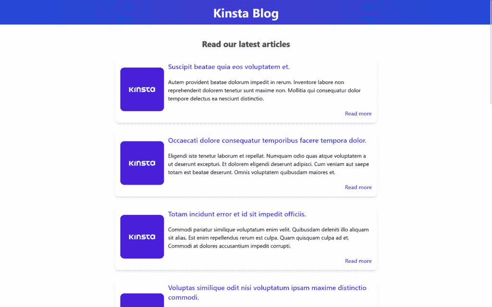
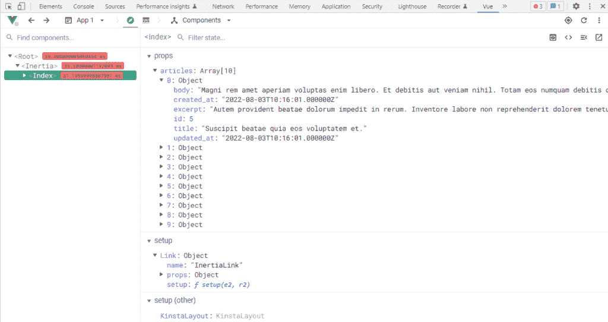
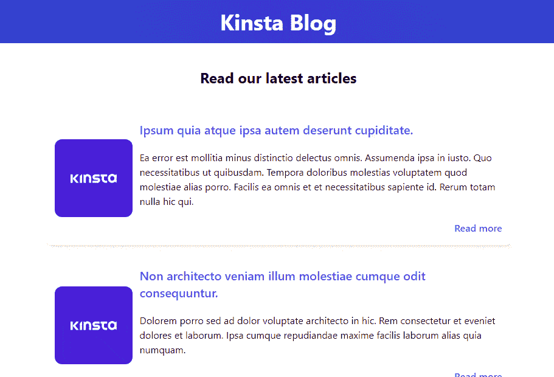
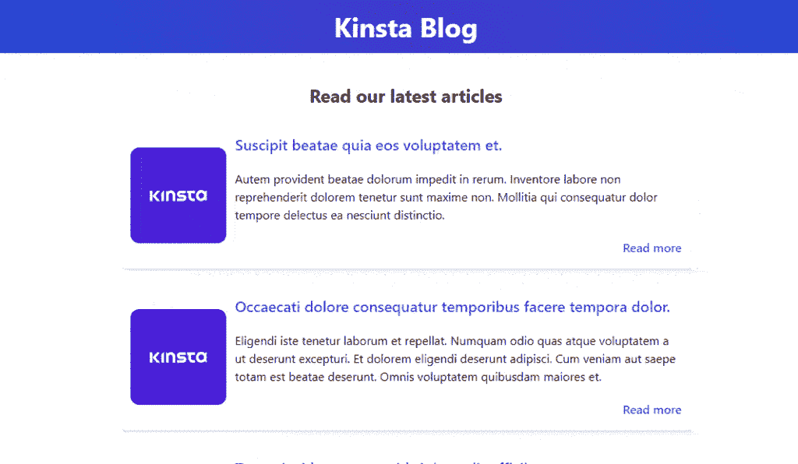

# 如何在你的 Laravel 项目中使用 Inertia.js

> 原文：<https://kinsta.com/blog/laravel-inertia/>

多页面应用程序(MPAs)越来越不受欢迎了。脸书、Twitter、YouTube、Github 等知名平台已经开始使用单页面应用程序(SPA)技术。

这种时髦的技术允许用户快速响应地使用 web 应用程序，因为一切都是在客户端呈现的。然而，对于使用 Laravel 或 Django 这样的框架构建服务器端渲染应用程序的开发人员来说，这可能是一种痛苦。

幸运的是，Inertia.js 介入并前来救援。
[您的 Laravel 项目需要的缺失成分？✨惯性。js。在这个全面的指南了解更多🚀 点击发布推文](https://twitter.com/intent/tweet?url=https%3A%2F%2Fkinsta.com%2Fblog%2Flaravel-inertia%2F&via=kinsta&text=The+missing+ingredient+your+Laravel+projects+need%3F+%E2%9C%A8+Inertia.js.+Learn+more+in+this+thorough+guide+%F0%9F%9A%80&hashtags=Laravel%2CWebDev)
在本文中，我们将向您展示如何开始使用 Inertia.js，以及如何将其与 Laravel、Vue.js 和 Tailwind CSS 一起使用来创建一个现代博客 web 应用程序。我们还将分享如何让 spa 更适合 SEO，以及一些其他的技巧。

如果你刚刚开始使用 Laravel，我们建议你先阅读[这篇文章](https://kinsta.com/blog/laravel-developer/)，这样你就可以准备开始使用了。

## 为什么是 SPA？

在我们可以问为什么我们应该使用惯性之前，我们必须首先问:“为什么是 SPA？”

为什么有人更喜欢客户端渲染的应用程序，而不是传统的服务器端应用程序？什么会迫使全栈 Laravel 开发者告别[刀片组件](https://kinsta.com/knowledgebase/what-is-laravel/#templating)？

简而言之:因为速度和响应对于任何成功的用户参与都是必不可少的。


> 需要在这里大声喊出来。Kinsta 太神奇了，我用它做我的个人网站。支持是迅速和杰出的，他们的服务器是 WordPress 最快的。
> 
> <footer class="wp-block-kinsta-client-quote__footer">
> 
> 
> 
> <cite class="wp-block-kinsta-client-quote__cite">Phillip Stemann</cite></footer>

[View plans](https://kinsta.com/plans/)

对于 MPAs，浏览器不断地向后端发送请求，然后后端执行大量的数据库查询。在数据库和服务器处理查询并将它们提交给浏览器之后，页面被呈现。

但是水疗不一样。该应用程序将用户需要的一切直接带到页面上，无需浏览器发送查询或重新加载页面来呈现新的 HTML 元素。

因为这种独一无二的用户体验，许多大牌公司都在叫嚣着让他们的网站成为单页应用。

也就是说，对于 Laravel 开发人员来说，创建单页面应用程序可能很困难，因为这需要他们开始使用 Vue.js 或 React 而不是刀片模板，从而导致许多 Laravel 节省时间和精力的宝贵资源的损失。

不过，现在我们有了 Inertia.js，一切都变了。


## 为什么惯性？

如果 Laravel 开发人员在使用 Inertia 之前使用 Vue 构建 web SPAs，他们必须设置 API 并使用 Laravel 返回 JSON 数据，然后使用 AXIOS 之类的东西来检索 Vue 组件中的数据。他们还需要 Vue 路由器之类的东西来管理路由，这将意味着失去 Laravel 路由，以及中间件和控制器。

另一方面，Inertia.js 使开发人员能够使用经典的服务器端路由和控制器来构建现代的单页 Vue、React 和苗条的应用程序。Inertia 是为 Laravel、Ruby on Rails 和 Django 开发人员设计的，允许他们在不改变创建控制器、从数据库获取数据和呈现视图的编码技术的情况下构建应用程序

多亏了 Inertia.js，Laravel 开发人员将会有宾至如归的感觉。

## 惯性是如何工作的

仅使用 Laravel 和 Vue 构建 SPA 将为您的前端提供完整的 JavaScript 页面，但这不会为您提供单页应用程序体验。每次点击链接都会导致客户端框架在下一次页面加载时重新启动。

这就是惯性进入画面的地方。

惯性基本上是一个客户端路由库。它允许您在页面之间导航，而不必重新加载整个页面。这是通过``组件完成的，它是一个标准锚点标签的轻量级包装器。

当你点击一个惯性链接，惯性拦截点击，并把你重定向到 XHR。浏览器不会以这种方式重新加载页面，给用户一个完整的单页体验。

## 惯性入门



A sample page made with Inertia.js


为了理解惯性以及如何将其与 Laravel 集成，我们将使用最强大的组合构建一个名为 **Kinsta Blog** 的博客 web 应用程序，Laravel 用于后端，Vue.js 用于 JavaScript 前端，Tailwind CSS 用于样式。

如果你更愿意在本地环境中学习本教程，你可以使用 [DevKinsta](https://kinsta.com/devkinsta/) ，这是一个强大的工具，开发者、设计者和代理商可以使用它来构建单页和多页的 WordPress web 应用。幸运的是，使用 [Corcel](https://github.com/corcel/corcel) 包，WordPress 可以很容易地与 Laravel 集成。

### 先决条件

为了充分利用本教程，您应该熟悉以下内容:

*   Laravel 基础知识(安装、数据库、数据库迁移、雄辩模型、控制器和路由)
*   Vue.js 基础知识(安装、结构和形式)

如果你感到不确定，看看这些精彩的免费和付费教程。否则，我们就跳进来吧。

### 第一步:安装核心元素

要关注 Inertia.js 并直接进入有趣的部分，请确保您已经准备好以下设置:

1.  新安装的 Laravel 9 项目命名为`kinsta-blog`
2.  安装在我们的 Laravel 项目中的 Tailwind CSS CLI
3.  Two blade components in **kinsta-blog/resources/views** for viewing the blog’s homepage and a single article on the blog as showing below:

    "/resources/views/**index.blade.php**":

    ```
    <!DOCTYPE html>
    <html lang="{{ str_replace('_', '-', app()->getLocale()) }}">
      <head>
        <meta charset="utf-8" />
        <meta name="viewport" content="width=device-width, initial-scale=1" />

        <title>Kinsta Blog</title>
      </head>

      <body>
        <header>
          <h1>Kinsta Blog</h1>
        </header>

        <main>
          <h2>Read our latest articles</h2>

          <section>
            <article>
              <div>
                
              </div>

              <h3>Title for the blog</h3>
              <p>
                Lorem, ipsum dolor sit amet consectetur adipisicing elit. Illum rem
                itaque error vel perferendis aliquam numquam dignissimos, expedita
                perspiciatis consectetur!
              </p>

              <a href="#">Read more</a>
            </article>
          </section>
        </main>

        <footer>
          <h2>Join our Newsletter</h2>

          <input type="email" />
        </footer>
      </body>
    </html>
    ```

    "/resources/views/**show.blade.php**":

    ```
    <!DOCTYPE html>
    <html lang="{{ str_replace('_', '-', app()->getLocale()) }}">
      <head>
        <meta charset="utf-8" />
        <meta name="viewport" content="width=device-width, initial-scale=1" />

        <title>Kinsta Blog</title>
      </head>

      <body>
        <main>
          <article>
            <div>
              
            </div>

            <h1>Title for the blog</h1>

            <p>Article content goes here</p>
          </article>
        </main>

        <footer>
          <h2>Join our Newsletter</h2>

          <input type="email" />
        </footer>
      </body>
    </html>
    ```

4.  MySQL local database named `kinsta_blog` connected to our project:

    **。env** :

    ```
    DB_CONNECTION=mysql
    DB_HOST=127.0.0.1
    DB_PORT=3306
    DB_DATABASE=kinsta_blog
    DB_USERNAME=root
    DB_PASSWORD=
    ```

5.  Article model, migrations, and factories:

    " app/Models/**Article.php**":

    ```
    <?php

    namespace AppModels;

    use IlluminateDatabaseEloquentFactoriesHasFactory;
    use IlluminateDatabaseEloquentModel;

    class Article extends Model
    {
        use HasFactory;

        protected $fillable = ['title', 'excerpt', 'body'];
    }
    ```

    "数据库/迁移/**create _ articles _ table . PHP**":

    ```
    <?php

    use IlluminateDatabaseMigrationsMigration;
    use IlluminateDatabaseSchemaBlueprint;
    use IlluminateSupportFacadesSchema;

    return new class extends Migration
    {

        public function up()
        {
            Schema::create('articles', function (Blueprint $table) {
                $table->id();
                $table->string('title');
                $table->text('excerpt');
                $table->text('body');
                $table->timestamps();
            });
        }

        public function down()
        {
            Schema::dropIfExists('articles');
        }
    };
    ```

    "数据库/工厂/**ArticleFactory.php**":

    ```
    <?php

    namespace DatabaseFactories;

    use IlluminateDatabaseEloquentFactoriesFactory;

    class ArticleFactory extends Factory
    {

        public function definition()
        {
            return [
                'title' => $this->faker->sentence(6),
                'excerpt' => $this->faker->paragraph(4),
                'body' => $this->faker->paragraph(15),
            ];
        }
    }
    ```

这就是我们开始行动所需要的一切！现在言归正传，将 Inertia.js 引入我们的项目。

### 步骤 2:安装惯性

惯性安装过程分为两个主要阶段:服务器端(Laravel)和客户端(VueJs)。

惯性文档中的官方安装指南有点过时，因为默认情况下, [Laravel 9 现在使用 Vite](https://vitejs.dev/guide/#scaffolding-your-first-vite-project) ,但是我们也将仔细阅读。

#### 1.服务器端

我们需要做的第一件事是通过 Composer 用下面的终端命令安装惯性服务器端适配器。

```
composer require inertiajs/inertia-laravel
```

现在我们将设置我们的根模板，这将是一个用于加载 CSS 和 JS 文件的单个刀片文件，以及一个用于启动我们的 JavaScript 应用程序的惯性根。

因为我们使用的是最新版本的 Laravel 9 v9.3.1，所以我们还必须通过将 Vite 包含在/resources/views/**app.blade.php**的标签中来让它发挥它的魔力:

```
<!DOCTYPE html>
<html lang="{{ str_replace('_', '-', app()->getLocale()) }}">
  <head>
    <meta charset="utf-8" />
    <meta name="viewport" content="width=device-width, initial-scale=1" />

    <!-- Fetch project name dynamically -->
    <title inertia>{{ config('app.name', 'Laravel') }}</title>

    <!-- Scripts -->
    @vite('resources/js/app.js') @inertiaHead
  </head>

  <body class="font-sans antialiased">
    @inertia
  </body>
</html>
```

请注意，我们如何通过将`Inertia`属性添加到`<title>`标签来动态获取项目标题。

我们还在头部添加了`@vite`指令，以便让 Vite 知道我们创建应用程序和导入 CSS 的 JavaScript 主文件的路径。Vite 是一个有助于 JavaScript 和 CSS 开发的工具，它允许开发人员查看前端更改，而不必在本地开发期间刷新页面。

我们的下一步将是创建 **HandleInertiaRequests** 中间件并将其发布到我们的项目中。我们可以通过在项目的根目录中启动下面的终端命令来实现这一点:

```
php artisan inertia:middleware
```

完成后，进入“App/Http/ **内核**，将`HandleInertiaRequests`注册为你的网络中间件的最后一项:

```
'web' => [
    // ...
    AppHttpMiddlewareHandleInertiaRequests::class,
],
```

#### 2.客户端

接下来，我们必须以与服务器端相同的方式安装我们的 frontend Vue.js 3 依赖项:

```
npm install @inertiajs/inertia @inertiajs/inertia-vue3
// or
yarn add @inertiajs/inertia @inertiajs/inertia-vue3
```

接下来，您需要拉入 Vue.js 3:

```
npm install [[email protected]](/cdn-cgi/l/email-protection)
```

然后更新主 JavaScript 文件，用 Vue.js 3、Vite 和 Laravel 初始化 Inertia.js:

" resources/js/ **app.js** ":

```
import "./bootstrap";
import "../css/app.css";

import { createApp, h } from "vue";
import { createInertiaApp } from "@inertiajs/inertia-vue3";
import { resolvePageComponent } from "laravel-vite-plugin/inertia-helpers";

createInertiaApp({
  title: (title) => `${title} - ${appName}`,
  resolve: (name) =>
    resolvePageComponent(
      `./Pages/${name}.vue`,
      import.meta.glob("./Pages/**/*.vue")
    ),
  setup({ el, app, props, plugin }) {
    return createApp({ render: () => h(app, props) })
      .use(plugin)
      .mount(el);
  },
});
```

在上面的代码片段中，我们使用 Laravel 的插件`resolvePageComponent`，我们告诉它从目录**中解析我们的组件。/Pages/$name.vue** 。这是因为在我们的项目中，我们将把惯性组件保存在这个目录中，这个插件将帮助我们从正确的目录中自动加载这些组件。

剩下的就是安装`vitejs/plugin-vue`:

```
npm i @vitejs/plugin-vue
```

并更新 **vite.config.js** 文件:

```
import { defineConfig } from "vite";
import laravel from "laravel-vite-plugin";
import vue from "@vitejs/plugin-vue";

export default defineConfig({
  plugins: [
    laravel({
      input: ["resources/css/app.css", "resources/js/app.js"],
      refresh: true,
    }),
    vue({
      template: {
        transformAssetUrls: {
          base: null,
          includeAbsolute: false,
        },
      },
    }),
  ],
});
```

最后一步是安装我们的依赖项并编译我们的文件:

```
npm install

npm run dev
```

瞧！您已经有了一个带有 Vue.js 3 和 Vite 的 Laravel 9 应用程序。现在我们需要看到实际发生的事情！

## 创建惯性页面

你还记得那两个刀片文件(**索引**和**显示**)用于查看我们的主页和一篇文章吗？

使用惯性时我们需要的唯一刀片文件是**app.blade.php**，我们在安装惯性时已经用过一次了。那么现在这些文件会怎么样呢？

我们将把这些文件从刀片组件转换成 Inertia.js 组件。

应用程序中的每个页面都有自己的控制器和带有惯性的 JavaScript 组件。这使您可以只获得该页面所需的数据，而无需使用 API。惯性页面只不过是 JavaScript 组件，在我们的例子中，它们是 Vue.js 组件。他们没有什么特别值得注意的地方。所以我们要做的是将所有的 HTML 内容包装在`<template>`标签之间，所有与 JavaScript 相关的内容都用`<script>`标签包装。

创建一个名为“Pages”的文件夹，并将您的文件移到那里。于是我们就有了“**index.blade.php**、“**show.blade.php**”中的“**”。/resources/js/Pages** ”。然后，我们将把文件格式改为"。vue”而不是“. blade.php”，同时将其名称的第一个字母大写，并将其内容转换为标准的 Vue.js 组件。我们将排除`<html>`、`<head>`和`<body>`标签，因为它们已经包含在主根叶片组件中。

" resources/js/Pages/**index . vue**":

```
<script setup>
  //
</script>

<template>
  <header>
    <h1>Kinsta Blog</h1>
  </header>

  <main>
    <h2>Read our latest articles</h2>

    <section>
      <article>
        <div>
          
        </div>

        <h3>Title for the blog</h3>
        <p>
          Lorem, ipsum dolor sit amet consectetur adipisicing elit. Illum rem
          itaque error vel perferendis aliquam numquam dignissimos, expedita
          perspiciatis consectetur!
        </p>

        <a href="#">Read more</a>
      </article>
    </section>
  </main>

  <footer>
    <h2>Join our Newsletter</h2>

    <input type="email" />
  </footer>
</template>
```

" resources/js/Pages/**show . vue**":

```
<script setup>
  //
</script>

<template>
  <header>
    <h1>Welcome to Kinsta Blog</h1>
  </header>

  <main>
    <article>
      <h1>Title for the blog</h1>

      <p>Article content goes here</p>
    </article>
  </main>

  <footer>
    <h2>Join our Newsletter</h2>

    <input type="email" />
  </footer>
</template>
```

有件事真的困扰着我！我们一直在每个组件中复制和粘贴我们的页眉和页脚，这不是一个很好的做法。让我们创建一个惯性基本布局来存储我们的持久组件。

在“ **/resources/js** ”中创建一个名为“Layouts”的文件夹，并在该文件夹中创建一个名为“KinstaLayout.vue”的文件。这个文件将有我们的页眉和页脚，以及带有一个`<slot />`的`main`，以允许用这个布局包装的所有组件嵌入其中。该文件应该如下所示:

" resources/js/layouts/**kintal layout . view**":

```
<script setup></script>

<template>
    <header>
    <h1>Kinsta Blog</h1>
  </header>

  <main>
        <slot />
  </main>

  <footer>
    <h2>Join our Newsletter</h2>

    <input type="email" />
  </footer>

</template>
```

然后，我们将在页面中导入这个新布局，并用它包装所有的 HTML 内容。我们的组件应该是这样的:

索引.视图:

```
<script setup>
import KinstaLayout from "../Layouts/KinstaLayout.vue";
</script>

<template>
  <KinstaLayout>
    <section>
      <h2>Read our latest articles</h2>
      <article>
        <div>
          
        </div>

        <h3>Title for the blog</h3>
        <p>
          Lorem, ipsum dolor sit amet consectetur adipisicing elit. Illum rem
          itaque error vel perferendis aliquam numquam dignissimos, expedita
          perspiciatis consectetur!
        </p>

        <a href="#">Read more</a>
      </article>
    </section>
  </KinstaLayout>
 </template>
```

显示。视图:

```
<script setup>
 import KinstaLayout from "../Layouts/KinstaLayout.vue";
</script>

<template>
  <KinstaLayout>
    <article>
      <h1>Title for the blog</h1>

      <p>Article content goes here</p>
    </article>
  </KinstaLayout>
</template>
```

## Laravel 路线和惯性渲染

首先，让我们使用教程起点的" **ArticleFactory** "文件，将一些文章植入我们的数据库。

"数据库/种子/**databaseSeeder.php**":

```
<?php

namespace DatabaseSeeders;

use AppModelsArticle;
use IlluminateDatabaseSeeder;

class DatabaseSeeder extends Seeder
{
    public function run()
    {
        Article::factory(10)->create();
    }
}
```

然后点击下面的终端命令来迁移您的表，并从工厂中植入假数据:

```
php artisan migrate:fresh --seed
```

这将在数据库中创建 10 个假文章，我们需要使用 Laravel 路由将它们传递给我们的视图。现在，我们使用惯性来渲染视图，我们用来编写路线的方式将略有改变。让我们在“routes/**web.php**中创建我们的第一条 Laravel 惯性路线，并从“/resources/js/Pages/**index . vue**返回主页视图。

"路线/**web.php**":

```
<?php

use AppModelsArticle;
use IlluminateSupportFacadesRoute;
use InertiaInertia;

Route::get('/', function () {
    return Inertia::render('Index', [
        'articles' => Article::latest()->get()
    ]);
})->name('home');
```

注意，我们导入了`Inertia`并且没有使用`view()` Laravel 助手返回视图，而是使用了`Inertia::render`。默认情况下，惯性还会在“resources/js”的 **Pages** 文件夹中查找我们在路径中提到的文件名。

## 注册订阅时事通讯


### 想知道我们是怎么让流量增长超过 1000%的吗？

加入 20，000 多名获得我们每周时事通讯和内部消息的人的行列吧！

[Subscribe Now](#newsletter)

转到索引文件，将检索到的数据设置为一个 prop，并使用`v-for`遍历它们以显示结果。在脚本标记之间，将传递的数据定义为一个属性。惯性需要知道的只是您期望的数据类型，在我们的例子中是一个包含文章数组的“Article”对象。

" resources/js/Pages/**index . vue**":

```
<script setup>
import KinstaLayout from "../Layouts/KinstaLayout.vue";

  defineProps({
    Articles: Object,
  });
</script>
```

注意，只将它定义为一个 prop 而不返回它就足够了，因为我们对 Vue.js 3 composition API 使用的是`setup`格式。如果我们使用选项 API，那么我们需要返回它。

让我们来循环:

```
<template>
  <KinstaLayout>
    <h2>Read our latest articles</h2>

    <section>
      // Looping over articles
      <article v-for="article in articles":key="article.id">
        <div>
          
        </div>

        <h3>{{article.title}}</h3>
        <p>{{article.excerpt}}</p>

        <a href="#">Read more</a>
      </article>
    </section>
  </KinstaLayout>
</template>
```

`npm run dev`(让它运行，因为我们正在使用 Vite)和`php artisan serve`启动 laravel 开发服务器并访问我们的网站，我们将看到预期的页面显示数据库中的所有十篇文章。

现在，我们正在使用谷歌 Chrome 的 Vue DevTools 扩展，它允许我们调试我的应用程序。让我们向您展示我们的数据是如何传递给组件的。



Inspecting Inertia properties.


“Articles”作为包含文章数组的 prop 对象传递给组件；数组中的每个商品也是一个对象，其属性对应于它从数据库中获取的数据。这意味着我们从 Laravel 转移到 Inertia 的任何数据都将被视为一个道具。

## 使用带有 Inertia.js 的顺风 CSS

由于 Tailwind 已经安装在我们项目的起点，我们需要做的就是告诉它读取我们的惯性组件。这可以通过编辑如下的" **tailwind.config.js** "来完成:

```
/** @type {import('tailwindcss').Config} */
module.exports = {
  content: [
    "./storage/framework/views/*.php",
    "./resources/views/**/*.blade.php",
    "./resources/js/**/*.vue",
  ],
  theme: {
    extend: {},
  },
  plugins: [],
};
```

然后确保我们已经在“resources/js/ **app.js** ”中导入了 CSS 文件:

```
import "../css/app.css";
```

现在我们已经准备好为组件设计样式了。

" resources/js/Pages/**index . vue**":

```
<script setup>
import KinstaLayout from "../Layouts/KinstaLayout.vue";

  defineProps({
    articles: Object,
  });
</script>

<template>
 <KinstaLayout>
    <h2 class="text-2xl font-bold py-10">Read our latest articles</h2>

    <section class="space-y-5 border-b-2 pb-10">
      <article
        v-for="article in articles"
        :key="article.id"
        class="flex justify-center items-center shadow-md bg-white rounded-xl p-4 mx-auto max-w-3xl"
      >

         

        <div class="flex flex-col text-left justify-between pl-3 space-y-5">
          <h3
            class="text-xl font-semibold text-indigo-600 hover:text-indigo-800"
          >
            <a href="#">{{ article.title }}</a>
          </h3>
          <p>
           {{ article.excerpt }}
          </p>
          <a
            href="#"
            class="text-indigo-600 hover:text-indigo-800 w-fit self-end font-semibold"
            >Read more</a
          >
        </div>
      </article>
    </section>
 </KinstaLayout>
</template>
```

" resources/js/layouts/**kintal layout . view**":

```
<script setup></script>

<template>
    <Header
        class="bg-gradient-to-r from-blue-700 via-indigo-700 to-blue-700 w-full text-center py-4"
    >
        <h1 class="text-white font-bold text-4xl">Kinsta Blog</h1>
    </Header>

    <main class="container mx-auto text-center">
        <slot />
    </main>

    <footer
        class="bg-gradient-to-b from-transparent to-gray-300 w-full text-center mt-5 py-10 mx-auto"
    >
        <h2 class="font-bold text-xl pb-5">Join our Newsletter</h2>

        <input
            class="rounded-xl w-80 h-12 px-3 py-2 shadow-md"
            type="email"
            placeholder="Write your email.."
        />
    </footer>
</template>
```

如果你看看浏览器，你会注意到 Vite 已经用 Tailwind magic 更新了页面。



Rendering Inertia properties.


## 惯性环节

现在我们有了一个可以显示数据库中所有文章的工作主页，我们需要创建另一个路径来显示单个文章。让我们创建一个新路由，并将 URL 设置为一个“id”通配符:

"路线/**web.php**"

```
<?php

use AppModelsArticle;
use IlluminateSupportFacadesRoute;
use InertiaInertia;

Route::get('/', function () {
    return Inertia::render('Index', [
        'articles' => Article::latest()->get()
    ]);
})->name('home');

Route::get('/posts/{article:id}', function (Article $article) {
    return Inertia::render('Show', [
        'article' => $article
    ]);
})->name('article.show');
```

我们导入了“Article”模型，并添加了一条新的路线来返回 **Show.vue** 惯性组件。我们还利用了 [Laravel 的路由模型绑定](https://laravel.com/docs/master/routing#customizing-the-key)，它允许 Laravel 自动获取我们引用的文章。

我们现在需要的是通过点击主页上的链接来访问这条路线，而不必重新加载整个页面。这可以通过惯性的神奇工具``来实现。我们在介绍中提到，惯性使用``作为标准锚标签`<a>`的包装器，这个包装器旨在使页面访问尽可能无缝。在惯性中，``标签可以作为执行`<GET>`请求的锚标签，但是它也可以同时作为`<button>`和`<form>`。让我们看看如何将它应用到我们的项目中。

在我们的 Index.vue 中，我们将从惯性中导入``，并移除锚标签`<a>`并替换为惯性``标签。`href`属性将被设置为我们之前为查看文章而创建的路由 URL:

```
<script setup>
import KinstaLayout from "../Layouts/KinstaLayout.vue";
import { Link } from "@inertiajs/inertia-vue3";

defineProps({
    articles: Object,
});
</script>

<template>
    <KinstaLayout>
        <section class="space-y-5 border-b-2 pb-10">
            <h2 class="text-2xl font-bold pt-10 mx-auto text-center">
                Read our latest articles
            </h2>

            <article
                v-for="article in articles"
                :key="article.id"
                class="flex justify-center items-center shadow-md bg-white rounded-xl p-4 mx-auto max-w-3xl"
            >
                

                <div
                    class="flex flex-col text-left justify-between pl-3 space-y-5"
                >
                    <h3
                        class="text-xl font-semibold text-indigo-600 hover:text-indigo-800"
                    >
                        {{
                            article.title
                        }}
                    </h3>
                    <p>
                        {{ article.excerpt }}
                    </p>
                    Read more
                    
                </div>
            </article>
        </section>
    </KinstaLayout>
</template>
```

让我们用顺风设计 Show.vue ,让它看起来更漂亮一点，为我们的访问做好准备。我们还需要让它知道它应该期待一个“Article”对象，并将其设置为一个道具:

```
<script setup>
import KinstaLayout from "../Layouts/KinstaLayout.vue";

defineProps({
    article: Object,
});
</script>

<template>
    <KinstaLayout>
        <article class="mx-auto mt-10 flex justify-center max-w-5xl border-b-2">
            
            <div class="text-left flex flex-col pt-5 pb-10 px-10">
                <h1 class="text-xl font-semibold mb-10">{{ article.title }}</h1>
                <p>{{ article.body }}</p>
            </div>
        </article>
    </KinstaLayout>
</template>
```

现在当我们点击文章标题或“阅读更多”时，我们会神奇地被传送到 **Show.vue** 而无需刷新页面。

Struggling with downtime and WordPress problems? Kinsta is the hosting solution designed to save you time! [Check out our features](https://kinsta.com/features/)



Inertia links in place.


在我们的例子中，我们使用``作为锚标签，向路由发送`GET`请求并返回新数据，但是我们也可以使用``来发送`POST`、`PUT`、`PATCH`和`DELETE`

"路线/**web.php**":

```
Logout
```

## 你应该知道的惯性技巧和窍门

我们现在有一个用 Laravel，Inertia 和 Tailwind CSS 构建的工作 SPA。但是惯性可以帮助我们实现更多。是时候学习一些惯性技术了，这对开发人员和应用程序访问者都有帮助。

### 生成 URL

你可能已经注意到了，我们已经在没有使用它的情况下在我们的 Laravel 路线上添加了名字。惯性允许我们在组件中使用命名的路线，而不是手动写下完整的路线。

我们可以通过在我们的项目中安装 Ziggy 包来实现这一点:

```
composer require tightenco/ziggy
```

然后转到“resources/js/app.js ”,更新如下:

```
import "./bootstrap";
import "../css/app.css";

import { createApp, h } from "vue";
import { createInertiaApp } from "@inertiajs/inertia-vue3";
import { resolvePageComponent } from "laravel-vite-plugin/inertia-helpers";
import { ZiggyVue } from "../../vendor/tightenco/ziggy/dist/vue.m";

createInertiaApp({
    title: (title) => `${title} - ${appName}`,
    resolve: (name) =>
        resolvePageComponent(
            `./Pages/${name}.vue`,
            import.meta.glob("./Pages/**/*.vue")
        ),
    setup({ el, app, props, plugin }) {
        return createApp({ render: () => h(app, props) })
            .use(plugin)
            .use(ZiggyVue, Ziggy)
            .mount(el);
    },
});
```

转到“/resources/views/**app.blade.php**，用`@route`指令更新标题:

```
<!DOCTYPE html>
<html lang="{{ str_replace('_', '-', app()->getLocale()) }}">

<head>
    <meta charset="utf-8">
    <meta name="viewport" content="width=device-width, initial-scale=1">

    <!-- Fetch project name dynamically -->
    <title inertia>{{ config('app.name', 'Laravel') }}</title>

    <!-- Scripts -->
    @routes
    @vite('resources/js/app.js')
    @inertiaHead
</head>

<body class="font-sans antialiased">
    @inertia
</body>

</html>
```

…点击以下两个终端命令刷新您的 NPM 软件包:

```
npm install && npm run dev
```

这个包允许我们在惯性组件中使用命名的路线，所以让我们转到 **Index.vue** 并删除旧的手动路线，用路线名称替换它，同时正常传递数据，就像在我们的控制器中一样。

我们将替换它:

```

   {{ article.title }}

```

…有了这个:

```

   {{ article.title }}

```

这将为我们提供完全相同的行为，但它对开发人员更友好，并且在您的路线需要许多参数时非常有用。

### 进展指标

这是 Inertia.js 最好的特性之一；因为 SPA 提供了一种交互式的用户体验，不断地反馈请求是否正在加载将是对应用程序的一个极好的补充。这可以通过一个独立的惰性库来实现。

“@inertiajs/progress”库是围绕 [NProgress](https://ricostacruz.com/nprogress/) 的包装器，它根据惯性事件有条件地显示加载指示器。您真的不需要知道这在幕后是如何工作的，所以让我们直接让它工作吧。

我们可以用下面的终端命令安装这个库:

```
npm install @inertiajs/progress
```

安装完成后，我们需要将它导入到“ **resources/js/app.js** ”中

```
import "./bootstrap";
import "../css/app.css";

import { createApp, h } from "vue";
import { createInertiaApp } from "@inertiajs/inertia-vue3";
import { resolvePageComponent } from "laravel-vite-plugin/inertia-helpers";
import { ZiggyVue } from "../../vendor/tightenco/ziggy/dist/vue.m";
import { InertiaProgress } from "@inertiajs/progress";

createInertiaApp({
    title: (title) => `${title} - ${appName}`,
    resolve: (name) =>
        resolvePageComponent(
            `./Pages/${name}.vue`,
            import.meta.glob("./Pages/**/*.vue")
        ),
    setup({ el, app, props, plugin }) {
        return createApp({ render: () => h(app, props) })
            .use(plugin)
            .use(ZiggyVue, Ziggy)
            .mount(el);
    },
});

InertiaProgress.init({ color: "#000000", showSpinner: true });
```

这将显示一个黑色的加载栏和一个加载微调器，但是我们可以改变颜色以及其他有用的选项，这些选项可以在 [Inertia.js 进度指示器文档](https://inertiajs.com/progress-indicators)中找到。


The Inertia progress indicator (top right).


### 滚动管理

在某些情况下，您可能希望导航到新页面，同时保持相同的滚动位置。如果你允许用户发表评论，也许你会需要它；这将提交一个表单并将数据库中的新评论加载到您的组件中；您希望这种情况发生时，用户不会丢失滚动位置。惯性为我们解决了这个问题。

在我们的例子中，让我们将它应用到 **Index.vue** 中的``标签。为了在用惯性的``重定向到不同页面时保持滚动位置，我们需要做的就是给``添加`preserve-scroll`属性:

```

  {{ article.title }}

```

## 搜索引擎优化技巧

自从 SPAs 诞生以来，人们就一直在关注搜索引擎优化(SEO)。众所周知，如果您使用 SPA 方法，搜索引擎将很难抓取您的 web 应用程序，因为一切都是客户端呈现的，导致您的网站不会显示在搜索结果的顶部；然而，为什么像脸书和 Github 这样受欢迎的平台现在是 spa，并且在 SEO 方面仍然表现良好？

这不再是一个不可能完成的任务了。惯性是提供一些解决方案，以帮助您的水疗成为搜索引擎优化友好。

### 带 Laravel 和 Vite 的惯性 Vue SSR

搜索引擎总是在你的网站上寻找 HTML，以便识别内容；然而，如果你的 URL 中没有 HTML，这项工作会变得更加困难。在开发 spa 时，你的页面上只有 JavaScript 和 JSON。Inertia 引入了服务器端呈现(SSR)特性，您可以将它添加到您的应用程序中。这允许您的应用程序在服务器上预先呈现初始页面访问，然后将呈现的 HTML 发送到浏览器。这让用户在完全加载之前就能看到你的页面并与之互动，而且它还有其他优势，比如缩短搜索引擎索引你的网站的时间。

总结一下它是如何工作的，Inertia 将识别它是否运行在 Node.js 服务器上，并将组件名称、属性、URL 和资产版本呈现为 HTML。这将为用户和搜索引擎提供你的页面所能提供的一切。

然而，因为我们处理的是 Laravel，这没有什么意义，因为 Laravel 是一个 PHP 框架，并不运行在 Node.js 服务器上。因此，我们将请求转发给 Node.js 服务，该服务将呈现页面并返回 HTML。默认情况下，这将使我们的 Laravel Vue 应用程序 SEO 友好。

首先，我们需要安装 Vue.js SSR npm 包:

```
npm install @vue/server-renderer
```

另一个有用的惯性“NPM”包提供了一个简单的“HTTP”服务器。强烈建议您安装它:

```
npm install @inertiajs/server
```

然后，在“resources/js/”中，我们将添加一个名为 **ssr.js** 的新文件。这个文件将非常类似于我们在安装惯性时创建的 **app.js** 文件，只是它将在 Node.js 而不是浏览器中执行:

```
import { createSSRApp, h } from "vue";
import { renderToString } from "@vue/server-renderer";
import { createInertiaApp } from "@inertiajs/inertia-vue3";
import createServer from "@inertiajs/server";
import { resolvePageComponent } from "laravel-vite-plugin/inertia-helpers";
import { ZiggyVue } from "../../vendor/tightenco/ziggy/dist/vue.m";

const appName = "Laravel";

createServer((page) =>
    createInertiaApp({
        page,
        render: renderToString,
        title: (title) => `${title} - ${appName}`,
        resolve: (name) =>
            resolvePageComponent(
                `./Pages/${name}.vue`,
                import.meta.glob("./Pages/**/*.vue")
            ),
        setup({ app, props, plugin }) {
            return createSSRApp({ render: () => h(app, props) })
                .use(plugin)
                .use(ZiggyVue, {
                    ...page.props.ziggy,
                    location: new URL(page.props.ziggy.location),
                });
        },
    })
);
```

确保不要将所有内容都包含在 **ssr.js** 文件中，因为访问者看不到它；该文件仅用于搜索引擎和浏览器显示您页面中的数据，因此只包含对您的数据重要的内容或能使您的数据可用的内容。

“默认情况下，Inertia 的 SSR 服务器将在端口 13714 上运行。但是，您可以通过向 createServer 方法提供第二个参数来更改这一点。惯性 DOCss。

Inertia.js 文档没有解释如何将 Inertia SSR 与 Vite 集成在一起，但是我们现在将讨论这个问题。转到 **vite.config.js** 并粘贴以下内容:

```
import { defineConfig } from "vite";
import laravel from "laravel-vite-plugin";
import vue from "@vitejs/plugin-vue";

export default defineConfig({
    plugins: [
        laravel({
            input: "resources/js/app.js",
            ssr: "resources/js/ssr.js",
        }),
        vue({
            template: {
                transformAssetUrls: {
                    base: null,
                    includeAbsolute: false,
                },
            },
        }),
    ],
});
```

接下来，转到 **package.json** 并更改构建脚本:

```
"build": "vite build && vite build --ssr"
```

现在，如果我们运行`npm run build`，Vite 将为生产构建我们的 SSR 包。欲了解更多信息，请访问[惯性 SSR 文档](https://inertiajs.com/server-side-rendering)和 [Vite SSR 文档](https://laravel-vite.dev/guide/features/ssr.html#building)。

### 标题和元

因为 JavaScript 应用程序是在文档的`<body>`中呈现的，所以它们不能向文档的`<head>`呈现标记，因为这超出了它们的范围。惯性有一个`<Head>`组件，可以用来设置页面`<title>`、`<meta>`标签和其他`<head>`组件。

要将`<head>`元素添加到您的页面，我们必须像处理``组件一样从惯性中导入`<head>`:

```
import { Head } from '@inertiajs/inertia-vue3'

<Head>
  <title>Kinsta Blog</title>
  <meta name="description" content="Kinsta blog for developers">
</Head>
```

我们还可以为所有页面添加一个全局标题，这将在每个页面的标题旁边添加您的应用程序名称。我们已经在 **app.js** 文件中这样做了:

```
createInertiaApp({
    title: (title) => `${title} - ${appName}`,
    //
});
```

这意味着如果我们在我们的应用程序的主页中添加一个标题`<head title="Homepage">`，这个就会被渲染成这样:`<title>Home - My App</title>`。

### 监控你的应用

速度是优化网站 SEO 性能的最重要因素之一。如果你在你的网站上使用 WordPress，出于这个原因， [Kinsta APM](https://kinsta.com/apm-tool/) 将协助你监控并密切关注你的应用程序。它可以帮助你发现 WordPress 的性能问题，并且可以在所有 Kinsta 托管的网站上免费获得。
T3】

## 摘要

Inertia.js 是可用的最重要的技术之一；将它与 Laravel 混合，您就有了一个用 PHP 和 JavaScript 构建的现代单页面应用程序。Laravel 的创造者 Taylor Otwell 对惯性非常感兴趣，以至于 Laravel 推出了其最受欢迎的入门套件 Laravel Breeze 和 Jetstream，支持惯性和 SSR。
[了解如何开始使用 Inertia.js ✨and✨如何使用它与 Laravel、Vue.js 和 Tailwind CSS 一起创建现代博客 web ap 在本指南中🛠 点击发推](https://twitter.com/intent/tweet?url=https%3A%2F%2Fkinsta.com%2Fblog%2Flaravel-inertia%2F&via=kinsta&text=See+how+you+can+get+started+using+Inertia.js+%E2%9C%A8and%E2%9C%A8+how+to+use+it+with+Laravel%2C+Vue.js%2C+and+Tailwind+CSS+to+create+a+modern+blog+web+ap+in+this+guide+%F0%9F%9B%A0&hashtags=Laravel%2CWebDev)
如果你是 Laravel 的粉丝或专业开发人员，Inertia.js 无疑会吸引你的眼球。在本教程中，我们只用了几分钟就制作了一个非常简单明了的博客。关于惯性还有很多东西需要学习，这可能只是许多文章和教程中的第一篇。

你还想让我们探索拉弗尔的什么？请在下面的评论区告诉我们。

* * *

让你所有的[应用程序](https://kinsta.com/application-hosting/)、[数据库](https://kinsta.com/database-hosting/)和 [WordPress 网站](https://kinsta.com/wordpress-hosting/)在线并在一个屋檐下。我们功能丰富的高性能云平台包括:

*   在 MyKinsta 仪表盘中轻松设置和管理
*   24/7 专家支持
*   最好的谷歌云平台硬件和网络，由 Kubernetes 提供最大的可扩展性
*   面向速度和安全性的企业级 Cloudflare 集成
*   全球受众覆盖全球多达 35 个数据中心和 275 多个 pop

在第一个月使用托管的[应用程序或托管](https://kinsta.com/application-hosting/)的[数据库，您可以享受 20 美元的优惠，亲自测试一下。探索我们的](https://kinsta.com/database-hosting/)[计划](https://kinsta.com/plans/)或[与销售人员交谈](https://kinsta.com/contact-us/)以找到最适合您的方式。