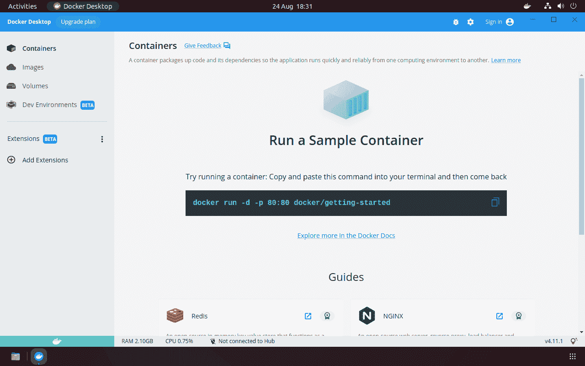

# 在 Ubuntu 上安装 Docker 种简单方法)

> 原文:# t0]https://kinta . com/blog/install-docker-Ubuntu/

Docker 是一个流行的工具，用于开发和部署被称为容器的包中的软件。Ubuntu 是最流行的 Linux 发行版之一，是一个受到 Docker 良好支持的操作系统。

在 Ubuntu 上安装 Docker 为您的开发项目创建了一个理想的平台，使用共享 Ubuntu 操作系统内核的轻量级虚拟机。本教程将通过解释实现这一点的 4 种方法来让你开始。

## 关于 Docker 的更多信息

Docker 让您可以在任何 Docker 主机上构建和运行应用程序，从而帮助实现应用程序的可移植性。容器映像无需修改就可以在 Docker 可用的任何地方使用——从您的笔记本电脑到云。这通过消除运行时环境之间的差异简化了开发人员的体验。容器格式也很容易在多台物理机上分发，使您能够轻松地扩展应用程序以响应不断变化的需求。

Docker 包括构建和运行容器映像所需的一切，无论它们来自 [Docker Hub](https://hub.docker.com) 和其他公共注册中心，还是您自己的 [Dockerfiles](https://docs.docker.com/develop/develop-images/dockerfile_best-practices) 。

## 准备在 Ubuntu 上安装 Docker

你可以在 [Ubuntu 版本](https://kinsta.com/knowledgebase/check-ubuntu-version/) 18.04、20.04、21.10 和 22.04 上安装最新的 Docker 版本。支持 x64_64/AMD64、ARMhf、ARM64 和 S390x 体系结构。

有几种方法可以安装 Docker，您的选择将取决于您需要的功能和您首选的包管理方法。您将在本指南中了解所有可能的选项。


[正在为你的下一个大 app 寻找完美的平台？Docker 可能是答案...👀在本指南中了解如何安装🛠 点击推文](https://twitter.com/intent/tweet?url=https%3A%2F%2Fbit.ly%2F3VOLHP8&via=kinsta&text=Looking+for+the+perfect+platform+for+your+next+big+app%3F+Docker+could+be+the+answer...+%F0%9F%91%80+Learn+how+to+install+it+in+this+guide+%F0%9F%9B%A0&hashtags=Docker%2CWebDev)


### 选择码头风味

Linux 上的 Docker 传统上是终端专用的。一个正常运行的安装包括 Docker Engine，一个运行容器的守护进程，以及用于与守护进程交互的命令行界面(CLI)。

[Docker 桌面](https://www.docker.com/products/docker-desktop)是 Docker 的替代使用方式。历史上只能在 Windows 和 Mac 上使用，它于 2022 年 5 月为 Linux 推出。Ubuntu 上的 Docker Desktop 需要 AMD64 处理器和 Ubuntu 21.10 或 22.04。它提供了管理容器的图形界面、集成的 Kubernetes 集群和对第三方扩展的支持。Docker 桌面也给你`docker`和 Docker 组成的 CLI。

Docker Desktop 与 Docker Engine 的不同之处在于，它使用虚拟机来运行您的容器(这就是 Windows 和 MacOS 用户需要 Docker Desktop 的原因)。尽管在 Ubuntu 上可以同时使用这两种风格，但你可能会发现不同版本的 CLI 之间存在冲突。最好挑一个，坚持下去。如果您喜欢使用您的终端，并希望获得最佳支持和性能，请选择 Docker Engine。Docker Desktop 的 VM 使它稍微有点重，但是如果你想要一个集成的 UI 或者打算使用 Kubernetes，它是更好的选择。

## 在 Ubuntu 上安装 Docker 引擎

Docker 引擎是在 Ubuntu 上运行 Docker 的标准方式。它适用于所有支持的版本和环境，从本地 Ubuntu 桌面机到您的 Ubuntu 服务器云主机。在继续之前，请确保您运行的是 18.04 或更高版本的 Ubuntu。

Docker 引擎有 3 种不同的安装方法:

1.  官方的 Ubuntu 库
2.  独立的 Debian 软件包(`.deb`)
3.  自动化安装脚本

选项 1，Ubuntu `apt`库，是最常用的。它将 Docker 添加到您的包列表中，这样您就可以通过运行`apt upgrade`轻松安装未来的更新。选项 2 不支持自动更新，但是对于在有空隙的离线系统上安装 Docker 是理想的。自动化安装脚本是最简单的入门方法，但是[只为开发使用](https://docs.docker.com/engine/install/ubuntu/#install-using-the-convenience-script)而配置。Docker 建议不要在生产环境中使用它。

当您使用生产系统、想要轻松更新或者需要在所有环境中使用相同的机制时，请使用`apt`存储库。

如果您想在自己的机器上使用 Docker 时获得快速安装体验，请使用自动安装脚本。

### 1.使用 apt 库安装 Docker

Docker 将包发布到自己的`apt`存储库中。您需要将这个库添加到您的`apt`源列表中，否则，您的`apt`安装将无法找到 Docker 包。

首先更新您现有的包列表，并为下面的步骤安装一些依赖项。`ca-certificates`、`curl`、`gnupg`和`lsb_release`工具将用于为您的系统下载正确的 Docker `apt`库详细信息和签名密钥。虽然你可能已经得到了这些包，但确保它们可用也无妨。

```
$ sudo apt update
$ sudo apt install ca-certificates curl gnupg lsb-release 
```

接下来，向 apt 注册 Docker 的 GPG 钥匙圈。这将让`apt`验证你安装的 Docker 包。

```
$ sudo mkdir -p /etc/apt/keyrings
$ curl -fsSL https://download.docker.com/linux/ubuntu/gpg | sudo gpg --dearmor -o /etc/apt/keyrings/docker.gpg
$ sudo chmod a+r /etc/apt/keyrings/docker.gpg 
```

`curl`命令下载 Docker 的 Ubuntu GPG 密钥，将其转换回标准 OpenGPG 编码，并保存到 apt 的 keyring 目录。`chmod`用于设置密匙环文件的权限，以便`apt`可靠地检测到它。

现在您可以将 Docker 包源添加到您的系统中。运行以下命令:

```
$ echo "deb [arch=$(dpkg --print-architecture) signed-by=/etc/apt/keyrings/docker.gpg] https://download.docker.com/linux/ubuntu $(lsb_release -cs) stable" | sudo tee /etc/apt/sources.list.d/docker.list > /dev/null 
```

这使用 shell 替换来自动检测您的系统架构，如 AMD64 或 ARM64，并下载适当的软件包列表。将使用之前添加的 GPG 密钥对其进行验证。存储库作为新的包列表添加到`apt /etc/apt/sources.list.d directory.`中

再次更新您的包列表，以便`apt`知道 Docker 包的存在:

```
$ sudo apt update 
```

现在您可以使用`apt install`命令将 Docker 的组件添加到您的系统中。您将安装 Docker Community Edition (CE)的最新版本。要安装三个软件包:

*   `docker-ce`:Docker 引擎守护进程。
*   `docker-ce-cli`:您将与之交互的 Docker CLI。
*   `containerd.io`:启动和运行容器的容器运行时[，称为 containerd](https://containerd.io) 。

```
$ sudo apt install docker-ce docker-ce-cli containerd.io 
```

### 2.使用 Debian 包安装 Docker

官方的`.deb`包很容易安装，但是你必须手动下载并安装每个新版本。包托管在一个简单的文件服务器上。首先导航到 Docker 的[发布说明页面](https://docs.docker.com/engine/release-notes)，找到最新的可用版本号，比如 20.10.20。接下来，[转到 containerd 的 GitHub 页面](https://github.com/containerd/containerd/releases)来检查它的版本号。看起来会像 1.6.8。

现在，您可以运行下面的命令序列来下载适合您的平台的软件包。分别用当前 Docker 和 containerd 版本号替换`<DOCKER_VERSION>`和`<CONTAINERD_VERSION>`。

```
$ curl https://download.docker.com/linux/ubuntu/dists/$(lsb_release --codename | cut -f2)/pool/stable/$(dpkg --print-architecture)/docker-ce_<DOCKER_VERSION>~3-0~ubuntu-focal_amd64.deb -o docker-ce.deb
$ curl https://download.docker.com/linux/ubuntu/dists/$(lsb_release --codename | cut -f2)/pool/stable/$(dpkg --print-architecture)/docker-ce-cli_<DOCKER_VERSION>~3-0~ubuntu-focal_amd64.deb -o docker-ce-cli.deb
$ curl https://download.docker.com/linux/ubuntu/dists/$(lsb_release --codename | cut -f2)/pool/stable/$(dpkg --print-architecture)/containerd.io_<CONTAINERD_VERISON>-1_amd64.deb -o containerd.deb 
```

你也可以下载文件，并通过在浏览器中访问你的 Ubuntu 版本的目录列表来检查所有可用的版本。

下载 Docker CE、CLI 和 containerd 软件包后，使用以下命令安装它们:

```
$ sudo apt install ./docker-ce.deb ./docker-ce-cli.deb ./containerd.deb 
```

如果您已经手动下载了软件包，而没有使用上面提供的脚本，请调整文件名。

### 3.使用安装脚本安装 Docker

Docker 的[便利脚本](https://docs.docker.com/engine/install/ubuntu/#install-using-the-convenience-script)自动安装所有 Docker 组件。它是非交互式的，所以当你的系统为你准备好的时候，你可以坐下来等待。

首先下载脚本:

```
$ curl -fsSL https://get.docker.com -o get-docker.sh 
```

现在以 root 权限运行脚本:

```
$ sudo sh get-docker.sh
Executing docker install script
... 
```

等待脚本完成。您应该会看到一条确认消息，显示 Docker 已经安装。

## 注册订阅时事通讯


### 想知道我们是怎么让流量增长超过 1000%的吗？

加入 20，000 多名获得我们每周时事通讯和内部消息的人的行列吧！

[Subscribe Now](#newsletter)

该脚本是一个通用的解决方案。如果不直接修改脚本的源代码，就无法定制它的功能。它也不是为执行 Docker 更新而设计的，因为它不会将依赖项升级到最新版本。

### 确保 Docker 引擎在 Ubuntu 上正常工作

无论您使用哪种安装方法，都应该通过启动容器来确保一切正常:

```
$ sudo docker run hello-world 
```

您将看到 Docker 客户端将`hello-world:image`从 Docker Hub 存储库中拉到您的机器上:

```
Unable to find image 'hello-world:latest' locally
latest: Pulling from library/hello-world
2db29710123e: Pull complete
Digest: sha256:7d246653d0511db2a6b2e0436cfd0e52ac8c066000264b3ce63331ac66dca625
Status: Downloaded newer image for hello-world:latest 
```

一个新的容器将自动启动。“hello-world”启动映像被配置为运行一个简单的命令，该命令输出一些关于 Docker 的基本信息，然后立即退出:

```
Hello from Docker!
This message shows that your installation appears to be working correctly.
To generate this message, Docker took the following steps:
 1\. The Docker client contacted the Docker daemon.
 2\. The Docker daemon pulled the "hello-world" image from the Docker Hub.
 (amd64)
 3\. The Docker daemon created a new container from that image which runs the
 executable that produces the output you are currently reading.
 4\. The Docker daemon streamed that output to the Docker client, which sent it
 to your terminal. 
```

看到上面显示的输出意味着 Docker 已经可以使用了。守护进程成功地从 Docker Hub 中拉出了 [hello-world:latest image](https://hub.docker.com/_/hello-world) ，并使用它启动了一个容器。从“Hello from Docker”行开始的所有内容都是由容器内部的进程发出的。

### 在 Ubuntu 上设置 Docker 引擎权限

全新的 Docker 引擎安装通常需要 root 权限才能运行`docker` CLI 命令。你需要给每个命令加上前缀`sudo`，不方便。

使用上述步骤安装 Docker Engine 后，您可以通过将自己添加到`docker`组来避免这一要求。这个可选的更改让您可以像普通用户一样运行`docker`命令，而不需要`sudo`，这简化了您的 CLI 体验。

确保`docker`用户组存在:

```
$ sudo groupadd docker 
```

然后把你自己加进去:

```
$ sudo usermod -aG docker $USER 
```

如果你之前已经用`sudo`运行过任何`docker`命令，你需要修改你的`~/.docker`目录的权限:

Struggling with downtime and WordPress problems? Kinsta is the hosting solution designed to save you time! [Check out our features](https://kinsta.com/features/)

```
$ sudo chown $USER:$USER /home/$USER/.docker -R
$ sudo chmod g+rwx $HOME/.docker -R 
```

这确保您自己的用户帐户被允许读写目录中的文件。

注销您的系统，然后再次登录，以便您的新组成员身份生效。尝试运行不带`sudo`的`docker`命令:

```
$ docker run hello-world 
```

这个安装后步骤完成了 Docker on Ubuntu 的安装过程。守护程序已经配置为自动启动，因此您不必手动设置服务。如果您计划进行高级安装，请参考 [Docker 用户手册](https://docs.docker.com/engine/install/linux-postinstall)了解如何配置定制的网络、日志和卷存储管理。

### 将 Docker Compose 添加到您的 Ubuntu 安装中

[Docker Compose](https://docs.docker.com/compose) 是一个流行的 Docker 配套工具，它使使用多个容器的应用程序工作起来更加容易。虽然`docker` CLI 的每个命令只针对一个容器，但是`docker compose`的每个动作可以启动和停止几个容器。这简化了管理系统，其中你有单独的[前端，后端](https://kinsta.com/blog/backend-vs-frontend/)和数据库服务。

Docker Compose 现已成为`docker` CLI 的一部分。当你使用官方的安装脚本来安装 Docker 的时候，你会看到 Compose V2 插件。如果您使用该方法，它也可以在`apt`中使用:

```
$ sudo apt install docker-compose-plugin 
```

或者，您可以下载最新的`.deb`档案并手动安装:

```
$ curl https://download.docker.com/linux/ubuntu/dists/$(lsb_release --codename | cut -f2)/pool/stable/$(dpkg --print-architecture)/docker-compose-plugin_2.6.0~ubuntu-focal_amd64.deb -o docker-compose-plugin.deb
$ sudo apt install -i ./docker-compose-plugin.deb 
```

通过尝试`docker compose version`命令检查编写是否正常工作:

```
$ docker compose version
Docker Compose version v2.6.0 
```

## 在 Ubuntu 上安装 Docker 桌面

虽然 Docker Engine 仅限于 CLI 体验，但 Docker Desktop 提供了图形管理界面、内置的 [Kubernetes](https://kinsta.com/blog/devops-engineer) 支持以及可选的第三方扩展，可以帮助简化您的容器工作流。当您在自己的工作站上寻求易用性时，这是一个很好的选择。

要安装 Docker Desktop，首先使用`apt`安装一些依赖项:

```
$ sudo apt update
$ sudo apt install ca-certificates curl gnupg lsb-release 
```

接下来，运行下面一组命令来添加 Docker 的`apt`存储库。尽管 Docker Desktop 并不包含在资源库中，但是其中的包被 Desktop 的 Debian 归档作为依赖项引用。

```
$ sudo mkdir -p /etc/apt/keyrings
$ curl -fsSL https://download.docker.com/linux/ubuntu/gpg | sudo gpg --dearmor -o /etc/apt/keyrings/docker.gpg
$ sudo chmod a+r /etc/apt/keyrings/docker.gpg
$ echo "deb [arch=$(dpkg --print-architecture) signed-by=/etc/apt/keyrings/docker.gpg] https://download.docker.com/linux/ubuntu $(lsb_release -cs) stable" | sudo tee /etc/apt/sources.list.d/docker.list > /dev/null
$ sudo apt update 
```

`curl`命令下载 Docker 的 Ubuntu GPG 密钥，将其转换回标准 OpenGPG 编码，并保存到`apt` keyring 目录。`chmod`用于设置密匙环文件的权限，以便`apt`可靠地检测到它。

从文档中的链接[下载 Docker 桌面 Debian 档案。这将提供 Docker Desktop for Linux 的最新稳定版本。使用`apt`安装软件包，替换您下载的版本号:](https://docs.docker.com/desktop/install/ubuntu/#install-docker-desktop)

```
$ sudo apt install ./docker-desktop-4.11.0-amd64.deb 
```

Docker 桌面现在会出现在你的应用程序启动器中。使用您的启动器启动 Docker 桌面并打开 UI。你也可以在你的终端上运行`docker`、`docker compose`和`kubectl`命令。该应用程序还向您的 shell 托盘添加了一个菜单，显示当前 Docker 桌面状态，并允许您执行一些快速操作。

首次运行 Docker Desktop 时，系统会提示您接受服务协议。如果您同意，请按“接受”按钮，并等待 Docker Desktop 启动其虚拟机。

几分钟后，仪表板将加载。它提供了从流行图像创建新容器的快捷方式，避免了冗长的终端命令。



Docker Desktop installed on Ubuntu.


### DevKinsta: Docker 桌面

建立在 Docker 基础之上的专业解决方案为特定技术提供了更简单的体验。DevKinsta 是一个免费的本地开发工具，用于构建 WordPress 主题和插件，它使用 Docker 来完全隔离和保护你的 WordPress 站点。它使得启动和定制一个新的 WordPress 项目变得快速和简单，而不需要你自己设置服务器。一旦你准备好了，你就可以直接推送到 Kinsta 平台来部署你的 live 站点。

你可以在 MacOS、Windows 和 Ubuntu 上安装 DevKinsta。

[Want to make your dev process a piece of cake? 🍰 Try Docker on Ubuntu for your next project! Here's how you can install it ⬇️Click to Tweet](https://twitter.com/intent/tweet?url=https%3A%2F%2Fbit.ly%2F3VOLHP8&via=kinsta&text=Want+to+make+your+dev+process+a+piece+of+cake%3F+%F0%9F%8D%B0+Try+Docker+on+Ubuntu+for+your+next+project%21+Here%27s+how+you+can+install+it+%E2%AC%87%EF%B8%8F&hashtags=Docker%2CWebDev) ## 摘要

Docker 是大多数开发人员开始使用容器的方式。你可以很容易地在你的 Ubuntu 系统上安装 Docker，无论是作为 Docker 引擎还是新的 Docker 桌面。一旦安装了 Docker，您就完全可以构建和运行容器，从而简化开发并减少环境之间的差异。

如果你正在开发 WordPress 主题和插件， [DevKinsta](https://kinsta.com/webinars/install-and-use-devkinsta/) 可以简化创建本地开发环境和部署你的站点。

* * *

让你所有的[应用程序](https://kinsta.com/application-hosting/)、[数据库](https://kinsta.com/database-hosting/)和 [WordPress 网站](https://kinsta.com/wordpress-hosting/)在线并在一个屋檐下。我们功能丰富的高性能云平台包括:

*   在 MyKinsta 仪表盘中轻松设置和管理
*   24/7 专家支持
*   最好的谷歌云平台硬件和网络，由 Kubernetes 提供最大的可扩展性
*   面向速度和安全性的企业级 Cloudflare 集成
*   全球受众覆盖全球多达 35 个数据中心和 275 多个 pop

在第一个月使用托管的[应用程序或托管](https://kinsta.com/application-hosting/)的[数据库，您可以享受 20 美元的优惠，亲自测试一下。探索我们的](https://kinsta.com/database-hosting/)[计划](https://kinsta.com/plans/)或[与销售人员交谈](https://kinsta.com/contact-us/)以找到最适合您的方式。