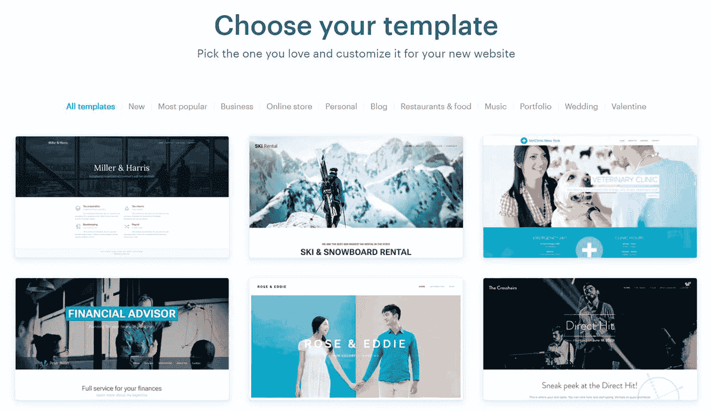
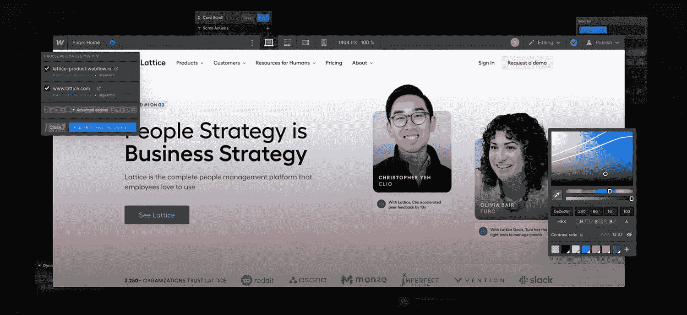
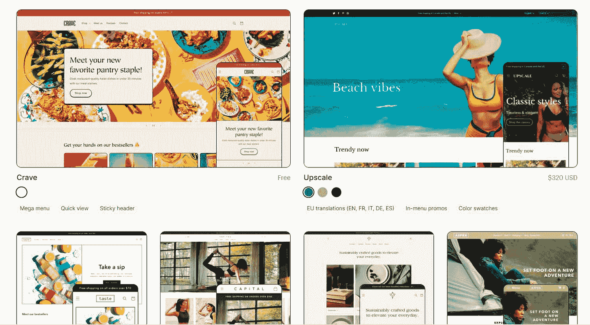
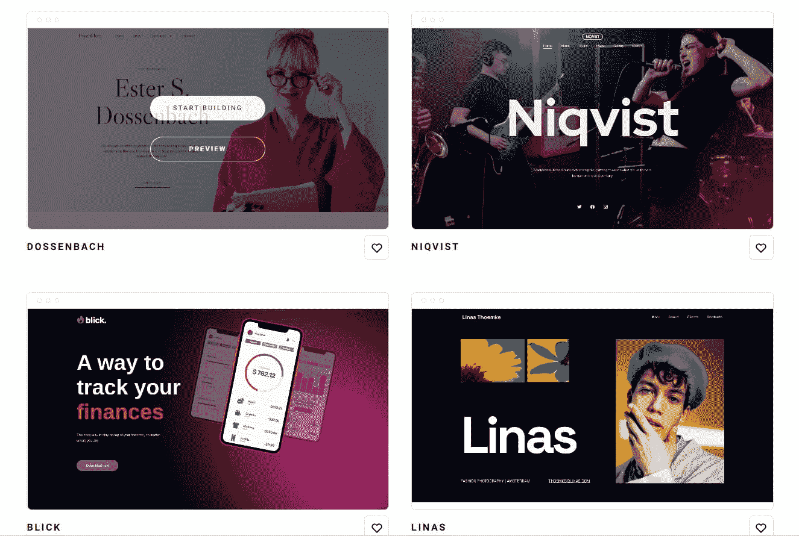

# 2022 年要尝试的 11 种最佳 Wix 替代方案

> 原文:# t0]https://kinta . com/blog/wix-alternatives/

坚持使用熟悉的网站构建工具可能很有诱惑力，尤其是当大量的选择让你头晕目眩的时候。然而，没有两个网站建设者是相同的。如果你选择 Wix 只是因为你不知道任何更好的，你很可能会错过一些伟大的机会。

不要误解——Wix 非常适合创建个人和商业网站。然而，在某些情况下，您可能需要更便宜、更安全或更先进的 Wix 替代方案，以更好地满足您的需求。

我们研究了 Wix 的 11 个竞争对手，以了解他们如何超越 Wix，以及他们的理想用例是什么。我们还指出了他们的弱点，以帮助您做出自信和明智的选择。

通读找出哪个网站建设者将最适合你。

## 为什么要考虑寻找 Wix 的替代品？

目前有超过[330 万](https://kinsta.com/wix-market-share/)个网站使用 Wix。它是一个强大的网站建设者，但它也有其局限性和缺点。

1.  不是每个人都喜欢一刀切的方法和通用模板。如果你想要一个独特的[定制网站](https://kinsta.com/blog/website-design-software/)，你可能需要一个更实用的解决方案。
2.  最便宜的 Wix 计划不会给你分析工具，而这些工具对任何网站所有者来说都是必不可少的。
3.  Wix 使用基于订阅的模型。为了充分利用这个平台，你需要坚持使用它。如果你只创建了一个网站，并且再也没有接触过 Wix tools，那么每月支付 20-50 美元是没有意义的。
4.  Wix 充满了一些可能被认为多余的额外功能，但它们包含在所有的商业和电子商务计划中，这影响了它的价格。
5.  Wix 提供的营销、设计和 [SEO 工具](https://kinsta.com/topic/seo-tools/)仍然非常基础，不能完全替代专业软件。
6.  有了 Wix，你就没有网站的完全所有权了。它托管在 Wix 上，因此，如果 Wix 遇到停电或暂停您的帐户，您的网站将受到影响。
7.  Wix 高级计划不能用于多个网站。你需要为每个网站购买一个额外收费计划，这可能会很快变得非常昂贵。
8.  不可能将模板更改为您已经创建的网站，因此在尝试不同的设计时，您应该小心谨慎。

要创建一个最先进的网站，你需要知道什么是可能的，什么样的工具可供你使用。一旦你了解了 Wix 的各种竞争对手，你就会更好地理解 Wix 的优缺点以及你自己的需求。

[Whether you're looking to launch your online shop or enhance your design skills, these Wix alternatives offer top-tier solutions. 💪Click to Tweet](https://twitter.com/intent/tweet?url=https%3A%2F%2Fkinsta.com%2Fblog%2Fwix-alternatives%2F&via=kinsta&text=Whether+you%27re+looking+to+launch+your+online+shop+or+enhance+your+design+skills%2C+these+Wix+alternatives+offer+top-tier+solutions.+%F0%9F%92%AA&hashtags=Wix%2CWordPress)

## 2022 年最受欢迎的 11 种 Wix 替代产品

Wix 是最受欢迎的网站建设者之一，但它远不是唯一的选择。以下是顶级 Wix 替代方案，因此您可以探索您的选择。

### 1.WordPress

WordPress 是一款开源软件，用于创建各种类型的网站。这是最受欢迎的内容管理系统——[每四个网站](https://kinsta.com/wordpress-market-share/)中就有一个建立在 WordPress 上。它也是最强大的 Wix 替代方案，因为世界各地的专业人员每天都在通过修复 bug、审查文档等方式做出贡献。

有了 WordPress，你就真正拥有了自己的网站。正因为如此，在你开始使用这个平台之前，你需要[购买一个域名](https://kinsta.com/blog/how-much-does-a-domain-name-cost/)和[托管](https://kinsta.com/blog/free-wordpress-hosting/)。全面的 WordPress 教程和课程将帮助你完成剩下的工作。

WordPress 有超过 60，000 个插件和 10，000 个主题，这给了你无限的方法来定制和增强你的网站。WordPress 插件是扩展你网站功能的插件。 [WordPress 主题](https://kinsta.com/best-wordpress-themes/)是由专业设计师创建的模板——它们定义了你网站的外观。

WordPress

然后，还有像 [SeedProd](https://kinsta.com/blog/elementor-alternative/#9-seedprod) 或[element 或](https://kinsta.com/blog/wordpress-elementor/)这样的工具，它们可以两全其美。Elementor 允许你在一个可视化的编辑器中构建令人惊叹的 WordPress 网站，完全免费。它减少了对其他插件的需求，给你一个令人印象深刻的各种设计工具，并提供内置主机。

定价:WordPress 是 Wix 的免费替代品，但你需要为高级主题或插件付费，更不用说主机和域名了。

**推荐对象:**任何人。

### 2.Squarespace

Squarespace 是最时尚、最简单的网站建设者之一。它使你能够使用专业设计的模板创建有品味的响应网站。您还可以使用第三方模板和设计工具包来使您的 Squarespace 网站脱颖而出。

编辑时，您可以一键添加任何类型的内容、表单或按钮:

Squarespace

以下是 Squarespace 的主要特性:

*   直观的可视化网站构建器
*   完全托管的[云托管](https://kinsta.com/topic/cloud-hosting/)
*   生物链接网站构建器
*   域名搜索器
*   基本分析和搜索引擎优化工具
*   SSL 安全性
*   [电子邮件营销工具](https://kinsta.com/blog/email-marketing-software/)
*   视频工作室应用程序
*   照片图库
*   免费在线标志制造商

谈到[电子商务](https://kinsta.com/blog/ecommerce-statistics/)，Squarespace 提供运输、定价和履行自动化，以及多种支付选项和直观的订单管理。该功能可以通过第三方应用和连接服务进一步扩展。

有了 Zapier，Squarespace 可以连接超过 5000 个应用，这仍然比 WordPress 所能提供的少。然而，一旦你超越了这个平台，[有可能从 Squarespace 转移到 WordPress](https://kinsta.com/blog/squarespace-to-wordpress/) 。

**定价**:如果你想避免 3%的交易费，并获得电子商务套件的全部权限，你需要商务计划，起价为每月 27 美元。按年付款可以节省 25%的费用。

**推荐对象:**创作者、小企业、创业者、自由职业者、博主、服务商。

### 3.吉姆多

Jimdo 是一个为小企业主设计的无代码网站构建器。有了这个平台，你可以快速创建[移动优化网站](https://kinsta.com/blog/google-mobile-first-index/)，并定制它们以反映你的品牌。

Jimdo 是一种更便宜的 Wix 替代产品，具有一系列熟悉的工具和功能:

*   拖放式网站构建器
*   100 多种现代模板
*   [SEO 工具](https://kinsta.com/blog/website-traffic-analysis/)
*   编码特性以实现更深层次的定制
*   自定义域
*   在线标志制造商
*   个性化支持
*   用于创建符合 GDPR 标准的网站的法律文本生成器

Jimdo 还有一个灵感画廊:

Jimdo

此外，Jimdo 为用户提供了访问脸书销售工具的便捷途径。您可以自动将脸书目录与 Jimdo 商店产品同步。你还可以在 Instagram 上创建可购买的帖子和故事。

**定价**。Jimdo 不收交易费。平台有免费计划。最便宜的有访客统计的方案每月花费 16 美元左右。

**推荐给**的:小企业、独立职业者、[博主](https://kinsta.com/blog/best-wordpress-themes-for-blogs/)。

### 4.Webnode

Webnode 是一个网站构建器，用于创建响应博客、作品集、活动页面和在线商店。它有超过 100 个可编辑的模板和一个广泛的知识库来帮助你开始。

Webnode

Webnode 拥有构建转换、像素完美的网站所需的一切:

*   可扩展托管
*   可从智能手机访问的网站编辑器
*   GDPR 友好型表单生成器
*   轻松备份
*   [SSL 证书](https://kinsta.com/blog/types-of-ssl-certificates/)
*   视差滚动和其他视觉效果
*   图像和图标库
*   轻松集成小部件
*   不限页数
*   统计工具
*   内置的搜索引擎优化功能
*   商务电子邮件地址
*   域名搜索和匿名域名注册
*   一键[网站发布](https://kinsta.com/blog/how-to-publish-a-website/)
*   多语言支持团队

有了 Webnode，你可以出售会员资格，并提供各种支付选择。该平台允许你批量进口产品，增加产品种类，并提供折扣和免费送货。Webnode 支持 40 多种语言，这在 Wix 竞争中是相当罕见的。

**定价** : Webnode 有免费试用，而且只提供按年计费。创建一个个人网站，你每月只需支付 3 美元。面向专业人士的最高级计划每月花费约 17 美元。电子商务计划每月起价 11 美元。

**推荐:小企业、[自由职业者](https://kinsta.com/blog/best-tools-for-freelancers/)，创业者。**

 **### 5.Webflow

Webflow 是一款面向设计师、营销人员和开发人员的高级无代码网站构建工具。与其他 Wix 替代方案不同，Webflow 并不基于僵化的模板。你可以在一个可视化编辑器中结合 [HTML](https://kinsta.com/knowledgebase/what-is-html/) 、 [CSS](https://kinsta.com/blog/css-best-practices/) 和 [JavaScript](https://kinsta.com/knowledgebase/what-is-javascript/) 的力量，创建非凡的定制网站，无论是商业网站还是个人网站。

Webflow

以下是您可以使用 Webflow 做些什么的快速概述:

*   使用 Webflow [CMS](https://kinsta.com/blog/cms-software/) 来策划、编写、编辑和组织你的网站内容。
*   构建独特的在线商店，并通过可定制的产品字段突出关键产品功能。
*   定制您的购物车和结账体验。
*   与您的团队协作，实时跟踪变化。
*   即时更改您的网站，而无需弄乱复杂的代码。
*   使用集成的搜索引擎优化工具，使您的网站更加可见和可搜索。
*   依靠 Webflow 的快速、完全托管的主机。
*   创造独特的互动和丰富的动画来取悦你的访客。
*   预览和恢复您的网站从自动备份或设置保存点。
*   让 Webflow 为您编写清晰的语义代码，并在需要时轻松集成定制代码。
*   为销售线索生成创建[自定义表单](https://kinsta.com/blog/google-forms-alternative/)。
*   探索 Webflow 库、应用程序和模板，为您的站点添加新功能和高级特性。

这只是 Webflow 功能的一小部分。这是一个非常多才多艺的建设者，已经成为像 Wix 一样的标志性，但在其利基。全世界有超过 3，500，000 名设计师在使用它。查看我们的 [WebFlow 与 WordPress](https://kinsta.com/blog/webflow-vs-wordpress/) 对比，做出明智的选择。

**定价** : Webflow 提供可伸缩的定价和免费计划。要创建一个内容驱动的网站，你需要一个月 29 美元的 CMS 计划。最便宜的电子商务计划每月花费 42 美元。通过按年付款，你可以节省高达 30%的费用。

**推荐给**:单飞设计师、代理商、自由职业者、开发者、营销人员，以及介于两者之间的任何人。

### 6.GoDaddy 网站建设者

GoDaddy 网站建设商是 Wix 最大的竞争对手之一。这是一个多合一的构建器，有一个慷慨的免费计划，100 多个好看的模板，以及一整套电子商务和营销功能。尽管它是一个无代码平台，但它可以帮助你建立一个强大的在线商店，并轻松扩展。

## 注册订阅时事通讯

### 想知道我们是怎么让流量增长超过 1000%的吗？

加入 20，000 多名获得我们每周时事通讯和内部消息的人的行列吧！

[Subscribe Now](#newsletter)

GoDaddy

以下是 [GoDaddy 网站构建器](https://kinsta.com/godaddy-alternative/)帮助您实现的功能:

*   使用可定制的主题和模板，立即设计出[客户友好的](https://kinsta.com/blog/web-design-principles/)网站。
*   从您的智能手机快速更改您的网站页面。
*   使用 GoDaddy Studio(一个初学者友好的编辑器)创建引人注目的内容。
*   在一个地方收集和存储客户信息。
*   将某些页面设为成员专用，以便更好地控制访问。
*   无需离开 GoDaddy，即可向您的客户发送个性化信息。
*   使用搜索引擎优化和社交媒体工具来提高你的品牌在网上的知名度。
*   跟踪您网站的业绩、[电子邮件活动](https://kinsta.com/blog/newsletter-examples/)和订单。
*   接受 GoDaddy 关于如何让你的在线状态更有效的建议。
*   让你的顾客预约并以他们喜欢的方式付款。
*   从一个选项卡管理您所有的客户通信。
*   将你的在线商店与亚马逊、Etsy、易贝和沃尔玛等市场同步。
*   定制您的菜单和价格，并提供折扣和各种送货选项。

此外，该平台还提供自定义域名、托管、便捷的 GoDaddy 支付、分析和 24/7 支持。

定价:有一个永远免费的计划，包括内容创建工具、预约系统和其他电子商务功能。更高级的计划是每月 9.99 美元起，按年计费。GoDaddy 每笔交易收费约 2.3% + 30 英镑。

**推荐给**:中小企业、创业公司、服务提供商。

### 7.Pixpa

Pixpa 是一个为视觉艺术家和内容创作者设计的简单而功能丰富的网站构建工具。它主要用于创建专业的投资组合，但你也可以用它来建立一个坚实的网上商店。

Pixpa

与 Wix 的其他竞争对手不同，Pixpa 是一个视觉优先的平台。如果你想通过你的新网站展示你的作品和建立你的专业知识，这是一个很好的选择。

Pixpa 的主要特性包括:

*   拖放构建器和 150 多个迷人的、[响应模板](https://kinsta.com/blog/responsive-web-design/)
*   支持电子商务的图库和客户图库
*   销售产品、服务和数字资产(如印刷品)的选项
*   完全托管的云托管
*   内置搜索引擎优化工具和社交媒体工具
*   透明的库存、运输、税收和订单管理
*   简化的品牌结账体验
*   自定义表单和营销[弹出窗口](https://kinsta.com/blog/elementor-popup/)
*   独特外观的 HTML 编辑和 CSS 覆盖
*   100 多个应用和集成
*   网站设置服务
*   24/7 实时聊天和电子邮件客户支持

**定价** : Pixpa 提供 15 天免费试用和 30 天退款保证。平台没有交易费。面向创作者的计划每月 12 美元，专业计划每月 17 美元左右。按年付款可以节省 20%的费用。

**推荐给**:任何建立个人或商业品牌的人。

### 8\. Shopify

Shopify 网站构建器是一个完全可定制的 Wix 替代产品。Shopify 让创建功能齐全的电子商务网站变得轻而易举，无需专业技能。它是专门为忙碌的卖家设计的，他们希望自己的网上商店有吸引力，用户友好，易于维护。

Shopify

Shopify 的功能列表包括以下内容:

*   70 多个可定制的商店主题和一个拖放式构建器
*   Shopify 支付和 100 多个外部支付网关
*   全面的仪表板，提供您销售的鸟瞰图
*   集成的搜索引擎优化和营销工具
*   所有渠道的库存同步
*   当您离开电脑时，用于管理订单和内容的应用程序
*   Shopify 应用商店中超过 6000 款应用

Shopify 主导了美国电子商务市场。它提供了一种低投入高回报的创建网上商店的方式，并且它具有极强的可扩展性和多功能性。此外，作为在线卖家，您还可以享受其他 Shopify 服务和优惠，如运费折扣、一体化 POS 系统或免费商业金融账户。

Struggling with downtime and WordPress problems? Kinsta is the hosting solution designed to save you time! [Check out our features](https://kinsta.com/features/)

**定价** : Shopify 有 3 天免费试用。基本计划每月花费 29 美元，外加 2.9% + 30 的交易费。确保选择按年计费以节省 50%的费用。

**推荐给**:企业主和企业家。

### 9\. Weebly

Weebly 是最实惠、最受欢迎的 Wix 替代品之一。这个免费的平台可以让你创建个人网站和在线商店。Weebly 有几十个专业设计的主题，但你也可以找到自定义的主题，并用你的内容填充它们。

该平台还包括一个功能齐全的商业电子邮件生成器:

Weebly

Weebly 为您提供了大量工具，不仅可以创建出色的网站，还可以创建用户友好的网站:

*   视频背景
*   视差和揭示等动画
*   网站搜索
*   免费的[电子商务托管](https://kinsta.com/blog/ecommerce-hosting/)
*   内置图像编辑器和自定义字体
*   集成分析
*   定制销售线索生成表单、RSVP 列表和调查
*   内容调度
*   自定义代码
*   域名搜索器
*   集成社交媒体工具、SEO 工具和 AdWords 信用
*   SSL 证书、 [DDoS](https://kinsta.com/blog/what-is-a-ddos-attack/) 缓解和 24/7 支持
*   全功能移动应用

Weebly 目前拥有超过 4000 万用户。它的应用中心允许你通过第三方集成来扩展 Weebly 的功能。该平台还提供运输和库存自动化工具、各种支付方式、客户评论和其他必备的电子商务功能。

**定价** : Weebly 有两个定价类别。如果你想建立一个个人网站，按年付费的话，每月要花 5-20 美元。还有一个有限的免费计划。建立一个在线商店稍微贵一点——价格从每月 10 美元开始。

**推荐给**:创作者、自由职业者、博主、小企业。

### 10.广场在线

[Square Online](https://squareup.com/us/en/online-store) 是一个可视化的在线商店构建者，也是 Square 生态系统的一部分。它允许您从一个地方管理所有订单，并创建一个统一的客户数据库。您还可以同步在线和店内库存和订单，以避免过度销售。

使用 Square Online，您可以快速创建华丽的在线商店，这些商店在[移动设备](https://kinsta.com/mobile-vs-desktop-market-share/)上看起来也很棒:

Square Online

让我们更深入地了解一下该平台，以及它能让您做些什么:

*   在几分钟内创建轻量级、[移动友好型](https://kinsta.com/blog/wordpress-mobile-plugin/)网站。
*   使用动态样式工具来定制你网站的每一寸。
*   通过向客户发送定制的建议和提醒，为他们提供个性化的购物体验。
*   使用基于团队的权限为您的员工创建不同级别的访问权限。
*   安排产品投放、特价和季节性销售，并自动投放。
*   使用横幅和弹出窗口吸引人们对您的产品的关注。
*   使用 Square Photo Studio 应用程序快速准备高质量的产品图像。
*   为您的客户提供运输折扣和各种交付选项。
*   直接从您的方形仪表板生成运输标签。
*   接受 Afterpay、Square Pay、Apple Pay、 [PayPal](https://kinsta.com/blog/paypal-alternative/) 等多种支付方式

**定价** : Square 有免费计划，标准交易费 2.9% + 30。如果你想要更多的功能，你可以选择更高级的计划，每月 29 美元，外加同样的交易费。高级计划每月花费 79 美元。

**推荐给**:中小型零售商以及企业。

### 11 .零

齐罗是一个直观和多功能的电子商务网站建设者。这个平台有一个内置的 [CRM](https://kinsta.com/blog/wordpress-crm/) ，帮助你自动化库存、运输和税收。有了齐罗，你可以在几分钟内让你的网上商店开始运作。

Zyro

该平台为您提供了几乎无限的销售和营销选择:

*   定制 100 多个预设计模板中的任何一个，让您的品牌熠熠生辉。
*   使用齐罗的搜索引擎优化和营销工具来推广你的商店。
*   免费托管您的网站，享受 99.9%的正常运行时间和自动缩放。
*   在 40 多个国家接受卡支付，使用流行的支付方式，如 Google Pay、Apple Pay 等。
*   使用人工智能工具，如徽标制作工具、热图和写作助手，来分析您的流量，并为您的产品和子品牌创建内容。
*   依靠第三方集成来与您的客户沟通并增强他们的购物体验。
*   从单一控制面板管理您的所有销售流程。
*   使用特定地区的定价、折扣和优惠券代码，使您的优惠更加灵活。
*   获取自定义电子邮件地址，并向您的受众发送个性化活动。
*   使用[谷歌分析](https://kinsta.com/blog/how-to-use-google-analytics/)和谷歌标签管理器分析你网站的表现。
*   将您的网站与社交媒体和跟踪工具相结合，以创建高针对性的广告和信息。

**定价** : Zyra 不收取交易费用。它为每个计划提供 30 天退款保证。管理一个专业网站每月花费 11.99 美元。如果你想使用齐罗进行电子商务，你每月需要支付 14.99 美元。

**推荐给**:个体户和企业主。

## 哪个是最好的 Wix 替代方案？

正如你所看到的，网站建设者没有对错之分。现在你知道你的选择，你可以根据你的个人和商业目标做出自信的选择。

让我们总结一下:

*   如果你想对你的网站有更多的灵活性和创造性的控制，选择 [WordPress 而不是 Wix](https://kinsta.com/blog/wix-vs-wordpress/) 。
*   为了提供完美的大规模购物体验，请考虑使用 Shopify。
*   如果你想不费吹灰之力就创建令人惊叹的网站，那就去看看 Squarespace 吧。
*   要免费开网店或测试新的电子商务创意，请使用 Square Online 或 Webnode。
*   如果你的目标是在坚持使用无代码工具的同时深化你的设计技能，那么看看 WebFlow 就知道了。

值得庆幸的是，大多数 Wix 替代品都有免费计划或试用期，因此在您做出任何承诺之前，您可以点击查看它们的运行情况。

## 如果您已经有了 Wix 网站，是否可以转向 Wix 替代网站？

Wix 网站是不可转让的，这意味着你不能为你现有的 Wix 网站使用另一个主机。它只允许您选择不同的域。但是，有一些解决方法。你可以[将 Wix 迁移到 WordPress](https://kinsta.com/blog/wix-to-wordpress/)——一定要查看我们关于如何做的分步指南。

这里有一个简短的总结:

1.  找一个 [WordPress 主机提供商](https://kinsta.com/wordpress-hosting/)。
2.  如果你还没有域名，就买一个。
3.  使用 [WordHerd](https://wordherd.io/partners/kinsta/) 的帮助来处理剩余的迁移过程。

迁移将帮助您获得对您的站点的更多控制，并脱离僵硬和通用的模板。使用 WordPress 不会错，因为它是 Wix 的最佳替代品之一。

[Wix is a powerful website builder, but its one-size-fits-all approach might not suit your needs. Check out 10 great alternatives in this post ⬇️Click to Tweet](https://twitter.com/intent/tweet?url=https%3A%2F%2Fkinsta.com%2Fblog%2Fwix-alternatives%2F&via=kinsta&text=Wix+is+a+powerful+website+builder%2C+but+its+one-size-fits-all+approach+might+not+suit+your+needs.+Check+out+10+great+alternatives+in+this+post+%E2%AC%87%EF%B8%8F&hashtags=Wix%2CWordPress) ## 摘要

如果你选择 WordPress，你必须确保你的网站处于良好的管理之下。以一种无压力的方式转移到[我们功能丰富的主机](https://kinsta.com/features/)，告别缓慢的加载时间、意外的停机时间和 DDoS 攻击。你可以从我们的博客中了解[主机如何影响你的 SEO](https://kinsta.com/blog/how-hosting-affects-seo/) ，并做出自信的选择。

Kinsta 通过提供全球可用性、CDN、24/7 应用程序性能监控和屡获殊荣的支持来帮助您节省时间和资金。[免费体验我们的托管服务](https://kinsta.com/#try-for-free)，享受 30 天退款保证！

* * *

让你所有的[应用程序](https://kinsta.com/application-hosting/)、[数据库](https://kinsta.com/database-hosting/)和 [WordPress 网站](https://kinsta.com/wordpress-hosting/)在线并在一个屋檐下。我们功能丰富的高性能云平台包括:

*   在 MyKinsta 仪表盘中轻松设置和管理
*   24/7 专家支持
*   最好的谷歌云平台硬件和网络，由 Kubernetes 提供最大的可扩展性
*   面向速度和安全性的企业级 Cloudflare 集成
*   全球受众覆盖全球多达 35 个数据中心和 275 多个 pop

在第一个月使用托管的[应用程序或托管](https://kinsta.com/application-hosting/)的[数据库，您可以享受 20 美元的优惠，亲自测试一下。探索我们的](https://kinsta.com/database-hosting/)[计划](https://kinsta.com/plans/)或[与销售人员交谈](https://kinsta.com/contact-us/)以找到最适合您的方式。**