# 爬虫列表:网络爬虫机器人以及如何利用它们取得成功

> 原文：<https://kinsta.com/blog/crawler-list/>

对于大多数营销人员来说，需要不断更新来保持网站的新鲜度，提高他们的 SEO 排名。

然而，一些网站有数百甚至数千个页面，这对手动向搜索引擎推送更新的团队来说是一个挑战。如果内容更新如此频繁，团队如何确保这些改进影响他们的 SEO 排名？

这就是爬虫机器人发挥作用的地方。一个网络爬虫机器人会从你的网站地图中抓取新的更新，并将内容编入搜索引擎。

在本帖中，我们将列出一个全面的爬虫列表，涵盖所有你需要知道的网络爬虫机器人。在我们开始之前，让我们定义一下网络爬虫机器人，并展示它们是如何工作的。

## 什么是网络爬虫？

网络爬虫是一种计算机程序，它自动扫描并系统地读取网页，以便为搜索引擎索引网页。网络爬虫也被称为蜘蛛或机器人。

> 需要在这里大声喊出来。Kinsta 太神奇了，我用它做我的个人网站。支持是迅速和杰出的，他们的服务器是 WordPress 最快的。
> 
> <footer class="wp-block-kinsta-client-quote__footer">
> 
> 
> 
> <cite class="wp-block-kinsta-client-quote__cite">Phillip Stemann</cite></footer>

[View plans](https://kinsta.com/plans/)

为了让搜索引擎向发起搜索的用户呈现最新的相关网页，必须从网络爬虫机器人进行爬行。这个过程有时会自动发生(取决于爬虫和你的站点的设置)，或者它可以直接启动。

许多因素影响你的页面的搜索引擎优化排名，包括相关性，反向链接，T2 虚拟主机，等等。然而，如果你的页面没有被搜索引擎抓取和索引，这些都不重要。这就是为什么它是如此重要，以确保您的网站是允许正确的抓取发生，并消除任何障碍，他们的方式。

机器人必须不断扫描和[抓取网页](https://kinsta.com/knowledgebase/what-is-web-scraping/)以确保呈现最准确的信息。谷歌是美国[访问量最大的网站](https://www.similarweb.com/top-websites/)，大约 26.9%的搜索来自美国用户:

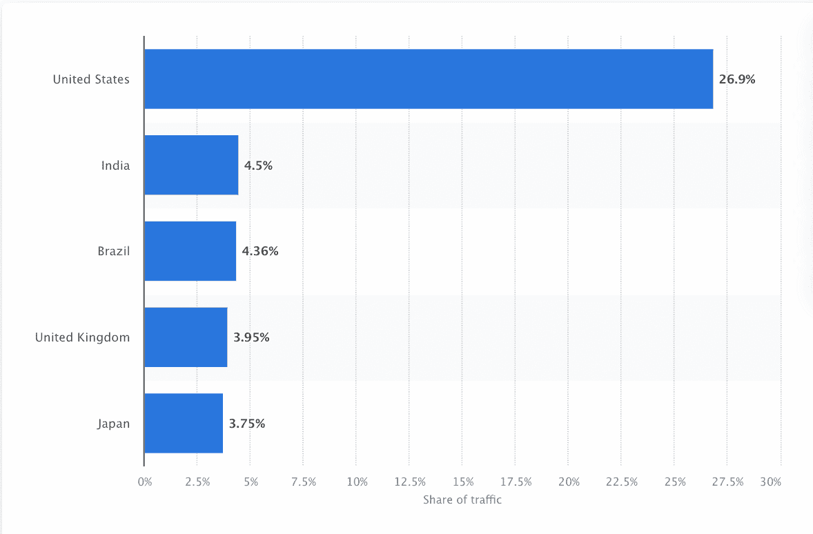

Google searches are primarily initiated from the United States (**Source:** [Statista](https://www.statista.com/statistics/276737/distribution-of-visitors-to-googlecom-by-country/))

然而，没有一个网络爬虫能抓取所有的搜索引擎。每个[搜索引擎](https://kinsta.com/search-engine-market-share/)都有独特的优势，所以开发者和营销人员有时会编制一份“爬虫列表”该爬虫列表帮助他们在他们的站点日志中识别不同的爬虫以接受或阻止。

营销人员需要收集一个包含不同网络爬虫的爬虫列表，并了解他们如何评估他们的网站(不像[内容抓取器](https://kinsta.com/blog/content-scraping/)窃取内容),以确保他们为搜索引擎正确优化他们的登陆页面。

[Want your site to rank highly in search results? Make sure the right bots can crawl your site with ease 👾 Get started here ✅Click to Tweet](https://twitter.com/intent/tweet?url=https%3A%2F%2Fkinsta.com%2Fblog%2Fcrawler-list%2F&via=kinsta&text=Want+your+site+to+rank+highly+in+search+results%3F+Make+sure+the+right+bots+can+crawl+your+site+with+ease+%F0%9F%91%BE+Get+started+here+%E2%9C%85&hashtags=SEO%2CWebCrawler)

## 网络爬虫是如何工作的？

网络爬虫会在你的网页发布后自动扫描它，并为你的数据建立索引。

网络爬虫寻找与网页相关联的特定关键字，并为相关搜索引擎(如 Google、Bing 等)索引该信息。

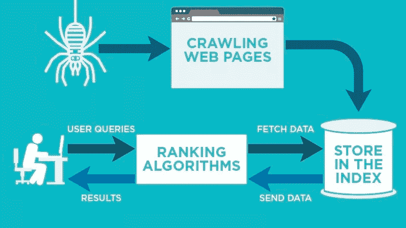

Crawling web pages is a multi-step process (**Source:** [Neil Patel](https://neilpatel.com/blog/deindex-your-pages/))

当用户提交与其相关的关键词的查询时，搜索引擎的算法将获取这些数据。

抓取从已知的[URL](https://kinsta.com/knowledgebase/what-is-a-url/)开始。这些是具有各种信号的已建立的网页，这些信号将网络爬虫引导到那些页面。这些信号可能是:

*   反向链接:一个网站链接到它的次数
*   **访问者:**有多少[流量](https://kinsta.com/blog/how-to-drive-traffic-to-your-website/)正前往该页面
*   **域权限:**域的整体质量

然后，他们将数据存储在搜索引擎的索引中。当用户发起搜索查询时，算法将从索引中获取数据，并且它将出现在搜索引擎结果页面上。这个过程可以在几毫秒内发生，这就是为什么结果经常很快出现。

作为一个网站管理员，你可以控制哪些机器人抓取你的网站。这就是为什么有一个爬虫列表很重要。正是位于每个网站服务器内的 **[robots.txt 协议](https://kinsta.com/blog/wordpress-robots-txt/)** 将爬虫引导至需要索引的新内容。

根据您在每个网页上的 **robots.txt** 协议中输入的内容，您可以告诉爬虫扫描或避免将来索引该页面。

通过理解网络爬虫在其扫描中寻找什么，你可以理解如何更好地为搜索引擎定位你的内容。

## 编译你的爬虫列表:有哪些不同类型的网络爬虫？

当您开始考虑编译您的爬虫列表时，有三种主要类型的爬虫要寻找。其中包括:

*   内部爬虫:这些是由一家公司的开发团队设计的用来扫描其网站的爬虫。通常它们用于站点审计和[优化](https://kinsta.com/learn/page-speed/)。
*   商业爬虫:这些是像[尖叫青蛙](https://kinsta.com/clients/screaming-frog/)这样的定制爬虫，公司可以用它们来抓取和有效地评估他们的内容。
*   开源爬虫:这些是免费使用的爬虫，由世界各地的不同开发者和黑客构建。

了解现有的不同类型的爬虫很重要，这样你就知道你需要利用哪种类型来实现你自己的业务目标。

## 要添加到您的爬虫列表中的 11 个最常见的网络爬虫

没有一个爬虫为每个搜索引擎做所有的工作。

取而代之的是，有各种各样的网络爬虫评估你的网页，并扫描全球用户可用的所有搜索引擎的内容。

让我们看看今天最常见的一些网络爬虫。

### 1.谷歌机器人

Googlebot 是 Google 的通用网络爬虫，负责抓取将出现在 Google 搜索引擎上的网站。

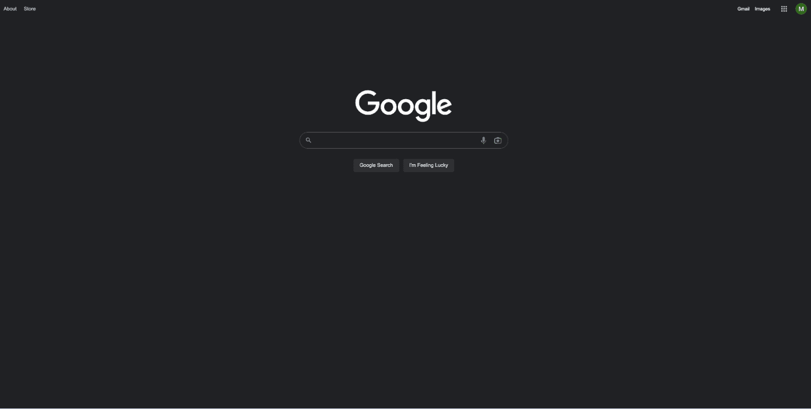

Googlebot indexes sites to provide up-to-date Google results

尽管从技术上讲，谷歌机器人有两个版本——桌面版和智能手机版——但大多数专家认为谷歌机器人是一个单一的爬虫。

这是因为两者都遵循写在每个站点的 **robots.txt** 中的相同的唯一产品令牌(称为用户代理令牌)。Googlebot 用户代理简单来说就是“ **Googlebot**

Googlebot 开始工作，通常每隔几秒就会访问你的网站(除非你已经在你网站的 **robots.txt** 中屏蔽了它)。扫描页面的备份保存在一个名为[谷歌缓存](https://kinsta.com/blog/google-cache/)的统一数据库中。这使你能够查看旧版本的网站。

此外，[谷歌搜索控制台](https://kinsta.com/blog/google-search-console/)也是另一个工具，网站管理员使用它来了解谷歌机器人如何抓取他们的网站，并优化他们的搜索页面。

| **用户代理** | 谷歌机器人 |
| **完整用户代理字符串** | Mozilla/5.0(兼容；Google bot/2.1；+http://www . Google . com/bot . html) |

### 2.Bingbot

Bingbot 是微软在 2010 年创建的，用于扫描和索引 URL，以确保 Bing 为该平台的用户提供相关的最新搜索引擎结果。

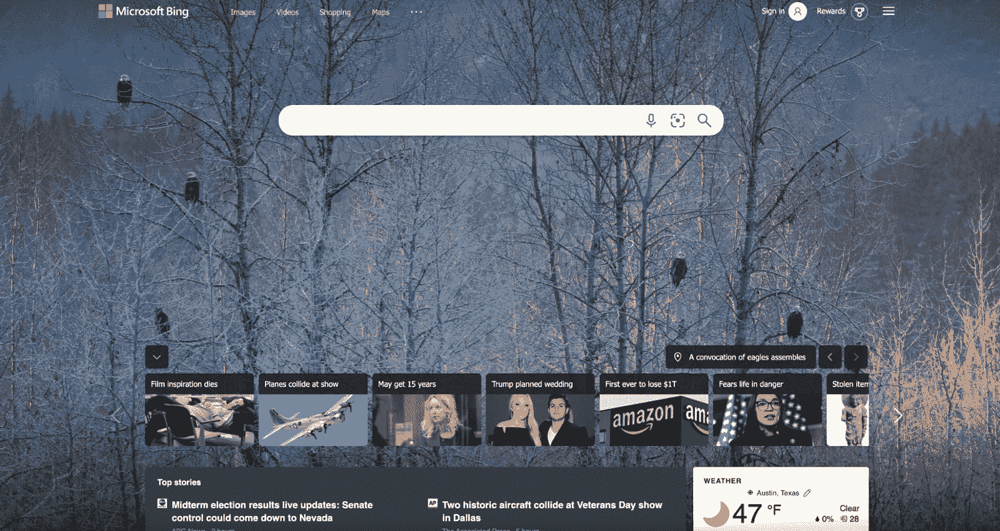

Bingbot provides Bing with relevant search engine results

与 Googlebot 非常相似，开发人员或营销人员可以在他们网站上的 robots.txt 中定义他们是否批准或拒绝代理标识符" **bingbot** "扫描他们的网站。

此外，他们有能力区分移动优先索引爬虫和桌面爬虫，因为 Bingbot 最近转向了一种新的代理类型[。这和](https://www.searchenginejournal.com/new-bingbot-user-agent/448023/#close) [Bing 网站管理员工具](https://kinsta.com/blog/bing-webmaster-tools/)一起，为网站管理员提供了更大的灵活性来展示他们的网站是如何在搜索结果中被发现和展示的。

| **用户代理** | Bingbot |
| **完整用户代理字符串** | Mozilla/5.0(兼容；bing bot/2.0；+http://www . bing . com/bing bot . htm) |

### 3.杨得宝

Yandex Bot 是一个专门针对俄罗斯搜索引擎 Yandex 的爬虫。这是俄罗斯最大、最受欢迎的搜索引擎之一。

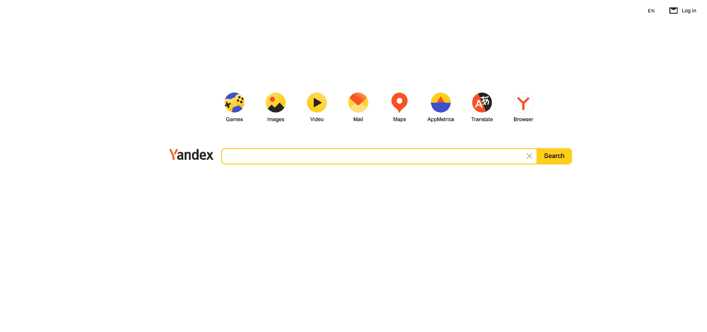

Yandex Bot indexes the Russian search engine, Yandex

网站管理员可以通过他们的 **robots.txt** 文件让 Yandex Bot 访问他们的网站页面。

此外，他们还可以添加一个 **Yandex。Metrica** 标记特定页面，在 Yandex 网站管理员中重新索引页面或发布 IndexNow 协议，这是一个独特的报告，指出新的、修改的或停用的页面。

| **用户代理** | YandexBot |
| **完整用户代理字符串** | Mozilla/5.0(兼容；YandexBot/3.0；+http://yandex.com/bots) |

### 4.苹果机器人

苹果委托**苹果机器人**抓取和索引网页，以获得苹果的 Siri 和 Spotlight 建议。

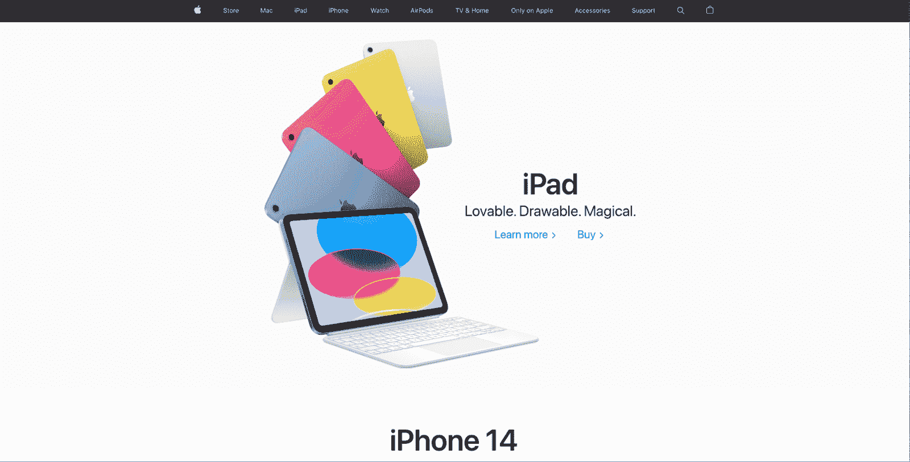

Apple Bot is the web crawler for Apple’s Siri and Spotlight

Apple Bot 在决定提升 Siri 和 Spotlight 建议中的哪些内容时会考虑多个因素。这些因素包括用户参与度、搜索词的相关性、链接的数量/质量、基于位置的信号，甚至是[网页设计](https://kinsta.com/blog/web-design-principles/)。

| **用户代理** | Applebot |
| **完整用户代理字符串** | Mozilla/5.0(设备；OS _ Version)apple WebKit/WebKit _ Version(KHTML，像壁虎)
Version/Safari _ Version Safari/WebKit _ Version(Applebot/Applebot _ Version) |

### 5.鸭子提供

DuckDuckBot 是 [DuckDuckGo](https://kinsta.com/blog/duckduckgo-privacy/) 的网络爬虫，它提供了“在你的网络浏览器上无缝的隐私保护”

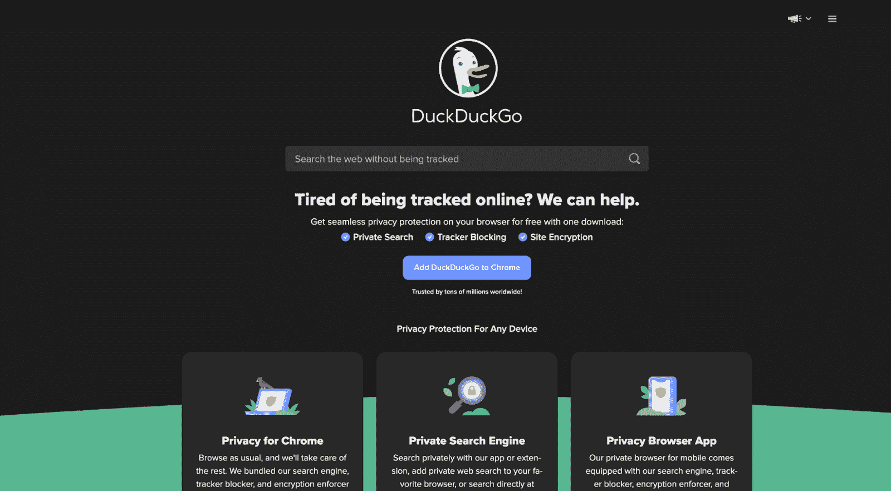

DuckDuck Bot crawls for the privacy-focused site

网站管理员可以使用 DuckDuckBot API 来查看 **DuckDuck Bot** 是否已经抓取了他们的站点。当它爬行时，它用最近的 [IP 地址](https://kinsta.com/tools/what-is-my-ip/)和用户代理更新 DuckDuckBot API 数据库。

这有助于网站管理员识别任何试图与 DuckDuck Bot 关联的冒名顶替者或恶意 Bot。

| **用户代理** | 鸭子机器人 |
| **完整用户代理字符串** | duck duck bot/1.0；(+http://duck duck go . com/duck duck bot . html) |

### 6.百度蜘蛛

百度是领先的中文搜索引擎，而百度蜘蛛是该网站的唯一爬虫。

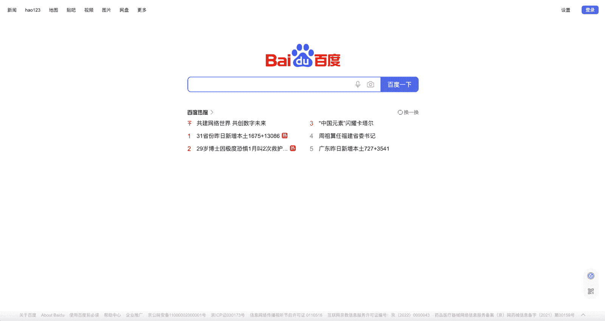

Baidu Spider is the crawler for Baidu, a Chinese search engine

谷歌在中国被禁止，所以如果你想进入中国市场，让百度蜘蛛抓取你的网站是很重要的。

为了识别爬你网站的百度蜘蛛，寻找以下用户代理: **baiduspider、** **baiduspider-image** 、 **baiduspider-video** 等等。

如果你不在中国做生意，屏蔽 robots.txt 脚本中的百度蜘蛛可能是有意义的。这将防止百度蜘蛛抓取你的网站，从而消除你的页面出现在百度搜索引擎结果页面(SERPs)上的任何机会。

| **用户代理** | 百度地 |
| **完整用户代理字符串** | Mozilla/5.0(兼容；baiduspider/2.0；+http://www . Baidu . com/search/spider . html) |

### 7.搜狗蜘蛛

搜狗是一个中文搜索引擎，据报道，它是第一个拥有 100 亿中文页面索引的搜索引擎。

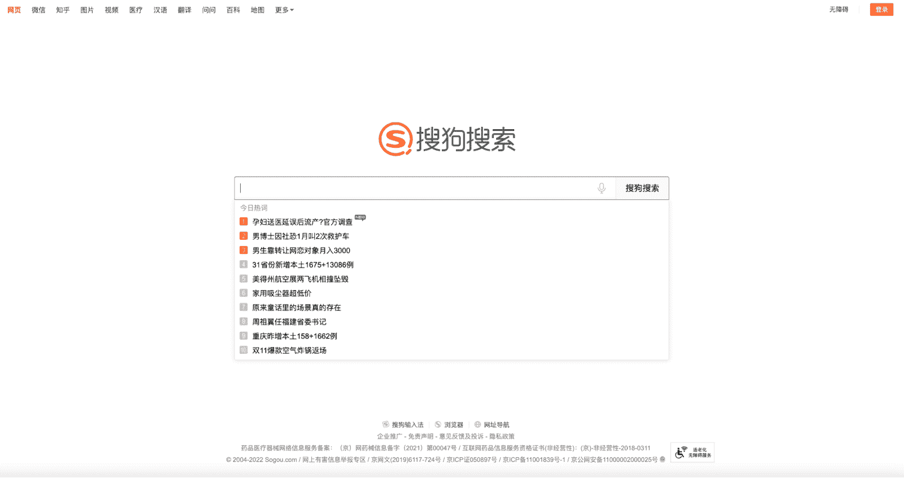

The Sogou Spider is a crawler for Sogou

如果你在中国市场做生意，这是你需要知道的另一个流行的搜索引擎爬虫。搜狗蜘蛛按照机器人的排除文本和抓取延迟参数。

## 注册订阅时事通讯

### 想知道我们是怎么让流量增长超过 1000%的吗？

加入 20，000 多名获得我们每周时事通讯和内部消息的人的行列吧！

[Subscribe Now](#newsletter)

与百度蜘蛛一样，如果你不想在中国市场做生意，你应该禁用这个蜘蛛，以防止缓慢的网站加载时间。

| **用户代理** | 搜狗 Pic Spider/3.0(http://www.sogou.com/docs/help/webmasters.htm#07)
搜狗头蜘蛛/3.0(http://www.sogou.com/docs/help/webmasters.htm#07)
搜狗 web Spider/4.0(+http://www . Sogou . com/docs/help/webmasters . htm # 07)
搜狗猎户座蜘蛛/3.0(http://www.sogou.com/docs/help/webmasters.htm#07)
搜狗-Test-Spider/4.0(兼容；MSIE 5.5Windows 98) |

### 8.脸书外部打击

脸书外部攻击，也被称为脸书爬虫，抓取在[脸书](https://kinsta.com/blog/facebook-statistics/)上共享的应用程序或网站的 HTML。

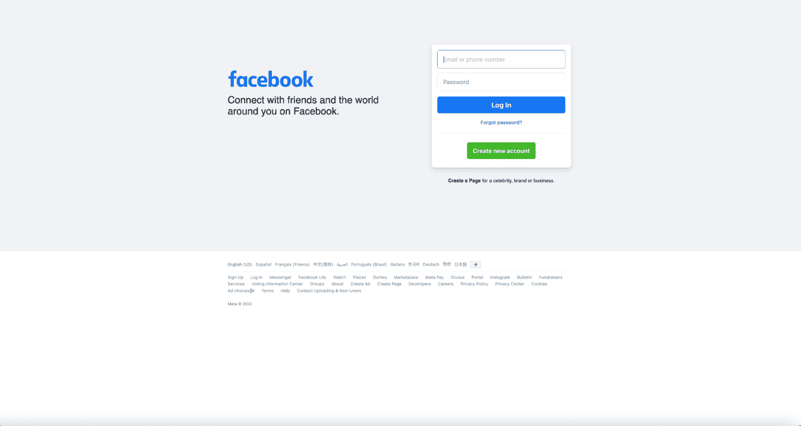

Facebook External Hit indexes sites for link sharing

这使得社交平台能够生成发布在平台上的每个链接的可共享预览。标题、描述和缩略图的出现得益于爬虫。

如果几秒钟内没有执行爬网，脸书将不会在共享前生成的自定义片段中显示内容。

| **用户代理** | facebot
facebookexternalhit/1.0(+http://www . Facebook . com/external hit _ ua text . PHP)
facebookexternalhit/1.1(+http://www . Facebook . com/external hit _ ua text . PHP) |

### 9.exabot 公司

Exalead 是一家软件公司，成立于 2000 年，总部位于法国巴黎。该公司为消费者和企业客户提供搜索平台。

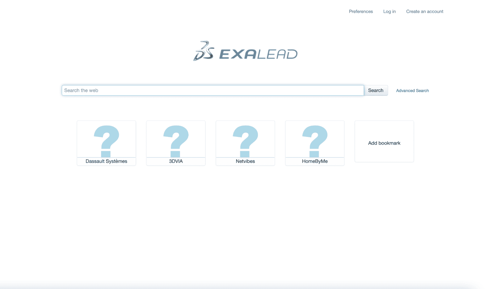

Exabot is the crawler for Exalead, a search platform company

Exabot 是基于 CloudView 产品的核心搜索引擎的爬虫。

像大多数搜索引擎一样，Exalead 在排名时会考虑反向链接和网页内容。Exabot 是 Exalead 的机器人的用户代理。机器人创建了一个“主索引”,将搜索引擎用户看到的结果进行汇总。

| **用户代理** | Mozilla/5.0(兼容；konqueror/3.5；Linux) KHTML/3.5.5(像壁虎一样)(exa bot-Thumbnails)
Mozilla/5.0(兼容；exa bot/3.0；+http://www . exa bot . com/go/robot) |

### 10.Swiftbot

Swiftype 是为您的网站定制的搜索引擎。它结合了“最好的搜索技术、算法、内容摄取框架、客户端和[分析工具](https://kinsta.com/blog/matomo-vs-google-analytics/)”

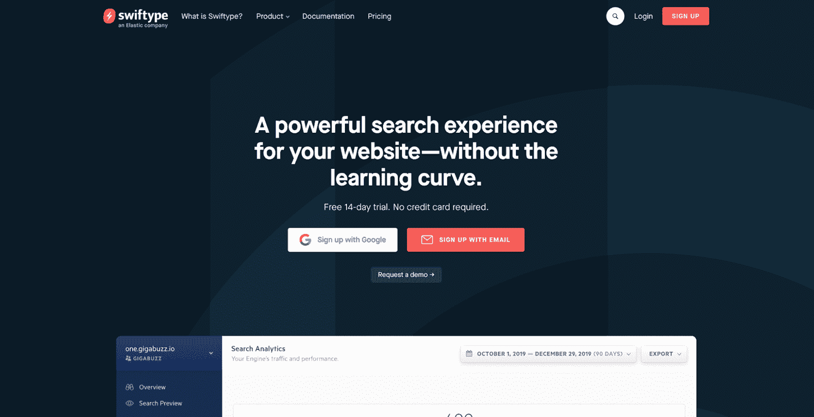

Swiftype is a software that can power your site’s search

如果您有一个包含许多页面的复杂网站，Swiftype 提供了一个有用的界面来为您对所有页面进行编目和索引。

**Swiftbot** 是 Swiftype 的网络爬虫。然而，与其他机器人不同，Swiftbot 只抓取客户请求的网站。

| **用户代理** | Swiftbot |
| **完整用户代理字符串** | Mozilla/5.0(兼容；swift bot/1.0；UID/54 E1 C2 EBD 3 b 687 d3c 8000018；+http://swift type . com/swift bot) |

### 11.Slurp Bot 公司

Slurp Bot 是雅虎搜索机器人，为雅虎抓取和索引页面。

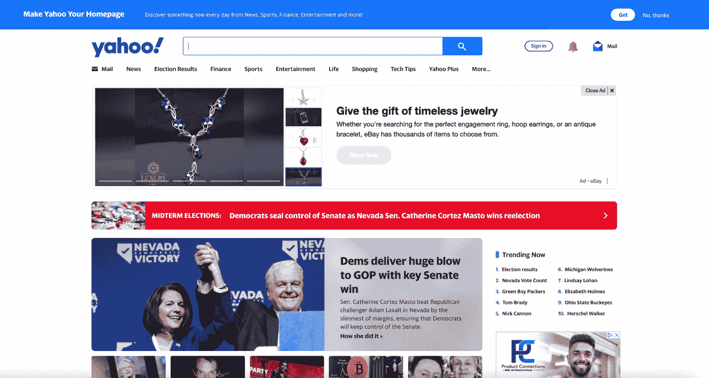

Slurp Bot powers Yahoo’s search engine results

这种抓取对于 Yahoo.com 和它的合作伙伴网站，包括雅虎新闻、雅虎财经和雅虎体育来说都是必不可少的。没有它，相关的网站列表就不会出现。

索引内容有助于为用户提供更加个性化的 web 体验和更相关的结果。

| **用户代理** | 大声地吃 |
| **完整用户代理字符串** | Mozilla/5.0(兼容；雅虎！啧啧有声；http://help.yahoo.com/help/us/ysearch/slurp) |

## SEO 专业人士需要知道的 8 个商业爬虫

现在你的爬虫列表中有 11 个最受欢迎的机器人，让我们看看一些常见的商业爬虫和专业人士使用的搜索引擎优化工具。

Struggling with downtime and WordPress problems? Kinsta is the hosting solution designed to save you time! [Check out our features](https://kinsta.com/features/) ### 1.Ahrefs 机器人

Ahrefs Bot 是一个网络爬虫，它编译和索引流行的 SEO 软件 Ahrefs 提供的 12 万亿链接数据库。

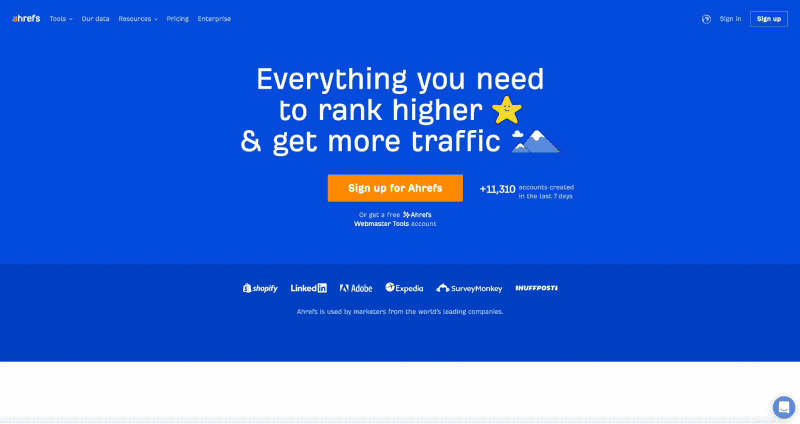

Ahrefs Bot indexes sites for the SEO platform, Ahrefs

Ahrefs 机器人每天访问 60 亿个网站，被认为是仅次于 Googlebot 的“第二活跃爬虫”。

就像其他机器人一样，Ahrefs 机器人遵循 **robots.txt** 函数，以及允许/禁止每个站点代码中的规则。

### 2.塞姆拉什机器人

Semrush Bot 使领先的 SEO 软件 Semrush 能够收集和索引网站数据，供其平台上的客户使用。

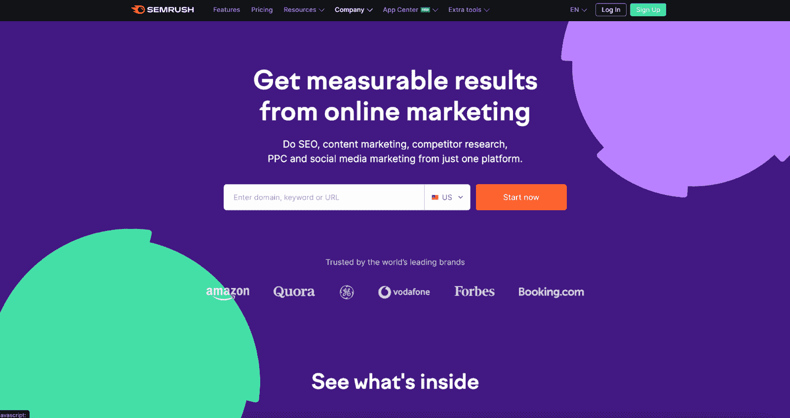

Semrush Bot is the crawler Semrush uses to index sites

这些数据用于 Semrush 的公共反向链接搜索引擎、网站审计工具、反向链接审计工具、链接构建工具和写作助手。

它通过编译网页 URL 列表、访问它们并保存某些超链接以供将来访问来爬取您的站点。

### 3.Moz 的竞选爬虫 Rogerbot

Rogerbot 是领先的 SEO 网站 Moz 的爬虫。该爬虫专门为 Moz Pro 活动站点审计收集内容。

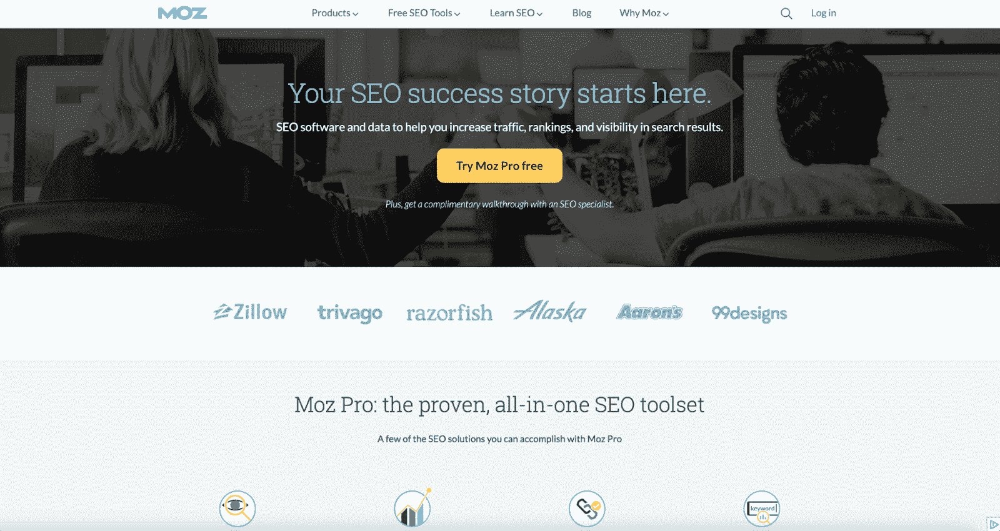

Moz, a popular SEO software, deploys Rogerbot as its crawler

Rogerbot 遵循 **robots.txt** 文件中规定的所有规则，因此您可以决定是否要阻止/允许 **Rogerbot** 扫描您的网站。

由于 Rogerbot 的多方面方法，网站管理员将无法搜索静态 IP 地址来查看 Roger bot 爬取了哪些页面。

### 4.尖叫的青蛙

尖叫的青蛙是一个爬虫，SEO 专业人士用它来审核他们自己的网站，并找出将影响他们搜索引擎排名的改进领域。

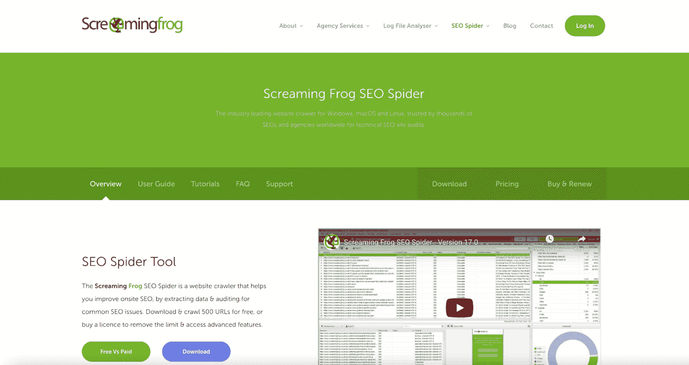

Screaming Frog is a crawler that helps improve SEO

一旦开始抓取，你就可以查看实时数据并识别[断开的链接](https://kinsta.com/blog/broken-links/)或需要改进的页面标题、元数据、机器人、重复内容等等。

为了配置爬网参数，您必须购买尖叫青蛙许可证。

### 5.Lumar(原为深度爬网)

Lumar 是一个“维护站点技术健康的集中指挥中心”有了这个平台，你可以开始抓取你的网站，帮助你规划你的[网站架构](https://kinsta.com/blog/web-design-best-practices/)。

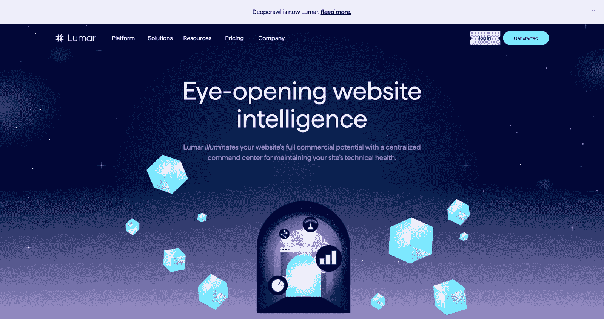

Deep Crawl has rebranded as Lumar, a site intelligence crawler

Lumar 自诩为“市场上最快的网站爬虫”,并声称它每秒可以抓取高达 450 个网址。

### 6.宏伟的

Majestic 主要关注跟踪和识别 URL 上的反向链接。

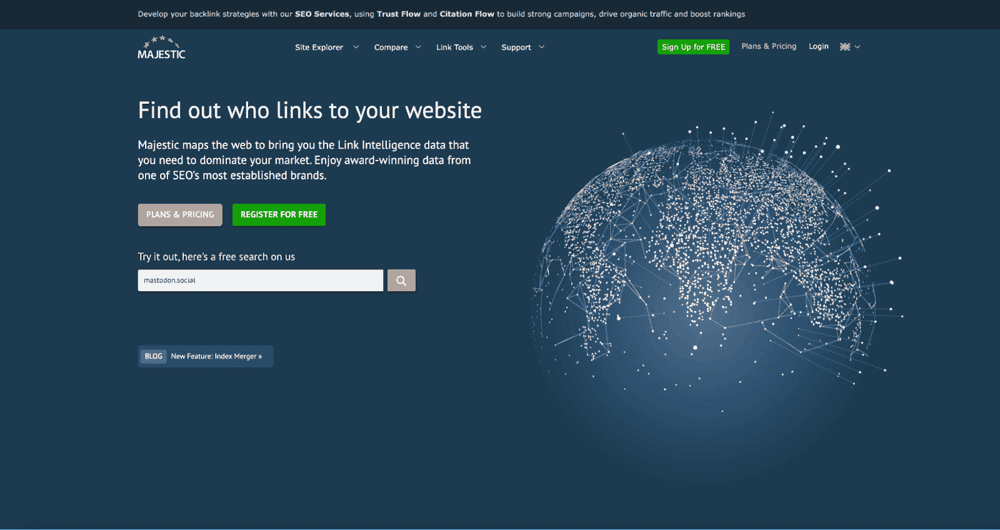

The Majestic Crawler enables SEOs to review backlink data

该公司以拥有“互联网上最全面的反向链接数据源之一”而自豪，强调了其历史索引，该索引在 2021 年从 5 年增加到 15 年。

该网站的爬虫将所有这些数据提供给公司的客户。

### 7.认知搜索引擎优化

cognitiveSEO 是许多专业人士使用的另一个重要的 SEO 软件。

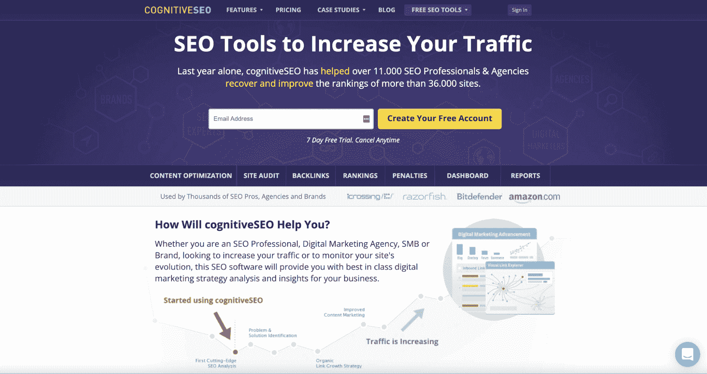

congnitiveSEO offers a powerful site audit tool

**cognitiveSEO 爬虫**使用户能够执行全面的网站审计，这将告知他们的网站架构和总体 [SEO 策略](https://kinsta.com/topic/seo-strategy/)。

该机器人将抓取所有页面，并为最终用户提供“完全定制的数据集”。这个数据集还将为用户提供建议，告诉他们如何为其他爬虫改进自己的网站——既影响排名，又阻止不必要的爬虫。

### 8.在线抓取

**Oncrawl** 是一款面向企业级客户的“行业领先的 SEO 爬虫和[日志分析器](https://kinsta.com/blog/analyzing-log-entries/)”。

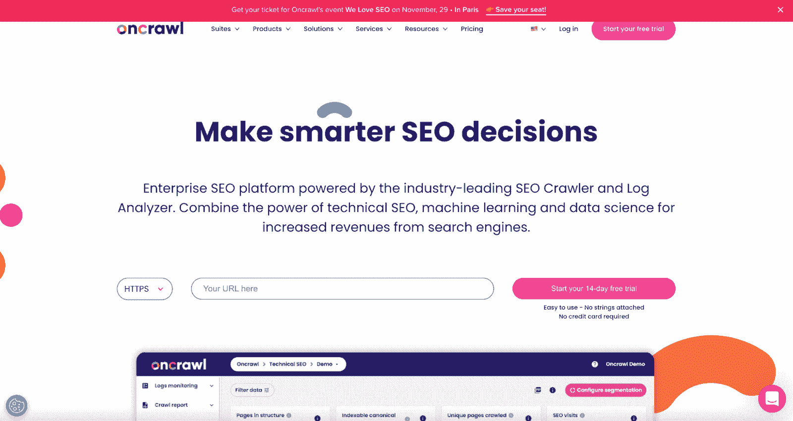

Oncrawl is another SEO crawler that provides unique data

用户可以设置“爬网配置文件”来创建爬网的特定参数。您可以保存这些设置(包括起始 URL、爬网限制、最大爬网速度等)，以便在相同的已建立参数下轻松地再次运行爬网。

## 我需要保护我的网站免受恶意网络爬虫的攻击吗？

不是所有的爬虫都是好的。一些可能会对你的页面速度产生负面影响，而另一些可能会试图入侵你的网站或怀有恶意。

这就是为什么理解如何阻止爬虫进入你的站点是很重要的。

通过建立一个爬虫列表，你将知道哪些爬虫是值得注意的。然后，你可以剔除可疑的邮件，并将其添加到你的黑名单中。

### 如何阻止恶意网络爬虫

有了你的爬虫列表，你就能确定你想要批准哪些僵尸程序，需要阻止哪些。

第一步是浏览您的 crawler 列表，并定义与每个 crawler 相关联的用户代理和完整代理字符串以及它的特定 IP 地址。这些是与每个机器人相关联的关键识别因素。

使用用户代理和 IP 地址，您可以通过 [DNS 查找](https://kinsta.com/blog/reduce-dns-lookups/)或 IP 匹配在您的站点记录中匹配它们。如果它们不完全匹配，可能会有一个恶意的机器人试图冒充真实的机器人。

然后，您可以通过使用您的 **robots.txt** 站点标签调整权限来阻止冒名顶替者。

[Don't have a crawler list yet??? 🫣 Learn why it's important to keep one and what's in it for your business ⬇️Click to Tweet](https://twitter.com/intent/tweet?url=https%3A%2F%2Fkinsta.com%2Fblog%2Fcrawler-list%2F&via=kinsta&text=Don%27t+have+a+crawler+list+yet%3F%3F%3F+%F0%9F%AB%A3+Learn+why+it%27s+important+to+keep+one+and+what%27s+in+it+for+your+business+%E2%AC%87%EF%B8%8F&hashtags=SEO%2CWebCrawler) ## 摘要

网络爬虫对搜索引擎很有用，对营销人员理解也很重要。

确保你的网站被正确的爬虫抓取对你的生意的成功是重要的。通过保持一个爬虫列表，你可以知道当它们出现在你的站点日志中时，哪些应该被注意。

当你遵循商业爬虫的建议并[改进你网站的内容和速度](https://kinsta.com/blog/wordpress-cdn/)时，你将使爬虫更容易访问你的网站，并为搜索引擎和寻找它的消费者索引正确的信息。

* * *

让你所有的[应用程序](https://kinsta.com/application-hosting/)、[数据库](https://kinsta.com/database-hosting/)和 [WordPress 网站](https://kinsta.com/wordpress-hosting/)在线并在一个屋檐下。我们功能丰富的高性能云平台包括:

*   在 MyKinsta 仪表盘中轻松设置和管理
*   24/7 专家支持
*   最好的谷歌云平台硬件和网络，由 Kubernetes 提供最大的可扩展性
*   面向速度和安全性的企业级 Cloudflare 集成
*   全球受众覆盖全球多达 35 个数据中心和 275 多个 pop

在第一个月使用托管的[应用程序或托管](https://kinsta.com/application-hosting/)的[数据库，您可以享受 20 美元的优惠，亲自测试一下。探索我们的](https://kinsta.com/database-hosting/)[计划](https://kinsta.com/plans/)或[与销售人员交谈](https://kinsta.com/contact-us/)以找到最适合您的方式。