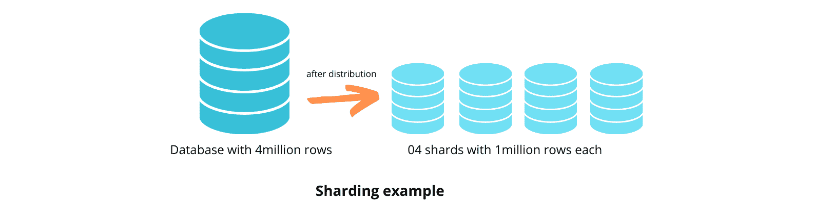

# 理解数据库分片的初级读本

> 原文：<https://kinsta.com/blog/database-sharding/>

创建网站是在互联网上展示自己的第一步。为了长期发展，你还必须确保你的网站能够适应增长。第一步是实现一个可随您扩展的数据库。否则，您将面临查询性能降低和数据库中断的风险。

这篇文章将讨论如何使用数据库分片来实现数据的高可伸缩性和可用性。我们还将谈到分片的缺点以及您可以使用的不同分片架构。

## 什么是数据库分片？

分片是一种跨其他数据库服务器分发表的优化技术。这就像分区一样，两者都涉及到将数据分解成更小的子集。区别在于分片将这些子集分布到不同的服务器，而分区将它们存储在一个数据库中。这些服务器使用相同的数据库引擎和硬件类型来为所有碎片实现相似的性能水平。

分片旨在实现无共享架构，消除处理瓶颈和单点故障。

An example of sharding. (Image Source: [Analytics Vidhya](https://www.analyticsvidhya.com/blog/2022/04/a-comprehensive-guide-to-sharding-in-data-engineering-for-beginners/))

你可以用两种方式实现分片——水平[和垂直](https://kinsta.com/blog/mongodb-vs-mysql/)。水平分片根据行划分表格，而垂直分片根据列划分表格。

在这方面，分片就像分区一样，将大表分成更小的表。

水平分片对于大多数查询返回行的子集的数据库是有效的，例如一个客户数据库一次返回数据(如姓名、地址、电子邮件等)。

垂直分片对于查询返回单个列的数据库是有效的。例如，如果客户数据库分别返回客户的姓名或电子邮件，您可以将姓名和电子邮件分成不同的集群。

## 数据库分片的好处

下面是数据库分片的一些优点。

### 改进的水平缩放

您可以垂直或水平缩放数据库。垂直扩展是指向服务器添加更多的中央处理器(CPU)和随机存取存储器(RAM)来提高性能。垂直伸缩对于中小型数据库是一个有用的解决方案。然而，随着数据的增长，垂直扩展变得不可行。一台服务器只能增加这么多功能。

水平缩放更加灵活。它使您能够通过向系统添加更多服务器来按需扩展数据库。这些服务器中的每一个都为不同的数据库碎片提供资源。这分散了工作负载，提高了系统处理更多请求的能力。

### 更快的查询响应时间

碎片只有几行和几列。因此，处理[数据库查询](https://kinsta.com/blog/query-monitor/)花费的时间更少。相比之下，对非分片数据库的查询可能需要搜索数百甚至数千行。

### 断电情况下增加的可靠性

数据库中断有各种原因，包括意外数据删除、连接错误和网络安全攻击。分片最大限度地减少了停机的影响。由于每个碎片都是自治的，只有受影响的碎片面临停机。例如，如果您有四个碎片，并且其中一个经历了中断，那么只有 25%的操作会受到影响。

## 分片的缺点

虽然分片提高了数据库的可靠性和可用性，但是实现它是复杂的。使用错误的分片架构会降低性能并导致数据丢失。

请确保选择一种允许在所有分片之间平衡数据分布的分片技术。如果没有这种平衡，就会有创建数据库热点的风险，当一个碎片存储了大部分数据，而其他碎片实际上是空的时，就会出现这种情况。这降低了对单个碎片的写吞吐量。

为了解决这个问题，您可以进一步划分不平衡的碎片，但是这个过程很有挑战性，并且在您迁移数据时可能会关闭您的数据库。

## 注册订阅时事通讯

### 想知道我们是怎么让流量增长超过 1000%的吗？

加入 20，000 多名获得我们每周时事通讯和内部消息的人的行列吧！

[Subscribe Now](#newsletter)

分片的另一个缺点是，涉及不同分片中多个表的 SQL 连接会变得太慢，降低性能。然而，使用正确的架构，您可以避免这个问题。

## 分片架构

您可以使用三种架构实现分片:

*   基于密钥的分片
*   基于范围的分片
*   基于目录的分片

您选择的架构取决于您的用例。

### 基于密钥的分片

在基于键或[散列](https://www.mongodb.com/docs/manual/core/hashed-sharding/)的分片架构中，数据库应用程序使用分片键来定位分片。散列函数散列分片键值，输出将数据映射到特定的分片。一个简单的散列函数可以是密钥的模数和碎片的数量。

哈希函数可以接受多个分片密钥。因此，基于键的分片适用于可能有共享键的数据记录。通过算法分发数据可以最大限度地减少创建数据库热点的可能性，在这些热点中，一个碎片包含的数据比另一个碎片多。

然而，由于分布只依赖于散列函数，所以不可能在逻辑上将数据分组在一起。因此，需要来自多个碎片的数据的数据库操作可能是低效的，因为它们需要从每个碎片读取数据。

### 基于范围的分片

[基于范围的分片](https://www.mongodb.com/docs/manual/core/ranged-sharding/)涉及根据指定范围的值对数据库进行分片。

它使用一个分片键来决定给哪个分片赋值。数据库应用在查找表中检查对应于分片键的分片，并存储数据。因此，基于范围的分片易于设计和实现。

例如，您可以使用用户数据库中的用户 ID 值作为分片键。您可以在一个分片上存储 id 从 0 到 2，000 的用户，在另一个分片上存储 id 从 2，000 到 4，000 的用户，以此类推。

基于范围的分片会导致数据库热点。考虑一个用户数据库，其中大部分用户 id 介于 2，001 和 4，000 之间。这一过程将它们分配到一个单独的碎片中，随着时间的推移造成了不平衡。因此，基于范围的分片最适合均匀分布的数据。

### 基于目录的分片

[基于目录的分片](https://www.linode.com/docs/guides/sharded-database/#directory-based-sharding)将逻辑上相关的数据分组到同一个分片中。它使用包含数据库中每个实体的映射列表的查找表。每个映射对应一个数据库碎片。

基于目录的分片比基于范围或基于键的分片更灵活，因为您可以动态地向分片添加数据。没有需要遵循的分片函数或范围值。这种灵活性提高了数据库的效率:您可以将相关数据存储在一个碎片中，这意味着执行常见的查询需要更少的时间。

例如，如果您使用基于目录的分片并根据位置对用户进行分组，从特定位置检索用户，那么您只需查询一个分片。

## 用 Kinsta 实现数据库分片

大多数现代数据库引擎都提供数据库分片支持。其中一个数据库引擎是 MariaDB，它是 MySQL 的一个商业支持分支。这是一个高性能的开源数据库系统，被 IBM、GitHub 和 Wikimedia 等公司采用。它也是 Kinsta 高性能服务器堆栈的一部分。

MariaDB 通过[蜘蛛存储引擎](https://mariadb.com/kb/en/spider-storage-engine-overview)提供内置的分片特性。蜘蛛存储引擎是支持分区和扩展架构(XA)事务的集群形成引擎。它允许您将来自不同实例的远程表视为在同一个实例中。一旦在 spider 存储引擎中创建了一个表，该表就会链接到远程 MariaDB 服务器中的另一个表。建立连接后，存储引擎将与属于同一事务的所有表共享该链接。

## 摘要

数据库分片是一种扩展技术，它将表划分成更小的子集，并将它们分布到不同的服务器上，这些服务器称为分片。您可以通过各种方式实现分片，如基于键的分片、基于范围的分片和基于目录的分片。

虽然分片提高了数据库的可伸缩性、可靠性和可用性，但实现起来非常复杂。此外，一旦创建了碎片，就不容易将数据库恢复到非共享状态。因此，只有在确定其他可伸缩性选项不起作用时，才使用分片进行优化。

*无论您的企业是[非营利](https://kinsta.com/web-hosting-for-nonprofits/)还是[企业级](https://kinsta.com/enterprise-wordpress-hosting/)企业，Kinsta 的专家解决方案都可以消除您对网站托管的担忧，使您能够专注于最重要的事情。*

* * *

让你所有的[应用程序](https://kinsta.com/application-hosting/)、[数据库](https://kinsta.com/database-hosting/)和 [WordPress 网站](https://kinsta.com/wordpress-hosting/)在线并在一个屋檐下。我们功能丰富的高性能云平台包括:

*   在 MyKinsta 仪表盘中轻松设置和管理
*   24/7 专家支持
*   最好的谷歌云平台硬件和网络，由 Kubernetes 提供最大的可扩展性
*   面向速度和安全性的企业级 Cloudflare 集成
*   全球受众覆盖全球多达 35 个数据中心和 275 多个 pop

在第一个月使用托管的[应用程序或托管](https://kinsta.com/application-hosting/)的[数据库，您可以享受 20 美元的优惠，亲自测试一下。探索我们的](https://kinsta.com/database-hosting/)[计划](https://kinsta.com/plans/)或[与销售人员交谈](https://kinsta.com/contact-us/)以找到最适合您的方式。