# React UI 组件库:我们 2022 年的首选

> 原文：<https://kinsta.com/blog/react-components-library/>

React UI 组件库是帮助您为基于 React 的软件应用程序和网站创建令人惊叹的界面的有用工具。

虽然您可以为设计中要包含的每个特性或功能编写自己的代码，但使用 UI 组件库会使整个任务更容易、更快。

它允许您在设计中使用您想要的确切部分，如按钮，而不必从头开始编写代码。

这不仅节省了你大量的时间和精力，也给了你思考解决更大问题和努力创新的机会。
[使用这 21 个有用的 React UI 组件库节省时间和精力🚀 点击发送推文](https://twitter.com/intent/tweet?url=https%3A%2F%2Fkinsta.com%2Fblog%2Freact-components-library%2F&via=kinsta&text=Save+time+and+effort+with+these+21+helpful+React+UI+component+libraries+%F0%9F%9A%80&hashtags=UI%2CReact)
因此，每当您想要添加表格或地图等常见功能，甚至是主题等高级选项时，您只需从可用选项中进行选择，并直接在您的设计中使用它们。

结果，您的整个软件开发过程变得更快，您将能够在更短的时间内生成更多高质量的应用程序。

因此，如果您正在开发基于 React 的软件，使用 React UI 组件库将对您非常有益。这篇文章将涵盖 21 个最好的 React UI 组件库，你可以在你的下一个项目中使用它们。在我们深入研究之前，让我们回顾一些基本概念，以便您对 React UI 组件库有更好的理解。

## 什么是 React UI 组件库？

React UI 组件库是一个工具或[软件系统](https://kinsta.com/blog/cms-software/),它带有可在基于 React 的应用程序和站点中使用的现成组件。这些组件库有助于加快软件开发速度，同时为开发人员和企业提供大量好处。

组件库中的组件可以是表格、图表、按钮、地图、颜色等等。此外，许多工具允许您定制它们，并根据它们的设计或风格在应用程序中使用它们。

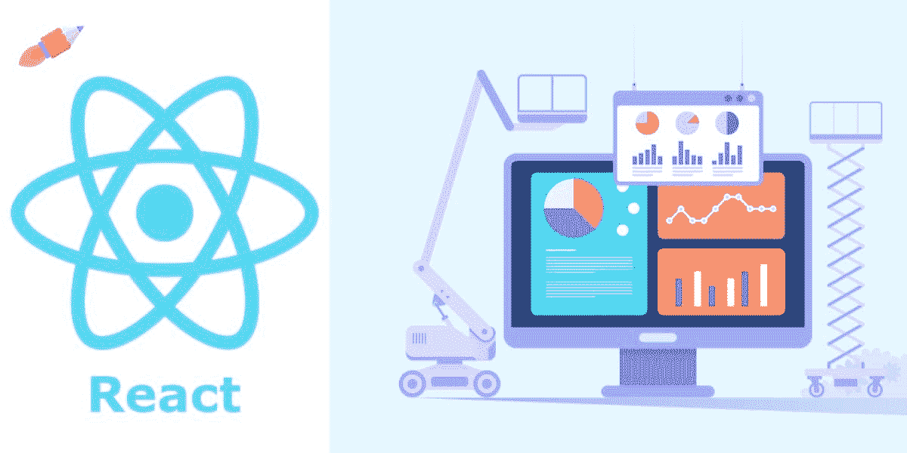

React UI component library. (Image source: [ArrowHiTech](https://www.arrowhitech.com/react-ui-component-top-best-libraries-and-framework-you-should-know/))

由于网上基于 React 的软件系统越来越多，这些 React UI 组件库的使用也越来越多。 [React](https://reactjs.org/) 是一个 [JavaScript 库](https://kinsta.com/blog/javascript-libraries/)，可以帮助你轻松开发移动和网络应用的用户界面。

据 Statista 称，截至 2022 年， [React 是世界上第二大使用的 web 框架](https://www.statista.com/statistics/1124699/worldwide-developer-survey-most-used-frameworks-web/)。这个[前端 JS 框架](https://kinsta.com/blog/vue-js/)允许更快更容易地创建应用程序。您可以使用它来构建动态 web 应用程序，因为其用户界面上的数据会不断更新。

鉴于它的好处和特性， [React](https://kinsta.com/knowledgebase/what-is-react-js/) 被世界各地的公司和开发者所使用。为了使应用程序开发更简单，创建了 UI 组件库。所以，如果你想添加一个组件，比如一个网格，你不必为它写代码。相反，您可以使用一个组件库，找到您想要的网格，根据您的需要定制它，并直接添加它。

你完了！

接下来，让我们看看使用 React UI 组件库的一些主要好处。

## 使用 React UI 组件库的优势

使用 React UI 组件库的优点是:

*   **Faster development:** Instead of creating the code for every component, you can use a React UI component library such as MUI, Chakra UI, React Bootstrap, etc. They will expose you to multiple, ready to use components suitable for your design. This way, you can save time and develop software faster.

    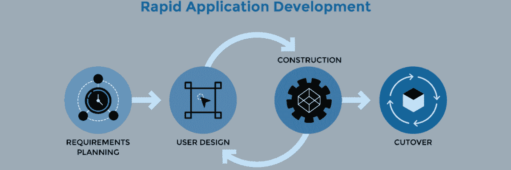

    飞速发展的过程。(图片来源:[普鲁托拉](https://www.plutora.com/blog/rapid-application-development-what-it-is-and-whats-next) )

    

*   漂亮的用户界面:构建速度更快并不意味着你必须在网站或应用程序的外观上做出妥协。漂亮而有目的的[设计](https://kinsta.com/blog/figma-vs-sketch/)吸引客户，因此，你可以在你的设计中使用你选择的美观的 UI 组件，并定制它们以适应你的应用的外观和感觉。
*   **Less Coding, more time developing:** Using pre-built components, you can code faster. Instead of spending time on coding for common elements, you can focus on the more important task – to make the application functional. The more time spent in development will produce the better app.Development involves thinking about your website’s problem or logic, actual development, [debugging](https://kinsta.com/knowledgebase/devkinsta/logging/), and creating new features repeatedly. Using libraries can simplify your complete design process and provide you with more relief.Also, if you are looking for a reliable, high-performing, and always available hosting platform, Kinsta’s [Managed WordPress hosting](https://kinsta.com/wordpress-hosting/) is a great option. It provides faster servers, top class hardware, [global CDNs](https://kinsta.com/help/kinsta-cdn/), and expert support.

    

    花更多的时间在发展上。(图片来源:[科技疗法](https://technologytherapy.com/5-minutes-5-hourswhy-development-time-vary-much/) )

    

*   **Easy to use:** If you are a beginner or don’t have a great command of the language, using [CSS](https://kinsta.com/blog/css-best-practices/) can sometimes be difficult and boring, especially if you are building complex designs and layouts.But if you use a [component library](https://kinsta.com/blog/web-components/), it becomes easier to create beautiful and complex layouts and designs even for beginners. However, you still need basic knowledge of CSS. This also eliminates CSS maintenance, which is a tough task. Hence, developers will get a huge relief.If you are struggling with a slower site, you can use the [Kinsta APM tool](https://kinsta.com/apm-tool/). It provides performance monitoring for WordPress websites hosted on Kinsta, allowing you to spot performance issues and fix them faster.

    

    没有 CSS 维护。(图片来源: [SmartBear](https://smartbear.com/blog/manual-cross-browser-testing-for-beginners-part-1/) )

    

*   跨浏览器兼容:开发能与所有[浏览器兼容的 CSS](https://kinsta.com/browsers/)可能有些棘手。如果做得不好，会影响用户体验。对此，UI 组件库可以是一个有效的解决方案。大多数 UI 库都是跨浏览器兼容的，因此您的应用程序可以在所有浏览器上运行。这增强了用户体验，因为他们可以使用[他们选择的任何浏览器](https://kinsta.com/browser-market-share/)。

现在，让我们来看看文章的重点。

## 2022 年前 23 名 React UI 组件库

这里有 23 个最好的 React UI 组件库，所以你可以为你的项目选择一个最合适的。

### 1.材料-用户界面

[Material-UI (MUI)](https://mui.com/) 是一个完全加载的 UI 组件库，它提供了一套全面的 UI 工具来快速创建和部署新功能。它是最强大和最受欢迎的 UI 组件库之一，在 npm 上每周有超过 320 万次下载，在 [GitHub](https://kinsta.com/knowledgebase/what-is-github/) 上有 78000 名明星，在 Twitter 上有 17000 多名追随者，还有 24k 多名开源贡献者。

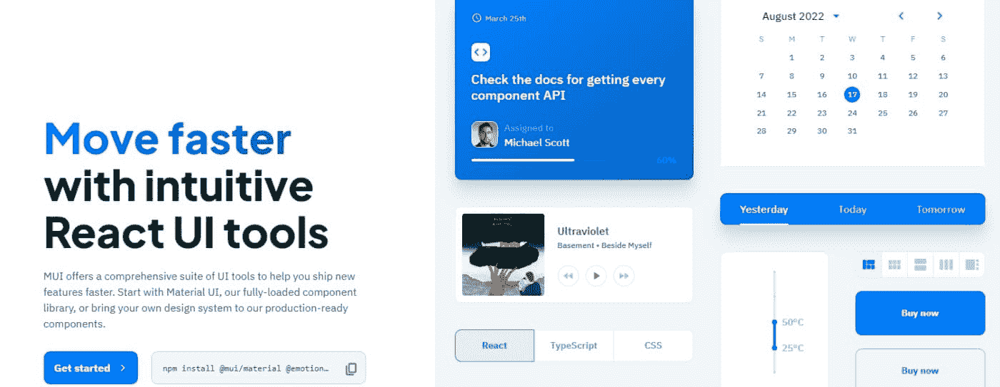

Material-UI.

有两种方法可以做到这一点——您可以直接使用这个组件库，也可以将您的设计系统引入其生产就绪组件。该平台将使您能够在不牺牲控制力或灵活性的情况下更快地进行设计。它将帮助您交付优秀的设计，以取悦最终用户。

特性和优势包括:

*   永恒的美学:你可以使用 MUI 轻松构建精致的 UI。你可以从谷歌的材料[设计](https://kinsta.com/blog/web-design-courses/)开始，也可以自己从头开始创建高级主题。
*   **直观定制:**该工具提供强大而灵活的组件，让您能够完全控制项目的外观。
*   生产就绪的漂亮组件:使用漂亮而强大的材料设计组件，如按钮、文本、菜单、警告、[表格](https://kinsta.com/blog/tables-in-wordpress-tablepress/)等，创建您梦想中的最佳设计。您也可以随意定制它们。
*   **更好的可访问性:**提高可访问性是该工具的核心任务之一。因此，用户可以快速访问您构建的任何特性，以增强他们的用户体验。
*   无与伦比的文档: MUI 附带了由 2000 多名贡献者创建和管理的全面文档。在这里，你可以很容易地了解这个工具，以及如何使用它。如果你遇到任何疑问，这个文档可以帮助你。

最棒的是，你可以永远免费使用 MUI 的基本功能。对于高级功能，您可以选择 15 美元/月/开发人员起的付费计划。

### 2.Ant 设计(AntD)

如果你正在寻找一个基于 react 的 UI 组件库来构建企业级产品， [Ant Design](https://ant.design/) 是一个极好的选择。它将帮助你创造一个愉快而富有成效的工作经历。

这个工具被阿里巴巴、百度、腾讯等公司使用。Ant Design 提供了多个 UI 组件来帮助丰富您的应用程序和软件系统。

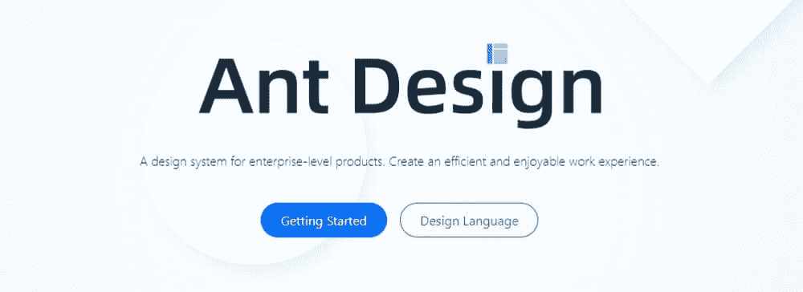

Ant Design.

特性和优势包括:

*   **组件:**您可以直接在项目中使用 50 多个预制组件，而不是从头开始创建。这些组件包括按钮、图标、版式、布局、导航、数据输入、数据显示、反馈等。
*   **Ant 设计包:**这些包对移动、数据可视化、图形解决方案等很有用。
*   **Ant Design Pro:** AntD 的另一个变种 Ant Design Pro 除了组件之外，还附带了[模板](https://kinsta.com/blog/elementor-templates/)等功能和一个设计工具包来帮助你设计应用。

此外，Ant Design 还建议您使用其他基于 React 的第三方组件库，如 React JSON View、 [React Hooks Library](https://kinsta.com/blog/react-usecallback/) 等等。它通过 [GitHub](https://kinsta.com/blog/gitlab-vs-github/) 、Segmentfault 和 Stack Overflow 维护文档并支持社区讨论。

### 3.反应引导

另一个流行的前端框架——[React Bootstrap](https://react-bootstrap.github.io/)，是为基于 React 的应用和系统重建的。它已经取代了 Bootstrap [JavaScript](https://kinsta.com/knowledgebase/what-is-javascript/) ，其中每个组件都是从零开始开发的，作为本机 React 组件，不需要依赖关系，如 [jQuery](https://kinsta.com/knowledgebase/what-is-jquery/) 。

尽管 React-Bootstrap 是最早的 React 库之一，但它已经发展成为构建轻松用户界面的绝佳选择。它为您的移动和 web 应用程序提供了令人惊叹的 UI 元素。

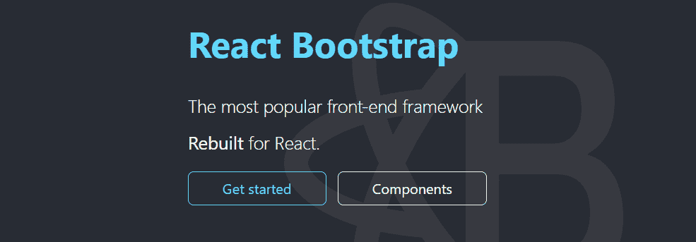

React Bootstrap.

特性和优势包括:

*   兼容性: React-Bootstrap 被设计为兼容多种 ui。它完全依赖于 Bootstrap 样式表，并与您可能喜欢的多个 Bootstrap 主题一起工作。
*   **可访问性:**所包含的所有组件都是为任何用户或设备方便访问而开发的。因此，用户也将更好地控制每个组件的功能和形式。
*   **轻量级:**您可以通过只导入您需要的组件来最小化应用程序中的代码量，而不是导入整个库。这将是更少的时间消耗。
*   自从 Bootstrap 被广泛用于 web 开发以来，你会发现成千上万的付费和免费主题。

React-Bootstrap 没有官方支持，但它在网上有大量有用的资源，还有一个活跃的社区。如果你寻求任何帮助，你可以去堆栈溢出，Reactiflux 不和谐，和 GitHub 问题。

### 4.Chakra UI

使用 Chakra UI 创建 react 应用程序，Chakra UI 是一个简单、易访问的模块化组件库。它提供了有用的构建模块来帮助您在应用程序中构建有价值的功能，并取悦用户。

查克拉的受欢迎程度正在增长，由于其令人敬畏的产品和性能。目前，它每月有 130 万次下载，19.7k GitHub 明星，7.4k Discord 成员，10k 核心贡献者。

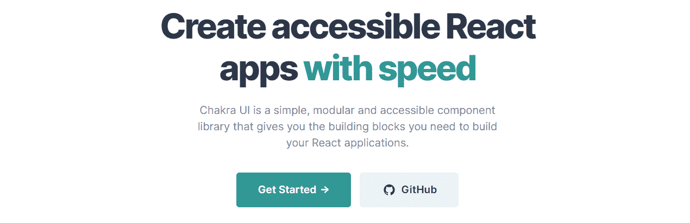

Chakra-UI.

有了这个工具，你将花更少的时间编码，更多的时间为最终用户创造美妙的体验。Chakra UI 旨在使开发人员更容易更快地添加功能，而无需从头开始创建一切。

特性和优势包括:

*   **可访问性:** Chakra UI 的组件遵循 WAI-ARIA 标准，使您的应用程序易于访问。
*   **定制:**您可以轻松定制它提供的组件的任何部分，以补充您的设计需求。无论是主题化、模板、设置还是其他任何东西，你都可以充分利用这个设计工具。
*   **可组合:**由于 Chakra UI 易于使用的界面和导航，使用它可以毫不费力地组合新元素。你可以很容易地找到每一个功能，并使用它们来创建你的设计元素，没有麻烦。
*   **深色和浅色 UI:** Chakra UI 针对不同的颜色模式进行了优化，您可以根据自己的设计需求使用这些颜色模式。你可以在任何你觉得合适的地方使用暗模式或亮模式，为你的应用程序创建令人惊叹的用户界面。
*   **开发人员体验:**有了所有可用的选项以及定制和组合的自由，开发人员在创建网站或应用程序时的生产力将显著提高。

因此，他们将不得不编写更少的代码，并且可以直接在他们的设计中选择一个组件，而不必从头开始为每个组件编写代码。这不仅节省了他们的时间，也节省了他们的精力，因此他们可以将宝贵的时间投入到创新中。

如果您遇到任何问题，您可以联系 Chakra 的主动维护团队提出问题并消除您的疑虑。

### 5.蓝图

蓝图是一个基于 React 的 UI 工具包，你可以用它来构建你的网络应用。这是 Palantir 创建的一个开源项目，Palantir 是一个在通过应用程序与数据交互来增强客户体验方面具有实践经验的组织。

如果您正在构建数据密集且复杂的界面，这个工具将非常适合您。它也主要用于桌面应用程序。这个组件库在 GitHub 上有一千多颗星。

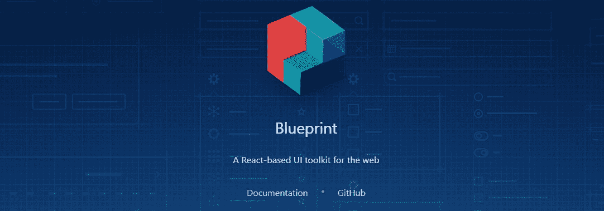

Blueprint.

特性和优势包括:

*   开发人员友好: Blueprint 提供了一个复杂的 UI，允许开发人员轻松地构建包含多个组件和模块的功能丰富的 web 界面。它受到开发人员的喜爱，原因之一是 Blueprint 提供了 25 个以上的标准组件。
*   组件:它提供了一些代码来创建和显示按钮和 300 多个可修改的图标，与时间和日期交互，选择时区等。除此之外，你还可以选择面包屑、标注、分隔线、按钮、导航条、卡片、标签、标签等等。
*   定制:开发者可以轻松使用 CSS 和定制每个组件来满足他们的项目需求。
*   主题:它没有不同种类的主题，但你会得到独特的明暗模式主题以及设计元素，如配色方案、类别、排版等。
*   可访问性:许多用户认为 Blueprint 是最容易访问的库之一。您可以在命令提示符下通过 npm 轻松安装它。
*   **实时合成:**使用工具 Composer，将帮助您实时执行合成，并改进您的应用程序的用户界面。
*   **其他功能:**它还有其他有用的功能，如像素流、捕捉混合现实、创建魔法跳跃、多用户编辑、全景捕捉、混沌破坏等等。

Blueprint 的文档非常优秀，包括深入的教程，开发者可以浏览并掌握这个库。由于它缺乏支持选项，你可以在 Stack Overflow 和 Blueprint 的 GitHub 库上看到帮助，该库对贡献者是活动的。

### 6.visx

由 Airbnb 创建的 [visx](https://airbnb.io/visx/) 是为 [React](https://kinsta.com/blog/vue-vs-react/) 应用程序构建的多个低级的、富有表现力的可视化原语的集合。它的开发是为了在整个公司统一一个完整的可视化堆栈，将 React 的乐趣与 D3 计算的健壮性结合在一起。

有了 visx，您将在任何基于 React 的代码库中获得原生体验，因为它具有相同的模式和标准 API。这样就解决了复制粘贴各种 React 钩子的问题。相反，它可以抽象 D3 细节，并以标准格式提供实用程序和组件。如果你喜欢定制和表演图表，visx 是一个很好的工具。

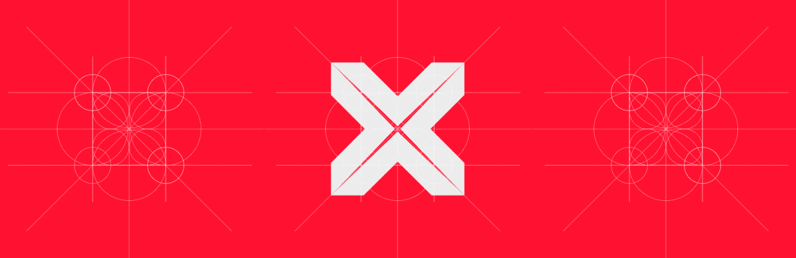

visx.

特性和优势包括:

*   **多种布局:**布局包括热图、网络、文字云、统计、地理投影等等。
*   **实用程序:** visx 提供 SVG 实用程序来构建交互式、复杂的[SVG](https://kinsta.com/blog/what-is-an-svg-file/)。您还将获得像模拟数据这样的数据工具来帮助创建可视化。您还可以使用工具提示和轴等工具创建自己的图表。
*   **交互:**可以使用画笔、缩放、拖动等图元。，提升用户体验。
*   **轻量级:**你可以把 visx 拆分成几个包，减少包的大小。因此，您可以从小处着手，只使用您需要的组件，而不必使用整个库。这也将消耗更少的时间和空间，你可以更快地完成你的工作。
*   **定制:** visx 让你轻松定制你的组件。你可以带上你的动画库，状态管理，CSS-in-JS 解决方案等。，并开始创建有趣的 ui。这样，你就可以毫不费力地设计你的风格、主题、动画等等。
*   **制图库:**当你开始使用 visx 的可视化原语时，你将能够建立自己的制图库。此外，它可以针对您的具体使用情况进行优化，并提供对您的设计的更好控制。

visx 提供了详细的文档，包括安装、描述和集成的完整说明，以及一个 API 列表，每个列表都有一些示例。除了全面的可视化示例库，visx 还为您提供了许多有用的博客文章和入门教程来帮助您开始和使用这个工具。

### 7.流利的

[Fluent](https://www.microsoft.com/design/fluent/) 是一款跨平台、开源的设计工具，可以帮助您创建引人入胜的用户体验。它以前被命名为 Fabric React，是微软创建的一个优秀的 UI 库。

开发人员和设计人员可以从它的有用工具中受益，将设计元素添加到他们的应用程序中，而不必从头开始创建它们。该工具功能强大且直观，可根据用户意图和行为进行调整。无论您使用什么设备，使用 Fluent 工作都感觉很自然，无论是 PC、笔记本电脑还是平板电脑。

如果您正在创建跨平台应用程序，Fluent 是最好的工具之一。然而，它对其他项目来说也很棒。

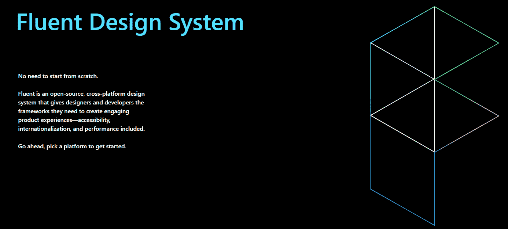

Fluent.

特性和优势包括:

*   **预建组件:** Fluent 提供多个预建组件，帮助你用微软 Office 的设计语言开发应用的不同部分。它包括按钮、网格、复选框、通知、菜单、基本输入、工具箱等组件。您还可以根据自己的使用情况轻松定制它们。
*   控制:你可以用工具更好地控制你的设计，比如日期选择器、人物选择器、人物角色等等。
*   **可访问性:** Fluent 的设计理念是易于访问，因此任何用户都可以轻松访问和使用它。
*   **跨平台:**它适用于所有平台，无论是 web、iOS、macOS、Android 还是 Windows。它还兼容 Office 365、OneNote、Azure [DevOps](https://kinsta.com/blog/devops-tools/) 等微软产品。
*   **性能:**您在 Fluent 中用来构建您的应用程序部件的每个组件都会以最佳状态运行。它将为您的应用程序提供专业而又用户友好的外观和感觉。此外，它采用了一种简单的方法，将 CSS 应用于它的每个元素。因此，即使你改变了一个元素，也不会影响你的风格。

因为它是开源的，所以您可以使用代码并根据您的需要修改它。但是，它可能缺乏深入的文档。但是如果你需要帮助，网上还有其他资源和博客帖子。因此，最好是有一定经验的开发人员和设计人员。

### 8.语义 UI 反应

将 React 与语义 UI 相集成是为您的项目获得定制 UI 组件库的一个极好的策略。语义 UI React 帮助你用简洁易用的 [HTML](https://kinsta.com/blog/learn-html/) 构建你的网站和应用。它在 GitHub 上有 12k+颗星。

有了这个工具，你可以在你正在构建的应用上加载任何你想要的 CSS 主题。它也有人性化的 HTML 来开发软件产品。它是一个声明性 API，提供了强大的验证和特性。

Semantic UI React.

特性和优势包括:

*   jQuery Free: 语义 UI React 不受 jQuery 的限制，因为它缺少虚拟 DOM。
*   **预建组件:**这个库提供了许多组件，包括按钮、标题、容器和图标。此外，您将获得速记道具来帮助自动创建标记。
*   **简单调试:**通过在应用程序上使用语义 React UI，开发人员发现调试应用程序变得更加容易。您可以轻松地跟踪问题，而无需继续挖掘堆栈跟踪。
*   主题化:语义 UI 拥有高级主题以及智能继承系统，为您提供完全的设计灵活性。它提供了 3000 多个主题变量。所以，只要开发一次 UI，想用多少次就用多少次。
*   UI 组件:你可以使用 50 多个 UI 组件来开发一个完整的网站，只需要一个 UI 堆栈。此外，您可以在不同的项目中共享 UI，减少为每个项目从头开始创建 UI 的工作量。从按钮到集合、视图、元素、行为和模块，您可以获得各种各样的组件，涵盖了界面设计的大部分领域。
*   **响应性:**该工具旨在使您的界面具有响应性，让您能够为移动设备和平板电脑上的内容和设计元素找到最佳设计。
*   **集成:**工具集成了、余烬、流星等。，且不说反应。这使您可以将用户界面层与应用程序逻辑组织在一起。

这个免费的开源工具被用于几个大规模的软件生产环境中。

### 9.无头用户界面

由 Tailwind Labs 创建的无头 UI 提供了完全可访问的无样式 UI 组件，旨在轻松兼容 Tailwind CSS。对于所有基于 React 的项目来说，它是最好的 UI 库之一。在 GitHub 上也很受 54.5k+明星的欢迎。

由于该工具可以将应用程序逻辑与可视组件分离，如果您正在为您的应用程序构建 UI，那么它是一个极好的选择。它使你不用离开你的 HTML 就能轻松地创建应用程序。此外，它是一个以实用程序为中心的 CSS 库，包含很多类，如 rotate-90、text-center、pt-4 和 flex。

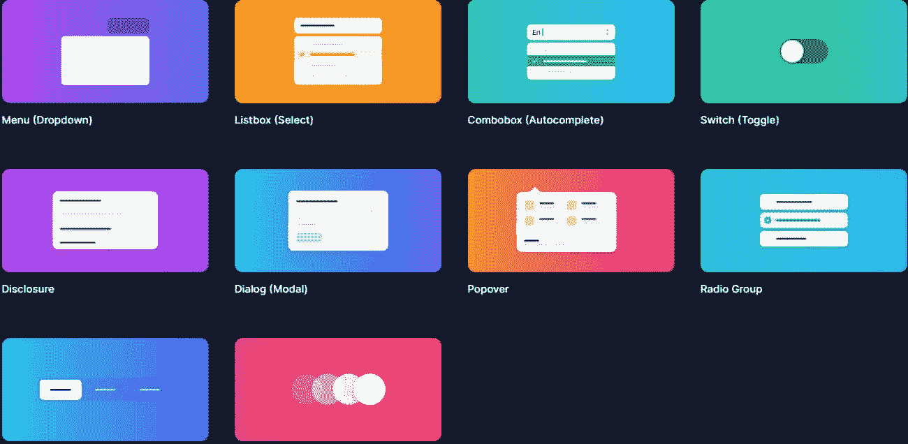

Headless UI.

特性和优势包括:

*   UI 组件:你有很多 UI 组件，比如菜单、列表框、开关、组合框、对话框、显示、对话框、单选按钮组、弹出框、过渡、标签、自动完成、切换开关等等。
*   定制:定制每个组件很简单，因为您将获得每个组件的易于理解的示例和样式指导。通过这种方式，您可以构建适合您特定应用程序需求的功能。
*   **可访问性和转换:** Headless UI 提供了完整的可访问性和转换信息，因此用户不会觉得在他们的应用程序中访问和使用该工具很麻烦。为此，您也将获得一个扩展的 API。

关于支持和文档，Headless UI 是好的。它在 GitHub 上有一个强大的社区。你也可以在 [Tailwind CSS](https://kinsta.com/blog/tailwind-css/) discord 服务器上连接 Headless UI 的其他用户，寻求帮助。此外，Headless UI 的讨论页面保持活动状态，提供一般帮助、交互和功能请求。
T3】

### 10.反应-管理

如果你正在寻找一个 React 框架来构建你的 [B2B](https://kinsta.com/blog/b2b-vs-b2c/) 应用程序， [React-admin](https://marmelab.com/react-admin/) 是一个不错的选择。它旨在为开发人员提供最佳体验，并使您能够更专注于满足您的业务需求。

这是一个拥有麻省理工学院许可的开源工具，健壮、稳定、易学，并且使用起来很愉快。这就是为什么全世界超过 1 万家公司在他们的项目中使用 React-admin。

使用 React-admin，您可以创建令人愉快的 ui，无论您是在构建内部工具、B2B 应用程序、[CRM](https://kinsta.com/blog/woocommerce-crm/)还是 ERP。它旨在通过允许开发人员更快地设计来提高他们的可维护性和生产力。

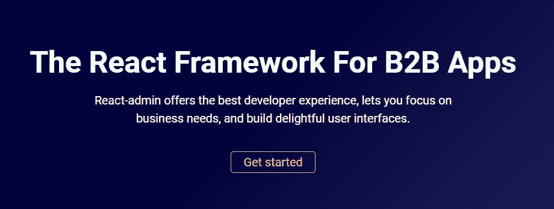

React Admin.

特性和优势包括:

## 注册订阅时事通讯

### 想知道我们是怎么让流量增长超过 1000%的吗？

加入 20，000 多名获得我们每周时事通讯和内部消息的人的行列吧！

[Subscribe Now](#newsletter)

*   更快:这个工具可以加快你的工作速度。只需 13 行代码，您就可以开始使用它了。
*   **现代设计:**你可以用这个现代材料设计的工具创建基于 API 的应用程序。
*   **一个巨大的组件库:** React-admin 可以用来创建公共特性，而不是从头开始创建每个特性。它有一个庞大的组件和挂钩库，可以覆盖大多数用例，这样您就可以专注于您的业务逻辑。它有组件，包括表单和验证、搜索和过滤、通知、路由、全功能的数据网格，以及除了常见组件之外的更多组件。
*   **可访问性和响应性:** React-admin 旨在方便使用不同设备的任何人访问和响应。通过这种方式，它旨在增强用户使用什么设备以及他们位于全球何处的体验。
*   **角色和权限:**为用户提供合适的角色和权限，确保应用程序的安全。
*   主题化:你将获得不同的主题化选项，使你的用户界面既吸引人又有用。
*   **集成:** React-admin 可以使用任何 API。它是后端不可知的。你还可以找到与大多数 [GraphQL](https://kinsta.com/blog/wordpress-revolution-with-graphql/) 和 REST 方言兼容的适配器，或者在几分钟内自己编写代码。它可以与 OpenAPI、Django、Firebase、Prisma 等无缝集成。

React-admin 有两个版本:

*   社区版:它是完全免费的，所以你可以免费获得它的代码和文档。要获得支持，可以参考它的堆栈溢出社区。
*   **企业版:**如果你想利用更多的选择和自由，你可以购买每月 125 欧元或每月 127.10 美元起的企业版。

除了访问代码和文档，您还将获得来自 marmelab 的专业支持，您选择的专业服务将享受 50%的折扣，并且可以访问高级功能，如日历、审计日志、多对多、实时、可编辑数据网格、基于角色的访问控制(RBAC)等。

### 11.改造

如果您正在构建内部应用程序， [Retool](https://retool.com/) 是一个很好的选择。它将消除与 UI 库、数据源和访问控制的斗争。您将获得一种简化的方式来处理一切，并生成客户喜欢使用的应用程序。

从财富 500 强到初创企业，各种规模的企业都在使用这个工具来创建出色的内部应用程序。

Retool.

特性和优势包括:

*   **健壮的积木:**你会得到 90+个有用的健壮的积木，比如表格、图表、表格、列表、地图、向导等等。Retool 提供了这些现成的组件来帮助您花更多的时间来组装和优化您的 UI，而不是单独为它们编写代码。
*   **省时省力:**不用为一个组件(比如表格)找最好的 React 库，你可以使用 Retool 在一个地方把所有东西都搞定。它有像拖放这样的选项，可以让你快速地排列组件，将应用程序的特性和部分放在一起。这样，你可以节省大量时间，更快地进入下一个项目，同时以更高的效率完成当前的项目。
*   **可视化:**添加地图、表格等功能。允许用户轻松地可视化重要数据。这有助于他们在关键时刻采取适当的行动。
*   **集成:**可以通过 GraphQL、gRPC API、REST 连接任何数据库。这样，您可以在一个应用程序中获得所有数据，并无缝地工作。它集成了诸如 [MongoDB](https://kinsta.com/blog/mongodb-vs-mysql/) 、 [MySQL](https://kinsta.com/blog/postgresql-vs-mysql/) 、Google Sheets、Stripe、Snowflake、Slack、Salesforce、Twilio、Google Cloud Storage、GitHub、AWS Lambda、Sendgrid、Redis 等工具。
*   **错误处理:**有了 Retool，就不需要担心来自后端的错误处理。这个工具可以处理任何事情，从从 MongoDB 读取数据并将其加入 Postgres，到将其结果直接发布到 Stripe API。
*   开发人员友好: Retool 是一个开发人员友好的工具，允许您的开发人员做更多的事情。开发人员可以使用 JavaScript 编写代码，并在 Retool 中开发应用程序。它在任何地方都接受 JavaScript，并帮助您轻松执行代码。此外，您可以使用转换器来编写可重用的代码和操作数据。
*   本地 API: 你将在 Retool 中使用本地 API，通过 JS 与查询和组件进行交互。
*   **定制、导入、调试:**很容易定制您想要的任何组件，使其适合您的用例。也可以通过 URL 导入 JavaScript 库，用于不同的用途。Retool 随 Lodash、Numbro 和 Moment 等工具一起安装。此外，它很容易调试。您可以查看所有可用的组件、环境和查询以及查询依赖项，并开始调试。
*   **安全部署:** Retool 提供内置的安全性、权限和可靠性，帮助您在隐私和安全的情况下部署您的产品。您可以在您的虚拟专用云(VPC)、[【虚拟专用网络】](https://kinsta.com/blog/how-does-a-vpn-work/)或内部托管重组。您也可以通过 Kubernetes 或 Docker 进行部署。

此外，您可以在 Git 的帮助下查看修订历史，并使用[双因素身份验证(2FA)](https://kinsta.com/help/two-factor-authentication/) 、单点登录(SSO)或安全声明标记语言(SAML)安全地登录。此外，它还提供审计日志和细粒度的访问控制，只允许获得许可的个人访问您的应用程序。

重组提供了广泛的文件和支持。它的支持可以在它的话语论坛 Slack(如果你是一个重新装备的超级用户)、用于实时聊天的内部通信以及为企业客户提供的专用支持上获得。

有一个免费的试用版可用于重组。您也可以观看其官方网站上的演示，了解该工具的工作原理。

### 12.索环

Grommet 是一个全方位的 React 框架，它有一个整洁的包，包含了响应性、主题化、可访问性和模块化。它将帮助你用一个简单的 UI 组件库来简化你的软件开发。

如果您正在寻找一个全面的设计系统来构建可访问且响应迅速的移动优先 web 项目，那么这个工具是一个很好的选择。它是由 HPE 创建的，在设计时提供了一种充满活力的体验。

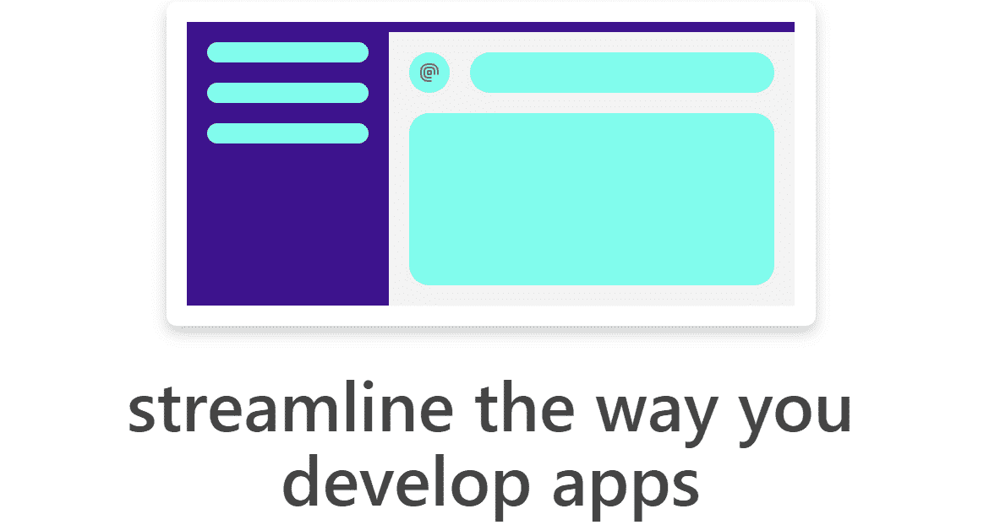

Grommet.

特性和优势包括:

*   **UI 组件:** Grommet 提供了强大而大胆的组件设计，并且重量很轻，可以控制您的应用程序大小。你将得到多个类别的组件，比如布局(页脚、页眉、卡片、边栏、网格等。)、类型(标题、文本、段落和降价)、颜色(品牌、状态、中性色和强调)、控件(按钮、导航栏、菜单等)。)、输入(文本、文件上传、复选框等。)、媒体(视频、传送带和图像)、增强用户体验的实用程序(响应元素、键盘[快捷键](https://kinsta.com/blog/wordpress-keyboard-shortcuts/)、无限滚动等)。)、可视化(日历、头像、图表等。)
*   **主题化:**索环上有大量预打包的主题，包括索环主题设计器和索环设计器。前者是一个演示管理面板，让您通过调整元素来开发定制的索环主题。后者是一个画布，用于创建和保存您对组件的设计体验。
*   用户友好界面:这是一个易于访问的 UI 库，带有键盘导航和屏幕阅读器标签等工具。它还支持网页内容无障碍指南(WCAG)。对于初学者来说，这是一个很好的工具。

Grommet 有大量全面的文档，但缺乏实践支持，但您可以通过不同的方式寻求帮助。你可以在 [Slack](https://kinsta.com/blog/slack-vs-discord/) 上与索环团队交流，在 GitHub 上分享对该工具的反馈，并通过在 Twitter 上关注索环来了解最新消息。您可以访问模板库并阅读 codesandbox 和 Storybook 上的资源。

### 13.常绿树

由 Segment 提供的 [Evergreen](https://evergreen.segment.com/) 是一个了不起的 React UI 库，帮助你创建令人愉快的软件产品。这也是一个为您提供灵活性的设计系统，不会将您限制在特定的配置或需要过时的集成。

Evergreen 帮助[构建能够适应不断变化的设计需求的软件](https://kinsta.com/blog/squarespace-alternatives/)产品。它提供了许多特性、组件和好处来帮助您创建用户友好且功能强大的界面。如果您想构建企业级 web 应用程序，这将是一个不错的选择。

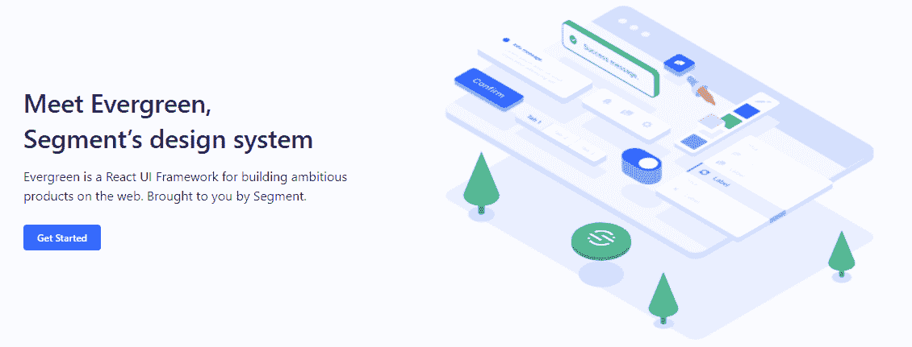

Evergreen.

特性和优势包括:

*   **组件:** Evergreen 拥有 30 多个抛光组件，让您开箱即用。它包括排版，颜色，按钮，徽章，药丸，图案，布局，等等。这些都是在基于 React 的 UI 原语之上创建的，以支持无限的可组合性。
*   **快速安装:**安装 Evergreen 的 UI 包快速简单。因此，您可以毫无困难地开始使用这个工具，并开始构建应用程序。
*   主题化: Evergreen 提供两种主题——默认和经典。默认主题反映了 Segment 的当前品牌，而经典主题源于 Evergreen 的第一个版本。尽管 Evergreen 缺少一个主题构建器，但你会得到一个全面的主题化系统来根据设计要求定制组件。

Evergreen 拥有丰富的指南、插件、工具包和工具来简化系统设计。你也可以去 Evergreen 的 Figma 图书馆获得你需要的帮助。

### 14.雷巴斯

Rebass 是一个基于 React 的 UI 组件库，它是一个风格化的系统。它是可扩展的、系统的、响应迅速的，是企业所需要的。它是由 Gatsby 的前端开发人员 Brent Jackson 创建的。

该工具使用 CSS-in-JavaScript 库，不需要您使用样式对象而不是嵌入的 CSS 字符串将 CSS 单独写入应用程序。因此，在 Rebass 原语之上添加设计元素和主题时，您可以更快地开发代码。

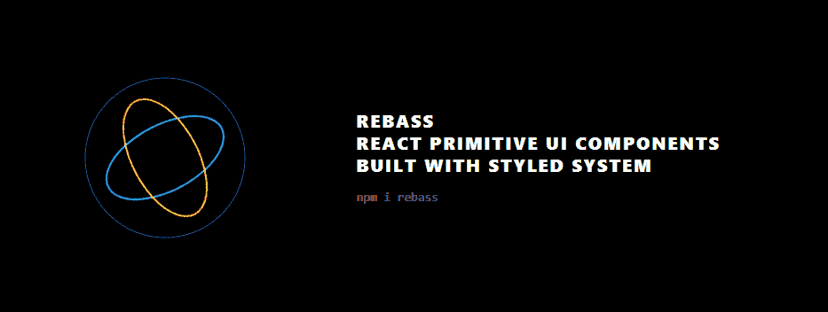

Rebass.

特性和优势包括:

Struggling with downtime and WordPress problems? Kinsta is the hosting solution designed to save you time! [Check out our features](https://kinsta.com/features/)

*   **轻量级:** Rebass 的消耗只有 4 KB 左右，非常轻量级。这可以控制应用程序的大小。
*   组件:它提供了一个基本的 UI 组件列表，您可以轻松地扩展并创建一个组件库。它也将有一个在选择的设计主题中定义的一致的风格和 API。你会得到像应用程序结构(盒子。布局等。)、图像、文本、卡片、表格等等。表单还包含子组件，如滑块、开关、文本区域、复选框、输入等。除此之外，你会得到其他常见的组件，如图像卡，导航条，网格等。
*   主题化: Rebass 提供了主题化的灵活性，主题是使用 ThemeProvider 实现的。您也可以根据自己的使用情况自定义主题。此外，Rebass 有一个主题规范来定义组件的设计标记和主题对象。此外，Rebass 支持风格化的系统和主题 UI，无需任何额外的配置设置。

Rebass 提供了关于如何启动和使用该工具的详细文档。它还可以作为帮助开发人员扩展和定制组件的指南。说到支持，Rebass 没有任何付费支持。

### 15.曼蒂尼

Mantine 是一个全功能的 React UI 组件库，你可以用它来快速开发你的 web 应用和站点。它旨在使您的应用程序易于访问和灵活，并带有 40 多个挂钩和 100 多个可定制的组件。

这个工具是[开源的](https://kinsta.com/blog/open-source-database/),它的包有麻省理工学院的许可，是免费的。它基于 TypeScript，支持多种框架。

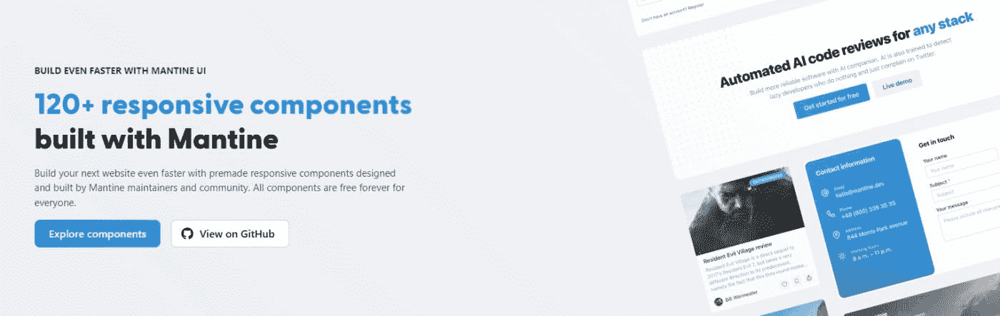

Mantine.

特性和优势包括:

*   **组件:** Mantine 有 100 多个组件，包括 20 多个输入组件、转盘、文本编辑器、日期选择器、覆盖和[导航](https://kinsta.com/blog/website-navigation/)。它支持基于 Embla 的旋转木马，基于奎尔的文本编辑器，让您可以轻松调整您的内容。您还可以更改颜色、搜索项目、使用自动完成等。
*   **深色配色:**你只需编写一点代码，就可以为你正在构建的应用添加一个深色主题。Mantine 可以输出黑暗和光明主题的全球风格。
*   **定制:**Mantine 中的每个组件都可以用道具进行可视化定制。这有助于您快速构建原型，并通过修改道具来不断进行实验。
*   **样式覆盖:** Mantine 允许在内联样式或类的帮助下对每个内部元素进行样式覆盖。当您可以将此功能与其他定制灵活性一起使用时，您可以应用任何想要的视觉更改并满足您的设计需求。
*   **灵活的主题化:**你不必局限于默认的主题；你可以用额外的颜色、半径、间距、字体等来扩展它。，以补充您的设计。
*   **附加特性:**Mantine 中包含的其他重要特性有自动供应商前缀、惰性评估、在服务器端渲染期间提取关键 CSS、动态主题化等等。
*   **集成:** Mantine 与现代环境一起工作，包括 Gatsby.js、 [Next.js](https://kinsta.com/knowledgebase/next-js/) 、Remix、create-react-app 或 Vite。

Mantine 有一个 Discord 社区，你可以加入这个社区提出问题，查看最近的进展，并参与功能讨论。它也可以在 GitHub 上进行讨论和分享反馈。您也可以在 Twitter 上关注 Mantine，以获得更新通知。

### 16.下一个 UI

无论你是初学者还是有经验的开发者，都可以在 [NextUI](https://nextui.org/) 的帮助下轻松搭建站点和 app。这是一个现代的、快速的、漂亮的 React UI 库，你可以很快上手。

这个工具的所有特性、产品和界面看起来都很有前途。它的组件支持跨不同浏览器的服务器端呈现。

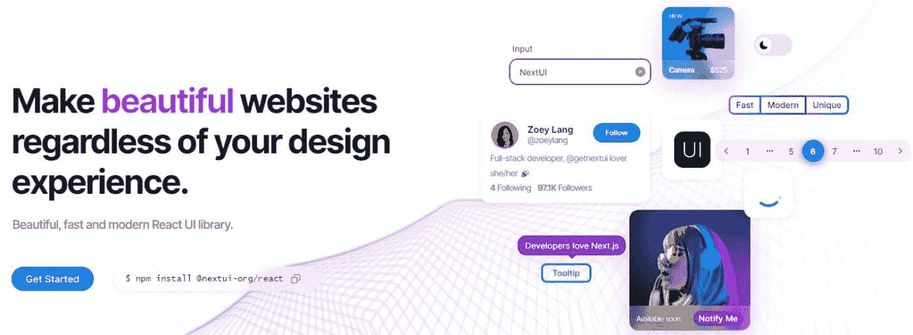

Next UI.

特性和优势包括:

*   **更快:** NextUI 在运行时消除不需要的风格道具。这使得该工具的性能优于其他 React UI 库。
*   **独特的 DX:** NextUI 是完全类型化的，这有助于减少学习曲线，同时提供更好的开发者体验。此外，开发人员不需要为了展示一个组件而导入几个组件。因此，您可以通过编写更少的代码来做更多的事情。
*   **明暗 UI:** 你会获得自动识别黑暗模式。NextUI 可以通过检测 [HTML 主题](https://kinsta.com/blog/html-vs-html5/)中道具的变化来自动改变你的主题。它的默认深色主题是可伸缩的，并且易于应用，代码更少。
*   主题化:它提供了一个简单的方法来定制默认的主题。你可以很容易地修改字体、颜色、断点等。
*   **定制:**由于 NextUI 是在 CSS-in-JS 库缝合的基础上开发的，所以很容易通过 CSS prop、原生 CSS 选择器或 styled 函数定制组件。此外，您将获得一组现成的缝合实用程序，通过将 CSS 属性分组在一起、缩短 CSS 属性或简化复杂的语法来加速您的工作流程。
*   **服务器端渲染:** NextUI 的组件促进了跨浏览器的服务器端渲染，您可以轻松地将其应用到您的应用程序中。
*   **可访问性:**NextUI 的所有组件都遵循 WAI-ARIA 准则，并提供键盘支持。当用户使用屏幕阅读器或键盘导航时，他们也可以查看聚焦环。也兼容 Next.js。

NextUI 在 GitHub、Twitter 和 Discord 上有一个广泛的社区，你可以加入并寻求帮助，分享你的反馈和建议。

### 17.反应路由器

由 Remix 团队及其贡献者开发和维护的 [React Router](https://reactrouter.com/) 是一个令人印象深刻的 React UI 组件库。它的最新版本是 v6，它使用了以前版本的最佳特性，并做了一些改进。

来自 Airbnb、Discord、 [Microsoft](https://kinsta.com/blog/microsoft-teams-vs-slack/) 和 Twitter 等知名公司的开发团队已经在他们的项目中使用了这个工具。如果您正在搜索可以与不同界面一起工作的路由器用户界面，这是最好的选择。它可以将您的应用程序组件与相应的[URL](https://kinsta.com/knowledgebase/what-is-a-url/)匹配，以确保更好的用户体验。

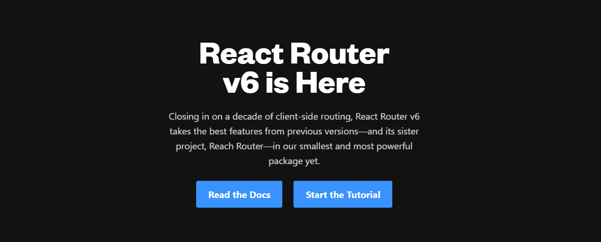

React Router.

特性和优势包括:

*   **嵌套接口:**该工具允许您在单个应用程序中使用多个接口。
*   节省时间: React 路由器是一款高效的工具，可以帮助您加速应用程序。它可以自动改变网址和布局；因此，您可以创建更少的路线，节省时间和精力。
*   **优化路由:**这个工具可以为你正在构建的站点或 app 选择最好的路由器。为此，它将评估几种可能性，给每种可能性一个等级，并呈现最佳路线。这也减少了自己创建路径排序的需要。
*   **附加特性:**它拥有声明式编程架构。因此，在创建基于 React 的应用程序时，使用一些准备好以声明方式组合的元素和组件是很有用的。

React Router 附带了文档，您可以参考这些文档来了解如何开始使用该工具。您也可以访问官方主页上的教程来了解更多信息。它拥有 240 万 GitHub 用户，3..600 万次 npm 下载，并拥有来自世界各地的 600 多名贡献者。

### 18.主题用户界面

如果你正在创建一个主题化的基于 React 的 UI，使用[主题 UI](https://theme-ui.com/) 是一个不错的选择。它将帮助您构建 web 应用程序、设计系统、自定义组件库、Gatsby 主题等。，具有更大的灵活性。

主题 UI 提供顶级的开发人员人体工程学，并遵循基于约束的设计原则。使用该工具进行设计包括两个主要步骤:

*   通过定义颜色和字体来构建主题
*   设计每个组件的样式，以便更好地控制您的应用程序或站点

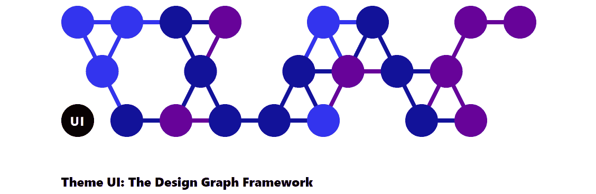

Theme UI.

特性和优势包括:

*   人体工程学:你可以根据你的主题快速设计你的软件产品。
*   **基于约束:**可以使用排版、颜色、布局比例等。，遵循基于约束的设计。
*   **Themeable:** 在你想要的任何组件上，通过你的完整网站或应用毫不费力地引用你的主题中的值。它为 CSS 提供了一个主题规范和一个主题感知 sx prop。
*   **组件:**你将有超过 30 个内置的 React UI 组件可供选择，让你的设计更具吸引力，反应更灵敏。
*   **样式化:**您可以创建/不创建组件来进行样式化。主题 UI 提供了移动优先、简单、响应迅速的风格。此外，它还遵循了富有表现力的简单 MDX 样式。
*   **黑暗模式:**这个工具有内置的黑暗模式和强大的主题化 API。它还包括主题和 Gatsby 站点的插件。这使您能够设计静态站点。

主题 UI 附带了一个详细的文档，您可以在有疑问的情况下参考或探索其用法。它包括关于 MDX 样式、主题化、自定义挂钩等的说明。

### 19.PrimeReact

PrimeReact 是另一个 React UI 组件库，世界各地的企业和开发人员都使用过。一些著名的公司包括梅赛德斯、空客、福特、福克斯、大众、易贝、英特尔、英伟达、威瑞森和美国运通。

这个工具有 39.5k+周下载量，2.6k+ GitHub 星。它有一个令人印象深刻的特性和组件列表，让你的用户界面设计充满冒险精神。

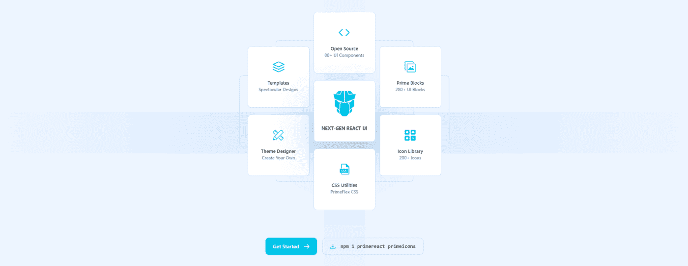

Prime React.

特性和优势包括:

*   **组件:** PrimeReact 拥有 80 多个令人惊叹的 React 组件，可直接用于您的设计。一些独特的包括[验证码](https://kinsta.com/blog/wordpress-captcha/)，终端，组织结构图，和树形选择。
*   **模板:**你会得到可定制的模板和 280+ UI 块，你可以在开发界面的时候直接复制粘贴。此外，它还有一个由 200 多个图标组成的图标库。
*   **设计不可知:** PrimeReact 有一个设计不可知的基础设施，让你选择现有库的外观，比如 [Bootstrap](https://kinsta.com/blog/bootstrapping-startup/) 和 Material UI。然而，你完全可以自己创建一个。
*   主题设计器:该工具的特色是基于图形用户界面的主题设计器，带有可视化设计器和 500 多个变量，您可以根据需要进行修改。它将允许你修改颜色，字体，大小，输入风格，按钮等。

PrimeReact 确实提供支持，您可以在一个工作日内得到关于改进或功能请求的回复。

### 20.反应还原

[React Redux](https://react-redux.js.org/) 是一个由 Redux 维护的 UI 组件库，经常用 React 和 Redux 的最新 API 进行更新。它以可预测性、简单的界面和准确性等属性而闻名。它适用于较简单的项目，而不是复杂的项目。

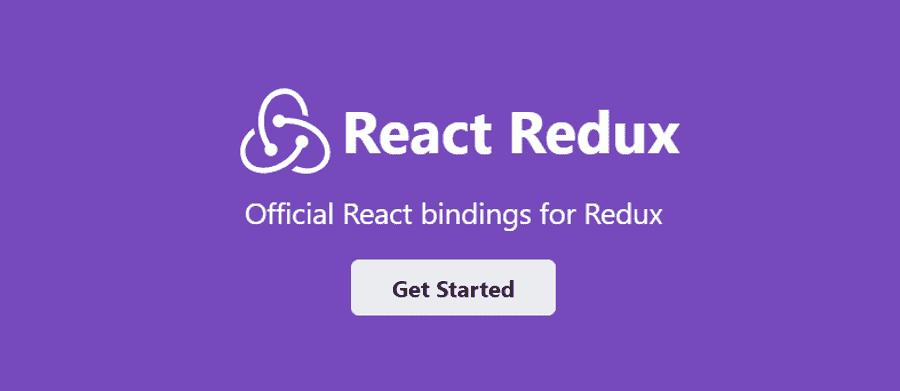

React Redux.

特性和优势包括:

*   **封装:**您将获得 API 以允许组件直接与 Redux 存储交互。这阻止了您自己编写代码。
*   **性能优化:** React Redux 可以自动应用性能优化，使组件在数据需求变化时重新呈现。
*   **可预测性:**该工具旨在与 React 的组件模型兼容。在这里，您可以指定如何从 Redux 中提取组件所需的值。当有变化时，您的组件也会自动更新。
*   简单明了的界面:该工具有一个简单明了的界面，允许在几种环境中测试代码，并精确地比较结果。
*   **调试:** React Redux 有 DevTools，可以让你检测应用状态的变化，记录每个变化，转发错误报告。这实现了简化的调试过程。

### 21.完全形态

Gestalt 是一个 UI 库，帮助你创建人们喜欢使用的令人惊叹的用户界面。它也是 Pinterest 的设计工具，拥有许多功能和组件。它的界面也很流畅，可以让开发者快速上手。

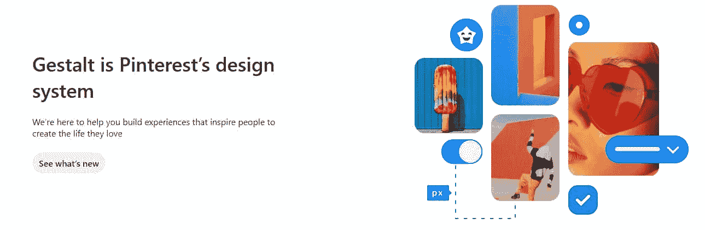

Gestalt.

特性和优势包括:

*   **易于适应:**对于设计师来说，按照他们全新的指南开始使用这个工具很容易。他们还可以阅读如何配置工具和拉请求。
*   **组件:**您将获得一套全面的 UI 实用程序和控件，以创建出色的用户体验。
*   **基础:**在设计的时候，可以玩转调色板、图标、排版等元素。
*   **其他特性:**支持黑暗模式、国际化、从右向左、代码自动更新等。由于自动化设计，它还需要较少的维护。使用可以检测代码破坏的 codemode，升级过程也变得更加容易。

你也可以联系格式塔团队，和他们一起做出贡献。此外，您可以跟踪他们的路线图，了解最新的发展动态。

### 22.反作用运动

如果你正在寻找 React 中动画组件的解决方案，你可以考虑 [React Motion](https://github.com/chenglou/react-motion) 。这是一个优秀的 React 库，将帮助您创建逼真的动画。这个工具很容易上手和使用。

特性和优势包括:

*   **指定刚度值:**这个工具更吸引人的地方是你可以指定刚度值。您也可以定义阻尼参数。这样，您的组件将看起来更真实，因为您可以控制刚度。
*   **样式:**您可以使用 React Motion 轻松地制作简单卡片组件缩放的动画。为此，您将需要利用样式化的组件。

React Motion 的文档简单易懂。您还可以通过 GitHub 社区获得反馈和最新进展。

### 23.反应虚拟化

如果您正在构建一个包含大量数据的复杂前端，您可能希望使用 [React 虚拟化](https://bvaughn.github.io/react-virtualized/#/components/List)。无论是组件还是定制，您都可以在这个工具中轻松地执行所有操作。

特性和优势包括:

*   **高效渲染:**该工具可以高效渲染大型表格和列表数据。因此，如果您希望在一个表中呈现多个列，或者如果您有一个包含成百上千个元素的大型列表，那么这将非常有用。
*   组件:你将会得到许多组件，包括一个自动缩放器，一个列缩放器，一个单元格测量器，一个多重网格，一个箭头保持器，方向排序器，等等。，除了常见的。这个多功能库可以满足您不断增长的表格需求。您还可以通过调整表格的行高来自定义表格。
*   **浏览器支持:** React 虚拟化支持 [Android 和 iOS](https://kinsta.com/blog/turn-off-push-notifications/) 的标准网络浏览器。

它有一个 GitHub 社区，你可以通过这个社区来请求特性和更新工具。

## 摘要

React 是一个流行的 JavaScript 库，它提供了许多组件来帮助您构建应用程序和站点。您可以使用上面提到的 React UI 组件库并选择您想要的组件，而不是从头开始创建每个组件或功能。
[React UI 组件库帮助你为你的软件应用和网站创建惊艳的界面。✨，在这本指南中找到适合你的🚀 点击推文](https://twitter.com/intent/tweet?url=https%3A%2F%2Fkinsta.com%2Fblog%2Freact-components-library%2F&via=kinsta&text=React+UI+component+libraries+help+you+create+stunning+interfaces+for+your+software+applications+and+websites.+%E2%9C%A8+Find+the+right+one+for+you+in+this+guide+%F0%9F%9A%80&hashtags=UI%2CReact)
这样，你就可以更轻松地创建功能和设计，而不必花时间编写通用组件的代码。使用 React UI 组件库也有助于初学者轻松入门并创建自己的应用程序。

如果你是一个经验丰富的[开发者](https://kinsta.com/blog/what-is-a-full-stack-developer/)，你可以定制你想要的组件，并将其添加到你的应用设计中。当从上面的列表中选择一个 React UI 组件时，它完全取决于您的设计需求。你可以浏览上面的工具以及它们的特性、好处和组件，来决定哪一个适合你的[项目](https://kinsta.com/blog/web-design-best-practices/)。

* * *

让你所有的[应用程序](https://kinsta.com/application-hosting/)、[数据库](https://kinsta.com/database-hosting/)和 [WordPress 网站](https://kinsta.com/wordpress-hosting/)在线并在一个屋檐下。我们功能丰富的高性能云平台包括:

*   在 MyKinsta 仪表盘中轻松设置和管理
*   24/7 专家支持
*   最好的谷歌云平台硬件和网络，由 Kubernetes 提供最大的可扩展性
*   面向速度和安全性的企业级 Cloudflare 集成
*   全球受众覆盖全球多达 35 个数据中心和 275 多个 pop

在第一个月使用托管的[应用程序或托管](https://kinsta.com/application-hosting/)的[数据库，您可以享受 20 美元的优惠，亲自测试一下。探索我们的](https://kinsta.com/database-hosting/)[计划](https://kinsta.com/plans/)或[与销售人员交谈](https://kinsta.com/contact-us/)以找到最适合您的方式。