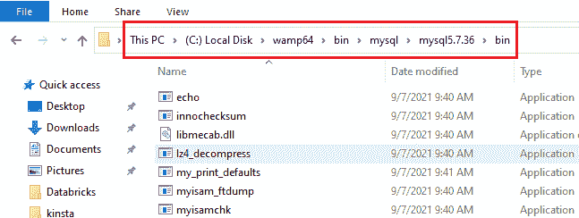
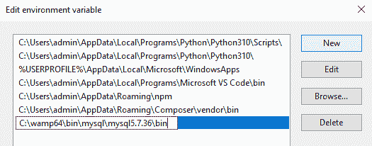
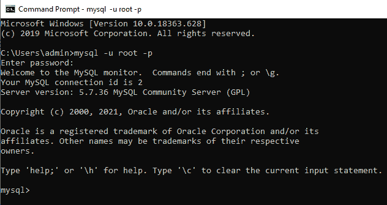
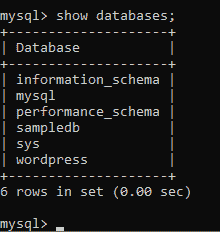
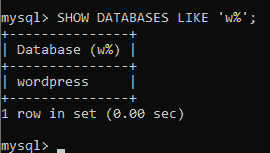
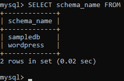
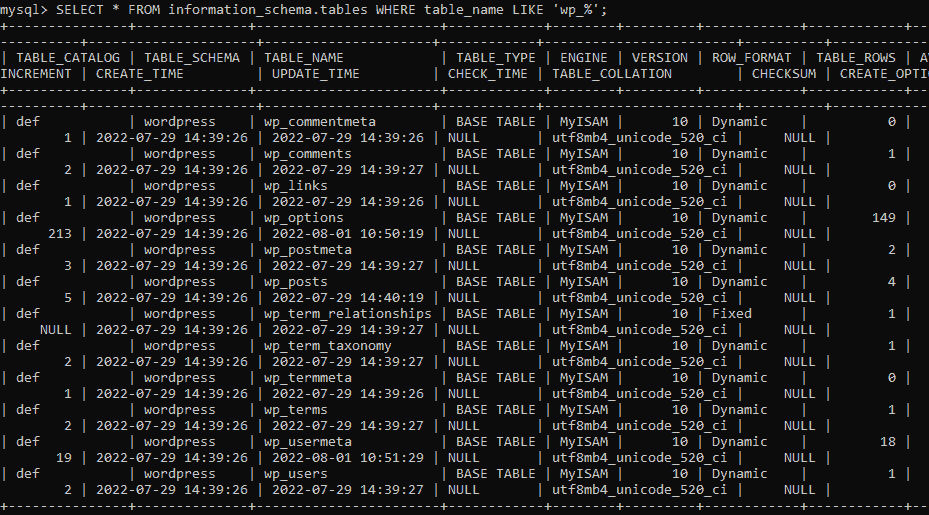

# 如何列出 MySQL 数据库(分步代码教程)

> 原文：<https://kinsta.com/blog/list-mysql-databases/>

MySQL 是当今使用最广泛的关系数据库管理系统(RDBMS)之一。这是一个健壮的数据库平台，允许创建和管理可伸缩的数据库，主要使用结构化查询语言(SQL)。

MySQL 服务器是数据库所在的环境，也是数据库被访问的地方。作为服务器管理员，您经常需要检索有关该环境的详细信息—列出服务器上运行的数据库、显示特定数据库中的表、查看用户角色和权限、访问约束等等。

本文将解释如何通过命令提示符列出 MySQL 数据库的来龙去脉。

## 列出 MySQL 数据库的先决条件

您必须在本地机器上运行 MySQL 服务器才能开始。如果你没有 MySQL，有几种方法可以安装它:

*   安装 [WAMPServer](https://kinsta.com/blog/mamp-alternative/#2-wampserver) 、 [XAMPP](https://kinsta.com/blog/mamp-alternative/#3-xampp) 、 [MAMP](https://kinsta.com/blog/mamp-alternative/#pros-and-cons-of-mamp-and-when-to-consider-an-alternative) ，或者任何其他包含 MySQL 的软件分发栈。
*   直接从他们的官方网站下载并运行 [MySQL 安装程序](https://dev.mysql.com/downloads/installer/)，通过设置过程来配置和安装 MySQL 服务器和其他工具。

为了方便地使用命令行运行 MySQL 命令，您需要将 MySQL 可执行文件的路径添加到您的系统环境中。如果您使用选项二安装了 MySQL，这一步是不必要的，所以可以跳过下一节。


## 将 MySQL 路径添加到系统的变量环境中

如果您在 Windows 计算机上运行 XAMPP 或 WAMP，本节将指导您将 MySQL 可执行文件路径添加到系统的变量环境中。


> 需要在这里大声喊出来。Kinsta 太神奇了，我用它做我的个人网站。支持是迅速和杰出的，他们的服务器是 WordPress 最快的。
> 
> <footer class="wp-block-kinsta-client-quote__footer">
> 
> 
> 
> <cite class="wp-block-kinsta-client-quote__cite">Phillip Stemann</cite></footer>

[View plans](https://kinsta.com/plans/)

首先，启动您的 Windows 文件资源管理器并导航到**这台电脑**。点击安装了 WAMP 或 XAMPP 软件包的驱动器( **C:** )。

如果运行的是 XAMPP，导航到**xampp**>**MySQL**>**bin**，将完整路径复制到 **bin** 文件夹。对于 WAMP，通过**{ your-wamp-version }**>**bin**>**MySQL**>**{ your-MySQL-version }**>**bin**导航到其完整路径。




bin 文件夹的完整路径。


点击**开始**菜单，搜索“路径”点击**编辑系统环境变量**。

然后点击**启动和恢复**下的**环境变量**，选择路径变量，点击**编辑**。

接下来，点击 **New** 并粘贴 MySQL 可执行文件的完整路径(之前复制的)。




编辑环境变量。


然后，点击**确定**保存更改。

现在已经添加了路径，您可以在终端中执行 MySQL 命令。

## 登录 MySQL

要列出 MySQL 数据库，用户必须被授权访问所有数据库，或者您必须设置一个授予所有用户访问权限的全局`SHOW DATABASES`权限。

在通过命令提示符登录之前，请确保您的 MySQL 服务器正在运行:

```
mysql -u  -p
```

注意:替换` with your username. The default username for MySQL is `root`，密码为空(默认没有密码)。`

 `



登录 MySQL。


## 显示 MySQL 服务器中的数据库

现在您已经登录，您可以通过执行`SHOW DATABASES`命令来列出服务器中的 MySQL 数据库:

```
SHOW DATABASES;
```

作为回报，您可以获得存储中的所有数据库:




存储中的数据库列表。


在返回的六个数据库中，`information_schema`和`performance_schema`是安装 MySQL 时自动生成的默认数据库。

`information_schema`数据库是一个不可修改的数据库，存储所有与数据库和其他对象相关的信息(视图、用户权限、表、约束等)。)存储在 MySQL 服务器中。

## 数据库输出的过滤结果

以前，您使用`SHOW DATABASES`返回 MySQL 服务器上的所有数据库，但是您经常需要过滤数据库输出，主要是当服务器上有许多数据库时。

`LIKE`子句根据指定的模式过滤`SHOW DATABASE`的结果。以下是一般语法:

```
SHOW DATABASES LIKE '';
```

它必须是表示要匹配的模式的字符串。字符串必须以百分号`%`结尾，表示一个或多个字符。

例如，如果您想只显示名称以字母`w`开头的数据库，您可以通过运行以下命令来实现:

## 注册订阅时事通讯


### 想知道我们是怎么让流量增长超过 1000%的吗？

加入 20，000 多名获得我们每周时事通讯和内部消息的人的行列吧！

[Subscribe Now](#newsletter)

```
SHOW DATABASES LIKE 'w%';
```

以下是过滤后的结果:




使用' w% '时过滤后的数据库响应。


## 使用信息模式查询表元数据

前面，您看到了`information_schema`数据库如何存储与 MySQL 服务器环境中的数据库、表和其他对象相关的所有信息。

`information_schema`数据库利用 schemata 表来存储所有数据库的信息。对于数据库过滤，您可以执行复杂的搜索来查询特定数据库的模式表。

例如，如果您需要名称以“samp”或“word”开头的数据库，您可以组合其他几个子句来进行复杂的查询:

```
SELECT schema_name FROM information_schema.schemata WHERE schema_name LIKE 'samp%' OR schema_name LIKE 'word%';
```

结果如下:




复杂查询的结果。


此外，您还有来自`information_schema`数据库的`tables`表，它包含所有表的信息。类似地，您可以执行查询来仅检索与指定模式匹配的表。

例如，下面的查询只返回 [WordPress 表](https://kinsta.com/knowledgebase/wordpress-database/)的模式信息——只返回名称以“wp_”开头的表:

```
SELECT * FROM information_schema.tables WHERE table_name LIKE 'wp_%';
```

结果如下:

Struggling with downtime and WordPress problems? Kinsta is the hosting solution designed to save you time! [Check out our features](https://kinsta.com/features/)




结果的模式信息只有 WordPress 表。


在`information_schema`中找到的其他表格包括`columns`、`constraints`、`table_constraints`、`check_constraints`和`referential_constraints`。

## 常见问题和最佳实践

执行 SQL 时最常见的错误原因之一是未能在语句末尾使用分号。

另一个是使用无效的 SQL 语法或拼写错误的表/列名。为了避免这种情况，请交叉检查表名或列名，以确保拼写正确。一定要交叉检查你的语法。

以下是一些需要记住的其他最佳实践。

### SQL 关键字使用大写字母

编写 SQL 代码时，请始终使用大写字母表示 SQL 关键字，小写字母表示表名和列名。这使得您的代码可读性更好，更不容易出错。

所以，不要这样:

```
select * from information_schema.tables where table_name like 'wp_%';
```

执行以下操作:

```
SELECT * FROM information_schema.tables WHERE table_name LIKE 'wp_%';
```

### 避免使用`SELECT *`

避免在 SQL 查询中使用`SELECT *`。你的请求不明确，是因为你不可能总是知道它会返回什么。而是指定要从表中选择的列。

所以代替这个的是:

```
SELECT * EXCEPT(phone) FROM users.profile
```

执行以下操作:

```
SELECT name,
    dob,
    address,
    country,
    address,
FROM user.profile
```

### 缩进您的代码

最后，让查找错误更容易的另一个技巧是缩进代码。这样可读性更强！

## 数据库管理员

或者，您可以选择通过使用数据库管理器来管理数据库，而不编写 SQL。这允许用户访问数据库管理功能，而无需编写 SQL 查询。该软件连接到一个 MySQL 服务器，并提供一个用户界面来展示数据库功能。一旦连接，UI 将显示服务器上的所有数据库。不同管理工具的外观和感觉各不相同，但过程是相似的。


DevKinsta’s database manager.


有几个工具可供选择，包括 [phpMyAdmin](https://kinsta.com/help/wordpress-phpmyadmin/) 和 [Adminer](https://kinsta.com/topic/adminer/) ，这两个工具都可以通过 [DevKinsta](https://kinsta.com/devkinsta/) 访问。DevKinsta 的默认管理工具是 Adminer，因为它是轻量级的、简单的、快速的，[但是 phpMyAdmin 可以轻松访问](https://kinsta.com/help/wordpress-phpmyadmin/)。
T9】

## 摘要

作为服务器管理员，您需要能够高效、准确地检索 MySQL 服务器上数据库的详细信息。查看服务器上有哪些数据库、查看特定的表和表中的信息，以及访问有关用户角色和权限的信息，这些都是至关重要的任务。幸运的是，从命令行使用 SQL 可以使这一切变得轻而易举。

当您的数据库管理需要扩展到查询表之外时，Kinsta 可以提供帮助。立即了解有关我们的[可扩展数据库托管选项](https://kinsta.com/database-hosting/)的更多信息！

* * *

让你所有的[应用程序](https://kinsta.com/application-hosting/)、[数据库](https://kinsta.com/database-hosting/)和 [WordPress 网站](https://kinsta.com/wordpress-hosting/)在线并在一个屋檐下。我们功能丰富的高性能云平台包括:

*   在 MyKinsta 仪表盘中轻松设置和管理
*   24/7 专家支持
*   最好的谷歌云平台硬件和网络，由 Kubernetes 提供最大的可扩展性
*   面向速度和安全性的企业级 Cloudflare 集成
*   全球受众覆盖全球多达 35 个数据中心和 275 多个 pop

在第一个月使用托管的[应用程序或托管](https://kinsta.com/application-hosting/)的[数据库，您可以享受 20 美元的优惠，亲自测试一下。探索我们的](https://kinsta.com/database-hosting/)[计划](https://kinsta.com/plans/)或[与销售人员交谈](https://kinsta.com/contact-us/)以找到最适合您的方式。`