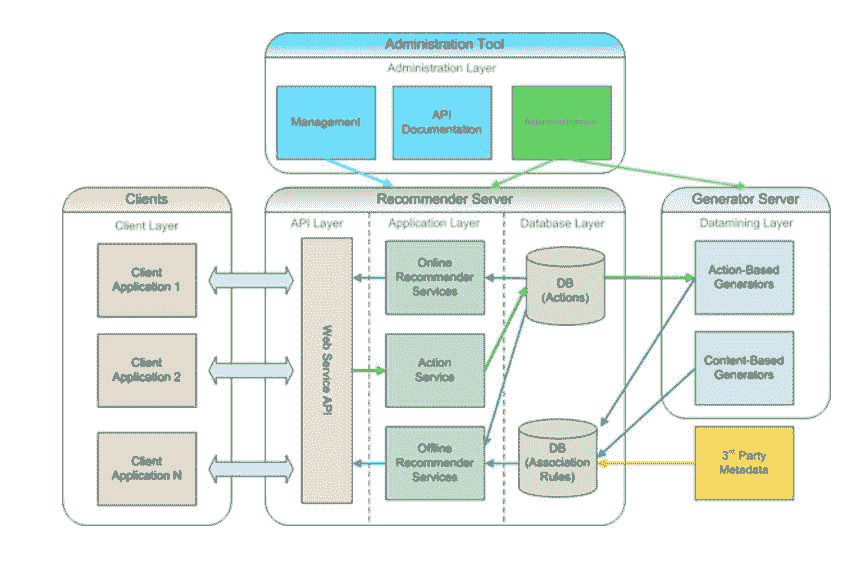
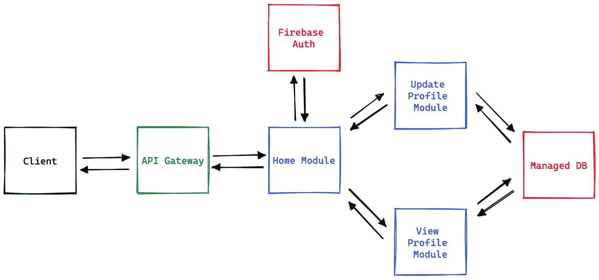

# 什么是 Web 应用架构？分解一个网络应用

> 原文：<https://kinsta.com/blog/web-application-architecture/>

世界已经转向互联网，web 应用程序已经成为新的工作场所和商业商店。为了适应现代 web 应用程序的各种用途，每个应用程序都需要设计成具有高性能和可定制性。

Web 应用程序架构解决了这个问题。
[想了解更多关于 web 应用架构的知识？你来对地方了✅ 点击发送推文](https://twitter.com/intent/tweet?url=https%3A%2F%2Fbit.ly%2F3TcbuQa&via=kinsta&text=Want+to+learn+more+about+web+application+architecture%3F+You%27ve+come+to+the+right+place+%E2%9C%85&hashtags=WebApp%2CWebDev)
Web 应用程序架构定义了基于 web 的应用程序的各个组件是如何构成的。这种架构高度特定于 web 应用程序的性质和目的。为您的 web 应用程序选择错误的架构会对您的业务造成严重破坏。

在本指南中，我们将分解 web 应用程序架构的概念，并了解它如何影响您的应用程序的最终用户体验。最后，我们还将看看您可以实现的一些最佳实践，以充分利用您的 web 应用程序。

## 什么是 Web 应用架构？

为了开始讨论，让我们从 web 应用程序架构的定义开始。

简而言之，web 应用程序架构是您的 web 应用程序的各种组件如何相互交互的概述。

 它可以简单到定义客户机和服务器之间的关系。它也可以像定义一群集装箱后端服务器、负载平衡器、API 网关和面向用户的单页前端之间的相互关系一样复杂。

> 需要在这里大声喊出来。Kinsta 太神奇了，我用它做我的个人网站。支持是迅速和杰出的，他们的服务器是 WordPress 最快的。
> 
> <footer class="wp-block-kinsta-client-quote__footer">
> 
> 
> 
> <cite class="wp-block-kinsta-client-quote__cite">Phillip Stemann</cite></footer>

[View plans](https://kinsta.com/plans/)

也就是说，选择编写代码的编程语言并不重要。

您如何设计您的 web 应用程序在可用性和成本优化方面都起着关键作用。下面是一个示例 web 应用程序架构的纸面外观:

Architecture diagram for a recommendation application. (Image source: [Wikipedia](https://www.wikipedia.org))

## 为什么 Web 应用程序架构很重要？

毫无疑问，Web 应用程序架构是 web 应用程序最重要的部分之一。如果你选择用一个特定的架构来开发你的 web 应用程序，那么在维护和发展你的应用程序时，你一定会得到很多好处。

然而，选择正确的架构会进一步扩大这些优势。

以下是您应该认真考虑采用 web 应用程序架构的一些主要原因。

### 轻松适应业务需求

您的应用程序是您业务的关键门户，业务需求会随着市场的变化而变化。为了跟上这种变化，你需要你的应用足够灵活，以适应你不断变化的业务需求。如果你在开发应用时没有考虑到内置的灵活性，你必然会花费越来越多的时间和精力来对你的应用进行细微的调整。

正确的 web 应用程序架构已经考虑到了您的业务在未来可能需要的一些变化。例如，如果您知道您正在构建一个电子商务应用程序，该应用程序有一天会扩展并为大量客户提供广泛的服务，那么选择微服务架构而不是单片架构将为您提供更多的灵活性。

另一方面，如果你正在为你的公司构建一个只有一两个固定需求的内部应用，你可以选择一个更简单的整体来加速开发并保持你的代码库干净。

### 有组织的发展

正如我们前面提到的，正确的 web 应用程序架构为您提供了更方便的开发路线图。体系结构在您的系统中提供了足够的模块化，可以根据需要隔离组件，并且您可以根据需要为每个模块和组件自由选择正确的项目结构。

如果你在没有架构的情况下投入应用程序开发，你可能会浪费时间和金钱来重新组织你的组件，并制定新的规则来帮助促进你的团队成员之间的协作。

### 更好的代码库管理

除了编写应用程序的代码，你还将花费大量的时间来管理它。组织您的项目文件、将您的应用程序分解成模块以及设置自定义管道只是需要主动维护以确保顺利开发的任务中的一部分。

正确的 web 应用程序架构使您可以轻松地进行更改。您可以实现特定于组件的最佳实践，将应用程序的痛点彼此分离，并保持每个功能的独立和松散耦合。不是说这些事情没有架构就做不了；只是正确的架构使所有这一切变得更加简单。

遵循预定义的体系结构还可以让您更快地开发应用程序。正确的架构结合合理的版本控制策略可以让你的开发人员彼此并行工作，更快地构建特性。

web 应用程序架构也能让你的应用程序经得起未来的考验。一旦你围绕如何组织你的应用程序的组件定义了一个可靠的策略，你就可以轻松地将这些组件一个接一个地移植到新的技术上，而不必重做你的整个应用程序。

### 增强的安全性

大多数 web 应用程序架构在构建组件时都会考虑安全性。开发人员可以提前计划要实施的措施和实践，以在应用向用户推出之前[提高应用的安全性](https://kinsta.com/cheatsheets/site-security-cheat-sheet/)。

例如，构建一个使用微服务提供付费和免费内容的 OTT [视频流应用](https://kinsta.com/blog/video-hosting/)更有意义，因为微服务架构使您能够将应用拆分为业务友好的组件，如[用户认证](https://kinsta.com/blog/wordpress-two-factor-authentication/)和免费或付费内容流。如果您的用户认证模块出现故障，您可以轻松配置您的应用程序以[限制对付费内容](https://kinsta.com/blog/create-a-membership-website/)模块的访问，直到认证启动，而免费内容模块仍然可供您的用户使用。

在另一种情况下，同一个应用程序被设计成一个紧密耦合的整体，一个关闭的认证服务将意味着一个[关闭的应用程序](https://kinsta.com/blog/website-downtime/)或免费提供的付费内容——这是你想要不惜一切代价避免的结果。

## Web 应用程序架构是如何工作的？

在我们讨论 web 应用程序架构如何工作之前，理解一个简单的网站如何工作是很重要的:

1.  用户在浏览器的地址栏中输入你的应用的 URL，或者点击一个链接。
2.  浏览器[在 DNS 服务器](https://kinsta.com/blog/dns-propagation/)中查找 URL，并识别你的应用的 IP 地址。
3.  浏览器发送一个 [HTTP 请求](https://kinsta.com/knowledgebase/what-is-an-http-request/)到你的应用。
4.  您的应用程序会以正确的内容(通常是网页)进行响应。
5.  浏览器在屏幕上呈现网页。

如果你想更深入一点，下面是一个 *web 应用程序*如何处理一个请求:

1.  用户通过您的前端用户界面向您的应用程序发送请求。
2.  如果你有一个相关的缓存设置，应用程序将首先检查它，看看它是否有一个有效的记录，可以直接发送回客户端。如果是，缓存的内容将被发回，请求将被标记为已完成。
3.  如果没有缓存，请求将被转发到负载均衡器。
4.  负载平衡器识别可用于处理请求的服务器实例，并转发该请求。
5.  服务器实例处理请求，如果需要的话，[调用任何外部 API](https://kinsta.com/knowledgebase/api-endpoint/)。
6.  一旦在一个地方收集了结果，服务器就将响应发送回负载平衡器。
7.  负载平衡器将响应返回给 API 网关，API 网关再将响应发送给前端客户端的用户。然后，该请求被标记为已完成。

## Web 应用程序架构的类型

现在你对什么是 web 应用程序架构有了一个基本的概念，让我们来详细看看在整个 web 中使用的一些流行的 web 应用程序架构类型。

### 单页架构

单页面应用程序(SPA)的架构就像它的名字一样简单:整个应用程序都基于一个页面。一旦用户打开你的应用，他们不需要导航到任何其他网页。该应用程序足够动态，当用户在应用程序中导航时，可以获取和呈现满足用户需求的屏幕。

当涉及到为最终用户或消费者提供快速无缝的体验时，spa 是很棒的。然而，它们缺乏传统网站的风格，并且很难针对 SEO 进行优化。

#### 水疗建筑的优点

水疗建筑的一些优点包括:

*   你可以构建高度互动的网络应用。
*   水疗很容易扩展。
*   针对性能优化 spa 并不需要太多努力。

#### 水疗建筑的缺点

SPA 架构的一些缺点是:

*   spa 限制了超链接和 SEO 的灵活性。
*   最初渲染通常很慢。
*   在应用程序中导航可能不直观。

### 渐进式 Web 应用程序架构

渐进式 web 应用程序(PWA)架构建立在单页面架构之上，为您的 Web 应用程序提供离线功能。电容器和离子等技术用于构建 pwa，可以[为用户提供跨平台的统一体验](https://kinsta.com/topic/user-experience/)。

类似于 spa，pwa 是平滑无缝的。借助安装在用户设备上的附加功能(通过服务人员)，您的用户可以获得更加统一的应用体验。

与此同时，为 SEO 优化这样的应用程序可能会很困难，并且已安装应用程序的更新可能很难推送。

#### PWA 架构的优点

PWA 架构有许多优势，包括:

*   应用程序运行非常流畅，并提供跨平台兼容性。
*   可伸缩性很简单。
*   开发者可以访问离线访问和设备原生 API，如后台工作器和推送通知。

#### PWA 架构的缺点

PWA 架构的一些缺点包括:

*   对链接管理和 SEO 的支持有限。
*   将更新推送到离线 PWAs 比推送到原生应用更复杂。
*   跨[网络浏览器](https://kinsta.com/browser-market-share/)和操作系统的 PWAs 支持有限。

### 服务器端渲染架构

在服务器端呈现(SSR)中，前端网页在用户请求后呈现在后端服务器上。这有助于减少客户端设备的负载，因为它接收静态 HTML、CSS 和 JS 网页。

SSR 应用在博客和电子商务网站中非常受欢迎。这是因为它们使得链接管理和 SEO 变得非常简单。此外，SSR 应用程序的第一次呈现非常快，因为客户端不需要处理任何 JS 代码来呈现屏幕。

#### SSR 架构的优点

SSR 体系结构的一些优点列举如下:

*   这些应用程序对于 SEO 繁重的网站来说非常棒。
*   在大多数情况下，第一页的加载几乎是即时的。
*   您可以将其与缓存服务配对，以进一步提高应用程序的性能。

#### SSR 架构的缺点

使用 SSR 架构的一些缺点包括:

*   不建议用于复杂或繁重的网页，因为服务器可能需要时间来完全生成页面，从而导致第一次呈现延迟。
*   它主要推荐给那些不太关注用户界面，只寻求增加可伸缩性或安全性的应用程序。

### 预渲染应用架构

预呈现应用程序架构也称为静态站点生成架构。在这种架构中，应用程序的前端网页是预先生成的，并作为普通的 HTML、CSS 和 JS 文件存储在服务器上。一旦用户请求一个页面，它就会被直接获取并显示给用户。这使得 web 应用程序非常快，任何类型的加载时间都很短。然而，这种架构增加了应用程序的构建时间，因为网页是在构建过程中呈现的。

当您希望生成静态内容(如博客或不经常更改的产品细节)时，预渲染的 web 应用程序非常有用。你也可以利用模板来简化你的网页设计。然而，用这种架构构建动态 web 应用程序几乎是不可能的。如果您希望构建一个搜索页面，在其路径中包含查询(类似于`https://myapp.com/search/foo+bar`)，那么您来错了地方。

由于应用程序的每个可能的路线都是在构建过程中预渲染的，所以不可能有如上所述的动态路线，因为有无限的可能性不能在构建过程中预渲染(这样做也没有意义)。

#### 预渲染架构的优点

预渲染应用架构的几大优势包括:

*   网页是纯 HTML、CSS、JS 生成的；因此，它们的性能类似于使用普通 JS 构建的应用程序。
*   如果你知道你的应用程序的所有可能的路线，搜索引擎优化变得超级容易。

#### 预渲染架构的缺点

与任何架构模型一样，预渲染也有其缺点:

*   这些应用程序无法提供动态内容。
*   对 web 应用程序进行任何更改都意味着从头开始重新构建和部署应用程序。

### 同构应用架构

同构应用是服务器端呈现的应用和 spa 的混合。这意味着此类应用首先在服务器上呈现为普通的服务器端呈现的应用。一旦客户端接收到它们，应用程序就会自动合并并附加虚拟 DOM，以实现更快、更高效的客户端处理。这实质上把应用程序变成了一个单页应用程序。

同构将两个世界的优点结合在一起。多亏了 SPA，您可以在客户端获得超快的处理和用户界面。由于服务器端渲染，您还可以获得快速的初始渲染和成熟的 SEO 和链接支持。

#### 同构架构的优点

以下是使用同构应用程序架构的一些好处:

*   同构应用程序有超快的初始渲染和对搜索引擎优化的全面支持。
*   这些应用程序在客户端上也表现良好，因为它们在加载后会变成 SPA。

#### 同构架构的缺点

同构应用程序架构的一些缺点可能是:

*   设置这样的应用程序需要熟练的人才。
*   在设计同构应用时，tech stack 的选项是有限的。您只能从少数(大部分)基于 JS 的库和框架中进行选择。

### 面向服务的架构

面向服务的架构是构建应用程序的传统整体方式的最流行的替代方式之一。在这个架构中，web 应用程序被分解成服务，每个服务代表一个业务功能单元。这些服务松散地耦合在一起，并通过消息传递的媒介相互交互。

面向服务的架构为您的应用技术堆栈增加了稳定性和可伸缩性。然而，SOA 中服务的规模没有明确定义，通常与业务组件而不是技术组件相关联；因此，维护有时会成为一个问题。

#### 面向服务架构的优点

面向服务架构的主要优势包括:

*   这种架构有助于构建高度可伸缩和可靠的应用程序。
*   组件是可重用的，并被共享以增强开发和维护工作。

#### 面向服务架构的缺点

这里列出了使用面向服务架构的潜在缺点:

*   SOA 应用程序仍然不是 100%灵活的，因为每个服务的大小和范围都不固定。可能存在难以维护的企业应用程序规模的服务。
*   组件共享引入了服务之间的依赖性。

### 微服务架构

微服务架构旨在解决面向服务架构的问题。微服务是更加模块化的组件，它们组合在一起可以构建一个 web 应用程序。然而，微服务专注于保持每个组件小并且具有有限的上下文。有界上下文本质上意味着每个微服务都将其代码和数据耦合在一起，对其他微服务的依赖性最小。

微服务架构可能是构建应用程序的最佳架构，这些应用程序的目标是在某一天扩展到成千上万的用户。每个组件都具有弹性、可伸缩性，并且易于维护。然而，维护基于微服务的应用程序的 DevOps 生命周期需要额外的努力；因此，它可能不太适合较小的用例。

#### 微服务架构的优势

微服务架构的一些优势包括:

*   App 组件是高度模块化的、独立的，并且可以比面向服务的架构更大程度地重用。
*   每个组件都可以独立扩展，以满足不同的用户流量。
*   基于微服务的应用具有很高的容错能力。

#### 微服务架构的缺点

微服务架构的一个缺点是:

*   对于较小的项目，微服务架构可能需要太多的维护工作。

### 无服务器架构

无服务器架构是 web 应用程序架构领域的另一个热门进入者。这种架构侧重于根据应用程序应该执行的功能来分解应用程序。然后，这些功能被托管在 [FaaS(功能即服务)](https://kinsta.com/blog/function-as-a-service/)平台上，作为请求进来时被调用的功能。

与列表中的大多数其他架构不同，使用无服务器架构构建的应用程序不会一直运行。它们的行为就像函数一样——等待被调用，在被调用时，运行定义的过程并返回结果。由于这一特性，它们减少了维护成本，并且无需太多努力就具有高度的可扩展性。然而，使用这样的组件很难执行长时间运行的任务。

#### 无服务器架构的优点

以下是无服务器架构的主要优势:

## 注册订阅时事通讯

### 想知道我们是怎么让流量增长超过 1000%的吗？

加入 20，000 多名获得我们每周时事通讯和内部消息的人的行列吧！

[Subscribe Now](#newsletter)

*   无服务器应用高度且易于扩展。它们甚至可以实时适应传入的流量，以减轻基础设施的负载。
*   这类应用可以利用无服务器平台的按使用付费定价模式来降低基础设施成本。
*   无服务器应用程序非常容易构建和部署，因为你所要做的就是编写一个函数，并将其托管在一个平台上，如 Firebase functions、AWS Lambda 等。

#### 无服务器架构的缺点

以下是无服务器架构的一些缺点:

*   在这样的体系结构上，长时间运行的任务可能成本很高。
*   当一个函数在很长时间后收到一个请求，这就是所谓的冷启动。冷启动很慢，会给最终用户带来不好的体验。

## Web 应用程序架构的层次

虽然您在上面看到的 web 应用程序架构可能看起来彼此完全不同，但是它们的组件可以在逻辑上组合在一起，形成有助于实现业务目标的明确的层。

### 表示层

表示层负责 web 应用程序中暴露给最终用户的一切。表示层主要由前端客户端组成。但是，它也包含了您在后端编写的任何逻辑，使您的前端变得动态。这为您提供了空间，让您可以根据用户的个人资料和需求定制用户界面。

三种基本技术用于构建这一层:HTML、CSS 和 JavaScript。HTML 布局你的前端，CSS 样式化它，JS 赋予它生命(即，当用户与它交互时控制它的行为)。在这三种技术之上，您可以使用任何种类的[框架](https://kinsta.com/blog/javascript-libraries/)来帮助简化您的开发。一些常见的前端框架有 [Laravel](https://kinsta.com/knowledgebase/what-is-laravel/) ，React，NextJS，Vue，GatsbyJS 等。

### 业务层

业务层负责保存和管理应用程序的工作逻辑。它通常是一个后端服务，接受来自客户端的请求并处理它们。它控制用户可以访问的内容，并确定如何利用基础架构来满足用户请求。

对于酒店预订应用程序，您的客户端应用程序充当用户输入酒店名称和其他相关数据的门户。但是，一旦用户单击 search 按钮，业务层就会收到请求，并启动查找符合您要求的可用酒店房间的逻辑。然后，客户只是收到一个酒店房间列表，而不知道这个列表是如何生成的，甚至不知道为什么列表项目以它们被发送的方式排列。

这种层的存在确保了您的业务逻辑不会暴露给客户端，最终也不会暴露给用户。隔离业务逻辑对于处理支付或管理医疗记录等敏感操作非常有帮助。

### 持久层

持久层负责控制对数据存储的访问。这在数据存储和业务层之间增加了一个抽象层。它接收来自业务层的所有与数据相关的调用，并通过建立到数据库的安全连接来处理它们。

这一层通常由一个[数据库服务器](https://kinsta.com/blog/open-source-database/)组成。您可以通过在本地基础架构中配置数据库和数据库服务器来自行设置该层，或者选择由领先的云基础架构提供商(如 AWS、GCP、微软 Azure 等)提供的远程/托管解决方案。

## Web 应用程序组件

现在，您已经了解了 web 应用程序架构的内容，让我们详细了解一下组成 web 应用程序的每个组件。我们将把这个讨论分成两大类——服务器端组件和客户端组件，或者说[后端和前端](https://kinsta.com/blog/backend-vs-frontend/)组件。

### 服务器端组件

服务器端组件是那些驻留在 web 应用程序后端的组件。这些并不直接向用户公开，并且包含了 web 应用程序最重要的业务逻辑和资源。

#### DNS 和路由

DNS 负责控制您的应用程序向 web 公开的方式。HTTP 客户端(也可以是浏览器)使用 DNS 记录来查找应用程序的组件并向其发送请求。您的前端客户端也在内部使用 DNS 来解析您的 web 服务器和 API 端点的位置，以发送请求和处理用户操作。

负载平衡是 web 应用程序架构的另一个流行组件。负载平衡器用于在多个相同的 web 服务器之间分发 HTTP 请求。拥有多个 web 服务器的目的是保持冗余，这有助于提高容错能力，并分配流量以保持高性能。

API 端点用于向前端应用程序公开后端服务。这些有助于促进客户机和服务器之间的通信，有时甚至是多个服务器之间的通信。

#### 数据存储

数据存储是大多数现代应用程序的重要组成部分，因为总有一些应用程序数据需要跨用户会话保存。数据存储有两种类型:

*   **数据库:**数据库用于存储数据，以便快速访问。通常，它们支持存储应用程序经常访问的少量数据。
*   **数据仓库:**数据仓库是用来保存历史数据的。这些通常在应用程序中不经常需要，但会定期处理以生成业务洞察。

#### 贮藏

缓存是一个可选功能，通常在 web 应用程序架构中实现，以便更快地向用户提供内容。很大一部分应用程序内容经常会重复一段时间，如果不是一直重复的话。它通常被缓存，而不是从数据存储中访问数据并在将其发送回用户之前进行处理。以下是跨 web 应用程序使用的两种最流行的缓存类型:

*   **数据缓存:**数据缓存为您的应用程序提供了一种方便快捷地访问经常使用且不经常更改的数据的方式。Redis 和 Memcache 等技术使缓存数据能够节省昂贵的数据库查询，而这些查询只是为了一次又一次地检索相同的数据。
*   **网页缓存:**CDN(内容交付网络)缓存网页的方式与 Redis 缓存数据的方式相同。类似于只缓存不经常变化的数据，通常只建议缓存静态网页。对于服务器端呈现的 web 应用程序，缓存并没有多大用处，因为它们的内容应该是高度动态的。

#### 工作和服务

除了向用户公开一个接口(前端)和处理他们的请求(后端)之外，还有另一个不太受欢迎的 web 应用组件类别。作业通常是后台服务，旨在完成对时间不敏感或不同步的任务。

CRON 作业是那些在固定时间段内反复运行的作业。这些作业被安排在后端，在设定的时间自动运行维护例程。一些常见的用例包括从数据库中删除重复/旧记录，向客户发送提醒电子邮件等。

### 客户端组件

客户端组件是那些直接或间接向用户公开的组件。

这一类别中主要有两种类型的组件。

Struggling with downtime and WordPress problems? Kinsta is the hosting solution designed to save you time! [Check out our features](https://kinsta.com/features/)

#### 前端用户界面

用户界面是应用程序的视觉方面。它是您的用户为了访问您的服务而看到并与之交互的内容。

前端接口主要基于三种流行的技术:HTML、CSS 和 JavaScript。前端用户界面本身可以是一个应用程序，具有自己的软件开发生命周期。

这些用户界面不包含很多业务逻辑，因为它们直接向用户公开。如果恶意用户试图对您的前端应用程序进行逆向工程，他们可以获得有关您的业务如何工作的信息，并进行[非法活动，如品牌假冒](https://kinsta.com/blog/sql-injection/)和数据窃取。

此外，由于前端用户界面是直接向用户公开的，所以您会希望对其进行优化，以实现[最小加载时间](https://kinsta.com/blog/wordpress-cdn/)和响应能力。有时，这可以帮助您为用户提供更好的体验，从而促进您的业务增长。

#### 客户端业务逻辑

有时，您可能需要在客户机上存储一些业务逻辑，以便快速执行更简单的操作。通常驻留在前端应用程序中的客户端逻辑可以帮助您跳过到服务器的旅程，并为您的用户提供更快的体验。

这是客户端组件的可选功能。在某些情况下，应用的业务逻辑完全存储在客户端(特别是在没有传统后端服务器的情况下)。BaaS 等现代解决方案可帮助您访问常见操作，如身份验证、数据存储、文件存储等。，在移动中使用您的前端应用程序。

在向你的用户展示之前，有很多方法可以混淆或缩小这个代码，以最小化逆向工程的机会。

### Web 应用组件的模型

web 应用程序架构有多种模型，每种模型都基于 web 服务器连接到其数据存储的方式。

#### 一台服务器，一个数据库

最简单的模型是一个 web 服务器连接到一个数据库实例。这样的模型易于实现和维护，并且使用它进行生产也相当容易。

由于其简单性，该模型适合于学习和不会暴露于高流量的小型实验应用。开发新手可以很容易地设置和修改这些应用，以学习 [web 应用开发](https://kinsta.com/blog/nodejs-vs-python/)的基础知识。

然而，这种模型不应该用于生产，因为它非常不可靠。服务器或数据库中的任何一个问题都可能导致停机和业务损失。

#### 多台服务器，一个数据库

该模型通过用一个公共数据库实例设置多个冗余服务器，将应用程序提升了一个档次。

由于多个 web 服务器同时访问数据库，因此可能会出现不一致的问题。为了避免这种情况，web 服务器被设计成无状态的。这意味着服务器不会跨会话保留数据；他们只是处理它并存储在数据库中。

使用这种模型制作的应用程序肯定比以前的模型更可靠，因为多个 web 服务器的存在增加了 web 应用程序的容错能力。然而，由于数据库仍然是一个常见的实例，它是体系结构中最薄弱的环节，并且可能是失败的根源。

#### 多个服务器，多个数据库

该模型是设计 web 应用程序的最常见、最传统的模型之一。

在这种情况下，将您的应用程序逻辑部署为负载平衡器后面的多个相同的 web 服务器实例。您的数据存储还跨多个数据库实例进行维护，以增加容错能力。

您还可以选择在可用的实例之间拆分数据库以提高性能，或者维护整个数据存储的副本以实现冗余。在这两种情况下，任何一个数据库实例的故障都不会导致整个应用程序中断。

该模型因其可靠性和可伸缩性而备受推崇。然而，使用这种模式开发和维护应用程序相对复杂，并且需要[高成本、经验丰富的开发人员](https://kinsta.com/blog/app-developer-salary/)。因此，只有在大规模建设时，才建议使用这种模式。

#### 应用服务

虽然上面提到的三个模型非常适合单片应用程序，但是还有一个模型适合模块化应用程序。

应用服务模型根据业务功能将应用程序分解成更小的模块。这些模块可以小到一个功能，也可以大到一项服务。

这里的想法是使每个业务特性独立和可伸缩。这些模块中的每一个都可以独立连接到数据库。您甚至可以拥有专用的数据库实例来满足模块的可伸缩性需求。

在非单片应用中，这种模式非常流行。遗留的整体通常被移植到这个模型中，以利用它的可伸缩性和模块化优势。然而，管理基于这种模型的应用程序通常需要经验丰富的开发人员，尤其是开发操作系统和 CI/CD 方面的经验。

## Web 应用程序架构的最佳实践

下面是一些您可以在 web 应用程序项目中实现的最佳实践，以充分利用您选择的 web 应用程序架构。

### 1.让您的前端响应迅速

这一点怎么强调都不为过:始终以[响应前端](https://kinsta.com/blog/responsive-web-design/)为目标。无论你的 web 应用程序内部有多庞大和复杂，它都是通过前端网页、应用程序和屏幕暴露给用户的。

如果你的用户发现这些屏幕不直观或很慢，他们不会停留足够长的时间来观看和欣赏你的 web 应用程序这一工程奇迹。

因此，设计易访问、易用、轻量级的前端非常重要。

网络上有大量的 [UI/UX 最佳实践](https://kinsta.com/blog/html-best-practices/)可以帮助你理解什么对你的用户最有效。你可以找到擅长于设计用户友好的设计和架构的专业人士，让你的用户能够充分利用你的应用。

我们建议在向您的用户推出您的产品之前，认真考虑您的前端的响应能力。

### 2.监控加载时间

除了易于理解，你的前端还需要快速加载。

根据[预兆](https://www.portent.com/blog/analytics/research-site-speed-hurting-everyones-revenue.htm#:~:text=The%20first%205%20seconds%20of,(between%20seconds%200-5))，最高的电子商务转换率出现在加载时间在 0-2 秒之间的页面上，根据[拆封](https://unbounce.com/page-speed-report/)，大约 70%的消费者承认页面加载时间是他们选择从在线卖家那里购买的一个重要因素。

当设计移动原生应用程序时，您通常无法确定用户的设备规格。任何不符合您的应用程序要求的设备通常会被声明为不支持该应用程序。

然而，这与网络完全不同。

说到网络应用，你的用户可以使用任何东西来浏览你的应用，从最新的苹果 Macbook M1 pro 到老式的黑莓和诺基亚手机。为如此广泛的用户优化您的前端体验有时会很困难。

当谈到前端性能时，人们会想到 LightHouse 和 Google PageSpeed 等服务。你应该[在将你的前端应用程序部署到生产环境之前，使用这样的工具](https://kinsta.com/blog/performance-testing-tools/)对其进行基准测试。大多数此类工具都为您提供了一系列可行的技巧，帮助您尽可能提高应用程序的性能。

应用程序最后 5-10%的性能通常取决于您的使用情况，只能由非常了解您的应用程序及其技术的人来修复。投资于网络性能不会有什么坏处！

### 3.尽可能选择 PWA

如前所述，pwa 是未来的设计。它们可以很好地适应大多数用例，并且提供跨主要平台的最统一的体验。

您应该考虑尽可能频繁地为您的应用程序使用 PWA。跨网络和移动的原生体验对你的用户有巨大的影响，也可以减少你自己的工作量。

pwa 还可以快速加载、轻松优化和快速构建。选择 PWAs 可以帮助你尽早将你的注意力从开发转移到业务上。

### 保持你的代码库干净简洁

一个干净的代码库可以帮助您发现并解决大多数问题，以免造成损害。这里有一些提示，你可以遵循，以确保你的代码库不会给你带来更多的麻烦。

*   **关注代码重用:**在你的代码库中维护相同代码的副本不仅是多余的，而且还会导致差异，使你的代码库难以维护。尽可能地关注代码的重用。
*   规划你的项目结构:随着时间的推移，软件项目可能会变得非常大。如果您没有从计划好的代码组织和资源结构开始，您可能会花更多的时间来查找文件，而不是编写有用的代码。
*   **编写单元测试:**每段代码都有可能出错。手动测试所有的代码是不可行的，所以你需要一个固定的策略来自动测试你的代码库。测试运行人员和[代码覆盖工具](https://kinsta.com/blog/code-review-tools/)可以帮助您识别您的单元测试工作是否产生了期望的结果。
*   **高模块化:**写代码的时候，永远以模块化为重点。编写与其他代码紧密耦合的代码会使测试、重用和修改变得困难。

### 5.自动化您的 CI/CD 流程

CI/CD 代表持续集成/持续部署。CI/CD 过程对于应用程序的开发至关重要，因为它们可以帮助您轻松地构建、测试和部署项目。

但是，您不希望每次都必须手动运行它们。相反，您应该设置基于项目活动自动触发的管道。例如，您可以建立一个管道，每当您将代码提交到您的[版本控制系统](https://kinsta.com/knowledgebase/git-vs-github/)时，它就会自动运行您的测试。还有许多更复杂的用例，比如每当创建一个版本时，从您的代码库中生成跨平台的工件。

可能性是无限的，因此，如何最大限度地利用 CI/CD 渠道取决于您自己。

### 6.整合安全功能

大多数现代应用程序由多个组件组成。以下面这个 app 为例:

Example of a serverless web app architecture.

客户端请求通过 API 网关路由到应用程序。虽然这个目前只允许直接请求应用程序的主页模块，但在未来，它可以允许访问更多的组件，而不需要通过主页模块。

接下来，home 模块在允许访问之前检查外部认证 BaaS。通过身份验证后，客户端可以访问“更新配置文件”或“查看配置文件”页面。这两个页面都与一个处理概要文件数据的通用托管数据库解决方案进行交互。

 正如你所看到的，这个应用程序看起来像是一个非常基本和最小版本的在线人员目录。您可以添加/更新自己的个人资料或查看其他可用的个人资料。

下面是该架构中各种组件的简要说明:

*   **蓝盒子:** App 模块，可能托管为微服务或无服务器功能。
*   **红盒子:**提供认证和数据库的外部 BaaS 组件。
*   **绿盒:**路由组件，负责调节来自客户端的传入请求。
*   **黑盒:**你的客户端应用暴露给用户。

上面每种颜色的组件都容易受到各种安全威胁。这里有一些安全构造，您可以将暴露风险降至最低:

*   **应用模块(蓝色):**由于这些是无服务器功能，这里有一些加强其安全性的提示:
    *   隔离应用程序秘密，并独立于源代码管理它们
    *   通过 IAM 服务维护访问控制
    *   改进您的测试工作，通过 SAST 等技术寻找安全威胁
*   **外部服务(红色):**
    *   通过他们的 IAM 模块设置访问控制以管理访问
    *   选择 API 速率限制
    *   对于数据库等服务，设置更精细的控制权限，例如谁可以访问配置文件的数据，谁可以查看用户的数据，等等。许多服务，如 [Firebase](https://firebase.google.com/docs/database/security) ，提供了一套详细的规则。
*   **路由组件(绿色):**
    *   像所有其他组件一样，实现访问控制
    *   设置授权
    *   仔细检查标准的最佳实践，如 CORS
*   **客户端:**
    *   确保您的客户端无法获得任何应用程序机密
    *   混淆您的客户端代码，以尽量减少逆向工程的机会

虽然这些只是少数建议，但它们表明了应用程序安全是复杂的，您有责任确保不会给攻击者留下任何漏洞。您不能依靠中央安全组件来保护您的业务；应用安全性分布在您的应用架构中。

### 7.收集用户反馈

[用户反馈](https://kinsta.com/blog/wordpress-survey-plugins/)是了解你的应用在业务和技术性能方面表现如何的重要工具。你可以构建世界上最轻、最流畅的应用程序，但如果它不能让你的用户做他们期望的事情，那么你所有的努力都会付诸东流。

收集用户反馈有多种方式。虽然常规方法是[快速匿名调查](https://kinsta.com/blog/embed-google-form/),但你也可以采用更复杂的解决方案，比如用户活动热图。

反馈收集方法的选择不如对收集的反馈采取行动重要。顾客喜欢倾听他们问题的企业。像麦当劳和特斯拉这样的巨头就是这么做的，这也是他们在市场上持续成功的原因之一。

## 摘要

网络是各种应用程序的巨大游乐场，每种应用程序都有自己独特的设计方式。多种类型的架构为 web 应用的多样化、繁荣和向全球用户提供服务铺平了道路。
[了解 web 应用架构如何影响最终用户体验，并查看您可以实施的最佳实践，尽在本指南中🚀 点击发送推文](https://twitter.com/intent/tweet?url=https%3A%2F%2Fbit.ly%2F3TcbuQa&via=kinsta&text=Learn+how+web+application+architecture+affects+the+end-user+experience+and+see+best+practices+you+can+implement%2C+all+in+this+guide+%F0%9F%9A%80&hashtags=WebApp%2CWebDev)
在本指南中，我们对 web 应用架构的不同模型进行了分析，并向您展示了它们对应用发展的重要性。

有没有你真正喜欢的 web app 架构？或者你还有什么想和全世界分享的吗？请在下面的评论中告诉我们！

* * *

让你所有的[应用程序](https://kinsta.com/application-hosting/)、[数据库](https://kinsta.com/database-hosting/)和 [WordPress 网站](https://kinsta.com/wordpress-hosting/)在线并在一个屋檐下。我们功能丰富的高性能云平台包括:

*   在 MyKinsta 仪表盘中轻松设置和管理
*   24/7 专家支持
*   最好的谷歌云平台硬件和网络，由 Kubernetes 提供最大的可扩展性
*   面向速度和安全性的企业级 Cloudflare 集成
*   全球受众覆盖全球多达 35 个数据中心和 275 多个 pop

在第一个月使用托管的[应用程序或托管](https://kinsta.com/application-hosting/)的[数据库，您可以享受 20 美元的优惠，亲自测试一下。探索我们的](https://kinsta.com/database-hosting/)[计划](https://kinsta.com/plans/)或[与销售人员交谈](https://kinsta.com/contact-us/)以找到最适合您的方式。