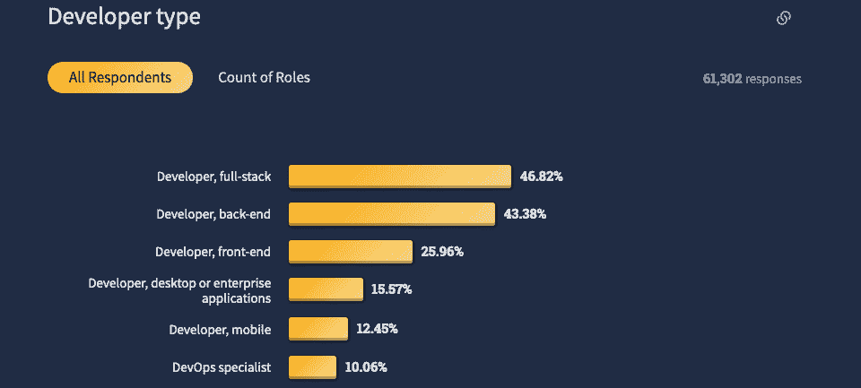
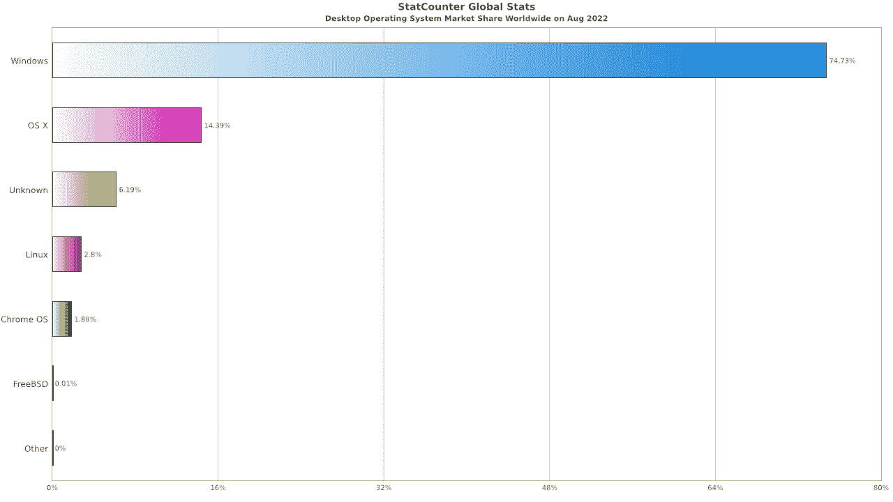
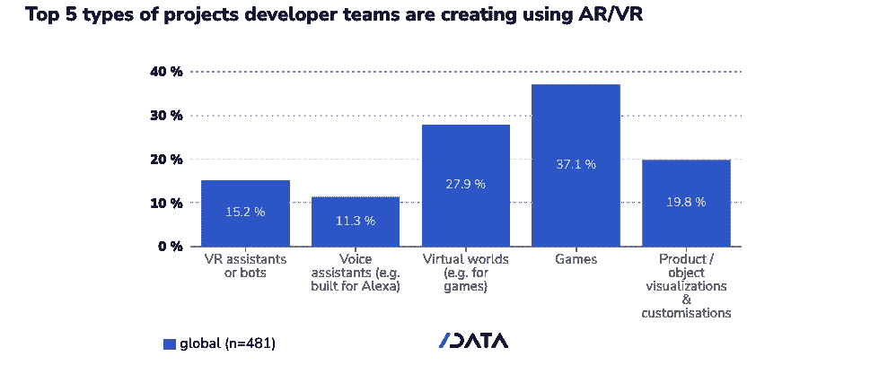

# 11 种类型的开发者(你会是哪一种？)

> 原文：<https://kinsta.com/blog/types-of-developers/>

说到“开发者”这个词，我们金士达想到的是“软件”不是，比如说，“房地产。”然而，即使是对计算机和代码的关注也为描述开发人员的类型留下了很大的空间。

我们可以根据开发人员使用的编程语言对他们进行分类——比如“ [JavaScript](https://kinsta.com/knowledgebase/what-is-javascript/) developer”或者“[Python](https://kinsta.com/blog/python-object-oriented-programming/)developer”——但是这并不能揭示他们在开发什么或者他们在开发过程中的角色。另外，开发人员了解多种语言是很常见的。

因此，我们将对开发人员类型使用一些被广泛接受的(更具描述性的)标签，并看看它们背后的任务和工具。

## 什么是开发者？

我们已经确定软件是我们开发人员故事的关键。这可以采取多种形式。

微软 [SQL Server](https://kinsta.com/blog/postgresql-vs-sql-server/#what-is-sql-server) 数据库软件背后的编程团队成员是一名开发人员。使用结构化查询语言处理存储在这种数据库中的信息的人也可以是开发人员。

一个开发者创造了嵌入在电路板中的计算机操作系统。另一个人编写 [Bash 脚本](https://kinsta.com/blog/scripting-languages/#8-bash)来自动化多个其他软件程序之间的交互。

> 需要在这里大声喊出来。Kinsta 太神奇了，我用它做我的个人网站。支持是迅速和杰出的，他们的服务器是 WordPress 最快的。
> 
> <footer class="wp-block-kinsta-client-quote__footer">
> 
> 
> 
> <cite class="wp-block-kinsta-client-quote__cite">Phillip Stemann</cite></footer>

[View plans](https://kinsta.com/plans/)

所有这些类型的开发人员都用代码构建了一些东西。

Code on screens. (Photo by [Fotis Fotopoulos](https://unsplash.com/@ffstop) on [Unsplash](https://unsplash.com/))

[Meet the developers! 😄 Dive into 11 different types of development work (and what the titles really mean) in this post 💪Click to Tweet](https://twitter.com/intent/tweet?url=https%3A%2F%2Fkinsta.com%2Fblog%2Ftypes-of-developers%2F&via=kinsta&text=Meet+the+developers%21+%F0%9F%98%84+Dive+into+11+different+types+of+development+work+%28and+what+the+titles+really+mean%29+in+this+post+%F0%9F%92%AA&hashtags=Developer%2CDeveloperLife)

## 有多少类型的开发者？

没有“官方”的开发人员职位描述列表。我们将使用一些通用术语来了解开发人员的工作，我们甚至将广泛的“web 开发人员”类别分成三个不同的角色。(我们承认:我们心里对建网站的人是有好感的。)

总之，我们将在这里回顾 11 种类型的开发人员。

### 1.前端 Web 开发人员

一个[前端开发者](https://kinsta.com/blog/frontend-developer/)专注于一个网站的用户界面。他们使用他们的 [HTML](https://kinsta.com/knowledgebase/what-is-html/) 和 [CSS](https://kinsta.com/blog/wordpress-css/) 技能来控制网站的外观和感觉，通常在[移动和桌面](https://kinsta.com/mobile-vs-desktop-market-share/)浏览器上适应不同的屏幕尺寸。

前端开发人员通常依靠 JavaScript 来为用户创建响应体验。这些开发人员通常熟悉 JavaScript 库和框架，它们可以加速面向客户端的动态应用程序的创建。

前端开发人员致力于提高网站性能，[优化图像](https://kinsta.com/blog/optimize-images-for-web/)，JavaScript 和标记，以加快浏览器的加载时间。大多数前端开发者也关注[搜索引擎优化](https://kinsta.com/seo/)和网站[无障碍](https://kinsta.com/blog/wordpress-accessibility/)。

所有这些都需要很多技能，一个[前端开发者的工资](https://kinsta.com/blog/front-end-developer-salary/)就能体现出来。

#### 前端开发人员是网页设计师吗？

许多前端开发人员也是设计师，但这不是“前端”头衔的要求。同样，许多网页设计师精通 HTML 和 CSS——可能会在模型中使用它们——但不认为自己是开发者。

对于许多组织来说，设计是品牌的一部分，包括网络以外的媒体。

不管是谁设计的，前端开发人员的工作就是将它在网页上呈现出来，并将用户体验的愿景转化为一个实用的应用程序。

### 2.后端 Web 开发人员

后端开发人员构建服务器端的应用程序，这些应用程序通常需要 web 服务器软件、数据库和运行它们的操作系统方面的专业知识。一个全开源的例子是[的 Linux 操作系统](https://kinsta.com/blog/linux-commands/)，一个[的 Nginx 或者 Apache](https://kinsta.com/blog/nginx-vs-apache/) 的网络服务器，以及一个[的 MariaDB 或者 PostgreSQL](https://kinsta.com/blog/mariadb-vs-postgresql/) 的数据库。

后端和前端开发之间的界限被像 T2 PHP T3 这样的技术模糊了，它只是一种服务器端脚本语言，在前端向浏览器发送 HTML。

PHP 是网络上最常见的服务器端脚本语言，它驱动了 WordPress 和其他流行的 CMS，以及像 T2 这样的开发框架。尽管如此，后端开发人员可能会使用 C#和微软的技术。NET 框架，Python， [Java](https://kinsta.com/blog/java-developer/) ， [Ruby on Rails，或者 Node.js](https://kinsta.com/blog/ruby-on-rails-vs-node-js/) 。

后端开发人员可以期望与负责网站面向客户端的团队成员协同工作。服务器端开发还可以包括创建支持前端服务的应用程序编程接口([API](https://kinsta.com/blog/microservices-vs-api/#what-is-an-api))，而不太需要双方的紧密耦合。

如果这听起来像是你的工作，你可能会对典型的[后端开发人员工资](https://kinsta.com/blog/backend-developer-salary/)感兴趣。

### 3.全栈 Web 开发人员

你可能已经猜到一个[全栈开发者](https://kinsta.com/blog/what-is-a-full-stack-developer/)做前端*和*后端开发者的工作。(不幸的是，这并不意味着一个典型的[全栈开发者的薪水](https://kinsta.com/blog/full-stack-developers-salary/)是其他人的两倍。)

尽管如此，掌握所有级别的 web 开发似乎都是有回报的。StackOverflow 在 2022 年对开发人员进行的一项调查发现，当受访者被要求[描述他们的角色](https://survey.stackoverflow.co/2022/#developer-profile-developer-roles)时，“全栈开发人员”是最受欢迎的回答(近 47%)。

Top types of developers types in 2022\. (Image source: [StackOverflow](https://survey.stackoverflow.co/2022/))

#### WordPress 开发者是全栈开发者吗？

Kinsta 的托管 WordPress hosting 的[特性允许任何精通 PHP 的人进行严肃的开发，而不需要深入挖掘服务器端的东西。](https://kinsta.com/features/)

安装在任何地方的 WordPress 对开发者都是友好的，它提供了一个庞大的 PHP 函数/方法库，这些函数/方法是一些常见的服务器端任务的抽象层。例如， [WordPress 开发者](https://kinsta.com/blog/wordpress-developer-salary/)不用写 SQL 就可以在关系数据库中存储和检索记录。他们可以将媒体上传保存到服务器的文件系统中，而无需了解 PHP 中实现这一切的核心功能。

“WordPress 开发者”在这里可以是一个独立的类别，但是我们必须为使用 CMS 产品的开发者做同样的事情，比如 Drupal、Joomla 和 DNN 以及 Laravel 等框架。NET，还有 Django。

许多 WordPress 开发者——特别是那些构建了 [WordPress 主题](https://kinsta.com/knowledgebase/what-is-a-wordpress-theme/)和[插件](https://kinsta.com/blog/php-testing-tools/)的开发者——拥有鼓舞人心的全栈印章。所以，问题“WordPress 开发者是全栈开发者吗？”就是:看情况。

### 4.移动应用开发者

术语“应用程序”涵盖了软件开发的许多领域。从桌面到网络，应用程序是为最终用户完成工作的工具。

当简称为“应用程序”时，就像“有一个应用程序可以做到这一点！”—我们倾向于首先想到在智能手机、平板电脑和其他移动设备上运行的应用程序。创建移动应用程序需要专业类型的开发人员。

移动应用程序开发人员熟悉软件开发工具包(SDK)和相关工具，用于为设备操作系统构建应用程序，如苹果的 iOS 或谷歌的 Android。

Swift 是 iOS 的原生编程语言，而 Java 和 Kotlin 是 Android 最常用的语言。此外，一个庞大的应用构建工具生态系统，如 [Apache Cordova](https://cordova.apache.org/) 和 [NativeScript](https://nativescript.org/) ，可以将基于网络友好的 JavaScript、HTML 和 CSS 的代码转化为本地移动软件。

当我们查看应用程序开发人员的平均工资时，我们发现那些为移动平台开发的人比那些专注于桌面或网络的人赚得稍多。

### 5.桌面软件开发商

桌面开发人员创建在个人计算机和工作站上运行的软件应用程序。

## 注册订阅时事通讯

### 想知道我们是怎么让流量增长超过 1000%的吗？

加入 20，000 多名获得我们每周时事通讯和内部消息的人的行列吧！

[Subscribe Now](#newsletter)

开发人员通常为特定的操作系统开发桌面应用程序，因此该领域的活动反映了微软的 Windows、苹果的 macOS、谷歌的 Chrome OS 和开源操作系统 Linux 等平台的相对市场份额。

Statcounter 利用从全球网站访问量中收集的数据，在 2022 年 8 月估计 Windows 在桌面操作系统中占有 74%的市场份额。

Desktop operating system market share, August 2022\. (Image source: [Statcounter](https://gs.statcounter.com/os-market-share/desktop/worldwide/#monthly-202208-202208-bar))

开发人员可能会使用集成开发环境(IDE)工具进行编程，以便快速编辑、调试和编译源代码。

桌面应用程序编程的流行语言包括 C#、C++、Swift 和 Java。

桌面软件在本地运行，但现代应用程序可能会使用互联网连接来完成从产品更新到通过[云存储](https://kinsta.com/blog/what-is-cloud-storage/)共享数据的任务。

### 6.数据科学家(大数据开发人员)

人类通过日常生活帮助产生大量数据:在杂货店结账、网上冲浪、开车经过交通摄像头、使用手机——甚至投票。我们已经建立了记录自然现象数据的系统，如天气、地震和来自太空的电磁信号。

数据科学家是一个拥有计算机的数学奇才，他可以发现所有信息中的模式。

这些开发人员很有可能使用 Python 编程语言或更专业的语言，比如 R、Scala 或 Julia。

“大数据”通常出现在关系数据库中，因此数据科学家的编程工具箱中可能会有 SQL。

### 7.人工智能/机器学习开发者

人工智能(AI)软件开发人员试图模仿人类的行为，如决策。添加机器学习(ML)，应用程序可以随着时间的推移变得更加智能。

AI/ML 应用程序通常使用复杂的算法处理大量数据，因此该领域的开发人员通常是数据科学家。

市场研究公司 IDC 发现，2021 年全球人工智能相关应用程序、硬件和服务的收入超过 3830 亿美元，比 2020 年增长近 21%。

Struggling with downtime and WordPress problems? Kinsta is the hosting solution designed to save you time! [Check out our features](https://kinsta.com/features/)

客户关系管理软件和企业资源管理软件约占人工智能增强应用收入的 65%。

Value of AI software worldwide, 2020 vs. 2021\. (Image source: [IDC](https://www.idc.com/getdoc.jsp?containerId=prUS49670122))

### 8.游戏开发商

电脑游戏开发人员代表了广泛的技能。

他们的软件可以在桌面、移动设备、控制台或网络浏览器上运行。故事情节适应不同的游戏类型，如军事或体育模拟，第一人称射击，战略或角色扮演。然后大概就是 3D 图形，音乐，音效。

在一个与互联网相连的游戏世界中，大型多人游戏的开发者面临着与最繁忙的电子商务网站一样苛刻的后端服务器和数据库要求。

游戏开发者通常拥有 3D 渲染工具和其他动画相关软件的专业知识。

此外，专注于前沿技术，SlashData 的 Developer Nation 最近的开发者调查显示，略高于 37%的增强现实(AR)或虚拟现实(VR)应用程序是 AR/VR 游戏。还有 27.9%的项目涉及构建虚拟世界——有些是为了游戏。

Types of development using AR/VR. (Image source: [SlashData’s Developer Nation](https://www.developernation.net/developer-reports/de20))

### 9.操作系统开发者

虽然成千上万的开发人员在最流行的操作系统上工作——为 Linux 做出贡献或受雇于微软、苹果或谷歌——但这仍然是一个排外的群体。毕竟，SlashData 表示，其调查显示，全球开发者总数超过 2400 万。

你的冰箱很可能有一个操作系统，但流行的计算机操作系统需要大型开发团队的努力，其中大多数人都在从事整个项目的较小部分。

大多数操作系统的核心是内核，它管理对 CPU、内存、文件系统和 I/O 设备的访问。c 是微软视窗、苹果 macOS 和 Linux 内核的主要编码语言。还用的是一些汇编写的低级代码。

而 Android 内核是从 Linux 内核演化而来的。

在内核之上，操作系统有驱动程序来管理各种硬件设备和应用程序，以便进行系统管理。然后是系统的图形用户界面。开发人员可能会使用 C、C++、Objective C (macOS)，甚至 Python (Linux)来开发这些组件。

### 10.DevOps 工程师

一名 [DevOps 工程师](https://kinsta.com/blog/devops-engineer/)管理工具和工作流，使软件从开发阶段快速可靠地发布到公开发布。

“DevOps”是单词“开发”和“操作”的合并，从业者自动化重复的软件开发任务——从管理代码到测试、部署、监控、维护和故障排除。

这些工程师采用一套 [DevOps 工具](https://kinsta.com/blog/devops-tools/)来帮助加快软件发布周期，管理项目代码库的各种版本，并确认最终产品按预期工作。

当用于 web 开发时，DevOps 过程还可以确保应用程序所需的资源可用，并在 web 服务器上正确配置。

DevOps 需要高级技能，DevOps 工程师的薪水通常反映了这一点。

### 11.安全开发人员(SecDevOps)

安全开发人员构建工具并管理测试软件和计算机系统安全性的过程。

在软件开发中，安全性通常是 DevOps 过程的一个组成部分。在那种环境中专注于安全性的人可能被称为 SecDevOps 工程师。

安全开发人员致力于保护软件和计算机系统免受网络安全攻击和威胁。他们使用各种工具，包括像 Python、Bash 和 Ruby 这样的脚本语言，来自动化重复的任务。

安全开发人员必须深入了解他们试图保护的软件和系统。

## 你想成为什么类型的开发人员？

如果你想成为一名开发人员，我们有一些信息可以帮助你采取下一步行动。你可以阅读关于学习最佳编程语言的文章，或者深入学习 T2 的 PHP 和 T4 的 JavaScript 教程。

也许你会有兴趣了解成为一名 Laravel 开发者需要什么，或者关注学习世界上最受欢迎的 CMS——WordPress——的 T2。

然后，也许有一天，你会加入我们在金士达的职业生涯。

[有没有想过开发者到底是做什么的？👀(提示:很多，而且各不相同！)在本指南中了解更多信息💪 点击推文](https://twitter.com/intent/tweet?url=https%3A%2F%2Fkinsta.com%2Fblog%2Ftypes-of-developers%2F&via=kinsta&text=Ever+wondered+what+developers+really+do%3F+%F0%9F%91%80%28Hint%3A+it%27s+a+lot%2C+and+it+varies%21%29+Learn+more+in+this+guide+%F0%9F%92%AA&hashtags=Developer%2CDeveloperLife)

## 摘要

这是对 11 类开发人员的观察，他们的角色非常不同，足以突出他们领域中的各种任务。

尽管如此，许多开发人员扮演着不止一个角色，而且大多数都熟悉多种编程或脚本语言。也许这就是为什么我们永远不会就开发人员类型的“官方”列表达成一致。

与此同时，如果你有一个想要启动的基于网络的项目，你可能想要探索 Kinsta 的[应用程序托管和数据库托管](https://kinsta.com/application-hosting/)解决方案。

* * *

让你所有的[应用程序](https://kinsta.com/application-hosting/)、[数据库](https://kinsta.com/database-hosting/)和 [WordPress 网站](https://kinsta.com/wordpress-hosting/)在线并在一个屋檐下。我们功能丰富的高性能云平台包括:

*   在 MyKinsta 仪表盘中轻松设置和管理
*   24/7 专家支持
*   最好的谷歌云平台硬件和网络，由 Kubernetes 提供最大的可扩展性
*   面向速度和安全性的企业级 Cloudflare 集成
*   全球受众覆盖全球多达 35 个数据中心和 275 多个 pop

在第一个月使用托管的[应用程序或托管](https://kinsta.com/application-hosting/)的[数据库，您可以享受 20 美元的优惠，亲自测试一下。探索我们的](https://kinsta.com/database-hosting/)[计划](https://kinsta.com/plans/)或[与销售人员交谈](https://kinsta.com/contact-us/)以找到最适合您的方式。