# 223:来自社区的一个新的默认主题

> 原文：<https://kinsta.com/blog/twenty-twenty-three-theme/>

223 是 WordPress 6.1 推出的全新默认主题。

这是一个没有图片或附加功能的极简主义主题。它尽最大努力作为一个开始主题来构建模板和风格变化，并测试 WordPress 最新版本引入的所有功能。这个主题可以被视为一个真正的开发和测试环境，尽管极简风格、响应性和轻便性使它成为创建适合各种用途的博客和网站的一个好选择。

在他对 222 个主题的介绍中，Kjell Reigstad 谈到了 T2 默认主题的未来:

> 像 theme.json、块模板和块模式这样的创新使得主题开发变得更加简单，并且为用户定制他们的站点提供了新的方法。有理由相信，在未来几年，社区可以利用所有这些为我们的用户构建更频繁、更多样的主题和定制解决方案。

Channing Ritter 提出了[以下建议](https://make.wordpress.org/design/2022/07/19/proposal-a-new-kind-of-default-theme/):

> 如果我们不强调主题本身，而是强调一组由社区成员设计的固执己见的风格变化，会怎么样？我们可以使用 Twenty Twenty 2 作为一个新主题的基础，这个主题是精简的，是一个空白的画布，让各种风格的变化闪闪发光。

这就是新的 223 默认主题所发生的事情。社区被号召积极参与设计默认的 WordPress 主题，我们喜欢这样，因为它使新的主题成为真正参与性工作的结果。

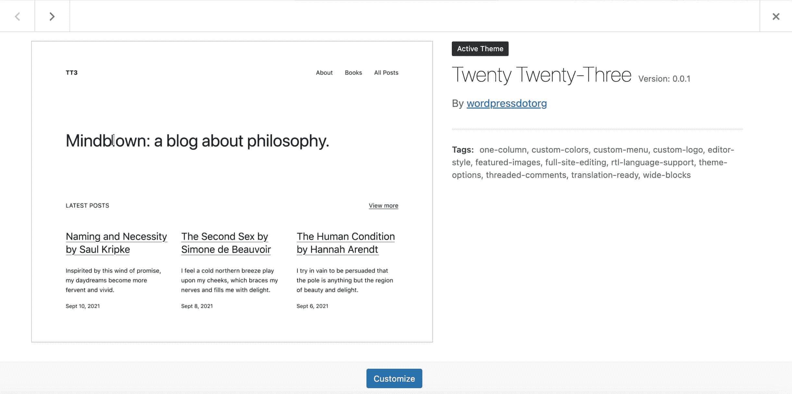

Twenty Twenty-Three preview


[Lightweight, flexible and with a set of stunning style variations from the community 👩‍🎨 Meet Twenty Twenty-Three, the new default WordPress theme landing with WordPress 6.1 🛬Click to Tweet](https://twitter.com/intent/tweet?url=https%3A%2F%2Fkinsta.com%2Fblog%2Ftwenty-twenty-three-theme%2F&via=kinsta&text=Lightweight%2C+flexible+and+with+a+set+of+stunning+style+variations+from+the+community+%F0%9F%91%A9%E2%80%8D%F0%9F%8E%A8+Meet+Twenty+Twenty-Three%2C+the+new+default+WordPress+theme+landing+with+WordPress+6.1+%F0%9F%9B%AC&hashtags=WebDesign%2CWordPress)

但是在揭示新的 WordPress 默认主题的风格变化之前，让我们先了解一下 Twenty Twenty 3 的基本特征和它的适用范围。


> Kinsta 把我宠坏了，所以我现在要求每个供应商都提供这样的服务。我们还试图通过我们的 SaaS 工具支持达到这一水平。
> 
> <footer class="wp-block-kinsta-client-quote__footer">
> 
> 
> 
> <cite class="wp-block-kinsta-client-quote__cite">Suganthan Mohanadasan from @Suganthanmn</cite></footer>

[View plans](https://kinsta.com/plans/)

## 页面布局和样式

如上所述，223 是 222 的精简版。新的默认主题最引人注目的是它的简单和轻便。223 是灵活的，非常适合古腾堡最新的网站编辑功能，如模板编辑、[全球风格](https://kinsta.com/blog/wordpress-5-9/#global-styles-a-graphic-interface-for-themejson)变化、[流体排版](https://kinsta.com/blog/wordpress-6-1/#fluid-typography)和[块模式](https://kinsta.com/blog/wordpress-5-5/#block-patterns)。

因此，毫不奇怪，在本文的截图中，您将看到最少的页面，没有任何花哨的功能，但非常适合定制和测试。

举例来说，下图显示了带有和不带有特色图片的单个帖子页面。

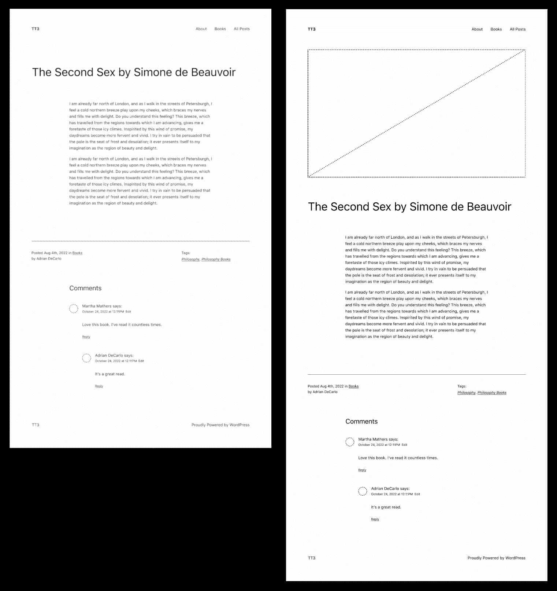

Single post preview with and without featured image in Twenty Twenty-Three


下图比较了主页和归档页面。

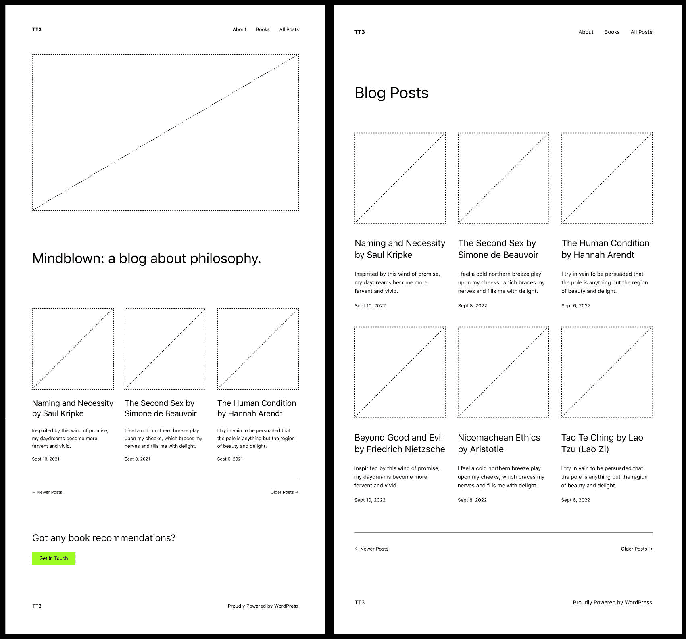

Home page compared to archive page in Twenty Twenty-Three


即使新主题是 222 的简化版本，与之前的默认主题相比，223 也有一些关键的不同。

首先，标题的大小已经减小，默认的衬线字体已经被一个系统无衬线字体所取代。

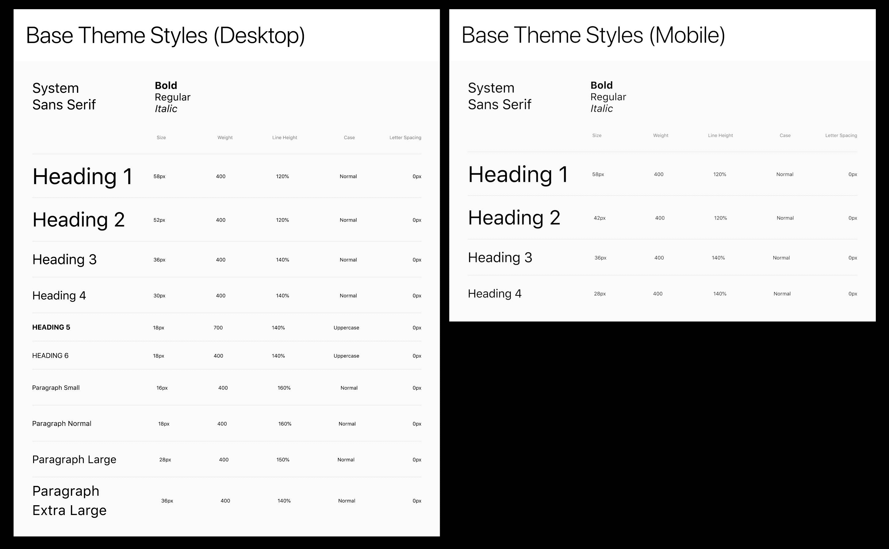

Heading sizes in Twenty Twenty-Three


此外，还应用了不同的调色板。您可以在下面来自 *theme.json* 的代码中看到新的 Twenty 23 调色板定义:

```
{
	"settings": {
		"appearanceTools": true,
		"color": {
			"palette": [
				{
					"color": "#ffffff",
					"name": "Base",
					"slug": "base"
				},
				{
					"color": "#000000",
					"name": "Contrast",
					"slug": "contrast"
				},
				{
					"color": "#9DFF20",
					"name": "Primary",
					"slug": "primary"
				},
				{
					"color": "#345C00",
					"name": "Secondary",
					"slug": "secondary"
				},
				{
					"color": "#F6F6F6",
					"name": "Tertiary",
					"slug": "tertiary"
				}
			]
		},
	}
}
```

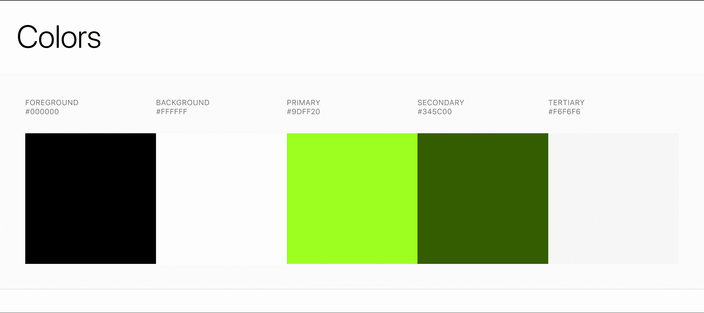

Twenty Twenty-Three default colors


但是新的默认主题的主要特点是它的风格变化。Twenty Twenty 3 有十种全球风格变化，每一种都展示了不同的颜色、字体系列和字体大小的组合。

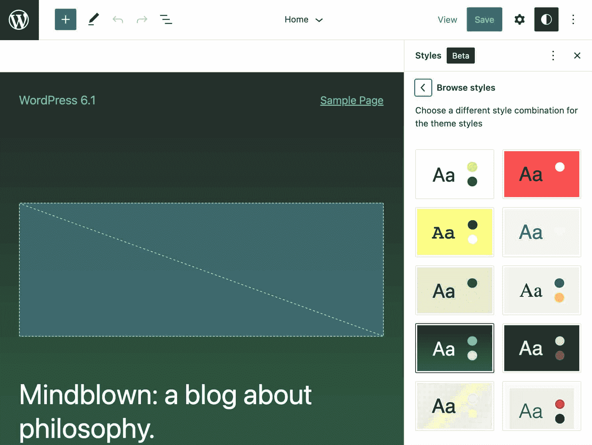

Twenty Twenty-Three Global Styles


您将在 223 个*样式*文件夹中找到相应的 JSON 文件。

Figma 上提供了 223 个页面模板、样式和样式变体的完整预览。

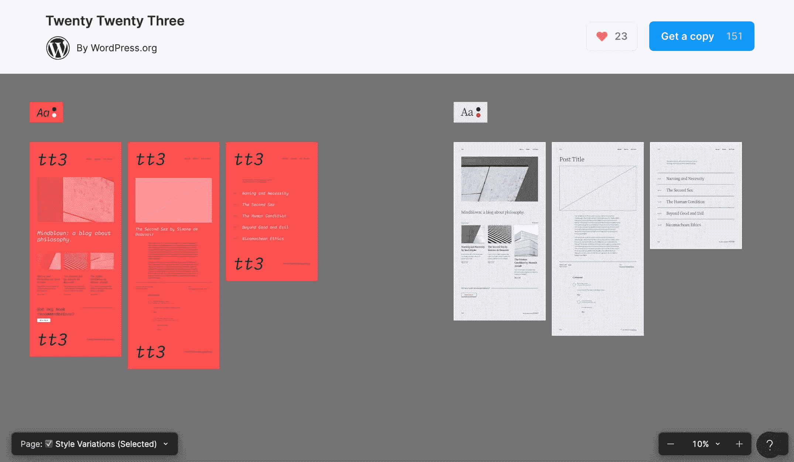

二十图马上的二十三种风格变奏预告


## 223 印刷术

在像 23 这样的最小主题中，排版在使文本可读、网站吸引人以及最终为访问者提供有益的浏览体验方面起着关键作用，不管设备和屏幕大小如何。

为此，Twenty Twenty 3 提供了一套新的字体系列，并使用了 WordPress 6.1 引入的流畅排版。

### 字体

Twenty Twenty 3 采用了一套新的字体，用于各种风格，其特点是简单和多样:

*   *系统字体*–`var(--wp--preset--font-family--system-font)`
*   *IBM Plex Mono*–`var(--wp--preset--font-family--ibm-plex-mono)`
*   国际米兰–`var(--wp--preset--font-family--inter)`
*   *Source Serif Pro*–`var(--wp--preset--font-family--source-serif-pro)`
*   *DM 无*——`var(--wp--preset--font-family--dm-sans)`

**IBM Plex Mono** 是 [IBM Plex](https://github.com/IBM/plex) 字体集的一部分，这是在 SIL 开放字体许可( [OFL](https://scripts.sil.org/cms/scripts/page.php?site_id=nrsi&id=ofl) )下发布的新的 IBM 公司字体。你可以在 Adobe 字体网站和 IBM 网站上看到它的预览。

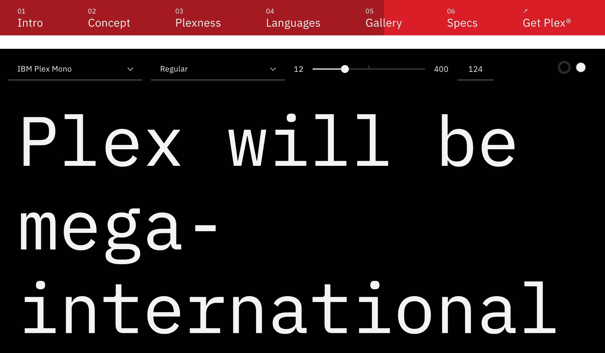

IBM Plex Mono gallery on [ibm.com](https://www.ibm.com/plex/gallery/)


Inter 是一个由 Rasmus Andersson 为电脑屏幕精心设计的[免费开源字体家族。你可以在](https://github.com/rsms/inter)[拉斯姆斯安德森的网站](https://rsms.me/inter/)或[谷歌字体](https://fonts.google.com/specimen/Inter)上预览和下载该字体家族。

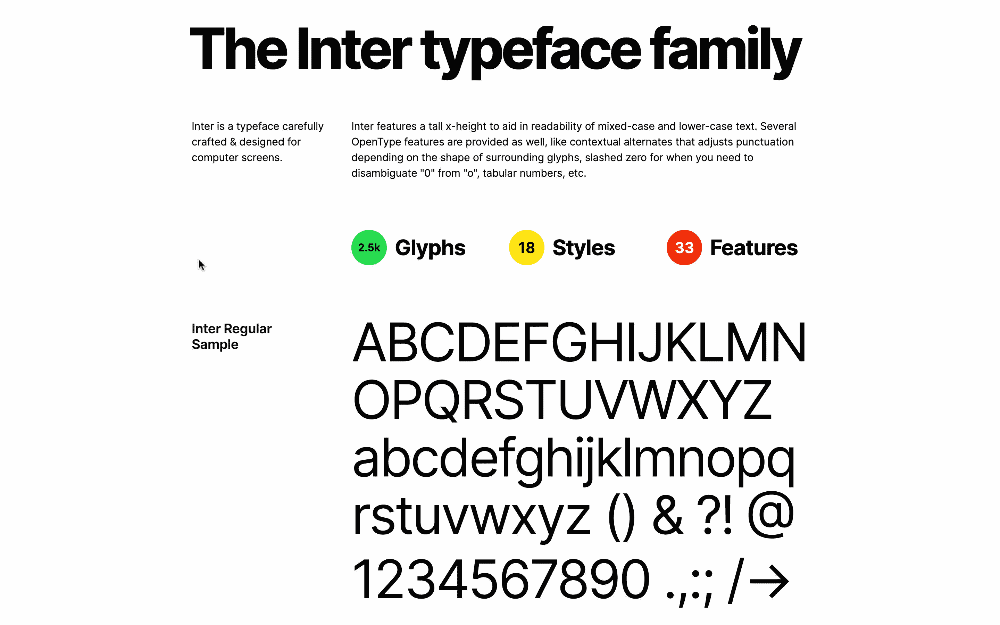

Inter typeface preview on [Rasmus Andersson’s website](https://www.ibm.com/plex/gallery/)


**Source Serif Pro** 是来自 [Adobe Originals](https://fonts.adobe.com/fonts/source-serif) 的字体，你可以通过 Adobe Fonts 账户免费使用它(阅读更多关于 [Adobe 字体许可](https://helpx.adobe.com/fonts/using/font-licensing.html))。

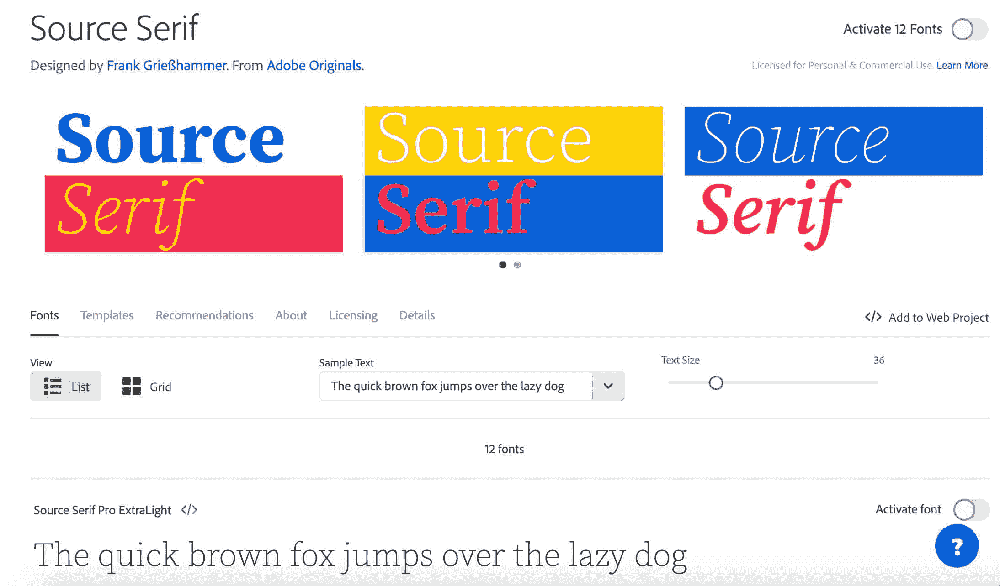

Source Serif Pro preview on [fonts.adobe.com](https://fonts.adobe.com/fonts/source-serif#fonts-section)


**DM Sans** 是 SIL 开放字体许可证( [OFL](https://scripts.sil.org/cms/scripts/page.php?site_id=nrsi&id=ofl) )下授权的另一种字体，是由谷歌从松香铸造厂委托[设计的，由松香铸造厂、Jonny Pinhorn 和 Indian Type Foundry 设计。](https://fonts.google.com/specimen/DM+Sans/about)

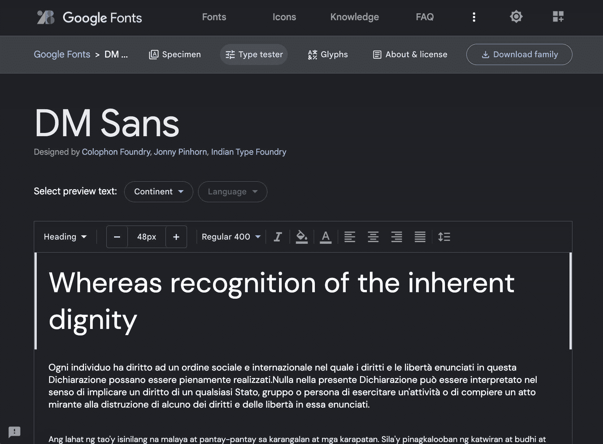

DM Sans 上预览[谷歌字体](https://fonts.google.com/specimen/DM+Sans)


### 流畅的排版和间距

223 用途[流体排版](https://github.com/WordPress/gutenberg/pull/39529)和间距预设[随 WordPress 6.1](https://kinsta.com/blog/wordpress-6-1/#fluid-typography) 推出。

新的默认 WordPress 主题提供了一个在 WordPress 主题中实现流畅排版的很好的例子，你可以用它作为一个模板在你的主题中增加对这个特性的支持。

下面的代码展示了 *theme.json* 中的`settings.typography.fluid`和`settings.typography.fontSizes[]`属性定义:

```
"settings": {
	...
	"typography": {
		"fluid": true,
		"fontSizes": [
			{
				"fluid": {
					"min": "0.875rem",
					"max": "1rem"
				},
				"size": "1rem",
				"slug": "small"
			},
			{
				"fluid": {
					"min": "1rem",
					"max": "1.125rem"
				},
				"size": "1.125rem",
				"slug": "medium"
			},
			{
				"size": "1.75rem",
				"slug": "large",
				"fluid": false
			},
			{
				"size": "2.25rem",
				"slug": "x-large",
				"fluid": false
			},
			{
				"size": "10rem",
				"slug": "xx-large",
				"fluid": {
					"min": "4rem",
					"max": "20rem"
				}
			}
		]
	}
}
```

`typography.fluid`设置增加了对流畅排版的支持，而`typography.fontSizes[].fluid`设置最小和最大字体大小值。

除了流体排版，23 还支持[流体间距](https://github.com/WordPress/gutenberg/pull/41527)。

在 WordPress 6.1 之前，只能在编辑器中设置自定义间距值。这意味着在 WordPress 6.1 之前，主题作者不能为填充、边距和间距指定固定值。这导致了一些限制。例如，当在不同站点之间复制和粘贴内容和块模式时，不可能容易地在不同主题之间转移间距设置或保持间距值。

主题可以使用新的`spacing.spacingScale`和`spacing.spacingSizes`设置声明流体间距支持(在 [Theme.json:添加间距大小预设](https://github.com/WordPress/gutenberg/pull/41527)中了解更多)。在 2023 年，这是通过以下设置完成的:

```
"settings": {
	"spacing": {
		"spacingScale": {
			"steps": 0
		},
		"spacingSizes": [
			{
				"size": "clamp(1.5rem, 5vw, 2rem)",
				"slug": "30",
				"name": "30"
			},
			{
				"size": "clamp(1.8rem, 1.8rem + ((1vw - 0.48rem) * 2.885), 3rem)",
				"slug": "40",
				"name": "40"
			},
			{
				"size": "clamp(2.5rem, 8vw, 6.5rem)",
				"slug": "50",
				"name": "50"
			},
			{
				"size": "clamp(3.75rem, 10vw, 7rem)",
				"slug": "60",
				"name": "60"
			},
			{
				"size": "clamp(5rem, 5.25rem + ((1vw - 0.48rem) * 9.096), 8rem)",
				"slug": "70",
				"name": "70"
			},
			{
				"size": "clamp(7rem, 14vw, 11rem)",
				"slug": "80",
				"name": "80"
			}
		],
		"units": [
			"%",
			"px",
			"em",
			"rem",
			"vh",
			"vw"
		]
	}
}
```

下面的视频展示了 2023 年的流动印刷技术。

## 注册订阅时事通讯


### 想知道我们是怎么让流量增长超过 1000%的吗？

加入 20，000 多名获得我们每周时事通讯和内部消息的人的行列吧！

[Subscribe Now](#newsletter)<video class="wp-video-shortcode" id="video-133254-1" width="1280" height="720" preload="metadata" controls="controls"><source type="video/mp4" src="https://kinsta.com/wp-content/uploads/2022/09/tt3-fluid-typography-1280.mp4?_=1">[https://kinsta.com/wp-content/uploads/2022/09/tt3-fluid-typography-1280.mp4](https://kinsta.com/wp-content/uploads/2022/09/tt3-fluid-typography-1280.mp4)</video>

您可以在[设计规范](https://github.com/WordPress/twentytwentythree/blob/trunk/DESIGN-SPEC.md)中检查排版和间距预设。
T3】

## 模板和模板部件

有了 Twenty Twenty 3，你会看到 WordPress 6.1 的所有功能和网站编辑的改进。

对于模板和模板部件来说尤其如此。

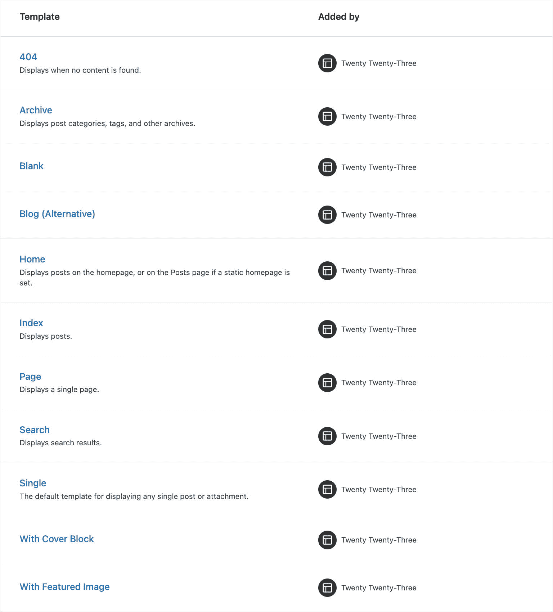

Twenty Twenty-Three Templates


当您在您的网站上运行 Twenty Twenty-Three 来启动站点编辑器时，您将看到一个包含 11 个模板和 4 个模板部件的列表。

下图显示了站点编辑器中的 [404 模板](https://kinsta.com/blog/wordpress-template-hierarchy/)。


Twenty Twenty-Three 404 page template


你会在二十个二十三的*模板*和*部件*文件夹中找到相应的 HTML 文件。

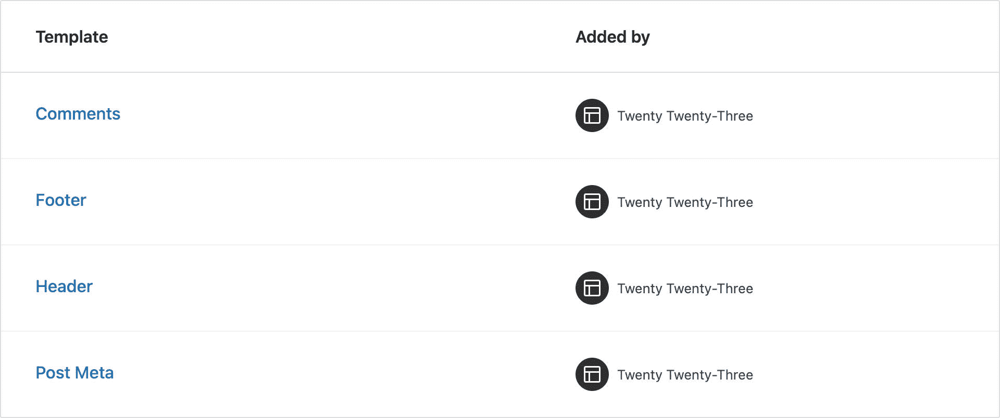

Twenty Twenty-Three Template parts


下图显示了编辑模式下的注释模板部件:

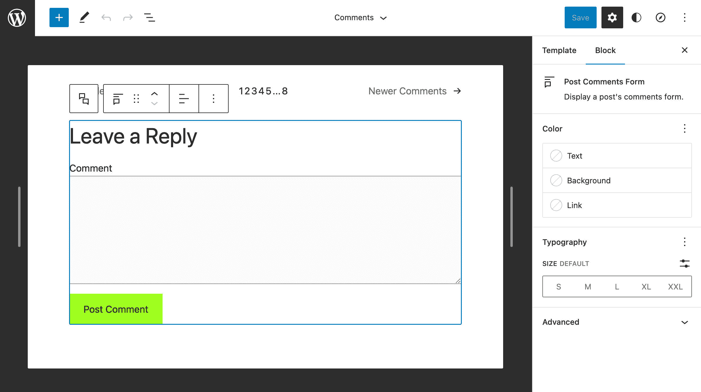

Editing the Comments template part


您会发现在 *theme.json* 中定义的定制模板和模板部件。

### 自定义模板

除了默认模板，Twenty Twenty-Three 还提供了以下自定义模板:

*   空白的
*   博客(另类)
*   Four hundred and four
*   带有特色图像
*   带盖块

这些模板在 *theme.json* 中定义如下:

Struggling with downtime and WordPress problems? Kinsta is the hosting solution designed to save you time! [Check out our features](https://kinsta.com/features/)

```
{
	"customTemplates": [
		{
			"name": "blank",
			"postTypes": [
				"page",
				"post"
			],
			"title": "Blank"
		},
		{
			"name": "blog-alternative",
			"postTypes": [
				"page"
			],
			"title": "Blog (Alternative)"
		},
		{
			"name": "404",
			"postTypes": [
				"page"
			],
			"title": "404"
		},
		{
			"name": "with-featured-image",
			"postTypes": [
				"page",
				"post"
			],
			"title": "With Featured Image"
		},
		{
			"name": "with-cover-block",
			"postTypes": [
				"page",
				"post"
			],
			"title": "With Cover Block"
		}
	],
}
```

### 模板部件

模板部件定义如下。

```
{
	"templateParts": [
		{
			"area": "header",
			"name": "header",
			"title": "Header"
		},
		{
			"area": "footer",
			"name": "footer",
			"title": "Footer"
		},
		{
			"area": "uncategorized",
			"name": "comments",
			"title": "Comments"
		},
		{
			"area": "uncategorized",
			"name": "post-meta",
			"title": "Post Meta"
		}
	]
}
```

## 全局样式和样式变体

如上所述，[从 WordPress 6.0](https://kinsta.com/blog/wordpress-6-0/#global-styles-switching) 开始，主题作者可以将[多组风格](https://make.wordpress.org/design/2022/07/19/proposal-a-new-kind-of-default-theme/)与他们的主题捆绑在一起，使用户能够在风格变化之间切换，而无需改变他们的主题。

这个伟大的 WordPress 特性是新的默认主题的主要特征，因为 Twenty Twenty 3 提供了 10 个预置的风格组合供选择。


Twenty Twenty-Three Global Styles


您可以在站点编辑器的全局样式界面中浏览这些样式。在这里你可以

*   从**浏览样式**面板切换全局样式。
*   自定义排版设置–文本、链接、标题和按钮
*   编辑默认颜色或更改特定元素的颜色
*   自定义主要内容区域的布局
*   自定义特定元素的外观

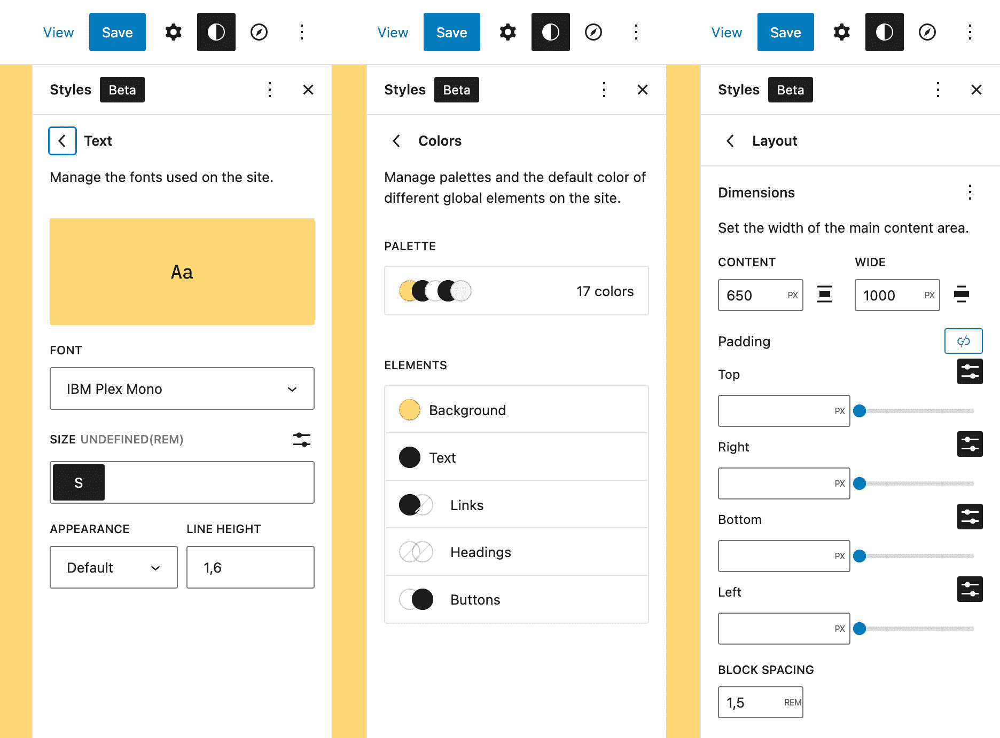

Customizing text, colors, and layout in Twenty Twenty-Three


再次值得注意的是，在如此多的风格变化的创造中，社区的参与是至关重要的。在[223 个项目启动](https://make.wordpress.org/design/2022/08/10/twenty-twenty-three-default-theme-project-kickoff/)之后，收到了来自 8 个不同国家的 19 个贡献者的 38 份提交材料(你可以在 GitHub 上探索所有项目[)。](https://github.com/WordPress/twentytwentythree/issues)

从 38 个款式中，[选出了 10 个款式变化](https://make.wordpress.org/design/2022/09/07/tt3-default-theme-announcing-style-variation-selections/):

*   [Pitch](https://github.com/WordPress/twentytwentythree/pull/66) 是默认风格的深色版本，使用了 Rasmus Andersson 的 [Inter 字体家族](https://fonts.google.com/specimen/Inter)。

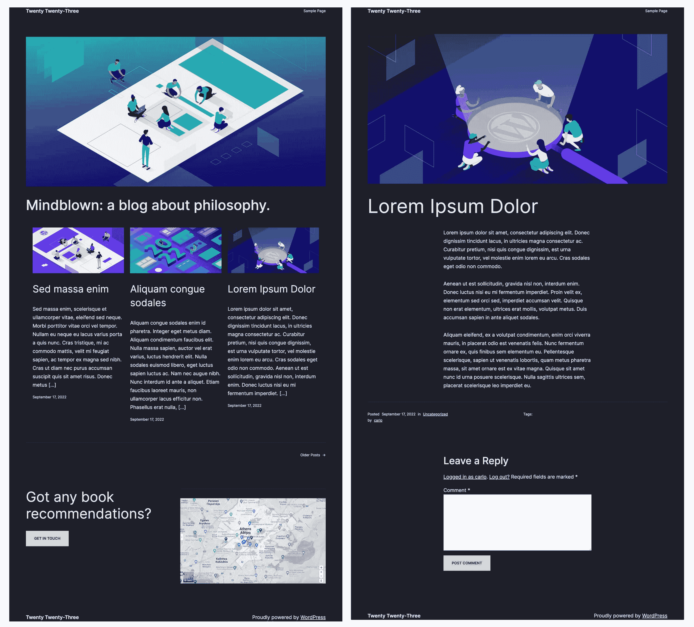

Pitch is a dark variation of Twenty Twenty-Three


*   [Canary](https://github.com/WordPress/twentytwentythree/issues/152) 使用单一字体大小和窄列宽。它还使用了一个有趣的边界半径效果。

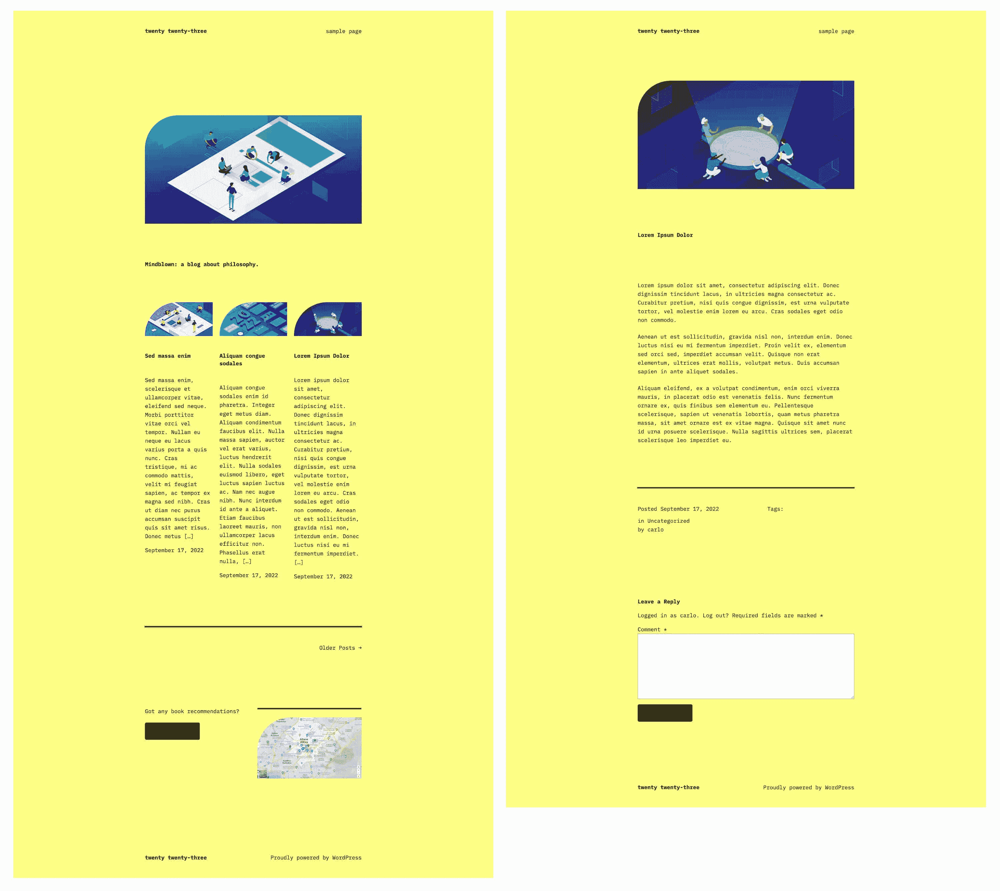

Canary uses a single type size and a narrow column width


*   [Electric](https://github.com/WordPress/twentytwentythree/issues/168) 对整个网站的所有排版都使用粗体颜色。
*   [朝圣](https://github.com/WordPress/twentytwentythree/issues/134)是基地主题的彩色黑暗版。
*   [金盏花](https://github.com/WordPress/twentytwentythree/issues/137)是基本款的一种柔和宜人的变体。
*   [遮光](https://github.com/WordPress/twentytwentythree/issues/125)在图像上具有双色调效果。
*   Whisper 展示了一些定制元素，比如页面边缘的边框、按钮样式和独特的链接下划线。
*   冰冻果子露有着独特的明亮多彩的外观

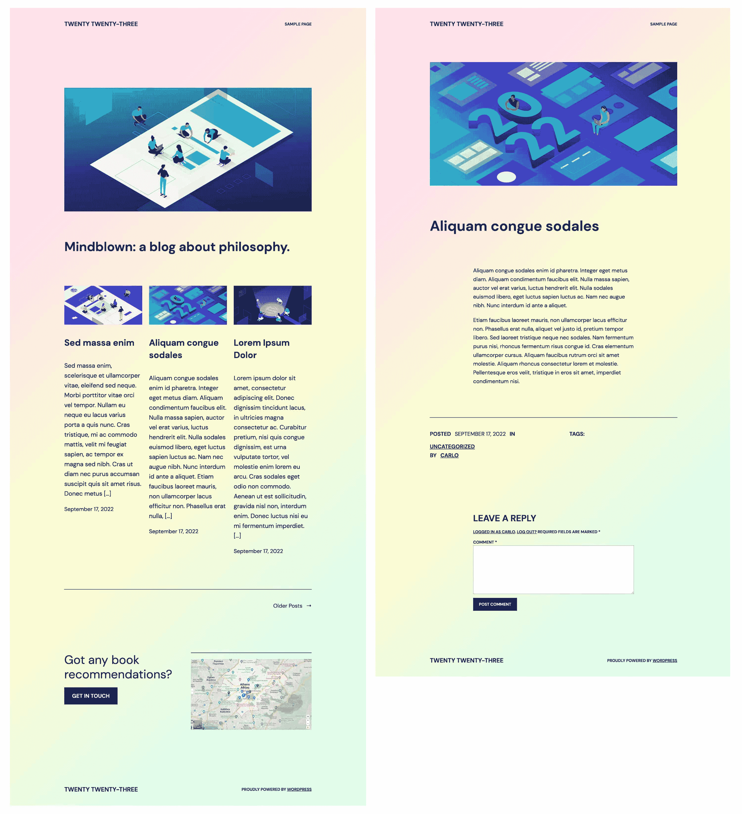

Sherbet has a unique colorful look


*   葡萄因其令人愉悦的调色板和字体组合而被选中。

关于风格变化最酷的事情是，你不一定要成为一个前端开发人员来创建你的风格。

如果你觉得编码很舒服，你可以选择其中一个*。json* 文件在 223*风格*文件夹中找到，并使用它作为模板来构建你的风格变化。

但是[如果编码不是你的事情](https://kinsta.com/blog/wordpress-page-builders/)，你可以使用官方的[创建区块主题](https://wordpress.org/plugins/create-block-theme/)插件，你可以从 WordPress.org 插件目录免费下载。

首先，安装并激活插件，然后导航到样式编辑器。在这里，根据您的喜好自定义颜色、排版和布局，并保存您的更改。

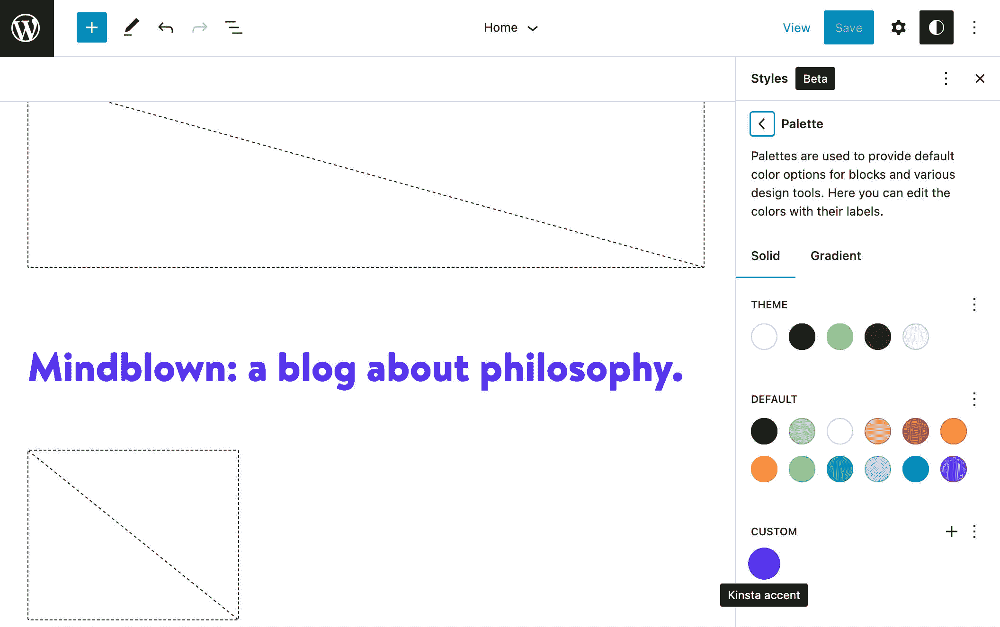

Customizing styles in the Global Styles interface


一旦你对你的改变感到满意，在 WordPress 管理菜单的**外观**下找到**创建区块主题**。

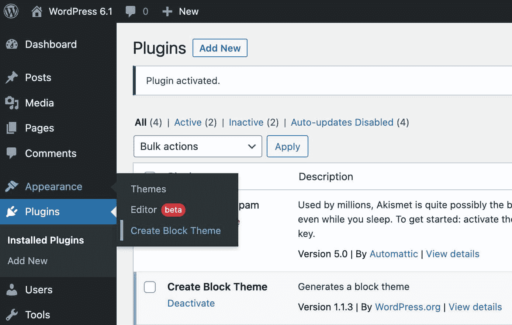

Create Block Theme menu item


检查列表中的最后一项:**创建一个样式变体**。您将被要求为您的风格变体指定一个名称。输入名字并点击**创建主题**。这将创造一个新的*。主题的*样式*文件夹中的 json* 文件。

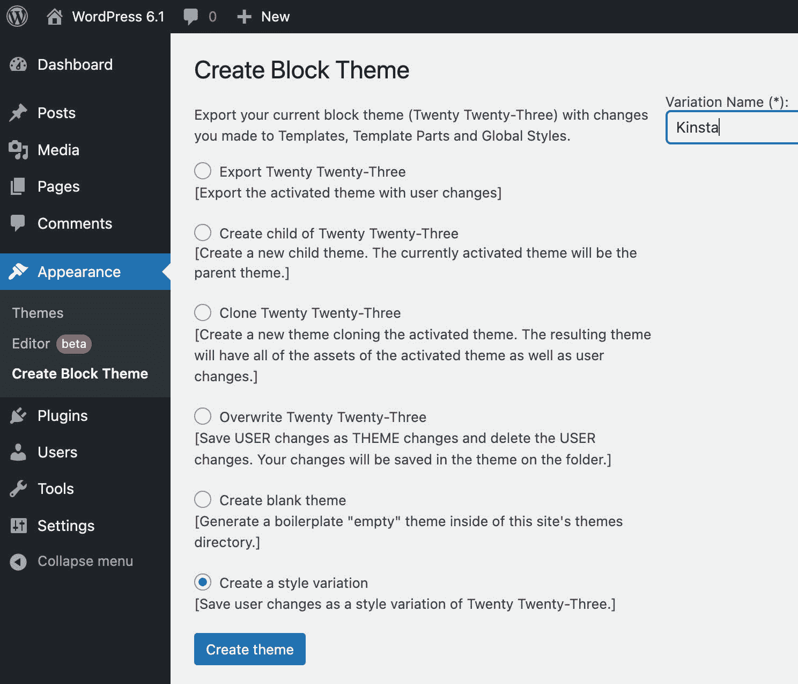

Create a style variation


现在你可以进一步定制你的风格，甚至导出到其他 WordPress 安装。

创建块主题插件是一个有价值的工具，可以充分利用 WordPress 最新版本的主题和模板创建功能。当你这么做的时候，你可以看看所有其他的选项:

*   出口 223
*   创建 223 的孩子
*   克隆 223
*   覆盖 223
*   创建空白主题
*   创建样式变体

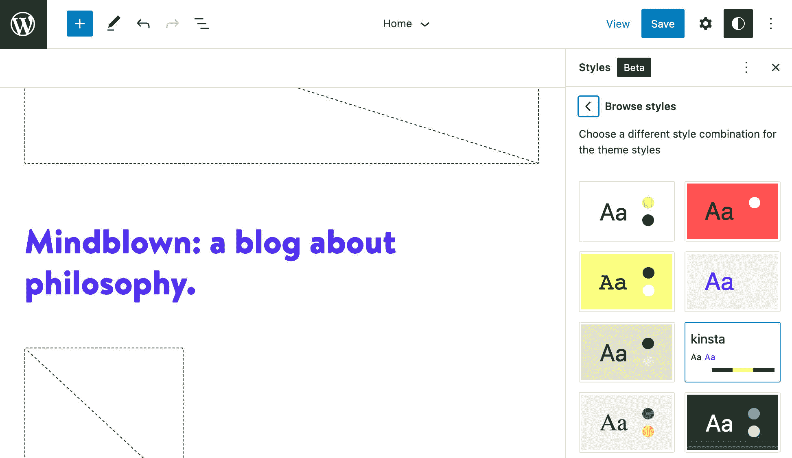

A custom style variation appears in the style browser


## 摘要

虽然乍一看，新的默认 WordPress 主题可能看起来像一种毫无特色的空盒子，但仔细观察，它远不止如此，因为它允许你充分利用最新的 WordPress 站点编辑功能。

在 2023 年，你会看到许多模板和模板部件可以定制，一套 10 种风格的变体可以作为创建独特网站的基础，并支持 WordPress 6.1 中所有可用的新功能，从流畅的排版和改进的模板系统开始。

有了 Twenty Twenty 3，感觉是网站外观和功能之间的差别现在非常明显。主题的唯一功能是规范网站的外观，把添加功能留给插件。从这个角度来看，Twenty Twenty 3 做得很好，为 WordPress 用户提供了所有最新的 [Gutenberg](https://kinsta.com/blog/gutenberg-wordpress-editor/) 站点编辑功能。[定制](https://kinsta.com/blog/how-to-customize-wordpress-theme/)一个网站的外观从未如此简单。

现在由你决定。你已经在[测试环境](https://kinsta.com/blog/wordpress-staging-site/)中使用过新主题了吗？你尝试过创建自定义风格的变化吗？在下面的评论中与我们分享你的想法。

* * *

让你所有的[应用程序](https://kinsta.com/application-hosting/)、[数据库](https://kinsta.com/database-hosting/)和 [WordPress 网站](https://kinsta.com/wordpress-hosting/)在线并在一个屋檐下。我们功能丰富的高性能云平台包括:

*   在 MyKinsta 仪表盘中轻松设置和管理
*   24/7 专家支持
*   最好的谷歌云平台硬件和网络，由 Kubernetes 提供最大的可扩展性
*   面向速度和安全性的企业级 Cloudflare 集成
*   全球受众覆盖全球多达 35 个数据中心和 275 多个 pop

在第一个月使用托管的[应用程序或托管](https://kinsta.com/application-hosting/)的[数据库，您可以享受 20 美元的优惠，亲自测试一下。探索我们的](https://kinsta.com/database-hosting/)[计划](https://kinsta.com/plans/)或[与销售人员交谈](https://kinsta.com/contact-us/)以找到最适合您的方式。