# 如何在 WordPress 中安排文章(3 种方法)

> 原文：<https://kinsta.com/blog/wordpress-scheduled-posts/>

有什么比意识到自己忘记按时发布帖子更让人沮丧的吗？你本打算昨天出版的，但不知何故生活挡住了去路。而现在，已经太晚了。如果要发表的文章是及时的，围绕着一个假期，或一个即将到来的事件的公告，这就更糟了。呀！

谢天谢地，提前安排你的文章可以帮助避免这个问题，让你的博客保持正轨。在这个分步指南中，我们将向你展示如何使用三种不同的方法在 WordPress 中安排[文章。因此，无论你是初学者还是专家，你都可以很快安排好你的帖子。](https://kinsta.com/blog/wordpress-custom-post-types/)

但是首先，让我们花点时间来探讨一下为什么安排帖子如此重要。

## 为什么要在 WordPress 中安排帖子？

在 WordPress 中安排帖子可以节省你大量的时间，帮助你保持有序。如果你在运营一个新闻网站或博客，那么定期发布你的文章尤为重要。这有助于保持一致的内容流，并让您的观众回来看更多。

此外，如果你要去度假或者离开你的站点休息一下，后期调度可以是一个救命稻草。比起让你的博客沉寂，你可以提前安排一些帖子，让事情在你离开的时候继续进行。


> 需要在这里大声喊出来。Kinsta 太神奇了，我用它做我的个人网站。支持是迅速和杰出的，他们的服务器是 WordPress 最快的。
> 
> <footer class="wp-block-kinsta-client-quote__footer">
> 
> 
> 
> <cite class="wp-block-kinsta-client-quote__cite">Phillip Stemann</cite></footer>

[View plans](https://kinsta.com/plans/)

让我们探索一下为什么 WordPress 预定帖子是一个好主意的更多原因。提前安排你的文章可以帮助你:

*   **在一天中[流量最高的时间](https://kinsta.com/blog/how-to-drive-traffic-to-your-website/)发帖。如果你想确保尽可能多的人看到你的帖子，那么你需要在一天中大多数读者在线的时候发布。例如，如果你在运营一个育儿博客，那么你会希望在妈妈们最有可能上网的白天发布。**
*   **持续发布内容。**如果你想建立一个忠实的读者群，那么你需要[定期发布内容](https://kinsta.com/blog/content-marketing-ninja/)。如果你有一份白天的工作或者其他占用你大部分时间的事情，这可能会很难做到。通过提前安排你的文章，你可以确保你的内容即使在你很忙的时候也能发布。
*   写一堆内容，错开发布时间。如果您有大量内容想要发布，但又不想让读者不知所措，这可能会很有帮助。通过安排您的帖子，您可以控制一次发布多少内容。
*   如果你住在另一个国家或白天睡觉，请在白天发帖。这一条非常简单明了！如果你在夜间写博客，那么发布时间安排可以帮助你确保你的内容在读者所在时区的白天发布。
*   确保你坚持按时发帖。如果你写的是及时的话题或事件，这一点尤其重要。如果你想让你的读者知道他们可以依靠你获得及时的信息，那么你需要让你的帖子每次都按时发布。
*   **提前写季节/节日内容。**如果你写的内容是[季节性的或节日特有的](https://kinsta.com/blog/ecommerce-strategies/)，这可能是一个领先的好方法。通过提前写和安排你的帖子，你可以减轻假期的压力，专注于享受假期。
*   **休假期间继续贴文章。确保你不在的时候，你的博客不会沉寂。走之前写几个帖子，安排几个，就万事俱备了。**
*   **测试不同的发布时间。**想找出发布内容的最佳时间？在 WordPress 中安排帖子可以让你测试不同的时间，看看哪个时间流量最大。找出你的读者最活跃的时间，并相应地调整你的发帖时间表。

现在我们已经讨论了为什么安排帖子如此重要的一些原因，让我们来看看实际上如何去做。

[Is there anything more frustrating than realizing you forgot to publish a post on time? ✍️ Learn how to prevent this with advance scheduling 🗓Click to Tweet](https://twitter.com/intent/tweet?url=https%3A%2F%2Fkinsta.com%2Fblog%2Fwordpress-scheduled-posts%2F&via=kinsta&text=Is+there+anything+more+frustrating+than+realizing+you+forgot+to+publish+a+post+on+time%3F+%E2%9C%8D%EF%B8%8F+Learn+how+to+prevent+this+with+advance+scheduling+%F0%9F%97%93&hashtags=WordPress%2CBlogger)

## 如何设置 WordPress 预定文章

在 WordPress 中安排帖子很容易，只需要几分钟。在这一部分，我们将带您了解三种不同的方法，您可以使用它们来安排您的帖子。

### 方法 1:使用 WordPress 块编辑器安排文章

我们将介绍的第一种方法是使用 [WordPress 块编辑器](https://kinsta.com/blog/gutenberg-wordpress-editor/)安排文章。这是推荐的方法，因为这是最容易做到的，并且不需要任何额外的插件。

首先，在 WordPress 中创建一个新的帖子或页面。在这个例子中，我们将创建一个新帖子。

一旦你进入文章编辑器，你会注意到在**发布**面板中，时间被设置为**立即发布**。

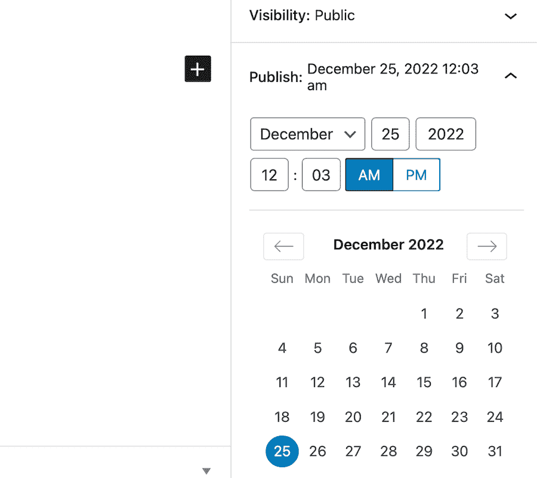

Setting the date and time to schedule a blog post’s publication using the Block Editor.


点击**立即发布**显示一个下拉菜单，你可以选择你的帖子发布的具体日期和时间。

在我们的例子中，我们将这篇文章安排在 12 月 25 日上午 8 点。一旦您选择了日期和时间，只需点击**日程**按钮来设置您的发布日程。

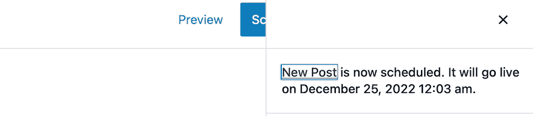

The view just after scheduling a blog post to publish at a later date using the Block Editor.


就是这样！您的帖子现已安排好，将在您选择的日期和时间自动发布。

### 方法 2:使用 WordPress 经典编辑器安排文章

如果你使用的是 [WordPress Classic 编辑器](https://kinsta.com/blog/disable-gutenberg-wordpress-editor/)，那么你可以使用类似的方法来安排文章。

首先，在 WordPress 中创建一个新的帖子或页面。和以前一样，我们将为这个例子创建一个新帖子。

一旦你进入文章编辑器，在你的 [WordPress 仪表盘](https://kinsta.com/knowledgebase/wordpress-admin/)的屏幕右侧寻找**发布**面板。默认情况下，这被设置为**立即发布**。

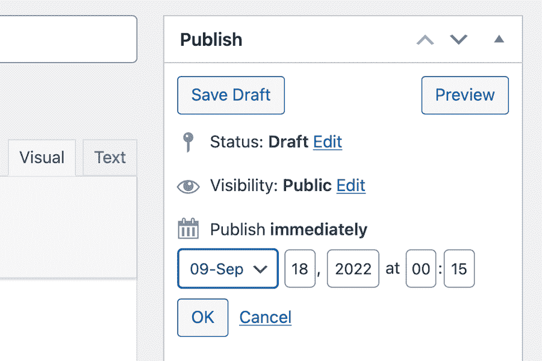

The Classic Editor shows a post is ready to Publish Immediately by default.


点击**立即发布**选项旁边的**编辑**链接。这将弹出一个下拉菜单，其中有几个不同的计划选项。

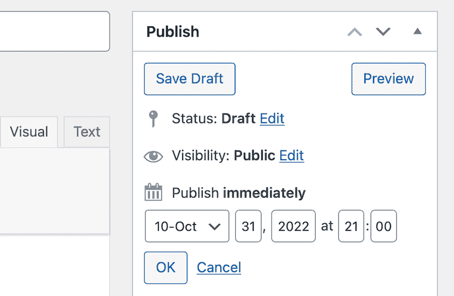

Setting the date and time to schedule a blog post for publication using the Classic Editor.


在本例中，我们将这篇文章安排在 10 月 31 日 21:00。一旦你选择了日期和时间，只需点击 **OK** 按钮来设置你的发布时间表。

单击蓝色的“Schedule”按钮，在 Classic 编辑器中安排博客文章的发布时间。

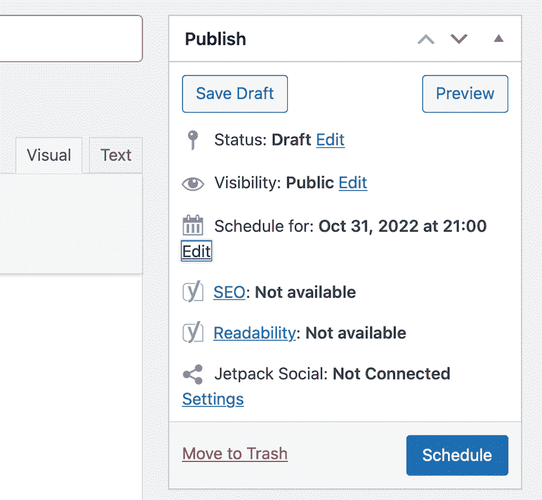

Then to schedule the post itself, click the Schedule button.


再说一次，这就是全部了。您的帖子现已安排好，将在您选择的日期和时间自动发布。

### 方法 3:使用插件安排文章

如果你没有使用 WordPress 块编辑器，或者如果你想要更多的控制你的文章安排，那么你可以使用插件。

最流行的后期调度插件之一是 [SchedulePress](https://wordpress.org/plugins/wp-scheduled-posts/) 。这个插件可以免费使用，让你提前安排你的文章。

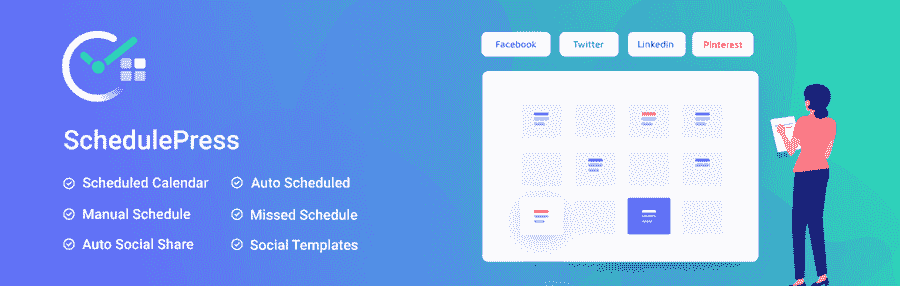

SchedulePress


首先，[安装并激活](https://kinsta.com/knowledgebase/how-to-install-wordpress-plugins/)schedule press 插件。一旦插件被激活，从你的 WordPress 管理面板点击**帖子>添加新的**。这将把你带到文章编辑器界面，在这里你可以编写和安排你的文章。

在屏幕的右侧，您会看到标准经典编辑器**发布**框。您可以在这里选择帖子发布的日期和时间。

对于我们的示例，我们将这篇文章安排在 7 月 4 日 18:00。一旦你选择了日期和时间，只需点击 **OK** 然后蓝色的**日程**按钮来设置你的发布日程，像往常一样。

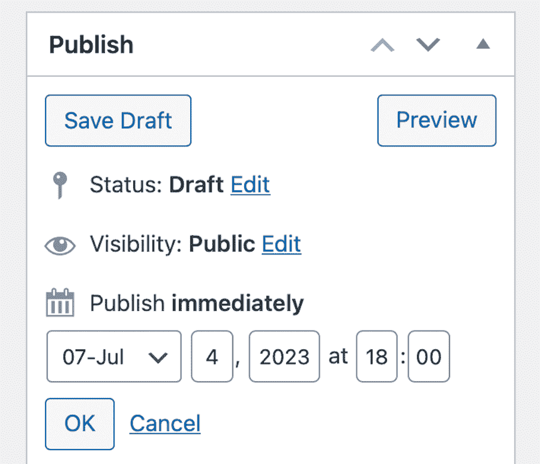

Scheduling a post to publish at a later date in the Classic Editor with SchedulePress installed.


这个插件还增加了一个漂亮的功能，让你可以立即发布你的日程安排，它会反映当前日期或未来的日程安排日期——无论哪个对你来说最有意义。

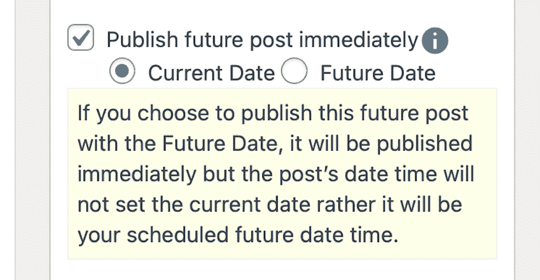

Setting the publication date that will appear on a scheduled post in SchedulePress.


专业版还提供了各种其他功能，包括自动日程安排、日历视图、提前计划项目的能力以及一次安排数百篇帖子的能力，这样一旦你的帖子在顶级社交媒体平台上发布，你就可以自动分享它们。


## WordPress 预定文章的提示和技巧

所以你现在知道如何在 WordPress 中安排帖子了，这很好。但是如果你的需求超出了写作的范围。时间表。出版？让我们来看看一些技巧和窍门，您可以使用它们来充分利用这个特性。

### 设置时区

如果你想让你的帖子在特定的时间发布，那么确保你的 WordPress 站点设置了正确的时区是很重要的。

默认情况下，WordPress 使用 UTC 时间。然而，你可以通过从你的 [WordPress 管理面板](https://kinsta.com/blog/wordpress-custom-dashboard/)进入**设置>常规**来改变这一点。

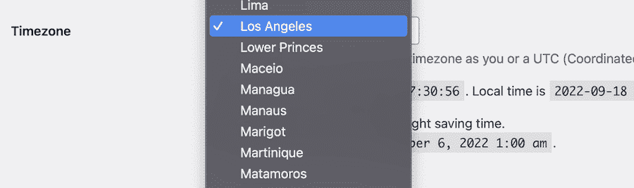

Setting the timezone in WordPress Settings.


从这里，您可以为您的位置设置正确的时区。完成后，点击**保存更改**按钮保存您的设置。

## 注册订阅时事通讯


### 想知道我们是怎么让流量增长超过 1000%的吗？

加入 20，000 多名获得我们每周时事通讯和内部消息的人的行列吧！

[Subscribe Now](#newsletter)

### 查看所有预定帖子

如果你想看到你在 WordPress 网站上预定的所有帖子，你可以去**帖子>所有帖子**查看。

在页面顶部，有几个选项。点击显示**已安排**的链接。

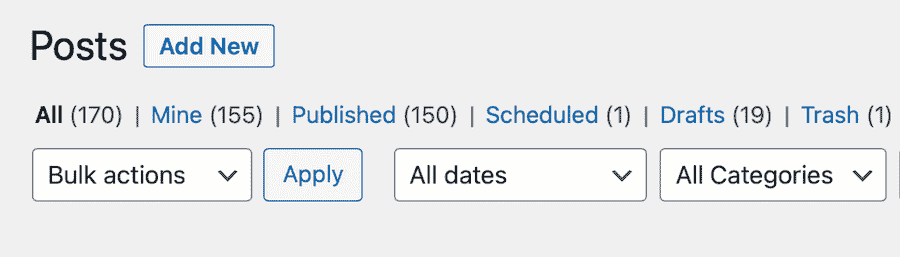

Accessing scheduled posts in WordPress.


您可以使用此页面管理您的预定帖子，包括编辑、删除或提前发布。

### 提前发布预定的帖子

如果您需要在预定的日期和时间之前发布帖子，那么您可以通过进入**所有帖子**页面并选择您想要发布的帖子来完成。

一旦你进入文章编辑界面，只需点击**发布**按钮。这将立即发布您的帖子，无论它计划何时发布。

### 管理“错过的时间表”帖子

如果由于某种原因，你的帖子没有在预定时间发布，那么 WordPress 会自动将其标记为“[错过预定时间](https://kinsta.com/knowledgebase/wordpress-missed-schedule/)的帖子。

你可以通过进入**所有帖子**页面，选择旁边有红色**错过时间表**的帖子，查看你所有错过的预定帖子。

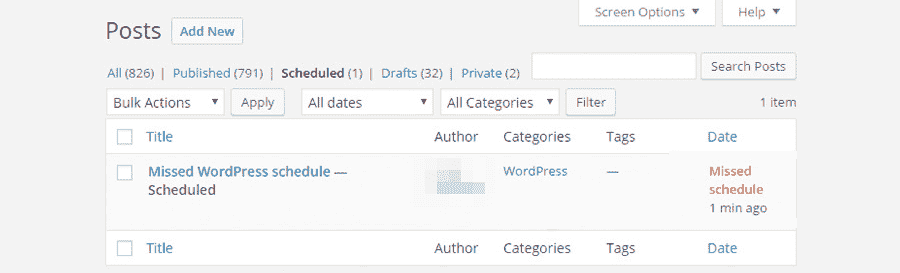

How a blog post that misses its publication schedule appears in WordPress.


如果你想试着发布一个错过的时间表帖子，那么你只需点击**发布**按钮。但是，如果您不想发布帖子，那么您可以删除它或重新安排以后的日期和时间。

由于多种原因，预定的帖子可能会错过预定的发布日期和时间。通常， [cron job](https://kinsta.com/help/how-to-write-a-cron-job/) 错误是罪魁祸首。

Cron 作业可以被最好地描述为“T0”后台任务，WordPress 用它来执行某些功能。这些包括检查更新、安排帖子等等。

如果你的 WordPress 站点的 cron 工作不正常，那么它会导致预定的发布失败。您可能会因为多种原因而遇到 cron 作业错误，包括:

*   您的 [WordPress 主机提供商](https://kinsta.com/blog/web-hosting-support/)遇到了问题。
*   你最近更换了 WordPress 主机。
*   您的网站关闭或工作不正常。
*   你已经[安装了一个与 WordPress](https://kinsta.com/blog/downgrade-wordpress/) cron 冲突的插件或主题。

但大多数情况下，这个问题是由网站流量不足引起的。由于 crons 或调度程序只在页面加载时运行，在正确的时间(或者错误的时间，如果你真的想一想)缺乏流量意味着预定的帖子不会发布。cron 作业不会运行，您将面临错过计划的失败。

如果您认为您的站点的 cron 作业是您错过预定帖子的原因，那么您可以尝试通过手动运行 cron 作业来解决这个问题。

Struggling with downtime and WordPress problems? Kinsta is the hosting solution designed to save you time! [Check out our features](https://kinsta.com/features/)

为此，您需要向您的站点添加一小段代码。您可以通过将下面一行添加到您站点的*wp-config.php*文件中来做到这一点:

```
define('DISABLE_WP_CRON', true);
```

一旦你通过 [FTP 访问](https://kinsta.com/blog/best-ftp-clients/)添加了这行代码，WordPress 将[不再尝试自动运行 cron 作业](https://kinsta.com/knowledgebase/disable-wp-cron/)。相反，它只会手动运行它们。

要设置这些手动 cron 作业，您需要访问您站点的 cPanel 并找到 **Cron 作业**模块。单击它并计划设置为定期运行的 cron 作业。

如果这不能解决问题，或者你不相信你的编码技能，那么你可以试试 WordPress 插件。我们推荐[日程帖子触发器](https://wordpress.org/plugins/scheduled-post-trigger/)，这是一个免费插件，一旦有人访问你的网站，它就会运行错过的日程帖子。

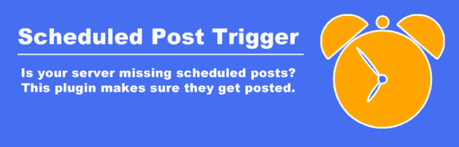

Schedule Post Trigger


有了这个插件，就不需要修改代码或手动设置 cron 作业。只需安装并激活插件，它会为你照顾一切。

选择一个能够在服务器层面为你安排 cron 任务的虚拟主机提供商也是一个不错的选择。来自 Kinsta 的托管 WooCommerce 主机将每隔 15 分钟运行一次 cron 作业。


Managed WooCommerce Hosting from Kinsta offers protection against missed scheduled posts.


Kinsta AMP 也可能有助于提高网站的整体性能，减少错过预定帖子的机会。

### 取消安排已安排的发布

如果你想取消一个已经安排好的文章，那么你可以通过编辑文章来实现。

如果使用经典编辑器，点击**预定**旁边的**编辑**按钮。

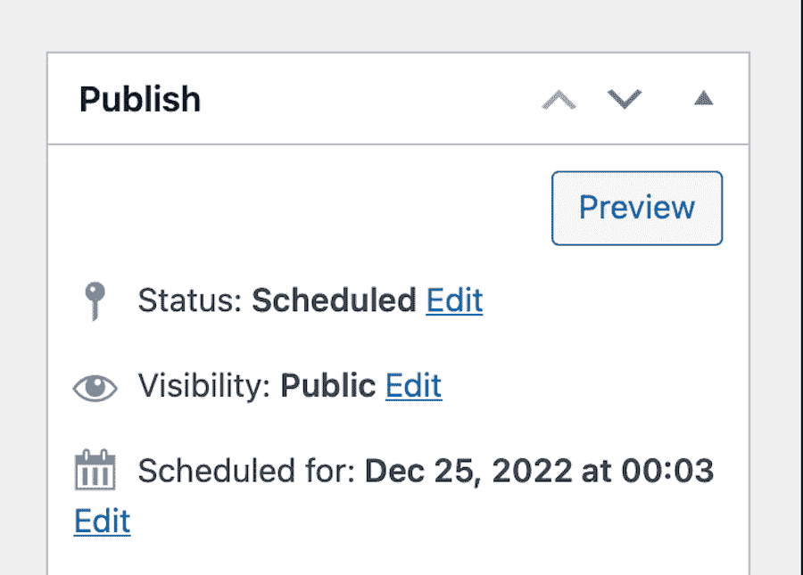

Editing a scheduled post to remove it from the publication queue.


然后点击下拉菜单，将帖子设置回**草稿**。然后点击**确定**。

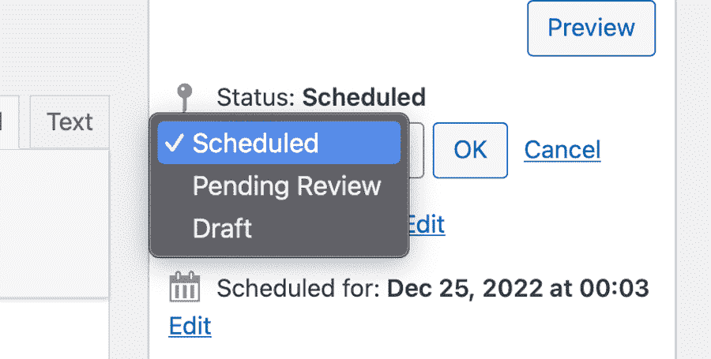

Change the post’s status back to draft to remove it from the publication queue.


最后点击**更新**。这将从 WordPress 队列中删除文章，并且不再安排文章上线。然后，您可以重新安排它在不同的日期和时间，或者您可以像往常一样通过点击**发布**按钮立即发布它。

### 计划对已发布帖子的更改(使用插件)

虽然默认情况下你不能安排对 WordPress 中已发表文章的修改，但是你可以通过使用[修订功能](https://kinsta.com/blog/wordpress-revisions/)来实现。此功能跟踪您对帖子所做的所有更改，并允许您在需要时恢复早期版本。

你也可以通过使用 [Advanced Schedule Posts](https://wordpress.org/plugins/advanced-schedule-posts/#description) 插件来计划对已发布的帖子进行修改。这个插件允许你安排对任何文章的修改，包括已发表的文章。


Advanced Schedule Posts


要使用这个插件，安装后，只需编辑你想修改的帖子，然后点击**发布**框中的**日程**按钮。

这将打开计划选项，您可以从中选择何时发布更改。一旦您做出选择，点击**计划**按钮，更改将被计划。

### 计划过期后(使用插件)

如果你想安排一篇文章在某个日期和时间过期，那么你可以使用 [PublishPress Future](https://wordpress.org/plugins/post-expirator/) 插件。这个插件允许你安排帖子过期，然后它会根据你的喜好将帖子的状态更改为待定，草稿或私人。


PublishPress Future plugin.


要使用这个插件，只需安装并激活它。之后，编辑您想要安排过期的文章，然后向下滚动到 PublishPress 框。

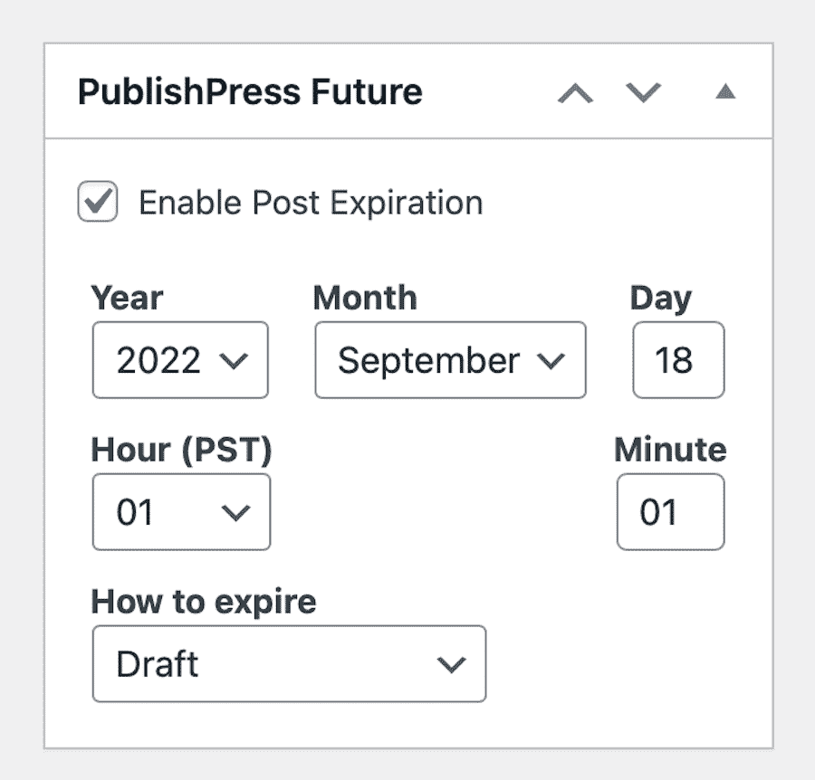

Setting when a post will expire using the PublishPress Future plugin.


在此框中，您将看到文本内容为**启用 Post 到期**。选中它旁边的框，然后选择您希望帖子过期的时间。您还可以选择到期后您希望对帖子执行的操作，即将其设置回草稿、[将帖子设为私有](https://kinsta.com/knowledgebase/wordpress-private-page/)，删除它，等等。做出选择后，向上滚动到页面顶部，点击**更新**。

[如果你喜欢批量发布你网站的内容，学习如何提前安排你的帖子是一个游戏规则改变者🗓 点击发推](https://twitter.com/intent/tweet?url=https%3A%2F%2Fkinsta.com%2Fblog%2Fwordpress-scheduled-posts%2F&via=kinsta&text=If+you+prefer+to+batch+out+your+site%27s+content%2C+learning+how+to+schedule+your+posts+in+advance+is+a+game-changer+%F0%9F%97%93&hashtags=WordPress%2CBlogger)


## 摘要

在这篇文章中，我们介绍了如何在 WordPress 中以多种方式安排文章。我们还了解了如何取消帖子的计划，以及如何计划对已发布帖子的更改。

安排帖子是一个很好的方式来保持你的内容新鲜，并确保总是有新的东西给你的读者。它还可以帮助你腾出时间，这样你就可以专注于网站的其他方面。

如果你对如何在 WordPress 中安排文章有任何问题，请在下面留下评论。

如果你想使用一台能够确保高速性能和最小化 cron 作业错误的主机， [MyKinsta](https://kinsta.com/mykinsta/) 可能是你的理想选择。或者，如果你经营一家网上商店，我们的[托管 WooCommerce 主机](https://kinsta.com/woocommerce-hosting/)可能会感兴趣。

无论你选择哪个，只要知道你会得到很好的照顾。

* * *

让你所有的[应用](https://kinsta.com/application-hosting/)、[数据库](https://kinsta.com/database-hosting/)和 [WordPress 网站](https://kinsta.com/wordpress-hosting/)在同一个屋檐下联网。我们功能齐全的高性能云平台包括:

*   在 MyKinsta 仪表盘中轻松设置和管理
*   24/7 专家支持
*   最好的谷歌云平台硬件和网络，由 Kubernetes 提供最大的可扩展性
*   面向速度和安全性的企业级 Cloudflare 集成
*   全球受众覆盖全球多达 35 个数据中心和 275 多个 pop

在第一个月使用托管的[应用程序或托管](https://kinsta.com/application-hosting/)的[数据库，您可以享受 20 美元的优惠，亲自测试一下。探索我们的](https://kinsta.com/database-hosting/)[计划](https://kinsta.com/plans/)或[与销售人员交谈](https://kinsta.com/contact-us/)以找到最适合您的方式。