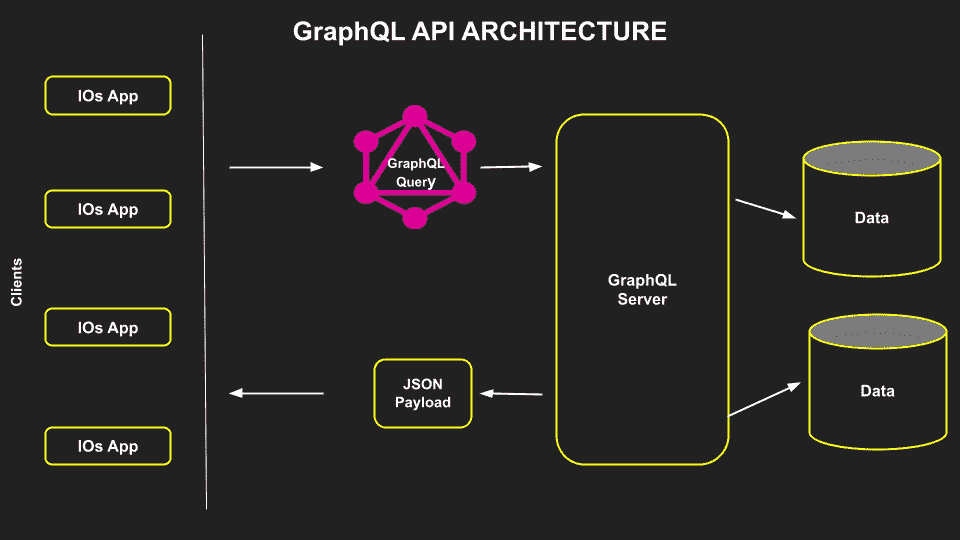
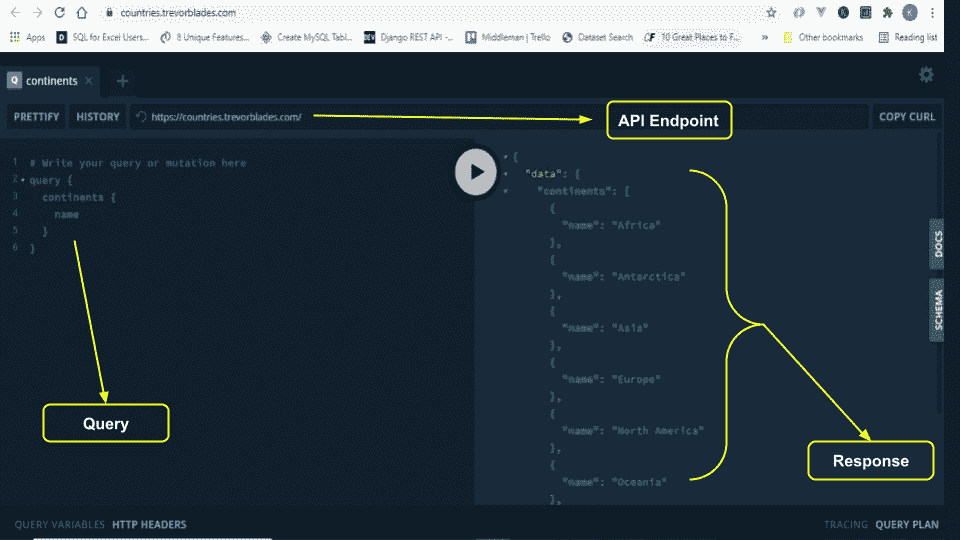
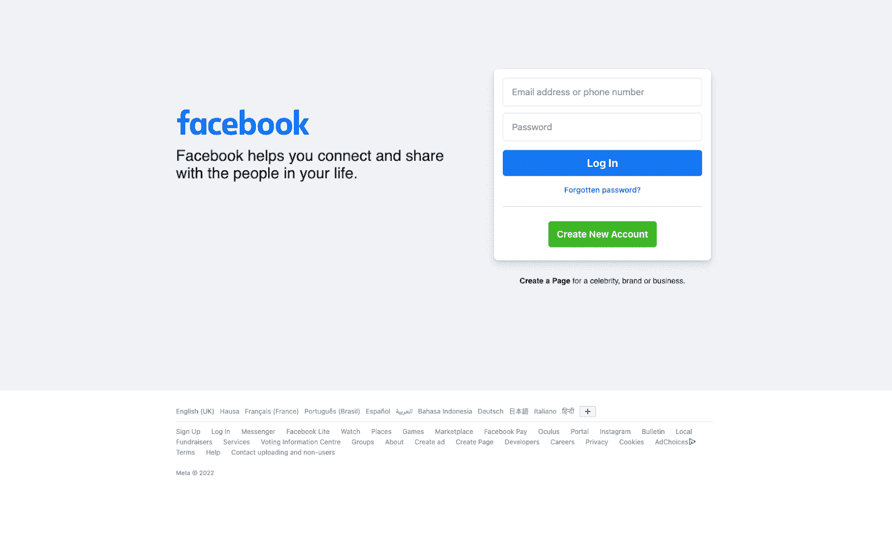
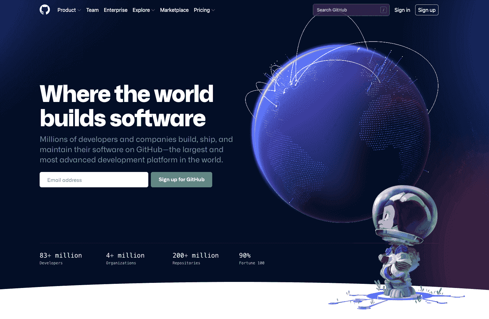
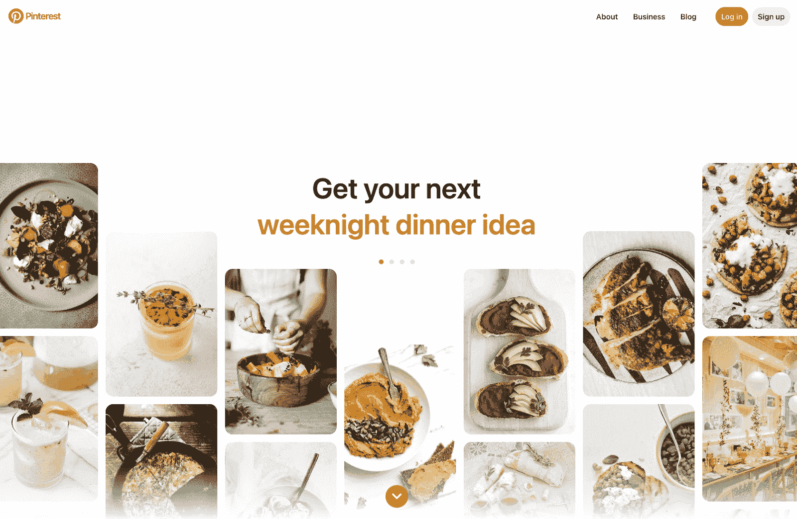
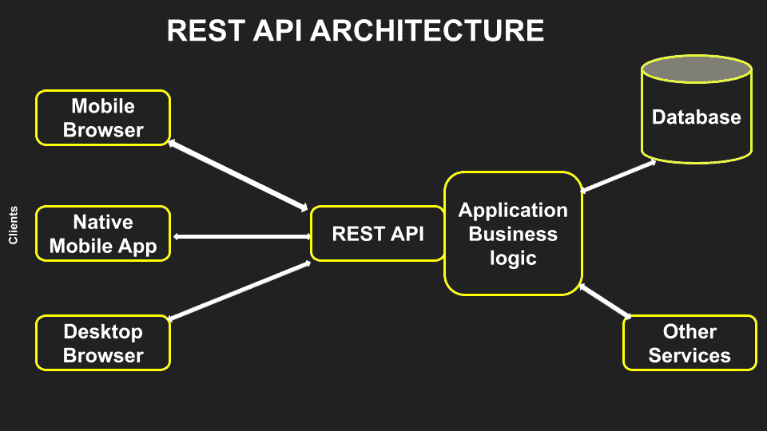
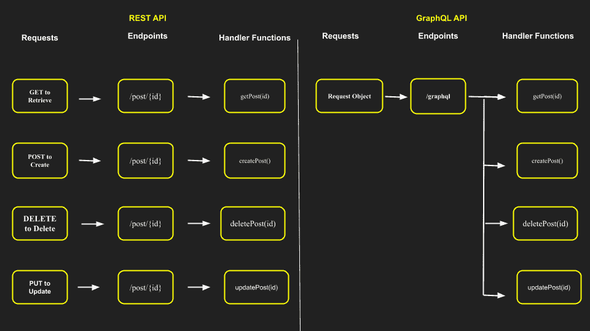
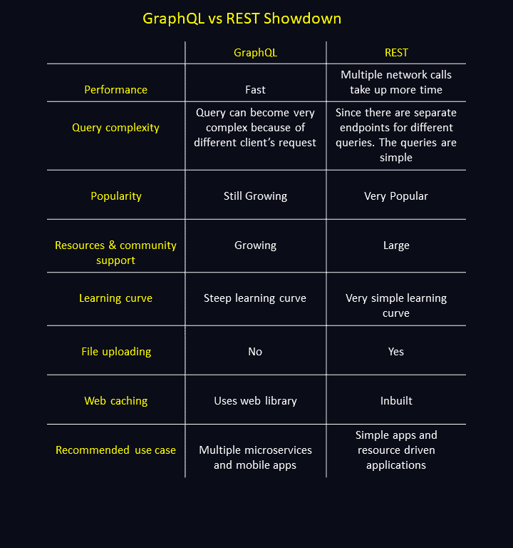

# GraphQL 与 REST:您需要知道的一切

> 原文：<https://kinsta.com/blog/graphql-vs-rest/>

挑选将被包含在你下一个项目的技术堆栈中的技术可能是困难的。在许多情况下——尤其是在 GraphQL 和 RESTful APIs 之间进行选择时——关键在于选择下一个最佳的 API 设计架构。

构建 API 有四种重要的方法:SOAP、GRPC、REST 和 GraphQL。每当我们想要构建 API 的时候，我们常常会将自己的思维局限于 REST 和 GraphQL。这是因为 REST 改变了用 SOAP 和 GRPC 构建 API 的传统方式。

 GraphQL 被广泛标记为更好的 REST，因为它代表了构建 API 的更好方式。[很多开发者](https://kinsta.com/blog/what-is-a-full-stack-developer/)认为 GraphQL 会取代 REST。更多的人已经发现 GraphQL 有助于解决开发人员在构建 REST APIs 时面临的一些常见挑战。

[Learn how to choose the best API design architecture and pattern for your project in this guide 💪Click to Tweet](https://twitter.com/intent/tweet?url=https%3A%2F%2Fkinsta.com%2Fblog%2Fgraphql-vs-rest%2F&via=kinsta&text=Learn+how+to+choose+the+best+API+design+architecture+and+pattern+for+your+project+in+this+guide+%F0%9F%92%AA&hashtags=GraphQL%2CAPI)

这两种构建 API 的方法完全不同。实际上，这些技术通过发送 HTTP 请求并接收结果来工作。它们各有利弊，在本文中，我们将广泛讨论这两项改变了我们开发和扩展 API 的方式的伟大技术。

不过，在深入细节之前，让我们先来探索一下 GraphQL 和 RESTful APIs 的含义。

## GraphQL 是什么？

GraphQL 是一种 API 查询语言，也是用现有数据回答这些查询的运行时。它还配备了强大的工具，甚至可以处理最复杂的查询。

> 需要在这里大声喊出来。Kinsta 太神奇了，我用它做我的个人网站。支持是迅速和杰出的，他们的服务器是 WordPress 最快的。
> 
> <footer class="wp-block-kinsta-client-quote__footer">
> 
> 
> 
> <cite class="wp-block-kinsta-client-quote__cite">Phillip Stemann</cite></footer>

[View plans](https://kinsta.com/plans/)

GraphQL 的核心特性是它能够只请求和接收*所请求的*特定数据——仅此而已。这使得扩展 API 和应用程序变得更加简单。

GraphQL 最令人兴奋的部分是它能够在一个端点中为您提供所有数据。

GraphQL API architecture.

上图是 GraphQL 架构的典型代表。客户端从不同的设备发出请求，GraphQL 处理它们的请求并只返回它们请求的数据。这巧妙地解决了 RESTful APIs 中的过量提取和不足提取问题。

A successful query in a GraphQL playground.

在上面的示例中，我们展示了一个 GraphQL playground，以及如何使用单个端点查询数据。顶部是 API 端点，左边是请求大洲名称的查询，最后，在右边，我们响应我们请求的查询。

GraphQL 是由脸书创建的，主要目的是解决他们的移动[应用开发者](https://kinsta.com/blog/app-developer-salary/)在使用 REST APIs 时的体验。自 2015 年发布第一个开源版本以来，由于技术业务中的大公司采用了该技术，GraphQL 经历了巨大的增长。

## 使用 GraphQL 的公司

下面列出了一些在服务器上积极使用 GraphQL 的公司和应用程序。

### 脸谱网

脸书创建了 GraphQL，他们从 2012 年开始在生产中使用它来驱动他们的移动应用。这家市值数十亿美元的社交网络公司在 2015 年开源了 GraphQL 规范，使其可以跨许多环境和各种规模的团队使用。

Facebook uses GraphQL.

### 开源代码库

GitHub 还宣布使用 GraphQL，提供 GraphQL API，使用 GitHub GraphQL API 创建集成、检索数据和自动化工作流程。GitHub GraphQL API 提供了比 GitHub REST API 更精确、更灵活的查询。

GitHub also utilizes GraphQL.

### 拼趣

Pinterest 也是 GraphQL 的早期采用者。照片共享巨头[公开讨论了](https://medium.com/pinterest-engineering/recap-pinterest-engineering-talks-functional-swift-conference-d96ef3dc6f3e)他们对 GraphQL 的早期探索，以及他们如何使用 GraphQL 技术为他们价值十亿美元的公司提供动力。

Pinterest uses GraphQL for their site as well.

许多其他价值十亿美元的公司，如 Intuit、[、Shopify](https://kinsta.com/shopify-market-share/) 、Coursera 和 Airbnb 都使用 GraphQL 来支持他们的应用程序。这种对休息的广泛偏好只会继续增长。

## 什么是 RESTful API？

REST 代表“表述性状态转移”，这是分布式超媒体系统的一种软件架构风格。它定义了服务器和客户端之间交换资源的原则和约束。

如果在一个 API 中遵循了这些原则，那么这个 API 的应用程序就被称为“RESTful”WordPress REST API 就是一个很好的例子。

下面是一个 API 要被称为 Restful API 必须满足的一些原则和约束:

*   **客户端-服务器解耦:**客户端(前端)和服务器(后端)完全分离，只能通过端点进行通信。
*   **统一界面:**界面中看到的数据在所有设备上都是相同的。
*   **无状态:**服务器不记得当前请求是否是第一次发出。每次发出请求时，都需要包含从头开始处理请求所需的所有信息。
*   **可缓存性:** [缓存](https://kinsta.com/blog/what-is-cached-data/)和会话存储是允许的，但它们必须配置为允许最终用户选择退出数据缓存。
*   **分层系统架构:**API 必须被设计成客户机和服务器都无法判断它们是直接通信还是通过中介通信。

下图是基本的 REST 架构。它展示了请求和响应通常是如何处理的。

REST API architecture.

## GraphQL 的优势

下面是使用 GraphQL 的一些好处，说明了为什么它对于构建下一个价值 10 亿美元的应用程序来说绰绰有余。

### 通过单个 API 端点获取数据

GraphQL 的最大优势是它能够通过单个 [API 端点](https://kinsta.com/knowledgebase/api-endpoint/)访问任何或所有数据点。

RESTful APIs 最常见的问题之一是有太多的端点来访问信息。在 GraphQL 中，您只有一个端点，因此您不需要发送多个请求来检索关于一个对象的不同信息。

下图描述了一个使用 RESTful API 和 GraphQL 检索资源的清晰示例。您可以看到，在 GraphQL 服务器中只有一个端点来访问资源，而在 RESTful API 中需要多个 API 端点来访问不同的资源。

API endpoints in REST and GraphQL.

### 没有过度提取或提取不足

过量或不足提取是 RESTful APIs 的一个已知问题。这是指客户端通过访问返回固定数据结构的端点来下载数据，否则它们检索的数据会多于或少于预期。

过度提取会导致请求接收或“提取”比给定请求所需更多的数据。假设您正在获取一个表中的所有用户，并打算在您的主页上显示他们的用户名。在这种情况下，重载将返回每个用户的所有数据，包括(但不仅仅是)姓名。

## 注册订阅时事通讯

### 想知道我们是怎么让流量增长超过 1000%的吗？

加入 20，000 多名获得我们每周时事通讯和内部消息的人的行列吧！

[Subscribe Now](#newsletter) 提取不足的情况相对较少，但当特定端点无法提供所有请求的信息时，确实会发生这种情况。客户端将需要根据需要发出额外的请求来访问其他信息。

GraphQL 通过在没有任何额外细节的情况下获取客户端请求的确切资源，有效地解决了过量获取或不足获取的问题。

### 更好地处理复杂系统和微服务

GraphQL 可以统一和隐藏集成多个系统的复杂性。

例如，假设我们想要从单一后端应用程序迁移到[微服务架构](https://kinsta.com/blog/microservices-vs-api/)。GraphQL API 通过将各种微服务合并到一个 GraphQL 模式中来帮助处理它们之间的通信。

一旦定义了这些模式，前端和后端都可以单独通信，而无需任何进一步的更改，因为前端知道模式中的数据在整个系统中总是同步的。

### 快速安全

过度提取的问题会导致客户端消耗更多的带宽，最终会导致应用程序延迟。使用 RESTful API 设计模式从巨大的负载中挑选出所需的信息更加耗时。

由于 GraphQL 能够避免过量提取和不足提取，服务器返回一个安全、易读、可预测的形状，这使得您的 API 请求和响应更快。

## 休息的好处

尽管 GraphQL 越来越受欢迎，REST 仍然是最流行的 API 标准之一。让我们来看看为什么。

*   **学习曲线:**RESTful API 最容易学习和理解。这是它相对于其他 API 的主要优势。
*   **序列化:** REST 提供了一种灵活的方法和格式来序列化 JSON 中的数据。
*   **缓存:** REST API 可以在 HTTP 代理服务器和缓存的帮助下管理高负载。
*   复杂请求:REST API 为不同的请求提供了单独的端点，这有助于使复杂请求比其他 API 更易于管理
*   **干净简单:**REST API 优雅、简单、干净。它们易于探索。
*   **标准 HTTP 过程:** REST 使用标准 HTTP 过程调用来检索数据和发出请求。
*   **客户机/服务器:**这意味着它的业务逻辑与表示相分离。所以你可以改变一个而不影响另一个。
*   **REST 是无状态的:**客户机和服务器之间交换的所有消息都有知道如何处理消息所需的所有上下文。

## GraphQL 的缺点

既然我们已经讨论了 GraphQL 相对于 REST 的优点，那么让我们来探讨一下 GraphQL 的一些缺点:

*   **难学曲线:** GraphQL 不如 REST 好学。构建 GraphQL API 最具挑战性的部分是设计模式。这需要大量的时间和领域知识。
*   **文件上传:** GraphQL 没有原生文件上传特性。使用 Base64 编码可以解决这个问题，但是这种编码和解码方式既费时又费钱。
*   **Web 缓存:** [缓存有助于减少服务器的频繁流量](https://kinsta.com/blog/what-is-cache/)，通过将频繁访问的信息保存在服务器附近来加快请求和响应过程。GraphQL 不支持或依赖于 HTTP 缓存方法，而是依赖于 Apollo 或中继客户机的缓存机制。
*   **不适合小型应用:** GraphQL 可能不是构建小型应用的最佳 API 架构。如果您的应用程序不需要 GraphQL 提供的更灵活的查询，REST 是一个不错的选择。
*   **复杂查询问题:** GraphQL 能够准确地给出客户机想要的东西，这也可能导致查询传播问题。如果客户端提交太多嵌套查询，可能会导致发送错误的查询，这对服务器来说非常耗时。最好利用 REST 和自定义端点来满足这样的请求。

## 休息的缺点

现在，让我们把注意力转向 REST 的一些缺点:

Struggling with downtime and WordPress problems? Kinsta is the hosting solution designed to save you time! [Check out our features](https://kinsta.com/features/)

*   **多次往返:【REST APIs 最大的问题是众多端点的性质。这意味着客户端要获得完整应用程序的所有资源，需要进行无数次往返以获得数据。**
*   **取多取少:**取多取少的问题是 RESTful APIS 的一个主要缺点。由于获取大量不需要的有效负载，它可能会导致响应滞后。
*   由于 REST APIs 是建立在 URI 引用资源的基础上的，所以它们不适合那些不能在简单的层次结构中自然组织或访问的资源。

## 为什么用 GraphQL 代替 REST

接下来，我们将讨论为什么您可能希望在未来的 API 开发中考虑 GraphQL 而不是 RESTful API。

### 强类型架构

GraphQL 使用强类型系统来定义 API 的功能。在 GraphQL 中，模式定义语言(SDL)用于定义客户端如何访问服务器数据的参数。所有暴露给客户端的 API 都用 SDL 写下来，解决了 RESTful APIs 中出现的数据不一致问题。

### 没有过度提取或提取不足

获取过量或不足的问题是 RESTful APIss 的一个已知问题，在 RESTful API 中，客户端返回的信息可能多于或少于它们请求的信息。GraphQL 解决了这个问题，它为客户端提供了一个媒介来指定所需的信息，然后准确地返回特定的信息——并且只返回特定的信息。

### 多个端点

RESTful APIs 的最大问题之一是有太多的端点来访问信息。

让我们假设您想通过用户的 ID 号访问某个用户。您将看到一个类似于`/users/1`的端点。但是如果您想访问该用户的照片，您必须向另一个端点发送请求，比如`/users/1/photos`。

在 GraphQL 中，只有一个端点，不需要发送多个请求来检索用户的不同信息。

## GraphQL vs REST 对决

最后，我们将探讨 GraphQL 和 RESTful APIs 之间的主要区别。之后，我们将讨论好的 API 设计的一些特性，并比较每种技术如何处理它们。

### 表演

毫无疑问，GraphQL 比 RESTful APIs 执行得更快，因为它能够提供单个端点来访问所有资源。RESTful APIs 使用多个端点，这可能导致[网络延迟](https://kinsta.com/blog/network-latency/)。

### 查询复杂性

由于端点没有被分成多个端点，GraphQL 查询会随着时间的推移变得越来越复杂。另一方面，RESTful API 端点是分离的，这将 RESTful API 限制为简单的查询。

### 受欢迎程度和社区支持

GraphQL 是一种正在发展的 API 架构模式和查询语言。虽然它还很年轻，但它的采用率和资源库正在快速增长，对于那些有兴趣自己学习它的人来说，资源已经很多了。

 另一方面，REST 已经拥有大量的社区支持，并继续被各种公司使用，从构建小型微服务到创建复杂的社交应用等等。

目前 GraphQL vs REST 的人气较量是平局。这两种技术继续被开发社区广泛使用和支持。

### 学习曲线

GraphQL 的学习曲线很陡。它需要良好的 API 开发和一般软件工程领域知识。一个完全的初学者将很难理解 GraphQL 足以构建一个复杂的应用程序。

相反，REST 非常容易上手，并且一开始就需要较少的领域知识。RESTful API 被很好地集成到大多数主流编程语言和流行框架中，这使得学习起来非常容易。

GraphQL vs REST.

## 摘要

GraphQL 是一种跟随 RESTful API 架构模式的新技术，就像 REST 被引入来解决 SOAP API 模式的问题一样。

GraphQL 为您的所有查询提供了更快的响应、单一的 API 端点，以及一致数据访问的严格模式。这些原因使得数十亿美元的公司开始转向 GraphQL，即使是在早期阶段。然而，尽管有其局限性，GraphQL 的祖 REST 继续在舞台上保持强大的存在。

[GraphQL or RESTful APIs? Learn more in this guide 🚀Click to Tweet](https://twitter.com/intent/tweet?url=https%3A%2F%2Fkinsta.com%2Fblog%2Fgraphql-vs-rest%2F&via=kinsta&text=GraphQL+or+RESTful+APIs%3F+Learn+more+in+this+guide+%F0%9F%9A%80&hashtags=GraphQL%2CAPI)

在本指南中，我们探索了您需要了解的关于 GraphQL 和 RESTful APIs 的一切，包括每种技术的优缺点，以便帮助您自信地决定您更喜欢哪一种。我们还讨论了 RESTful APIs 的已知问题——比如过量提取、不足提取和多个端点——以及 GraphQL 如何试图解决这些问题并提高应用程序的性能。

现在，您已经有足够的洞察力来选择 GraphQL vs REST 是否适合您的下一个项目。让我们在评论区知道你将和你选择的获胜者一起建造什么！

* * *

让你所有的[应用程序](https://kinsta.com/application-hosting/)、[数据库](https://kinsta.com/database-hosting/)和 [WordPress 网站](https://kinsta.com/wordpress-hosting/)在线并在一个屋檐下。我们功能丰富的高性能云平台包括:

*   在 MyKinsta 仪表盘中轻松设置和管理
*   24/7 专家支持
*   最好的谷歌云平台硬件和网络，由 Kubernetes 提供最大的可扩展性
*   面向速度和安全性的企业级 Cloudflare 集成
*   全球受众覆盖全球多达 35 个数据中心和 275 多个 pop

在第一个月使用托管的[应用程序或托管](https://kinsta.com/application-hosting/)的[数据库，您可以享受 20 美元的优惠，亲自测试一下。探索我们的](https://kinsta.com/database-hosting/)[计划](https://kinsta.com/plans/)或[与销售人员交谈](https://kinsta.com/contact-us/)以找到最适合您的方式。