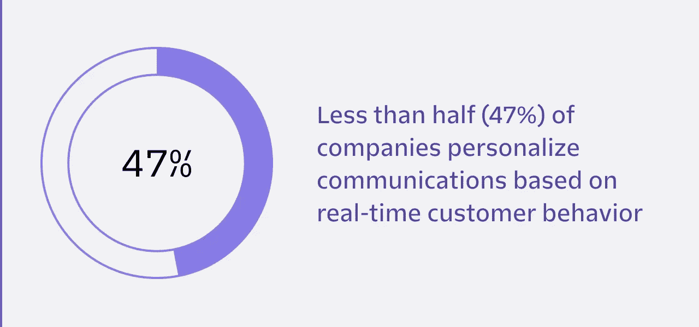
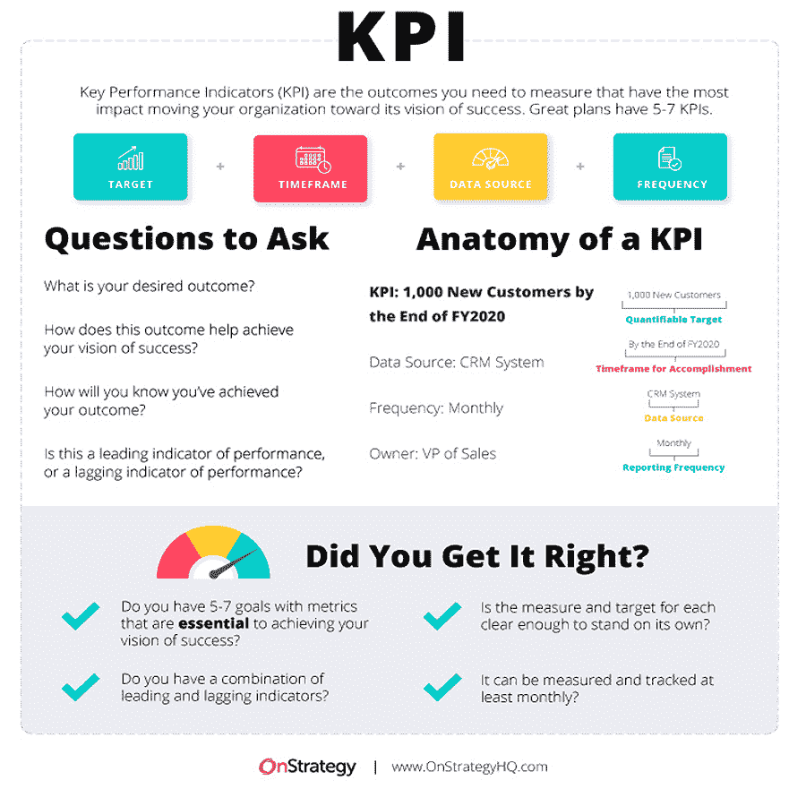
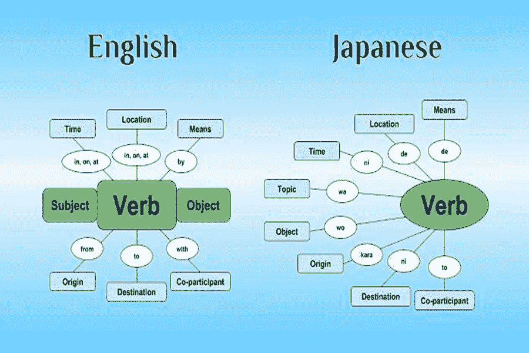
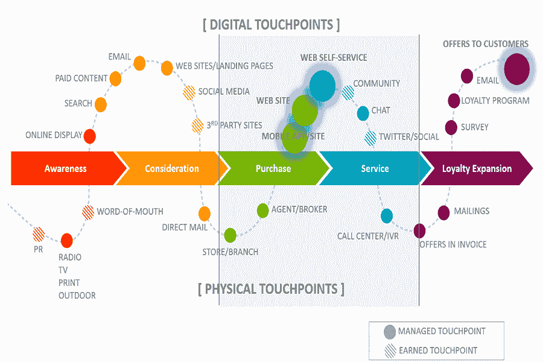
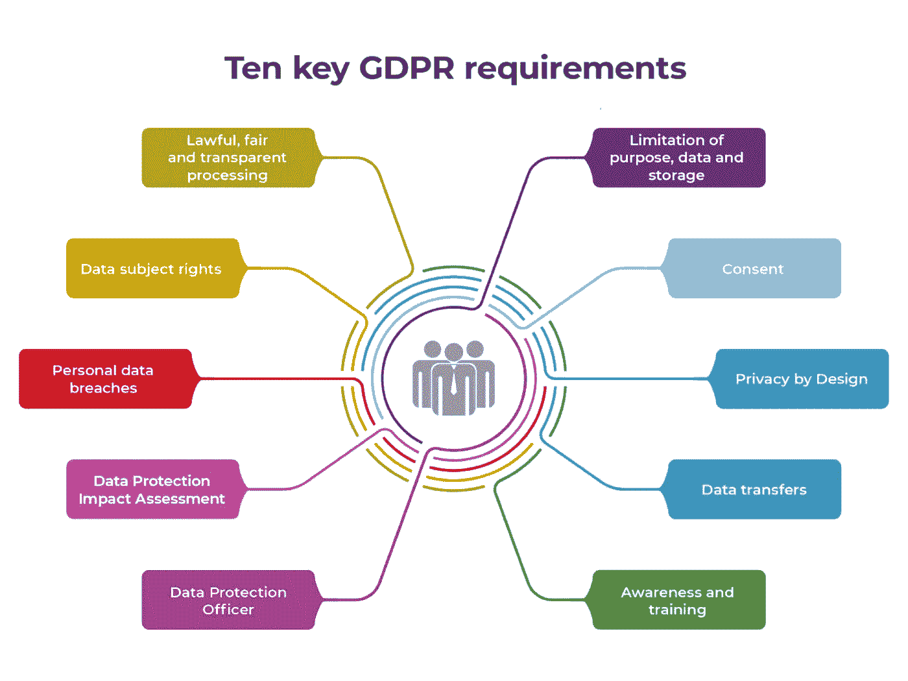
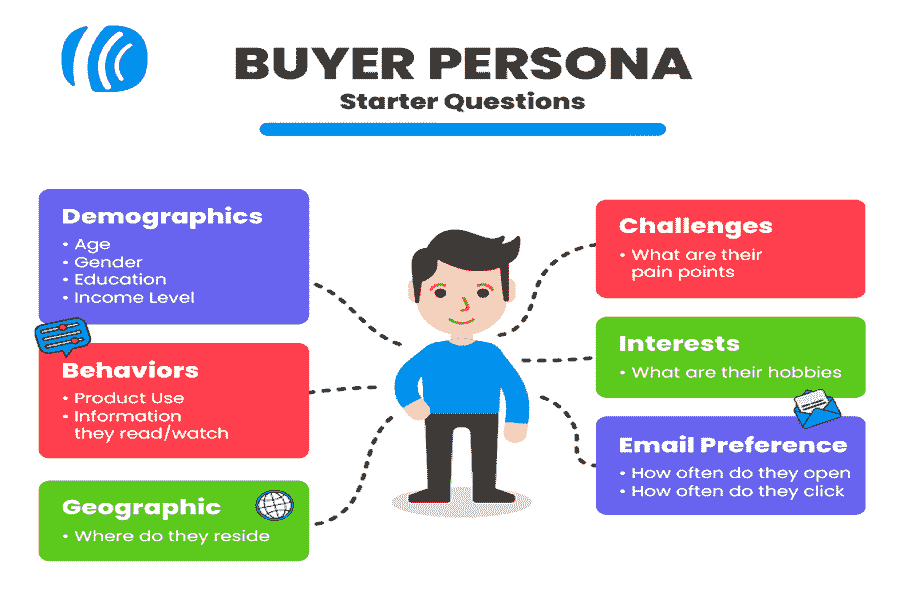

# 改进本地化策略的完整指南

> 原文：<https://kinsta.com/blog/localization-strategy/>

所有公司都希望增长，在互联网时代，[全球增长](https://kinsta.com/podcast/culture-key-to-business-growth/)从未如此容易实现。

但是，如果你不愿意改变基于地理位置的营销策略，向新市场扩张可能会很困难。当你在全球拓展业务时，一刀切的策略是行不通的。不同的市场有不同的敏感度、偏好和语言。这就是为什么你需要搞营销本地化。

但是本地化不仅仅是通过自动翻译器运行你的内容。你必须考虑当地市场，为他们创造个性化的购物体验，就像你第一次在家里推出服务时那样。

如果你没有一个强大而详细的本地化战略，你的全球扩张计划可能会落空。但是什么是本地化战略呢？在继续扩张的过程中，您如何推出最佳的本地化策略来确保您的成功？

请继续阅读，寻找答案。

## 什么是本地化战略？

您的本地化策略是您的企业为使您的内容和服务适应不同的语言和文化而制定的计划。鉴于国际客户群的各种偏好、语言和敏感性，这被视为全球扩张的重要组成部分。

因此，你的产品必须以一种独特的、相关的、适合外国观众的方式展示。在美国市场行得通的，在欧洲、亚洲，甚至在加拿大等其他北美市场不一定行得通。

这是为什么呢？因为每个市场都有不同的文化，而每种文化都需要你的营销计划给予直接的个性化关注。个性化对现代消费者来说是一个非常重要的因素。尽管如此，只有 [47%](https://segment.com/state-of-personalization-report/) 的公司根据客户的实时行为对他们的沟通进行个性化处理。

Less than half of companies take the time to personalize their communications (**Source:** [Segment](https://segment.com/state-of-personalization-report/))

比如说，如果你在美国的营销内容中有许多衣着暴露的模特，那么同样的内容在印度这样一个更为保守的社会中是不会流行的。事实上，在印度开展同样的活动可能会冒犯很多人，让市场认为你的公司过于淫秽。

[Expanding into new markets can prove difficult if you’re unwilling to change your marketing tactics. 🌍 Enter, localization. 📍Click to Tweet](https://twitter.com/intent/tweet?url=https%3A%2F%2Fkinsta.com%2Fblog%2Flocalization-strategy%2F&via=kinsta&text=Expanding+into+new+markets+can+prove+difficult+if+you%E2%80%99re+unwilling+to+change+your+marketing+tactics.+%F0%9F%8C%8D+Enter%2C+localization.+%F0%9F%93%8D&hashtags=MarketingTips%2CLocalization)

通过提出本地化战略，您将能够根据广泛研究得出的数据，在各个市场中为您的服务带来新的亮点。你将能够在这些地区向消费者展示更加个性化的营销体验，以一种新受众能够接受的方式展示你的产品或服务。

这可能包括满足不同于原始受众的需求或痛点。不同的市场有不同的需求，作为营销人员和企业主，你有责任弄清楚他们在寻找什么，他们为什么需要它，以及你如何才能最好地让他们相信你有答案。

本地化还包括对您的在线状态的一些调整，包括但不限于将您现有的内容翻译成新的语言。你可能还需要改变你的[客户友好网站](https://kinsta.com/blog/web-design-principles/)的其他元素，比如它的用户界面、图像、支持选项和支付网关，以服务于全新的受众。

Coca-Cola’s website is different based on location (**Source:** [Translate by Humans](https://translatebyhumans.com/blog/4-tips-for-increasing-your-search-rankings-in-multiple-countries/))

许多公司甚至专门为不同的市场创建新的网站，主要的。网址重定向到一个不同的网页基于您的地理位置。你需要确保这些网站始终可用。这就是为什么你应该迁移到一个可靠的[应用程序](https://kinsta.com/application-hosting/)、[数据库](https://kinsta.com/database-hosting/)和[托管 WordPress 主机](https://kinsta.com/wordpress-hosting/)服务。

## 你需要本地化策略吗？

如果你想把公司扩展到国际市场，你需要一个本地化战略。但这不是你可以全速前进的事情。这对你的成功至关重要，为了成功，你必须好好计划它。

最终，如果您试图过度自动化流程并将其放到 rails 上，您将无法启动您的本地化策略。它需要人情味和持续的关注。如果没有一个稳固的、成熟的战略，你将会在你试图拓展的市场中疏远潜在的新客户。

就品牌声誉而言，第一印象意义重大，如果你跌跌撞撞地走出大门，你可能不会有第二次机会。

当然，如果你不打算拓展原有市场，你就不需要本地化策略。这既费时又费钱，所以除非你确实在寻找一个特定的新的目标市场，否则你不需要采取本文概述的步骤。

但是，为什么本地化战略对于拓展国际公司如此重要呢？

首先，本地化内容有机地与用户交流。此外，通过本地化你的营销策略，你不会无意中冒犯任何人。

## 精心策划的本地化策略的好处

精心策划的本地化战略的主要好处是，它将帮助你在战术上[将你的业务](https://kinsta.com/blog/2021-year-in-review/#how-much-we-published-in-2021)拓展到世界各地的新市场。这意味着增加品牌曝光率和利润。

本地化策略可以帮助您避免混乱的、文化上不适当的错误，就像我们上面强调的美国观众和印度观众之间的差异的例子一样。你最不想做的事情就是冒犯你的新市场。

通过在你的翻译上投入真正的时间和精力，你将能够用他们的语言自然地向新的观众展示内容，就像一个以英语为母语的人会做的那样。如果做不到这一点，可能会孤立你的受众，让你在这个新市场上看起来像一个非法公司或骗局。

你制定的策略也涉及到大量的信息收集。这只能帮助你了解新地区客户的不同痛点。虽然你的产品在多个地方的总体使用可能是相同的，但是为什么需要它的潜在需求可能是不同的。

当你将你的营销本地化时，你就能适应其他公司对该受众的营销。这将让你与新的潜在客户自然地联系起来，同时在全球范围内打造有利可图的品牌忠诚度。

当然，精心策划的本地化战略的主要好处之一是，它的成功就是您的成功，您将为您的企业打开一个全新的市场，并获得更多收入。

你也可以超越你的竞争对手，让你在本地和全球范围内拥有超越对手的竞争优势。

## 开始:本地化策略指南

### 布局您的战略工作流程

开始本地化策略的第一步是确定策略工作流程。这是您了解您目前在本地化方面所处位置的地方。你需要从头到尾计划好整个工作流程，突出你的起点和目标。

确保你在做这件事的时候非常具体，因为这将有助于你规划你战略的每一步。

这也是您确定想要扩展的位置以及在这些区域开始需要做什么的地方。本质上，你将会制作一个路线图来规划扩展过程。

翻译什么时候需要被要求准时发布？你将在新的市场上为你的内容推出什么样的风格指南？你将如何以符合新客户需求的方式进行质量保证？

这些都是在你开始尝试搬到一个新的地理位置之前要问自己的问题。

这也是你可以建立预算的地方。确定你愿意花多少钱来拓展这个新领域，看看是否可行。如果不是，你可能不得不暂停你的计划，直到你能投入更多的钱。

### 了解你的观众

在你向观众推销之前，你必须了解他们，确定他们想要什么，同样重要的是，他们不想要什么。

不同地区新客户的痛点是什么？它们如何符合您目前在国内营销的痛点？您可以做些什么来有效地营销这些新的棘手问题？

此外，您的新潜在客户在哪里消费最多的内容？如果你发现他们在脸书花了很多时间，你可能不得不将营销工作转移到那里。如果他们喜欢 YouTube 视频，你应该专注于在那个平台上发布。

最后，这个新市场存在哪些文化差异？什么被认为是越线或适合在媒体上看到？你能调整你现有的网站界面和营销材料来适应这些感受吗，或者你必须从头开始？

### 考虑你的目标和关键绩效指标

确保您创建的本地化策略的每一步都有助于您的总体目标。这些目标和[关键绩效指标](https://kinsta.com/blog/positioning-strategy/)应该提前制定，你的行动需要根据它们来衡量。

You need a strong understanding of your KPIs (**Source:** [Translate by OnStrategy](https://onstrategyhq.com/resources/27-examples-of-key-performance-indicators/))

重要的是你要保持对你想要完成的事情的高度关注。这有助于你关注你的最终目的地，并继续朝着目标前进。

### 保持事情简单

虽然本地化策略看起来是一项艰巨的任务，但是不要让这个过程过于复杂。

明确列出谁负责什么工作，以便您可以了解本地化团队中每个成员的角色。你也应该尽可能多的了解这个新市场，这样你在制定计划的时候就能得到信息。通过从里到外了解新市场，您可以找到开始本地化的最简单方法。

## 改进您的本地化策略:12 个关键提示

### 1.人性化您的本地化翻译

将您的内容翻译成当地语言是任何本地化策略的重要组成部分。当扩展到像日本这样的市场时，这可能会特别困难，因为在这里，你不仅要处理一种新的语言，而且要处理一个全新的字母表。

## 注册订阅时事通讯

### 想知道我们是怎么让流量增长超过 1000%的吗？

加入 20，000 多名获得我们每周时事通讯和内部消息的人的行列吧！

[Subscribe Now](#newsletter)

但是，你不能因为语言障碍而排斥潜在客户。在本地化你的营销策略时，你的目标应该是考虑如何在人的层面上与新客户建立联系。

Sentence structure varies by language (**Source:** [8020Japanese](https://8020japanese.com/japanese-sentence-structure/))

忽视他们的母语意味着潜在地冒犯你的新客户，并在他们从你这里购买的意愿面前竖起一堵墙。成功向潜在客户营销的关键之一是，这些潜在客户需要流利地理解他们正在阅读的内容。

这就是为什么确保你不仅在使用他们的语言，而且是以语法正确的方式这样做是很重要的。有时直接翻译是行不通的，因为不同语言的句子结构会有很大差异。

你也应该花时间为你的新观众改变任何与文化无关或不敏感的内容。

### 2.创建本地化工具包

本地化套件是一个文档，其中包含了关于您的本地化策略和目标的所有信息。

你的工具包的一部分应该是一个风格指南，详细说明制作内容时关于你的品牌声音、颜色和总体目标的具体信息。这种风格可以(也可能应该)根据你营销的地区而有所不同。

您的本地化套件中应该包括的一些项目有:

*   您的企业使用的任何常用术语，以及如何与客户沟通
*   与你欣赏的品牌相似(不考虑行业)，这样你就可以借鉴他们的经验
*   在你的[领域](https://kinsta.com/best-wordpress-themes/)中，你喜欢和不喜欢别人做什么

该工具包对翻译人员特别有帮助，有助于让所有人都保持一致——团结在同一个愿景下。

### 3.审核您的客户旅程

为了创建最有效的本地化策略，您必须对现有的客户旅程进行长期观察。

它的哪些元素可以带入新的市场？有吗？你需要确定你现有的步骤是否可以转移，并使用之前的框架形成你改变的客户旅程。

Create a map of your current customer journey (**Source:** [Empire Flippers](https://empireflippers.com/conduct-cx-audit-for-online-business/))

在你的新市场，消费习惯有所不同吗？如果是这样，你可能需要为你的新客户推出不同的促销活动来迎合这种转变。

过去，您在客户旅程中遇到过哪些问题？这些问题会在新市场中继续存在吗？如果是这样的话，从你的错误中吸取教训，推出你的新客户之旅，充分优化和准备就绪。

请记住，现有客户旅程的每一步都需要本地化。你可能会很幸运，有些步骤可以完全执行，但每一步都需要仔细分析和大量思考。

当然，这是一个你必须在你拓展的每个新市场重复的过程。

### 4.挑选目标位置

仅仅指出一个你喜欢的国家并决定要扩展到那个市场是不够的。你的扩张选择需要是战略性的。为此，确定哪里对您的服务有实际需求，并开始为这些领域制定本地化策略。

Struggling with downtime and WordPress problems? Kinsta is the hosting solution designed to save you time! [Check out our features](https://kinsta.com/features/)

那些地区有什么规则？你需要了解这些地区的各种法律法规。例如，如果你正在向欧盟扩张，你需要熟悉 [GDPR](https://kinsta.com/blog/wordpress-gdpr-compliance/) ，它规定了公司如何收集客户数据。未能遵守这一点可能会让你遭受巨额罚款。

The GDPR is a data privacy law in the EU (**Source:** [EUGDPR Academy](https://advisera.com/eugdpracademy/knowledgebase/a-summary-of-10-key-gdpr-requirements/))

还有不同领域的营销规则，你一定要知道，以免你在不知不觉中触犯法律。

在决定是否扩展到一个领域时，你需要做的最后一件事是确定它是否具有成本效益。在最终决定之前，进行[市场分析](https://kinsta.com/blog/features-vs-benefits/)以确定利润的需求和潜力。

### 5.确定您的成本

为了计算出你能获得什么样的利润，你必须确定你的成本。在新地点开始营销需要多少成本？

您需要将本地化流程纳入您的总体预算中。你服务的每个地区都应该有自己的广告预算。

### 6.预见需求

即使您还没有考虑扩展到不同的领域，预测您将来可能会有的本地化需求也是很重要的。你可以在[设计你的网站](https://kinsta.com/blog/web-design-best-practices/)的时候就开始考虑本地化。

通过从一开始就将您未来的本地化需求牢记在心，您将会使这个过程变得更加容易。例如，试验一下你的网站在各种翻译下会是什么样子。将这些融入到你的设计中，这样当扩展的时候，你就不需要重新发明一切了。

和你的网站设计者谈一谈，考虑到这些未来的目标来建立网站，即使本地化还需要几年的时间。通过这样做，当你准备扩张时，你将能够缩短上市时间。

### 7.巩固本地化角色和职责

当进入本地化策略时，牢牢把握谁在做什么很重要，就像你如何通过 WordPress 分配用户角色一样。这就是为什么定义本地化团队中每个成员的角色和职责至关重要。

这确保了没有人踩到任何人的脚趾，每个人都知道他们向谁报告。创建一个主列表，突出每个团队成员、他们各自的职责以及他们在指挥链中的位置。这将避免耗时的争论和误解。

### 8.了解你的观众

分析你的新受众，以便很好地了解他们是谁，他们需要什么，以及他们希望如何营销。

例如，他们在哪里消费媒体？他们看电视吗？他们在社交媒体上比一般人多吗？弄清楚他们的眼睛看向哪里，这样你就可以想办法把你的营销材料放在那里。

确定如何与这些人进行有意义的互动也很重要。弄清楚他们的价值观以及市场的政治性质，并以这种方式直接吸引你的消费者。

A buyer persona allows you to list all relevant information about your audience (**Source:** [AWeber](https://blog.aweber.com/learn/how-to-create-a-buyer-persona.htm))

一旦你有了所有这些数据，把它们整理成买家角色，这样你就可以有针对性地开展营销活动，为你的潜在客户提供个性化的体验。

### 9.创建工具和平台列表

创建一个软件工具列表，当你要将业务扩展到其他市场时，你将需要这些工具。

这些可以包括:

*   社交媒体管理工具
*   [托管网站的 WordPress 主机](https://kinsta.com/blog/fastest-wordpress-hosting/)
*   [电子邮件平台](https://kinsta.com/blog/mailchimp-for-wordpress/)
*   像 [MyKinsta](https://kinsta.com/mykinsta/) 这样的控制面板解决方案
*   APM 工具
*   本地广告平台

### 10.利用当地资源

当需要[为当地市场](https://kinsta.com/blog/wordpress-multilingual/)翻译你的内容时，使用理解它的翻译者。当地的翻译最适合这一点，因为他们了解当地文化，可以帮助你了解当地文化。

你要确保你的翻译是以英语为母语的人，对他们语言的语法规则有很强的理解。

### 11.规划文化相关的内容

你制作的内容应该是本地化的，并且是针对你要接触的市场的。这意味着在社交媒体上为你的新受众标记特殊的场合，比如法定假日和独立日。

尽量在你的本地化内容中注入历史感和民族自豪感。向你的观众展示你关心他们和他们的文化。

### 12.衡量您的本地化结果

最后，随着您的本地化战略的继续，重要的是[监控和测量您的结果](https://kinsta.com/blog/conversion-tracking/)以确定一切进展如何。

通过不断的分析，你可以找出什么是有效的，什么是无效的，当你没有达到你的目标时，你可以采取必要的措施来改变事情。

[A one-size-fits-all strategy doesn’t cut it when you’re expanding your reach across the globe. 🌍This guide is here to help 💪Click to Tweet](https://twitter.com/intent/tweet?url=https%3A%2F%2Fkinsta.com%2Fblog%2Flocalization-strategy%2F&via=kinsta&text=A+one-size-fits-all+strategy+doesn%E2%80%99t+cut+it+when+you%E2%80%99re+expanding+your+reach+across+the+globe.+%F0%9F%8C%8DThis+guide+is+here+to+help+%F0%9F%92%AA&hashtags=MarketingTips%2CLocalization) ## 摘要

本地化是你在国际上拓展业务的一个重要部分。时刻牢记本指南中列出的提示，你就能成功进入新市场。

如果你正在为你的各种网站和项目寻找一个应用程序、数据库和托管的 WordPress 主机，当你扩展到新的市场时，试试 Kinsta 吧。现在联系我们[安排演示](https://kinsta.com/schedule-demo/)。

* * *

让你所有的[应用程序](https://kinsta.com/application-hosting/)、[数据库](https://kinsta.com/database-hosting/)和 [WordPress 网站](https://kinsta.com/wordpress-hosting/)在线并在一个屋檐下。我们功能丰富的高性能云平台包括:

*   在 MyKinsta 仪表盘中轻松设置和管理
*   24/7 专家支持
*   最好的谷歌云平台硬件和网络，由 Kubernetes 提供最大的可扩展性
*   面向速度和安全性的企业级 Cloudflare 集成
*   全球受众覆盖全球多达 35 个数据中心和 275 多个 pop

在第一个月使用托管的[应用程序或托管](https://kinsta.com/application-hosting/)的[数据库，您可以享受 20 美元的优惠，亲自测试一下。探索我们的](https://kinsta.com/database-hosting/)[计划](https://kinsta.com/plans/)或[与销售人员交谈](https://kinsta.com/contact-us/)以找到最适合您的方式。