# 如何离线建立一个 WordPress 网站(简单的三步)

> 原文：<https://kinsta.com/blog/build-wordpress-site-offline/>

当您编辑实时网站时，您所做的任何更改都会立即生效。这意味着，如果你想尝试新的编码或实验软件，你可能会破坏你的网站，疏远新的访问者。

要解决这个问题，您可以创建一个本地的离线版本的网站。这使你能够在不需要互联网连接的情况下运行和编辑 WordPress 。通过在你的个人电脑上安装你的网站，你可以测试新功能，学习如何使用 WordPress，并最终实现你的编辑。

在这篇文章中，我们将解释为什么你可能想要离线建立一个 WordPress 站点。然后，我们将向您展示如何使用 [DevKinsta](https://kinsta.com/devkinsta/) 来实现这一点。我们开始吧！

## 为什么你会考虑创建一个离线网站

如果你是网站所有者，你可能已经知道执行简单的管理任务会对你的实时内容产生负面影响。通常，[软件更新](https://kinsta.com/blog/wordpress-version/)，新安装和基于代码的更改会导致[停机](https://kinsta.com/blog/website-downtime/)或其他问题。

避免破坏站点的一个简单方法是[创建一个临时环境](https://kinsta.com/blog/wordpress-staging-site/#why-set-up-a-wordpress-staging-site)。通过复制你的网站，你可以安全地测试开发的变化。使用 Kinsta，您甚至可以一键设置一个[中转站点](https://kinsta.com/help/staging-environment/):

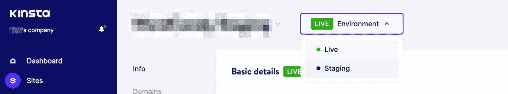

Creating a staging site in MyKinsta

但是，有时您可能希望完全脱机编辑您的站点。例如，如果你不能使用 Wi-Fi，你就不能打开一个中转网站。

幸运的是，你可以在你的电脑上保存一个本地版本的网站。当你离线建立了一个 WordPress 站点后，你可以在没有互联网连接的情况下进行修改。

如果你是一名专业的开发人员或设计师，你可能需要在离线状态下为客户的网站工作。一旦您克隆了它们并在本地工作，您就可以在不影响实时内容的情况下开发成功的编码改进。然后，您可以简单地将这些更改推送到原始站点。

另外，本地网站可以提供一个学习如何使用 WordPress 的有效途径。如果你是一个完全的初学者，你可以在[购买托管计划](https://kinsta.com/blog/what-is-web-hosting/)或[域名](https://kinsta.com/blog/how-to-buy-a-domain-name/)之前创建一个新的离线网站。这可以降低你尝试[本地 WordPress 开发](https://kinsta.com/ebooks/wordpress/wordpress-local-development/)的成本。

[When you’re editing a live website, any changes you make will be immediately implemented. 😅 Creating your site offline can make things simpler 😌Click to Tweet](https://twitter.com/intent/tweet?url=https%3A%2F%2Fkinsta.com%2Fblog%2Fbuild-wordpress-site-offline%2F&via=kinsta&text=When+you%E2%80%99re+editing+a+live+website%2C+any+changes+you+make+will+be+immediately+implemented.+%F0%9F%98%85+Creating+your+site+offline+can+make+things+simpler+%F0%9F%98%8C&hashtags=DevKinsta%2CWordPress)

## 如何离线建立一个 WordPress 网站(3 步)

现在你知道了使用本地 WordPress 站点的好处，让我们来讨论如何创建一个！

### 步骤 1:安装 DevKinsta

尽管你可以使用许多不同的本地 WordPress 开发工具,但是这些工具可能有复杂的设置过程。有了 [DevKinsta](https://kinsta.com/devkinsta/) ，您只需点击一下鼠标，就可以创建您的第一个本地环境:

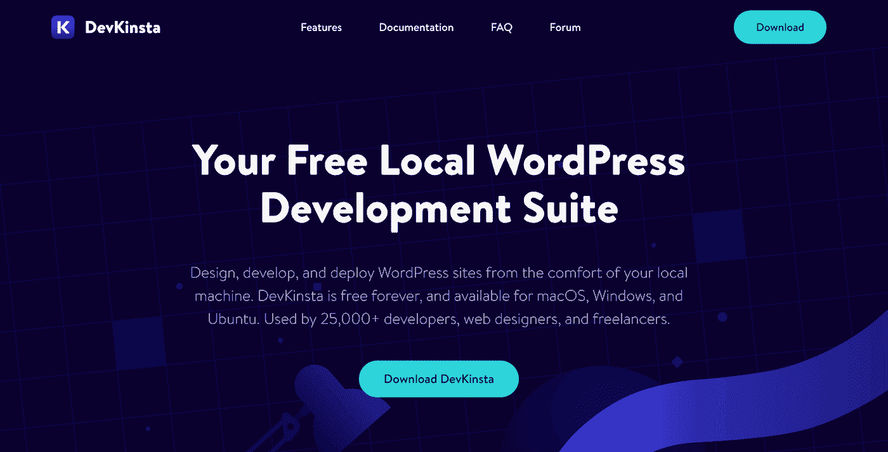

You can Download DevKinsta from the main page

以下是我们在 DevKinsta 中内置的一些高质量特性:

*   支持 PHP 7.2–8.0
*   与 [MyKinsta](https://my.kinsta.com/) 整合
*   本地[邮件管理](https://kinsta.com/blog/mailhog/)
*   内置数据库管理器

DevKinsta 可以支持 macOS、Windows 和 Linux 操作系统。但是，在您下载我们的本地开发工具之前，务必确保您的计算机满足以下要求:

*   至少 5GB 的磁盘空间
*   至少 1GB 内存
*   下载期间的互联网连接
*   在 BIOS 中启用虚拟化

然后，[安装过程](https://kinsta.com/webinars/install-and-use-devkinsta/)会根据您电脑的软件而有所不同。在你下载并打开 DevKinsta DMG 文件之前，你可能需要安装 [Docker 桌面](https://www.docker.com/products/docker-desktop/)。

### 步骤 2:添加新站点

一旦你安装了 DevKinsta，你可以使用三种不同的方法来创建一个本地 WordPress 网站。为了确保您选择了符合您需求的正确方法，让我们来看一下每种方法。

#### 方法 1:添加一个新的 WordPress 站点

如果 DevKinsta 安装正确，您将看到一个**创建新站点**页面。在这里，你可以添加一个新的 WordPress 站点，从 Kinsta 导入一个，或者创建一个自定义版本:

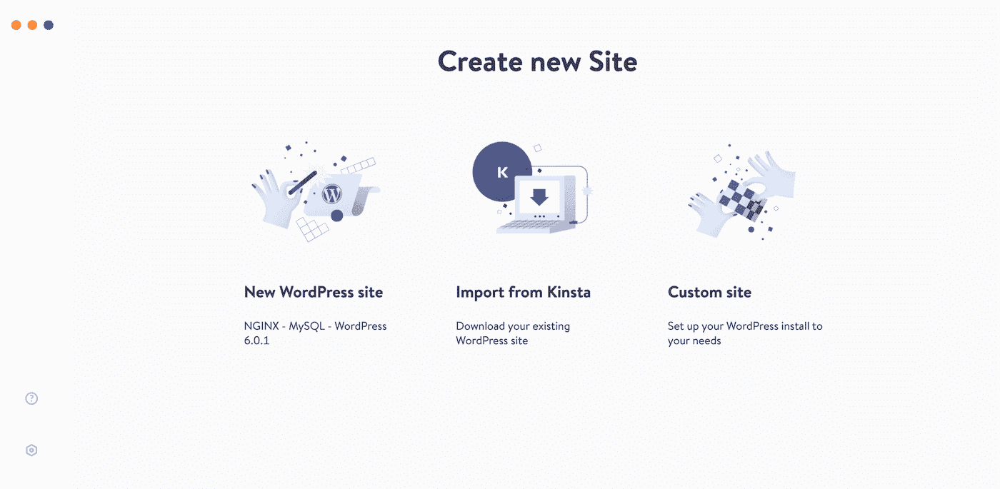

Create a new DevKinsta site

要从头开始创建一个全新的 WordPress 网站，选择 **New WordPress site** 。这将构建一个本地环境，配置有 [Nginx](https://kinsta.com/knowledgebase/what-is-nginx/) 、 [MySQL](https://kinsta.com/knowledgebase/mysql-community-server/) 和[最新的 WordPress 软件](https://kinsta.com/blog/wordpress-6-0/)。

对于这种方法，你需要做的就是填写一个网站名称、WordPress 管理员用户名和 WordPress 管理员密码。然后，点击**创建网站**:

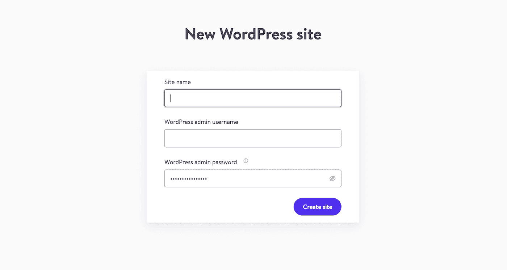

Create new WordPress login

30-60 秒后，DevKinsta 将创建一个新站点。您将能够看到关于新数据库、服务器、 [PHP 版本](https://kinsta.com/knowledgebase/devkinsta/php-versions/)等信息:

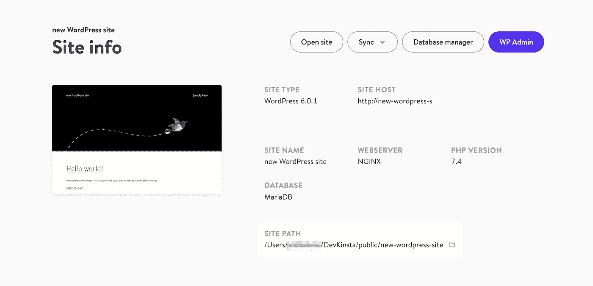

New offline site configuration

在此过程中，您可能需要输入电脑密码或接受确认对话框。这将允许软件对您的**主机**文件进行更改，并完成数据库的创建。

## 注册订阅时事通讯

### 想知道我们是怎么让流量增长超过 1000%的吗？

加入 20，000 多名获得我们每周时事通讯和内部消息的人的行列吧！

[Subscribe Now](#newsletter)

#### 方法 2:导入你的 Kinsta 网站

如果你有一个 [Kinsta 托管计划](https://kinsta.com/plans/)，你可以克隆你现有的网站。通过这样做，您可以轻松地将任何更改推回到原始的临时环境或活动站点。要开始，选择**从 Kinsta** 导入:

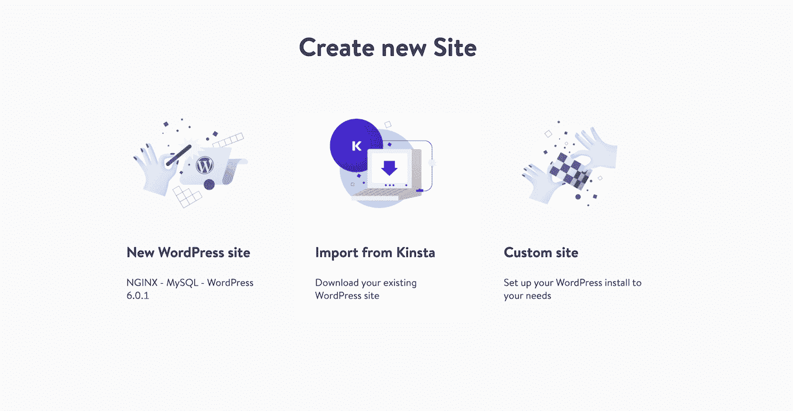

Download existing Kinsta site

接下来，您需要连接您的 MyKinsta 帐户。输入完用户名和密码后，点击**登录**:

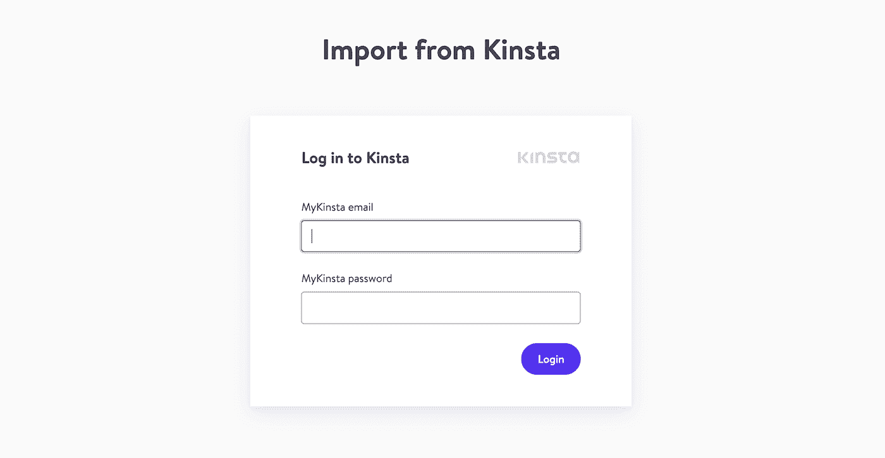

Log in with MyKinsta email and password

然后，选择您想要克隆到您的计算机的站点。由于 DevKinsta 支持临时环境和实时环境，因此您可以选择其中之一:

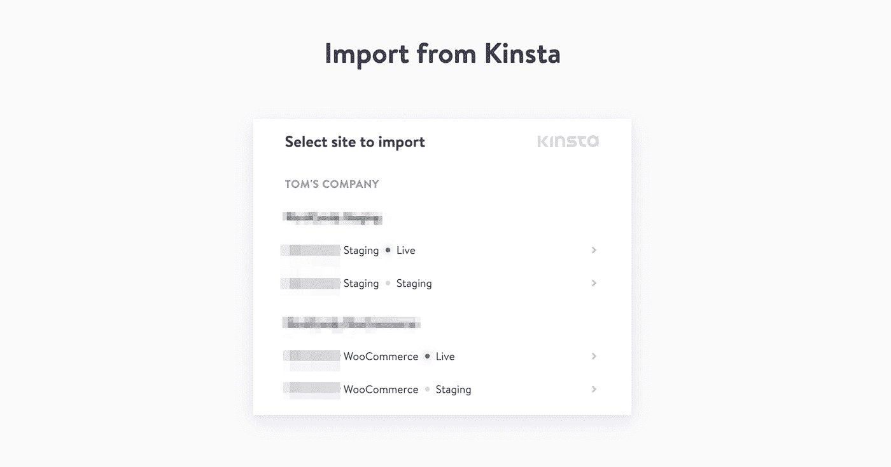

Select live or staging site to import

如果网站是[多站点](https://kinsta.com/wordpress-multisite-hosting/)，指定它是使用子域还是子目录。您也可以选择**无多站点**:

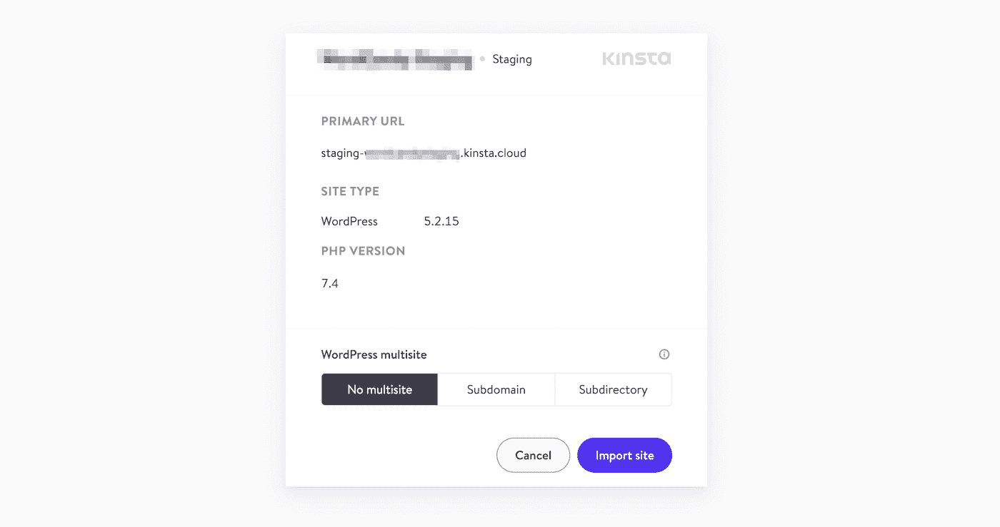

Add WordPress multisite details

在你点击**导入** **网站**后，DevKinsta 会创建一个你选择的网站的本地副本。

#### 方法 3:添加自定义站点

当你想对你的本地 WordPress 安装有更多的控制时，你可以选择**自定义站点**选项。这将使您能够配置有关站点的特定设置:

Struggling with downtime and WordPress problems? Kinsta is the hosting solution designed to save you time! [Check out our features](https://kinsta.com/features/)

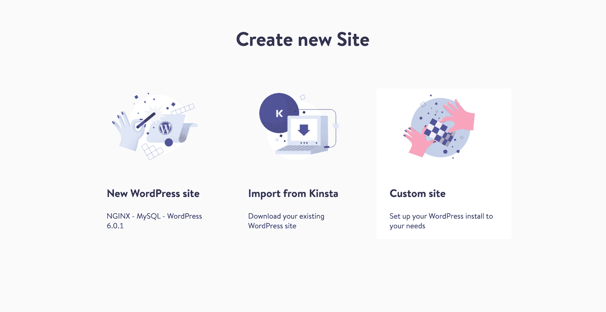

You can create an offline site with custom configuration

首先，为网站选择一个名称。您还可以命名数据库并选择一个 [PHP 版本](https://kinsta.com/knowledgebase/how-to-update-php-in-wordpress/):

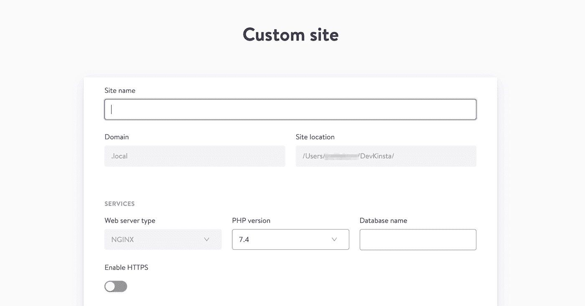

Fill out custom site details

在 **WordPress 细节**下，你可以修改站点标题，以及 [WordPress 版本](https://kinsta.com/blog/wordpress-version/)。最后，填写您的管理员电子邮件、用户名和密码:

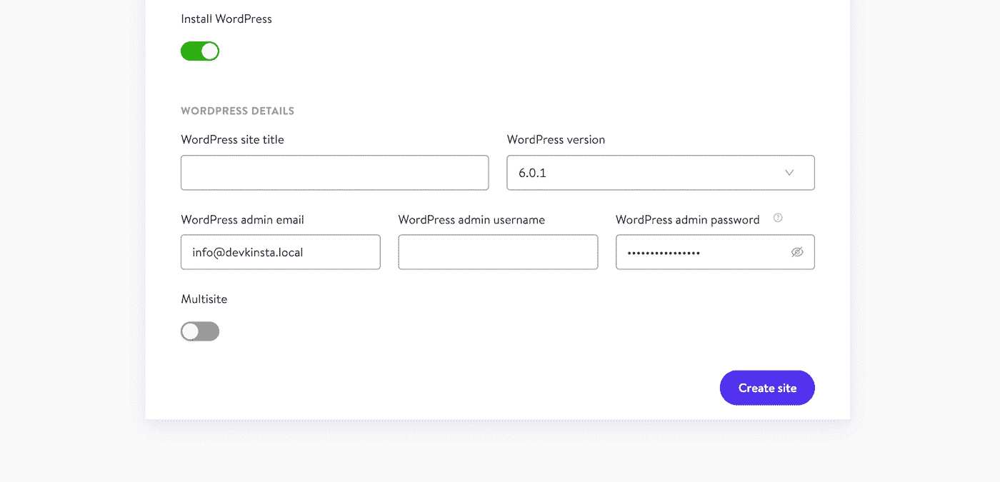

Complete WordPress login information

一旦你点击**创建** **站点**，DevKinsta 会将域名添加到你的**主机**文件中，并建立一个新的数据库。这应该只需要 15 到 20 秒。

### 第三步:管理你的本地网站

当你创建了一个本地网站后，你需要知道如何访问和管理它。通过这种方式，您可以实施更改并评估它们的成功程度。在**站点**页面，点击箭头图标打开您网站的前端:

Open offline WordPress website

要进入你的 [WordPress admin](https://kinsta.com/knowledgebase/wordpress-admin/) ，选择一个网站。然后，在**网站信息**页面的顶部，找到 **WP 管理**按钮:

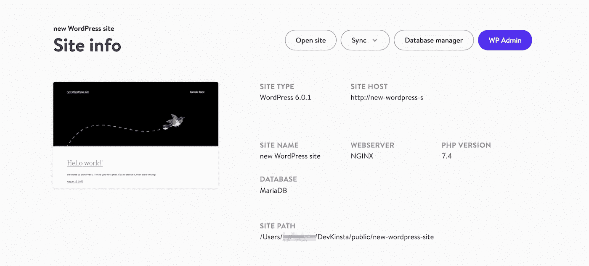

Click on the WP Admin button

在生成的浏览器中，你可以填写你的 WordPress 登录信息。然后，您将能够使用仪表板查看和编辑您的网站:

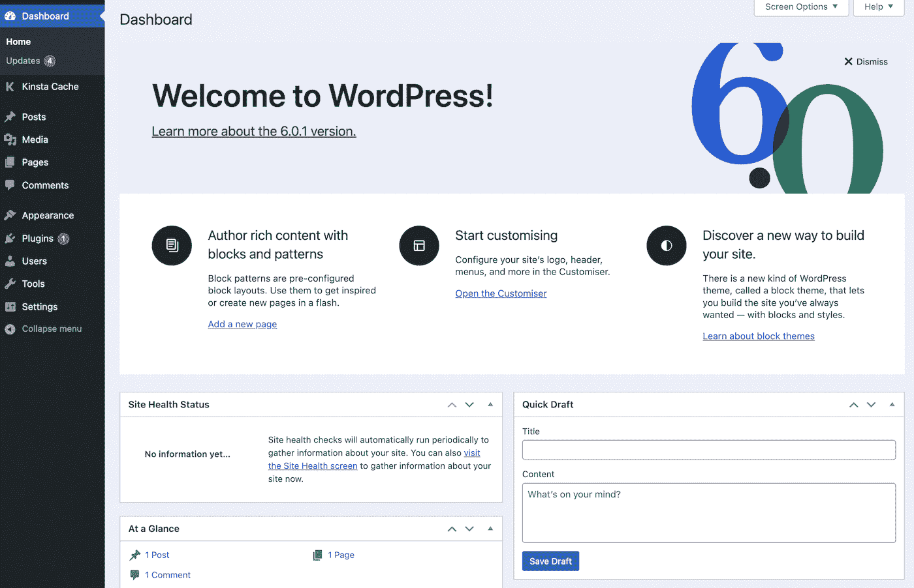

The WordPress dashboard is now opened offline

一旦你做了更改，你可以返回到 DevKinsta **站点信息**页面。通过选择 **Sync > Push to Kinsta** ，您可以将这些开发实现到您的 staging 或 live 站点上。或者，您也可以将更改从 Kinsta 拉到这个本地环境:

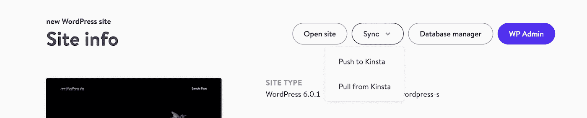

Push changes to and from Kinsta

如果你点击**数据库管理器**，你可以在浏览器标签中启动[管理器](https://kinsta.com/blog/adminer/)。使用这个工具，您可以创建新的数据库，检查表中的数据，更改列设置，执行 [SQL 查询](https://kinsta.com/knowledgebase/mysql-delete-table/)，等等:

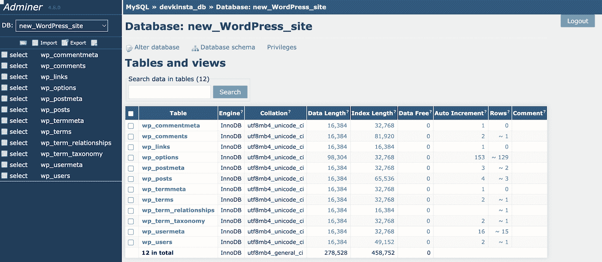

Manage Adminer database

作为初学者，你可能只需要创建一个本地 WordPress 站点。但是，如果您是一名开发人员或为一家机构工作，您可以在 DevKinsta 中构建和管理多个站点。

在 DevKinsta，每个站点都在一个容器化的环境中运行。这意味着您可以根据需要添加任意多的项目。为此，点击主页上的**添加站点**:

Manage local DevKinsta sites

现在，你应该有了一个新的离线 WordPress 站点和定制它所需的工具！这可以帮助你在没有 Wi-Fi 的情况下开发你的网站，避免出现现场编码错误。

[No internet connection? No problem. 😌 See how you can create a local, offline version of your site in this guide 🛠Click to Tweet](https://twitter.com/intent/tweet?url=https%3A%2F%2Fkinsta.com%2Fblog%2Fbuild-wordpress-site-offline%2F&via=kinsta&text=No+internet+connection%3F+No+problem.+%F0%9F%98%8C+See+how+you+can+create+a+local%2C+offline+version+of+your+site+in+this+guide+%F0%9F%9B%A0&hashtags=DevKinsta%2CWordPress) ## 摘要

启动 WordPress 的本地版本后，即使没有互联网连接，你也可以打开和管理你的网站。当您重新上线时，您可以简单地将您的更改推送到您的实时网站。这样，您可以随时完成开发任务。

使用 [DevKinsta](https://kinsta.com/devkinsta/) ，安装一个本地 WordPress 环境可以是一个简单的过程。今天就下载这个免费工具，只需点击一下就可以创建一个离线测试网站！

* * *

让你所有的[应用程序](https://kinsta.com/application-hosting/)、[数据库](https://kinsta.com/database-hosting/)和 [WordPress 网站](https://kinsta.com/wordpress-hosting/)在线并在一个屋檐下。我们功能丰富的高性能云平台包括:

*   在 MyKinsta 仪表盘中轻松设置和管理
*   24/7 专家支持
*   最好的谷歌云平台硬件和网络，由 Kubernetes 提供最大的可扩展性
*   面向速度和安全性的企业级 Cloudflare 集成
*   全球受众覆盖全球多达 35 个数据中心和 275 多个 pop

在第一个月使用托管的[应用程序或托管](https://kinsta.com/application-hosting/)的[数据库，您可以享受 20 美元的优惠，亲自测试一下。探索我们的](https://kinsta.com/database-hosting/)[计划](https://kinsta.com/plans/)或[与销售人员交谈](https://kinsta.com/contact-us/)以找到最适合您的方式。