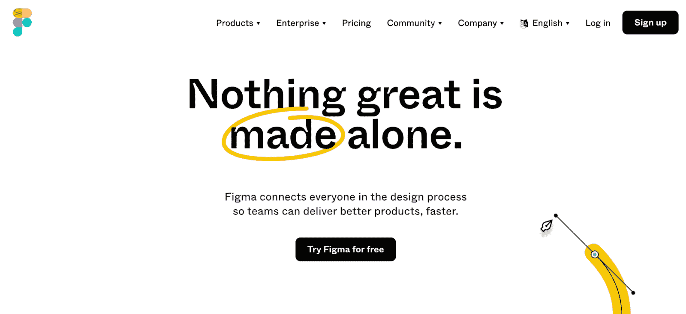
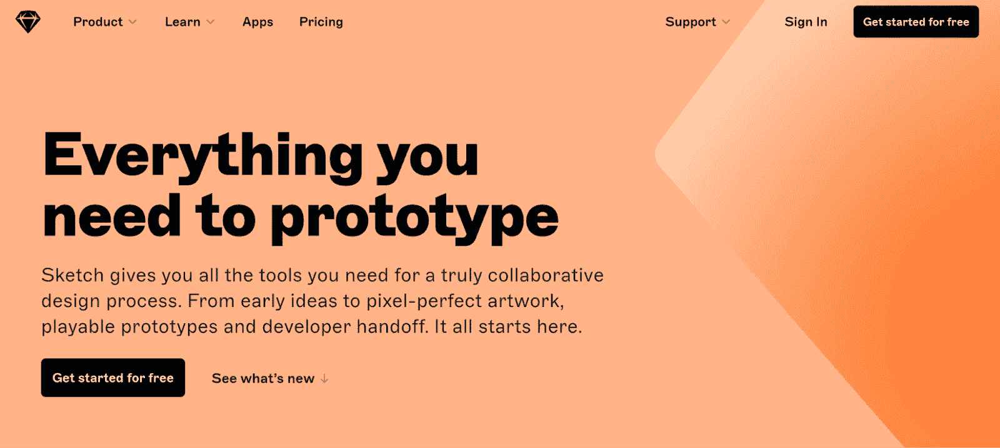
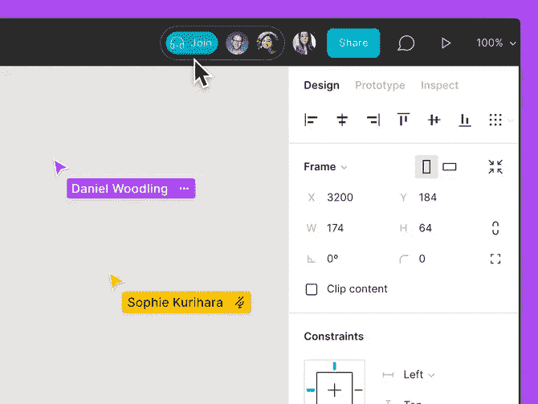
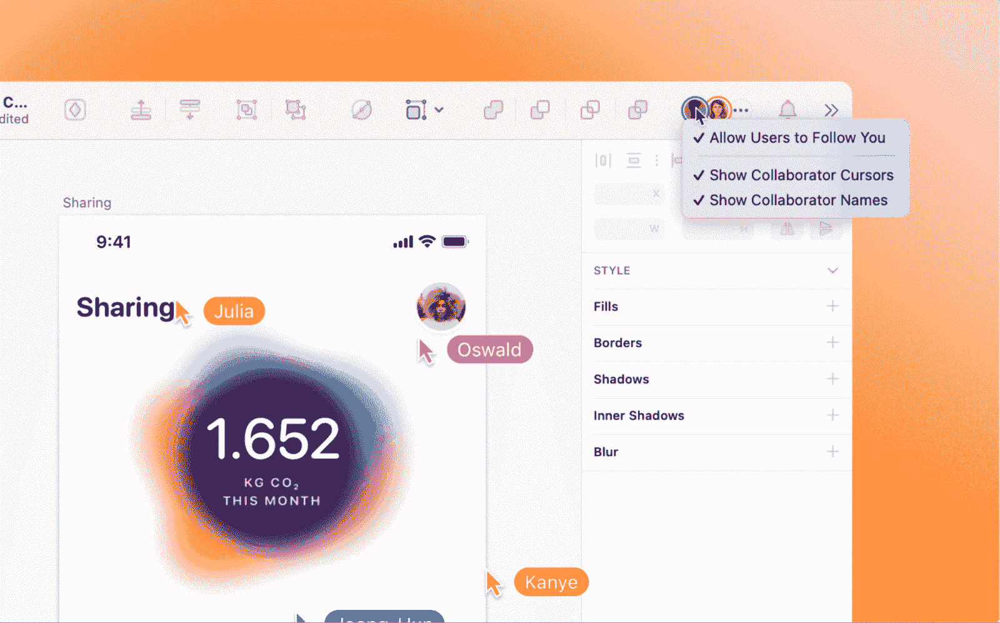
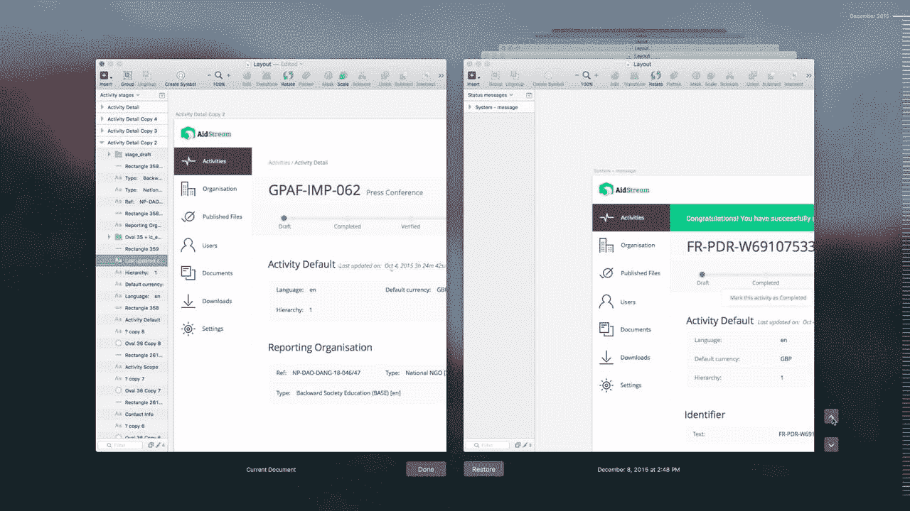
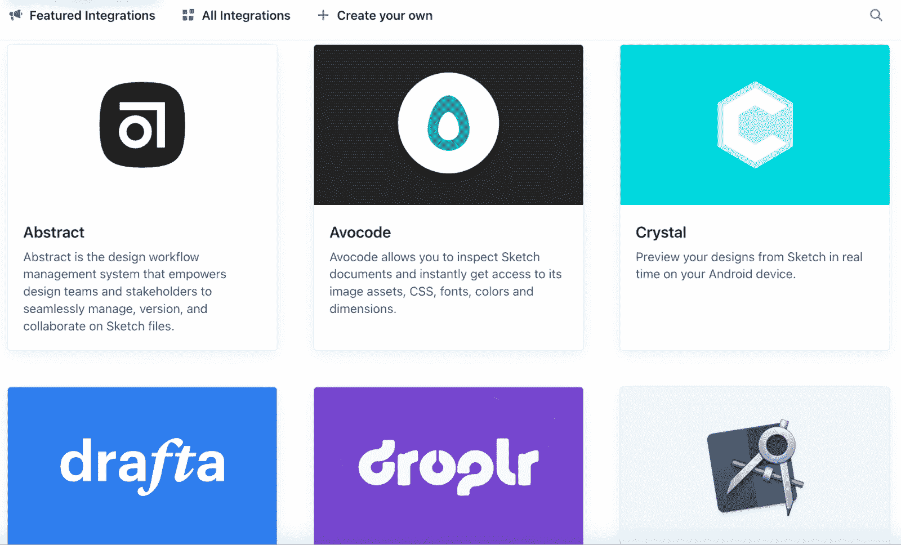
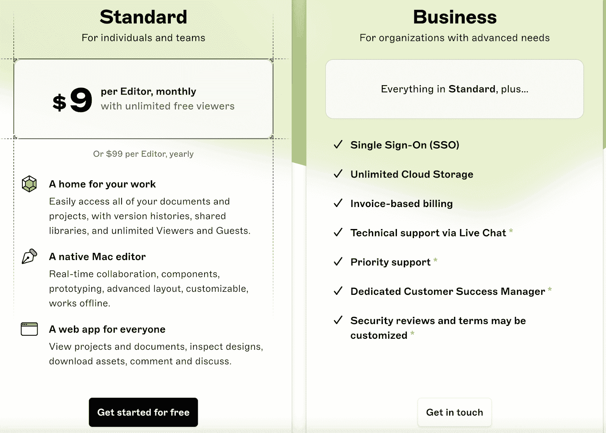
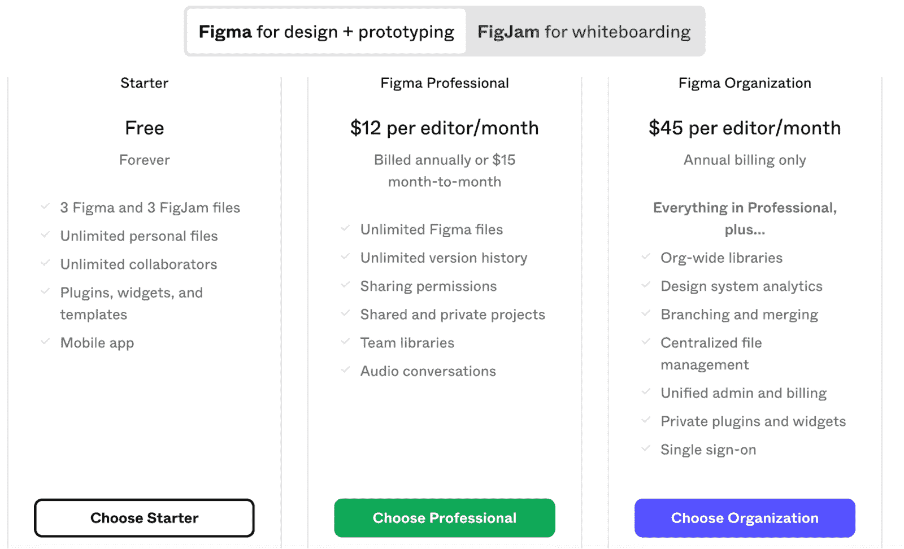
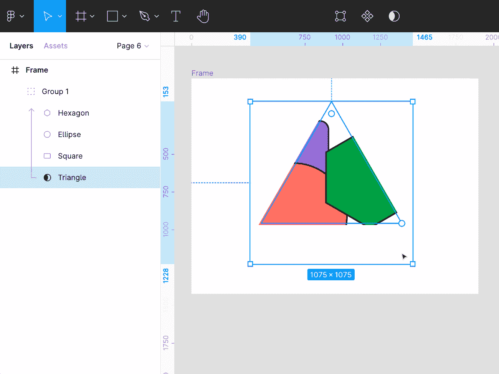

# Figma vs Sketch:两种设计工具的功能比较

> 原文：<https://kinsta.com/blog/figma-vs-sketch/>

在用户界面和用户体验设计领域，Sketch 多年来都是无可争议的王者。它是[网站设计师](https://kinsta.com/blog/web-design-principles/)寻求设计下一级界面的首选平台。其独特的功能(灵活的矢量编辑，简单的网格，智能指南等。)把 UI 设计行业带到了一个全新的高度。

但随着行业的发展，Figma 出现了，这是一个基于网络的多平台协作系统——一个新的草图替代方案。但这回避了一个问题:在 Figma 和 Sketch 的对决中，哪个工具领先？

有许多关键的差异可能会成为您是否应该选择 Sketch 或 Figma 来满足您的 UI 设计需求的决定因素。

在这篇文章中，我们将比较 Figma 和 Sketch，这样当你选择哪一个最适合你的下一个[响应式网页设计](https://kinsta.com/blog/responsive-web-design/)项目时，你可以在两者之间做出明智的决定。

## Figma 是什么？

Figma 被许多人视为 UI 设计工具领域的革命性发展。它是 Sketch 的第一个主要替代品，于 2016 年发布。它的出现让网页设计师们更容易挣到薪水。

Figma homepage

不像 Sketch 是你必须下载的本地设计软件，Figma 是一个通过浏览器工作的在线工具。当涉及到你的操作系统时，它也更加通用；它可以在 Windows 或 Mac 系统上使用，而 Sketch 只能在 Mac 上使用。

[Team Figma or Team Sketch? Find the right system for your next project with this guide ✨Click to Tweet](https://twitter.com/intent/tweet?url=https%3A%2F%2Fkinsta.com%2Fblog%2Ffigma-vs-sketch%2F&via=kinsta&text=Team+Figma+or+Team+Sketch%3F+Find+the+right+system+for+your+next+project+with+this+guide+%E2%9C%A8&hashtags=Figma%2CWebDesign)

Figma 具有协作设计功能，允许您与团队成员共享设计，他们可以实时与您一起工作。这使得它对希望参与设计过程的设计团队和客户更具吸引力。

Figma 也没有杂乱的软件安装。由于你是通过[浏览器](https://kinsta.com/browsers/)来访问这项服务的，所以你不必担心它会耗尽你设备上的内存或者经历一个复杂的安装过程。当然，由于 Figma 的在线性质，你将受到互联网的支配，如果你在一个没有连接的地区，你将无法进行你的设计。

如果你过去曾经使用过 Sketch，当你查看这个工具的用户界面时，你会很快意识到它在设计方面与 Sketch 非常相似。这是开发商有意为之的举动。根据多年来的行业标准来设计他们的用户界面，确保任何人都可以轻松转换。

## 什么是素描？

Sketch 是大多数 UI 设计师都非常熟悉的系统。多年来，它树立了用户界面设计的黄金标准，并开辟了一个新的功能领域。

Sketch homepage

在 Sketch 成为流行的 UI 设计平台之前，设计师通常使用 Adobe Photoshop 来实现他们的创作。然而，任何使用过 Photoshop 的人都会告诉你，它并不是为了设计一个用户友好的网站而创建的，而且非常不适合这个任务。它可能非常适合照片或电子邮件设计，但它不适合网页设计师。

Sketch 是原生桌面 app 这意味着它必须本地安装在您的计算机上。它不需要互联网连接，但也不能从任何地方访问，不像 Figma 这样基于网络的工具。

Sketch 是一个矢量图形编辑器，于 2010 年首次向公众发布。它在设计界产生了影响，因为它是专门为数字设计而设计的，而不是像 Photoshop 这样的印刷设计。

虽然该软件仍需在本地安装，但同步的 web 应用程序也可用于与设计团队协作。

## Figma 的主要特点

Figma 有许多关键特性，使其成为整个 UI 设计行业中的明星和受欢迎的服务。首先，这是一个协作系统，允许设计师与团队成员和客户分享他们的工作。

设计团队可以轻松地协同工作，实时编辑项目或记录各种设计元素。这个特性在现代商业世界中非常有用，许多设计团队[远程工作](https://kinsta.com/blog/working-remotely/)并分布在世界各地。

Figma’s collaboration feature in progress

系统内置了协作共享功能，允许协作者在任何需要做笔记的地方留下评论，并且不需要额外费用。

在与客户打交道时，这一功能可能会很有用，因为他们可以在整个设计过程中为您提供指导。如果你开始走一条客户不喜欢的路，客户可以在你走得太远而浪费时间之前发现问题并记录下来。

您还可以邀请开发人员探索您的原型，并使用单个链接导出资产。

Figma 的主要优势之一是该系统不需要直接下载到设备上。这是一个基于网络的应用程序，可以通过浏览器访问。软件下载通常很复杂，会耗尽宝贵的硬盘空间。通过在线使用应用程序，你节省了大量空间，最终有利于你的设备的速度和性能。

由于有几个专门为新用户设计的特殊教程，学习如何使用 Figma 也很容易。这消除了学习过程中的猜测，并帮助您从一开始就利用 Figma 的全部功能。

Figma 有一个插件库，尽管目前还不太广泛。这项功能于 2019 年推出，因此开发者社区仍在增长。

灵活的向量操作是 Figma 的一个非常有益的特性。使用这个系统时，矢量编辑器被称为矢量网络。您可以使用矢量网络将多条线连接到一个奇点。这最终会提高矢量绘图的生产速度，并帮助您更快地完成项目。

组件特征是 Figma 版本的草图信号特征。这些各自的特征是可以跨页面重复并一起编辑的元素。Figma 有一个保持不变的主组件。这也可以通过复制主组件并编辑它来更改。这样做可以在整个工作过程中更新组件的每个实例。

## 素描的主要特征

Sketch 在特写部分也不逊色，它拥有强大的元素，多年来一直是这个行业的中流砥柱。

Sketch’s real-time collaboration app

该公司早在 2021 年就推出了一款实时协作应用。这个相对较新的功能基本上复制了 Figma 的协作功能。但是，所有合作者必须付费订阅 Sketch，并在其设备上安装 Mac 应用程序，才能使用实时合作。

Sketch 有一个可浏览的设计版本历史，如果用户改变主意并决定需要返回并从一个更早的点开始，他们可以返回到更早的版本。

Sketch allows you to restore previous versions of your work

当使用 Sketch 时，你可以邀请观众到系统中来[测试你的原型的可用性](https://kinsta.com/blog/website-usability-testing/)。这很有用，因为您的测试人员可以指出您完全没有注意到的缺点或设计缺陷。

Sketch 用户可以奢侈地选择大量的第三方集成插件，这些插件是多年来精心策划的。这使得 Sketch 比 Figma 有很大优势，fig ma 在 2019 年才开放了其集成开发平台。

由于这些集成，你会发现 Sketch 是一个高度可定制的平台。它的插件包括翻译、原型制作、开发人员移交和动画。

草图允许通过称为节点的连接点进行向量操作。它还具有 web inspector 特性，允许开发人员检查和导出资产。

草图允许您创建独立的样式。这包括通过不同的颜色、文本和效果库进行个性化。

该系统还使用拖放界面，允许您在页面上点击并拖动元素。这使得学习变得非常容易。

## 使用 Figma 的利与弊

### Figma 优势

Figma 有几个优点，使其成为市场上最受欢迎的草图替代品之一。

首先，它具有很好的可访问性，可以在多个平台上访问。它还具有灵活的向量操作和实时协作功能，这使得与远程团队合作并创建一些真正精湛的 UI 设计变得很容易。

它还具有简单的开发人员移交功能，允许您只需点击几下鼠标就可以将每个项目转移到下一步。

由于 Figma 为新老用户提供了丰富的教育资源，学习如何使用 fig ma 也非常容易。

### Figma 缺点

尽管 Figma 有很多好处，但当您搜索 UI 设计平台时，它仍然有一些不容忽视的缺点。

Figma 是一项比 Sketch 更新的服务，它在 2019 年才开始推出集成和应用程序。这意味着它的特色是一个小的集成库，与竞争对手提供的相比相形见绌。然而，随着时间的推移，它可能会增长，这种消极会变成积极的。

虽然通过网络使用 Figma 是理想的，但您需要互联网连接才能访问其功能。没有可用的离线模式。

## 使用草图的利与弊

### 草图优势

使用速写有很多好处。十多年来，它一直是设计界的热门产品，这有几个原因。

它的长寿是它的优点之一。因为它存在了这么长时间，很多人都习惯了。这意味着有很多指导。这是一个许多网站设计者学习过的系统，所以任何想充分利用 Sketch 的人都可以找到资源。

## 注册订阅时事通讯

### 想知道我们是怎么让流量增长超过 1000%的吗？

加入 20，000 多名获得我们每周时事通讯和内部消息的人的行列吧！

[Subscribe Now](#newsletter)

Sketch has a vast library of integrations

随着时间的推移，Sketch 还开发了数量惊人的第三方集成，以提供最佳的个性化草图体验。

因为这是一个[本地安装的](https://kinsta.com/blog/install-wordpress-locally/)程序，所以也可以离线工作。这对于那些网络服务不稳定的人或者那些不得不在旅途中工作的人来说是一个巨大的好处，因为 WiFi 并不总是可用的。

### 草图缺陷

Sketch 也有几个缺点，可能会让有抱负的用户在购买前犹豫不决。

例如，Sketch 只能在 Mac 上使用，所以如果你习惯在 PC 上进行设计，或者只是买不起昂贵的 Mac 笔记本电脑，那么这个系统就不适合你。

虽然该公司已经创建了一个实时协作 web 应用程序，这很好，但这项服务仍然是新的，而且有限。假以时日，这将成为一个巨大的优势，但目前，使用 Figma 进行协作要容易得多。

您必须在本地计算机上安装草图软件。这会耗尽硬盘空间，并对 Mac 的速度产生负面影响。

## Figma vs Sketch:势均力敌的比较

现在我们已经了解了 Figma 和 Sketch 的基本优缺点，让我们在几个类别中对两者进行正面比较。

### 合作

谈到协作设计，Sketch 只是在 2021 年通过使用一个网络应用程序推出了这一功能。你所有的合作者也需要付费订阅草图，这个功能就像软件本身一样，只能在 Mac 上使用。

这种基于云的协作功能更像是一个 Dropbox 文件共享系统。

Figma 允许在任何平台上进行实时协作。该系统的工作方式与[谷歌文档](https://kinsta.com/blog/google-docs-to-wordpress/)相同，用户可以在同一个项目上一起工作，并实时做出可见的更改和评论。你甚至可以看到其他用户的鼠标移动，没有同步或滞后时间的问题。

### 成本效益

Sketch 的软件分为两种不同的定价方案。

Sketch has two different pricing plans

草图标准计划的费用是每个编辑每月 9 美元。它还带有无限的免费观众。

商业计划的定价是一个谜，因为 Sketch 不公开这些信息。要获得商业计划的资格，你至少需要 25 名编辑。

此服务仅按年定价，没有按月定价的选项。这意味着这将是一笔巨大的前期投资。

草图业务计划包括单点登录、无限制的云存储、发票账单、实时聊天技术支持、专门的客户成功经理以及定制的安全审查和条款。

Struggling with downtime and WordPress problems? Kinsta is the hosting solution designed to save you time! [Check out our features](https://kinsta.com/features/)

Figma has many different pricing options

Figma 的定价要透明得多，有不同的定价方案。

Figma 的启动计划是免费的，但它有一些限制。您只能处理三个 Figma 文件和三个 FigJam 文件。

然而，它也附带了无限的个人文件和合作者。您可以免费使用插件、模板和小部件。免费计划甚至包括使用 Figma 移动应用程序。

Figma 的专业计划是每个编辑每月 12 美元，按年计费。如果你想要一个月到月的选择，你会看到每个编辑每月 15 美元。

使用专业计划时，您可以获得无限的 Figma 文件、无限的版本历史记录和共享权限。如果您想限制访问，甚至可以将某些项目设为私有。此外，您可以获得团队库和录制与合作者的音频对话的能力。

组织计划的费用是每个编辑每月 45 美元，并且只按年计费。

通过此计划，您可以创建组织范围内的库。您还可以设计系统分析并进行分支和合并。

组织计划中包括集中文件管理和单点登录，管理和计费是统一的。你也可以使用私有的部件和插件。

Figma 最昂贵的计划是企业计划。每个编辑每月 75 美元，每个 FigJam 编辑每月 5 美元。该计划仅提供年度计费，并允许更灵活的控制和高级安全性。

### 易用性/入门

这两个服务共享相似的接口，这意味着一旦你学会了如何使用其中一个，在它们之间切换是非常容易的。

Figma 提供操作指南和教学视频，帮助新用户快速上手。Sketch 通过官方渠道获得的信息指南有限，但该系统已经存在很长时间了，而且有大量的信息。

### 可扩展性(插件和集成)

Sketch 有大量可用的插件和集成。这个巨大的应用程序库类似于 WordPress 令人印象深刻的主题和插件库。它负责增强个性化，您可以在整个草图体验中使用。

Figma 早在 2019 年就添加了集成，但遗憾的是，几乎没有可用的选项。

常见的集成功能包括但不限于:

*   样机研究
*   翻译
*   动画片
*   开发者移交

### 特征

Figma 非常适合远程团队，因为它具有实时协作的特性。此外，其

网格和约束是灵活的，允许您创建响应性和可调整大小的布局。

Sketch 使用组大小调整功能，但它将您限制为只有四个选项。

Figma uses vector networks to create a better path model

Figma 的矢量网络改进了路径模型。直线和曲线不再必须形成一条链。相反，它们可以在任意两点之间移动。

Figma 还具有优秀的开发人员移交特性，当需要向开发人员提供 UI 来准备发布时。

Sketch 可以使用它的集成来弥补它的许多特性缺点。比如 [Zeplin](https://kinsta.com/blog/saas-products/#9-zeplin) 就是一款可以用于开发者 handoff 的 app。

### 性能和速度

你的速度会受到很多因素的影响，从你硬盘上的空间到你为网站选择的主题。Figma 没有报告速度或滞后问题，协作设计会议可以实时进行。

Sketch 是 Mac 上本地安装的软件，所以网速不会影响它的性能。因此，它拥有高性能和速度，甚至可以在您的设备离线时运行。

### 样机研究

Figma 在原型开发时提供了更多的 UI 触发器。这些触发因素包括:

*   onclick
*   悬停时
*   拖动时

Figma 还包括一个稳定的原型预览，优于 Sketch 上提供的内容。您可以利用原型屏幕之间的标准过渡。这包括随意搬进搬出。

Figma 甚至使用智能动画功能，让您只需点击几下就可以创建高级动画。然而，Figma 不包括页面之间的链接来连接您的框架。

Sketch 有原型插件，使整个过程更加流畅。其中包括 Mockplus Cloud、InVision Craft 和 Flinto。

[借助这些强大的工具之一，为您的最佳网页设计体验做好准备🛠 点击推文](https://twitter.com/intent/tweet?url=https%3A%2F%2Fkinsta.com%2Fblog%2Ffigma-vs-sketch%2F&via=kinsta&text=Get+prepped+for+your+best+web+design+experience+with+help+from+one+of+these+powerful+tools+%F0%9F%9B%A0&hashtags=Figma%2CWebDesign)

## 摘要

Figma 和 Sketch 是流行的 UI 设计平台，在这些平台上你可以开发许多优秀的、用户友好的网站。至于您应该使用哪一种，这主要取决于您在寻找什么。这对于选择你的 UI 设计工具和选择你的[电子邮件客户端](https://kinsta.com/blog/protonmail-vs-gmail/)都是一样的道理。

如果你主要在 Mac 上工作，喜欢离线工作，因此利用一个巨大的集成库来帮助创建一个更加个性化的体验，那么 Sketch 是适合你的。

如果您想要一个免费的选项，在 PC 上工作，需要灵活的协作，并希望使用灵活的矢量操作，那么 Figma 可能是您正在寻找的答案。

如果你正在为你使用这些系统创建的 WordPress 网站寻找高质量的托管服务，只需看看 [Kinsta](https://kinsta.com/) 就行了。[今天就安排一次演示](https://kinsta.com/schedule-demo/)，看看 Kinsta 的[代理托管计划](https://kinsta.com/blog/agency-focused-managed-hosting/)如何与您的 UI 设计平台携手合作，创造一个自始至终的无缝体验。

设计项目需要帮助吗？查看我们的[代理目录](https://kinsta.com/agency-directory/)以获得可信代理的完整列表。通过项目价格、框架等进行搜索。

* * *

让你所有的[应用程序](https://kinsta.com/application-hosting/)、[数据库](https://kinsta.com/database-hosting/)和 [WordPress 网站](https://kinsta.com/wordpress-hosting/)在线并在一个屋檐下。我们功能丰富的高性能云平台包括:

*   在 MyKinsta 仪表盘中轻松设置和管理
*   24/7 专家支持
*   最好的谷歌云平台硬件和网络，由 Kubernetes 提供最大的可扩展性
*   面向速度和安全性的企业级 Cloudflare 集成
*   全球受众覆盖全球多达 35 个数据中心和 275 多个 pop

在第一个月使用托管的[应用程序或托管](https://kinsta.com/application-hosting/)的[数据库，您可以享受 20 美元的优惠，亲自测试一下。探索我们的](https://kinsta.com/database-hosting/)[计划](https://kinsta.com/plans/)或[与销售人员交谈](https://kinsta.com/contact-us/)以找到最适合您的方式。