# 无 Cookies 的未来:为第三方 Cookies 的终结做准备

> 原文：<https://kinsta.com/blog/cookieless-future/>

每个人都喜欢饼干。或者他们有吗？就像燕麦葡萄干一样，人们要么喜欢要么讨厌第三方网络饼干。现在，像谷歌这样的主要玩家正试图完全淘汰它们。

这种逐渐远离第三方 cookiess 的转变被称为“无 cookie 的未来”尽管专家说，无烹饪的未来预示着隐私和安全的美好前景，但它无疑给营销人员、企业和网站所有者带来了许多挑战和障碍。即使是消费者也会有一些事情需要解决。

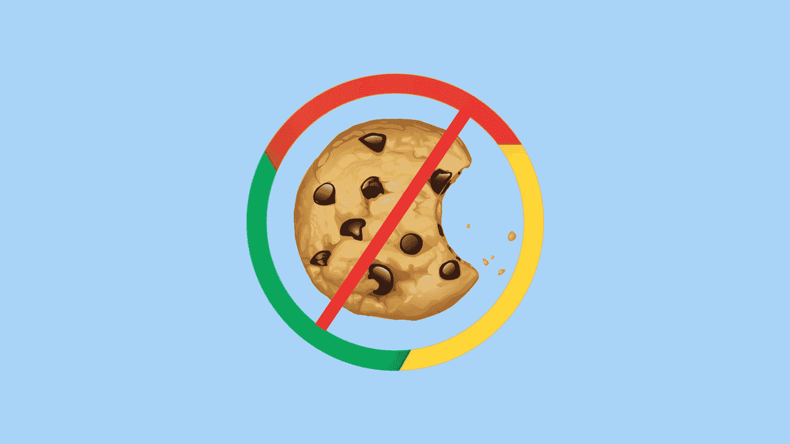

Cookies don’t look as tasty as they used to

随着无烹饪的未来即将到来，现在是准备的最佳时机。在这篇文章中，我们将了解更多关于无烹饪的未来，它的影响，以及我们如何充分利用它。

请继续阅读，了解更多信息，并开始告别 cookies——或至少告别数字 cookie。

## 什么是“无烹饪”的未来？

顾名思义，无 cookiess 的未来指的是最近的一种转变，即不再出于各种目的使用第三方 cookie。

但是这有什么意义呢？虽然你可能已经知道什么是 cookie，但你可能不知道它们的使用频率——或者它们带来的隐私问题。

随着用户隐私和安全在网络上变得越来越重要，谷歌、火狐和其他大型网络公司开始完全放弃某些 cookies。

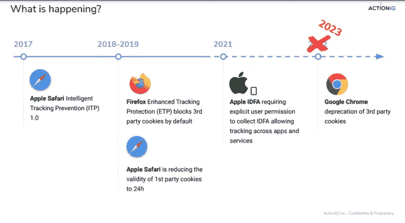

Google Chrome and other browsers plan to drop third-party cookies (**Source:** [MarTech](https://martech.org/3-ways-marketers-can-prepare-for-a-cookieless-future/))

虽然这可能是用户隐私的胜利，但它也给网站所有者和营销人员带来了很多不确定性，他们使用第三方 cookies 来跟踪个人用户并显示相关广告。因此，随着主要参与者继续向无烹饪的未来过渡，许多人都在争夺同样美味的替代品。

但是在我们深入研究之前，让我们简单回顾一下 cookies 到底是什么以及它们是如何造成危害的。

[The end of cookies is near... here's everything you need to know 🍪Click to Tweet](https://twitter.com/intent/tweet?url=https%3A%2F%2Fkinsta.com%2Fblog%2Fcookieless-future%2F&via=kinsta&text=The+end+of+cookies+is+near...+here%27s+everything+you+need+to+know+%F0%9F%8D%AA&hashtags=WebPrivacy%2CWebTips)

### 什么是饼干？

在网络上，cookies 是包含有助于识别您和您的计算机的用户数据的小文件。这些用户数据可能包括您的用户名、密码或电子邮件地址。

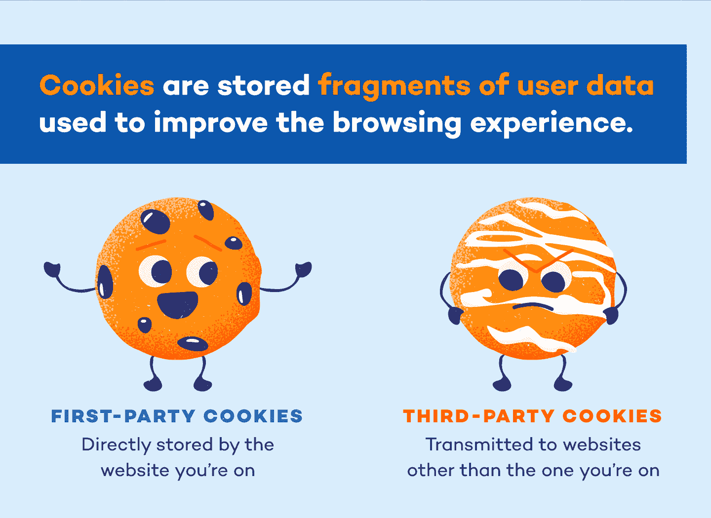

Just like their baked counterparts, web cookies come in several flavors (**Source:** [Panda Security](https://www.pandasecurity.com/en/mediacenter/security/are-cookies-bad/))

因为它们的主要目的是识别身份，所以 cookies 在很大程度上就是用来识别身份的:告诉网站你是谁。正如您所想象的，这使得 cookies 对许多应用程序都很有用，从维护登录会话到通过上下文定位投放广告。

就像他们的同名糖果一样，饼干也有几种不同的口味——有些比其他的更可口。

在任何情况下，cookies 都是由您访问的网站的 web 服务器提供给您的。如果你访问的网站没有选择不提供曲奇饼，你通常会得到两种主要“口味”中的一种。

*   **第一方 cookie:**cookie 直接从您访问的网站提供。这些通常用于维护会话，因此您下次访问时将保持登录状态。在大多数情况下，只要您访问的网站没有被破坏，第一方数据就是安全的。
*   **第三方 cookie:**由不在您访问的网站上的第三方提供的 cookie。这些 cookies 通常通过广告或其他功能链接到第三方。因此，即使是最善意的网站所有者也可能成为第三方 cookies 的渠道，例如，如果他们列出了来自信誉不佳的第三方的广告。

不难想象，在我们的两种口味中，第三方饼干更具争议。在下一节中，我们将探究为什么它们会引起如此多的关注，以及为什么它们会被如此广泛地使用。

### 第三方曲奇争议

第一方的数据通常是相当良性的(本质上是口味的“巧克力片”)，第三方的饼干就不那么无辜了，它们背后的争议是无饼干未来的主要原因之一。

但是是什么让它们如此有争议呢？

首先，第三方 cookies 经常未经消费者同意就被发送出去。这意味着当你浏览时，你访问的广告可能会将第三方 cookies 偷偷放入你的电脑，让这些第三方跟踪你上网的位置。

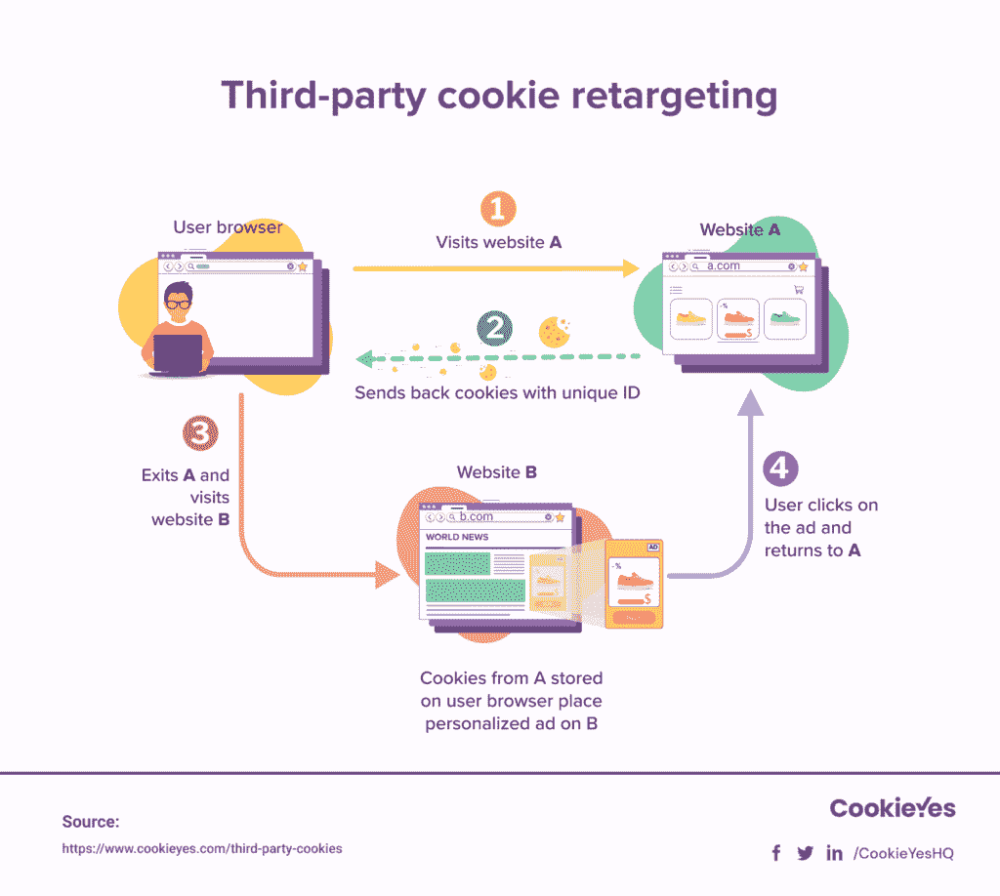

Cookies have clever ways of following you around

在最好的情况下，第三方 cookies 使用这种跟踪功能在您访问的其他网站上提供个性化体验(主要是个性化广告)。你可以跟着图片看用户如何获得第三方 cookie，这改变了他们获得广告的方式。

这有什么大不了的？当然，定向广告可能有点令人毛骨悚然，但也没那么糟糕——对吧？

是也不是。Cookies 本身没有本质上的坏或有害，第三方或其他。然而，许多用户只是对被跟踪感到不舒服。

此外，尽管 cookies 本身是安全的，但它们有时也是安全威胁的载体，如跨站点请求伪造攻击(CSRF)和[跨站点脚本(XSS)](https://kinsta.com/blog/wordpress-security/) 。虽然我们稍后会深入探讨这些问题，但现在要知道，这两种(以及其他)威胁都有可能让[恶意第三方](https://kinsta.com/blog/dark-patterns/)对完全无辜的网站实施网络攻击。

这些隐私和安全问题已经足够让许多主要的搜索引擎技术平台倒闭。但是“无烹饪”到底是什么样子的呢？

### “无烹饪”是什么意思？

“无 cookiess”意味着不使用或不接受第三方 cookie。

由于我们的许多网络体验依赖于 cookiess 来实现个性化，很难想象没有 cookie 的生活会是什么样子。在没有某种身份识别手段的情况下，我们应该如何保持登录、获得个性化体验，或者投放[有针对性的广告](https://kinsta.com/blog/ad-retargeting/)？

令人欣慰的是，有许多替代方案可以让我们拥有 cookie 的所有功能，而不需要 cookie 本身。尽管许多网站和浏览器仍在转型，但这些转型都是为了一个共同的目标:一个没有烹饪的未来。

### 为什么没有烹饪的未来？

没有烹饪的未来有很多好处，尤其是在安全方面。

然而，这些好处看起来更像是给网站所有者和营销人员带来的不便，尤其是 97%的广告商使用第三方数据和 cookies。因此，许多人开始质疑为什么没有烹饪的未来是必要的。

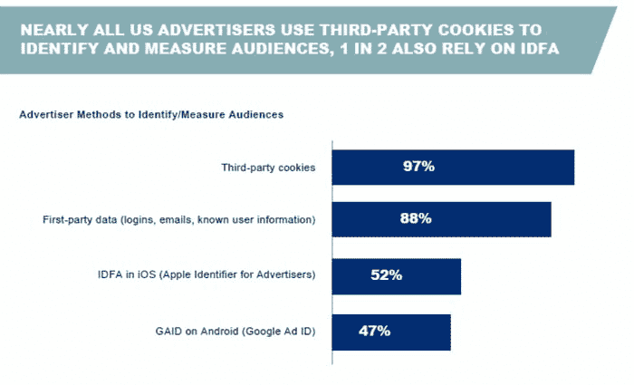

97% of advertisers use third-party cookies to track their audiences (**Source:** [Advertiser Perceptions](https://www.advertiserperceptions.com/how-advertisers-are-solving-for-identity-in-a-cookieless-future/))

谢天谢地，[网站所有者](https://kinsta.com/single-site-plans/?plan=visits-business3&interval=month)和营销人员仍将能够个性化体验和目标用户——只是没有 cookies 固有的隐私和安全问题。要做到这一点，他们必须利用 cookie 替代品，如永久网络 id 等第一方数据和谷歌隐私沙箱等工具。

另外，一个没有烹饪的未来也许并不完全没有烹饪。由于第三方 cookie 是主要问题，许多网站可能仍然能够继续使用第一方 cookie(他们自己提供的 cookie)而不用担心。

但是，即使有隐私和安全方面的好处，没有烹饪的未来仍然会让人觉得是一个大麻烦。令人欣慰的是，正如我们接下来将看到的，有更多的理由采用 cookie 限制——其中一些甚至可以节省成本。

## 为什么 Cookies 会被淘汰？

隐私和安全问题是 cookie 淘汰背后的最大原因。因此，大多数买家和卖家认为，从长远来看，逐步淘汰实际上会让数字广告受益。

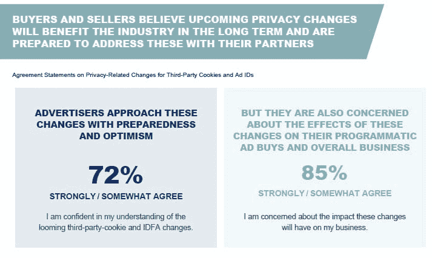

Most people believe that a cookieless future is for the best (**Source:** [Advertiser Perceptions](https://www.advertiserperceptions.com/how-advertisers-are-solving-for-identity-in-a-cookieless-future/))

虽然这可能足以继续下去，但还有其他原因说明无烹饪的未来是一个好主意。让我们更深入地探讨一下这些重要因素。

### 隐私

隐私可能是围绕第三方 cookies 的最大担忧，也是许多品牌和公司摆脱它们的最大原因。

正如我们已经讨论过的，第三方 cookies 会带来一系列隐私问题。对于大多数人来说，最大的问题是在不知情的情况下跟踪用户行为。在这里，广告商和其他第三方(无论恶意与否)早就可以在用户的浏览器中存储 cookies。

尽管像《通用数据保护条例》( GDPR)这样的法律现在要求用户同意 cookies，但许多用户出于习惯或方便，只是点击这些提示(如下所示)。

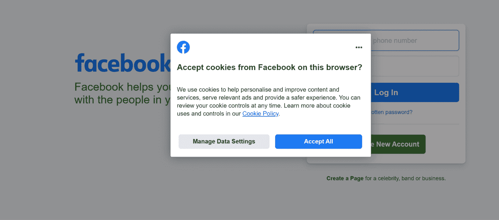

A consumer consent prompt from Facebook

因此，不管 GDPR 合规性如何，第三方 cookies 仍然是一个普遍存在的问题。

此外，cookies 可以帮助第三方建立详细的——而且可能是侵入性的——用户档案，而不仅仅是跟踪用户行踪和发布广告。尽管一些社交媒体平台向他们的用户开放了一些个人资料，但大多数人还是震惊地发现他们的平台对他们的了解有多少。

无论如何，这看起来都有点令人毛骨悚然和侵犯性。随着品牌更加重视消费者的信任和隐私，他们也开始拥抱一个无烹饪的未来，这样他们就可以建立更好的客户体验。

## 注册订阅时事通讯

### 想知道我们是怎么让流量增长超过 1000%的吗？

加入 20，000 多名获得我们每周时事通讯和内部消息的人的行列吧！

[Subscribe Now](#newsletter)

### 安全性

好像侵犯你的隐私还不够似的，cookies 还会带来一些安全风险。说到有不速之客！

以下是 cookies 可能带来的一些主要安全问题。

*   **跨站点请求伪造(CSRF 或 XSRF):**cookie 可能保存有价值的信息，但它们并不聪明——聪明到无法分辨请求是来自可信用户还是其他人。结果，许多[恶意](https://kinsta.com/blog/wordpress-security-plugins/)第三方利用 cookies 来执行 CSRF 攻击。这些攻击通过可信网站将有害 cookies 偷偷植入用户的浏览器，只为他们在用户访问的各个网站执行恶意请求(如删除文件)。
*   **跨站脚本(XSS):** 被攻破的网站通常被用作发起 XSS 攻击的平台。在这些攻击中，黑客向网站发布恶意的 JavaScript 或 HTML 代码，这些代码可用于向不知情的用户请求 cookies 和其他数据。由于 cookies 可能包含登录信息等敏感信息，因此对于许多黑客攻击来说，它们是一种美味的奖励。
*   **会话固定:**正如我们所见，cookies 通常用于在网站访问之间保持您的登录状态。这是通过[se](https://kinsta.com/blog/wordpress-cookies-php-sessions/)[session](https://kinsta.com/blog/wordpress-cookies-php-sessions/)[cookies](https://kinsta.com/blog/wordpress-cookies-php-sessions/)完成的，只要你的浏览器打开，cookies 就会存储一个唯一的*会话 ID* 。不幸的是，黑客有可能通过在发送给你的 URL 中指定他们自己的会话 ID 来劫持你的登录凭证。如果您通过这些 URL 中的一个登录，黑客就可以访问您在特定网站上的帐户。
*   **Cookie 投掷:**虽然大多数 Cookie 都与一个路径或[域名](https://kinsta.com/blog/domain-reputation/)相关联，但并不是所有的都是。当一个网站遇到几个这样的 cookies 时，它通常会随机选择一个，而不考虑其他任何东西。为了利用这一点，许多黑客将 cookie“扔”到用户的浏览器中，希望它可能会被毫无防备的网站拾取。如果是这样的话，那么网站就可以随心所欲地满足任何请求，比如提供登录信息。
*   **Cookie 捕获:**在最好的情况下，会话 Cookie 和其他用于身份验证的类型通过安全的 [SSL 或 TLS](https://kinsta.com/knowledgebase/tls-vs-ssl/) 通道发送。然而，由于这取决于网站，它并不总是这样做。通过安全通道发送的 cookie 带有“安全”标志，不能被读取，而不安全发送的 cookie 可以。因此，许多黑客监听这些不安全的连接，试图获取有价值的用户数据。

这些安全威胁不仅影响用户，还会影响他们访问的网站。因此，许多网站所有者只是为了安全利益而拥抱无烹饪的未来！

### 广告欺诈(或联盟欺诈)

Cookies 还可用于创建欺诈性购买和页面活动。虽然这听起来没什么大不了的，但它让许多欺诈者得以进行数百万美元的虚假销售。

Cookie stuffing is a major vector for ad fraud

它是这样工作的。许多企业推出允许第三方推广其产品的联盟计划。当客户通过这些代销商之一购买时，代销商可以获得销售提成。通常通过将代销商的 cookie 与客户销售额相关联来跟踪这些销售额。听起来是个可靠的跟踪方式，对吧？

不完全是。虽然大多数合法的联盟计划和他们的联盟使用这个系统没有问题，但一些欺诈性的联盟已经利用了它。这通常以 *cookie 填充*的形式出现，恶意第三方将恶意 cookie 放在被攻破的网站上。当不知情的用户访问该网站时，他们会收到 cookiess，这些 cookie 会与代销商页面进行离散通信，并进行欺诈性销售。

因此，广告商和联盟节目都热衷于拥抱一个没有烹饪(更少欺诈)的未来。

### 成本节约

到目前为止，您可能已经想象到消费者隐私、安全和欺诈需要大量的监控和防范工作。不幸的是，现实并不遥远。

尽管 cookies 给广告商、营销商和网站所有者带来了许多好处，但它们固有的风险给任何担心安全性的人带来了巨大的成本。虽然我们无 cookiess 的未来的细节仍然不确定，但消除 cookie 可能会消除许多这些风险和与之相关的成本。

不管有没有 Cookies，网站所有者和用户监控他们的安全总是很重要的。然而，它可能更容易和更便宜，而不必担心我们已经讨论过的与 cookie 相关的威胁。

## 无烹饪未来的潜在影响

虽然无烹饪的未来在隐私和安全方面有很多好处，但对每个人来说都不容易。

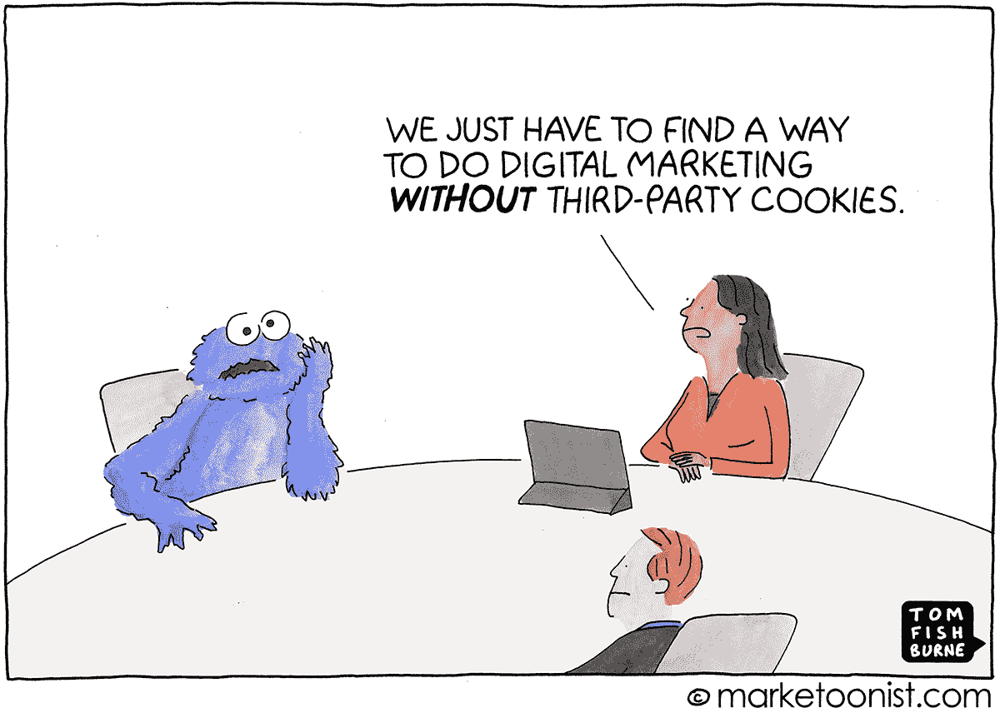

Transitioning to a cookieless future may not be comfortable for everyone (**Source:** [Marketoonist](https://marketoonist.com/2021/01/marketing-beyond-cookies.html))

我们不仅仅是在谈论那些利用 cookies 为自己谋利的黑客。相反，许多网站所有者、营销人员和企业已经面临着放弃 cookies 的挑战。任何使用 cookies 进行跟踪或构建客户旅程的人可能需要寻找替代的跟踪信号和解决方案。

Struggling with downtime and WordPress problems? Kinsta is the hosting solution designed to save you time! [Check out our features](https://kinsta.com/features/)

以下是无烹饪的未来将如何影响网络上一些最大的关键玩家。

### 对于用户

对于用户来说，无烹饪的未来是有益的。随着许多浏览器和网站完全删除 cookie，用户可以安心地浏览，他们的 cookie 和会话不会被用于恶意活动。

延伸开来，网站将不再能够使用 cookies 来跟踪用户活动或建立侵入性的用户档案。从各方面考虑，对大多数浏览网页的人来说，无烹饪的未来看起来很有希望。

### 对于网站所有者

对于网站所有者来说，无烹饪的未来是非常有希望和具有挑战性的。

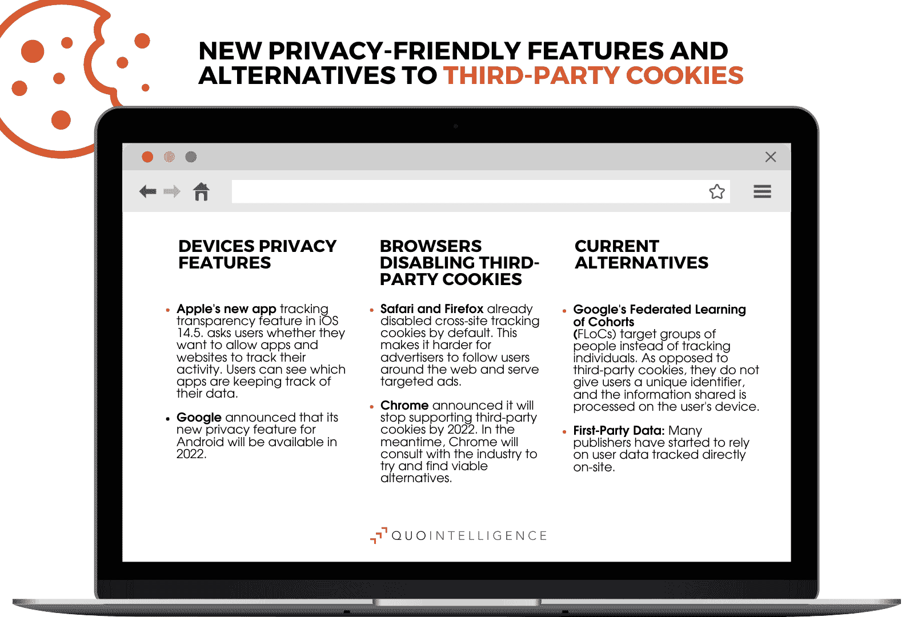

Site owners have many privacy-friendly alternative tracking signals to choose from (**Source:** [QuoIntelligence](https://quointelligence.eu/2021/05/how-the-demise-of-third-party-cookies-will-influence-data-security/))

虽然网站所有者不必担心与 cookie 相关的安全问题，但他们必须开始改变与用户互动的方式，并确保一致的用户体验。

例如，在大多数网站使用会话 cookiess 来维护登录会话的情况下，在没有 cookie 的未来，这样做将变得越来越不安全——也越来越不被鼓励。作为替代，网站所有者应该开始采用第一方数据策略，以利用其他(更安全的)个人标识符。

### 对于营销人员

由于广告商主要使用第三方 cookiess 来投放定向广告，数字营销将受到无 cookie 未来的一些最大影响。

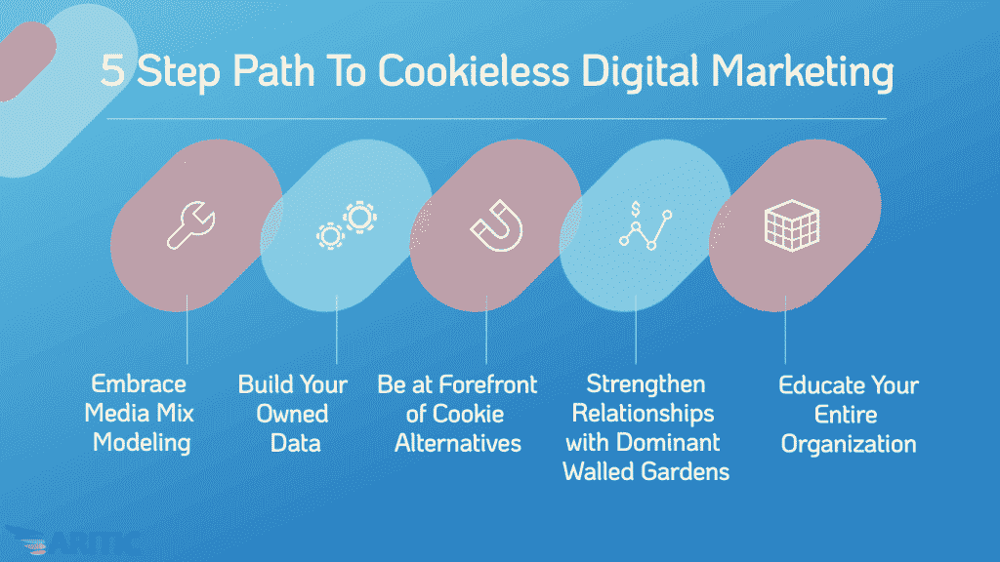

A cookieless future presents several opportunities for digital marketing (**Source:** [Aritic](https://aritic.com/blog/aritic-pinpoint/5-points-for-cookieless-future/))

然而，这并不一定是一件坏事——如果有什么不同的话，这是一个好处。但是，当一个没有烹饪的未来几乎消除了为营销目的而收集的大部分数据时，这怎么可能呢？

答案在于紧跟无曲奇潮流和曲奇替代品。尽管 cookies 长期以来一直是可靠的备用工具，但它们并不是收集用户数据的唯一可靠(甚至是最安全)的手段。正如我们稍后将看到的，许多营销人员将需要采用第一方数据策略来维持定向广告，尤其是在面对高级[广告拦截器](https://kinsta.com/blog/ad-blockers/)时。

当然，这种影响比接受替代品更深远。随着 cookie 的逐步淘汰对许多长期的营销战略提出了挑战，营销团队也需要找到建立自己的数据的方法，与独家广告商建立更好的关系(也称为“围墙花园”)，并更好地教育他们的组织关于无 cookie 的做法。

## 如何为没有烹饪的未来做准备

不管准备好了没有，无烹饪的未来已经到来。

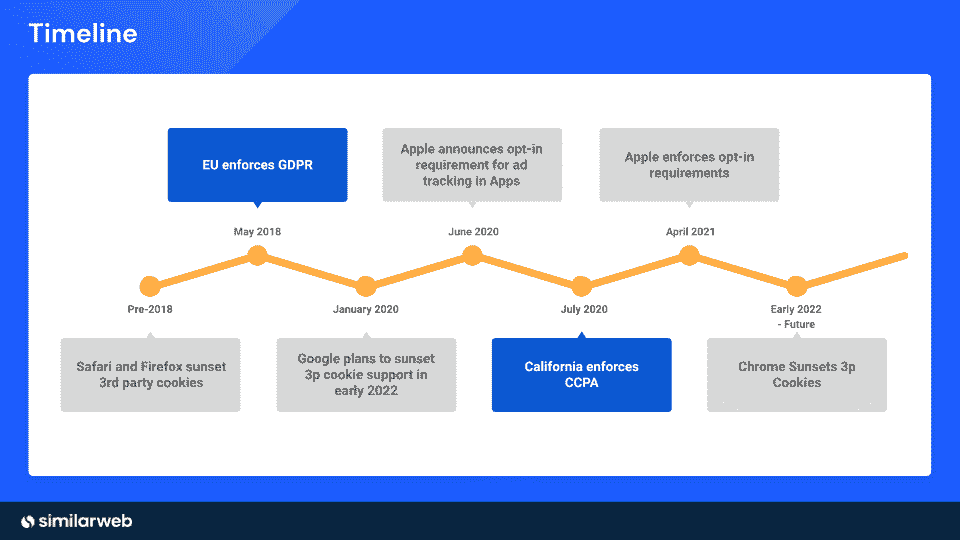

The cookieless future has been in the works for several years (**Source:** [Similarweb](https://www.similarweb.com/corp/blog/research/digital-analysis/cookieless-future/))

即使像谷歌 Chrome 这样的一些主要平台继续推迟第三方 cookie 贬值，我们已经进入了过渡阶段。因此，现在是网站所有者、营销人员和企业为无烹饪的未来做准备的最佳时机。

遵循这些建议去适应并脱颖而出。

### 时刻关注新出现的隐私威胁

虽然无烹饪的未来将有助于消除许多隐私威胁，但它不会完全消除它们。随着公司开始采用[替代跟踪方法](https://kinsta.com/blog/email-tracking-software/)，黑客和其他恶意方找到利用它们的方法只是时间问题。

即使第一方数据不会成为下一个大的攻击载体，公司仍然应该了解隐私和安全方面的新兴趋势。正如过去二十年所显示的，即使是最有前途的技术，如果存在风险，也可能会被淘汰。

### 使用替代标识符

Cookies 是跟踪和识别用户的一种非常有效的方法。但是在一个没有烹饪的未来，公司和营销人员如何继续这样做呢？

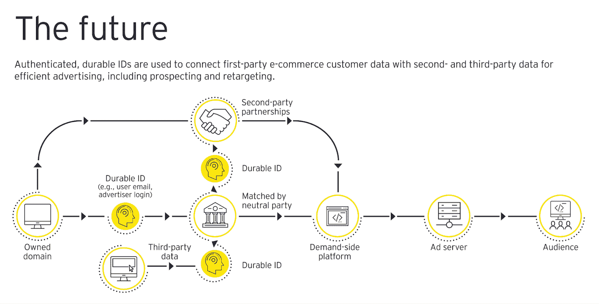

Authenticated IDs are becoming a prime alternative for cookies (**Source:** [EY](https://www.ey.com/en_gl/consulting/how-marketers-can-be-ready-for-a-cookie-less-world))

答案是使用替代标识符和跟踪信号。这里只是一些成功的公司已经在使用。

*   **上下文定位。在 cookies 和其他“新奇”技术出现之前，情景定位只是在相关营销渠道上投放广告，并取得了巨大成功。在这里，你可以简单地[在相关网站和渠道上展示广告](https://kinsta.com/blog/banner-ad-sizes/)，而不必麻烦地征求用户同意并保护隐私。**
*   **通用身份证。**随着技术世界远离 cookies，许多技术平台转向通用标识符。尽管谷歌 Chrome 不打算支持它们，但许多其他平台都在拥抱它们，将其作为一种便捷的识别用户身份的方式，而没有安全风险。这些 id 通常是通过安全平台提供的，这些平台提供了可互操作的、安全的方法来跟踪网络上的用户。
*   **同类。**与情景定位类似，使用群组——或根据相似兴趣将用户分组——仍然是一种简单而有效的跟踪方式。同样，平台可以利用活动信息向具有相似特征、兴趣或爱好的人群提供一致的、有针对性的体验，而不是担心个人身份。
*   **基于设备的解决方案。**设备数据还有可能进一步改善群组。在这里，不是基于设备数据向个人营销，而是设备可以只透露第三方将其用户分类到某个群组所需的信息。通过这样做，用户可以保持匿名，而营销人员仍然可以根据已证实的用户活动提供有针对性的体验。

### 制定更好的隐私政策

如果无烹饪的未来能教会我们什么的话，那就是没有什么比用户隐私更重要了。

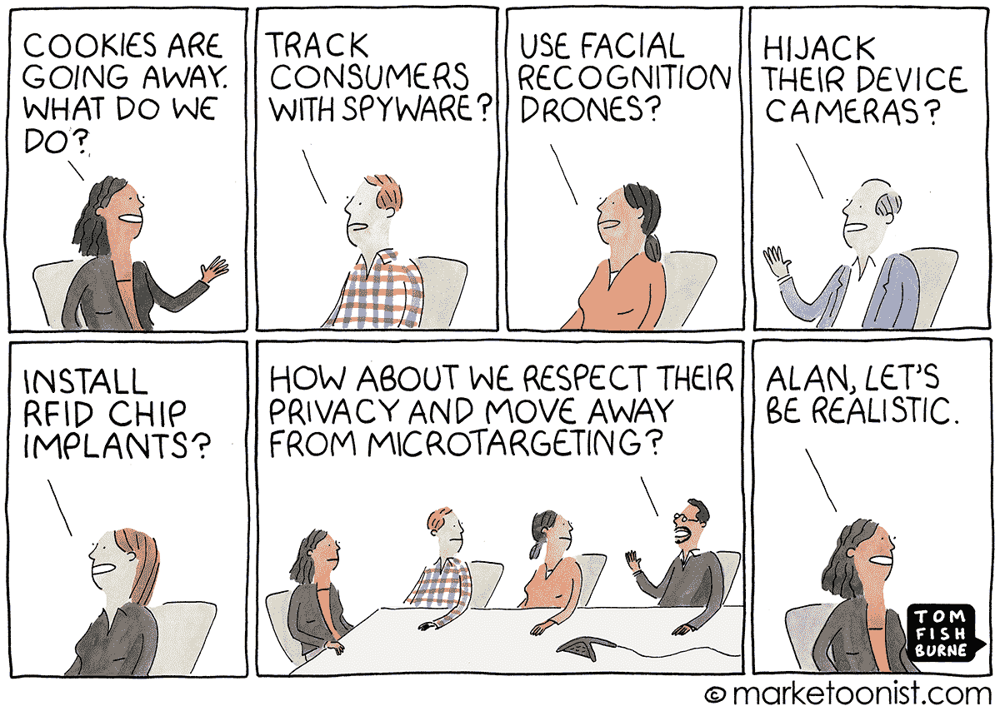

More people should listen to Alan and respect user privacy (**Source:** [Marketoonist](https://marketoonist.com/2021/04/advertising-without-cookies.html))

您的用户现在可能比以往任何时候都更加重视他们的隐私。即使你已经费尽周折制定了一个符合[的隐私政策](https://kinsta.com/podcast/privacy-conscious-hosting-provider/)，也要再检查一遍，以确保它真正照顾到了他们的最大利益。如果不是，你可能要在未来的某个时候经历另一次转变。

查看[这些提示](https://kinsta.com/ebooks/wordpress/website-privacy-policies/)来创建一个成功的隐私政策。

[What does a world without third-party cookies look like? 🍪 This article dives in...Click to Tweet](https://twitter.com/intent/tweet?url=https%3A%2F%2Fkinsta.com%2Fblog%2Fcookieless-future%2F&via=kinsta&text=What+does+a+world+without+third-party+cookies+look+like%3F+%F0%9F%8D%AA+This+article+dives+in...&hashtags=WebPrivacy%2CWebTips) ## 摘要

随着无烹饪的未来已经到来，对于营销人员和网站所有者来说，这是进行转变的最佳时机。

尽管无 cookiess 的未来在隐私和安全方面有许多好处，但对于许多已经使用 cookie 的人来说，向顾客推销和锁定顾客可能很困难。

有了来自 Kinsta 的[应用托管](https://kinsta.com/application-hosting/)、[数据库托管](https://kinsta.com/database-hosting/)、[托管 WordPress 托管](https://kinsta.com/wordpress-hosting/)和 [APM 工具](https://kinsta.com/apm-tool/)，你可以提供更好的无 cookie 体验，并且[监控结果](https://kinsta.com/blog/conversion-tracking/)都在一个仪表板上。

要了解更多信息并[安排免费演示](https://kinsta.com/schedule-demo/)或[，请立即联系来自 Kinsta 的主机专家](https://kinsta.com/contact-us/)。

* * *

让你所有的[应用程序](https://kinsta.com/application-hosting/)、[数据库](https://kinsta.com/database-hosting/)和 [WordPress 网站](https://kinsta.com/wordpress-hosting/)在线并在一个屋檐下。我们功能丰富的高性能云平台包括:

*   在 MyKinsta 仪表盘中轻松设置和管理
*   24/7 专家支持
*   最好的谷歌云平台硬件和网络，由 Kubernetes 提供最大的可扩展性
*   面向速度和安全性的企业级 Cloudflare 集成
*   全球受众覆盖全球多达 35 个数据中心和 275 多个 pop

在第一个月使用托管的[应用程序或托管](https://kinsta.com/application-hosting/)的[数据库，您可以享受 20 美元的优惠，亲自测试一下。探索我们的](https://kinsta.com/database-hosting/)[计划](https://kinsta.com/plans/)或[与销售人员交谈](https://kinsta.com/contact-us/)以找到最适合您的方式。