# 寻找和报告假脸书网页的权威指南

> 原文：<https://kinsta.com/blog/how-to-report-a-fake-facebook-page/>

脸书模仿者瞄准商业和公众人物来诈骗用户的钱。当其中一个骗子盯上你的生意时，压力会很大。你如何[保护你的品牌](https://kinsta.com/blog/positioning-strategy/)和你的客户免受这些坏人的侵害？

第一步是直接向脸书报告该页面，并删除该页面，因为它违反了社区标准。不幸的是，脸书并不积极主动地寻找和删除这些虚假网页；这取决于你和你的团队。

在这篇文章中，我们将告诉你如何报告一个虚假的脸书网页，以及如何防止新的网页出现。在这种情况下，最好的防御就是有效的进攻。

## 如何追踪一个假的脸书网页

脸书自己没有办法识别虚假网页。它依靠社区举报造假者；这包括个人用户和企业。如果你有一个脸书网页，你需要主动寻找虚假网页来保护你的声誉和客户。识别虚假账户可能很难，尤其是如果你的品牌是新的，而你又没有员工来监控它。

坏演员建立虚假的个人资料有很多原因，但没有一个是好的:

*   从你的网页上转移流量
*   欺骗你的顾客
*   假扮成你给你的生意带来坏名声
*   窃取客户的机密信息

创建一个新的脸书页面既简单又免费，所以骗子利用这一点不足为奇。他们会经常使用你的公司名称或它的变体，很难发现其中的区别。

在我们分享如何举报冒充你的公司的虚假脸书页面之前，你可以使用以下三种方法来尝试和追踪冒名顶替者:

1.  谷歌
2.  [反向图像搜索](https://kinsta.com/blog/image-search-engine/)
3.  客户报告

让我们来看看每一个。

[Want to keep the reputation of your business protected and prevent scammers from targeting your customers? 🙅‍♀️ Learn more in this guide ⬇️Click to Tweet](https://twitter.com/intent/tweet?url=https%3A%2F%2Fkinsta.com%2Fblog%2Fhow-to-report-a-fake-facebook-page%2F&via=kinsta&text=Want+to+keep+the+reputation+of+your+business+protected+and+prevent+scammers+from+targeting+your+customers%3F+%F0%9F%99%85%E2%80%8D%E2%99%80%EF%B8%8F+Learn+more+in+this+guide+%E2%AC%87%EF%B8%8F&hashtags=Facebook%2CSmallBiz)

### 1.谷歌

第一种方法是使用[谷歌搜索](https://kinsta.com/blog/google-search-console/)。谷歌索引脸书网页，这意味着他们出现在搜索中。您可以利用这一点，在搜索引擎将新页面编入索引后立即找到它们。

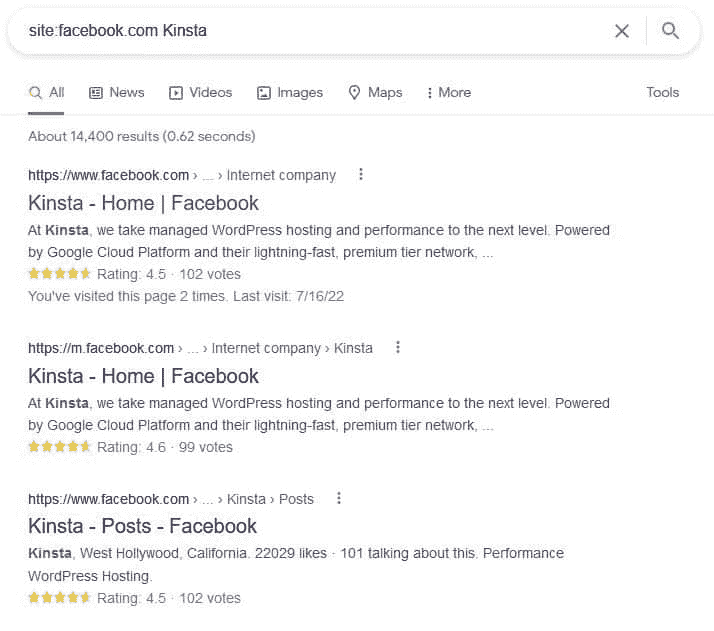

Search by site to narrow down results to only show pages from Facebook

以下是你需要做的事情，让你更容易在谷歌上找到虚假网页:

*   第一步:前往谷歌，在搜索栏中输入以下内容:**网站:facebook.com +“你的品牌名称”**这会将搜索范围缩小到提及您品牌的相关脸书页面。
*   **第二步:**浏览搜索引擎结果的前几页。
*   **第三步:**如有可疑链接，打开查看。有些可能是其他网页提到了你的业务，不需要采取进一步的行动。

### 2.反向图像搜索

你的[受版权保护的图片](https://kinsta.com/blog/protect-images/)有可能被用在虚假页面上。骗子可以很容易地从你的网站、脸书页面或其他社交媒体网络下载这些内容。这是一个常见的策略，因为它很容易做到，可以愚弄那些没有注意的人。然而，这总是让你更容易使用你的成像跟踪坏演员。

你需要做一个反向图像搜索来检查这种情况是否发生。这包括使用谷歌图片或 TinEye 这样的搜索引擎来查找图片在互联网上的位置。如果它被用在不属于你的页面上，那么它很有可能是假的。

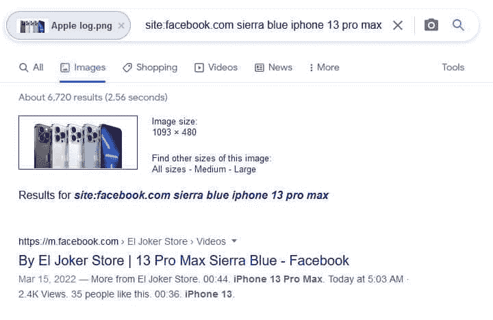

Perform a reverse image search

要在谷歌图片上进行反向图片搜索:

*   **第一步:**在您的网络浏览器中进入 images.google.com
***   **第二步:**点击搜索栏中的相机图标*   **第三步:**上传你想要查看的图片，或者粘贴图片使用位置的网址*   **第四步:**按回车键或点击“按图片搜索”并按**网站:Facebook.com** 过滤，将搜索结果缩小到脸书。*   **第五步:**查看任何你不认识的脸书页面，看看他们是否不恰当地使用了你的图像。**

 **### 3.客户报告

当追查一个假的脸书页面时，你的客户是你最好的资产。他们通常是第一个发现骗局的人，并能很快告诉你。由于企业和用户的共同努力，仅在 2018 年，脸书就删除了超过 5 亿个虚假页面。

鼓励您的客户和粉丝在您的帖子评论中或通过私信举报他们偶然发现的任何虚假页面。这将有助于你跟踪新的假货，并让你知道这个问题有多普遍。如果一个假冒的页面联系他们，他们可以将消息转发给你，这样你也可以举报。

你还应该留意页面上的任何负面评论或评论。如果人们说他们被骗了，这是一个危险信号，有人试图在脸书冒充你的企业。

确保有一个针对举报虚假页面和诈骗的客户的内部流程。这样，你就可以快速跟进并采取行动。在您的[社交媒体页面](https://kinsta.com/blog/wordpress-social-media-plugins/)上分享客户如何向脸书和您的客户服务团队报告的信息。

## 如何举报假冒的脸书网页

如果你发现一个假冒你公司的网页，你需要向脸书报告。这是删除页面并阻止骗子利用你的业务来占人便宜的唯一方法。脸书简化了这一过程，只要你能上网，无论你在哪里都可以做到。

一旦发现虚假页面，你需要迅速采取行动。他们不仅可能侵犯你的商标，还可能想欺骗你的顾客。越早采取行动越好。

我们将带您了解如何在桌面和移动设备上举报虚假的脸书页面。

### 在桌面上报告脸书页面

在桌面上报告脸书页面可以通过在任何浏览器上登录脸书来完成。或者，您可以使用脸书桌面应用程序登录。

*   **第一步:**前往需要举报的页面。
*   **第二步:**赞和搜索按钮旁边是三个点，会打开更多选项。打开下拉列表，选择**报告页面**。

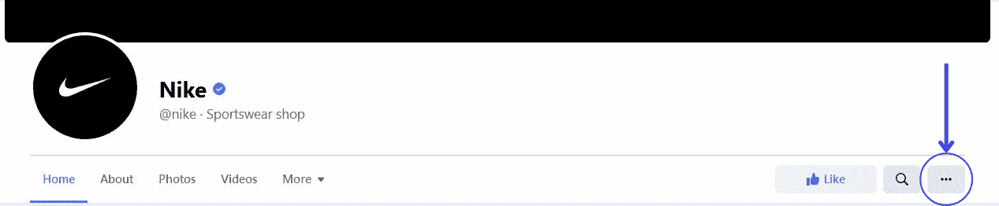

Find the three dots to bring up the menu and select “Report Page”

*   **第三步:**选择最合适的理由，在本例中为**骗局和假页面**。

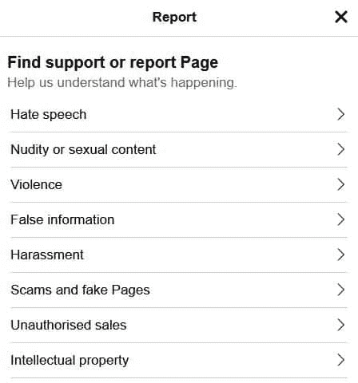

Click through to the correct report form

*   **第四步:**选择举报原因。最好的选择是“假页面”或“假装是另一个企业。”

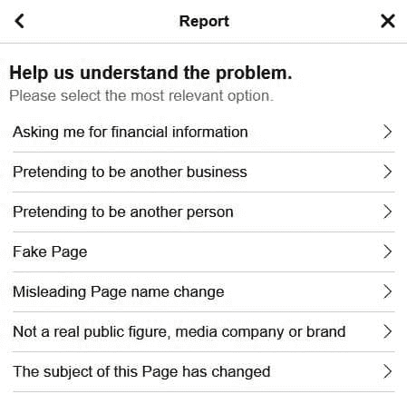

Choose the most appropriate reason for reporting the page

*   第五步:链接到你的商业页面，作为有人假冒你的品牌的证据，并提交给脸书。

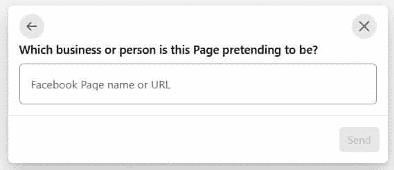

Add the link to your Facebook Page for investigation

*   第六步:脸书会检查页面，并在必要时采取行动。这可能包括删除或隐藏页面。在某些情况下，他们可能什么也不做。

### 报告手机上的脸书页面

如果你在旅途中发现了虚假个人资料，你可以通过手机上的脸书应用进行举报。您可以使用手机网站或脸书应用程序。该过程类似于您在桌面上报告它的方式。

*   第一步:进入违规页面，开始举报。
*   **第二步:**找到喜欢按钮下的三个点，点击**报告页面**。

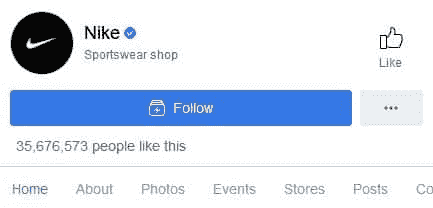

Head to the fake page on your mobile

*   **第三步:**点击**找到支持或报告页面**。

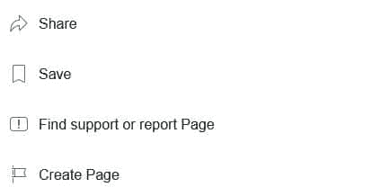

Click on “Find support or report Page

*   **第四步:**——从列表中选择**诈骗和假页面**继续举报。

Report the page as “Scams and fake Pages”

*   **第 5 步:**选择您报告此页面为虚假页面的原因。

Choose how to report the page

*   **第六步:**输入你的脸书页面[网址](https://kinsta.com/knowledgebase/what-is-a-url/)来帮助调查。

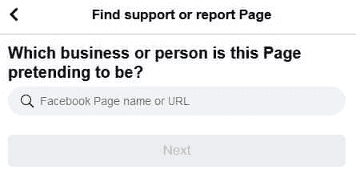

Add the URL for your Facebook Page

*   脸书会有人调查这个问题。一旦调查完成，他们可能会删除或隐藏该页面。

重要的是要记住，脸书是一个面向全世界用户的平台。所以，他们可能需要一段时间才能看到你的报告。如果他们没有发现页面违反他们的政策，他们也可能不会采取行动。

## 注册订阅时事通讯

### 想知道我们是怎么让流量增长超过 1000%的吗？

加入 20，000 多名获得我们每周时事通讯和内部消息的人的行列吧！

[Subscribe Now](#newsletter) ## 举报后会怎么样？

在你向脸书报告了一个假页面后，他们会调查这个问题。这通常包括查看页面本身，看看页面是否违反了它的[社区准则](https://transparency.fb.com/en-gb/policies/community-standards/?source=https%3A%2F%2Fwww.facebook.com%2Fcommunitystandards%2F)。脸书使用自动化技术和人工审查相结合的方法来决定什么应该从平台上删除。

一旦调查完成，脸书将采取以下三种行动之一:

1.  **删除页面:**这是最好的情况。如果脸书发现该网页违反了它的政策，它会将其从平台上完全删除。这意味着骗子将不再能够利用你的业务来占人便宜。
2.  在某些情况下，脸书可能找不到足够的证据彻底删除该页面。但他们可能会在搜索结果中隐藏它，并阻止它在平台上共享。这使得新用户很难接触到这个页面。
3.  **无所作为:**不幸的是，脸书可能根本不会采取任何行动。这通常是因为该页面没有违反他们的任何政策，或者因为他们无法验证该页面是假的。如果发生这种情况，您可能需要采取其他措施来保护您的业务，如直接联系骗子或提起诉讼。

无论脸书采取什么行动，你都应该留意这个页面，确保它不会再次弹出。骗子往往很执着，提高警惕很重要。你也应该告知你的客户关于虚假网页的信息，这样他们就可以避开它。建议他们只在你的官方渠道上与你的企业互动，比如你的网站或经过验证的社交媒体账户。

这是最积极的方式来保护您的企业和客户免受骗子的掠夺行为。虚假页面会导致你的品牌声誉下降，并导致[客户保持率](https://kinsta.com/blog/customer-retention/)下降。

如果你对脸书页面提交了一份报告，并认为它侵犯了你的知识产权(即假冒你的品牌)，脸书可能会与被指控的帐户共享这些信息。这意味着运行虚假页面的人可以看到是谁举报了他们。然而，在大多数情况下，被告帐户将无法看到提交报告的人的身份。

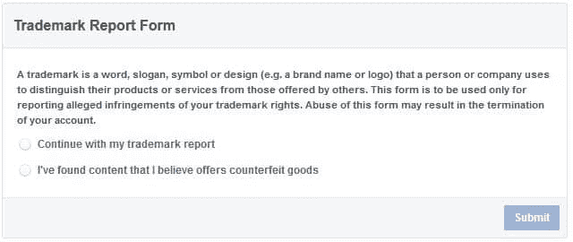

Use the trademark report form if someone is infringing on your trademarks

脸书很可能不会更新你的调查状态，所以定期检查网页是否被删除或隐藏是很重要的。你也可以尝试搜索脸书的页面，看看它是否会出现在搜索结果中。如果是的话，这意味着脸书还没有采取任何行动。

试图多次报告一个虚假的脸书页面，希望脸书能更快采取行动，这可能很有诱惑力。然而，这通常是行不通的。脸书表示，这不会加快其内部进程。最好只报告一次页面，然后等待脸书采取行动。

### 如果脸书不采取行动，你该怎么办？

如果脸书裁定该页面不违反他们的社区准则，他们不会删除它。你应该做的第一件事是向脸书上诉这个决定。这将迫使脸书第二次看冒犯的网页，如果上诉成功，它将被删除或隐藏。

Struggling with downtime and WordPress problems? Kinsta is the hosting solution designed to save you time! [Check out our features](https://kinsta.com/features/)

你也可以直接联系骗子或者提起诉讼。这可能不是在每种情况下都可能或实际，但如果你觉得你已经用尽了所有其他选择，这是值得考虑的。

重要的是要记住，骗子往往是持久的，所以即使你设法让他们的网页被关闭，他们可能只是创建另一个。你应该关注你的业务，确保你正在采取措施保护你的客户和品牌声誉。

确保你的客户知道一个坏演员在网上冒充你。分享识别虚假页面的信息，不要与冒充你给他们发信息的人互动。

## 防止脸书冒名顶替的 5 种方法

对付假脸书页面的最好方法是从一开始就防止它被创建。你可以采取以下措施来保护你的企业:

### 1.获得验证

脸书为企业和公众人物提供了一个验证过程。这会在脸书上你的名字旁边打上一个蓝色的勾号，让人们知道你是真的。这有助于阻止骗子假冒你的企业。

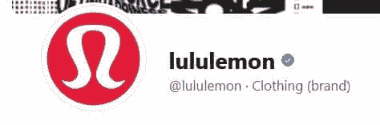

Facebook verification proves this is the legitimate brand profile

验证徽章类似于网站[信任徽章](https://kinsta.com/blog/trust-badges/)，只颁发给脸书上通过验证流程的企业。这个过程并不保证你会得到验证。脸书只核实他们认为有“大量观众”的公司和公众人物但是，如果你认为这将有助于你的业务，这一过程是值得的。

以下是在脸书上获得验证的过程:

*   **第一步:**检查您的验证资格。你需要设置个人资料和封面图片，符合脸书的社区标准，并确保你的帐户遵守脸书的服务条款。任何虚假信息将导致你的申请被拒绝。
*   **第二步:**前往[验证页面](https://www.facebook.com/help/contact/295038365360854)并填写表格。如果您已登录，表单的部分内容会自动填写。
*   第三步:提供证据证明你就是你所说的那个人。这可能是个人身份证，公用事业法案，公司章程，或最近的纳税申报。
*   第四步:通过包含媒体文章、新闻稿和你的受众的详细信息的链接来证明你的知名度。脸书将只验证证明用户受益的账户。
*   **第五步:**验证最长需要 45 天，所以做好耐心等待的准备。
*   **第 6 步:**当你的账户通过验证后，脸书会与你联系。

如果您通过验证，您将在个人资料中的姓名旁边收到一个蓝色徽章。这是一个信号，表明你是官方的商业网页，而不是假的。

### 2.设置监控软件

如果您想主动防止有人假冒您的企业，请考虑安装监控软件。这种类型的软件会自动在互联网上搜索任何未经您允许而使用您的企业名称或品牌的实例。这可以帮助你在虚假的脸书页面受到太多关注之前抓住它。

有许多不同类型的监控软件可用，所以做一些研究，找到一个适合您的业务。Google Alerts 是一个免费的选项，只需几分钟就可以完成设置。

付费选项为您提供了更好的定制选项，可以帮助您跟踪的不仅仅是您的企业名称。您还可以设置通过电子邮件或文本向您发送提醒，以便在出现问题时能够迅速采取行动。

监控软件有助于保护您的企业免受在线假冒。但也不是万无一失。你仍然应该关注你的社交媒体账户，留意任何弹出的虚假页面或个人资料。

### 3.定期发布新鲜的原创内容

如果你能让人们留在你的页面上，他们就不会偶然发现一个模仿者。发布新鲜的原创内容是吸引受众的好方法，可以让你的企业脱颖而出。

人们更有可能访问定期发布新内容的脸书页面并与之互动。确保在你分享的内容中包含清晰的品牌信息，这样你的受众就可以很容易地识别出它来自你的企业。对于付费的[脸书营销](https://kinsta.com/blog/facebook-marketing/)来说尤其如此，它们看起来可能和普通的帖子差不多。

如果你有博客，你可以在你的脸书页面上分享新的博客文章。通过使用 [WordPress 插件](https://kinsta.com/blog/wordpress-facebook-plugins/)自动分享你的文章，这可以变得更加容易。只是一定要在分享之前编辑每一篇文章，这样它在脸书上看起来就不错了。

### 4.链接到您的其他社交媒体档案

通过从您的脸书页面链接到您的个人资料，让人们在其他社交媒体平台上轻松找到并关注您的企业。您可以在页面的“关于”部分添加指向您的网站、博客和任何其他社交媒体资料的链接。这有助于确保您的受众只关注真实账户。

如果你想更好地控制这些链接的外观，你可以使用 WordPress 插件将社交媒体图标添加到你的网站上。然后，人们可以点击图标直接进入你在该平台上的个人资料。

这是一个在多个平台上建立追随者的好方法，可以保护你的企业免受假冒。使用你的其他社交媒体账户也是一个很好的方式来通知客户任何虚假的脸书页面。

### 5.教育您的客户

确保你的客户知道如何识别假的脸书网页。这可以帮助他们避免被骗子欺骗。在你的网站和时事通讯中添加一条提示，提醒人们注意假冒的脸书网页。

你也可以在你的社交媒体账户上分享有用的提示。例如，你可以在推特上发布一篇关于如何识别虚假脸书页面的文章链接。或者你可以发布一个状态更新，提供一些关于寻找什么的提示。

向你的观众展示他们如何辨别你的脸书广告的真假。这有助于保护您的业务不被网上假冒，并防止您的客户被诈骗。

定期提醒客户在哪里可以找到你的真实社交媒体账户也很重要。让他们知道你永远不会向他们索要个人信息或支付信息。

[Don't let scammers wreck your business' reputation. 🙅‍♀️ Stop fake Facebook pages in their tracks with this guide ✋Click to Tweet](https://twitter.com/intent/tweet?url=https%3A%2F%2Fkinsta.com%2Fblog%2Fhow-to-report-a-fake-facebook-page%2F&via=kinsta&text=Don%27t+let+scammers+wreck+your+business%27+reputation.+%F0%9F%99%85%E2%80%8D%E2%99%80%EF%B8%8F+Stop+fake+Facebook+pages+in+their+tracks+with+this+guide+%E2%9C%8B&hashtags=Facebook%2CSmallBiz) ## 摘要

积极主动是对抗在线模仿者的最好方法。脸书网页是骗子联系你的客户的一种简单方式。学习如何使用本文中提到的方法报告虚假的 facebook 页面是根除它们的最好方法。

通过创建一致的在线状态来保护您的声誉和客户免受不良行为者的影响。Kinsta 的[应用托管](https://kinsta.com/application-hosting/)、[数据库托管](https://kinsta.com/database-hosting/)和[托管 WordPress 托管](https://kinsta.com/wordpress-hosting/)是那些希望专注于创造伟大内容而我们负责技术方面的人的完美选择。

当您发布新的博客文章时，无缝更新您的脸书页面，让您的客户了解最新信息。查看我们的计划了解更多信息。

* * *

让你所有的[应用程序](https://kinsta.com/application-hosting/)、[数据库](https://kinsta.com/database-hosting/)和 [WordPress 网站](https://kinsta.com/wordpress-hosting/)在线并在一个屋檐下。我们功能丰富的高性能云平台包括:

*   在 MyKinsta 仪表盘中轻松设置和管理
*   24/7 专家支持
*   最好的谷歌云平台硬件和网络，由 Kubernetes 提供最大的可扩展性
*   面向速度和安全性的企业级 Cloudflare 集成
*   全球受众覆盖全球多达 35 个数据中心和 275 多个 pop

在第一个月使用托管的[应用程序或托管](https://kinsta.com/application-hosting/)的[数据库，您可以享受 20 美元的优惠，亲自测试一下。探索我们的](https://kinsta.com/database-hosting/)[计划](https://kinsta.com/plans/)或[与销售人员交谈](https://kinsta.com/contact-us/)以找到最适合您的方式。**