# 前 24 个点击漏斗备选方案

> 原文：<https://kinsta.com/blog/clickfunnels-alternative/>

ClickFunnels 作为一个漏斗建设者备受瞩目，它促进了在线品牌管理、销售和交付，以优化线索生成。它通过使用根据企业所有者的规格定制的漏斗选择，简化了产品的营销和分销。

尽管 ClickFunnels 很受欢迎，也很强大，但并不是每个人都喜欢它——主要是因为它昂贵的会员资格、局限性和低性能。

[ClickFunnels isn't everyone's cup of tea - and it doesn't have to be, thanks to these handy alternatives 💪Click to Tweet](https://twitter.com/intent/tweet?url=https%3A%2F%2Fkinsta.com%2Fblog%2Fclickfunnels-alternative%2F&via=kinsta&text=ClickFunnels+isn%27t+everyone%27s+cup+of+tea+-+and+it+doesn%27t+have+to+be%2C+thanks+to+these+handy+alternatives+%F0%9F%92%AA&hashtags=MarketingTIps%2CSmallBiz)

在这篇文章中，如果你想建立有效的活动并增加收入，我们将研究 24 个值得尝试的最佳点击漏斗。

## 什么是点击漏斗？

ClickFunnels 成立于 2014 年，是一个受欢迎的销售漏斗构建者，拥有超过 100，000 名成员的大型社区。这种多功能营销工具使企业和企业家能够简化他们的整个销售过程，以提高流量转换和产生线索。

 点击渠道用户可以从各种预制的模板中创建销售渠道。他们还可以构建标准网站、登录页面、购物车、选择加入页面、会员表格、网络研讨会和其他类型的营销内容。

### 点击漏斗赞成和反对

ClickFunnels 为那些想在网上做生意的人提供了许多有趣的功能。一些主要优势包括:

*   **用户友好的拖放构建器:**设计一个吸引人的登陆页面不需要任何编码技巧。
*   **A/B 分割测试:**这个工具对于保持稳固的在线状态至关重要。ClickFunnels 允许您测试不同版本的登录页面并进行改进。
*   **销售分析:**click funnels 的高级分析可帮助您监控销售数据和统计数据，如总收入、每次点击收入、转化率等。
*   **不同的支付网关:** ClickFunnels 提供多种选择，可以从 PayPal、Stripe 和 Recurly 等潜在客户处收款。
*   **跟进漏斗和邮件列表:** ClickFunnels 让你无需借助第三方工具就能轻松生成邮件列表。它还可以让你开发后续渠道，发送电子邮件确认和交叉销售序列。
*   免费试用: ClickFunnels 提供 14 天的免费试用，在做出承诺之前测试其服务。

尽管 ClickFunnels 有额外的好处，而且其宣称的目的是为许多在线企业主服务，但它在以下几个方面存在不足:

*   通用模板:尽管 Clickfunnels 让创建引人注目的登录页面变得简单，但成千上万的其他人和企业也在使用同样的模板。结果，你会得到普通的登陆页面，而不是独特的，淡化了你的品牌形象。
*   **定价:** ClickFunnels 的定价比市场上其他同类服务要贵得多。
*   **限制:**与其他页面构建工具相比，ClickFunnels 提供的页面定制功能较少，包括有限数量的漏斗和访问者。
*   **性能:** ClickFunnels 用户经常报告在某些功能上遇到错误和缓慢的性能，尤其是在用户界面上。
*   **支持:** ClickFunnels 通过多种渠道提供支持，包括电子邮件、实时聊天和票证。然而，许多客户抱怨未解决的技术问题和支持团队的延迟响应。

## 你需要一个点击漏斗的替代品吗？

在销售漏斗的世界里，ClickFunnels 就像苹果一样:是个好产品，但通用性有限，不适合所有人。在下列情况下，您可能需要考虑 ClickFunnels 替代方案:

*   你经营一家网上创业公司或小企业。鉴于其高昂的价格，ClickFunnels 并不适合精打细算的企业家。其基本计划每月费用为 97 美元，白金套餐为 297 美元。
*   你是一名专业营销人员。点击漏斗对于你的需求来说太过简单和不灵活。如果您需要大量的渠道和访问者，以及高级功能和独特的模板，这一点尤其正确。
*   你希望提高你的转化率。稳定性和页面加载速度是你的企业达到高[转化率的重中之重](https://kinsta.com/blog/conversion-rate-optimization-tips/)。与其他一些产品相比，ClickFunnels 相当慢。
*   你的主要精力放在客户服务上。是的，ClickFunnels 有各种支持选项和精彩的网络研讨会。然而，如果你遇到需要立即帮助的技术挑战，它的延迟帮助是低效的，并且会导致你自己的客户的不满。

## 在 ClickFunnels 替代方案中寻找什么

当您寻找合适的 click funnel 替代方案时，选择一个销售漏斗解决方案非常重要，它可以帮助您实现与 click funnel 相同的目标，但其功能或价格更适合您的特定业务需求。

在撰写本文时，我们使用了以下策略来帮助我们找到最佳的 ClickFunnels 替代方案:

*   **可承受的价格:**寻求 ClickFunnels 替代品的一个最普遍的原因是成本。因此，我们选择了价格适中的商业计划销售渠道。
*   灵活性:尽管 ClickFunnels 有很多有用的功能，但对于许多专业人士和成长型企业来说，它们还不够。我们选择了功能丰富的 ClickFunnels 替代方案，不会限制贵公司的需求。
*   **支持:**出现问题时，如果没有及时有效的支持，您可能会排斥自己的客户。如果你是网站所有权或管理的新手，你会想要一个 ClickFunnels 替代品，它能提供响应迅速且有帮助的客户支持。
*   **便利:**你不想把时间浪费在代码或处理技术问题上。最好选择一个用户友好、可靠、易于使用的 ClickFunnels 替代方案。
*   **个性:**个性化改善了消费者体验，同时也让你脱颖而出。点击漏斗的替代品应该有吸引人的和原创的模板来帮助你展示你的品牌个性。

## 2022 年前 24 个点击漏斗备选方案

您已经来到了这篇文章最有趣的部分。如果你认为点击漏斗不是你的理想选择，我们已经列出了 24 个可供选择的点击漏斗供你探索。

### 1.前导页

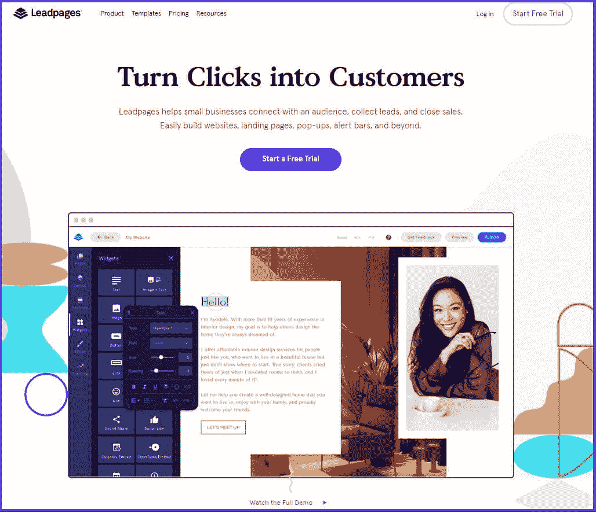

LeadPages (Source: [LeadPages](https://www.leadpages.com/) )

LeadPages 是点击漏斗最明显的竞争对手，这也是有原因的。以更低的成本， [LeadPages](https://www.leadpages.com/) 可以实现 ClickFunnels 所能实现的一切，无论是直接实现还是借助其 40 多个集成中的一个。

登录页面、网站建设、弹出表单和警告栏只是 LeadPages 支持的销售线索收集和漏斗开发的一些基本功能。

此外，如果您的应用断开连接，LeadPages 会重新发送从您的集成中存储的数据。这可以确保您继续操作，即使您的工具之一面临技术问题。

步入客户支持部门，LeadPages 提供了几个渠道来获得帮助。这包括电话、机票、电子邮件和聊天。该公司还提供全面的知识库和常见问题解答部分，以及虚拟研讨会和辅导会议。

**主要特性:**

*   无限数量的漏斗和访客
*   功能强大的拖放页面生成器，具有大量定制选项
*   与 Zapier、Drip、MailChimp 和 Infusionsoft 兼容
*   移动响应模板
*   无限制的 A/B 测试
*   潜在客户通知和 GDPR 合规
*   实时分析
*   免费自定义域名和托管

**定价:**

LeadPages 分为两层:标准版和专业版。标准计划每月花费 37 美元，而专业套装每月花费 74 美元。如果你愿意，你可以按年订阅。还有一个为期 14 天的免费试用来评估这项服务。

你经营企业吗？您可以联系 LeadPages 的支持团队来获得定制的软件包。

### 2.GetResponse

GetResponse (Source: [GetResponse](https://www.getresponse.com/) )

[GetResponse](https://www.getresponse.com/) 是一项强大的在线[营销自动化](https://kinsta.com/blog/email-marketing-automation/)服务，20 多年来已为 350，000 多名客户提供服务。特别是对于[电子邮件营销](https://kinsta.com/blog/email-marketing-tips/)功能，GetResponse 作为可靠的 ClickFunnels 替代产品绝对处于领先地位。

如果你想以比点击漏斗更低的价格从一个平台自动化你的活动目标，这种混合漏斗生成器和电子邮件营销工具是一个很好的选择。

例如，GetResponse 的转换漏斗功能带有预先制作的布局，不需要与其他应用程序集成。另外，设置起来超级简单。您可以轻松构建自动渠道来开发登录页面、创造销售、创建自动电子邮件以及回收废弃的购物车。

如果您想添加自己的个人风格，GetResponse 提供一个空白模板来帮助您从头开始设计您的登录页面。

那么支持呢？多语言支持通过电子邮件、实时聊天和电话全天候提供。此外，他们广泛的帮助中心可以帮助您了解提供的所有功能。

**主要特性:**

*   永久免费计划
*   30 天退款保证
*   多达 500 个联系人的电子邮件列表
*   高质量的登录页面生成器
*   用于监控转化率、投资回报率和销售线索的高级分析
*   24/7 多语言支持
*   内置网络研讨会功能

**定价:**

价格是 GetResponse 的优势之一。该免费计划包括几项额外福利，如登录页面、网站构建器、5 GB 带宽、多达 500 个联系人、电子邮件营销和注册/联系表格。还有三个高级包:电子邮件营销(每月 15.50 美元)、营销自动化(每月 48.38 美元)和电子商务营销(每月 97.58 美元)。所有计划都有 30 天退款保证。

### 3.Instapage

Instapage (Source: [Instapage](https://instapage.com/) )

钱不是一个问题，你想要一个更快，更复杂的点击漏斗替代品？然后你绝对应该查看一下 Instapage，尤其是如果你是 T2，管理着一个拥有远程团队的组织。

Instapage 是一个专注于转换的登录页面生成器，为成长型企业提供可扩展的高端工具。与 ClickFunnels 相比，Instapage 的拖放构建器更加先进。它还提供了 500 多种布局，以及 WordPress、Zapier、HubSpot 和 Marketo 的集成。

另一个有趣的功能是他们的 AdMap 工具。它有助于你想象你的广告与你的登陆页面如何有效地结合。因此，您一眼就能评估您的活动是否成功。

您还可以使用 Instapage 的热图功能来观察网站上的活动，让您在设计网站时考虑到用户体验。

Instapage 也因其屡获殊荣的 [A/B 测试工具](https://kinsta.com/blog/wordpress-ab-testing-tools/)和深度分析而广受欢迎。您可以快速显示页面每个部分的活动量、正在运行的链接以及任何需要改进的链接。

您可以通过实时聊天、电子邮件和票证系统获得支持。自助教程和文章也可以在他们的帮助中心部分。

**主要特性:**

*   拥有 500 多种布局的强大登录页面生成器
*   Thor 渲染引擎技术实现超快的速度
*   无限制的 A/B 测试和广泛的分析工具
*   14 天免费试用
*   不稳定岩石
*   热图和谷歌标签管理器
*   实时视觉协作
*   无限转换
*   SSL 加密和 [GDPR 合规性](https://kinsta.com/blog/wordpress-gdpr-compliance/)

**定价:**

Instapage 比 ClickFunnels 更贵，但它提供了更优质的登录页面资源和更快的性能。Instapage 的构建计划每月花费 299 美元，每年花费 199 美元。还有一个定制包，可通过销售团队获得。您可以使用 14 天的免费试用，并在购买前请求免费演示以探索该服务。

### 4.车流

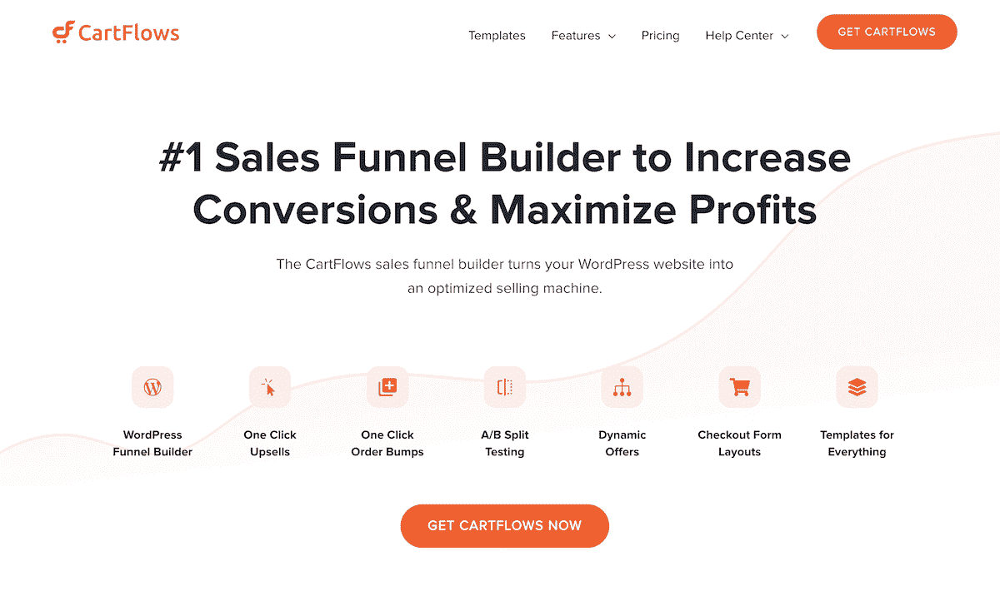

CartFlows

CartFlows 是 click 漏斗的一个很好的替代品，因为它可以在一个更便宜、更容易使用的包中实现许多相同的目标。

CartFlows 可以帮助你建立销售渠道，增加追加销售，订购颠簸，动态优惠和发送[购物车放弃电子邮件](https://kinsta.com/blog/abandoned-cart-email/)。高利润在线业务的所有基本要素。

该插件包括一个拖放漏斗生成器、 [A/B 分割测试工具](https://kinsta.com/blog/wordpress-ab-testing-tools/)、现成的转换模板、优化的结账页面以最小化摩擦，并且可以与许多领先的 [CRM](https://kinsta.com/blog/wordpress-crm/) 、电子邮件平台和营销工具集成。

购物车放弃功能特别有用。由于在购买前有如此多的转换丢失，任何有用的功能，可以尽量减少是最受欢迎的。CartFlows 让一切变得简单。

您还可以访问优秀的文档、知识库、视频、博客和来自开发者的全面支持。所有的设计都是为了确保你从插件中得到最好的东西。

**主要特性:**

*   免费版本
*   为一切专业设计的模板
*   拖放销售漏斗构建器
*   A/B 测试和洞察工具
*   签出页面编辑器
*   订单提升和追加销售工具
*   动态报价功能
*   购物车放弃功能
*   支持流行的 CRM 和电子邮件平台

**定价:**

CartFlows 的年费为 299 美元，终身许可费为 999 美元。终身许可证有分期付款选项，两个计划都有 30 天退款保证。

### 5.卡特拉

Kartra (Source: [Kartra](https://home.kartra.com/) )

[Kartra](https://home.kartra.com/) 是一个全包式、100%基于云的数字营销解决方案。服务包括网站和登录页面构建器、电子邮件营销和自动化、潜在客户数据库(CRM)、选择加入表格、结帐、会员资格建设等。

Kartra 和 click 漏斗最大的区别在于，Kartra 可以为你的整个业务提供燃料，而后者则致力于产生销售漏斗。

如果你想自动同步同一屋檐下的一切，Kartra 是一个可靠的 ClickFunnels 替代品。

假设有人访问了你的 Kartra 页面。那次拜访会被 Kartra analytics 记录下来。如果访问者完成了您的 Kartra 表格，他们的联系信息将通过 Kartra 电子邮件添加到您的简讯订阅列表中。

与 ClickFunnels 不同，Kartra 允许你自己托管你的视频，所以你不需要像 Vimeo 或 Wistia 这样的第三方视频托管服务。Kartra 还提供了大量创建漏斗的模板。使用拖放构建器，您可以在采用后毫不费力地更改布局。

**主要特性:**

*   强大的一次性报价(OTO)、稀缺营销和行为营销工具
*   能够从您的帐户导出漏斗和活动到其他用户的帐户
*   无限的销售渠道
*   视频营销和内置日历工具
*   主题行和电子邮件正文的拆分测试
*   加盟计划，以获得和管理子公司，促进产品营销
*   本机集成和丰富的 API

**定价:**

Kartra 价格适中，提供四种方案。最棒的是它的所有软件包都有相同的特性。他们只是在销售渠道、领域、带宽、托管视频和你可以拥有的联系人的数量上有所不同。

初始计划的价格为每月 99 美元，白金套餐的价格为每月 499 美元。您可以享受年度订阅折扣，并以 1 美元的价格获得 14 天的试用期。

### 6.轮毂点

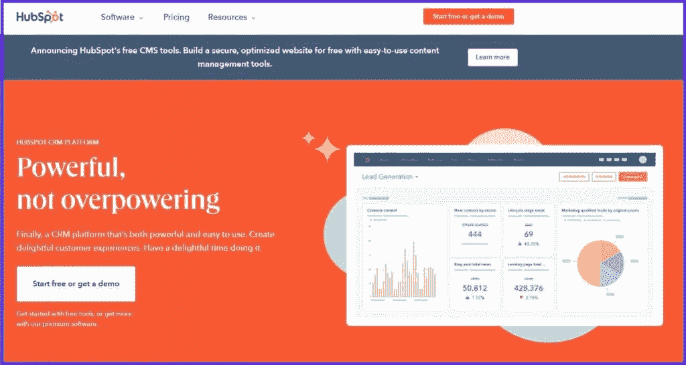

HubSpot (Source: [HubSpot](https://www.hubspot.com/) )

创立于 2005 年的 [HubSpot](https://www.hubspot.com/) 在市场营销界是一个响当当的名字。最适合小型企业，使用 HubSpot CRM 平台可以让您的整个企业顺利协作，从营销到销售再到客户支持。

HubSpot 向其用户提供的令人印象深刻的免费工具是其相对于 ClickFunnels 的最大优势。你可以安排赞助广告，建立登陆页面，并收获线索。此外，免费的 CRM 使您能够保存联系人的数据，并轻松地[开发电子邮件营销活动](https://kinsta.com/blog/digital-marketing-strategy/)。

虽然 HubSpot 只提供了大约 10 个创建登录页面的模板，但它们都是专业设计的，具有极简主义的外观。使用友好的拖放构建器，你仍然可以制作漂亮的销售页面、向下销售页面、挤压页面、向上销售和网上研讨会漏斗。

HubSpot 以客户为导向，有多种支持渠道，如实时聊天、电话和票证。他们的网站上还有大量的自助资源和教程。

**主要特性:**

*   许多功能的 A/B 测试
*   支持谷歌日历、Office 365 和 HubSpot CRM
*   能够设计和共享电子邮件模板
*   简单的拖放式登录页面生成器
*   有用的支持和完整的文档

**定价:**

HubSpot 提供了大量免费工具，包括登录页面、表单、实时聊天、广告管理、社交媒体整合、电子邮件营销、SEO 优化以及多达 100 万个联系人的存储。

根据您的需求，还提供高级套餐。营销计划有三个级别，每月从 45 美元到 3200 美元不等。

### 7.打开

Unbounce (Source: [Unbounce](https://unbounce.com/) )

Unbounce 可能不是一个一体化的营销平台，但它无疑是一个强大而灵活的 ClickFunnels 替代品。

智能交通是这项服务最酷的特点。它将您的技能与其 AI Smart Builder 相结合，分析来自超过 15 亿次转换的数据，以确定哪些布局和标题对您的目标客户最有效。

作为它的饭票，Unbounce 通过展示 100 多个具有更好美学设计的登录页面模板，领先于 ClickFunnels。无论您是否了解代码，您都可以轻松地使用 Unbounce 流畅的拖放构建器。

此外，Unbounce 提供了非常好的线索捕获工具。使用相同的 WYSIWYG builder，您可以[设计弹出窗口](https://kinsta.com/blog/elementor-popup/)来生成销售线索。

Unbounce 有一个非常有帮助和响应的支持团队，您可以通过实时聊天、电话和电子邮件联系。像列表上的其他 ClickFunnel 替代物一样，Unbouce 有一个大型的资源中心和丰富的学习材料，你可以从中受益。

**主要特性:**

*   无限制的登录页面、弹出窗口和贴吧
*   一流的登录页面生成器
*   大型社区和出色的支持
*   兼容 WordPress、Zapier 和 Pabbly Connect
*   A/B 测试和放大器
*   100 多个适合移动设备的模板
*   高达 2，500 次转化和 50，000 名访客

**定价:**

Unbounce 的价格范围与 ClickFunnels 相似，但提供了更多的计划。您可以从三个层次中选择:启动(每月 90 美元)、优化(每月 135 美元)和加速(每月 225 美元)。年费套餐也提供折扣率。

Unbounce 提供了 14 天的免费试用期，在你注册之前可以试用一下。

### 8.你是谁

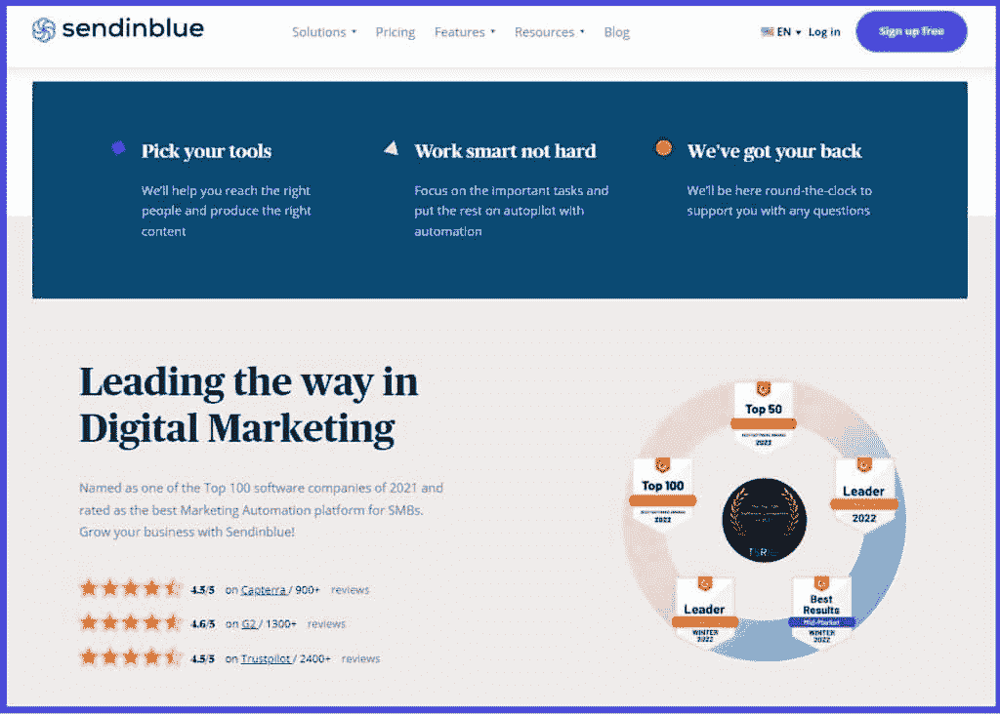

Sendinblue (Source: [Sendinblue](https://www.sendinblue.com/) )

成立于 2012 年的 [Sendinblue](https://www.sendinblue.com/) 是为蓬勃发展的企业提供的顶级数字营销平台之一。这种多功能的服务让你可以使用一整套工具与你的受众进行[有效的沟通](https://kinsta.com/blog/wp-feedback-wordpress-plugin/)，例如电子邮件营销、CRM、Facebook Messenger 和 SMS。

为了增强转换漏斗，Sendinblue 在 2018 年发布了其登陆页面创建器。拖放式构建器非常流畅，您可以从预先存在的模板中进行选择，以定制您想要的登录页面。

除此之外，您还可以通过设置目标 CTA 和添加与您的 Sendinblue 帐户关联的表单字段来决定您的登录页面的用途。这样，将数据传输到您的联系人数据库就很简单了。

使用 Sendinblue Tracker 工具跟踪网站上的访问者活动。这使您能够[开发自动化工作流程](https://kinsta.com/blog/email-marketing-automation/)来使用该信息和电子邮件参与度分析来扩展您的业务。

Sendinblue 的多语言支持台以快速和有用而闻名。您可以通过票务系统或电话联系他们(仅限高级会员和企业会员)。其他资源包括博客、FAQ 部分、教程和 YouTube 频道。

**主要特性:**

*   直观的登录页面生成器，包含 20 多个模板
*   A/B 测试
*   脸书广告、短信和电子邮件营销
*   实时统计
*   受众细分
*   聊天、CRM 和共享收件箱
*   集成
*   免费计划
*   营销自动化工作流程

**定价:**

Sendinblue 的定价结构灵活且经济实惠。每个人都可以尝试免费计划，包括无限联系，每天 300 封电子邮件，短信和电子邮件营销，以及实时聊天。

它还提供三种付费订阅——精简版、高级版和企业版——价格从每月 25 美元到 65 美元不等，取决于你需要的电子邮件数量。所有套餐不可退款。

### 9.系统信息

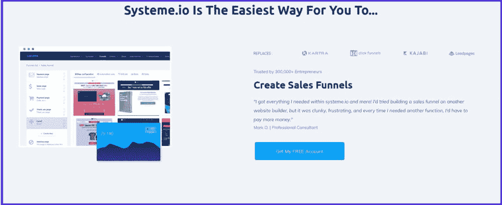

Systeme.io (Source: [Systeme.io](https://systeme.io/home) )

Systeme.io 是一个简单的 ClickFunnels 替代品，拥有超过 200，000 名订户。你不仅可以用 Systeme.io 创建销售渠道，还可以发起电子邮件营销活动，建立网站，设计自动化工作流程，开发在线课程，并建立[联盟项目](https://kinsta.com/affiliate-academy/what-is-affiliate-marketing/)。

漏斗生成器很简单，不需要任何特殊技能。预先制作的模板很优雅，使用起来很快，并且为 HTML/CSS 提供了比其他服务更深入的编辑。

Systeme.io 编辑器还允许您实现会员网站、支付系统和电子邮件列表。它甚至可以设置电子邮件序列和授权访问在线课程。

所有 Systeme.io 功能都是相互关联的，可以省去您在多种服务之间切换的麻烦，并提高您企业的功能和营销成功。

Systeme.io 通过 24/7 票证系统提供卓越的客户支持。他们的知识库也非常全面和有条理。

**主要特性:**

*   用户界面简洁、直观、易于导航
*   拖放式网站/登录页面生成器
*   A/B 测试
*   事件触发动作
*   销售分析
*   数据导入和导出
*   ROI 跟踪
*   领导管理
*   可定制的 CTA
*   滴灌运动
*   一键追加销售
*   自定义域

**定价:**

Systeme.io 为初创公司提供了一个免费计划，拥有 2000 个联系人，无限的外发电子邮件，3 个销售渠道，1 个无限帖子的博客，无限的存储空间和其他功能。

付费套餐分为三个级别:启动、网上研讨会和无限。最小的计划每月花费 27 美元，而最大的计划每月花费 97 美元。与 ClickFunnels 相比，Systeme.io 更经济实惠，并且更物有所值。

### 10.优化抑郁

OptimizePress (Source: [OptimizePress](https://www.optimizepress.com/) )

如果[你是 WordPress 用户](https://kinsta.com/blog/why-use-wordpress/)，你会发现 [OptimizePress](https://www.optimizepress.com/) 是一个更便宜有效的点击漏斗的替代品。

有 120，000 多名企业家雇佣了 OptimizePress，它是一个插件，主要设计为 WordPress 转换漏斗。您可以使用它来生成各种各样的登录页面，包括销售页面、注册页面、结账页面、会员门户以及追加销售和下调销售。

OptimizePress 仪表盘整洁简约，带有易于浏览的命令选项。超过 250 种预制模板可供选择和定制。页面编辑器很快——你可以在一个小时内完成工作，而不必每次都导航到侧边栏。

然而，OptimizePress 中庞大的页面元素库是最大的亮点。它提供了多种构建组件，您可以将这些组件整合到您的网站、销售页面和登录网站中。

只有两种联系支持的方式:通过网站向导或通过票证提交。然而，你可以从许多手册、FAQ 部分和其他自助材料中获得支持。

**主要特性:**

*   为 WordPress 和快速加载时间优化
*   30 多个集成
*   250 多种转换优化模板
*   无限的页面、线索和流量
*   A/B 分割测试
*   转化分析
*   两步选择加入表格和盒子
*   移动响应布局

**定价:**

OptimizePress 提供三种计划:基本计划、套房计划和机构标准计划。价格从每年 99 美元开始，一直涨到每年 399 美元。没有免费试用，但有 100%的 30 天退款保证。

### 11.许愿池

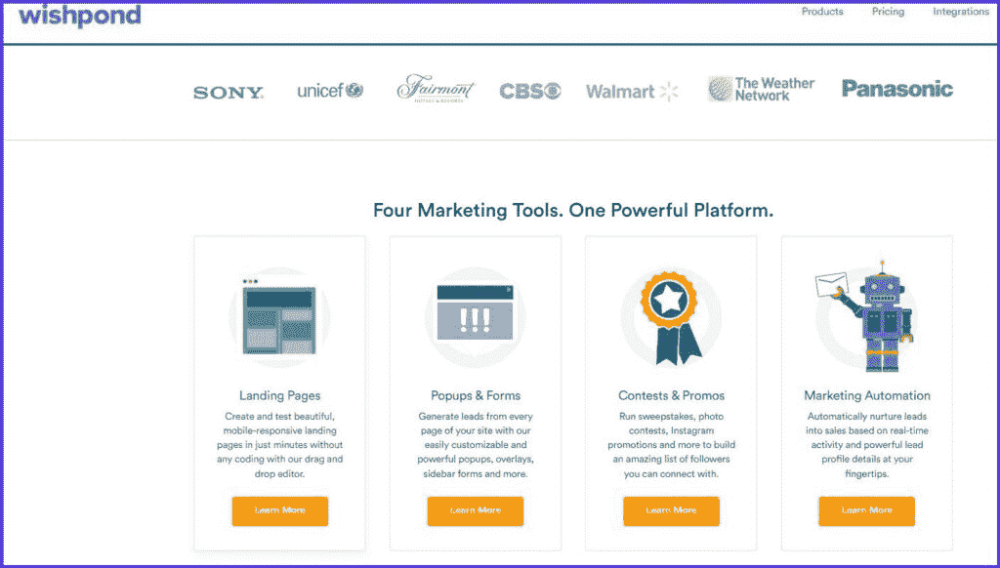

Wishpond (Source: [Wishpond](https://www.wishpond.com/v2/) )

[Wishpond](https://www.wishpond.com/) 是一个功能丰富的营销和销售线索生成点击渠道替代方案。考虑到营销人员，该公司提供了跟踪销售线索活动、网站、在线表格、登录页面、弹出窗口、社交媒体活动等工具。

Wishpond 与您已经使用的工具无缝集成，这要归功于它的 300 多个集成，包括电子邮件、分析、销售、支付和协作应用程序。

创建和发布登录页面是一帆风顺的。只需几分钟，您就可以获得 100 多种专为任何业务量身定制的移动响应设计。您也可以从空白布局创建自己的登录页面。

为了帮助推广您的品牌，Wishpond 的竞赛和推广功能将吸引您的忠实客户和潜在客户“参与并赢得比赛！”此外，推荐套件充满了工具，可以提高你的在线嗡嗡声。

虽然 Wishpond 丰富的功能集很棒，但它可能经常令人困惑。要获得帮助，您可以使用实时聊天、电子邮件和门票与 Wishpond 的支持团队联系。您还会发现多种自助工具，包括指南、博客、Wishpond Academy 和电子书。

**主要特性:**

*   自动将销售线索转化为销售额(取决于实时活动)
*   300 多个集成，包括 Zapier
*   连接 30 多个营销平台
*   在几分钟内创建移动友好的登录页面
*   丰富的弹出窗口构建和行为触发
*   A/B 测试
*   无限制的登录页面、访问者、弹出窗口、表单、用户帐户和社交竞赛
*   滴灌运动

**定价:**

Wishpond 提供 14 天的免费试用，然后你才能订阅它的三个高级包中的任何一个。价格从每月 49 美元到 199 美元不等，按年计费。

## 注册订阅时事通讯

### 想知道我们是怎么让流量增长超过 1000%的吗？

加入 20，000 多名获得我们每周时事通讯和内部消息的人的行列吧！

[Subscribe Now](#newsletter)

### 12.Builderall

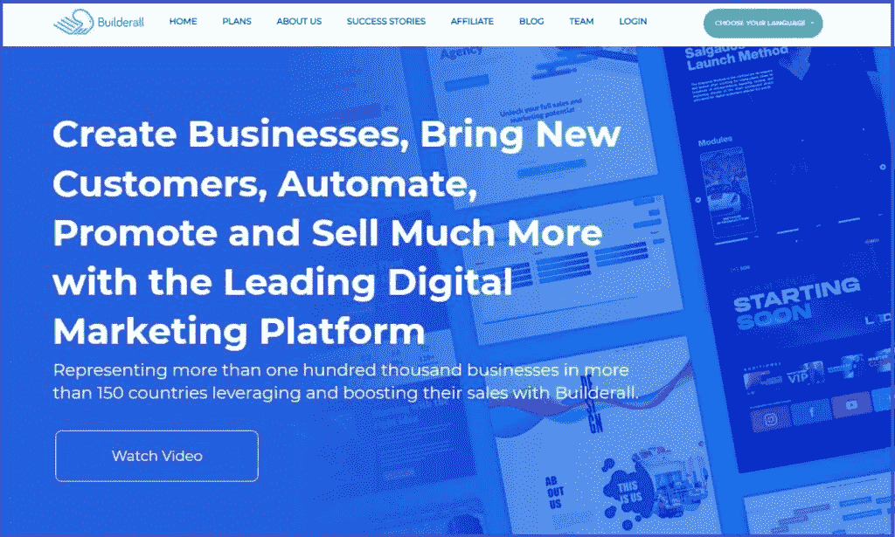

Builderall (Source: [Builderall](https://builderall.com/) )

就像营销人员的瑞士军刀一样， [Builderall](https://builderall.com/) 是一个强大的数字营销、网站建设和网站托管生态系统。

Builderall 提供的令人印象深刻的工具包括一个人工智能仪表盘、一个漏斗构建器、一个非常棒的拖放 WordPress/网站构建器、一个网站聊天机器人、电子学习平台、一个支持台和其他几个工具。

Builderall 自带三个网站构建器:Pixel Perfect Builder、Responsive Builder、Mobile First Builder，这三个工具都可以让你在没有任何前期经验的情况下开发专业的网站。与点击漏斗不同，Builderall 模板是免费提供的。

你甚至可以[用 Builderall 和](https://kinsta.com/blog/create-a-membership-website/)[建立会员网站](https://kinsta.com/blog/wordpress-membership-plugins/)向你的访问者收取月租费来访问你的内容。你还可以[限制只有会员才能访问你网站的特定区域](https://kinsta.com/knowledgebase/wordpress-private-page/)。

借助 Builderall 的热图功能，您可以精确地确定访问者如何在您的网站或销售漏斗中移动，并做出相应的调整以优化转化率。

您可以发送有针对性的电子邮件，添加或跟踪新订户，并通过 Builderall 的邮件 Boss 工具掌握营销活动数据。此外，您可以利用预设的电子邮件模板，而不是从头开始，从而节省时间。

**主要特性:**

*   多个拖放式网站、应用程序和登录页面构建器
*   虚拟主机服务
*   各种营销工具和功能
*   热图
*   支持会员网站
*   分割测试
*   与多个第三方服务的集成
*   可定制的模板

**定价:**

每个类下都有子包，Builderall 提供了两个主要类别:Builderall 计划和 WordPress 计划。Builderall 订阅价格从每月 16 美元到每月 87.90 美元不等。

最便宜的 WordPress 捆绑包是每月 21.90 美元，而最贵的是 87.90 美元。如果您想在提交之前试驾 Builderall，可以获得 14 天的试用期和 30 天的退款保证。

### 13.茁壮成长套房

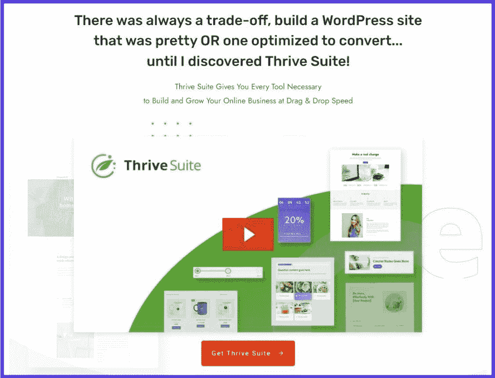

ThriveSuite (Source: [ThriveSuite](https://thrivethemes.com/suite/) )

Thrive Suite 是另一个经济实惠的面向 WordPress 的 ClickFunnels 替代产品，它可以让你通过 Thrive 主题访问广泛的以转换为中心的工具和产品。出于本指南的目的，我们将重点关注 Thrive Leads 解决方案。

Thrive Leads 是一个强大的 WordPress 线索生成和一体化列表构建插件，旨在优化转化。这样，你就可以增加销售线索，而不必使用不同的插件或只依赖一种战术。

拖放编辑器使用方便，包括 250 多个模板。您可以快速设计一个漂亮的登录页面，只需一次单击即可更改所有强调颜色。甚至更高级的表单，包括那些有许多选项或两步流程的表单，也很容易设计。

Thrive Leads 还具有 [A/B 测试](https://kinsta.com/blog/wordpress-ab-testing-tools/)功能，帮助你更好地了解你的网站访问者，并刺激转化。除此之外，还有许多 API 集成可用于将表单与您的[电子邮件营销软件提供商](https://kinsta.com/blog/mailchimp-alternatives/)相链接，如 Drip、ActiveCampaign、 [MailChimp](https://kinsta.com/blog/constant-contact-vs-mailchimp/) 和 ConvertKit。

此外，Thrive Leads 高级定位工具可以让您显示独一无二的选择加入服务(通过类别、标签、帖子、页面或 URL)，这些服务与您的 WP 网站主题完全同步。您还可以使用短代码、PHP 代码和小部件自由添加表单。

**主要特性:**

*   复杂的拖放编辑器
*   丰富的定制选项
*   可操作的报告和见解
*   A/B 测试
*   个性化弹出窗口
*   粘性丝带
*   多个 API 集成
*   内容锁定和嵌入式表单
*   智能退出和智能链接技术

**定价:**

您可以按季度或年度注册 Thrive Suite。季度订阅费为 99 美元，而年度会员费为 299 美元。此外，您有权获得 30 天 100%退款保证。

### 14.漏斗网

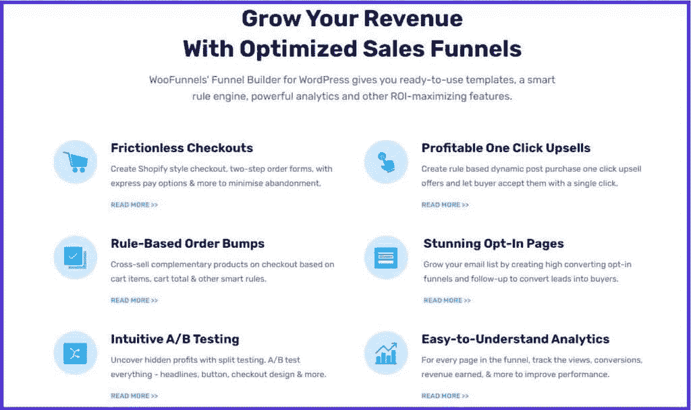

WooFunnels features (Source: [WooFunnels](https://buildwoofunnels.com/) )

总部位于印度的 WooFunnels 是一个 WordPress 销售漏斗构建器，它为 20，000 多名精明的用户提供了自动生成、订单提升、结账和一键追加销售的功能，这些功能转化良好并增加了收入。

WooFunnels 库充满了高转换、设计优雅的模板，可以与 [WordPress 块编辑器](https://kinsta.com/blog/gutenberg-wordpress-editor/)以及其他页面生成器如 [Divi 和 Elementor](https://kinsta.com/blog/divi-vs-elementor/) 无缝协作。

 通过一键式追加销售功能，您可以提供旨在提高销售后平均订单价值的免费追加销售。因此，你可以在不增加广告成本或流量的情况下提高销售额。

如果您想将相关产品追加销售添加到您的结账中，WooFunnels 订单提升工具非常方便。仅这项功能就能让你的销售额提高 30%。

你可能已经注意到了，WooCommerce 页面并不是真正为转换而设计的。但是如果你使用 WooFunnels，你可以很快开发出定制的结账表格，以满足你的公司和顾客的需求。

因此，您将能够包含有助于减少购物车废弃的元素，例如两步订购流程、类似于 Shopify 的布局、快速支付替代方案等等。

WooFunnels 支持是通过一个票证系统提供的，您可以浏览各种自助资源，如 WooFunnels 博客、文档和 FAQ。

**主要特性:**

*   内置分析
*   A/B 测试
*   一键订购颠簸
*   向上销售和向下销售
*   基于规则的漏斗触发器
*   吸引人的模板和用户友好的页面生成器
*   优化退房

**定价:**

WooFunnels 在 WordPress.org 上提供了一个免费版本[。他们还为单个网站所有者和拥有多个网站的机构出售高级订阅。最低的套餐年费为 179 美元，而最贵的套餐为 399 美元。](https://kinsta.com/blog/wordpress-com-vs-wordpress-org/)

### 15\. Keap

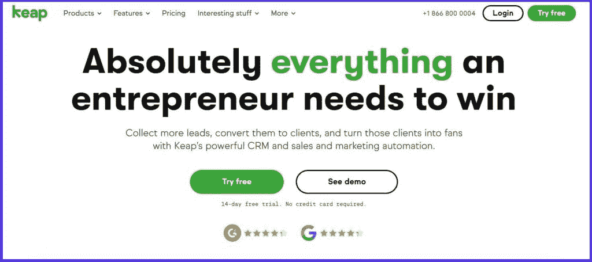

Keap (Source: [Keap](https://keap.com/) )

寻找一个强大的 CRM，结合功能丰富的电子邮件营销工具和自动化漏斗？你应该把 [Keap](https://keap.com/) 加入你的候选名单。

我们建议 Keap(以前称为 Infusionsoft)不仅作为 ClickFunnels 的替代方案，而且作为 ClickFunnels 功能的升级，特别是如果你已经有了一个既定的业务。

Keap 套件附带了大量的服务，如登录页面和线索收集工具，如表单、弹出窗口、自动化功能和电子邮件分发。由于 Keap 可靠的客户成功管理器、直观的拖放式销售漏斗构建器和移动友好的登录页面模板，升级您的 CRM 非常简单——不会降低您的[页面加载速度](https://kinsta.com/blog/speed-up-woocommerce/)。

在您可定制的控制面板上，您可以协调和监控销售线索，密切关注一切，直到达成交易。此外，您可以通过启动自动跟进和任务来推动销售线索通过销售漏斗。

Keap 拥有可靠的 24/7 支持选项，如聊天、电话、电子邮件和票证。它还拥有一个大型社区、大量文档、网络研讨会和教程视频。

**主要特性:**

*   无限电子邮件营销
*   快速加载模板
*   简洁的界面和高功能的构建器
*   强大的自动化功能
*   全天候聊天支持
*   许多发票和支付处理选项
*   通过 Zapier premium 集成了 2500 多个 API
*   销售线索评分和销售线索来源跟踪

**定价:**

Keap 不便宜，所以如果你预算有限，我们不建议你这么做。Pro 和 Max 是两种可用的方案。前者的价格是 169 美元一个月，后者的价格是 249 美元。

如果需要定制方案，可以联系销售团队，询问 Max Classic 套餐。另外，你可以免费试用 Keap 14 天。

Struggling with downtime and WordPress problems? Kinsta is the hosting solution designed to save you time! [Check out our features](https://kinsta.com/features/)

### 16.10 分钟漏斗

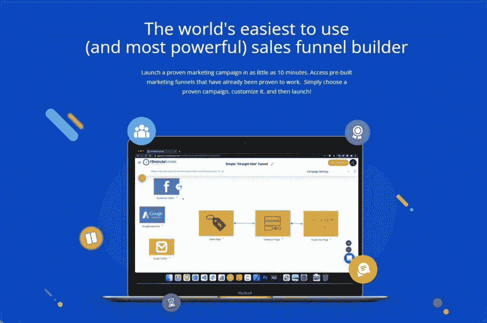

10 Minute Funnels (Source: [10 Minute Funnels](https://www.tenminutefunnels.com/) )

顾名思义，10 分钟漏斗图(T1)或 10MF 是关于速度和效率的。这个年轻的服务做了你期望从销售漏斗工具中得到的一切，但是它做得更快，使它成为一个重要的点击漏斗的替代品。

新手网站所有者和有经验的程序员都可以使用 10 分钟漏斗在几分钟内创建任何类型的销售漏斗。您可以轻松地浏览该应用程序，因为它的界面、设计和布局非常友好、清晰、直观。

丰富的预建模板使 10 分钟漏斗的用途非常广泛，从销售线索、销售和追加销售漏斗到单个网页和活动的设计应有尽有。你会发现，通过使用 10MF 的动态页面编辑器添加和移动预先存在的元素，无需任何编码知识就可以非常方便地修改你的网站。

10 分钟漏斗还提供了一束移动响应的网页插件和免费插件。例如，Opt-in Popup 特性鼓励访问者以微妙的方式加入您的邮件列表。此外，该服务还支持多个订单购物车选项，包括 Amazon、Samcart、shopiggoro、ShoppingCart、PayPal 等。

10 分钟漏斗提供额外的行动，通过自定义脚本创建，网址重定向，连接到谷歌分析，并连接两个独立的漏斗网页。

您的支持选项仅限于工作时间的电子邮件。然而，数百个视频、400 页的用户手册、丰富的知识库和现场培训电话录音都包含在免费提供的完整培训包中。

**主要特性:**

*   快速性能
*   100%拖放式生成器
*   分割测试
*   一键追加销售
*   与第三方应用的集成
*   能够使用自己的域名
*   多达无限的渠道，访问者，页面和自定义域

**定价:**

10 分钟漏斗提供两种会员级别:每月 67 美元的标准和每月 167 美元的高级。该公司还提供 14 天的试用期，费用为 1 美元。

### 17.管道驱动

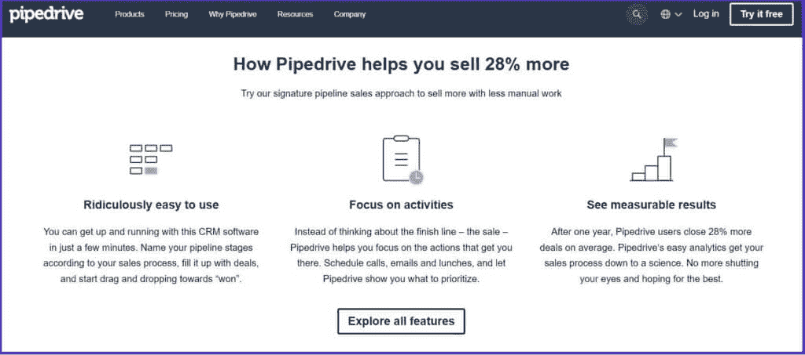

Pipedrive features (Source: [Pipedrive](https://www.pipedrive.com/) )

作为小企业的 ClickFunnels 替代方案，Pipedrive 是一个用户友好的、面向销售的 CRM。与我们列表中的一些产品不同，Pipedrive 是一个真正的销售构建者，它充当销售的视觉管道，而不仅仅是引导销售。

您可以使用 Pipedrive 创建任意多的定制交易管道，并将其拖放到位。简单明了的用户界面具有干净整洁的设计。Pipedrive 还提供清晰的日历和电子邮件界面、高度可配置的分析和自动化工作流程，以加快您的销售周期。

为了让您全面了解潜在客户、潜在客户和当前客户，智能联系人数据功能会收集有关您的联系人的公开信息。

该软件还具有发现和合并重复联系人的能力。另一个很酷的功能是 Leadbooster，这是一个潜在客户生成工具，可以与您的网站集成以增加转化率。您可以设置预配置的问题来收集新的销售线索，然后 Leadbooster 可以将其添加到您的渠道中。

**主要特性:**

*   强大的移动应用以及通话和电子邮件同步
*   拖放交易管道
*   无限制的自动化工作流程
*   内置电子邮件营销工具
*   收入预测、预报和高级定制报告
*   全天候支持
*   300 多个集成

**定价:**

Pipedrive 有四个预算友好的计划可供选择:基本、高级、专业和企业。价格从每月 11.90 美元到 74.90 美元不等。您可以选择按月或按年计费。此外，还有 14 天的免费试用期。

### 18.WP 简单支付

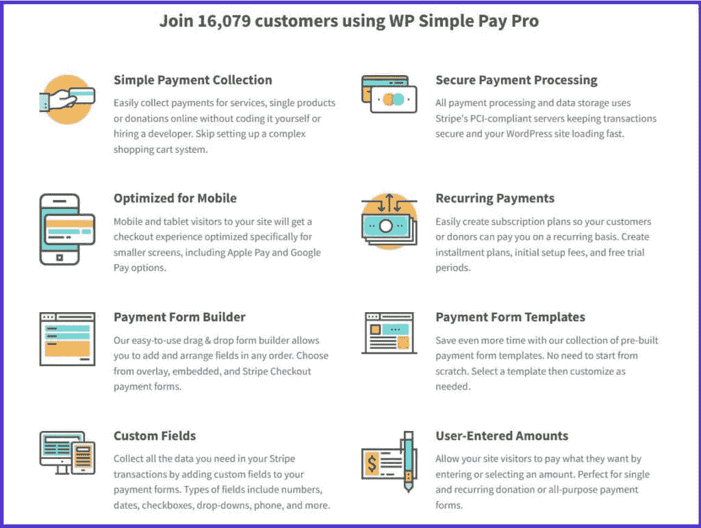

WP Simple Pay features (Source: [WP Simple Pay](https://wpsimplepay.com/) )

[WP Simple Pay](https://wpsimplepay.com/) 让在 WordPress 中收取一次性和定期付款变得简单，无需设置购物车。它是专门为配合[条纹支付服务](https://kinsta.com/blog/stripe-vs-square/)而开发的。

作为 ClickFunnels 的替代产品，WP Simple Pay 提供了您在网站上安全接受支付所需的所有工具，以及一个易于使用的拖放式支付表单生成器。优惠券代码也可以部署，该网站支持 14 种语言，30 多个地点，130 多种国际货币。

有复选框、文本字段和按钮可供即时使用。此外，您可以创建自定义字段，让客户在向您购买产品时准确地知道您需要什么信息。

**主要特性:**

*   付款表单拖放生成器
*   多个集成(Divi、Zapier、Elementor 等等)
*   能够为苹果和谷歌支付添加按钮
*   无限支付形式和交易
*   没有交易或每月费用
*   税率管理
*   PCI 合规性和 SCA 就绪

**定价:**

WP Simple Pay 提供四种高级套装:精英版、专业版、高级版和个人版。价格在每年 49.50 美元到 299.50 美元之间。你也可以利用他们的 14 天 100%退款保证。

WordPress 插件也有免费版本，没有使用限制。

### 19.萨姆卡特

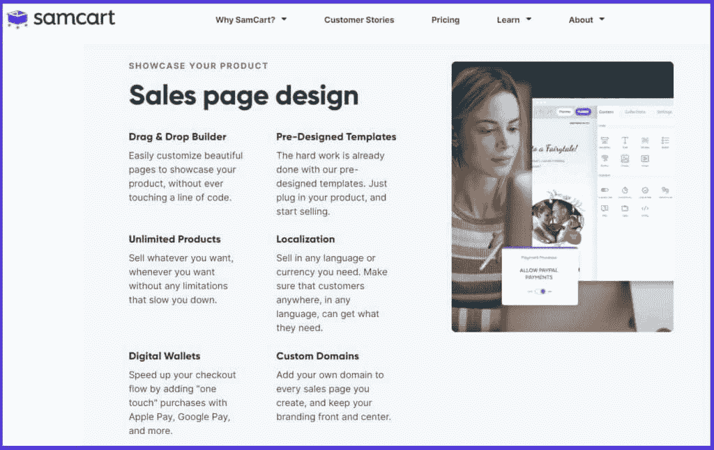

SamCart features (Source: [SamCart](https://www.samcart.com/) )

SamCart 是一个可行的 ClickFunnels 替代品，它专注于购买阶段，这是销售漏斗中最重要的部分。SamCart 通过可爱的设计帮助在线商店优化结账页面，以获得流畅的购买体验。

SamCart 有预制的模板，您可以使用它们的拖放编辑器和分割测试来修改这些模板。支付处理通过 [PayPal 和 Stripe](https://kinsta.com/blog/stripe-vs-paypal/) 进行。对于追加销售和优惠券，Samcart 非常棒。

您可以在 SamCart 中使用弹出显示，以促进互动并最大限度地减少结帐页面上的购物车放弃。如果您愿意，您甚至可以将整个结账页面转换成一个弹出窗口。SamCart 还为您提供了一个信任印章，您可以添加它来提高用户参与度。

SamCart 可能没有 ClickFunnels 那么多营销选项，但它仍然为 700 多个应用程序提供了广泛的电子邮件营销服务和 [Zapier 集成](https://kinsta.com/blog/woocommerce-zapier/)，以帮助您最大限度地利用您的数字营销策略。

**主要特性:**

*   拖放页面生成器
*   订单批量收集
*   无限的产品、页面、视频上传和会员资格
*   优秀的 A/B 分割测试工具
*   没有加工或额外费用
*   白色标签品牌
*   订购后追加销售
*   CRM 集成
*   高度准确的会员跟踪功能

**定价:**

三个级别—启动、增长和扩展—对 SamCart 包进行分类。定价从每月 49 美元到 199 美元不等。您可以选择按月或按年订购。

SamCart 提供 7 天免费试用，如果你注册了年度订阅，还有 30 天的退款保证。

### 20.Webflow

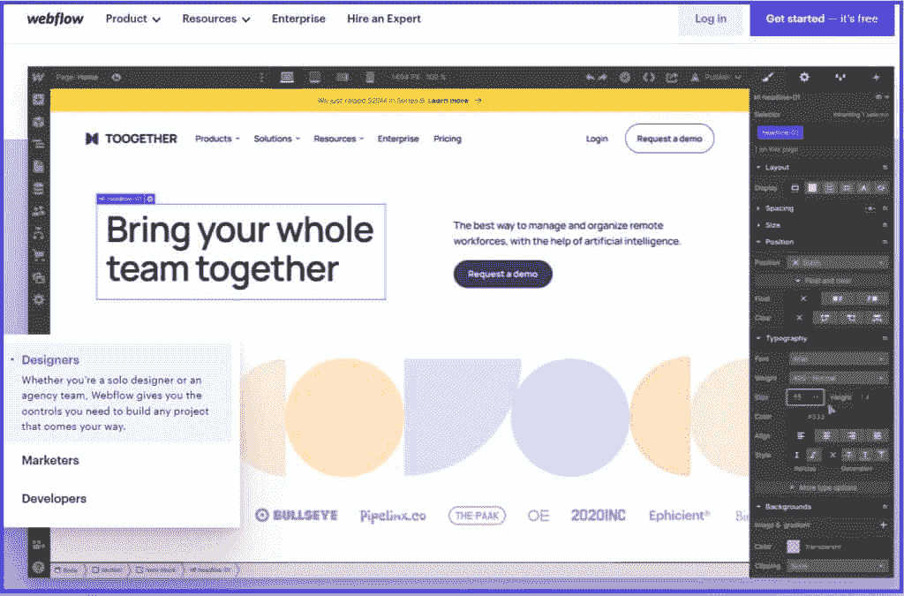

Webflow homepage (Source: [Webflow](https://webflow.com/?r=0) )

你可以使用 [Webflow](https://webflow.com/) 制作销售线索生成页面，Webflow 是一个著名的网站建设和托管服务。尽管它缺乏创建强大销售渠道所需的巨大能力和资源，但对于那些只想创建简单互动渠道的人来说，它是一个合适的替代选择。

这种 ClickFunnels 替代方案允许网站架构师展示手机友好的网站和登录页面。此外，您可以配置这些页面以响应用户行为的变化和调整。页面生成器不需要编码，并提供了 100 多种令人惊叹的模板和定制。

转向电子商务工具，当客户来到您的收银台时，Webflow 的自动税务计算器将立即计算并添加任何适用的销售税和增值税。[通过 Stripe](https://kinsta.com/blog/stripe-vs-braintree/) ，Webflow 使您能够接收除典型的信用卡和借记卡以及 [Apple Pay 和 PayPal](https://kinsta.com/blog/paypal-alternative/) 之外的支付。

**主要特性:**

*   不同内容的顶级模板
*   丰富的定制功能
*   HTML、CSS 和 Javascript 的自动生成
*   搜索引擎优化管理
*   多重支付集成
*   强大的安全性
*   AWS 服务器上的托管服务
*   无限制的备份和存储

**定价:**

启动计划是 Webflow 提供的免费选项。他们还为个人和组织提供高级订阅。价格因要求而异。价格最低的套餐每月费用为 15 美元，而最贵的选项每月费用为 235 美元。

### 21.兰丁吉

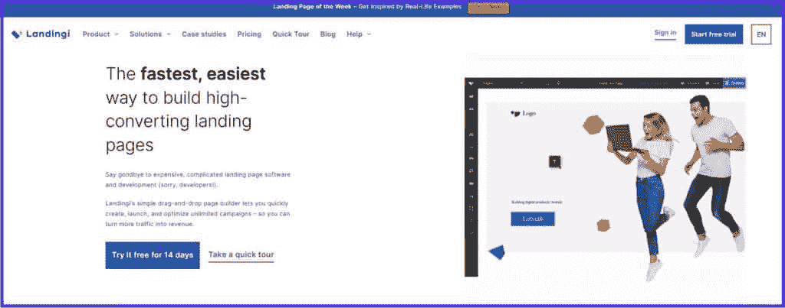

Landingi (Source: [Landingi](https://landingi.com/) )

从它的名字，你大概猜到了什么 [Landingi](https://landingi.com/) 是 aboutː登陆页面。与 Unbounce 类似，Landingi 专注于登录页面以提高销售额，而不是深入研究收入的“漏斗”过程。

Landingi 打包了一系列令人印象深刻的功能，如移动友好编辑器、线索捕捉功能、弹出窗口、大量集成(如 HubSpot、Salesforce 和 ConvertKit)和测试工具。

Landingi 的拖放构建器包含 300 多个针对不同登陆和漏斗页面目标的完美模板，您可以在没有专业人员帮助的情况下快速定制这些模板。

有了 PageInsider 包，你可以很容易地找出访问者最有可能把注意力引向哪里，这样你就可以专注于在那里进行必要的调整，以提高你的转化率。

**主要特性:**

*   300 多个登录页面模板
*   无限制的转换和登录页面
*   每月 1000 到 50000 次访问
*   从 1 到 5 个自定义域加上 SSL
*   白色标签
*   A/B 测试
*   50 多个弹出模板
*   大量的集成

**定价:**

Landingi 有四个可用的软件包:核心、创建、自动化和代理。订阅费从每月 35 美元到 129 美元不等，但如果你每年或每两年注册一次，你可以获得更低的费率。此外，所有 Landingi 计划都有 14 天的免费试用期。

### 22.Convertri

Convertri (Source: [Convertri](https://www.convertri.com/) )

在其核心部分， [Convertri](https://www.convertri.com/) 类似于 ClickFunnels，但具有更好的界面、更高的性能和更实惠的价格。Convertri 加载页面的速度是其最大的特点之一。

这种 ClickFunnels 替代方案有一个可定制的拖放页面编辑器，并包括一个引人注目的快速加载预设主题库。该构建器还提供动态文本，您可以使用它将预制的内容块直接添加到您的网站。

Convertri 让你通过他们的转换跟踪工具来关注你的漏斗的进展。此外，您可以选择将您在其他平台上创建的任何漏斗附加到您的域中，并使用 Convertri 导出。

此外，该服务还附带了一个 WordPress 插件，你可以轻松地将其与你的网站集成，更不用说与更多第三方应用程序如 ActiveCampaign、MailChimp、Drip 和 Keep 的集成了。

**主要特性:**

*   每月 25 万次展示
*   25 个漏斗和 250 页
*   400 多个模板
*   A/B 测试
*   托管多达 20 个视频
*   页面导入程序
*   SSL 和 100 GB 每月带宽
*   多达 10 个自定义域
*   电子邮件支持和丰富的知识库

**定价:**

Convertri 只有一个价格计划，你可以每月支付 99 美元或每年支付 75 美元注册。还包括 14 天的免费试用。

### 23.沟槽漏斗

GrooveFunnels (Source: [GrooveFunnels](https://groove.cm/) )

如果你不觉得 Builderall 是 ClickFunnels 的替代品，GrooveFunnels 或者只是 Groove 可能是一个更好的选择。GrooveFunnels 生态系统包括许多自动化和销售服务，如 GroovePages、GrooveSell、GrooveMember、GrooveMail、GrooveKart、GrooveVideo 等等。

GroovePages 是一个高转化率、用户友好的页面和漏斗构建工具。在创建内容时，您可以从各种预制的模板中进行选择，因为 GroovePages 利用了 VueJS，所以编辑器的性能要比 ClickFunnels 好得多。

使用 GrooveSell，您将能够从 OTO 的功能中获益，如一键追加销售、向下销售和订单提升。你不需要依赖其他购物车。

GrooveFunnels 的电子邮件营销服务 GrooveMail 是另一个类似于 ActiveCampaign 和 MailChimp 的优秀功能。它具有最新的电子邮件自动化功能，包括文本消息和语音广播插件、基于行为的自动化、分割测试、电子邮件排序和广播。

**主要特性:**

*   350 多个模板和漏斗
*   强大的拖放生成器
*   丰富的电子邮件营销工具
*   没有月费
*   无限的渠道，产品，estores，网页托管，自定义域和集成
*   会员网站
*   漏斗管理、销售 CRM 和视频托管

**定价:**

GrooveFunnels 的启动捆绑包是一个终身免费计划，授予访问大量资源和功能的权限。当然，也有高级选项，费用从每月 99 美元(或每年 79 美元)到每月 299 美元(或每年 239 美元)不等。

更重要的是，GrooveFunnels 对付费会员有 30 天的退款政策。

### 24.卡贾比

Kajabi (Source: [Kajabi](https://kajabi.com/) )

如果你是一个需要提升你的数字形象的演讲者、教练或作家，Kajabi 是一个包罗万象的平台，你应该考虑将其作为 ClickFunnels 的替代选择。

你可以用 Kajabi 设计和营销播客、会员、教练和课程等项目。迷你课程、指导和点滴课程只是你可以利用的几种形式。此外，没有带宽或视频托管限制。

 “管道”是卡加比所说的他们的漏斗。这些由优惠、电子邮件活动和登录页面组成。每个漏斗都有预先写好的材料，这些材料是从公司最杰出的企业家的最有效的销售漏斗中构建的。

Kajabi 有一个直观的[登陆页面生成器](https://kinsta.com/blog/wordpress-landing-page-plugins/)，你会觉得使用起来很舒服。您可以调整页面的各个方面，直到它在每个设备上都显示正确。

该平台还允许你生成[弃车电子邮件](https://kinsta.com/blog/abandoned-cart-email/)以追回丢失的购买、促销、订购颠簸、提供优惠券(以及其他)以获得追随者。

**主要特性:**

*   无限的登录页面和营销电子邮件
*   从 3 到 100 个漏斗
*   从 10000 到 100000 个联系人
*   多达 20，000 名活跃客户
*   美观的现成模板
*   用户友好的页面和漏斗生成器
*   零交易费用
*   全天候聊天支持和全面的文档

**定价:**

Kajabi 的定价和 like 漏斗一样，偏高。它有三个会员级别:基本、增长和专业，月费分别为 119 美元、159 美元和 319 美元。如果你想试用这项服务，你可以免费试用 14 天。此外，该公司提供 30 天退款保证。

## 摘要

如你所见，有不止一个 ClickFunnels 可供选择。有些比其他的更全面，但这都归结于您的业务需求。

因此，无论你寻找 ClickFunnels 替代品的原因是什么，你都应该知道，市场上总是有各种价格区间的可靠平台。

[Want to build effective campaigns and increase your revenue? 📈 Check out these helpful ClickFunnels alternatives to get started 🛠Click to Tweet](https://twitter.com/intent/tweet?url=https%3A%2F%2Fkinsta.com%2Fblog%2Fclickfunnels-alternative%2F&via=kinsta&text=Want+to+build+effective+campaigns+and+increase+your+revenue%3F+%F0%9F%93%88+Check+out+these+helpful+ClickFunnels+alternatives+to+get+started+%F0%9F%9B%A0&hashtags=MarketingTIps%2CSmallBiz)

还在犹豫选择正确的点击漏斗吗？我们很乐意为您缩小范围！

*   如果你想勒紧裤腰带，LeadPages、Kartra 和 GetResponse 是很好的选择，可以节省大笔资金，并获得 ClickFunnels 提供的几乎所有东西，以及更高的性能和更好的支持。
*   你认为速度高于一切吗？10 分钟漏斗和 Convertri 是你的赢家。
*   如果你是 WordPress 网站的所有者，OptimizePress 和 Thrive Suite 是很好的选择。

对于其他专业行业来说，Kajabi 非常棒，特别是对于电子学习目的，而 Keap 和 HubSpot 则非常适合电子邮件营销。

你过去尝试过哪些点击漏斗的替代品？你觉得怎么样？请在下面的评论中告诉我们！

* * *

让你所有的[应用程序](https://kinsta.com/application-hosting/)、[数据库](https://kinsta.com/database-hosting/)和 [WordPress 网站](https://kinsta.com/wordpress-hosting/)在线并在一个屋檐下。我们功能丰富的高性能云平台包括:

*   在 MyKinsta 仪表盘中轻松设置和管理
*   24/7 专家支持
*   最好的谷歌云平台硬件和网络，由 Kubernetes 提供最大的可扩展性
*   面向速度和安全性的企业级 Cloudflare 集成
*   全球受众覆盖全球多达 35 个数据中心和 275 多个 pop

在第一个月使用托管的[应用程序或托管](https://kinsta.com/application-hosting/)的[数据库，您可以享受 20 美元的优惠，亲自测试一下。探索我们的](https://kinsta.com/database-hosting/)[计划](https://kinsta.com/plans/)或[与销售人员交谈](https://kinsta.com/contact-us/)以找到最适合您的方式。