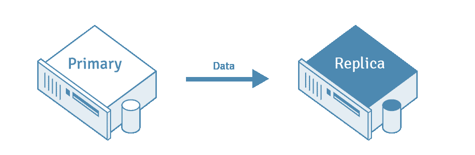
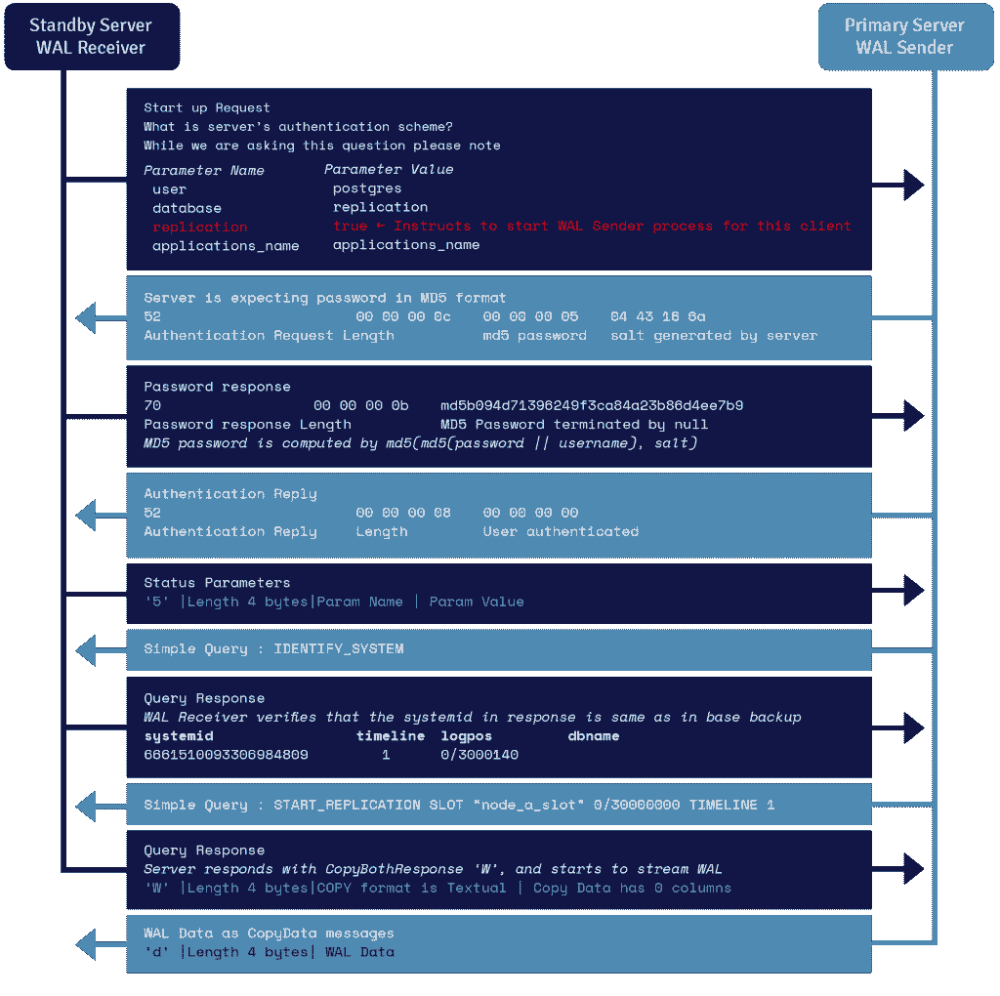

# PostgreSQL 复制:综合指南

> 原文：<https://kinsta.com/blog/postgresql-replication/>

任何网站所有者都会告诉你，数据丢失和停机时间，即使是很小的剂量，也可能是灾难性的。它们可以在任何时候袭击没有准备好的人，导致生产力、可访问性和产品信心的降低。

为了保护您站点的完整性，针对停机或数据丢失的可能性建立安全措施是至关重要的。

这就是数据复制的用武之地。
[任何网站所有者都会告诉您，数据丢失和停机，即使是极小的损失，也可能是灾难性的。😱回车，数据复制💪 点击发布推文](https://twitter.com/intent/tweet?url=https%3A%2F%2Fkinsta.com%2Fblog%2Fpostgresql-replication%2F&via=kinsta&text=As+any+site+owner+will+tell+you+that+data+loss+and+downtime%2C+even+in+minimal+doses%2C+can+be+catastrophic.+%F0%9F%98%B1+Enter%2C+data+replication+%F0%9F%92%AA&hashtags=WebDev%2CPostgreSQL)
数据复制是一个自动化的备份过程，在此过程中，您的数据会从其主数据库反复复制到另一个远程位置进行安全保护。对于任何运行数据库服务器的网站或应用来说，这都是一项不可或缺的技术。您还可以利用复制的数据库来处理只读 SQL，从而允许在系统中运行更多的进程。

在两个数据库之间设置复制提供了对意外事故的容错能力。这被认为是灾难期间获得高可用性的最佳策略。
 在本文中，我们将深入探讨[后端开发人员](https://kinsta.com/blog/backend-developer/)可以实现无缝 PostgreSQL 复制的不同策略。 

## 什么是 PostgreSQL 复制？



PostgreSQL replication illustration (Image Source: [EnterpriseDB](https://www.enterprisedb.com/postgres-tutorials/postgresql-replication-and-automatic-failover-tutorial#continuous-wal))


PostgreSQL 复制被定义为将数据从一个 [PostgreSQL 数据库](https://kinsta.com/knowledgebase/what-is-postgresql/)服务器复制到另一个服务器的过程。源数据库服务器也称为“主”服务器，而接收复制数据的数据库服务器称为“副本”服务器。

PostgreSQL 数据库遵循一种简单的复制模型，其中所有的写入都进入一个主节点。然后，主节点可以应用这些更改，并将它们广播到辅助节点。


### 什么是自动故障转移？

故障转移是一种在主服务器因任何原因出现故障时恢复数据的方法。只要您配置了 PostreSQL 来管理您的物理流复制，您和您的用户就不会因为主服务器故障而停机。

请注意，故障转移过程可能需要一些时间来设置和启动。PostgreSQL 中没有内置的工具来监控服务器故障，所以您需要发挥创造力。

幸运的是，您不必依赖 PostgreSQL 进行故障转移。有专门的工具允许自动故障转移和自动切换到备用状态，减少了数据库停机时间。

通过设置故障转移复制，可以确保在主服务器崩溃时备用服务器可用，从而保证高可用性。

## 使用 PostgreSQL 复制的好处

以下是利用 PostgreSQL 复制的一些主要优势:

*   **数据迁移:**您可以通过更改数据库服务器硬件或系统部署来利用 PostgreSQL 复制进行数据迁移。
*   **容错:**如果主服务器出现故障，备用服务器可以充当服务器，因为主服务器和备用服务器包含的数据是相同的。
*   **在线事务处理(OLTP)性能:**您可以通过消除报告查询负载来缩短 OLTP 系统的事务处理时间和查询时间。事务处理时间是在事务完成之前执行给定查询所需的持续时间。
*   **并行系统测试:**在升级新系统时，您需要确保系统与现有数据兼容，因此需要在部署前使用生产数据库副本进行测试。

## PostgreSQL 复制的工作原理

一般来说，人们认为当你尝试使用主架构和次架构时，只有一种方法可以设置备份和复制。然而，PostgreSQL 部署可以遵循[以下三种方法中的任何一种](https://www.citusdata.com/blog/2018/02/21/three-approaches-to-postgresql-replication/):

1.  **流复制:**将数据从主节点复制到辅助节点，然后将数据复制到亚马逊 S3 或 Azure Blob 进行备份存储。
2.  **卷级复制:**在存储层复制数据，从主节点开始复制到辅助节点，然后将数据复制到亚马逊 S3 或 Azure Blob 进行备份存储。
3.  **增量备份:**从主节点复制数据，同时从亚马逊 S3 或 Azure Blob 存储构建新的辅助节点，允许从主节点直接流式传输。

### 方法 1:流式传输

在所有服务器上安装 PostgreSQL 后，可以无缝设置 PostgreSQL 流复制(也称为 WAL 复制)。这种复制方法基于将 WAL 文件从主数据库移动到目标数据库。

您可以通过使用主从配置来实现 PostgreSQL 流复制。主服务器是处理主数据库及其所有操作的主要实例。辅助服务器充当辅助实例，在自身上执行对主数据库所做的所有更改，并在此过程中生成一个完全相同的副本。主服务器是读/写服务器，而辅助服务器只是只读的。

对于这种方法，您需要配置主节点和备用节点。以下部分将阐述轻松配置它们的步骤。

#### 配置主节点

您可以通过执行以下步骤来配置用于流式复制的主节点:

##### 步骤 1:初始化数据库

为了让[初始化数据库](https://hevodata.com/learn/postgresql-streaming-replication/#master1)，您可以利用`initdb`实用程序命令。接下来，您可以使用以下命令创建一个具有复制权限的新用户:

```
CREATE USER 'example_username' REPLICATION LOGIN ENCRYPTED PASSWORD 'example_password';
```

用户必须为给定的查询提供密码和用户名。replication 关键字用于为用户提供所需的权限。查询示例如下所示:

```
CREATE USER 'rep_username' REPLICATION LOGIN ENCRYPTED PASSWORD 'rep_password';
```

##### 步骤 2:配置流属性

接下来，您可以使用 PostgreSQL 配置文件( **postgresql.conf** )配置流属性，该文件可以修改如下:

```
wal_level = logical
wal_log_hints = on
max_wal_senders = 8
max_wal_size = 1GB
hot_standby = on
```

以下是上一个片段中使用的参数的一些背景知识:

*   **`wal_log_hints` :** 当备用服务器与主服务器不同步时，这个参数对于`pg_rewind`功能是必需的。
*   **`wal_level` :** 您可以使用该参数来启用 PostgreSQL 流复制，可能的值包括`minimal`、`replica`或`logical`。
*   **`max_wal_size` :** 用于指定日志文件中可以保留的 WAL 文件的大小。
*   **`hot_standby` :** 当该参数设置为 on 时，您可以利用该参数与辅助设备进行读取连接。
*   **`max_wal_senders` :** 您可以使用`max_wal_senders`来指定可以与备用服务器建立的最大并发连接数。

##### 步骤 3:创建新条目

在您修改了 **postgresql.conf** 文件中的参数之后， **pg_hba.conf** 文件中的一个新的复制条目可以允许服务器相互建立复制连接。

通常可以在 PostgreSQL 的数据目录中找到这个文件。您可以使用以下代码片段来实现相同的目的:

```
host replication rep_user IPaddress md5
```

一旦代码片段被执行，主服务器就允许名为`rep_user`的用户通过使用指定的 IP 进行复制来连接并充当备用服务器。例如:

```
host replication rep_user 192.168.0.22/32 md5
```

#### 配置备用节点

要为流式复制配置备用节点，请执行以下步骤:

##### 步骤 1:备份主节点

要配置备用节点，利用`pg_basebackup`实用程序生成主节点的备份。这将作为备用节点的起点。您可以按以下语法使用该实用程序:

```
pg_basebackp -D  -h  -X stream -c fast -U rep_user -W
```

上述语法中使用的参数如下:

*   **`-h` :** 你可以用这个来提主机。
*   **`-D` :** 该参数表示您当前工作的目录。
*   **`-C` :** 你可以用这个来设置关卡。
*   **`-X` :** 该参数可以用来包含必要的事务日志文件。
*   **`-W` :** 您可以使用该参数在链接到数据库之前提示用户输入密码。

##### 步骤 2:设置复制配置文件

接下来，您需要检查复制配置文件是否存在。如果没有，您可以将复制配置文件生成为 **recovery.conf** 。

您应该在 PostgreSQL 安装的数据目录中创建该文件。您可以使用`pg_basebackup`实用程序中的`-R`选项自动生成它。

**recovery.conf** 文件应该包含以下命令:

```
standby_mode = 'on'

primary_conninfo = 'host=<master_host> port=<postgres_port> user=<replication_user> password=<password> application_name="host_name"'

recovery_target_timeline = 'latest'
```

上述命令中使用的参数如下:

*   **`primary_conninfo` :** 您可以使用它通过利用连接字符串在主服务器和辅助服务器之间建立连接。
*   **`standby_mode` :** 该参数可以使主服务器在开机时作为备用服务器启动。
*   **`recovery_target_timeline` :** 你可以用这个来设置恢复时间。

要建立连接，您需要提供用户名、IP 地址和密码作为 primary_conninfo 参数的值。例如:

```
primary_conninfo = 'host=192.168.0.26 port=5432 user=rep_user password=rep_pass'
```

##### 步骤 3:重新启动辅助服务器

最后，您可以重新启动辅助服务器来完成配置过程。

然而，流式复制带来了一些挑战，例如:

*   各种 PostgreSQL 客户端(用不同的编程语言编写)与单个端点进行对话。当主节点出现故障时，这些客户端将不断重试相同的 DNS 或 IP 名称。这使得故障转移对应用程序可见。
*   PostgreSQL 复制没有内置的故障转移和监控功能。当主节点出现故障时，您需要将辅助节点升级为新的主节点。这种提升需要以这样的方式执行，即客户端只写入一个主节点，并且它们不会观察到数据不一致。
*   PostgreSQL 复制其整个状态。当您需要开发一个新的辅助节点时，辅助节点需要重述主节点的整个状态更改历史，这是一项资源密集型任务，并且消除头部节点并创建新节点的成本很高。

### 方法 2:复制块设备

复制块设备方法依赖于磁盘镜像(也称为卷复制)。在这种方法中，更改被写入永久卷，永久卷被同步镜像到另一个卷。

这种方法的额外好处是它在云环境中与所有关系数据库的兼容性和数据持久性，包括 PostgreSQL、MySQL 和 [SQL Server](https://kinsta.com/blog/postgresql-vs-sql-server/) 等等。

然而，PostgreSQL 复制的磁盘镜像方法需要您复制 WAL 日志和表数据。因为现在对数据库的每次写入都需要通过网络同步进行，所以您不能丢失一个字节，因为这会使您的数据库处于损坏状态。

这种方法通常使用 Azure PostgreSQL 和 Amazon RDS。

### 方法 3: WAL

WAL 由段文件组成(默认为 16 MB)。每个段有一个或多个记录。日志序列记录(LSN)是指向 WAL 中记录的指针，让您知道记录在日志文件中保存的位置。

备用服务器利用 WAL 段(在 PostgreSQL 术语中也称为 XLOGS)不断地从主服务器复制更改。通过在将字节数组数据应用到数据库之前，将字节数组数据(每个都有一个唯一的 LSN)序列化到稳定的存储中，可以使用预写日志在 DBMS 中提供持久性和原子性。

对数据库应用突变可能会导致各种文件系统操作。出现的一个相关问题是，在文件系统更新过程中，如果由于断电导致服务器出现故障，数据库如何确保原子性。当数据库启动时，它开始启动或重放进程，该进程可以读取可用的 WAL 段，并将它们与存储在每个数据页上的 LSN 进行比较(每个数据页都标记有影响该页的最新 WAL 记录的 LSN)。

#### 基于日志传送的复制(块级)

流式复制优化了日志传送过程。与等待 WAL 开关相反，记录在创建时就被发送，从而减少了复制延迟。

流式复制也胜过日志传送，因为备用服务器通过复制协议在网络上与主服务器链接。然后，主服务器可以通过这个连接直接发送 WAL 记录，而不必依赖最终用户提供的脚本。

#### 基于日志传送的复制(文件级)

日志传送定义为将日志文件复制到另一个 PostgreSQL 服务器，通过重放 WAL 文件生成另一个备用服务器。该服务器被配置为在恢复模式下工作，它的唯一目的是在任何新的 WAL 文件出现时应用它们。

## 注册订阅时事通讯


### 想知道我们是怎么让流量增长超过 1000%的吗？

加入 20，000 多名获得我们每周时事通讯和内部消息的人的行列吧！

[Subscribe Now](#newsletter)

然后，该辅助服务器成为主 PostgreSQL 服务器的热备份。它还可以配置为读取副本，在这里它可以提供只读查询，也称为热备用。

#### 连续 WAL 存档

将创建的 WAL 文件复制到除了`pg_wal`子目录之外的任何位置进行归档，称为 WAL 归档。每当创建一个 WAL 文件时，PostgreSQL 将调用用户给出的脚本进行归档。

该脚本可以利用`scp`命令将文件复制到一个或多个位置，比如 NFS 装载。归档后，可以利用 WAL 段文件在任何给定的时间点恢复数据库。

其他基于日志的配置包括:

*   **同步复制:**在提交每个同步复制事务之前，主服务器会一直等待，直到备用服务器确认它们已经获得了数据。这种配置的好处是不会因为并行写入过程而导致任何冲突。
*   **同步多主机复制:**在这里，每台服务器都可以接受写请求，在提交每个事务之前，修改后的数据会从原始服务器传输到所有其他服务器。它利用 2PC 协议，并遵循全有或全无规则。

#### WAL 流协议详细信息

一个名为 WAL receiver 的进程运行在备用服务器上，利用 **recovery.conf** 的`primary_conninfo`参数中提供的连接细节，并通过利用 TCP/IP 连接连接到主服务器。

为了开始流式复制，前端可以在启动消息中发送复制参数。布尔值 true、yes、1 或 ON 让[后端](https://kinsta.com/blog/backend-developer-salary/)知道它需要进入物理复制 walsender 模式。

WAL sender 是运行在主服务器上的另一个进程，负责在 WAL 记录生成时将其发送到备用服务器。WAL 接收器将 WAL 记录保存在 WAL 中，就好像它们是由本地连接的客户端的客户端活动创建的一样。

一旦 WAL 记录到达 WAL 段文件，备用服务器就会不断地重放 WAL，以便主服务器和备用服务器都是最新的。



WAL Streaming Protocol Flow Diagram (Image Source: [EnterpriseDB](https://www.enterprisedb.com/postgres-tutorials/postgresql-replication-and-automatic-failover-tutorial#continuous-wal))


## PostgreSQL 复制的元素

在本节中，您将深入了解 PostgreSQL 复制的常用模型(单主和多主复制)、类型(物理和逻辑复制)和模式(同步和异步)。

### PostgreSQL 数据库复制模型

可伸缩性意味着向现有节点添加更多资源/硬件，以增强数据库存储和处理更多数据的能力，这可以横向和纵向实现。PostgreSQL 复制是水平可伸缩性的一个例子，它比垂直可伸缩性更难实现。我们主要通过单主复制(SMR)和多主复制(MMR)来实现水平可伸缩性。

单主复制允许仅在单个节点上修改数据，并且这些修改被复制到一个或多个节点。副本数据库中的复制表不允许接受任何更改，主服务器中的更改除外。即使它们这样做了，更改也不会复制回主服务器。

大多数时候，SMR 对于应用程序来说已经足够了，因为它的配置和管理不太复杂，也没有冲突的可能。单主机复制也是单向的，因为复制数据主要是单向流动的，从主数据库流向副本数据库。

在某些情况下，仅仅 SMR 可能是不够的，您可能需要实现 MMR。MMR 允许多个节点充当主节点。对多个指定主数据库中的表行的更改将被复制到其他主数据库中的对应表中。在这个模型中，冲突解决方案经常被用来避免类似重复主键的问题。

使用 MMR 有几个优点，即:

*   在主机故障的情况下，其他主机仍然可以给出更新和插入服务。
*   主节点分布在几个不同的位置，因此所有主节点发生故障的可能性非常小。
*   能够利用主数据库的广域网(WAN ),这些主数据库在地理位置上可以靠近多组客户端，同时保持整个网络中的数据一致性。

然而，实现 MMR 的缺点是解决冲突的复杂性和困难性。

一些分支和应用程序提供了 MMR 解决方案，因为 PostgreSQL 本身并不支持它。这些解决方案可能是[开源的](https://kinsta.com/blog/open-source-database/)，免费的，或者付费的。一个这样的[扩展](https://kinsta.com/blog/wordpress-database-plugin/)是双向复制(BDR ),它是异步的，基于 PostgreSQL 逻辑解码函数。

由于 BDR 应用程序在其他节点上重放事务，如果正在应用的事务和在接收节点上提交的事务之间存在冲突，重放操作可能会失败。

### PostgreSQL 复制的类型

PostgreSQL 复制有两种类型:逻辑复制和物理复制。

Struggling with downtime and WordPress problems? Kinsta is the hosting solution designed to save you time! [Check out our features](https://kinsta.com/features/)

一个简单的*逻辑*操作— `initdb` —将执行为集群创建基目录的物理操作。同样，一个简单的*逻辑*操作`CREATE DATABASE`将执行在基本目录中创建子目录的*物理*操作。

物理复制通常处理文件和目录。它不知道这些文件和目录代表什么。这些方法用于维护单个群集的整个数据的完整副本，通常在另一台机器上，在文件系统级别或磁盘级别完成，并使用精确的块地址。

逻辑复制是一种基于数据实体的复制标识(通常是主键)来复制数据实体及其修改的方法。与物理复制不同，它处理数据库、表和 DML 操作，并且是在数据库集群级别完成的。它使用*发布*和*订阅*模型，其中一个或多个*订阅者*在*发布者*节点上订阅一个或多个*出版物*。

复制过程从拍摄发布服务器数据库上的数据快照开始，然后将其复制到订阅服务器。订阅方从他们订阅的发布中提取数据，并可能在以后重新发布数据，以允许级联复制或更复杂的配置。订阅服务器按照与发布服务器相同的顺序应用数据，以便保证单个订阅中的发布的事务一致性，也称为事务复制。

逻辑复制的典型用例有:

*   将单个数据库(或数据库子集)中的增量更改发送给订阅服务器。
*   在多个数据库之间共享数据库的子集。
*   当个别更改到达订阅服务器时触发这些更改。
*   将多个数据库整合为一个。
*   向不同的用户组提供对复制数据的访问。

订户数据库的行为方式与任何其他 PostgreSQL 实例相同，并且可以通过定义其发布来用作其他数据库的发布者。

当应用程序将订阅者视为只读时，单个订阅不会有冲突。另一方面，如果某个应用程序或其他订阅者对同一组表进行了其他写操作，就会产生冲突。

PostgreSQL 同时支持这两种机制。逻辑复制允许对数据复制和安全性进行细粒度控制。

### 复制模式

PostgreSQL 复制主要有两种模式:同步和异步。同步复制允许数据同时写入主服务器和辅助服务器，而异步复制确保数据首先写入主机，然后复制到辅助服务器。

在同步模式复制中，只有当主数据库上的更改被复制到所有副本时，主数据库上的事务才被视为完成。副本服务器必须始终可用，以便在主服务器上完成事务。同步复制模式用于具有即时故障转移要求的高端事务环境。

在异步模式下，当更改仅在主服务器上完成时，主服务器上的事务可以被声明为完成。这些更改随后会被复制到副本中。副本服务器可以在一段时间内保持不同步，这称为复制延迟。在崩溃的情况下，可能会发生数据丢失，但是异步复制提供的开销很小，所以在大多数情况下这是可以接受的(它不会使主机负担过重)。从主数据库到辅助数据库的故障转移比同步复制需要更长的时间。

## 如何设置 PostgreSQL 复制

在本节中，我们将演示如何在 Linux 操作系统上设置 PostgreSQL 复制过程。对于这个实例，我们将使用 Ubuntu 18.04 LTS 和 PostgreSQL 10。


### 重要的

确保你已经安装了 Linux Ubuntu 服务器。下面介绍在 Linux 服务器上安装 PostgreSQL 的步骤，然后在主服务器和辅助服务器上设置复制。


让我们开始吧！

### 装置

您将通过以下步骤开始在 Linux 上安装 PostgreSQL:

1.  首先，您必须通过在终端中键入以下命令来导入 PostgreSQL 签名密钥:

    ```
    wget -q https://www.postgresql.org/media/keys/ACCC4CF8.asc -O- | sudo apt-key add -
    ```

2.  然后，通过在终端中键入以下命令来添加 PostgreSQL 存储库:

    ```
    echo "deb http://apt.postgresql.org/pub/repos/apt/ bionic-pgdg main" | sudo tee /etc/apt/sources.list.d/postgresql.list
    ```

3.  通过在终端中键入以下命令来更新存储库索引:

    ```
    sudo apt-get update
    ```

4.  使用 apt 命令安装 PostgreSQL 包:

    ```
    sudo apt-get install -y postgresql-10
    ```

5.  最后，使用以下命令为 PostgreSQL 用户设置密码:

    ```
    sudo passwd postgres
    ```

在开始 PostgreSQL 复制过程之前，主服务器和辅助服务器都必须安装 PostgreSQL。

一旦在两台服务器上设置了 PostgreSQL，就可以继续设置主服务器和辅助服务器的复制。

### 在主服务器中设置复制

一旦在主服务器和辅助服务器上都安装了 PostgreSQL，就执行这些步骤。

1.  首先，使用以下命令登录 PostgreSQL 数据库:

    ```
    su - postgres
    ```

2.  使用以下命令创建一个复制用户:

    ```
    psql -c "CREATEUSER replication REPLICATION LOGIN CONNECTION LIMIT 1 ENCRYPTED PASSWORD'YOUR_PASSWORD';"
    ```

3.  Edit **pg_hba.cnf** with any nano application in Ubuntu and add the following configuration:

    ```
    nano /etc/postgresql/10/main/pg_hba.conf
    ```

    要配置该文件，请使用以下命令:

    ```
    host replication  replication  MasterIP/24  md5
    ```

4.  Open and edit **postgresql.conf** and put the following configuration in the primary server:

    ```
    nano /etc/postgresql/10/main/postgresql.conf
    ```

    使用以下配置设置:

    ```
    listen_addresses = 'localhost,MasterIP'
    wal_level = replica
    wal_keep_segments = 64
    max_wal_senders = 10
    ```

5.  最后，在 primary 主服务器中重新启动 PostgreSQL:

```
systemctl restart postgresql
```

现在，您已经完成了主服务器的设置。

### 在辅助服务器中设置复制

按照以下步骤在辅助服务器中设置复制:

1.  使用下面的命令登录到 PostgreSQL RDMS:

    ```
    su - postgres
    ```

2.  停止 PostgreSQL 服务的工作，以便我们能够使用下面的命令对其进行操作:

    ```
    systemctl stop postgresql
    ```

3.  使用该命令编辑 **pg_hba.conf** 文件，并添加以下配置:

    ```
    // "Edit" command
    nano /etc/postgresql/10/main/pg_hba.conf
    // "Configuration" command
    host replication  replication  MasterIP/24  md5
    ```

4.  Open and edit **postgresql.conf** in the secondary server and put the following configuration or uncomment if it’s commented:

    ```
    nano /etc/postgresql/10/main/postgresql.conf
    listen_addresses = 'localhost,SecondaryIP'
    wal_keep_segments = 64
    wal_level = replica
    hot_standby = on
    max_wal_senders = 10
    ```

    `SecondaryIP`是辅助服务器的地址

5.  访问辅助服务器中的 PostgreSQL 数据目录并删除所有内容:

    ```
    cd /var/lib/postgresql/10/main
    rm -rfv *
    ```

6.  将 PostgreSQL 主服务器数据目录文件复制到 PostgreSQL 辅服务器数据目录，并在辅服务器中写入该命令:

    ```
    pg_basebackup -h MasterIP -D /var/lib/postgresql/11/main/ -P -U
    replication --wal-method=fetch
    ```

7.  Enter the primary server PostgreSQL password and press enter. Next, add the following command for the recovery configuration:

    ```
    // "Edit" Command
    nano /var/lib/postgresql/10/main/recovery.conf
    // Configuration
    standby_mode   = 'on'
    primary_conninfo = 'host=MasterIP port=5432 user=replication password=YOUR_PASSWORD'
    trigger_file = '/tmp/MasterNow'</code>
    ```

    这里，`YOUR_PASSWORD`是在主服务器 PostgreSQL 中创建的复制用户的密码

8.  一旦设置了密码，您就必须重新启动辅助 PostgreSQL 数据库，因为它已经停止:

```
systemctl start postgresql
```

### 测试您的设置

现在我们已经执行了这些步骤，让我们测试复制过程并观察辅助服务器数据库。为此，我们在主服务器上创建一个表，并观察辅助服务器上是否反映了相同的内容。

我们开始吧。

1.  因为我们在主服务器上创建表，所以您需要登录到主服务器:

    ```
    su - postgres
    psql
    ```

2.  现在，我们创建一个名为“testtable”的简单表，并通过在终端中运行以下 PostgreSQL 查询将数据插入到该表中:

    ```
    CREATE TABLE testtable (websites varchar(100));
    INSERT INTO testtable VALUES ('section.com');
    INSERT INTO testtable VALUES ('google.com');
    INSERT INTO testtable VALUES ('github.com');
    ```

3.  通过登录到辅助服务器来观察辅助服务器 PostgreSQL 数据库:

    ```
    su - postgres psql
    ```

4.  现在，我们检查表“testtable”是否存在，并可以通过在终端中运行以下 PostgreSQL 查询来返回数据。这个命令实际上显示了整个表格。

    ```
    select * from testtable;
    ```

这是测试表的输出:

```
|  websites  |

-------------------

| section.com |

| google.com |

| github.com  |

--------------------
```

您应该能够观察到与主服务器中相同的数据。

如果您看到以上内容，那么您已经成功地进行了复制过程！

## PostgreSQL 手动故障转移步骤是什么？

让我们回顾一下 PostgreSQL 手动故障转移的步骤:

1.  使主服务器崩溃。
2.  通过在备用服务器上运行以下命令提升备用服务器:

    ```
    ./pg_ctl promote -D ../sb_data/
    server promoting
    ```

3.  连接到提升的备用服务器并插入一行:

    ```
    -bash-4.2$ ./edb-psql -p 5432 edb

    Password:

    psql.bin (10.7)

    Type "help" **for** help.

    edb=# **insert** **into** abc **values**(4,'Four');
    ```

如果插入工作正常，那么备用服务器(以前是一个只读服务器)已经提升为新的主服务器。

## 如何在 PostgreSQL 中自动化故障转移

设置自动故障转移很容易。

您将需要 EDB PostgreSQL 故障转移管理器(EFM)。在每个主节点和备用节点上下载并安装 EFM 后，您可以创建一个 EFM 集群，该集群由一个主节点、一个或多个备用节点以及一个可选的见证节点组成，该见证节点在出现故障时确认断言。

EFM 持续监控系统运行状况，并根据系统事件发送电子邮件警报。当出现故障时，它会自动切换到最新的备用服务器，并重新配置所有其他备用服务器以识别新的主节点。

它还重新配置负载平衡器(如 pgPool)并防止“裂脑”(当两个节点都认为自己是主节点时)发生。


## 摘要

由于数据量巨大，可伸缩性和安全性已经成为[数据库管理](https://kinsta.com/dedicated-wordpress-hosting/)中最重要的两个标准，尤其是在事务环境中。虽然我们可以通过向现有节点添加更多资源/硬件来提高纵向可扩展性，但这并不总是可行的，通常是由于添加新硬件的成本或限制。

因此，需要水平可扩展性，这意味着向现有网络节点添加更多节点，而不是增强现有节点的功能。这就是 PostgreSQL 复制的用武之地。
[为了保护你的网站的完整性，建立预防停机或数据丢失的措施是至关重要的。💻在本指南中了解更多信息✅ 点击发送推文](https://twitter.com/intent/tweet?url=https%3A%2F%2Fkinsta.com%2Fblog%2Fpostgresql-replication%2F&via=kinsta&text=To+protect+the+integrity+of+your+site%2C+it%27s+vital+to+build+safeguards+against+the+possibility+of+downtime+or+data+loss.+%F0%9F%92%BB+Learn+more+in+this+guide+%E2%9C%85&hashtags=WebDev%2CPostgreSQL)
在本文中，我们讨论了 PostgreSQL 复制的类型、优点、复制模式、安装以及 SMR 和 MMR 之间的 PostgreSQL 故障转移。现在让我们听听你的意见。

你一般实现哪一个？哪个数据库特性对您来说最重要，为什么？我们很想知道你的想法！请在下面的评论区分享它们。

* * *

让你所有的[应用程序](https://kinsta.com/application-hosting/)、[数据库](https://kinsta.com/database-hosting/)和 [WordPress 网站](https://kinsta.com/wordpress-hosting/)在线并在一个屋檐下。我们功能丰富的高性能云平台包括:

*   在 MyKinsta 仪表盘中轻松设置和管理
*   24/7 专家支持
*   最好的谷歌云平台硬件和网络，由 Kubernetes 提供最大的可扩展性
*   面向速度和安全性的企业级 Cloudflare 集成
*   全球受众覆盖全球多达 35 个数据中心和 275 多个 pop

在第一个月使用托管的[应用程序或托管](https://kinsta.com/application-hosting/)的[数据库，您可以享受 20 美元的优惠，亲自测试一下。探索我们的](https://kinsta.com/database-hosting/)[计划](https://kinsta.com/plans/)或[与销售人员交谈](https://kinsta.com/contact-us/)以找到最适合您的方式。