# 如何为古腾堡创建动态块

> 原文：<https://kinsta.com/blog/dynamic-blocks/>

你还在被[古腾堡](https://kinsta.com/blog/gutenberg-wordpress-editor/)迷惑吗？或者你是那些坚信块编辑器潜力的人之一，并想知道使用块编辑器能把他们的创造力推进到什么程度？

无论你属于哪一类用户，Gutenberg 都在这里，这篇文章将会给你一个深入的概述，介绍 WordPress block editor 幕后发生的事情。但这还不是全部！

继[我们之前的教程](https://kinsta.com/blog/gutenberg-blocks/)提供了 Gutenberg 块开发的一般介绍之后，本文超越了基础，介绍了更高级的块类型。这些块被称为动态块。

今天，您将学习什么是动态块，它们是如何工作的，以及从头开始创建动态块所需的所有知识。

那么，什么是古腾堡动态块，[静态](https://kinsta.com/blog/gutenberg-blocks/)和动态块的关键区别是什么？

## 什么是动态块？一个例子

使用静态块时，内容是由用户在编辑帖子或页面时手动添加的，而使用动态块时，内容是在页面加载时动态加载和处理的。对于动态块，从数据库中提取块内容，并按原样显示或显示任何类型的数据操作的结果。

让我们用一个例子来解释一下。假设您想要创建一组嵌套块，显示文章作者的详细信息，并选择同一作者的最新文章。


> Kinsta 把我宠坏了，所以我现在要求每个供应商都提供这样的服务。我们还试图通过我们的 SaaS 工具支持达到这一水平。
> 
> <footer class="wp-block-kinsta-client-quote__footer">
> 
> 
> 
> <cite class="wp-block-kinsta-client-quote__cite">Suganthan Mohanadasan from @Suganthanmn</cite></footer>

[View plans](https://kinsta.com/plans/)

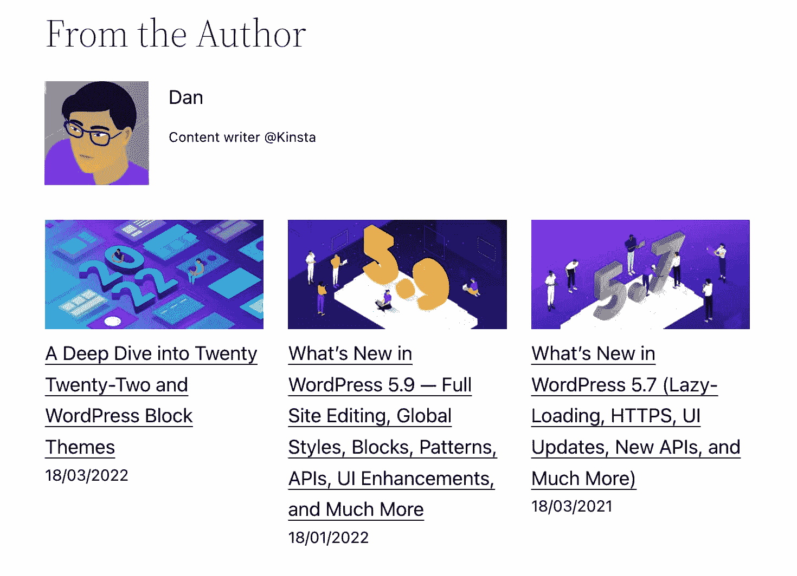

A Group block including Post Author and Latest Posts


作为 Gutenberg 用户，您可以使用以下块:

*   **标题**核心块
*   **帖子作者**核心块
*   **最新帖子**核心区块

您还可以创建一个包含这些块的组，并将该组添加到可重用块中以供将来使用。

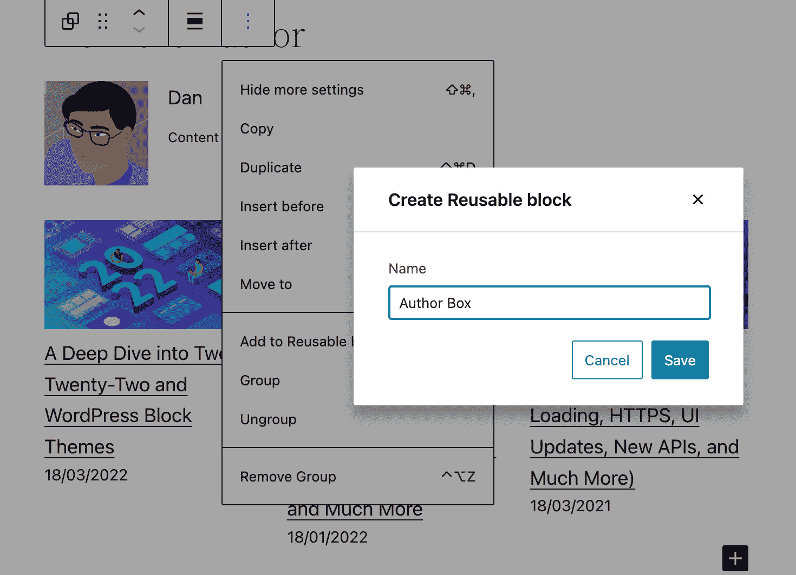

Adding a group block to reusable blocks


很简单，不是吗？您可以创建一个动态块，并将其快速添加到您的帖子和页面中。

截止到[WordPress 5.9](https://kinsta.com/blog/wordpress-5-9/),[区块编辑器](https://kinsta.com/blog/gutenberg-wordpress-editor/)提供了超过 90 种不同的区块，你很有可能开箱就能找到适合你的区块。如果你需要更多，在 WordPress 插件目录中快速搜索，你会发现很多免费插件提供了[额外的模块](https://wordpress.org/plugins/search/gutenberg/)。

但是如果你是一名 WordPress 开发者——或者你正计划成为一名 WordPress 开发者呢？也许你有非常具体的需求，但找不到你正在寻找的区块，或者你只是想获得新的专业技能。在这种情况下，您可能需要学习如何创建动态块。

[准备好把你的 WordPress 开发者生涯带上月球了吗？🚀🌙从这本大规模的动态块开发指南开始吧！👩‍🚀 点击推文](https://twitter.com/intent/tweet?url=https%3A%2F%2Fbit.ly%2F3zS8lhf&via=kinsta&text=Ready+to+take+your+career+as+WordPress+developer+to+the+moon%3F+%F0%9F%9A%80%F0%9F%8C%99+Start+with+this+massive+guide+to+dynamic+block+development%21+%F0%9F%91%A9%E2%80%8D%F0%9F%9A%80&hashtags=Gutenberg%2CDevelopment)


## 从开发人员的角度看古腾堡动态块

[动态块](https://developer.wordpress.org/block-editor/how-to-guides/block-tutorial/creating-dynamic-blocks/)有两个主要用例。

第一个用例是，当包含块的页面尚未更新时，您需要更新块的内容。例如，当块包含最新帖子或评论的列表时，以及通常当块的内容是使用从数据库中检索的数据动态生成时，就会发生这种情况。

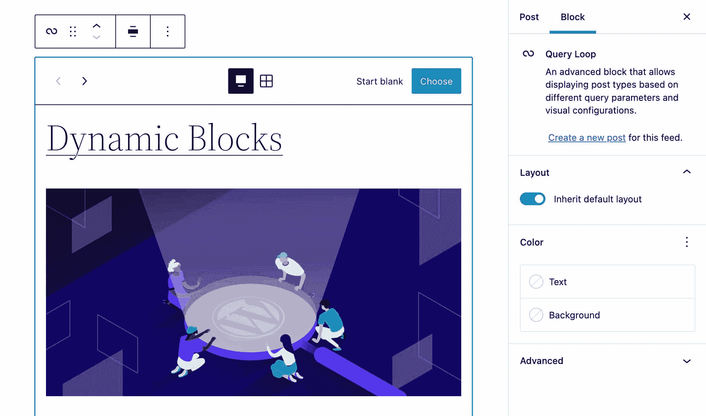

Adding a Query Loop block


第二个用例是块代码的更新需要立即显示在前端。使用动态块而不是静态块会导致更改立即应用于块的所有引用。

另一方面，如果你改变一个静态块产生的 HTML，用户将会看到一个[无效对话框](https://developer.wordpress.org/block-editor/reference-guides/block-api/block-edit-save/#validation)，直到该块的前一版本的每个实例都被删除并用新版本替换，或者你将旧版本标记为不推荐使用(参见[不推荐使用](https://developer.wordpress.org/block-editor/reference-guides/block-api/block-deprecation/)和[块验证、不推荐使用和迁移体验](https://github.com/WordPress/gutenberg/issues/7604))。

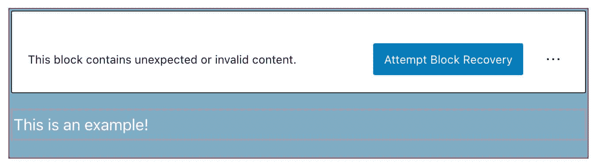

Unexpected or invalid content.


也就是说，在开始构建动态块之前，您需要理解一些概念。

### 应用程序状态和数据存储

[古腾堡是一个 React SPA 应用](https://kinsta.com/blog/gutenberg-blocks/#what-is-a-gutenberg-block)，古腾堡里的一切都是 React 组件。编辑器中的文章标题、标题、段落、图像和任何 HTML 内容块都是一个 React 组件，还有侧边栏和块工具栏控件。

在我们之前的文章中，我们只使用属性来存储数据。在本文中，我们将进一步引入**状态**的概念。

简单地说，`state`对象是[，一个普通的 JavaScript 对象](https://www.w3schools.com/react/react_state.asp)，用于包含关于组件的信息。组件的`state`可以随时间改变，任何时候改变，组件都会重新呈现。

类似于`state`对象，属性是用来保存组件信息的普通 JavaScript 对象。但是[和`state`之间有一个关键的区别](https://reactjs.org/docs/faq-state.html#what-is-the-difference-between-state-and-props):

> `props`传递给组件(类似于函数参数)，而`state`在组件内管理(类似于函数内声明的变量)。

您可能认为状态是在给定时间点获取的数据快照，应用程序存储这些数据以控制组件的行为。例如，如果块编辑器设置侧栏打开，一条信息将存储在`state`对象的某处。

当信息在单个组件内共享时，我们称之为**本地状态**。当信息在应用程序内的组件间共享时，我们称之为**应用程序状态**。

应用程序状态与存储的概念密切相关。根据 [Redux 文档](https://redux.js.org/api/store):

> 一个存储保存了你的应用程序的整个状态树。改变它内部状态的唯一方法是在它上面分派一个[动作](https://redux.js.org/understanding/thinking-in-redux/glossary#action)。

因此，Redux 将应用程序状态存储在一个不可变的对象树中(即存储)。只能通过使用[动作](https://redux.js.org/tutorials/fundamentals/part-3-state-actions-reducers#designing-actions)和[减少器](https://redux.js.org/tutorials/fundamentals/part-3-state-actions-reducers#writing-reducers)创建新对象来改变对象树。

在 WordPress 中，商店由 **WordPress 数据模块**管理。

### 古腾堡的模块化、包和数据存储

古腾堡知识库是在几个**可重用和独立的模块**上从头开始构建的，这些模块组合在一起，构建了编辑界面。这些模块也被称为**包**。

官方文档列出了两种不同的[包](https://developer.wordpress.org/block-editor/explanations/architecture/modularity/#types-of-packages):

*   **生产包**组成了在浏览器中运行的生产代码。WordPress 中有两种类型的产品包:
    *   **带有样式表的包**提供样式表以正常运行。
    *   **带有数据存储的包**定义数据存储来处理它们的状态。[带有数据存储的包](https://developer.wordpress.org/block-editor/explanations/architecture/modularity/#packages-with-data-stores)可以被第三方插件和主题用来检索和操作数据。
*   **开发包**用于开发模式。这些包包括林挺、测试、构建等工具。

这里我们最感兴趣的是带有数据存储库的[包，用于检索和操作数据。](https://developer.wordpress.org/block-editor/explanations/architecture/modularity/#packages-with-data-stores)

### WordPress 数据仓库

WordPress 数据模块建立在 [Redux](https://redux.js.org/) 的基础上，并分享了[的三个 Redux 核心原则](https://redux.js.org/understanding/thinking-in-redux/three-principles)，尽管与[有一些关键的不同](https://github.com/WordPress/gutenberg/blob/e9994b49786570391b5690b85bd1f1fd78de845e/packages/data/README.md#comparison-with-redux)。


### 信息

Redux 是 JavaScript 应用程序的状态管理器。[三个基本原则](https://redux.js.org/understanding/thinking-in-redux/three-principles)总结了 Redux 的工作方式:

*   **真实的单一来源**:你的应用程序的[全局状态](https://redux.js.org/understanding/thinking-in-redux/glossary#state)存储在一个单一存储的对象树中。
*   **状态是只读的**:改变状态的唯一方法是发出一个动作，一个描述发生了什么的对象。
*   **用纯函数进行改变**:为了指定状态树如何被动作转换，你要编写纯 reducers。


官方文件提供了[的如下定义](https://github.com/WordPress/gutenberg/blob/e9994b49786570391b5690b85bd1f1fd78de845e/packages/data/README.md):

> WordPress 的数据模块作为管理插件和 WordPress 自身应用程序状态的中心，提供管理不同模块内部和之间数据的工具。它被设计成一种组织和共享数据的模块化模式:简单到足以满足一个小插件的需求，同时可扩展到满足一个复杂的单页面应用程序的需求。

默认情况下，Gutenberg 在应用程序状态中注册了几个数据存储库。这些商店都有特定的名称和用途:

*   `core` : [WordPress 核心数据](https://github.com/WordPress/gutenberg/tree/trunk/packages/core-data)
*   `core/annotations` : [注解](https://github.com/WordPress/gutenberg/tree/trunk/packages/annotations)
*   `core/blocks` : [块类型数据](https://github.com/WordPress/gutenberg/tree/trunk/packages/blocks)
*   `core/block-editor` : [块编辑的数据](https://github.com/WordPress/gutenberg/tree/trunk/packages/block-editor)
*   `core/editor` : [帖子编辑的数据](https://github.com/WordPress/gutenberg/tree/trunk/packages/editor)
*   `core/edit-post` : [编辑的 UI 数据](https://github.com/WordPress/gutenberg/tree/trunk/packages/edit-post)
*   `core/notices` : [通知数据](https://github.com/WordPress/gutenberg/tree/trunk/packages/notices)
*   `core/nux`:[NUX(新用户体验)数据](https://github.com/WordPress/gutenberg/tree/trunk/packages/nux)
*   `core/viewport` : [视口数据](https://github.com/WordPress/gutenberg/tree/trunk/packages/viewport)

通过这些商店，您将能够访问一大堆数据:

1.  **与当前帖子**相关的数据，如帖子标题、摘录、类别和标签、区块等。
2.  **与用户界面**相关的数据，即开关是否打开。
3.  **与整个 WordPress 安装相关的数据**，例如注册的分类法、文章类型、博客标题、作者等。

这些商店位于全局`wp`对象中。要访问商店的状态，您将使用`select`函数。

要了解它是如何工作的，创建一个新的帖子或页面，并启动您的[浏览器的检查器](https://kinsta.com/blog/inspect-element/)。找到控制台并键入以下代码行:

```
wp.data.select("core")
```

结果将是一个对象，其中包含一个函数列表，您可以使用该列表从`core`数据存储中获取数据。这些函数被称为**选择器**，作为访问状态值的接口。

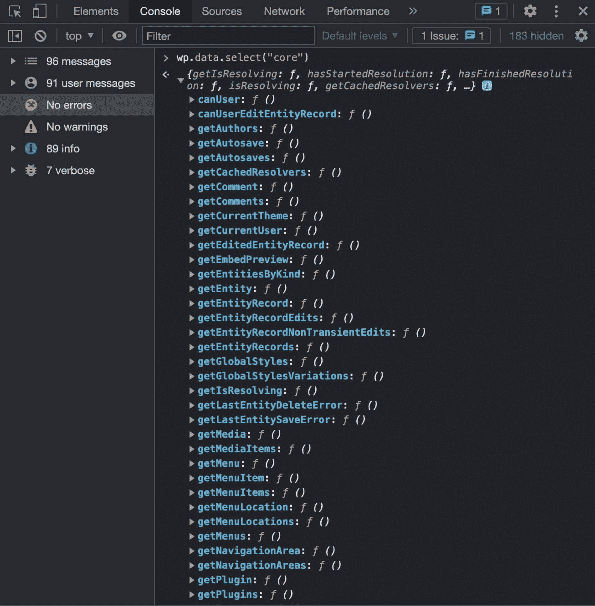

The Core WordPress data store object


### 信息

`selectors`对象包括一组用于访问和导出状态值的函数。选择器是一个接受状态和可选参数并从状态返回一些值的函数。*调用选择器是从您的状态*中检索数据的主要机制，并作为对原始数据的一种有用的抽象，原始数据通常更容易改变，不太容易用作[规范化对象](https://redux.js.org/usage/structuring-reducers/normalizing-state-shape#designing-a-normalized-state)。(来源: [Github](https://github.com/WordPress/gutenberg/blob/9d4b83cbbafcd6c6cbd20c86b572f458fc65ff16/packages/data/README.md#selectors) )


WordPress 数据仓库包含了关于 WordPress 的一般信息，选择器是你获取这些信息的途径。例如，`getCurrentUser()`返回当前用户的详细信息:

```
wp.data.select("core").getCurrentUser()
```

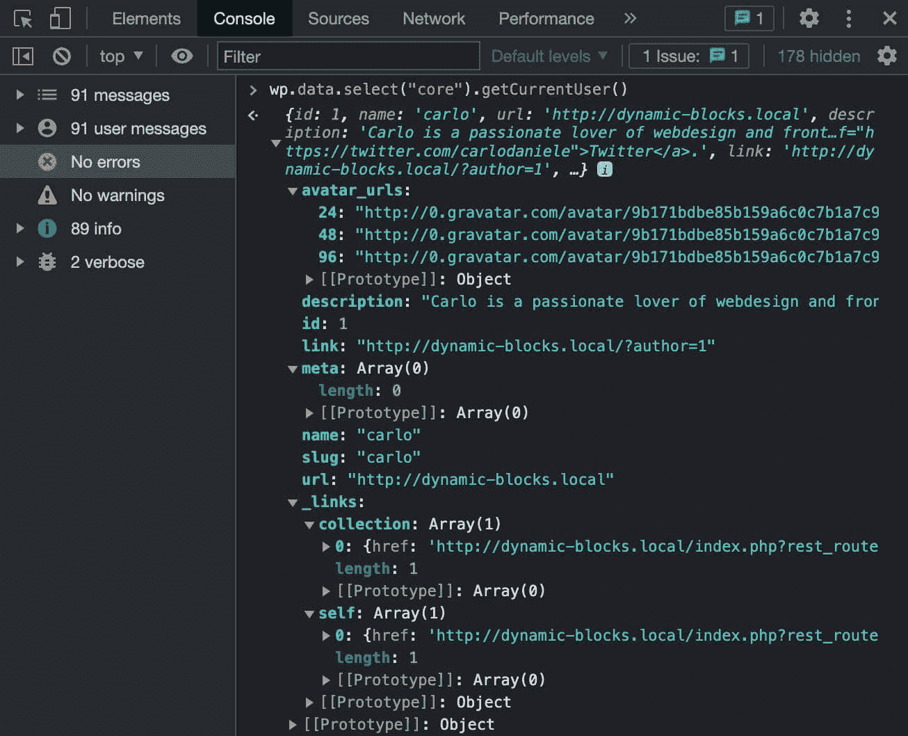

Inspecting getCurrentUser response


另一个可以用来从数据存储中检索用户详细信息的选择器是`getUsers()` :

```
wp.data.select("core").getUsers()
```

下图显示了响应对象:

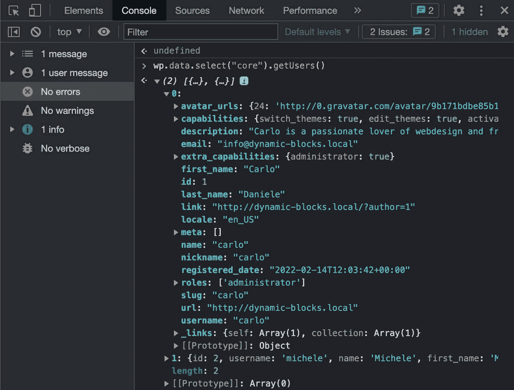

Inspecting getUsers response


要获取单个用户的详细信息，只需键入以下行:

```
wp.data.select("core").getUsers()[0]
```

使用相同的选择器，您还可以检索分配了`author`角色的站点用户:

```
wp.data.select( 'core' ).getUsers({ who: 'authors' })
```

您还可以检索已注册的分类法:

```
wp.data.select("core").getTaxonomies()
```

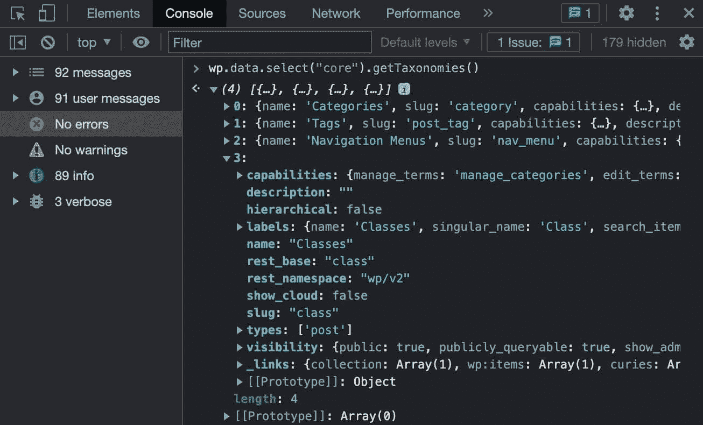

Inspecting getTaxonomies response.


注册帖子类型列表:

```
wp.data.select("core").getPostTypes()
```

或者插件列表:

```
wp.data.select("core").getPlugins()
```

现在让我们尝试访问一个不同的数据存储。为此，您仍将使用`select`函数，但提供不同的名称空间。让我们试试下面的方法:

```
wp.data.select("core/edit-post")
```

现在，您将获得以下响应对象。

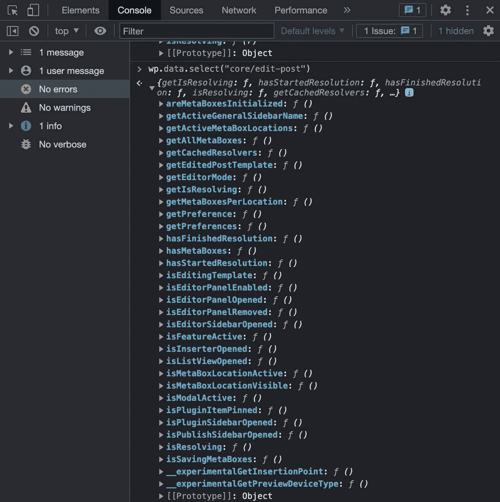

Accessing the Editor’s UI Data


如果您想知道设置工具条是否打开，您可以使用`isEditorSidebarOpened`选择器:

```
wp.data.select("core/edit-post").isEditorSidebarOpened()
```

如果侧边栏是打开的，该函数返回`true`:

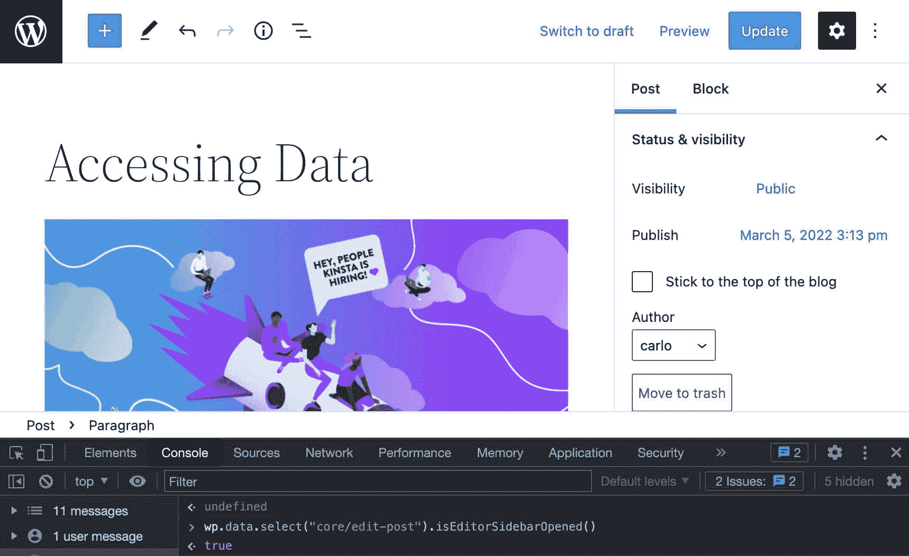

The sidebar is open.


## 如何访问帖子数据

现在，您应该对如何访问数据有了基本的了解。现在我们来仔细看看一个特定的选择器，即 [`getEntityRecords`函数](https://developer.wordpress.org/block-editor/reference-guides/data/data-core/#getentityrecords)，它是访问帖子数据的选择器。

在程序块编辑器中，右击并选择**检查**。在控制台选项卡中，复制并粘贴以下行:

```
wp.data.select("core").getEntityRecords('postType', 'post')
```

这会向 Rest API 发送一个请求，并返回一个与最近发布的博客文章相对应的记录数组。

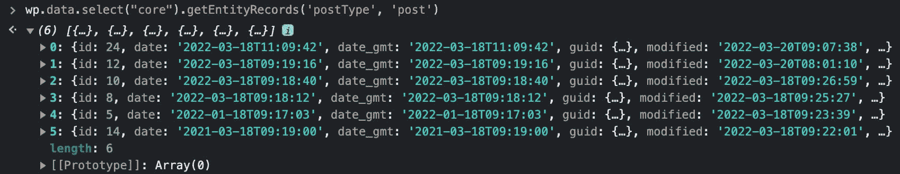

getEntityRecords returns a list of posts.


### 信息

注意，第一次向 Rest API 发送请求时，响应将是`null`，直到请求完成。所以，如果你得到了`null`，不要担心，再试一次。


`getEntityRecords`接受[三个参数](https://developer.wordpress.org/block-editor/reference-guides/data/data-core/#getentityrecords):

*   `kind` *字符串*:实体种类(即`postType`)。
*   `name` *字符串*:实体名称(即`post`)。
*   `query`T2？对象:可选条件查询(即`{author: 0}`)。

您可以使用参数的[对象构建更具体的请求。](https://developer.wordpress.org/rest-api/reference/posts/#arguments)

例如，您可以决定回复只包含特定类别的帖子:

```
wp.data.select("core").getEntityRecords('postType', 'post', {categories: 3})
```

您也可以只请求来自给定作者的文章:

```
wp.data.select("core").getEntityRecords('postType', 'post', {author: 2})
```

如果您单击由`getEntityRecords`返回的任何记录，您将获得所选记录的属性列表:

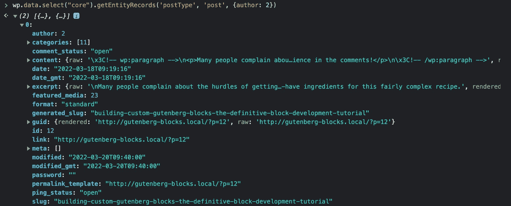

An example API request with getEntityRecords.


如果您希望响应包括特色图片，您需要在之前的请求中添加一个额外的参数:

```
wp.data.select("core").getEntityRecords('postType', 'post', {author: 2, _embed: true})
```

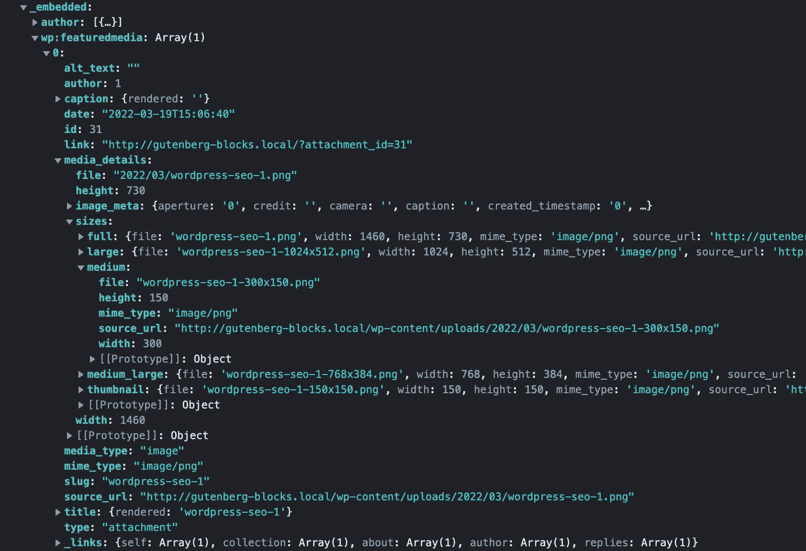

Featured image details in getEntityRecords response.


现在你应该对如何访问 WordPress 数据库和检索文章细节有了更好的理解。关于`getEntityRecords`选择器的详细视图，请参见[使用 getEntityRecords](https://ryanwelcher.com/2021/08/requesting-data-in-gutenberg-with-getentityrecords/) 在古腾堡请求数据。

## 如何创建动态块:示例项目

在我们的长期理论前提之后，我们可以继续练习，并使用我们在以前的块开发教程中介绍的工具创建一个动态块。

在那篇文章中，我们讨论了:

1.  [如何建立 WordPress 开发环境](https://kinsta.com/blog/gutenberg-blocks/#setting-up-your-wordpress-development-environment)
2.  [什么是块状脚手架](https://kinsta.com/blog/gutenberg-blocks/#a-walkthrough-of-the-starter-block-scaffolding)
3.  [如何构建静态古腾堡块](https://kinsta.com/blog/gutenberg-blocks/#the-project-building-your-first-gutenberg-block)

这就是为什么我们不会在本文中深入讨论这些主题，但是请随意参考我们以前的指南以获得更多信息，或者只是复习一下。

### 设置 JavaScript 开发环境

让我们从设置一个 JavaScript 开发环境开始。

#### 安装或更新 Node.js

首先，[安装或更新](https://nodejs.org/en/download/) Node.js。完成后，启动命令行工具并运行以下命令:

```
node -v
```

您应该会看到您的节点版本。

#### 设置您的开发环境

接下来，你需要一个 WordPress 的开发环境。在我们的例子中，我们使用了 [DevKinsta](https://kinsta.com/devkinsta/) ，这是我们的免费 WordPress 开发工具，可以让你立刻启动一个本地 WordPress 网站。

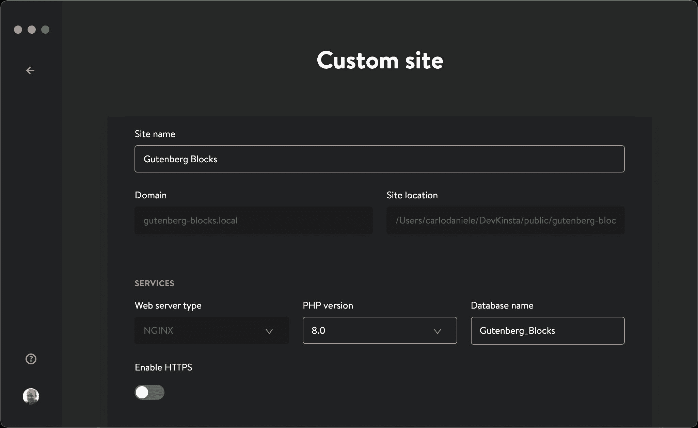

Creating a custom site in DevKinsta


但是你仍然可以自由选择任何你喜欢的 [WordPress 本地开发环境](https://kinsta.com/ebooks/wordpress/wordpress-local-development/)，比如 MAMP 或者 XAMPP，甚至是官方的 [wp-env 解决方案](https://www.npmjs.com/package/@wordpress/env)。

如果你正在使用 DevKinsta，点击**新的 WordPress 站点**或**自定义站点**，填写表格字段并点击**创建站点**。

安装过程需要一两分钟。完成后，启动你的本地 WordPress 开发网站。

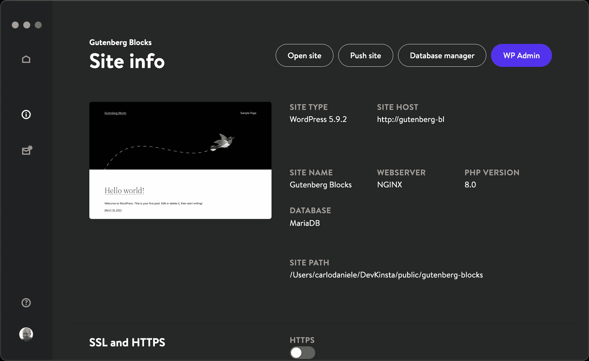

Site Info screen in DevKinsta.


#### 设置您的阻止插件

你现在需要的是一个入门插件。为了避免手动配置的所有麻烦，WordPress [核心开发团队](https://developer.wordpress.org/block-editor/reference-guides/packages/packages-create-block/)发布了[@ WordPress/create-block tool](https://www.npmjs.com/package/@wordpress/create-block)，这是*官方用于创建古腾堡区块*的零配置工具。

在我们的[上一篇文章](https://kinsta.com/blog/gutenberg-blocks/#dev-environment)中，我们已经深入讨论了`@wordpress/create-block`，所以在这里我们可以马上开始设置。

在命令行工具中，导航到 **/wp-content/plugins** 文件夹:

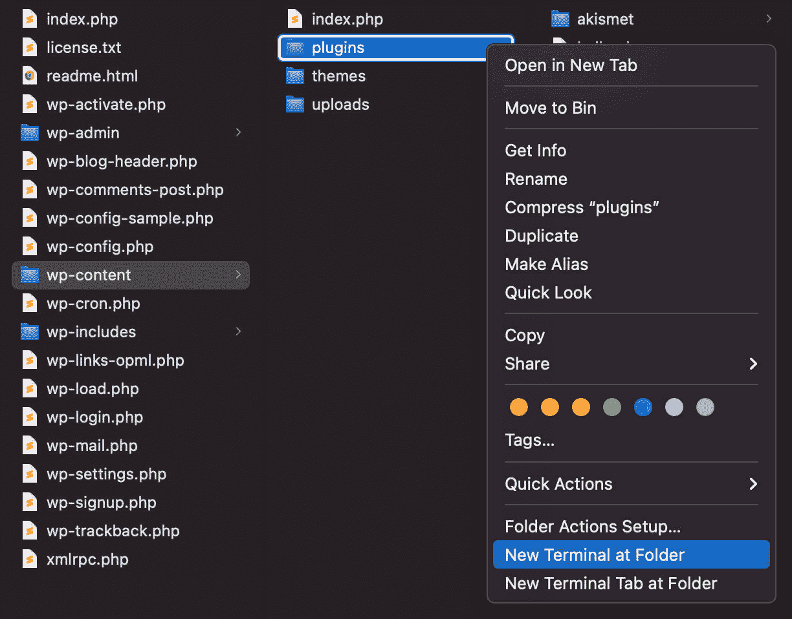

New terminal at folder in Mac OS.


在那里，运行以下命令:

```
npx @wordpress/create-block
```

您现在已经准备好安装`@wordpress/create-block`包了:

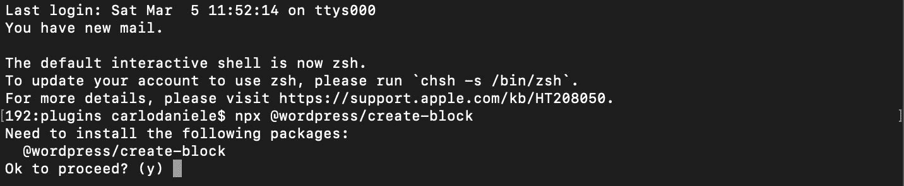

Installing the @wordpress/create-block package.


要确认，键入`y`并按回车键。

这将在[交互模式](https://kinsta.com/blog/gutenberg-blocks/#set-up-the-plugin)下生成插件的 PHP、SCSS 和 JS 文件。

下面是我们将在示例中使用的详细信息。您可以根据自己的喜好随意更改这些细节:


*   Block slug used for identification (also the name of plug-in and output folder): **author-plugin**
*   The internal namespace of the name (unique to your product): **author-box**
*   The display title of your block: **Author Box**
*   Short description of your block (optional): **Example block for Kinsta readers**
*   **It is easier to identify your block (optional): **Business Person****
***   Category name to help users browse and discover your block: **Widgets***   Name of plug-in author Multiple authors can be listed with commas: **Your name***   Short name of plug-in license (optional): **–***   Full text link of license (optional): **–**[T21**


一旦您输入回车，它就会下载并配置插件。

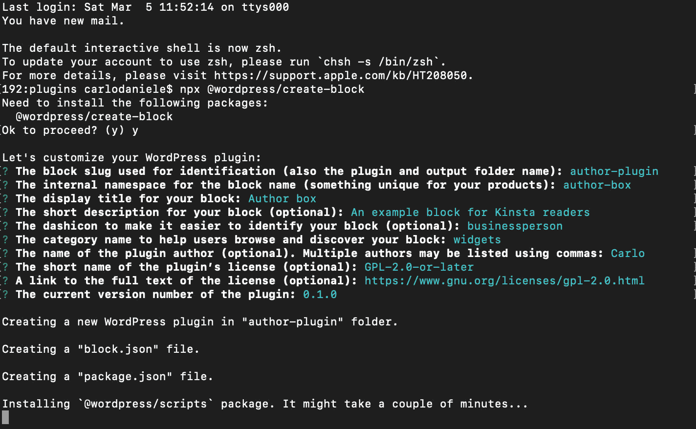

Installing the block plugin.


该过程可能需要几分钟。完成后，您应该会看到以下屏幕:

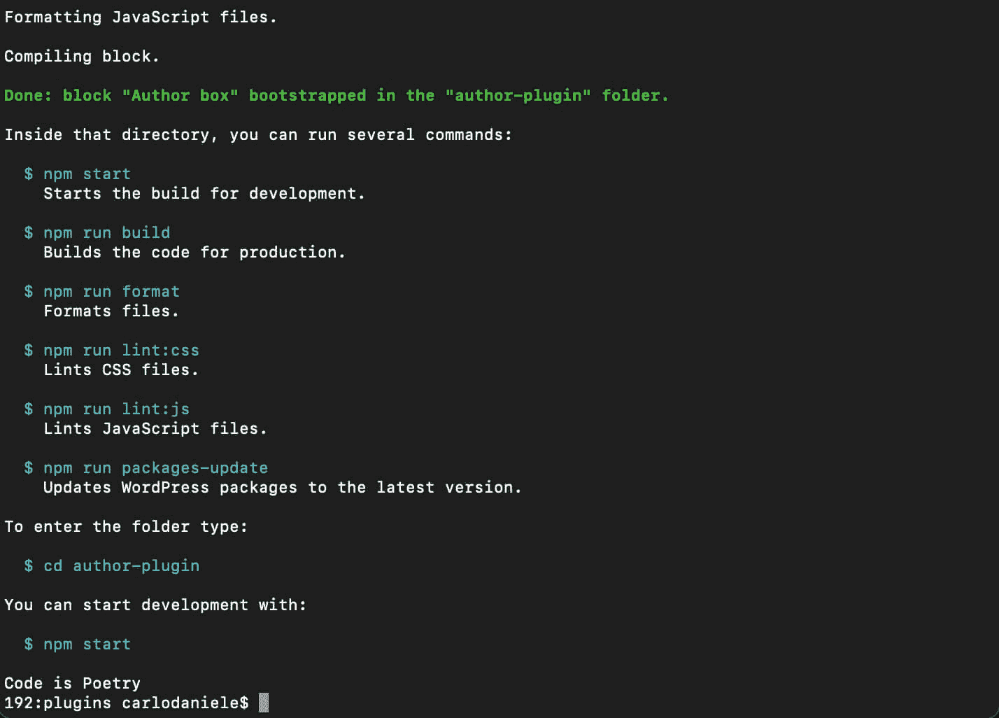

Block bootstrapped in the plugin folder.


您将看到可以从插件目录中运行的命令列表:

*   `$ npm start`–开始构建开发。
*   `$ npm run build`–构建生产代码。
*   `$ npm run format`–格式化文件。
*   `$ npm run lint:css`–Lint CSS 文件。
*   `$ npm run lint:js`–Lint JavaScript 文件。
*   `$ npm run packages-update`–将 WordPress 软件包更新至最新版本。

好了，现在用下面的命令移动到插件目录:

```
cd author-plugin
```

并开始您的开发构建:

```
npm start
```

接下来，导航到你的 WordPress 仪表盘中的插件屏幕，激活**作者框**插件:

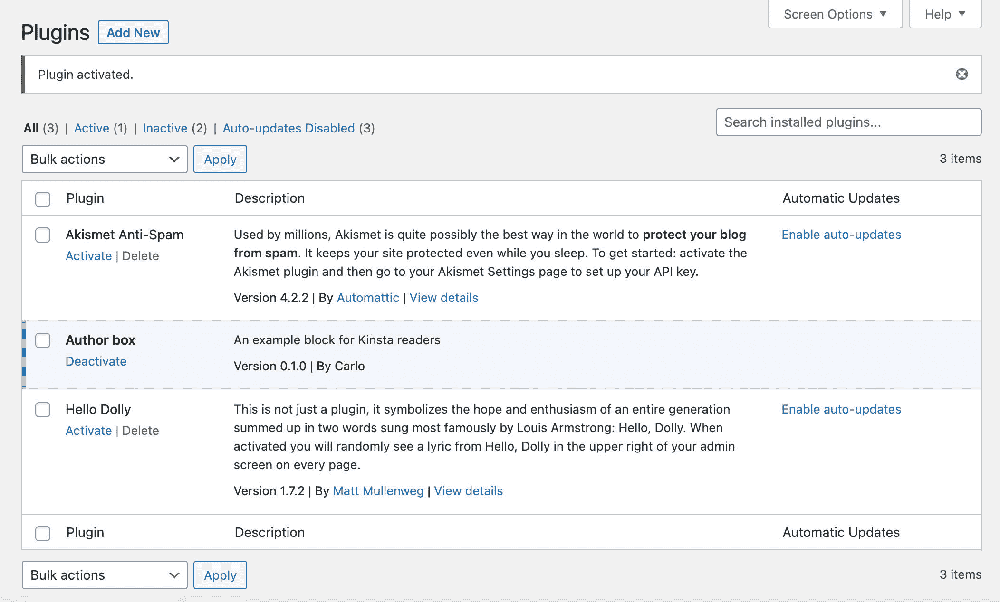

The block plugin is listed in the Plugins screen.


现在你可以检查插件是否正常工作。创建一个新帖子并开始输入`/`来启动快速插入器:

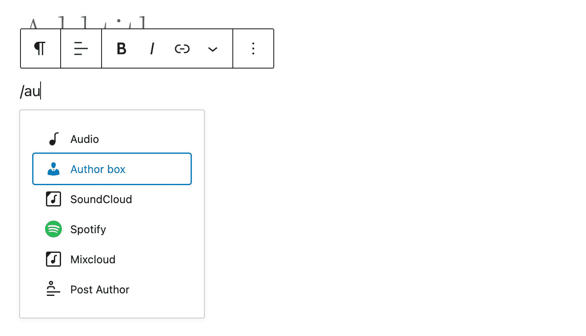

The block item in the Quick Inserter.


你还可以在块插入器中的**小部件**类别下找到**作者框**块。选择要添加到编辑器画布的块:

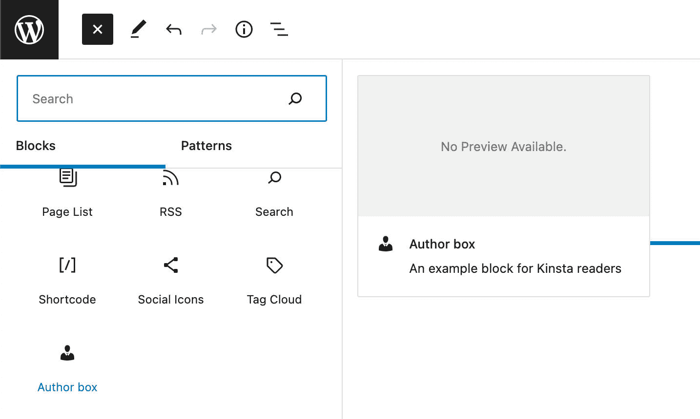

The WordPress Block Inserter


你完了。现在保存文章并预览页面，检查块是否正确显示。

#### 块状脚手架

我们在上一篇文章中提到了块状脚手架。因此，在这里我们将只提供一个快速的概述文件，我们将修改我们的例子。

根文件夹
根文件夹是你可以找到主 PHP 文件和几个子文件夹的地方。

**author-plugin.php**T3`@wordpress/create-block`包默认提供以下 [PHP 文件](https://kinsta.com/blog/gutenberg-blocks/#plugin-file):

```
/**
 * Plugin Name:       Author box
 * Description:       An example block for Kinsta readers
 * Requires at least: 5.8
 * Requires PHP:      7.0
 * Version:           0.1.0
 * Author:            Carlo
 * License:           GPL-2.0-or-later
 * License URI:       https://www.gnu.org/licenses/gpl-2.0.html
 * Text Domain:       author-plugin
 *
 * @package           author-box
 */

/**
 * Registers the block using the metadata loaded from the `block.json` file.
 * Behind the scenes, it registers also all assets so they can be enqueued
 * through the block editor in the corresponding context.
 *
 * @see https://developer.wordpress.org/reference/functions/register_block_type/
 */
function author_box_author_plugin_block_init() {
	register_block_type( __DIR__ . '/build' );
}
add_action( 'init', 'author_box_author_plugin_block_init' );
```

在标题中，您会注意到我们在设置中输入的详细信息。

对于静态块，大部分时间你将处理位于 *src* 文件夹中的 JavaScript 文件。对于动态块，您将编写 PHP 代码在前端显示块内容。

***src*文件夹**
*src*文件夹是你的开发文件夹。在这里，您可以找到以下文件:

*   *block.json*
*   *index.js*
*   *edit.js*
*   *save.js*
*   *editor.scss*
*   *style.scss*

**block . JSON**T3*block . JSON*是你的元数据文件。`@wordpress/create-block`生成下面的 **block.json** 文件:

```
{
	"$schema": "https://schemas.wp.org/trunk/block.json",
	"apiVersion": 2,
	"name": "author-box/author-plugin",
	"version": "0.1.0",
	"title": "Author box",
	"category": "widgets",
	"icon": "businessperson",
	"description": "An example block for Kinsta readers",
	"supports": {
		"html": false
	},
	"textdomain": "author-plugin",
	"editorScript": "file:./index.js",
	"editorStyle": "file:./index.css",
	"style": "file:./style-index.css"
}
```

要更仔细地查看 *block.json* 文件，请参考[我们之前的博客文章](https://kinsta.com/blog/gutenberg-blocks/#block-json)。

**index . js**
*index . js*文件是你在客户端注册块类型的地方:

```
import { registerBlockType } from '@wordpress/blocks';

import './style.scss';

import Edit from './edit';
import save from './save';

registerBlockType('author-box/author-plugin', {
	edit: Edit,
	save,
});
```

**edit.js**

```
import { __ } from '@wordpress/i18n';

import { useBlockProps } from '@wordpress/block-editor';

import './editor.scss';

export default function Edit() {
	return (
		<p {...useBlockProps()}>
			{__('Author box – hello from the editor!', 'author-plugin')}
		</p>
	);
}
```

**save . js**
*save . js*文件包含构建要保存到数据库中的块内容的脚本。我们不会在本教程中使用该文件:

```
import { __ } from '@wordpress/i18n';

import { useBlockProps } from '@wordpress/block-editor';

export default function save() {
	return (
		<p {...useBlockProps.save()}>
			{__('Author box – hello from the saved content!', 'author-plugin')}
		</p>
	);
}
```

## 构建要在编辑器中呈现的块

在 [Visual Studio 代码](https://kinsta.com/blog/best-text-editors/#visual-studio-code)或任何你喜欢的[代码编辑器](https://kinsta.com/blog/best-text-editors/)中打开你的项目。

如果你使用的是 Visual Studio 代码，进入**终端- >新建终端**。这将在项目的根文件夹中启动一个终端窗口。

在终端中(或在您喜欢的命令行工具中)，键入以下命令:

```
npm start
```

您现在正在开发模式下运行节点环境。

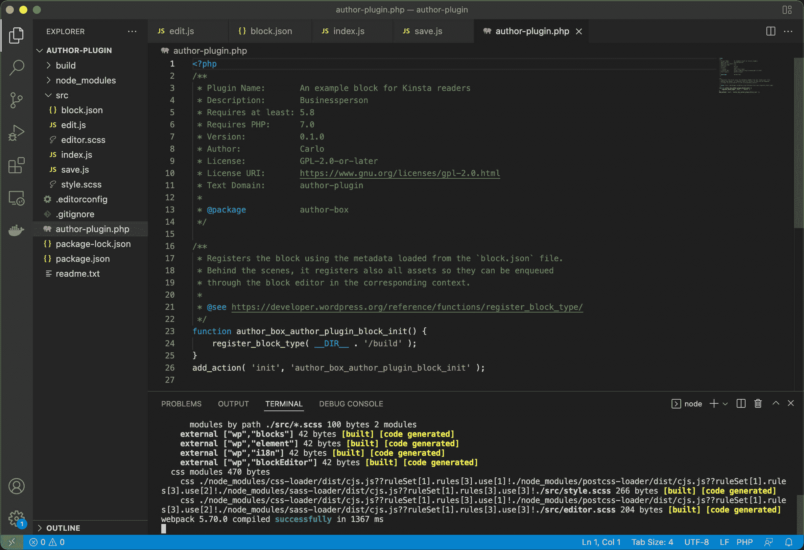

The block plugin project in Visual Studio Code.


从现在开始，你将遵循两条不同的路线。为了在编辑器中渲染块，您将在 *edit.js* 文件中工作。要在前端呈现这个块，您需要在主插件文件中编写 PHP 代码。

现在卷起袖子，因为编码开始了:

 

### 信息

在本文中，我们只提供代码片段。完整的代码可以在 Gist 上找到。


### 在服务器上注册该块

首先，您必须在服务器上注册这个块，并编写 PHP 代码从数据库中检索数据。

在*author-plugin.php*文件中，您需要向 [`register_block_type`函数](https://kinsta.com/blog/gutenberg-blocks/#plugin-file)传递第二个参数:

```
function author_box_author_plugin_block_init() {
	register_block_type( __DIR__ . '/build', array(
		'render_callback' => 'author_box_author_plugin_render_author_content'
	) );
}
add_action( 'init', 'author_box_author_plugin_block_init' );
```

第二个参数是注册一个块类型的参数数组(参见[这里的](https://developer.wordpress.org/reference/classes/wp_block_type/__construct/)可用参数的完整列表)。在上面的代码中，我们只提供了`render_callback`，它决定了在屏幕上呈现块的回调函数。

接下来，您将声明该函数:

```
function author_box_author_plugin_render_author_content() {
	return 'Hello World!';
}
```

保存文件，创建新的文章或页面，并将**作者框**块添加到编辑器画布。

## 注册订阅时事通讯


### 想知道我们是怎么让流量增长超过 1000%的吗？

加入 20，000 多名获得我们每周时事通讯和内部消息的人的行列吧！

[Subscribe Now](#newsletter)


The WordPress Block Inserter.


块编辑器仍然显示起始块，因为我们还没有更改 *edit.js* 文件。

但是如果你在前端预览这个帖子，你会看到原来的块内容现在已经被“Hello World”字符串替换了。

现在，由于呈现在前端的 HTML 是由 PHP 文件生成的，因此不再需要`save`函数返回任何内容。所以让我们直接进入 *save.js* 文件，修改代码如下所示:

```
export default function save() {
	return null;
}
```

### 定义块属性

现在你需要一个存储用户设置的地方。例如，要从数据库中检索的文章数量、是否显示指定的字段等。为此，您将在 *block.json* 文件中定义一些`attributes`。

例如，您可以让用户能够确定要包含在区块中的帖子数量，选择显示特色图片、日期、摘要和/或隐藏/显示作者的个人资料图片。

下面是我们将用来构建示例块的属性的完整列表:

```
{
	...
	"attributes": {
		"numberOfItems": {
			"type": "number",
			"default": 3
		},
		"columns": {
			"type": "number",
			"default": 1
		},
		"displayDate": {
			"type": "boolean",
			"default": true
		},
		"displayExcerpt": {
			"type": "boolean",
			"default": true
		},
		"displayThumbnail": {
			"type": "boolean",
			"default": true
		},
		"displayAuthorInfo": {
			"type": "boolean",
			"default": true
		},
		"showAvatar": {
			"type": "boolean",
			"default": true
		}, 
		"avatarSize": {
			"type": "number",
			"default": 48
		},
		"showBio": {
			"type": "boolean",
			"default": true
		}
	}
}
```

### 构建要在编辑器中呈现的块

`getEntityRecords`选择器包含在`@wordpress/data`包装中。要使用它，您需要从您的`edit.js`文件中的那个包导入`useSelect`钩子:

```
import { useSelect } from '@wordpress/data';
```


### 信息

`useSelect`是一个定制的 react 钩子，用于基于[React 钩子](https://reactjs.org/docs/hooks-reference.html#usecallback)从注册的选择器中检索值。


接下来，将以下代码添加到`Edit()`函数中:

```
const posts = useSelect( ( select ) => {
	return select( 'core' ).getEntityRecords( 'postType', 'post', {
		'per_page': 3
	});
});
```

在上面的代码中，我们硬编码了帖子的数量。但是您可能希望让用户能够设置不同数量的帖子。您可以为此使用一个属性。

在你的 *block.json* 中，你应该已经定义了一个`numberOfItems`属性。您可以在您的`Edit`函数中使用它，如下所示:

```
export default function Edit( { attributes } ) {

	const { numberOfItems } = attributes;

	const posts = useSelect( ( select ) => {
		return select( 'core' ).getEntityRecords( 'postType', 'post', {
			'per_page': numberOfItems
		});
	});

	console.log( posts );

	return (
		...
	);
}
```

你还不会在屏幕上看到帖子，但是运行一个`console.log`看看在浏览器检查器的控制台上会发生什么:

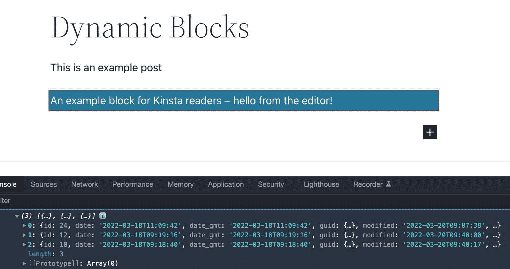

The result in the browser’s console.


[`useSelect`可能有两个参数](https://developer.wordpress.org/block-editor/reference-guides/packages/packages-data/#useselect):一个内联回调和一个依赖数组。两者都返回了回调的[记忆](https://en.wikipedia.org/wiki/Memoization)版本，该版本仅在依赖关系之一改变时才改变。

因此，为了在每次`numberOfItems`属性改变时重新提取帖子，您必须改变`Edit`函数，如下所示:

```
export default function Edit( { attributes } ) {

	const { numberOfItems } = attributes;

	const posts = useSelect(
		( select ) => {
			return select( 'core' ).getEntityRecords( 'postType', 'post', {
				'per_page': numberOfItems
			});
		}, 
		[ numberOfItems ]
	);

	console.log(posts);

	return (
		...
	);
}
```

接下来你必须[呈现你的帖子列表](https://reactjs.org/docs/lists-and-keys.html)。为此，您可以使用内置的 [JavaScript `map`方法](https://developer.mozilla.org/en-US/docs/Web/JavaScript/Reference/Global_Objects/Array/map):

```
export default function Edit( { attributes } ) {

	const { numberOfItems } = attributes;

	const posts = useSelect(
		( select ) => {
			return select( 'core' ).getEntityRecords( 'postType', 'post', {
				'per_page': numberOfItems
			});
		},
		[ numberOfItems ]
	);

	console.log(posts);

	return (
		<div { ...useBlockProps() }>
			<ul>
				{ posts && posts.map( ( post ) => {
					return (
						<li key={ post.id }>
							<h5>
								<a href={ post.link }>
									{ 
										post.title.rendered ? 
										post.title.rendered :
										__( 'Default title', 'author-plugin' )
									}
								</a>
							</h5>
						</li>
					)
				})}
			</ul>
		</div>
	);
}
```

首先，它检查数组中是否至少有一个 post，然后运行循环。


### 信息

`map()`方法创建一个新的数组，其中填充了调用数组中每个元素的函数的结果——Source:[MDN web docs](https://developer.mozilla.org/en-US/docs/Web/JavaScript/Reference/Global_Objects/Array/map)。


注意，由于我们使用了带有 React 组件的`map`方法，我们还使用了一个`key`属性来为当前列表项分配文章 ID。


### 信息

“key”是一个特殊的字符串属性，您需要在创建元素列表时包含它——Source:[list 和 React Docs 中的 key](https://reactjs.org/docs/lists-and-keys.html)。


`post.link`和`post.title.rendered`分别渲染帖子网址和标题。

下图显示了`post`对象属性的完整列表。

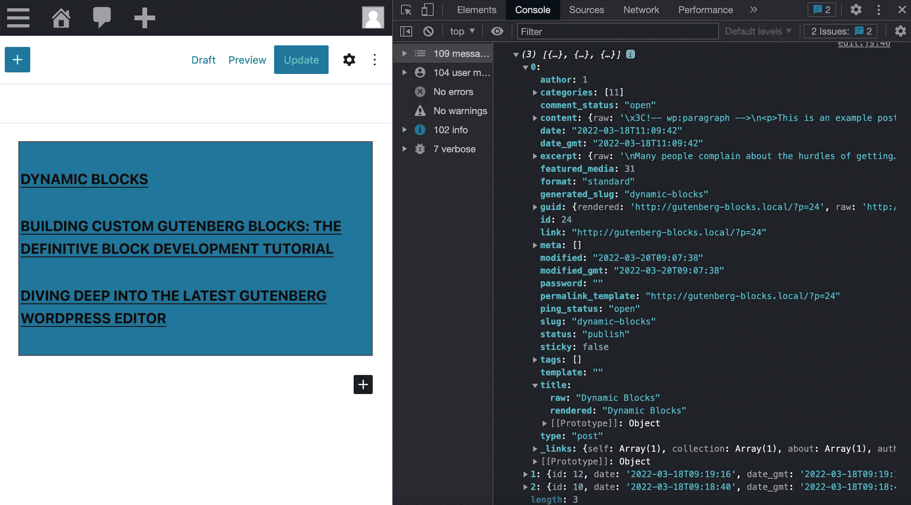

The Post object.


上面的代码只是一个使用`getEntityRecords`的基本例子。现在是把我们的知识付诸实践的时候了。

假设您希望阻止您的块呈现用户可能添加到文章标题中的 HTML 标记。WordPress 为此提供了一个 [`RawHTML`组件](https://developer.wordpress.org/block-editor/reference-guides/packages/packages-element/#rawhtml)。

首先，您将从 [@wordpress/element 包](https://developer.wordpress.org/block-editor/reference-guides/packages/packages-element/)中导入组件:

```
import { RawHTML } from '@wordpress/element';
```

接下来，您将把文章标题放在一个`RawHTML`元素中:

```
<div { ...useBlockProps() }>
	<ul>
		{ posts && posts.map((post) => {
			return (
				<li key={ post.id }>
					<h5>
						<a href={ post.link }>
							{ post.title.rendered ? (
								<RawHTML>
									{ post.title.rendered }
								</RawHTML>
							) : (
								__( 'Default title', 'author-plugin' )
							)}
						</a>
					</h5>
				</li>
			)
		})}
	</ul>
</div>
```

仅此而已。现在给你的文章标题添加一个 HTML 标签并保存文章。然后在有和没有`RawHTML`的情况下测试你的代码，看看你的代码块的内容在屏幕上是如何变化的。

### 添加日期

WordPress 提供了许多 JavaScript 函数来管理和格式化日期。要使用这些函数，你首先需要从 [`@wordpress/date`包](https://developer.wordpress.org/block-editor/reference-guides/packages/packages-date/)中的 *edit.js* 文件中导入它们:

```
import { dateI18n, format, __experimentalGetSettings } from '@wordpress/date';
```

*   格式化一个日期，将其翻译成站点的语言环境。
*   `format`:格式化日期。
*   `__experimentalGetSettings`:以 WordPress 通用设置中设置的格式显示日期。

这些函数没有被记录，但是您可以在几个块的源代码中找到有用的例子。例如，参见[最新帖子](https://github.com/WordPress/gutenberg/blob/trunk/packages/block-library/src/latest-posts/edit.js)和[发布日期](https://github.com/WordPress/gutenberg/blob/trunk/packages/block-library/src/post-date/edit.js) *edit.js* 文件。

现在添加`displayDate`属性:

```
const { numberOfItems, displayDate } = attributes;
```

然后在`<li>`元素中添加以下代码:

```
{ 
	displayDate && (
		<time
			className='wp-block-author-box-author-plugin__post-date'
			dateTime={ format( 'c', post.date_gmt ) }
		>
			{ dateI18n(
				__experimentalGetSettings().formats.date, 
				post.date_gmt
			)}
		</time>
	) 
}
```

这里发生了什么？

*   如果`displayDate`是`true`，那么使用 [`time`元素](https://developer.mozilla.org/en-US/docs/Web/HTML/Element/time)显示日期。
*   `dateTime`属性以[允许的格式](https://wordpress.org/support/article/formatting-date-and-time/)之一提供元素的时间和/或日期。
*   `dateI18n`检索本地化格式的日期。这个函数的工作方式类似于 PHP [PHP `date_i18n` WordPress 函数](https://developer.wordpress.org/reference/functions/date_i18n/)。

### 添加摘录

现在添加文章摘录应该很容易了。首先，看看浏览器检查器中的`excerpt`属性。您将看到实际内容存储在`excerpt.rendered`中。

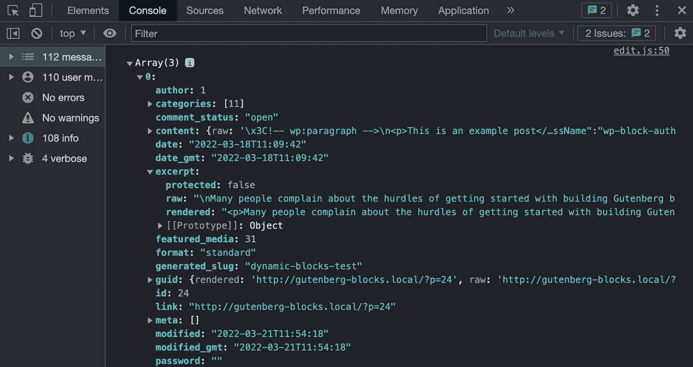

Inspecting the post excerpt in Chrome DevTools.


接下来，将`displayExcerpt`属性添加到`attributes`对象中:

```
const { numberOfItems, displayDate, displayExcerpt } = attributes;
```

然后在`Edit`函数中的`</li>`结束标记前添加以下代码:

```
{
	displayExcerpt &&
	post.excerpt.rendered && (
		<p>
			<RawHTML>
				{ post.excerpt.rendered }
			</RawHTML>
		</p>
	)
}
```

如果您不熟悉 JavaScript，在这里和上面我们使用了**短路评估**，如果所有条件都为真，则返回最后一个操作数的值(在 [Inline If with 逻辑& &运算符](https://reactjs.org/docs/conditional-rendering.html#inline-if-with-logical--operator)和[逻辑 AND ( & & )](https://developer.mozilla.org/en-US/docs/Web/JavaScript/Reference/Operators/Logical_AND) 中有更多信息)。


### 信息

在 JavaScript 中，`true && expression`总是计算为`expression`，`false && expression`总是计算为`false`。

因此，如果条件为`true`，紧接在`&&`之后的元素将出现在输出中。如果是`false`，React 会忽略并跳过它。来源:React 文档中的[条件渲染](https://reactjs.org/docs/conditional-rendering.html#inline-if-with-logical--operator)。


最后，您可以再次测试您的代码。更改 *block.json* 文件中的属性值，看看编辑器中会发生什么。

### 添加特色图片

现在您需要添加呈现特色图像的代码。开始向`attributes`添加`displayThumbnail`属性:

Struggling with downtime and WordPress problems? Kinsta is the hosting solution designed to save you time! [Check out our features](https://kinsta.com/features/)

```
const { 
	numberOfItems, 
	displayDate, 
	displayExcerpt, 
	displayThumbnail 
} = attributes;
```

现在您需要弄清楚特色图像存储在哪里。正如我们上面提到的，要获得特色图片，您需要在查询中添加一个新的`_embed`参数。回到您的代码，按如下方式更改查询参数:

```
const posts = useSelect(
	( select ) => {
		return select( 'core' ).getEntityRecords( 'postType', 'post', {
			'per_page': numberOfItems,
			'_embed': true
		});
	},
	[ numberOfItems ]
);
```

这里我们简单地将`'_embed': true`添加到参数数组中。这提供了一个包含`_embedded`属性的`post`对象，它提供了显示特色图片所需的图片细节。

现在你应该知道在哪里[找到图像细节](#accessing-post-data-using-the-wordpress-rest-api)。


Featured image details in getEntityRecords response.


您只需要添加在屏幕上呈现图像的代码:

```
{
	displayThumbnail && 
	post._embedded && 
	post._embedded['wp:featuredmedia'] &&
	post._embedded['wp:featuredmedia'][0] &&
	
}
```

保存文件，切换到块编辑器，检查当`displayThumbnail`属性设置为`true`时图像是否正确显示。


A list of posts with featured image, date and excerpt.


### 添加边栏控制

到目前为止，我们一直使用在 *block.json* 中设置的属性默认值。但是从[我们之前的文章](https://kinsta.com/blog/gutenberg-blocks/#define-attributes)中，我们知道我们可以定义事件处理程序，让用户能够为每个属性分配自定义值。

为此，您将向[块设置工具条](https://kinsta.com/blog/gutenberg-blocks/#settings-sidebar)添加一组控件。在 *edit.js* 中，从相应的包中导入以下组件:

```
import { 
	useBlockProps,
	InspectorControls
} from '@wordpress/block-editor';

import {
	PanelBody,
	PanelRow,
	QueryControls,
	ToggleControl,
	RangeControl
} from '@wordpress/components';
```

*   `InspectorControls`:包含影响整个区块的侧边栏设置(参见 GitHub 上的[)](https://github.com/WordPress/gutenberg/blob/a84c037a0e62a344005054102544c34d7b970a6b/packages/block-editor/src/components/inspector-controls/README.md)
*   `PanelBody`:在设置侧边栏中添加一个可折叠的容器(参见 GitHub 上的[)](https://github.com/WordPress/gutenberg/blob/a84c037a0e62a344005054102544c34d7b970a6b/packages/components/src/panel/README.md#panelbody)
*   `PanelRow`:为侧边栏控件生成一个通用容器(参见 GitHub 上的[)](https://github.com/WordPress/gutenberg/blob/a84c037a0e62a344005054102544c34d7b970a6b/packages/components/src/panel/README.md#panelrow)
*   `QueryControls`:提供建立查询的设置控件(参见 GitHub 上的[)](https://github.com/WordPress/gutenberg/tree/a84c037a0e62a344005054102544c34d7b970a6b/packages/components/src/query-controls)
*   `ToggleControl`:为用户提供一个切换按钮来启用/禁用特定选项(参见 GitHub 上的[)](https://github.com/WordPress/gutenberg/blob/a84c037a0e62a344005054102544c34d7b970a6b/packages/components/src/toggle-control/README.md)
*   `RangeControl`:用于从一系列增量值中进行选择(参见 GitHub 上的[)](https://github.com/WordPress/gutenberg/tree/a84c037a0e62a344005054102544c34d7b970a6b/packages/components/src/range-control)

接下来，您需要更新`Edit`函数来使用现在可用的控件。首先，修改`Edit`功能如下:

```
export default function Edit( { attributes, setAttributes } ) {

	const { 
		numberOfItems, 
		columns, 
		displayExcerpt, 
		displayDate, 
		displayThumbnail
	} = attributes;

	const posts = useSelect(
		( select ) => {
			return select( 'core' ).getEntityRecords( 'postType', 'post', {
				'per_page': numberOfItems,
				'_embed': true
			});
		},
		[ numberOfItems ]
	);
	...
}
```

注意传递给`Edit`函数的`setAttributes`属性。

现在，您可以将相应的元素添加到 JSX 代码中:

```
return (
	<>
		<InspectorControls>
			<PanelBody title={ __( 'Content Settings', 'author-plugin' ) }>
				<PanelRow>
					<QueryControls 
						numberOfItems={ numberOfItems }
						onNumberOfItemsChange={ ( value ) =>
							setAttributes( { numberOfItems: value } )
						}
						minItems={ 1 }
						maxItems={ 10 }
					/>
				</PanelRow>
				<PanelRow>
					<RangeControl
						label={ __( 'Number of Columns', 'author-plugin' ) }
						value={ columns }
						onChange={ ( value ) =>
							setAttributes( { columns: value } )
						}
						min={ 1 }
						max={ 4 }
						required
					/>
				</PanelRow>
				<PanelRow>
					<ToggleControl
						label={ __( 'Show Featured Image', 'author-plugin' ) }
						checked={ displayThumbnail }
						onChange={ () =>
							setAttributes( { displayThumbnail: ! displayThumbnail } )
						}
					/>
				</PanelRow>
				<PanelRow>
					<ToggleControl
						label={ __( 'Show Date', 'author-plugin' ) }
						checked={ displayDate }
						onChange={ () =>
							setAttributes( { displayDate: ! displayDate } )
						}
					/>
				</PanelRow>
				<PanelRow>
					<ToggleControl
						label={ __( 'Display Excerpt', 'author-plugin' ) }
						checked={ displayExcerpt }
						onChange={ () =>
							setAttributes( { displayExcerpt: ! displayExcerpt } )
						}
					/>
				</PanelRow>
			</PanelBody>
		</InspectorControls>
		<div { ...useBlockProps() }>
			...
		</div>
	</>
);
```

哇，代码真多，不是吗？但是这很容易理解。

这里最值得你关注的元素属性是`QueryControls`中的`onNumberOfItemsChange`和`RangeControl``ToggleControl`中的`onChange`。这些属性设置了使用户能够定制块的外观和/或行为所需的[事件处理程序](https://developer.mozilla.org/en-US/docs/Web/Events/Event_handlers)。

你还会注意到我们使用了`<>`和`</>`标签，它们是声明[反应片段](https://reactjs.org/docs/fragments.html#short-syntax)的简短语法。

现在，保存文件，进入编辑器，刷新页面:

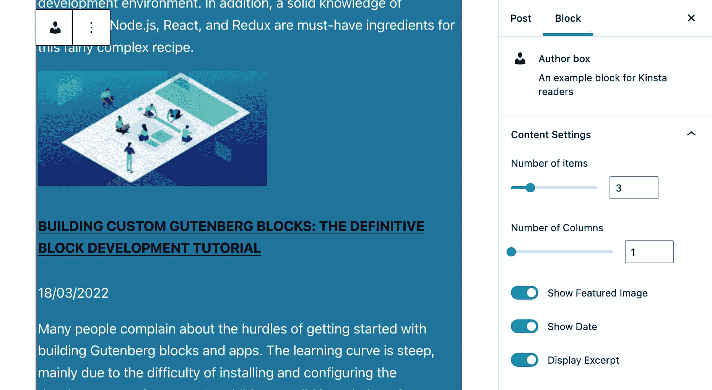

Block settings.


东西都在里面吗？然后我们继续，添加帖子作者的详细信息。

### 找到帖子作者

正如我们上面提到的，我们的块将显示与当前帖子作者相同的文章列表。

为了获得文章作者的 ID，您将从`core/editor`数据存储中导入 [`getCurrentPostAttribute`选择器](https://developer.wordpress.org/block-editor/reference-guides/data/data-core-editor/#getcurrentpostattribute):

```
wp.data.select( 'core/editor' ).getCurrentPostAttribute( 'author' )
```

`getCurrentPostAttribute`返回已保存文章的属性值。

一旦获得作者 ID，就可以如下所示更改查询:

```
const posts = useSelect(
	( select ) => {

		const _authorId = select( 'core/editor' ).getCurrentPostAttribute( 'author' );

		return select( 'core' ).getEntityRecords( 'postType', 'post', {
			'author': _authorId,
			'per_page': numberOfItems,
			'_embed': true
		});
	},
	[ numberOfItems ]
);
```

使用这段代码，您将获得与当前帖子作者相同的一系列`n`文章。

现在您已经有了作者 ID，您还可以使用它从数据库中获取额外的数据。

### 显示作者详细信息

由于我们没有任何可用的文档，我们使用了来自[核心帖子作者模块](https://github.com/WordPress/gutenberg/blob/trunk/packages/block-library/src/post-author/edit.js)的代码作为参考。

要显示作者的详细信息，首先需要导入一个新的依赖关系:

```
import { forEach } from 'lodash';
```

然后，在`Edit`函数中，更新`attributes`对象，如下所示:

```
const { 
	numberOfItems, 
	columns, 
	displayExcerpt, 
	displayDate, 
	displayThumbnail, 
	displayAuthorInfo, 
	showAvatar, 
	avatarSize, 
	showBio 
} = attributes;
```

完成后，您将编辑上一节中看到的代码来检索作者的详细信息:

```
const { authorDetails, posts } = useSelect(
	( select ) => {

		const _authorId = select( 'core/editor' ).getCurrentPostAttribute( 'author' );

		const authorDetails = _authorId ? select( 'core' ).getUser( _authorId ) : null;

		const posts = select( 'core' ).getEntityRecords( 'postType', 'post', {
			'author': _authorId,
			'per_page': numberOfItems,
			'_embed': true
		});

		return { 
			authorDetails: authorDetails,
			posts: posts
		};
	},
	[ numberOfItems ]
);
```

注意，我们使用了 [`getUser`选择器](#getusers)来获取作者的详细信息。

接下来，你可能想得到作者的头像。下面的代码构建了一个存储头像 URL 和大小的项目数组:

```
const avatarSizes = [];
if ( authorDetails ) {
	forEach( authorDetails.avatar_urls, ( url, size ) => {
		avatarSizes.push( {
			value: size,
			label: `${ size } x ${ size }`,
		} );
	} );
}
```

然后，您将添加侧边栏面板和控件，使用户能够定制块中的作者区域:

```
return (
	<>
		<InspectorControls>
			<PanelBody title={ __( 'Author Info', 'author-plugin' ) }>
				<PanelRow>
					<ToggleControl
						label={ __( 'Display Author Info', 'author-plugin' ) }
						checked={ displayAuthorInfo }
						onChange={ () =>
							setAttributes( { displayAuthorInfo: ! displayAuthorInfo } )
						}
					/>
				</PanelRow>
				{ displayAuthorInfo && (
					<>
						<PanelRow>
							<ToggleControl
								label={ __( 'Show avatar' ) }
								checked={ showAvatar }
								onChange={ () =>
									setAttributes( { showAvatar: ! showAvatar } )
								}
							/>
							{ showAvatar && (
								<SelectControl
									label={ __( 'Avatar size' ) }
									value={ avatarSize }
									options={ avatarSizes }
									onChange={ ( size ) => {
										setAttributes( {
											avatarSize: Number( size ),
										} );
									} }
								/>
							) }
						</PanelRow>
						<PanelRow>
							<ToggleControl
								label={ __( 'Show Bio', 'author-plugin' ) }
								checked={ showBio }
								onChange={ () =>
									setAttributes( { showBio: ! showBio } )
								}
							/>
						</PanelRow>
					</>
				) }
			</PanelBody>
			...
		</InspectorControls>
		...
	</>
);
```

下图显示了更新后的设置边栏:

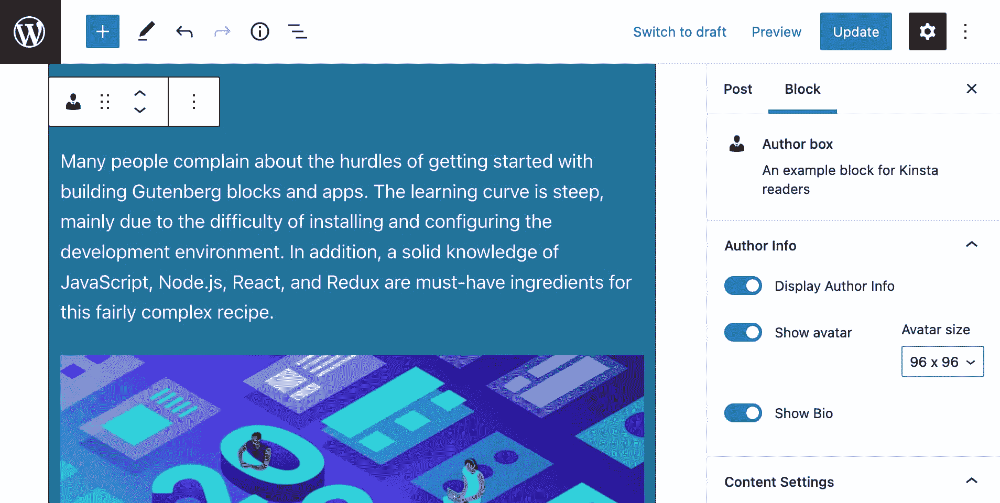

The Author Info settings panel.


最后，您可以将作者部分添加到您的块中:

```
return (
	<>
		<InspectorControls>
		...
		</InspectorControls>

		<div { ...useBlockProps() }>
			{ displayAuthorInfo  && authorDetails && (
				<div className="wp-block-author-box-author-plugin__author">
					{ showAvatar && (
						<div className="wp-block-author-box-author-plugin__avatar">
							
						</div>
					) }
					<div className='wp-block-author-box-author-plugin__author-content'>
						<p className='wp-block-author-box-author-plugin__name'>
							{ authorDetails.name }
						</p>
						{ showBio &&
							// https://developer.mozilla.org/en-US/docs/Web/JavaScript/Reference/Operators/Optional_chaining
							authorDetails?.description &&
							authorDetails.description.length > 0 && (
							<p className='wp-block-author-box-author-plugin__description'>{ authorDetails.description }</p>
						) }
					</div>
				</div>
			)}
			<ul>
			...
			</ul>
		</div>
	</>
);
```

下图显示了它在屏幕上的呈现方式。

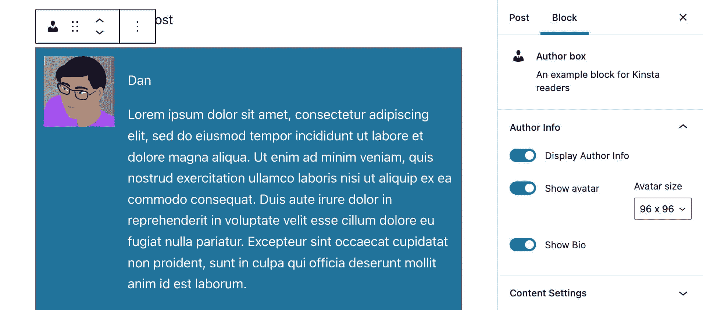

Author details section and Info settings.


现在保存您的 *edit.js* 文件并运行您的测试。根据块设置，块应包含不同的元素。

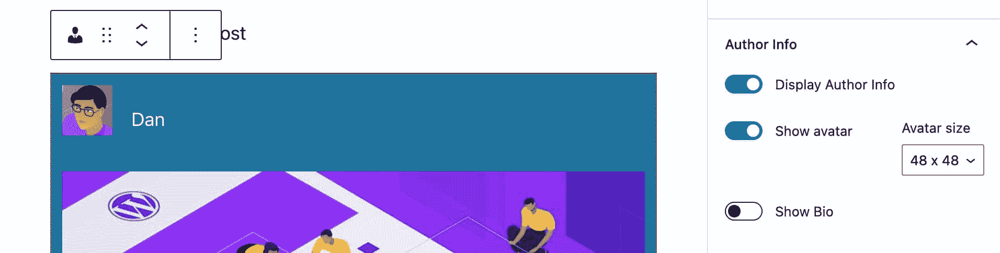

Author details not showing author’s bio.


还缺少最后一样东西:显示文章的列数。

### 更改列数

为了让用户能够以列的形式显示文章预览，我们在 *block.json* 文件中定义了`columns`属性。我们还在脚本中包含了一个`columns`属性，并创建了一个设置控件来允许用户更改列数，尽管这一更改目前没有效果。

在上面的 JSX 代码中，你应该已经注意到我们在几个元素中添加了 CSS 类:

分配给 Author 部分中的元素的类:

*   `wp-block-author-box-author-plugin__author`
*   `wp-block-author-box-author-plugin__avatar`
*   `wp-block-author-box-author-plugin__author-content`
*   `wp-block-author-box-author-plugin__name`
*   `wp-block-author-box-author-plugin__description`

分配给内容部分中元素的类:

*   `wp-block-author-box-author-plugin__post-items`
*   `wp-block-author-box-author-plugin__post-thumbnail`
*   `wp-block-author-box-author-plugin__post-title`
*   `wp-block-author-box-author-plugin__post-date`
*   `wp-block-author-box-author-plugin__post-excerpt`

还有一节课没上。该类的名称将动态生成，以反映用户设置的列数。

返回到`Edit.js`文件，修改`ul`元素，如下所示:

```
<ul className={ `wp-block-author-box-author-plugin__post-items columns-${ columns }` }>
	...
</ul>
```

我们根据[模板文字](https://developer.mozilla.org/en-US/docs/Web/JavaScript/Reference/Template_literals)语法添加了一个新的`columns-${ columns }`类，以便在字符串中插入一个表达式。这样，附加到`ul`元素的属性将取决于用户设置(例如`columns-1`、`columns-2`等)。).

现在打开`style.scss`文件，用以下代码替换现有代码:

```
.wp-block-author-box-author-plugin {
	background-color: #21759b;
	color: #fff;
	padding: .6em;
	ul.wp-block-author-box-author-plugin__post-items {
		padding: 0;
		list-style-type: none;
		display: grid;
		gap: .5em;
		@for $i from 2 through 4 {
			&.columns-#{ $i } {
				grid-template-columns: repeat(#{ $i }, 1fr);
			}
		}
		li {
			list-style: none;
			img.wp-block-author-box-author-plugin__post-thumbnail {
				height: auto;
				max-width: 100%;
			}
		}

	}
}
.wp-block-author-box-author-plugin__author {
	display: flex;
    flex-wrap: wrap;
}

.wp-block-author-box-author-plugin__avatar {
	margin-right: 1em;
}

.wp-block-author-box-author-plugin__author-content {
	flex-basis: 0;
    flex-grow: 1;
}
```

我们不会深入研究这些代码，因为这超出了本文的范围。但是，如果您希望深入了解，您可以参考以下资源:

*   [CSS 网格布局](https://developer.mozilla.org/en-US/docs/Web/CSS/CSS_Grid_Layout)
*   [学习 CSS 网格](https://learncssgrid.com/)
*   [Sass 中的@for 规则](https://sass-lang.com/documentation/at-rules/control/for)
*   [在 Sass 中嵌套](https://sass-lang.com/documentation/style-rules#nesting)

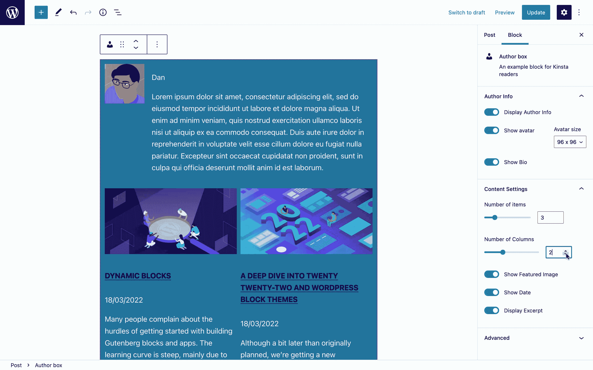

The Author block in the editor.


这就是编辑器中块的渲染。

## 构建要在页面上呈现的块

现在，在编辑器中呈现块的代码已经完成，我们可以继续构建用于在前端呈现的块。

正如我们前面提到的，对于动态块，插件文件负责生成要在前端呈现的 HTML。

所以，打开插件的主文件(在我们的例子中是*author-plugin.php*)。

首先要做的是使 block 属性对 WordPress PHP 函数可用。在您的 PHP 文件中，按如下方式更改函数定义:

```
function author_box_author_plugin_render_author_content( $attr ) {
	...
}
```

现在你可以使用 WordPress 函数来检索和操作数据。例如，您可以使用`get_posts`来检索最新的博客文章(在我们关于 [`get_posts`功能](https://kinsta.com/blog/wordpress-get_posts/)的深入文章中可以读到更多):

```
function author_box_author_plugin_render_author_content( $attr ) {
	$args = array(
		'numberposts'	=> $attr['numberOfItems'],
	);
	$my_posts = get_posts( $args );

	if( ! empty( $my_posts ) ){
		$output = '<ul>';
		foreach ( $my_posts as $p ){
			$output .= '<li><a href="' . esc_url( get_permalink( $p->ID ) ) . '">' 
			. $p->post_title . '</a></li>';
		}
		$output .= '</ul>';
	}
	return $output ?? '<strong>Sorry. No posts matching your criteria!</strong>';
}
```

上面的函数从你的 WordPress 数据库中检索最新的`numberOfItems`博客文章(默认情况下`post_type`被设置为`post`)并返回一个`$post`对象数组。然后遍历数组来构建列表项。

如果检查 HTML 输出，您会注意到这是一个简单的帖子列表，如下图所示:

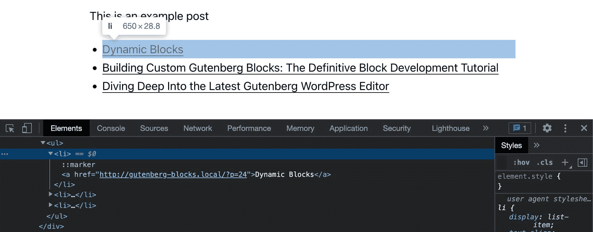

A simple list of posts.


在我们之前的文章中，我们提到过你将使用`useBlockProps` React 钩子在你的 JSX 代码中标记块的[包装元素](https://kinsta.com/blog/gutenberg-blocks/#import-components)。您需要在 PHP 函数中做同样的事情。

WordPress 为此提供了 [`get_block_wrapper_attributes`函数](https://developer.wordpress.org/reference/functions/get_block_wrapper_attributes/)。

因此，按如下方式更改您的 PHP 代码:

```
function author_box_author_plugin_render_author_content( $attr ) {
	$args = array(
		'numberposts'	=> $attr['numberOfItems']
	);
	$my_posts = get_posts( $args );

	if( ! empty( $my_posts ) ){
		$output = '<div ' . get_block_wrapper_attributes() . '>';
		$output .= '<ul>';
		foreach ( $my_posts as $p ){

			$title = $p->post_title ? $p->post_title : 'Default title';
			$url = esc_url( get_permalink( $p->ID ) );

			$output .= '<li>';
			$output .= '<a href="' . $url . '">' . $title . '</a>';
			$output .= '</li>';
		}
		$output .= '</ul>';
		$output .= '</div>';
	}
	return $output ?? '<strong>Sorry. No posts matching your criteria!</strong>';
}
```

现在一个 [`wp-block-author-box-author-plugin`类](https://developer.wordpress.org/reference/functions/get_block_wrapper_attributes/)已经被分配给容器元素，这个块有了不同的背景颜色。

然后`get_posts`函数获取`WP_Posts`数据，`foreach`循环构建列表项(参见[如何显示 get_posts 返回的数据](https://kinsta.com/blog/wordpress-get_posts/#display))。

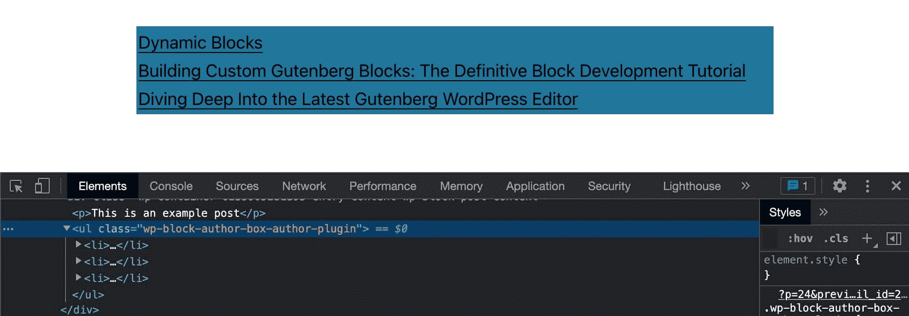

A list of posts with a CSS class assigned.


### 添加特色图片、日期和摘录

接下来，你需要添加文章缩略图、日期和摘录。在同一个文件中，将您的 PHP 代码更改如下:

```
function author_box_author_plugin_render_author_content( $attr ) {
	$args = array(
		'numberposts'	=> $attr['numberOfItems']
	);
	$my_posts = get_posts( $args );

	if( ! empty( $my_posts ) ){
		$output = '<div ' . get_block_wrapper_attributes() . '>';
		$output .= '<ul class="wp-block-author-box-author-plugin__post-items columns-">';

		foreach ( $my_posts as $p ){

			$title = $p->post_title ? $p->post_title : 'Default title';
			$url = esc_url( get_permalink( $p->ID ) );
			$thumbnail = has_post_thumbnail( $p->ID ) ? get_the_post_thumbnail( $p->ID, 'medium' ) : '';

			$output .= '<li>';
			if( ! empty( $thumbnail ) && $attr['displayThumbnail'] ){
				$output .= $thumbnail;
			}
			$output .= '<h5><a href="' . $url . '">' . $title . '</a></h5>';
			if( $attr['displayDate'] ){
				$output .= '<time datetime="' . esc_attr( get_the_date( 'c', $p ) ) . '">' . esc_html( get_the_date( '', $p ) ) . '</time>';
			}
			if( get_the_excerpt( $p ) && $attr['displayExcerpt'] ){
				$output .= '<p>' . get_the_excerpt( $p ) . '</p>';
			}
			$output .= '</li>';
		}
		$output .= '</ul>';
		$output .= '</div>';
	}
	return $output ?? '<strong>Sorry. No posts matching your criteria!</strong>';
}
```

`foreach`循环遍历`$my_posts`数组。在每次迭代中，有几个条件会检查属性值并相应地构建输出。

现在看看屏幕上的输出:

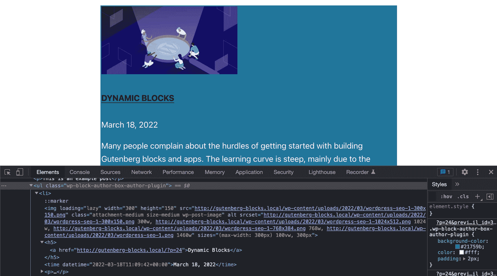

A list of posts with featured images, dates, and excerpts.


现在你可以运行你的测试了。更改日期、摘录和缩略图设置，并检查块内容如何在前端发生变化。

### 在列中显示帖子

在我们的 JavaScript 代码中，我们使用了一个`columns-${ columns }`类在列中显示文章预览。现在我们需要在 PHP 中做同样的事情。

为此，您只需添加这两行代码:

```
$num_cols = $attr['columns'] > 1 ? strval( $attr['columns'] ) : '1';

$output .= '<ul class="wp-block-author-box-author-plugin__post-items columns-' . $num_cols . '">';
```

这将把一个`columns-n`类附加到包含文章预览的`ul`元素中。现在，页面上显示的列数应该与块设置中设置的列数相匹配。

### 构建作者框

最后，您需要构建包含作者详细信息的盒子，包括头像、姓名和描述。

在回调函数中，您需要添加一组条件来检查每个属性的当前值:

```
if( $attr['displayAuthorInfo'] ){
	$output .= '<div class="wp-block-author-box-author-plugin__author">';

	if( $attr['showAvatar'] ){
		$output .= '<div class="wp-block-author-box-author-plugin__avatar">' 
			. get_avatar( get_the_author_meta( 'ID' ), $attr['avatarSize'] ) 
			. '</div>';
	}

	$output .= '<div class="wp-block-author-box-author-plugin__author-content">';

	$output .= '<div class="wp-block-author-box-author-plugin__name">' 
		. get_the_author_meta( 'display_name' ) 
		. '</div>';

	if( $attr['showBio'] ){
		$output .= '<div class="wp-block-author-box-author-plugin__description">' 
			. get_the_author_meta( 'description' ) 
			. '</div>';
	}

	$output .= '</div>';
	$output .= '</div>';
}
```

代码非常简单。它检查每个属性的当前值，如果是`true`，那么它生成必要的 HTML。

现在保存您的 PHP 文件，并比较编辑器中的代码块和前端的相同代码块。

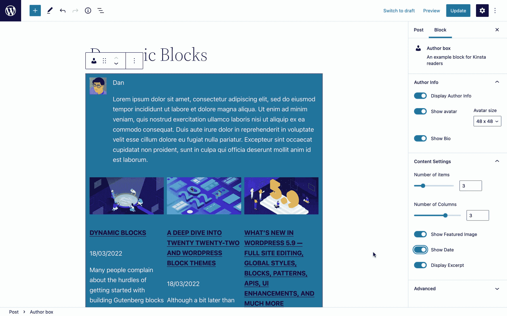

Our custom block in the block editor.


你可以在[这个公共要点](https://gist.github.com/carlodaniele/27e292fbbe4b897ca3bda4539dfd74df)中找到示例块的完整代码。

[Dynamic blocks are Gutenberg blocks under steroids 💪 and this guide covers all you need to know to create dynamic blocks for your next project 🙌Click to Tweet](https://twitter.com/intent/tweet?url=https%3A%2F%2Fbit.ly%2F3zS8lhf&via=kinsta&text=Dynamic+blocks+are+Gutenberg+blocks+under+steroids+%F0%9F%92%AA+and+this+guide+covers+all+you+need+to+know+to+create+dynamic+blocks+for+your+next+project+%F0%9F%99%8C&hashtags=Gutenberg%2CDevelopment)

## 动态块开发的推荐资源

如果你在阅读这篇文章时竖起了耳朵，并开始认识到学习如何创建古腾堡积木所带来的专业发展机会，那么，我们的建议是继续探索和获取积木开发背后的新技术。

虽然仍然缺少可靠的官方文档，但是仍然有很好的资源，无论是免费的还是付费的，我们在写这篇文章的时候参考了这些资源。在众多可用资源中，我们推荐以下资源:

**官方资源**

*   [数据](https://github.com/WordPress/gutenberg/blob/trunk/packages/data/README.md)
*   [核心数据](https://github.com/WordPress/gutenberg/blob/trunk/packages/core-data/README.md)
*   [创建动态块](https://developer.wordpress.org/block-editor/how-to-guides/block-tutorial/creating-dynamic-blocks/)
*   [古腾堡区块开发简介](https://learn.wordpress.org/workshop/intro-to-gutenberg-block-development/)
*   MeetUp 上的社交学习

来自 WordPress 核心贡献者的推荐教程

*   Ryan Welcher(@[ryanwelcher](https://twitter.com/ryanwelcher))使用 getEntityRecords 在古腾堡请求数据
*   Darren Ethier (@ [nerrad](https://twitter.com/nerrad) )对@wordpress/data API 的实用概述

**JavaScript、React 和 Redux 资源**

*   MDN 的 JavaScript 教程
*   【React 入门(官方)
*   [Redux 教程](https://redux.js.org/tutorials/essentials/part-1-overview-concepts)(官方)

**来自 Kinsta 的相关资源**

*   [JavaScript 是什么？看看网络上最流行的脚本语言](https://kinsta.com/knowledgebase/what-is-javascript/)
*   处理 JavaScript 错误的权威指南
*   [什么是 Node.js，为什么要使用它](https://kinsta.com/knowledgebase/what-is-node-js/)
*   [如何在 Windows、macOS、Linux 上安装 Node.js 和 NPM](https://kinsta.com/blog/how-to-install-node-js/)
*   [如何使用多种工具调试 Node.js 代码](https://kinsta.com/blog/node-debug/)
*   Node.js 与 PHP:势均力敌的比较
*   [2022 年最受欢迎的 10 种 Node.js 应用](https://kinsta.com/blog/node-js-apps/)
*   [角度与反应:详细的并排比较](https://kinsta.com/blog/angular-vs-react/)

## 摘要

我们已经到达古腾堡区块开发这一(第二)漫长旅程的终点。

在本文中，我们讨论了一些高级主题，比如应用程序状态和 Redux 存储。但是希望您现在应该对块开发有了更好的理解。

是的，Node.js、Webpack、 [Babel](https://kinsta.com/blog/transpiling-php/#what-is-transpiling) 、React 和 Redux 技能在构建高级古腾堡积木时必不可少，但你不需要成为 React 忍者才能入门。学习如何开发古腾堡区块并不一定要复杂。只要有正确的动机并遵循适当的学习路径就可以了。

我们希望这篇文章以及上一篇文章为你提供正确的地图，让你找到自己的道路，并立即开始古腾堡的发展。

*现在由你决定！你创建动态块了吗？你有什么例子可以和我们分享吗？你经历中最大的障碍是什么？欢迎在下面发表评论。*

* * *

让你所有的[应用程序](https://kinsta.com/application-hosting/)、[数据库](https://kinsta.com/database-hosting/)和 [WordPress 网站](https://kinsta.com/wordpress-hosting/)在线并在一个屋檐下。我们功能丰富的高性能云平台包括:

*   在 MyKinsta 仪表盘中轻松设置和管理
*   24/7 专家支持
*   最好的谷歌云平台硬件和网络，由 Kubernetes 提供最大的可扩展性
*   面向速度和安全性的企业级 Cloudflare 集成
*   全球受众覆盖全球多达 35 个数据中心和 275 多个 pop

在第一个月使用托管的[应用程序或托管](https://kinsta.com/application-hosting/)的[数据库，您可以享受 20 美元的优惠，亲自测试一下。探索我们的](https://kinsta.com/database-hosting/)[计划](https://kinsta.com/plans/)或[与销售人员交谈](https://kinsta.com/contact-us/)以找到最适合您的方式。