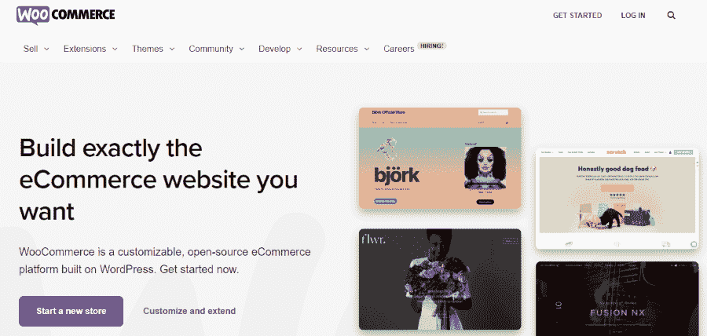
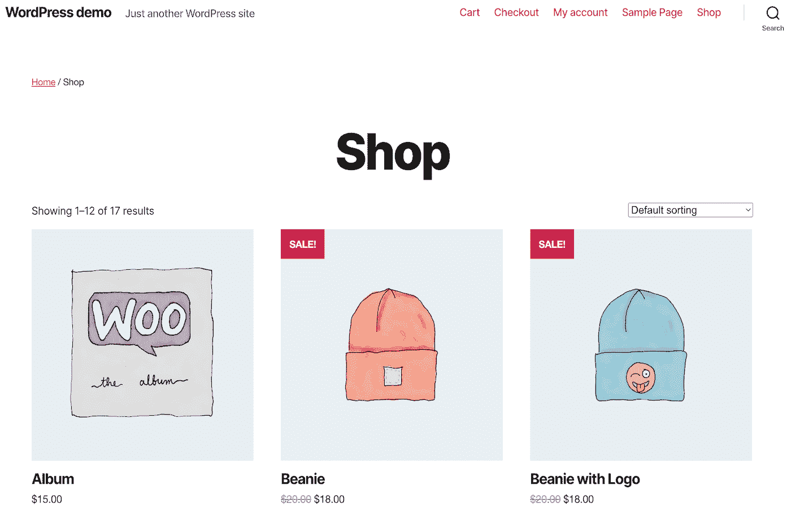
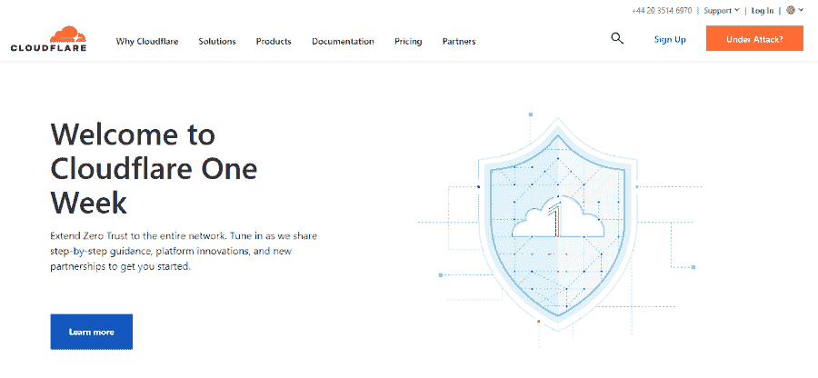
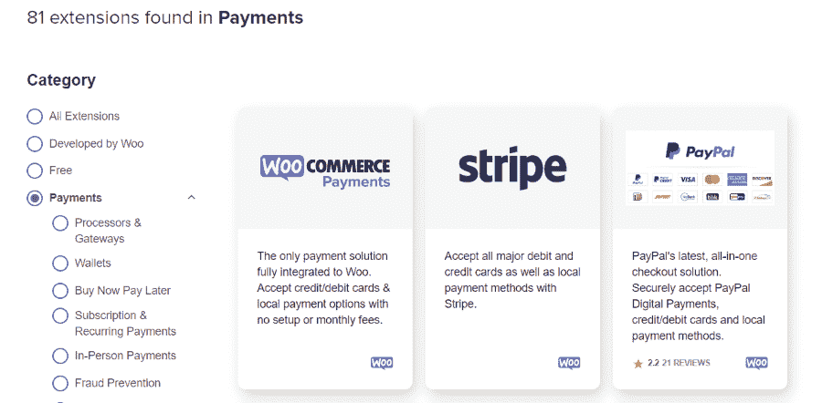
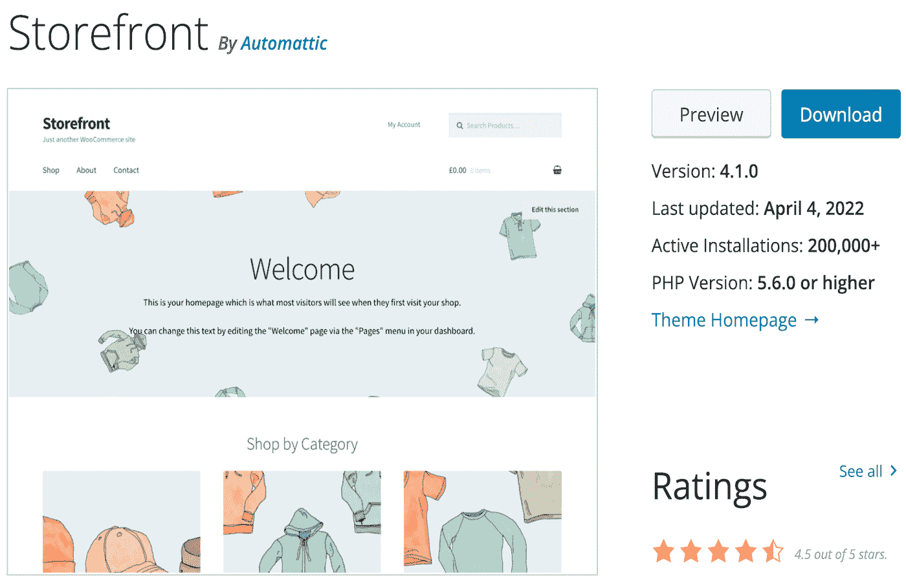
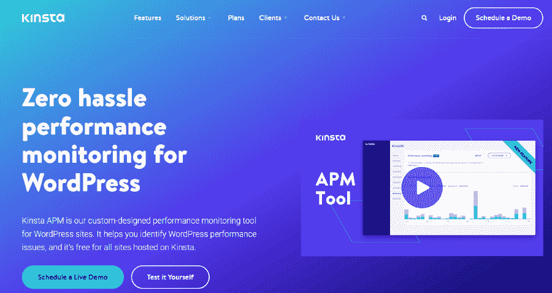
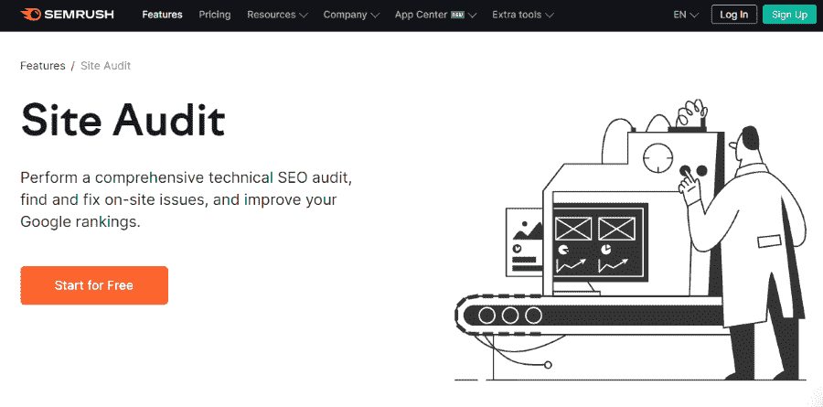

# WooCommerce 可扩展性终极指南

> 原文：<https://kinsta.com/blog/scalability-of-woocommerce/>

你对蓬勃发展的网上商店有什么大计划吗？如果你是一个雄心勃勃的企业家，你可能想知道哪个平台可以帮助你发展业务。然而，你可能不太熟悉扩展一个快速发展的网络公司的技术复杂性。

[WooCommerce](https://kinsta.com/blog/woocommerce-tutorial/) 是一个受企业主信任和广泛使用的平台。使用这个电子商务工具，您可以建立一个支持扩展的在线商店。只要你采用一些最佳实践，你的 WordPress 网站将能够处理几乎任何水平的增长。

在本帖中，我们将向你介绍 WooCommerce 商店的基础知识和扩展电子商务业务。然后，我们将讨论 WooCommerce 的可扩展性。最后，我们将分享六个基本技巧，你可以用它们来确保你的网上商店顺利发展。让我们开始吧！

## WooCommerce 是如何运作的？

WooCommerce 是一个 WordPress 插件，可以让你建立一个在线商店。它拥有超过五百万的活跃安装，是网络上最受欢迎的电子商务解决方案之一:

WooCommerce

WooCommerce 使网上商店的推出变得很容易。这部分是因为 WordPress 使用户能够利用[预先制作的主题](https://kinsta.com/blog/woocommerce-themes/)。虽然有些主题是用于创造性的用途，如博客和作品集，但有大量的选项是专门为网上商店设计的。

> Kinsta 把我宠坏了，所以我现在要求每个供应商都提供这样的服务。我们还试图通过我们的 SaaS 工具支持达到这一水平。
> 
> <footer class="wp-block-kinsta-client-quote__footer">
> 
> 
> 
> <cite class="wp-block-kinsta-client-quote__cite">Suganthan Mohanadasan from @Suganthanmn</cite></footer>

[View plans](https://kinsta.com/plans/)

[Do you have big plans for a thriving online store? 💰 This guide will help you scale up 📈Click to Tweet](https://twitter.com/intent/tweet?url=https%3A%2F%2Fbit.ly%2F3biYbgd&via=kinsta&text=Do+you+have+big+plans+for+a+thriving+online+store%3F+%F0%9F%92%B0+This+guide+will+help+you+scale+up+%F0%9F%93%88&hashtags=WooCommerce%2CEcommerce)

例如，店面主题提供了电子商务网站的基本页面，如*商店*、*购物车*、*收银台*等等:

WordPress shop demo

此外，WooCommerce 还附带了许多功能，使您能够经营您的在线业务。这些包括[支付网关](https://kinsta.com/blog/woocommerce-payment-gateways/)，标签打印，税收计算，等等。

你还可以获得各种各样的插件，帮助[提高你的转化率](https://kinsta.com/learn/woocommerce-guide/)。这些包括从像 Mailchimp 这样的[集成电子邮件营销软件到像](https://kinsta.com/blog/mailchimp-for-wordpress/)这样复杂的分析程序。

WooCommerce 也是大型在线商店的一个很好的选择。它允许批量上传产品，以实现最高效率。

这个平台可以帮助你更有效地发展你的商店。它可以自动跟踪和更新你的库存。此外，它的自动化控制台可以让你从你的 WordPress 仪表盘上管理你的业务的几乎每一个领域。

## 什么是可伸缩性？

如果你计划启动并发展在线业务，了解一两件关于可扩展性的事情是很重要的。这个术语指的是一个系统在保持相同性能水平的同时处理增加的需求的潜力。

简单来说，如果一个公司是可扩展的，它就可以安全成功地成长。相反，当一个企业没有发展到一定规模时，它可能会导致诸如交货延迟或客户支持质量下降等问题。

研究表明，20%的企业熬不过第一年。此外，[的快速增长](https://www.investopedia.com/financial-edge/1010/top-6-reasons-new-businesses-fail.aspx)经常被认为是他们失败的主要原因之一。

当企业因增长而承受压力时，这可能会将整个运营置于危险之中。因此，为可扩展的业务奠定基础至关重要。

虽然供应链等要素是等式的一部分，但这可能是您无法控制的。因此，让你的电子商务业务可扩展的最好方法之一是建立一个强大的网站，能够处理增加的需求。

## WooCommerce 的可扩展性如何？

好消息是 WooCommerce 是高度可扩展的。首先，它允许无限的产品和每日交易。这意味着您可以轻松扩展您的产品，而不必担心超出每日订单。

一个成功的 WooCommerce 商店的典型例子是:

MintMobile website

[根据 Aftership](https://www.aftership.com/store-list/top-100-woocommerce-stores) 的数据，这项电子商务业务每月接待超过 200 万访客。如果你浏览 Mint Mobile 的页面，你会看到它提供了大量的产品，包括计划、电话交易等等。

如果你不相信，WooCommerce 的扩展常见问题解答提供了更多信息，说明哪些因素会影响它与你的业务一起适当扩展的能力。让我们回顾一下要点:

*   **交通。**这是 WooCommerce 商店可扩展性中最重要的元素之一。你的网站需要能够同时处理大量的访问者。此外，它应该能够管理单个页面上或特定时间的意外流量高峰([，如在销售活动期间](https://kinsta.com/blog/ecommerce-strategies/))。
*   **WooCommerce 代码。**幸运的是，该插件的编程考虑到了效率。WooCommerce 开发团队正在不断优化软件，以增强其性能并确保其可扩展性。
*   **其他系统代码。**您商店的性能可能会受到其他组件代码的影响，例如您的主题和插件。因此，您需要确保您正在谨慎地选择这些工具。[插件](https://kinsta.com/blog/woocommerce-plugins/)应该包含干净高效的代码，以达到最佳性能。
*   **服务器硬件。**先进的服务器性能是 WooCommerce 可扩展性的关键。资源有限的服务器将无法容纳高水平的流量。

你会注意到其中一些因素不是由 WooCommerce 插件决定的。因此，由您来确保您的站点保持可伸缩性。

## 常见的电子商务增长方法

在我们看一些有效扩展你的 WooCommerce 商店的技巧之前，让我们回顾一下你可能在网上商业世界看到的一些常见的增长方法。

### 拔靴带

你可能以前听过这个流行词。“自举”一词来自谚语“靠自己的力量提升自己”。本质上，它指的是一家公司靠自己实现的缓慢增长。

一般来说，自举被认为是一种自然允许可持续扩展的策略。这通常被视为一种好斗且节俭的策略。一些[自举技巧](https://www.scaling.partners/resources/articles/bootstrapping-techniques-for-startups/)可能包括提供免费样品以增加知名度，或者创建奖励计划以鼓励客户忠诚度。

自主创业的企业很可能会在社交媒体上占有一席之地。这是因为社交平台提供了一种负担得起的方式来随着时间的推移缓慢增长和扩展。

### 缓慢缩放

顾名思义，[慢缩放](https://www.forbes.com/sites/forbescoachescouncil/2019/03/22/15-signs-your-startup-is-scaling-too-quickly-and-how-to-slow-down/)类似于自举。然而，它提供了一种更平衡的方法。

在缓慢扩展的情况下，小企业将接受外部方的资金支持。

这可能是以贷款甚至风险资本的形式。

慢速扩展也被认为是一种安全且可持续的扩展方式。通常情况下，规模缓慢的企业和自举企业一样都是 DIY，只是他们愿意接受外部帮助。这种方法的主要缺点是，当企业家接受其他公司的资金支持时，他们可能会失去一些控制权。

### 快速扩展和快速扩展

快速扩张和闪电式扩张是最具风险的增长战略。快速扩张是风险资本支持的企业最常用的技术。这些公司甚至可能有额外的支持系统，如外部营销团队和领导。

同样， [blitzscaling](https://thestrategystory.com/2021/08/31/blitzscaling-startup-strategy/) 是一种优先考虑增长的扩展模式。采用这种策略的公司通常会在很短的时间内达到令人印象深刻的增长水平。

## 注册订阅时事通讯

### 想知道我们是怎么让流量增长超过 1000%的吗？

加入 20，000 多名获得我们每周时事通讯和内部消息的人的行列吧！

[Subscribe Now](#newsletter)

对于大多数小型电子商务企业来说，这两种策略都不值得推荐，甚至都不相关。然而，快速扩展和闪电式扩展都使公司在市场上具有竞争力。

## 如何有效地扩展你的网上商店(6 个基本技巧)

现在，您对最常见的扩展技术有了更多的了解，您可能更清楚哪个选项最适合您的企业。不管你的选择是什么，你都需要一个强大的网站来支持你的成长。让我们来看看如何有效地扩展你的 WooCommerce 商店。

### 1.选择一个高质量的主机提供商

选择一个高质量的主机提供商将帮助你为一个可扩展的 WordPress 站点打下基础。主机提供商或网络主机为网站配备服务器资源，以便向互联网用户提供网页。

有不同类型的虚拟主机，例如共享、专用或虚拟专用服务器(VPS)。每个选项允许不同级别的用户流量。一些顶级的网络主机，比如 Kinsta，甚至提供[托管的 WooCommerce 主机](https://kinsta.com/woocommerce-hosting/):

WooCommerce hosting on Kinsta

我们的 WooCommerce 托管计划使用支持可扩展基础设施的强大网络服务器。此外，您还可以通过我们用户友好的 [MyKinsta](https://kinsta.com/mykinsta/) 仪表盘轻松管理您的网站和托管服务。

选择一个高质量的虚拟主机提供商是加速你的网站的有效方法。如果您目前使用的是低质量的服务，我们建议您改用功能更强大的托管解决方案。在 Kinsta，我们可以免费帮助您[迁移您的站点](https://kinsta.com/wordpress-migration/)。

### 2.使用内容交付网络(CDN)

如果你想确保你的电子商务网站在任何时候都能平稳运行，那么使用内容交付网络(CDN)是至关重要的。简而言之，CDN 是一组分布在不同位置的 web 服务器。

当你有了 CDN，你的内容将从离你的用户最近的服务器上传送。这有助于减少页面加载时间。

[Cloudflare](https://www.cloudflare.com/) 是这项服务的热门选项:

Cloudflare

Cloudflare 有助于在高流量事件期间保持您的站点平稳运行。此外，它可以为您的客户提供积极的用户体验(UX)。一些 web 主机，如 Kinsta，[在其计划中包含了 Cloudflare CDNs。](https://kinsta.com/cloudflare-integration/)

### 3.仔细选择您的支付网关

任何接受订单的电子商务企业都需要仔细选择支付方式。幸运的是，WooCommerce 兼容许多支付网关。

Struggling with downtime and WordPress problems? Kinsta is the hosting solution designed to save you time! [Check out our features](https://kinsta.com/features/)

如果你去 WooCommerce 扩展商店，你会在**支付**类别中找到 [81 个附加组件](https://woocommerce.com/product-category/woocommerce-extensions/payment-gateways/):

WooCommerce payment gateways

虽然 WooCommerce 自带支付系统，但它也集成了一些最流行的支付网关。其中包括 PayPal、Stripe、Amazon pay、Square 和所有主要的信用卡。

为了建立一个可扩展的业务，你需要弄清楚第三方支付工具收取的佣金和费用是否在你的预算之内。然后，根据你的研究，你可以在付款方式方面确立你的优先顺序。

### 4.维护更新的软件、插件和主题

每个网站都需要大量的活动部件才能平稳运行。因此，你可能会使用许多不同的工具来保持你的 WooCommerce 商店的业务。

大多数 WordPress 插件和主题需要定期更新:

Update WooCommerce themes and plugins

WooCommerce 一直在发展和改进，所以它也定期更新。如果你的插件和主题不是最新的，它们会给你的网站带来问题。

过时的软件会导致系统不兼容，这会损害你网站的性能。幸运的是，你可以从你的 [WordPress 仪表盘](https://kinsta.com/knowledgebase/wordpress-admin/)轻松更新你的插件。

然而，由于你的电子商务网站处理敏感信息，你最好在实施之前[备份你的数据](https://kinsta.com/blog/how-to-backup-woocommerce-database/)并在[中转站点](https://kinsta.com/blog/woocommerce-staging/)测试更新。一个可扩展的站点需要一个合理的维护和更新策略。

### 5.运行常规性能测试

确保您的电子商务网站正常运行的最佳方式是进行性能测试。例如，你会想检查你的网站速度和页面加载时间。

其他[常见的性能问题](https://kinsta.com/blog/woocommerce-apm/)包括累积布局偏移(CLS)和交互延迟。谷歌在其[核心网络指标](https://kinsta.com/blog/core-web-vitals/)得分中考虑了这两个因素。这些方面的糟糕分数会对你的排名产生负面影响。

我们的 Kinsta [APM 工具](https://kinsta.com/apm-tool/)为您的电子商务网站提供定制性能监控:

Kinsta APM

这个工具是专门为 WordPress 网站设计的。它可以识别有问题的插件和主题，提供优化工具的建议，等等。

WooCommerce 的可扩展性取决于网站的整体性能。[快速加载时间](https://kinsta.com/blog/fastest-woocommerce-theme/)将使您的商店能够容纳大量的流量，并在搜索结果中排名更高。

### 6.审核您的内容

性能监控工具可以帮助你解决插件和主题的问题。但是，您可能还希望审核您的内容，以确保您使用的是 web 性能的最佳实践。

你可以通过分析你网站的每一页来手动做到这一点。例如，您可以检查所有图像文件是否都已压缩，以及您的[产品页面](https://kinsta.com/blog/conversions-woocommerce-product-pages/)是否组织整齐。

然而，这可能是一项单调乏味的任务。幸运的是，你可以使用像 [Semrush](https://www.semrush.com/) 这样的[搜索引擎优化(SEO)](https://kinsta.com/blog/what-does-seo-stand-for/) 工具来简化这个过程:

Semrush

这个工具带有一个[站点审计](https://www.semrush.com/features/site-audit/)功能，可以扫描你的内容以发现不同的问题。例如，它会让你知道你是否有问题重定向，缓慢加载页面，重复内容，或[断开链接](https://kinsta.com/blog/broken-links/)。

[Prep your online store for long-term growth by implementing these best practices right from the start 📈Click to Tweet](https://twitter.com/intent/tweet?url=https%3A%2F%2Fbit.ly%2F3biYbgd&via=kinsta&text=Prep+your+online+store+for+long-term+growth+by+implementing+these+best+practices+right+from+the+start+%F0%9F%93%88&hashtags=WooCommerce%2CEcommerce) ## 摘要

如果你要开一个网上商店，你会想确保你从一开始就做对了一切。重要的是，你要建立你的电子商务业务，以可持续的方式满足需求。这样，随着你的业务增长，你的网站将能够处理转化率和流量的提升。

回顾一下，以下是提高 WooCommerce 商店可扩展性的六种方法:

1.  选择一个高质量的主机提供商。
2.  使用内容交付网络(CDN)。
3.  仔细选择您的支付网关。
4.  维护更新的软件、插件和主题。
5.  运行常规性能测试。
6.  审核您的内容。

你对 WooCommerce 的可扩展性有什么疑问吗？请在下面的评论区告诉我们！

* * *

让你所有的[应用程序](https://kinsta.com/application-hosting/)、[数据库](https://kinsta.com/database-hosting/)和 [WordPress 网站](https://kinsta.com/wordpress-hosting/)在线并在一个屋檐下。我们功能丰富的高性能云平台包括:

*   在 MyKinsta 仪表盘中轻松设置和管理
*   24/7 专家支持
*   最好的谷歌云平台硬件和网络，由 Kubernetes 提供最大的可扩展性
*   面向速度和安全性的企业级 Cloudflare 集成
*   全球受众覆盖全球多达 35 个数据中心和 275 多个 pop

在第一个月使用托管的[应用程序或托管](https://kinsta.com/application-hosting/)的[数据库，您可以享受 20 美元的优惠，亲自测试一下。探索我们的](https://kinsta.com/database-hosting/)[计划](https://kinsta.com/plans/)或[与销售人员交谈](https://kinsta.com/contact-us/)以找到最适合您的方式。