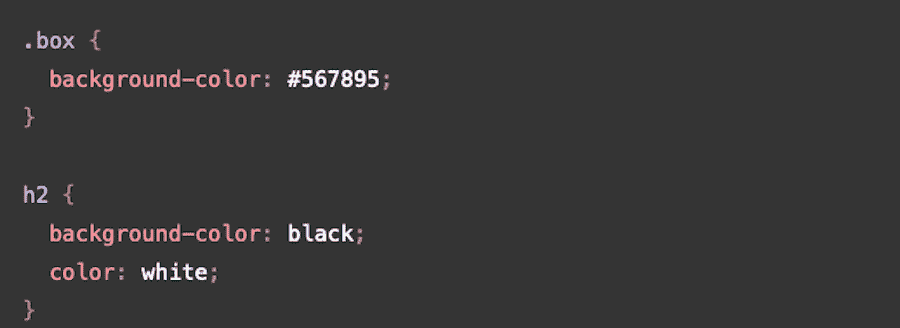
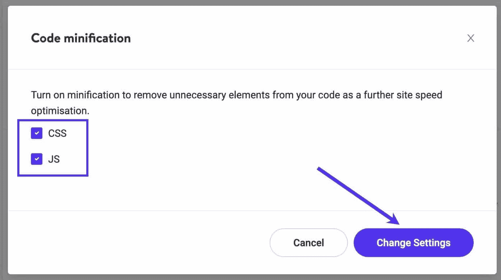
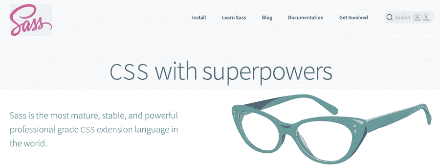
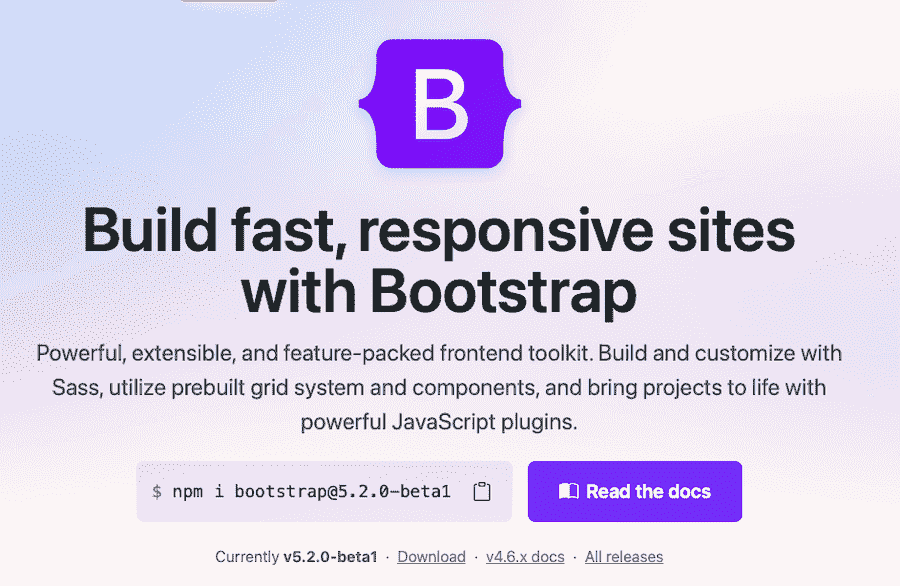
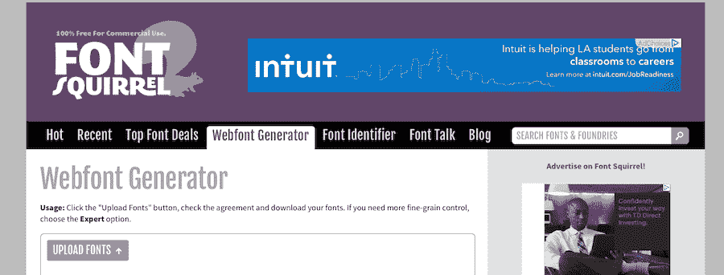
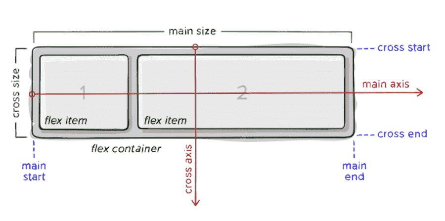

# 初学者的 14 个 CSS 最佳实践

> 原文：<https://kinsta.com/blog/css-best-practices/>

当你开始网页设计时，让一切正常工作并呈现你想要的外观的关键要素就落在了 CSS 的手中。这是级联样式表的简称，它们允许你以任何你想要的方式设计 HTML 元素的样式。

虽然您可以用多种方式试验 CSS 通常是内联方式——但有一种更好的方式。这符合你应该遵循的一系列最佳实践，以确保[你的代码](https://kinsta.com/knowledgebase/edit-wordpress-code/)是功能性的，没有不必要的累赘，并且组织良好。

今天，我们将为初学者重点介绍 14 个 CSS 最佳实践，但即使是有经验的专业人士有时也应该温习一下基础知识。

## 1.组织样式表

应用 CSS 最佳实践时，您的首要任务是组织您的样式表。如何实现这一点将取决于您的项目，但一般来说，您需要遵守以下组织原则:

### 保持一致

无论你选择如何组织你的 CSS，确保你的选择在整个样式表和整个网站中保持一致。


从命名类到行缩进再到注释结构，保持所有的一致性将帮助你更容易地跟踪你的工作。此外，它还能确保以后做出改变时不会头疼。

[CSS: the key to making your site look & function correctly. ✨ Bookmark this for your next project! ✅Click to Tweet](https://twitter.com/intent/tweet?url=https%3A%2F%2Fbit.ly%2F3cAKmKu&via=kinsta&text=CSS%3A+the+key+to+making+your+site+look+%26amp%3B+function+correctly.+%E2%9C%A8+Bookmark+this+for+your+next+project%21+%E2%9C%85&hashtags=CSS%2CWebDev)

### 大量使用换行符

虽然 CSS 即使看起来很丑也能正常工作，但是如果你使用大量的换行符来保持每个代码片段的独立和清晰，对你和任何其他使用你的代码的开发人员来说都是更好的。

通常，最好将每个属性和值对放在一个新行上。



CSS code


### 在有意义的地方创建新的部分

同样，如何设置样式表在很大程度上取决于您正在处理的站点的类型。但是一般来说，为将要使用的样式设置区域是个好主意。因此，一部分用于文本样式，一部分用于列表和栏，一部分用于导航和链接，等等。您甚至可以为特定页面创建部分，这些页面可能具有与商店或 FAQ 等其他页面不同的样式。

### 注释您的代码

即使只有你会看到你的 CSS，彻底的注释仍然是一个好主意。注释将如下所示:

```
/* This is what a standard CSS comment looks like */
```

这使你更容易一眼就看出每一部分是什么，而不必在以后仔细阅读每一行。

评论可以帮助你定义部分，但你也可以使用它们来提供关于你所做的决定的见解——特别是如果你觉得你以后可能会忘记。

### 对较大的项目使用单独的样式表

这并不适用于每个网站，但是如果你有一个需要大量特定 CSS 的大型网站，使用多个样式表是一个好主意。任何人——包括你——都不应该为了找到你需要的那一行代码而滚动很长时间。

避免麻烦，为不同的网站部分创建单独的样式表——特别是当它们有完全不同的风格时。

例如，您可能希望为全球样式创建一个样式表，为您的网上商店创建另一个样式表，为产品描述、标题或定价创建专用样式。

## 2.内联 CSS 与外部 CSS 和内部 CSS

在构建网站和调整其样式时，您可能需要处理三种不同类型的 CSS。让我们谈一谈每一个是什么和做什么，然后讨论你实际上应该在你的项目中使用哪一个。

*   **内联 CSS。**这允许你设计特定的 HTML 元素，
*   [](https://kinsta.com/knowledgebase/combine-external-css/)****外部 CSS。**这涉及到使用一个文件，比如一个样式表，作为一个整体来设计站点的样式。**
***   **内部 CSS。这允许你设计整个页面的样式，而不是特定的元素。****

 **许多开发人员建议完全避免内联 CSS，因为它通常不能被缓存，并且建议避免在多个文件中分割 CSS。至少，应该谨慎使用。

只有当你在网站的某个页面的某个部分、某段文字或者某个区域使用某种样式时，我们才会发现它的必要性。这可能是内联 CSS 是可行的解决方案的唯一情况。

除此之外，根据您的需要使用外部 CSS 或内部 CSS 是更好的选择，因为它们可以节省您的时间和精力。一旦确定了样式，就在你的网站上应用它们。嘣-搞定。

## 3.缩小您的样式表

CSS 的另一个最佳实践是缩小你的样式表。有许多[缩小工具](https://kinsta.com/help/kinsta-cdn-code-minification/)可用于加速样式表的加载时间，包括直接在 [Kinsta CDN](https://kinsta.com/help/kinsta-cdn/) 中。



Adjusting code minification settings in Kinsta CDN.


这允许您调整整个网站的代码缩小设置。

## 4.使用预处理器

一个[预处理器](https://kinsta.com/blog/web-development-tools/)比如 Sass/SCSS 允许你使用变量和函数，更好地组织你的 CSS 并且节省时间。它们的工作原理是允许你从预处理语法中创建 CSS。

这意味着预处理器就像一个“CSS +”，它包含了 CSS 本身通常不存在的一些特性。这些特性的增加通常会使输出的 CSS 更加易读和易于导航。

你需要在你网站的服务器上安装一个 CSS 编译器来使用预处理程序。一些最受欢迎的预处理器包括[萨斯](https://sass-lang.com/)、[莱斯](https://lesscss.org/)和[手写笔](https://stylus-lang.com/)。



Sass


## 5.考虑一个 CSS 框架

CSS 框架在某些情况下是有用的，但对很多人来说可能是不必要的，尤其是当你的网站比较小的时候。

框架可以使快速部署大型项目变得容易，还可以避免错误。它们提供了标准化的好处，当几个人同时在一个项目上工作时，这是非常重要的。

每个人都将使用相同的命名程序、相同的布局选项、相同的注释程序等等。

另一方面，它们也会导致网站看起来很普通，很多代码最终会被闲置。



Bootstrap


你可能以前遇到过 CSS 框架。Bootstrap 和[基金会](https://get.foundation/)是两个最受欢迎的例子。其他框架还有[顺风 CSS](https://kinsta.com/blog/tailwind-css/) 和[布尔玛](https://bulma.io/)。

## 6.从重置开始

另一件要迅速付诸实践的事情是用 CSS 重置开始你的开发工作。使用类似于 [normalize.css](https://necolas.github.io/normalize.css/) 的东西可以让所有浏览器以一致的方式呈现页面元素，同时遵循最新的标准来最小化浏览器的不一致性。

这个重置实际上是一个很小的 CSS 文件，你可以上传到你的网站，为 HTML 元素的样式增加一个更高水平的跨浏览器一致性，并作为一种更新的方式来进行 CSS 重置。

## 7.类别与 id

在遵循 CSS 最佳实践时，您应该注意的下一件事是如何对待类和 id。如果您不熟悉，让我们简单地定义一下这两者:

*   **阶级。**[类选择器](https://www.educative.io/answers/class-and-id-selectors-in-css)通过选择一个具有类属性的元素来工作。class 属性中的内容决定了如何选择 HTML 元素。代码看起来是这样的:**。类名**
*   **同上。**另一方面，ID 通过选择具有 ID 属性的元素来工作。ID 属性必须与选择器的值相同才能工作。你可以通过这个符号在 CSS 中找到一个 ID:**#**。

ID 用于选择单个元素，而类用于选择多个元素。您可以使用 ID 将样式应用于单个 HTML 元素。您可以使用一个类将一个样式应用于多个 HTML 元素。遵循这条一般规则有助于保持代码的整洁，还可以减少不必要的或重复的代码。

类似于我们上面讨论的内联与外部 CSS，您可以使用 ID 将样式应用于单个元素。基本上，id 是用来设计页面异常的样式，而不是应用于整个页面或网站的总体样式。

## 8.避免冗余

另一个 CSS 最佳实践是尽可能避免冗余。以下是将这种做法应用到您的工作流程时需要遵循的一些通用提示:

### 使用干法

DRY 方法代表“不要重复你自己”,基本上是你不应该在 CSS 中重复代码的思想。因为在最好的情况下，手动一遍又一遍地输入这些样式是浪费时间和重复的，但在最坏的情况下，它会大大降低网站的速度。

检查您的代码以删除冗余是一个很好的做法。例如，标签不需要在同一个部分中两次标识字体大小。删除重复的代码，你的代码会读得更好，执行得也更好。

### 使用 CSS 速记

CSS 简写是一种很好的方法，可以减少代码占用的空间，同时仍能正常运行。如果有必要，可以在一行中组合多种样式。例如，如果您正在设置特定 div 的样式，您可以在一行中列出边距、填充、字体、字体大小和颜色。

## 注册订阅时事通讯


### 想知道我们是怎么让流量增长超过 1000%的吗？

加入 20，000 多名获得我们每周时事通讯和内部消息的人的行列吧！

[Subscribe Now](#newsletter)

### 向元素中添加多个类

在适用的情况下，还可以通过向一个元素添加多个类来避免冗余。例如，如果你的页面内容由于类**已经向左浮动。left** 但是你想把页面上的一列放在右边，你可以把它添加到元素中以防止混淆，并且明确地告诉 CSS 你想把什么元素浮动到标准左对齐顶部的左边*。*

最棒的是，你可以向一个元素添加尽可能多的类，只要用空格分隔。

### 尽可能组合元素

与其一个一个地列出元素，不如把它们组合起来以节省空间和时间。通常，单个样式表中的元素具有相同(或相似)的样式。如果页面上的每个文本元素都有相同的样式，就没有必要列出它们的字体、颜色和对齐方式。相反，将它们组合成一行，如下所示:

```
h1, h2, h3, p {
font-family: ariel,
color: #00000
}
```

### 避免不必要的额外选择器

有时候，当你最终完成你的网站设计时，你的代码会变得有点乱。这就是为什么事后回头删除不必要的选择器很重要。您还应该留意过于复杂的选择器。例如，如果你要在你的网站上设计列表的样式，你不需要使用像“body”或“container”这样的选择器。就**。classname li {** 就够了。

## 9.如何正确导入字体

正确导入和使用字体是确保你的 CSS 清晰、简洁和优化的另一种方式。

### 使用@font-face 导入字体

你可以在你的网站上添加任何你想要的字体，但是你需要遵循一个特定的程序来确保它正常工作。



Webfont Generator


1.  **下载您想要使用的字体。**有很多地方可以找到字体，包括谷歌和 Adobe。确保您正在下载 TrueType 字体文件(。ttf)为您选择的字体。
2.  **上传你想要使用的自定义字体到字体松鼠提供的[网络字体生成器](https://www.fontsquirrel.com/tools/webfont-generator)。**网页字体套件生成后立即下载。它应该包含几个文件，包括几个不同的字体文件与扩展名一样。ttf，。woff、. woff2 和. eot。还应该包括一个 CSS 文件。
3.  使用 FTP 将网络字体套件上传到您的网站。具体说明会因你的虚拟主机提供商而异，但一般来说，你可以使用 [FTP 客户端](https://kinsta.com/blog/best-ftp-clients/)或虚拟主机管理界面上的文件管理器如 [cPanel](https://kinsta.com/knowledgebase/what-is-cpanel/) 来访问你网站的文件。
4.  使用[文本编辑器](https://kinsta.com/blog/best-text-editors/)更新 CSS 文件。任何你喜欢的 HTML 文本编辑器都可以像 NotePad 或 Sublime 一样工作。在这个文件中，会列出一个“源 URL”。您将需要更新它，以反映 web 字体套件现在位于您的 Web 服务器上的什么位置。将 web 主机上存储每个字体文件的文件路径复制到该文件中，如下所示:

```
@font-face {
font-family: "FontName";
src: url("https://sitename.com/css/fonts/FontName.eot");
src: url("https://sitename.com/css/fonts/FontName.woff") format("woff"),
url("https://sitename.com/css/fonts/FontName.otf") format("opentype"),
url("https://sitename.com/css/fonts/FontName.svg#filename") format("svg");
}
```

然后，您可以使用 **font-family** 标签将新字体添加到您站点的 CSS 文件中。

为了提高网站的性能，并防止加载时网站布局出现奇怪的调整，您可以预加载字体。[预加载字体](https://kinsta.com/blog/how-to-change-font-in-wordpress/)首先加载 WOFF2 字体(或者最小的字体大小)可以显著提高性能。您可以通过向 **<头>** 标签添加一行代码来实现这一点。[更好的网页类型](https://betterwebtype.com/articles/2019/11/02/preloading-fonts-when-does-it-make-sense/)提供了一个简明的例子:

```

```

您可以做的另一件事是限制自定义字体的字符集。如果你只使用了一种字体中的几个字符(比如一个标题或标志),你不需要调用整个字符集，只需要调用你真正需要的几个字符。根据[的新代码](http://thenewcode.com/878/Slash-Page-Load-Times-With-CSS-Font-Subsetting)，要请求字符“Hello ”,您应该这样做:

```

```

### 尽可能使用自宿主字体

上面描述的过程是针对[自托管字体](https://kinsta.com/blog/local-fonts/)的，但是重要的是要重申这是最好的方法。它大大加快了加载时间，意味着你不再依赖另一个网站的速度来完成你的网站的加载过程。

Struggling with downtime and WordPress problems? Kinsta is the hosting solution designed to save you time! [Check out our features](https://kinsta.com/features/)

### 小心字体变化

字体变化对于给你的网站添加有趣的风格非常有用。然而，如果使用不当，它们也会直接破坏你的网站。

如果你在**字体变化设置**下分配了一个以上的样式，很可能它们会重叠，一个会覆盖另一个。您最好保持简单，使用字体属性，如下所示:

```
.bold {
font-weight: bold;
}
.italic {
font-style: italic;
}
```

### 使用备用字体

尽管你可能会努力在你的网站上添加自定义字体，并通过 CSS 来使用它，但它仍然不会 100%地工作——尤其是当有人使用过时的 web 浏览器访问时。但是您仍然希望这些网站访问者有一个愉快的浏览体验。

为了适应这种情况，有必要设置一种备用字体，以便在其他字体都不可用时使用。要做到这一点，当分配一个**字体系列**时，你只需在你的首选字体后列出备用字体。这样，CSS 将首先调用您的首选字体，然后是您的第二选择，然后是您的第三选择，依此类推。

根据[W3Schools](https://www.w3schools.com/css/css_font_fallbacks.asp),[字体家族](https://kinsta.com/blog/html-fonts/)有五个主要类别。以下是这些系列的列表，其中包含适合每个系列的流行备用字体。

*   **Serif:** 时代新罗马，佐治亚，Garamond
*   **无衬线字体:** Arial，Tahoma，Helvetica
*   **等宽:**快递新
*   **草书:**毛笔字 MT
*   **幻想:**铜版、纸莎草纸

## 10.使 CSS 可访问

每个人都应该让自己的网站变得易于访问——直截了当。这也适用于你的 CSS 方法。你的目标应该是让尽可能多的人可以使用你的网站，而实施可访问性措施是实现这一目标的绝佳方式。

您可以通过多种方式使您的 CSS 具有可访问性:

*   将[颜色变化](https://kinsta.com/blog/html-font-color/)添加到链接中，使其突出。
*   通过按 ESC 键使弹出窗口消失。那些使用屏幕阅读器或放大功能的用户通常看不到屏幕上的“X”来关闭弹出窗口，所以通过击键来关闭它们是很重要的。
*   有些设备甚至不会在第一时间显示弹出窗口，所以要确保所有重要信息都传达到了其他地方。
*   悬停元素(如工具提示)应该由 Tab 键和鼠标悬停触发[。](https://accessuse.eu/en/Content-hover-focus.html)
*   不要删除轮廓。浏览器在键盘当前自动聚焦的[元素](https://kinsta.com/blog/clickable-elements-too-close-together/)周围显示一个轮廓。你可以使用 **outline:none** 来禁用它，但是你真的不应该这么做，因为它对于那些使用屏幕阅读器的人或者视力不好的人来说是无价的，他们需要额外的高亮/焦点来导航。
*   改进焦点指示器。如上所述，突出显示的元素周围的轮廓对于许多人来说是导航的基本要素，但是默认的轮廓通常几乎不可见。您可以通过使用 **:focus** 来设置一个样式，将更多的注意力吸引到当前的焦点上，从而使其更加可见。你可以用**做类似的事情:悬停**来增强掩护效果。修改**:聚焦**的一个很好的例子来自华盛顿大学[的一套可访问性指南](https://www.washington.edu/accessibility/checklist/focus/):

```
a {
color: black;
background-color: white;
text-decoration: underline
}
a:focus, a:hover {
color: white;
background-color: black;
text-decoration: none
}
```

这段代码使链接显示为白色背景上的黑色文本，但是当放置在键盘焦点下时(当用户切换到元素时)，链接转换为背景上的白色文本。悬停时也会出现相同的效果。

## 11.实现命名约定

目前看起来可能很小，但是你决定在 CSS 中命名的东西可能会有持久的影响——如果处理不当，可能会在将来耗费你的时间和金钱。在你开始写 CSS 之前，你应该决定一系列的命名惯例并坚持下去。

这将为您以后的调试节省大量时间，因为您在编写代码时不太可能引用错误的元素。根据 [FreeCodeCamp](https://www.freecodecamp.org/news/css-naming-conventions-that-will-save-you-hours-of-debugging-35cea737d849/) 的说法，一个好的方法是坚持 CSS 名称的标准格式，即**font-weight**vs**font weight**。

### 使用 BEM 命名约定

保持名称一致的一个好方法是使用 [BEM](http://getbem.com/naming/) 命名约定。BEM 的要点是将用户界面分解成可以重复使用的组件。

BEM 代表块、元素和修改器。但是让我们来分析一下这到底意味着什么。

*   ****块** :** 块可以是你网站上的任何设计块，比如菜单、页眉、页脚或栏目。您的块应该有这样的名称。主导航或页脚。
*   **元素**。元素描述了组成每个块的各个部分。想想字体、颜色、按钮、列表或链接。当使用 BEM 命名约定时，通过在元素名称前加两个下划线来标识元素。因此，如果我们想谈论你的网站标题中使用的字体，它在 CSS 中会是这样的，带有 BEM 命名约定:**。header__font**
*   **修饰词**。BEM 难题的最后一块是修改器。修饰符是在块中建立元素样式的方式。这些包括字体名称、粗细和大小；颜色值；和对齐值。继续使用上面建立的例子，如果你想在标题中设置字体颜色，你应该这样写，用两个连字符分隔元素和修饰符:**。header _ _ font–red**

遵循这个命名约定——或者您的团队决定的其他东西——可以在以后带来更加愉快的编辑和调试体验。

## 12.避开！重要标签

在你的 CSS 工作程序中实现的另一个最佳实践是避免过度使用**！尽可能多地标记重要的**。

虽然它可以修复问题，但它的使用往往会导致依赖它。还有那只可以造成混乱的 [**！重要的**标签](https://kinsta.com/blog/optimize-css/)贯穿你的代码，最终会破坏你的网站。

这实际上归结为[特异性](https://stackoverflow.com/questions/3706819/what-are-the-implications-of-using-important-in-css)。如果一个选择器非常具体，你的网络浏览器会认为它比不太具体的选择器更重要。的！重要标记可用于标识比其他属性更重要的属性。

这可能会变得很棘手，因为您最终往往需要使用多个！重要标签——在特定情况下，每个标签都会覆盖前一个标签。这样做太多会导致你的站点崩溃或者你的样式加载不正确。大多数情况下，这个标签是作为短期解决方案使用的，但是它经常会变成永久性的，然后可能会导致问题，特别是在以后调试的时候。

仅有的几次使用！重要标记通常被认为是可接受的，它允许最终用户重写样式以用于屏幕阅读器和其他辅助功能。在处理实用程序类时，这也很有用。

## 13.使用 Flexbox

当您尝试在工作流程中实现处理 CSS 的最佳实践时，您也可以从 Flexbox 中获得更多收益。Flexbox 是一种灵活的方式来创建 web 布局并在页面上对齐元素，而不是使用传统的 [float](https://csshell.dev/posts/we-dont-float-down-here-anymore/) 选项。

根据 [CSS-Tricks](https://css-tricks.com/snippets/css/a-guide-to-flexbox/) 的说法，Flexbox 是一个灵活的盒子模块，通过关注布局如何在容器内对齐和分布，它是构建 CSS 的替代方法。最好的部分是容器本身的大小甚至不需要知道，而是包含的属性将随着容器大小的变化而“伸缩”。这是容纳移动设备的一个很好的方式。

另一个关键区别是 Flexbox 是“方向不可知的”，这意味着它的布局不是垂直或水平的。这使得它成为设计复杂网站和应用程序的更好选择，这些网站和应用程序必须适应大量的屏幕方向变化。标准 CSS 布局是基于块的，而 flexbox 布局依赖于“flex-flow”。同样，CSS-Tricks 提供了一个简明的图形来很好地说明这个概念:



How flexbox layouts work from CSS-Tricks


flexbox 中的元素跨**主轴**和**横轴**布局，其中每个元素和属性都设计为基于 flex 容器的大小进行伸缩和流动。

## 14.WordPress 提示:不要直接修改主题文件

我们今天在这里讨论的最后一个最佳 CSS 实践是专门针对 WordPress 用户的。直接修改你的主题文件从来都不是一个好主意。任何站点更新都可能会消除这些更改或破坏您的站点。不值得冒这个险。

相反，您可以使用主题定制器中的**附加 CSS** 选项进行任何您想要的更改。然而，你应该记住，这确实内联地注入了 CSS，并将它直接放在头部。

如果你只想做一两个改变，这可能是一个可行的选择，然而，你放在**附加 CSS** 框中的任何东西都将保留，即使你执行主题更新、站点更新，或者即使你改变主题。

现在，如果需要更健壮的 CSS 修改，您最好从定制的 CSS 样式表中添加，或者使用子主题，其中您直接修改子主题的 **style.css** 文件。这种方法也是防更新的。

[Keep this guide handy as you get started with CSS 🤓Click to Tweet](https://twitter.com/intent/tweet?url=https%3A%2F%2Fbit.ly%2F3cAKmKu&via=kinsta&text=Keep+this+guide+handy+as+you+get+started+with+CSS+%F0%9F%A4%93&hashtags=CSS%2CWebDev) ## 摘要

对于一个真正的新手来说，一头扎进创建有用和准确的 CSS 可能感觉太多了，但是花时间自学最佳实践可以为你节省很多时间、精力和以后的麻烦。

我们希望这个最佳实践的集合能帮助你在未来的几年里朝着建立功能性的、有用的和可访问的网站的正确方向前进。祝你好运！

* * *

让你所有的[应用程序](https://kinsta.com/application-hosting/)、[数据库](https://kinsta.com/database-hosting/)和 [WordPress 网站](https://kinsta.com/wordpress-hosting/)在线并在一个屋檐下。我们功能丰富的高性能云平台包括:

*   在 MyKinsta 仪表盘中轻松设置和管理
*   24/7 专家支持
*   最好的谷歌云平台硬件和网络，由 Kubernetes 提供最大的可扩展性
*   面向速度和安全性的企业级 Cloudflare 集成
*   全球受众覆盖全球多达 35 个数据中心和 275 多个 pop

在第一个月使用托管的[应用程序或托管](https://kinsta.com/application-hosting/)的[数据库，您可以享受 20 美元的优惠，亲自测试一下。探索我们的](https://kinsta.com/database-hosting/)[计划](https://kinsta.com/plans/)或[与销售人员交谈](https://kinsta.com/contact-us/)以找到最适合您的方式。**