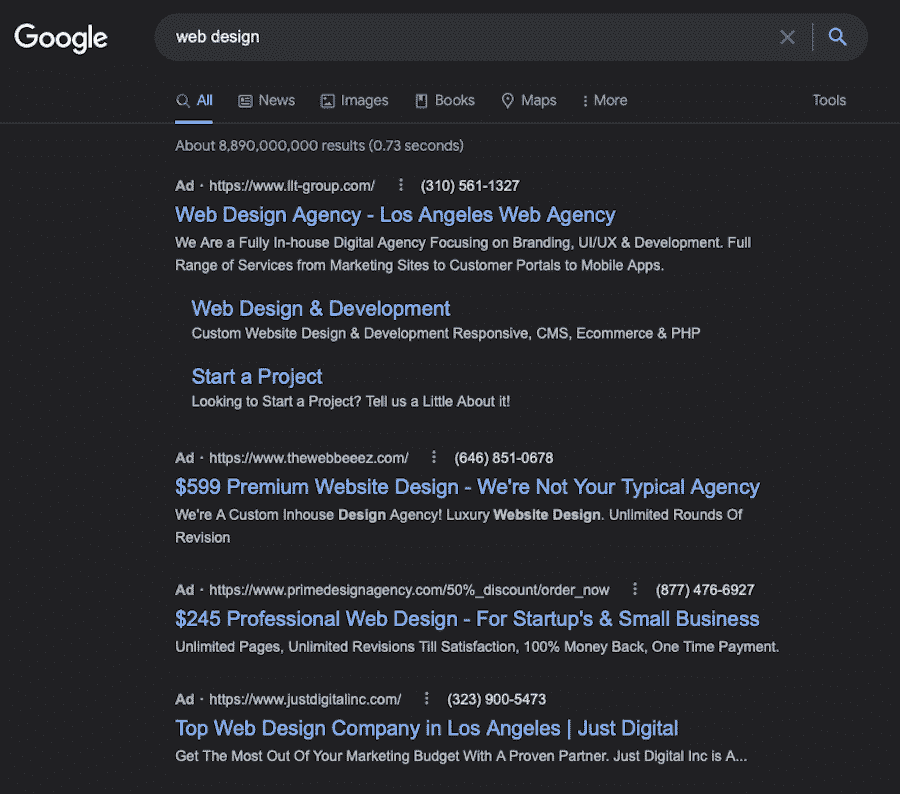
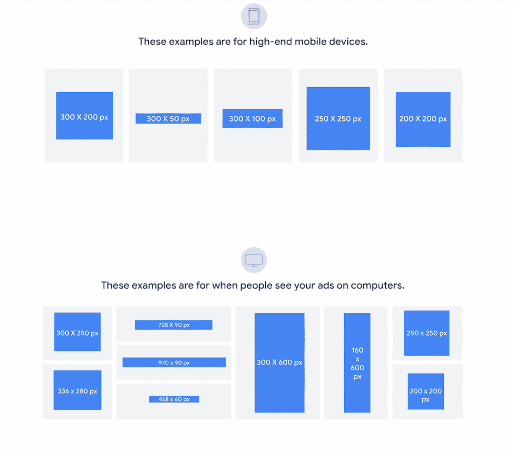

# 谷歌广告与 AdSense:功能概述和比较

> 原文：<https://kinsta.com/blog/google-ads-vs-adsense/>

甚至仅仅听到谷歌广告和 AdSense 的对比也会让人困惑。毕竟，它们都是谷歌服务。两者都有相似的名字。两者都与广告有关。

但是它们到底是什么，是什么让它们与众不同？理论上，很容易将它们混淆。即使你有应用程序、数据库和托管的 WordPress 主机，就像我们在 [Kinsta](https://kinsta.com/plans/) 这里提供的，你仍然需要弄清楚如何自己使用这些平台。

为了消除混淆，我们将定义 Google Ads 和 Google AdSense，对这些广告平台的功能进行直接比较，并讨论它们的用途和工作原理。

我们开始吧！

 [What sets these two (on the surface, very similar) Google services apart? 👀 Dive in here ⬇️Click to Tweet](https://twitter.com/intent/tweet?url=https%3A%2F%2Fkinsta.com%2Fblog%2Fgoogle-ads-vs-adsense%2F&via=kinsta&text=What+sets+these+two+%28on+the+surface%2C+very+similar%29+Google+services+apart%3F+%F0%9F%91%80+Dive+in+here+%E2%AC%87%EF%B8%8F&hashtags=AdSense%2CMarketingTips)

## 什么是谷歌广告？

Google Ads homepage

Google Ads(以前称为 [Google AdWords](https://kinsta.com/blog/how-to-use-google-adwords/) )是一项服务，广告主可以出价在搜索引擎结果页面(SERPs)或 Google Display Network (GDN)上投放广告，以推动流量回到他们的网站。
 根据 [W3Techs](https://w3techs.com/technologies/details/ad-google) 的数据，98.4%属于某个已知广告网络的网站使用谷歌广告，占*所有*网站的 46.1%。

> 需要在这里大声喊出来。Kinsta 太神奇了，我用它做我的个人网站。支持是迅速和杰出的，他们的服务器是 WordPress 最快的。
> 
> <footer class="wp-block-kinsta-client-quote__footer">
> 
> 
> 
> <cite class="wp-block-kinsta-client-quote__cite">Phillip Stemann</cite></footer>

[View plans](https://kinsta.com/plans/)

SERPs 中的广告是基于文本的，通常出现在谷歌关键词的主要搜索结果之上。例如，我们搜索短语“网页设计”，搜索结果中出现了以下谷歌广告:

How Google Ads appear in SERPs

相比之下，GDN 的广告位置出现在网站、应用程序以及谷歌展示广告出现的任何地方。

### 信息

对于广告商和那些开展数字营销活动的人来说，它之所以是一个有吸引力的选择，是因为它可以在最佳时间向极具针对性的潜在客户展示你的广告。

此外，展示广告活动覆盖了 3500 万个网站、应用程序和 YouTube 等谷歌资产。

这些广告可以帮助你找到新客户，或者通过发掘新的受众群来吸引现有客户。该系统旨在[通过自动定位过程鼓励更多的点击](https://kinsta.com/blog/click-through-rate/)和转化。

自动定位找到表现良好的受众群体，并在系统认为他们处于销售漏斗的正确阶段时向他们投放广告。您还可以设定各种目标，包括:

*   促进销售
*   增加销售线索
*   增加网站流量
*   建立品牌意识

该系统依靠机器学习来提供更好的活动结果。

此外，自动竞价会调整在 GDN 中显示的广告的竞价，以保持在您预先确定的预算内，并最大限度地提高您的转化率。

## 什么是 Google AdSense？

网站所有者可以使用 AdSense 帐户在他们的网站、应用程序和其他空间上放置广告。您可以将网站上的特定区域或网页指定为广告空间。

出版商通过广告空间和展示 AdSense 广告获得佣金。这与我们之前讨论的谷歌广告直接相关:网站所有者和出版商也是谷歌展示网络的一部分。因此，广告商在谷歌广告中竞价的正是出版商网站上的这些位置。

Google AdSense 计划是博客作者从他们的网站赚钱的最主要方式之一，通常与 T2 的联盟营销活动一起使用，以使收入来源多样化。

发行商可以选择多种广告活动显示方式。让我们来看看一些最受欢迎的选项，以及出版商网站上可用的众多[类型的广告](https://kinsta.com/blog/adsense-alternatives/):

## 注册订阅时事通讯

### 想知道我们是怎么让流量增长超过 1000%的吗？

加入 20，000 多名获得我们每周时事通讯和内部消息的人的行列吧！

[Subscribe Now](#newsletter)

*   展示广告
*   视频广告
*   游戏广告
*   匹配内容的原生广告
*   植入式原生广告
*   文章内原生广告

定制更进一步。一旦你选择了广告类型，你也可以选择广告尺寸。谷歌建议在大多数情况下使用一些固定的广告尺寸，因为它们预先配置得最好看。

Fixed ad size options in Google AdSense

桌面最常见的选项包括:

*   300 x 250 像素
*   336 x 280 像素
*   728 x 90 像素
*   970 x 90 像素
*   468 x 60 像素
*   300 x 600 像素
*   160 x 600 像素
*   250 x 250 像素
*   200 x 200 像素

[移动设备](https://kinsta.com/blog/google-mobile-first-index/)的尺寸通常包括:

*   300 x 200 像素
*   300 x 50 像素
*   300 x 100 像素
*   250 x 250 像素
*   200 x 200 像素

你也可以选择使用响应式广告，这种广告会自动调整大小以适应网站上分配的空间。
T3】

## 谷歌广告 vs AdSense

Google Ads 和 AdSense 的主要区别在于，Google Ads 允许广告商投标在出版商网站上投放广告，出价最高的投标人将赢得该位置，而 AdSense 则允许出版商在自己的网站和应用上指定广告位置，以换取佣金。

Struggling with downtime and WordPress problems? Kinsta is the hosting solution designed to save you time! [Check out our features](https://kinsta.com/features/)

让我们来看看谷歌广告和 AdSense 相比还有哪些值得注意的区别。

### 他们的目的

首先，让我们看看这些平台的主要用途:

*   你可以使用**谷歌广告**将流量从谷歌 SERPs 或 GDN 推回你的网站。
*   相比之下，你可以通过成为 GDN 的发布合作伙伴，使用谷歌广告来增加其他网站的流量。

### 为什么网站所有者使用它们

现在让我们看看网站所有者为什么使用这些平台:

*   网站所有者将**谷歌广告**作为在线广告的一种重要形式，并作为他们[搜索引擎优化](https://kinsta.com/blog/what-does-seo-stand-for/)努力的补充。
*   网站所有者使用**谷歌广告**从他们的[现有内容](https://kinsta.com/blog/wordpress-seo/)中产生另一种收入流。

### 灵活性和局限性

在我们下一个 Google Ads 和 AdSense 的比较中，让我们看看它们在哪些地方给用户提供了更大的控制权，在哪些地方控制得更紧。

*   谷歌广告为广告文本提供了极大的灵活性，但对广告在出版商网站上的显示方式有所限制。你在谷歌和 GDN 上一次只能投放一个广告。
*   Google AdSense 不能控制广告中出现的文本，但可以完全控制广告的大小和它们出现在你网站上的位置——以及通过 WordPress 的 [AdSense 插件](https://kinsta.com/blog/how-to-add-google-adsense-to-wordpress/)和通用的[广告插件](https://kinsta.com/blog/wordpress-advertising-plugin/)提供的众多集成选项。

如果你直接在 [MyKinsta](https://my.kinsta.com/login) 中使用其他谷歌产品，如 [Analytics](https://kinsta.com/blog/how-to-use-google-analytics/) ，添加 AdSense 也很容易。此外，你应该考虑使用性能监控工具，如 [Kinsta APM 工具](https://kinsta.com/apm-tool/)，以确保添加的广告不会降低你网站的速度。

### 定价

现在，是谷歌广告和 AdSense 的最后一次面对面的比较:两者的相关成本。也就是潜在花出去的钱和赚到的钱。

*   有了谷歌广告，每当有人点击出现在 SERPs 或 GDN 上的你的广告，你就要支付一笔费用。你为每次点击花费的金额被称为每次点击成本(CPC)。价格由多种方式决定，包括出价金额、广告目前与竞争对手相比的排名以及广告的总体质量分数。这就是为什么具有高度竞争关键词的高度竞争的利基市场比竞争不那么激烈的选择有更高的点击费。而且，有了谷歌广告，你直接什么也赚不到。然而，你的网站通过广告点击获得的提升可以带来新的顾客或客户。确保这些点击到达适当的目标受众是关键。否则，支付 CPC 就相当于把钱扔进下水道。
*   有了 **Google AdSense** ，你根本不用花钱。它是完全免费的，因为你为广告商提供了广告空间来推广他们的产品和服务。Google AdSense 可以让你从网站或应用程序上出现的广告的每次点击中赚取佣金。你也可以收到广告展示的佣金。

[Ready to learn once and for all how to use these marketing tools for your business? 📈 Get started here ✅Click to Tweet](https://twitter.com/intent/tweet?url=https%3A%2F%2Fkinsta.com%2Fblog%2Fgoogle-ads-vs-adsense%2F&via=kinsta&text=Ready+to+learn+once+and+for+all+how+to+use+these+marketing+tools+for+your+business%3F+%F0%9F%93%88+Get+started+here+%E2%9C%85&hashtags=AdSense%2CMarketingTips)

## 摘要

我们希望 Google Ads 和 AdSense 之间的比较能让你对这个问题有所了解，并澄清任何关于这些平台之间差异的误解。概括一下，Google Ads 是给广告商的，Google AdSense 是给出版商的。

差不多就是这样！你可以利用这两种方式来推广你的网站，并带来额外的收入。

你可以将你所学到的应用到你的网站上。我们的[应用托管](https://kinsta.com/application-hosting/)、[数据库托管](https://kinsta.com/database-hosting/)和[托管 WordPress 托管](https://kinsta.com/wordpress-hosting/)计划减轻了网站维护的压力，因此您可以专注于业务的大局。

* * *

让你所有的[应用程序](https://kinsta.com/application-hosting/)、[数据库](https://kinsta.com/database-hosting/)和 [WordPress 网站](https://kinsta.com/wordpress-hosting/)在线并在一个屋檐下。我们功能丰富的高性能云平台包括:

*   在 MyKinsta 仪表盘中轻松设置和管理
*   24/7 专家支持
*   最好的谷歌云平台硬件和网络，由 Kubernetes 提供最大的可扩展性
*   面向速度和安全性的企业级 Cloudflare 集成
*   全球受众覆盖全球多达 35 个数据中心和 275 多个 pop

在第一个月使用托管的[应用程序或托管](https://kinsta.com/application-hosting/)的[数据库，您可以享受 20 美元的优惠，亲自测试一下。探索我们的](https://kinsta.com/database-hosting/)[计划](https://kinsta.com/plans/)或[与销售人员交谈](https://kinsta.com/contact-us/)以找到最适合您的方式。