# 2022 年 32 个最佳博客主题

> 原文：<https://kinsta.com/blog/best-wordpress-themes-for-blogs/>

所以你想[创建一个新的博客](https://kinsta.com/blog/blog-name-ideas/)？或者至少，给你现在的这个改头换面？使用 WordPress 可以非常容易地找到一个主题来快速发布一个看起来不错的网站。

然而，找到拥有你想要的所有特性的博客主题有点困难。或者符合你预算的主题。此外，很难找到一个符合你品牌审美的主题，或者从竞争中脱颖而出的主题。

这就是为什么我们今天拨出时间进行研究，为博客寻找 30 多个不同的 WordPress 主题。该系列适合各种风格、业务类型和预算。

但在我们深入完整的列表之前，让我们首先讨论一些因素，包括在高质量的主题中寻找什么以及期望什么样的定价。

## 如何为博客挑选最好的主题

当你看一下我们在这里整理的 [WordPress 主题](https://kinsta.com/knowledgebase/what-is-a-wordpress-theme/)时，最好记住以下因素:

> Kinsta 把我宠坏了，所以我现在要求每个供应商都提供这样的服务。我们还试图通过我们的 SaaS 工具支持达到这一水平。
> 
> <footer class="wp-block-kinsta-client-quote__footer">
> 
> 
> 
> <cite class="wp-block-kinsta-client-quote__cite">Suganthan Mohanadasan from @Suganthanmn</cite></footer>

[View plans](https://kinsta.com/plans/)

*   **定价。**如果一个主题的价格超出了你的预算，那它显然不会成为你的选择。在你开始寻找之前，要清楚你能在一个主题上花多少钱。这也有助于防止失望。
*   **质量。**你应该一直关注那些被广泛评论的主题，这些主题承载了高质量产品的所有营销活动。也就是说，寻找那些提供完整文档、干净代码、[速度优化](https://kinsta.com/blog/how-to-choose-a-wordpress-theme/)，并且对 SEO 友好的主题。
*   **简约**。如果你主要想用 WordPress 写博客，你不需要太多的附加功能。一个简单明了的主题通常是最好的。
*   **兼容性。**你肯定想选择一个与[WordPress](https://kinsta.com/knowledgebase/check-wordpress-version/)最新版本兼容的主题。如果你想使用古腾堡，确保它是一个有效利用区块的主题。
*   **捆绑功能。**如果你在市场上寻找额外的功能，寻找一个提供插件的主题，或者在主题选项面板中包含你正在寻找的功能。一些例子包括像[联系表单](https://kinsta.com/blog/wordpress-contact-form-plugins/)，行动号召按钮，滑块，图库和[页面生成器](https://kinsta.com/blog/wordpress-page-builders/)。

[So you want to create a new blog? 👩‍💻 The quest for the perfect theme starts here ⬇️Click to Tweet](https://twitter.com/intent/tweet?url=https%3A%2F%2Fkinsta.com%2Fblog%2Fbest-wordpress-themes-for-blogs%2F&via=kinsta&text=So+you+want+to+create+a+new+blog%3F+%F0%9F%91%A9%E2%80%8D%F0%9F%92%BB+The+quest+for+the+perfect+theme+starts+here+%E2%AC%87%EF%B8%8F&hashtags=WordPress%2CBlogger)

### 你应该为 WordPress 主题付费吗？

有成千上万的 WordPress 主题可供各种类型的博客作者使用。那么什么时候你应该为一个主题掏钱呢？什么时候坚持免费期权会更好？我们来简单分解一下区别。

*   免费主题不需要任何成本，但也没有质量或持续更新的承诺。然而，对于那些只是想建立一个博客，并且没有商业或盈利目标的人来说，他们可能是一个不错的选择。
*   高级主题更有可能保证支持、质量和持续更新，因为你已经付费了。然而，这种选择最好留给那些有钱或有预算的人。

将托管纳入你的预算也很重要。你肯定会想投资像 Kinsta 这样的[高质量主机选项](https://kinsta.com/wordpress-hosting/)，它以合理的价格提供[速度优化的主机](https://kinsta.com/blog/boosting-wordpress-performance/)。如果您的网站目前托管在其他地方，我们还提供[免费迁移](https://kinsta.com/knowledgebase/wordpress-migrations/),或者带您完成[自己动手的方法](https://kinsta.com/blog/migrate-wordpress-site/),并在您需要时随时提供全面的 [24//7/365 支持](https://kinsta.com/kinsta-support/)。

如果你希望你的网站获得可观的流量，投资 CDN 也是一个好主意。使用内容交付网络意味着网站访问者可以更快地加载您的网站，并且可以极大地改善用户体验。如果你想让人们一次又一次地回到你的博客，这是必须的。

再加上这一点，[托管 WordPress hosting](https://kinsta.com/blog/managed-wordpress-hosting/) 通常是那些缺乏时间或技能来自己维护网站的人的最佳选择。托管主机意味着您的高流量博客将得到性能优化和持续更新、备份和支持。

## 2022 年 32 个最佳博客主题

现在我们已经到了你要去的地方。这是我们为 2022 年的博客选择的 32 个最好的 WordPress 主题。我们将列表分为两类:[免费和高级](https://kinsta.com/blog/wordpress-free-vs-paid-themes/)以方便您浏览选项。当然，至少有一个能满足你的需求。

## 免费博客主题

这里有 19 个值得一看的免费博客主题。

### 1.晨光

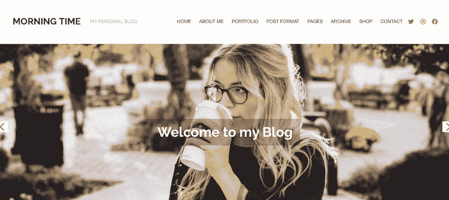

Morning Time Lite

我们列表中的第一个是 [MorningTime Lite](https://pcm.wordpress.org/themes/morningtime-lite/) 主题，它为个人博客提供了一个简单而现代的设计。这使得创建一个看起来很棒、运行良好并且不会让你负担过多细节的博客变得超级容易。

如果你想建立一个网站来记录你的日常生活，分享关于某个爱好的信息，或者提供一个简单的新闻源，这个主题将是一个很好的选择。

**显著特征**

*   支撑[画廊支柱](https://kinsta.com/blog/wordpress-photo-gallery-plugins/)
*   3 个菜单位置选项
*   干净的代码
*   最小设计

### 2.加丰克尔

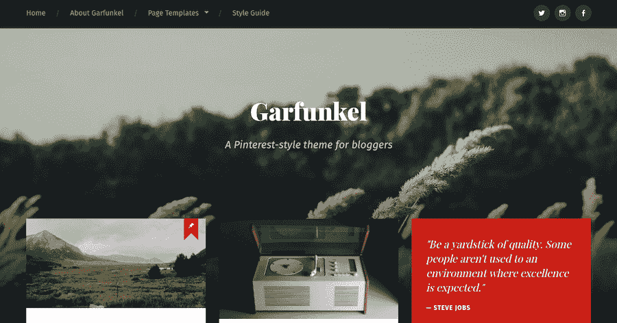

Garfunkel

博客的下一个最佳 WordPress 主题是 [Garfunkel](https://wordpress.org/themes/garfunkel/) ，它提供了一个时尚的视觉导向的设计，肯定会服务于那些在博客中突出使用照片、插图或其他视觉元素的人。这个主题反应迅速，有一种 [Pinterest](https://kinsta.com/blog/pinterest-marketing/) 的风格，能立即吸引网站访问者。

我们很容易看到这个主题被用于摄影博客、[旅游博客](https://kinsta.com/blog/how-to-start-a-travel-blog/)或时尚博客。如果你想在其中加入一个食谱插件，它甚至可以作为一个美食博客。

**显著特征**

*   砖石布局
*   6 种帖子格式
*   块编辑器支持
*   各种小部件
*   全角页面模板
*   支持无限滚动

### 3.赫斯缇雅

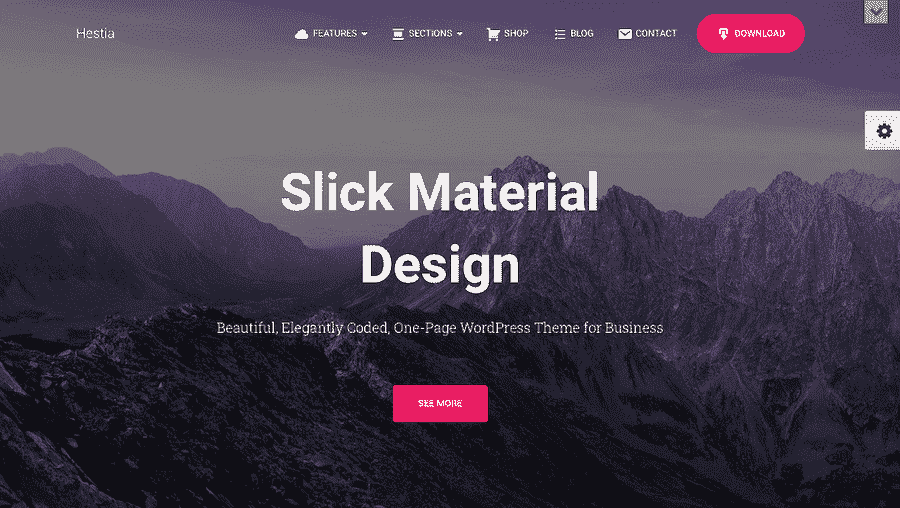

Hestia

另一个值得考虑的奇妙的免费博客主题是赫斯缇雅。这个主题的特点是一个单页设计，可以吸引访问者快速进入你的博客或网站的故事。它还针对性能进行了优化，因此您永远不需要担心网站速度或整体用户体验。

这个 WordPress 主题有一个材料设计和简单的定制选项，你可以通过定制器直接访问。除了写博客，你还可以用这个主题来建立一个网上商店、一个公司投资组合等等。

**显著特征**

*   古腾堡-就绪
*   兼容顶级页面构建器，包括 [Elementor](https://kinsta.com/blog/wordpress-elementor/) 、WPBakery、Divi Builder、Beaver Builder、Brizy 和 SiteOrigin。
*   网络商务整合
*   包括入门网站

### 4.纳马哈

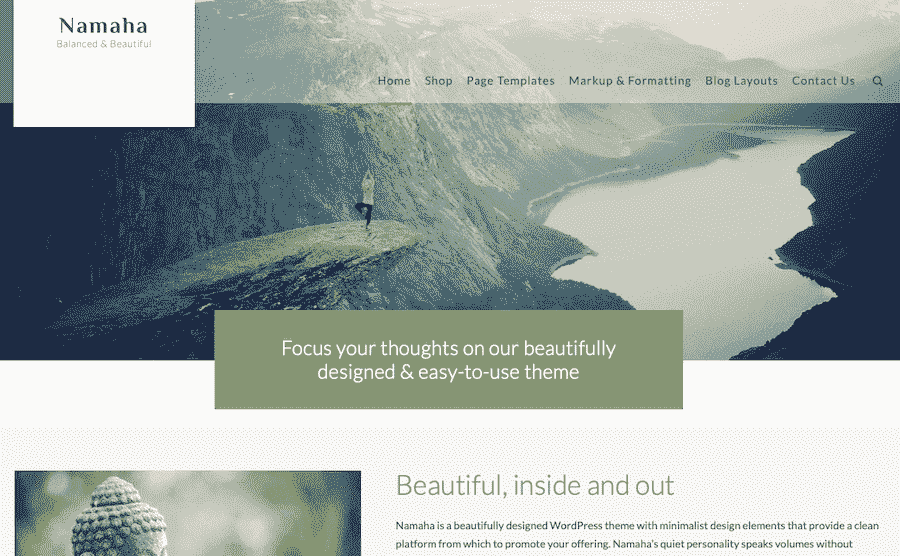

Namaha

如果你想要更简单的东西，Namaha WordPress 主题也是一个很好的选择。设计无疑是简单的，但有时这恰恰是你需要传达的信息。

虽然这里强调的是博客的特点，如多种帖子格式和可爱的排版，这个主题也可以用来建立一个在线商店或组合网站。

**显著特征**

*   响应式设计
*   包含的演示内容
*   woo 商务兼容性
*   提供高级版本

### 5.作者

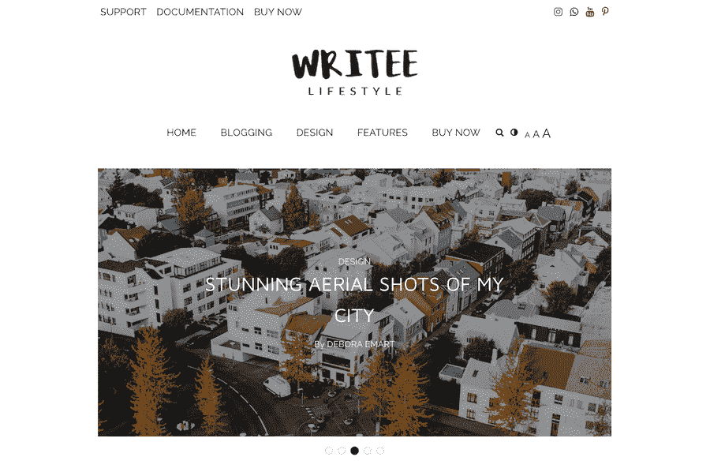

Writee

另一个选择是 Writee WordPress 主题，它提供了一个优雅的设计，适合所有类型的博客。它可以定制以适应任何主题，并提供了几个布局选项，用于构建食品、时尚、旅游和个人领域的博客。

您可以使用定制器进行各种各样的调整，这对于初学者来说也是一个不错的主题选择。

**显著特征**

*   多种定制选项
*   3 [自定义部件](https://kinsta.com/blog/wordpress-widgets/)
*   全宽和盒装滑块
*   翻译就绪

### 6.滴滴 Lite

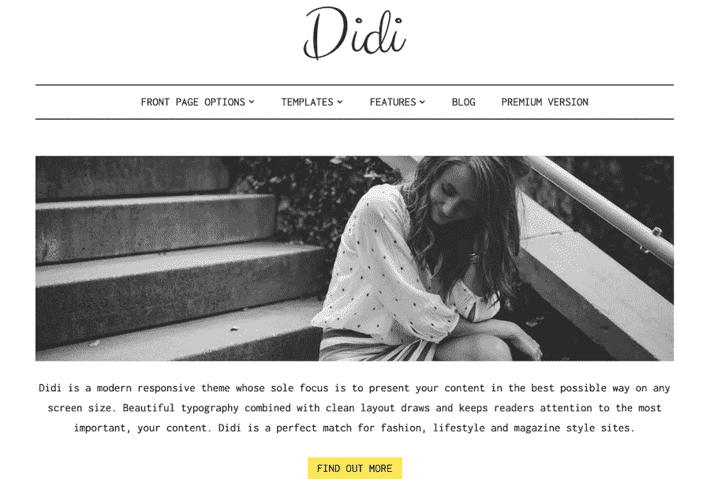

Didi Lite

如果你正在寻找一个最适合个人博客或日志的主题，Didi Lite WordPress 主题可能是你的一个好选择。它强调用大量的空白空间和突出的照片空间排版。是讲故事的理想选择。

它还为在任何设备上使用进行了优化，并提供了最小化的体验，而不会感觉或看起来无聊。Didi Lite 将是生活方式或时尚博客以及个人日志的不错选择。

**显著特征**

*   响应式设计和布局
*   实时定制支持
*   演示内容导入程序
*   可访问性就绪
*   支持 RTL

### 7.阿希

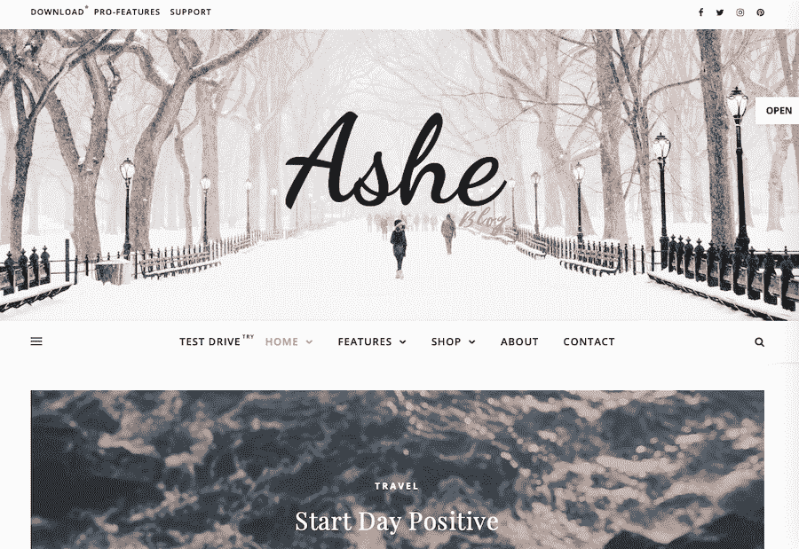

Ashe

博客可以考虑的另一个最好的 WordPress 主题叫做 [Ashe](https://wordpress.org/themes/ashe/) ，它提供了一套不错的功能，可以帮助你快速建立并运行一个博客网站。它提供了一个简约而现代的设计，可以很容易地适用于任何利基市场，包括专注于美食、旅游、[摄影](https://kinsta.com/blog/photography-website/)、生活方式或个人日志的博客。

它的设计是响应性的，这是目前的标准，并提供了几个定制选项来直接吸引你的观众。

**显著特征**

*   速度优化
*   兼容顶级插件和页面构建器，包括 Elementor、 [WPBakery](https://kinsta.com/blog/elementor-alternative/) 、Beaver Builder 和 Divi。
*   RTL 支持
*   文本和图像徽标支持
*   全屏滑块
*   Instagram 滑块小部件。

### 8.戴尔的笔记本电脑品牌

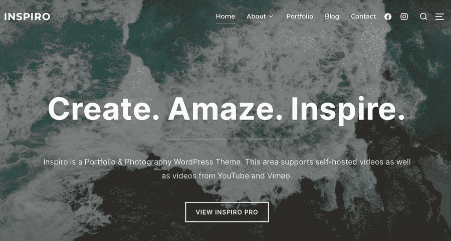

Inspiro

Inspiro 博客 WordPress 主题是另一个现代选择，提供更专业的风格，可用于个人和企业。它的整体设计是轻量级的，但它为在博客帖子和作品集风格的页面上展示照片和视频提供了大量的机会。

这里的特性集令人印象深刻，尤其是对于一个免费的主题。

**显著特征**

*   全屏区域，支持 [YouTube](https://kinsta.com/blog/how-to-create-a-youtube-channel/) 、Vimeo 和自托管视频背景。
*   页面生成器集成，支持 Elementor 和 Beaver Builder。
*   支持摄影和视频组合。
*   woo 商务兼容性

### 9.奥尔森灯

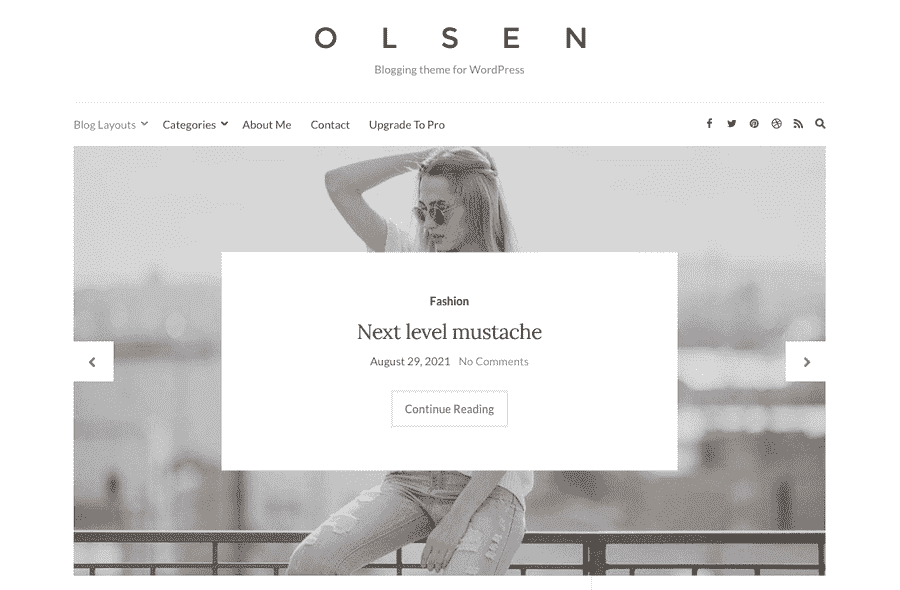

Olsen Light

如果你正在寻找一个优先考虑速度的快速主题，T2 主题是一个不错的选择。这个主题适用于众多领域的博客，包括烹饪、生活方式、时尚、旅游、婚礼和健康&健身。它也可以被摄影师甚至爱好博客作者使用。

Olsen Light 是轻量级的，易于设置，并支持各种定制，包括列布局、摘录和徽标。

**显著特征**

*   多作者支持
*   完整文档
*   反应灵敏的视网膜就绪设计
*   主页[滑块](https://kinsta.com/blog/wordpress-slider/)
*   页脚 Instagram 转盘
*   与包括 Elementor、Brizy、Beaver Builder 和 Divi 在内的顶级页面生成器兼容

### 10.应答的

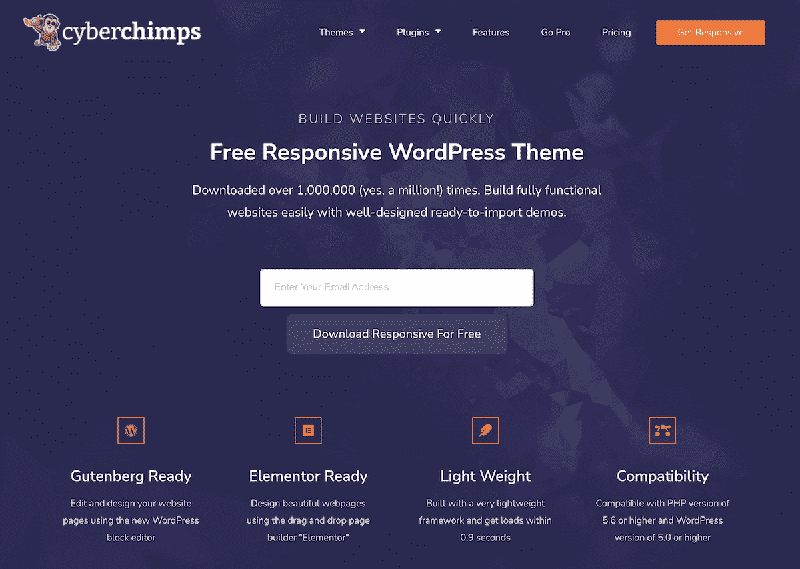

Responsive

响应式主题是一个快速、轻量级、完全可定制的主题，包括 100 多个响应式启动模板。它兼容所有领先的 WordPress 插件，如 Elementor、WooCommerce、form 插件等等。

GTMetrix 得分高达 96 分，您的网站将[立即加载，](https://kinsta.com/blog/fastest-wordpress-theme/)帮助您的客户获得更好的用户体验。Responsive 是一个 SEO 友好的主题，它为您提供了大量的个人页面来满足您的所有业务需求

**显著特征**

*   大型菜单
*   一键式模板导入器
*   网格视图
*   WPML 准备好了

### 11.便当

Bento

便当 WordPress 主题是另一个简单易用的快速有效建立博客的选择。虽然它可以用来写博客，但它也有一些功能可以用来建立一个成熟的商业网站。

这个速度优化的主题提供了广泛的定制选项，利用定制器界面来增加便利性。它也有完整的搜索引擎优化，所以你用这个主题建立的任何网站都有更高的可能性出现在搜索引擎结果中。

**显著特征**

*   无限的颜色
*   500 多个矢量图标
*   [谷歌字体](https://kinsta.com/blog/best-google-fonts/)
*   WooCommerce 与模板、小部件和结账样式的集成
*   完整文档
*   附带一个儿童主题

### 12.彩色博客

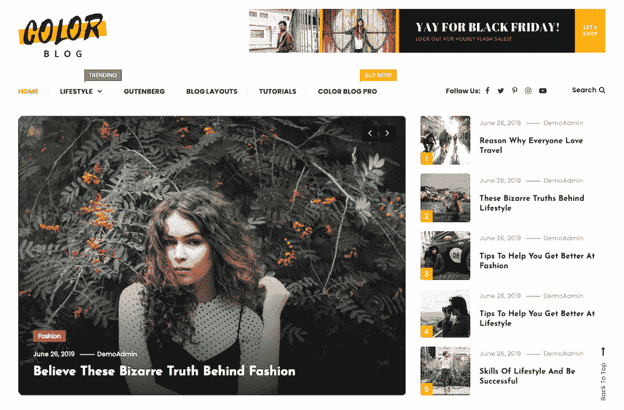

Color Blog

另一个值得你考虑的免费博客主题是[彩色博客](https://wordpress.org/themes/color-blog/)主题，顾名思义，这是一个超级多彩和引人注目的选择。对于想要吸引读者注意力(并保持下去)的博客作者和作者来说，这无疑是第一次。

这个主题通过实时定制器提供了许多定制选项。

**显著特征**

*   几个博客布局
*   翻译和 RTL 就绪
*   [古腾堡](https://kinsta.com/blog/gutenberg-wordpress-editor/)兼容
*   与元素或兼容
*   大量定制颜色选项

### 13.入迷

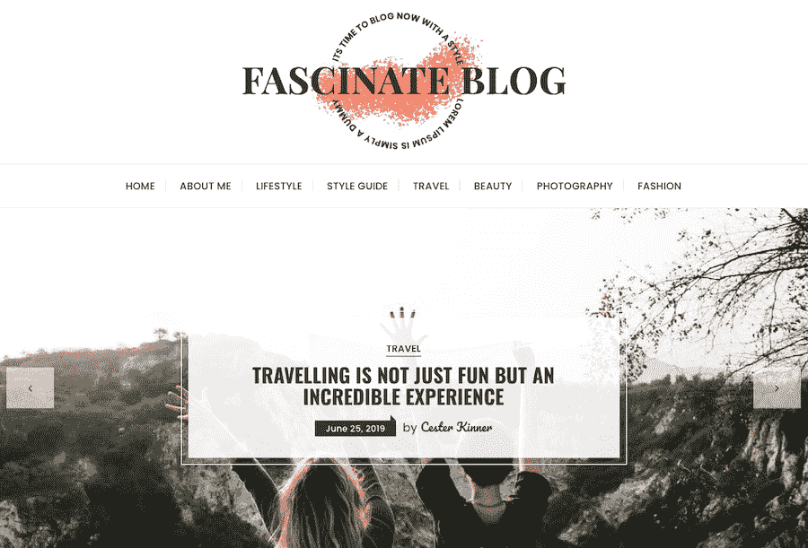

Fascinate

这是另一个主题选项，非常适合创建各种类型的利基博客。 [Fascinate](https://wordpress.org/themes/fascinate/) 采用现代设计，最小化布局，让您的内容位于前面和中心。用它来展示摄影、生活小贴士、旅游博客等等。

它还支持四种不同的帖子格式，所以你可以以一种风格化的方式自动分享你的内容。

**显著特征**

*   响应式布局和设计
*   古腾堡兼容性
*   实时定制选项
*   自定义作者小部件
*   图片[延迟加载](https://kinsta.com/blog/wordpress-5-7/)
*   支持众多插件，包括 Mailchimp、Yoast 和 Contact Form 7

### 14.流行

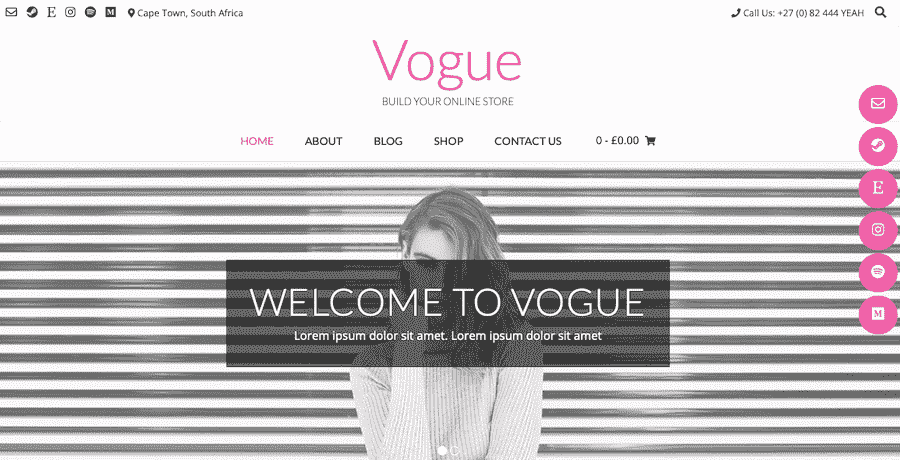

Vogue

如果你在寻找一个以时尚为导向的主题，Vogue 是一个显而易见的选择。这个免费的 WordPress 主题已经过搜索引擎优化，可以为你的下一个博客项目投入使用。

随着速度的优化，Vogue 提供了一个干净的设计，这将对时尚和生活方式的顽固分子说。

**显著特征**

*   网络商务整合
*   几个博客和页脚布局
*   一系列颜色设置
*   定制器中内置的定制设置
*   与顶部的[页面生成器](https://kinsta.com/blog/divi-vs-elementor/)兼容

### 15.轨道

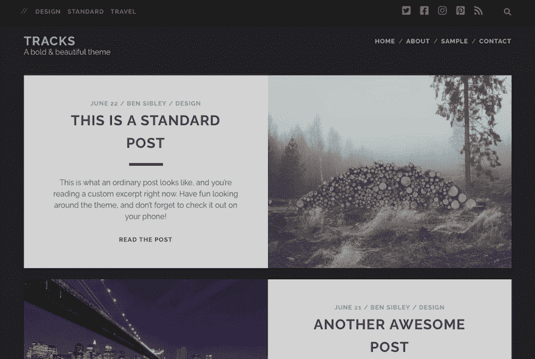

Tracks

WordPress 主题为你的博客建立一个新网站提供了另一个快速简单的选择，而不需要花一分钱。当然，对于个人博客来说，这是一个很好的选择，但也包括建立一个[电子商务商店](https://kinsta.com/blog/woocommerce-themes/)的功能。

这里的布局选项很吸引人，旨在吸引注意力——不管你博客的焦点是什么。

**显著特征**

*   极简设计和多种布局选项
*   woo 商务兼容性
*   古腾堡兼容性
*   50 多个社交媒体图标
*   [注释控件](https://kinsta.com/blog/wordpress-spam-comments/)

### 16.埃尔希

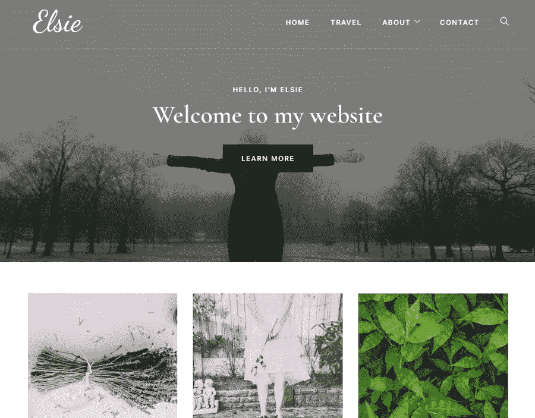

Elsie

无论你希望开始一个简单的在线日志还是一个更强大的摄影博客， [Elsie](https://wordpress.org/themes/elsie/) 都是满足这些需求的好主题。这个 WordPress 主题是超级可定制的，并且提供了一个优雅的设计，将会吸引不同人群。

它也是高度可定制的。

**显著特征**

*   响应式布局
*   全套定制选项
*   轻质设计
*   可定制的页眉、页脚和英雄部分
*   控制排版和颜色

### 17.麦克斯韦

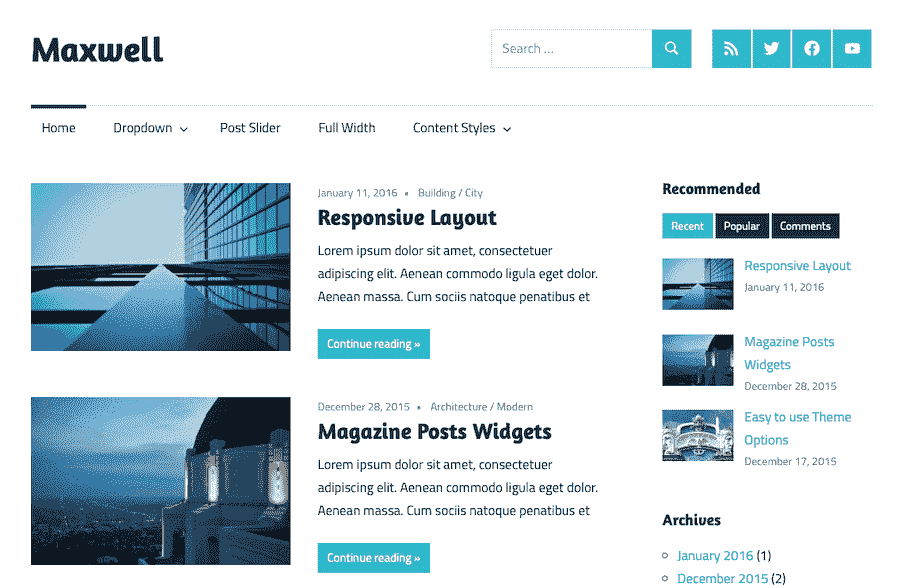

Maxwell

如果你喜欢极简主义，马克斯韦尔是一个很好的选择。这个 WordPress 主题提供了一个简单的设计，适用于任何主题的大多数个人博客。有了排版选项和多种文章布局，对于那些想要简单入门的人来说，这是一个很好的选择。

**显著特征**

## 注册订阅时事通讯

### 想知道我们是怎么让流量增长超过 1000%的吗？

加入 20，000 多名获得我们每周时事通讯和内部消息的人的行列吧！

[Subscribe Now](#newsletter)

*   响应式设计
*   为搜索引擎优化
*   针对高性能优化的速度
*   内置 [GDPR 合规](https://kinsta.com/blog/wordpress-gdpr-compliance/)

### 18.形状美观的

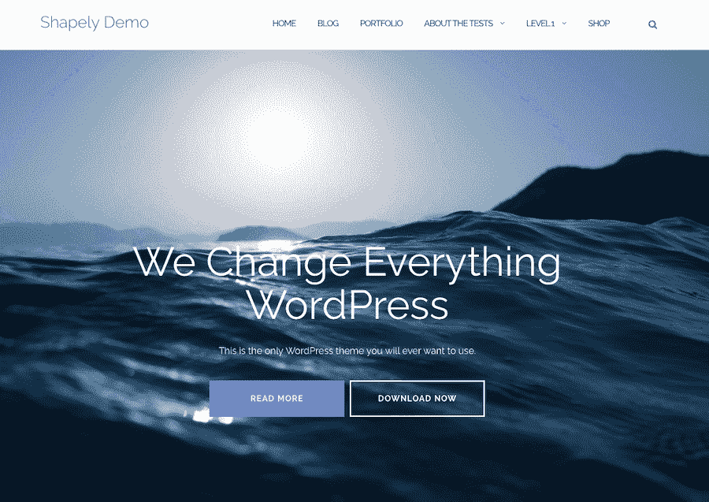

Shapely

身材匀称是另一个突出的 WordPress 主题，为各行各业的博主提供强大的功能。其多功能的单页设计使其成为投资组合和基于服务的网站的绝佳选择。但是它也可以用于专业地显示博客内容。

此外，由于包含了几个主页小部件，可以很容易地调整主页，以控制诸如推荐、产品信息和投资组合等内容。

**显著特征**

*   [WooCommerce 兼容性](https://kinsta.com/blog/woocommerce-tutorial/)
*   与顶级插件兼容，如 Kali Forms、Yoast 和 Gravity Forms
*   搜索引擎优化友好
*   移动优化
*   真正的多用途选项

### 19.羽衣甘蓝

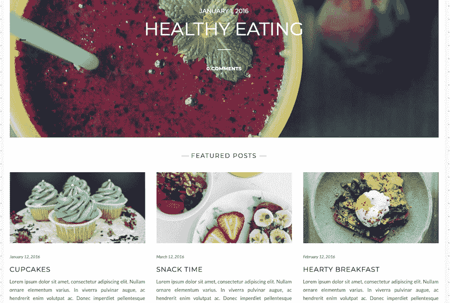

Kale

羽衣甘蓝是另一个美丽的博客主题，这一次它有一个令人惊叹的设计，非常适合美食博客和其他图片博客。生活方式、美容和时尚领域也会大量利用它。设计和布局包括大量的空白，看起来精致整洁，但它充满了内容，即文本和图像。

这个主题承诺简单的设置和全面的搜索引擎优化。

**显著特征**

*   网络商务整合
*   多种[职位类型](https://kinsta.com/blog/wordpress-custom-post-types/)和布局
*   社交媒体菜单
*   横幅和滑块覆盖选项
*   RTL 支持

## 高级博客主题

虽然免费的博客主题可以很好地为你服务，但可能会有你需要升级的时候。或者，至少，您需要一个提供更健壮的特性集、额外的支持或者两者结合的主题。

以下是几个我们认为可靠的顶级博客主题。

### 20.个人的

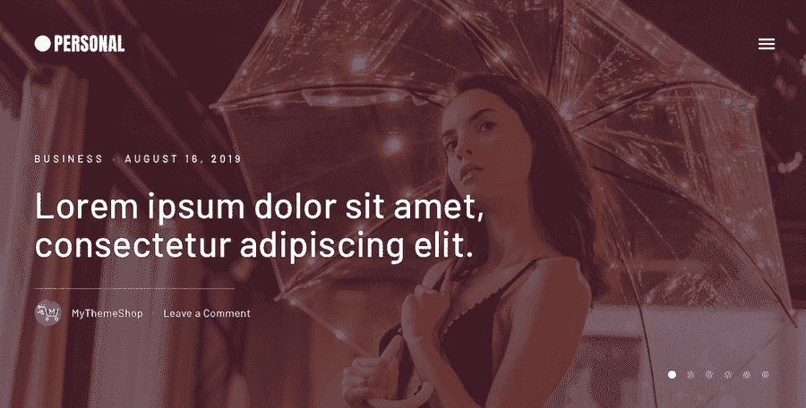

Personal

我们今天要讨论的第一个高级主题叫做[个人](https://mythemeshop.com/themes/personal/)。该主题由 MyThemeShop 开发，旨在讲述你的个人故事。这是一个绝佳的选择，可以用来创办一个需要传达你个性的杂志或博客。

这个主题不仅漂亮，而且还针对 SEO、速度和整体性能进行了彻底的优化。

**定价**

个人主题的无限制网站许可费用为 39 美元，其中包括 30 天的退款保证。

**显著特征**

*   4 个博客布局
*   2 页眉布局
*   内置特色滑块
*   选择加入订阅框
*   [站长](https://kinsta.com/blog/how-to-add-google-adsense-to-wordpress/)优化

### 21.丁盐

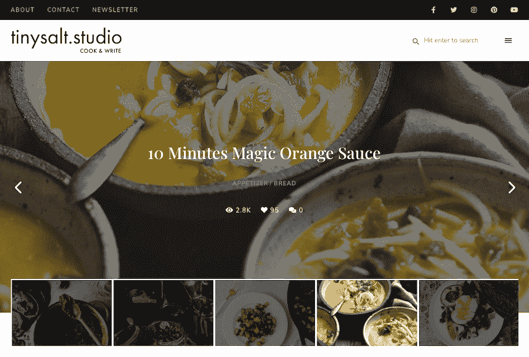

TinySalt

TinySalt 是 WordPress 的一个可爱的博客主题，是美食博客和食谱爱好者的理想选择。它提供了多种布局和样式来创建自定义外观。同样，它提供了与众多免费插件的兼容性，包括 [Mailchimp](https://kinsta.com/blog/mailchimp-for-wordpress/) 和 Contact Form 7。

你想做的任何定制都可以通过标准的 WordPress 定制器来实现，这减少了潜在的学习曲线。

**定价**

TinySalt 的常规站点许可费用为 54 美元，包括更新和 6 个月的支持。

**显著特征**

*   12 个演示，轻松一键导入
*   WP Recipe Maker 插件集成，使得用照片、步骤和食谱元数据呈现食谱变得容易。
*   包括一个即时 Ajax 食谱搜索与过滤。
*   完全古腾堡就绪
*   WooCommerce 兼容

### 22.纱织

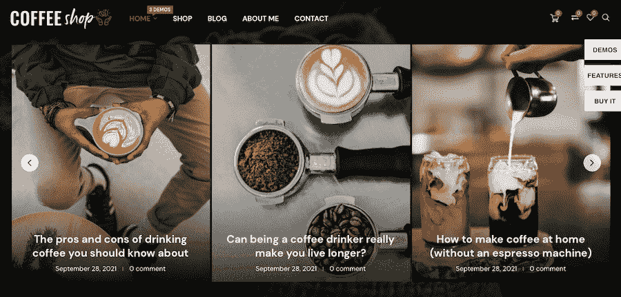

Soledad

我们将讨论的下一个高级博客主题是 [Soledad](https://themeforest.net/item/soledad-multiconcept-blogmagazine-wp-theme/12945398) ,这个主题充满了特性、演示和选项。它可以用于创建任何类型的网站，包括商业投资组合、在线商店或个人摄影收藏。

它包括对大菜单的支持，并包括一个[大菜单](https://kinsta.com/blog/wordpress-custom-menu/)生成器，因此您可以创建适合您特定需求的导航

**定价**

59 美元的常规网站许可，包括更新和 6 个月的支持。

**显著特征**

*   6800 多个主页演示
*   广泛兼容包括 WPBakery 和 Elementor 在内的 top page builder 插件
*   页眉和页脚生成器
*   大型菜单生成器
*   云模板库中的 1000 多个模板
*   电子商务兼容性
*   BBPress 和 [BuddyPress](https://kinsta.com/blog/buddypress-bbpress-glotpress-development-john-james-jacoby-started-campaign-fund-project/) 的兼容性
*   非常棒的画廊
*   WordPress 定制器包含 1500 多个选项

### 23.靛蓝

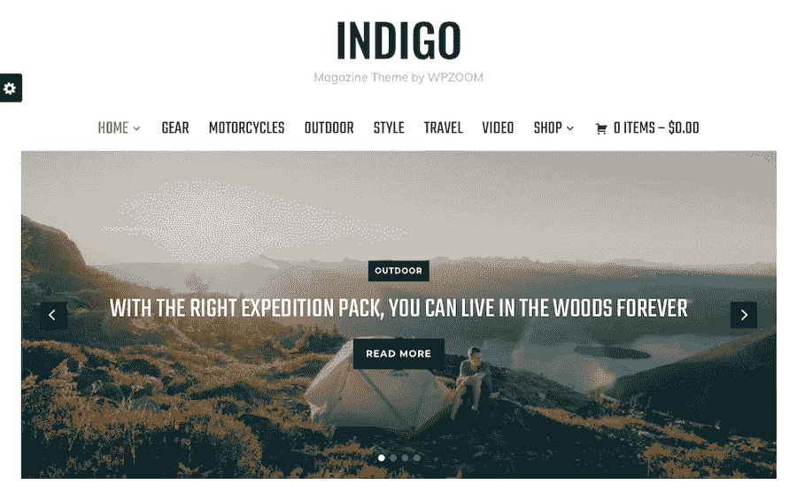

Indigo

现在，如果你正在寻找一个适合多作者杂志风格网站的博客主题，那么 [Indigo](https://www.wpzoom.com/themes/indigo/) 可能就是解决方案。这个主题易于设置和使用，并提供了一系列功能和布局，您可以使用它们为您的个人日志、在线杂志或业务创建一个强大的网站。

Struggling with downtime and WordPress problems? Kinsta is the hosting solution designed to save you time! [Check out our features](https://kinsta.com/features/)

Indigo 可以针对任何主题进行定制，并具有支持讨论时尚、食品、汽车、体育和美容等主题的博客的功能。

**定价**

起价为每年 59 美元，包括自动更新和一年的支持和更新。或者你也可以一次性支付 159 美元来永久使用这个主题，并获得终身更新和支持。

**显著特征**

*   高级主题选项面板
*   响应式设计和布局
*   依赖内置的定制程序来调整字体、颜色和样式
*   woo 商务支持
*   特色滑块支持
*   多个小部件区域
*   古腾堡-就绪
*   WPML 兼容和翻译就绪
*   SEO 友好的代码

### 24.记录

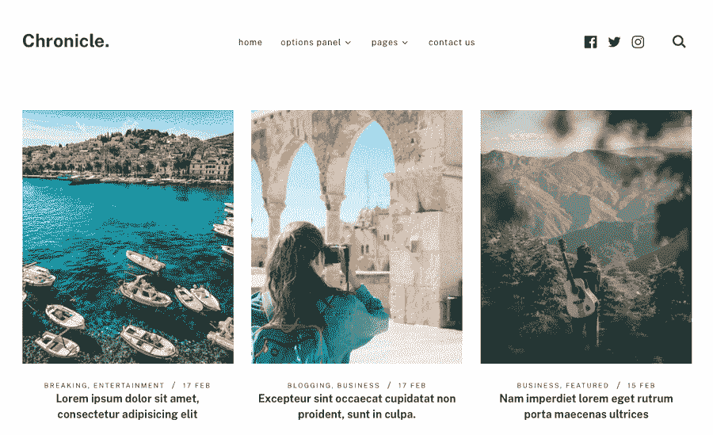

Chronicle

寻找一个简单的主题，使建立一个博客很容易？[编年史](https://mythemeshop.com/themes/chronicle/)博客主题是一个值得考虑的好主题。其简约的设计、简洁的布局和整体的简单性使其成为展示内容的绝佳选择——无论是基于文本的还是视觉的。

这个主题有一个[响应式设计](https://kinsta.com/blog/responsive-web-design/)，允许它在任何移动设备上看起来都很棒，并提供了一些布局选项，给你所需的创造性控制。

**定价**

你可以以每年 39 美元的价格购买 Chronicle。你可以用这个价格在无限的网站上使用这个主题，并获得更新和支持。或者，你可以以每年 199 美元的价格购买 MyThemeShop 的会员资格，这样就可以访问他们所有的主题和插件。

**显著特征**

*   2 页眉布局
*   3 个博客布局
*   SEO 友好的代码
*   速度优化
*   AdSense 就绪
*   用于调整颜色、背景和版式的高级主题选项面板
*   古腾堡-就绪
*   与元素或兼容

### 25.写作

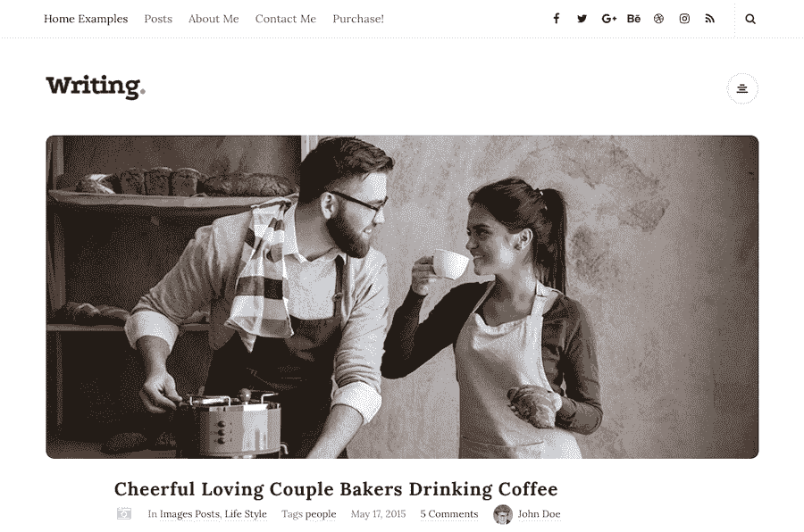

Writing

博客的另一个最好的 WordPress 主题是恰如其名的 [Writing WordPress 主题](https://themeforest.net/item/writing-blog-personal-blog/11547928)，它提供了一个超级简单的设计，将所有的重点放在你写的文字和你选择的任何照片上。

最重要的是，最小化的布局是浏览和通读的真正乐趣，使网站访问者更有可能再次访问。设置也很简单，使用这个主题，你可以在一个小时内轻松地创建一个新博客。

**定价**

ThemeForest 上的常规许可费为 49 美元，包括更新和 6 个月的完全支持。

**显著特征**

*   几种博客布局风格
*   稳固的社交媒体整合
*   清理[排版](https://kinsta.com/blog/best-fonts-for-email/)选项
*   SEO 优化的
*   无限的颜色
*   RTL 支持和翻译就绪

### 26.类型学

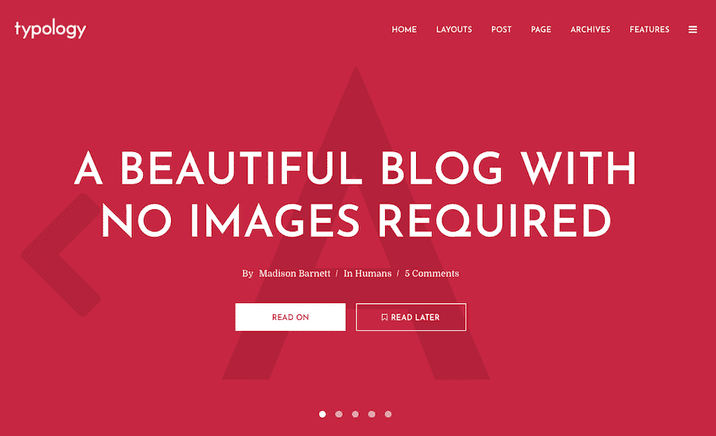

Typology

如果你感兴趣的只是单词、单词、单词，那么[类型学主题](https://themeforest.net/item/typology-text-based-minimal-wordpress-blog-theme/19547842)可能是最合适的。这个主题强调排版高于一切，并标榜自己是一个基于文本的博客主题，其中“不需要图像”

这个主题在这方面非常独特——它的设计看起来很棒，是一个时尚的选择，不需要图像来创造一个有凝聚力的外观。

**定价**

从 ThemeForest 获得一个常规的站点许可需要 59 美元，包括更新和 6 个月的支持。

**显著特征**

*   材料和平板设计选项
*   多帖子布局
*   对印刷元素的卓越控制
*   性能优化
*   兼容顶级插件，包括 Jetpack、Disqus、Mailchimp 等
*   woo 商务支持

### 27.优雅的

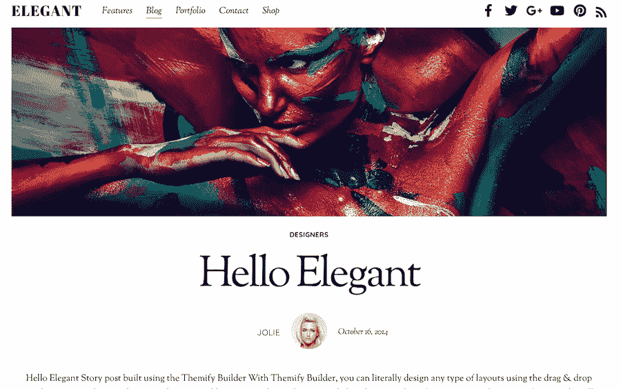

Elegant

另一个可以为很多人服务的选择是优雅的 WordPress 主题。这款相机设计简单，但相当复杂，提供了一个多用途的焦点，可以定制以适应任何行业或细分市场。

这个主题很好地结合了形式和功能，提供了一系列定制的功能，同时优先考虑吸引网站访问者注意力(并保持这种注意力)的美学。对于喜欢用图片和文字讲述故事的博主来说，这是一个理想的选择。对作品集和杂志来说也很棒。

**定价**

从 Themify 获得的优雅版售价为 59 美元，其中包括一个无限制的站点许可以及一年的支持和更新。或者你也可以支付 69 美元来获得相关的 Photoshop 文件。

**显著特征**

*   主题化拖放生成器
*   流畅而灵敏的设计
*   反应灵敏，视网膜就绪
*   多种多样的排版选项
*   预先设计的彩色皮肤
*   [WooCommerce](https://kinsta.com/blog/woocommerce-staging/) 兼容性
*   砌体/网格组合柱类型

### 28.专业美食家

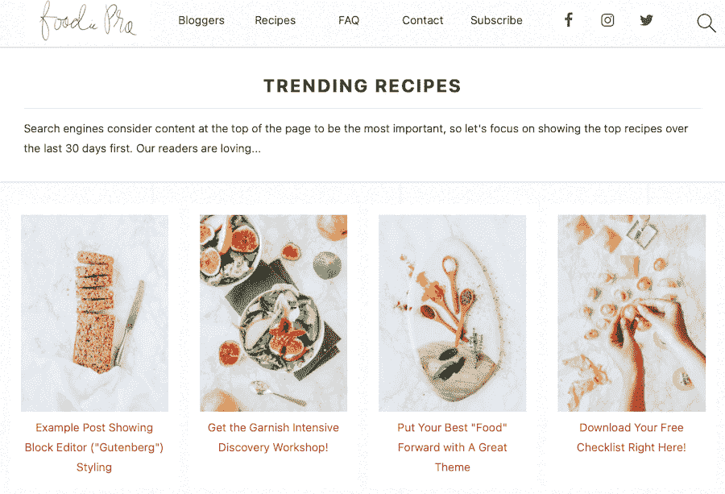

Foodie Pro

现在，如果你想创建一个关于食物的博客，特别是， [Foodie Pro](https://feastdesignco.com/product/foodie-pro/) 是一个很好的选择。这个主题实际上是一个创世纪[的儿童主题](https://kinsta.com/blog/change-wordpress-theme/)，它以极简风格为特色，可以根据你的需要定制。

它有丰富的颜色和排版选择——事实上，是无限的。然而，现在只有当你购买了盛宴插件才可以使用。

**定价**

当你以每年 249 美元的价格订阅盛宴插件时，你可以访问 Foodie Pro 主题(以及其他 5 个食谱博客主题)。Feast 插件在 WordPress 中提供了一个新的管理界面，有望更容易使用。

**显著特征**

*   支持小部件的主页和食谱页面
*   广告空间
*   [速度](https://kinsta.com/clients/pure-visibility/)和性能优化
*   包括演示内容
*   持续更新和支持
*   兼容块编辑器
*   SEO 优化

### 29.Akea

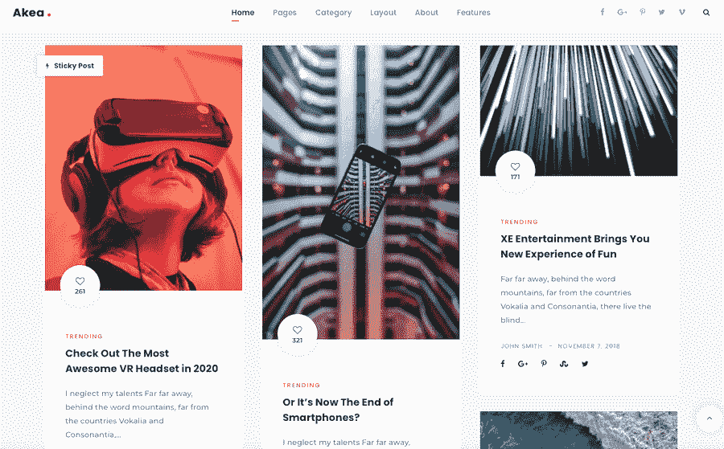

Akea

或者也许这个主题更符合你的风格？这一个提供了一个最小的设计，给你的内容足够的空间来呼吸，同时仍然是视觉上有趣的。

它可以定制成适合任何类型的博客，包括个人日志、生活博客、杂志、摄影作品集和旅游博客。这只是列举了一些可能性。它显然是为多作者支持而设计的，有粘性帖子、可见的“赞”和社交分享按钮，以及显著的特色图片。

**定价**

Akea 在 ThemeForest 的售价为 54 美元，包括更新和 6 个月的支持。

**显著特征**

*   古腾堡-就绪
*   内置 GoodLayers 页面生成器
*   woo 商务就绪
*   背景包装选项
*   强大的演示导入程序
*   流体布局
*   19 [割台选项](https://kinsta.com/blog/sticky-header/)
*   浮动和辅助导航选项
*   6 页脚布局

### 30.杰韦林

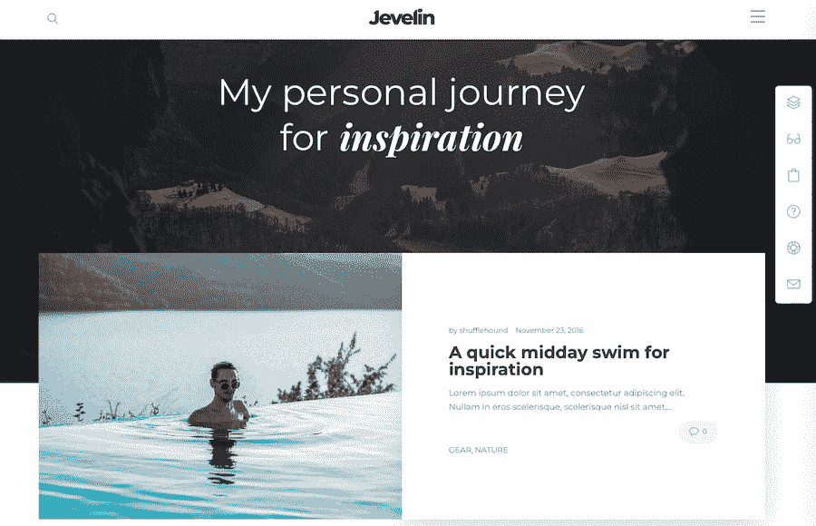

Jevelin

有时候你想从你的博客主题中得到更多，这没关系。当你在寻找更通用的东西时，这个主题是一个很好的选择。这个主题可以定制，以适用于广泛的网站和许多利基市场。每次的结果都会很专业。

事实上，它提供的设计选项可以很好地用于[登陆页面](https://kinsta.com/blog/wordpress-landing-page-plugins/)、在线商店、个人博客、文件夹等等。

**定价**

Jevelin 在 ThemeForest 上的售价为 59 美元，附带更新和 6 个月的支持。

**显著特征**

*   一键式演示导入器
*   附带大量预建的演示，适用于各种场合，包括婚礼、健身房、瑜伽馆、[作品集](https://kinsta.com/blog/wordpress-portfolio-plugins/)等等。
*   10 个投资组合选项
*   易于使用的主题选项面板
*   自定义配色方案、字体和布局
*   配有 Unyson 拖放页面生成器
*   包括滑块旋转插件
*   包括大型菜单和自定义部件
*   融入了社交分享功能

### 31.新鲜的

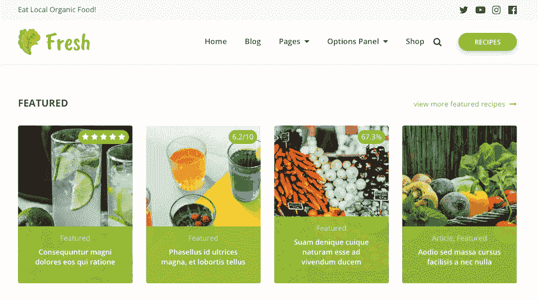

Fresh

全新的 WordPress 主题是创建博客、杂志或网上商店的绝佳选择。它功能丰富，但其真正的吸引力在于其华丽的美学。

这一主题立即引人注目，提供了优化的布局，并将形式和功能很好地结合在一起。它还响应迅速，并针对移动设备进行了优化，因此在任何设备上都很好看。使用这个主题创建一个食谱博客，工艺品商店，旅游评论网站，或任何其他可以从这个最小化设计中受益的东西。

**定价**

Fresh 可以从 MyThemeShop 以 49 美元的价格获得，其中包括一个无限制的站点许可证，

**显著特征**

*   拖放主页编辑器，有 7 个部分可以调整
*   3 页眉布局
*   SEO 优化
*   速度和性能优化
*   特色滑块
*   AdSense 优化
*   古腾堡和元素或兼容
*   包括一个高级主题选项面板

### 32.记忆

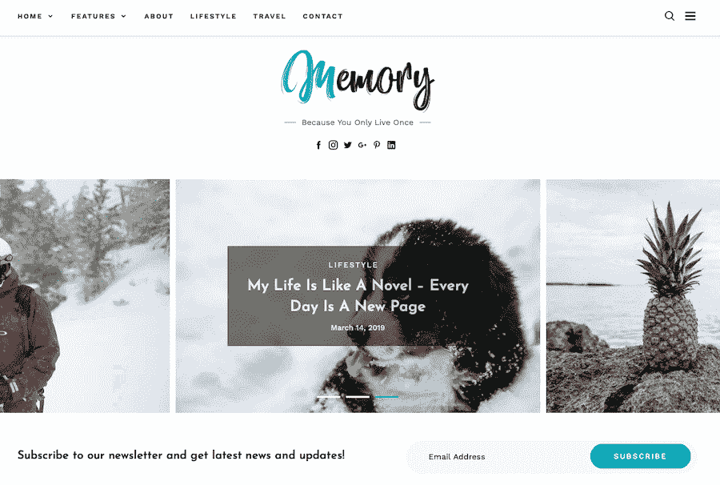

Memory.

今天我们清单上的最后一个主题叫做[记忆](https://gretathemes.com/wordpress-themes/memory/)，它的设计和排版选择使它成为写个人文章或希望分享旅行日志的人的绝佳选择。

这个主题以面板布局为特色，在风格上让人想起过去的博客主题趋势，但仍然非常适合现在。

**定价**

GretaThemes 以 49 美元的价格提供内存主题，其中包括一年的更新和支持。但是，您也可以选择高级捆绑包，它提供对所有 GretaThemes 的访问，以及一年的更新和支持。Lifetime Bundle 也是一个选项，它提供对所有主题的终生支持和更新。

**显著特征**

*   速度优化
*   附带 7 个演示
*   几十个页面模板
*   支持块，并与内置定制器一起工作
*   4 种滑块样式
*   广告横幅
*   Instagram、Twitter 和脸书的社交媒体模块
*   简单的设置过程

[Look no further for the perfect WordPress theme for your blog ✨Click to Tweet](https://twitter.com/intent/tweet?url=https%3A%2F%2Fkinsta.com%2Fblog%2Fbest-wordpress-themes-for-blogs%2F&via=kinsta&text=Look+no+further+for+the+perfect+WordPress+theme+for+your+blog+%E2%9C%A8&hashtags=WordPress%2CBlogger) ## 摘要

我们希望你喜欢浏览这些最好的博客主题。每一个都带来了一些不同的东西，无论是电子商务集成，优秀的排版，还是组合支持。不管怎样，当你试图推出一个新的博客时，这些主题中的任何一个都会很好地为你服务。

通过包括免费和优质的选择，我们希望你能找到适合你个人需求或公司品牌，你选择的主题和你的预算的东西。祝你好运！

* * *

让你所有的[应用程序](https://kinsta.com/application-hosting/)、[数据库](https://kinsta.com/database-hosting/)和 [WordPress 网站](https://kinsta.com/wordpress-hosting/)在线并在一个屋檐下。我们功能丰富的高性能云平台包括:

*   在 MyKinsta 仪表盘中轻松设置和管理
*   24/7 专家支持
*   最好的谷歌云平台硬件和网络，由 Kubernetes 提供最大的可扩展性
*   面向速度和安全性的企业级 Cloudflare 集成
*   全球受众覆盖全球多达 35 个数据中心和 275 多个 pop

在第一个月使用托管的[应用程序或托管](https://kinsta.com/application-hosting/)的[数据库，您可以享受 20 美元的优惠，亲自测试一下。探索我们的](https://kinsta.com/database-hosting/)[计划](https://kinsta.com/plans/)或[与销售人员交谈](https://kinsta.com/contact-us/)以找到最适合您的方式。