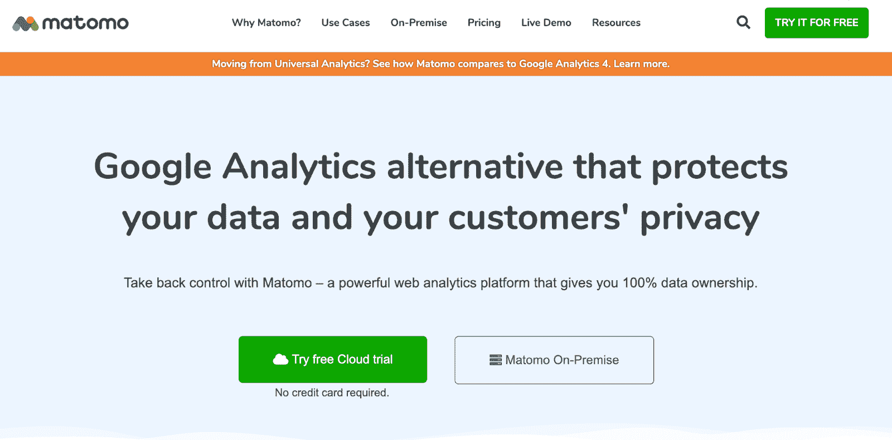
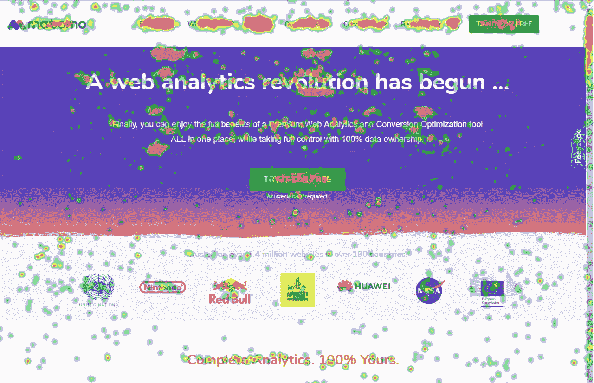
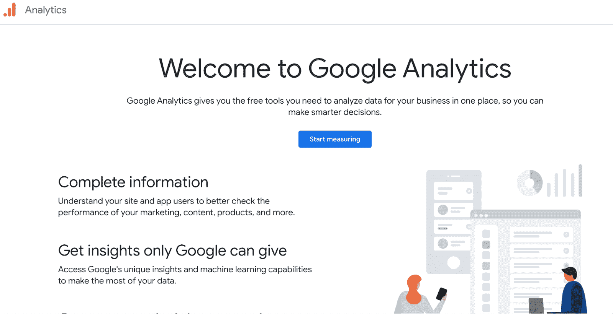
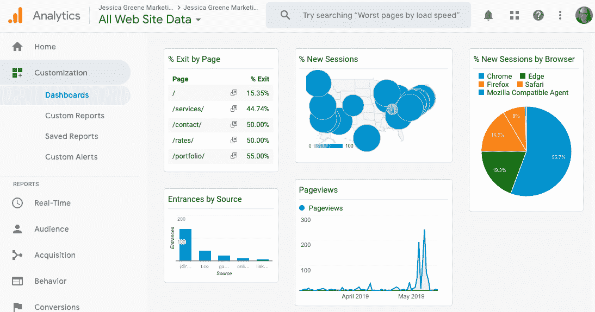
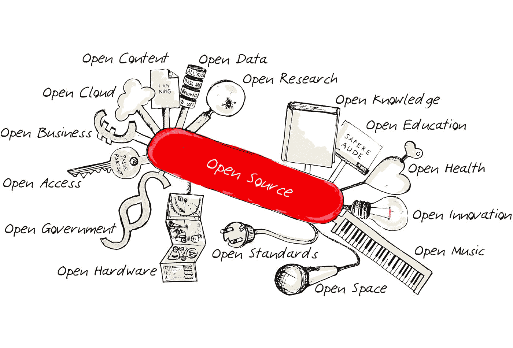
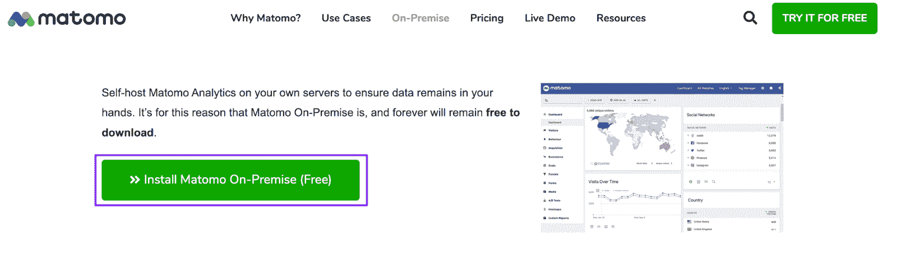
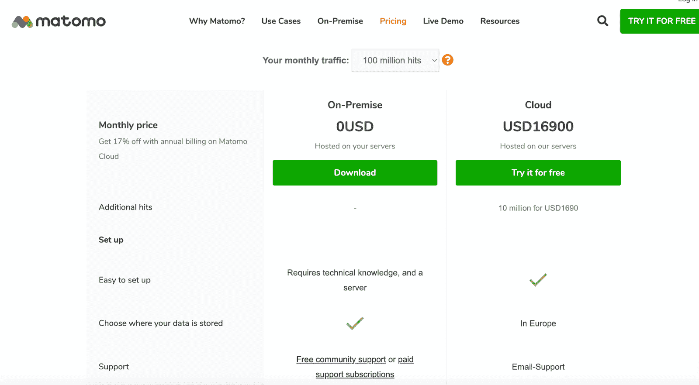
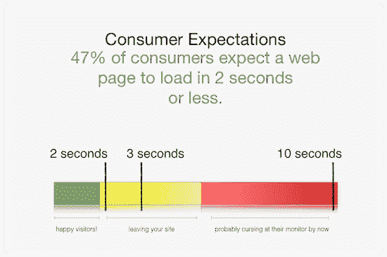

# Matomo vs Google Analytics:探索和比较两个平台

> 原文：<https://kinsta.com/blog/matomo-vs-google-analytics/>

你已经为你的网站投入了大量的工作，并且需要了解用户如何与它互动。

这就是为什么数据分析对现代网络企业的成功如此重要。目前网站分析领域最重要的名字是 [Google Analytics](https://kinsta.com/blog/how-to-use-google-analytics/) ，但它远不是镇上唯一的名字。有几个[谷歌分析的替代品](https://kinsta.com/blog/google-analytics-alternatives/)，比如 Matomo。

这两种服务都被广泛采用并且易于使用。他们还可以很容易地与 WordPress 整合，WordPress 是世界上最受欢迎的 CMS。但是 Google Analytics 和 Matomo 哪个服务更好呢？这两种观点肯定都有论据支持。这些优质服务之所以受欢迎是有原因的。

我们在这里不是要告诉你这两种服务哪个更好，因为在这种情况下更好是主观的。不同的企业有不同的需求，虽然谷歌分析可能对一家公司更有吸引力，但 Matomo 的功能可能会非常适合另一家公司。

相反，我们将重点比较这两种服务，以便您做出明智的决定。

在本文中，我们将探索 Matomo 和 Google Analytics，在几个关键领域对它们进行比较，以帮助您决定哪个是更好的分析平台来满足您的需求。

## 马托莫是什么？

Matomo 是一个网络分析平台，前身是 Piwik Analytics。Piwik 始于 2007 年，但在 2018 年更名为 Matomo。

> Kinsta 把我宠坏了，所以我现在要求每个供应商都提供这样的服务。我们还试图通过我们的 SaaS 工具支持达到这一水平。
> 
> <footer class="wp-block-kinsta-client-quote__footer">
> 
> 
> 
> <cite class="wp-block-kinsta-client-quote__cite">Suganthan Mohanadasan from @Suganthanmn</cite></footer>

[View plans](https://kinsta.com/plans/)

Matomo

Matomo 受欢迎的一个原因是它是一个开源分析平台。这意味着它由用户社区维护和更新。这确保了 Matomo 始终处于行业前沿。

目前在 190 多个国家有超过 100 万个网站在使用 Matomo 的服务。你可以利用这个平台来获得网站访问者的信息，并深入了解你的各种营销活动。

Matomo 还使优化客户体验和评估内容的有效性变得更加容易。

[You’ve put a lot of work into your website... so you need to understand how users interact with it! 🤝 Enter, data analytics 📈Click to Tweet](https://twitter.com/intent/tweet?url=https%3A%2F%2Fkinsta.com%2Fblog%2Fmatomo-vs-google-analytics%2F&via=kinsta&text=You%E2%80%99ve+put+a+lot+of+work+into+your+website...+so+you+need+to+understand+how+users+interact+with+it%21+%F0%9F%A4%9D+Enter%2C+data+analytics+%F0%9F%93%88&hashtags=Data%2CGoogleAnalytics)

### **Matomo 的优势**

Matomo 是一个有很多令人印象深刻的好处的平台。这就是为什么自短短几年前更名以来，它获得了如此大的人气。

这个私有系统向其用户提供对数据的完全控制。它既有免费的内部选项，也有付费的云订阅可供选择。此外，由于 Matomo 的开源特性，您可以将其定制到您梦想的平台中。

如果你正在分析的网站很小，Matomo 有一些独特的优势。任何月访问量低于 10，000 的博客都只消耗少量的服务器。这些服务器支出也更便宜，因为您可以通过 Matomo 计划获得无限制的存储空间。

### **Matomo 出众的功能**

Matomo 是一个提供网站访问者详细报告的平台，让你可以估计有多少人访问你的网站，他们来自哪里，以及他们是如何找到你的。它还向用户展示了不同的[搜索引擎](https://kinsta.com/blog/alternative-search-engines/)和人们用来到达你页面的关键词。

Matomo 甚至显示用户所说的语言，让你更好地了解人们是如何消费你的内容的。

在调查人们如何使用你的网站时，Matomo 擅长一些令人难忘的功能。首先，它提供了每个用户访问的页面信息。这可以帮助你确定你的大部分流量去了哪里，哪些页面在目标受众中失败了。

您还可以跟踪网站访问者的屏幕分辨率，以及他们点按的任何链接和他们可能下载的文件。

A heatmap featured on Matomo

热图是 Matomo 的另一个优秀功能，可以通过付费订阅获得。这些地图显示了用户在你的页面上点击最多的地方。它可以帮助你查看你的布局的有效性，甚至识别愤怒点击的实例，这可能会告诉你，要么是网站太慢，要么是某个功能出现故障。

付费服务还提供会话记录。您可以使用此功能来观看人们如何与您的页面交互的回放。你甚至可以追踪用户的 IP 地址来进行更好的人口统计研究。

## 什么是谷歌分析？

谷歌分析是由谷歌运营的免费网站分析服务。它带有经典的谷歌品牌名称，深受公众信任。

Google Analytics

谷歌分析自 2005 年谷歌收购顽童软件公司并采用其分析工具以来就一直存在。

这是一种比 Matomo 更广泛采用的服务，全球有超过 5000 万个网站使用它进行详细的分析研究。这使得谷歌分析成为世界上最受欢迎的分析工具。

你可以使用 Google Analytics 来接收关于你的网站用户的细分和分组数据。它还提供了关于用户行为的详细报告，这在规划您的营销推广时可能是有益的。

### **谷歌分析的优势**

如果没有一些关键优势，你不可能成为世界第一的分析平台。谷歌分析有许多有用的功能，多年来一直让网站所有者感到高兴。

通过谷歌分析，你可以[追踪访问你网站](https://kinsta.com/blog/google-analytics-wordpress/)的用户信息，包括他们的浏览行为、地理位置、搜索来源等等。

这项免费服务有一个用户友好的界面，很容易快速上手。你日常使用的许多工具，如 [CRM 或营销软件](https://kinsta.com/blog/wordpress-crm/)，都可以通过专门的 API 集成到谷歌中。

这项服务的主要好处之一是它被广泛使用。正因为如此，那里有很多信息，包括教程和技巧，可以帮助你从你的经历中获得最大的收获。

### **谷歌分析的突出特点**

Google Analytics 最好的特性之一是它的实时报告。这让你可以每分钟都深入了解用户的行为。

它还为您提供了跳出率分析，让您了解有多少人正在离开您的网站。通过检查这一点，您可以发现您的网站中可能会排斥潜在客户的任何令人困惑或讨厌的功能。

Google Analytics dashboard

您的 Google Analytics 视图可以使用过滤器进行个性化，过滤器是其可定制仪表板的一部分。该服务的目标设定功能在建立新的活动以增加网站流量时也很方便。你将能够根据这些基准来衡量你通过谷歌分析收集的分析，以确定你的成功或失败。

还有[电子商务跟踪](https://kinsta.com/blog/ecommerce-strategies/)，这使得在线商店能够更密切地关注他们的客户以及他们如何购物。洞察一个网站的电子商务部分可以显示很多关于[购物车放弃](https://kinsta.com/blog/shopping-cart-abandonment/)和你的结账过程的有效性。

您还可以使用 Google Analytics 进行自定义指标跟踪，以独特的方式让平台完全属于您。

## **Matomo 与 Google Analytics 的异同**

在选择 Matomo 和 Google Analytics 这样的服务时，看看这些产品的相似之处和不同之处会有所帮助。也许谷歌分析的一个关键功能符合你的需求，但 Matomo 没有类似的功能。

这就是为什么我们要深入研究这些服务，确定它们之间的异同。

### **Matomo 和 Google Analytics 的相似之处**

Matomo 和 Google Analytics 有很多共同之处。两者都具有可定制的仪表板，允许您个性化您的视图。

他们也有客观的监控，这意味着你可以根据你为自己设定的目标来衡量你收集的数据。这些服务都允许对进入你网站的各种用户进行实时数据监控和位置跟踪。

得益于 iOS 和 Android 的应用程序，谷歌分析和 Motomo 可以通过移动设备访问。您还可以将 API 与这些平台一起使用，以连接您用于业务其余部分的各种软件工具。

## 注册订阅时事通讯

### 想知道我们是怎么让流量增长超过 1000%的吗？

加入 20，000 多名获得我们每周时事通讯和内部消息的人的行列吧！

[Subscribe Now](#newsletter)

有了 Matomo 和 Google Analytics，你可以参与活动和电子商务跟踪。您也可以使用这两个系统来生成自动电子邮件报告。

### **Matomo 和 Google Analytics 的区别**

Matomo 和谷歌分析的一个关键区别是，Matomo 为用户提供视频分析，而谷歌分析不提供。Matomo 还提供热图，显示用户如何通过彩色编码斑点与各种页面进行交互。这是另一个你在使用谷歌分析时无法使用的功能。

An artist’s rendering of an open-source platform (**Source:** [O’Reilly Media](//www.oreilly.com/radar/the-role-of-open-source-in-a-company/%E2%80%9D))

谷歌分析也不是像 Matomo 一样的开源平台。这意味着当 Matomo 由开发者社区更新和维护时，Google Analytics 完全由 Google 控制。Matomo 也不使用 [cookies](https://kinsta.com/blog/wordpress-cookies-php-sessions/) ，这意味着你拥有你所有的数据。

使用 Matomo 时，您可以获得更高级的隐私控制。但是，Matomo 用户所享受的许多增强功能都可以归结为这两种服务之间的一个关键区别。

谷歌是 100%免费的，而 Matomo 是有代价的。

## **Matomo vs 谷歌分析:势均力敌的对比**

现在让我们直接比较这两种服务，检查它们的安装过程、易用性、数据跟踪能力和成本效益。

### **安装**

为了这篇文章，我们将把安装比较集中在 WordPress 网站上。先说马托莫。

**Matomo 安装**

有两种不同版本的 Matomo 提供给用户。你有 Matomo Cloud，它以高级订阅价格托管在云上。然后是 Matomo On-Premise，它是自托管的、开源的、免费使用的。

使用 Matomo 时，你要做的第一件事就是注册一个账户。为此，您需要提供您的电子邮件地址、[网站 URL](https://kinsta.com/knowledgebase/what-is-a-url/) 和分析[子域](https://kinsta.com/blog/wordpress-subdomain/)。

The download page to install Matomo on-premise

然后，您将收到一封确认电子邮件，其中包含您的所有登录信息和一个 Matomo 子域。获取 Matomo 提供的跟踪代码，并将其应用到你的 [WordPress header](https://kinsta.com/knowledgebase/add-code-wordpress-header-footer/) 中。

需要在本地安装 Matomo。这意味着你必须在你的服务器上安装 Matomo 软件。您还需要有一个专业的开发人员来进行安装。一旦完成，你将收到插入到你的 WordPress 标题中的跟踪代码。

**谷歌分析安装**

安装谷歌分析时，你首先要创建一个免费的谷歌分析帐户。这也需要你有一个谷歌账号(也是免费的)。

Struggling with downtime and WordPress problems? Kinsta is the hosting solution designed to save you time! [Check out our features](https://kinsta.com/features/)

一旦你注册了，系统会为你提供一个 JavaScript 跟踪代码。然后，您必须将该代码添加到您的网站标题中。当然，也有不需要编码的[插件可用](https://kinsta.com/blog/google-analytics-wordpress/)。

### **易用性**

当比较 Matomo 和谷歌分析时，你会发现谷歌更容易使用。Matomo On-Premise 需要对冗长的安装过程进行专家级编码，尽管 Matomo Cloud 安装起来容易得多，但它也是有价格的。谷歌分析永远是免费的。

当登录服务时，谷歌有一个非常用户友好的静态登录页面，但 Matomo 每次都要求你输入 Matomo 子域才能进入你的帐户。

谷歌分析是一个用户友好的平台，将你的报告分成五个部分。它们是:

1.  实时
2.  观众
3.  获得物ˌ获得
4.  行为
5.  转换策略

Matomo 仪表盘也很容易理解。它实时显示你的访问，包括一个增加可用性的[侧边栏菜单](https://kinsta.com/knowledgebase/remove-sidebar-wordpress/)，甚至还有一个访问者地图。

### **跟踪**

这两种优质服务都包括基本跟踪。这包括跟踪位置、设备、[登录页面](https://kinsta.com/blog/wordpress-landing-page-plugins/)、退出页面、实时用户等等。

但是，Matomo Cloud 会根据您付费计划的功能限制您的跟踪。云计划包含 30 名团队成员、150 个目标、100 个细分和 30 个行动自定义维度。使用内部部署计划时，其中许多都是无限制的。

Google 允许无限制的用户、细分市场、目标和自定义维度，所有这些都是免费的。它还集成了谷歌工具和平台，如谷歌广告。这意味着你可以[针对谷歌的核心网络要害](https://kinsta.com/blog/core-web-vitals/)优化你的网站，并观察用户如何与你投放的广告互动。

Matomo 还允许自动表单跟踪，而 Google Analytics 要求单独设置事件跟踪。

### **成本效益**

谷歌分析是一项完全免费的服务。这显然意味着你不用付钱就能使用它。当您考虑到该服务具有无限的用户、目标、细分市场和维度时，您会意识到它非常划算。你不劳而获。

因此，虽然成本效益之战是免费谷歌分析的坚实胜利，但我们也需要打破 Matomo 的付费计划。

不管您网站的流量如何，Matomo On-Premise 始终是一项免费服务。然而，正如我们之前提到的，要在您的服务器上正确安装它，需要大量的工作和专家级的开发人员。当你考虑到雇佣一个开发者安装 Matomo 的成本时，这并不是免费的。

Matomo Cloud 中包含许多功能，可以在 Matomo 内部应用，但需要额外付费。这些包括但不限于:

*   活动日志(每年 29 美元)
*   Woocommerce Analytics(每年 39 美元)
*   漏斗(每年 199 美元)
*   热图和会议记录(每年 229 美元)
*   [SEO](https://kinsta.com/blog/what-does-seo-stand-for/) web vitals(每年 89 美元)
*   还有更多

Matomo Cloud 是一种付费的高级服务，其费用取决于您的月流量。最低层是每月点击量高达 50，000 次的网站。这个点击率一直上升到 1 亿次。

The pricing page for the highest tier of Matomo

让我们一次一个地分解这些定价选项。

*   50，000 次点击——每月 23 美元
*   100，000 次点击——每月 39 美元
*   300，000 次点击——每月 79 美元
*   600，000 次点击——每月 129 美元
*   100 万次点击——每月 189 美元
*   200 万次点击——每月 369 美元
*   500 万次点击——每月 929 美元
*   1000 万次点击——每月 1790 美元
*   2500 万次点击——每月 4390 美元
*   5000 万次点击——每月 8590 美元
*   1 亿次点击——每月 16，900 美元

如你所见，Matomo 的定价差别很大。虽然该系统有许多先进的功能，并可以负担得起的小网站，成本将呈指数增长，因为你的数字增长。因此，你需要确保随着你的业务增长，你有能力扩展你的 Matomo 订阅。

## **Matomo 和 Google Analytics 可以一起使用吗？**

像 Matomo 和 Google Analytics 这样的分析服务可以同时使用。这将允许您从这两个平台获得洞察力，并比较它们之间的异同。由于谷歌分析是一项免费服务，你可能已经准备好一头扎进这个概念，但我们建议花点时间考虑它需要什么。

如果你的网站上同时运行 Matomo 和 Google Analytics，你将同时运行两个不同的 JavaScript 代码。这会对[页面加载速度](https://kinsta.com/blog/google-pagespeed-insights/)产生负面影响，从而给你的操作带来重大影响。

当试图改善网站的用户体验时，网站速度是需要考虑的最重要的因素之一。令人震惊的是，如果一个网站的加载时间超过两秒钟，47%的消费者就会离开。

How long it takes for someone to leave a slow website (**Source:** [Online Asset Partners](//www.onlineassetpartners.co.nz/blog/improve-website-speed-seo/%E2%80%9D))

此外，网站速度是谷歌在给你分配搜索引擎优化排名时检查的内容。这意味着任何希望 T2 提高搜索引擎优化分数的人都需要确保他们的网站以最佳速度运行。我们建议使用像 [KinstaAPM](https://kinsta.com/apm-tool/) 这样的免费工具来确定需要修复的内容。这对于[为你的品牌](https://kinsta.com/blog/positioning-strategy/)建立定位策略至关重要，因为你希望人们将你的品牌与功能和效率联系起来。

因此，虽然可以在你的页面上同时运行 Matomo 和 Google Analytics，但不建议这样做。

[Want to better understand your site? 👀 These two data analytics options are here to help 🚀Click to Tweet](https://twitter.com/intent/tweet?url=https%3A%2F%2Fkinsta.com%2Fblog%2Fmatomo-vs-google-analytics%2F&via=kinsta&text=Want+to+better+understand+your+site%3F+%F0%9F%91%80+These+two+data+analytics+options+are+here+to+help+%F0%9F%9A%80&hashtags=Data%2CGoogleAnalytics) ## **总结**

Matomo 和 Google Analytics 是两个优秀的分析工具，可以让你很好地了解目标受众的习惯和行为。您可以使用这些平台来监控您的 [SEO 增长](https://kinsta.com/ebooks/wordpress/how-to-improve-seo/)，更好地了解您的目标人群，并衡量您的营销活动的成败，以确定您接下来需要采取的行动。

但至于谷歌分析或 Matomo 是更好的选择，这一切都归结于你作为一个企业的具体需求。如果你能负担得起 Matomo，并且认为像热图这样的服务对你的持续成功很重要，那么投资是值得的。

然而，如果你是一个利润率很低的小网站，你需要一个高质量的免费工具，那么谷歌分析是一个安全有效的赌注。如果你对这两个选项都不满意，我们还可以推荐我们自己的网站分析平台 [MyKinsta Analytics](https://kinsta.com/help/mykinsta-analytics/) 。

无论你决定使用哪种分析工具，你都需要[应用托管](https://kinsta.com/application-hosting/)、[数据库托管](https://kinsta.com/database-hosting/)和[托管 WordPress 托管](https://kinsta.com/wordpress-hosting/)来让你的网站或项目出现在大众面前。

今天联系 Kinsta 并[安排演示](https://kinsta.com/)。

* * *

让你所有的[应用程序](https://kinsta.com/application-hosting/)、[数据库](https://kinsta.com/database-hosting/)和 [WordPress 网站](https://kinsta.com/wordpress-hosting/)在线并在一个屋檐下。我们功能丰富的高性能云平台包括:

*   在 MyKinsta 仪表盘中轻松设置和管理
*   24/7 专家支持
*   最好的谷歌云平台硬件和网络，由 Kubernetes 提供最大的可扩展性
*   面向速度和安全性的企业级 Cloudflare 集成
*   全球受众覆盖全球多达 35 个数据中心和 275 多个 pop

在第一个月使用托管的[应用程序或托管](https://kinsta.com/application-hosting/)的[数据库，您可以享受 20 美元的优惠，亲自测试一下。探索我们的](https://kinsta.com/database-hosting/)[计划](https://kinsta.com/plans/)或[与销售人员交谈](https://kinsta.com/contact-us/)以找到最适合您的方式。