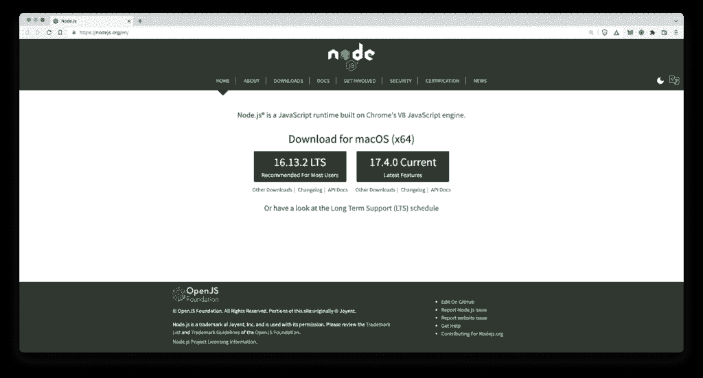
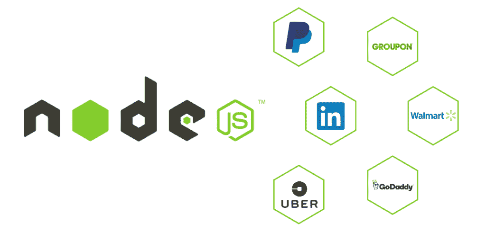
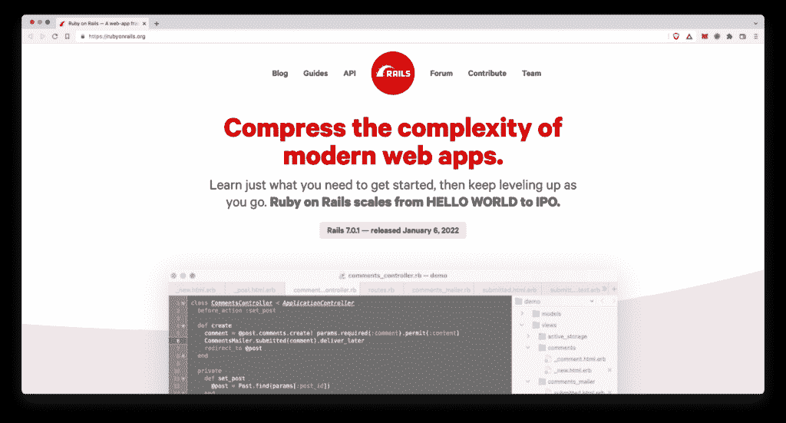

# Ruby on Rails 与 Node.js:面对面的比较

> 原文：<https://kinsta.com/blog/ruby-on-rails-vs-node-js/>

为你的项目选择一个框架或语言可能是具有挑战性的，尤其是在后端，维护用户数据和[创建 API](https://kinsta.com/knowledgebase/api-endpoint/)和库是关键。撰写本文时最流行的 web 开发技术是 Node.js 和 Ruby on Rails。
[Ruby on Rails 还是 Node.js？🤔在本指南的帮助下做出决定🚀 点击推文](https://twitter.com/intent/tweet?url=https%3A%2F%2Fkinsta.com%2Fblog%2Fruby-on-rails-vs-node-js%2F&via=kinsta&text=Ruby+on+Rails+or+Node.js%3F+%F0%9F%A4%94+Decide+with+help+from+this+guide+%F0%9F%9A%80&hashtags=DevTips%2CNodejs)
选择其中一个可能是一项艰巨的任务。这两种技术各有优缺点，了解它们将有助于您为您的项目选择最佳选择。在本文中，我们将为您提供 Node.js 和 Rails 的公正比较，以帮助您做出决定。

为什么我们要比较这两种技术？虽然它们看起来可能没有直接的相似性，但是我们已经注意到很多用户在线提出了 Ruby on Rails vs Node.js 的问题。本文将通过查看每种技术的关键澄清特性、主要差异和用例来帮助回答这个问题。

我们开始吧！

## Node.js 是什么？

Node.js 是 2009 年在 Chrome 的 V8 [JavaScript](https://kinsta.com/knowledgebase/what-is-javascript/) 引擎上构建的开源运行时环境。它是在[后端开发](https://kinsta.com/blog/backend-vs-frontend/)中广泛使用的单线程跨平台。



Node.js’s homepage.


[Node.js](https://kinsta.com/knowledgebase/what-is-node-js/) 可以[安装](https://kinsta.com/blog/how-to-install-node-js/)在 Linux、macOS、Windows 等不同平台上。它被用来创建各种各样的[应用](https://kinsta.com/blog/node-js-apps/)，包括实时聊天应用、REST API 服务器、命令行应用等等。


### 节点如何处理库

Node.js 内置了对库管理的支持，称为节点包管理器(npm)。每周有超过 130 万个包和超过 10 亿次下载，它无疑是最受欢迎的包库之一，因此，它在 [JavaScript 生态系统](https://kinsta.com/blog/javascript-libraries/)中扮演着至关重要的角色。


这个巨大的图书馆是完全开源和免费的。这些库的规模正在快速增长，使得 Node.js 社区日益强大。

npm 中最受欢迎的库之一是 [Express.js](https://kinsta.com/knowledgebase/what-is-express-js/) ，这是一个用于快速开发和部署应用程序和 API 的框架。这是一个最小的 Node.js web 应用程序框架，为在线和移动应用程序提供了全面的功能，每周通过 npm 下载超过 22，000，000 次。

下面是一个简单的 Node.js 和 Express API 的代码:

```
const express = require('express')
const app = express()

app.get('/', function (req, res) {
  res.send("A simple GET response")
})

app.listen(3000)
```

在上面的代码中，我们导入了 express.js 并创建了一个简单的 GET API。在最后一行中，我们将 3000 传递给 listen 函数，这样，我们的应用程序将在端口 3000 上运行。

Express.js 使在短时间内创建各种类型的 web 应用程序变得简单。对于客户端请求，该框架提供了一个简单的路由系统。它还包括中间件，负责做出决策，为客户端的请求提供正确的响应。


### 使用 Node.js 的公司

使用 Node.js 的一些受欢迎的公司有:

*   **网飞**:网飞开始利用 Node.js 向超过 1.82 亿用户提供高容量网络流媒体服务，他们还打算将 Node.js 的使用范围扩大到内容制作。
*   **优步**:由于其异步原语和简单的单线程处理，优步的核心旅行执行引擎最初是在 Node.js 中开发的
*   PayPal:在取代 Java 的时候，PayPal 选择了从浏览器到 web 应用的后端服务器都使用 JavaScript。
*   **NASA** :在太空中发生了[不愉快的事情](https://openjsf.org/wp-content/uploads/sites/84/2020/02/Case_Study-Node.js-NASA.pdf)之后，NASA 决定使用 Node.js 来更好地保护他们的数据，甚至防止生命损失。
*   **LinkedIn** :由于可扩展性和性能效率，Linkedln 选择了 Node.js，停止使用 Ruby on Rails。



Companies that use Node.js. (Image source: [Coruscate](https://m.coruscatesolution.com/))


> Node.js 特别适合编写所有状态都在内存中的系统。
> 
> *—克里斯·科瓦尔，优步的软件工程师*

## 什么是 Ruby on Rails？

Ruby on Rails——也称为 Rails 或 RoR——是在 MIT 许可下用 Ruby 编写的最流行的开源 web 应用程序框架。它开发于 2004 年，以代码效率和高速著称。



ROR’s homepage.


Rails 旨在帮助管理例程、内部逻辑、数据计算和其他任务。这是一个 web 应用程序框架，非常适合数据库支持的 MVC web 应用程序和元编程。Ruby 最初的异端确实是把程序员的快乐放在了基座上。~ David Heinemeir Hanson，Ruby on Rails 的创造者大多数支持 CGI 的 web 服务器都可以运行 Rails。 [MySQL](https://kinsta.com/knowledgebase/what-is-mysql/) 、 [PostgreSQL](https://kinsta.com/knowledgebase/what-is-postgresql/) 、SQLite、 [SQL Server](https://kinsta.com/blog/postgresql-vs-sql-server/) 、DB2、Oracle 都是这个框架支持的。此外，Ruby on Rails 具有清晰、简洁、灵活的语法，类似于英语。这种较低的学习曲线使得该框架对新手特别有吸引力。

### 使用 Ruby on Rails 的公司

使用 Ruby on Rails 的一些受欢迎的公司有:

*   **Airbnb** : Airbnb 从一开始就使用 Ruby on Rails。该框架在 Airbnb 的技术栈中扮演着至关重要的角色。
*   **GitHub** : GitHub 的后台是 Ruby on Rails，拥有超过 2 亿个代码库，月活用户 3200 万。该应用由公司创始人创建，至今已有七年。
*   Shopify : Shopify 是一个成熟的、结构良好的、用户友好的 Ruby on Rails 电子商务平台的典范，有超过 820，000 个卖家使用他们的服务。
*   是的，Fiverr 在发布时也采用了 Ruby on Rails，并且它仍然是推动他们在线服务市场的技术。

现在您已经对这两种技术有了很好的了解，下面我们来讨论一下它们的优缺点。

## Ruby on Rails:利弊

尽管 Ruby on Rails 是一个功能强大的框架，但它也有一些缺点。

### Ruby on Rails 的优点

使用 Ruby on Rails 有很多好处。我们列出了以下几个最重要的问题:

*   **开发速度** : RoR 完善的模块架构，高效的包管理系统，以及 Ruby 语言富于表现力和紧凑性的特点，让开发者可以快速创建应用。
*   大型基础设施:Ruby on Rails 带有一个内置的 web 服务器和一个带有生成器的数据库，使网站开发变得轻而易举。
*   大型社区:Ruby on Rails 的另一个优点是它强大而活跃的社区。它是 [GitHub](https://kinsta.com/knowledgebase/what-is-github/) 上流行的框架之一，Ruby 社区可能已经实现了你能想到的所有功能。
*   **最佳实践** : Rails 的创建目标是建立 web 开发的最佳实践，它提供了在开发项目中遵循这些标准所需的所有库和模块。
*   **代码质量**:第三方 Ruby 代码质量明显高于其他语言。

### Ruby on Rails 的缺点

Ruby on Rails 的一些缺点可以在下面看到:

*   灵活性差:定制 Ruby on Rails 来创建具有独特功能的独一无二的应用程序可能很困难。
*   **运行速度和性能**:反对 Ruby on Rails 的一个最常见的理由是它的运行速度很差，这使得扩展应用程序很成问题。这也是 Twitter 停止在其搜索引擎中使用 Ruby on Rails 的原因。
*   **启动速度**:大多数开发者抱怨 Rails 的启动速度。这可能需要很长时间才能开始，这取决于您的 gem 依赖项和文件的数量。
*   困难的调试:由于 Ruby on Rails 的复杂性和各种各样的层次，对 Rails 应用程序进行故障排除可能会很困难。查找混音中的错误可能需要很长时间。

## Node.js 的利与弊

众所周知，Node.js 是一个灵活的框架，几乎可以根据任何人的需求进行调整。然而，它也有缺点。

## 注册订阅时事通讯


### 想知道我们是怎么让流量增长超过 1000%的吗？

加入 20，000 多名获得我们每周时事通讯和内部消息的人的行列吧！

[Subscribe Now](#newsletter)

### Node.js 的优点

我们列出了 Node.js 的优势:

*   **易学**:因为 Node.js 是基于 JavaScript 的[，如果你已经有很好的编程背景，熟悉 JavaScript，那么学](https://kinsta.com/knowledgebase/what-is-javascript/)可能会容易很多[。有许多课程和教程可以让学习变得愉快。](https://kinsta.com/topic/javascript-tutorials/)
*   社区:一个积极参与的社区意味着大量的支持和反馈。Node.js 被一个庞大的开发者社区所包围。npm，节点的软件包管理器，是最流行的和迅速扩大的软件注册表之一。它提供了许多可以在项目中使用的库和可重用模板。
*   **无缝 JSON 支持**:虽然其他后端技术，如 Ruby on Rails，可以使用 JSON 格式进行通信，但 Node.js 不需要在二进制模型之间进行转换，而是使用 JavaScript。这在使用 NoSQL 数据库[，比如 MongoDB](https://kinsta.com/blog/mongodb-vs-mysql/) 创建 RESTful APIs 时非常有用。
*   **高度可扩展** : Node.js 以高度可扩展而闻名，这意味着开发人员可以定制和扩展它，以满足他们项目的需要。

### Node.js 的缺点

以下是 Node.js 的一些缺点，这可能使它不太适合您的项目:

*   **不稳定的 API** : Node.js 定期遭受不兼容的 API 变更。这些不兼容性导致大量的代码修改，这是使用 Node.js 的主要缺点。
*   工具的不成熟:尽管核心的 Node.js 模块相当可靠，但是 npm 仓库中的许多包质量很差，文档也很差。因此，找到满足您需求的正确软件包可能会很困难。
*   不适合 CPU 密集型任务:node . js 无法处理 CPU 密集型操作是它目前的另一个主要缺点。它只适用于与 I/O 相关的任务(比如 web 服务器)。
*   **回调问题**:回调，队列中的每个任务完成时运行的函数，是 Node.js 的一大部分，代码的质量直接受到后台保留大量排队进程的影响，每个进程都有自己的回调。

## Node.js 与 Ruby on Rails:面对面的比较

现在您已经对这两种技术有了很好的了解，让我们更深入地并排比较一下。

### 表演

虽然对于小型项目来说，性能可能不是一个考虑因素，但是在构建大型复杂项目时，考虑性能是非常重要的。Node.js 在性能方面胜出。Node.js 配备了谷歌设计的 V8 引擎，速度更快，尤其是在 IO 繁重的操作上。它还以生成速度极快且可伸缩的程序而闻名，因为它采用了事件驱动的架构和在单线程上运行的非阻塞(异步)进程。Node.js 应用程序还可以处理更多的请求，因为该框架能够管理更重的服务器工作负载。

### 社区

说到寻求支持和输入，这两种技术都有一个庞大的开发人员社区。

Struggling with downtime and WordPress problems? Kinsta is the hosting solution designed to save you time! [Check out our features](https://kinsta.com/features/)

根据 Stack Overflow 的[开发者调查，Node.js 是全球开发者使用的顶级技术之一。谷歌、脸书和亚马逊等一些科技巨头对 Node.js 环境做出了重大贡献。Node.js 有几个社区论坛，比如 Github、](https://insights.stackoverflow.com/survey/2020) [Stack Overflow](https://stackoverflow.com/questions/tagged/node.js) 和 [Reddit](https://www.reddit.com/r/node/) 。

类似地，Ruby on Rails 也有一个巨大而强大的社区，在 GitHub 上有巨大的存储库。它在 GitHub 和许多其他活跃的社区论坛上有超过 4000 名活跃的贡献者。Rails 开发人员积极参与现有功能的改进和新特性的开发。他们经常更新源代码，修复错误，解决安全漏洞。

Rails 也有很多社区论坛，包括 GitHub、Slack、Stack Overflow 等。他们的 [Slack 社区](https://www.rubyonrails.link/)拥有来自世界各地的 17000 多名成员和 27 个频道，包括狂热的 OSS 贡献者、[全栈工程师](https://kinsta.com/blog/what-is-a-full-stack-developer/)、初创公司创始人、后端工程师和刚刚学习 Ruby on Rails 的人。

### 工作机会

因为这两种技术都有庞大的用户群体，所以 Node.js 和 Rails 开发人员都有很多工作机会。在美国，Node.js 开发人员的平均工资在 71，000 美元到 92，000 美元之间，而在欧洲，平均工资在 24，000 美元到 94，000 美元之间。Node.js 的自由职业者平均每小时可以赚 80-100 美元。[据 Indeed](https://www.indeed.com/career/ruby-on-rails-developer/salaries) 报道，一名 Ruby on Rails 开发者在美国每年可以赚 11.6 万美元左右；Rails 自由职业者的平均工资约为每小时 49 美元。

### 可量测性

Node.js 用于创建非常可伸缩的应用程序。多个并发请求通过非阻塞 I/O 和事件驱动的范例来处理。

由于集群模块，Node.js 最终比 Ruby 更具可伸缩性。该进程是在集群中产生的，其抽象基于具有最少数量的 CPU 的程序的工作负荷。

扩展 Ruby on Rails 是可以实现的，但是它比其他流行的后端框架需要更多的资源。然而，这不应该阻止你在项目中使用 Ruby on Rails。

以下是一些扩展 Ruby on Rails 应用程序的技巧:

*   Rails 内置的动作、页面和片段缓存可以发挥其最大潜力。您还可以使用 Memcache 来缓存来自数据库的结果，否则这些结果将被检索。
*   您还可以利用 Docker 和 Kubernetes 等第三方工具来帮助您顺利扩展应用程序。
*   使负载测试成为预先部署过程的标准元素。这将允许你观察每个程序需要多长时间，以及哪里有改进的空间。

### 流行

构建现代产品或应用程序时，堆栈的受欢迎程度是您应该考虑的另一个因素。一般来说，它越受欢迎，就越受支持。

[据 Google Trends](https://trends.google.com/trends/explore?date=all&q=Ruby%20on%20rails,Node%20js) 报道，Ruby on Rails 在 2005 年至 2009 年期间相当流行，但从那以后，它开始慢慢失宠。另一方面，Node.js 自 2017 年以来越来越受欢迎，这意味着有很多*人希望利用和了解它。*


Graph comparing the popularity of Node.js and Ruby on Rails on Google search engine.


如果您正在寻找撰写本文时最流行的选项，Node.js 是您的不二之选。

## Node.js 与 Ruby on Rails:应该使用哪个？

既然我们已经讨论了 Ruby on Rails vs Node.js 的细节，现在是做决定的时候了！让我们最后看一下哪个框架可能最适合哪个项目。

### 何时使用 Node.js

如果你想构建一个需要管理[客户端和](https://kinsta.com/blog/backend-vs-frontend/)服务器之间大量并发请求和数据的实时应用，比如聊天应用或者视频通话应用，Node.js 是一个不错的选择。如果您关心性能或可伸缩性，那么在转向 Ruby on Rails 之前，您应该首先转向 Node.js。
T3】

### 何时使用 Ruby on Rails

对于需要快速开发的 CPU 密集型应用程序来说，Ruby on Rails 是一个优秀的解决方案。如果你想建立一个能够处理大量流量的电子商务平台或社交网站，Rails 是一个特别好的选择。
[深入探究两种最流行的 web 开发技术——node . js 和 ruby on rails——在这份全面的指南中，✅ 点击发推](https://twitter.com/intent/tweet?url=https%3A%2F%2Fkinsta.com%2Fblog%2Fruby-on-rails-vs-node-js%2F&via=kinsta&text=Take+a+deep+dive+into+the+2+most+popular+web+development+technologies-+Node.js+and+Ruby+on+Rails-+in+this+comprehensive+guide+%E2%9C%85&hashtags=WebDev%2CNodejs)

## 摘要

Node.js 和 Ruby on Rails 都是网站和应用程序的强大框架。选择一个作为获胜者是非常具有挑战性的。开发者和创业者必须考虑他们的商业模式，分析这两种技术的优缺点。

如果您关注的是性能或可伸缩性，Node.js 可能是一个非常好的选择。另一方面，如果您想要构建一个能够处理大量流量和 CPI 密集型任务的应用程序，Ruby on Rails 可能是您更好的框架。

你计划在下一个项目中使用 Node.js 或 Ruby on Rails 吗？你是如何在他们之间做出决定的？请在下面的评论区告诉我们！

* * *

让你所有的[应用程序](https://kinsta.com/application-hosting/)、[数据库](https://kinsta.com/database-hosting/)和 [WordPress 网站](https://kinsta.com/wordpress-hosting/)在线并在一个屋檐下。我们功能丰富的高性能云平台包括:

*   在 MyKinsta 仪表盘中轻松设置和管理
*   24/7 专家支持
*   最好的谷歌云平台硬件和网络，由 Kubernetes 提供最大的可扩展性
*   面向速度和安全性的企业级 Cloudflare 集成
*   全球受众覆盖全球多达 35 个数据中心和 275 多个 pop

在第一个月使用托管的[应用程序或托管](https://kinsta.com/application-hosting/)的[数据库，您可以享受 20 美元的优惠，亲自测试一下。探索我们的](https://kinsta.com/database-hosting/)[计划](https://kinsta.com/plans/)或[与销售人员交谈](https://kinsta.com/contact-us/)以找到最适合您的方式。