# 如何向 Elementor 添加自定义 CSS 种方法)

> 原文：<https://kinsta.com/blog/elementor-custom-css/>

使用 Elementor 等页面构建器的[的最大卖点之一是，你可以访问预先构建的页面元素，或者“小部件”。Elementor 小部件包含大量定制和样式选项。然而，有时应用特定样式的唯一方法是使用](https://kinsta.com/blog/divi-vs-elementor/)[级联样式表(CSS)](https://kinsta.com/blog/wordpress-css/) 。

CSS 让你对网站的每个组件都有惊人的控制。如果你熟悉这种语言，把它添加到 WordPress 是很简单的。Elementor 还提供了几个添加定制 CSS 的选项。

查看我们的[视频指南，向 Elementor](https://www.youtube.com/watch?v=RLoQwAG5NPE) 添加自定义 CSS


在本文中，我们将讨论什么是 CSS，以及如何给[元素或](https://kinsta.com/blog/wordpress-elementor/)添加定制样式。最后，我们将讨论在 WordPress 中使用 CSS 的一些最佳实践。我们开始吧！

## 什么是 CSS？

CSS 就是我们所说的“样式表”语言。您可以使用 CSS 样式表为 [HTML 或 XML](https://kinsta.com/blog/xml-vs-html/) 文档添加定制样式。通过使用 CSS，你可以将一个基本的 HTML 页面转换成一个[现代外观的设计](https://kinsta.com/blog/website-design-software/)。


> 需要在这里大声喊出来。Kinsta 太神奇了，我用它做我的个人网站。支持是迅速和杰出的，他们的服务器是 WordPress 最快的。
> 
> <footer class="wp-block-kinsta-client-quote__footer">
> 
> 
> 
> <cite class="wp-block-kinsta-client-quote__cite">Phillip Stemann</cite></footer>

[View plans](https://kinsta.com/plans/)

把 CSS 想象成一种描述元素应该如何出现在浏览器上的语言。它适用于所有浏览器，是互联网的核心语言之一。

例如，这是用于为 HTML 文档的正文分配背景颜色的 CSS 代码:

```
body {

background-color: red;

}
```

您可以使用 CSS 将样式应用于 HTML 中的特定组件、类和 id。例如，以下代码片段将对页面上的所有 H2s 应用特定的文本颜色和对齐方式:

```
h2 {

color: black;

text-align: left;

}
```

通常，当您加载一个 HTML 页面时，它也会加载一个包含所有 CSS 代码的单独样式表。这意味着您可以在多个页面中重用样式表。

你可以自由地将 CSS 代码直接应用到任何 HTML 页面上。也可以“内联”使用。这个术语指的是应用于单个 HTML 元素并驻留在该文件中的 CSS 代码。

下面是一个特定 H2 标题的内联 CSS 示例:

```
<h2 style="color:black;text-align:center;">This is where the heading text goes</h1>
```

将 CSS 添加到一个单独的样式表中被认为是最佳实践。然而，使用 WordPress 和 [Elementor](https://kinsta.com/partners/elementor/) 的一个好处是你可以添加 CSS 而不用手动编辑文件。让我们仔细看看它是如何工作的。

[Learn what CSS is and how you can add custom styling to Elementor to make your site your own in this guide💥Click to Tweet](https://twitter.com/intent/tweet?url=https%3A%2F%2Fbit.ly%2F3uLJBVd&via=kinsta&text=Learn+what+CSS+is+and+how+you+can+add+custom+styling+to+Elementor+to+make+your+site+your+own+in+this+guide%F0%9F%92%A5&hashtags=CSS%2CElementor)

## 元素或中的自定义 css 选项

如果您熟悉 Elementor，您会知道构建器使用节、列和小部件来帮助您组合页面。区段包含一列或多列，每列可以有几个模块:

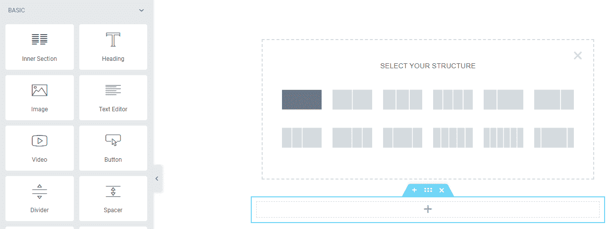

Columns and modules in Elementor


使用 Elementor 的最大好处之一是，您可以在节、列和小部件级别添加单独的 CSS 代码。当您将鼠标悬停在某个部分上时，您可以选择六点图标来打开屏幕左侧的**编辑部分**菜单:

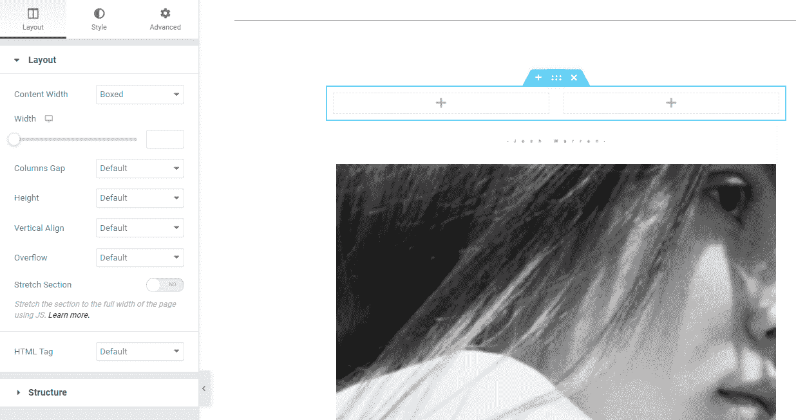

Add separate CSS code at the section, column, and widget level.


如果你移动到**编辑部分**菜单中的**高级**标签，你会看到一个**自定义 CSS** 部分。在里面，您会发现一个允许您为该特定部分添加代码的字段:

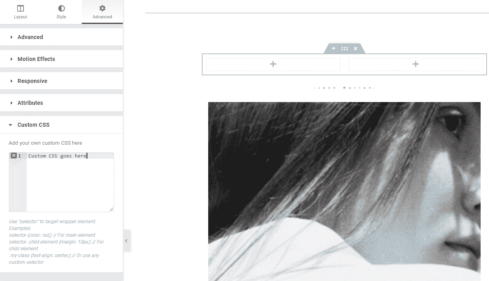

Custom CSS option is found under the “Advanced” tab


当您编辑列和小部件时，您会注意到您可以在它们各自的设置菜单中访问相同的三个选项卡。部分、栏和小部件都包括布局、样式和高级设置。

要将自定义 CSS 添加到列中，请将鼠标悬停在该列上，然后选择该元素右上角的两列图标。然后，导航到**高级**选项，打开**自定义 CSS** 部分:

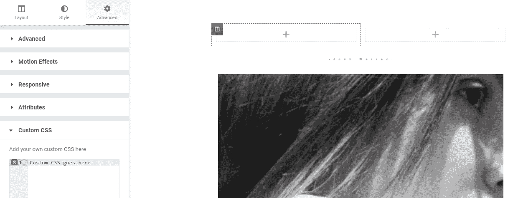

Add Custom CSS to a single column


您可以按照相同的过程向 Elementor 小部件添加自定义 CSS。只需选择您想要定制的小部件，并直接移动到**高级>定制 CSS** 选项卡:

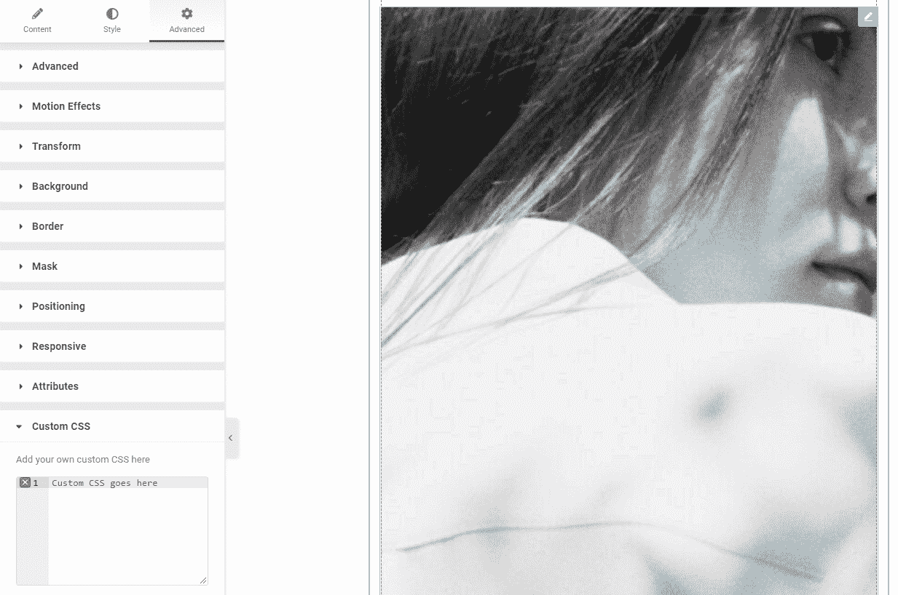

You can add CSS to a widget as well


向 Elementor 页面生成器中的特定元素添加自定义 CSS 非常简单。但是，请记住，样式将只适用于这些元素。如果您想添加影响整个网站的自定义 CSS，您需要使用不同的方法。

## 如何使用 Elementor 添加自定义 CSS 种方法)

在这一节中，我们将探索添加元素或自定义 CSS 的其他方法。我们将介绍在整个网站中应用 CSS 的方法，应用于特定的页面，元素或小部件。

### 方法 1:使用 Elementor HTML 小部件

Elementor 使您能够向它的任何小部件添加自定义 CSS。然而，在某些情况下，您可能想要使用 HTML 和 CSS 手动添加元素[。在这些情况下，您需要使用 **HTML** 小部件:](https://kinsta.com/blog/learn-html/)

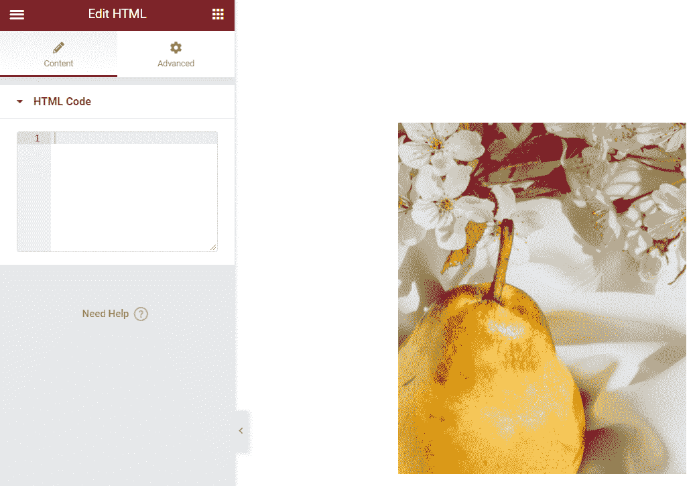

Use the HTML widget


**HTML** 小部件可以解析 HTML、CSS 和 [JavaScript](https://kinsta.com/knowledgebase/what-is-javascript/) 。你可以在 **HTML 代码**字段中添加任何你想要的代码，如果它是有效的，Elementor 会把它显示为一个小部件:

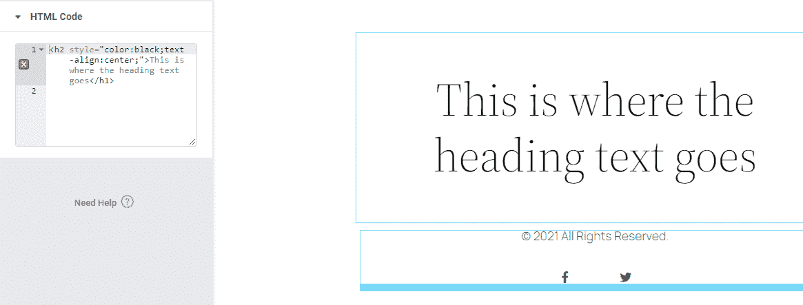

Add any code inside the widget


HTML 小部件支持内嵌和独立的 CSS。您使用小部件添加的任何代码都只会影响该单个元素。

### 方法 2:使用元素或站点设置菜单

Elementor 包括一个全局设置的集合，类似于你在 WordPress 定制器中可以找到的选项。要访问 Elementor **Site Settings** 菜单，打开编辑器并点击屏幕左上角的 hamburger 菜单:

## 注册订阅时事通讯


### 想知道我们是怎么让流量增长超过 1000%的吗？

加入 20，000 多名获得我们每周时事通讯和内部消息的人的行列吧！

[Subscribe Now](#newsletter)

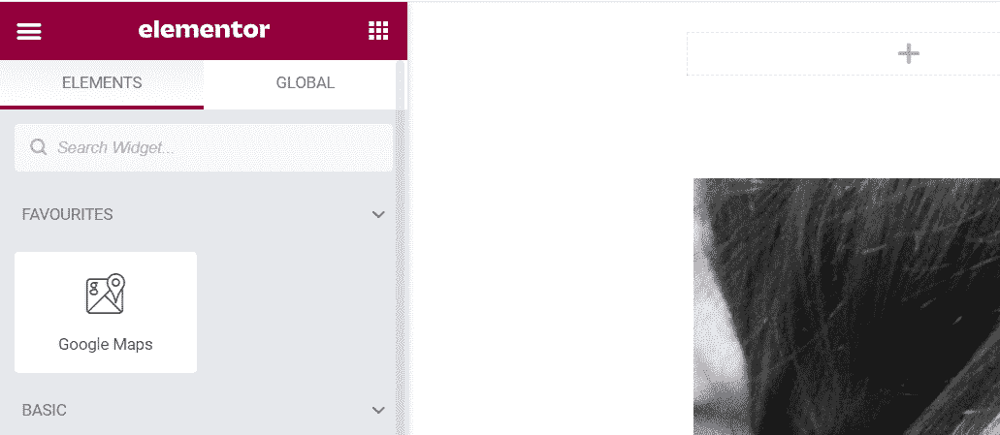

Click on the available hamburger menu


在下一页上，选择**站点设置**选项:

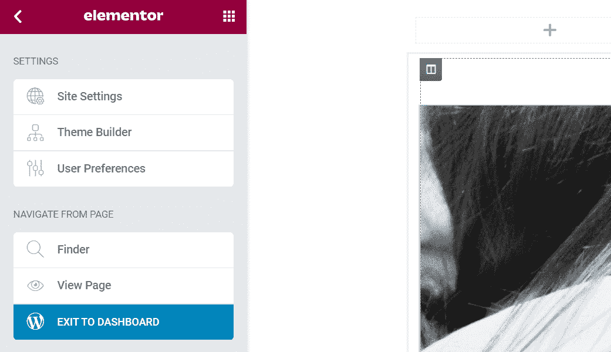

Click on the “Site Settings” option


在里面你会看到一系列的设置，让你可以自定义你的网站风格。您在此菜单中所做的任何更改都将应用到您的整个网站，即使从技术上讲您只编辑了一个页面。

你可以阅读如何使用**站点设置**菜单在 Elementor 官方网站上定制你的页面。目前，我们唯一关心的部分是**自定义 CSS** 选项卡。打开它，您将看到一个字段，它看起来就像用于节、小部件和列的自定义 CSS 选项:

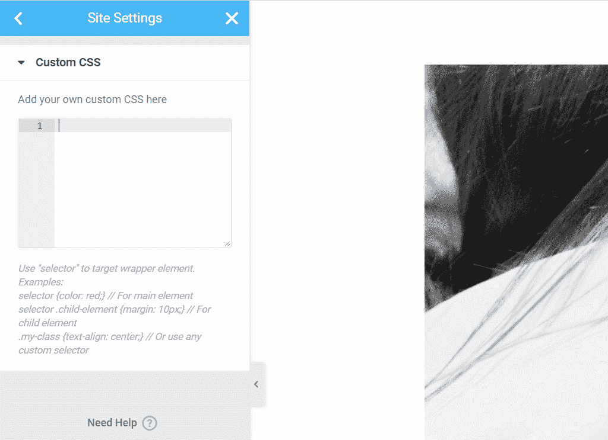

Adding custom CSS here will affect the entire site


您在此添加的任何自定义 CSS 都会影响您的整个网站。如果您只想定制特定的元素，我们建议您使用更有针对性的方法(比如将 CSS 直接添加到小部件中)。

### 方法 3:使用 WordPress 定制器

WordPress 定制器也可以让你在站点范围内添加定制的 CSS。为此，进入**外观>定制**并选择左侧菜单中的**附加 CSS** 选项:

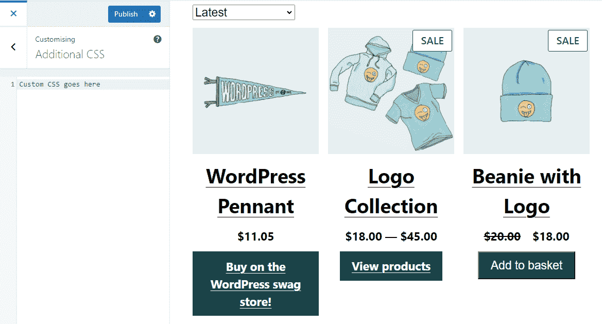

Use the WordPress Customizer to add CSS


然而，值得注意的是，Elementor 代码字段比定制器中可用的字段更加用户友好。如果您已经在使用 Elementor 构建站点，那么就没有理由通过定制器添加定制 CSS。

### 方法 4:将自定义 CSS 文件入队

如果你习惯于编辑 WordPress 文件并通过[文件传输协议(FTP)](https://kinsta.com/blog/best-ftp-clients/) 客户端访问你的网站，你可以将一个 CSS 样式表加入到 Elementor 中。这种方法要求你将代码添加到 functions.php 文件中。

要访问**functions.php**文件，通过 FTP 连接到你的网站，进入 WordPress **根目录**文件夹。打开文件夹，找到 functions.php 的**文件，并编辑它。**

Struggling with downtime and WordPress problems? Kinsta is the hosting solution designed to save you time! [Check out our features](https://kinsta.com/features/)

以下是您要添加到文件中的代码示例:

```
add_action( 'elementor/frontend/before_enqueue_scripts', function() {

wp_enqueue_script(

'custom-stylesheet',

get_stylesheet_uri()

);

} );
```

这段代码使用 **before_enqueue_scripts** 钩子来加载一个名为**的定制样式表** *的样式表。*我们还使用 **get_stylesheet_uri** 函数指向样式表在服务器中的位置。

理想情况下，您将在子主题的目录中或者在 **Themes** 文件夹本身中添加定制样式表。样式表可以包含您想要的任何元素或 CSS 代码。你添加到 functions.php**的代码片段确保了只有当 Elementor 在你的网站上激活时代码才会加载。**

### 方法 5:使用 CSS 插件

有几个插件可以让你在不使用定制器或[页面生成器](https://kinsta.com/blog/wordpress-page-builders/)的情况下给你的网站添加定制 CSS。我们最喜欢的工作工具之一叫做[简单定制 CSS 和 JS](https://wordpress.org/plugins/custom-css-js/) :

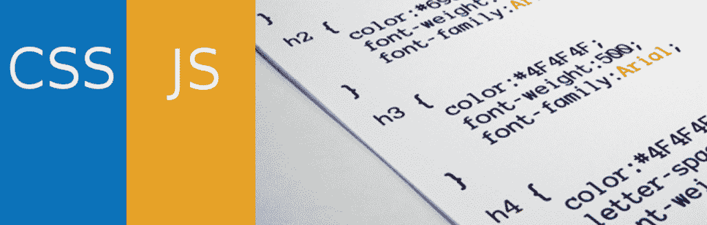

Simple Custom CSS and JS


使用简单的定制 CSS 和 JS，您可以选择直接向主题的页眉和页脚元素添加代码。首先，进入**自定义 CSS & JS >添加自定义 CSS** ，点击**添加 CSS 代码。**

一个基本的 CSS 编辑器将出现在左边。在右边，您可以配置是在外部样式表中还是在内部加载 CSS 代码。您还可以决定代码应该放在页眉还是页脚中:

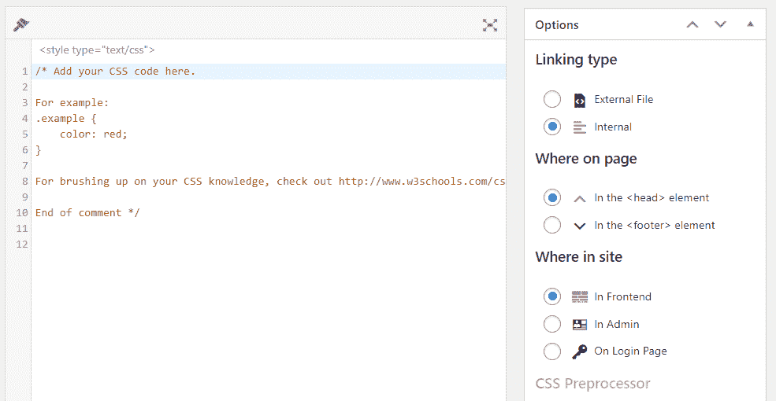

Load code on an external stylesheet


当你编辑完 CSS 代码后，点击**发布**按钮。您可能需要切换到前端视图来查看运行中的代码。

## 使用 Elementor 创建自定义 CSS 的最佳实践

无论何时你处理定制 CSS 或者添加任何类型的代码到你的网站，你最好记住下面的最佳实践。让我们从使用一个子主题开始。

### 使用 WordPress 子主题

如果你想用 CSS 改变你的主题风格的任何部分，我们建议你[使用子主题。“子”主题是继承指定主题的所有样式的模板。](https://kinsta.com/blog/wordpress-child-theme/)

这样，如果您对原始主题进行任何更改，它们不会影响您添加到子主题的自定义。此外，当你更新你的主题，它会保留这些变化。

### 使用代码预处理器来简化编写

在 WordPress 中添加代码或使用 Elementor 的最大挑战之一是，你无法获得现代代码编辑器提供的所有功能。我们建议您[使用您最喜欢的预处理器](https://kinsta.com/blog/free-html-editor/)，而不是使用基本的现场编辑器来争论代码。然后，你可以简单地复制并粘贴你的代码到 WordPress。

### 考虑使用分期网站

当你计划对 WordPress 做任何大的改变时，我们建议你使用一个升级网站。临时站点使您能够测试样式和功能的变化，而没有破坏您的活动站点的风险。

一些 web 主机为您提供了从控制面板访问登台功能的权限。如果您使用 Kinsta，您可以使用 [MyKinsta 仪表板](https://kinsta.com/mykinsta/)选择您的网站，并在实时和临时环境之间来回切换:

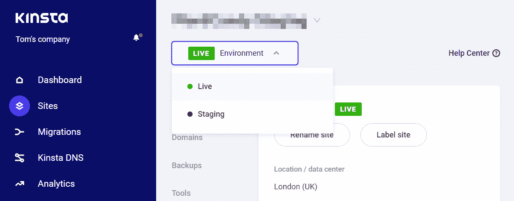

The staging environment in MyKinsta


如果你的 web 主机没有提供 [staging 功能](https://kinsta.com/help/staging-environment/)，你可以使用一个本地的 WordPress 开发环境，比如 [DevKinsta](https://kinsta.com/devkinsta/) 进行测试。或者，你可能想考虑转换主机提供商。

[Want to gain even more control over your site? 👀 CSS is the best place to start 🚀Click to Tweet](https://twitter.com/intent/tweet?url=https%3A%2F%2Fbit.ly%2F3uLJBVd&via=kinsta&text=Want+to+gain+even+more+control+over+your+site%3F+%F0%9F%91%80+CSS+is+the+best+place+to+start+%F0%9F%9A%80&hashtags=CSS%2CElementor) ## 摘要

添加元素或自定义 CSS 比您想象的要简单。页面生成器提供了多种方法，用于向部分、列、小部件以及整个网站添加代码。

概括地说，这里有五种主要的方法来添加自定义 CSS 到 Elementor(或者你的网站):

1.  使用 Elementor HTML 小部件。
2.  使用元素或站点设置菜单。
3.  使用 WordPress 定制器。
4.  将自定义 CSS 文件入队。
5.  使用 CSS 插件。

在 Kinsta，我们的计划旨在帮助您使用 Elementor 这样的页面生成器来构建您梦想中的网站。查看[我们的计划](https://kinsta.com/plans/)或咨询销售人员，寻找适合您的计划。

* * *

让你所有的[应用程序](https://kinsta.com/application-hosting/)、[数据库](https://kinsta.com/database-hosting/)和 [WordPress 网站](https://kinsta.com/wordpress-hosting/)在线并在一个屋檐下。我们功能丰富的高性能云平台包括:

*   在 MyKinsta 仪表盘中轻松设置和管理
*   24/7 专家支持
*   最好的谷歌云平台硬件和网络，由 Kubernetes 提供最大的可扩展性
*   面向速度和安全性的企业级 Cloudflare 集成
*   全球受众覆盖全球多达 35 个数据中心和 275 多个 pop

在第一个月使用托管的[应用程序或托管](https://kinsta.com/application-hosting/)的[数据库，您可以享受 20 美元的优惠，亲自测试一下。探索我们的](https://kinsta.com/database-hosting/)[计划](https://kinsta.com/plans/)或[与销售人员交谈](https://kinsta.com/contact-us/)以找到最适合您的方式。