# 2022 年 WordPress 从 HTTP 到 HTTPS 的深度迁移指南

> 原文：<https://kinsta.com/blog/http-to-https/>

2018 年 7 月，谷歌 Chrome 开始将所有非 HTTPS 网站标记为“不安全”，无论它们是否收集数据。从那以后，HTTPS 变得比以往任何时候都更加挑剔！

在今天的帖子中，我们将深入探讨 HTTP 到 HTTPS 的迁移，并分享一些实用的技巧，希望能让你的 WordPress 站点尽可能平稳地过渡。对于 WordPress 网站所有者来说，如果你能积极主动，那总是很好的。

由于新的网络协议，搜索引擎优化的好处，甚至更准确的推荐数据，现在是将你的 WordPress 网站迁移到 HTTPS 的最佳时机。在下面找到更多的原因和方法。

## 什么是 HTTPS？

HTTPS(安全超文本传输协议)是一种允许您的浏览器或 web 应用程序安全连接到网站的机制。HTTPS 是帮助您确保浏览安全的措施之一。

这包括登录你的银行网站，获取信用卡信息，甚至登录你的 WordPress 网站的后端。你的 WordPress 网站上的 HTTPS 要求你有一个加密的 SSL 证书。这确保了不会以纯文本形式传递任何数据。

据 [Builtwith](http://trends.builtwith.com/ssl/SSL-by-Default) 统计，截至 2022 年 3 月，排名前 10000 的网站中有 73.08%在使用 HTTPS。这一比例高于 2018 年 2 月的 49.8%；


> Kinsta 把我宠坏了，所以我现在要求每个供应商都提供这样的服务。我们还试图通过我们的 SaaS 工具支持达到这一水平。
> 
> <footer class="wp-block-kinsta-client-quote__footer">
> 
> 
> 
> <cite class="wp-block-kinsta-client-quote__cite">Suganthan Mohanadasan from @Suganthanmn</cite></footer>

[View plans](https://kinsta.com/plans/)

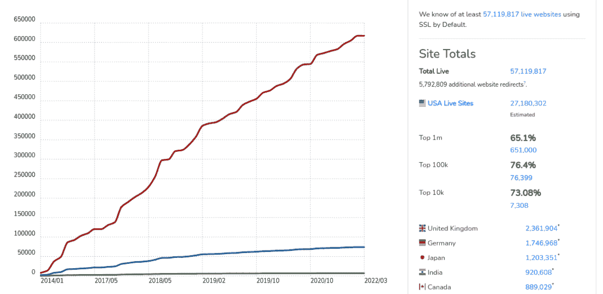

Top website’s HTTPS usage


据 MozCast 报道，截至 2022 年 5 月，超过 98.9%的搜索查询来自 HTTPS，高于 2016 年 1 月的 26%。这表明很多网站正在从 HTTP 迁移到 HTTPS。

[Need to make the move from HTTP ➡️ HTTPS? This guide is here to help! 🚀Click to Tweet](https://twitter.com/intent/tweet?url=https%3A%2F%2Fkinsta.com%2Fblog%2Fhttp-to-https%2F&via=kinsta&text=Need+to+make+the+move+from+HTTP+%E2%9E%A1%EF%B8%8F+HTTPS%3F+This+guide+is+here+to+help%21+%F0%9F%9A%80&hashtags=HTTPS%2CSiteSecurity)

甚至谷歌也在推动其产品和服务的 100%加密标志。截至 2022 年 5 月，谷歌约 95%的流量来自 HTTPS，而 2013 年 12 月这一比例为 48%。


MozCast HTTPS queries


根据 Firefox 遥测数据和[让我们加密统计数据](https://letsencrypt.org/stats/)，现在超过 78%的页面负载是 HTTPS。

## 你为什么要关心 HTTPS？

WordPress 网站所有者应该关心 HTTPS，考虑现在而不是以后从 HTTP 迁移到 HTTPS 的原因有很多。

### **1。安全性**

当然，HTTPS 最大的原因是增加了安全性。通过从 HTTP 迁移到 HTTPS，您现在通过加密的 SSL/TLS 连接为您的网站提供服务。这意味着数据和信息不再以纯文本形式传递。对于处理信用卡信息的电子商务网站来说，这是必备的。法律在技术上没有要求这样做[，但作为一家企业，保护客户的数据是你的责任。](http://www.slideshare.net/termsfeed/is-ssl-certificate-required-by-law-for-ecommerce-stores)

这也适用于你的 WordPress 登录页面或博客。如果你通过 HTTP 运行多个作者的 WordPress 网站，每次有人登录时，信息都会以纯文本的形式传递给服务器。HTTPS 对于维护安全的网站和浏览器连接至关重要。这样，您可以更好地防止黑客访问您的网站。

### **2。SEO**

谷歌官方称 [HTTPS 是排名因素](https://webmasters.googleblog.com/2014/08/https-as-ranking-signal.html)。虽然这只是一个很小的排名因素，但你们中的大多数人可能会利用你能[在 SERPs 中获得的任何优势来击败你的竞争对手](https://kinsta.com/blog/wordpress-seo/)。

由于谷歌推动每个人将 HTTP 重定向到 HTTPS，你可以打赌这个排名因素的权重在未来很可能会增加。Semrush 的一项研究发现，谷歌上 98%表现最好的精选片段内容使用了 HTTPS。

### **3。信任和可信度**

根据最近的研究，大多数互联网用户担心他们的数据如何在网上被截取或滥用。

HTTPS 可以通过建立我们所说的 SSL 信任来帮助你的企业。通过看到您的[网址](https://kinsta.com/knowledgebase/what-is-a-url/)旁边的挂锁图标，客户会更加放心，因为他们的数据更加安全。

### **4。转诊数据**

这个原因是为了你们所有的营销人员。如果你使用[谷歌分析](https://kinsta.com/blog/how-to-use-google-analytics/)，你可能对推荐数据很熟悉。许多人没有意识到 HTTPS 到 HTTP 的推荐数据在谷歌分析中被屏蔽了。那么数据会发生什么变化呢？大部分只是和“直接交通”部分混为一谈。如果有人从 HTTP 转到 HTTPS，referrer 仍然会被传递。

这也很重要，因为如果你的推荐流量突然下降，但直接流量上升，这可能意味着你的一个更大的推荐人最近迁移到 HTTPS。反之亦然。查看 Moz 关于 [direct traffic](https://moz.com/blog/guide-to-direct-traffic-google-analytics) 的更深入的指南。

### **5。铬警告**

[截至 2018 年](https://blog.chromium.org/2018/02/a-secure-web-is-here-to-stay.html)，Chrome 68 及更高版本已经将所有非 HTTPS 网站标记为“不安全”，即使它们不收集数据:

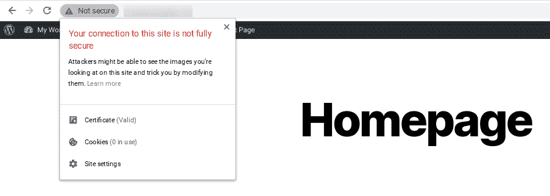

Connection not secure on Chrome


2021 年，浏览器开始默认 HTTPS 不完整的网址。例如，如果用户键入“domain.com”，Chrome 将自动使用“https://domain.com”。如果 https 因为缺少 SSL/TLS 而失败，它将恢复到 HTTP。

Chrome 拥有超过 77%的浏览器市场份额，所以这将会影响你的许多访问者。你也可以在谷歌分析的**受众** > **技术** > **浏览器&操作系统**下查看你的访客正在使用哪些浏览器:

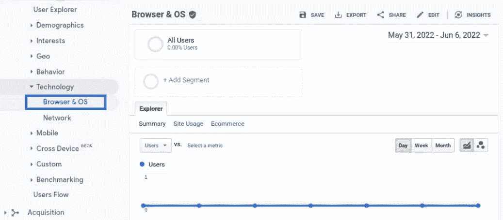

Checking browsers in Google Analytics


谷歌向访问者明确表示，你的 WordPress 网站可能无法在安全的连接上运行。以下是谷歌关于如何避免警告的一些提示。

火狐也在 2017 年发布了火狐 51 的[版本，显示了一个灰色的挂锁，上面有一条红线，用于收集密码的不安全网站。当然，如果您将整个站点迁移到 HTTPS，那么您不必担心这一点:](https://blog.mozilla.org/security/2017/01/20/communicating-the-dangers-of-non-secure-http/)

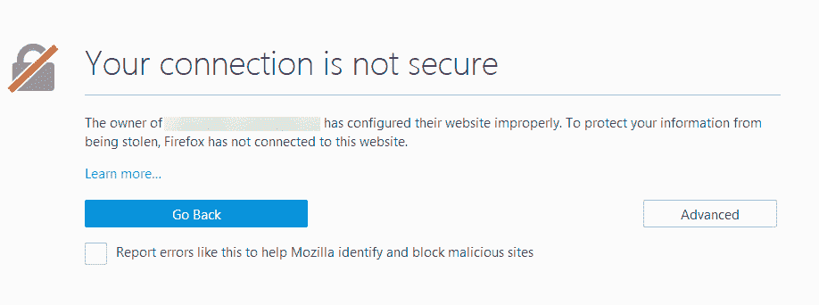

Connection not private


如果你还没有迁移到 HTTPS，你也可能开始从[谷歌搜索控制台](https://kinsta.com/blog/google-search-console/)收到以下警告:

致:http://www.domain.com 的所有者

以下网址包括密码或信用卡详细信息的输入字段，将触发新的 Chrome 警告。查看这些示例，了解这些警告将出现在哪里，您可以采取措施来帮助保护用户的数据。该列表并不详尽。

http://www.domain.com

新的警告是一项长期计划的第一步，该计划将所有通过非加密 HTTP 协议提供的页面标记为“不安全”

### **6。性能**

最后但同样重要的是，我们有性能。由于有一个叫做 HTTP/2 的协议，那些在 HTTPS 上运行适当优化的网站经常可以看到速度的提高。

由于浏览器支持，HTTP/2 需要 HTTPS。性能的提高是由于各种原因，例如 HTTP/2 能够支持更好的多路复用、并行性、带霍夫曼编码的 HPACK 压缩、ALPN 扩展和服务器推送。过去有相当多的 TLS 开销在 HTTPS 上运行，但是现在少多了。

[TLS 1.3](https://kinsta.com/blog/tls-1-3/) 也发布了，这将进一步加快 HTTPS 的连接速度！Kinsta 在我们所有的服务器和我们的 Kinsta CDN 上支持 TLS 1.3。

还需要注意的是，web 性能优化(如域分片和连接)会损害您的性能。这些现在已经过时，并且在很大程度上不应该再使用。

默认情况下，网络上的所有内容都应该加密。–[杰夫·阿特伍德](https://blog.codinghorror.com/lets-encrypt-everything/)，Stack Overflow 的联合创始人

## **HTTP 到 HTTPS 移民指南**

是时候进入有趣的部分了:将你的 WordPress 站点从 HTTP 迁移到 HTTPS。让我们先回顾一下一些基本要求，以及一些需要注意的事项。

*   您将需要一个 SSL 证书。我们将在下面更详细地介绍这一点。
*   仔细检查以确保你的 WordPress 主机和 CDN 提供商支持 HTTP/2。Kinsta 为我们所有的客户提供 HTTP/2 支持。这不是必需的，但是为了提高性能，您可能需要这样做。
*   您将需要留出一段时间来将 HTTP 重定向到 HTTPS。迁移不是 5 分钟就能完成的。
*   仔细检查以确保您使用的所有外部服务和脚本都有可用的 HTTPS 版本。
*   重要的是要知道，除非你使用支持分享恢复的[插件](https://warfareplugins.com/social-share-count-recovery/)，否则你将会失去所有帖子和页面的社交分享计数。这是因为你的分享计数是基于一个查看 HTTP 版本的 API，而你对第三方社交网络没有控制权。
*   根据你网站的大小，谷歌可能需要一段时间来重新抓取你所有的新 HTTPS 网页和帖子。在此期间，你可以看到流量或排名的变化。
*   别忘了[本地引用](http://searchengineland.com/going-https-dont-forget-local-citations-261489)。

我们建议在开始之前关闭你的 CDN 集成并禁用任何缓存插件，因为这些会使事情变得复杂。

### **1。选择 SSL 证书**

如果您没有 SSL 证书，那么您需要做的第一件事就是购买证书。有三种主要类型的证书可供选择:

*   域验证:单个域或子域(电子邮件或 DNS 验证)，几分钟内发布。这些通常可以低至每年 9 美元的价格购买。
*   业务/组织验证:单个域或子域需要业务验证，这提供了更高的安全/信任级别，在 1-3 天内发布。
*   扩展验证:单个域或子域需要业务验证，这提供了更高的安全/信任级别，在 2-7 天内发布。

在 Kinsta，我们通过我们的 [Cloudflare 集成](https://kinsta.com/cloudflare-integration/)为所有站点提供免费的 Cloudflare SSLs。我们的 Cloudflare SSLs 是在您在 MyKinsta 中配置一个域后自动发布的，它们甚至提供了通配符域支持！

谷歌建议使用 2048 位密钥证书或更高版本。您可以从 [Comodo](https://ssl.comodo.com/) 、 [DigiCert](https://www.digicert.com/) 、 [GeoTrust](https://www.geotrust.com/ssl/) 、 [Thawte](https://www.thawte.com/ssl/) 、 [Rapid SSL](https://www.rapidssl.com/) 或 [Trustwave](https://ssl.trustwave.com/) 购买证书。还有更便宜的替代品，比如 [GoGetSSL](https://www.gogetssl.com/) 、 [Namecheap](https://www.namecheap.com/) 和 [GoDaddy](https://kinsta.com/godaddy-alternative/) 。

#### **让我们加密**

[让我们加密](https://kinsta.com/blog/free-ssl-certificate/)还提供了一种获得免费 SSL 证书的方法。检查你的 WordPress 主机和 CDN 提供商，看看他们是否有加密集成。你也可以按照[证书机器人指南](https://certbot.eff.org/)手动安装它们。让我们加密每 90 天到期的证书，因此有一个自动化系统是必不可少的。

### **2。安装自定义 SSL 证书**

如果你已经购买了 SSL 证书，你需要[在你的 WordPress 站点](https://kinsta.com/help/how-to-install-ssl-certificate/)上安装 SSL 证书。在检查供应商设置的证书时，会要求您提供服务器类型。如果你是 Kinsta 的客户，我们的[网络服务器是 Nginx](https://kinsta.com/knowledgebase/what-is-nginx/) 。如果该选项不可用，那么**其他**也将工作。

SSL 提供者需要一个 CSR 代码来创建/签署证书文件。要生成 CSR 代码和 RSA 密钥，请完成以下表格:[https://www.ssl.com/online-csr-and-key-generator/](https://www.ssl.com/online-csr-and-key-generator/)。

我们建议填写每个字段，但至少应填写以下内容(如下图所示):

*   通用名称(域名)
*   电子邮件地址
*   组织
*   城市/地区
*   州/县/地区
*   国家

注意:对于通用名称字段，如果您正在生成通配符证书，您将需要输入您的域名，如*.domain.com。

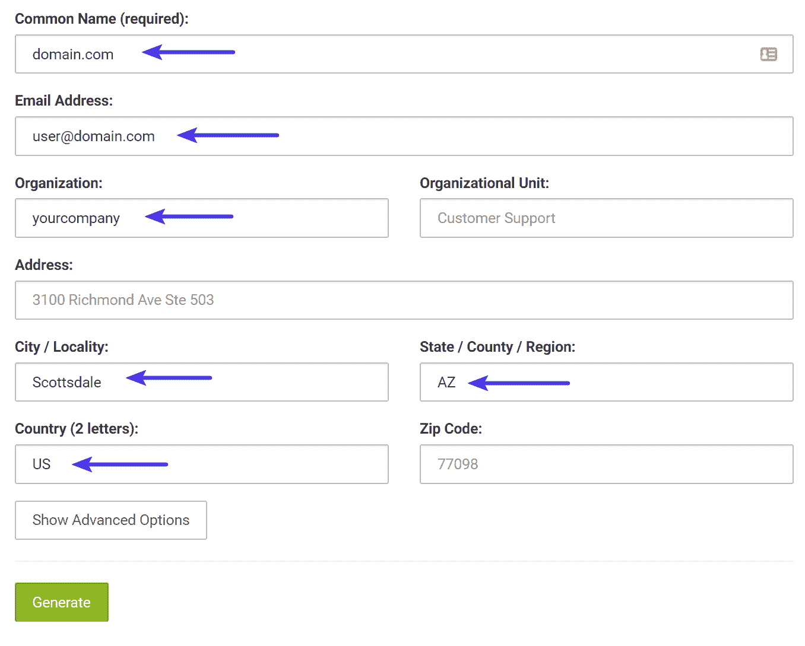

Generate CSR form


该表单将生成您的私钥文件和 CSR。请务必保存它们，因为没有它们，证书将无法使用:

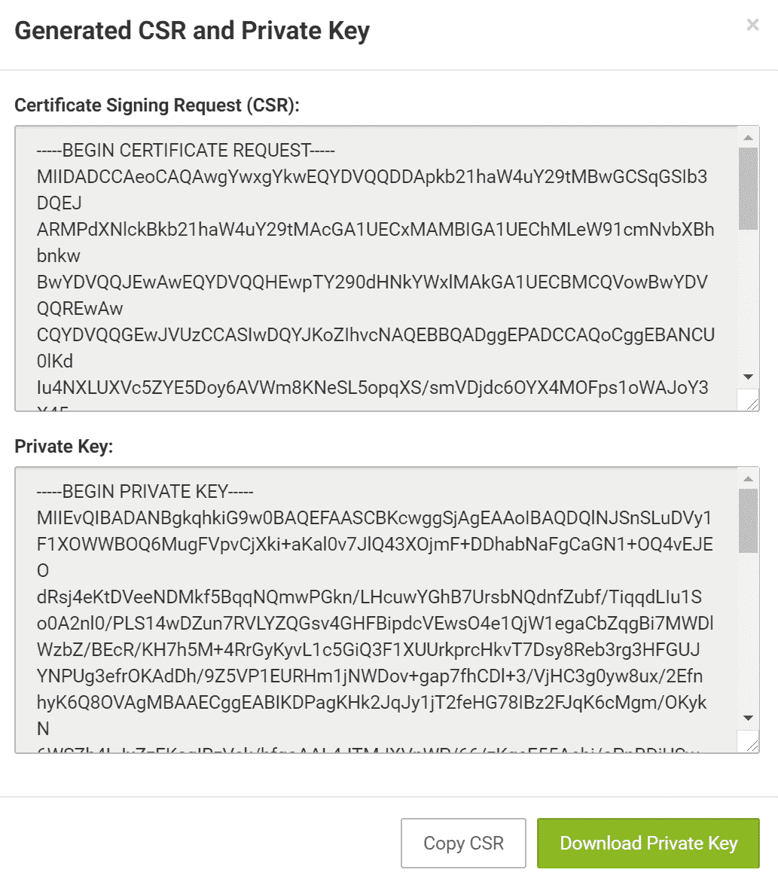

CSR and private key


接下来，向您的 SSL 提供商上传您的 CSR 以重新生成您的 SSL 证书。证书)。

然后你需要去你的 WordPress 主机，给他们证书和私人密钥。如果您是 Kinsta 的客户，您可以登录仪表板并点击某个网站。接下来，转到**域**选项卡并选择您的域，然后点击**自定义 SSL** 按钮:

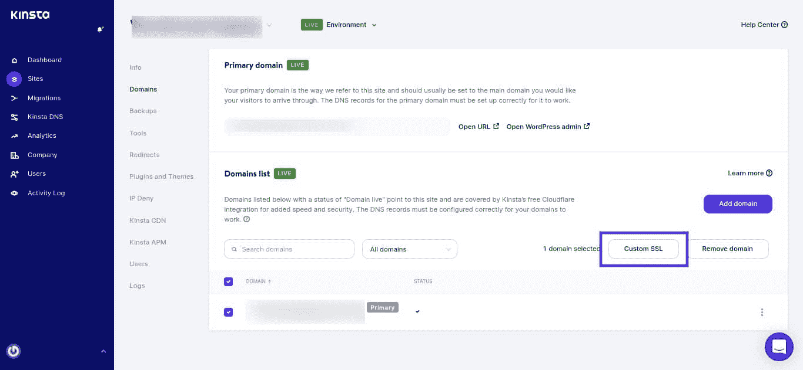

Add custom SSL


然后，您就可以在这里添加您的私钥和证书了:

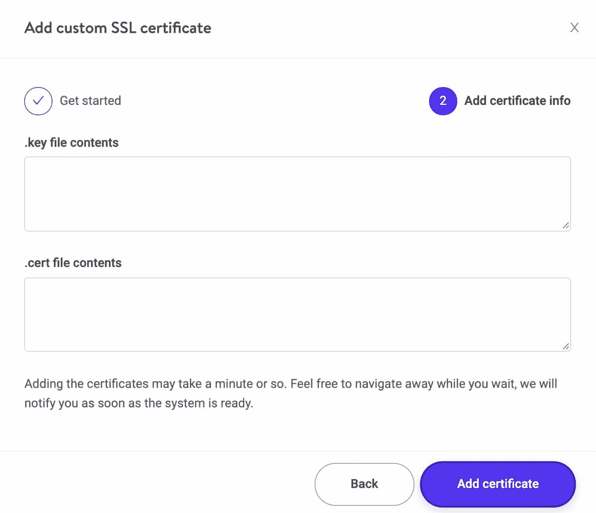

Add private key


完成后，选择**添加证书**保存您的更改。

### **3。验证您的 SSL 证书**

现在您已经安装了 SSL 证书，您需要验证它以确保一切设置正确。一种快速简单的方法是使用 Qualys SSL Labs 提供的免费 [SSL 检查工具](https://www.ssllabs.com/ssltest/analyze.html)。如果一切都是正确的，您应该在测试中获得 A 字母等级，如下所示:

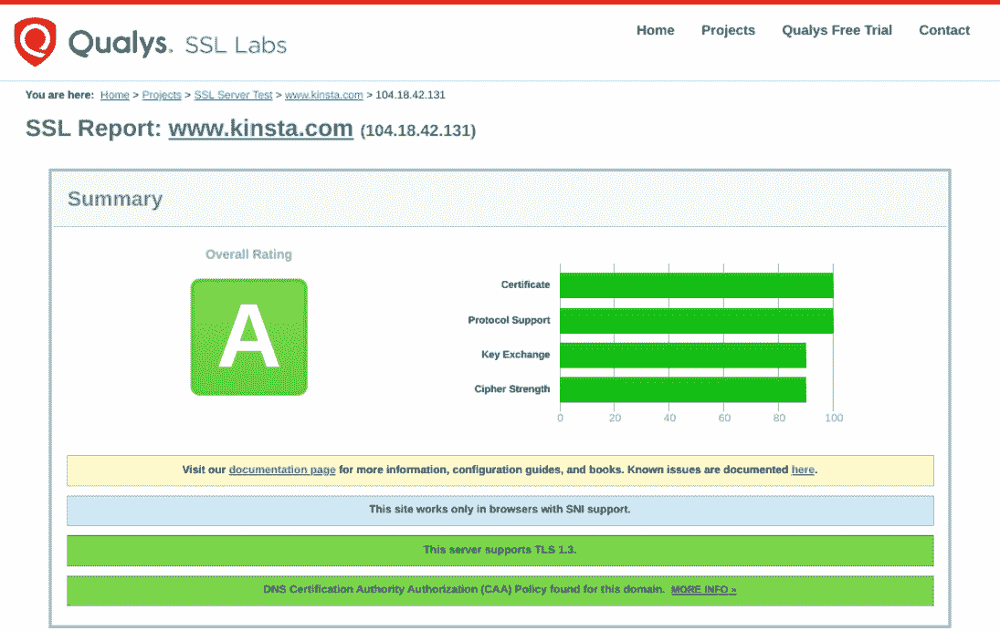

Check SSL certificate grade


查看我们关于如何执行 SSL 检查的更深入的教程。

### **4。将 HTTP 重定向到 HTTPS**

在您验证了 SSL 证书之后，接下来您必须永久地[将所有 HTTP 流量重定向到 HTTPS](https://kinsta.com/knowledgebase/redirect-http-to-https/) 。在 WordPress 中将 HTTP 重定向到 HTTPS 时有几个选项。

如果你是 Kinsta 的客户，使用我们的强制 HTTPS 工具是最简单的方法。这使您只需在服务器级别单击几下，就可以自动将 HTTP 流量重定向到 HTTPS。你也可以在你的网络服务器配置中手动完成，或者使用免费的 [WordPress 插件](https://kinsta.com/best-wordpress-plugins/)。

注意:我们的例子都包含了一个 [301 重定向](https://kinsta.com/help/redirect-rules/)指令，这是实现 SEO 的正确方法。使用不同类型的重定向可能会损害您的排名。同样重要的是要知道，301 重定向可能不会通过 100%的链接果汁，即使谷歌可能会说他们这样做。查看来自 Moz 的 Cyrus 关于 [HTTPS 迁移和 301 重定向](https://moz.com/blog/301-redirection-rules-for-seo)的帖子。

#### **选项 1:在 MyKinsta 上将 HTTP 重定向到 HTTPS**

如果你是一个 Kinsta 用户，你可以很容易地使用 MyKinsta 将 HTTP 重定向到 HTTPS。这是一个很好的选择，因为它消除了在你的网站上安装插件的需要。

首先，登录 [MyKinsta](https://my.kinsta.com/) 仪表盘，浏览你的网站，然后点击**工具**。

接下来，选择**下的**使能**按钮，强制 HTTPS:**

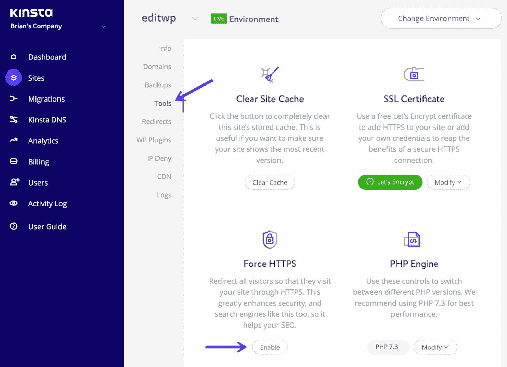

Force HTTPS redirect tool


。

您可以使用您的主域作为目标或请求的备用域。然后，点击**强制 HTTPS** :

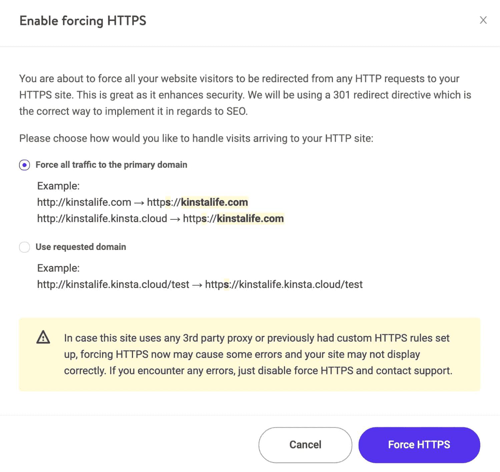

Force HTTPS options


如果您配置了自定义的 HTTPS 规则或者使用了第三方代理，那么在强制 HTTPS 时可能会遇到一些问题。如果您遇到任何错误，您可以禁用 HTTPS 强制，然后寻求 Kinsta 支持的帮助。

#### **选项 2:在 Nginx 中将 HTTP 重定向到 HTTPS**

如果您的 web 服务器运行的是 Nginx，您可以通过将以下代码添加到 Nginx 配置文件中，轻松地将 HTTP 重定向到 HTTPS:

```
server {

listen 80;

server_name domain.com www.domain.com;

return 301 https://domain.com$request_uri;

}
```

这是重定向运行在 Nginx 上的 WordPress 的推荐方法。

在 Apache 中将 HTTP 重定向到 HTTPS

[如果您的 web 服务器运行 Apache](https://kinsta.com/knowledgebase/what-is-apache/) ，您可以通过向您的[添加以下代码，将所有 HTTP 流量重定向到 HTTPS。htaccess](https://kinsta.com/knowledgebase/wordpress-htaccess-file/) [文件](https://kinsta.com/knowledgebase/wordpress-htaccess-file/):

```
RewriteEngine On

RewriteCond %{HTTPS} off

RewriteRule ^(.*)$ https://%{HTTP_HOST}%{REQUEST_URI} [L,R=301]
```

这是重定向在 Apache 上运行的 WordPress 的推荐方法。

Kinsta 的服务器都没有运行 Apache。

#### **选项 3:用非常简单的 SSL 插件将 HTTP 重定向到 HTTPS**

你必须从 HTTP 重定向到 HTTPS 的第三个选择是使用免费的 WordPress [非常简单的 SSL](https://wordpress.org/plugins/really-simple-ssl/) 插件:

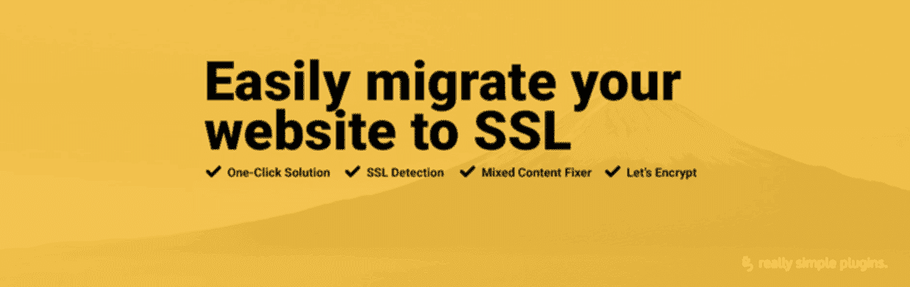

Really Simple SSL


我们不建议将这种方法作为永久的解决方案，因为第三方插件会带来另一层问题和兼容性问题。这是一个很好的临时解决方案，但是您应该更新您的硬编码 HTTP 链接，我们将在下一步中向您展示。

实施 HSTS 割台(可选)

## 注册订阅时事通讯


### 想知道我们是怎么让流量增长超过 1000%的吗？

加入 20，000 多名获得我们每周时事通讯和内部消息的人的行列吧！

[Subscribe Now](#newsletter)

HSTS([HTTP Strict Transport Security](https://en.wikipedia.org/wiki/HTTP_Strict_Transport_Security))是一个添加到 web 服务器上的安全头，当一个站点在 HTTPS 上运行时，它会强制浏览器使用安全连接。这有助于防止中间人攻击(MitM)和 cookie 劫持。您可以将上述 301 重定向与 HSTS 标头一起使用。查看我们关于[如何添加 HSTS](https://kinsta.com/knowledgebase/hsts-strict-transport-security/) 的深度文章。

### **5。检查是否有太多重定向**

在添加了从 HTTP 到 HTTPS 的重定向之后，您应该仔细检查以确保您没有[太多的重定向](https://kinsta.com/blog/err_too_many_redirects/)。这个问题很常见，会影响你的 WordPress 站点的速度。你可以使用[帕特里克·塞克斯顿的重定向映射工具](https://varvy.com/tools/redirects/)快速查看你的网站上有多少重定向。

下面你会看到一个错误设置重定向的例子。使用重定向映射器时，很容易发现这一点:

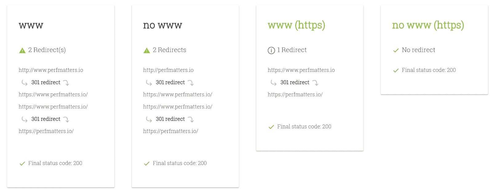

Redirects not setup correctly


您可以看到，在 www 和非 www 版本上都出现了重复的 HTTPS 重定向。

以下是正确设置重定向的示例:

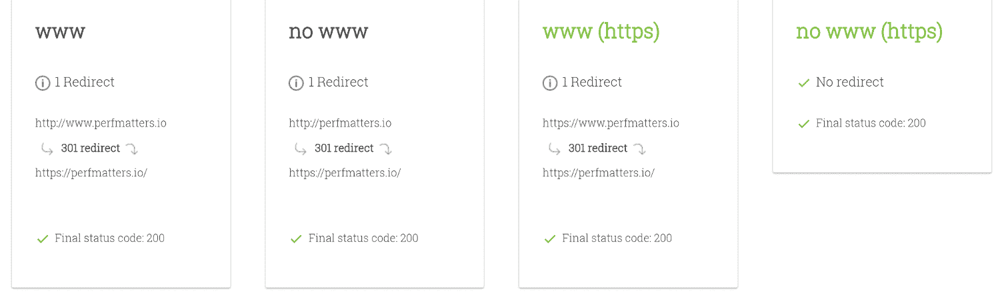

Redirects set up correctly


如您所见，只有一个重定向。你可以看看我们关于 [WordPress 重定向](https://kinsta.com/blog/wordpress-redirect/)和更快性能的最佳实践的深度文章。

### **6。更新硬编码的 HTTP 链接**

现在有了重定向，是时候修复所有那些硬编码的 HTTP URLs 了。一般不建议硬编码 URL。然而，随着时间的推移，你很可能会(我们都这样做)。下面是几个更新你的 HTTP 链接到 HTTPS 的选项。

#### **选项 1: Kinsta 搜索和替换工具**

如果您是 Kinsta 的客户，我们的 MyKinsta 仪表板中有一个易于使用的[搜索和替换工具](https://kinsta.com/knowledgebase/wordpress-search-and-replace/):

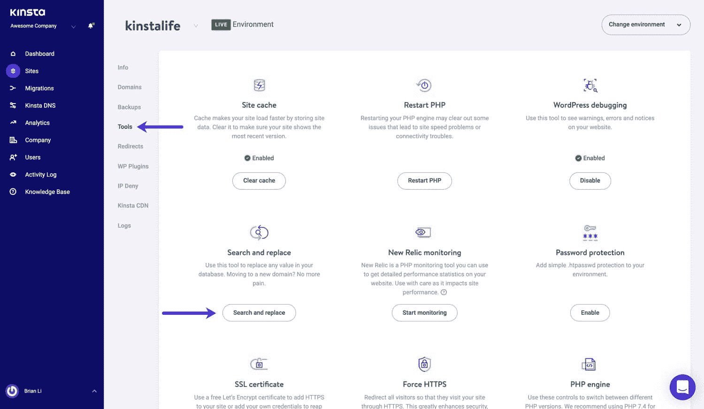

Kinsta search and replace tool


以下是将 HTTP 网址更新为 HTTPS 网址的简单步骤:

1.  在搜索字段中输入您想要在[数据库](https://kinsta.com/knowledgebase/wordpress-database/)中搜索的值，在本例中是我们的 HTTP 域:http://kinstalife.com。
2.  在替换字段中输入用于替换您正在搜索的值的新值。在这种情况下，它是我们 https://kinstalife.com HTTPS 的领地。
3.  点击**替换**按钮，开始搜索和替换过程。

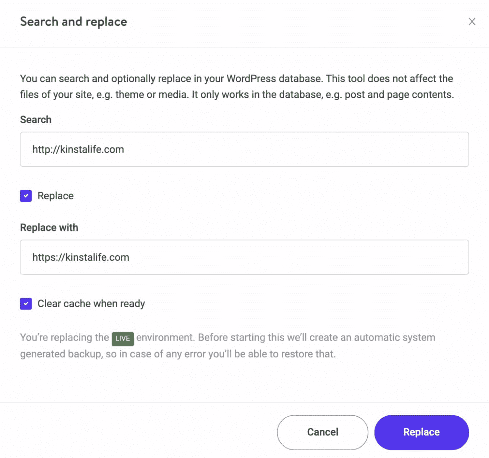

Search and replace options


查看我们的[搜索和替换教程](https://kinsta.com/knowledgebase/wordpress-search-and-replace/#kinsta-search-replace-tool)，或者点击下面的视频指南了解更多详情。

#### **选项 2:更好的搜索替换插件**

你可以使用的另一个简单工具是一个免费插件，叫做 [Better Search Replace](https://wordpress.org/plugins/better-search-replace/) ，由[美味大脑](https://deliciousbrains.com/)的 WordPress 团队开发；

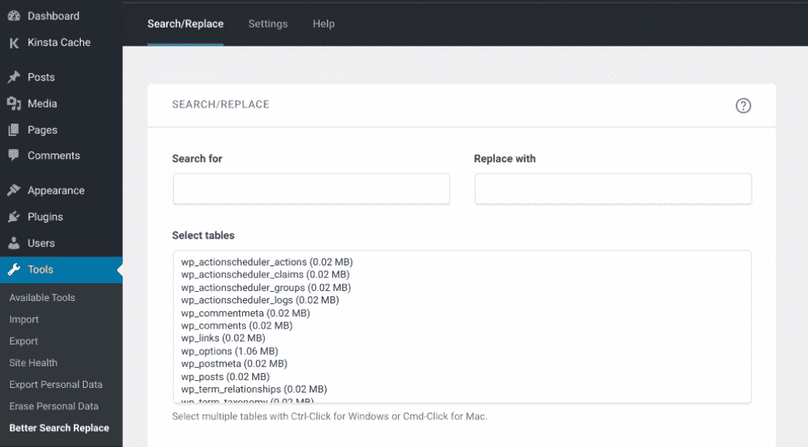

Better search replace options


该插件可以免费使用。一旦在您的网站上安装并激活，您可以导航到**工具** > **更好的搜索替换**开始使用它。

#### **选项 3:互连/it 搜索替换数据库 PHP 脚本**

运行 WordPress 搜索和替换的第三个选项是使用来自 interconnect/it 的免费 PHP 脚本，名为 [Search Replace DB](https://interconnectit.com/products/search-and-replace-for-wordpress-databases/) 。对于任何 HTTP 到 HTTPS 的迁移，这是我们最喜欢的工具之一。

重要！如果你不知道自己在做什么，使用这个脚本可能会破坏你的 WordPress 网站。如果你不愿意这样做，请先咨询一下开发者或者你的网站管理员。

要使用该脚本，只需[下载 zip 文件](https://interconnectit.com/products/search-and-replace-for-wordpress-databases/)，解压名为 *search-replace-db-master* 的文件夹，并将其重命名为其他名称。在我们的例子中，我们将其重命名为 *update-db-1551* 。然后，通过 [FTP、SFTP](https://kinsta.com/knowledgebase/ftp-vs-sftp/) 或 SCP 将它上传到你的网络服务器的公共目录。这通常是包含您的/wp-content 文件夹的同一目录。

然后在浏览器中导航到您的秘密文件夹，例如 https://domain.com/update-db-1551:

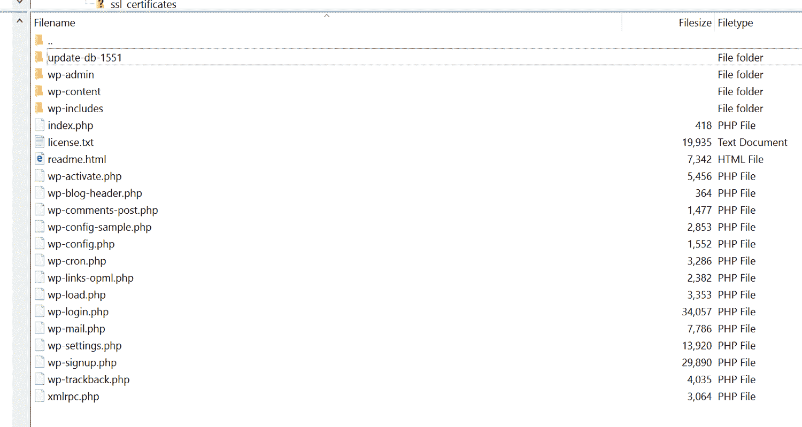

Interconnect search and replace script


该脚本将自动尝试查找并填充数据库字段，但是您必须检查详细信息是否正确，以及它是否适用于您希望对其执行搜索/替换操作的数据库。你可以先点击****运行**看看它会更新/替换什么。然后当你准备好了，点击**实时运行，**，这将执行数据库更新和 WordPress 搜索和替换。**

 **HTTPS 迁移的一个例子是将“http://yourdomain.com”替换为“https://yourdomain.com”


Search replace options


出于安全原因，完成后删除该脚本也很重要。你可以点击**删除我**按钮。如果你不这样做，它可能会让你的网站容易受到攻击。

还建议在您的 web 服务器上仔细检查，确认文件夹/脚本已经完全删除。注意:这个脚本将更新你数据库中的所有条目，包括你的 WordPress 站点 URL，页面和文章上的硬编码链接等等。

如果你在你的**wp-config.php**文件中硬编码了你的主页、网站或 WP 内容区域，确保将它们更新到 HTTPS:

```
define('WP_HOME', 'https://yourdomain.com');

define('WP_SITEURL', 'https://yourdomain.com');

define( 'WP_CONTENT_URL', 'https://yourdomain.com/wp-content' );
```

如果你有一个 CDN 并且使用一个 CNAME，比如 cdn.domain.com，你可能还想再运行一次上面的脚本来查找任何硬编码的 http://cdn.domain.com URL 并且用 https://cdn.domain.com 替换它们。

Struggling with downtime and WordPress problems? Kinsta is the hosting solution designed to save you time! [Check out our features](https://kinsta.com/features/)

#### **选项 4:用 WP-CLI 搜索并替换**

您还可以使用 WP-CLI 更新您的链接，以方便不喜欢离开命令行的技术人员和开发人员。我们建议查看这个高级[搜索并替换 WP-CLI 指南](https://guides.wp-bullet.com/advanced-wordpress-database-https-search-replace-with-wp-cli/)。

### 7 .**。更新自定义脚本和外部库**

现在您已经更新了旧的硬编码 URL，您将需要检查您可能已经添加到页眉、页脚等的任何自定义脚本或外部库。这可能包括谷歌 jQuery、Font Awesome、CrazyEgg、AdRoll、脸书、Hotjar 等。

对于 Google jQuery，您只需将其更新为指向 HTTPS 版本:

```
<script src="https://ajax.googleapis.com/ajax/libs/jquery/3.1.0/jquery.min.js"></script>
```

每个提供商和服务都应该有一个你可以切换到的 HTTPS 版本。

### **8。将 CDN 从 HTTP 迁移到 HTTPS**

接下来，如果您正在使用 CDN，您还会希望将其迁移到 HTTPS。否则，你会在你的 WordPress 站点上遇到混合内容的警告问题。如果您使用的是 [Kinsta CDN](https://kinsta.com/help/kinsta-cdn/) ，您可以跳过这一步，因为默认情况下，一切都从我们基于 Cloudflare 的 CDN 通过 HTTPS 运行。

#### **Cloudflare CDN 替代方案**

如果您正在寻找 Cloudflare CDN 替代方案，有很多选择。其中最受欢迎的是[key dn。](https://www.keycdn.com/)

这种高性能的 CDN 通过将网站内容缓存在世界各地的服务器上，加快了向访问者交付网站内容的速度。它还提供安全保护，抵御 DDoS 攻击和其他威胁。

另外两个选项是[亚马逊 CloudFront、](https://docs.aws.amazon.com/AmazonCloudFront/latest/DeveloperGuide/Introduction.html)亚马逊网络服务(AWS)的一部分，以及 [Sucuri](https://sucuri.net/website-performance/) ，这有助于优化网站性能和速度。它具有广泛的安全功能。

这里有一些关于为不同的第三方 CDN 提供商安装和设置 SSL 的有用链接和教程。

*   [在 KeyCDN 上设置 SSL](https://www.keycdn.com/support/use-letsencrypt-with-keycdn-to-enable-ssl-tls/)
*   [在 Cloudflare 上设置 SSL](https://support.cloudflare.com/hc/en-us/articles/200170516-How-do-I-add-SSL-to-my-site-)(我们建议使用完全 SSL)
*   [在 MaxCDN 上设置 SSL](https://www.maxcdn.com/one/tutorial/ssl-options/)
*   [在亚马逊 CloudFront 上设置 SSL](https://aws.amazon.com/cloudfront/custom-ssl-domains/)

注意:有些甚至有一个让我们加密的集成，这意味着 SSL 是免费的。如果您遇到问题，您可以随时咨询您的 CDN 提供商，以帮助您从 HTTP 迁移到 HTTPS。

一旦你更新了 CDN，你将会希望确保在你用于集成的任何 WordPress 插件中更新它。在下面的示例中，我们使用的是 [CDN 启用程序](https://wordpress.org/plugins/cdn-enabler/):

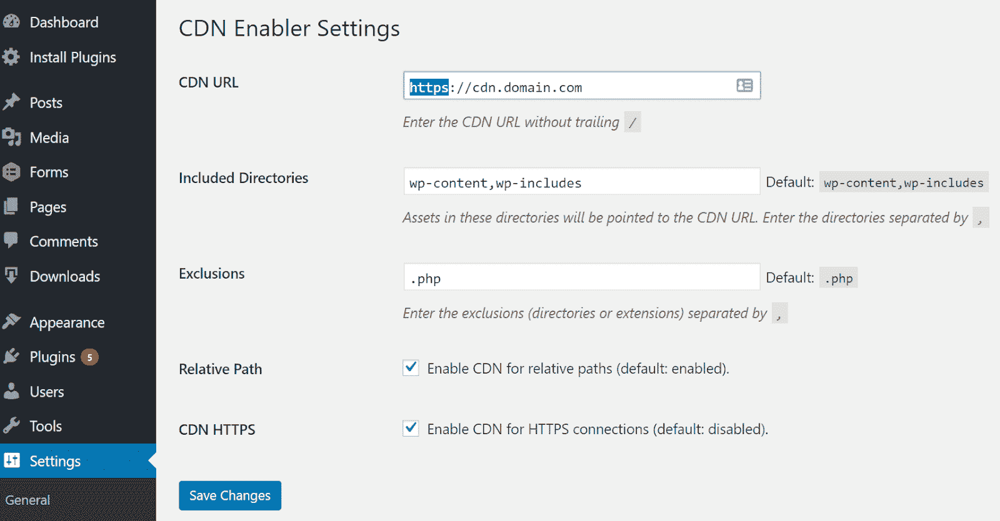

Change CDN to HTTPS


我们通过 HTTP 将 URL 翻转到 HTTPS，然后启用底部的 **CDN HTTPS** 选项。完成后，选择**保存更改**按钮。

### **9。检查您网站上的混合内容警告**

接下来，你需要检查你的 WordPress 站点，确保你没有收到混合内容的警告。这些警告在加载 HTTPS 和 HTTP 脚本或内容时出现。你不能两个都装。

当你迁移到 HTTPS，一切都需要运行在 HTTPS。《连线》记录了他们从 HTTP 到 HTTPS 的转变以及他们遇到的阻碍:

> 搬到 HTTPS 面临的最大挑战之一是准备好我们所有的内容，以便通过安全的连接进行交付。如果页面是通过 HTTPS 加载的，那么所有其他资源(比如图像和 Javascript 文件)也必须通过 HTTPS 加载。我们看到大量关于这些“混合内容”问题的报告，或者在安全的 HTTPS 页面中加载不安全的 HTTP 资产的事件。为了做好我们的推广工作，我们需要确保混合内容问题更少——我们尽可能安全地提供 WIRED.com 的内容。

下面是一些例子，说明如果不修复这些警告，浏览器中会发生什么。

#### **Chrome 混合内容警告示例**

下面是 Chrome 中混合内容警告触发时发生的情况:


Chrome mixed content warning


#### **Firefox 混合内容警告示例**

以下是 Firefox 中混合内容警告触发时发生的情况:

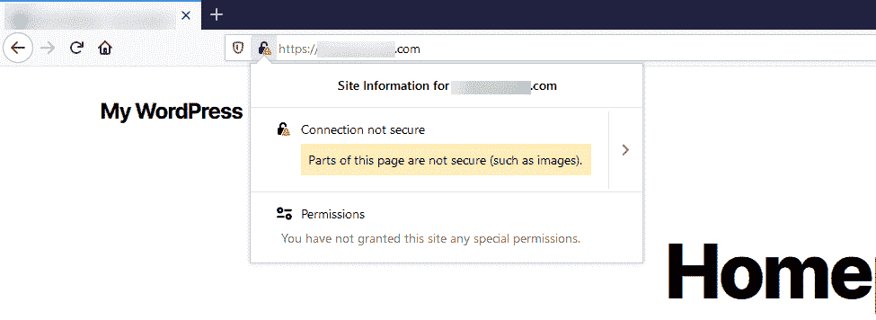

Firefox mixed content warning


#### **Internet Explorer 混合内容警告示例**

下面是一个混合内容警告触发时 Internet Explorer 中会发生什么的示例:

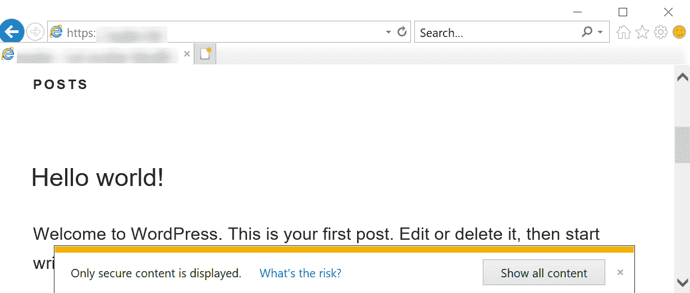

IE mixed content warning


正如你所看到的，IE 可能是最糟糕的，因为它破坏了页面的渲染，直到弹出窗口被点击。

JitBit 有一个很棒的免费小工具叫做 [SSL Check](https://www.jitbit.com/sslcheck/) ，你可以运行它来快速扫描你的网站或 URL 中的不安全内容。该工具将抓取你的 HTTPS WordPress 网站，搜索不安全的图片、脚本和 CSS 文件，这些文件会在浏览器中触发警告信息。每个网站抓取的页面数量限制为 200 个。

你也可以使用 Chrome DevTools 通过查看网络请求面板来快速检查任何页面。安全面板实际上也很有用。您可以立即看到任何不安全的来源，然后点击进入**请求**，查看它们来自哪里:

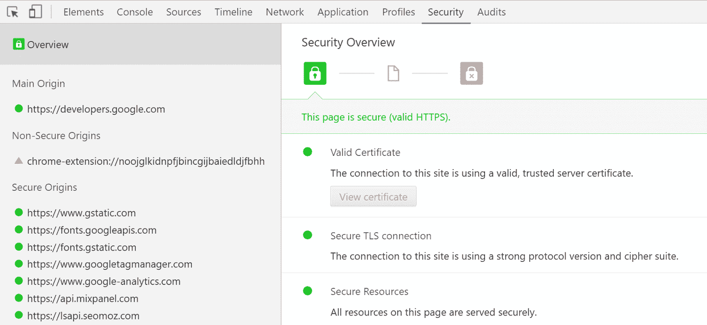

Check HTTPS in Chrome Devtools


还有一个叫做 [HTTPS 检查器](https://httpschecker.net/)的桌面软件，你可以安装它来扫描你的网站:

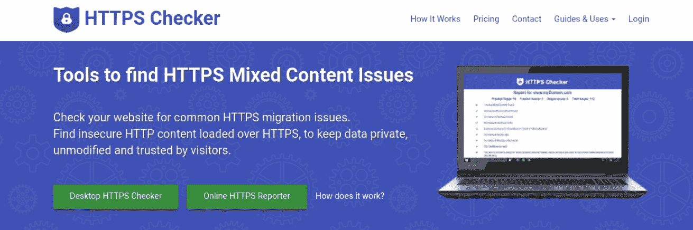

HTTPS checker software


经过重大更改后，它可以帮助您检查“不安全”的警告和内容。它可以在 Windows、Mac 和 Ubuntu 上使用。免费计划允许您查看多达 100 页。

### 10。更新谷歌搜索控制台简介

现在你已经在 HTTPS 上建立并运行了你的 WordPress 网站(希望没有警告)，是时候深入到营销方面了。其中有些非常重要，不要跳过！

你首先要为 HTTPS 版本创建一个新的[谷歌搜索控制台](https://kinsta.com/blog/google-search-console/)配置文件。

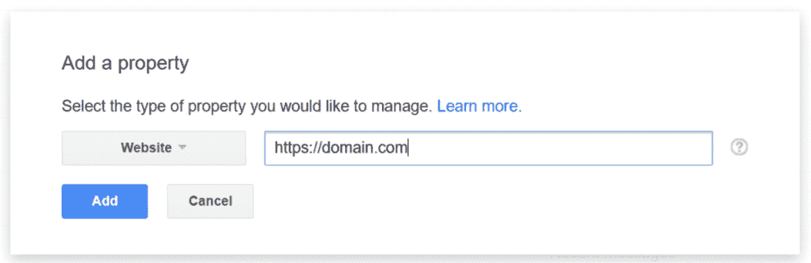

Add HTTPS property in GSC


在你创建了新的 HTTPS 版本后，你需要重新提交你的站点地图文件。新 HTTPS 版本:

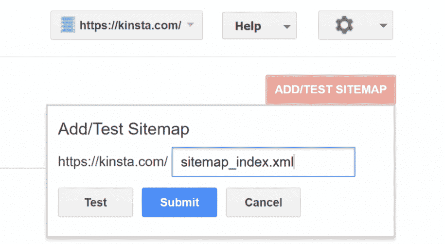

HTTPS sitemap file


如果你有一个[不良反向链接](https://kinsta.com/blog/negative-seo/)或处罚文件，你需要重新提交这个。如果你现在不这样做，你可能会永久地损害你的网站。

转到[谷歌的否认工具](https://support.google.com/webmasters/answer/2648487?hl=en)，点击你原来的 HTTP 档案。如果否认文件存在，请下载该文件。然后返回到工具，并提交 HTTPS 版本的否认文件。

**注意:**做完这一切，你就可以放心地在谷歌搜索控制台中删除 HTTP 配置文件了。

### **11。必应站长工具**

[必应站长工具](https://kinsta.com/blog/bing-webmaster-tools/)与谷歌搜索控制台略有不同:

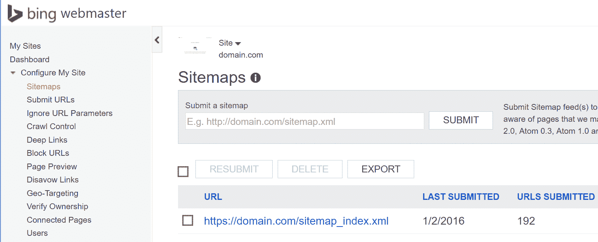

Bing Webmaster Tools HTTPS


您不需要创建新的 HTTPS 个人资料。相反，你可以提交你新创建的 HTTPS 网站地图。

### **12。谷歌分析**

接下来，您需要[更新您的 Google Analytics 属性](https://kinsta.com/blog/google-analytics-wordpress/)并查看。这不会影响你的分析数据:它只会在你的网站链接到谷歌搜索控制台时有所帮助。

要更新您的属性，请单击您的域属性设置，在默认 URL 下，将其更改为 HTTPS://版本:

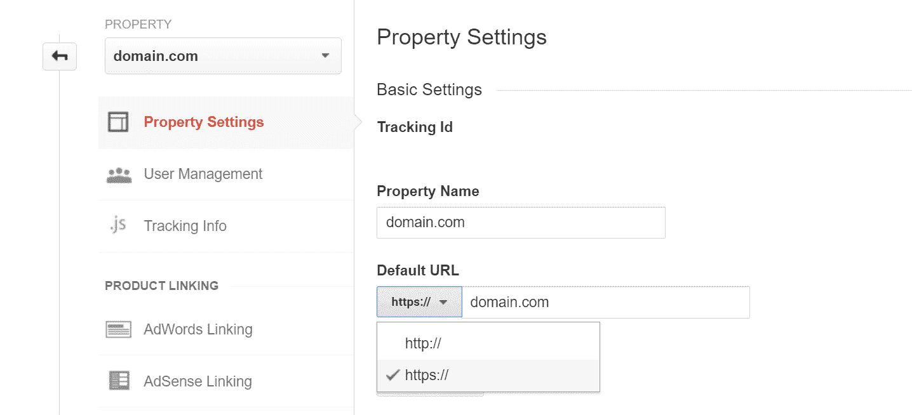

Update Google Analytics property to HTTPS


要更新您的视图，请单击您的域视图设置。在网站的网址下，然后将其更改为 HTTPS://版本:

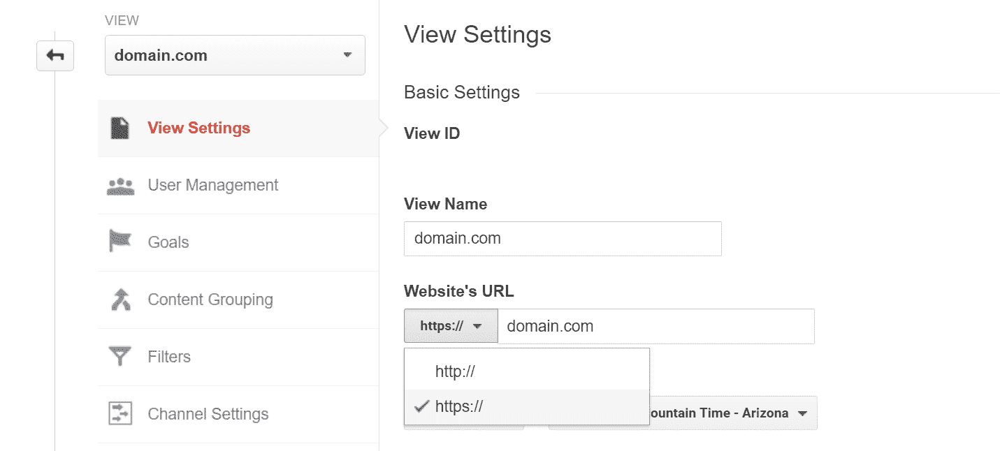

Update Google Analytics view to HTTPS


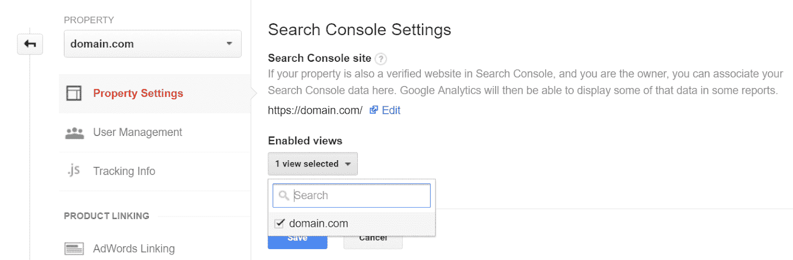

Link Google Analytics to GSC


您还需要将您在步骤 8 中创建的新创建的 Google 搜索控制台配置文件与您的 Google Analytics 帐户重新链接。为此，点击进入您的域的属性设置，然后选择**调整搜索控制台:**

然后，您可以链接您的新 HTTPS GSC 个人资料。将这些链接在一起可以让搜索查询数据流入你的谷歌分析账户。

### 13。YouTube 频道

如果你有一个 YouTube 频道，你会想在谷歌搜索控制台中重新关联你的网站和你的新 HTTPS 版本。否则，您将得到注释错误和其他关于 HTTPS 链接无效的消息。

在你的 YouTube 仪表盘中，点击你的频道，然后进入**高级**。接下来，把你的域名改成新的 HTTPS 版本，点击**添加**。您可能需要删除旧的，然后重新添加它。然后，你必须通过进入谷歌搜索控制台，导航到该网站的信息，并选择**批准**来批准它。

### **14。杂项**

这是关于你的 HTTP 到 HTTPS 的迁移！这里还有一些你想更新的杂项。其中一些可能适用，也可能不适用，这取决于您使用什么。

*   请确保您的 robots.txt 可以访问并正常工作。
*   确保任何规范标记都指向 HTTPS 版本(如果您遵循上面的步骤 4，应该已经完成了)。
*   如果你运行一个评论插件，比如 Disqus，你必须[将你的 Disqus 评论](https://woorkup.com/migrate-disqus-comments-https/)从 HTTP 迁移到 HTTPS。
*   在你的[电子邮件营销](https://kinsta.com/blog/email-marketing-software/) [软件](https://kinsta.com/blog/email-marketing-software/) [回复](https://kinsta.com/blog/email-marketing-software/)中更新你的网址
*   更新 PPC 广告网址: [AdWords](https://kinsta.com/blog/how-to-use-google-adwords/) ，Bing 广告，AdRoll，脸书广告等。
*   更新社交媒体链接(脸书页面、推特简历、Pinterest、Google+等。)

[Updating your site from HTTP to HTTPS has never been easier, thanks to this guide ✅Click to Tweet](https://twitter.com/intent/tweet?url=https%3A%2F%2Fkinsta.com%2Fblog%2Fhttp-to-https%2F&via=kinsta&text=Updating+your+site+from+HTTP+to+HTTPS+has+never+been+easier%2C+thanks+to+this+guide+%E2%9C%85&hashtags=HTTPS%2CSiteSecu) ## 摘要

HTTPS 不仅仅是谷歌排名的一个因素。这是一个重要的安全协议，有助于保护您的网站和访问者免受攻击。

如果你一直在犹豫要不要去 HTTPS，希望这篇文章最终能给你一些动力去冒险。你准备好行动了吗？如果您需要任何帮助，我们的专家团队非常乐意提供帮助。

关于 HTTP 到 HTTPS 的迁移，您有什么问题吗？请在下面的评论区告诉我们！

* * *

让你所有的[应用程序](https://kinsta.com/application-hosting/)、[数据库](https://kinsta.com/database-hosting/)和 [WordPress 网站](https://kinsta.com/wordpress-hosting/)在线并在一个屋檐下。我们功能丰富的高性能云平台包括:

*   在 MyKinsta 仪表盘中轻松设置和管理
*   24/7 专家支持
*   最好的谷歌云平台硬件和网络，由 Kubernetes 提供最大的可扩展性
*   面向速度和安全性的企业级 Cloudflare 集成
*   全球受众覆盖全球多达 35 个数据中心和 275 多个 pop

在第一个月使用托管的[应用程序或托管](https://kinsta.com/application-hosting/)的[数据库，您可以享受 20 美元的优惠，亲自测试一下。探索我们的](https://kinsta.com/database-hosting/)[计划](https://kinsta.com/plans/)或[与销售人员交谈](https://kinsta.com/contact-us/)以找到最适合您的方式。**