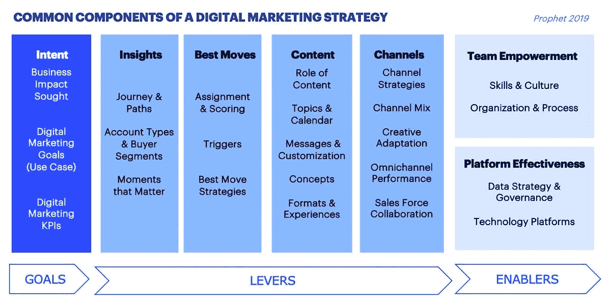
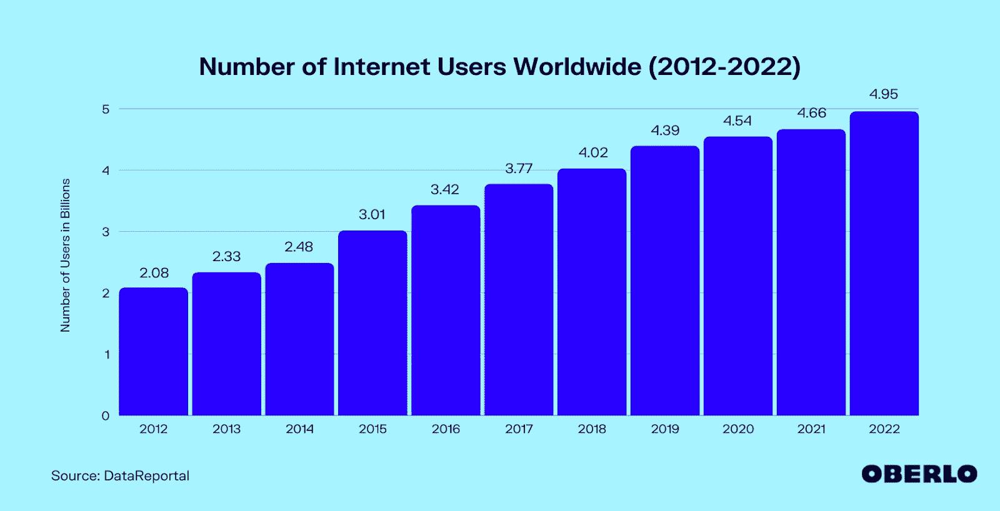
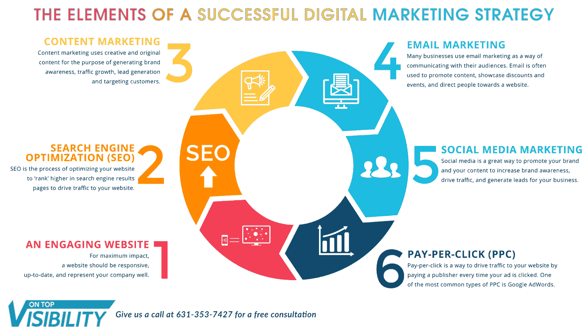
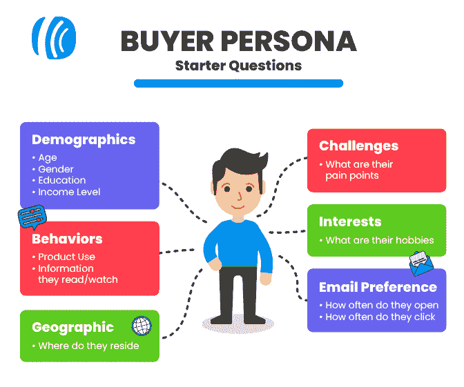
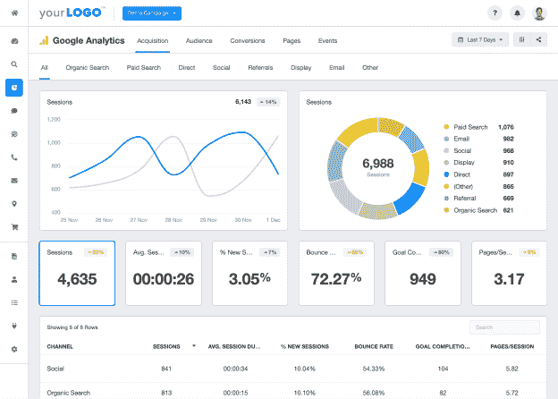
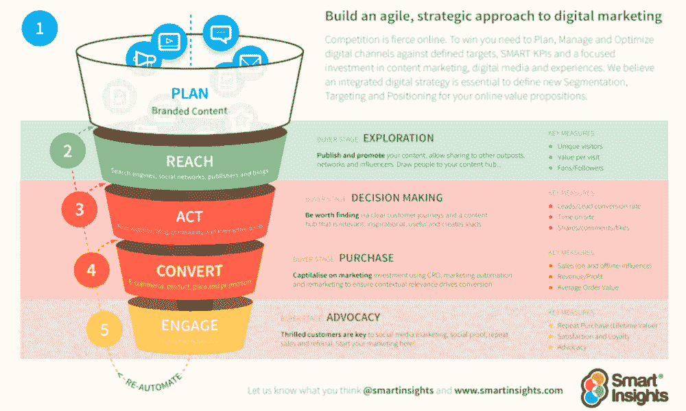
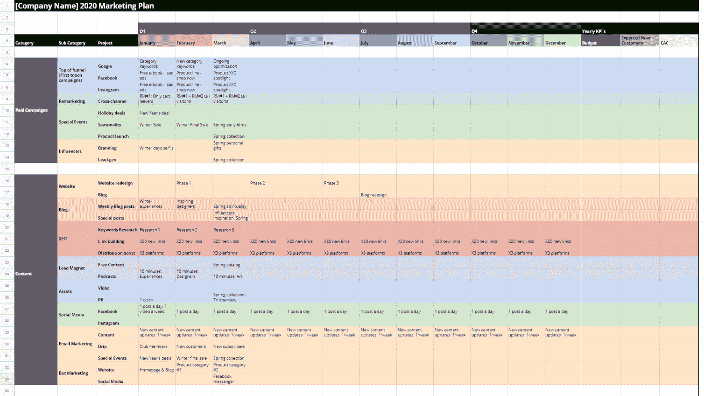

# 如何创建数字营销策略

> 原文：<https://kinsta.com/blog/digital-marketing-strategy/>

从一开始，人们就把互联网视为赚钱的机会。他们是对的。互联网已经成为现代商业世界不可或缺的一部分，将人们与他们购买的组织联系起来，反之亦然。

但是，虽然拥有一个托管良好的强大网站是这个难题的主要部分，但你不能仅仅在网上开店就指望顾客蜂拥而至。你必须深入拥挤的网络空间，用数字营销策略吸引潜在客户。

但是什么是数字营销策略呢？数字营销策略和数字营销活动是一样的吗？你能做些什么来为你的企业创造最好的数字营销策略呢？

在这篇文章中，我们将回答所有这些问题，甚至更多。

## 什么是数字营销战略？

数字营销策略是通过在线渠道实现特定业务目标的策略。你的数字营销策略可以包括付费和有机策略，包括点击付费广告、[搜索引擎优化(SEO)](https://kinsta.com/blog/wordpress-seo/) 、社交媒体广告、等。

许多人将营销策略误认为营销活动，但这是数字营销难题中两个非常不同的部分。

为什么

[The strategies you need to take your business to the next level, all in one guide 🚀Click to Tweet](https://twitter.com/intent/tweet?url=https%3A%2F%2Fkinsta.com%2Fblog%2Fdigital-marketing-strategy%2F&via=kinsta&text=The+strategies+you+need+to+take+your+business+to+the+next+level%2C+all+in+one+guide+%F0%9F%9A%80&hashtags=SmallBiz%2CDigitalMarketing)

数字营销活动是数字营销战略的一部分。这是战略的一部分。就像建筑队在建造摩天大楼一样，通常会有多个团队在整个蓝图的不同部分工作。

数字营销战略是你想要在数字渠道上实现什么，以及你计划如何实现的蓝图。数字营销活动是你的营销团队按照计划为实现这些目标而“构建”的。

它们是在数字营销战略中采取的具体行动，推动你实现该战略的最终目标。你可以有一个社交媒体活动，一个电子邮件活动和一个搜索引擎优化活动，都属于同一策略。

Components of a digital marketing strategy

这是因为该战略本身是广泛的，涵盖了核心目标和潜在的活动，在它推出之前已经强调。在一个数字营销策略中可以有多个活动，这些活动可以归入不同的保护伞下。

首先，有付费媒体——由第三方展示内容以换取报酬。一些常见的付费媒体数字营销活动是谷歌和社交媒体网络上的点击付费广告，如[脸书](https://kinsta.com/blog/facebook-marketing/)和 [Instagram](https://kinsta.com/blog/instagram-stats/) 以及影响者营销。

然后是自有媒体。顾名思义，这是一家完全由竞选公司拥有的媒体。它处于您的组织的直接控制之下，因此除了创建和填充它所需的劳动之外，可以免费使用。

这可能包括商业网站和博客，也可能是 YouTube 频道、播客、T4 图片和你公司拥有的任何东西。

最后，还有免费媒体。这是在组织外部创造的东西，你可以利用它来达到营销的目的。赢得的媒体可以包括用户生成的内容、推荐、客户评论、您获得的奖项、新闻提及以及您的品牌或公司的其他提及。

这些媒体类型可以在不同的营销活动中使用，精明的数字营销人员经常在一次活动中把它们结合在一起。在概述你想做的事情时，理解各种形式的媒体以及它们如何在你的整体数字营销策略中发挥作用是很重要的。

一个完善的数字营销策略通常发生在你的受众经常光顾的多个渠道。这样做是为了最大限度地暴露和有效性。

## 为什么你需要数字营销策略

无论您是 [B2B 还是 B2C 公司](https://kinsta.com/blog/b2b-vs-b2c/)，数字营销战略对于现代商业世界的成功都是至关重要的。我们现在几乎什么都用数字空间，从杂货店购物到预约医生预约，再到为我们的业务选择 [SaaS 解决方案](https://kinsta.com/blog/saas-marketing/)。

Internet users worldwide

想想你或你认识的人在网上花了多少时间。从翻看手机到在 Disney+上观看最新的流媒体系列节目，我们每天有很大一部分时间是在网络上度过的。潜在客户访问的每个平台对你来说都是潜在的营销机会。

邮件？你可以在那里找到他们。检查脸书？它对数字营销非常有效。谷歌搜索？有支付和有机的选择，可以让你眼前最重要的。

你需要能够在网上竞争。不仅数字渠道有效，而且你的竞争对手已经在那里，从你那里偷走了潜在客户。此外，在当今这个时代，你的大多数潜在客户都希望你的企业有一个体面的在线形象。

还有很多其他的原因让你想把数字营销加入到你的待办事项中。

首先，这是一项非常划算的投资，启动成本很低甚至没有。数字营销比传统营销渠道更便宜。不仅如此，你还可以更容易地接触到目标全球受众。

想象一下，尝试运行一个全球电视广告或印刷广告点。你不仅会花更多的钱，而且还会接触到一大堆不在你的目标受众中的人。

通过数字渠道营销时，您可以个性化广告体验。许多平台允许你锁定特定的人口统计数据，根据人们的年龄、性别、地理位置、兴趣、职位等等向他们展示你的内容。广告铺天盖地的日子已经过去了。今天的人们想要更个性化的体验，而数字营销就是你给他们的方式。

数字营销的结果也是非常可衡量的。在做电视广告或广播广告时，你不知道有多少人听过，也不知道你的新销售额中有多少来自这些平台。然而，数字营销通过实时数据洞察实现了完全透明，可以准确显示有多少人看到了你的广告，点击了它，并转化了它。

最后，数字营销具有巨大的投资回报潜力。[仅电子邮件营销](https://kinsta.com/blog/email-marketing-best-practices/)一项的平均投资回报率[4400%](https://optinmonster.com/is-email-marketing-dead-heres-what-the-statistics-show/)。虽然广告牌广告有令人印象深刻的平均投资回报率 [497%](https://trueimpactmedia.com/blog/what-is-a-billboards-roi/) ，[电子邮件营销](https://kinsta.com/blog/email-marketing-tips/)的努力可以产生近十倍的金额。

## 数字营销策略基础:构建模块

虽然数字营销策略从表面上看起来可能很复杂，但它们是由构建强大而稳固的营销计划的基石组成的。

让我们一次一个地了解数字营销的一些主要组成部分。

The elements of a digital marketing strategy (**Source:** [On Top Visibility](//ontopvisibility.com/the-elements-of-a-successful-digital-marketing-strategy/%E2%80%9D))

### 搜索引擎优化

搜索引擎优化，更好的说法是 [SEO](https://kinsta.com/blog/what-does-seo-stand-for/) ，是一种有机的数字营销策略，它将提高你在流行搜索引擎如谷歌或必应上的地位(但是，老实说，主要是谷歌)。这是通过一系列网站内外的内容调整来实现的。你用战略性的关键词来点缀你的内容，将它无缝地融入到页面的叙述流程中。

最重要的是，你可以优化页面外的内容，比如元标题、描述和带有相同关键字的图片。这确保了谷歌的爬虫和算法会理解你是谁，你做什么。当承认你是你所在领域的权威时，谷歌会在相关关键词的搜索结果中把你排在更靠前的位置。

你可以通过生成一个高质量的反向链接目录来增加你的权威，这些反向链接发布在其他网站上，指向你的网站。把它想象成一封相当于推荐信的网站，一个已建立的网站告诉谷歌，它把你视为一个权威。

SEO 是一个复杂的过程，但谢天谢地，像 [WordPress](https://kinsta.com/blog/managed-wordpress-hosting/) 这样的平台有一些选项可以让它变得简单一点，比如大量的高质量(而且大部分是免费的) [SEO 插件](https://kinsta.com/blog/best-seo-plugins-for-wordpress/)。

### 社交媒体营销

然后是社交媒体营销，既有付费的，也有有机的。显然，你应该有一个社交媒体，并定期发布分享内容的帖子。毕竟，90%的 Instagram 用户关注至少一个企业或品牌。

然而，你可以通过在脸书、Twitter 和 Instagram 等平台上投放付费社交媒体广告来接触更多人。在过去的十年里，大多数主要平台上的有机接触已经大幅下降，今天它基本上是一个“付费游戏”。

### 点击付费广告

PPC 广告是指只有当看到你的广告的用户采取了想要的行动时，你才需要付费的广告。这通常是点击一个链接，因此得名，但也可能是像[注册一个网络研讨会](https://kinsta.com/blog/best-webinar-platforms/)这样的事情。在社交平台上，你可以将这些广告瞄准符合特定标准的人，如兴趣、地理位置、年龄等。

你也可以在谷歌广告上运行点击付费广告，这可以让你的广告出现在相关关键词的搜索结果之上。还有其他类型的谷歌广告，如展示和 YouTube 广告，你可以定制你的广告活动，以满足你的需求。当运行谷歌广告时，你对特定的关键词或短语进行竞价，[构建高质量的广告](https://kinsta.com/blog/banner-ad-sizes/)，与你的竞争对手竞争。

## 如何建立你的数字营销策略

现在你已经了解了数字营销策略的基础，让我们来看看你如何构建自己的策略，以获得最大的成功潜力。我们把它分成了五个简单的步骤。

## 注册订阅时事通讯

### 想知道我们是怎么让流量增长超过 1000%的吗？

加入 20，000 多名获得我们每周时事通讯和内部消息的人的行列吧！

[Subscribe Now](#newsletter)

### 第一步:确保你的数字基础已经到位

在你开始骑自行车之前，你首先需要确保你的轮胎有气。同样，在启动一项数字营销战略，开展大量旨在为您带来更多业务的活动之前，您必须确保您的数字基础已经就绪。

首先，你需要为你的网站提供强大的主机服务。

在 Kinsta，我们专门从事[应用程序托管](https://kinsta.com/application-hosting/)、[数据库托管](https://kinsta.com/database-hosting/)和[托管 WordPress 托管](https://kinsta.com/wordpress-hosting/)，并相信这是确保您网站稳定性和可访问性的好方法。

但是仅仅有*一个*网站是不够的。那个[网站需要快](https://kinsta.com/learn/page-speed/)。速度是 SEO 的一个重要排名因素，如果加载时间超过三秒，用户就会离开你的网站。

The number of people who bounce from a slow website

你的网站也必须是安全的。在网络犯罪的时代，安全非常重要。HTTPS，一个强大的防火墙和安全的托管服务是抵御网络攻击的第一道防线。(我们为 Kinsta 客户提供更先进的安全措施。)

最重要的是，你的网站需要设计得最容易使用。这将有助于您更轻松地转化客户，并为他们提供更高效的转化途径。

最后，你必须确保你的社交媒体档案是用最新的准确信息建立和更新的。

### 第二步:定义目标

你想从你的数字营销战略中获得什么？对你来说成功是什么样子的？有些公司只是为了品牌曝光。他们只是想让自己的名字为大众所知，让人们意识到他们的存在。

对于其他人来说，这一切都是关于销售和转化。他们希望带来新的业务，并让他们再次光顾。但是当你列出目标的时候，最好具体一点。在这个战略时期，你有多希望看到你的业务增长？你希望在第二季度末利润增加 40%吗？如果你只实现了 30%的增长，你会认为你的策略是勉强成功还是彻底失败？

这是你必须发展你的最好和最坏情况的地方。确定你认为战略失败的门槛，并以此衡量你取得的任何成功。

这也是你决定哪些工具将帮助你取得成功的时候。他们负担得起吗？你愿意投入多少钱到像电子邮件营销软件这样的东西上来看它成功？

请记住，为了确定成功或失败，你的目标需要具体和可衡量的。这意味着了解您的广告支出回报、每次收购的成本等等。

### 第三步:理解买家角色

如果不知道你的营销对象是谁，就不可能制定数字营销策略。你需要了解你的主要买家，理解他们的痛点、动机、喜好和厌恶。这将有助于你精心设计一个吸引你的观众并直接满足他们需求的策略。

Use some starter questions

你应该有结构良好的买家角色，包括不同受众的人口统计信息。这可能包括他们的年龄、职业、性别、地理位置、兴趣、收入等信息。

Struggling with downtime and WordPress problems? Kinsta is the hosting solution designed to save you time! [Check out our features](https://kinsta.com/features/)

您的营销策略可以包括针对目标受众中不同买家角色的各种活动。虽然买家角色 A 可能喜欢使用社交媒体，但买家角色 B 可能对[电子邮件营销](https://kinsta.com/blog/email-marketing-automation/)反应更好，买家角色 C 喜欢在 [Quora](https://kinsta.com/blog/quora-marketing/) 上查找问题。如果你想最大化你的成功几率，这是你需要知道的信息。

了解这些人物角色经常出现在哪些平台上，并将你的营销努力集中在那里。

### 步骤 4:评估所有现有的数字资产

现在是时候看看我们之前确定的各种内容类型了。你需要确切地知道你拥有什么，以及它如何帮助你实现目标。

您应该审核您所有的、付费的和获得的媒体，以最大化您的成功。一旦你有了一份清单，你就可以决定哪些营销活动最能帮助你。

这也是确定您的资产目录中任何缺口的绝佳时机。如果你认为有什么东西可以帮助你的[内容战略](https://kinsta.com/learn/content-marketing/)超越你还没有的东西，是时候去创造或购买那些内容了。

不要只看你有多少内容。挖掘它的质量。如果你有旧的和过时的博客文章，刷新和改进这些内容可能会以一种服务于你的目标的方式把它放回游戏中——比如在谷歌上达到你的关键词的第一名。

如果你的网站上有[重复的内容](https://kinsta.com/blog/content-scraping/),马上删除它。谷歌不喜欢重复内容，并会因此对你进行处罚。

### 第五步:制定计划

所有的部分都准备好了，这意味着是时候制定你的内容营销策略了。

您需要一个内容创建计划来填补您在上一步中发现的任何空白。这将确保你有一个全面的内容库，为你的受众设计，从长远来看，这将为你带来回报。

您应该大致了解需要为每个买家角色开展哪些活动来帮助您实现目标。对这些活动进行整体规划，包括你在使用什么平台，你进行活动的时间，你将使用什么内容，以及你将投入多少营销预算。

一旦你做到了这一点，创建一个主文档，从头到尾突出整个战略，以时间表为特色，显示你所创建的所有活动将如何有助于你的最终目标。

## 如何衡量你的数字营销策略的成功

你的数字营销策略中最重要的元素之一就是你的分析能力。如果你想最大化你的成功几率，你需要能够决定你的策略是成功还是失败。

[分析数据](https://kinsta.com/blog/data-visualization-tools/)是数字营销策略提供的最大好处之一。你可以看到有多少人看到了你的内容，有多少人点击了它，有多少人转化了。

Google Analytics

你需要了解人们从哪里来，一旦他们到达你的网站，他们在做什么。这就是你如何确定有助于你成功的最佳和最有效的渠道。它还能让你识别出那些拖累你的营销活动整体表现的表现不佳的渠道。

一旦你明白什么是有利可图的，什么是不利的，你就可以剔除那些什么都不能给你的渠道，把腾出的预算投入到更强大的渠道中。

记住，你的数字营销策略不是一成不变的。重要的是在你进行的过程中修改和改进策略。这是一个不断发展的过程，会随着时间的推移而改变。

## 顶级数字营销策略模板

如果你是开发数字营销策略的新手，使用模板会有所帮助。这些有用的指南可以为你的策略创建一个框架，允许你填写你的信息并以你能理解的方式查看。

[Smart Insights](https://www.smartinsights.com/digital-marketing-strategy/digital-marketing-strategy-and-planning-template/) 有一个脱离 RACE 框架的优秀模板。这代表延伸、行动、转化和参与。

RACE marketing framework

HubSpot 还提供免费的营销策略模板，包括业务总结、目标市场、业务计划、预算、市场策略、营销技术和营销工具等部分。

最后，还有 [Mayple](https://www.mayple.com/blog/digital-marketing-plan-template) ，它将让你访问它的免费模板，可以根据你的具体需求进行个性化设置。一旦你下载了模板，你就可以输入你所有的信息，并以此为指导来制定你的营销策略。

Mayple digital marketing template

以上所有模板都可以下载，但你必须输入一些信息才能收到它们，比如姓名、电话号码和电子邮件地址——这对于此类优惠来说是相当标准的。

此外，这些模板也是可靠的数字营销策略的绝佳范例。他们的目标是中小企业主和企业家，他们想开始数字营销，但不太知道如何开始。他们使用免费数字营销策略模板的销售线索磁铁来获取您的联系信息，然后一旦您开始工作，他们就可以与您建立关系，并在未来向您销售他们的数字营销相关产品或服务。

在你自己的内容营销活动中注意并实施类似的东西。

[Level up your business with a comprehensive digital marketing strategy- and use this guide to get started 📈Click to Tweet](https://twitter.com/intent/tweet?url=https%3A%2F%2Fkinsta.com%2Fblog%2Fdigital-marketing-strategy%2F&via=kinsta&text=Level+up+your+business+with+a+comprehensive+digital+marketing+strategy-+and+use+this+guide+to+get+started+%F0%9F%93%88&hashtags=SmallBiz%2CDigitalMarketing) ## 摘要

通过[外向营销](https://kinsta.com/blog/outbound-marketing/)和[内向营销](https://kinsta.com/blog/inbound-marketing/)，你的数字营销策略可以成为蓬勃发展的商业利润的支柱。在现代商业世界中，你不能忽视数字渠道的普及和潜力。几乎每家企业都有网上业务，它们都在为吸引大众的注意力而相互竞争。

使用本文中概述的信息来制定一个成功的数字营销策略，并开始吸引激光瞄准的潜在买家到您的网站。当他们到达那里时，你希望他们降落在一个坚固、快速、安全的地方。

如果您选择使用 Kinsta 托管，您将获得由经验丰富的[系统管理员](https://kinsta.com/blog/sysadmin/)管理的闪电般快速、顶级的基于云的服务器。换句话说，一个加载速度快、健壮、尽可能安全的网站。[点击此处，了解更多关于 Kinsta 如何帮助您提高在线形象的信息](https://demo.kinsta.com/register)。

* * *

让你所有的[应用程序](https://kinsta.com/application-hosting/)、[数据库](https://kinsta.com/database-hosting/)和 [WordPress 网站](https://kinsta.com/wordpress-hosting/)在线并在一个屋檐下。我们功能丰富的高性能云平台包括:

*   在 MyKinsta 仪表盘中轻松设置和管理
*   24/7 专家支持
*   最好的谷歌云平台硬件和网络，由 Kubernetes 提供最大的可扩展性
*   面向速度和安全性的企业级 Cloudflare 集成
*   全球受众覆盖全球多达 35 个数据中心和 275 多个 pop

在第一个月使用托管的[应用程序或托管](https://kinsta.com/application-hosting/)的[数据库，您可以享受 20 美元的优惠，亲自测试一下。探索我们的](https://kinsta.com/database-hosting/)[计划](https://kinsta.com/plans/)或[与销售人员交谈](https://kinsta.com/contact-us/)以找到最适合您的方式。