# 如何整合 WooCommerce 和 Zapier

> 原文：<https://kinsta.com/blog/woocommerce-zapier/>

当你第一次用 woo commerce 建立一个网上商店时，你可能会记得介绍一些基本的东西，比如 T2 托管，T4 域名，以及如何配置 WordPress。

然而，一旦订单开始滚滚而来，它可以很快变得明显，事情的管理方面是由希望和祈祷。

当然，WooCommerce 默认配备了一系列不错的功能，其中许多功能[简化了商店运营](https://kinsta.com/blog/woocommerce-plugins/)。然而，如果你依赖任何第三方软件、应用程序或工具来管理商店，事情可能会很快失控。或者至少是杂乱无章的。

改善商店运营的最佳方式之一是尽可能多地实现自动化。Zapier 是最好的自动化工具之一。

今天，我们将关注 Zapier 和 WooCommerce 是如何天造地设的一对，以及如何利用前者来充分利用后者。

我们开始吧！

## 扎皮尔是什么？

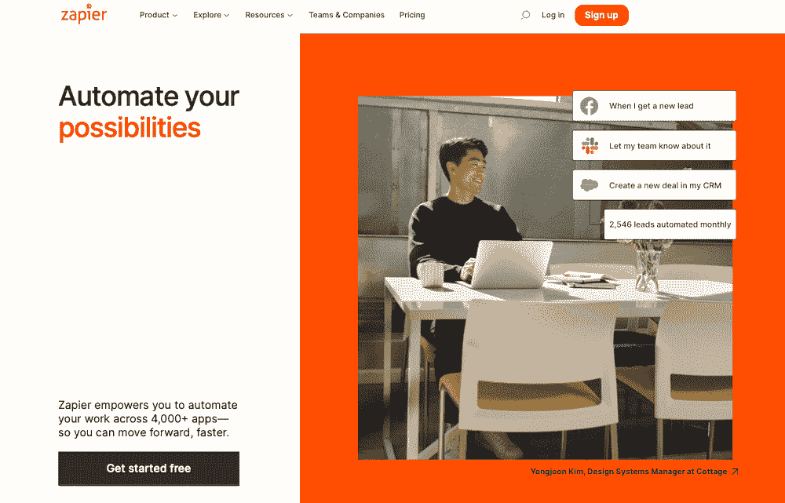

Zapier.

Zapier 是一个平台，它将你与各种在线服务联系起来，使你能够使用它们创建自动化的工作流程。该服务提供与不同应用程序的集成，如 [Asana](https://kinsta.com/blog/trello-vs-asana/) 、 [Dropbox](https://kinsta.com/blog/best-cloud-storage/#dropbox) 和 Spotify。

具体说到 WooCommerce，你可以把它和超过 4000 个应用联系起来，包括社交媒体平台、 [Google Workspace](https://kinsta.com/blog/google-workspace/) (Docs、Sheets 等。)、CRM 工具、[电子邮件营销工具](https://kinsta.com/blog/email-marketing-automation/)，当然还有 WordPress 功能。

这些自动化的工作流程和集成被称为 zaps 或 recipes，一旦设置好，就会为您执行一系列自动化任务。因此，一旦满足某个条件，zap 就开始工作，代表您执行自动化的工作流程。从长远来看，这可以为你节省很多时间。

[WooCommerce meets Zapier in this guide 💥 Learn how to automate your store's operations & simplify your workflow 🤓Click to Tweet](https://twitter.com/intent/tweet?url=https%3A%2F%2Fbit.ly%2F3yvxCgQ&via=kinsta&text=WooCommerce+meets+Zapier+in+this+guide+%F0%9F%92%A5+Learn+how+to+automate+your+store%27s+operations+%26amp%3B+simplify+your+workflow+%F0%9F%A4%93&hashtags=WooCommerce%2CEcommerce)

## Zapier 如何与 WooCommerce 合作

有了 Zapier 插件，你可以在设置好你的 [WordPress 主题](https://kinsta.com/blog/fastest-woocommerce-theme/)后将它添加到你的 [WordPress 安装](https://kinsta.com/knowledgebase/manually-install-wordpress/)中，并开始使用 WooCommerce 和其他应用程序实现自动化。

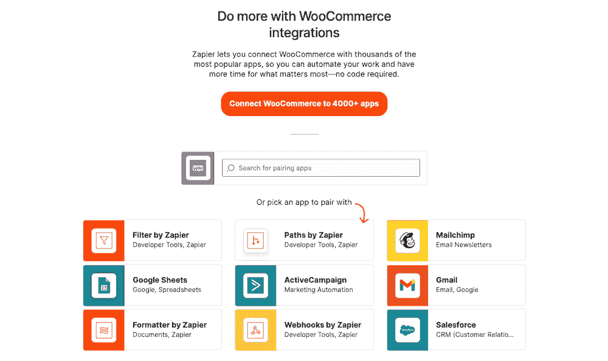

WooCommerce integrations.

Zapier 有许多整合和 zaps。你可以选择应用程序连接到你自己并设置 zap，或者你可以从流行的 zap 中选择并立即实现它们。

在那之后，Zapier 将开始自动化这个过程，不需要任何进一步的输入。

## 在 WooCommerce 中使用 Zapier 的好处

将 Zapier 与 WooCommerce 结合使用的最大好处是自动化总体上节省了时间。当你不需要执行整个工作流程中的每一个任务时，你可以节省大量的时间和精力。

这对于维护你的[在线商店](https://kinsta.com/blog/ecommerce-platforms/)所需的一些任务尤其明显，例如[手动更新产品库存](https://kinsta.com/blog/woocommerce-inventory-management/)。逐行执行时，这可能会变得非常乏味，甚至变得无法跟上。幸运的是，你可以使用 zaps 来简化这个过程，让它变得更加轻松。

关于如何在 WooCommerce 中使用 Zapier 的其他几个例子包括:

*   将 Twitter 配置为在您的在线商店添加新的[产品页面](https://kinsta.com/blog/conversions-woocommerce-product-pages/)时发送推文。
*   当产品库存不足时，向您的客户发送电子邮件。
*   连接到您的库存跟踪表，并在新订单生成时自动更新库存编号。
*   当有新订单时，自动将订单信息添加到 Google Sheets。
*   在 [MailChimp](https://kinsta.com/blog/constant-contact-vs-mailchimp/) 或 AWeber 上向您的电子邮件营销列表添加新客户。

我们稍后将讨论更多你可以在 WooCommerce 中使用的食谱的具体例子。但首先，让我们先来谈谈如何在 WooCommerce 上建立 Zapier 连接或 zaps。

## 如何建立 WooCommerce Zapier 连接(Zaps)

你要做的第一件事就是建立一个 Zapier 账户。Zapier 每月可免费完成 100 项任务。你也可以尝试更高层次的计划。

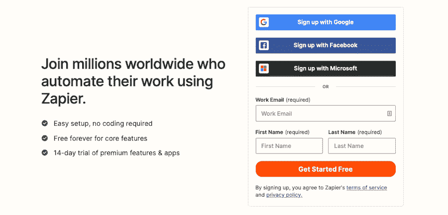

Zapier sign-up.

只需输入你的电子邮件地址，名字和姓氏，然后设置一个密码。或者，你可以使用你的谷歌、脸书或微软证书注册。接下来，你可以选择你最常用的应用程序来获得定制的 zap 建议。在这种情况下，我们输入“WooCommerce”，仪表板显示如下:

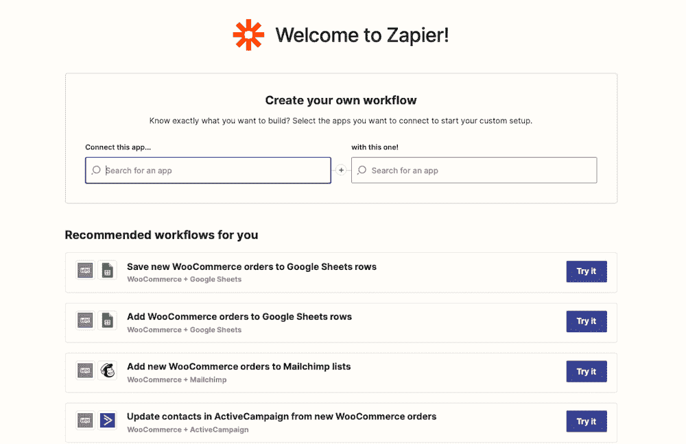

Zapier dashboard with WooCommerce workflows.

但是在你设置这些工作流程之前，你需要[配置 WordPress](https://kinsta.com/blog/wp-config-php/) 来使用它。

### 如何安装 Zapier 插件

有几种方法可以将 Zapier 与 WordPress 和 WooCommerce 集成。

首先是 WooCommerce Zapier 插件，这是一个高级选项，可以从官方 WooCommerce 插件和 T2 扩展商店获得。

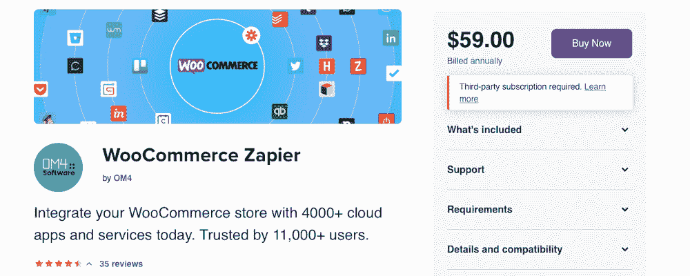

WooCommerce Zapier.

它提供了与所有 Zapier 连接的应用程序和服务的完全兼容性。然而，它确实每年花费 59 美元。要安装它，只需完成购买，下载 WooCommerce 插件。zip 文件，然后像上传其他插件一样上传到 WordPress，方法是进入**插件>添加新的>上传插件**。

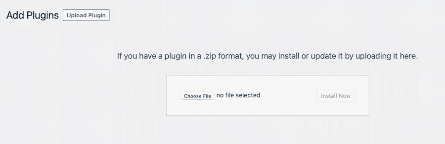

Upload the plugin to WordPress.

另一个选择是 WPFlyLeads 插件，它允许你自动将 WooCommerce 收集的信息发送给 Zapier。

WP Fly Leads.

该插件是免费的，但它依赖于 webhook，这是 Zapier 高级版本的一个功能。

另一个连接 WooCommerce 和 Zapier 的插件是[神秘的自动机](https://wordpress.org/plugins/uncanny-automator/)。它只集成了某些插件和扩展，但是，它是一个免费的选项，可以满足你的需求。

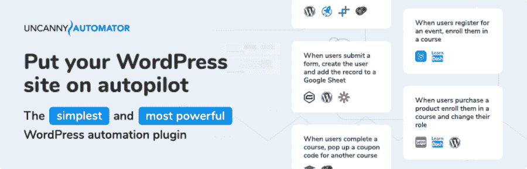

Uncanny Automator.

要安装这两个免费插件中的任何一个，只需进入**插件>在你的 [WordPress 仪表盘](https://kinsta.com/knowledgebase/wordpress-admin/)中添加新的**，然后搜索有问题的插件。

接下来，回到 Zapier，在 WooCommerce 和 Zapier 之间建立联系。按照引导走查将你的 WooCommerce 商店连接到 Zapier。

Setting up Zapier.

### 如何设置触发器和集成

在你开始创建触发器并在 WooCommerce 和其他应用程序之间建立集成之前，你需要先[安装任何你想集成的插件](https://kinsta.com/knowledgebase/how-to-install-wordpress-plugins/)。

例如，如果你经营的是基于服务的业务，你可以尝试安装 [WooCommerce Bookings](https://kinsta.com/blog/wordpress-booking-plugins/#woocommerce-bookings) 来修改[结账流程](https://kinsta.com/blog/woocommerce-checkout/)。或者您可以安装 [Gravity Forms](https://kinsta.com/blog/google-forms-alternative/#14-gravity-forms) 来将表单处理与其他外部服务集成在一起。您选择的 Zapier 插件支持的任何其他东西也足够了。

您还可以使用 WooCommerce 中默认可用的任何功能，比如下新订单。说到这里，这里有一个使用 Zapier 和 WooCommerce 设置触发器的例子。我们在这里所依赖的集成是 Google Sheets。

我们要创建的工作流是这样的，每个新订单都自动添加到您指定的 Google Sheets 文件中的新行。

要创建它，请执行以下操作:

1.登录您的 Zapier 帐户。点击 **+** 图标，然后开始输入 WooCommerce，直到出现 logo。选择它。

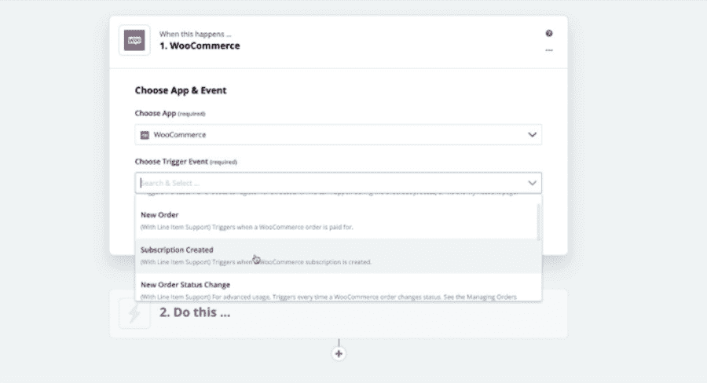

Setting up a trigger event in Zapier.

2.挑选**新订单**触发事件。然后复制提供的 webhook。将此 webhook 粘贴到您选择的插件中，将提要添加到您的网站。

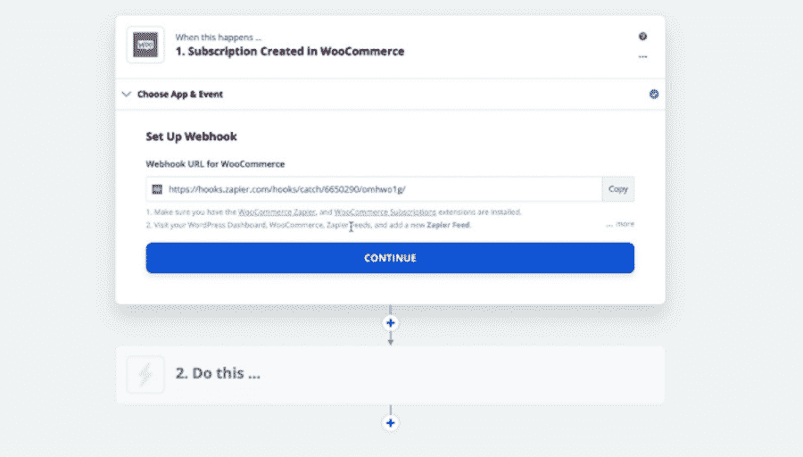

Copying the webhook to use in your Zapier plugin.

### 如何创建 zap

回到 zap 编辑器，选择触发器触发时应该发生什么。选择“工作表”应用程序并更新电子表格行。

## 注册订阅时事通讯

### 想知道我们是怎么让流量增长超过 1000%的吗？

加入 20，000 多名获得我们每周时事通讯和内部消息的人的行列吧！

[Subscribe Now](#newsletter)

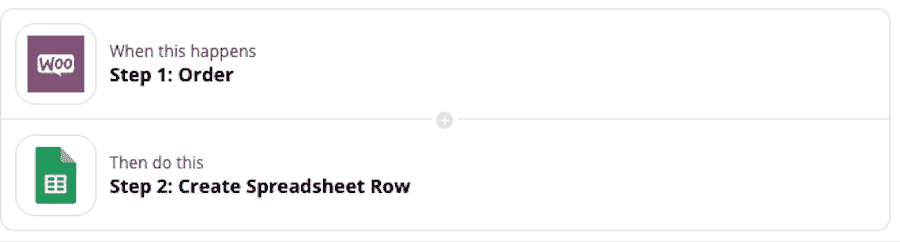

Zap for setting up WooCommerce to Google Sheets.

最后，使用 Zapier 运行一个虚拟订单测试，并看到它的信息出现在您指定的 Google Sheets 中。

这就是全部了。

## 12 大 WooCommerce Zapier 集成和配方

设置完成后，你就可以开始简化你作为网店店主的生活了。这里有 12 个 zaps 可以帮你节省很多时间。

### 1.将 WooCommerce 订单添加到 Google Sheets 行

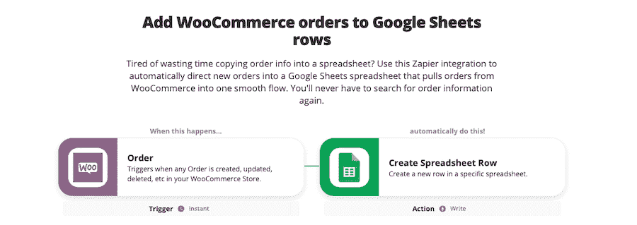

Add WooCommerce orders to Google Sheets rows.

这种将订单添加到 Google Sheets 行的 WooCommerce 集成可以极大地帮助您的组织工作。您不必手动将订单信息复制并粘贴到电子表格中，您可以配置这个 zap 来为您完成这个过程。

它的工作原理是自动将新订单直接添加到 Google Sheets 文件中。新订单来了，Zapier 开始工作，信息立即被添加到电子表格中。

### 2.通过优惠券运营商为新的 WooCommerce 订单提供独特的优惠券

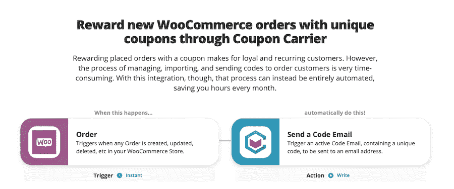

Reward new WooCommerce orders with unique coupons through Coupon Carrier.

另一个值得一试的集成是这个，它允许你通过优惠券运营商用一个独特的优惠券轻松地奖励新订购 WooCommerce 的顾客。当顾客下订单时，会立即给他们一张优惠券，以感谢他们的购买。

这是建立一个有思想的卖家声誉的极好方法，也有助于创造忠诚的顾客。

通过自动化为每个新订单创建新优惠券并将其发送给客户的工作流程，您可以节省时间，同时不会影响客户的满意度。

### 3.作为 Marketo 的领导，抓住新的 WooCommerce 客户

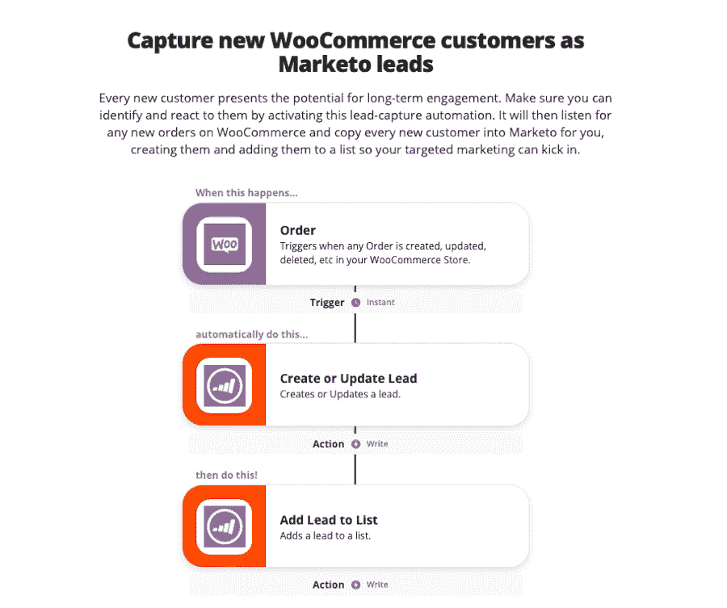

Capture new WooCommerce customers as Marketo leads.

如果你想扩大与客户的关系，你可以使用 Zapier 集成，它会自动为你在 Marketo 中插入新的 WooCommerce 客户。这是一个有效的[线索捕捉自动化](https://kinsta.com/blog/wordpress-membership-plugins/),它从 WooCommerce 获取新订单，并代表你将每个新客户复制到 Marketo。

如果还将它们添加到您的营销列表中，那么它们将被添加到您当前正在进行的任何自动电子邮件活动中。

Struggling with downtime and WordPress problems? Kinsta is the hosting solution designed to save you time! [Check out our features](https://kinsta.com/features/)

### 4.根据新的 WooCommerce 订单创建 Trustpilot 邀请

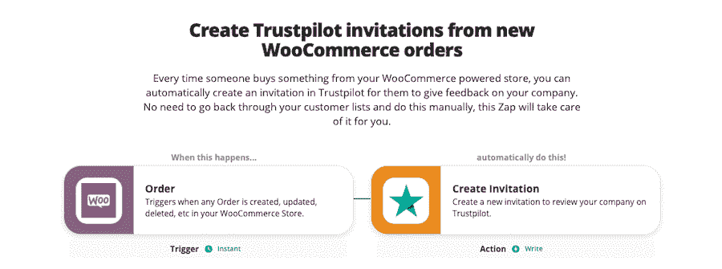

Create Trustpilot invitations from WooCommerce orders.

或者，您可以使用这种集成将新的 WooCommerce 订单转化为 Trustpilot 邀请。因此，任何时候有人在你的 WooCommerce 商店购物，他们都会收到 Trustpilot 的邀请，要求他们[留下对你公司的反馈](https://kinsta.com/blog/wordpress-survey-plugins/)。

手动查看订单清单非常耗时，因此自动化流程将确保您不会在任务上花费不必要的额外时间，也不会意外忘记。

### 5.向 ActiveCampaign 添加新的 WooCommerce 客户

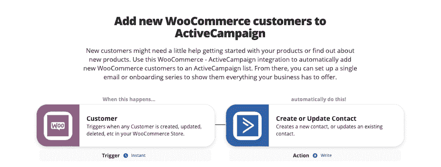

Add new WooCommerce customers to ActiveCampaign.

另一个可以考虑使用的有用集成是这个，它允许您将新的 WooCommerce 客户添加到 [ActiveCampaign](https://kinsta.com/blog/email-design/) 中。

如果您的产品或服务有一个学习曲线，或者如果客户可以从入门指南中受益，这将特别有帮助。您甚至可以利用这一点将客户添加到未来产品发布的列表中，以帮助[留住客户](https://kinsta.com/blog/customer-retention/)。

### 6.将新的 WooCommerce 客户保存到 HubSpot 联系人

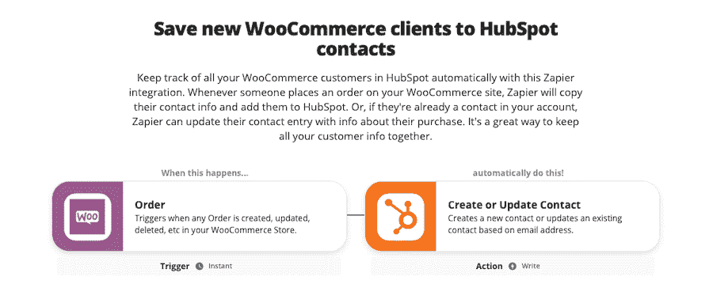

Save new WooCommerce clients to HubSpot contacts.

如果你是 HubSpot 的粉丝，这种集成可以让你将新的 WooCommerce 客户保存到你的 [HubSpot](https://kinsta.com/blog/google-forms-alternative/) 联系人中，这非常有用。每当一个新客户在你的 WooCommerce 商店下订单时，他们的联系信息会直接添加到 HubSpot，用于你的活动。

更有帮助的是，如果客户过去曾向您购买过产品，该集成还会用新的产品更新客户信息。这使得将所有订单信息——过去的和现在的——组织在一个位置变得简单。

### 7.为新的 WooCommerce 订单创建 QuickBooks 在线销售收据

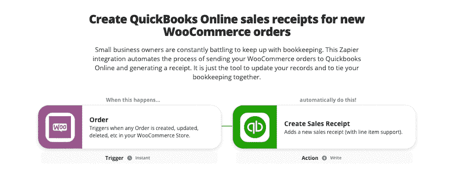

Create QuickBooks online sales receipts for new WooCommerce orders.

另一个有用的集成是为每个新的 WooCommerce 订单自动创建一个 [QuickBooks](https://kinsta.com/blog/freshbooks-vs-quickbooks/) 在线销售收据。因此，不用手动更新你的簿记记录，这个 zap 会自动为你处理。

### 8.根据新的 WooCommerce 订单创建 Trello 卡

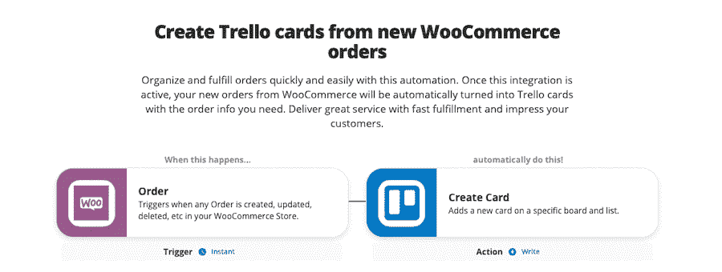

Create Trello cards from new WooCommerce orders.

如果你很难做到井井有条，那么每次你得到一个新的 WooCommerce 订单时，自动创建一张新的 Trello 卡可能会有所帮助。自动生成的 Trello 卡包含您需要完成的订单信息。

如果您的商店出售定制产品，这尤其有用。带有定制详细信息的 Trello 卡将有助于确保您的客户每次都能获得他们所订购的产品。

### 9.为新的 WooCommerce 订单创建 Tookan 交付任务

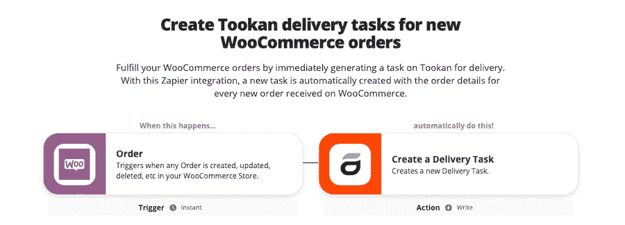

Create Tookan delivery tasks for new WooCommerce orders.

或者您可以利用这种集成，为每个新的 [WooCommerce 订单](https://kinsta.com/blog/woocommerce-weight-based-shipping/)创建一个 Tookan 交付任务。Tookan 中的新任务是在下订单后自动生成的，包括所有相关的订单细节。

### 10.获取发送到 Gmail 的 WooCommerce 订单的预定摘要

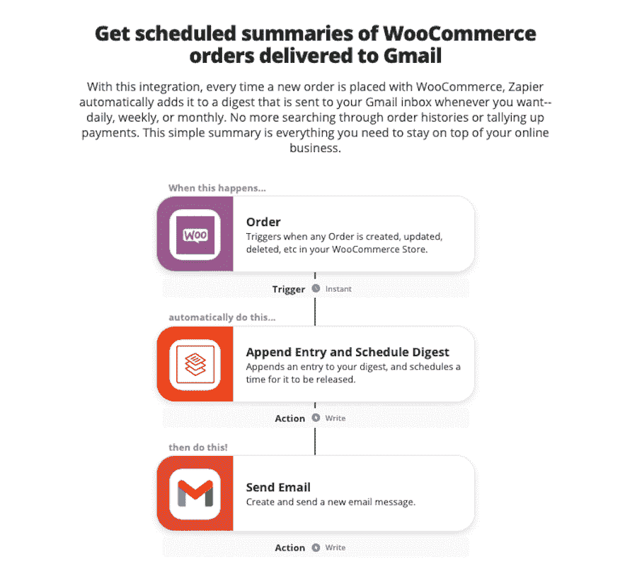

Getting scheduled summaries of WooCommerce orders delivered to Gmail.

如果你住在你的电子邮件收件箱里，接收你最新的 [WooCommerce 订单](https://kinsta.com/blog/woocommerce-inventory-management/)的摘要发送到你的 [Gmail 地址](https://kinsta.com/blog/multiple-gmail-accounts/)可能会有帮助，让你更好地了解你的商店的状态。

一旦这个 zap 被激活，每次下新订单时，您都会收到电子邮件通知。您也可以设置这些电子邮件的频率，zap 将每天、每周或每月编辑并发送所有订单的摘要。这样，无论你身在何处，你都会知道你的企业在哪里。

### 11.当您的客户的 WooCommerce 订单状态发生变化时，向他们发送短信

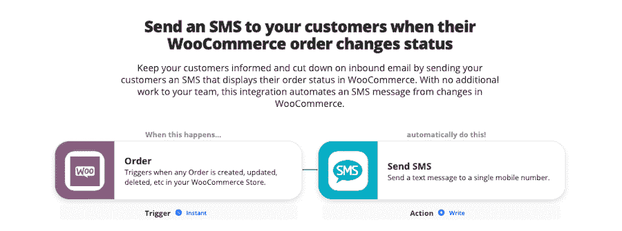

Send an SMS to your customers when their WooCommerce order changes status.

一些 Zapier 集成也有助于让客户了解他们的订单。当客户的[订单状态](https://kinsta.com/blog/best-woocommerce-multi-vendor-plugins/)发生变化时，它会向客户发送一条短信。

这样，当客户的订单得到确认或发货时，他们会自动得到通知，而无需您手动发送任何信息。这是让客户了解信息和建立消费者信任的好方法。

### 12.从新的 WooCommerce 订单向 Salesforce 添加销售线索

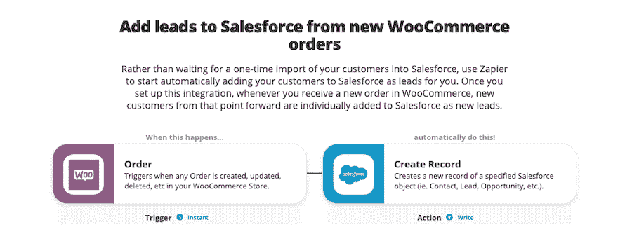

Adding leads to Salesforce from new WooCommerce orders.

我们列表中的最后一个是一个集成，每当你收到一个新的 WooCommerce 订单时，它都会增加销售线索到 [Salesforce](https://kinsta.com/blog/email-tracking-software/) 。没有必要手动导出您的客户列表或类似的东西。相反，这个 zap 会在新客户从你的 WooCommerce 商店下订单的时候把他们导入 Salesforce。

这些客户随后会在 Salesforce 中被列为新的潜在客户，您可以联系他们或在您认为合适的时候将其添加到您的电子邮件营销活动中。

[WooCommerce 🤝 Zapier. Learn more in this guide 🚀Click to Tweet](https://twitter.com/intent/tweet?url=https%3A%2F%2Fbit.ly%2F3yvxCgQ&via=kinsta&text=WooCommerce+%F0%9F%A4%9D+Zapier.+Learn+more+in+this+guide+%F0%9F%9A%80&hashtags=WooCommerce%2CEcommerce) ## 摘要

就是这样！希望您现在对如何将 WooCommerce 与 Zapier 集成有了更好的理解。我们今天花时间讨论了 Zapier 是什么，它如何与 WooCommerce 一起工作，以及在 WooCommerce 中使用它的好处。

我们还详细介绍了设置 Zapier 连接或“zaps”的过程，包括您需要的插件和将 Zapier 与 WooCommerce 集成所需的步骤，以及在 Zapier 中集成其他应用程序。我们还谈到了设置触发器和集成，并提供了一个健康的 zaps 列表，您可以立即将其用于 WooCommerce。

现在是时候开始简化工作流程了。Zapier + WooCommerce 是实现这一目标的强大组合。如果你对网上商店仍有疑问，也请务必阅读我们的综合指南[用 WooCommerce](https://kinsta.com/learn/woocommerce-guide/) 促进销售。

* * *

让你所有的[应用程序](https://kinsta.com/application-hosting/)、[数据库](https://kinsta.com/database-hosting/)和 [WordPress 网站](https://kinsta.com/wordpress-hosting/)在线并在一个屋檐下。我们功能丰富的高性能云平台包括:

*   在 MyKinsta 仪表盘中轻松设置和管理
*   24/7 专家支持
*   最好的谷歌云平台硬件和网络，由 Kubernetes 提供最大的可扩展性
*   面向速度和安全性的企业级 Cloudflare 集成
*   全球受众覆盖全球多达 35 个数据中心和 275 多个 pop

在第一个月使用托管的[应用程序或托管](https://kinsta.com/application-hosting/)的[数据库，您可以享受 20 美元的优惠，亲自测试一下。探索我们的](https://kinsta.com/database-hosting/)[计划](https://kinsta.com/plans/)或[与销售人员交谈](https://kinsta.com/contact-us/)以找到最适合您的方式。