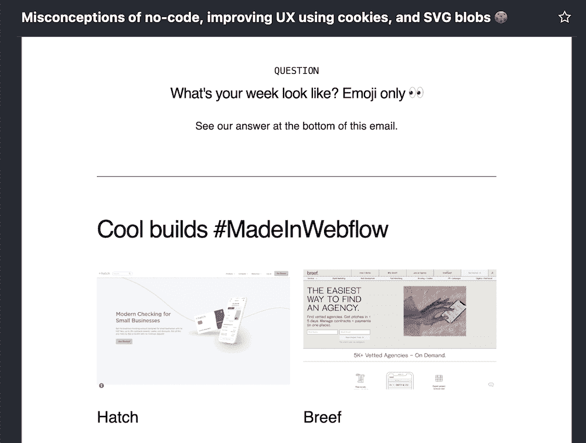
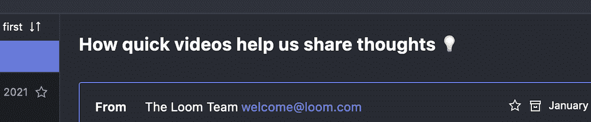
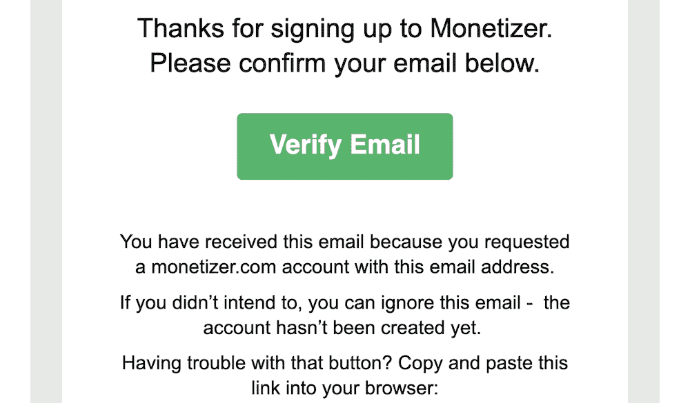
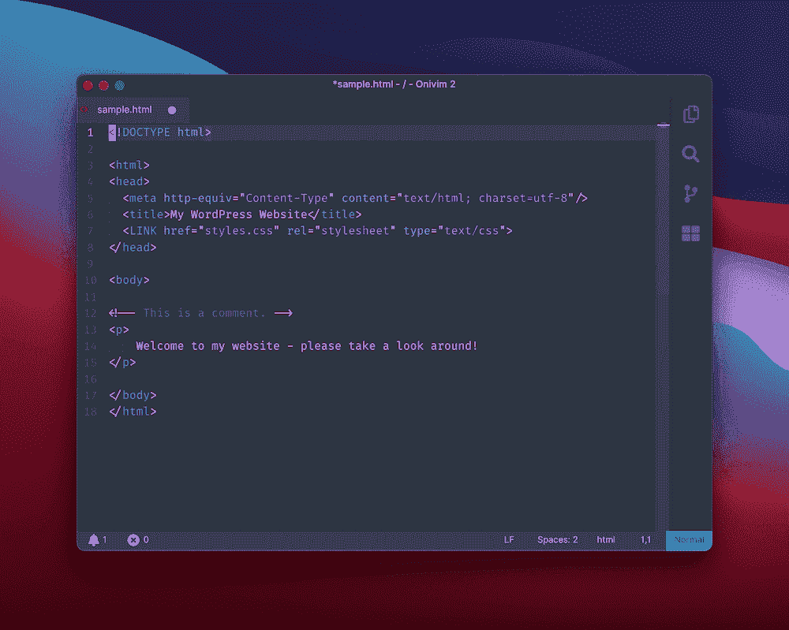
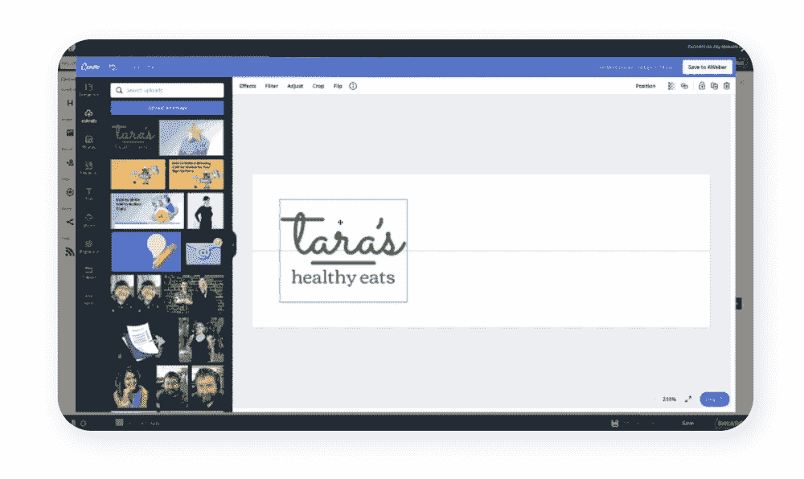
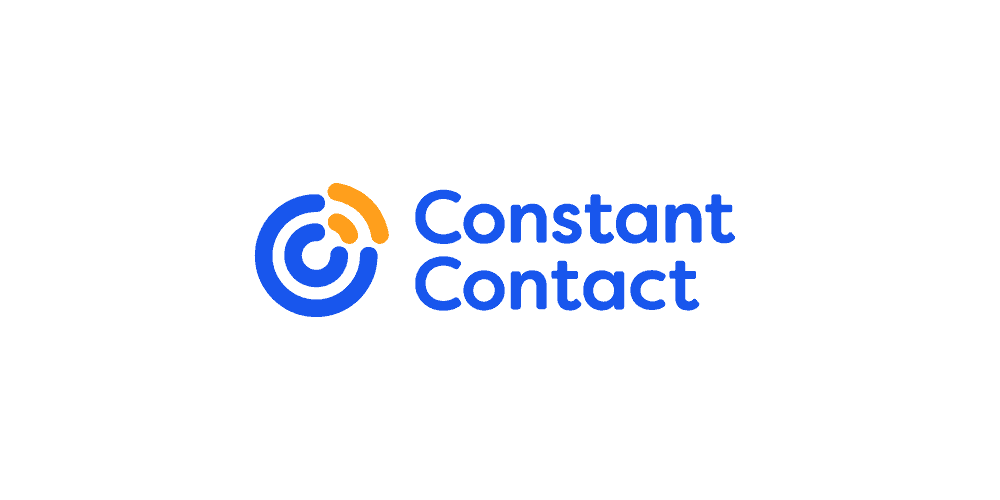
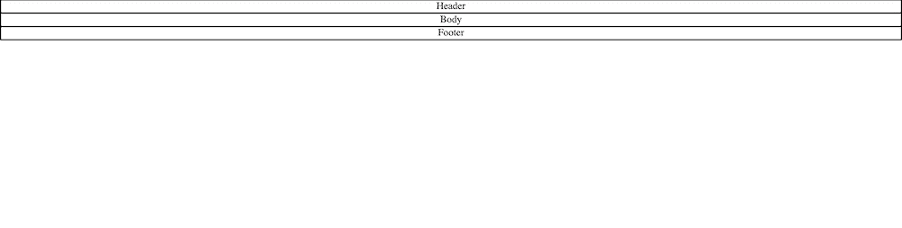
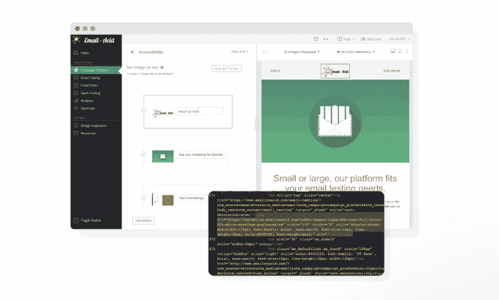
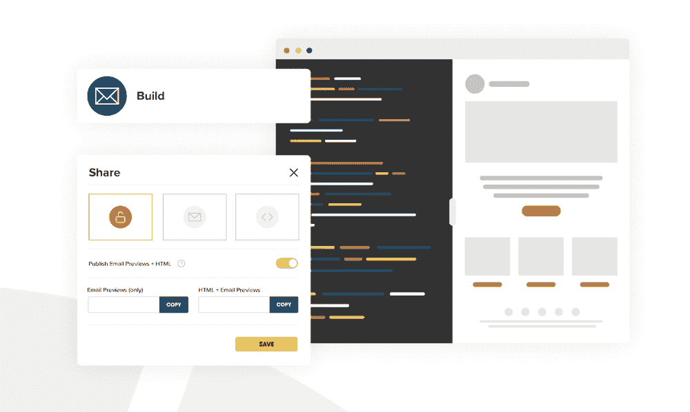
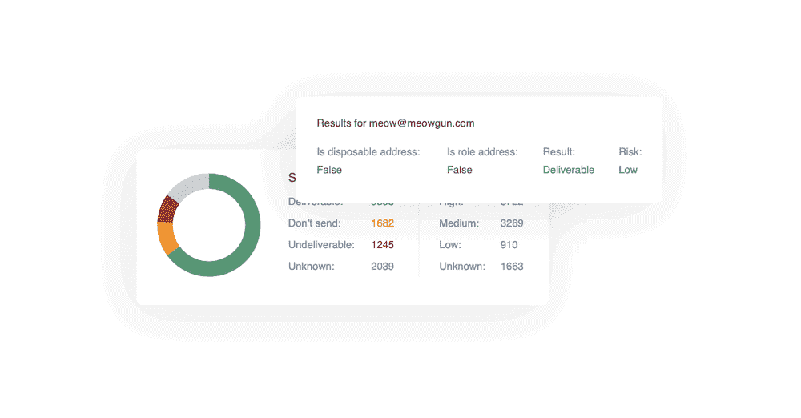

# 创建和发送 HTML 电子邮件的初学者指南

> 原文：<https://kinsta.com/blog/html-email/>

快速突击测验:web 开发人员用来创建您每天访问的网站结构的语言叫什么名字？撇开聪明和过于聪明的答案不谈，[超文本标记语言(HTML)](https://kinsta.com/blog/learn-html/) 是一个常青的标准，在网络诞生时就存在了。然而，这不仅仅适用于网页。你的收件箱是 HTML 邮件设计的沃土。

如果你考虑到你几乎每小时在邮件中看到多少图片、gif、视频和品牌内容，这是有意义的。虽然你可以提供纯文本的电子邮件，但 HTML 版本将提供更多的好处，给你更多的机会来推广你自己和你的企业。

在这篇文章中，我们将讨论如何创建和发送 HTML 电子邮件，以及为什么你应该这样做。在某些时候，我们会深入研究如何编写电子邮件，但你不需要这些知识来创建自己的邮件。

## 什么是 HTML 电子邮件？

到达你收件箱的电子邮件有两种类型:


*   这几乎是现代的一份电报。没有样式或最少的格式，收件人将看到单词，而其他所有内容都被排除在外。
*   与纯文本相比，这是一个“嗖嗖”的鞭炮，而且它的设计很重。它使用 HTML 代码来呈现电子邮件，尽管正如我们将要讨论的，它并不总是要利用现代网络标准。

例如，您会知道是否收到纯文本电子邮件，因为它看起来与纯文本文档完全一样。相比之下，HTML 电子邮件看起来几乎和现代网页一样(或多或少有些样式和格式问题):



An HTML email within the browser.


在大多数情况下，HTML 格式的电子邮件不会努力提供最好的交互性或动态参与性。再说一遍，这是我们稍后会谈到的，但是 HTML 电子邮件在标准方面落后于 web。因此，HTML 更像是一个设计驱动的工具，而不是帮助提供体验的工具。这就带来了一个问题:如果唯一的原因是可视化的，为什么要使用 HTML 电子邮件呢？我们接下来会回答这个问题。

[Q: What's the language that web developers use to create the sites you visit every day? 🤔 A: HTML... and you can learn more in this guide ✅Click to Tweet](https://twitter.com/intent/tweet?url=https%3A%2F%2Fbit.ly%2F3AbY945&via=kinsta&text=Q%3A+What%27s+the+language+that+web+developers+use+to+create+the+sites+you+visit+every+day%3F+%F0%9F%A4%94+A%3A+HTML...+and+you+can+learn+more+in+this+guide+%E2%9C%85&hashtags=HTML%2CWebDev)

## 为什么你会使用 HTML 格式的邮件而不是纯文本格式

出于几个原因，你很少会看到来自企业的纯文本电子邮件。然而，纯文本本身并没有错，它并没有提供 HTML 电子邮件格式的任何好处。例如:

*   您可以使用固有的视觉元素来帮助将注意力集中在您的[电子邮件内容](https://kinsta.com/blog/email-design/)的各个部分。
*   通过扩展，HTML 电子邮件是一种丰富的呈现内容的格式。这意味着你可以利用用户期望与他们互动的元素，比如图像、[视频](https://kinsta.com/blog/video-hosting/)等等。
*   结合起来，这两个方面可以为你提供一个极好的机会来品牌化你的内容，就像你会你的主网站。

然而，决定使用 HTML 电子邮件并不是你想象的完美风暴。还有一些缺点需要考虑。首先，你必须考虑用户的体验，就像你设计网站一样。这可能不仅仅包括浏览器，许多用户也喜欢在专用的客户端阅读电子邮件。

此外，你还必须考虑一些主导网络开发的隐私和安全问题。如果你想包含 JavaScript、引入第三方字体和其他方面，这一点尤其正确。

正因为如此，你不得不在比网络更多的战线上为可访问性和标准而战。很难创建一个跨浏览器和客户端的 HTML 电子邮件。当然，这样做是可能的，我们将在以后的章节中讨论技术方面。现在，你会想要决定你的电子邮件的各种元素，然后去实现它们。

## HTML 电子邮件的基本要素(和典型实践)

由于内在的相似性，这篇文章将在很多地方参考网页设计。提供类似工作流程的一个方面是如何决定 HTML 电子邮件的方面和部分。

就像网络一样，对于你的电子邮件来说，有些元素实际上是不可协商的。当然，你需要内容。这里有几个典型的因素需要考虑:

*   你的标题很重要，因为这是你的邮件给读者的第一印象。
*   就像网页设计一样，思考什么元素显示在折叠上方也是有益的。
*   正文内容至关重要，因为毕竟这是为什么读者会订阅你的邮件。
*   HTML 邮件的页脚也为你和你的订阅者提供了很多价值，它可能是你邮件中被低估的元素。

这里有几点我们可以进一步探讨。首先，考虑一下有多少表情符号渗透到我们的日常网络使用中。虽然表情符号不是一个严格的 HTML 元素，但有品味的应用可以为你的内容创造奇迹，尤其是你的标题:



A selection of emojis used in the title header.


页脚也是一些重要法律信息的最佳位置。与电子邮件相关的两个最大的问题是垃圾邮件和电子邮件是否到达正确的收件箱(如果有的话)。这是我们将在后面的部分看到的，因为它是创建和发送 HTML 电子邮件的重要部分。

### 考虑你的 HTML 邮件的一些典型做法

当谈到你将在设计和布局中使用的一些最佳实践时，电子邮件营销与电子邮件营销有很多交叉。有一点你会想把它作为一个几乎没有商量余地的因素:双重选择加入。

最大的[电子邮件营销技巧之一](https://kinsta.com/blog/email-marketing-statistics/)是你想把你的电子邮件带给读者。换句话说，在网站上提供一个[选择加入表格](https://kinsta.com/blog/mailchimp-for-wordpress/)，因为这有一个[大转换率](https://kinsta.com/blog/conversion-rate-optimization-tips/)。然而，这不应该是你唯一一次要求确认。以电子邮件形式发送第二份加入通知是一个很好的做法:



A double opt-in email.


这有几个原因:

*   第一，它与你的读者建立信任，因为你得到了向他们发送电子邮件的明确许可。
*   推而广之，在垃圾邮件推荐的情况下，您也有明确的同意(稍后将详细介绍)。
*   你帮助其他人阻止滥用电子邮件和垃圾邮件，因为他们必须明确选择订阅你的电子邮件。

事实上，因为双重选择加入涉及到你发送一封电子邮件到有问题的地址，这是最好的方式来验证电子邮件地址。

还有其他一些好的实践可以考虑。然而，以下是更多的选择，因为你会得到奇妙的结果，但有时你不想遵循这些准则:

*   你的主题应该是完美的，你的邮件内容应该切题。鉴于手机浏览的出现和现在的主导地位，这一点尤为重要。
*   说到这一点，你需要确保你的 HTML 邮件在小屏幕上阅读顺畅——这意味着没有过长的横幅或过大的徽标。
*   如果你在每封邮件中都包含一个强烈的行动号召(CTA ),你就有很大的机会提高用户参与度。
*   追踪是一个有争议的问题，但这将有助于你理解当你给用户发邮件时他们在做什么。一些提供商将一组可靠的分析作为标准。

和你如何展示和设置你的邮件一样重要的是如何设计和布局。在接下来的几节中，我们将研究如何创建一封 HTML 电子邮件，然后给出一些发送邮件的技巧。

## 创建 HTML 电子邮件需要采取的技术方法

如果你有一些网络开发经验，你无疑会使用 HTML5 作为你的标记语言。这是一个不同于以前的 [HTML 和 XHTML](https://kinsta.com/blog/xml-vs-html/) 的世界，包括更多的样式(其中几乎没有有效的元素)和结构之间的划分。

对于后者，HTML5 提供了许多不同的标签来定义站点的内容区域。



A number of HTML structural tags.


然而，电子邮件 HTML 是一个不同的野兽，因为它有点落后于时代。因此，您会希望使用所有这些旧的 HTML4 表格和内联样式来创建您的布局。为什么会这样，你需要和电子邮件客户端的开发者谈谈，因为他们经常会在你的收件箱里修改 HTML 格式的邮件。最常见的行为之一是出于安全原因(以及其他原因)从电子邮件中删除 CSS 和 T2。

这意味着你需要提供另一种方式来为你的 HTML 邮件添加样式——内嵌是兼容性的唯一选择。说到兼容性，这是一个重要的考虑因素。您必须在独特的风格和最终用户电子邮件客户端的功能之间取得平衡。因此，您还需要注意其他一些技术问题:

*   使用[系统字体](https://kinsta.com/blog/html-fonts/)而不是第三方字体将为您节省一个 [HTTP 请求](https://kinsta.com/blog/http-status-codes/)，为用户快速加载电子邮件，并提供一个[外观一致的电子邮件](https://kinsta.com/blog/best-fonts-for-email/)来启动。
*   你可以更进一步，为那些不能在客户端查看 HTML 格式邮件的人提供一个纯文本版本的邮件。很多网站会提供你可以在线访问的 HTML 版本，既是出于这个原因，也是作为备份。
*   替代文本对于 HTML 电子邮件和网页一样重要。因此，在向内容[添加图像的任何地方都要使用 alt 文本，以提高可访问性](https://kinsta.com/blog/wordpress-accessibility/)。

HTML 邮件有一个你应该多考虑的技术方面，因为它可以跨越内联样式、CSS 和其他因素之间的界限。让我们简单讨论一下“条件句”。

### 使用条件句

HTML 电子邮件的一个遗留问题是条件性的，它曾经存在于旧的 HTML web 开发工具包中。您可以在这里指定哪个浏览器将使用特定的代码片段。

老实说，这几乎总是微软的问题。对于网络开发人员来说，IE 是浏览器的代名词。然而，对于 HTML 电子邮件，它是 [Outlook](https://kinsta.com/blog/outlook-alternative/) 。在不同的版本之间，您可能会看到您的样式以您意想不到的方式呈现。

因此，您可以在代码中添加条件块，并定义这些元素。例如，您可以针对基于 Word 和基于 IE 的 Outlook 版本。

首先，单词:

```
<!--[if mso]>
```

这适用于基于 Word 的 Outlook 版本:

```
<![endif]-->
```

对于 Internet Explorer，您可以使用不同的标记:

```
<!--[if (IE)]>
```

这适用于基于 IE 的 Outlook 版本:

```
<![endif]-->
```

如果您的目标浏览器是基于 WebKit 的(如 Apple Safari、PlayStation 浏览器、Amazon 的 Kindle 等)，您可以使用媒体查询来提供特定的样式:

```
.html-email-webkit {
  display: none;
}
@media screen and (-webkit-min-device-pixel-ratio:0) {
  ..html-email-webkit {
    display: block !important;
  }
}
```

这为您提供了一个稍微好一点的方法来使您的 HTML 电子邮件适应最终用户的显示。总的来说，电子邮件的 HTML 样式并不完美，但是每个[电子邮件客户端](https://kinsta.com/email-market-share/)都有足够的功能来帮助你创建一些令人惊叹的布局。

## 构建 HTML 电子邮件的选项

尽管我们已经讨论过了，你有许多灵活的选择来帮助你创建 HTML 电子邮件。例如，您可以使用一个[漂亮的文本编辑器](https://kinsta.com/blog/best-text-editors/)和 HTML 从头开始构建。

但是，我们可以考虑其他选择:

*   你可以使用专门的服务，比如电子邮件营销应用，来创建你的电子邮件。许多应用程序将提供可视化构建器，但也给你写自己的代码，创建自己的模板的范围。
*   说到这里，你可以为你的 HTML 邮件下载一个模板。这很像 WordPress 主题，因为它为你设计的其余部分提供了一个基础。在那里，您可以根据自己的喜好进行定制。这是编码和构建选项之间的一个很好的中间地带。

稍后，我们将使用 HTML 创建我们的电子邮件。然而，在此之前，让我们看看你可能要考虑的一些电子邮件服务提供商，不管你选择的创建电子邮件的方法。


## 3 个电子邮件服务提供商非常适合创建 HTML 电子邮件

因为这篇文章的重点是创建 HTML 电子邮件，所以当谈到电子邮件服务提供商时，我们不需要太深入。即便如此，[还是有一些](https://kinsta.com/blog/mailchimp-alternatives/#mailchimp-alternatives-with-free-plans)你可能会考虑。

我们无法涵盖所有这些，所以我们将提到三个最受欢迎的。让我们把他们集合起来。

### 1.Mailchimp


The Mailchimp logo.


这家电子邮件服务提供商是首选解决方案，对许多人来说，这几乎是一个下意识的决定。 [Mailchimp](http://mailchimp.com) 在许多的[眼中是电子邮件营销应用的黄金标准，这有很多很好的理由:](https://kinsta.com/blog/how-to-use-mailchimp/)

*   它包括许多你会在许多其他类似应用中发现的典型功能。
*   在推广业务时，有很多帮助，比如营销自动化、受众管理工具等等。
*   你有一套顶级的创意工具来帮助你创建 HTML 电子邮件。

当然，我们这里要看的是后者。创意助手是 Mailchimp 了解你的品牌并帮助你建立和个性化你的电子邮件的一种方式。您还可以连接第三方应用程序，如 Adobe Photoshop，来帮助您创建完美的电子邮件。

## 注册订阅时事通讯


### 想知道我们是怎么让流量增长超过 1000%的吗？

加入 20，000 多名获得我们每周时事通讯和内部消息的人的行列吧！

[Subscribe Now](#newsletter)

使用现有的 HTML 也很简单，尤其是如果您使用 Mailchimp 的经典构建器。不管怎样，如果你需要的话，你有办法[导入 HTML 模板](https://kinsta.com/blog/web-components/#html-templates)。

Mailchimp 使用了一个复杂的每月订阅层级和联系人数量的混合体来得出最终价格。我们建议小型企业需要一个大约每月 35 美元的计划，最多 2500 个联系人。然而，你需要根据你需要的功能和你认为你会带来的联系人的数量来研究最适合你的计划。

### 2.AWeber

对一些人来说，一个月代表了电子邮件营销的顶峰。这是一个奇妙而强大的平台，包含了比 Mailchimp 更集中的功能集。



The AWeber logo.


它包括许多发送电子邮件所需的基本功能:

*   自动化和安排消息、活动等的能力。
*   你有很好的组织工具，比如用户标记和细分。
*   AWeber 还可以让你自动为你的电子邮件创建内容。例如，您可以用最少的工作量将博客文章转换成邮件。

说到创建电子邮件，AWeber 有一些锦囊妙计。它使用一个拖放式可视化构建器，包括一个定制模板库来帮助你开始。更重要的是，你可以将一个网页连接到你的 Canva 账户，并使用后者来帮助设计你的电子邮件。

还有一个[专用的 HTML 编辑器](https://help.aweber.com/hc/en-us/articles/204030836-How-Do-I-Use-The-HTML-Editor-)，这与 Mailchimp 不同。你甚至可以在 AWeber 的免费层得到这个。说到这里，[这里的定价](https://www.aweber.com/pricing.htm)更直白。你将为多达 2500 个联系人每月支付大约 25 美元。

### 3.经常接触

[持续联系](https://www.constantcontact.com)对于电子邮件服务提供商来说是一个异数，但它更像是一个秘密武器。它提供了一系列奇妙的特性和功能，并允许您在需要时使用 HTML。



The Constant Contact logo.


与 AWeber 非常相似， [Constant Contact](https://kinsta.com/blog/constant-contact-vs-mailchimp/) 专注于电子邮件营销，而不是其他以商业为中心的领域。因此，它有一个[功能集](https://www.constantcontact.com/features/view-all-features)，你会喜欢:

*   您拥有客户列表管理工具和营销自动化功能。
*   有广泛的报告选项。
*   你可以整合来自脸书、Instagram 和谷歌的广告程序。
*   有很多方法可以吸引新用户加入你的列表。

恒定接触的设计功能也很好。你可以[选择一个模板](https://www.constantcontact.com/features/email-templates)并使用可视化编辑器来构建整个设计。然而，你也可以[使用 HTML](https://v3.developer.constantcontact.com/api_guide/design_code_emails.html)——有时是以相对于其他工具的高级方式。

价格也很合理。对于核心计划和 2，500 个联系人，您每月需要支付大约 35 美元，对于附加计划，则需要支付 70 美元。

## 创建 HTML 电子邮件需要什么

在您开始构建 HTML 电子邮件之前，您将需要一些工具和技巧。以下是您在扭断指关节并开始之前应做的安排:

*   你会想要使用一个你觉得舒服的代码编辑器，因为它需要在这个过程中支持你。如果你不知道该选择哪一个，许多用户会选择 Visual Studio 代码 T1，尽管 T2 括号 T3 对于这个特殊的任务来说是最理想的。我们将使用 [Onivim2](https://www.onivim.io/) ，这是一个基于核心 VS 代码基础设施的 vim 风格的编辑器。
*   虽然你需要 HTML 技能，但你不需要像现代网络开发人员一样的知识(尽管这不会损害你的前景)。
*   你需要一种方法来测试你的电子邮件——[mail hog 是一种解决方案](https://kinsta.com/blog/mailhog/),我们在 Kinsta 博客的其他地方也有介绍。
*   虽然我们不打算使用预构建的模板，但您可能希望在将来使用其中的一个。
*   你还需要一个邮件提供商，因为你需要一些方法来发送你完成的 HTML 邮件。

所有这些就绪后，您就可以打开一个文本编辑器并开始了。接下来，我们将运行这个过程来创建一个基本的 HTML 电子邮件。

## 如何从头开始创建 HTML 电子邮件

在我们开始之前，值得注意的是，我们不会使用 Mailchimp 或 AWeber 这样的专用服务。相反，我们将从头开始创建一个简单的模板，您可以在任何需要的地方导入它。

我们将把这个过程分成几个不同的部分，因为尽管 HTML 电子邮件只是相对于网站而言的，但仍然有很多需要考虑的。

### 1.为你的 HTML 邮件创建基础

从电子邮件模板的框架开始是个好主意。一般来说，这将遵循 HTML 的一些典型实践:

Struggling with downtime and WordPress problems? Kinsta is the hosting solution designed to save you time! [Check out our features](https://kinsta.com/features/)

```
<!DOCTYPE PUBLIC “-//W3C//DTD XHTML 1.0 Transitional//EN” “https://www.w3.org/TR/xhtml1/DTD/xhtml1-transitional.dtd”>
<html >
  <head>
    <meta charset="UTF-8">
    <meta name="viewport" content="width=device-width,initial-scale=1.0">
    <title></title>
  </head>
  <body>
  </body>
</html>
```

这里有几件事我们应该提一下。首先，我们为 [Transitional XHTML 1.0](https://kinsta.com/blog/html-vs-html5/) 指定一个“doctype”，这是电子邮件开发人员的常见做法。从那里，我们指定一个 XML 名称空间，这在后面会很重要。

您还会注意到一些 meta 标记，它们定义了字符集以及浏览器应该如何在其视口中呈现 HTML。

框架的其余部分很简单——接下来我们将使用标题和正文标签。

### 2.为您的电子邮件模板添加结构

回到我们关于使用什么 HTML 标签的讨论，你会记得我们不想使用

或其他典型的结构元素。相反，我们希望使用表格，因为这在电子邮件客户端和服务中表现得很好。

一切都将从正文中的一组简单的标记开始:

```
<body>
  <table role="presentation">
    <tr>
      <td>
      </td>
    </tr>
  </table>
</body>
```

我们在标签中设置的属性有助于屏幕阅读器解析其中的文本，因此有利于可访问性。

从这里开始，您需要向表格中添加新的行和列，以便构建 HTML 电子邮件模板。如何做到这一点取决于你，但最好从页眉、页脚和正文部分开始。为了简洁起见，我们不会在这里重复它们，但是随着我们的进展，我们会提到它们。

好消息是，如果需要添加更多的节，您可以继续向表中添加新行。但是，从这里开始，您将希望开始引入样式和其他元素。

### 3.包括元素的样式

HTML 的美妙之处在于它几乎与你的风格无关。标记很简单，但是您应用的样式可能不简单。在这里，你将看到你的 HTML 邮件变得栩栩如生。

作为我们设计的指南，我们将在上添加一个

```
<style>
  table, td {border:2px solid #000000 !important;}
</style>
```

首先，我们要确保正文或主表中没有多余的空间(这里作为我们的正文，因为一些电子邮件客户端会删除该标签):

```
<body style="margin:0;padding:0;">
  <table role="presentation" style="width:100%;border-collapse:collapse;border:0;border-spacing:0;background:#ffffff;">
</body>
```

我们还将添加一些居中内容，并删除不同部分单元格中的任何额外填充:

```
<tr>
  <td align="center" style="padding:0;">Header
  </td>
</tr>
```

如果你在你的浏览器里看一下这个，它看起来不会很像:



A browser window showing the skeleton of the HTML email.


但是，从这里开始，您可以使用表格和样式标签进一步开发您的电子邮件模板。例如，我们为页眉创建了一个英雄部分，并扩展了页脚和正文:


A mockup email template during creation (Image source: [Settergren](https://pixabay.com/vectors/post-office-airmail-letter-403145/)).


您可能会创建一个更好、更适合您需求的模板，但是使用嵌套表格和一些基本的 HTML 技能，您可以创建一个响应迅速的定制 HTML 电子邮件模板。

### 4.测试您的电子邮件

在你完成之前，你会想要测试你的电子邮件，以确保它在不同的设备上表现良好。这里有一些不同的服务可以提供帮助。

例如，[关于 Acid](https://www.emailonacid.com/) 的电子邮件包含完整的预部署清单，可帮助您确保您的模板不会引起问题:



The Email on Acid website.


用户将会知道 [PutsMail](https://putsmail.com/) ，但是所有人都可以使用它:



The Litmus website.


你需要注册一个账户来使用这项服务，但是使用起来很简单。您可以利用该功能在多种不同的浏览器和设备上预览电子邮件。

Mailgun 还提供与其主要产品相结合的奇妙服务。你可以通过界面测试电子邮件客户端、浏览器等等。此外，你可以测试一些元素，比如主题行，以确保你的打开率很高。



Mailgun’s Email Tester tool.


然而，一旦你测试了你的邮件，你需要确保它到达收件人的收件箱。在最后一节，我们将对此进行更多的讨论。

## 发送 HTML 电子邮件:你需要知道什么

使用电子邮件营销服务的一个好处是，我们还没有提到它将如何处理发送电子邮件的法律方面。这一点很重要，因为如果你在这里出了问题，你不仅无法联系到收件人，还会给自己惹上麻烦。

电子邮件营销服务已经与处理垃圾邮件和发送电子邮件的相关方面的组织建立了良好的工作关系。因此，如果您不想担心发送垃圾邮件，选择其中一个通常是个好主意。

但是，不管您使用什么平台，我们都可以提供一些提示:

*   确保你遵循了 CAN-SPAM 法案的所有指导方针，尤其是如果你的主要观众在美国的话。当然，不同的国家会有他们自己的[法律指令](https://mailchimp.com/help/anti-spam-requirements-for-email/)。
*   包括订户的双重选择加入。这是您要求他们确认订阅，但也发送第二次确认。如果有垃圾邮件查询或隐私请求，这可以保护您和订户。

[可送达性](https://kinsta.com/blog/why-are-my-emails-going-to-spam/)是你的电子邮件的一个关键要素，这是我们在另一篇文章中深入讨论的内容。然而，这个概念是几个方面的混合，比如使用好的代码、获得适当级别的权限等等。

这关系到另一个方面——你的发送分数。这类似于信用评分，最终是衡量你的声誉。这里有几个组成整体的不同部分:

*   你网站的跳出率。
*   您的网站收到的与您发送的电子邮件相关的投诉数量。
*   你的 IP 地址的信誉。
*   你的域名签名。

后者与您的[域名密钥识别邮件(DKIM)](https://kinsta.com/blog/email-authentication/) 和[发件人政策框架(SPF)](https://kinsta.com/knowledgebase/spf-record/) 相关。此外，你可以通过 [SenderScore](https://senderscore.org/) 或 [IPQualityScore](https://www.ipqualityscore.com/ip-reputation-check) 等服务来检查你的 IP 的声誉。

如果您在第一个实例中选择了[右边的简单邮件传输协议(SMTP)提供者](https://kinsta.com/blog/free-smtp-server/)，您可以一下子勾选其中的一些框。很像你选择的电子邮件营销解决方案，这项服务将了解你需要什么来保持你的高投递率，并在权力的右边。

Mailgun 是我们之前提到的解决方案，这可能是理想的。然而，还有其他的如 [Mailjet](https://www.mailjet.com/) 、 [Sendinblue](https://www.sendinblue.com/) ，甚至还有 [Gmail 自带的服务](https://kinsta.com/blog/gmail-smtp-server/)。

在本指南的帮助下，学习如何创建和发送 HTML 电子邮件💪 点击推文


## 摘要

电子邮件远没有走到尽头。因此，使用电子邮件满足自己的需求——如促销和营销——是一种接触潜在订户、用户和客户的绝佳且经济有效的方式。

虽然你可以购买一个专用的 HTML 模板，但创建自己的 HTML 电子邮件并不困难。如果你心中有一个明确的愿景，这可能是你成功的方式。然而，你需要拿出你的老 HTML 技巧，比如条件和嵌套表。HTML 邮件设计还没有达到现代网页设计的水平，但是你仍然可以事半功倍。

你需要创建 HTML 格式的电子邮件吗？如果需要，你有什么问题？请在下面的评论区告诉我们！

* * *

让你所有的[应用程序](https://kinsta.com/application-hosting/)、[数据库](https://kinsta.com/database-hosting/)和 [WordPress 网站](https://kinsta.com/wordpress-hosting/)在线并在一个屋檐下。我们功能丰富的高性能云平台包括:

*   在 MyKinsta 仪表盘中轻松设置和管理
*   24/7 专家支持
*   最好的谷歌云平台硬件和网络，由 Kubernetes 提供最大的可扩展性
*   面向速度和安全性的企业级 Cloudflare 集成
*   全球受众覆盖全球多达 35 个数据中心和 275 多个 pop

在第一个月使用托管的[应用程序或托管](https://kinsta.com/application-hosting/)的[数据库，您可以享受 20 美元的优惠，亲自测试一下。探索我们的](https://kinsta.com/database-hosting/)[计划](https://kinsta.com/plans/)或[与销售人员交谈](https://kinsta.com/contact-us/)以找到最适合您的方式。