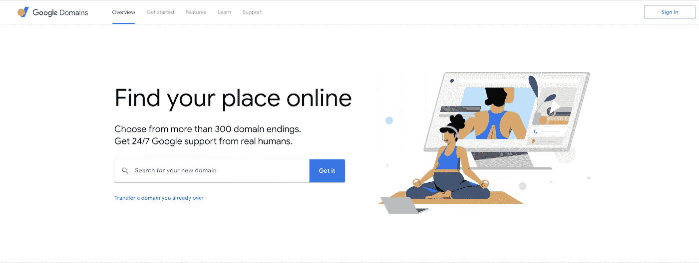
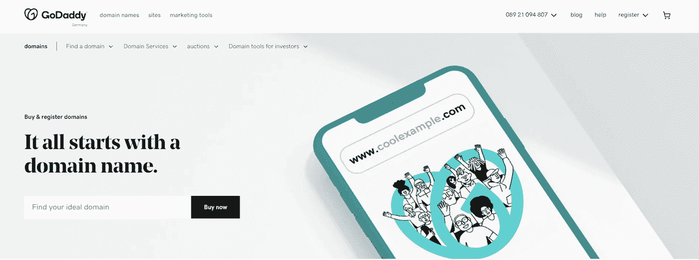
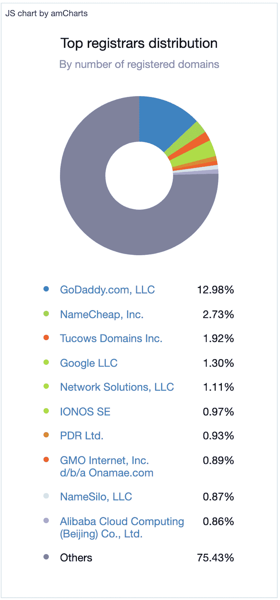
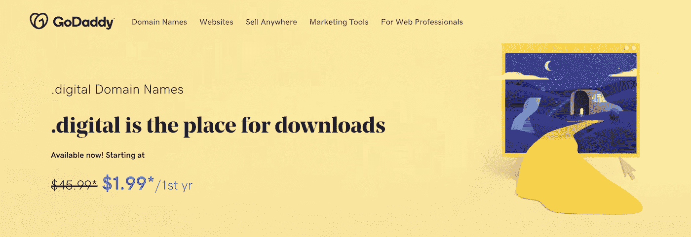

# 谷歌域名 vs GoDaddy:选择哪个域名注册商

> 原文：<https://kinsta.com/blog/google-domains-vs-godaddy/>

当向[域名系统(DNS)](https://kinsta.com/knowledgebase/what-is-dns/) 注册新域名时，您有如此多的选择。

您需要决定选择哪个域名，在哪里托管您的网站，以及您需要什么功能。

不确定[如何购买域名](https://kinsta.com/blog/how-to-buy-a-domain-name/)？这不是一个困难的过程，但你可能会想知道为什么你要货比三家摆在首位。

大多数人会直接选择他们想要的域名，但是看看你注册的是哪家公司也同样重要。

有许多优秀的域名注册商可供选择。在本指南中，我们将深入探讨 Google Domains 和 GoDaddy 这两个当今市场上最受欢迎的域名注册商。

在我们对 Google 域名和 GoDaddy 的分析中，我们将讨论定价、安全性和易用性等重要问题。

 [Need a new domain registrar? Look no further 😌Click to Tweet](https://twitter.com/intent/tweet?url=https%3A%2F%2Fkinsta.com%2Fblog%2Fgoogle-domains-vs-godaddy%2F&via=kinsta&text=Need+a+new+domain+registrar%3F+Look+no+further+%F0%9F%98%8C&hashtags=DomainRegistrar%2CSiteTips)

## 谷歌域名的历史

Google Domains offers over 300 top level domains and an easy to navigate registration process. (Image Source: [Google](https://domains.google/))

谷歌域名(Google Domains)是谷歌提供的庞大网站工具套件的一部分，于 2015 年悄然推出。虽然这项服务已经存在多年，但它直到 2022 年 3 月才正式退出测试。
 与大多数域名注册商不同，谷歌域名[并不](https://kinsta.com/blog/google-domains-review/) [提供](https://kinsta.com/blog/google-domains-review/) [虚拟主机](https://kinsta.com/blog/google-domains-review/)。相反，你需要通过谷歌注册你的域名，然后找一个单独的托管公司。如果你熟悉[域名停放](https://kinsta.com/knowledgebase/parked-domain/)，这是相当容易的。

> 需要在这里大声喊出来。Kinsta 太神奇了，我用它做我的个人网站。支持是迅速和杰出的，他们的服务器是 WordPress 最快的。
> 
> <footer class="wp-block-kinsta-client-quote__footer">
> 
> 
> 
> <cite class="wp-block-kinsta-client-quote__cite">Phillip Stemann</cite></footer>

[View plans](https://kinsta.com/plans/)

虽然谷歌可能还没有提供托管服务，但它的域名网站导航简单，不会强迫你购买几十个以后不需要的追加销售。因为你可以选择你自己的网络主机，你可以很容易地注册 WordPress 主机或谷歌的其他网站。

谷歌甚至在价格中包含了隐私保护，所以你不用支付任何单独的费用来保护你的信息不被骗子窃取。

如果你已经使用了 Gmail、 [Google Search Console](https://kinsta.com/blog/google-search-console/) 或 AdSense 等 G-Suite 工具，你可以用现有的 Google 登录帐户更快地注册，然后将你的域名链接到那个帐户。整个过程从头到尾都非常快速简单。

## 哥达迪的历史

GoDaddy has been registering domains since 2000\. (Image Source: [GoDaddy](https://www.godaddy.com/domains))

GoDaddy 是世界上最大的 ICANN 注册商之一。截至 2022 年，该公司已经注册了[所有已知域名的近 13%](https://domainnamestat.com/statistics/registrar/others) 。这家上市公司早在 1997 年就在亚利桑那州成立，并于 2000 年开始注册域名。

与谷歌不同，GoDaddy 几乎将[全部集中在](https://kinsta.com/godaddy-alternative/) [域名](https://kinsta.com/godaddy-alternative/)上。该公司还提供其他一些与域名相关的服务，比如网站托管，但远没有谷歌那么多样化。

虽然这对寻找专门的网络域名注册商的人来说可能是好事，但这确实意味着 GoDaddy 仅从这些产品中赚钱，这意味着它的价格并不总是像谷歌那样低。

GoDaddy 的许多域名可以以非常低的价格开始一年，但每年的续费要高出 20 倍。该公司还推出了一些额外的服务，可以迅速将折扣领域带入昂贵的领域。

## 谷歌域名 vs GoDaddy:势均力敌的比较

既然我们已经总结了 Google Domains 和 GoDaddy，那么让我们来看看你希望域名注册商记住的一些关键特性。

在我们对 Google 域名和 GoDaddy 的分析中，我们将关注:

*   每个公司提供的服务
*   他们在域名定价方面的比较
*   它们是多么容易使用

Domain registration by company. GoDaddy has the largest market share, but many websites are registered independently. (Image Source: [Domain Name Stat](https://domainnamestat.com/statistics/registrar/others))

### 易用性

Google Domains 和 GoDaddy 都有易于使用的网站。两者都有助于您快速浏览注册过程，您可以在几分钟内拥有一个新的网络域名。

虽然一个域名注册服务的功能是非常相似的，但我们给谷歌域名提供了一个稍微简单一点的网站。

Google Domains 的网站更容易使用，因为它没有推出太多的附加服务。另外，如果你已经有了一个谷歌账户，你很可能熟悉谷歌网站的布局，你将能够更快地完成你的域名注册。

### 域扩展可用性

Google Domains vs GoDaddy — Google clearly shows pricing and availability of domains. (Image Source: [Google)](https://domains.google.com/registrar/search?searchTerm=thisiseasy.com&hl=en&_ga=2.59285861.936009355.1647429990-1482302380.1646729435)

当谈到谷歌域名和 GoDaddy 时，两者都拥有令人印象深刻的顶级域名集合，包括广受欢迎的 T2。net 和。com 选项。

谷歌域名在其网站上提供了 300 多个安全的域名扩展。当你进入你想注册的域名时，他们会显示现在最流行的选项，以及其他具有不同拼写或类似主题的域名。

Google Domains vs GoDaddy — GoDaddy offers to help you purchase taken domains, and offers available alternatives. (Image Source: [GoDaddy](https://godaddy.com/domainsearch/find?checkAvail=1&domainToCheck=thisiseasy.com))

与此同时，GoDaddy 有大约 500 个不同的顶级域名可供选择，但该公司指出，可用性将因您的位置而异。一些域名有额外的购买要求，特别是那些基于特定地区的扩展。

除了显示可用的域名，GoDaddy 还提供经纪服务，帮助你购买你想要的域名。虽然不能保证，但是如果你有一个明确的目标。这可能值得考虑。

### 域隐私

Google Domains 在域名注册的标准费用中包含了高水平的域名隐私。您在 [WHOIS](https://who.is/) 数据库中的联系信息将被屏蔽，以确保您的自由隐私。谷歌还包括所有域名购买的双因素认证(2FA)标准。

## 注册订阅时事通讯

### 想知道我们是怎么让流量增长超过 1000%的吗？

加入 20，000 多名获得我们每周时事通讯和内部消息的人的行列吧！

[Subscribe Now](#newsletter)

由于谷歌不是虚拟主机提供商，它不提供 SSL 认证，但该公司可以很容易地检查你的主机提供商是否在你的域名上运行。

GoDaddy 的隐私功能有点不透明。它已经开始提供基本的域名隐私，但在结账时推出附加功能，每个域名每年收费 9.99 美元。

GoDaddy 不提供双因素认证，除非你选择为这项附加服务付费。如果你想确保未知用户无法访问你的 GoDaddy 域名，你就需要考虑这一额外的成本。

GoDaddy 确实出售 SSL 认证，起价为[$ 63.99/年](https://www.godaddy.com/web-security/ssl-certificate)，单个域验证证书的有效期为 2 年。

类似于域隐私，你可能想知道每家公司提供的 DNS 服务器。好消息是谷歌和 GoDaddy 都有你可以使用的域名服务器。

谷歌为其域名提供域名系统安全扩展(DNSSEC)标准。这有助于防止网站上的欺骗或黑客攻击。GoDaddy 也提供 DNSSEC，但价格为每月 2.99 美元(T3)。

### 域名转让

如果你已经有了一个域名，但想把它转让给一个新的注册商，Google 和 GoDaddy 都可以很容易地解决这个问题。

这两种服务的域名转移都很简单，但是如果你以前已经转移过域名，你就会知道转移*离开*你的域名会变得棘手。

谷歌域名遵循互联网名称与数字地址分配机构(ICANN)的规则，只对转让进行最初 60 天的限制。该公司对你需要遵守的所有规则都是透明的，如果你以后决定转让你的域名，它不会给你制造困难。

与此同时，GoDaddy 遵循一些现有的可选规则，但选择在 60 天内限制转让，如果你改变了你的姓名、电子邮件地址或企业名称。转让过程也不像谷歌那样容易完成。

### 电子邮件转发

Google Domains vs GoDaddy — Google offers email forwarding and separate email hosting.

### 信息

谷歌域名提供免费的电子邮件转发服务。您可以为多达 100 个不同的电子邮件地址设置此功能。这是一个向员工提供专业电子邮件地址 [和](https://kinsta.com/blog/professional-email-address/)的好方法，而且不用花一大笔钱在邮件托管上。

GoDaddy [不包括标准域名托管的](https://www.godaddy.com/help/set-up-my-forwarding-email-address-7598) [邮件转发](https://www.godaddy.com/help/set-up-my-forwarding-email-address-7598)。如果你已经有一个电子邮件托管计划，这可能不是一个交易断路器给你。我们实际上认为把你的[电子邮件和主机分开](https://kinsta.com/blog/keep-email-and-hosting-separate/)是个好主意！

Struggling with downtime and WordPress problems? Kinsta is the hosting solution designed to save you time! [Check out our features](https://kinsta.com/features/)

值得注意的是，两家公司都提供电子邮件账户托管服务。谷歌提供 G Suite，GoDaddy 与微软 365 合作。

### 定价

GoDaddy offers some domains at very low prices, but only for the first year. Pricing is really different for Google Domains vs GoDaddy. (Image Source: [GoDaddy)](https://www.godaddy.com/tlds/digital-domain)

定价是大多数人认为 GoDaddy 是明显赢家的地方。毕竟，该公司以每年 1.99 美元的低价提供顶级域名。

不过，这个低价只适用于第一年。许多域名的续订价格可能是第一年的两倍以上。折扣价格在热门顶级域名上通常不太常见。

很容易比较这两种服务，看看一个域名的价格。

例如，搜索“thisiseasy.com”发现，虽然该域名被占用，但“thisiseasy.org”可以从两个提供商那里以每年 12 美元的价格获得。但是 GoDaddy 将在第二年把价格提高到 25.10 美元。

还值得记住的是，谷歌在其域名价格中包含了双因素认证的成本，而 GoDaddy 将为这项服务额外收取 9.99 美元。

一个 [域名](https://kinsta.com/blog/how-much-does-a-domain-name-cost/)的[价格](https://kinsta.com/blog/how-much-does-a-domain-name-cost/) [可以根据感知价值或域名长度而变化。你可能会决定尝试一个低价域名一年，但我们建议关闭自动续订，如果价格明显高于第一年后，直到你确定你会坚持使用该域名。](https://kinsta.com/blog/how-much-does-a-domain-name-cost/)

### 支持

虽然您可能不需要经常联系您的域注册商客户支持，但这是一个重要的考虑因素。如果你的域名有问题，它会影响你的整个网站，以及你的观众和客户。

谷歌域名支持渠道包括电话、电子邮件和聊天。该公司提供了多种语言的支持，并提供了有用的等待时间估计。

GoDaddy 还提供电话和实时聊天，时间因地点而异。虽然该品牌不提供电子邮件支持，但在某些地区提供 24/7 支持。

## 谷歌域名与 GoDaddy 的利弊

GoDaddy 自 2000 年以来一直是域名注册商，它可能是大多数人在注册新网站时想到的第一家公司。

谷歌域名较新，但它也提供了一个人们熟悉的名字。

让我们总结一下 Google Domains 和 GoDaddy 的主要区别:

|  | 谷歌域名 | GoDaddy |
| --- | --- | --- |
| **易用性** | 导航简单，类似于其他谷歌页面。 | 易于注册，但在注册过程中会推出附加功能。 |
| **域名扩展可用性** | 超过 300 个域名扩展。 | 超过 500 个分机。 |
| **域名隐私** | 隐私和双因素认证包含在域名价格中。 | 包括有限隐私，每年 9.99 美元的额外双因素身份认证。 |
| **域名转让** | 是—经过最初的 60 天等待。 | 是—在最初的 60 天等待后或帐户更改后的额外 60 天。 |
| **邮件转发** | 是—最多 100 个地址。 | 号码 |
| **定价** | 因扩展而异，通常为每年 12-15 美元。 | 因延伸而异；通常第一年比较便宜，从第二年开始大幅上涨。 |
| **支持** | 电子邮件、聊天和电话支持选项。 | 提供聊天和电话支持。 |

### 信息

GoDaddy 通常在第一年更便宜，但如果你想更长时间地保留网站，谷歌域名通常是一个更好的交易——特别是如果你想要更多的安全性。

谷歌域名也更容易导航，价格和条款都很透明。

总的来说，当谈到 Google Domains vs GoDaddy 时，我们推荐 Google。你会发现这是一个更简化的体验，尤其是如果你打算使用其他谷歌服务，如 Gmail 电子邮件托管。

Google Domains 不提供虚拟主机，所以看一下 Kinsta 的一些计划，为你的域名提供一个安全的主机。
[选择域名注册商有困难？😅这份指南涵盖了你💪 点击推文](https://twitter.com/intent/tweet?url=https%3A%2F%2Fkinsta.com%2Fblog%2Fgoogle-domains-vs-godaddy%2F&via=kinsta&text=Having+trouble+choosing+a+domain+registrar%3F+%F0%9F%98%85Thuis+guide+has+you+covered+%F0%9F%92%AA)

## 摘要

Google Domains 和 GoDaddy 都可以帮助你开始注册域名。它们都受到成千上万客户的信任，并托管着数百万个网站。

GoDaddy 最初提供了省钱的机会，但许多常见功能不包括在它的域基础价格中。如果你想要安全和像邮件转发这样的工具，它可能不是最好的选择——除非你准备支付额外的费用。如果算上电子邮件转发和 [DNS](https://kinsta.com/blog/dns-propagation/) [管理](https://kinsta.com/blog/dns-propagation/)的价格，GoDaddy 一个 2 美元的域名每年可以迅速涨到 30 美元甚至更多。

谷歌域名可能比较新，但它是谷歌品牌的一部分。它提供了易于比较的简单选项。
 谷歌域名的价格与其他域名注册商相比颇具竞争力，而且不会像 GoDaddy 那样大幅波动。谷歌还通过一个易于导航的帮助工具简化了对你账户的修改。

当比较 Google Domains 和 GoDaddy 时，Google Domains 是我们选择的安全域名注册商。

将您的新域与 Kinsta 合作，以访问我们的 [Cloudflare 集成](https://kinsta.com/cloudflare-integration/)，获得一个加载速度前所未有的安全网站。并在下面的评论中分享你对 Google Domains vs GoDaddy 的看法！

* * *

让你所有的[应用程序](https://kinsta.com/application-hosting/)、[数据库](https://kinsta.com/database-hosting/)和 [WordPress 网站](https://kinsta.com/wordpress-hosting/)在线并在一个屋檐下。我们功能丰富的高性能云平台包括:

*   在 MyKinsta 仪表盘中轻松设置和管理
*   24/7 专家支持
*   最好的谷歌云平台硬件和网络，由 Kubernetes 提供最大的可扩展性
*   面向速度和安全性的企业级 Cloudflare 集成
*   全球受众覆盖全球多达 35 个数据中心和 275 多个 pop

在第一个月使用托管的[应用程序或托管](https://kinsta.com/application-hosting/)的[数据库，您可以享受 20 美元的优惠，亲自测试一下。探索我们的](https://kinsta.com/database-hosting/)[计划](https://kinsta.com/plans/)或[与销售人员交谈](https://kinsta.com/contact-us/)以找到最适合您的方式。