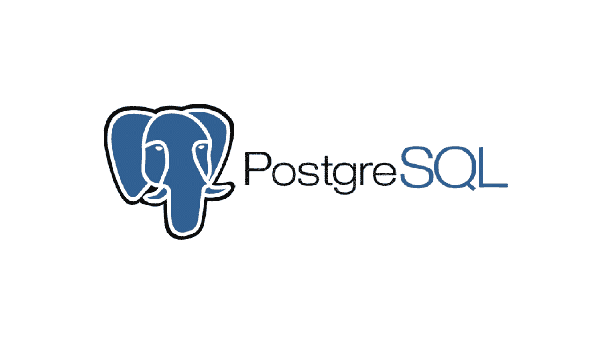
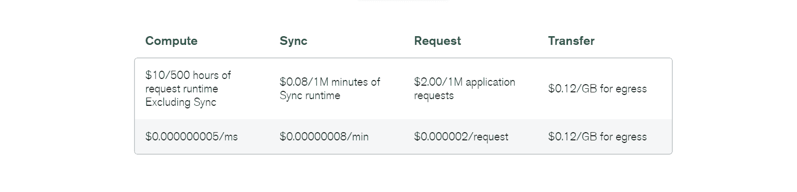

# MongoDB 与 PostgreSQL: 15 个关键差异

> 原文：<https://kinsta.com/blog/mongodb-vs-postgresql/>

当开始一个新的项目时，开发人员最头疼的事情之一就是选择一个堆栈。专注于正确的技术来解决问题可能是一种令人头疼的经历。[数据库尤其是](https://kinsta.com/knowledgebase/wordpress-database/)很难确定，尤其是当你不清楚你的数据将如何被使用的时候。

由于数据库是软件开发的基础，并且它们为构建各种类型和规模的项目提供各种用途，因此了解数据库的重要性有助于为您的堆栈选择合适的数据库结构。

本文将通过探索两个伟大的数据库管理系统: [MongoDB](https://kinsta.com/knowledgebase/what-is-mongodb/) 和 PostgreSQL 之间的差异，帮助您选择正确的[开源数据库](https://kinsta.com/blog/open-source-database/)。

## 什么是 MongoDB？

MongoDB logo. (Image Source: [Mecdata](https://mecdata.it/en/2021/01/spostare-un-database-mariadb-da-un-server-windows-ad-un-altro-server-windows/))

[MongoDB 是一个跨平台、开源的非关系数据库](https://kinsta.com/blog/mongodb-vs-mysql/)，于 2009 年 2 月 11 日发布。它以使用带有可选模式的类 JSON 文档而闻名。
 MongoDB 被认为是市场上[最先进的云数据库服务](https://kinsta.com/blog/best-cloud-storage/)之一，在 Azure、AWS 和 [Google Cloud](https://kinsta.com/blog/google-cloud-hosting/) 之间具有无与伦比的数据移动性和分布性，内置自动化工作负载和资源优化。

它还允许您使用 Atlas CLI、UI 或[基础架构即服务(IaaS)](https://kinsta.com/blog/what-is-iaas/) 资源提供商在几分钟内创建一个云数据库。

有了 MongoDB Atlas，您可以让您的应用程序保持运行，以便在新功能进入您的管道时跟上您激增的流量。MongoDB Atlas 为其用户提供了先进的[数据库优化工具](https://kinsta.com/blog/wordpress-database-plugin/),以便您始终拥有持续构建所需的数据库资源。

> Kinsta 把我宠坏了，所以我现在要求每个供应商都提供这样的服务。我们还试图通过我们的 SaaS 工具支持达到这一水平。
> 
> <footer class="wp-block-kinsta-client-quote__footer">
> 
> 
> 
> <cite class="wp-block-kinsta-client-quote__cite">Suganthan Mohanadasan from @Suganthanmn</cite></footer>

[View plans](https://kinsta.com/plans/)

[在本指南的帮助下，确定哪种数据库管理系统最适合您🚀 点击推文](https://twitter.com/intent/tweet?url=https%3A%2F%2Fkinsta.com%2Fblog%2Fmongodb-vs-postgresql%2F&via=kinsta&text=Determine+which+database+management+system+is+right+for+you+with+help+from+this+guide+%F0%9F%9A%80&hashtags=MongoDB%2CPostgreSQL)

### 主要特征

下面是 MongoDB 的几个关键特性，这些特性使它成为市场上最好的非关系数据库之一:

*   **性能建议**:随着应用程序的发展，MongoDB 会帮助您实现最佳的随需应变模式设计实践，以达到最高效率。
*   **多云集群**:使用 MongoDB，您可以实现同时利用两个或更多云的弹性强大的应用程序。
*   **负载平衡** : MongoDB 有助于控制并发性，以并行处理多个客户端对其他服务器的请求。这有助于降低每台服务器的负载，同时确保数据一致性和正常运行时间，并允许可扩展的应用程序。

### 用例

MongoDB 被全球数千个组织用于数据存储需求或作为其应用程序的数据库服务。

MongoDB 在以下方面发挥着关键作用:

*   **内容管理**:使用 MongoDB，您可以提供和存储任何类型的内容，构建任何特性，并在单个数据库中编织任何类型的数据。MongoDB 通过商用硬件和更高效的团队帮助您取得成功，使您的项目成本降低 10%,同时提供构建内容丰富的应用程序所需的所有功能。
*   **支付**:如果你正在开发一个新的支付产品，MongoDB 的数据灵活性将允许新产品快速进入市场，而不必担心数据碎片等不必要的复杂性。即使你正带领一家成熟的企业试图[实现其支付生态系统的现代化](https://kinsta.com/blog/paypal-alternative/)，你也可以利用 MongoDB 的灵活性，将其作为一个整合的运营数据层，允许你使用现有数据构建新产品和服务，而无需一个有风险的千篇一律的解决方案。
*   个性化:MongoDB 允许您实时个性化数百万客户的体验，包括定向优惠、定制主页和社交媒体网络登录等功能。您甚至可以直接对数据运行复杂的查询，而不必担心转换、提取和加载。
*   **大型机卸载**:您可以使用 MongoDB 轻松地将工作负载从大型机中移出。大型机卸载是将经常访问的大型机数据复制到构建在 MongoDB 上的操作数据层(ODL)的过程，操作可以从消费应用程序重定向到该层。

## PostgreSQL 是什么？

PostgreSQL Logo. (Image Source: [Uberconf](https://uberconf.com/blog/bruce_snyder/2013/06/installing_postgresql_9_0_on_mac_os_x_10_6_8_via_macports))

尽管 NoSQL 数据库很受欢迎，但关系数据库由于其健壮性和强大的查询能力而继续与各种应用程序相关。

在数据结构不经常变化的情况下，关系数据库非常适合运行复杂的查询和基于数据的报告。与同时代的许可数据库如 SQL Server 和 Oracle 相比，像 PostgreSQL 这样的开源数据库作为稳定的生产级数据库提供了一种经济高效的替代方案。

[PostgreSQL 是一个高度稳定的数据库管理系统](https://kinsta.com/knowledgebase/what-is-postgresql/)，由超过 20 年的社区开发提供支持，其高度的完整性、弹性和正确性。您可以将 PostgreSQL 用作各种移动、地理空间、分析和 web 应用程序的主要数据仓库或数据源。

PostgreSQL 也没有许可成本，消除了过度部署的风险。它的热心者和贡献者组成的专门小组定期发现漏洞和解决方案，为数据库系统的整体安全性出一份力。

### 主要特征

以下是 PostgreSQL 的一些显著特性，这些特性使其成为当今使用最广泛的数据库之一:

*   **非原子列**:关系模型的主要约束之一是列必须是原子的。然而，PostgreSQL 没有这种限制，它允许列具有查询可以轻松访问的子值。
*   **支持 JSON 数据**:查询和存储 JSON 的能力也允许 PostgreSQL 运行 NoSQL 工作负载——比如，如果您正在设计一个数据库来存储来自多个传感器的数据，并且您不确定您将需要哪些特定的列来支持所有类型的传感器。在这个场景中，您可以构建一个表，其中一列是 JSON，用于存储不断变化的或非结构化数据。
*   **窗口函数** : PostgreSQL 窗口函数在使其成为分析应用程序的最爱方面起着不可或缺的作用。使用窗口函数，您可以执行跨越多行的函数，并返回相同数量的行。窗口函数不同于聚合函数，因为聚合函数在聚合后只能返回一行。

### 用例

以下是 PostgreSQL 派上用场的一些用例:

*   **联合中心数据库** : PostgreSQL 的 JSON 支持和外来数据包装器允许它与其他数据存储连接——包括 NoSQL 类型——并作为多语言数据库系统的联合中心。
*   **科学数据**:科学和研究项目会产生万亿字节的数据，必须以最高效、最有益的方式对其进行管理。PostgreSQL 提供了一个出色的 SQL 引擎，具有强大的分析能力，这使得处理大量数据变得轻而易举。
*   **制造业**:各种世界级的工业制造商利用 PostgreSQL 加速创新，并[通过以客户为中心的流程推动增长](https://kinsta.com/blog/customer-retention/)，同时通过使用 PostgreSQL 作为存储后端来优化供应链性能。
*   LAPP 开源栈 : PostgreSQL 可以运行动态应用和网站，作为 LAMP 栈的强大替代方案的一部分。LAPP 代表 Linux、Apache、PostgreSQL、Python、PHP 和 Perl。

## MongoDB 与 PostgreSQL 的比较

真正的问题不是 MongoDB 和 PostgreSQL，而是最好的文档数据库和最好的关系数据库。

通常，在开发项目的开始，项目领导很好地掌握了用例，但是对于他们的用户和业务需要的特定应用程序特性却不清楚。他们最终不得不在一个选择上下注，并希望这是最合适的。

在下一节中，我们将阐明 MongoDB 和 PostgreSQL 之间的区别，以帮助您轻松做出决定。我们的信息基于关键因素，如架构、ACID 合规性、可扩展性、复制、安全性和支持等。

让我们开始吧！

### 酸性顺应性

关系数据库中使编写应用程序变得更简单的最关键的特性之一是 ACID 事务。就数据库事务中的隔离级别而言，默认情况下，PostgreSQL 使用 read committed 隔离级别。它还允许用户将读提交隔离级别调整到可序列化隔离级别。

这里需要注意的重要一点是，事务允许在一个组中对数据库进行各种更改或回滚。因此，在关系数据库中，数据将以表格模式跨独立的父子表建模。

相比之下，文档数据库更容易执行事务，因为它们整理文档中的数据，并且由于读写是原子操作，所以不需要多文档事务。

在更新文档时，MongoDB 支持完全隔离。任何错误都会触发更新操作回滚，从而逆转更改并确保客户端获得一致的文档视图。

MongoDB 还支持跨多个文档的数据库事务，允许相关更改作为一个组回滚或提交。由于其多文档事务能力，MongoDB 是少数几个将文档模型的灵活性、速度和功能与传统数据库的 ACID 保证结合在一起的数据库之一。

### 架构/文档模型

MongoDB 的文档模型允许用户自然地映射到应用程序代码中的对象，使得[全栈开发人员](https://kinsta.com/blog/what-is-a-full-stack-developer/)更容易学习和使用。文档为您提供了描述层次关系的能力，以便轻松地存储数组和其他更复杂的结构。

通过将数据存储在嵌套子文档和数组等字段中，可以将 JSON 文档中的相关信息存储在一起，以便通过 [MongoDB 查询语言](https://docs.mongodb.com/manual/tutorial/query-documents/?_ga=2.130438031.1290848558.1648275110-1418576625.1643962152)进行快速查询访问。

使用 MongoDB，您可以将数据作为文档存储在二进制表示中，称为二进制 JSON (BSON)。字段可以根据它所服务的文档而不同，因此，没有必要向系统声明文档的结构——文档是自描述的。

如果您需要向文档添加新字段，那么可以在不影响集合中的其他文档或更新 ORM 或中央系统目录的情况下生成该字段。

MongoDB 还为您提供了模式验证选项，以便对每个集合实施数据治理控制。当整理来自多个不同来源的信息或随着时间的推移适应文档中的修改时，这种灵活性非常方便，尤其是在新的应用程序功能被一致部署时。

PostgreSQL 包含一个客户端-服务器架构模型，该模型由以下两个过程组成:

*   **客户端进程**:这些是用户用来与数据库交互的应用程序。通常，它有一个简单的用户界面，用于通过 API 在用户和数据库之间进行通信。
*   **Server-side process**: This is the “Postgres” application that tackles operations, connections, dynamic, and static assets. A running PostgreSQL site is handled by a Postmaster, a central coordinating process. The postmaster daemon is responsible for:
    *   执行恢复
    *   正在初始化服务器
    *   关闭服务器
    *   运行后台进程
    *   管理来自新客户端的连接请求

    。

### 展开性

可扩展性就是被设计成允许添加新的能力或功能的性质。

PostgreSQL 以多种方式支持可扩展性，包括存储函数和存储过程。PostgreSQL 的广泛之处在于其目录驱动的操作。

关系数据库通常存储关于表、数据库、列等的信息。在系统目录中。这些“数据字典”以表格的形式出现在用户面前，但它们确实有数据库系统内部存储的信息。

PostgreSQL 存储关于列和表的信息，以及关于数据类型、函数和访问方法的信息。

还有:PostgreSQL 还可以通过动态加载将用户编写的代码合并到自身中。通常，用户可能需要某些可以通过共享库实现的功能。用户可以简单地指定代码文件，PostgreSQL 将根据需要加载它，从而使它特别适合于新应用程序的快速原型开发。

另一方面，MongoDB 最终变得可扩展，允许用户创建自己的函数并在框架中使用它们。它相当于用户定义函数(UDF ),允许关系数据库(如 PostgreSQL)的用户扩展 SQL 语句。

此外，PostgreSQL 和 MongoDB 都支持几个扩展和插件[，如用于数据库管理的 Adminer](https://kinsta.com/blog/adminer/) 。

### 协作和敏捷性

MongoDB 有一个文档模型，使得协作和开发更容易、更快地实现。MongoDB 本质上使用 JSON 或 BSON 将其数据存储为文档。

BSON 包括 JSON 数据中不存在的几种数据类型，如`DateTime`、`long`、`int`和`byte`数组，它们有助于更有效地处理数据，因为根据数据类型它会更具体，而不是像处理通用的“数字”类型一样处理一切。它使查询执行得更快，因为它是一种序列化格式，可以有效地归档类似 JSON 的文档。

BSON 跳过对查询没有用的键，这样可以更快地检索数据。用户可以进一步定义文档的结构，并通过引入新的字段、修改数据或在他们认为合适的时候进行开发来进行一些开发。

这种灵活性对于 MongoDB 来说是一个巨大的优势，因为它有助于避免由于要求管理员重新构建数据定义语言语句，然后通过重新创建或重新加载数据库从头开始而导致的延迟。

MongoDB 还使开发人员或团队之间的协作变得容易，因此，团队之间不需要中介或复杂的通信。

谈到协作，PostgreSQL 包括用户级特权、角色继承和表级特权。您可以管理用户并授予他们读写权限。

此外，您还可以使用审计选项来检查各种组或用户的数据访问活动，这提供了一个额外的安全层。然而，PostgreSQL 没有 MongoDB 快，因为它是一个关系数据库，以行和列的形式存储数据。

### 外键支持

MongoDB 区别于 PostgreSQL 的一个关键特性是它存储数据的方式。

由于它是非关系的，MongoDB 使用集合而不是表。外键只是一个表中引用另一个表的主键的一组属性。外键将这两个表相互链接起来。

由于 MongoDB 中没有表，所以 MongoDB 中也没有外键；因此没有外键约束。然而，MongoDB 确实有一个 DBRef 标准，它有助于标准化引用的创建。

另一方面， [PostgreSQL 支持外键](https://kinsta.com/blog/postgresql-vs-sql-server/#main-features),因为它与 SQL 兼容。通过启用外键约束，PostgreSQL 可以阻止将无效数据插入外键列。

### 分区和分片

分区和分片本质上是将大型数据集分解成较小的子集。分片意味着数据存储在多台计算机上，而分区将这些数据分组到单个数据库实例中。

MongoDB 是可伸缩的，因为它在集群中跨实例划分数据。它没有将文档分割成小块，因为它们是独立的单元，这样可以更容易地将它们分发到不同的服务器上，同时数据可以在本地保存。

通过 MongoDB Atlas 云服务，数据可以轻松地分布在不同的区域。您还可以选择将它们持续存储在特定区域或全局区域中，以确保减少延迟。

## 注册订阅时事通讯

### 想知道我们是怎么让流量增长超过 1000%的吗？

加入 20，000 多名获得我们每周时事通讯和内部消息的人的行列吧！

[Subscribe Now](#newsletter)

从版本 5.0 开始，MongoDB 包含了一个“实时”重散列特性，因为您只需要设置一个策略，所以它可以节省大量时间。到时候数据库可以自动重新分配数据。

以前，您可以在不关闭系统的情况下这样做，但是这个过程既复杂又有风险。虽然 MongoDB 有一段时间没有全球地理分区了，但是不同国家的数据增长速度不同。对于必须保留在一个国家本地的数据来说，实时重新共享可能是有益的。

另一方面，PostgreSQL 支持声明性分区，这实质上是一种指定如何将表划分为分区的方法。被划分的表称为分区表，规范由分区方法组成，要使用的列或表达式的列表称为分区键。

您可以通过一个范围实现分区，其中表可以通过由一个键列或一组列定义的范围进行分区，分配给不同分区的值的范围之间没有重叠。

还可以实现列表分区，根据指定的键值对表进行分区。

### 分身术

复制是在多台服务器上创建同一数据集副本的过程。它使数据库管理员能够提供高数据冗余和高数据可用性。

对于 MongoDB，这是通过使用“副本集”来实现的，副本集是一个由三个或更多服务器组成的同步集群，这些服务器之间不断复制数据。这提供了冗余和保护，以防在计划的维护中断或系统故障时可能发生的任何停机，从而提高了数据库的容错能力。

副本集也可以跨不同的数据中心实现，因为它们在区域停机时会派上用场。这可以通过 MongoDB Atlas 来完成，它使得构建和配置这些集群更加简单快捷。

PostgreSQL 提供主从[复制](https://kinsta.com/blog/postgresql-replication/)。预写日志允许共享对复制副本节点所做的更改，从而使异步复制成为可能。其他类型的复制包括逻辑复制、流复制和物理复制。

### 指数

索引是允许我们更快地检索特定行或数据的对象或结构。

PostgreSQL 提供了一系列独特的索引类型来高效地匹配任何查询工作负载。它的索引技术包括 B 树、多列和表达式。此外，部分和高级索引技术，如 GiST、KNN Gist、SP-Gist、GIN、BRIN、覆盖索引和 bloom filters 也可以在 PostgreSQL 中实现。

另一方面，MongoDB 允许您将数据存储在任何可以通过索引快速访问的结构中，无论它在数组或子文档中的嵌套有多深。

### 语言和语法

MongoDB 和 PostgreSQL 都支持多种语言。

MongoDB 为一些最好的数据库语言提供了驱动支持，如 [Python](https://kinsta.com/blog/python-tutorials/) 、R、Java、Scala、C、C++、C#、Node.js 等等。这些 MongoDB 库和驱动程序支持 MongoDB 的所有特性，在所有应用程序中提供高性能和可伸缩性。

PostgreSQL 支持几种过程语言，包括 PL/pgSQL、PL/Python、PL/Perl 和 PL/Tcl 等基础发行版，以及在核心 PostgreSQL 发行版之外开发和维护的其他语言，如 PL/Java、PL/PHP 和 PL/Ruby。

### 正常化

[规范化](https://en.wikipedia.org/wiki/Database_normalization)是结构化关系数据库以减少数据冗余、最小化数据修改中的异常并提高数据完整性的过程。

MongoDB 可以处理规范化和反规范化的数据模型(也称为嵌入式模型)。

嵌入式模型允许应用程序将相关的信息片段存储在同一个数据库记录中，这将为读取操作提供更好的性能，并能够在单个数据库操作中检索相关数据。

此外，您还可以在单个原子写操作中更新相关数据，同时应用程序发出更少的查询来完成常见操作。MongoDB 中用于嵌入式数据模型的文档必须小于最大 BSON 文档大小(16 MB)。

规范化数据模型使用文档之间的引用来描述关系。当嵌入可能导致数据重复，但读取性能不足的优势超过重复的影响时，这将是有益的。

但是，当数据库中以前规范化的数据被分组以提高性能时，反规范化过程通常会导致大量内存消耗。

PostgreSQL 模式具有确定的关系。该结构可以用 1:1、1:多或多:1 关系来标识。数据的标准化可能非常有益，因为它删除了数据的冗余副本，从而也确保了完整性。

Struggling with downtime and WordPress problems? Kinsta is the hosting solution designed to save you time! [Check out our features](https://kinsta.com/features/)

### 表演

[评估两个不同数据库系统的性能](https://kinsta.com/blog/application-performance-monitoring/)具有挑战性，因为 MongoDB 和 PostgreSQL 都有不同的数据存储和检索方式。

MongoDB 是为了水平扩展而构建的，因为它通常将其功能与额外的机器相结合，并且不依赖于处理能力。它能够支持大规模应用程序，无论是以数据大小还是用户数量来衡量。

MongoDB 还可以适应需要快速执行查询的用例，并且可以处理大量数据。它可以整合数百台机器。

从 MongoDB 4.4 开始，针对副本集实现的查询通过“对冲”读取产生了改进的和可预测的性能。这些读取被定向到副本集中的多个节点，直到最快的节点回复。

PostgreSQL 虽然在原始插入速度方面不如 MongoDB 快，但在 ACID 遵从性方面却表现出色。安全可靠地处理事务，允许整个事务失败，而不是执行部分成功的写操作。

MongoDB 直到最近(版本 4)才开始支持类似于 SQL 数据库的 ACID 事务。

与 MongoDB 不同，PostgreSQL 依赖于纵向扩展策略(垂直扩展)来处理数据量和扩展写入。这是通过向现有数据库节点添加更多硬件资源(如磁盘、CPU 和内存)来实现的。

然而，PostgreSQL 在性能优化方面做出了一些努力，包括一个成熟的查询规划器、[表达式的实时(JIT)编译](https://kinsta.com/blog/tailwind-jit/)、表分区和读查询的并行化。

### 价格

PostgreSQL 是完全免费和开源的。因此，任何人都可以使用它的特性，并在必要时轻松地修改代码。

MongoDB 也是一个开源工具。然而，MongoDB 确实有其他选项，如 enterprise 和 Atlas(针对云)，它们的价格各不相同。MongoDB 企业版提供了一个内部定价模型。

Mongo RealmDB 免费提供给所有 Atlas 用户进行评估和轻度使用，使开发人员能够构建和发布移动应用程序。

Pricing options for Mongo RealmDB. (Image Source: [MongoDB Pricing](https://www.mongodb.com/pricing))

数据迁移也可能产生开销；然而，这是标准的，与您在系统中实现的数据库无关。

### 询问处理

PostgreSQL 使用关系数据库模型，该模型依赖于在表中存储数据，并利用结构化查询语言(SQL)进行数据库访问。可以使用 PostgreSQL 终端 **psql** 输入 SQL 命令。它有一个大对象工具，提供对存储在特殊大对象结构中的用户数据的流样式访问。

在添加数据之前，必须构建数据库模式，以便清楚地了解数据关系，从而处理查询。相关信息可以存储在数据库的不同表中。这可以通过外键和连接来访问。

一旦数据库被加载，就很难调整它的结构。它需要开发、运营和数据库管理员中的几个团队来仔细协调结构中所做的更改。

另一方面，MongoDB 的数据结构不需要提前规划，因为它本质上处理的是非结构化数据。数据结构也更容易调整。

开发人员可以选择应用程序中最重要的部分，并进行必要的修改。MongoDB 使用 MQL，它可以用来处理 MongoDB 中的文档和取出数据，同时提供 SQL 所具有的灵活性和强大功能。

MongoDB 将数据作为 JSON 文档处理。您也可以查询 JSON 文档中的字段。因此，当您希望在灵活的数据字段中存储文档时，MongoDB 非常有用。

PostgreSQL 使用`GROUP_BY`函数来处理和运行聚合查询，而 MongoDB 通常使用聚合管道来处理其查询。

然而，MongoDB 的一个主要缺点是不能轻松地连接表。在 PostgreSQL 中，使用一个 JOIN 语句可以简化这一过程。

MongoDB 试图通过引入多维数据类型来解决这个问题，在多维数据类型中，可以将一个文档存储嵌入到另一个文档存储中。然而，它没有条理，也不像 PostgreSQL 包含的简单的`join`函数那样优雅。

### 安全性

当谈到安全性时，PostgreSQL 胜过 MongoDB。管理数据库结构的严格规则使 PostgreSQL 成为一个非常安全的数据库，因此它可以可靠地用于银行系统。

PostgreSQL 提供了大量的身份验证方法，包括可插拔身份验证模块(PAM)和轻量级目录访问协议(LDAP)，这减少了服务器的攻击面。它还通过基于主机的身份验证和证书身份验证来确保服务器级保护。

此外，PostgreSQL 提供数据加密，当您的数据通过 web 或公共网络高速公路传输时，允许您使用 [SSL 证书](https://kinsta.com/blog/types-of-ssl-certificates/)。PostgreSQL 还使您能够实现客户端证书认证(CCA)工具，并使用加密函数在 PostgreSQL 中存储加密数据。

然而，PostgreSQL 的安全级别可能会因云系统而异，即使是同一个数据库。

MongoDB Atlas 在三个最大的云提供商中表现相同，使得在多个云之间的迁移更加容易。

此外，MongoDB 具有客户端和字段级加密，这使用户能够在通过网络将数据发送到数据库之前对数据进行加密。然而，由于数据是以键-值对的形式存储在一条记录中的，它缺乏 PostgreSQL 所吹嘘的安全性；MongoDB 的主要焦点仍然是速度。

### 支持和社区

PostgreSQL 是完全开源的，并得到其社区的支持，这加强了它作为一个完整生态系统的地位。PostgreSQL 经常定期发布更新版本，开发者、发烧友或第三方公司提供支持，试图通过修复 bug 或对数据库系统进行细微修改来开发系统。

像 PostgreSQL 一样，MongoDB 也有一个社区论坛，使用户能够与其他几个用户联系，并获得他们的一般查询的答案。MongoDB 企业支持可以进一步包括一个广泛的知识库，其中包含用例、详细的教程、关于优化的技术说明和最佳实践。

此外，还有 MongoDB 免费提供的培训和认证在线课程。

### 挑战

虽然我们已经讨论了 MongoDB 和 PostgreSQL 的特性，这些特性使它们受到开发人员的欢迎，但是它们也有各自的弱点。

MongoDB 倾向于关注快速数据操作，但缺乏 PostgreSQL 似乎拥有的数据安全性。这相当耗费内存，因为反规范化过程通常会导致很高的内存消耗。

此外，由于不支持连接，MongoDB 数据库被过量供应了数据——有时是重复的——因此加重了内存负担。MongoDB 还试图将解释纳入其他查询语言，作为其可扩展性的一部分；然而，它可能会降低性能，因为数据库最初不是为处理关系数据模型而构建的。

SQL 到 MongoDB 查询的转换可能需要额外的时间来使用引擎，这可能会延迟部署和开发。

另一方面，虽然 PostgreSQL 易于安装，并且适用于几乎所有平台，但其效率可能因平台而异。此外，它没有可以显示数据库当前状况的修订工具或报告工具。如果事情没有按计划进行，您可能必须不断地检查数据库，以避免发现故障时为时已晚。

PostgreSQL 也稍微慢一点，因为它侧重于兼容性。虽然已经努力提高 PostgreSQL 的速度，但修改仍需要更多的工作。

### MongoDB vs PostgreSQL:你该选哪个？

MongoDB 是非关系数据库，而 PostgreSQL 是关系数据库。NoSQL 数据库致力于将键值对中的数据存储为一条记录，而关系数据库将数据存储在不同的表上。

如果您优先考虑跨多个服务器的更快的数据集成和可伸缩性，MongoDB 可能是您的企业的合适选择。

MongoDB 在集成到分析平台时可以发挥最佳作用，因为 MongoDB 的速度提供了动态性能，可以帮助实时跟踪用户的行为。如果您碰巧拥有一个不依赖于结构化模式的[繁忙的 web 应用程序](https://kinsta.com/blog/nodejs-vs-python/)，比如《纽约时报》(事实上，它使用了 MongoDB ),或者对于需要存储具有各种属性集合的多个对象的[产品目录](https://kinsta.com/blog/woocommerce-vs-shopify/),这对您的业务也非常有益。

另一方面，PostgreSQL 是[数据分析](https://kinsta.com/blog/data-visualization-tools/)和仓储的完美匹配。如果您正在构建一个数据库自动化工具或一个银行应用程序，您希望在其中实施数据安全性和交易保证，PostgreSQL 可能是合适的选择。
[MongoDB 还是 PostgreSQL？了解更多关于本指南✅ 点击推文](https://twitter.com/intent/tweet?url=https%3A%2F%2Fkinsta.com%2Fblog%2Fmongodb-vs-postgresql%2F&via=kinsta&text=MongoDB+or+PostgreSQL%3F+Learn+more+with+this+guide+%E2%9C%85&hashtags=MongoDB%2CPostgreSQL)

## 摘要

总而言之，到目前为止，我们已经介绍了 PostgreSQL 和 MongoDB 的基本细节。我们已经讨论了它们的历史、主要特征以及它们的不同之处。

虽然 PostgreSQL 和 MongoDB 都是令人惊叹的数据库，但最终还是要选择适合您业务的。

在 PostgreSQL 和 MongoDB 之间，你更喜欢哪个数据库？请在评论中告诉我们！

* * *

让你所有的[应用程序](https://kinsta.com/application-hosting/)、[数据库](https://kinsta.com/database-hosting/)和 [WordPress 网站](https://kinsta.com/wordpress-hosting/)在线并在一个屋檐下。我们功能丰富的高性能云平台包括:

*   在 MyKinsta 仪表盘中轻松设置和管理
*   24/7 专家支持
*   最好的谷歌云平台硬件和网络，由 Kubernetes 提供最大的可扩展性
*   面向速度和安全性的企业级 Cloudflare 集成
*   全球受众覆盖全球多达 35 个数据中心和 275 多个 pop

在第一个月使用托管的[应用程序或托管](https://kinsta.com/application-hosting/)的[数据库，您可以享受 20 美元的优惠，亲自测试一下。探索我们的](https://kinsta.com/database-hosting/)[计划](https://kinsta.com/plans/)或[与销售人员交谈](https://kinsta.com/contact-us/)以找到最适合您的方式。