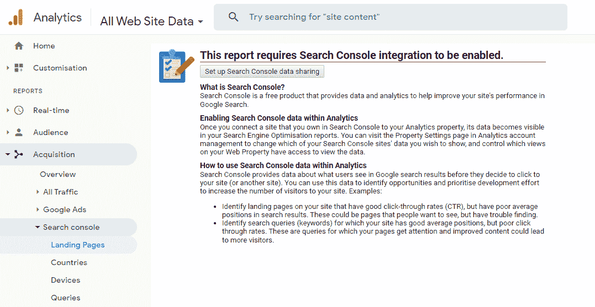
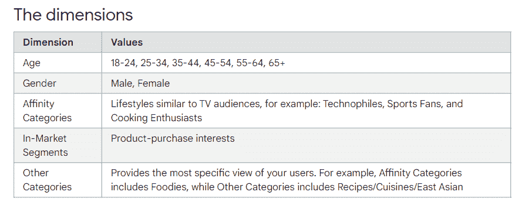
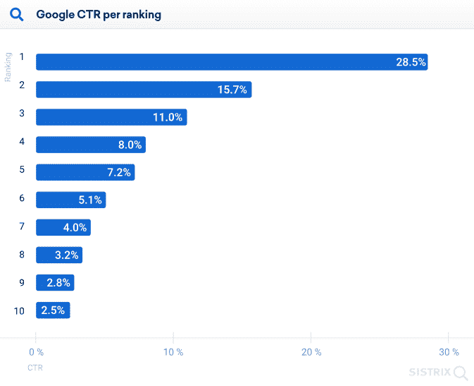
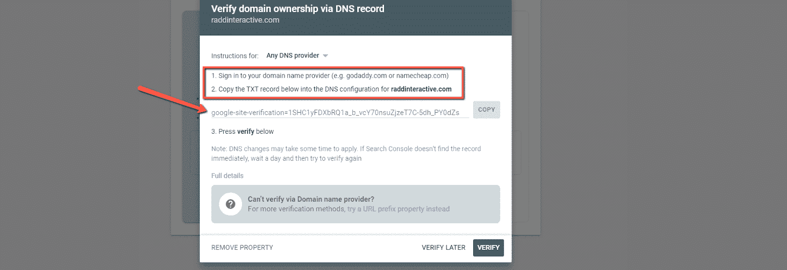
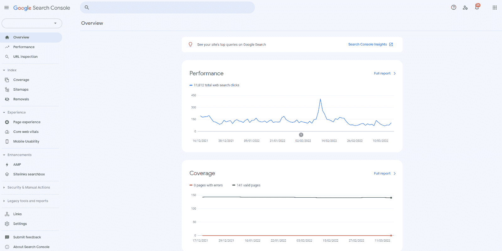
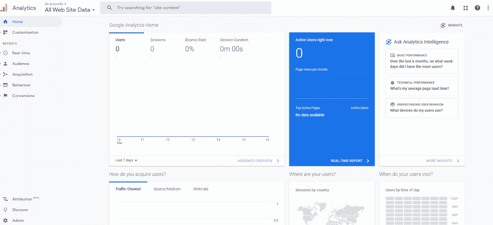
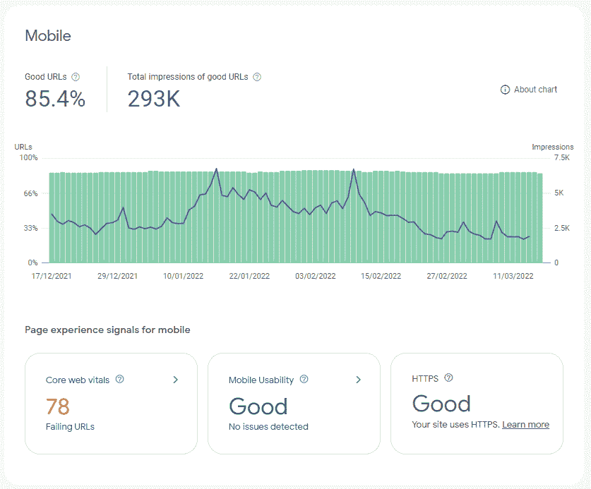
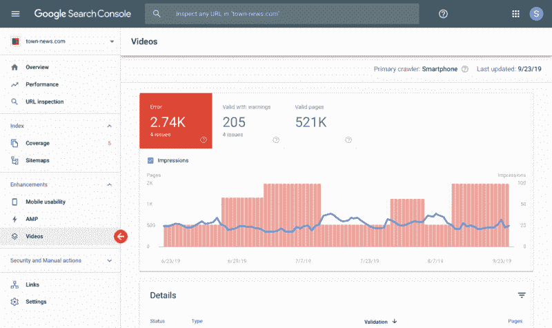

# 谷歌搜索控制台与谷歌分析:有什么不同？

> 原文：<https://kinsta.com/blog/google-search-console-vs-google-analytics/>

有大量的[工具可以优化你的网站](https://kinsta.com/blog/performance-testing-tools/)。有搜索引擎优化 [(SEO)工具](https://kinsta.com/blog/best-seo-plugins-for-wordpress/)、[图片优化工具](https://kinsta.com/blog/optimize-images-for-web/)、网站速度工具、网络安全工具、[内容管理系统](https://kinsta.com/knowledgebase/content-management-system/)等等，但很少有比网站分析工具对营销更有用的。

如果你正在为你的网站寻找一个分析平台，你可能已经听过“使用谷歌搜索控制台”或者“使用谷歌分析”一百万次了。

这两个工具都由谷歌运营，表面上看起来很相似。但是他们是吗？简短的回答是“不”，但是“为什么”有点复杂。为了帮助您浏览这两种工具，本文将深入探讨谷歌搜索控制台和谷歌分析，并解释它们是什么，它们做什么，以及它们彼此有何不同。

我们走吧！

## Google 搜索控制台概述

谷歌在 2006 年首次推出了我们今天所知的工具[“谷歌搜索控制台”](https://kinsta.com/blog/google-search-console/)。最初被称为“谷歌网站管理员工具”，它提供了一系列功能来帮助用户了解搜索引擎如何与他们的网站互动。

谷歌在 2015 年将该工具更名为“谷歌搜索控制台”。在公告中，谷歌搜索控制台的产品经理迈克尔·芬克将该工具的受众描述为“所有关心搜索的人”，包括“爱好者、小企业主、 [SEO 专家](https://kinsta.com/blog/wordpress-seo/)、营销人员、程序员、设计师、应用程序开发人员，当然还有网站管理员。”

> Kinsta 把我宠坏了，所以我现在要求每个供应商都提供这样的服务。我们还试图通过我们的 SaaS 工具支持达到这一水平。
> 
> <footer class="wp-block-kinsta-client-quote__footer">
> 
> 
> 
> <cite class="wp-block-kinsta-client-quote__cite">Suganthan Mohanadasan from @Suganthanmn</cite></footer>

[View plans](https://kinsta.com/plans/)

这些人今天仍然是谷歌搜索控制台的受众。

2018 年 1 月，谷歌用新版本替换了旧的谷歌搜索控制台。谷歌在 2019 年 9 月全面退役了这个旧版本，你现在只能使用新工具。

谷歌搜索控制台目前提供许多功能，包括:

*   站点地图提交:一个[站点地图](https://kinsta.com/blog/wordpress-sitemap/)提供了一个域中页面和文件的详细信息。
*   **抓取率监控:**你的抓取率是指谷歌爬虫每秒向你的网站发出多少请求。
*   **域的内部和外部链接列表:**
*   **[核心网站重要信息报告](https://kinsta.com/blog/core-web-vitals/) :** 该功能根据真实数据显示您的页面表现。
*   **关键词监控。**这包括人们搜索哪些关键词来找到你的页面。
*   **安全问题监控:**该功能寻找易受[恶意软件](https://kinsta.com/blog/types-of-malware/)或黑客攻击的网站漏洞。
*   **网站速度报告:**该功能可以帮助你提高网站速度(这对于保持流量至关重要，因为谷歌对 3700 个移动互联网会话的研究表明， [53%的访问者](https://www.thinkwithgoogle.com/consumer-insights/consumer-trends/mobile-site-load-time-statistics/)如果网站在三秒钟内没有加载，就会离开网站)。

[Confused about the difference between these two tools? 🤔 Let's dive in 🚀Click to Tweet](https://twitter.com/intent/tweet?url=https%3A%2F%2Fkinsta.com%2Fblog%2Fgoogle-search-console-vs-google-analytics%2F&via=kinsta&text=Confused+about+the+difference+between+these+two+tools%3F+%F0%9F%A4%94+Let%27s+dive+in+%F0%9F%9A%80&hashtags=SEO%2CGoogleAnalytics)

## 谷歌分析概述

谷歌分析的想法最初来自两个软件:海胆点播和测量地图。谷歌于 2005 年收购了海胆点播的所有者海胆软件公司，并于 2006 年收购了 Measure Map 的所有者自适应路径。

谷歌分析从 2006 年 8 月开始对公众开放(谷歌在此之前推出了一个小网络，但不可扩展)。谷歌在 2011 年对该平台进行了重大修改，并在 2012 年推出了另一个版本(“万能分析”)。谷歌接着又发布了几个版本，包括 2016 年的谷歌分析 360。

自 2020 年以来，用户一直使用谷歌分析 4(有时昵称为“ [GA4](https://kinsta.com/blog/ga4/) ”)。

以下是一些最著名的谷歌分析功能:

*   **定制报告:** Google Analytics 允许你为每个营销渠道创建报告，这样你就可以看到对你来说重要的指标。
*   可视化:这些将帮助你观察趋势。
*   **目标监控:**你可以使用这个功能来设定目标，并跟踪目标的进展。
*   **观众监测:**谷歌分析可以向你展示你的访问者的信息，包括他们的位置、性别和年龄。

谷歌分析有许多提供类似功能的竞争对手。

## 谷歌搜索控制台和谷歌分析如何协同工作？

虽然这两个工具看起来像是竞争对手，但许多人一起使用谷歌搜索控制台和谷歌分析。具体来说，他们从谷歌搜索控制台添加数据作为谷歌分析的来源。

这样做可以给你更多关于你的数字营销的详细信息，这将帮助你[增加你网站的流量](//kinsta.com/blog/how-to-drive-traffic-to-your-website/%22)和[提高你的搜索引擎优化效果](https://kinsta.com/blog/wordpress-seo/)。它还使报告您的营销数据更容易，因为它允许您从谷歌搜索控制台数据创建报告和可视化。

连接这两个工具非常容易。您只需:

1.  登录谷歌分析。
2.  点击“采集”，然后点击“搜索控制台”选择列出的四个选项中的任何一个(“登录页面”、“国家”、“设备”和“查询”)。
3.  按“设置搜索控制台数据共享”输入您的属性设置，然后按“保存”你会看到一张写着“成功”的纸条

How to connect Google Analytics and GSC.

## 谷歌搜索控制台与谷歌分析的主要区别

至此，您已经了解了 Google 搜索控制台和 Google 分析的背景、相似性和基本用例。考虑到这些因素，让我们深入比较一下这两种工具的不同之处。

### 1.数据/测量

第一个主要的比较点是每个平台为你收集的数据。

谷歌分析追踪几十个指标，尽管大多数人只使用一小部分。最值得注意的指标包括:

*   **跳出率:**你的[跳出率](https://kinsta.com/blog/wordpress-dynamic-sidebars-widgets/)是从你的网站“弹起”而没有点击另一个页面的网站访问者的百分比。
*   **独特浏览量:**谷歌分析将常规浏览量定义为你网站上的任何视图。唯一浏览量是指浏览量减去在一个会话中多次访问该页面的人的所有浏览量(例如，通过重新加载该页面)。
*   **平均会话持续时间:**这是访问者查看您的内容的平均时间。Google Analytics 通过将会话数除以所有会话的总时长(以秒为单位)得出这个数字。
*   **转化:**谷歌分析将[转化](https://kinsta.com/blog/conversion-rate-optimization-tips/)定义为“对你的业务成功至关重要”的任何事情这包括宏观转化，如购买一些东西，微观转化，如注册你的电子邮件营销名单。
*   **受众人口统计:** Google Analytics 根据年龄、性别、亲和力类别、市场细分和其他类别对用户进行分类。以下是 Google Analytics 对这些问题的定义:

How Google Analytics classifies people.

谷歌搜索控制台跟踪的指标更多地与你的网站相关，而不是你的受众。值得注意的指标和测量包括:

*   **印象。**在谷歌上看到你的链接的人数。
*   点击量:点击你的链接的人数。
*   **点击率(CTR):** 你的[点击率](https://kinsta.com/blog/click-through-rate/)是互联网用户在搜索引擎结果中看到你的网站并点击它的比率。谷歌的计算方法是用“点击量”除以“印象数”。
*   **关键词查询:**这个指标涵盖了你的页面排名的关键词(以及人们搜索什么来访问你的页面)。
*   反向链接的数量:这些链接指向你的网站。
*   内部链接:在你的网站页面之间引导人们的链接数量。
*   **移动可用性:**这就是[你的网站如何在移动设备上运行](https://kinsta.com/mobile-vs-desktop-market-share/)。
*   **指数覆盖率报告。**这些测量数据向你展示了谷歌爬虫是如何使用你的网站的。
*   **平均位置。这是你在搜索引擎结果页面中的平均排名。理想情况下，你希望排名靠前，因为 [55.2%](https://www.sistrix.com/blog/why-almost-everything-you-knew-about-google-ctr-is-no-longer-valid/) 的谷歌用户点击了前三个结果中的一个。**

Google traffic by ranking (**Source:** [Sister](//www.sistrix.com/blog/why-almost-everything-you-knew-about-google-ctr-is-no-longer-valid/%E2%80%9D)).

看看这个列表，你可能会注意到这些指标都有助于网站所有者和营销人员[评估他们的网站](https://kinsta.com/blog/how-much-is-my-website-worth/)和营销工作。因此，虽然谷歌搜索控制台和谷歌分析有不同的用例，你可能会受益于使用这两个你需要的指标。

### 信息

如果您将 Google 搜索控制台数据作为数据源添加到 Google Analytics 中，您可以使用 Google Analytics 来跟踪浏览量、点击量、平均位置和点击率。

### 2.点击和会话

谷歌在谷歌分析和谷歌搜索控制台中使用一些术语的标准定义(如“位置”)。“点击”和“会话”不是这两个术语中的两个——因此，它们代表了这两个平台之间的一个关键区别。

谷歌搜索控制台将“点击”定义为对页面的任何查看，无论用户在同一浏览会话中点击链接多少次。或者，Google Analytics 只统计一次点击(或者，正如我们在 *1 中提到的。数据/测量，*“唯一页面视图”)。

给你一个现实生活中的例子，想象有人点击你的网站，重新加载页面，退出，并再次按下链接。谷歌搜索控制台会计算三次点击，而谷歌分析只会计算一次。

可以想象，这种逻辑也适用于会话。谷歌搜索控制台将会话定义为某人在搜索引擎中点击一下所做的任何事情。谷歌分析将会话定义为某人在访问网站后 30 分钟内所做的任何事情。

因此，在上面的例子中，谷歌搜索控制台会记录两个会话，而谷歌分析只会记录一个。

有趣的是，另一个不同点属于 *2。点击&会话*伞状——非 [HTML 页面](https://kinsta.com/blog/html-best-practices/)如 pdf。谷歌搜索控制台不计算非 HTML 视图，而谷歌分析计算。

### 3.核查进程

谷歌搜索控制台和谷歌分析都要求你[验证你的域名或数据源](https://kinsta.com/blog/google-site-verification/)才能开始给你数据。然而，这个过程的工作方式略有不同。

使用谷歌搜索控制台，你可以通过登录你的谷歌账户并点击[这个链接](https://search.google.com/search-console)来注册。然后，按照以下步骤添加您的网站并验证您的域:

1.  选择您的属性类型。你有两个选择:“域”或“网址前缀。”如果你选择“域”，谷歌搜索控制台将为你所有的子域和协议前缀工作(所以这是我们推荐的选择)。或者，如果你选择“网址前缀”，谷歌搜索控制台将只检查你的确切领域的流量。
2.  您现在需要验证您拥有自己的域名。如果您选择了“URL 前缀”，请通过 HTML 标签、HTML 文件、谷歌分析或谷歌标签管理器验证您的网站。或者，如果您选择了“域”，请选择您的 DNS 提供商，复制提供的文本，并将其添加到标有“DNS”的屏幕
3.  点击“验证”验证您的网站可能需要 72 小时。

How to verify a domain in Google Search Console.

对于谷歌分析，你可以登录你的谷歌账户[点击这里](https://analytics.google.com/analytics/web/)开始。然后，您需要按照提示分别连接您的每个数据源(包括您的社交媒体帐户、网站和其他营销渠道)。

或者，如果你想通过 WordPress 使用 Google Analytics[，你也可以下载一个插件，比如 Google 或 GA Google Analytics 的 Site Kit。](https://kinsta.com/blog/google-analytics-wordpress/)

### 4.受众和预期用途

Google Analytics 和 Google Search Console 都是网站所有者、内容作者和 web 开发者的绝佳工具。然而，谷歌搜索控制台并没有为不拥有或运营网站的人提供任何有价值的东西。

## 注册订阅时事通讯

### 想知道我们是怎么让流量增长超过 1000%的吗？

加入 20，000 多名获得我们每周时事通讯和内部消息的人的行列吧！

[Subscribe Now](#newsletter)

每个工具的侧重点也略有不同。谷歌搜索控制台专注于 SEO 和使你的网站在 SERPs 中成功的技术元素。是的，谷歌分析专注于网站，但也关注社交媒体、电子邮件营销和广告活动。

本质上:谷歌搜索控制台=网站，谷歌分析=一切数字营销。

### 5.报告

谷歌搜索控制台和谷歌分析处理与报告相关的数据的方式有一些差异。

首先，一个谷歌搜索控制台账户只能报告一个[域](https://kinsta.com/blog/how-to-buy-a-domain-name/)的数据。所以，如果你拥有多个域名，你需要一个账号(除非你有子域)。

相比之下，单个 Google Analytics 帐户可以报告多个域的数据(尽管如果您将 Google Search Console 添加为数据源，您将只能获得与帐户关联的域的数据)。

其次，Google Analytics 可以报告来自[重定向 URL](https://kinsta.com/help/redirect-rules/)的数据。这不是谷歌搜索控制台的真实情况。如果遇到重定向链接，它会将流量报告为规范的 URL。

标准 URL 是谷歌认为最能代表重定向链接的 URL。如果你以前从未遇到过规范的网址，下面是谷歌的一个简单解释:

[链接](https://www.youtube.com/watch?v=8j_hxBw5B4E)

最后，每个工具上的默认报告仪表板的操作方式不同。以下是谷歌搜索控制台的“概览”页面:

Google Search Console’s overview page.

以下是谷歌分析的“主页”页面:

Google Analytics’ homepage.

### 6.错误监控

谷歌搜索控制台提供了阻止网站访问者正确访问您的网站的错误的详细信息。例如，它可以告诉你的页面访问者是否有“良好的页面体验”，包括网站是否在手机上运行以及是否使用 HTTPS。

Mobile reporting from Google Search Console.

它也有一个“安全问题”标签，扫描你的网站有三件事:

1.  黑客内容(第三方放在那里的内容)
2.  恶意软件
3.  社会工程的迹象

Google Analytics 的错误报告工具不够强大。但是，它可以发现数据验证错误、 [JavaScript 错误](https://kinsta.com/blog/errors-in-javascript/)、 [404 错误页面](https://kinsta.com/blog/error-404-not-found/)和[其他用户问题](https://kinsta.com/blog/wordpress-errors/)。

### 7.每日记录和查询限制

谷歌分析目前每天报告无限数量的 URL，因此如果你有 1500 篇博客文章，它会为你收集每篇文章的数据。谷歌搜索控制台采取了不同的方法。每个网站每天最多只能访问 1000 个网址。

Struggling with downtime and WordPress problems? Kinsta is the hosting solution designed to save you time! [Check out our features](https://kinsta.com/features/)

说到查询，Google Analytics [限制你每个项目每天 50，000 次请求](https://developers.google.com/analytics/devguides/reporting/core/v4/limits-quotas)，每个 IP 地址每秒 10 次查询(QPS)。

谷歌搜索控制台也限制了你一次可以查询的次数。谷歌搜索控制台的负载限制是以 QPS、每分钟查询数(QPM)和每天查询数(QPD)计算的。这些限制是:

*   每个网站 50 QPS 和 1，200 QPM
*   每用户 50 QPS 和 1，200 QPM
*   每个项目 100，000，000 QPD(谷歌[将一个项目](https://developers.google.com/webmaster-tools/limits)定义为“使用同一个开发者控制台键进行的调用”)

谷歌搜索控制台还会查看“负载”，根据谷歌的说法，“表示一个查询所消耗的内部资源[”如果您超过了您的负载配额，您只需要等待几分钟，然后再试一次。](https://kinsta.com/knowledgebase/remove-query-strings-static-resources/)

如果你是一个普通用户，这些限制不会影响你——但是知道它们的存在仍然是有价值的。

### 8.录像

我们已经在本文中介绍了每个工具如何处理数据，但是还有一个关键点需要注意:每个工具如何处理[视频](https://kinsta.com/blog/video-search-engine/)。

简单来说，谷歌搜索控制台分别显示网页和视频数据，而谷歌分析没有。谷歌在 2018 年推出了这一变化，因此视频创作者可以看到视频在谷歌上的排名。你可以在“增强”选项下找到“视频”标签。

Where to find videos in Google Search Console.

### 9.集成

谷歌搜索控制台和谷歌分析都与其他工具集成，因此你可以在平台之间共享你的数据。

截至 2022 年初，流行的谷歌分析集成包括:

*   [Shopify](https://kinsta.com/blog/shopify-alternatives/)
*   销售力量
*   谷歌广告、谷歌广告管理器、谷歌云和谷歌游戏
*   Zendesk
*   脸谱网
*   市场
*   Hootsuite
*   [WordPress](https://kinsta.com/seo-hosting/)

谷歌搜索控制台与谷歌分析集成(如*“谷歌搜索控制台和谷歌分析如何协同工作？”*)。它还为需要编程访问的人提供了一个 API。

### 10.定价

谷歌搜索控制台目前是免费的——尽管它有使用限制。谷歌分析对大多数用户来说也是免费的，但如果你想要更多的功能，你需要获得 Analytics360。Analytics360 提供了一些高级功能，如通过机器学习(ML)进行预测性数据分析、详细的见解以及一个可以回答数据相关问题的工具。

Analytics360 适用于大型企业和需要处理大量数据的企业。谷歌对其采用定制定价。

### 11.Bot 活动

当你的分析程序开始记录机器人活动时，它可以抛开其他一切——你的[跳出率、观众人口统计数据、关键词数据](https://kinsta.com/blog/positioning-strategy/)等。

那么谷歌分析和谷歌搜索控制台是如何处理僵尸程序的呢？谷歌分析有一个“机器人过滤”选项，寻找不模仿人类用户正常行为的活动。如果您通过设定的模式(如位置)发现可疑的 bot 活动，您也可以手动将其过滤掉。

谷歌搜索控制台自动过滤掉机器人活动。

### 12.来自谷歌我的业务的流量

拥有[谷歌我的商业清单](https://kinsta.com/blog/what-is-google-my-business/)的企业通常很难将正常的搜索引擎流量与点击清单上“网站”的人区分开来。幸运的是，你可以通过用海胆追踪模块(UTM)标签来区分这两者。

你可以[在谷歌分析和谷歌搜索控制台](https://kinsta.com/blog/conversion-tracking/)中追踪 UTM 的数据——尽管它们的处理方式略有不同。谷歌分析会把它算作一次普通点击，而谷歌搜索控制台会把它放入“谷歌”流量篮。

### 13.JavaScript 和广告拦截器

不需要太多技术，谷歌分析依赖于 JavaScript 运行。因此，Google Analytics 无法从浏览器禁用 JavaScript 的用户那里收集数据。一些插件还让用户选择不通过谷歌分析收集他们的数据——包括[广告拦截器](https://kinsta.com/blog/ad-blockers/)。

谷歌搜索控制台在没有 JavaScript 的情况下收集数据。所以，如果你同时使用这两个程序，你的数据可能会略有不同。

### 14.默认时区

最后，这两个程序处理时区的方式略有不同。谷歌分析使用您的时区，而谷歌搜索控制台使用太平洋夏令时(UTC — 08:00)。

使用这两个程序的人需要注意这一点，因为这两个程序使用不同的时区，你的每日流量数字可能不匹配。

不幸的是，目前没有办法改变谷歌搜索控制台的时区，所以你只需要在报告数据时考虑它。

[想学习如何导航这两个有用的工具？✅继续读下去...📚 点击推文](https://twitter.com/intent/tweet?url=https%3A%2F%2Fkinsta.com%2Fblog%2Fgoogle-search-console-vs-google-analytics%2F&via=kinsta&text=Want+to+learn+how+to+navigate+these+two+useful+tools%3F+%E2%9C%85+Read+on...+%F0%9F%93%9A&hashtags=SEO%2CGoogleAnalytics)

## 摘要

谷歌搜索控制台和谷歌分析经常被混淆，因为它们都是谷歌为精通数据的网站所有者提供的营销工具。

尽管它们有相似之处，但是它们并不相同。谷歌搜索控制台帮助你监控你的网站的总体表现和搜索引擎结果。谷歌分析帮助你了解更多关于你的用户，包括他们是谁，他们如何找到你，以及他们如何与你的网站互动。谷歌分析的触角延伸到了你的网站之外，进入了广告和社交媒体。

这两种工具在以下方面也有所不同:

*   他们评估的指标
*   他们如何衡量活动
*   他们如何处理数据
*   如何使用它们

说到这里，我们想把话筒交给你。你是两种工具都用还是只用一种？请在下面的评论中告诉我们。

* * *

让你所有的[应用程序](https://kinsta.com/application-hosting/)、[数据库](https://kinsta.com/database-hosting/)和 [WordPress 网站](https://kinsta.com/wordpress-hosting/)在线并在一个屋檐下。我们功能丰富的高性能云平台包括:

*   在 MyKinsta 仪表盘中轻松设置和管理
*   24/7 专家支持
*   最好的谷歌云平台硬件和网络，由 Kubernetes 提供最大的可扩展性
*   面向速度和安全性的企业级 Cloudflare 集成
*   全球受众覆盖全球多达 35 个数据中心和 275 多个 pop

在第一个月使用托管的[应用程序或托管](https://kinsta.com/application-hosting/)的[数据库，您可以享受 20 美元的优惠，亲自测试一下。探索我们的](https://kinsta.com/database-hosting/)[计划](https://kinsta.com/plans/)或[与销售人员交谈](https://kinsta.com/contact-us/)以找到最适合您的方式。