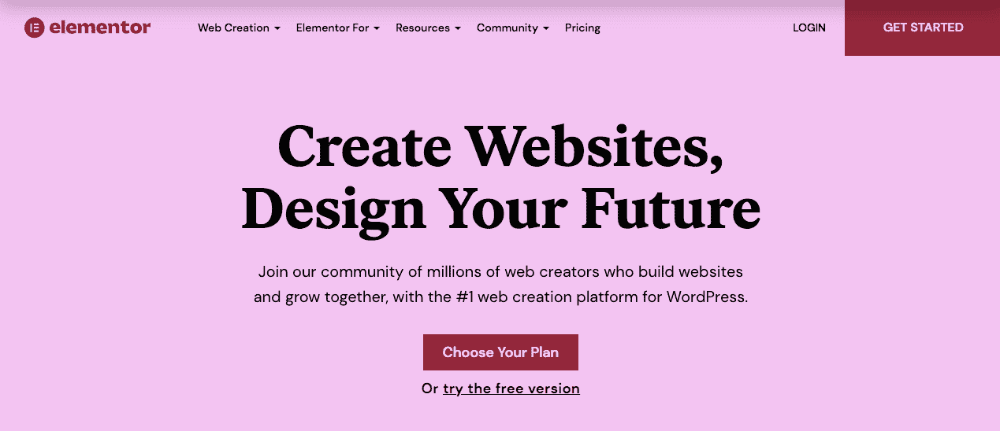
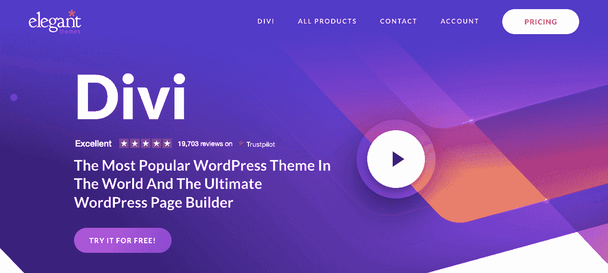
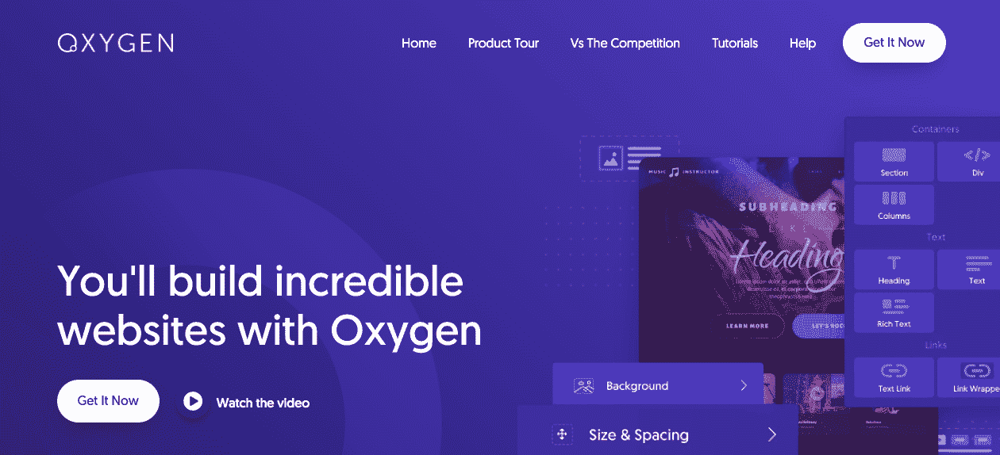
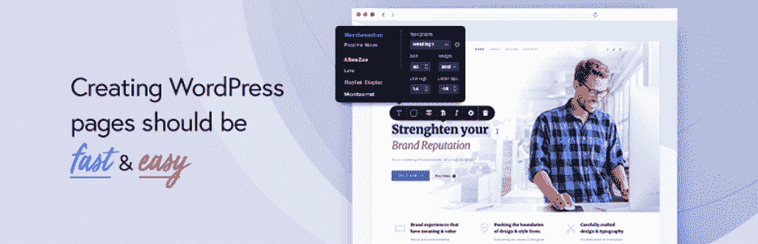
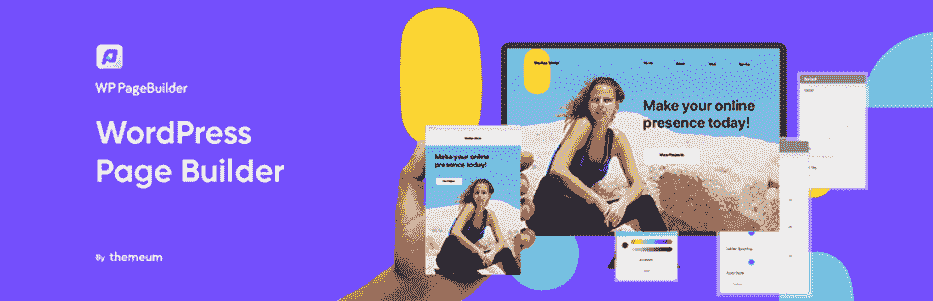
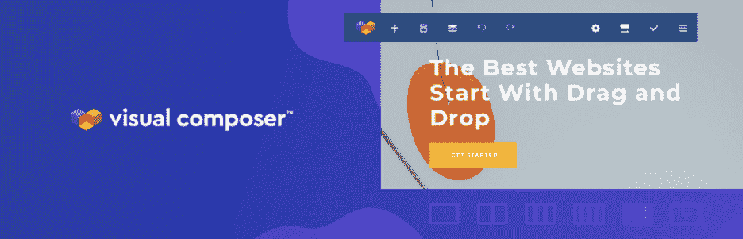
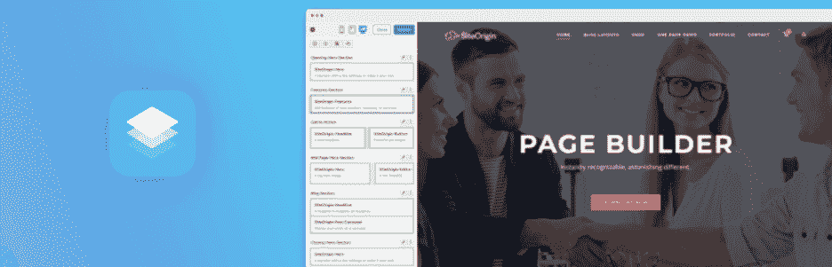
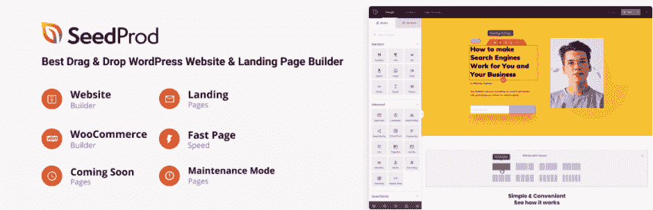
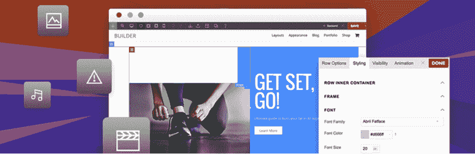

# 2022 年十大替代元素

> 原文：<https://kinsta.com/blog/elementor-alternative/>

当建立一个新网站或改变现有网站的设计时，使用页面构建器插件通常是有效的。这些工具[不需要任何编码](https://kinsta.com/blog/wordpress-page-builders/)，而是提供简单的页面编辑工具来加速开发过程。 [Elementor](https://kinsta.com/partners/elementor/) 是最受欢迎的选择之一，但其高昂的价格可能会受到限制。

幸运的是，有许多替代方法可以用来代替 Elementor。许多第三方页面生成器可以针对您的特定设计目标，同时保持成本效益。即使没有 Elementor，您也可以获得构建漂亮网站所需的功能。

### 查看我们的[元素或替代品视频指南](https://www.youtube.com/watch?v=0iOnh9EZ-S0)

在这篇文章中，我们将解释什么是 Elementor，以及为什么你可能想要一个替代品。然后，我们将提供一个其他十个页面生成器的列表来代替使用。我们开始吧！

## 元素或的介绍

如果你是网站制作的新手，你可能会担心网页设计是一个复杂的过程。在页面生成器出现之前，这是一个可以理解的问题。没有必要专业知识的网站所有者通常不得不依赖雇佣的开发人员来编写功能性网站。

然而，现在任何人都可以使用页面生成器来设计一个漂亮的网站。页面生成器[是一个 WordPress 插件](https://kinsta.com/best-wordpress-plugins/)，它可以让你通过简单的拖放元素到页面上来编辑你的站点的外观和布局。使用正确的页面生成器，你可以在你的网站上添加任何东西，从文本和图像到社交媒体图标和联系方式。

虽然有很多页面生成器可以使用，但是[element 或](https://elementor.com/)是一个流行的选择。它的拖放式实时编辑器让您可以完全控制您的网页设计:

Elementor

即使是 Elementor 的免费版本，你也可以访问 40 多个现成的小部件和一个完整的模板库。 [Elementor Pro](https://elementor.com/pro/) 提供了更多高级功能，如主题生成器和 100 多个小工具。

Elementor 是一个有效的页面构建工具，但它不会适合每个人的需求。尤其是如果你需要一个以上的许可证，Elementor Pro 计划可能会很贵。另外，它可能不会针对你的特定主题进行优化。当这些问题出现时，找到一个替代工具是有益的。

[Elementor is one of the most popular page builders, but its high prices can be limiting. 🙅See 10 great alternatives in this post ✅Click to Tweet](https://twitter.com/intent/tweet?url=https%3A%2F%2Fkinsta.com%2Fblog%2Felementor-alternative%2F&via=kinsta&text=Elementor+is+one+of+the+most+popular+page+builders%2C+but+its+high+prices+can+be+limiting.+%F0%9F%99%85See+10+great+alternatives+in+this+post+%E2%9C%85&hashtags=Elementor%2CWordPress)

## 在元素或替代品中寻找什么

因为你想找到满足你需求的最佳设计软件，所以回顾所有可能的选项是很重要的。为了有效地做到这一点，你必须知道你在寻找什么。

以下是选择元素或替代元素时需要考虑的一些因素:

*   **性能**:页面构建器应该响应迅速、可定制、速度快。
*   **用户评论**:你会想看看其他网站所有者，以你的经验水平，是否发现某个页面生成器易于使用且功能强大。
*   **易于使用的特性**:寻找一个简单的拖放界面和各种各样的小工具。
*   **价格**:评估定价等级，并与免费版本(如果提供的话)进行比较。

最后，评估你当前的主题很重要。虽然一个高质量的页面生成器应该可以很好地处理大多数主题，但是有些主题被设计成可以很好地处理特定的页面生成器工具。

## 2022 年十大替代元素

为了帮助你为你的网站找到最好的页面生成器，我们编辑了一个最佳元素或替代物的列表。这些是一些定制网页设计的顶级 WordPress 插件，无论你是仅仅[改变你的主页](https://kinsta.com/blog/wordpress-change-homepage/)还是改变你整个网站的外观和布局。

每个页面生成器都是不同的，但是大多数都有相似的安装过程。当然，你在网站上添加的每一个新插件都意味着更多的复杂性和管理额外软件更新的需要。

在 [MyKinsta](https://kinsta.com/mykinsta/) 仪表盘中，你可以通过执行批量更新、备份和故障排除来[管理你的插件和主题](https://kinsta.com/help/plugin-and-theme-management/)。这样，您可以使用正确的页面生成器，而无需改变您的网站管理流程。

### 1.红利

Divi

可用的最佳元素或替代品之一是 [Divi](https://www.elegantthemes.com/gallery/divi/) 。这个页面生成器提供了一个完整的设计框架，你可以用它来定制你的整个网站。所有经验水平的网站所有者都可以从 Divi 易于使用的拖放界面中受益。

在[与 Elementor](https://kinsta.com/blog/divi-vs-elementor/) 的对比中，Divi 提供了类似的设计元素，比如预制的模板。但是，您可以访问 800 多个模板和 100 个布局包。如果您不想从头开始构建自己的布局，这可以为您提供更多选择。

另外，Divi 可能是开发者和营销人员的更好选择。它包含内置的 A/B 测试，而 Elementor 需要第三方工具。有了这个高级特性，Divi 可以让您在发布不同模块之前测试它们的有效性。

**主要特性:**

*   拖放式实时编辑器
*   40 多个模块和 800 多个预制设计
*   能够保存自定义设计以供重复使用
*   全局元素和设计设置
*   可定制的 CSS

**价格**:要开始使用 Divi，你需要购买一份[年度计划](https://www.elegantthemes.com/join/)，起价 89 美元。这可能是 Elementor 的更好替代方案，因为没有站点限制。

### 2.海狸建造者

Beaver Builder

使用 [Beaver Builder](https://wordpress.org/plugins/beaver-builder-lite-version/) ，您可以访问快速且用户友好的界面，使您能够快速构建和定制您的网站。由于其干净的编码和可靠的更新，Beaver Builder 是一个开发人员友好的页面生成器。

使用 Beaver Builder 的好处之一是它的实时前端编辑。您可以在进行修改时查看修改，而不必预览每个编辑。虽然 Beaver Builder 提供的布局比 Elementor 少，但它有更多样的选项。这可以帮助您为任何类型的网站(包括博客和电子商务网站)构建登录和内容页面。

**主要特性:**

*   拖放前端生成器
*   图像、文本、视频、按钮等内容模块
*   能够保存模块、模板和行
*   全局设置
*   添加 CSS 类和 id 的选项

价格:Beaver Builder 开发者提供免费版本，而[的付费计划第一年起价为 99 美元。像 Divi 一样，即使是最便宜的计划也支持无限的站点。](https://www.wpbeaverbuilder.com/pricing/)

### 3.茁壮成长建筑师

Thrive Architect

Thrive Architect 的开发者想要创建一个不会浪费你时间的页面生成器。使用它的前端编辑器，您可以快速实现新的设计功能，而不会将您的注意力从业务上移开。

作为企业主，Thrive Architect 可以让您创建一个产生新线索的网站。通过以转换为中心的元素，你可以用动作按钮、倒计时器、联系表单等等吸引访问者。此外，通过使用预先设计的[专业登录页面](https://kinsta.com/blog/wordpress-landing-page-plugins/)，您可以将更多时间用于发展业务。

**主要特性:**

*   前端编辑器
*   “点击编辑”模块
*   319 个预建的登录页面
*   以转换为中心的构建模块
*   自定义 HTML 块

**价格**:茁壮成长建筑师[订阅计划](https://thrivethemes.com/architect/#getitnow)每年 97 美元起。这个基本计划涵盖了一个网站，但包括数百个页面模板和初学者教程。

### 4.氧

Oxygen

与这个列表中的其他页面构建者不同， [Oxygen](https://oxygenbuilder.com/) 是你整个网站的视觉设计者，而不是特定的页面。使用此选项可以让您更好地控制站点的外观，从页眉到页脚。

## 注册订阅时事通讯

### 想知道我们是怎么让流量增长超过 1000%的吗？

加入 20，000 多名获得我们每周时事通讯和内部消息的人的行列吧！

[Subscribe Now](#newsletter)

在建立网络商务业务时，氧气尤其有用。它提供了 20 多种电子商务元素，因此您可以定制商店的任何部分，包括商店页面、单个产品和结账页面。

**主要特点**:

*   拖放编辑器
*   数百个设计模块
*   27 种动画类型
*   全局颜色
*   Flexbox 和 CSS 网格

**价格**:所有[氧气计划](https://oxygenbuilder.com/pricing/)都有一次性付款计划，基础版起价 129 美元。然而，更高层提供 WooCommerce 集成和一个[古腾堡积木生成器](https://kinsta.com/blog/gutenberg-blocks/)。

### 5.布里兹

Brizy

Brizy 的目标是提供一个整洁的页面构建体验，这样你就可以一次专注于一个设计元素。虽然其他构建器都有固定的工具条，Brizy 编辑器只显示需要的东西。

如果你正在寻找一个易于使用和负担得起的页面生成器，Brizy 可以是一个很好的解决方案。即使使用免费版本，你也可以在几分钟内使用 500 多个预制块来设计你的网站。然后你可以整合你最喜欢的营销工具，开始在你的新网站上收集线索。

**主要特性:**

*   拖放编辑器
*   超过 500 个预制块
*   100 多个设计模板
*   桌面、平板电脑和移动视口
*   全局样式

**价格**:可以免费下载 Brizy。Brizy Pro T3 的定价从每年 49 美元起，或者一次性支付 149 美元。

### 6.WP 页面生成器

WP Page Builder

有了 [WP 页面生成器](https://wordpress.org/plugins/wp-pagebuilder/#:~:text=WP%20Page%20Builder%20is%20a,composer%20without%20coding%20in%20minutes.)，你可以访问你期望的高质量页面生成器的所有特性。它的拖放式实时编辑器使您无需任何编码就能创建简单或复杂的布局。这个[用户友好的界面](https://kinsta.com/blog/wp-page-builder/)对于那些不熟悉 WordPress 的网站所有者来说尤其有益。

WP 页面生成器附带了 30 多个插件，用于在内容中插入按钮、联系表单和功能框。您可以通过创建可重复使用的布局和一次单击复制任何元素来加快工作流程。更有经验的设计师甚至可以为高级功能设计他们自己的插件。

**主要特性:**

*   拖放前端编辑器
*   现成的块库
*   保存设计以备将来使用的选项
*   响应迅速、移动友好的网页
*   30 多个插件

**价格** : WP 页面生成器是一个免费的 WordPress 插件，但是你可以购买 [WP 页面生成器 Pro](https://www.themeum.com/product/wp-pagebuilder/) 起，每年 39 美元。

Struggling with downtime and WordPress problems? Kinsta is the hosting solution designed to save you time! [Check out our features](https://kinsta.com/features/) ### 7.视觉作曲家

Visual Composer

[Visual Composer](https://wordpress.org/plugins/visualcomposer/) 是一个超越简单页面设计的页面生成器。对于其他页面生成器，您可能需要额外的插件来定制您的主题或提供特定的功能。但是，Visual Composer 为编辑网站的外观和感觉提供了一个一体化的解决方案。

你可以使用 Visual Composer 的[主题生成器](https://visualcomposer.com/features/wordpress-theme-builder/)来设计网站的每个细节。对于更广泛的自定义，您可以用自定义布局覆盖主题。如果你没有时间从零开始设计你的网站，你可以浏览预先制作的针对不同行业的专业模板。

**主要特性:**

*   拖放式网站构建器
*   500 多种插件、模板和块与 Visual Composer Hub
*   300 多个内容元素
*   主题生成器
*   开发者 API

**价格**:可以免费下载 Visual Composer，而[高级计划](https://visualcomposer.com/pricing/)单个网站 49 美元起。

### 8.按站点来源的页面生成器

Page Builder by SiteOrigin

SiteOrigin 的 Page Builder 有一个你能找到的最简单的界面，允许你编辑网格中的内容。与其他页面构建器类似，SiteOrigin 具有拖放功能，这使得它可以自定义并且易于使用。您可以简单地重新排列行、移动部件和调整列的大小来创建个性化的网站。

SiteOrigin 的页面生成器的一个好处是它的灵活性。对于每一行，您可以选择所需的确切列数。然后，您可以添加每列的精确权重。SiteOrigin 页面生成器还提供行和小部件样式来添加自定义间距、CSS 和类字段。

**主要特性:**

*   基于拖放网格的界面
*   选择使用普通的 WordPress 部件，加上一些插件
*   能够创建带有自定义行和列的自定义布局
*   用于插入主题的预建布局的功能

**价格** : SiteOrgin 的页面生成器可以在任何 WordPress 网站上免费下载。如果你需要高级功能，[高级插件](https://siteorigin.com/downloads/premium/)每年 29 美元起。

### 9.种子产品

SeedProd

虽然 SeedProd 最初是作为一个即将推出和维护模式页面的构建者，但现在它已经有足够的功能来帮助你构建一个完整的网站。SeedProd 仍然是创建登陆页面的最佳工具之一，但是你也可以用它来定制你的 WordPress 主题的每一部分。

使用 SeedProd，您可以编辑页眉、页脚、页面和文章，而无需使用任何代码。为了节省时间，你甚至可以实现一个预建的主题，这将是响应快，搜索引擎优化优化。当你需要进行网站维护时，可以轻松启用 SeedProd 内置的维护模式，即将推出，或者 404 错误页面。

**主要特性:**

*   拖放功能
*   80 多块专业积木
*   预构建的主题和登录页面模板
*   内置订户管理
*   WordPress 主题构建器，具有完整的站点编辑功能

**价格【WordPress 核心插件是免费的，而[的付费计划](https://www.seedprod.com/pricing/)起价为每年 39.50 美元。**

### 10.主题化生成器

Themify Builder

Themify Builder 与你的 WordPress 主题一起工作，帮助你定制你的内容布局以符合你的具体要求。使用此页面生成器，您可以通过插入模块和编辑模块的行和列布局来控制页面的外观。

另外，主题化生成器内置了所有的主题化主题。如果你从 Themify 中找到一个满足你需求的选项，你就不需要担心找第三方页面生成器插件了。这是保持你的主要网站建设工具兼容性和功能性的一种经济实惠的方法。

**主要特性:**

*   后端和前端编辑
*   40 多种预先设计的布局
*   复制/粘贴或复制模块和行的能力
*   60 多种动画效果

**价格**:你可以免费下载 Themify Builder 插件，或者获得每年 69 美元起的 [pro 版](https://themify.me/builder-pro)。

[Looking for an Elementor alternative? 😄 We've got you covered 💪Click to Tweet](https://twitter.com/intent/tweet?url=https%3A%2F%2Fkinsta.com%2Fblog%2Felementor-alternative%2F&via=kinsta&text=Looking+for+an+Elementor+alternative%3F+%F0%9F%98%84+We%27ve+got+you+covered+%F0%9F%92%AA&hashtags=Elementor%2CWordPress) ## 摘要

如果你有足够的预算，Elementor 可以成为创建独特网页设计的有效工具。但是，您可以考虑其他价格较低的功能软件。这样，你可以为你的在线业务投入更多的资金。

Divi 和 Beaver Builder 在功能和特性方面都可以与 Elementor 相媲美。然而，与 Elementor 不同，它们都提供支持无限数量网站的低价层。对于完全免费的选项，您可以考虑 SeedProd 或 Themify Builder。

关于选择 Elementor 的替代产品，您有什么问题吗？在下面的评论区问我们吧！

* * *

让你所有的[应用程序](https://kinsta.com/application-hosting/)、[数据库](https://kinsta.com/database-hosting/)和 [WordPress 网站](https://kinsta.com/wordpress-hosting/)在线并在一个屋檐下。我们功能丰富的高性能云平台包括:

*   在 MyKinsta 仪表盘中轻松设置和管理
*   24/7 专家支持
*   最好的谷歌云平台硬件和网络，由 Kubernetes 提供最大的可扩展性
*   面向速度和安全性的企业级 Cloudflare 集成
*   全球受众覆盖全球多达 35 个数据中心和 275 多个 pop

在第一个月使用托管的[应用程序或托管](https://kinsta.com/application-hosting/)的[数据库，您可以享受 20 美元的优惠，亲自测试一下。探索我们的](https://kinsta.com/database-hosting/)[计划](https://kinsta.com/plans/)或[与销售人员交谈](https://kinsta.com/contact-us/)以找到最适合您的方式。