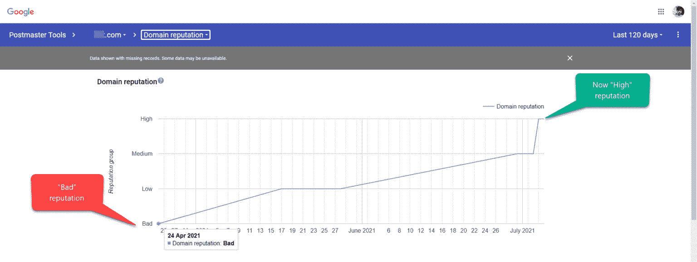
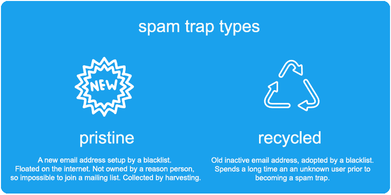
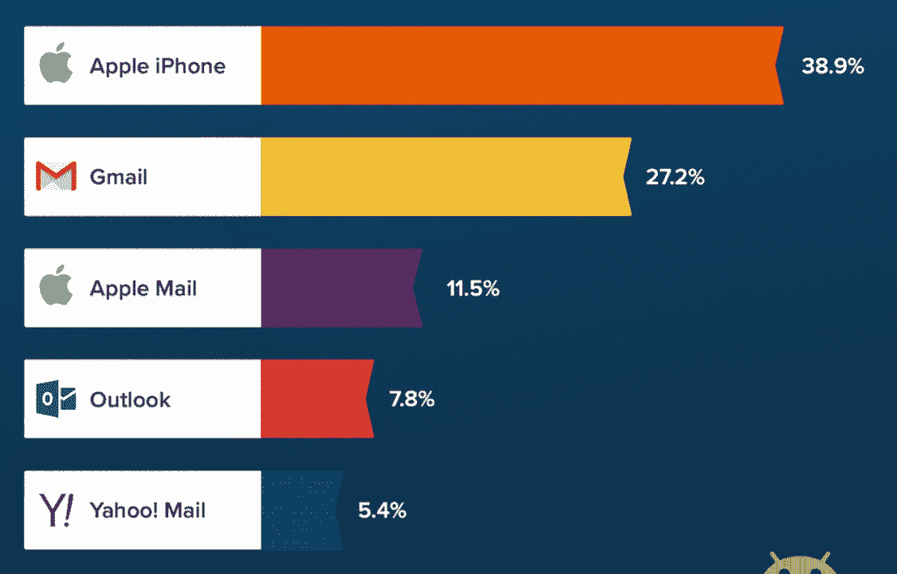
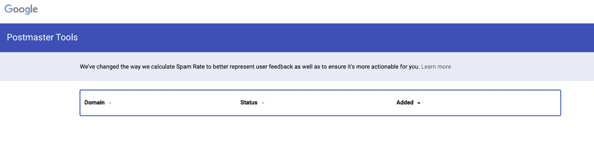
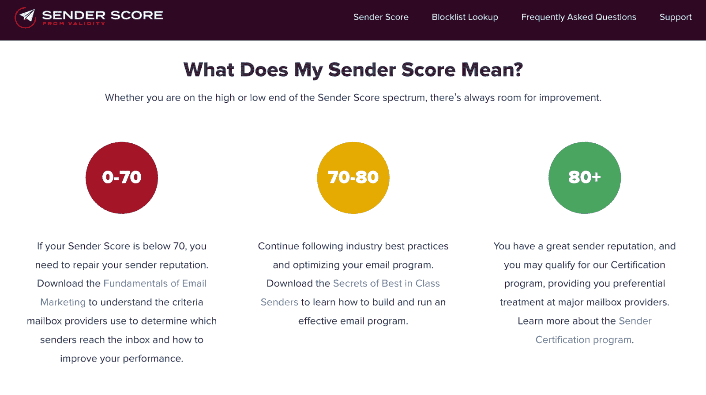
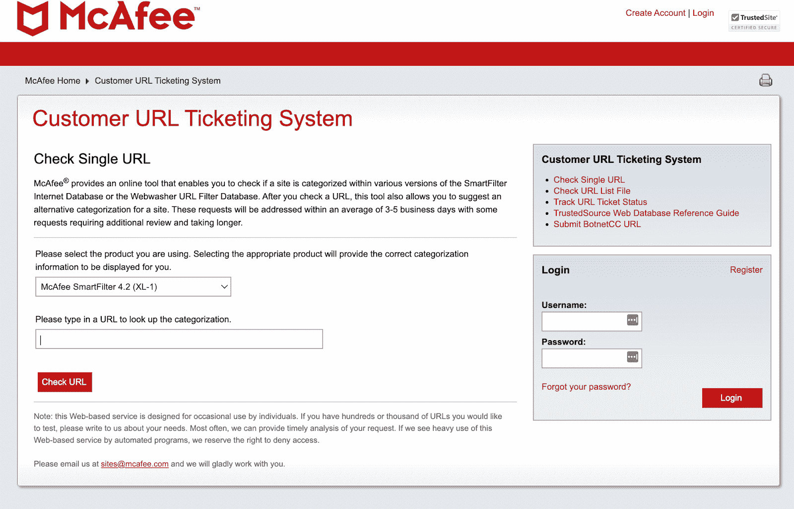
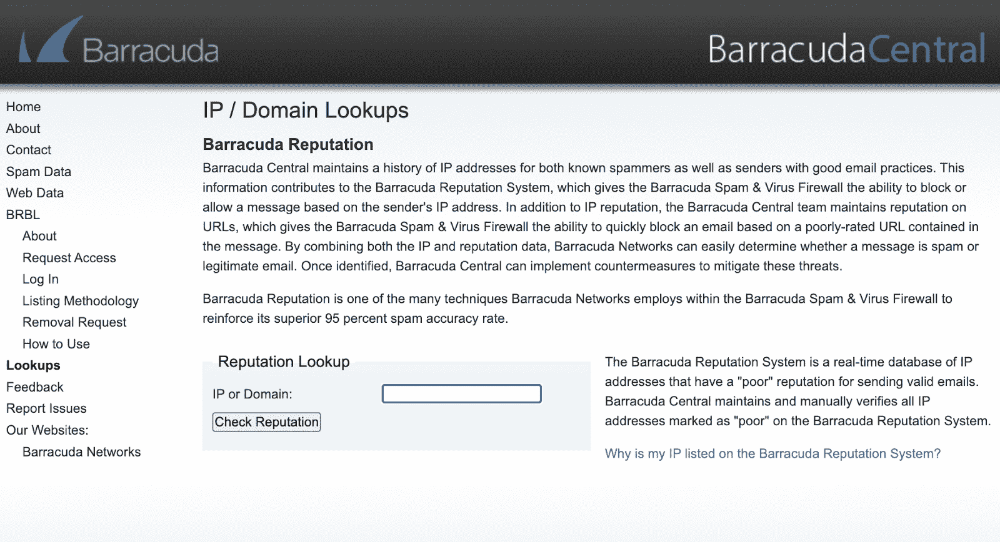
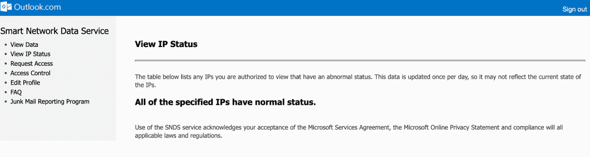

# 域名信誉指南:如何提高你的信誉和电子邮件的送达率

> 原文：<https://kinsta.com/blog/domain-reputation/>

[电子邮件营销](https://kinsta.com/blog/email-marketing-automation/)是你可以使用的最有效的渠道之一，每花一美元平均可以获得[42](https://kinsta.com/blog/email-marketing-statistics/)美元的投资回报率。然而，如果没有人看到你的电子邮件，你就不能有效地利用电子邮件活动。

这似乎是显而易见的，但垃圾邮件文件夹对任何营销活动的成功都是一个严重的威胁。

为了确保你的电子邮件到达他们的目标受众，并远离垃圾邮件箱，你需要监控你的“域名声誉”这是电子邮件服务提供商给你的域名的可信度评分。他们用它来确定你的电子邮件的有效性。

与高信誉域相关联的邮件会进入收件人的收件箱。然而，如果你的域名信誉不好，你就会被扔进垃圾邮件文件夹，再也见不到你了。

但是域名信誉是如何计算的呢？你能做什么来监控它？你如何确保你的域名信誉良好？你能做什么来修复一个坏的域名声誉？

回答这些问题将是本指南的目的。根据以下信息，您将能够监控和优化您的域名声誉，从而推动您所有的电子邮件营销工作。

## 什么是域名信誉？

您的域名信誉是一个分数，它决定了电子邮件系统如何决定他们将让什么通过用户收件箱。

> 需要在这里大声喊出来。Kinsta 太神奇了，我用它做我的个人网站。支持是迅速和杰出的，他们的服务器是 WordPress 最快的。
> 
> <footer class="wp-block-kinsta-client-quote__footer">
> 
> 
> 
> <cite class="wp-block-kinsta-client-quote__cite">Phillip Stemann</cite></footer>

[View plans](https://kinsta.com/plans/)

基本上，你的域名声誉是衡量你的域名的健康和合法性。你的[域名](https://kinsta.com/blog/how-to-buy-a-domain-name/)就是你的网址。【贵公司】故称“T2”。com 或者。org 或者任何你正在使用的域名。

你的电子邮件通常来自那个域名，即使你把你的虚拟主机和你的电子邮件服务分开。与您的网址相关联的信誉适用于来自该网址的所有电子邮件。

An example of how domain reputations are tracked on Google (**Source:** [Push Income](//pushincome.com/improve-google-postmaster-domain-reputation/%E2%80%9D))

域信誉由邮箱提供商和互联网服务提供商(ISP)决定，这意味着每个[电子邮件服务提供商](https://kinsta.com/blog/secure-email-providers/)可能有不同的域信誉。例如，Gmail 可能会给你一个域名信誉，但是发送到 Yahoo 地址的邮件会得到一个完全不同的分数。

理解域名声誉，包括它是如何计算的以及如何提高的，对于电子邮件营销来说是绝对重要的。

为什么这如此重要？当你的域名信誉很差时，你发送的电子邮件通常会直接进入垃圾邮件文件夹，没有人会看到它们。这意味着你在浪费时间和金钱去发送无用的邮件。

但是如果你不知道你的域名声誉不好，你可能不会理解为什么你的电子邮件会变成垃圾邮件或者为什么没有人阅读它们。为此，您必须加深对域名声誉的理解，如何衡量它，以及如何提高您的分数并使您的邮件脱离垃圾邮件漩涡。

当然，域名声誉不仅仅是电子邮件地址的问题。这个分数会影响到所有使用你域名的地方。除了电子邮件地址，这包括返回路径域和 DKIM 签名域。它还包括标题、品牌资产、链接以及您发送的邮件中包含的任何内容。

[Email marketing has an average ROI of $42 for every dollar spent- so make sure your emails get seen withhelp from this guide 📧Click to Tweet](https://twitter.com/intent/tweet?url=https%3A%2F%2Fkinsta.com%2Fblog%2Fdomain-reputation%2F&via=kinsta&text=Email+marketing+has+an+average+ROI+of+%2442+for+every+dollar+spent-+so+make+sure+your+emails+get+seen+withhelp+from+this+guide+%F0%9F%93%A7&hashtags=MarketingTips%2CEmailMarketing)

## 域名信誉是如何计算的？

仅仅理解域名信誉的概念并不足以帮助你管理你的域名。你也需要很好的理解你的域名声誉是如何计算的。

这是一个复杂的话题，因为每个电子邮件收件人评估域权限不同。

虽然它们都有不同的标准，但并不是所有的标准都是已知的。一些服务对他们的计算因素保密，所以恶意的垃圾邮件发送者无法欺骗系统。

虽然各种因素可能有所不同，但有一点是不变的，即接收平台决定如何在您的电子邮件中使用您的域名，然后监控其用户如何接收这些邮件。

为您发送的每条消息计算的所有分数在将来发送更多消息时对您有利或不利。

这就是为什么每个域都有多个与不同的电子邮件收件人相关的声誉。这些声誉还取决于你发送给特定接收者的数量。

例如，如果你向 Gmail 用户发送大量的电子邮件，谷歌将会有很多关于你的域名及其信誉的信息。然而，如果你只有几个 Hotmail 用户，那么这项服务就无法对你进行全面的评估。

虽然这些服务根据不同的标准来判断你，但我们可以指出一些共同的计算因素作为起点。

### 域信誉计算因素

域名信誉可以追溯到许多常见的计算因素，不同的服务使用这些因素来确定电子邮件到达时的位置。

列表上的第一个因素是你的电子邮件是否被发送到垃圾邮件陷阱。这些是由黑名单服务运营的虚假电子邮件地址，目的是清除垃圾邮件发送者。

有两种不同的垃圾邮件陷阱。原始垃圾邮件陷阱是从未有效的电子邮件地址。这些地址实际上无法选择接收电子邮件。这意味着任何向这些地址发送电子邮件的人都没有使用电子邮件营销的最佳实践。

回收的垃圾邮件陷阱曾经是有效的电子邮件地址，但现在已经改变了用途。虽然发送到回收的垃圾邮件陷阱不会像原始陷阱那样损害你的声誉，但还是应该避免。这就是为什么定期清理你的电子邮件营销列表很重要。

The difference between pristine and recycled spam traps (**Source:** [Email Blaster UK](//www.emailblasteruk.com/blog/increase-your-sender-score/%E2%80%9D))

电子邮件服务提供商也监控黑名单。黑名单是由电子邮件平台保存的详细列出垃圾邮件发送者和恶意实体的列表。

如果你被添加到一个接收者的[黑名单](https://kinsta.com/blog/url-blocklist/)(可能是因为发送了一封电子邮件到一个原始的垃圾邮件陷阱)，你将立即被识别为垃圾邮件。当大部分收件人将您的邮件标记为垃圾邮件时，也会被添加到黑名单中。

然后是订婚。这是确定域名信誉时需要监控的一个重要因素。当人们不打开你的电子邮件或集体退订你的邮件时，这对电子邮件提供商来说是一个巨大的危险信号，可能会影响你的域名声誉。

但这是另一个因供应商而异的因素。如果 Gmail 用户退订的速度比 MSN 用户快，你的 Gmail 声誉会低很多。

电子邮件的做法也被监控，以确定一个领域的有效性。虽然这似乎是一个特别宽泛的术语，但它衡量了你的电子邮件的频率、相关性和时机。

你域名的年龄也是决定你声誉的一大排名因素。一个发出大量电子邮件的新域名将会受到怀疑。但是一个已经建立多年的老域名将会得到更多的宽容。

## 如何建立域名信誉

如果你的域名比较新，你在开始的时候必须小心。确保你马上建立一个积极的域名声誉。你不想因为犯了一个愚蠢的错误而处于劣势。

你应该始终避免给那些没有明确选择加入你的[品牌信息](https://kinsta.com/blog/positioning-strategy/)的人发邮件。其中许多可能是原始的垃圾邮件陷阱，你更有可能被从未同意接收你的电子邮件的人举报为垃圾邮件。

为了给电子邮件提供商留下好印象，你应该建立一个适当的电子邮件节奏来控制你的数量和一致性。

如果你每天随机发送多封电子邮件，这将是可疑的。但是建立一个有规律的节奏显示了合法性和专业性。一个不仅仅关注电子邮件的潜在客户创造节奏对电子邮件提供商来说也不那么垃圾。

B2B email prospecting cadence (**Source:** [Cognism](//www.cognism.com/blog/ultimate-b2b-prospecting-cadence/%E2%80%9D))

同样重要的是要有耐心，避免做得太多太快。记住，域名的年龄很重要，所以慢慢建立你的电子邮件营销，随着时间的推移建立一个积极的声誉。

确保您的[电子邮件列表保持更新](https://kinsta.com/blog/how-to-build-an-email-list/)。如果有人取消订阅，您应该确保删除他们。忽视退订请求不仅会损害你的域名声誉，还会让你陷入法律纠纷，尤其是在 [GDPR](https://kinsta.com/blog/wordpress-gdpr-compliance/) 和 [CCPA](https://kinsta.com/blog/wordpress-ccpa-compliance/) 之后。

最后，这似乎是显而易见的，但不要发送垃圾邮件。避免全部用大写字母书写，避免在主题行中使用垃圾邮件触发词，如:

*   立即行动
*   购买
*   现在打电话
*   清除
*   交易即将结束
*   有限时间
*   特别促销
*   急迫的
*   遇见单身者
*   如上所见

随着时间的推移，不断监控你的声誉也很重要。你应该永远知道你的立场。这样，你可以快速调整你的方法，以确保如果出现问题，你不会被列入黑名单。为此，定期检查你的声誉，并根据你的发现改变你的计划。

## 如何检查你的域名信誉

你知道你必须检查你的域名声誉，以成功地保持积极。然而，你可能不知道如何做到这一点。不要担心，在推荐几个有帮助的工具之前，我们将带您了解如何检查您的域名信誉。

网上有很多资源可以让你检查你的域名声誉，并保持一致的关注。其中许多甚至可以免费使用，当你已经在为电子邮件营销软件付费时，这总是一个优势。

## 注册订阅时事通讯

### 想知道我们是怎么让流量增长超过 1000%的吗？

加入 20，000 多名获得我们每周时事通讯和内部消息的人的行列吧！

[Subscribe Now](#newsletter)

你能查到的最常见的域名信誉是由谷歌跟踪的。这是因为许多电子邮件平台将他们的分数保密，以防止人们试图利用这一点。但是从谷歌那里得到你的分数绝对是一个加分项，因为它的电子邮件客户端 Gmail 是世界第二大电子邮件客户端，拥有 [27.8%](https://techjury.net/blog/gmail-statistics/#gref) 的市场份额。

Top email clients in Q1 2021 (**Source:** [Litmus](//www.litmus.com/blog/email-client-market-share-2021-q1/%E2%80%9D))

一些监控域名信誉的工具为您提供了一个等级，您可以随时跟踪该等级。

## 顶级域信誉查找工具

为了帮助您正确地跟踪您的域名信誉，我们编制了一份最佳域名信誉跟踪工具列表。我们将讨论它们是什么、它们做什么以及它们的成本。

### 1.谷歌邮局主管工具

我们之前提到过，了解你在谷歌的地位总是一个好主意。这就是为什么每当营销人员谈论域名信誉软件时， [Google Postmaster 工具](https://www.gmail.com/postmaster/)通常会主导谈话。

Google Postmaster Tools

由于谷歌是一个如此巨大的电子邮件接收者，了解它如何对你的域名进行评级将对预测你的电子邮件营销的有效性大有帮助。Google Postmaster 工具为你提供了 Gmail 的信誉等级，只要你的邮件量足够匿名。

除了您的域名信誉，您还可以检查您的:

*   交付错误
*   加密
*   垃圾邮件率
*   证明
*   反馈回路

这是谷歌提供的 100%免费服务，这也是它如此受欢迎的另一个原因。

### 2.塔罗斯情报

思科创造了 Talos Intelligence 来监控你在多个 IP 上的在线声誉。

Talos Intelligence

这使得发现任何重大问题变得容易。如果你的结果是一个中立的声誉，那并不意味着你有一个干净的健康证明。这通常是因为电子邮件数量少，使得 Talos 很难评估你的声誉。

如果你想检查你在 Talos Intelligence 上的信誉，你必须去 IP & Domain 信誉中心，在那里你可以将你的域名粘贴到任务栏并运行一个报告。

像谷歌邮局主管工具，这项服务是免费的。

### 3.发件人得分

[发件人得分](https://senderscore.org/)由效度得出。它监控你的域名信誉，就像信用监控公司跟踪你的信用评分一样。它还会给你一个 1-100 之间的分数，分数越高越好。任何低于 70 的都被认为是坏的，任何超过 80 的都被认为是好的。

Struggling with downtime and WordPress problems? Kinsta is the hosting solution designed to save you time! [Check out our features](https://kinsta.com/features/)

Sender Score

分数会考虑你的声誉和[邮件送达率](https://kinsta.com/blog/email-deliverability-manager/)。此分数是根据 30 天的滚动平均值计算的，将您的分数与其他 IP 地址进行比较。

发件人评分是免费的，但你必须提供一些信息。

这包括:

*   [IP 地址](https://kinsta.com/help/external-ip-address/)
*   名字
*   工作电子邮件
*   公司
*   每月电子邮件发送量
*   雇员人数
*   工作职能
*   国家

### 4.可信来源

McAfee 是世界上互联网安全领域最值得信赖的公司之一，它创建了一个名为 [TrustedSource](http://www.trustedsource.org) 的系统，为网络和电子邮件提供您域名的信誉信息。它还将列出所有附属机构、邮件服务器和域名系统(DNS)信息。

McAfee TrustedSource

要使用它，您只需从下拉菜单中选择 McAfee 工具，并在提供的框中输入您的域。然后，系统会为您运行一份报告，列出您的 [URL](https://kinsta.com/knowledgebase/what-is-a-url/) 、状态、特征和声誉。

您还可以在结果下方添加可选的分类建议。McAfee 指出，这项服务是为个人偶尔使用而设计的，不应该用来检查“成百上千个 URL”

这项服务是免费提供的。

### 5.梭鱼中心

Barracuda Central 是一个工具，可以让你查找你的 IP 地址，并确定它是否被列入任何黑名单。

Barracuda Central

它通过保存一个实时数据库来显示你网站的信誉是好是坏。

梭鱼中心是另一个免费工具。但是，它不像发件人分数那样提供数字分数。这只是一个通过或失败的结果。

### 6.微软 SNDS 公司

SNDS 是微软对谷歌邮局主管工具的回应。SNDS 代表智能网络数据服务，它提供关于你的域名信誉的信息，包括你目前发送给多少个微软垃圾邮件陷阱。它还让你知道你的垃圾邮件投诉率，这是多少人将你的内容标记为垃圾邮件的衡量标准。

Microsoft SNDS

就像谷歌通过 Gmail 的数据来衡量你的声誉一样，微软通过其电子邮件服务 [Outlook](https://kinsta.com/blog/outlook-smtp-settings/) 来衡量你的声誉。当然，这不会影响其他电子邮件提供商对你的看法，但了解你在谷歌和微软的地位将有助于描绘你的整体声誉。

如果世界上两个最大的服务机构对你持怀疑态度，那么你可以打赌许多其他机构也是如此。

当您登录到 SNDS，它会显示一个表格，列出了您关联的任何具有异常状态的 IP。这是每天更新的。

## 如何提高你的域名声誉

现在你知道如何检查你的域名信誉，问题就变成了，如果你发现你的信誉很差，你该怎么办？你不能只是在你的网站上贴上一个信任徽章，然后让这些服务相信你是诚实的。

你可以采取几个步骤来提高你的声誉。虽然不得不从劣势中提升自己并不理想，但这远非不可能。

### 清理你的主题行

首先，仔细审视你在邮件主题中使用的措辞。像“交易”和“立即购买”这样的垃圾流行语对电子邮件服务提供商来说是很大的危险信号。即使它们成功通过，也会引起电子邮件用户的怀疑，他们可能会将你标记为垃圾邮件。

### 定期清除你的非活跃用户名单

你也会想要定期清理你的邮件列表。如果你注意到在一段时间内没有任何联系的地址，把它们从你的列表中删除。有可能这些都是垃圾邮件陷阱，你不想一直掉进去了。

### 仅向选择加入的用户发送电子邮件

确保您让订户选择接收电子邮件。这保证了你要发送的每个人都是一个真正想听你说的优质线索。它还几乎消除了你因发送未经请求的电子邮件而落入原始垃圾邮件陷阱的可能性。

如果你使用的是 MailChimp 等第三方电子邮件系统，考虑用[认证你的域名和电子邮件](https://kinsta.com/blog/email-authentication/)，这样平台就可以代表你发送信息。

[What's your “domain reputation?” 👀 That’s the trustworthiness score email service providers give to your domain. Learn how to improve yours here 📧Click to Tweet](https://twitter.com/intent/tweet?url=https%3A%2F%2Fkinsta.com%2Fblog%2Fdomain-reputation%2F&via=kinsta&text=What%27s+your+%E2%80%9Cdomain+reputation%3F%E2%80%9D+%F0%9F%91%80+That%E2%80%99s+the+trustworthiness+score+email+service+providers+give+to+your+domain.+Learn+how+to+improve+yours+here+%F0%9F%93%A7&hashtags=MarketingTips%2CEmailMarketing) ## 摘要

电子邮件营销可以给你的公司带来巨大的好处。但是如果你的[邮件投递率](https://kinsta.com/blog/email-deliverability-manager/)因为糟糕的域名声誉而受到打击，你将永远不会体验到这些好处。

你可以做很多事情来提高网站的安全性，从运行常规的 T2 安全检查到安装 T4 的 WordPress 安全插件。不幸的是，你的网站的安全与你的域名声誉无关。这只能通过扎实的电子邮件实践、耐心和使用本页列出的一些工具仔细监控来改善。

幸运的是，我们列出的工具都是免费的，这意味着跟踪你的域名声誉将是轻而易举的事情。

* * *

让你所有的[应用程序](https://kinsta.com/application-hosting/)、[数据库](https://kinsta.com/database-hosting/)和 [WordPress 网站](https://kinsta.com/wordpress-hosting/)在线并在一个屋檐下。我们功能丰富的高性能云平台包括:

*   在 MyKinsta 仪表盘中轻松设置和管理
*   24/7 专家支持
*   最好的谷歌云平台硬件和网络，由 Kubernetes 提供最大的可扩展性
*   面向速度和安全性的企业级 Cloudflare 集成
*   全球受众覆盖全球多达 35 个数据中心和 275 多个 pop

在第一个月使用托管的[应用程序或托管](https://kinsta.com/application-hosting/)的[数据库，您可以享受 20 美元的优惠，亲自测试一下。探索我们的](https://kinsta.com/database-hosting/)[计划](https://kinsta.com/plans/)或[与销售人员交谈](https://kinsta.com/contact-us/)以找到最适合您的方式。