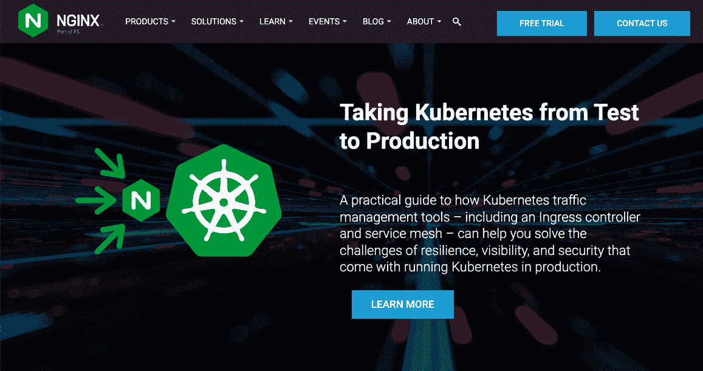
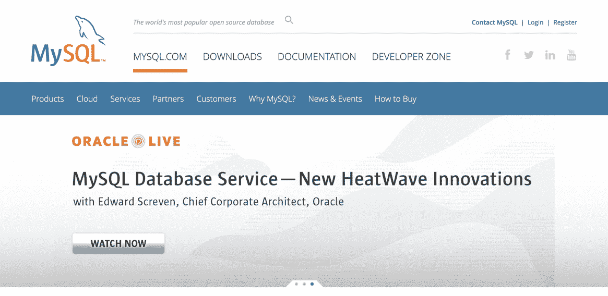
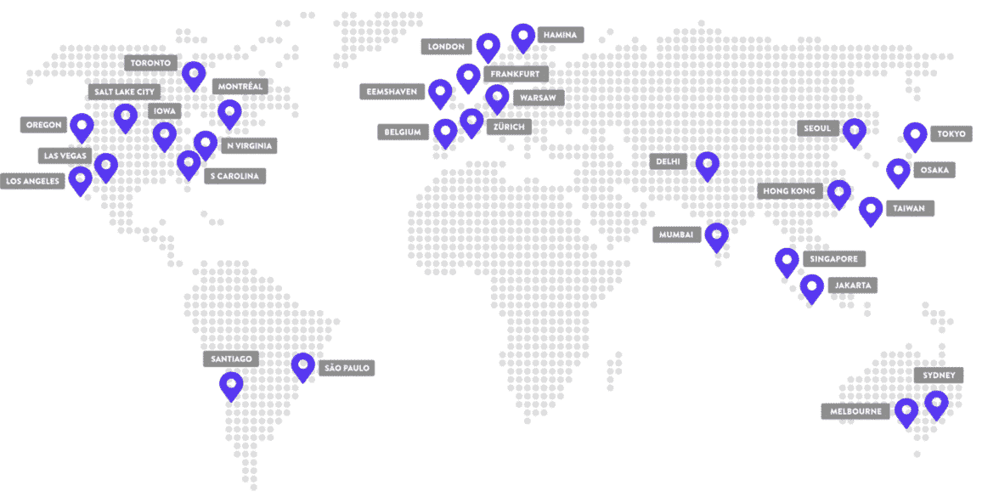

# 理想的 WordPress PHP 和服务器需求

> 原文：<https://kinsta.com/blog/wordpress-server-requirements/>

服务器通过存储网站、应用程序和各种数字资产的数据文件来支持互联网。任何自托管的 WordPress 网站都需要一个服务器来存储和使用 PHP 文件、媒体元素、数据库和内容。

但是你知道在安装一个 WordPress 站点之前，你必须考虑 WordPress PHP 和服务器的需求吗？

WordPress PHP 和服务器要求是制作一个良好运行的网站的最低环境设置。WordPress 在技术上可以在过时的代码和服务器上运行，但并不理想；东西可能会坏掉，你的站点会运行得更慢。这就是为什么 WordPress 列出了对服务器和 PHP 代码的要求。虽然这涵盖了他们的一些责任，但它也告诉开发者，当启动一个托管的 WordPress 站点时，这些是最小化问题的服务器级必需品。

在本指南中，我们将详细介绍 WordPress PHP 和服务器需求，以及可选的建议，以创建一个理想的环境。我们还将提供如何检查你当前的服务器和 PHP 版本的信息，并根据 WordPress PHP 的要求更新它们。

请继续阅读，了解详情！

## WordPress 总是需要服务器吗？

是的，所有的 WordPress 网站都需要服务器来运行。不管你用的是 WordPress.org 还是 WordPress.com。

WordPress.org 是自托管的，给你最大的服务器控制权。尽管 WordPress.com 不要求你自己托管，WordPress.com 仍然使用物理服务器和网络服务器软件来托管网站文件。

一般来说，开发人员应该坚持使用像 Kinsta 这样的 WordPress.org 主机。这样，你可以获得托管 WordPress 主机的好处(具有自动备份、性能监控和内容交付网络等功能)，同时在你的[控制面板](https://kinsta.com/blog/cpanel-alternatives/)中保持对服务器的控制。拥有一个这样的仪表板来创建/移动网站，配置速度和安全设置，以及分析访问量、PHP 和网站数据库的指标是非常有益的。

[Did you know there are WordPress PHP and server requirements you have to consider before installing a WordPress site? 😮 Find them all here 🤓Click to Tweet](https://twitter.com/intent/tweet?url=https%3A%2F%2Fkinsta.com%2Fblog%2Fwordpress-server-requirements%2F&via=kinsta&text=Did+you+know+there+are+WordPress+PHP+and+server+requirements+you+have+to+consider+before+installing+a+WordPress+site%3F+%F0%9F%98%AE+Find+them+all+here+%F0%9F%A4%93&hashtags=PHP%2CWordPress)

## PHP 和服务器需求

[PHP 是一种编程语言](https://kinsta.com/knowledgebase/what-is-php/)，所有主流编程语言都得到更新改进。在这种情况下，我们要看哪个版本的 PHP 编程语言最适合运行 WordPress 站点。

另一方面，web 服务器是存储在物理硬件服务器上的一个软件。像 [Apache 和 Nginx](https://kinsta.com/blog/nginx-vs-apache/) 这样的流行服务器软件需要定期更新；软件所在的硬件也是如此。因此，开发者必须了解每一个的哪个版本在 WordPress 上表现最好。

我们将从下面的 PHP 需求开始，然后转到服务器需求。

### WordPress PHP 要求

WordPress 支持并运行在 PHP 编程语言的许多版本上。然而，为了获得最佳性能，我们建议运行 PHP 7.4 或更高版本。

这包括:

*   [PHP 7.4 版](https://kinsta.com/feature-updates/php-7-4/)
*   [PHP 8.0 版](https://kinsta.com/feature-updates/php-8/)
*   [PHP 8.1 版](https://kinsta.com/feature-updates/php-8-1/)

WordPress 推荐 PHP 版本是基于这些版本是否仍然得到 PHP 开发者的支持。所有 PHP 版本都将获得两年的支持，之后它们将进入所谓的“生命终结”阶段。

PHP 版本有三个支持阶段:

*   积极支持
*   仅安全修复
*   寿命终止

在“积极支持”阶段，错误和安全报告得到解决和修复。在此期间，他们还会发布子版本来完善主版本。当绝对有必要解决一个极端的安全问题时，在“仅安全修复”阶段发布版本。“寿终正寝”阶段是指 PHP 开发团队不再提供安全和错误修复，这意味着如果您的网站使用“寿终正寝”版本的 PHP，它将容易受到攻击。

由于这些阶段，建议您在“生命终结”阶段立即升级任何带有 PHP 版本的网站。我们上面的建议有两个处于“积极支持”阶段的 PHP 版本。PHP 7.4 版本处于“仅安全修复”阶段，这是运行 WordPress 网站的最低要求。

Supported PHP releases and their phases.

PHP 版本的历史可以追溯到 2000 年 10 月的 PHP 3.0。从那时起，我们已经看到定期更新一直到 8.1。PHP 的 [7.3 版本](https://kinsta.com/blog/php-7-3/)是处于“生命终结”阶段的最新版本，标记为不支持未来的修复。

WordPress 在技术上可以与许多 PHP 版本兼容，其中一些已经过时。用 PHP 3.0 发布一个 WordPress 站点是完全可能的，但是这必然会产生严重的功能和安全问题。尽管你可以接受任何“仅安全修复”版本，最好还是将你的 WordPress 站点的 PHP 更新到最新的“主动支持”版本。

### 信息

不管你网站的总体目标是什么，[你应该为所有 WordPress 网站使用受支持的 PHP 版本](https://kinsta.com/blog/php-versions/)来保证你的数据安全和你的性能一流。

#### 如何找到并更新你的 WordPress PHP 版本

我们建议在 PHP.net 的[支持版本页面添加书签，以查看版本发布日期，以及每个版本的“积极支持”和“仅安全修复”阶段何时结束。](https://www.php.net/supported-versions.php) [Kinsta 也有一个 PHP 版本页面](https://kinsta.com/knowledgebase/devkinsta/php-versions/)来监控支持的版本。

其中最重要的部分是了解你的网站当前使用的 PHP 版本(并在必要时[更新它的 PHP](https://kinsta.com/knowledgebase/how-to-update-php-in-wordpress/))。我们最好的建议包括查看 WordPress 的管理部分，检查前端，检查 version.php 文件，或者使用 WP-CLI。

### WordPress 服务器需求

服务器需求包括几个要素:RAM、数据库版本、处理能力、磁盘空间和使用的 web 服务器。

以下是运行 WordPress 时对服务器的标准建议:

*   Web 服务器:Nginx 或带有 mod-rewrite 模块的 Apache
*   磁盘空间:至少 1 GB
*   PHP:7.4 或更高版本
*   数据库:MySQL 5.015 或更高版本(另一种选择是 MariaDB，版本 10.1 或更高版本)
*   RAM(随机存取存储器):至少 512 MB
*   CPU(中央处理器):至少 1.0 GHz
*   支持 HTTPS

现在让我们更深入地了解这些硬件和 web 服务器建议背后的原因。

#### 1.网络服务器

有各种各样的服务器类型，但 web 服务器通常是指一个软件、硬件或两者一起工作。在大多数情况下，术语“web 服务器”模糊了定义，因为你的站点文件通常存储在一个强大的、物理的、基于计算机的 web 服务器上。这些网站文件通过软件网络服务器进行访问和传送。

WordPress 对网络服务器有硬件和软件的要求吗？

##### 硬件 Web 服务器要求和建议

你的主机使用哪个品牌的机器来托管 WordPress 站点并不重要。一些主机更喜欢 Windows，而另一些则选择 macOS 或 Linux 电脑。你可以[学习如何在任何 Windows、macOS 或 Linux 服务器上安装 PHP](https://kinsta.com/blog/install-php/)。

更重要的是硬件的处理能力、磁盘空间和 RAM，我们将在下面几节中讨论。您还需要确保您的主机定期升级其硬件(就像所有事情一样，旧机器会发生故障)，在其数据中心安装冷却系统，并实施物理安全措施来防止对数据中心的入侵。

您通常可以在主机网站上找到有关机器、服务器提供商和位置的信息。Kinsta 使用[谷歌云平台](https://cloud.google.com/infrastructure)，该平台管理着一个由安全、高效的数据中心组成的[全球网络。](https://kinsta.com/knowledgebase/google-cloud-data-center-locations/)

##### 软件 Web 服务器要求和建议

web 服务器的软件端获取存储在数据中心机器中的数据，并将其交付给想要查看或管理它的用户。这是你的 WordPress 网站内容呈现给访问者的方式，也是你在自己的仪表盘上访问服务器数据的方式，比如 MyKinsta 中的[。](https://kinsta.com/blog/manage-multiple-wordpress-sites/)

WordPress 推荐 Nginx 或 Apache 作为运行 WordPress 的最佳网络服务器软件选项。虽然两者各有优势，但都不是必须使用的。从技术上讲，你可以使用 WordPress 的任何网络服务器。

Nginx is one of the suitable web server software for WordPress.

然而，WordPress 推荐 Apache，因为它的名字识别、定制潜力和可靠性。与此同时，Nginx 提供了超越替代方案的强大优势，因为它能够通过隔离的容器优化性能，私有化服务器资源，并通过改进的缓存、资源处理和防火墙实现提供更高的性能。

Kinsta 使用 Nginx 作为其 web 服务器解决方案的一部分，将所有性能优化方面打包到单独的容器中。这样，所有像 Nginx、Linux 和 PHP 这样的资源都在一个地方。

你可以[优化你的 WordPress 站点，但是最显著的性能提升来自网络服务器和网络服务器所在的硬件。管理自己的本地服务器是可能的，但更常见的是选择服务器提供商(第三方公司，其数据中心配备了托管 web 服务器所需的硬件)。服务器提供商包括谷歌云平台、AWS(亚马逊网络服务)和 Rackspace。](https://kinsta.com/blog/optimize-images-for-web/)

这些提供商提供高效、安全的数据中心和卓越的服务器性能。然而，服务器提供商将其服务器作为非托管托管环境出售。这就是为什么最好使用像 Kinsta 这样的选项来访问 Google Cloud Platform 的服务器功能，以及 MyKinsta 的用户友好性和添加的服务器管理功能。

## 注册订阅时事通讯

### 想知道我们是怎么让流量增长超过 1000%的吗？

加入 20，000 多名获得我们每周时事通讯和内部消息的人的行列吧！

[Subscribe Now](#newsletter) #### 2.磁盘空间

服务器硬件在硬盘上有一定的空间。WordPress 应用程序的最小磁盘空间要求是 1 GB。这是非常低的，所以你应该不难找到一个有足够磁盘空间支持 WordPress 的服务器。

当你向核心 WordPress 应用程序添加资源时，磁盘空间就成了问题。所有数据文件(如主题、插件和媒体)都会占用磁盘空间。然后，硬盘充当存储单元，决定进程和数据加载到 CPU 的速度。

人们通常认为处理速度是服务器性能背后最重要的因素，但是处理器决定了服务器上计算的速度和数量。虽然处理对站点性能至关重要，但高质量的硬盘同样重要。

磁盘的类型及其存储空间需求取决于你的 WordPress 站点的增长潜力。博客文章和产品页面不断增加的媒体密集型网站需要更多的磁盘空间。一个包含一些小图片的个人博客只需要很少的磁盘空间。因此，您可以根据需要选择磁盘空间大小。Kinsta 提供从 10 GB 到 250 GB 的固态硬盘存储。磁盘空间过剩选项有助于保持您的网站运行，即使你超过限制。

使用的硬件类型控制着硬盘的性能。主机和服务器提供商通常在物理服务器中安装硬盘驱动器(HDD)或固态驱动器(SSD)。

以下是它们的不同之处:

*   **SSD:** 这是一款现代的高速硬盘，没有移动部件(固态)，因此不太容易受到物理损坏。SSD 的固态构建还可以加快数据传输速度，因为无需等待传输机制来回移动。由于这些优势，固态硬盘比硬盘更贵。
*   **硬盘:**这是一种更老、更便宜的硬盘，内部机械部件可以移动。对于存储不经常需要的数据或速度要求较低的数据，这是一个理想的经济解决方案。

一些主机提供商选择将数据库存储在固态硬盘上，而将其他潜在的不太重要的资产放在硬盘上。这使得价格和性能之间的妥协。

虽然 WordPress 在硬盘上运行良好，但明智的做法是使用带固态硬盘的服务器来确保可靠的数据传输、高效的处理和网站增长的开放渠道。

#### 3.数据库ˌ资料库

对于数据库软件来说，WordPress 与 MySQL 版本 5.6+或 T2 版本 10.1+配合使用效果最好。

MySQL is one of the supported database software for WordPress.

强烈建议您也使用这些与数据库相关的最佳实践:

*   将您的数据库存储在固态硬盘上。
*   选择具有自动化数据库优化的主机。
*   激活数据库的自动备份(以及整个站点的备份)。
*   确保您的服务器支持多用户环境。

Kinsta 提供 Google 云平台上的 MariaDB、每周 MySQL 优化、自动化数据库备份和多用户环境。

#### 4.随机存取存储器

服务器性能在很大程度上依赖于随机存取存储器。RAM 位于 CPU 和硬盘之间，它准备来自硬盘的任何数据，并将其发送给 CPU(处理器)。

Struggling with downtime and WordPress problems? Kinsta is the hosting solution designed to save you time! [Check out our features](https://kinsta.com/features/)

服务器利用 RAM，因为它比硬盘更容易访问。因此，更高的 RAM 会导致更多的数据/进程存储在“等待区”，供 CPU 在完成前一个进程时访问。有了这个数据“等待区”，所有服务器的处理速度都快得多。

WordPress 应用程序本身至少需要 512 MB 的内存。增加内存对于任何增长中的 WordPress 站点都是有意义的，无论是大型数据库、媒体还是任何需要处理的东西。

Kinsta 为标准计划和[阶段环境](https://kinsta.com/help/staging-environment/)提供了 8 GB 的 RAM，如果需要的话，还可以通过[选项升级](https://kinsta.com/help/premium-staging-environments/)。

#### 5.PHP 和 PHP 内存限制

正如本文前面提到的，当运行 WordPress 站点时，我们总是推荐最新版本的 PHP。但是 PHP 内存限制怎么办？

PHP 内存限制包括为 web 服务器运行基于 PHP 的进程保留的内存量。PHP 内存限制的目标是消除占用 RAM 的资源导致站点崩溃的可能性。托管公司和服务器提供商决定你的服务器上的 PHP 内存限制，所以你可能需要和他们讨论增加或减少限制。

标准的 WordPress 安装在 PHP 内存限制为 64 MB 的情况下运行良好，但是如果需要的话，主机提供高达 256 MB 的内存也并不少见。

WordPress 以其整合插件、主题和其他应用程序的能力而闻名，有时，这些额外功能需要一点额外的能力。这在严重依赖 PHP 内存的 [WordPress 插件](https://kinsta.com/best-wordpress-plugins/)中很常见。

幸运的是，你可以随时联系你的主机来增加这个限制。

#### 6.中央处理器

CPU 或中央处理器是硬件服务器中的处理芯片。CPU 通常被认为是任何服务器的指挥中心，它决定服务器上可以运行多少个进程，以及运行速度有多快。

WordPress 在 1.0 GHz 的 CPU 处理能力下运行良好。然而，这是假设你没有添加任何东西到网站上。大多数主机不再担心处理能力。尽管如此，他们仍然专注于如何获得许多处理核心，从而更容易确定需要什么(说 5 个核心比说 50 GHz 更容易理解)。

此外，来自主机的 CPU 如此强大，以至于没有太多关于 RAM 的问题，尤其是在运行像 WordPress 这样的轻量级应用程序时。

话虽如此，对内存的要求因 WordPress 上的网站类型而异。处理指的是服务器的多任务处理能力，这与整个性能密切相关。硬盘将数据传递给 CPU，RAM 使从 CPU 访问数据变得更快更容易。

然而，处理数据的是 CPU。因此，更多的 CPU 有助于提高性能。双核处理的动作是单核的两倍。六核处理的动作是三核的两倍。

因此，一个有数万用户同时访问多个文件的 WordPress 站点应该考虑增加服务器上的 CPU 数量。

大多数托管公司会随着你在他们的定价计划中的上升而增加 CPU 的数量。例如， [Kinsta 的标准计划从 12 个 CPU](https://kinsta.com/knowledgebase/technical-questions/#cpu-ram)开始，但是如果需要，您可以升级。

#### 7.额外推荐:服务器位置

随着云托管和虚拟专用服务器的兴起，服务器的位置似乎不再重要。但是对于那些主机类型，服务器仍然在世界的某个地方保存着你的 WordPress 站点的内容。服务器有一个物理位置，使它离一些用户更远，离另一些用户更近。这个物理距离影响你的 WordPress 站点的加载速度。

WordPress 不要求也不推荐任何特定的服务器位置来运行它的应用程序，但是我们建议使用可以访问全球服务器网络的主机。通过全球网络，您的网站文件被放置在您选择的物理服务器上，很可能是离您的用户最近的服务器。如果你的大部分用户都在美国，你会选择美国的服务器。或者，您可能会选择特定的区域，如美国的西海岸或东海岸，为用户提供更近的内容交付选项。

此外，我们建议找一个具有 CDN(内容交付网络)功能的服务器，让你不仅可以选择你的服务器，还可以利用网络上的多个服务器，加快 WordPress 网站在世界各地的交付时间。

借助谷歌云平台， [Kinsta 可以提供 35 个数据中心位置，](https://kinsta.com/knowledgebase/google-cloud-data-center-locations/)包括澳大利亚、英国、瑞士、美国、日本、新加坡等地的选项；你可以自由选择哪个数据中心最适合你的 WordPress 网站。此外，Kinsta 通过 Cloudflare 提供免费的 CDN，以加快内容交付速度，并消除您的服务器和用户之间的地理界限。

Kinsta’s server locations.

#### 8.额外推荐:一个唯一的服务器帐户用户名

大多数服务器都有一个默认用户名，供所有服务器用户共享。因此，建议您使用自己的帐户用户名运行 WordPress 等 PHP 应用程序，而不要坚持使用服务器提供的默认用户名。请联系您的网站主持人进行更改。

## 如何检查一个 Web 主机是否支持 WordPress PHP 和服务器需求

有时，主机会在其定价计划细节中列出关于其 PHP 支持和服务器需求的信息。例如，Kinsta 定价页面列出了其对最新版本 PHP 的支持，以及关于其 SSD 存储、WordPress 数据库、性能甚至其使用谷歌云平台的服务器位置的信息。Kinsta 还分享了它如何在谷歌云平台、LXD 容器和 Nginx 上使用 MariaDB 来提供最新服务器、数据库和处理组件的高速基础设施。

如果你使用不同的主机开发一个 WordPress 站点，最好联系客户支持来弄清楚主机(和你付费的计划)是否支持 WordPress PHP 和服务器需求。

你可以用这样一条简单的信息提问:

> 我想用(插入托管公司名称)托管 WordPress 的开源版本。我写信是为了了解我的托管计划是否支持以下要求:
> 
> *   *MariaDB 10.1 以上，或者 MySQL 5.6 以上*
> *   *PHP 7.4 或更高版本*
> *   Web 服务器:Apache 或 Nginx，带有 mod_rewrite 模块
> *   *支持 HTTPS*
> 
> 谢谢。

[Learn more about WordPress PHP and server requirements, along with optional recommendations needed to create an ideal environment in this guide ✅Click to Tweet](https://twitter.com/intent/tweet?url=https%3A%2F%2Fkinsta.com%2Fblog%2Fwordpress-server-requirements%2F&via=kinsta&text=Learn+more+about+WordPress+PHP+and+server+requirements%2C+along+with+optional+recommendations+needed+to+create+an+ideal+environment+in+this+guide+%E2%9C%85&hashtags=PHP%2CWordPress)

## 摘要

WordPress PHP 和服务器的要求是为了保护你的网站并保持其正常运行。这就是为什么找到一个支持所有这些需求的主机，同时提供自动更新和仪表板工具来让您访问服务器和 PHP 版本是如此重要。

如果你选择一个主机，使用该公司的定价页面来了解哪些软件包支持你的网站的需求。你也可以给主人发邮件，问他们问题。

在 Kinsta，我们会跟上新的服务器需求，因此您不必担心这些需求。对于当前正在运行的网站，你可以在 WordPress 和 MyKinsta 仪表盘中监控 PHP 版本，并采取措施更新到最新的 PHP 版本。

在审查一个 WordPress 站点的主机 PHP 和服务器产品时，还需要考虑什么？请在评论区告诉我们。

* * *

让你所有的[应用程序](https://kinsta.com/application-hosting/)、[数据库](https://kinsta.com/database-hosting/)和 [WordPress 网站](https://kinsta.com/wordpress-hosting/)在线并在一个屋檐下。我们功能丰富的高性能云平台包括:

*   在 MyKinsta 仪表盘中轻松设置和管理
*   24/7 专家支持
*   最好的谷歌云平台硬件和网络，由 Kubernetes 提供最大的可扩展性
*   面向速度和安全性的企业级 Cloudflare 集成
*   全球受众覆盖全球多达 35 个数据中心和 275 多个 pop

在第一个月使用托管的[应用程序或托管](https://kinsta.com/application-hosting/)的[数据库，您可以享受 20 美元的优惠，亲自测试一下。探索我们的](https://kinsta.com/database-hosting/)[计划](https://kinsta.com/plans/)或[与销售人员交谈](https://kinsta.com/contact-us/)以找到最适合您的方式。