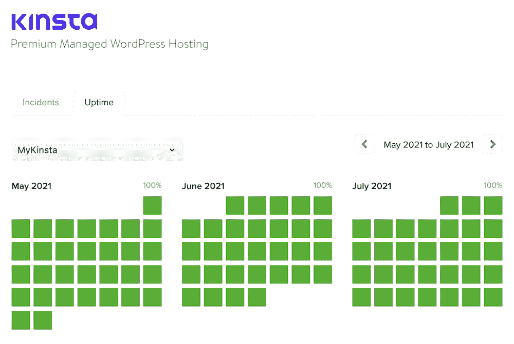
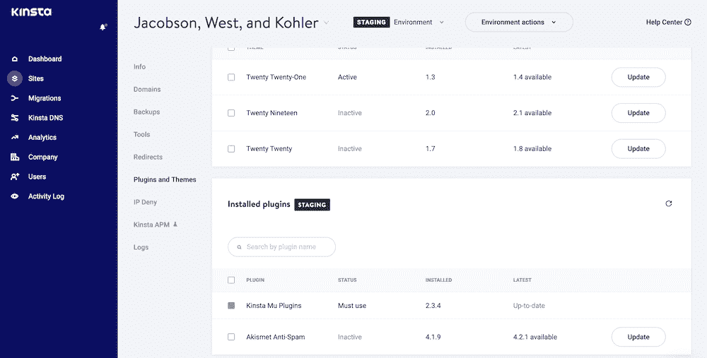
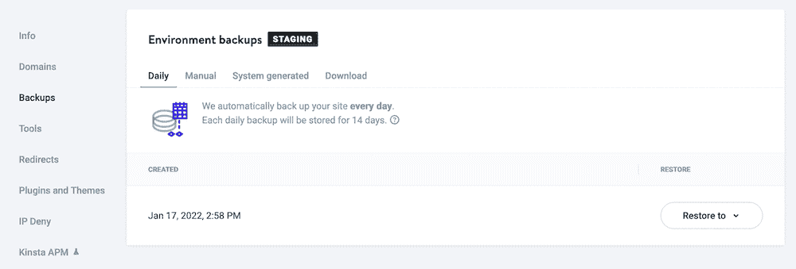
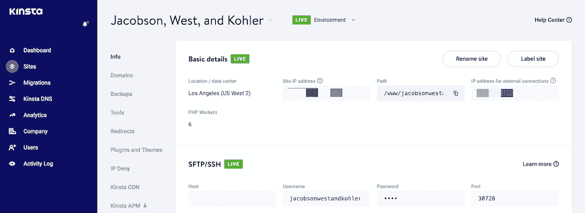
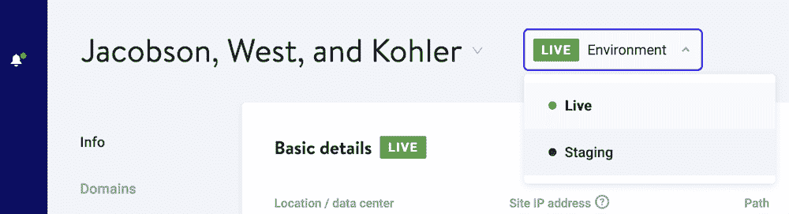
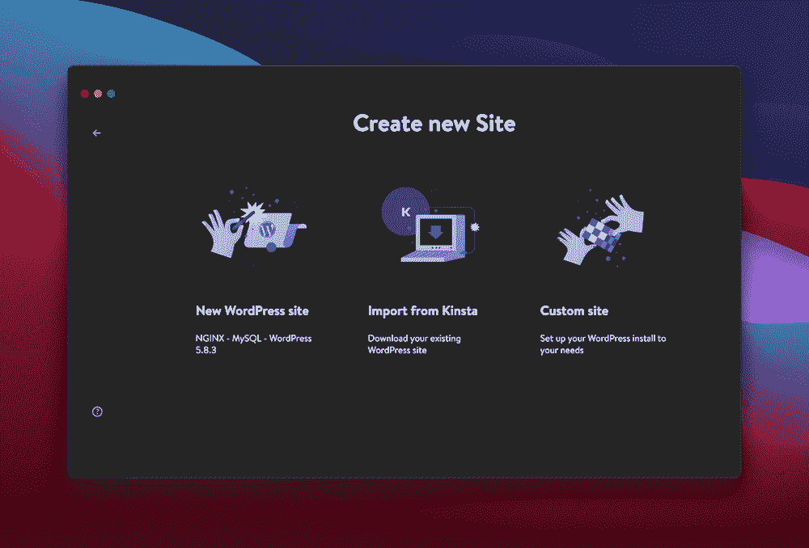
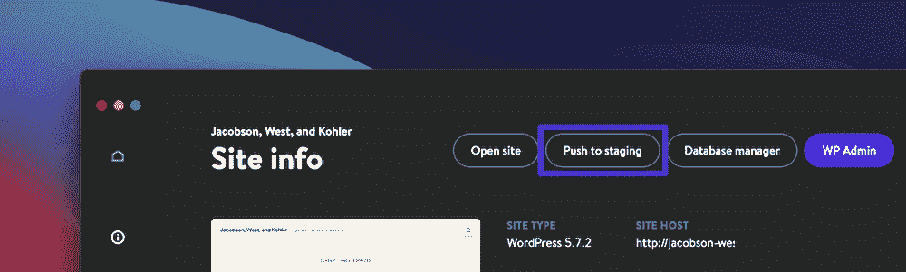
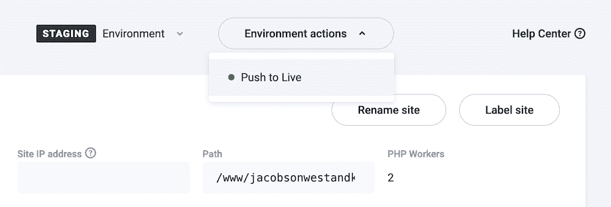

# 如何建立一个 WooCommerce 分期网站

> 原文：<https://kinsta.com/blog/woocommerce-staging/>

与其他类型的网站相比，WooCommerce 网站有着不同且独特的需求。首先，商店在线的时间是需要考虑的最重要的方面之一。对于精明的店主来说，这几乎是一种痴迷。

WooCommerce staging 是一种帮助您保持电子商务商店活力的策略，同时还能增强和更新它。

从一般意义上来说，一个临时站点是一个公众无法访问的实时站点的副本。这是一个过于简单化的想法，但是如果你这样想，你会开始看到它能为你做什么。有了临时站点，您可以进行更新、测试设计选择，并在不影响实时商店的情况下在您的站点上工作。

在这篇文章中，我们将向你展示关于 WooCommerce staging 你需要知道的一切。到最后，你会知道它是否适合你，以及如何把一些东西放在适当的位置。

## 什么是分期？

Staging 是一种不用向公众展示就可以托管你的站点的方式。这似乎有悖于直觉，除非您明白，在将它们推送到您的实际实例之前，您将对一个临时站点进行更改。在你发布好的修改之前，把它看作是你的站点的一个副本，你将把它作为一个测试平台。

这个概念对整个过程非常重要。在大多数情况下，您不希望对您的实时站点进行更改。这是因为这些调整中的任何一个都可能导致问题，此时你的网站要么不能正常工作，要么完全停止工作，打断你的用户和销售。

一般的过程是克隆你的站点文件和你的数据库。这将转到另一个服务器，您的[本地开发环境](https://kinsta.com/ebooks/wordpress/wordpress-local-development/)，或者两者都有，这取决于您的工作流(稍后将详细介绍)。完成工作后，您可以通过这些阶段返回到下一步—从本地设置到您的临时服务器，或者从临时服务器到实时服务器。

> 需要在这里大声喊出来。Kinsta 太神奇了，我用它做我的个人网站。支持是迅速和杰出的，他们的服务器是 WordPress 最快的。
> 
> <footer class="wp-block-kinsta-client-quote__footer">
> 
> 
> 
> <cite class="wp-block-kinsta-client-quote__cite">Phillip Stemann</cite></footer>

[View plans](https://kinsta.com/plans/)

自始至终，您的 live 站点都保持原来的工作状态，不会受到更改的影响。当然，一旦您将这些更改从您的临时环境推送到您的活动服务器，这将更新您的站点。

 总的来说，在您进行更改时，暂存是针对站点问题的安全措施。一旦您确定这些更改已经就绪，您就可以将它们发送到您的实时站点。

[WooCommerce staging made much easier, thanks to this guide 🛍Click to Tweet](https://twitter.com/intent/tweet?url=https%3A%2F%2Fkinsta.com%2Fblog%2Fwoocommerce-staging%2F&via=kinsta&text=WooCommerce+staging+made+much+easier%2C+thanks+to+this+guide+%F0%9F%9B%8D&hashtags=Ecommerce%2CWooCommerce)

## 需要 WooCommerce 分期吗？

我们承认这看起来像是一个复杂的工作流程，特别是考虑到大多数网站所有者都不熟悉本地到现场开发的概念。然而，WooCommerce staging 有一个重要的商业意义:正常运行时间。

The Kinsta Uptime page.

公众对电子商务的使用正在增加，在未来它将[几乎无处不在](https://www.nasdaq.com/articles/uk-online-shopping-and-e-commerce-statistics-2017-2017-03-14)。此外，最受欢迎的电子商务市场[遍布全球](https://www.emarketer.com/content/global-historic-first-ecommerce-china-will-account-more-than-50-of-retail-sales)。这意味着你需要准备应对几乎持续不断的交通流量。

换句话说，你会希望维持你的网站的正常运行时间。

WooCommerce staging 可以让你在安全测试变化的同时保持网站的活力。它提供了无数的好处:

*   你有足够的时间[在你需要的网站方面](https://kinsta.com/blog/woocommerce-tutorial/)工作，而不用担心停机。
*   临时站点永远不会影响您的实时服务器，因此您可以避免出错。
*   您可以测试重新设计和用户界面(UI)更新，而不会影响最终用户。
*   如果你有一个[开发团队](https://kinsta.com/developer-roles/development-at-kinsta/)，这里有一个自然的分工。他们可以平静地处理您网站的设计和功能，而您可以使用成熟的设计集中精力最大化您的生产力。

WooCommerce staging 有更多的优点，它们都是你自己独特的设置。在任何情况下，如果你把你的站点和开发分成本地的、临时的和实时的站点，你将保持高的正常运行时间和滚滚而来的利润。

## 何时使用 WooCommerce 分期

我们已经谈到了 WooCommerce staging 的一些用例，但是在一些特定的情况下给你更多的细节是值得的。

从表面上看，对你的网站进行简单的更新和调整似乎不是 WooCommerce 的最佳用途。毕竟，设置它需要一些思考，而且对你的站点进行修改通常更简单。然而，我们认为基本变更是使用分段的最好理由。

这是因为一个 [WordPress 核心、主题和插件更新](https://kinsta.com/blog/downgrade-wordpress/)会像[白屏死亡(WSoD)](https://kinsta.com/blog/wordpress-white-screen-of-death/) 或其他错误一样影响一个网站。这些类型的更新仍然会更改您的文件，如果有不兼容，您将有一个离线的网站。

The MyKinsta Plugins and Themes screen.

在核心更新出错的情况下，损害可能是不可逆转的。这显然比可修复的错误更具灾难性，但即使是后者，您也有一些工作要做。例如:

1.  你需要通过[安全文件传输协议(SFTP)](https://kinsta.com/knowledgebase/how-to-use-sftp/) 登录到你网站的服务器。
2.  接下来，你会想要找到违规的主题或插件，这通常涉及到禁用一切和进行个别检查。
3.  从那里，你会想整理出主题或插件给你的功能。在前者的情况下，你的网站看起来很可能会崩溃，而后者可能会导致一些基本功能的消失。

虽然这是最容易解决的问题之一，但主题或插件不兼容仍然让人头疼。最重要的是，它引入了停机时间，这将对你的收入和流量数字产生连锁反应。

您也可以将它扩展到插件和主题安装。当然，[安装和更新](https://kinsta.com/feature-updates/plugin-and-theme-management/)是不同的动作，但是它们都与更改和添加文件有关。因此，不难理解在 WooCommerce 平台上安装一个新的插件或主题会让你在上线之前测试新的插件是否有错误和不兼容的地方。

事实上，当涉及到[主题安装](https://kinsta.com/blog/how-to-update-wordpress-theme/)时，只有当你想重新设计你的网站时，你才会这么做。这是阶段化的一个核心用例，我们认为重新设计是您可能考虑使用该技术的唯一情况之一。

如你所见，WooCommerce staging 不仅仅是一个设计沙盒环境。

### 使用分段作为备份

一些用户还会断言，如果您将一个完整的实时站点复制到一个临时环境中，这也构成了您的站点的[完整备份。这里的真相更复杂。](https://kinsta.com/blog/backup-wordpress-site/)

一方面，是的，你的整个站点在一个不同的环境中是可用的，以防最坏的情况发生。然而，这个“备份”只是您的站点在一个更早的时间点的快照。

The Environment backups page within MyKinsta.

在你的网站出现错误之前，让它上线需要惊人的运气。此外，如果您使用 staging，您不会总是使用最新的数据库，因为应用程序并不总是需要更新。事实上，大多数暂存过程都放弃了将数据库从暂存状态推入活动状态，因为数据总是会过时。

对于 WooCommerce 网站来说尤其如此，在那里你可能每分钟经历多次销售。想象一下这样一种情况，你把一个网站拉到 staging，过了一段时间再把它推上 live，结果却抹去了几百个订单。

## WooCommerce 分期选项

许多精明的网络企业、主机和开发者都认识到 [staging 一般来说](https://kinsta.com/blog/wordpress-staging-site/)对大多数网站所有者来说是重要的。因此，有很多方法来布置你的网站，如果你使用 WordPress，你会很熟悉这些方法:

*   您的主机可能有办法设置 staging，尽管不是所有的都有。这是一个很好的选择，因为您不需要导航到另一个仪表板和界面。
*   WordPress 插件是存在的，比如 [WP Stagecoach](https://wpstagecoach.com/) 和[WP stage](https://wp-staging.com/)。许多建议建议使用插件[，比如复制器](https://kinsta.com/help/migrate-wordpress-duplicator-plugin/)，但是这不能复制一个分段解决方案所能复制的功能。
*   还可以选择设置一个手动中转站点。这将是一项技术工作，你需要很多专业知识来完成它。对大多数人来说，这可能不是最好的选择，但它将是最强大的。

首先检查一下你用当前的工具和软件已经可以实现什么总是一个好主意。因此，您的主机是您应该首先寻找的地方。

### 为什么要考虑内置暂存的主机

尽管手动方法有很多好处——它功能强大，适应您的需求，并且在您的控制之下，但它可能不是最佳解决方案。我们相信你的主机提供了特性、功能、可用性等的完美结合，来帮助你[建立 WooCommerce staging](https://kinsta.com/help/staging-environment/) 。

[使用你的主机](https://kinsta.com/woocommerce-hosting/)有很多好处:

## 注册订阅时事通讯

### 想知道我们是怎么让流量增长超过 1000%的吗？

加入 20，000 多名获得我们每周时事通讯和内部消息的人的行列吧！

[Subscribe Now](#newsletter)

*   您不需要担心将您的暂存解决方案与您的服务器连接起来，因为它已经是生态系统的一部分。
*   你的主机知道如何[设置服务器](https://kinsta.com/secure-wordpress-hosting/)，所以他们将会是一个好的临时服务器的专家。
*   此外，您可以使用主机的基础设施更好地复制您的活动服务器。在许多情况下，这些服务器将具有相同的规格、软件和优化。
*   将没有额外的仪表板或界面来提供内容，这从可用性的角度来看是很重要的。许多主机都提供了一个简单的分段选项，能够选择在服务器之间拉取和推送的内容。

因为我们非常相信分期付款的力量，所以 Kinsta 有自己的解决方案，以最少的麻烦来设置它。在下一节中，我们将看看它提供了什么。

## 为什么 Kinsta 是 WooCommerce Staging 的完美主持人

在 Kinsta 提供的众多功能中,是健壮的，为每个 WordPress 安装一个 prime 的集成 staging 这包括 WooCommerce 网站。事实上，Kinsta 有 42，070 个正在使用的中转站点！

您可以在这里获得功能全面的解决方案。这包括设置、刷新、删除和管理暂存环境的能力。您和暂存站点之间的点击次数最少，在实时环境和暂存环境之间推送和提取数据和文件只需几秒钟。

此外，如果您[将 DevKinsta](https://kinsta.com/devkinsta/) 作为流程的一部分，您可以创建一个完整的工作流。

The DevKinsta logo.

DevKinsta 是一个免费的工具，它可以让你将自己开发的本地站点推到一个临时环境中。这意味着您可以在不浪费任何服务器资源的情况下工作，然后在您的临时服务器上测试这些更改。

在我们的知识库中，我们有大量关于金斯塔的舞台如何运作的信息[。然而，在本文的其余部分，我们将向您展示一些基础知识。](https://kinsta.com/help/staging-environment/)

Kinsta 还允许你利用他们的[高级登台环境插件](https://kinsta.com/help/premium-staging-environments/)，这允许你添加多达 5 个高级登台环境到你的 WordPress 站点。高级阶段环境是资源密集型站点测试或开发的理想环境，如 WooCommerce 网站。

## 如何设置 WooCommerce Staging(使用 Kinsta 和 DevKinsta)

在接下来的几节中，我们将向您展示如何使用 Kinsta 的功能和 DevKinsta 作为本地环境来设置 WooCommerce staging 。

然而，在你启动控制面板之前，计划一下你希望你的流程如何流动是个好主意。

### 1.规划你的工作流程

这是我们在本文其他地方会触及的主题，但是 WooCommerce staging 不仅仅是在不同的服务器上托管来测试变化。把它看作是网站开发的一个整体方法。因此，在做其他事情之前，您需要决定这个工作流程。

我们的意见是对您的开发工作流程采取三管齐下的方法:

Struggling with downtime and WordPress problems? Kinsta is the hosting solution designed to save you time! [Check out our features](https://kinsta.com/features/)

*   本地:你将在自己的电脑上的沙盒环境中工作，这提供了大量的时间，也没有压力。然而，您不会经常在本地设置和实时服务器之间获得完全的对等。
*   **Staging:** 这将提供一个在线环境，在一个更好地代表您的实时站点的服务器上，测试您从本地设置所做的更改。
*   **Live:** 这(当然)是你面向公众的网站，这意味着在你进行设计变更和更新时，保存它是最重要的。

这个工作流程让你按照自己的步调工作，不占用任何主机资源，然后在接近生产级设计时扩展站点。但是，除此之外，您还需要考虑以下几个方面:

*   **数据库同步:**这是 WooCommerce 筹备过程中最重要的考虑因素之一。您通常会将一个活动的数据库移动到本地和临时环境中，但不会将该数据库完整地推回。这就是好的试运行解决方案和迁移工具之间的区别。
*   **同步文件:**与您的数据库类似，您需要考虑如何将您正在处理的文件同步回您的实时网站。这可能是你不推一切，只有改变的文件。然而，如果有意义的话，完全同步也没什么不好。

对于一些开发人员来说， [Git 是准备过程的重要中间人](https://kinsta.com/blog/git-for-web-development/)。事实上， [Git 非常适合用“推送部署”的方式托管你的主题和站点文件。这允许您在本地服务器上工作，将文件推送到 Git，并设置一个宏或脚本来将这些文件部署到临时或活动服务器上。](https://kinsta.com/help/git/)

如果您能够永远不接触任何一台服务器，那么在工作流程的每一步中，您遭受“损害”的可能性就会更小。在我们看来，这是分期付款的另一个好处。

### 2.设置登台环境

我们可以缩短这一部分，因为在 Kinsta 中启用 staging 是如此简单！这里有三个你想要遵循的一般步骤。首先，登录您的 [MyKinsta 仪表盘](https://my.kinsta.com/)，前往您想要展示的网站:

The MyKinsta dashboard, showing the basic details for a site.

接下来，将环境从**现场**改为**舞台**。您可以从屏幕右上角的下拉菜单中完成此操作

The Environment actions menu.

一旦你点击按钮来实现 staging，Kinsta 就会施展它的魔法，把事情设置好。你可能要等大约 15 分钟左右才能一切就绪。然而，您还会发现您的[安全套接字层(SSL)](https://kinsta.com/knowledgebase/ssh-vs-ssl/) 设置被转移，这为您节省了一个额外的步骤。

### 3.对 WooCommerce 暂存进行更改

Kinsta 的 staging 功能非常棒，几乎可以在所有开发环境中使用。然而，如果你选择使用 DevKinsta 应用程序，你可以访问一些额外的(和酷的)功能，使你的 WooCommerce 分期体验更容易。

您将希望从 DevKinsta 的导入过程开始。一旦你点击**添加站点**按钮——你将从可用选项中选择**从 Kinsta** 导入，这是一件轻而易举的事情:

The Create new Site screen.

从这一点上你知道该怎么做:开发你的网站！

当然，在 DevKinsta 中工作时，无论您选择承担什么任务，我们都没问题，但是当您准备好了，您会希望将这些更改返回到您的登台环境中。

### 4.将变更从暂存状态推送到实时状态

就像将您的站点导入 DevKinsta 一样，将这些更改推回到您的服务器是轻而易举的事情。如果你点击进入 DevKinsta 中的**站点信息**面板，你会看到**按下准备**按钮:

这看起来太简单了，但是这是让你的站点重新回到你的服务器所需要做的。然而，在将这些阶段变更投入使用之前，您还需要检查一些任务。

首先，对你的网站进行一次彻底的测试，因为它已经在服务器上了。这将捕获您的本地环境没有突出显示的任何不兼容性。

当你完成这些，是时候让你的改变生效了。

您将从 MyKinsta 仪表板中完成此操作。在屏幕上显示您的试运行环境后，请看右侧。你会看到一个**环境动作**下拉菜单。如果您从该菜单中选择**按键激活**，明显的情况会发生:

The Push to Live option within the Environment action menu.

借助 Kinsta 出色的暂存功能，您还可以做更多事情，我们的知识库涵盖了您需要了解的一切，包括我们的选择性推送功能[。](https://kinsta.com/help/push-staging-live/#how-to-push-staging-to-live-with-selective-push)

[Want to keep your ecommerce store live, while still enhancing and updating it? 🛍 Enter, WooCommerce staging 😌Click to Tweet](https://twitter.com/intent/tweet?url=https%3A%2F%2Fkinsta.com%2Fblog%2Fwoocommerce-staging%2F&via=kinsta&text=Want+to+keep+your+ecommerce+store+live%2C+while+still+enhancing+and+updating+it%3F+%F0%9F%9B%8D+Enter%2C+WooCommerce+staging+%F0%9F%98%8C&hashtags=Ecommerce%2CWooCommerce)

## 摘要

网站的正常运行时间很重要——可以说对 WooCommerce 网站来说，这比你考虑的任何其他功能都重要。因此，您需要找到尽可能延长正常运行时间的方法，以便最大化您向客户销售的时间。WooCommerce staging 是寻找额外正常运行时间的最佳方式之一，同时还可以扩展、扩充、重新设计和优化您的商店。

在这篇文章的过程中，我们讨论了 WooCommerce staging 以及你为什么想要实现它。虽然有很多方法可以设置这一点，但使用您的主机无疑是最佳选择。Kinsta 既提供[标准登台](https://kinsta.com/help/staging-environment/)，也提供附加[高级登台环境](https://kinsta.com/help/premium-staging-environments/)，它们与[本地 DevKinsta 环境](https://kinsta.com/devkinsta/)相结合。这意味着你可以在基于 Kinsta 的应用程序中保持整个网站的生态系统，并从高启动时间中受益。

你认为 WooCommerce 分期对你的生意有好处吗？如果有，你认为它对你有什么帮助？请在下面的评论区告诉我们！

* * *

让你所有的[应用程序](https://kinsta.com/application-hosting/)、[数据库](https://kinsta.com/database-hosting/)和 [WordPress 网站](https://kinsta.com/wordpress-hosting/)在线并在一个屋檐下。我们功能丰富的高性能云平台包括:

*   在 MyKinsta 仪表盘中轻松设置和管理
*   24/7 专家支持
*   最好的谷歌云平台硬件和网络，由 Kubernetes 提供最大的可扩展性
*   面向速度和安全性的企业级 Cloudflare 集成
*   全球受众覆盖全球多达 35 个数据中心和 275 多个 pop

在第一个月使用托管的[应用程序或托管](https://kinsta.com/application-hosting/)的[数据库，您可以享受 20 美元的优惠，亲自测试一下。探索我们的](https://kinsta.com/database-hosting/)[计划](https://kinsta.com/plans/)或[与销售人员交谈](https://kinsta.com/contact-us/)以找到最适合您的方式。