# WordPress 6.0 的新特性:新的模块、风格切换、模板编辑、Webfonts API 等等

> 原文：<https://kinsta.com/blog/wordpress-6-0/>

WordPress 6.0 Arturo 在这里，像往常一样，我们躲在窗帘后面给我们的读者一个预览[最新 WordPress 主要发布](https://wordpress.org/news/2022/05/arturo/)的新内容。

让我们马上说，如果说 WordPress 5.9 把我们带到了古腾堡第二阶段的核心，那么 WordPress 6.0 旨在整合已经可用的定制工具。

但是新版本不仅仅如此。正如 Matias Ventura 在 6.0 的[初步路线图中指出的，站点编辑器的引入标志着一个巨大的里程碑，但也只是旅程中的第一步。](https://make.wordpress.org/core/2022/01/26/preliminary-roadmap-for-6-0/)

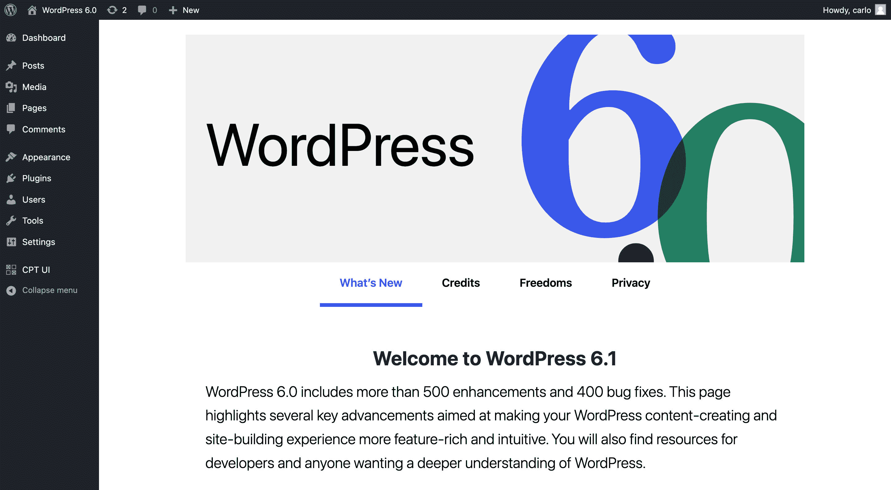

WordPress 6.0 Arturo is out


WordPress 6.0 在 CMS 的几个方面带来了显著的改进，从可用性到性能，包括以下方面:

*   改进的信息架构和模板浏览体验
*   改进的模板创建
*   新挂钩
*   Webfonts API
*   网站编辑器的新浏览模式
*   替代全局样式
*   增强的导航块
*   新的设计工具
*   改进的性能
*   还有更多…

但是等等，这还不是全部。WordPress 6.0 带来了令人印象深刻的变化，有 251 个 Trac 标签，包括 97 个功能和增强以及 131 个错误修复。

是的，有很多要谈的。所以我们不要再拖延了，来看看 6.0 版的 WordPress 有什么新功能吧。

 [WordPress 6.0 is here! 🥳 It brings improved template creation, alternative Global Styles, new blocks, and much much more... 🎁 Check out what's new in the latest WordPress major release right here👇Click to Tweet](https://twitter.com/intent/tweet?url=https%3A%2F%2Fkinsta.com%2Fblog%2Fwordpress-6-0%2F&via=kinsta&text=WordPress+6.0+is+here%21+%F0%9F%A5%B3+It+brings+improved+template+creation%2C+alternative+Global+Styles%2C+new+blocks%2C+and+much+much+more...+%F0%9F%8E%81+Check+out+what%27s+new+in+the+latest+WordPress+major+release+right+here%F0%9F%91%87&hashtags=WordPress%2CWPTips)

## Webfonts API

一个新的 [Webfonts API](https://make.wordpress.org/core/2022/03/16/whats-new-in-gutenberg-12-8-16-march/#highlight-1) 现在提供了一种将 Webfonts 加载到 WordPress 的标准化方法，确保了性能和用户隐私。


> Kinsta 把我宠坏了，所以我现在要求每个供应商都提供这样的服务。我们还试图通过我们的 SaaS 工具支持达到这一水平。
> 
> <footer class="wp-block-kinsta-client-quote__footer">
> 
> 
> 
> <cite class="wp-block-kinsta-client-quote__cite">Suganthan Mohanadasan from @Suganthanmn</cite></footer>

[View plans](https://kinsta.com/plans/)

[从 WordPress 6.0](https://make.wordpress.org/core/2022/04/22/status-of-webfonts-api-for-wordpress-6-0-inclusion/) 开始，你只能从你的 *theme.json* 注册一个新的网页字体。

使用 *theme.json* 非常简单。你所需要做的就是在`typography`部分添加一个新的[字体系列](https://kinsta.com/blog/best-programming-fonts/)。以下代码提供了一个 webfont 注册的示例:

```
{
	"settings": {
		"typography": {
			"fontFamilies": [
				{
					"fontFamily": "-apple-system,BlinkMacSystemFont,\"Segoe UI\",Roboto,Oxygen-Sans,Ubuntu,Cantarell,\"Helvetica Neue\",sans-serif",
					"name": "System Font",
					"slug": "system-font"
				},
				{
					"fontFamily": "\"Source Serif Pro\", serif",
					"name": "Source Serif Pro",
					"slug": "source-serif-pro"
				},
				{
					"fontFamily": "\"Inter\", sans-serif",
					"name": "Inter",
					"slug": "inter",
					"fontFace": [
						{
							"fontFamily": "Inter",
							"fontWeight": "200 900",
							"fontStyle": "normal",
							"fontStretch": "normal",
							"src": [ "file:./assets/fonts/inter/Inter.ttf" ]
						}
					]
				}
			]
		}
	}
}
```

上面的代码将 **Inter** 字体系列添加到 2022 年可用的默认字体集`fontFamilies`中。如果你想亲自尝试，从[谷歌字体](https://kinsta.com/blog/best-google-fonts/)下载[互联网字体](https://fonts.google.com/specimen/Inter)到*。/assets/fonts* 文件夹，然后将上面的代码添加到 Twenty Twenty ' s*theme . JSON*的`settings.typography`部分。完成后，保存文件并返回到站点编辑界面。

下图显示了编辑器中的结果。

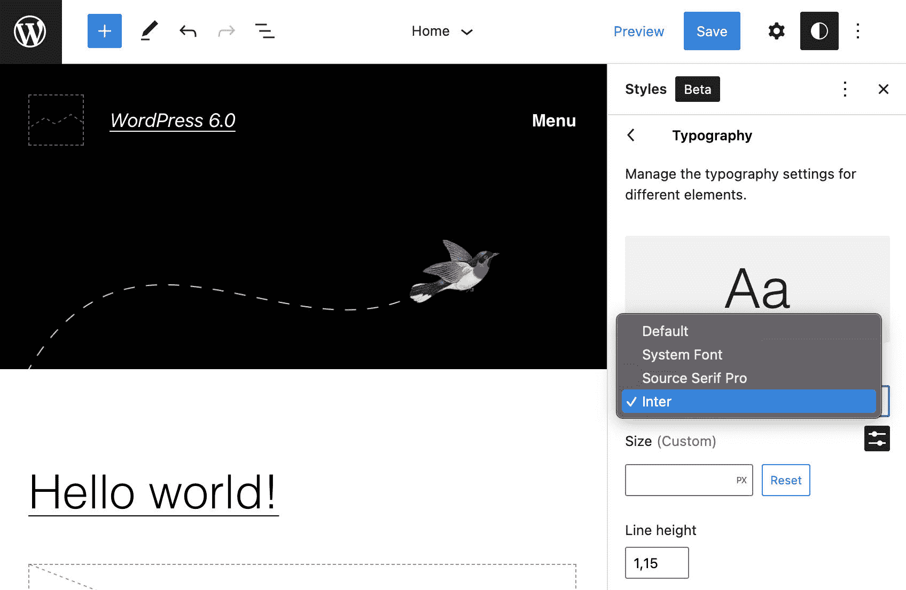

A new font family has been registered in Twenty Twenty-Two.


Webfonts API 只注册在当前页面上呈现块所需的字体，这对于在样式变体中定义的 webfonts [特别有用。此外，API 通过](https://github.com/WordPress/gutenberg/pull/39886)[按照字体家族](https://github.com/WordPress/gutenberg/pull/39559)注册和排列字体来优化 HTTP 请求的数量。

你可以在 [Webfonts API](https://github.com/WordPress/gutenberg/pull/37140) pull 请求、WordPress 6.0 包含的 Webfonts API 的[状态](https://make.wordpress.org/core/2022/04/22/status-of-webfonts-api-for-wordpress-6-0-inclusion/)以及 WordPress 6.0 的[全局样式变化](https://make.wordpress.org/core/2022/05/03/global-styles-variations-in-wordpress-6-0/)中了解更多关于新 API 的信息。


## 全局样式切换

全球风格变化是 WordPress 6.0 最令人期待的特性之一。主题作者现在可以将多组全局样式与他们的主题捆绑在一起，使用户只需单击一下就可以在样式变化之间切换。

这很像有现成的子主题，每个主题都有一组预定义的样式。

为了给你的 block 主题添加一个样式变体，你将添加一个替代的 JSON 文件到主题根目录下的*样式*文件夹中。

支持全局样式变化的主题在**全局样式**工具条中显示了一个新的**浏览样式**项目。这将带来一个面板，主题用户可以在其中找到可用样式的列表。

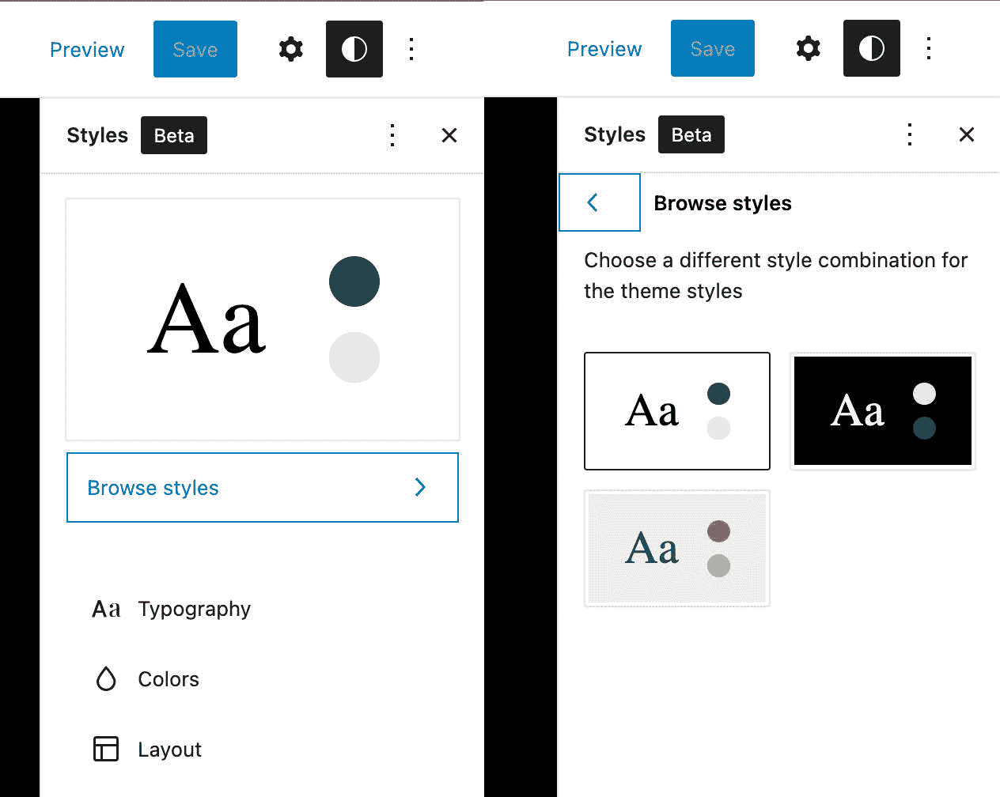

Browse styles in WordPress 6.0.


从列表中选择一个全局样式，该样式会自动应用到您的整个网站。

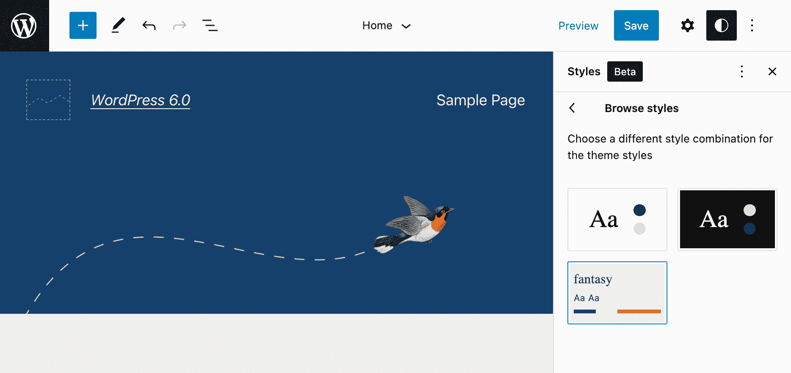

Picking a style with a single click in WordPress 6.0.


新功能允许主题开发者创造无限的风格变化，并与新的 Webfonts API 完美结合。

下图显示了上一个示例中的自定义样式，对标题应用了不同的字体。

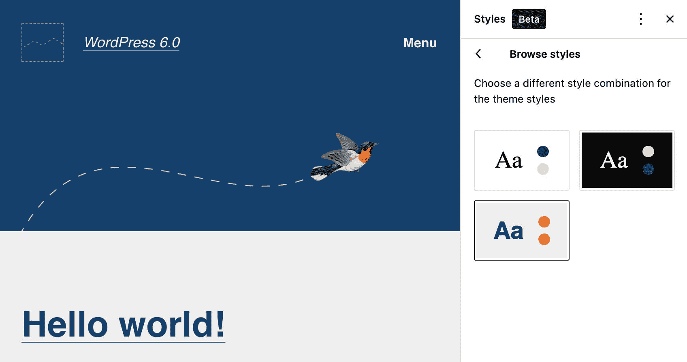

A style variation with a custom font in WordPress 6.0.


如果您想自己尝试一下，将一个 *styles* 文件夹添加到您的块主题的根目录，用一个有意义的名称创建一个新的 JSON 文件，在您最喜欢的[代码编辑器](https://kinsta.com/blog/free-html-editor/)中打开它，并添加以下代码:

```
{
	"version": 2,
	"settings": {
		"color": {
			"duotone": [
				{
					"colors": [ "#143F6B", "#EFEFEF" ],
					"slug": "foreground-and-background",
					"name": "Foreground and background"
				},
				{
					"colors": [ "#143F6B", "#FEB139" ],
					"slug": "foreground-and-secondary",
					"name": "Foreground and secondary"
				},
				{
					"colors": [ "#143F6B", "#F6F54D" ],
					"slug": "foreground-and-tertiary",
					"name": "Foreground and tertiary"
				},
				{
					"colors": [ "#F55353", "#EFEFEF" ],
					"slug": "primary-and-background",
					"name": "Primary and background"
				},
				{
					"colors": [ "#F55353", "#FEB139" ],
					"slug": "primary-and-secondary",
					"name": "Primary and secondary"
				},
				{
					"colors": [ "#F55353", "#F6F54D" ],
					"slug": "primary-and-tertiary",
					"name": "Primary and tertiary"
				}
			],
			"palette": [
				{
					"slug": "foreground",
					"color": "#143F6B",
					"name": "Foreground"
				},
				{
					"slug": "background",
					"color": "#EFEFEF",
					"name": "Background"
				},
				{
					"slug": "primary",
					"color": "#F55353",
					"name": "Primary"
				},
				{
					"slug": "secondary",
					"color": "#FEB139",
					"name": "Secondary"
				},
				{
					"slug": "tertiary",
					"color": "#F6F54D",
					"name": "Tertiary"
				}
			]
		},
		"typography": {
			"fontFamilies": [
				{
					"fontFamily": "\"Inter\", sans-serif",
					"name": "Inter",
					"slug": "inter",
					"fontFace": [
						{
							"fontFamily": "Inter",
							"fontWeight": "200 900",
							"fontStyle": "normal",
							"fontStretch": "normal",
							"src": [ "file:./assets/fonts/inter/Inter.ttf" ]
						}
					]
				}
			]
		}
	},
	"styles": {
		"blocks": {
			"core/post-title": {
				"typography": {
					"fontFamily": "var(--wp--preset--font-family--inter)",
					"fontWeight": "700"
				}
			},
			"core/query-title": {
				"typography": {
					"fontFamily": "var(--wp--preset--font-family--inter)"
				}
			}
		},
		"elements": {
			"h1": {
				"typography": {
					"fontFamily": "var(--wp--preset--font-family--inter)",
					"fontWeight": "700"
				}
			},
			"h2": {
				"typography": {
					"fontFamily": "var(--wp--preset--font-family--inter)",
					"fontWeight": "700"
				}
			},
			"h3": {
				"typography": {
					"fontFamily": "var(--wp--preset--font-family--inter)",
					"fontWeight": "700"
				}
			},
			"h4": {
				"typography": {
					"fontFamily": "var(--wp--preset--font-family--inter)",
					"fontWeight": "700"
				}
			},
			"h5": {
				"typography": {
					"fontFamily": "var(--wp--preset--font-family--inter)",
					"fontWeight": "700"
				}
			},
			"h6": {
				"typography": {
					"fontFamily": "var(--wp--preset--font-family--inter)",
					"fontWeight": "700"
				}
			}
		},
		"typography": {
			"fontFamily": "var(--wp--preset--font-family--inter)"
		}
	}
}
```

你可以在 GitHub 和 [gist](https://gist.github.com/kjellr/1307387f8d97e84662c4b07af873a896) 上找到上面例子中使用的完整代码[。](https://github.com/WordPress/wordpress-develop/pull/2440/commits/816ba4c125542535ce65db9d7198a3e9f43bed5b)

开发人员将在[全局设置&样式](https://developer.wordpress.org/block-editor/how-to-guides/themes/theme-json/)和[主题. json](https://developer.wordpress.org/themes/advanced-topics/theme-json/) 文档文章中找到对全局样式和主题. json 的深入概述。

你也可以查看最新版本的[222](https://kinsta.com/blog/twenty-twenty-two-theme/)，它现在有[三个新的风格变化](https://core.trac.wordpress.org/ticket/55433)。

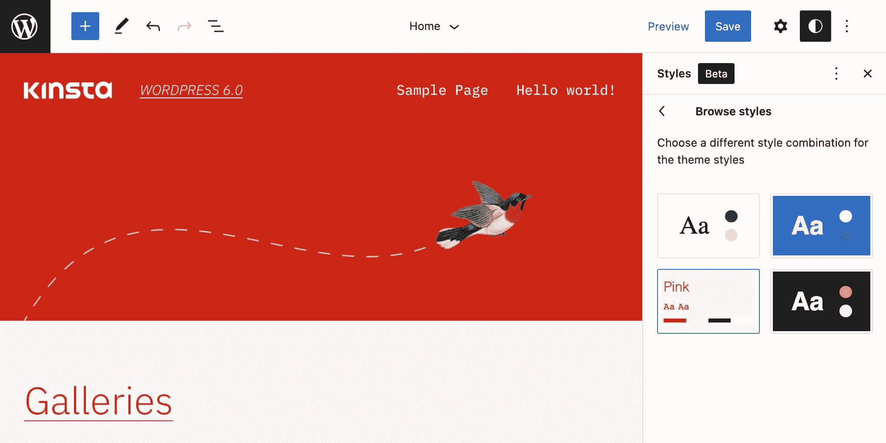

Browse styles in Twenty Twenty-Two.


## 到处都是方块图案

有一点是肯定的，block 模式在 WordPress 开发的当前阶段扮演着核心角色。随着时间的推移，block 模式得到了定期的改进。

此外，从 WordPress 5.9 开始，[模式目录](https://wordpress.org/patterns/)中的模式进入了我们的 WordPress 网站，从模式目录中被动态检索并且[被加载到插件](https://kinsta.com/blog/wordpress-5-9/#featured-patterns-from-the-pattern-directory)中。

现在，由于一种全新的在线工具，任何人都可以成为模式开发人员。[模式创建者](https://wordpress.org/news/2022/03/get-creative-with-the-all-new-pattern-creator/)允许你*建立、编辑和提交你最好的积木模式到模式目录*。你所需要的只是一个 WordPress.org 的[账户](https://kinsta.com/blog/wordpress-com-vs-wordpress-org/)。

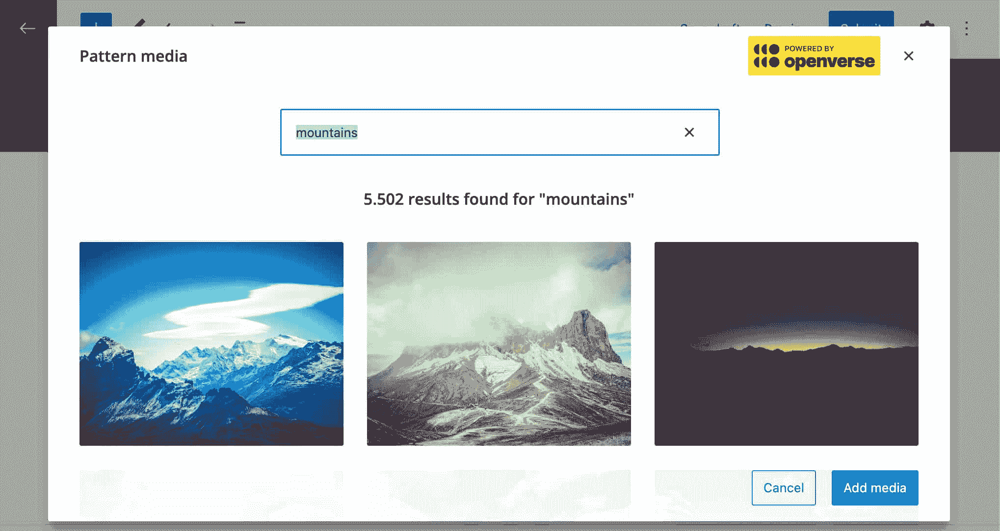

Searching for images in the Pattern Creator.


WordPress 6.0 引入了对 block 模式的进一步改进。

第一，[块模式在模板编辑中更容易找到](https://make.wordpress.org/core/2022/03/02/whats-new-in-gutenberg-12-7-2-march/#improving-the-patterns-experience)。现在[当你在模板的顶层访问快速插入器时，快速插入器只显示块模式](https://github.com/WordPress/gutenberg/issues/36697)，即当你要添加到模板的块是文档的直接后代时。

这是当下列条件满足时:

*   您正在编辑块样板
*   快速反相器位于根级别
*   您在其他块之间添加了一个块(即不是页面上的第一个也不是最后一个块)

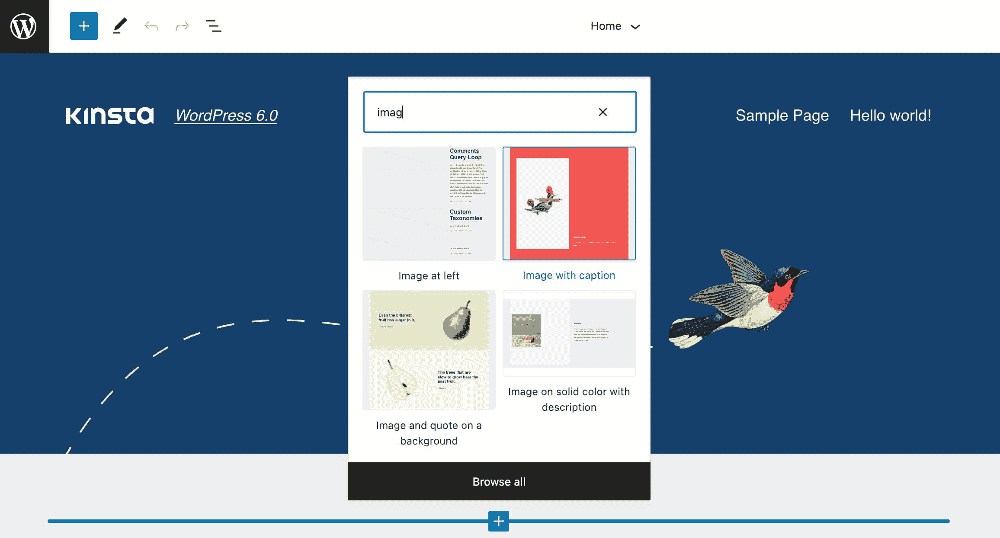

The quick inserter only shows block patterns in the template editor.


另一个有用的功能是让主题开发者[将推荐的模式](https://github.com/WordPress/gutenberg/blob/trunk/docs/how-to-guides/themes/theme-json.md#patterns)添加到 *theme.json* 中。试一试，搜索模式目录，找到你想推荐给你的主题用户的模式，然后从 URL 中抓取模式 slug 并添加到你的 *theme.json* 中，如下所示:

```
"patterns": [
	"image-with-angled-overlay-shape-call-to-action-button-and-description",
	"hero-section-with-overlap-image"
],
```

用户将在块插入器中找到您推荐的模式。

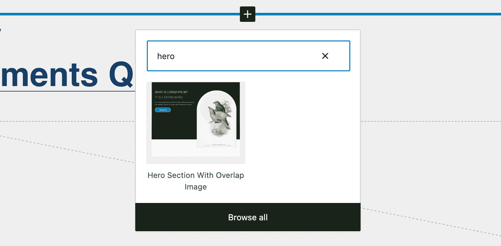

Recommended patterns in the quick inserter.


WordPress 6.0 的一个强大的模式相关特性是**隐式模式注册**。主题现在可以通过将模式**声明为主题根目录下新的`/patterns`目录下的 PHP 文件**来[隐式注册模式](https://github.com/WordPress/gutenberg/pull/36751)。

这个过程非常简单:

1.  在你的主题根目录下创建一个新的*模式*文件夹，
2.  在块编辑器中构建块组，
3.  将 HTML 复制并粘贴到一个新的文本文件中，
4.  在前面加上以下标题，
5.  并将该文件作为 PHP 保存在您的 *patterns* 文件夹中。

```
<?php
/**
 * Title: My pattern
 * Slug: my-theme/my-pattern
 * Categories: text
 */
?>
```

仅此而已。您现在有一个新的块模式显示在块插入器中。

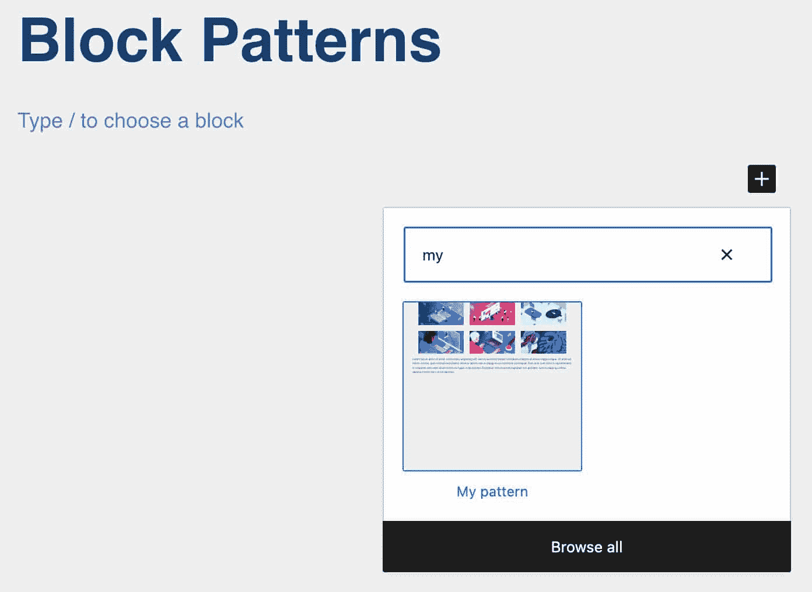

A custom pattern in the quick block inserter.


页面创建模式是 WordPress 6.0 引入的另一个块模式相关的特性。现在，当您创建一个新页面时，页面创建屏幕会显示一个模式，提供一组块模式，您可以从中选择来创建您的页面。

只有当至少一个模式声明支持`core/post-content`块类型时，才会显示模态。

开箱即用，WordPress 6.0 不包括任何这些模式，所以模态不会出现，除非你添加对现有模式的支持。但是将模态添加到页面创建屏幕非常简单。

如果您为您的主题注册了一个 block 模式，如上面的例子所示，您可以使用`Block Types`属性添加对模式模态的支持，如下面的例子模式所示:

```
<?php
/**
 * Title: Pattern with columns
 * Slug: twentytwentytwo/pattern-with-columns
 * Block Types: core/post-content
 * Categories: text
 */
?>
<!-- wp:heading -->
<h2>Hello there!</h2>
<!-- /wp:heading -->

<!-- wp:columns -->
<div class="wp-block-columns"><!-- wp:column -->
<div class="wp-block-column"><!-- wp:image -->

<!-- /wp:image --></div>
<!-- /wp:column -->

<!-- wp:column -->
<div class="wp-block-column"><!-- wp:heading -->
<h2>Heading</h2>
<!-- /wp:heading -->

<!-- wp:paragraph -->
<p>Paragraph</p>
<!-- /wp:paragraph --></div>
<!-- /wp:column -->

<!-- wp:column -->
<div class="wp-block-column"><!-- wp:list -->
<ul><li>List item</li></ul>
<!-- /wp:list --></div>
<!-- /wp:column --></div>
<!-- /wp:columns -->
```

将这段代码保存在主题的`/patterns`目录下的一个 PHP 文件中。然后，在你的 WordPress 仪表盘上创建一个新页面。您应该会看到一个新的模态，如下图所示:

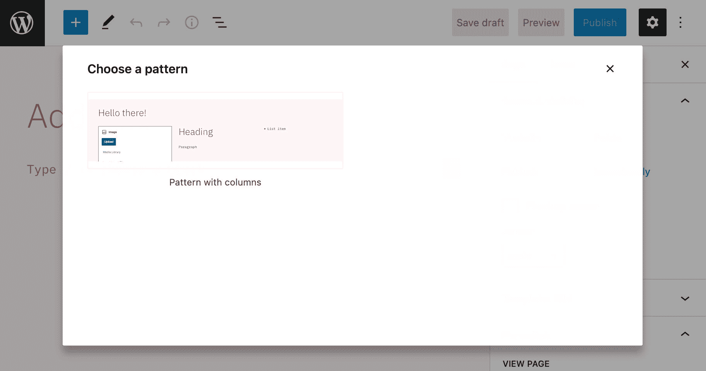

Page creation patterns


关于页面创建模式的更详细的视图，请参见 WordPress 6.0 中的[页面创建模式](https://make.wordpress.org/core/2022/05/03/page-creation-patterns-in-wordpress-6-0/)。

关于区块模式开发的更全面的概述，也可以参见 WordPress 6.0 中使用模式和主题的[新特性](https://make.wordpress.org/core/2022/05/02/new-features-for-working-with-patterns-and-themes-in-wordpress-6-0/)和 GitHub 上的[追踪问题](https://github.com/WordPress/gutenberg/issues/31153)。


## 网站编辑功能

WordPress 5.9 并没有终结整个网站编辑的发展。WordPress 6.0 通过改进视觉主题构建功能和为 block 主题提供新的模板选项将事情向前推进了一步。更多的功能即将推出。

### 视觉主题建筑

WordPress 6.0 引入了一个[改进的区块主题导出工具](https://make.wordpress.org/core/2022/05/02/theme-export-in-wordpress-6-0/)，它允许你[下载当前主题](https://make.wordpress.org/core/2022/03/30/whats-new-in-gutenberg-12-9-30-march/#highlight-4)以及你所有的修改和定制。

如果你到目前为止还没有使用过 block 主题导出工具，它是一个强大的站点编辑工具，允许你将你的样式和模板导出为一个完整的主题。

当你对你的改变感到满意时，从站点编辑器的界面，打开**选项**侧边栏，找到**工具**部分。这里有一个**导出**按钮，可以让你下载当前主题以及所有你定制的风格和模板到一个 zip 文件中。

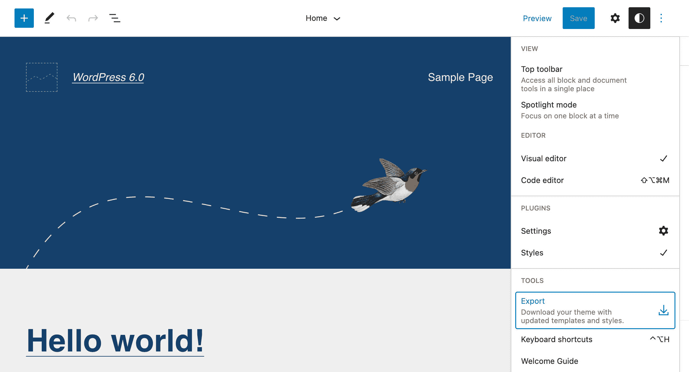

Export a theme from the editor’s interface.


然后你可以导出你的主题并安装在任何 WordPress 网站上。

我们在本地 WordPress 安装上测试了改进的主题导出工具，发现**几乎**一切都如我们所料…😅

反正导出工具还在开发中，今天只能窥见其巨大潜力。想想从你网站的编辑界面创建你的主题，并在任意数量的安装上分发它们的可能性。那就是你是否是一个开发者…

仍然有许多开放的问题需要解决，这使我们认为我们很快就会看到一些改进。如果你很好奇，想了解更多关于视觉主题构建的知识(就像我们一样)，你可以关注 GitHub 上的[追踪问题。](https://github.com/WordPress/gutenberg/issues/39189)

### 块主题中的更多模板选项

在以前的 WordPress 版本中，我们可用的模板类型数量有限。

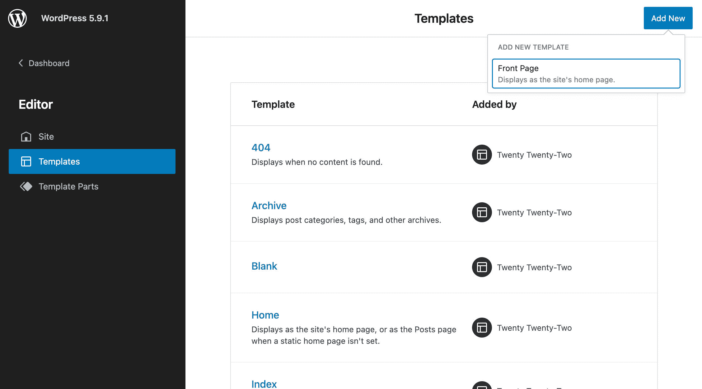

Adding a new template in WordPress 5.9.


现在，WordPress 6.0 引入了[几个新的模板类型](https://github.com/WordPress/gutenberg/pull/39353)，包括作者、类别、日期、标签、分类。

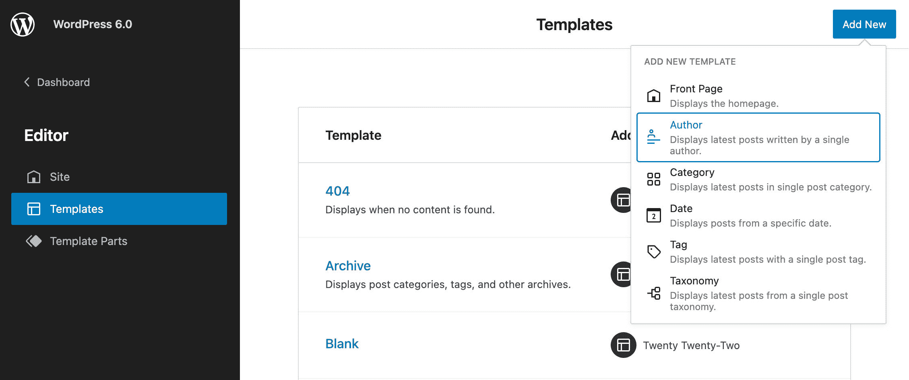

Adding a new template in WordPress 6.0.


这一增加应该会简化您的网站编辑工作流程。要尝试一下，只需从下拉列表中选择一个新模板，添加必要的块，保存您的更改，并检查它在前端的外观。是的，就像那样简单。现在，考虑一下上面提到的主题导出特性，你最好理解一下[我们对](https://github.com/WordPress/gutenberg/issues/37407)网站编辑的期望。

## 界面和可用性改进

WordPress 6.0 对用户界面做了很多改变，其中很多都是为了让侧边栏更有序。总的来说，这些变化应该会对整体编辑体验产生相当大的影响。这里我们将只提到其中的几个，但是你可以查看古腾堡发行说明以获得更全面的变更列表(参见古腾堡 [12.4](https://make.wordpress.org/core/2022/01/19/whats-new-in-gutenberg-12-4-19-january/) 、 [12.5](https://make.wordpress.org/core/2022/02/03/whats-new-in-gutenberg-12-5-february-2nd/) 、 [12.6](https://make.wordpress.org/core/2022/02/16/whats-new-in-gutenberg-12-6-16-february/) 、 [12.7](https://make.wordpress.org/core/2022/03/02/whats-new-in-gutenberg-12-7-2-march/) 、 [12.8](https://make.wordpress.org/core/2022/03/16/whats-new-in-gutenberg-12-8-16-march/) 、 [12.9](https://make.wordpress.org/core/2022/03/30/whats-new-in-gutenberg-12-9-30-march/) 、 [13.0](https://make.wordpress.org/core/2022/04/14/whats-new-in-gutenberg-13-0-14-april/) )。

### 列表视图改进

列表视图受到[大量改进组件可用性的变化](https://make.wordpress.org/core/2022/03/02/whats-new-in-gutenberg-12-7-2-march/#list-view-improvements)的影响。

#### 选择时展开列表视图

当您单击编辑器中的某个块时，该块会自动在列表视图中高亮显示。如果块嵌套在父块中，[父块展开](https://github.com/WordPress/gutenberg/pull/35817),显示块树中的项目。

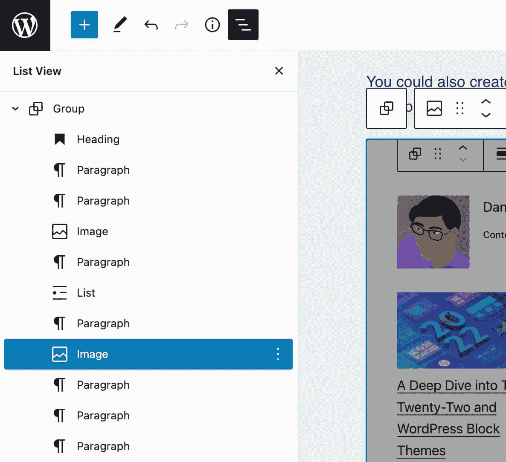

Expanded Group block in List View on block selection.


#### 默认情况下，列表视图是折叠的

在 WordPress 6.0 之前，当你打开列表视图面板时，它默认是展开的。

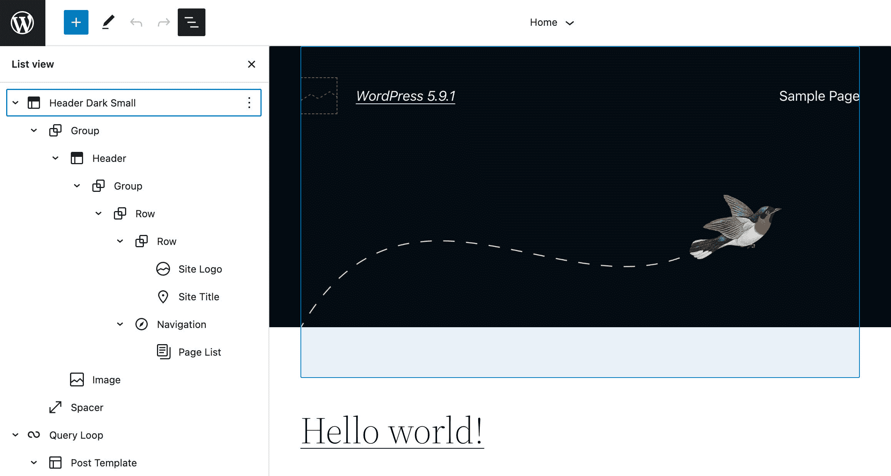

Default List View in WordPress 5.9.


但是由于帖子通常由复杂的嵌套块结构组成，所以在打开列表视图时让块树折叠起来非常有意义。

在 6.0 中，[列表视图在所有编辑器](https://github.com/WordPress/gutenberg/pull/39611)中默认是折叠的，使得块树一目了然。

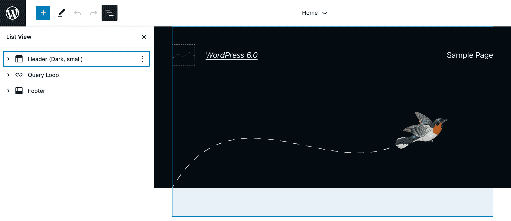

Default List View in WordPress 6.0.


#### 聚焦于列表视图按钮

当您打开列表视图面板时，现在焦点正确地[返回到列表视图按钮](https://github.com/WordPress/gutenberg/pull/37798)。当您从键盘上浏览列表视图时，这一点特别有用，可以带来更流畅、更无缝的编辑体验。

#### 多块选择和拖放

列表视图的另一个变化是允许你在同一级别选择多个块，然后[拖动&将它们](https://github.com/WordPress/gutenberg/pull/38314)放到列表中的另一个位置。

### 块样式预览

在 WordPress 6.0 之前，区块样式预览被放置在区块侧边栏中，占据了样式面板的相当一部分。

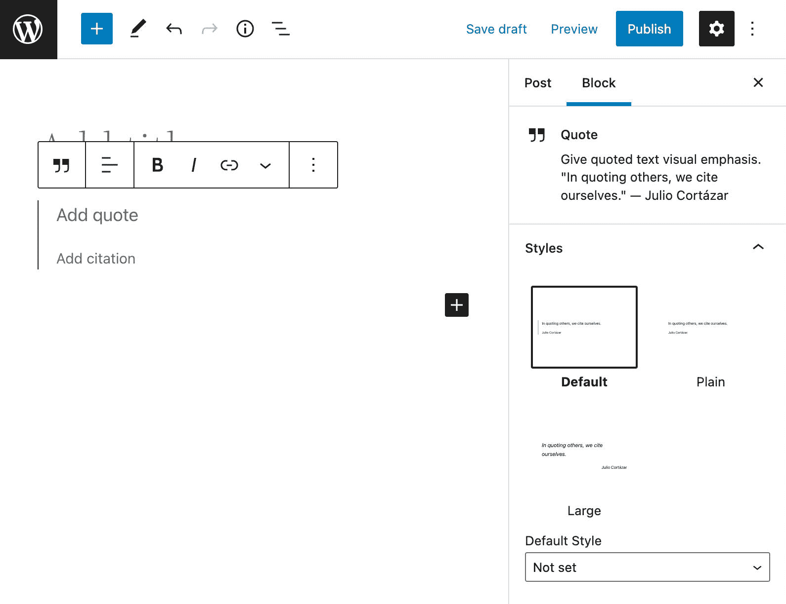

Block style preview in WordPress 5.9.


在 6.0 中，只有样式变体的名称出现在样式面板中，而当样式名称被悬停或获得焦点时，[样式预览显示在侧栏](https://make.wordpress.org/core/2021/11/29/whats-new-in-gutenberg-12-0-24-november/#block-styles-preview)之外。

这一变化减少了侧边栏的尺寸，应该使样式名称更加明显。

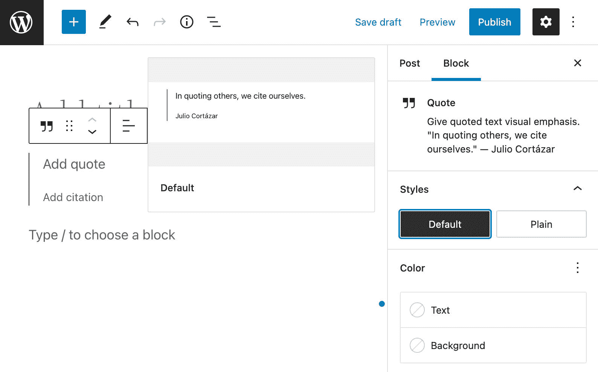

Block style preview in WordPress 6.0.


### 段落排版部分

为了在块侧边栏中排序，段落块[的首字下沉控件已经从其部分移动到排版部分。](https://make.wordpress.org/core/2021/11/29/whats-new-in-gutenberg-12-0-24-november/#paragraph-block-combined-typography-controls)

有了这个改变，所有的排版设置控件现在都被放在了同一个部分下[，带来了更加一致的用户体验。](https://github.com/WordPress/gutenberg/pull/36334)

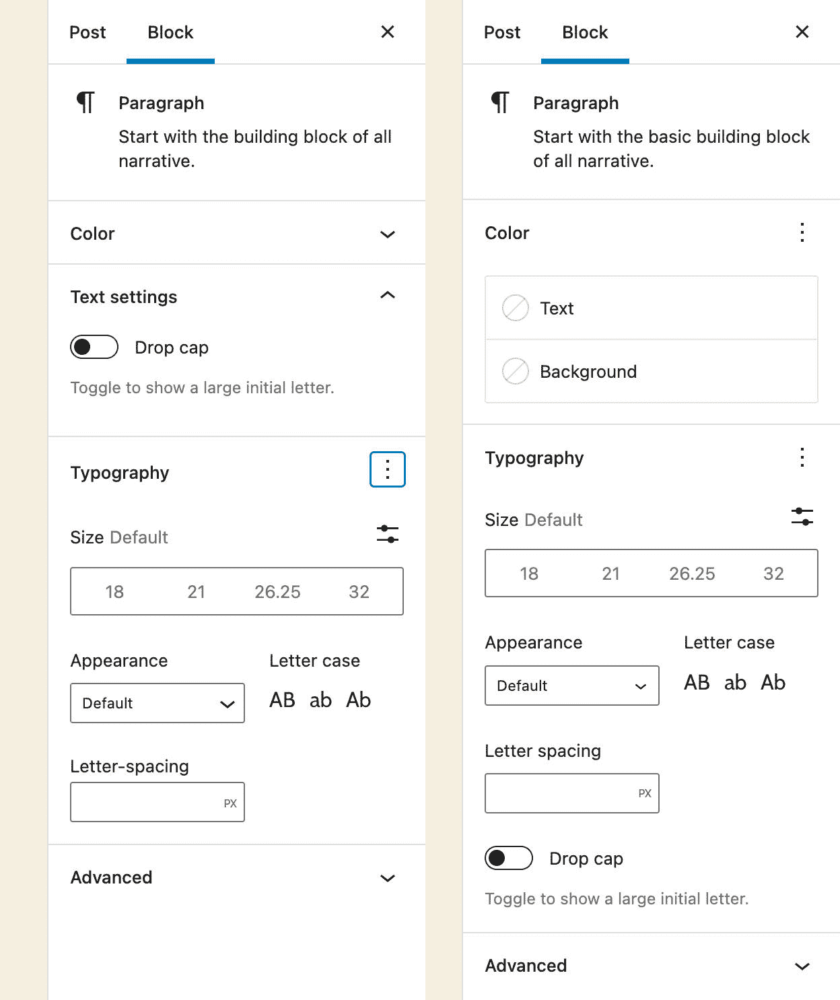

Typography settings in WordPress 5.9 vs. WordPress 6.0.


### 边框和颜色设置移到了工具面板下

为了在杂乱的设置侧边栏中建立秩序，[边框设置](https://make.wordpress.org/core/2021/12/22/whats-new-in-gutenberg-12-2-22-december/#a-new-home-for-border-controls)和[颜色设置](https://make.wordpress.org/core/2022/02/16/whats-new-in-gutenberg-12-6-16-february/#new-color-panel-and-updated-default-color-controls)控件被移到了[工具面板](https://developer.wordpress.org/block-editor/reference-guides/components/tools-panel/)中，并且可以在多种上下文中展开和折叠。

## 注册订阅时事通讯


### 想知道我们是怎么让流量增长超过 1000%的吗？

加入 20，000 多名获得我们每周时事通讯和内部消息的人的行列吧！

[Subscribe Now](#newsletter)

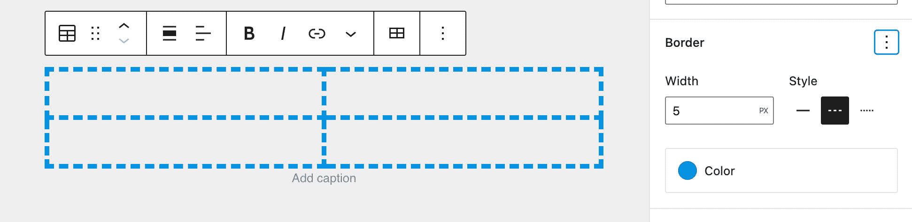

The new Border settings panel.


这一改变应该可以简化几个块的编辑体验，并使侧边栏更加一致。

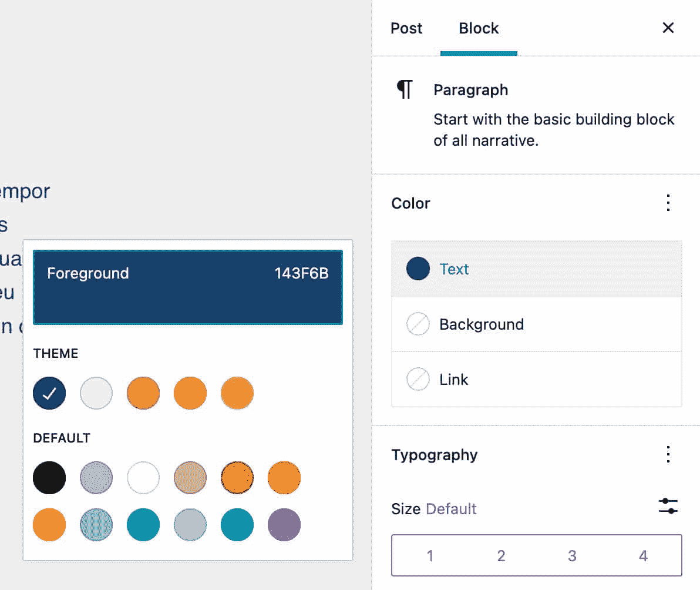

The Color panel in WordPress 6.0.


### 发布后面板类别提醒

当你匆忙或定期发布大量博客文章时，你很容易忘记标签或类别。如果您经常遇到这种情况，您会发现出现在“发布后”面板中的标签提醒非常有用。

现在，为了帮助网站管理员和作者确保他们的帖子被分配了必要的类别，WordPress 6.0 的中有了一个新的**建议:当一个类别还没有被添加到帖子中时，分配类别**面板会出现在帖子发布面板中。

下图比较了 WordPress 5.9 和 6.0 中的发布面板。

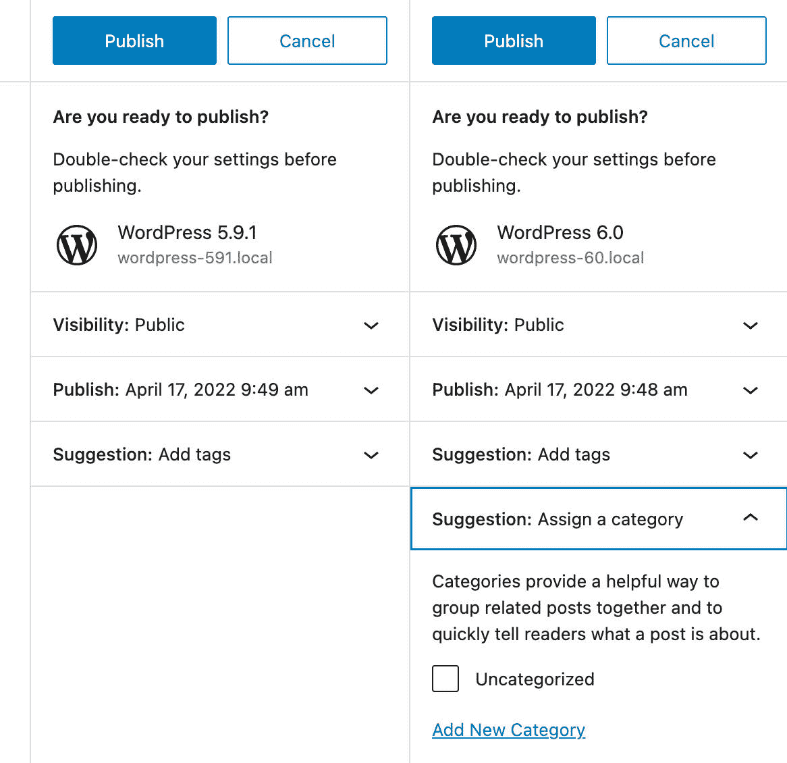

Post Publish panel in WordPress 5.9 vs. 6.0.


### 添加到站点编辑器的代码编辑器

从 WordPress 6.0 开始，代码编辑器现在也可以在站点编辑器中使用了。与[文章编辑器](https://kinsta.com/blog/gutenberg-wordpress-editor/)一样，您可以在选项菜单下找到代码编辑器。

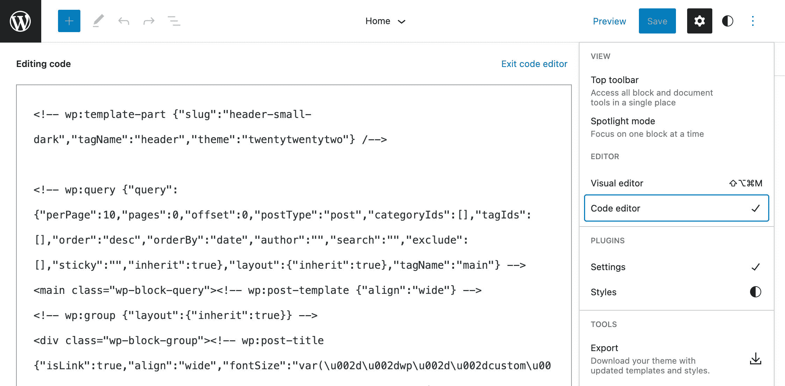

WordPress 6.0 adds the Code Editor to the Site Editor.


### 阻止锁定用户界面

更多设置下拉菜单中的一个新的**锁**项会打开一个弹出窗口，您可以在其中阻止用户移动或删除块(或两者)。

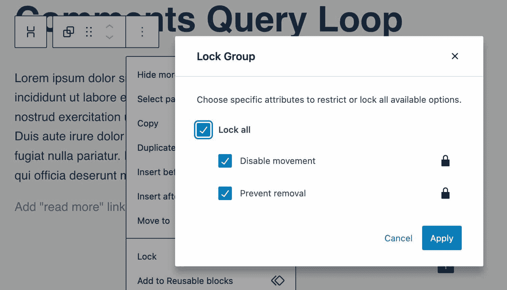

Locking a group of blocks.


这在模板编辑和可重用块中特别有用，在这些情况下，您还可以限制块编辑。

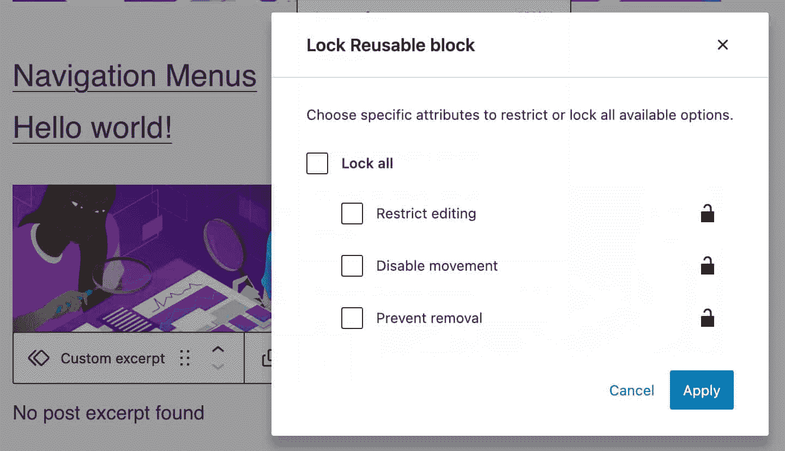

Locking a reusable Group block.


可以使用新的`canLockBlocks`设置以编程方式禁用新功能。

以下代码仅对具有编辑者角色或更高角色的用户启用块锁定功能:

```
add_filter(
	'block_editor_settings_all',
	function( $settings, $context ) {

		$settings['canLockBlocks'] = current_user_can( 'delete_others_posts' );

		return $settings;
	},
	10,
	2
);
```

开发人员还可以使用`lock`属性隐藏特定块类型上的块锁定 UI:

```
{
	"apiVersion": 2,
	"supports": {
		"lock": false
	}
}
```

你可以在 WordPress 6.0 的[块锁定设置中阅读更多关于块锁定的内容。](https://make.wordpress.org/core/2022/05/05/block-locking-settings-in-wordpress-6-0/)

### 多重选择

现在可以跨多个区块选择文本。

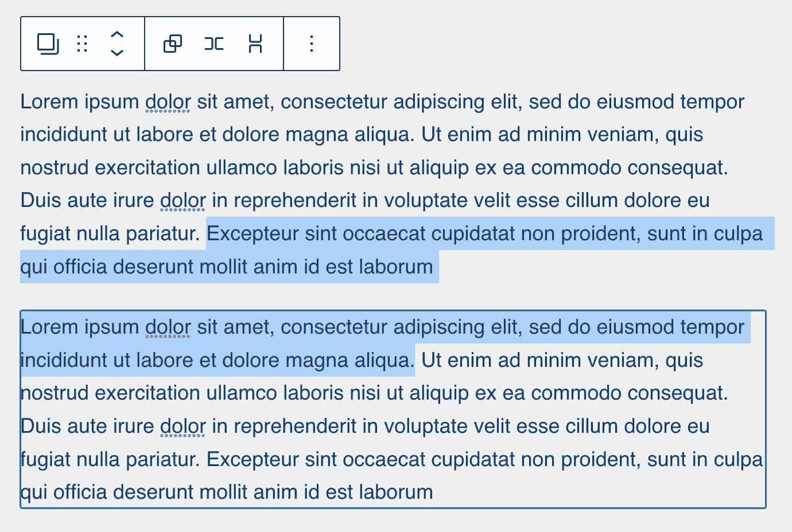

Selecting text across two paragraphs.


### 风格保持

当你[变换块](https://make.wordpress.org/core/2022/02/16/whats-new-in-gutenberg-12-6-16-february/#keeping-styles-when-transforming-blocks)或者创建新的按钮时，几个样式现在被保持。

下图显示了具有不同样式的列表块。

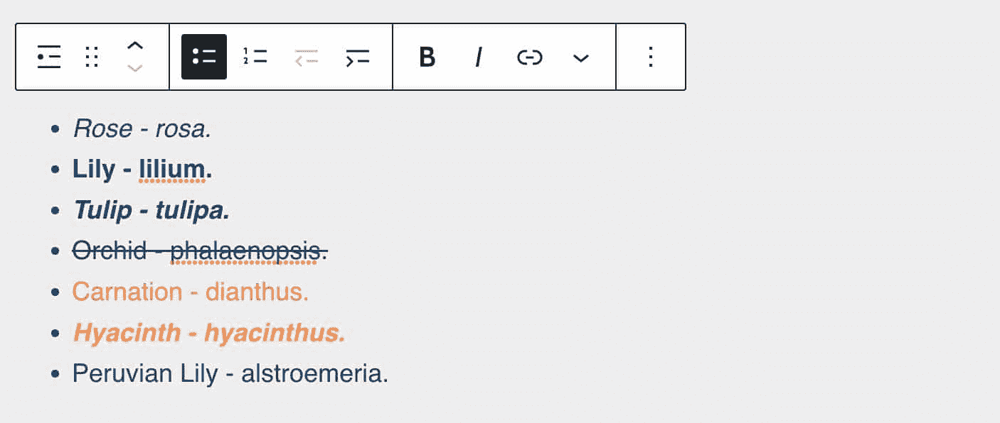

A List block with different styles applied.


当您将列表块转换为段落时，新的块将保留与以前的列表项相同的样式。

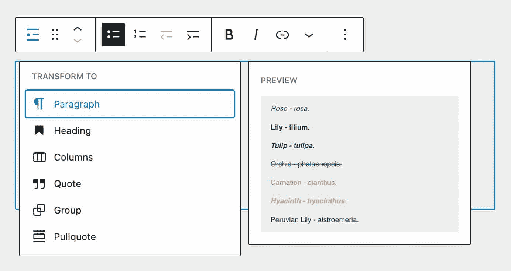

Transforming a list into paragraphs.


同样的增强也适用于添加到按钮块的[新按钮，现在](https://make.wordpress.org/core/2022/02/03/whats-new-in-gutenberg-12-5-february-2nd/#preserve-styling-from-adjacent-buttons-when-inserting-a-new-one)[继承了相邻按钮](https://github.com/WordPress/gutenberg/pull/37905)的样式。

## 新核心模块

核心模块的数量不断增加。如果你想知道当前可用的核心模块是什么，现在有一个[手册页](https://developer.wordpress.org/block-editor/reference-guides/core-blocks/)提供了古腾堡插件中包含的核心模块的完整列表。对于每一个块，都提供了名称、类别、支持和属性，以及一个有用的链接，链接到[块开发者](https://kinsta.com/blog/gutenberg-blocks/)会喜欢的源代码。

WordPress 6.0 将提供更多的区块。在这里找到你可能期待的下一个版本。

### 注释查询循环

与查询循环块类似，一个新的**评论查询循环**块[显示帖子评论](https://github.com/WordPress/gutenberg/pull/35231)。这是一个高级块，包括几个内部块，您可以分别编辑和配置。

Struggling with downtime and WordPress problems? Kinsta is the hosting solution designed to save you time! [Check out our features](https://kinsta.com/features/)

如下图所示，您可以选择注释查询循环块中包含的任何块，根据自己的喜好自定义其外观。你也可以添加更多的块或者移动或移除现有的块([源代码](https://github.com/WordPress/gutenberg/tree/trunk/packages/block-library/src/comments-query-loop))。

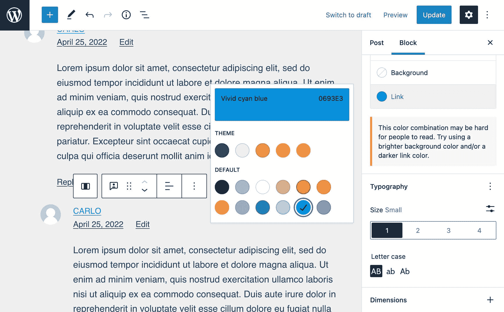

Configuring the Comments Query Loop block.


### 阅读更多

一个新的可定制的 **Read More** 块[允许你定制](https://github.com/WordPress/gutenberg/pull/37649)Read More 按钮的不同方面:边框、颜色、边角、排版等等([源代码](https://github.com/WordPress/gutenberg/tree/trunk/packages/block-library/src/read-more))。

这是一个很好的补充，因为它允许您在摘录块的上下文之外添加和定制 Read More 链接。

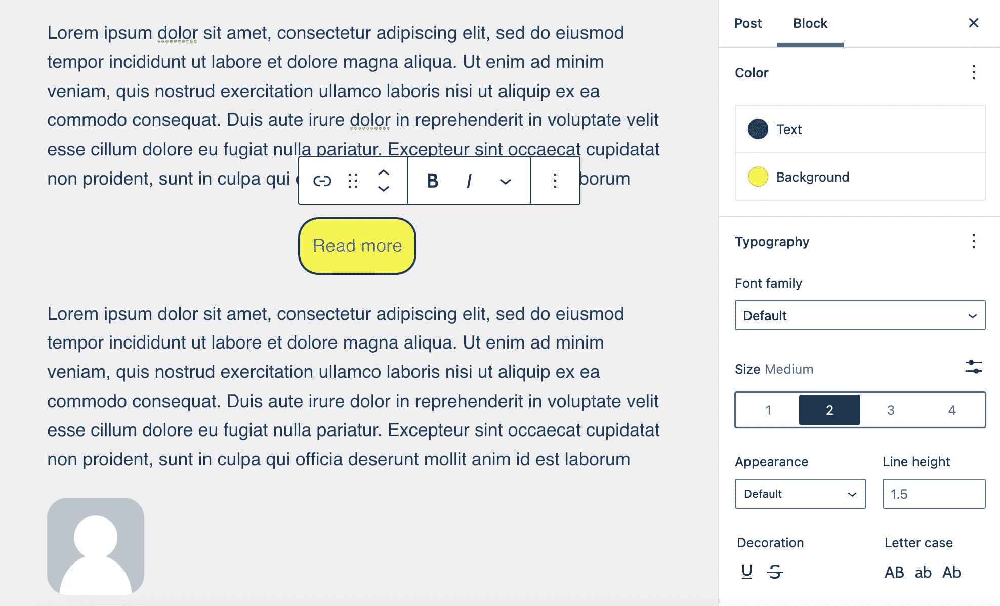

The new Read More block.


### 查询循环中没有结果

**No Results** 块是一个块容器，您可以在其中添加任何文本或块，以便在查询没有结果时显示。要将无结果块添加到查询循环中，只需选择查询循环并单击右下角的加号图标即可启动快速插入器。然后搜索没有结果。该块在查询循环之外不可用([源代码](https://github.com/WordPress/gutenberg/tree/trunk/packages/block-library/src/query-no-results))。


Adding the No Result block to the Query Loop.


### 头像和后作者传记

WordPress 6.0 还引入了新的块类型，将作者块分割成组件，并在内容中单独使用。

[帖子作者简介](https://make.wordpress.org/core/2022/02/16/whats-new-in-gutenberg-12-6-16-february/#new-post-author-biography-and-read-more-blocks)块提供了作者的[描述](https://github.com/WordPress/gutenberg/pull/38269) ( [源代码](https://github.com/WordPress/gutenberg/tree/trunk/packages/block-library/src/post-author-biography))。

[头像块](https://github.com/WordPress/gutenberg/pull/38591)只是显示一个用户的头像，允许你在网站作者之间进行选择([源代码](https://github.com/WordPress/gutenberg/tree/trunk/packages/block-library/src/avatar))。

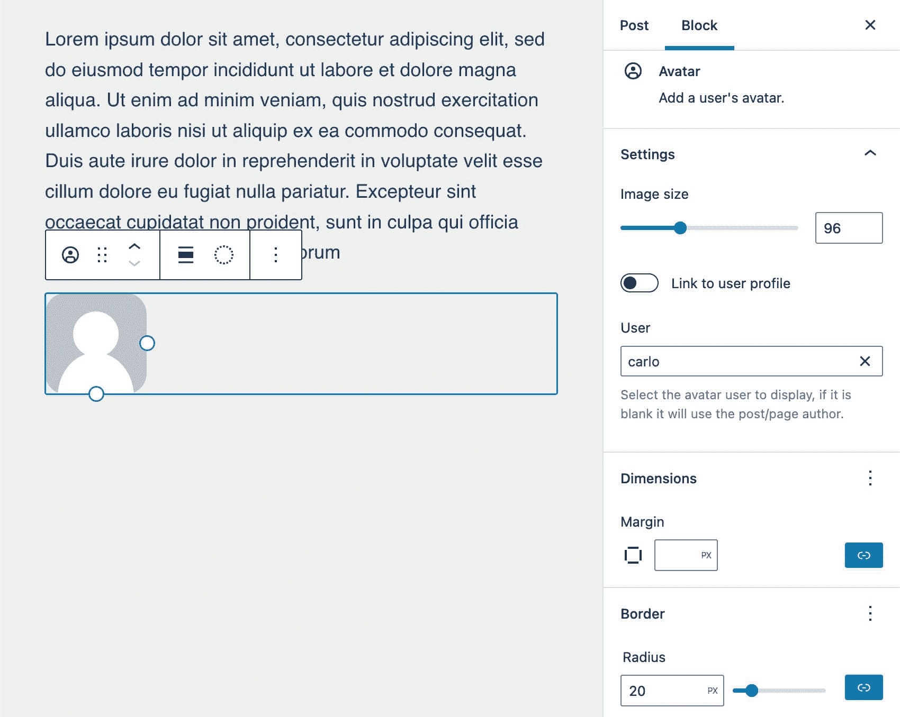

The Avatar block in WordPress 6.0.


这个块对于在作者信息块或评论的上下文之外显示作者的头像特别有用。例如，您可以在所有作者专用的页面上使用它，或者在显示用户/读者评论的页面上使用它。


## 现有街区的改进

WordPress 6.0 还引入了一些对现有模块的改变和增强，这可能会对你的编辑工作流程产生很大的影响。导航块将受到几个变化的影响，但你也会看到其他块的改进，包括查询循环、特色图像、组和社交图标。

### 导航块改进

在过去的几个月里，导航块得到了一些改进，现在有了一个更容易使用的界面。

首先，一个丰富的预览被添加到导航链接块中。当您添加指向公共可访问资源的链接时，单击块工具栏中的链接按钮会显示该资源的预览图像。

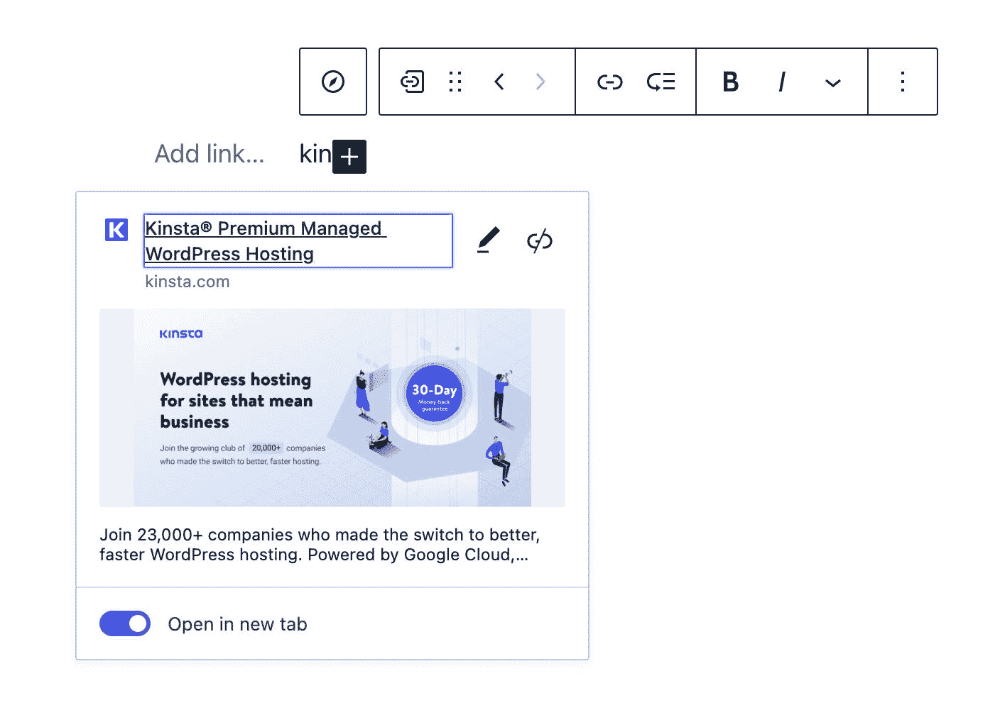

Rich preview for Navigation Links.


一些额外的更改会影响整体编辑体验。

现在，当您添加一个新菜单，并且只有一个导航菜单存在时，那么[默认为唯一可用的菜单](https://github.com/WordPress/gutenberg/pull/39880)。如果您只有一个导航菜单，此更改应该会加快您的编辑工作流程。

导航链接已经有一个描述字段，用户可以在其中输入描述其导航链接的文本。然而，在以前的 WordPress 版本中，主题不支持这个功能。

现在，在 WordPress 6.0 中，一个`<span class="wp-block-navigation-item__description">`出现在链接的标签之后。

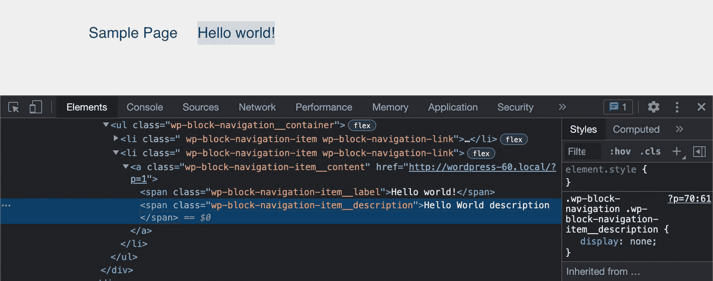

The Navigation Link description appears after the link’s label.


在 Twenty Twenty 2 中，`.wp-block-navigation-item__description`元素通过 CSS 隐藏，但是主题可以添加一个`display: block`属性来显示链接描述。

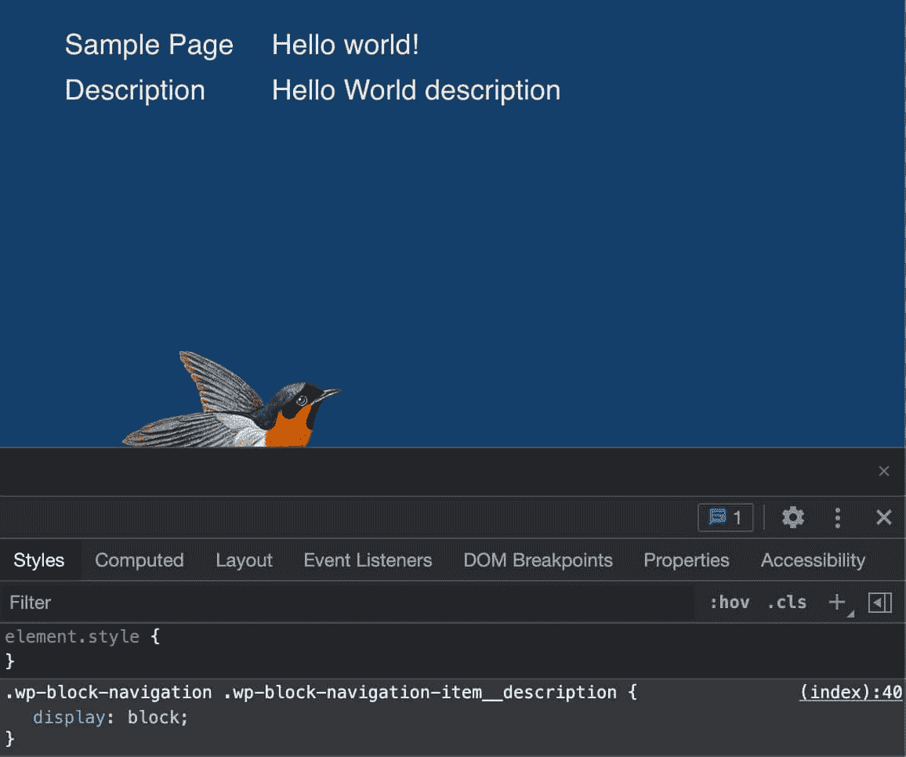

Navigation Link description in WordPress 6.0 and Twenty Twenty-Two.


### 查询循环过滤器和特色图片

[查询循环](https://make.wordpress.org/core/2022/02/03/whats-new-in-gutenberg-12-5-february-2nd/#query-loop-custom-taxonomies-filtering-and-more)过滤器设置部分现在显示定制分类法的输入字段。这使得用户可以通过为所选文章类型注册的一个或多个[自定义分类](https://github.com/WordPress/gutenberg/pull/38063)来过滤当前文章类型。

现在也可以通过[多个作者](https://github.com/WordPress/gutenberg/pull/38024)过滤帖子，而在以前的版本中，你只能从下拉列表中选择一个作者。

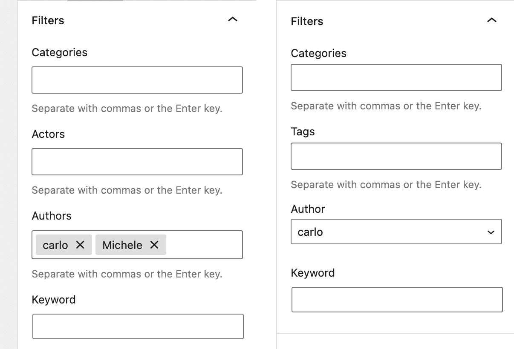

Query Loop filter settings in WordPress 6.0.


此外，您现在还可以在查询循环块中设置特色图像尺寸[。](https://github.com/WordPress/gutenberg/pull/37945)

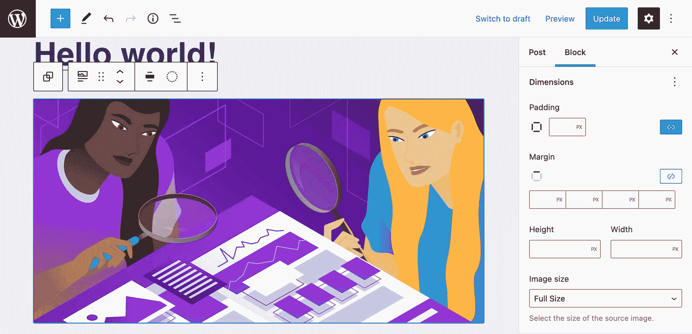

Controlling Featured Image dimensions in a Query Loop block.


### 响应组块中的版式和边框支持

组和行块现在[支持排版设置](https://make.wordpress.org/core/2022/01/05/whats-new-in-gutenberg-12-3-5-january/#group-block-gap-support-typography-support)。这一改变允许用户一次将相同的[排版设置应用于一整组](https://github.com/WordPress/gutenberg/pull/37456)块，在格式化包含几个嵌套块的组时节省了几次点击。

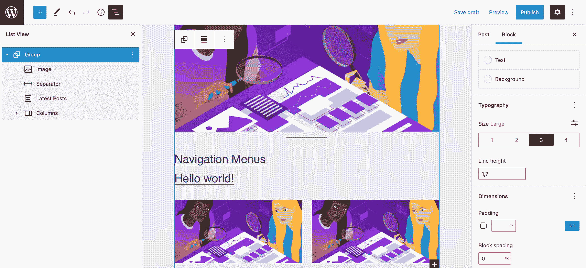

Typography settings for a Group block.


分组块得到了进一步的改进，现在你只需点击一下鼠标就可以轻松地[将块分组到堆栈或行](https://make.wordpress.org/core/2022/04/14/whats-new-in-gutenberg-13-0-14-april/#highlight-3)中。

只需选择您想要分组的块，并在块工具栏的中选择[个可用控件之一:**分组**、**行**、**堆栈**。](https://github.com/WordPress/gutenberg/pull/39920)

一旦你将区块分组，设置侧边栏中的一个新面板会显示分组[变化描述](https://github.com/WordPress/gutenberg/pull/40176)，让你点击几下就能[切换变化](https://github.com/WordPress/gutenberg/pull/40036)。

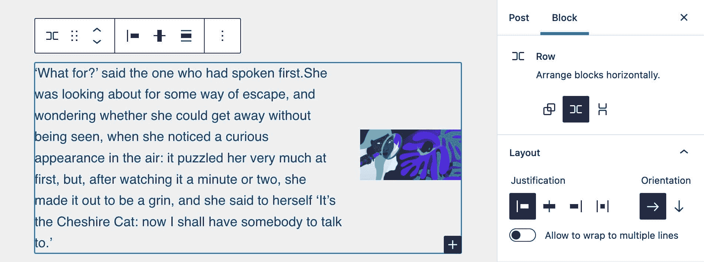

A Row block shows blocks horizontally.


WordPress 6.0 还引入了对分组块的[边距支持，使用户能够](https://make.wordpress.org/core/2022/03/02/whats-new-in-gutenberg-12-7-2-march/#other-notable-highlights)[分别控制上下边距](https://github.com/WordPress/gutenberg/pull/37344)。

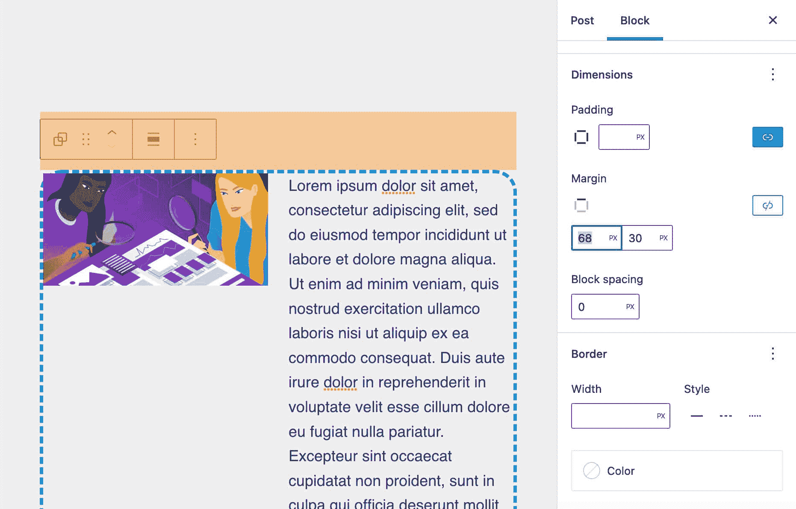

Controlling margins with a Group block.


### 封面中的特色图片

现在你可以在封面块中使用[特色图片，就像在 WordPress 6.0 中一样，一个**使用特色图片**开关被添加到了封面块工具栏中。由于这一新的控制，您可以从当前图像切换到特色图像，只需点击一下。](https://make.wordpress.org/core/2022/04/14/whats-new-in-gutenberg-13-0-14-april/#highlight-2)

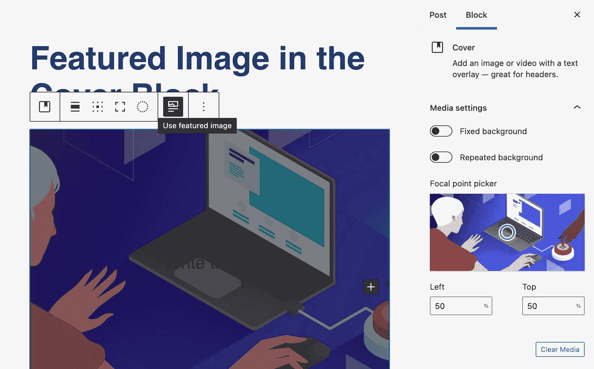

Use featured image with a Cover block.


### 显示/隐藏社交图标中的标签

对**社交图标**块的一个小而有用的增强现在可以让用户[打开/关闭图标链接标签](https://github.com/WordPress/gutenberg/pull/38152)。

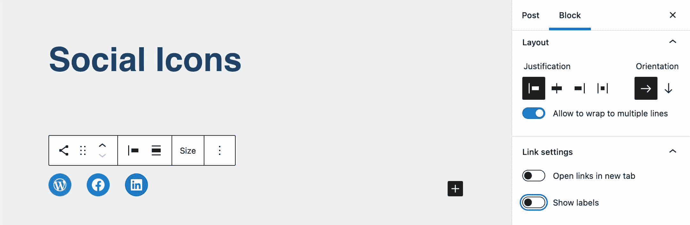

A Show label control allows to toggle on/off labels in Social Icons.


启用此选项时，您可以显示默认服务名称或单独为您的图标设置自定义标签。

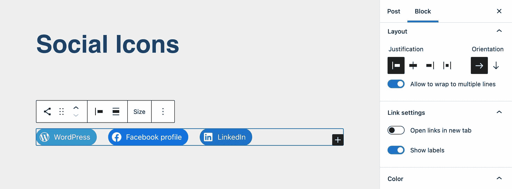

Show label turned on.


### 其他块增强功能

即将到来的 WordPress 版本也为许多其他模块带来了大量的增强。

例如，现在你可以[控制列块的边界](https://github.com/WordPress/gutenberg/pull/31737)(古腾堡 [12.7](https://make.wordpress.org/core/2022/03/02/whats-new-in-gutenberg-12-7-2-march/#other-notable-highlights) )。

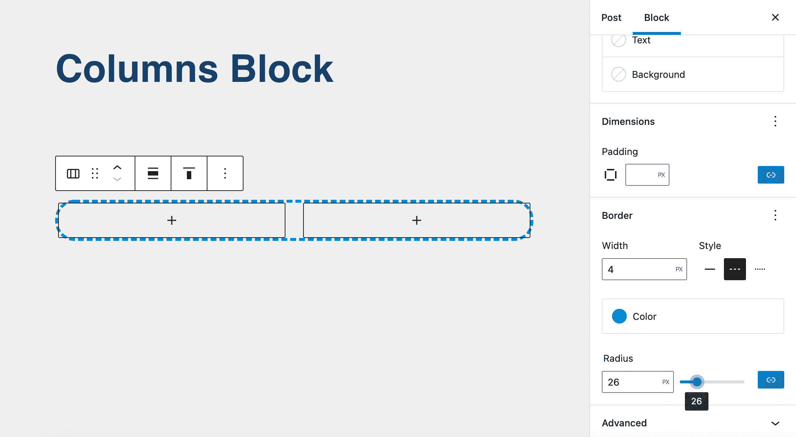

Border controls for the Columns block.


另一个有用的 UX 改进允许你使用简单的`[[`键盘触发器[插入内部链接](https://make.wordpress.org/core/2022/03/16/whats-new-in-gutenberg-12-8-16-march/#highlight-2)。

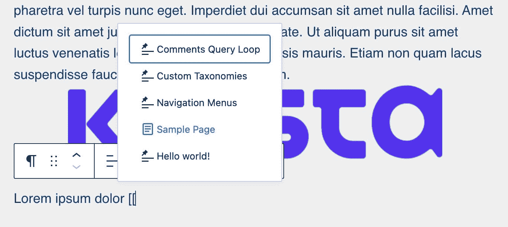

Adding internal links in WordPress 6.0 is easier.


由于新的**块间距**控件，现在更容易控制画廊块中图像周围的空间。

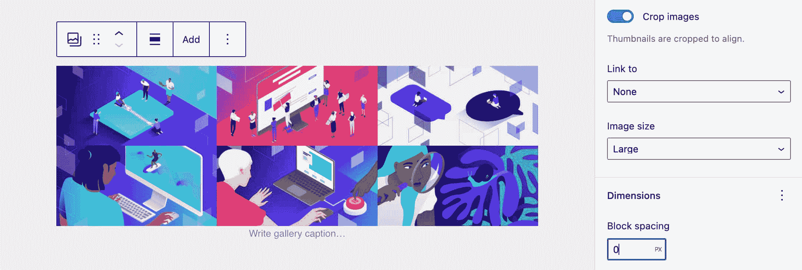

Images without block spacing.


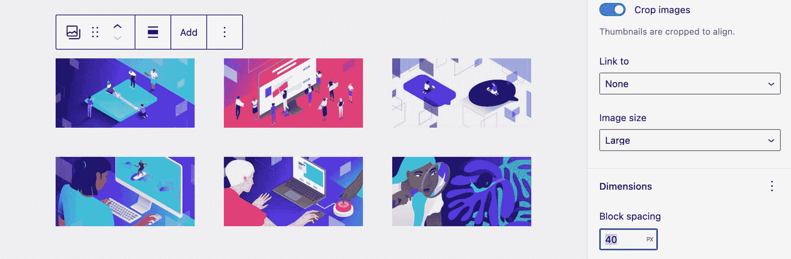

Images with block spacing.


## 开发人员的变化和性能改进

WordPress 6.0 还为开发者增加了许多功能。

*   一个新的`wp_content_img_tag`过滤器允许在一团 HTML 内容中调整图像(见[在 WordPress 6.0 中修改内容图像的新过滤器](https://make.wordpress.org/core/2022/04/27/new-filter-to-modify-content-images-in-wordpress-6-0/))。
*   当`do_parse_request`过滤器返回 false 时，`parse_request`方法已经改变以减少查询的数量(参见[在 WordPress 6.0 中对 do_parse_request 过滤器的改变](https://make.wordpress.org/core/2022/04/27/changes-to-do_parse_request-filter-in-wordpress-6-0/))。
*   现在你可以从一个主题内注册块(见[从主题内注册块](https://make.wordpress.org/core/2022/05/03/block-editor-miscellaneous-dev-notes-for-wordpress-6-0/#blocks-in-themes))。
*   一个新的`ancestor`属性使得一个块只在指定的块类型中可用(参见 block.json 中的[新祖先属性)。](https://make.wordpress.org/core/2022/05/03/block-editor-miscellaneous-dev-notes-for-wordpress-6-0/#ancestor)

新版本还提升了性能，对 [WordPress 缓存 API](https://make.wordpress.org/core/2022/04/29/caching-improvements-in-wordpress-6-0/) 进行了一些添加，对[分类术语查询](https://make.wordpress.org/core/2022/04/28/taxonomy-performance-improvements-in-wordpress-6-0/)进行了性能改进，对[拥有大量用户的单个网站进行了进一步的性能改进](https://make.wordpress.org/core/2022/05/02/performance-increase-for-sites-with-large-user-counts-now-also-available-on-single-site/)。

这就是我们对 WordPress 网站升级到 6.0 后的新功能和变化的总结。

但是这些只是 WordPress 6.0 带来的一些改进。要获得完整的列表，请查看 Gutenberg 的发布说明和 WordPress 6.0 领域指南。

[Do you already know the new features coming with WordPress 6.0? No... ? 🙀 Then don't miss this in-depth overview of WordPress 6.0 🎉Click to Tweet](https://twitter.com/intent/tweet?url=https%3A%2F%2Fkinsta.com%2Fblog%2Fwordpress-6-0%2F&via=kinsta&text=Do+you+already+know+the+new+features+coming+with+WordPress+6.0%3F+No...+%3F+%F0%9F%99%80+Then+don%27t+miss+this+in-depth+overview+of+WordPress+6.0+%F0%9F%8E%89&hashtags=WordPress%2CWPTips)


### 如何在本地开发环境中安装 WordPress 6.0

如果你想在正式发布前试用 WordPress 的开发版本，请遵循以下步骤:

1.  打开 DevKinsta 并创建一个新的本地 WordPress 网站
2.  完成后，打开你的 WordPress 仪表盘，导航到**插件→添加新插件**
3.  搜索并安装 **WordPress Beta Tester** 插件
4.  激活插件，进入**工具→ Beta 测试**
5.  在 WP Beta 测试器设置选项卡中，选择**出血边缘**选项并保存设置
6.  回到你的 WordPress 仪表盘，打开**更新**屏幕，更新到最新的夜间版本

仅此而已！现在你有了一个本地 WordPress 开发安装，你可以自由地运行你所有的测试了。四处看看，让我们知道你对新功能的看法。

有了 DevKinsta，只需要点击几下鼠标就可以在你的本地机器上拥有一个现代的 WordPress 开发环境。🖥

在这里免费下载 DevKinsta！👈


## 摘要

如上所述，我们现在可以说我们正处于古腾堡开发的第二阶段，即**定制阶段**。

完整的站点编辑现在是 WordPress 核心和 6.0 的一部分，接下来的版本将会进一步改进我们已经拥有的和现在可以使用的。

所有这些都将对 WordPress 生态系统和整个网络产生巨大的影响，同时考虑到，在撰写本文时，

> 据我们所知，有 64.2%的网站使用 WordPress 的内容管理系统。这是所有网站的 43.0%。(来源 [W3Techs](https://w3techs.com/technologies/details/cm-wordpress) )

我们暂时就此打住。WordPress 6.0 的特性和改进不可能在一篇文章中全部列出，但是希望我们至少强调了对我们日常使用 WordPress 的方式有最大影响的新增内容。

现在我们想以一些问题来结束这篇文章，以供读者参考！


你已经在用 FSE 建立你的网站了吗？你认为新的编辑器是一个适合建立专业网站的工具，还是你认为它仍然需要改进才能用于商业？你已经测试了 WordPress 的新特性了吗？


请在下面的评论区与社区分享您的想法。👇

* * *

让你所有的[应用程序](https://kinsta.com/application-hosting/)、[数据库](https://kinsta.com/database-hosting/)和 [WordPress 网站](https://kinsta.com/wordpress-hosting/)在线并在一个屋檐下。我们功能丰富的高性能云平台包括:

*   在 MyKinsta 仪表盘中轻松设置和管理
*   24/7 专家支持
*   最好的谷歌云平台硬件和网络，由 Kubernetes 提供最大的可扩展性
*   面向速度和安全性的企业级 Cloudflare 集成
*   全球受众覆盖全球多达 35 个数据中心和 275 多个 pop

在第一个月使用托管的[应用程序或托管](https://kinsta.com/application-hosting/)的[数据库，您可以享受 20 美元的优惠，亲自测试一下。探索我们的](https://kinsta.com/database-hosting/)[计划](https://kinsta.com/plans/)或[与销售人员交谈](https://kinsta.com/contact-us/)以找到最适合您的方式。