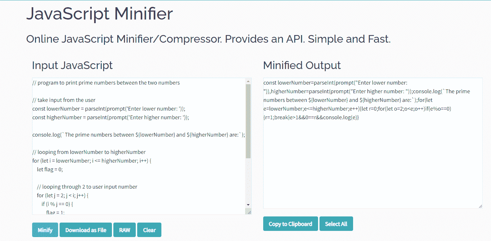
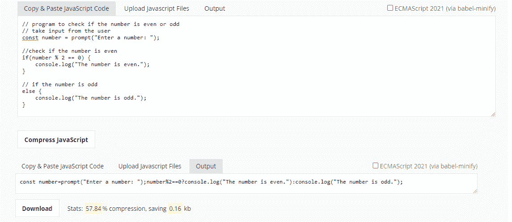
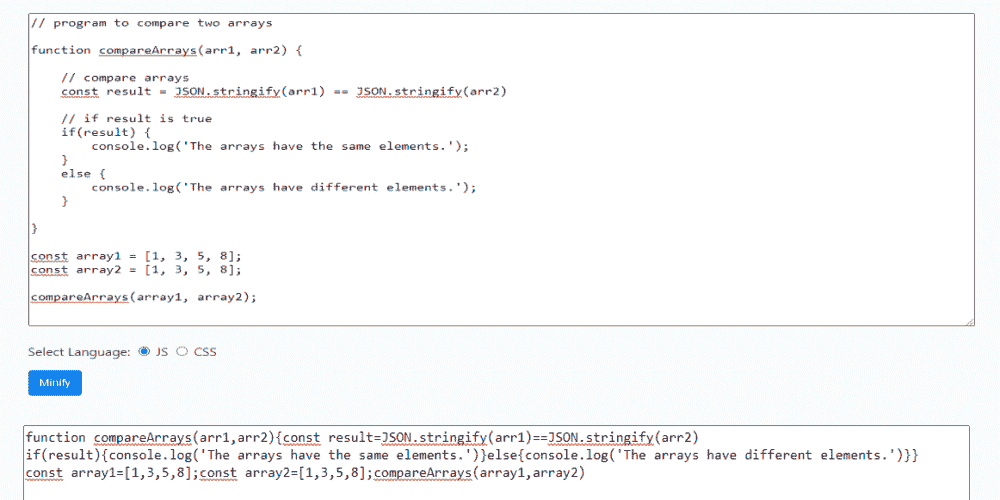
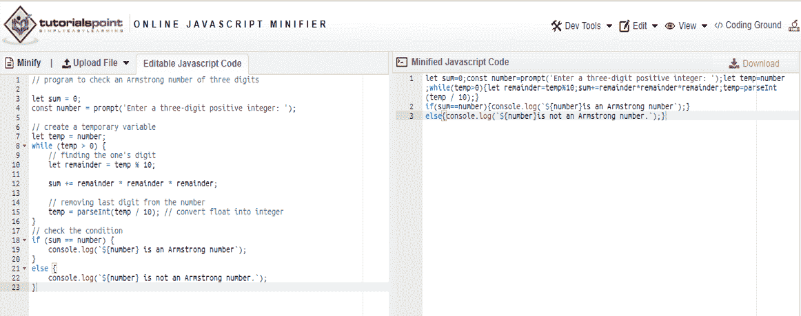
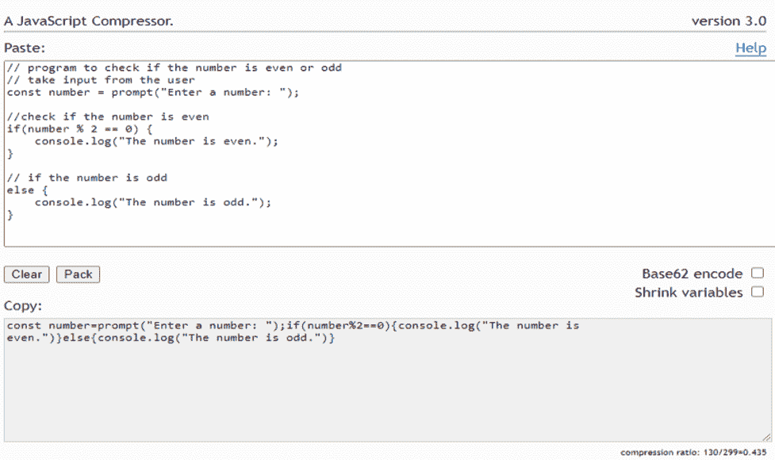
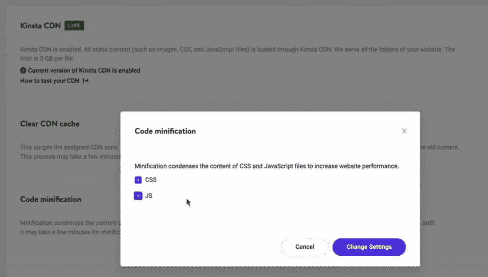
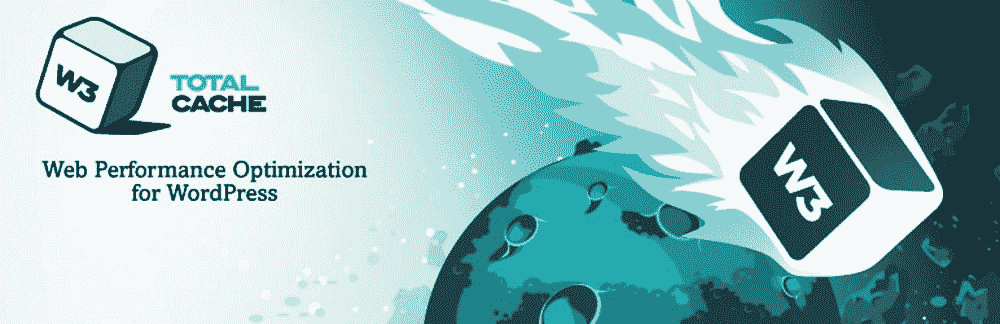

# 如何缩小 JavaScript——推荐的工具和方法

> 原文：<https://kinsta.com/blog/minify-javascript/>

大多数用户都渴望优雅的 web 浏览体验，JavaScript 一直是开发人员提供这种高级体验的最爱。

然而，JavaScript 不仅仅是为了让网站看起来更好。它也直接影响网站的表现和成功。加快网站速度或减少页面加载时间——这是 JavaScript 开发的两个核心概念——是改善用户体验的关键因素。

### 查看我们的[视频指南来缩小 JavaScript](https://www.youtube.com/watch?v=YtjCteFJbrc)


如果你想在最短的时间内提高你的网站的性能，你需要熟悉 JavaScript minification。它将帮助您从 JavaScript 源代码中排除所有不必要的字符，而不会改变其功能。更重要的是，它将减少你的网站的加载时间和带宽的使用。

JavaScript 缩小可能很棘手。在本文中，我们将绘制一个教程来帮助你为 WordPress 和非 WordPress 网站精简 JavaScript 代码。

 

## JavaScript 是什么？

[](https://kinsta.com/wp-content/uploads/2022/01/what-is-javascript.png)

JavaScript (Image Source: [Medium](https://medium.com/))


JavaScript 是一种面向文本的脚本语言，用于在客户端和服务器端创建交互式网站。这是一种比大多数语言更简单、更容易学习的语言，这也解释了它被广泛使用的原因。


> 需要在这里大声喊出来。Kinsta 太神奇了，我用它做我的个人网站。支持是迅速和杰出的，他们的服务器是 WordPress 最快的。
> 
> <footer class="wp-block-kinsta-client-quote__footer">
> 
> 
> 
> <cite class="wp-block-kinsta-client-quote__cite">Phillip Stemann</cite></footer>

[View plans](https://kinsta.com/plans/)

HTML 和 CSS[构建了一个网站的结构，而 JavaScript 添加了复杂的功能，为你的网站带来交互性，吸引用户。例如，JavaScript 提供了复杂的元素，如滚动视频点唱机、2D/3D 视频和交互式地图。](https://kinsta.com/blog/wordpress-css/)

值得注意的是，网络浏览器可以理解 JavaScript。因此，除了 HTML 和 CSS，如果你对 web 开发感兴趣，这是一个不错的选择。如果你需要创建一个高度互动的网站，可以在所有浏览器上无障碍运行，那么 JavaScript 是你可以采用的最可靠的选择。


### 信息

Kinsta 客户可以通过 MyKinsta 仪表板快速缩小 JavaScript 和 CSS 文件。


## 什么是代码精简？

缩小也称为最小化。代码精简意味着优化代码以节省空间，减少页面加载时间，降低[网站带宽使用率](https://kinsta.com/knowledgebase/website-bandwidth-usage-cloudflare/)。然而，最大的问题是在不改变功能的情况下最小化代码。

代码精简在所有核心编程技术中都是可能的，包括 [HTML](https://kinsta.com/knowledgebase/how-to-upload-html-file-to-wordpress/) 、 [CSS](https://kinsta.com/blog/optimize-css/) ，以及我们即将看到的 JavaScript。然而，这个过程不是瞬间的。一些工作致力于使代码更紧凑，同时保持其功能性。

要缩小 JavaScript 代码，您必须解析它、压缩它并获得输出。一旦它被缩小，肉眼几乎看不出来。您已经删除了所有不必要的空格、注释、换行符以及最初使代码清晰易读的所有内容。

您可能还需要对代码做一些进一步的修改——例如，内联函数、删除块分隔符、使用隐式条件或重写局部变量。

### 未缩小与缩小的 JavaScript 代码示例

让我们来看看一些示例代码。第一个代码块是常规的、未混合的 JavaScript:

```
// program to check if the string is palindrome or not

function checkPalindrome(str) {

    // find the length of a string
    const len = string.length;

    // loop through half of the string
    for (let i = 0; i < len / 2; i++) {

        // check if first and last string are same
        if (string[i] !== string[len - 1 - i]) {
            return 'It is not a palindrome';
        }
    }
    return 'It is a palindrome';
}

// take input
const string = prompt('Enter a string: ');

// call the function
const value = checkPalindrome(string);

console.log(value);
```

现在，让我们看看同样的代码被缩小后是什么样子:

```
function checkPalindrome(n){const t=string.length;for(let n=0;n<t/2;n++)
if(string[n]!==string[t-1-n])return"It is not a palindrome";return"It is a palindrome"}
const string=prompt("Enter a string: "), value=checkPalindrome(string);console.log(value);
```

如您所见，第二个代码块要小得多，也更紧凑。这意味着它将更快地加载和呈现，减少页面加载时间，加快内容。

这里，我们将 529 字节减少到 324 字节，获得了 205 字节的空闲空间，并将页面负载减少了近 40%。

这就好比拿一本 529 页的书，浓缩成一本 324 页的书。当然，人类会很难读懂它，但是机器可以毫无问题地快速阅读。

当将多个 JavaScript 文件连接成一个单独的缩小文件时，代码缩小减少了对服务器的 HTTP 请求数量。这也降低了网站的带宽消耗。此外，代码精简减少了脚本运行的时间——所有这些都降低了您到达第一个字节(TTFB) 的[时间。](https://kinsta.com/blog/ttfb/)

## 为什么要缩小 JavaScript 代码？

在编写初始代码时，大多数开发人员主要关注于完成工作。在这条路上，他们倾向于使用大量的注释、空格和变量，以使代码对于将来使用它的其他人来说更具可读性。

尽管 JavaScript 是一种优秀的编程语言，但它会降低网页的速度。为了重新获得空间并提高页面加载速度，您必须缩减 JavaScript 代码。

缩小版的 JavaScript 代码可以将文件大小减少 30–90%。因此，JavaScript 小型化已经成为所有开发人员熟悉的惯例。

每一个主要的 JavaScript 库开发者(Angular，Bootstrap 等等)都为产品部署提供了一个缩小版的 JavaScript。并且每一个都使用一个 **min.js** 扩展名来表示这一点。

### 精简 JavaScript 代码的好处

以下是使用 JavaScript 化后您将获得的好处的简要概述:

*   减少[页面加载时间](https://kinsta.com/blog/wordpress-caching-plugins/)
*   减少网站的带宽消耗
*   缩短脚本执行时间
*   对服务器的 HTTP 请求更少(负载更轻)
*   防盗保护(缩小版或丑化版很难阅读和窃取再利用)

## JavaScript 缩小、丑化和压缩之间的区别

JavaScript 缩小、丑化或压缩在功能上是相似的。然而，他们有不同的目的。

JavaScript 丑化重写了代码，使其可读性更差。该过程删除了空格、分号和注释，同时重命名了变量和内联函数，使代码难以阅读。

JavaScript 有一个名为 UglifyJS 的库，可以自动丑化代码。它提高了性能，降低了可读性，使代码更安全，对窃贼的吸引力更小。

压缩不同于缩小或丑化。它使用像 GZIP 这样的[压缩算法将代码重写为二进制格式，使其更小，加载更快。](https://kinsta.com/blog/enable-gzip-compression/)

虽然缩小意味着减少空白和注释，但通过改变函数名、变量名等，完全丑化代码会将其转换成不可读的形式。压缩以二进制重写代码以减小文件大小。

缩小和压缩都是可逆的，这意味着您可以将代码还原到其原始形式，但丑化是不可逆的。

## 如何精简 JavaScript 代码

您可以通过多种方式缩减 JavaScript 代码。这些方法中的每一种都采用了不同于其他方法的方法。

手动缩小大型 JavaScript 文件中的所有代码几乎是不可能的。手动缩小 JavaScript 文件只适用于小文件，因为这非常耗时。

要开始手动 JavaScript 缩小过程，您可以在您最喜欢的文本编辑器中打开您的 JavaScript 文件，然后手动一个接一个地删除所有空格。删除为 JavaScript 文件设置的所有空格和注释需要几分钟时间。其中一些文本编辑器甚至支持正则表达式，这可以大大加快这个过程。

另一个选择是在你的计算机上安装缩小工具，并从命令行使用它们。您必须选择想要缩小的文件，并将其与目标文件一起添加到命令行开关中。然后缩小工具会处理剩下的事情。


### 如何手动缩小 JavaScript 大工具

开发人员依靠几个 JavaScript 精简工具来精简代码并获得更好的性能。然而，每个开发人员都有自己的偏好，选择不同的工具。有很多 JavaScript 缩小工具，它们都有独特的品质，所以你需要仔细考虑你的选择。

我们不会根据任何排名或类别列出这些工具。我们只包括了最有效和最流行的 JavaScript 缩小工具。

这里是最好的 JavaScript 缩小工具，可以帮助你提高你的网页性能。

#### 1.我是 jsm

[JSMin](http://www.crockford.com/jsmin.html) 是一个专用的命令行 JavaScript 缩小工具和库，用来缩小 JavaScript 代码，使代码尽可能的轻量级。只需将 JSMin 作为全局脚本安装，它将非常有效地删除代码中的所有空白和不必要的注释。因此，它可以立即将您的 JavaScript 文件大小减少 50%左右。

因此，减小的大小将为快速下载提供机会。您还会注意到，随着下载新的、文学化的自我文档的成本增加，更具交流性的编程风格也在增加。

然而，JSMin 有一个缺点，它不能产生最佳的节省。由于算法过于简单，它保留了许多换行符不变。否则，它可能会在代码中引入新的 bug。

#### 2.微软 Ajax Minify

Microsoft Ajax Minifier 通过减小 JavaScript 和 CSS 文件的大小，使您能够提高 web 应用程序的性能。它删除注释、不必要的空格、分号、函数和括号。

## 注册订阅时事通讯


### 想知道我们是怎么让流量增长超过 1000%的吗？

加入 20，000 多名获得我们每周时事通讯和内部消息的人的行列吧！

[Subscribe Now](#newsletter)

除了缩短局部变量、函数名、引号/双引号、组合相邻的变量声明，删除未执行的代码。

有了 AjaxMin，你就可以分析生产力，在后台给 JS minifier 充电。而且，当它完成缩小，你可以打开生产力文件夹。

#### 3.Google 闭包编译器

Google Closure 编译器是另一个优秀的 JavaScript 缩小工具。它为快速下载和更流畅的性能制定了 JavaScript。它还验证语法和可更改的建议，删除死代码和类型，并通知您 JavaScript 的缺点。这个工具收集您的 JavaScript，评估它，删除冗余代码，并重写它。

此外，它还为非法的 JavaScript 和潜在的危险操作提供警告。此外，它是从常规 JavaScript 到更好、更精简的 JavaScript 的合适编译器。

#### 4.YUI 压缩机

YUI 压缩器是一个命令行 JavaScript 和 CSS 缩小工具，保证你比其他大多数压缩工具有更高的压缩比。这是一个用 Java 编写的缩小工具，依靠 [Rhino](https://github.com/mozilla/rhino) 来标记源 JavaScript 文件。

首先，YUI 检查源 JavaScript 文件以确定其结构。然后它打印出令牌流。然后，它删除尽可能多的空白字符，并用 1(或 2，或 3)个字母符号替换所有本地符号。

由于 YUI 压缩器是开源的，您可以查看源代码来了解它是如何工作的。此外，YUI 是最安全的 JavaScript 缩小工具，具有令人信服的压缩比。

#### 5.丑陋

UglifyJS 是最流行的 JavaScript 缩小工具之一。它可以解析、缩小和压缩 JavaScript 代码。此外，该工具在压缩时会生成一个源映射文件，以便追溯到您的原始代码。

此外，它可以同时获取多个输入文件，首先解析输入文件，然后解析选项。

UglifyJS 按顺序解析输入文件，并应用任何压缩选项。这些文件在同一个全局范围内被解析，这意味着从一个文件到另一个文件中声明的变量/函数的引用将被适当地匹配。

### 如何自动缩小 JavaScript:五大在线工具

有大量的在线 JavaScript minifiers 可以在线压缩你的代码。几乎所有在线 JavaScript 缩小工具都遵循类似的缩小过程。

首先，您将复制并粘贴您的 JavaScript 源代码，或者在工具上上传源代码文件。然后，您将优化缩小工具的设置，以获得基于特定需求的输出(如果选项可用)。

最后，您将获得这个缩小的文件，并在网站上使用它，而不是原始的扩展代码(尽管您应该妥善保管原始的源代码文件，以防万一)。

这里有 5 个最好的在线 JavaScript 缩小工具，可以帮助你丰富你的网络性能。虽然我们没有按照任何特定的顺序或类别列出这些工具，但我们只包括了最流行和最有效的 JavaScript 缩小化解决方案。

#### 1.顶级 JavaScript 迷你程序

[](https://kinsta.com/wp-content/uploads/2022/01/toptal-Javascript-minifier.png)

Toptal JavaScript Minification Tool


Toptal JavaScript Minifier 提供了一个高效而简单的在线 JavaScript Minifier，你可以在几秒钟内压缩你的 JavaScript。它还允许你将代码转换成一个**。js** 文件以备将来使用。

Struggling with downtime and WordPress problems? Kinsta is the hosting solution designed to save you time! [Check out our features](https://kinsta.com/features/)

#### 2.JSCompress

[T2】](https://kinsta.com/wp-content/uploads/2022/01/jscompress.png)

JSCompress 可以缩小和减少 80%的 JavaScript 代码。它提供了一个简单的点击操作界面，你可以粘贴你的代码或者上传你的。用于缩小的 js 文件。您将会收到简洁的、可复制的代码，而不是一个**。js** 文件。值得注意的是，该工具使用 UglifyJS 和 Babel-minify 来缩小和压缩 JavaScript。

#### 3.Minifier.org

[](https://kinsta.com/wp-content/uploads/2022/01/minifier.org-javascript-minfier.png)

Minifier.org JavaScript Minification Tool


Minfier.org 是最简单的 JavaScript 迷你工具之一，你可以利用它来缩小你的代码。它使用多种方法来缩减 JavaScript 代码。该工具对缩小前后的 JavaScript 代码大小进行加权。然后计算缩小后脚本的增益，并显示在屏幕上。

#### 4.TutorialsPoint 在线 JavaScript Minifier

[](https://kinsta.com/wp-content/uploads/2022/01/tutorials-point-js-minifier.png)

Tutorialspoint JavaScript Minification Tool


可以输入一个**。js** 文件，提供一个 URL 或者直接将你的原始代码粘贴到[教程要点](https://www.tutorialspoint.com/online_javascript_minifier.htm) JavaScript minifier 工具。如果您愿意，该工具有一个可编辑的字段来直接编码。此外，它有一个单击缩小选项，你可以在一个**中下载缩小的代码。js** 文件。

#### 5.打包器:狄恩·爱德华兹 JavaScript 压缩器

[](https://kinsta.com/wp-content/uploads/2022/01/dean-adwards-pecker-javascript-compressor.png)

Packer JavaScript Minifier Tool


如果你需要压缩你的 JavaScript 代码，狄恩·爱德华兹的 [Packer 可以为你提供最令人满意的在线 JavaScript 压缩体验。它与 JavaScript 标记/原子以及位和字节模式一起工作。](http://dean.edwards.name/packer/)

此外，它让您实现 Base62 编码和收缩变量选项，同时缩小您的代码。要缩小您的 JS 代码，请将其复制并粘贴到 JavaScript 中，然后按“打包”按钮。它会自动为你生成精简的代码。

### 如何在 WordPress 中简化 JavaScript 大工具和插件

JavaScript 缩小在 WordPress 中遵循不同的程序。缩小 JavaScript 需要主机支持或者安装一个 [WordPress 插件](https://kinsta.com/knowledgebase/wordpress-plugin/)。安装一个 WordPress 缩小插件后，它会为你处理缩小过程。

有许多 JavaScript minification WordPress 插件。大多数插件遵循相同的缩小程序，可以从 WordPress 仪表盘运行。

让我们探索一些在 WordPress 中修改 JavaScript 的最有效的工具:

#### 1.MyKinsta 中的代码精简



Code minification in MyKinsta.


如果你是 Kinsta 的客户，你可以使用我们的[代码缩减](https://kinsta.com/feature-updates/code-minification/)功能来缩减你网站的 JS 和 CSS 文件。你所要做的就是启用 Kinsta CDN，并在你的 MyKinsta dashboard 中勾选几个复选框。你不必安装任何第三方插件-你的文件现在将被最小化。

这种缩小发生在 Cloudflare 的边缘网络上，该网络也支持 [Kinsta CDN](https://kinsta.com/help/kinsta-cdn/#advantages-of-kinsta-cdn) 。您的所有精简文件也缓存在 Cloudflare 的网络上，转化为额外的性能优势。

#### 2.W3 总缓存

[](https://kinsta.com/wp-content/uploads/2022/01/w3-total-cache.jpg)

W3 Total Cache WordPress JavaScript Minification Plugin


[W3 Total Cache](https://kinsta.com/blog/w3-total-cache/) 让您通过精细控制来缩小 JavaScript、CSS 和 HTML。此外，它允许你缩小内嵌的，嵌入式的，或任何第三方的 JavaScript 或 CSS 代码。除了缩小之外，它还推迟了 JavaScript 和 CSS 以加快页面加载。此外，这些插件为 [WordPress 网站](https://kinsta.com/blog/gatsby-wordpress/)提供了多个 JavaScript 缩小的机会。

#### 3.WP-优化

[](https://kinsta.com/wp-content/uploads/2022/01/wp-optimize.png)

WP-Optimize WordPress JavaScript Minification Plugin


WP-Optimize 是一个 [WordPress 优化插件](https://kinsta.com/blog/wordpress-database-plugin/)，它提供了一个先进的缩小工具来缩小 CSS 和 JavaScript，同时清除缓存并优化你的 WordPress 网站。此外，它使您能够推迟 CSS 和 JavaScript。因此，网站会在主页加载后加载非关键资产，从而提高页面性能。

#### 4.自动优化

[](https://kinsta.com/wp-content/uploads/2022/01/autoptimize.jpg)

Autoptimize WordPress JavaScript Minification Plugin


自动优化是一个 WordPress 缩小插件，它可以聚集、缩小和缓存非聚集的 CSS 和 JavaScript，以减少页面加载时间，提高网站性能。它可以缩小和缓存脚本，内联关键 JavaScript，异步非聚合 JavaScript。

如果你期待一个主要关注网站性能的 WordPress JavaScript 化插件，自动优化是一个很好的选择。

#### 5.快速缩小

[](https://kinsta.com/wp-content/uploads/2022/01/fast-velocity-minify.jpg)

Fast Velocity Minify WordPress JavaScript Minification Plugin


Fast Velocity Minify 为 WordPress 用户提供高级的 JavaScript、CSS 和 Minify。当第一个未缓存的请求发生时，它在前端进行缩小。此外，该插件有一个直观的用户界面和简单的可用性。
T3】

## 摘要

从网页中获得最佳性能需要注意微小的细节。因此，缩小 HTML，CSS 和 JavaScript 进入你的网站性能待办事项。

我们已经探索了许多工具和插件，可以帮助您缩小 JavaScript。然而，每个提到的工具或插件都服务于相同的目的并有效地运行。
[JavaScript 缩小化可能有些棘手...但是这个指南可以帮助你🚀 点击发送推文](https://twitter.com/intent/tweet?url=https%3A%2F%2Fkinsta.com%2Fblog%2Fminify-javascript%2F&via=kinsta&text=JavaScript+minification+can+be+tricky...+but+this+guide+is+here+to+help+%F0%9F%9A%80&hashtags=JavaScript%2CWebDev)
根据您的使用案例，从该列表中选择一个工具，开始缩小您的 JavaScript 代码，以获得[更快的网站性能](https://kinsta.com/learn/speed-up-wordpress/)。

我们错过了你喜欢的 JavaScript 缩小工具或 WordPress 缩小插件吗？请在评论区告诉我们！

* * *

让你所有的[应用程序](https://kinsta.com/application-hosting/)、[数据库](https://kinsta.com/database-hosting/)和 [WordPress 网站](https://kinsta.com/wordpress-hosting/)在线并在一个屋檐下。我们功能丰富的高性能云平台包括:

*   在 MyKinsta 仪表盘中轻松设置和管理
*   24/7 专家支持
*   最好的谷歌云平台硬件和网络，由 Kubernetes 提供最大的可扩展性
*   面向速度和安全性的企业级 Cloudflare 集成
*   全球受众覆盖全球多达 35 个数据中心和 275 多个 pop

在第一个月使用托管的[应用程序或托管](https://kinsta.com/application-hosting/)的[数据库，您可以享受 20 美元的优惠，亲自测试一下。探索我们的](https://kinsta.com/database-hosting/)[计划](https://kinsta.com/plans/)或[与销售人员交谈](https://kinsta.com/contact-us/)以找到最适合您的方式。