# WordPress 的 24 个最佳插件

> 原文：<https://kinsta.com/blog/best-elementor-addons/>

无论你是网站新手还是资深的 WordPress 设计者，使用 Elementor 这样的页面生成器[都有很多好处。然而，为了充分利用这个工具，通过扩展来扩展它的默认功能是一个明智的想法。](https://kinsta.com/blog/divi-vs-elementor/)

幸运的是，由于 Elementor 是如此受欢迎的插件，有各种各样的插件可供选择。这些都增强了它的内置功能，使设计和定制你的网站变得轻而易举。

在本帖中，我们将向您介绍 Elementor 及其许多扩展。然后我们将探索一些你可以在你的 WordPress 网站上使用的最好的 Elementor 插件。我们开始吧！

## 元素或的介绍

Elementor 是 WordPress 用户中使用最广泛的页面生成器插件之一。它有一个拖放编辑器，可以让你构建和设计令人惊叹的页面。另外，您永远也不需要接触任何一行代码:

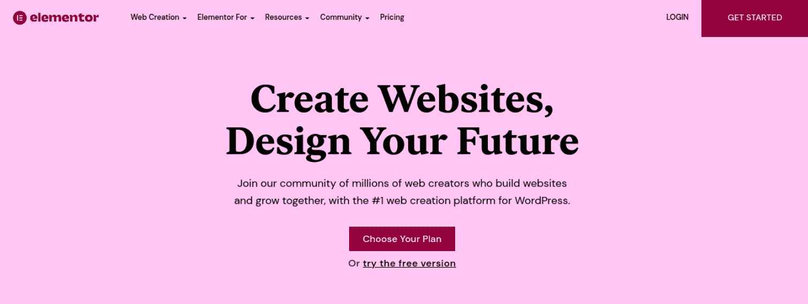

Elementor

使用 Elementor，您可以获得一个扩展的小部件库，您可以使用它来创建几乎所有类型的页面或帖子。此外，它还附带了一组用于设计各种页面元素的模板和工具。您可以使用这些预制的设计来创建联系人表单、滑块、按钮等。

Elementor 有两个版本。如果你想创建标准页面并且不需要任何高级功能，这个免费插件是一个很好的选择。然而，专业版给你提供了各种各样复杂的工具、小部件和设置，可以帮助你把你的网站提升到下一个层次，[而不用处理编码](https://kinsta.com/blog/wordpress-page-builders/)。

[Want to make the most of Elementor? 🚀 Check out the wide variety of add-on options in this post ✅Click to Tweet](https://twitter.com/intent/tweet?url=https%3A%2F%2Fkinsta.com%2Fblog%2Fbest-elementor-addons%2F&via=kinsta&text=Want+to+make+the+most+of+Elementor%3F+%F0%9F%9A%80+Check+out+the+wide+variety+of+add-on+options+in+this+post+%E2%9C%85&hashtags=WebDesign%2CElementor)

## 为什么使用元素或插件

Elementor 是一个强大、健壮的工具。这是最好的插件之一，尤其是如果你有专业版的话。然而，没有什么是完美的，有几个方面可以改进。这就是元素或插件可以发挥巨大作用的地方。它们填补了缺省插件缺乏的地方。

使用 Elementor 插件可以帮助你充分利用这个页面生成器。它们还可以让你与你网站上使用的其他重要插件集成。你可以创建更吸引人、视觉上更愉悦的页面和帖子来吸引顾客并增加转化率。

也有大量的选项可供选择，这取决于你所寻找的功能类型、可用性和价格。其中许多都是免费增值工具，这意味着你可以免费使用它们，如果你想获得额外的功能，还可以升级。

## 在元素或插件中寻找什么

你可能想要使用的插件将根据你拥有的网站或业务的类型以及你正在寻找的特定特性和功能而有所不同。在大多数情况下，你还需要考虑你的预算。

然而，每个人在搜索高质量插件时都应该记住一些关键因素。例如，确保你在网站上安装和激活的任何插件得到定期维护和更新是至关重要的。否则，它会将[安全漏洞](https://kinsta.com/knowledgebase/disclose-security-vulnerability/)引入您的网站。

根据您的经验水平，您可能还想寻找一个附带高级客户支持的工具。购买付费工具时，通常包括电话和聊天支持。但是，您最好事先查看一下支持选项和在线文档。这有助于确保你在需要的时候总能得到指导。

最后，我们建议考虑你安装的每个插件的可用性。即使你是一个有经验的 WordPress 用户，你也不想浪费时间去设置和配置一个令人困惑的插件。为了确定易用性，一定要研究插件的基本特性。此外，您可能想要查看它的评论或利用任何可用的免费试用期。

## WordPress 的 24 个最佳插件

既然我们已经讨论了为什么你可能想在你的网站上使用 Elementor 插件，让我们来探索一些高质量的大众最爱。以下是您可以使用这个强大工具的一些最佳扩展。我们将讨论它的主要特性、目标受众以及每种产品的用途。

### 1.元素的终极附件

Elementor 的终极插件是页面生成器最流行的插件之一。由 Brainstorm Force 提供支持，这款快速、轻量级的工具提供了 50 多个小部件扩展、200 多个节块以及各种各样的设计和定制选项:

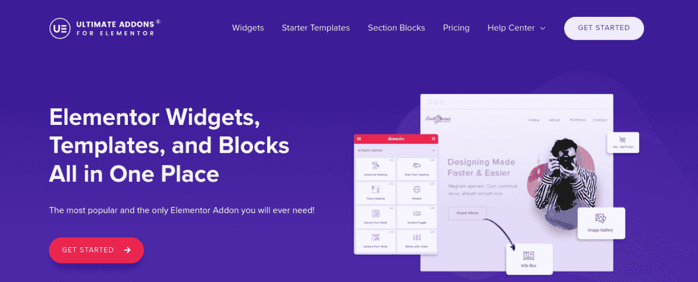

Ultimate Addons for Elementor

如果你正在寻找一个快速简单的方法来增强你的网站的设计和外观，这个插件是一个很好的选择。它的更多功能包括:

*   可定制的小部件
*   创新功能，如预设和跨站点复制粘贴
*   为 WooCommerce、SEO 等预建的小部件
*   现成的模板

Elementor 的终极插件可以帮助你建立一个令人惊叹的网站，而无需与你的网站代码进行交互。有了这个工具，你就可以通过快速展示客户评价、销售统计数据等等来给你的访客留下深刻印象。

这个插件提供了[多个价格等级](https://ultimateelementor.com/pricing/)供选择。计划起价为每年 59 美元。还有各种捆绑包，以及终身定价。

### 2.元素短剧

ElementsKit 是一个高质量、易于使用的 Elementor 插件，它包含了你构建一个漂亮、实用的网站所需的一切。有了这个工具，你可以实现一个[大菜单](https://kinsta.com/blog/wordpress-menu-plugins/)生成器、一个布局工具包、一个单页滚动条等等:

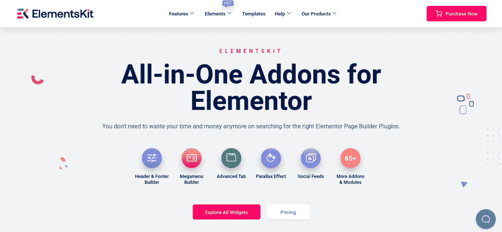

ElementsKit

它还附带了 50 多个小部件，有助于简化网站建设。它并不过分复杂或繁琐，这意味着它是一个适合[初级自由职业者](https://kinsta.com/blog/best-tools-for-freelancers/)的选项。但是，代理机构和更有经验的开发人员也可以使用这个工具。

其他增强功能包括:

*   高级视差效果
*   预制模板的布局库
*   页眉和页脚生成器
*   粘性菜单
*   高级切换和标签功能

ElementsKit 有三个价格等级，起价为每年 39 美元。不过，你也可以捆绑购买，起价 499 美元。

### 3.元素包

Element Pack 是另一个插件库，可以用来扩展和增强 Elementor 的功能。该工具包括 190 多个高级元素，所有这些元素都可以帮助您创建更时尚、更高质量的网站设计:

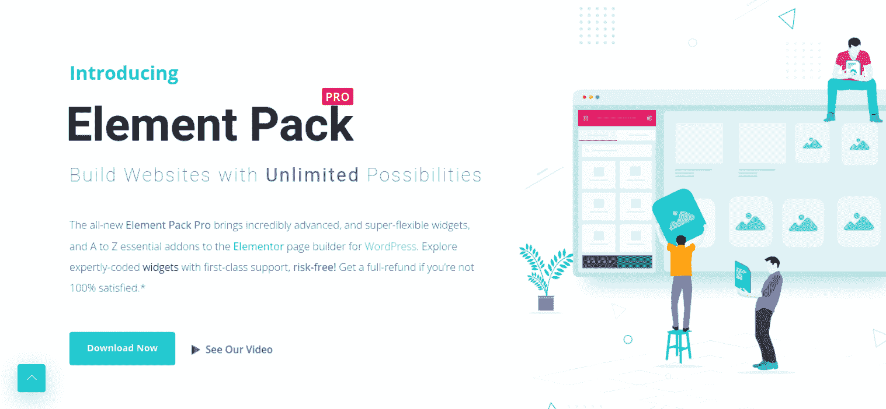

Element Pack

您可以从近 300 个现成的导入模板中进行选择。一些更值得注意的功能包括:

*   使用适当的验证和代码标准进行优化
*   可以通过拖放编辑器定制的流行小部件
*   多语言就绪，支持超过 15 种语言
*   160 多种现成的页面模板
*   100 多个页眉和页脚模板

有三个主要的价格选项供你选择。一个网站的个人计划从每年 29.25 美元开始。

### 4.主插件

Elementor 的 Master Addons 提供了一系列令人印象深刻的工具，可以帮助你立刻创建一个更加视觉愉悦的网站。它具有高度的可定制性，是那些希望对自己的设计进行更多创造性控制的网页设计师的完美选择:

Master Addons

这个 Elementor 插件包可以让你在插件部分启用和禁用任何插件。您还可以[将自定义 CSS](https://kinsta.com/blog/tailwind-css/) 添加到任何部分，包括一个大型菜单，创建过渡，并从 1000 多个模板库中进行选择。

主插件包括以下内容:

*   40 个部件
*   14 个扩展
*   画廊滑块
*   图像悬停效果
*   动态表格
*   页眉和页脚生成器

定价计划从每年[39 美元](https://master-addons.com/pricing/)开始。这三个计划都有 14 天的退款保证。

### 5.HT Mega

HT Mega 提供了许多 Elementor 插件，包括免费和高级选项。这个流行的工具包括 105 个 Elementor 小部件和 169 个预建模板。您可以从大量现成的模板中进行选择，这些模板涵盖近 40 个领域和类别:

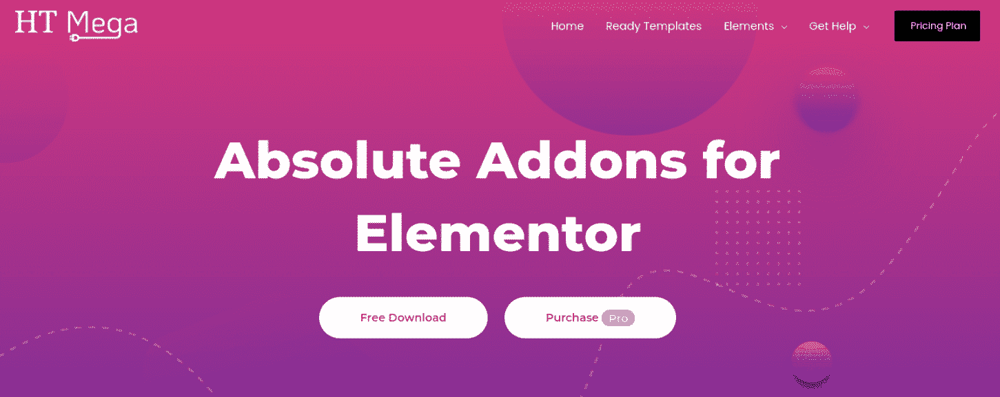

HT Mega

一些值得注意的功能包括:

*   页眉和页脚生成器
*   类别和存档页面生成器
*   巨型菜单
*   销售通知
*   woo 商务类别
*   行动呼吁(CTA)
*   图像放大镜

你可以从 WordPress 插件目录免费下载这个[插件](https://wordpress.org/plugins/ht-mega-for-elementor/)。如果你正在寻找高级的额外服务，你可以购买一个 [HT Mega Pro](https://wphtmega.com/pricing/) 计划，起价为每年 49 美元。

### 6.Elementor 的附加组件

Elementor 的 Plus 插件是另一个受欢迎的包，拥有超过 80 个强大的插件。它提供了超过 18 个模板、300 多个用户界面(UI)块，等等:

The Plus Addons for Elementor

如果你正在寻找各种各样的东西，这个插件是一个理想的选择。您可以使用小部件构建开箱即用的布局，创建不同风格的大型菜单，并添加动态列表和类别。

其他有价值的功能包括:

*   高级按钮
*   页面滚动选项
*   圆形菜单
*   高级排版
*   受保护的内容
*   动态杂志滑块
*   Instagram feed

另外，插件也是初学者和用户友好的。这是一个有用的工具，即使你只有很少的元素或设计经验。

WordPress 插件目录上有一个免费版本。然而，为了解锁全套功能，我们建议升级到一个[高级计划](https://theplusaddons.com/pricing/)，其范围从每年 39 美元到每年 169 美元。

### 7.右拳

Droit Addons 可以帮助你创建一个漂亮的、高性能的网站。这个免费增值工具有 70 个区块、9 个整页模板和几十个有用的小工具:

Droit Addons

更重要的是，你不必担心这个插件包会拖慢你的网站。尽管功能丰富，但它利用了缓存，因此您的页面仍然可以快速加载。如果你关心网站的速度和性能，这是一个可靠的选择。

潜在买家可能感兴趣的一些突出特点是:

*   图像传送带
*   动画文本
*   视差(滚动)效果
*   图标框
*   [洛蒂(动画)特效](https://lottiefiles.com/)
*   对小部件的控制
*   添加自定义 CSS 的选项

WordPress 插件目录中有一个免费的插件。然而，要访问所有附加功能，你需要购买一个[高级计划](https://droitthemes.com/droit-elementor-addons/pricing/)，每年 35 美元起。

### 8.独家配件

[独家插件](https://exclusiveaddons.com/)提供超过 85 个 Elementor 插件和超过 600 个预制块，帮助您轻松构建网站。你可以[建立作品集](https://kinsta.com/blog/portfolio-website/)，画廊，博客网格，等等:

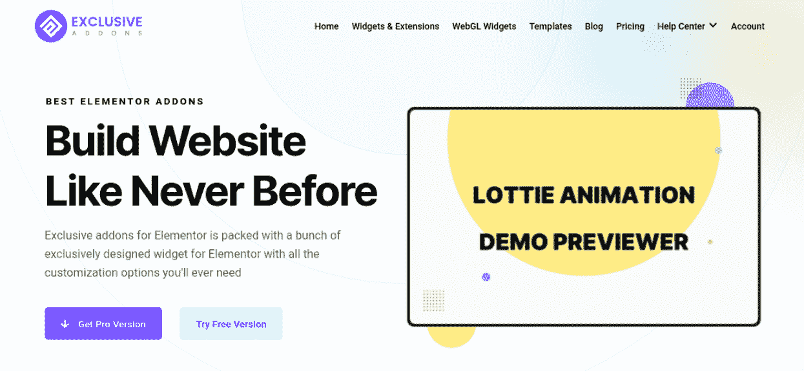

Exclusive Addons

这个插件是轻量级和高度可定制的。它可以帮助你为视觉超前的访问者创造多才多艺的时尚设计。其他功能包括:

*   49 个现成的模板
*   自定义定位
*   自定义 CSS
*   磨砂玻璃效果
*   友好的支持

有一个[免费插件可用](https://wordpress.org/plugins/exclusive-addons-for-elementor/)。然而，如果你想升级到[高级计划](https://exclusiveaddons.com/pricing/)，单个网站的价格从每年 29 美元开始。

### 9.元素的快乐插件

无论你是自由职业者、代理人还是网络开发人员，HappyAddons 都是 Elementor 的优秀插件。该工具提供 50 多个小部件和 400 多个模块，有助于简化设计和构建网站的流程:

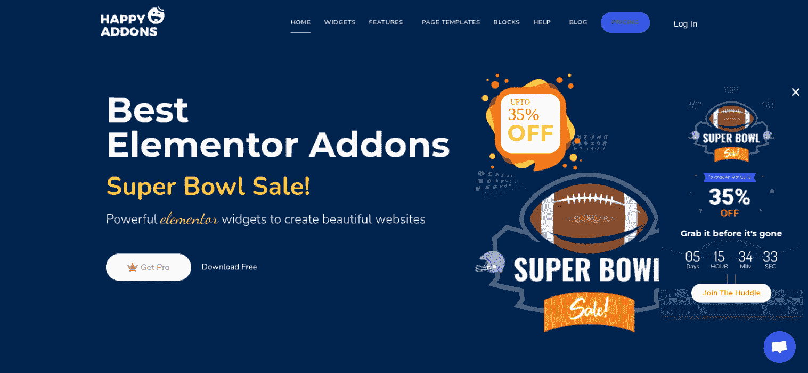

Happy Addons

如果您正在寻找创新和先进的解决方案，这是一个很好的选择。这是因为 HappyAddons 允许无限制的节嵌套、显示条件以及实时复制和粘贴功能。

HappyAddons 的其他功能包括:

*   全天候支持
*   17 个扩展
*   按需资产加载
*   列控件
*   巨型菜单
*   动画文本专业版
*   滚动图像专业版

这个插件有免费版和付费版。高级计划从每年 33 美元的[开始。](https://happyaddons.com/pricing/)

### 10.鳄鱼皮

[Crocoblock](https://crocoblock.com/) 是一个使用 Elementor 构建和设计网站的完整解决方案。这个全面的工具包带有 18 个插件、150 个小部件、64 个弹出窗口和 47 个现成的网站模板。它是一个专用插件，也可以分为四组功能:

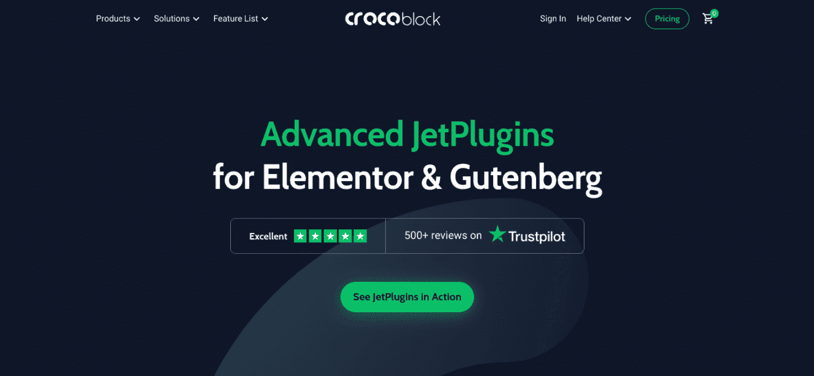

Crocoblock

这些套件包括:

*   **多工具。**这个插件使得使用动态内容构建复杂和精密的网站变得更加容易。您甚至可以整合预订功能，以包括每小时的约会和事件。
*   **电子商务。**这一套非常适合网店店主。你可以给美观的产品网格定价，并从网上商店的主要元素中进行选择。其中包括产品比较表、愿望列表按钮等。
*   **设计。**该组包括用于创建时尚、现代网站的工具。您可以添加动画、滚动效果等。
*   **包罗万象。**该套装提供年度和终身许可，包含所有 18 个插件。如果你是设计师或开发者，这是一个很好的选择。

Crocoblock [价格不一](https://crocoblock.com/pricing/)。有一些[免费小工具](https://crocoblock.com/freemium/free-plugins/)可供下载。如果你想要一年的全包套餐，起价是 130 美元。

### 11.Elementor 的附加功能

Elementor 是一个简单而方便的工具，为你的 Elementor 页面生成器提供了额外的功能。它包括超过 28 个新部件和 5 个扩展:

## 注册订阅时事通讯

### 想知道我们是怎么让流量增长超过 1000%的吗？

加入 20，000 多名获得我们每周时事通讯和内部消息的人的行列吧！

[Subscribe Now](#newsletter)

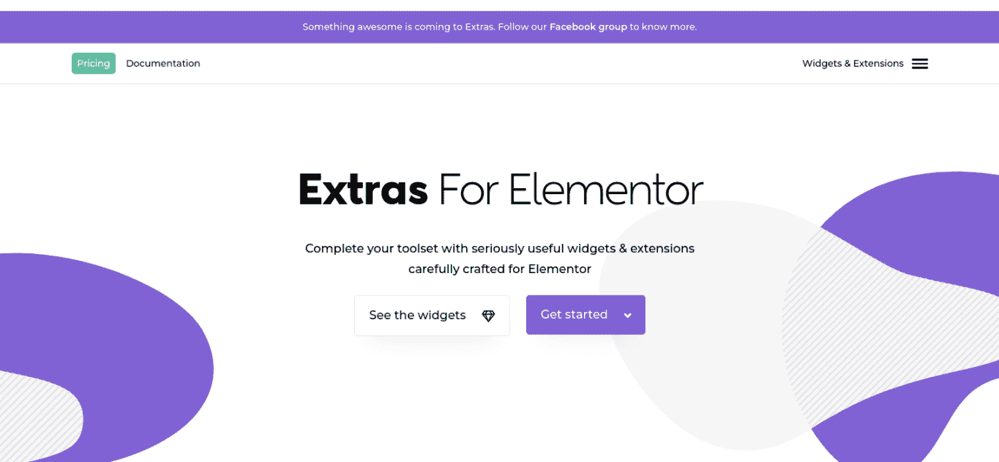

Extras for Elementor

超过 50，000 个网站利用 Elementor Extras 提供的附加功能。这些扩展功能包括:

*   任何小部件、栏或部分背景的视差效果
*   粘性部件
*   显示条件
*   任何小部件的工具提示

Elementor Extras 有三种主要的定价方案。起价为每年 26 欧元(约合 29.5 美元)。

### 12.齐插件

[Qi Addons](https://qodeinteractive.com/qi-addons-for-elementor/) 是一个扩展的工具集，可以帮助您简化网站的设计和开发:

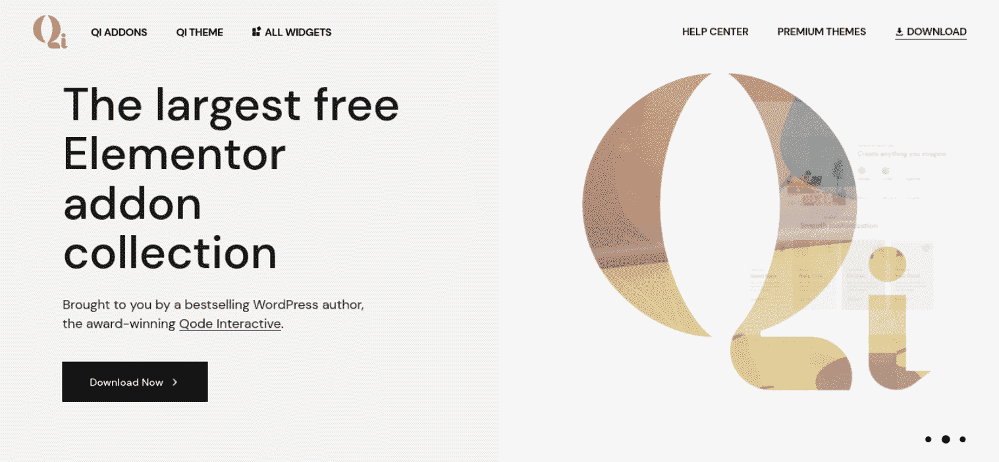

Qi Addons

这是 Elementor 可用的最大的免费插件集合。以下是它包含的一些功能:

*   超过 60 个可定制的部件
*   交互式图表、横幅和进度条
*   快速支持
*   如何架构
*   目录
*   极简风格

这个插件的突出特点之一是它完全免费使用。如果你是一个自由职业者或者预算有限的创业公司，这是一个理想的选择。

### 13.Elementor 的基本附件

基本插件是 Elementor 的另一个知名且可靠的插件套件。它附带了一个包含 70 多个独特元素和扩展的库，用于定制您的网站:

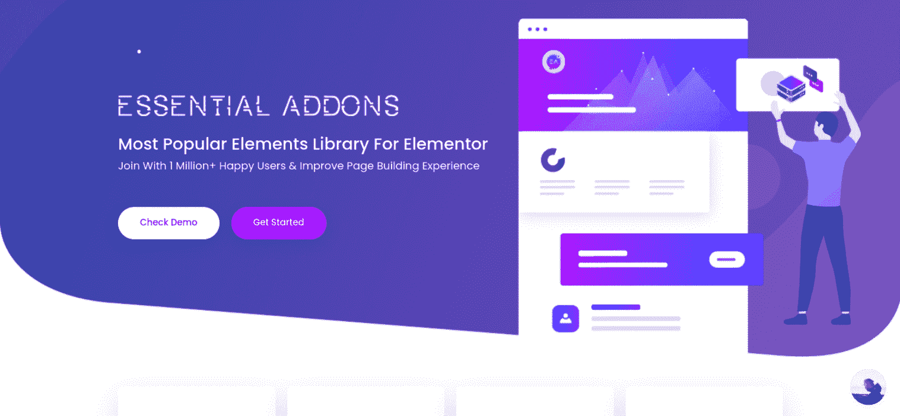

Essential Addons

该选项的一个优点是所有元素都是完全可定制的。你有过多的设计选项可供选择，并完全控制他们的风格。它也是轻量级的，所以你不必担心它会影响你网站的性能。

这个插件甚至可以让你启用和禁用单个元素。这可以通过消除您当前不使用的工具来帮助确保您的页面快速加载。因此，Essential Addons 是任何想要创造一个积极的 UX 的 WordPress 网站所有者的可靠选择。

以下是您将通过该工具获得的更多功能:

*   7 个高级扩展
*   [WooCommerce 产品](https://kinsta.com/blog/woocommerce-product-filter/)系列
*   单页导航
*   Instagram Feed
*   受保护的内容

基本插件的价格从每年 39.97 美元开始。终身无限计划的费用为 249.97 美元。

### 14.PowerPack 元素 or

名副其实， [PowerPack](https://athemes.com/go/powerpackelements) 是一个强大的插件，提供了很多有用的小部件和工具来增强你的 Elementor 网站:

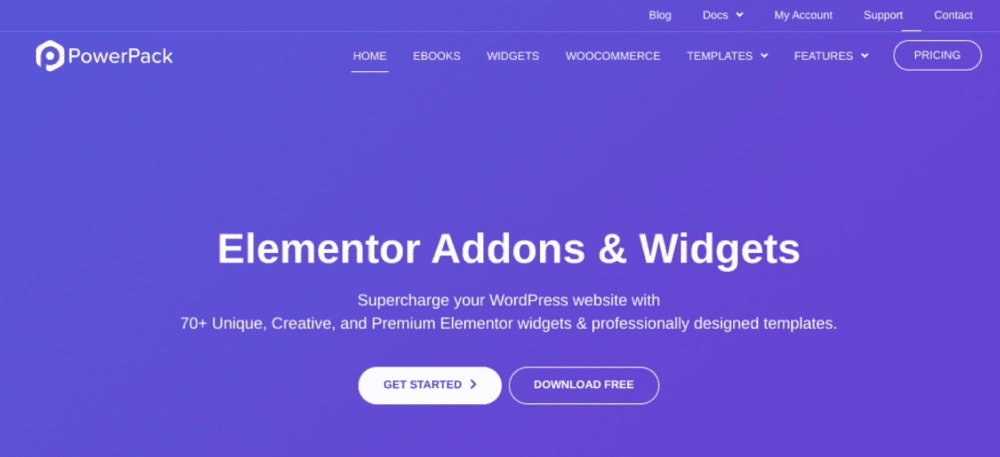

PowerPack Elementor

这个高级系列增加了 70 多个小部件，涵盖了几个类别。其中包括:

*   必需品(手风琴、纽扣等。)
*   内容(评价、表格、幻灯片等。)
*   邮件
*   定价
*   航行

使用 PowerPack 的另一个好处是它有[白标](https://kinsta.com/help/white-label-kinsta-wordpress-admin/)。这意味着你可以在为客户建立网站时使用你的品牌。这使得它成为设计师和开发人员的完美选择。您还可以将布局保存为模板，以供将来使用。

PowerPack 有一个[免费版本](https://wordpress.org/plugins/powerpack-lite-for-elementor/)。然而，要获得全套的特性和功能，你可以选择一个[高级计划](https://powerpackelements.com/pricing/)，一年 49 美元起。

### 15.初学者模板

同样由 Brainstorm Force 提供支持， [Starter Templates](https://wordpress.org/plugins/astra-sites/) 是一个插件，你可以用它来扩展你的模板设计选项。然而，与这个列表中的大多数插件不同，它并不特定于 Elementor。

你也可以使用其他页面生成器或 [WordPress 块编辑器](https://kinsta.com/blog/gutenberg-wordpress-editor/)。这使得它成为使用各种页面和主题构建器的设计人员和开发人员的有用工具。有了这个插件，你可以访问超过 280 个全网站模板和为特定页面构建者创建的个人页面:

Starter Templates

使用起来也很简单。您可以简单地浏览并选择您想要试用的演示，导入它，定制它，并将其投入使用。它还允许您通过页面生成器导入元素或块和模板。

Struggling with downtime and WordPress problems? Kinsta is the hosting solution designed to save you time! [Check out our features](https://kinsta.com/features/)

初学者模板是免费的。你可以从 WordPress 插件目录下载。

### 16.元素或页眉和页脚生成器

element or Header and Footer Builder 是 Brainstorm Force 开发的另一个插件。它允许您添加页眉和页脚生成器来创建可在您的站点上使用的模板。这是我们之前讨论的终极插件的免费替代品:

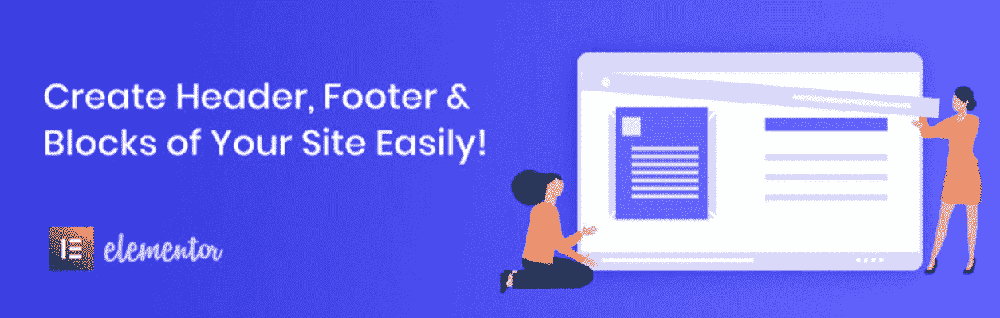

Elementor Header & Footer Builder

如果你正在寻找比终极插件更简单的东西，这是值得一试的，但你仍然需要一个简单的方法来定制和创建你的页眉和页脚模板。它还具有高度优化的代码，不会对你的网站速度和性能产生负面影响。

其他功能包括:

*   选择显示位置
*   兼容所有元素或主题
*   内置部件库(网站徽标、标语、导航、页面标题等)。)
*   快速简单的设置

Elementor 页眉页脚生成器完全免费使用。你可以从 WordPress 插件目录下载。

### 17.Envato 元素模板工具包

[Envato Elements Template Kits](https://elements.envato.com/template-kits)是一个插件，允许您访问 1000 多个高质量的模板，您可以将它们用于 Beaver Builder 和 Elementor:

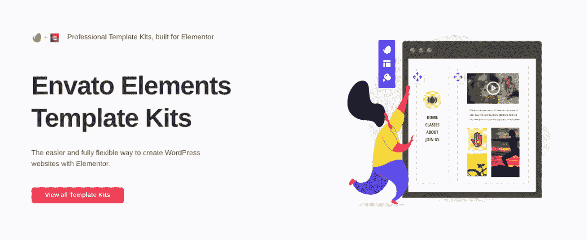

Envato Elements Template Kits

与 Starter 模板类似，它很容易找到您想要使用的模板，导入它，然后通过拖放编辑器根据您的喜好定制它。

该插件的功能包括:

*   70 多个模板套件
*   Envato Elements 图像库拥有超过 60，000 张[免版税库存照片](https://kinsta.com/blog/free-images-for-wordpress/)
*   混搭设计
*   对可以导入的模板数量没有限制

WordPress 插件目录中有一个免费的插件。如果你想访问高级模板，你需要一个 [Envato Elements 订阅](https://elements.envato.com/pricing)，起价每月 16.50 美元。

### 18.Elementor 的高级插件

Elementor 的高级插件是一个灵活的工具，可以帮助你创建一个看起来专业的网站，而不需要接触任何代码。小部件包括广泛的定制选项。您还可以禁用或启用它们来提高您的站点的性能:

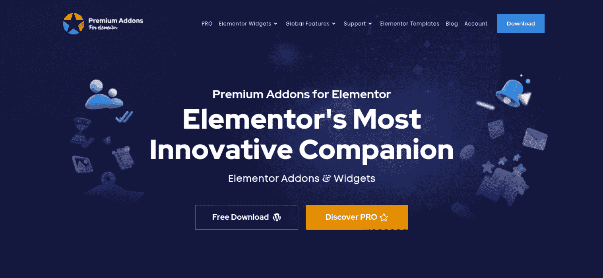

Premium Addons for Elementor

如果安装了 Elementor 页面生成器，高级插件将与任何主题一起工作。包括的一些小部件有:

*   图像滚动
*   旗帜
*   旋转木马
*   [谷歌地图](https://kinsta.com/blog/wordpress-google-maps/)
*   定价表
*   倒数计秒
*   双割台

有一个[免费的高级插件插件](https://wordpress.org/plugins/premium-addons-for-elementor/)，包括超过 23 个部件。然而，如果你选择起价 39 美元的[专业版](https://premiumaddons.com/pro/)，你可以访问超过 34 个插件。

### 19.Elementor 的 Livemesh 插件

另一个值得一试的免费插件是 Elementor 的 Livemesh 插件。这个工具集带有各种扩展，通常只有付费插件才有。它允许您创建团队档案、构建图表等等:

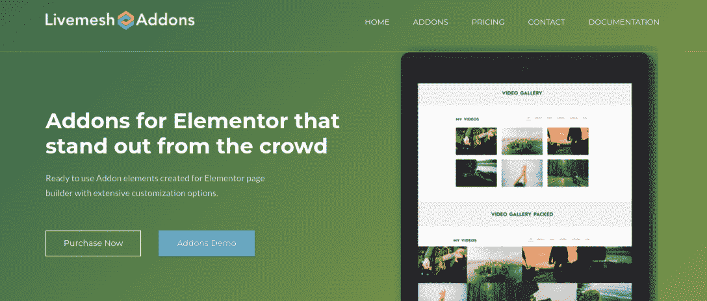

Livemesh Addons

小部件很容易使用，所以这个插件是初学者的可靠选择。它还带有一个专业版，非常适合寻求更复杂功能的高级用户。额外的功能允许您自定义投资组合网格，标题样式选项，评价滑块等。

WordPress 插件目录中有一个免费的插件。你可以购买一个每年 37 美元起的[高级计划](https://livemeshelementor.com/pricing/#pricing-plans)来获得全部的特性和能力。

### 20.地层

Stratum 是 Elementor 的免费增值插件，可以帮助你为你的商业网站和网上商店设计令人惊叹的[登陆页面](https://kinsta.com/blog/wordpress-landing-page-plugins/)。它附带了 20 多个高级小部件，为 Elementor Pro 提供了合适的替代产品:

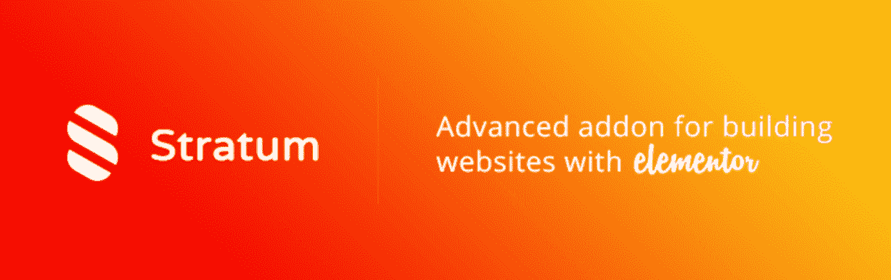

Stratum

这个插件提供了许多其他插件没有的颜色、排版和其他样式设置。如果你是一名设计师，想要创建一个拥有令人兴奋的颜色和字体组合的网站，这可能是一个不错的选择。

其他地层特征包括:

*   高级手风琴
*   高级谷歌地图
*   圆形进度条
*   洛蒂动画
*   水平和垂直时间轴
*   自动播放[滑块](https://kinsta.com/blog/wordpress-slider/)(专业版)

有一个[自由地层插件](https://wordpress.org/plugins/stratum/)可用。然而，你也可以购买一个[高级计划](https://motopress.com/products/stratum/#download-tabs)，单个网站起价 29 美元。

### 21.移动插件

移动插件是 Elementor 的一个插件，对于不精通技术的开发者和初学者来说很有用。它包括 80 多个基本的小部件，可以节省您在整个网站上构建页面的时间:

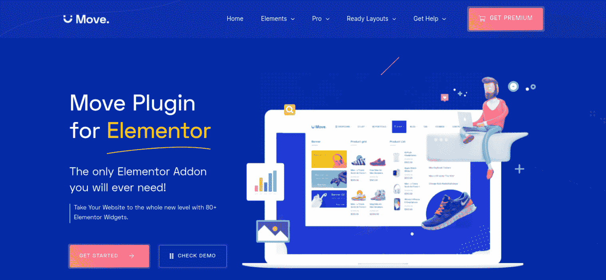

Move Addons

该工具还可以通过包含免费的自动更新来帮助简化您的项目。它超级快速和轻量级，使它多功能和有用的许多网站。

以下是 Move Addons 提供的更多功能:

*   超过 40 个免费部件
*   高级附加组件
*   高级选项卡
*   队员
*   常见问题解答
*   复制/粘贴功能

Move Addons 插件提供了大量的免费元素。然而，当你升级到 Pro 时，你可以从更广泛的元素中选择，计划从每年 20 美元开始。

### 22.Dynamic . ooo—element or 的动态内容

另一种简化设计工作流程的方法是使用一个插件，比如[Dynamic . ooo——Elementor](https://www.dynamic.ooo/)的动态内容:

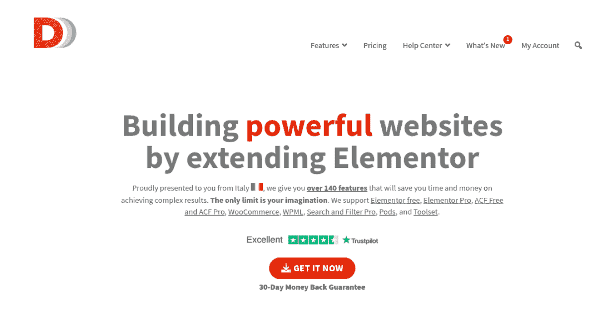

Dynamic.ooo – Dynamic Content for Elementor

该解决方案提供了 140 多项功能。这是一个为设计师、开发者和网站所有者设计的工具，他们希望建立一个专注于驱动流量和转化率的网站。

一些突出的功能包括:

*   PDF 按钮
*   页面滚动效果
*   元素或形式的付款
*   添加到收藏夹
*   动态帖子
*   集成高级定制字段、JetEngine、pod 和工具集
*   站点间的复制/粘贴功能
*   动态可见性

该插件的高级许可起价为每年 59 欧元(约 67 美元)。

### 23.元素用类固醇

是一个开源插件，帮助扩展页面生成器的功能。它将一系列插件捆绑在一起，与您现有的设置和选项相集成:

OoohBoi Steroids

这个工具与列表中的其他工具有些不同，因为它允许您添加完整的包，而不是提供单独的小部件。

当你对元素使用 OoohBoi 类固醇时，你会得到一些额外的特性:

*   25 种风格选择
*   视频和 widget 遮罩和覆盖
*   CSS 编写模式
*   列控件
*   注释样式

你可以从 WordPress 插件目录下载免费插件。

### 24.一个插件插件

[All In One Widget](https://codecanyon.net/item/all-in-one-widgets-for-elementor/22910666) 插件为 Elementor 提供了一个简化的高级工具和一些附加功能:

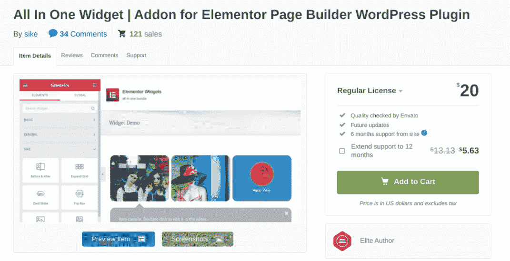

All In One Widget Addon

虽然不像其他选项那样功能丰富，但它有利于特定的 Elementor 相关任务。例如，它允许您向站点添加以下元素:

*   扩展网格
*   带工具提示的图像热点
*   翻转框
*   卡片滑块
*   浮箱
*   新闻板块

这款 [插件](https://codecanyon.net/item/all-in-one-widgets-for-elementor/22910666)的定价为 20 美元起。这包括一个站点的更新和六个月的支持。

[With help from these Elementor addons, designing and customizing your site will be a breeze 😌Click to Tweet](https://twitter.com/intent/tweet?url=https%3A%2F%2Fkinsta.com%2Fblog%2Fbest-elementor-addons%2F&via=kinsta&text=With+help+from+these+Elementor+addons%2C+designing+and+customizing+your+site+will+be+a+breeze+%F0%9F%98%8C&hashtags=WebDesign%2CElementor) ## 摘要

Elementor 是一个广泛使用的页面生成器插件，可以简化设计和定制网站的过程。然而，如果你想充分利用这个强大的工具，我们建议安装一些插件来增强它的功能，并选择一个为 Elementor 量身定制的[托管解决方案。](https://kinsta.com/elementor-hosting)

你最喜欢的元素或插件是什么？请在下面的评论区告诉我们！

* * *

让你所有的[应用程序](https://kinsta.com/application-hosting/)、[数据库](https://kinsta.com/database-hosting/)和 [WordPress 网站](https://kinsta.com/wordpress-hosting/)在线并在一个屋檐下。我们功能丰富的高性能云平台包括:

*   在 MyKinsta 仪表盘中轻松设置和管理
*   24/7 专家支持
*   最好的谷歌云平台硬件和网络，由 Kubernetes 提供最大的可扩展性
*   面向速度和安全性的企业级 Cloudflare 集成
*   全球受众覆盖全球多达 35 个数据中心和 275 多个 pop

在第一个月使用托管的[应用程序或托管](https://kinsta.com/application-hosting/)的[数据库，您可以享受 20 美元的优惠，亲自测试一下。探索我们的](https://kinsta.com/database-hosting/)[计划](https://kinsta.com/plans/)或[与销售人员交谈](https://kinsta.com/contact-us/)以找到最适合您的方式。