# 为什么 WordPress 很慢？我们来想办法吧！

> 原文：<https://kinsta.com/blog/wordpress-slow/>

找出 WordPress 慢的原因可能很有挑战性。一个 WordPress 站点包含许多部分，从它的网络服务器和相关设置到各种主题和插件。这也可能是由于未优化的内容，如图像、视频和嵌入内容。

但是，如何找出导致性能问题的原因呢？

很难说问题出在哪里——有多种可能性，我们将在这篇文章中一一探讨。

而且我们不会仅仅停留在找出你的 WordPress 站点慢的原因上。你还会学到很多方法来提高缓慢的 WordPress 站点的速度。

激动吗？我们走吧！

### 查看我们的视频指南[诊断慢速网站](https://www.youtube.com/watch?v=9I5GgwUGMno)

## 为什么 WordPress 很慢？

一些网络开发者完全不理会 WordPress，理由是它太慢了。虽然这可能是以前的情况，但很长一段时间以来，这并不是一个准确的说法。许多大品牌现在使用 WordPress 来托管他们的网站。

然而，许多因素会影响你的 WordPress 站点的性能。一些最常见的包括:

*   您网站的虚拟主机提供商
*   服务器端优化(PHP 版本、缓存、压缩等。)
*   缓慢的 WordPress 主题
*   慢速 WordPress 插件
*   未优化的内容(主要是图像)
*   外部 HTTP 请求太多
*   不使用专用资源来提供内容(CDN、[视频托管](https://kinsta.com/blog/video-hosting/)等)。)

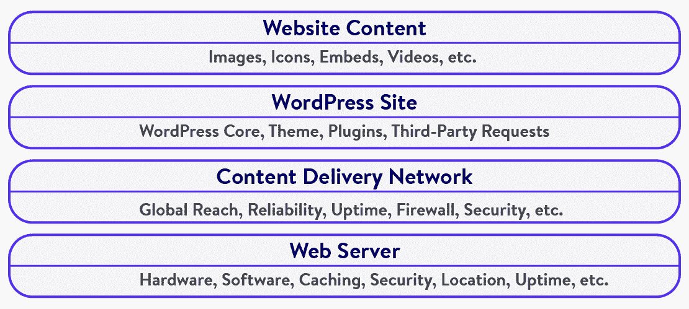

Various elements of a typical WordPress website.

除了由你的虚拟主机提供商实现的适当的服务器优化之外，还有许多优化可以让你确保你的网站超快。我们将在这篇文章的后面讨论这些，但是首先，让我们弄清楚是什么让你的站点变慢了。

## 确定你的 WordPress 站点是否慢的 4 个步骤

 在你的网站上运行测试是一个很好的方法来确定是什么拖慢了你的网站——是你的虚拟主机提供商，网站本身，还是两者都有。让我们浏览一些你可以运行的网站测试。

### 步骤 1:运行页面加载速度测试

你的网站加载速度有多快？任何网页加载时间超过两秒都不利于用户体验。理想情况下，你的目标应该是加载时间低于 1 秒——任何介于两者之间的时间都可以，但是你应该总是进一步优化它。

为此，您可以使用不同的[网站速度测试工具](https://kinsta.com/blog/website-speed-test/#website-speed-test-tools)——gt metrix、Pingdom Tools、Google PageSpeed Insights 和 WebPageTest 都是不错的选择。

我们将使用 [GTmetrix](https://kinsta.com/blog/gtmetrix-speed-test/) 和 [Pingdom 工具](https://kinsta.com/blog/pingdom-speed-test/)来演示这一步。

首先，让我们启动 GTmetrix 并测试一个网页。选择离您(或您网站的访问者)最近的服务器位置以获得更好的结果(**提示:**注册一个免费的 GTmetrix 帐户以获得更多的服务器位置选项)。

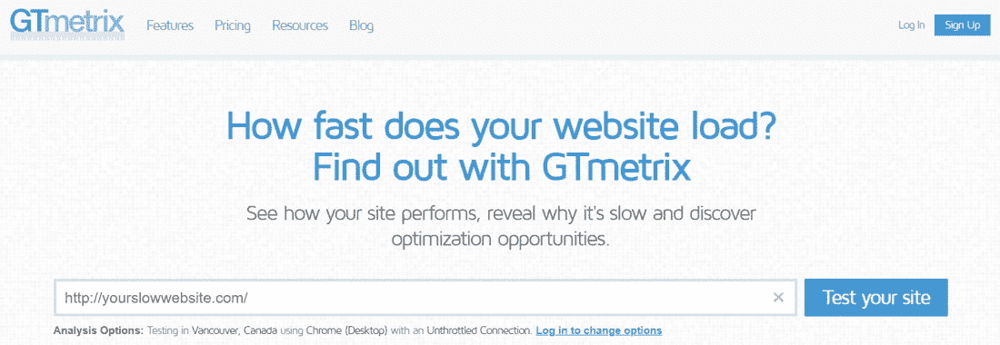

GTmetrix homepage.

在这里，我们正在测试 WordPress 网站的主页，因为大多数用户都会访问这个主页。此外，主页包含大量内容，因此非常适合测试。

测试完成后，您将看到如下所示的 GTmetrix 性能报告。

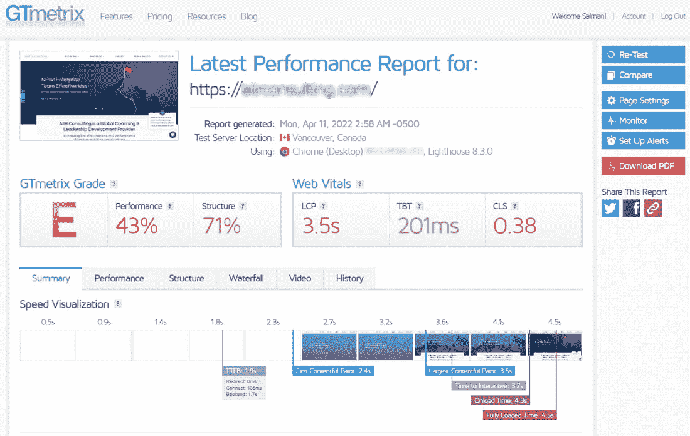

GTmetrix report example.

GTmetrix 根据许多指标对网页进行评级。它还提供了测试期间页面加载方式的可视化时间线。要详细了解它，你必须向下滚动。

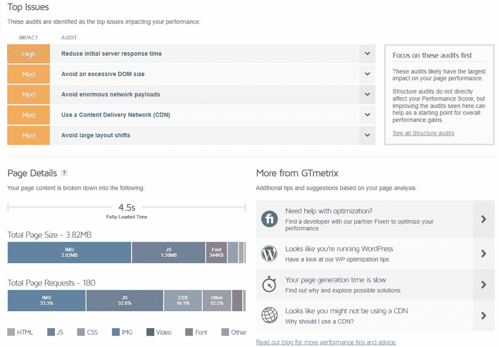

GTmetrix report’s ‘Summary’ tab.

**Summary** 选项卡突出显示了影响站点性能的所有主要问题。在这种情况下，最重要的问题是服务器的响应时间。这几乎总是意味着考虑升级你的主机计划或迁移到一个更好的主机。然而，在你得出这个结论之前，最好先解决所有其他问题，然后再重新审视这个问题。

下一个主要问题是“避免过大的 DOM 大小”——这是使用页面生成器时的一个常见问题。另一个问题——“避免大的布局变化”——也可能与页面生成器或主题有关。

“避免巨大的网络负载”指的是图像、脚本和 CSS 文件等重资产。**页面细节**部分给出了一个快速的纲要。在这里，您可以看到总的页面大小和页面请求的数量相当高。

不使用 CDN 是降低你的 WordPress 站点速度的另一个关键因素。我们已经在我们的[文章中深入回答了为什么你应该使用 WordPress CDN](https://kinsta.com/blog/wordpress-cdn/) 文章。

点击 **Performance** 选项卡，您将看到浏览器和 Lighthouse 性能报告的更多指标。

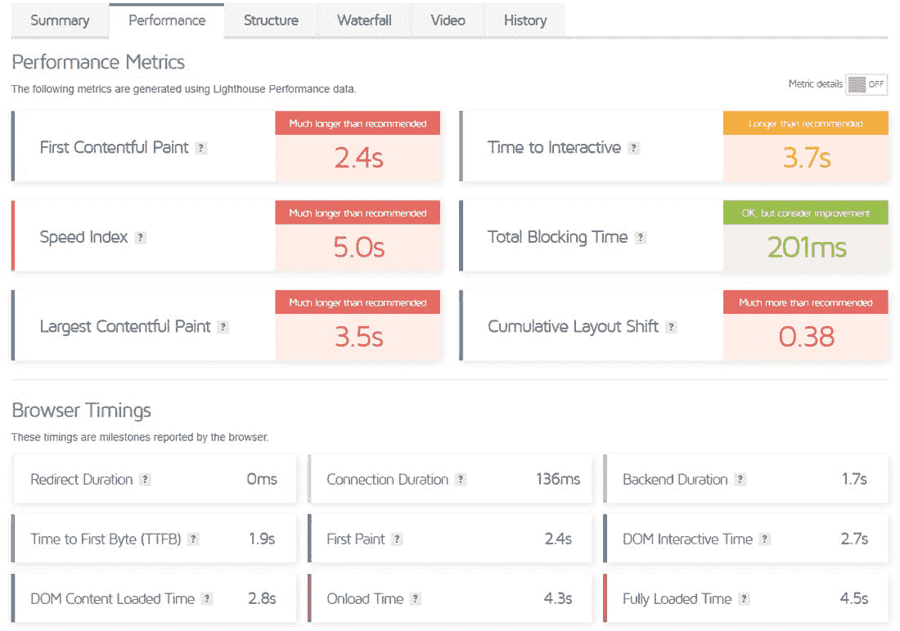

GTmetrix report’s Performance tab.

正如你所看到的，这个测试网页没有什么好的。转到报告的**结构**和**瀑布**选项卡会给你更多的见解。

Pingdom Tools website speed testing tool.

接下来是 Pingdom Tools，另一个流行的网站速度测试工具。我们将在这里再次测试同一个网站的主页。

Pingdom Tools 使用自己的算法来测试网页。这个网站的结果看起来也不太好。

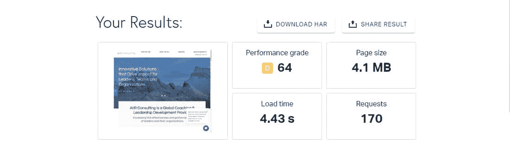

Pingdom Tools speed test results.

进一步向下滚动会告诉你如何提高你的网站的性能。展开每条建议将为您提供更多关于您可以在哪些方面以及如何改进的细节。

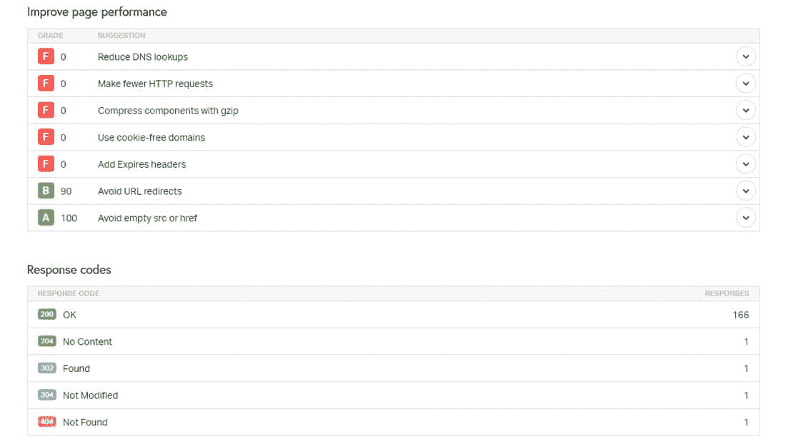

Pingdom’s performance improvement recommendations.

由于每个速度测试工具都有自己的性能指标，您不能直接比较一个速度测试工具的结果和另一个。因此，无论您选择什么，最好坚持使用一种方法——至少在最初的故障诊断中。你可以在以后尝试其他的速度测试工具。

最后，你还应该考虑一个站点的[感知性能](http://blog.teamtreehouse.com/perceived-performance)和实际性能之间的差异。阅读我们的[关于运行网站速度测试的深度文章](https://kinsta.com/blog/website-speed-test/)了解更多信息。

### 步骤 2:对网站进行负载测试

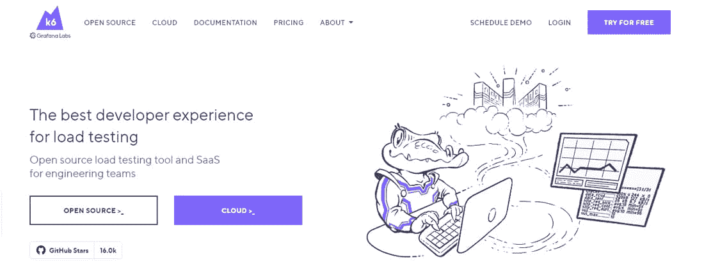

The k6 FOSS speed testing tool.

对你的网站进行负载测试将会揭示出新的信息，告诉你它在现实世界中有多快。为此，我们将使用 k6 ，这是一个免费的开源负载测试工具，可以在您的系统上本地运行。

使用免费的 k6 版本需要一些命令行知识，但是一旦你开始使用它，它会非常强大。(**注:**或者，你可以使用 k6 的高级云解决方案或者更简单的基于云的负载测试工具，比如 [Loader.io](https://loader.io/)

结合其神奇的 [k6 Reporter](https://github.com/benc-uk/k6-reporter) 扩展，您可以运行负载测试并获得精确的 HTML 结果:

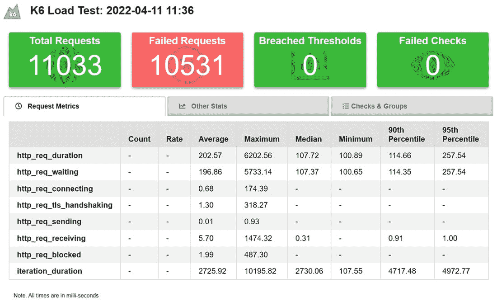

k6 load test results — Request Metrics.

上面的结果是对同一个站点进行 10 分钟的负载测试，最多有 50 个虚拟用户。仪表板还包括其他有用的统计数据:

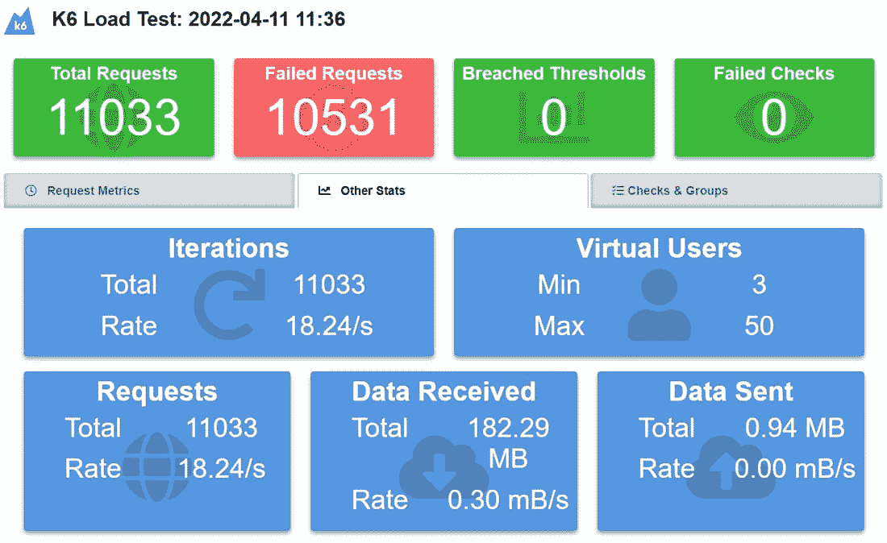

k6 load test results — Other Stats.

请注意，大多数请求都失败了，这可能表明服务器无法处理它们。

您还可以在 k6 脚本中设置阈值和检查(例如，1.5s 以下的页面负载、用户能否登录等。).这些指标也将整齐地显示在仪表板中。

下面的图片显示了另一个网站的负载测试结果，使用确切的条件，让你有一个更清晰的画面。

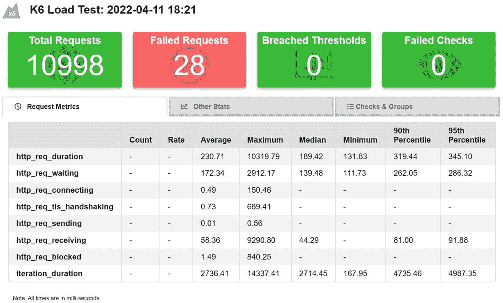

k6 load testing results — Round 2.

有 28 个失败的请求可能看起来很糟糕，但是考虑到请求的总数就不那么糟糕了。这只占我的本地机器发出的所有请求的 0.25%。这里的结果表明，该网站的虚拟主机提供商可以为相当多的并发用户提供服务。

### 第三步:查看你的 WordPress 主题和插件

测试你的 WordPress 站点的主题和插件应该是发现任何主要性能问题的下一个主要步骤。这里有很多变化——你经常会发现一些主题和插件比其他的优化得更好。

在前面的速度测试部分，我们讨论了在报告中发现有问题的主题或插件。但是还有另一种直接的方法——一次禁用一个主题或插件，看看网站的表现如何(在速度测试、负载测试或两者中)。

### 信息

您可以使用像 Kinsta APM 这样的[应用程序监控工具跳过这一步。我们将在下面的步骤 4 中详细讨论。](https://kinsta.com/blog/apm-tools/#kinstas-free-apm-tool)

如果性能问题仍然存在，禁用一个以上的主题或插件，并重新运行测试。作为一个训练有素的网络侦探，继续这样做，直到你找到罪犯。

但是，这种方法不适用于生产站点。有一个中转站真的很有帮助。您可以通过添加、更改或删除特定的功能，使用它来测试生产站点的各种迭代。

大多数虚拟主机提供商，尤其是便宜的共享主机方案，默认情况下不提供这个功能。所以，你必须[手动设置升级站点](https://kinsta.com/blog/wordpress-staging-site/#3-create-a-manual-wordpress-staging-site)或者[使用 WordPress 升级插件](https://kinsta.com/blog/wordpress-staging-site/#2-install-a-plugin-to-help-you-create-a-wordpress-staging-site)。

如果你的网站托管在 Kinsta，你很幸运，因为在 Kinsta 安装的每个 WordPress 都有一个专用的暂存环境。你所需要做的就是前往你的 MyKinsta 仪表板，选择你的站点，并将其环境从**现场**更改为**舞台**。

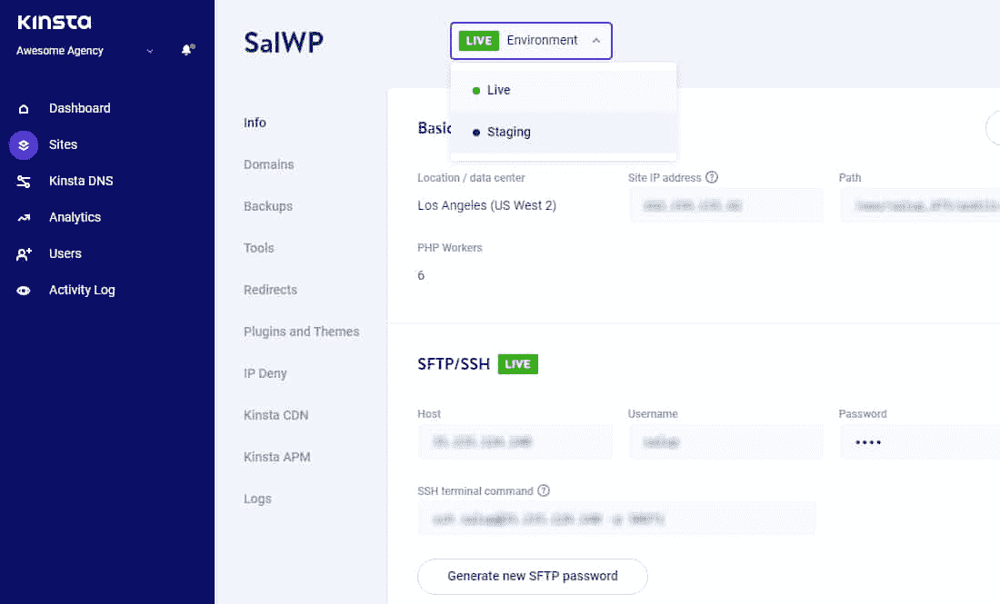

Kinsta’s staging feature.

该临时站点实际上是生产站点的精确副本，包括其服务器和服务器端配置。你可以用它来修补和测试你的网站，而不影响它的实时版本。

如果一个登台环境对您来说还不够，那么您很幸运:Kinsta 还提供额外的[高级登台环境](https://kinsta.com/help/premium-staging-environments/)，允许您创建多达五个额外的登台站点来满足您的测试需求。

### 步骤 4:使用应用程序性能监控(APM)工具

APM 工具与速度和负载测试工具相结合，可以增强您的网站诊断能力。

一个有能力的 APM 工具可以帮助你识别缓慢性能的来源——而不改变你的站点上的任何东西，而不是建立一个临时站点并一个接一个地猜测哪个插件或主题被禁用。它跟踪和分析缓慢的交易，数据库查询，外部请求，WordPress 挂钩，插件等。

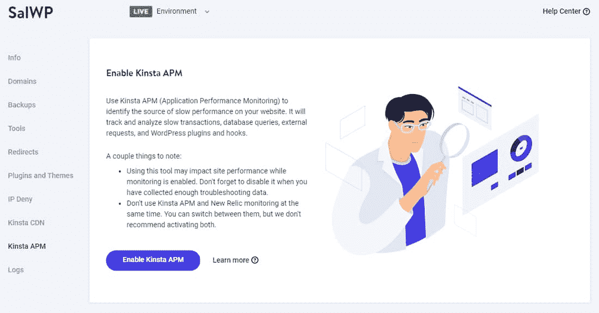

Enabling Kinsta APM in the MyKinsta dashboard.

通常，使用 APM 工具对初学者来说并不友好。即使是专业开发人员也需要一些如何有效使用它的培训。此外，总有额外的成本因素，因为大多数需要许可证运行。

我们已经介绍了[最好的 APM 工具](https://kinsta.com/blog/apm-tools/)——您可能想了解一下它们。使用免费的[查询监控插件](https://kinsta.com/blog/query-monitor/)是另一种选择。

如果你的站点托管在 Kinsta，你可以使用我们免费的 [Kinsta APM](https://kinsta.com/apm-tool/) 工具来诊断你站点的性能问题。这是我们为 WordPress 网站定制的性能监控工具，帮助你识别 WordPress 的性能问题。

我们特意创建了一个未优化的站点来展示这一特性。接下来，我们通过 MyKinsta 仪表板打开了该站点的 Kinsta APM。然后，我们对它进行了一些负载测试，以获取一些数据。结果如下:

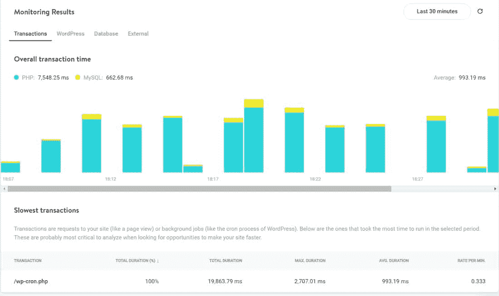

Kinsta APM’s ‘Transactions’ tab.

**事务**选项卡列出了监控期间花费时间最多的请求。从这里开始是优化你的网站的一个很好的方法。在这种情况下，wp-cron.php 的**是最慢的。它可以由 WordPress 本身、主题或任何插件触发。**

你可以[禁用 WP-Cron](https://kinsta.com/knowledgebase/disable-wp-cron/) 并用一个系统 Cron 代替它来提高你的站点性能。

接下来是 Kinsta APM 的**标签。在这里你会发现最慢的 WordPress 插件和钩子。**

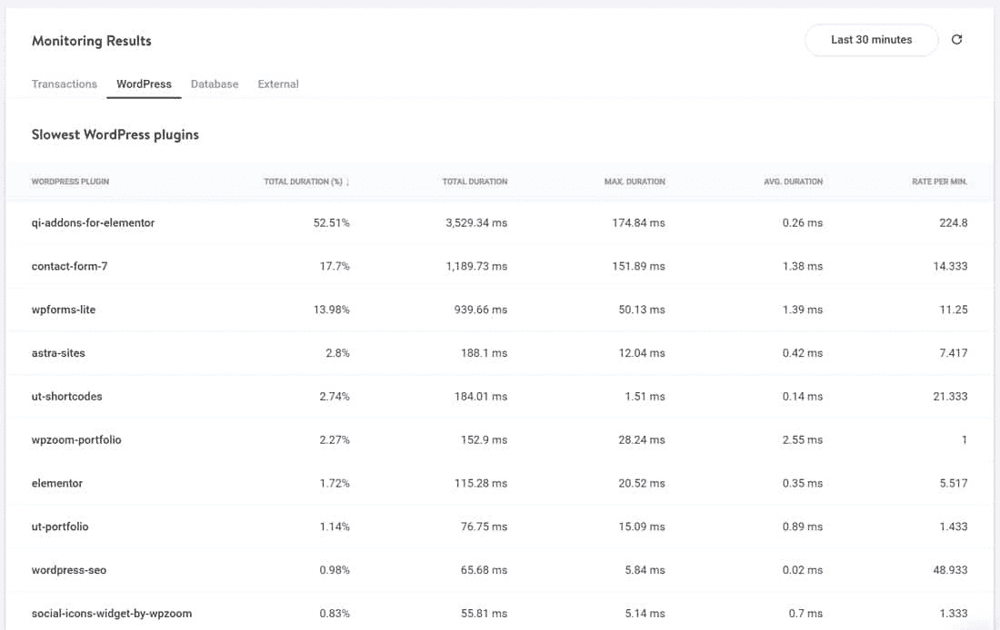

Kinsta APM’s ‘WordPress’ tab.

如果你在这里发现任何不必要的插件，或者有重复功能的插件，你可以从你的 WordPress 站点上删除它们。例如，我们可以在这里看到两个联系表单插件，和一个这个网站不需要的组合插件。

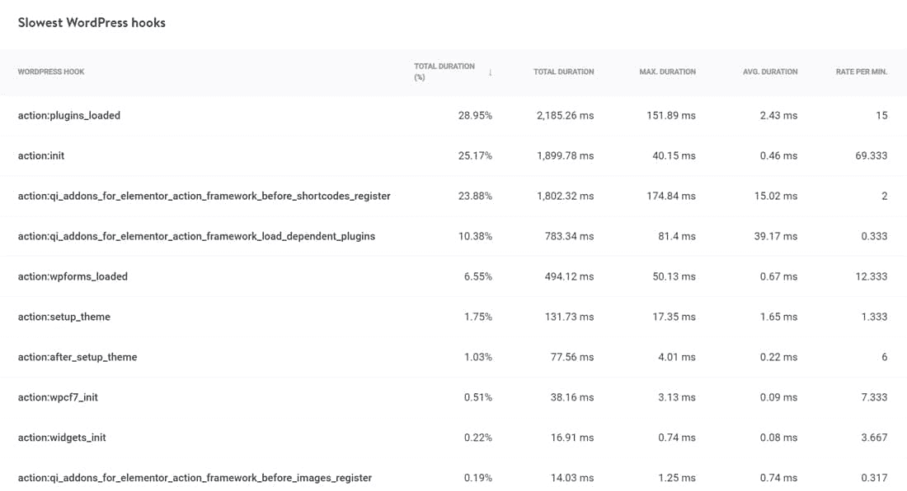

Kinsta APM showing the Slowest WordPress hooks.

继续向下滚动这个标签会显示最慢的 [WordPress 钩子](https://kinsta.com/blog/wordpress-hooks/)。

Kinsta APM 最有用的特性之一是跟踪最慢的 WordPress 钩子。您可以点击挂钩项目查看其交易样本。

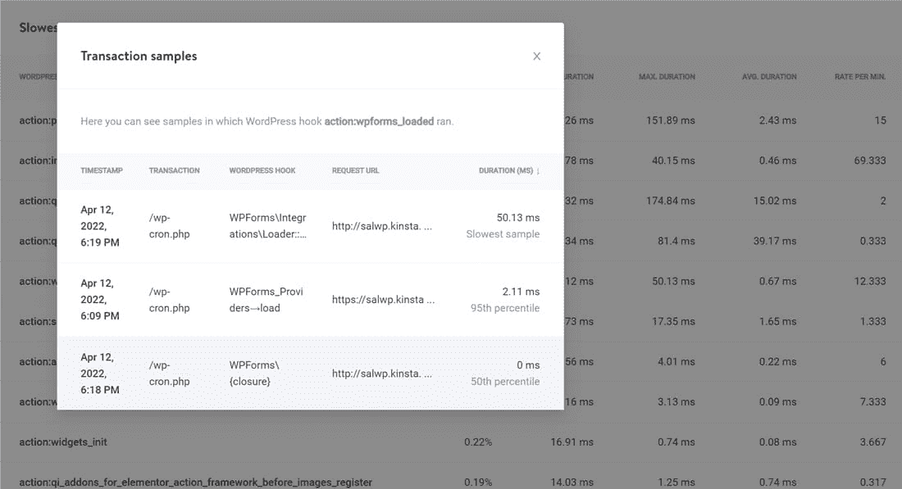

Seeing a slow hook’s transaction samples with Kinsta APM.

知道哪个插件、主题或钩子是性能瓶颈是一个成功的开始。然后，您可以采取适当的措施来提高网站性能并减少页面加载时间。

## 修复缓慢的 WordPress 网站的 17 种方法

知道是胜利的一半！根据这些知识采取行动，你就会看到结果。你已经完成了上面提到的所有测试。现在，让我们探索一下你可以提高缓慢的 WordPress 站点速度的潜在领域。

您可以使用下面的有用链接跳转到任何部分:

### 1.保持你的 WordPress 站点更新

维护你的 WordPress 站点的一个重要方面是保持它的更新。这似乎是最明显的一点，但还是值得提醒一下。

WordPress 更新包括安全补丁、最新功能和性能修复。

你可以[为你的站点在它的**wp-config.php**文件中启用自动更新](https://kinsta.com/blog/wordpress-automatic-updates/)。我们建议更新到[最新的 WordPress 版本](https://kinsta.com/blog/wordpress-version/)以保证你的网站安全。

### 信息

Kinsta 不会强制 WordPress 进行重大更新，因为每个网站在应用之前都应该测试这些重大的变化。您可以在我们的[暂存环境](https://kinsta.com/help/staging-environment/)中轻松完成。但是 WordPress 会自动应用安全补丁(比如 WordPress 5.x.1，6.x.2 等。)—同样不是金斯塔写的。

同样，你也应该保持你所有的活动插件和主题更新。如果你发现你的网站上有任何插件或主题已经超过一年没有更新了，是时候重新考虑它们了。多亏了 WordPress 丰富的生态系统，你很可能会找到更好的选择。

### 2.优化你网站的图片

根据[HTTP Archive](https://httparchive.org/reports/page-weight?lens=wordpress&start=2017_07_01&end=latest&view=list)(2022 年 3 月 1 日)，一个 WordPress 站点的平均页面权重是 2408 KB，其中图片几乎占了 1117 KB(占总页面权重的 46.38%)。

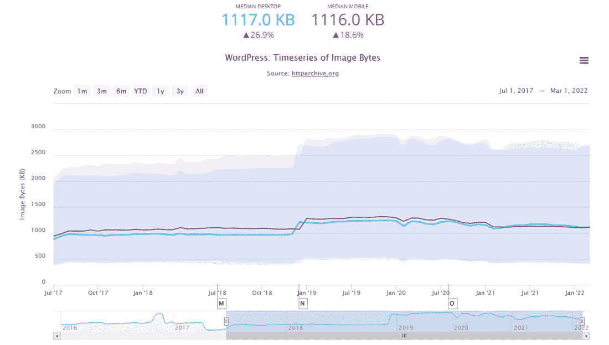

WordPress: State of Images. (Source: HTTP Archive)

难怪大图片会降低你网站的速度，造成不理想的用户体验。因此，优化图像，无论是手动还是使用插件，都可以大大加快页面加载速度。

优化图像时，您可以使用[有损或无损图像压缩方法](https://kinsta.com/blog/lossy-vs-lossless)。大多数图像编辑器在保存图像时提供质量调整，以实现最佳的图像压缩。有损压缩几乎总能在保留图像细节和减小文件大小之间找到最佳平衡点。

选择合适的[图像文件格式](https://kinsta.com/blog/image-file-types/)至关重要。png 非常适合计算机生成的图形，而 JPEGs 更适合照片。还有更多的图像格式，如 GIF、SVG、JPEG XR 和 WebP。有些被[所有的浏览器](https://kinsta.com/browser-market-share/)普遍支持，而有些则不支持，所以在选择它们之前你必须仔细研究。

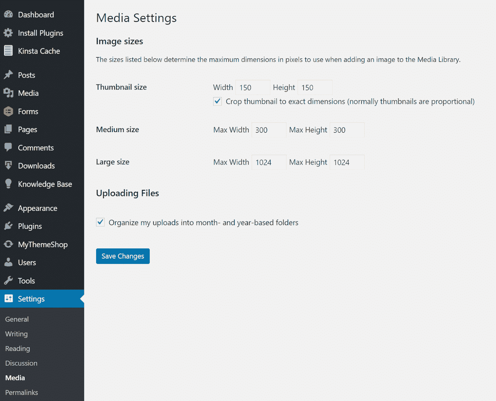

WordPress Media Settings -> Image sizes.

默认情况下，WordPress 支持响应图像。你可以设置你喜欢的图片尺寸，让 WordPress 来处理剩下的事情。但是如果你想节省磁盘空间，你可以使用免费的 WordPress 插件，比如 [Imsanity](https://wordpress.org/plugins/imsanity/) 来自动将大图片缩小到配置的大小。

至于 WordPress 图片优化插件， [Imagify](https://kinsta.com/blog/optimize-images-for-web/#imagify) 和 [ShortPixel](https://kinsta.com/blog/optimize-images-for-web/#shortpixel) 是一些流行的工具。在我们关于[优化网页图片](https://kinsta.com/blog/optimize-images-for-web/)的详细文章中，我们有更多的选择。

### 3.谨慎使用插件(仅在必要时)

插件是 WordPress 及其社区的生命。WordPress 列出了令人印象深刻的 54，000+免费插件库，加上其他地方列出的数千个插件，你可以疯狂地安装 WordPress 插件。

未经优化的 WordPress 插件会降低你网站的性能，增加加载时间。

尽管如此，你可以安装几十个 WordPress 插件而不损害你的网站的性能，但是你也必须确保这些插件被很好地编码并且为性能进行了优化。更重要的是，插件开发人员应该对它们进行优化，使它们能够很好地协同工作。

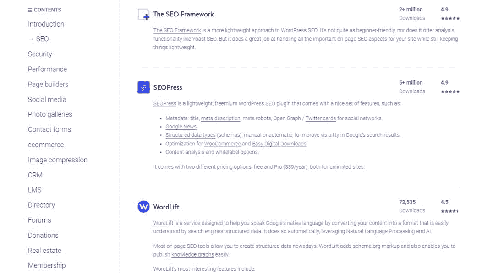

Kinsta’s hand-picked WordPress plugins list.

你可以浏览我们为各种用例精心挑选的最好的 WordPress 插件列表。无论是一个 [SEO 插件](https://kinsta.com/blog/best-seo-plugins-for-wordpress/)，一个[社交媒体插件](https://kinsta.com/blog/wordpress-social-media-plugins/)，一个[联系表单插件](https://kinsta.com/blog/wordpress-contact-form-plugins/)，还是一个[电子商务插件](https://kinsta.com/blog/wordpress-ecommerce-plugins/)，你一定会在那里找到有用的东西。

不管你已经安装了多少插件，你都可以参考本文中的步骤 3 和/或步骤 4 来确定你是否有任何有问题的插件。

### 4.选择一个快速的 WordPress 主题

选择一个快速的 WordPress 主题对于你的网站性能和用户体验是至关重要的。主题的功能，如布局、导航菜单、调色板、字体和图像位置，是访问者首先会注意到的。

如果这些功能没有得到很好的优化，你可能会有一个漂亮的网站，但也是一个非常慢的网站。

Hello Elementor is a popular WordPress theme.

在选择 WordPress 主题之前，列出你想在网站上使用的所有功能。然后研究并记下符合你要求的主题。

总是寻找值得信赖的高评级和优秀的客户支持的开发人员。我们还建议您避免不经常更新的主题。

无论是免费主题还是高级主题，选择能实现你网站目标的主题。为了方便你，我们测试了几十个 WordPress 主题，包括 WooCommerce 主题，并列出了表现最好的主题:

## 注册订阅时事通讯

### 想知道我们是怎么让流量增长超过 1000%的吗？

加入 20，000 多名获得我们每周时事通讯和内部消息的人的行列吧！

[Subscribe Now](#newsletter)

*   [2022 年最快的 WordPress 主题(基于彻底的测试)](https://kinsta.com/blog/fastest-wordpress-theme/)
*   [2022 年最快的 WooCommerce 主题(基于全面测试)](https://kinsta.com/blog/fastest-woocommerce-theme/)

[选择主题集中的主题，](https://kinsta.com/blog/how-to-choose-a-wordpress-theme/)因为我们经常发现它们简单而轻便。你可以找到大量功能性和美观的主题，而没有不必要的臃肿(例如，避免使用半生不熟的页面生成器插件的主题)。

如果你已经有了一个 live WordPress 站点，我们建议[建立一个 staging site](https://kinsta.com/blog/wordpress-staging-site/) 并在推送它之前测试新的主题。

### 5.配置缓存以优化您的网站

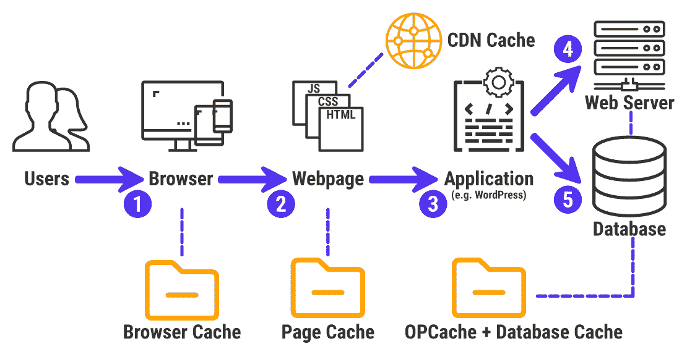

An illustration of various website caches.

缓存是一项复杂的多层技术。我们有一篇专门的文章只是为了解释[什么是](https://kinsta.com/blog/what-is-cache/)。简而言之，它是存储和调用频繁提供的数据以加快网站速度的过程。

WordPress 运行在 PHP 和 MySQL 上，如果不使用缓存，这两者都会变得臃肿。因此，你的站点速度是你、你的主机和缓存共同努力的结果。

大多数[托管的 WordPress 主机](https://kinsta.com/blog/managed-wordpress-hosting/)(包括 Kinsta)在服务器级别负责缓存，所以你不必自己实现它。然而，如果他们没有，你可以随时使用免费的 [WordPress 缓存插件](https://kinsta.com/blog/wordpress-caching-plugins/)(例如 [WP 超级缓存](https://kinsta.com/blog/what-is-cache/#wp-super-cache)， [W3 总缓存](https://kinsta.com/blog/w3-total-cache/))。

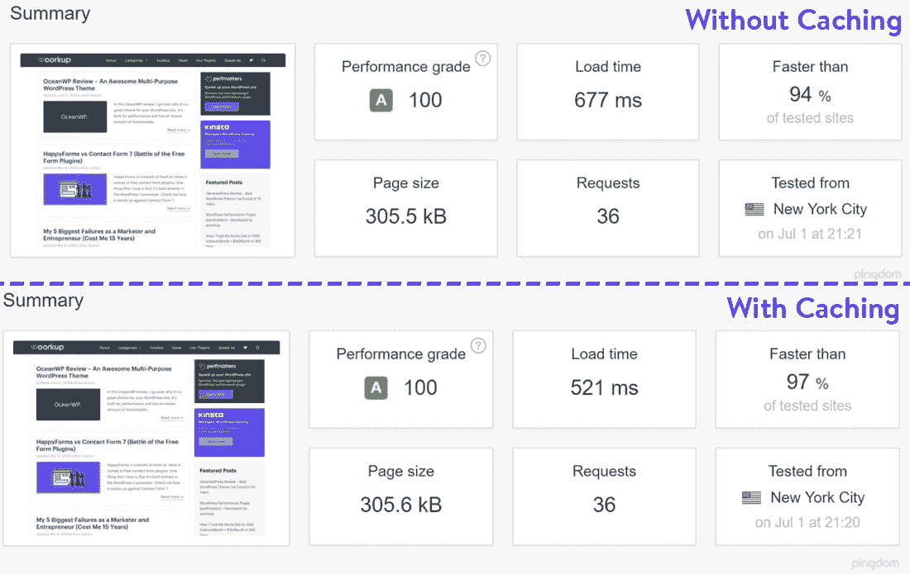

A Kinsta-hosted site — with and without cache.

即使没有启用缓存，上述网站的表现也非常好，因为它得到了合理的优化。然而，在启用缓存的情况下，它将其性能扩展了 **23%** 。如果你服务的是成千上万的独立访客，那么这些加载时间就会增加。

### 重要的

在 Kinsta，我们已经实现了不同类型的服务器级缓存，这比任何一个 PHP 插件都要好。因此，我们[不允许任何缓存插件](https://kinsta.com/knowledgebase/banned-plugins/#caching-plugins)来避免冲突。

### 6.减少外部 HTTP 请求(和 API 调用)

你的 WordPress 站点的主题和插件可能包括对各种资源的外部请求。通常，这些请求是为了加载外部托管的文件，如样式表、字体、脚本等。

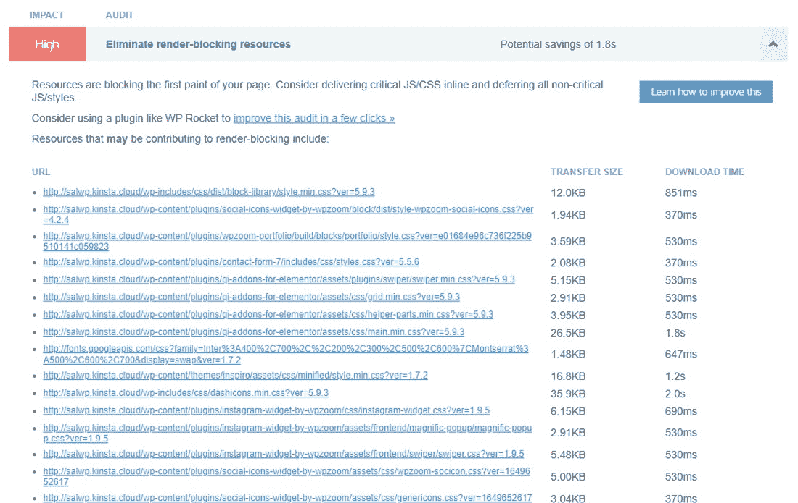

CSS can be a render-blocking resource.

有时候，它们是为了增加分析、社交媒体分享等功能。

使用其中一些是可以的，但是太多的话会降低你网站的速度。你可以通过减少 HTTP 请求的数量和优化它们的加载方式来提高网站的速度。

要获得详细的指南，你可以参考我们关于[如何减少 HTTP 请求](https://kinsta.com/blog/make-fewer-http-requests/)的文章。

### 7.缩小你网站的脚本和样式表

代码精简是从代码中删除不必要元素的过程。对于一个 WordPress 网站来说，这主要包括缩小 JS 脚本和 CSS 样式表。

这些元素是代码的一部分，因为人类(或 [web 开发人员](https://kinsta.com/blog/how-to-become-a-web-developer/))很容易读懂。这种元素的一个简单例子是代码注释。然而，这些元素对于机器(或[网络浏览器](https://kinsta.com/blog/most-secure-browser/))来说并不是必需的。

通过缩小你的网站代码，你有更小的 JavaScript 和 CSS 文件。它们不仅加载速度更快，而且被浏览器解析的速度也更快。它们一起可以极大地提高你的页面加载速度。

大多数 [WordPress 性能插件](https://kinsta.com/blog/wordpress-performance-plugins/)将帮助你毫不费力地做到这一点。一个流行的选择是免费的[自动优化插件](https://kinsta.com/blog/autoptimize-settings/)，在撰写本文时，它已经有超过 100 万的活跃安装。

如果你是 Kinsta 的客户，你不必担心安装第三方插件来利用代码缩减的优势。您可以直接从 MyKinsta 仪表盘进行同样的操作。

Using the ‘Code minification’ tool in MyKinsta.

这种缩小发生在 Cloudflare 的边缘网络上，该网络也支持 Kinsta CDN。它甚至也缓存在那里。Cloudflare 在其一端负责代码缩减，并从最近的[边缘服务器](https://kinsta.com/knowledgebase/edge-servers/)向访问者提供这些文件，从而释放您站点的服务器资源——这对高流量或意外高峰流量的站点至关重要。阅读我们的[代码精简文档](https://kinsta.com/help/kinsta-cdn/#code-minification-1)了解更多信息。

### 8.在每次页面加载时只加载必要的脚本

大多数 WordPress 主题和插件资源经常在所有页面上加载和运行，即使它们在一些页面上并不需要。例如，[联系人表单插件](https://kinsta.com/blog/wordpress-contact-form-plugins/)可以在每个页面上加载其资产，而不仅仅是在具有联系人表单的页面上(例如联系人页面)。

缩小和合并这些脚本可能会稍微提高您的网站性能，但首先阻止这些脚本和样式加载会更好。

我们建议使用免费的[资产清理插件](https://wordpress.org/plugins/wp-asset-clean-up/)来完成这项任务。它将扫描页面上加载的所有资产。然后，您可以选择这个页面上不需要的 CSS 和 JS 文件，从而减少臃肿。

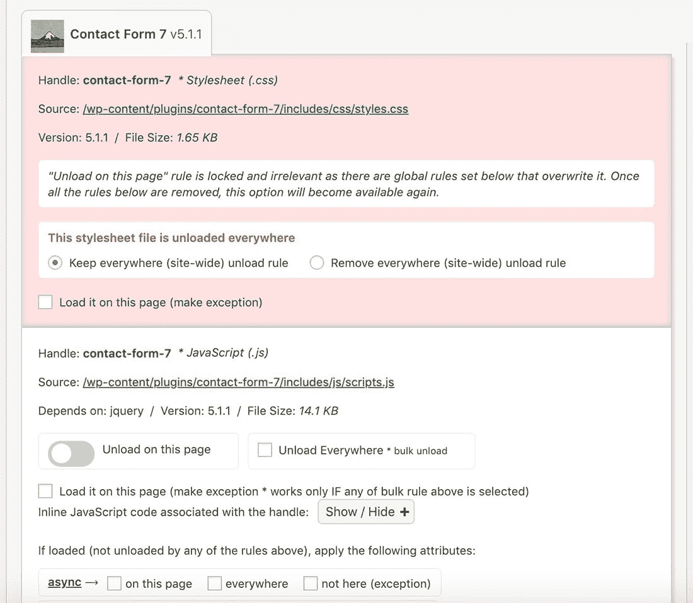

Using the ‘Asset CleanUp’ plugin. (Source: [WordPress.org](https://wordpress.org/plugins/wp-asset-clean-up/))

资产清理与缓存结合使用效果最好，因为 web 服务器不必重复生成优化的页面。

### 9.加速你缓慢的管理仪表板

通常，后端优化从优化前端开始，因为加速前端几乎总能解决后端的性能问题。

如果你有一个迟钝的 WordPress 管理员，你可以反过来做同样的事情——修复你的后端性能问题可能有助于提高你的网站的访问者速度。

对于这种情况，服务器级的 APM 工具总是很方便，因为安装额外的插件可能会进一步降低网站的速度。

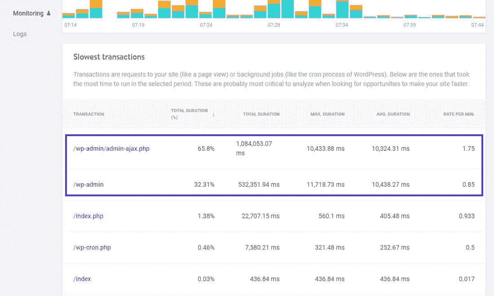

Finding the slowest transactions with Kinsta APM.

高 Admin-Ajax 使用率是 WordPress 站点中常见的性能瓶颈。然而，缓慢的 WordPress admin 也可能是由于后台 WordPress 任务造成的，比如 WordPress 备份、WP-Cron 等等(就像我们之前的例子)。或者它是一个臃肿的插件，给你的管理面板添加了太多的横幅。

有了 Kinsta APM，您[不再需要依靠猜测](https://kinsta.com/blog/woocommerce-apm/)。您将看到整个站点的确切性能数据，帮助您找出任何性能问题。

我们已经发布了 Kinsta APM 的各种用例来寻找 WordPress 的性能瓶颈——修复缓慢的 WordPress 管理仪表板就是其中之一。你可以按照这个指南来学习如何使用 Kinsta APM 来发现 WordPress admin 的性能瓶颈。

Kinsta APM 的一个很好的特性是它可以和任何类型的 WordPress 站点一起工作。和 WooCommerce 一样，你可以用它来发现 WordPress Multisite、[会员网站](https://kinsta.com/blog/membership-website-speed/)和 LMS 网站的性能问题。

### 10.服务器位置和配置很重要

您的 web 服务器的位置及其配置会对您网站的速度产生重大影响。

Struggling with downtime and WordPress problems? Kinsta is the hosting solution designed to save you time! [Check out our features](https://kinsta.com/features/)

例如，如果你的网络服务器在美国，你的网站对来自欧洲或印度的访问者的加载速度会比来自美国的访问者慢。

您可以通过以下方式缓解这一问题:

*   离你和大多数网站访问者最近的网络服务器。
*   一个覆盖全球的[CDN](https://kinsta.com/help/kinsta-cdn/)。

在 Kinsta，我们托管的所有网站都由 Google Cloud 提供支持。凭借其[ gcp-datacenter-count] 全球数据中心(并定期增加更多)，您可以在它们之间进行选择，将您的 web 服务器放置在离您的访问者最近的地方。

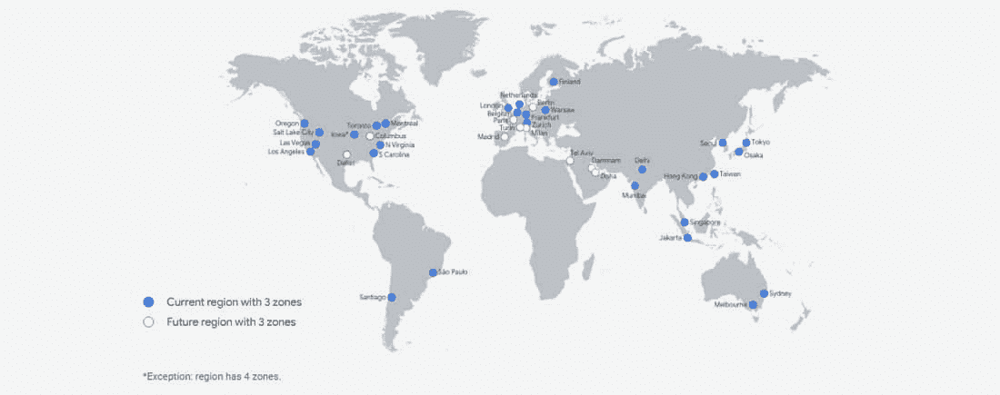

Google Cloud’s worldwide zones. (Source: [Google](https://cloud.google.com/about/locations#regions))

如果你的网站吸引了全世界的观众，你可以通过选择云交付网络(CDN)来进一步提高它的速度。Cloudflare 为 Kinsta CDN 提供支持——我们将在下一部分讨论这一点。

接下来是服务器配置—它使用什么硬件和软件堆栈？它们是为快速 WordPress 主机设计的吗？

[服务器资源是在一个大的网站池中共享](https://kinsta.com/blog/cheap-wordpress-hosting/)的，还是只供你一个人使用？

如果出现不可预测的流量激增，服务器资源能否自动扩展，或者每次出现这种情况时，您是否都必须升级到新的计划？

这些都是一个著名的虚拟主机公司会急切提供的问题。你必须始终积极寻找他们。

在 Kinsta，我们只使用最好的技术，从我们的服务器硬件到软件堆栈。我们所有的网站都托管在 GCP 的[计算优化的 C2 虚拟机](https://kinsta.com/blog/fastest-wordpress-hosting/#how-fast-are-computeoptimized-c2-vms)上——这些机器提供无与伦比的单线程性能——大多数与 WordPress 相关的进程都是单线程的。按照谷歌云的说法，它们还“在计算引擎上提供了最高的每核性能。”

将这些机器与 Nginx web server、8.1、LXD 容器和 MariaDB 等最先进的软件结合起来，你的网站将在眨眼间加载完毕。

### 11.使用内容交付网络(CDN)

提高网站速度最简单的方法之一就是使用快速可靠的 CDN。

CDN 通过直接向访问者提供内容来减轻 web 服务器的负担。这是一个服务器网络(也称为 pop ),旨在托管和交付网站内容的副本，如图像、样式表、字体、脚本和视频。

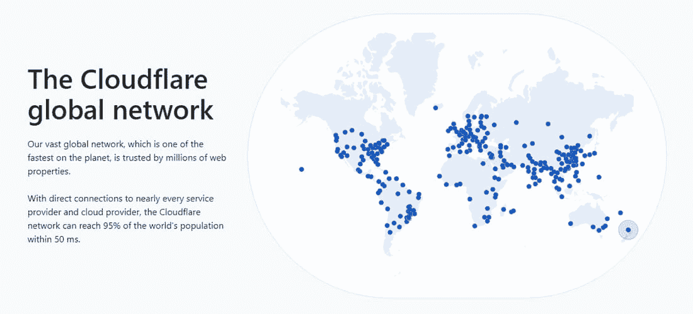

Cloudflare CDN powers all Kinsta websites.

我们建议每个网站至少使用某种类型的 CDN 来提高性能。

Kinsta + Cloudflare = Faster and More Secure Websites.

在 Kinsta，我们通过免费的 Cloudflare 集成来保护所有站点的安全。它不仅提供了企业级防火墙和 DDoS 保护，还通过其高性能的 HTTP/3 CDN 加快了网站的速度。

[亲自检查一下 Kinsta CDN 有多快](https://kinsta.com/help/kinsta-cdn/#how-fast-is-kinsta-cdn)——简直快如闪电。

**提示:**如果你的网站使用流行的开源 JavaScript 库(例如 [jQuery](https://kinsta.com/knowledgebase/what-is-jquery/) 、D3.js、three.js、Web Font Loader)，你可以使用 [Google 托管库](https://developers.google.com/speed/libraries) CDN 来加速它们的交付。

### 12.删除不必要的 URL 重定向

如果你用新的文章和页面更新网站，你的 URL 结构可能会有[的变化。在这种情况下，URL 重定向是一件好事。然而，如果你不遵循 WordPress 重定向最佳实践，你可能会对你网站的用户体验和](https://kinsta.com/knowledgebase/wordpress-change-url/)[搜索引擎优化(SEO)](https://kinsta.com/blog/what-does-seo-stand-for/) 产生负面影响。

配置不当的 URL 重定向最常见的问题是导致一连串的重定向。在某些情况下，这个链是一个无限的重定向循环。这种重定向链通常会导致页面加载时间增加。

错误配置的 URL 重定向有时会导致[错误 404“找不到页面”](https://kinsta.com/blog/error-404-not-found/)错误。如果您的站点生成大量 404 错误，也会影响您的站点性能，因为这些响应通常不会被缓存。

我们的 MyKinsta 仪表板包括一个[分析工具](https://kinsta.com/help/mykinsta-analytics/)来帮助您查看重定向和 404 错误的准确数量。

404 errors and 30x redirects breakdown in MyKinsta.

可以设计一个[创意 404 错误页面](https://kinsta.com/blog/error-404-not-found/#create-404-page)安抚登陆这里的用户。但从长远来看，这对你没有帮助。

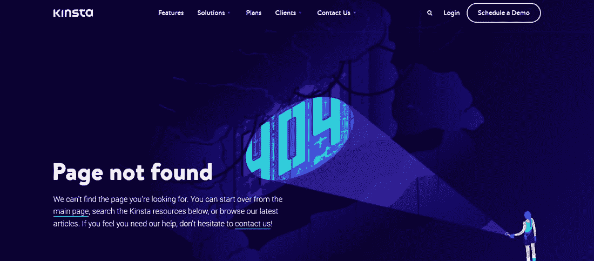

Kinsta’s Error 404 “Page not found” page.

以下是如何避免创建不必要的重定向:

*   使用正确的 URL 前缀(HTTP 或 HTTPS)。
*   从 URL 中保留或删除“www”子域(不要混淆)。
*   不要在 URL 中使用[文章和页面 id](https://kinsta.com/blog/wordpress-get-post-id/)。
*   包括完整的 URL 路径。
*   确保您的[顶级域名(TLD)](https://kinsta.com/knowledgebase/what-is-a-tld/) 在一次重定向内解析(理想情况下，应该没有重定向)。

WordPress 包括许多方法来[设置重定向](https://kinsta.com/blog/error-404-not-found/#update-your-wordpress-sites-permalinks)。其中之一是由约翰·戈德利开发的免费且受欢迎的[重定向插件](https://wordpress.org/plugins/redirection/)。

Using the free WordPress ‘Redirection’ plugin.

如果你的网站是由 Kinsta 托管的，你可以从你的 MyKinsta 仪表板[管理重定向](https://kinsta.com/help/redirect-rules/)。这个工具是设置重定向的一个更好的方法，因为规则是在服务器级实现的。这也意味着你需要安装的第三方插件少了一个。

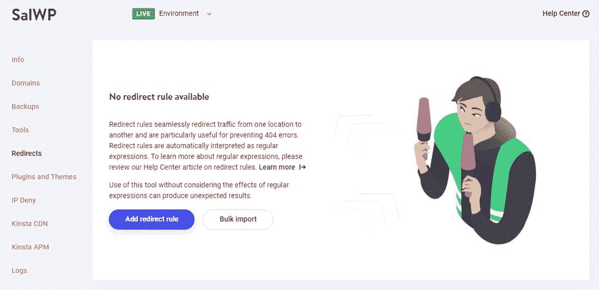

Adding redirect rules in MyKinsta.

转到您想要管理的站点，点击**重定向**选项卡。然后通过点击大的**添加重定向规则**按钮来添加一个新的重定向。

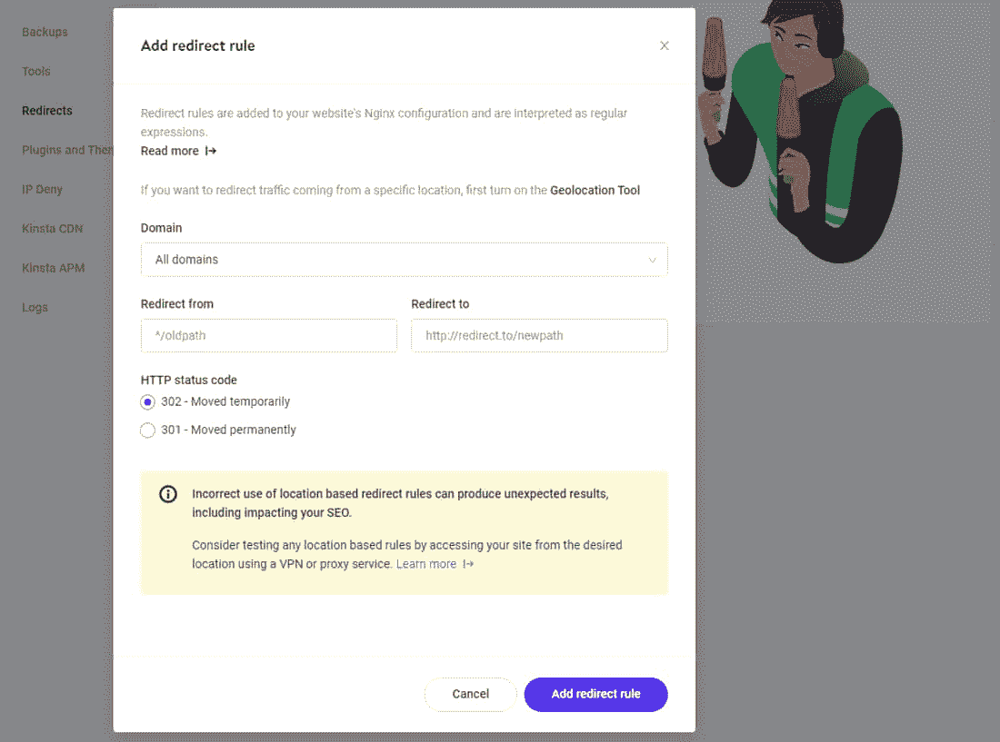

You can use regex to customize your redirects.

### 信息

在 Kinsta，我们试图通过自动缓存此类请求 15 分钟来最小化 404 错误对网站性能的影响。如果您创建了一个与缓存的 404 页面具有相同 URL 的新页面，我们将立即清除缓存，以便您的访问者可以看到新页面。这可以保护你的站点免受流量到动态 404 页面引起的 PHP 和 CPU 高峰的影响。

如果你的网络主机使用一个 [Apache 服务器](https://kinsta.com/knowledgebase/what-is-apache/)，你需要编辑它的**。htaccess** 文件来设置重定向。对于这种情况，你可以使用[。htaccess Generator site](https://www.htaccessredirect.net/) 为你的站点生成合适的重定向规则。

### 13.修复 WordPress 混合内容警告(HTTPS/SSL 错误)

今天，通过 HTTPS 协议运行你的 WordPress 站点是必须的。然而，当从 HTTP 迁移到 HTTPS 时，您可能会面临几个问题——最常见的是[“混合内容警告”警报](https://kinsta.com/blog/mixed-content-warnings/)。

当页面包含 HTTP 和 HTTPS 内容时，会出现混合内容警告。不安全地加载资源不仅仅是一个安全问题，也是一个潜在的性能问题。

如果你的网站出现混合内容错误，你可以使用一个免费的工具，比如 [Why No Padlock](https://www.whynopadlock.com/) 来查看哪些资源被不安全地加载。

然后，您可以执行快速搜索和替换来修复所有潜在的原因。免费的 [Better Search Replace](https://kinsta.com/knowledgebase/wordpress-search-and-replace/#2-install-a-wordpress-search-and-replace-plugin) 插件是解决这个问题的一种方法。如果你是 Kinsta 的客户，你可以从 MyKinsta 仪表板上使用我们内置的[搜索和替换工具](https://kinsta.com/knowledgebase/wordpress-search-and-replace/#1-use-mykinstas-search-and-replace-tool)。

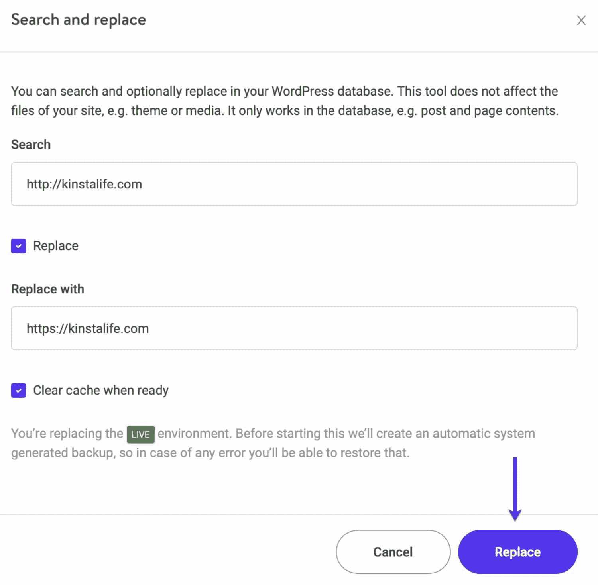

Using the ‘Search and replace’ tool in MyKinsta.

简单的搜索和替换应该可以解决所有的混合内容警告。但是如果没有，可能需要找到一些硬编码的脚本并手动更新。或者[雇佣一个可以为你做这些的开发者](https://kinsta.com/blog/hire-wordpress-developer/)。

### 14.定期优化你的 WordPress 数据库

WordPress 网站的数据库存储了所有关键信息。但是如果没有定期维护，它会降低你网站的速度。

例如，WordPress 数据库仍然可以保存你几年前创建网站时的信息。这包括帖子和页面修订、草稿、垃圾评论和删除的帖子。虽然它们可能有助于编辑和发布最近的帖子，但随着时间的推移，数据库将积累大量不必要的数据，变得臃肿。

因此，优化你的 WordPress 数据库对于提高和维护你网站的性能是必要的。

此外，一些插件和主题[向 wp_options 表](https://kinsta.com/knowledgebase/wp-options-autoloaded-data/)添加数据，以便更容易配置它们和自动加载设置。但是自动加载太多数据会降低页面响应时间。

你可以使用各种技术来优化 WordPress 数据库。一种方法是使用 [phpMyAdmin](https://kinsta.com/help/wordpress-phpmyadmin/) 或 [Adminer](https://kinsta.com/blog/adminer/) 手动清除过时的数据库项目。或者你可以使用 WordPress [数据库优化插件](https://kinsta.com/blog/wordpress-database-plugin/)比如 [WP-Optimize](https://kinsta.com/blog/wordpress-database-plugin/#4-wpoptimize) 、 [WP-Sweep](https://kinsta.com/blog/wordpress-database-plugin/#10-wpsweep) 和[高级数据库清理器](https://wordpress.org/plugins/advanced-database-cleaner/)。

Using the ‘Advanced Database Cleaner’ plugin.

在 Kinsta，[我们会根据您的需求自动优化您网站的数据库](https://kinsta.com/feature-updates/auto-db-optimize/)。通常，它每周运行一次，确保您的数据库处于最佳状态。如果自动化流程发现一些不寻常的事情，它会通知我们的管理团队，他们会对此进行调查。

### 15.选择基于云的 WordPress 安全服务

每天都有数千个 WordPress 网站被黑。因此，安全性对 WordPress 网站来说是一个关键问题，你必须时刻保持警惕。

你有两种主要的方法用防火墙保护你的 WordPress 站点:

1.  选择一个有良好记录的安全虚拟主机服务
2.  使用专门的第三方安全服务来保护您的网站

第一个选择是明确的。一个可靠的 WordPress 主机提供商会为你负责大部分的网站安全措施。

然而，如果你不得不选择第二个选项，你还有另外两个选择:

1.  选择一个 WordPress 安全插件(例如 Wordfence)
2.  选择 DNS 防火墙(例如 Cloudflare)

WordPress 安全插件[会消耗你网站的资源](https://kinsta.com/blog/third-party-performance/),因为它们需要持续和定期的扫描。

相反，您可以[选择 Cloudflare 等基于云的安全解决方案](https://kinsta.com/blog/sucuri-vs-wordfence/)。它们还提供额外的保护来抵御僵尸程序、DDoS 攻击和代理流量。

在 Kinsta，由于我们的 [Cloudflare 集成](https://kinsta.com/cloudflare-integration/)，您的站点受到服务器级安全措施和基于云的防火墙的保护。他们的企业级防火墙保护了 Kinsta 托管的所有网站。

此外，我们支持双因素身份认证(2FA)和 IP 地理位置阻止。我们还禁止一分钟内六次登录失败的 IP。此外，我们实施完全加密的连接(SFTP、SSH、HTTPS)，要求所有新安装的 WordPress 都有强密码，并提供黑客修复保证。

### 16.升级至最新的 PHP 版本

WordPress 主要由服务器端编程语言 [PHP](https://kinsta.com/knowledgebase/what-is-php/) 提供支持。甚至它的主题和插件也主要是用 PHP 编写的。

通常，新的 PHP 版本比旧版本更快。在 Kinsta，我们鼓励我们的客户使用最新的[支持的 PHP 版本](https://kinsta.com/blog/php-versions/)。它们提供了许多性能改进，也更加安全。

我们的[年度 PHP 基准测试](https://kinsta.com/blog/php-benchmarks/)发现，WordPress **在 PHP 8.1 上比在 PHP 8.0 上快 47.10%** 。与 PHP 7.2 相比，它甚至更快，每秒处理超过 **50%** 的请求。

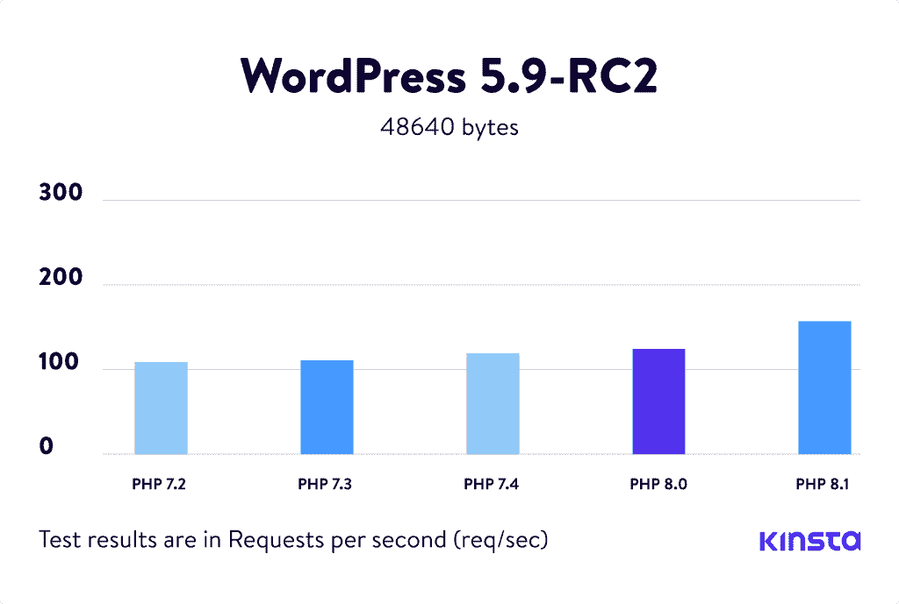

WordPress 5.9-RC2 PHP Benchmarks.

在我写这篇文章的时候，大多数 WordPress 插件、主题和开发工具还不支持 PHP 8.1。如果您计划将一个生产站点的环境升级到 PHP 8.1，我们建议您在一个临时环境中彻底测试它，以确保它不会崩溃。

然而，如果您的服务器仍然是 PHP 7.x 版本，您可以升级到 PHP 8.0 并获得同样的好处。

Kinsta 在所有环境下都支持 PHP 8.1 ，所以你可以在升级之前在上面彻底测试你的站点。如果你的主机没有给你更新到最新 PHP 版本的选择，是时候重新考虑你的主机提供商了。

### 17.切换到受信任的托管 WordPress 主机

如果你已经尝试了上面列出的所有步骤，但你仍然停留在一个缓慢的 WordPress 网站上，剩下的唯一选择就是切换到一个可靠的 WordPress 主机提供商。

通常，托管 WordPress 主机有多种功能来帮助 WordPress 站点高效、安全、快速地运行。所有的技术诀窍都留给了专家，让您专注于经营您的企业。

托管 WordPress 主机通常比共享主机或 DIY VPS 主机成本更高，但你会得到你所支付的。一些受欢迎的托管 WordPress 主机有 [Kinsta](https://kinsta.com/plans/) (即美国) [WP 引擎](https://kinsta.com/wp-engine-alternative/)、[飞轮](https://kinsta.com/flywheel-hosting-alternative/)、[presable](https://kinsta.com/pressable-alternative/)和 [Pagely](https://kinsta.com/pagely-alternative/) 。

不管你最终和谁一起托管你的网站，做好你的研究，确保它符合你网站的要求。大多数托管的 WordPress 主机也提供[免费迁移](https://kinsta.com/wordpress-migration/)(包括 Kinsta)，所以你可以轻松地将你的网站迁移到一个新的主机上，而不需要停机。

这是一个简单的问题——有很多可能的答案！😅本指南探索了所有这些问题(提供可行的、有用的解决方案)🚀 点击推文

## 摘要

修复一个运行缓慢的 WordPress 站点需要很多步骤，但是你可以做到。拥有一个快速的网站有助于提升你的搜索引擎优化、用户体验和转化率。另外，每个人都喜欢快速的网站！

在你跳转到一个新的网络主机之前，我们建议你解决本文中列出的所有问题。如果你决定转换，确保[新主机提供正确的工具和支持](https://kinsta.com/features/)，让它值得你的投资。

如果你能修复缓慢的 WordPress 站点，请在评论中告诉我们。看看我们的 *[加速你的 WordPress 网站的终极指南](https://kinsta.com/learn/speed-up-wordpress/)，* *，它列出了更多你可以优化你的慢速网站的地方。*

* * *

让你所有的[应用程序](https://kinsta.com/application-hosting/)、[数据库](https://kinsta.com/database-hosting/)和 [WordPress 网站](https://kinsta.com/wordpress-hosting/)在线并在一个屋檐下。我们功能丰富的高性能云平台包括:

*   在 MyKinsta 仪表盘中轻松设置和管理
*   24/7 专家支持
*   最好的谷歌云平台硬件和网络，由 Kubernetes 提供最大的可扩展性
*   面向速度和安全性的企业级 Cloudflare 集成
*   全球受众覆盖全球多达 35 个数据中心和 275 多个 pop

在第一个月使用托管的[应用程序或托管](https://kinsta.com/application-hosting/)的[数据库，您可以享受 20 美元的优惠，亲自测试一下。探索我们的](https://kinsta.com/database-hosting/)[计划](https://kinsta.com/plans/)或[与销售人员交谈](https://kinsta.com/contact-us/)以找到最适合您的方式。