# 如何使用 Elementor 创建一个 WordPress 站点:终极指南

> 原文：<https://kinsta.com/blog/wordpress-elementor/>

一个设计精美的网站可以给人留下很好的第一印象。然而，建立一个一流的网站并不总是容易的——尤其是如果你以前没有设计或开发经验的话。

这就是 WordPress Elementor 网站构建器的用武之地。通过选择这个现代的、用户友好的插件，你不用写一行代码就可以创建一个令人惊叹的网站。

这篇文章将涵盖你需要知道的关于这个非常流行的 WordPress 页面生成器的一切。然后，我们将向您展示如何导航 Elementor 的一些最基本的任务，例如创建布局、页面，甚至自定义[元素或模板](https://kinsta.com/blog/elementor-templates/)。我们开始吧！

## wordpress 元素或的介绍

在互联网的早期，创建一个网站需要先进的网络开发和设计技能，或者需要专业团队的帮助。这意味着建立一个网站是耗时的，往往令人沮丧，并可能昂贵。

多亏了[现代页面生成器](https://kinsta.com/blog/divi-vs-elementor/)，现在[无需专业技能就可以创建一个专业设计的](https://kinsta.com/blog/website-design-software/)、[高性能网站](https://kinsta.com/learn/speed-up-wordpress/)。一旦你的网站开始运行，你可以在任何时候快速方便地添加内容或改变布局，即使你不是程序员。

有各种各样的 WordPress 页面生成器，但是拥有超过五百万活跃安装的， [Elementor 插件](https://elementor.com/)是最受欢迎的一个。 [Elementor](https://kinsta.com/partners/elementor/) 让你可以通过直观的拖放编辑器创建从整个网站到单个[登陆页面](https://kinsta.com/blog/wordpress-landing-page-plugins/)的任何东西。

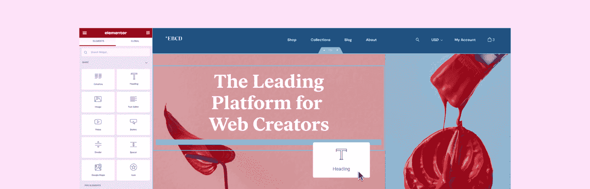

Elementor page builder

有了 Elementor，你可以用一个平台控制网站设计的所有方面。这样，你的网站就能完美地反映你的品牌。

> 需要在这里大声喊出来。Kinsta 太神奇了，我用它做我的个人网站。支持是迅速和杰出的，他们的服务器是 WordPress 最快的。
> 
> <footer class="wp-block-kinsta-client-quote__footer">
> 
> 
> 
> <cite class="wp-block-kinsta-client-quote__cite">Phillip Stemann</cite></footer>

[View plans](https://kinsta.com/plans/)

Elementor 直观、无代码的编辑器在没有设计和开发经验的网站所有者中特别受欢迎。它也非常适合有网络创业想法但不一定有资金雇佣专门的设计或开发团队的企业家和小企业。

即使你是一个有经验的专业人士，也有很多理由使用 Elementor。仅仅因为你有编码技能并不意味着总是从头开始创造一切是明智的。

Elementor 有很多功能可以帮助你在更短的时间内建立获奖的网站。这包括[超过 90 个现成的小工具](https://elementor.com/widgets/)和[专业设计的网页模板](https://elementor.com/library/)。

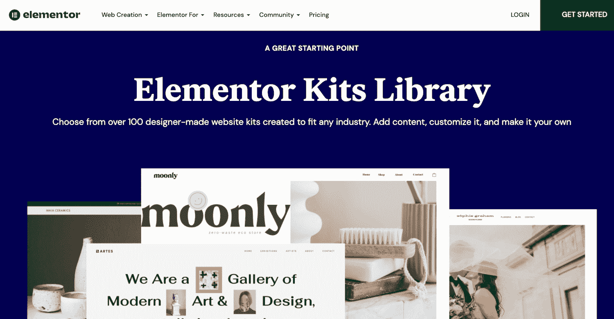

Elementor website homepage

这样，Elementor 可以提高你的生产力和利润。如果你经常建立 WordPress 网站，这些节省时间的功能可能会特别有利可图(也就是说，对于自由开发者和 T2 WordPress 代理来说)。

## Elementor 免费版 vs Elementor 专业版

Elementor 是“免费增值”软件。你可以[免费下载核心 Elementor 插件](https://wordpress.org/plugins/elementor/)或者购买 [Elementor Pro](https://elementor.com/pro/) 许可证。

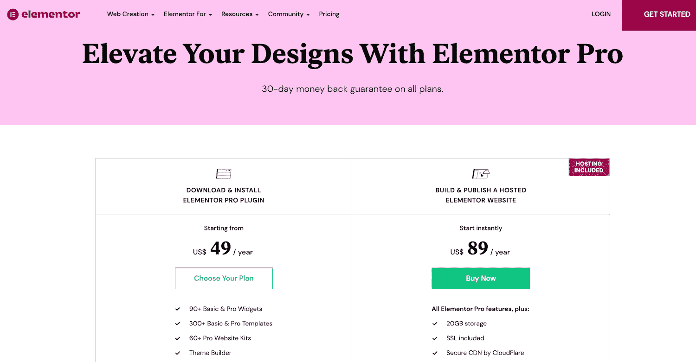

Pricing options for Elementor pro

免费的 WordPress 插件提供了构建视觉上吸引人的销售页面所需的一切，[产品列表](https://kinsta.com/blog/woocommerce-tutorial/)，[商业网站](https://kinsta.com/blog/wordpress-enterprise/)等等。它包括 40 多个小部件、100 个模板和 300 多个块。块是预先设计的部分模板，您可以混合和匹配，以创建独特的设计。

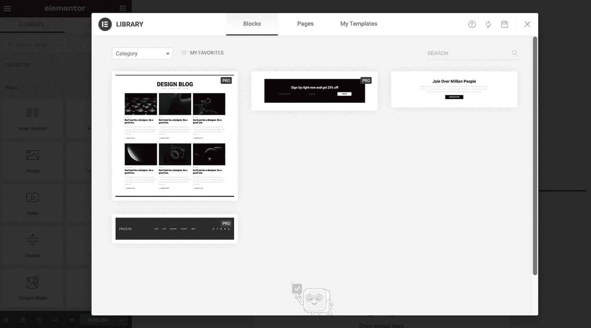

Elementor Blocks library

如果您想要更高级的功能，您可以购买 Elementor Pro。这将解锁一些额外的小部件，以及 Elementor 的[主题生成器](https://elementor.com/features/theme-builder)。

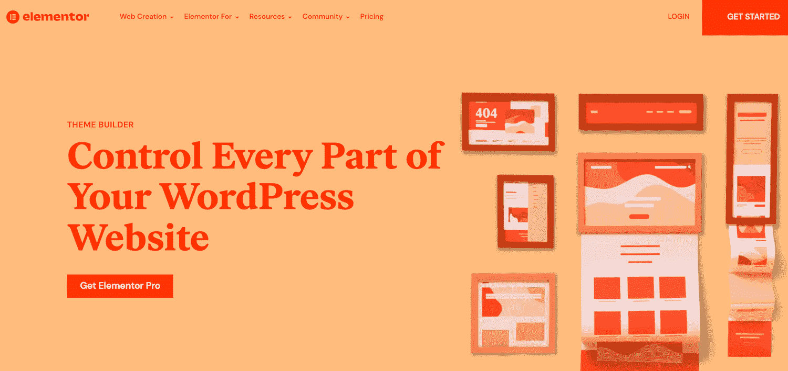

Elementor Theme Builder

使用主题构建器，您可以编辑几乎所有的站点元素，包括页眉和页脚。您还可以创建自定义的帖子和存档页面设计。

如果你正在开发一个在线商店，Elementor Pro 还包括一个 [WooCommerce Builder](https://elementor.com/features/woocommerce-builder/) 。您可以用它来定制您网站的 WooCommerce 内容，包括产品页面、产品档案和结账页面。你还可以访问专门为提高转化率而设计的小工具，比如[定制添加到购物车](https://elementor.com/help/custom-add-to-cart-pro/)、[追加销售](https://elementor.com/help/woocommerce-single-upsell-pro/)，以及[产品相关](https://elementor.com/help/woocommerce-single-product-related-pro/)。

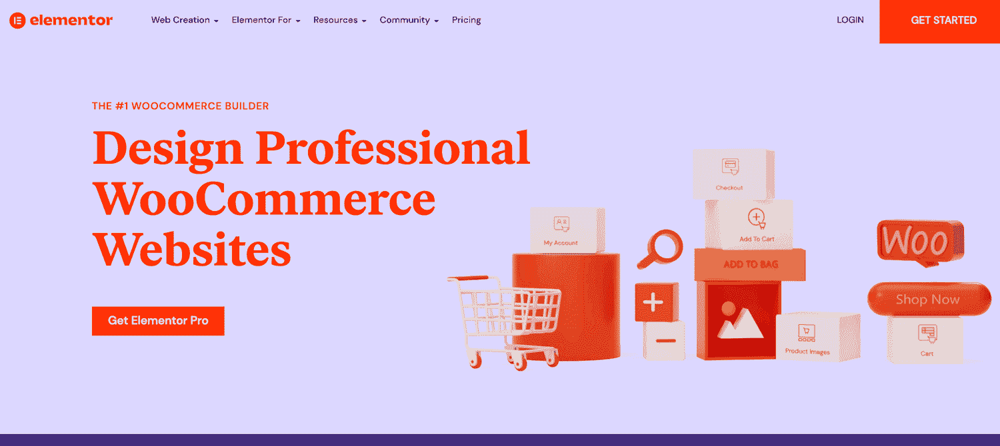

Elementor WooCommerce Builder

Elementor Pro 还附带了一个[弹出生成器](https://elementor.com/features/popup-builder/)和一个[表单生成器](https://elementor.com/features/form-builder/)。虽然有单独的插件可以帮助你[创建表单](https://kinsta.com/blog/wordpress-forms/)和[弹出窗口](https://kinsta.com/blog/elementor-popup/)，但是通过选择 Elementor，你可以最小化你需要安装和维护的插件数量。

使用太多插件会使你的网站更容易被黑客攻击。它甚至可能[影响你网站的性能](https://kinsta.com/learn/page-speed/)。因此，最佳做法是尽量减少已安装的数量。此外，由于你使用相同的平台来设计你的站点的所有元素，你会发现获得一致的外观和感觉更容易。

Elementor Pro 许可证包括对 60 多个 Pro 网站套件的访问。这些是模板、页面、弹出窗口和其他组件的捆绑包，可以帮助您创建一个完整的网站。如果您购买了专家许可证或更高版本，您还可以访问 20 个专家网站工具包。

此外，每个 Pro 许可证都包括高级支持。通常，你会在一天之内从 Elementor 的专家支持团队那里得到答案。但是，如果您选择 Elementor Pro Studio 或更高版本，您将升级到 VIP 支持。这让你可以和 Elementor 的 VIP 支持团队进行实时聊天。您还会在您的机票上收到优先回复，通常会在 30 分钟内到达。

如果你是一个代理商、开发商或设计师，你可能会对一个[专家网络](https://experts.elementor.com/)档案感兴趣。在那里，你可以展示你的作品，吸引潜在客户的注意。

Elementor Experts Network

如果你对通过专家网络做广告感兴趣，你也可能对 Elementor Pro 的专家、工作室或代理许可证感兴趣。这些许可证授权您在这个流行的市场上创建个人资料。

Elementor Pro 计划的价格从每年 49 美元到 999 美元不等。该公司还提供 30 天退款保证，所以你可以在购买前尝试一下。

## 如何安装元素或

因为是 WordPress 插件，[安装 Elementor](https://kinsta.com/knowledgebase/how-to-install-wordpress-plugins/) 既快又简单。你可以直接从你的 WordPress 仪表盘下载[免费插件](https://wordpress.org/plugins/elementor/)。

要下载免费版本，请导航至**插件>添加新插件**。在搜索栏中，输入**元素或**。当插件出现时，点击**立即安装**。

出现提示时，点击**激活**。这个插件会在你的 WordPress 工具条上添加一个**元素** r 选项。

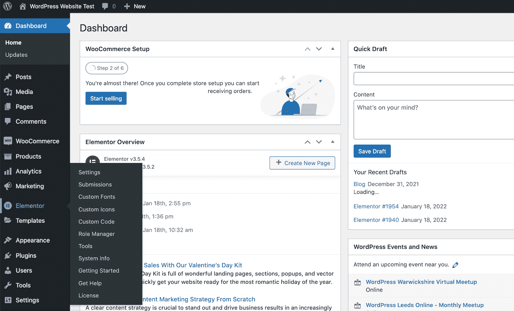

Elementor in the WordPress dashboard

你现在可以开始使用 Elementor 了！要开始，只需点击侧边栏中的 Elementor 选项。

或者，你可以直接从 WordPress 知识库下载 Elementor 插件。然后，登录你的 WordPress 仪表盘，导航到**插件>添加新的>上传插件**。然后你可以点击**选择文件**，并选择元素或*。您刚刚下载的 zip* 文件。

### 如何将 element 或 pro 连接到 wordpress

有两种方法可以将 Elementor Pro 连接到 WordPress。如果您尚未购买 Elementor Pro 许可证，您需要前往官方网站，并选择**开始使用**。

然后，您可以按照屏幕指示创建 Elementor 帐户。出现提示时，输入一些关于您想要制作的网站类型的信息。

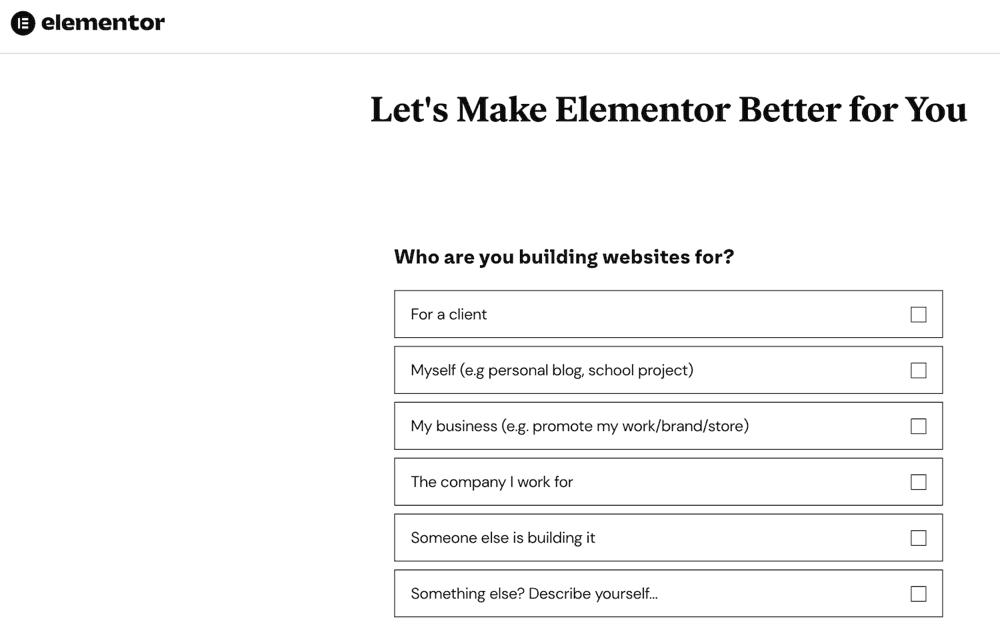

Create an Elementor account

接下来，选择您想要购买的计划。因为 Elementor 需要一个活跃的 WordPress 网站，你需要输入你的站点的域名。然后 Elementor 会执行一个检查来验证你的站点是否使用了 WordPress 平台。

假设你有一个活跃的 WordPress 网站，下一步是点击**安装元素或**。如果你当前已经登录到你的站点，你会被自动重定向到 Elementor 插件页面。

出现提示时，点击**立即安装>激活**。然后 Elementor 会将页面生成器插件添加到您的站点中。

或者，如果您已经购买了 Elementor Pro 许可证，请访问官方网站，并使用您在确认电子邮件中收到的详细信息登录。

在您的 Elementor 帐户中，从左侧菜单中选择**订阅**。然后你可以点击**下载 Zip。**

Download Zip

接下来，登录你的 WordPress 仪表盘，导航到**插件>添加新的**。然后你可以上传 Elementor Pro *。您刚刚下载的 zip* 文件。

安装并激活 Elementor Pro 后，WordPress 会提示您输入许可密钥。或者，您可以导航至**元素或>许可>连接&激活**。

如果您当前登录了 Elementor 帐户，WordPress 会自动验证您的许可证。如果您不是，请在提示激活您的许可证时输入您的 Elementor 或用户名和密码。

## 使用 Elementor:需要掌握的 4 项基本任务

使用 Elementor，您可以设计独特的网站，而无需特殊的设计或开发技能。然而，在建立一个完整的网站之前，熟悉基础知识是有帮助的。考虑到这一点，下面是对 Elementor 工作流的快速介绍。

### 1.启动元素或页面生成器

要在 Elementor 页面生成器中设计新的页面或帖子，请导航至**页面/帖子>添加新的**。你可以通过点击**用 Elementor 编辑来启动 Elementor 编辑器。**

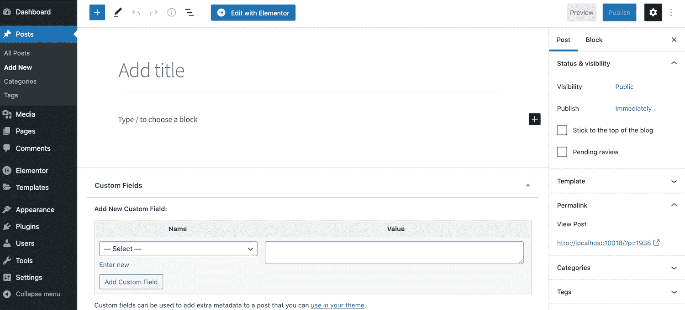

Edit with Elementor option in the editor

或者，您可能有一个可以从改造中受益的现有页面。在这种情况下，只需导航到有问题的页面并打开它进行编辑。然后你可以点击**用元素编辑或**按钮。

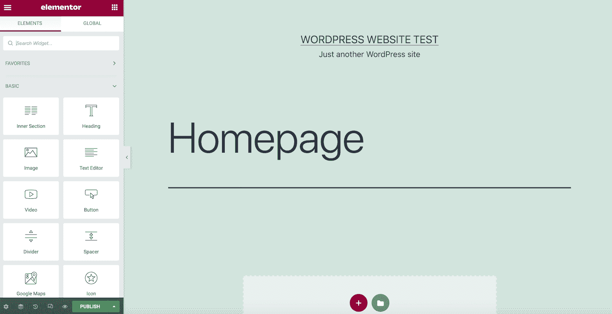

Elementor editor open

在屏幕的左侧，你会看到 Elementor 工具条。在这里，您可以找到所有可以添加到设计中的元素，例如按钮和标题。

Elementor 侧边栏还包含一个**全局小部件**部分。如果您计划在多个设计中重用同一个小部件，您可能希望将其保存为全局小部件。这使得您可以随时轻松访问自定义元素。它还提供了一个中心位置，您可以在这里编辑您的小部件一次，以进行通用的更改。然后 Elementor 会在你的整个网站上复制这些变化。

右侧是实时预览画布，您可以在其中创建自己的设计。Elementor 将自动更新，在您进行编辑时实时显示您的更改。

### 2.添加部分、列和小部件

Elementor 编辑器提供了对三个主要构建块的访问:部分、列和小部件。我们已经谈到了 Elementor 的现成部件，所以让我们看看如何将它们添加到您的设计中。

通常，您将通过点击主画布中的 **+** 图标来创建一个部分。元素师会让你**选择你的建筑。**

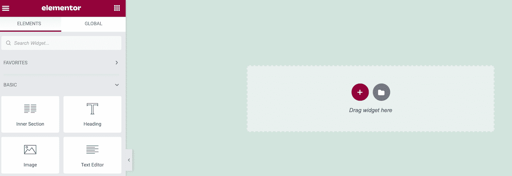

Add a section in Elementor

结构选项由一列或多列组成。最后，您将把小部件放在这些列中。它们在创建更有组织的布局中起着重要的作用。

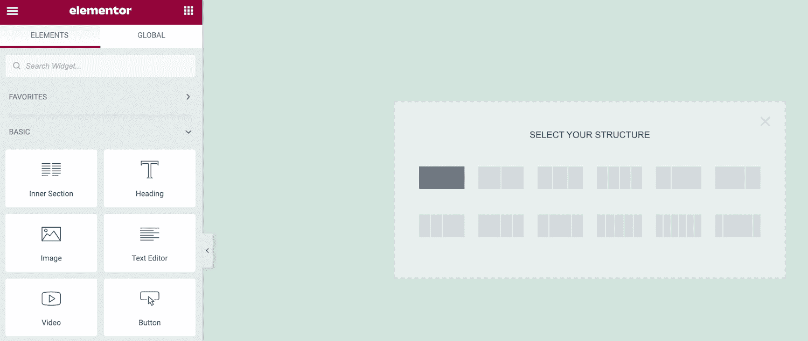

Select your column structure

做出决定后，Elementor 会将此部分添加到您的布局中。要将此部分移动到新位置，请单击它，然后抓住出现的蓝色虚线手柄。

要编辑一个部分，只需按住 Control 键并点击这个蓝色的点状手柄。这将启动一个上下文菜单，您可以在其中进行简单的更改，如复制或删除所选部分。

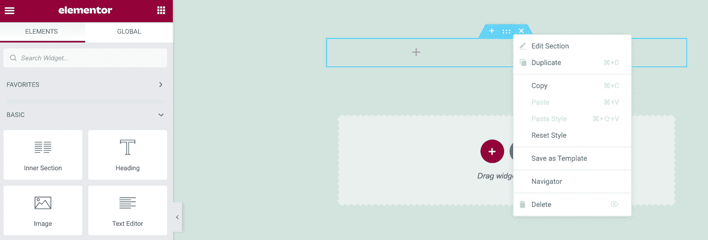

Add more sections any time

假设您想要进行更复杂的编辑，按住 Control 键单击蓝色手柄并选择**编辑部分**。Elementor 侧边栏现在将会更新，显示您可以对此部分进行的所有其他更改。

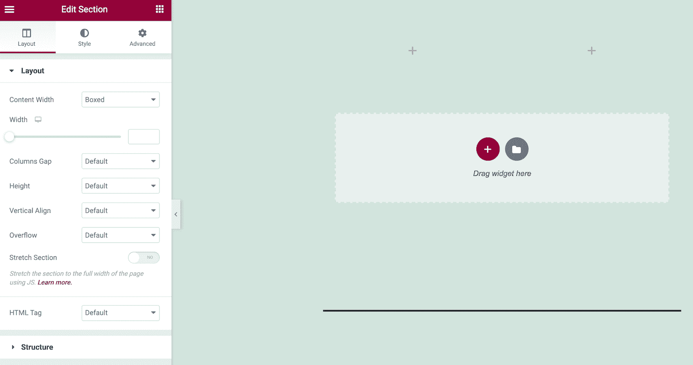

Additional, more complex edits are available

您还可以向此部分添加小部件。在 Elementor 侧边栏中，找到您想要使用的小部件，并将其拖到主画布上。

当您拖动小部件时，Elementor 会高亮显示您可以放置该项的所有不同部分和列。当你准备好了，只需释放你的鼠标。Elementor 现在会将这个小部件添加到您选择的部分。

### 3.编辑您的网站设置

您可以使用 Elementor 或编辑站点范围的设置。这包括改变默认字体和 HTML 颜色。你也可以修改 WordPress 添加到网站图片等元素上的边框和阴影。

通过在站点级别调整这些设置，你可以确保整个 WordPress 网站的外观和感觉一致。这个过程也比一页一页地应用这些更改要快得多，也容易得多。要查看可用的站点设置，请点击 Elementor 或侧边栏中的 hamburger 菜单。

## 注册订阅时事通讯

### 想知道我们是怎么让流量增长超过 1000%的吗？

加入 20，000 多名获得我们每周时事通讯和内部消息的人的行列吧！

[Subscribe Now](#newsletter)

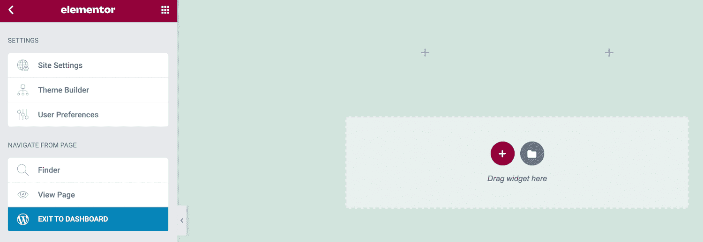

Configure site-wide settings

现在，您可以探索您的选项，并进行任何必要的更改。当你准备好发布你的新站点设置时，点击 Elementor 侧边栏最底部的**更新**按钮。

### 4.检查您的修订历史

当你编辑你的设计时，Elementor 会悄悄地记录你的修改。你可以很容易地撤销你的编辑，如果你意识到你犯了一个错误，这可能是一个救命稻草。

Elementor 的历史日志也给了你实验的自由。您可以测试各种更改，然后快速删除它们。通过鼓励你去尝试，Elementor 可以提高你完成的设计的质量。

要查看 Elementor 的日志，点击侧边栏底部的**历史**图标。**动作**标签记录你在 Elementor 中所做的每一个改变。这可以是从创建新部分到编辑现有文本的任何内容:

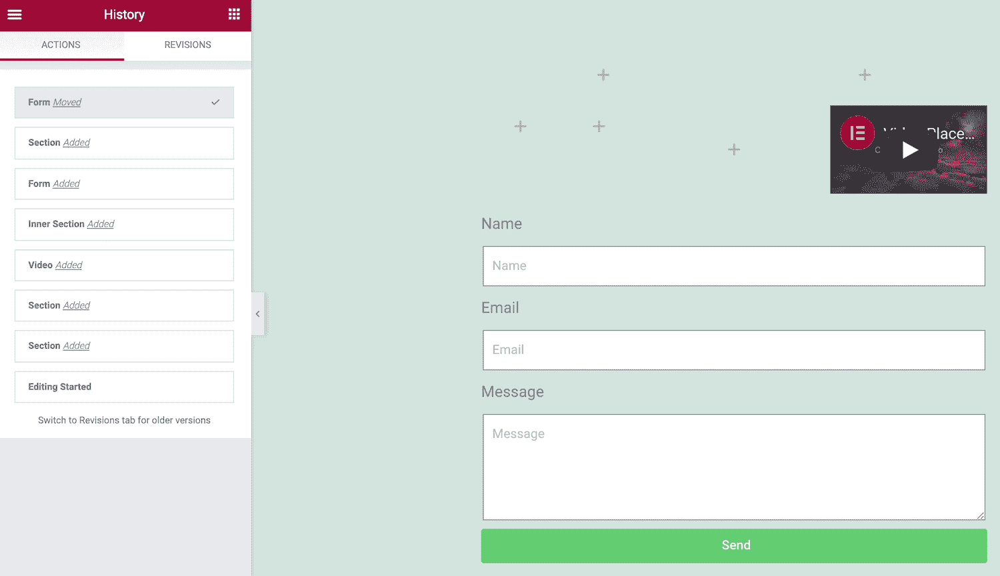

Viewing the Elementor log

每次按下**保存**，Elementor 会将页面的当前版本记录为新的修订版。您可以在**修订**选项卡中查看所有这些快照。如果您想恢复到之前的保存，只需在**修订**列表中找到并点击它。

## 如何在 Elementor 中构建页面(2 种方法)

现在，您已经熟悉了基本的 Elementor 工作流，让我们看看如何使用这些知识来设计一些新的页面。首先，我们将介绍使用免费的 Elementor 插件创建一个标准的 WordPress 页面。然后我们将看看如何使用 WooCommerce 和 Elementor Pro 开发高转化率的产品页面。

### 1.如何创建一个标准的 WordPress 页面

每个网页都不一样。然而，在不同的网站上你会发现一些共同的元素。这包括标题、正文和[媒体，如图像](https://kinsta.com/blog/wordpress-media-library/)。让我们看看如何创建一个包含这些关键组件的页面。

首先，通过导航到**页面>用元素或**添加新的>编辑来创建一个新页面。接下来，点击 **+** 图标，为您的设计添加一个部分。我们将从标题开始，所以我们希望选择单列布局。

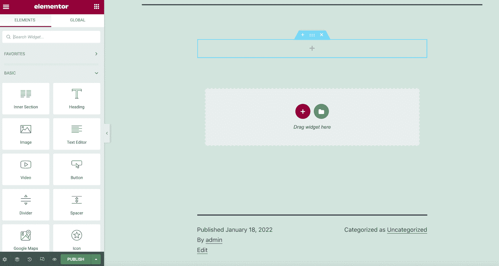

Create a new Elementor page

在 Elementor 侧边栏中，找到 Heading 小部件。现在，将这个小部件拖放到您的新部分中。然后，您可以在 Elementor 或边栏中键入标题文本，并使用各种设置来设置标题的样式。

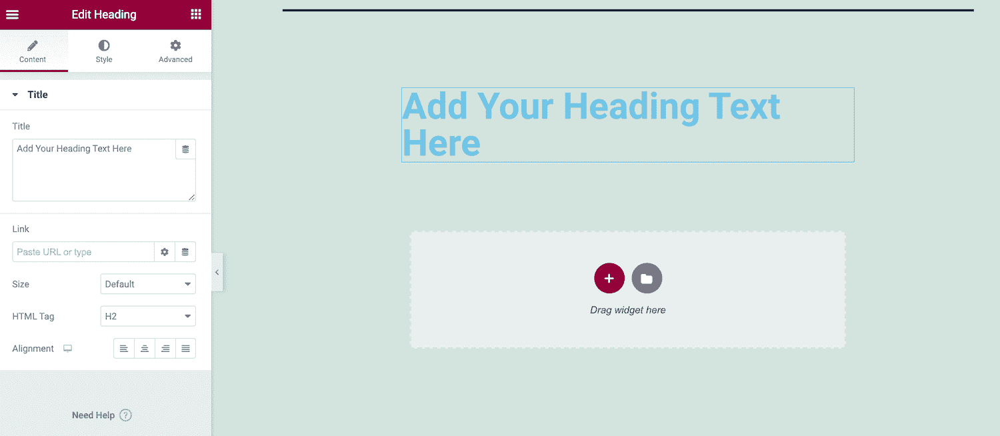

Style your heading title

然后，点击 **+** 图标添加第二部分。我们将嵌入一个图像，然后提供一些支持文本，所以现在我们将选择多栏布局。

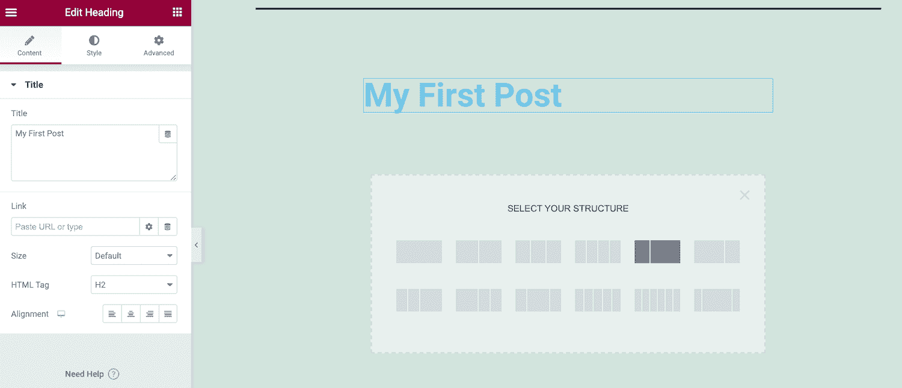

Add a section and select columns

接下来，将文本编辑器小部件从 Elementor 侧边栏中拖放到这个新部分中。然后，您可以使用边栏设置来添加文本并设置其样式。

当您对文本满意时，找到图像小部件。同样，使用拖放将这个小部件添加到您的部分。

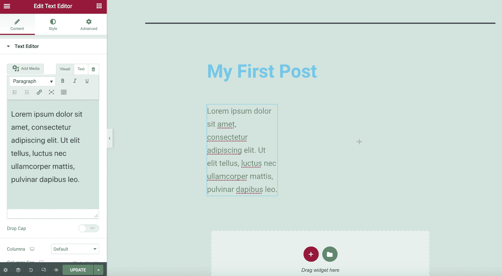

Drag and drop a text widget

在侧边栏中，单击预览缩略图。你现在可以使用 WordPress 媒体库来上传一个新的图片或者选择一个先前上传的图片。

要查看您的设计，请点击 Elementor 或侧边栏底部的眼睛图标。这将在新选项卡中显示页面布局的预览。

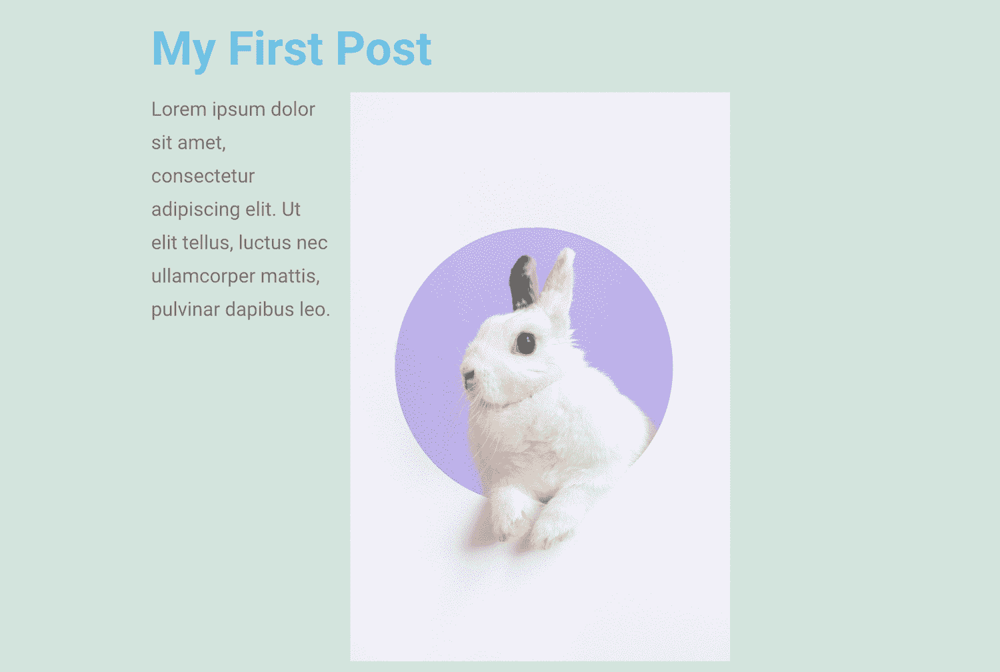

Preview your Elementor page

当你对你的设计满意时，点击**发布**按钮。注意，如果你的页面已经是活动的，这个按钮会要求你用**更新**。

### 2.如何创建 WooCommerce 产品页面

如果你正在经营一家 [WooCommerce 商店](https://kinsta.com/blog/woocommerce-tutorial/)，你可以使用 Elementor Pro 创建一个定制的产品页面。这可能涉及修改股票 WooCommerce 页面，以更好地反映您的网站的品牌。或者，你可能会试图优化你的网页，以推动更多的转换。

Struggling with downtime and WordPress problems? Kinsta is the hosting solution designed to save you time! [Check out our features](https://kinsta.com/features/)

要设计一个定制的 WooCommerce 产品页面，从 WordPress 仪表盘中选择**模板**。然后，点击**添加新的**按钮。在下一个窗口中，打开第一个下拉菜单，选择**单品**。

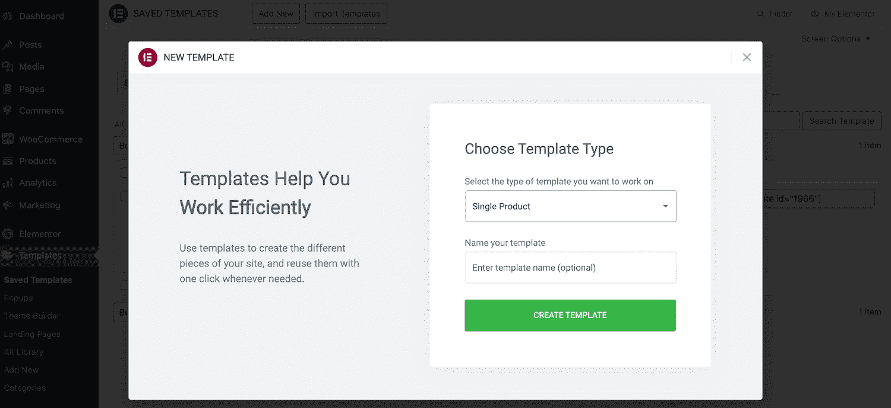

WooCommerce set up for a single product

给你的新模板起一个描述性的名字，然后点击**创建模板**。这将启动包含所有可用单一产品设计的 Elementor 库。

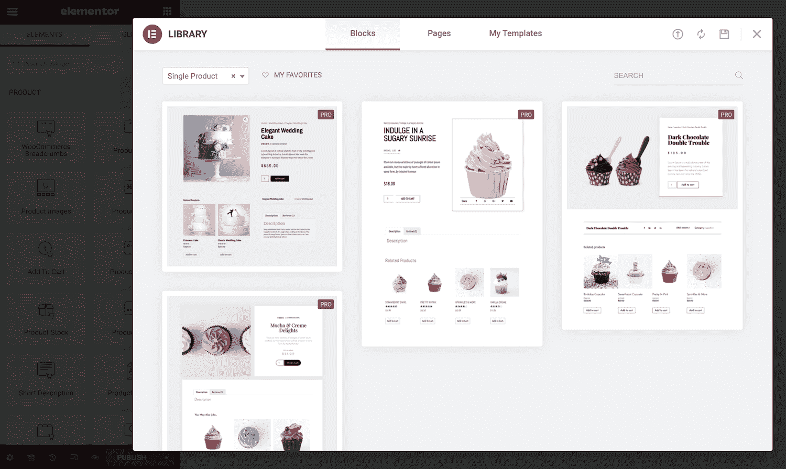

Available single product designs in WooCommerce

要仔细查看模板，请将鼠标悬停在模板上，然后在出现放大镜图标时单击它。如果您想将此设计应用到您的商店，请点击**插入**。

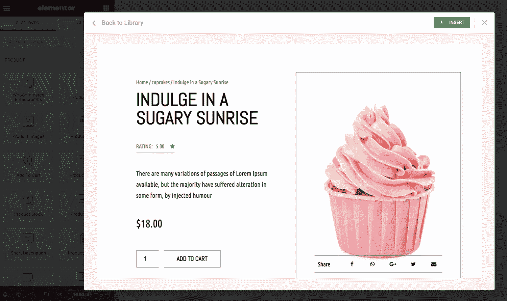

Hover over the template for a closer look

Elementor 的模板提供了一系列现成的组件。要编辑这些元素，只需点击它们。Elementor 侧边栏将更新以显示该特定项目的所有设置。

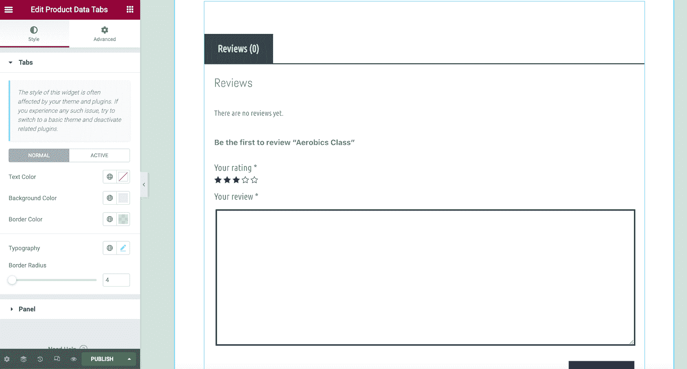

Ready-made components

Elementor Pro 提供了一系列的 WooCommerce 小工具，你可以将它们添加到你的设计中。要查看可用内容，请滚动到 Elementor 侧边栏中的 **WooCommerce** 或 **Product** 部分。

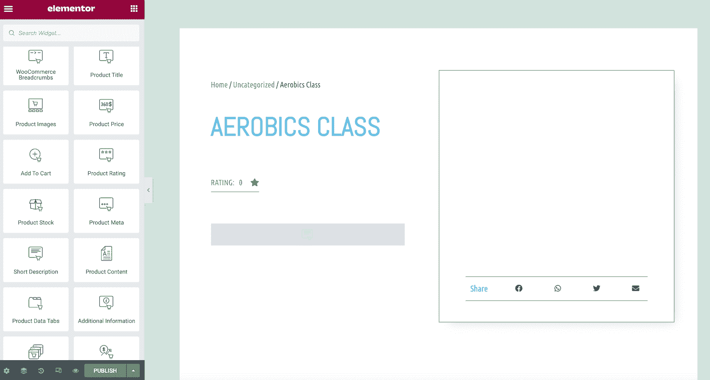

Available WooCommerce widgets in the sidebar

这些部分包括具有高级内置功能的小部件，如 [WooCommerce Breadcrumbs](https://woocommerce.com/document/woocommerce_breadcrumb/) 、Cart 和 Checkout。要将这些元素添加到您的设计中，只需将它们拖动到 Elementor 画布中，然后释放它们。然后，您可以将小部件放入您想要显示该内容的部分。

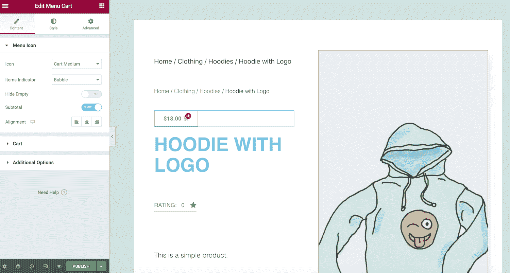

Drag and drop WooCommerce widgets

当你对自己的设计满意时，点击**发布**。然后您可以选择**添加条件**，并指定您想要使用该设计的区域。例如，您可以将此模板应用于特定的产品类别，或者在整个商店中使用。

## 如何找到并安装预制的 Elementor 模板

Elementor 模板是预先设计的页面和块，可以简化网站创建过程。页面是完整的内容布局，而块是包含预构建小部件的部分。一些常见的块示例包括页眉、页脚、[评论和证明](https://kinsta.com/blog/best-wordpress-review-plugins/)以及[常见问题(FAQ)](https://kinsta.com/blog/wordpress-faq-plugins/)。

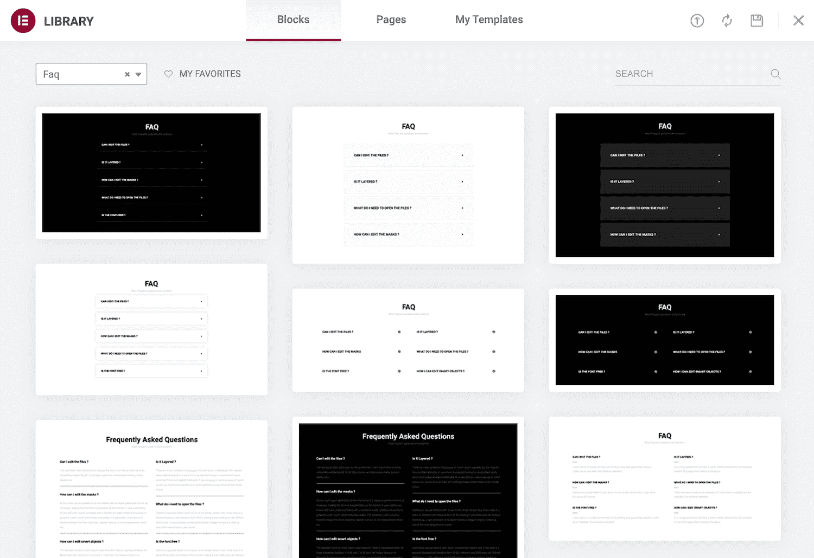

Elementor library

免费的 Elementor 插件提供了 100 多个整页模板和 300 多个块。如果您升级到 Elementor Pro，您将可以访问一些附加选项。

单击添加模板图标，将模板应用到您当前的设计中。该按钮应作为每个区段块的一部分出现，并由一个白色文件夹表示。这将启动 Elementor 库。

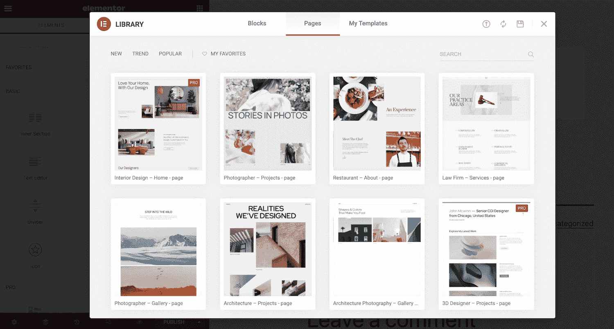

Add a template from the Elementor library

在这里，您可以找到所有可以应用于页面的块和页面模板。您可以通过将鼠标悬停在模板上并单击其放大镜图标来预览任何模板。

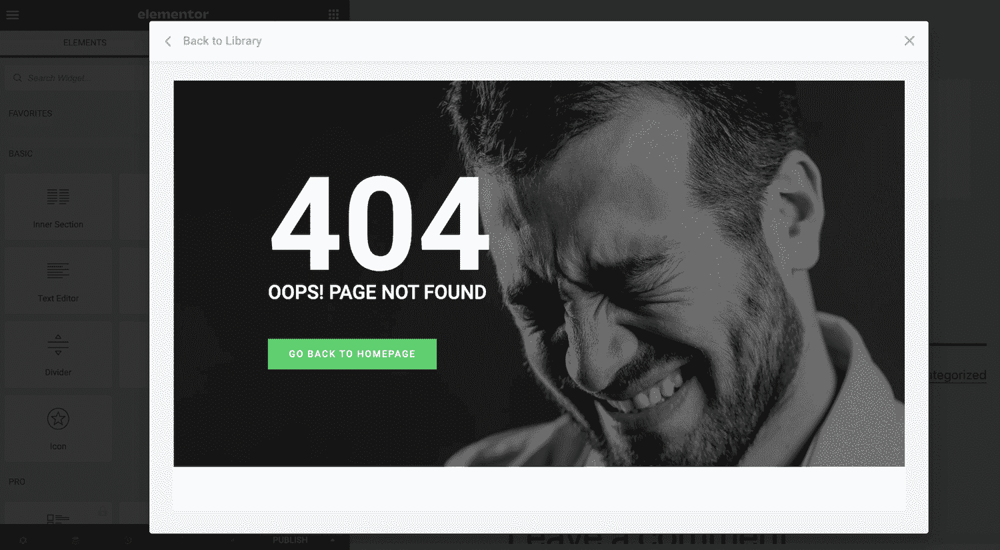

Hover over the template to view it up close

找到想要使用的模板后，点击**插入**。如果您之前没有连接到 Elementor 的模板库，弹出窗口会要求您完成该步骤。

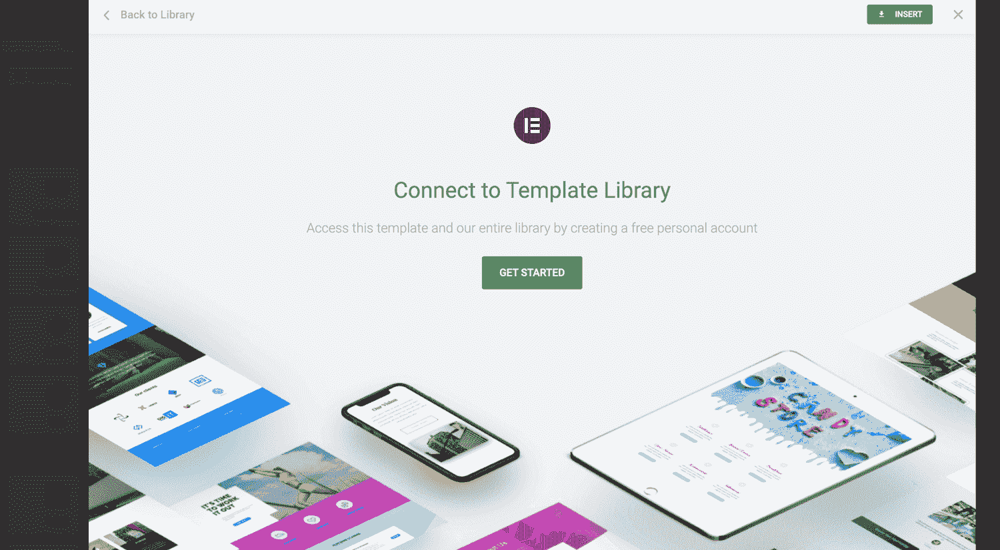

Connect to the template library

建立连接后，Elementor 将插入您选择的模板。您现在可以自定义它。例如，您可以添加更多小部件或删除任何占位符内容。

## 如何用元素或构建模板

Elementor 提供了大量现成的模板可供选择。然而，有时你可能会有一个特别的想法。在这种情况下，您可能更喜欢设计自己的模板。

创建您的设计可以确保整个网站的一致性。如果你是 WordPress 代理，你甚至可以使用模板来加速设计和开发。例如，您可以构建一个模板库，其中包含通常应用于客户端站点的所有内容和设置。然后，您可以使用这些模板作为所有未来项目的起点。

要开始，从 WordPress 仪表盘选择**模板**。然后，点击**添加新的**。

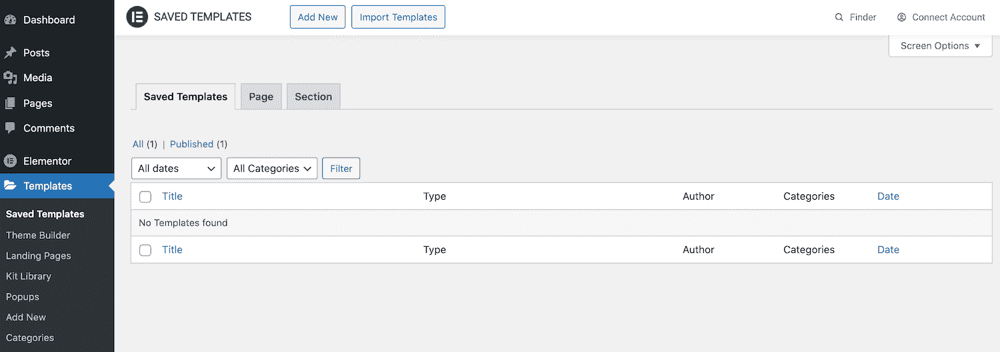

Add a new template

在随后的弹出窗口中，打开第一个下拉菜单，选择要创建的模板种类。您可以选择**页面**、**版块**或**登陆页面**。

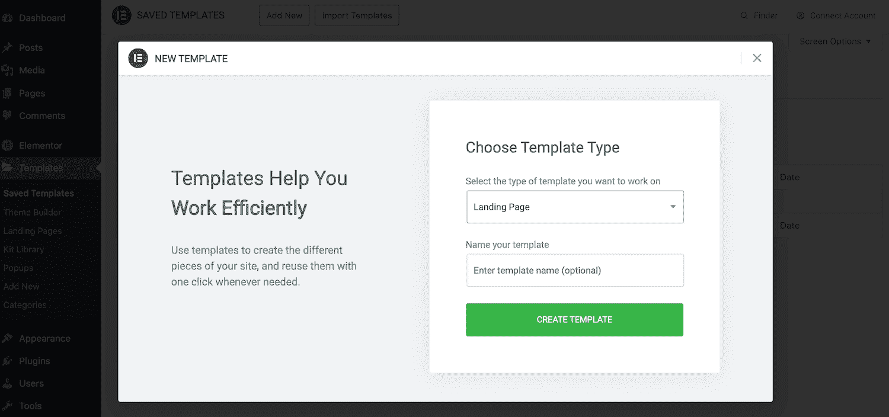

Choose the type of template

接下来，给这个设计起一个描述性的名字，点击**创建模板**。这将启动标准元素或页面生成器。现在，您可以像创建常规页面一样构建模板。只需添加部分、栏和小部件，直到您对自己的布局满意为止。

要将该设计保存为模板，点击出现在**更新/发布**按钮旁边的箭头。然后您可以选择**另存为模板**。

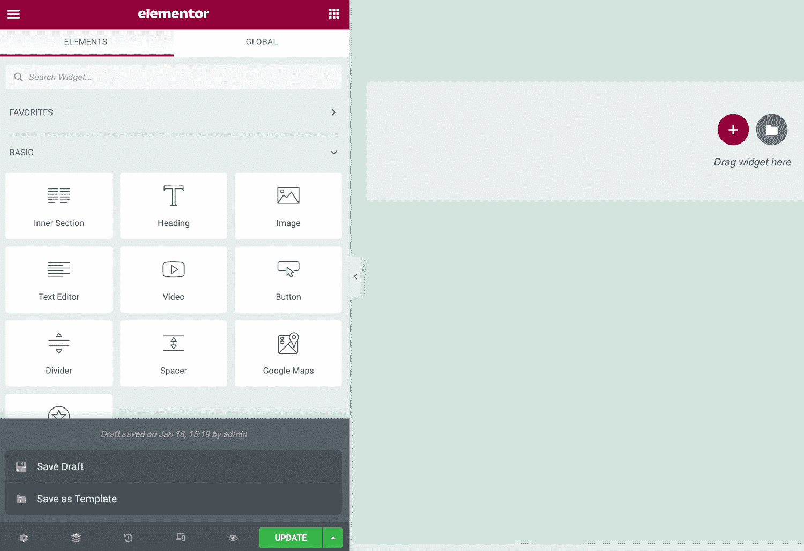

Save as template

该设计现在将保存到 Elementor 库中。您可以通过启动库并选择**我的模板**选项卡来访问它。

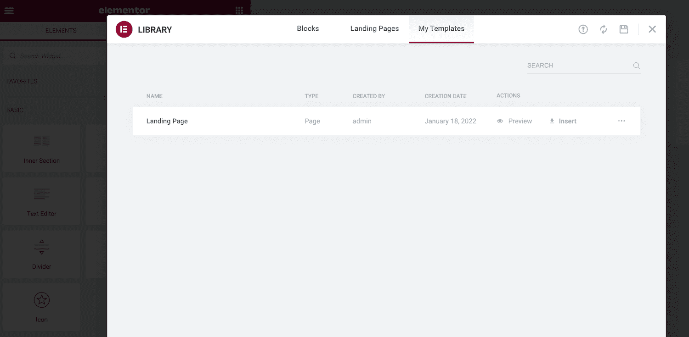

Find your template in the library un the “My Templates” tab

或者，你可以通过在 WordPress 仪表盘中导航到**模板>保存的模板**来访问你的定制模板。您还可以打开您的任何设计并进行任何必要的更改。

## 开始使用 element 或的提示和技巧

Elementor 可以帮助你快速设计和构建一个现成的 WordPress 网站。然而，一些节省时间的技巧可以进一步提高你的工作效率。

有时，您可能会构建一个想要在同一页面中重用的部分。您可以创建一个副本，而不是手动重新创建此分区。只需点按以选择有问题的部分，然后按住 Control 键点按出现的虚线手柄。

然后选择**复制**。这将在原始部分的正下方创建一个复制部分。

或者，有时您可能希望在多个页面上，甚至在不同的网站上重用同一个部分。您可以将任何剖面储存为图块样板。这会将您的设计添加到 Elementor 库中，因此它总是触手可及。

要将块变成可重复使用的模板，请按住 Control 键点按它的虚线图标。然后选择**另存为模板**。

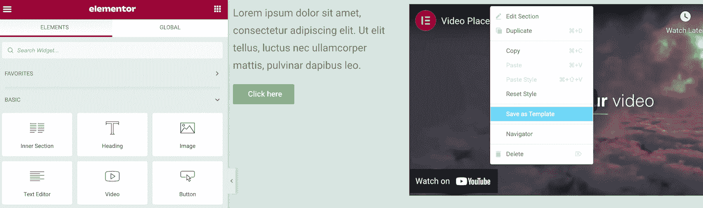

Turning a block into a reusable template

您可以编辑任何部件，方法是在画布上选择它，然后使用 Elementor 或边栏中的控件。然而，当您有许多其他小部件时，在不同的小部件之间导航会变得很笨拙。对于重叠的小部件或者在一个小空间内添加了许多元素的情况，尤其如此。

[Elementor 的导航器](https://elementor.com/help/navigator/)提供了页面上所有小部件的列表视图，这些小部件被组织到相应的部分和列中。通过在这个“树面板”中选择小部件，您可以轻松地在它们之间导航 Elementor 侧边栏将会更新，显示当前所选小部件的所有选项。

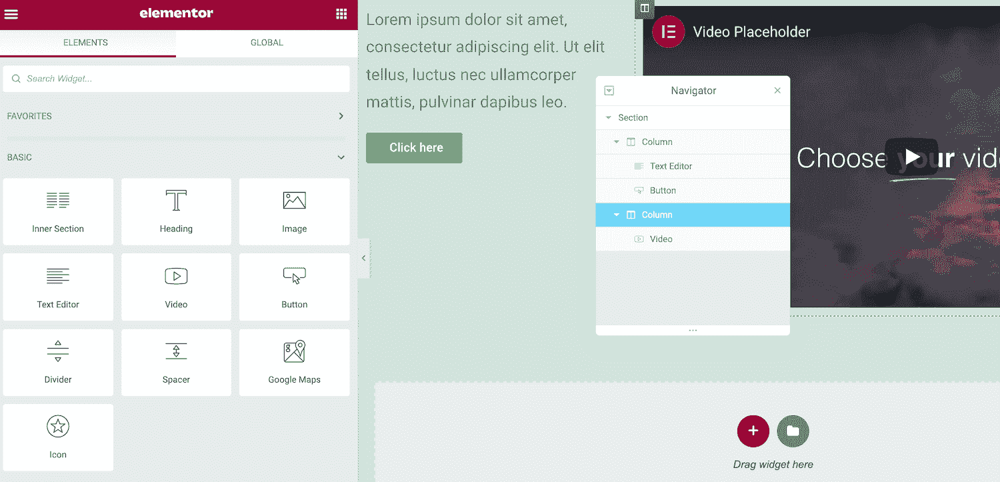

Display options for the selected widget

键盘快捷键是最节省时间的方式，Elementor 自带各种内置热键。按 **Cmd/Ctrl +？**在键盘上查看这些快捷键。

Elementor keyboard shortcuts

这将启动一个包含所有可用热键的窗口。你可以通过熟悉这些快捷方式来提高你的网页设计和开发。

[Want to create a stunning website... without writing a single line of code? 👀 Read on 👇Click to Tweet](https://twitter.com/intent/tweet?url=https%3A%2F%2Fkinsta.com%2Fblog%2Fwordpress-elementor%2F&via=kinsta&text=Want+to+create+a+stunning+website...+without+writing+a+single+line+of+code%3F+%F0%9F%91%80+Read+on+%F0%9F%91%87&hashtags=WebDesign%2CElementor) ## 摘要

创建一个 WordPress 网站并不总是容易的，尤其是如果你不是一个有经验的网页设计者或开发者。幸运的是，Elementor 页面生成器可以消除构建站点的痛苦和复杂性。

不管你选择免费还是付费插件，你都可以使用 Elementor 来设计和创建你需要的任何类型的文章或页面。该构建器还提供了一系列现成的模板。或者，您可以创建自己的模板，并在多个页面或不同网站上重复使用。

关于如何使用 WordPress Elementor 插件，你有任何问题吗？请在下面的评论区告诉我们！

* * *

让你所有的[应用程序](https://kinsta.com/application-hosting/)、[数据库](https://kinsta.com/database-hosting/)和 [WordPress 网站](https://kinsta.com/wordpress-hosting/)在线并在一个屋檐下。我们功能丰富的高性能云平台包括:

*   在 MyKinsta 仪表盘中轻松设置和管理
*   24/7 专家支持
*   最好的谷歌云平台硬件和网络，由 Kubernetes 提供最大的可扩展性
*   面向速度和安全性的企业级 Cloudflare 集成
*   全球受众覆盖全球多达 35 个数据中心和 275 多个 pop

在第一个月使用托管的[应用程序或托管](https://kinsta.com/application-hosting/)的[数据库，您可以享受 20 美元的优惠，亲自测试一下。探索我们的](https://kinsta.com/database-hosting/)[计划](https://kinsta.com/plans/)或[与销售人员交谈](https://kinsta.com/contact-us/)以找到最适合您的方式。