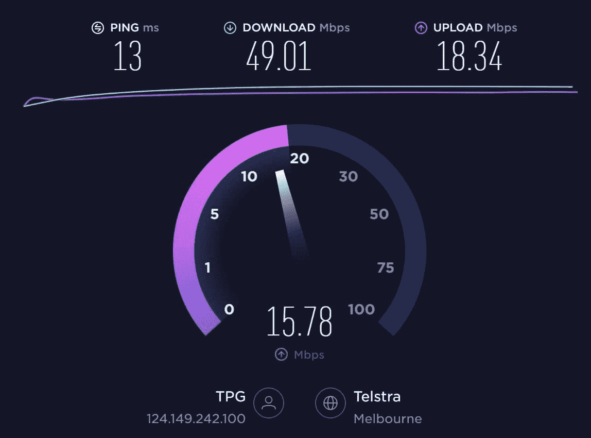
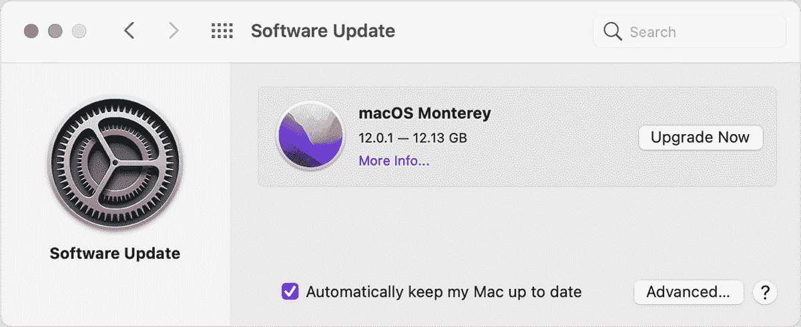
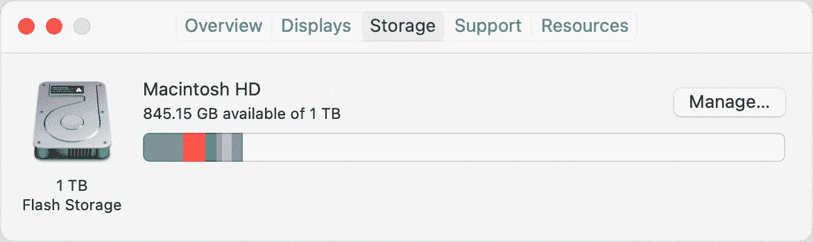
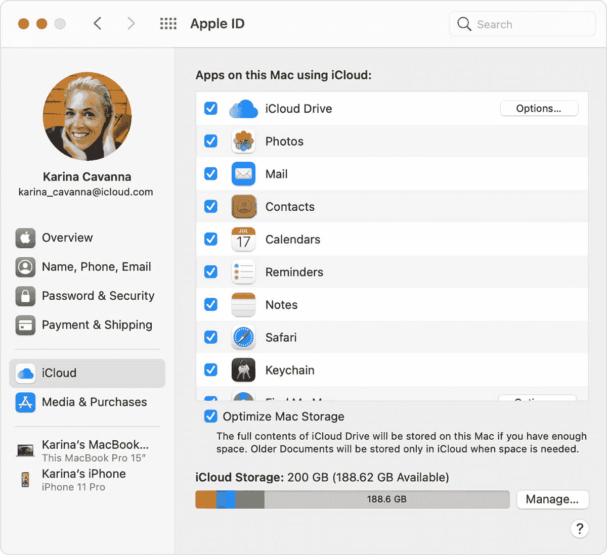
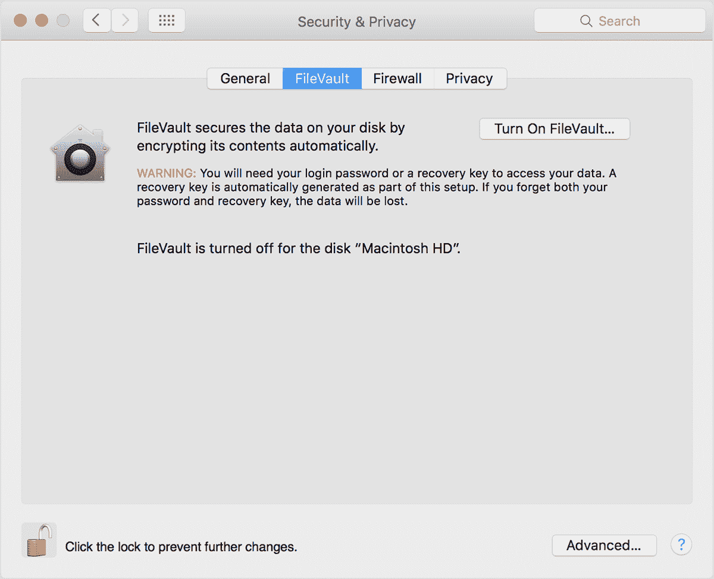
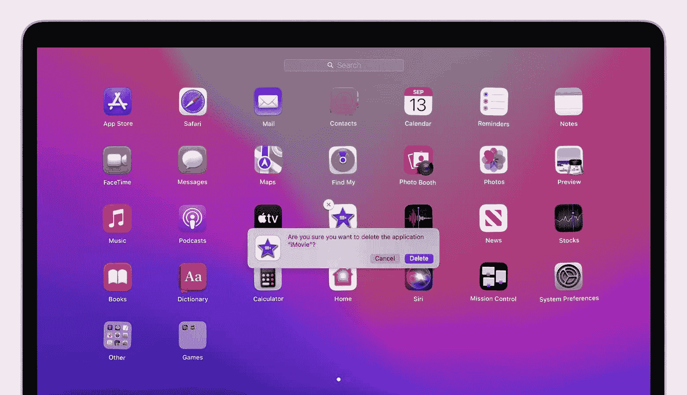
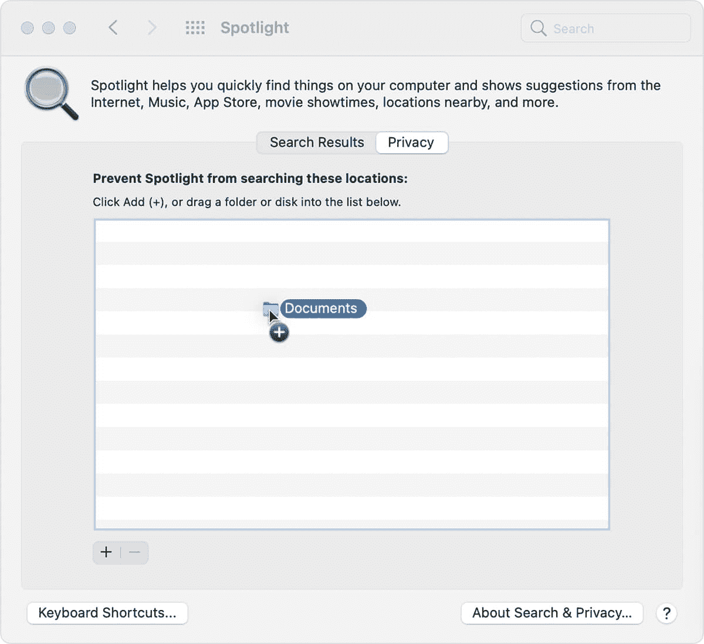
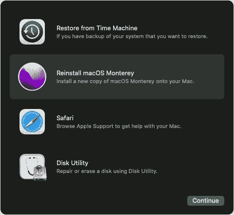
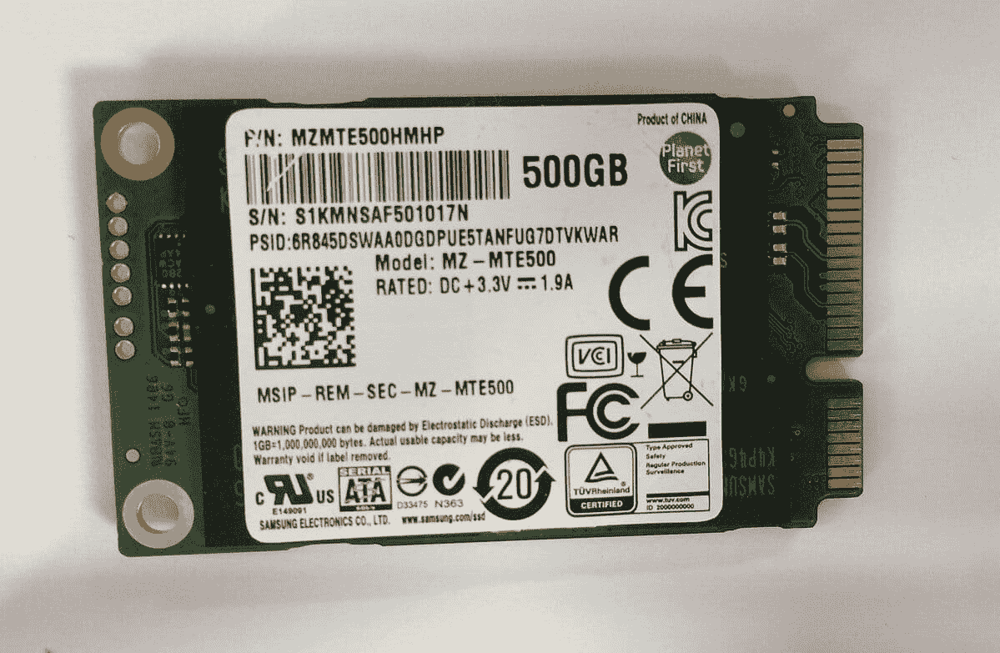

# 为什么你的 Mac 很慢(加 15 种方法加速 Mac)

> 原文：<https://kinsta.com/blog/speed-up-mac/>

你是否曾经坐在你的 Mac 电脑前完成一项紧急任务，却只能坐在那里等待电脑加载？速度慢的电脑不仅令人讨厌，它们还会消耗你的生产力，增加你的工作量，降低你的产出。这就是为什么找到提高 Mac 速度的方法很重要。

事实上，如果一个全职员工每小时因运行缓慢的电脑而损失 7 分钟的工作时间，那就相当于一周 52 分钟多一点(或者一个月 3.5 小时)。

Mac 慢的人都会很明白这个问题。但是如何提高 Mac 的速度呢？

这就是这篇文章的内容。我们将讨论 Mac 电脑运行缓慢的常见原因，以及 15 个你可以尝试提高 Mac 电脑速度的技巧。

我们走吧。

## 为什么我的 Mac 很慢？

如果您的电脑不在身边，我们无法告诉您电脑变慢的确切原因。但是我们可以帮助您自己诊断问题。

如果您注意到以下任何情况，您就会知道您的 Mac 是否运行缓慢:

> 需要在这里大声喊出来。Kinsta 太神奇了，我用它做我的个人网站。支持是迅速和杰出的，他们的服务器是 WordPress 最快的。
> 
> <footer class="wp-block-kinsta-client-quote__footer">
> 
> 
> 
> <cite class="wp-block-kinsta-client-quote__cite">Phillip Stemann</cite></footer>

[View plans](https://kinsta.com/plans/)

*   您的计算机启动时间比平时长
*   您的 Mac 变得非常热
*   您的浏览器或程序经常崩溃
*   你经常看到“沙滩球”
*   你花了比平常更多的时间等待加载

许多事情导致 MAC 电脑和其他电脑运行缓慢或滞后。

如果您正在运行大量程序、下载大文件或运行精美的图形，您的计算机可能会运行缓慢。这些问题是由于您的 Mac 比平时工作更努力造成的。

或者，年龄会降低计算机速度。你使用 Mac 的时间越长，你可能使用的磁盘空间就越多，你的电脑就越容易损坏。

我们将在“如何加速你的 Mac:我们的顶级技巧”一节中讨论解决这些问题，但首先，我们需要确定是你的 Mac 慢，而不是别的什么。

### 要排除的事情

电脑速度慢可能很棘手，因为它经常伪装成其他东西。在开始故障诊断之前，请检查这些常见因素没有降低您的电脑体验:

#### 慢速互联网

今天，你的大部分电脑活动都使用互联网，所以糟糕的互联网连接会让你的电脑看起来很迟钝。你可以像这样使用 [SpeedTest](http://www.speedtest.net/) 来测试你的网速:

1.  去 speedtest.net。
2.  请检查您的互联网提供商和位置是否正确。
3.  按“开始”
4.  等待工具来测量你的上传和下载速度。
5.  阅读你的结果。它们看起来会像这样:

Using SpeedTest

我们用每秒兆位数据(Mbps)来衡量互联网速度。您的上传时间是您的计算机可以向另一个设备或服务器发送多少 Mbps。你的下载速度就是你的电脑能接收多少 Mbps。

截至 2022 年初，固定宽带连接上的全球平均下载速度为 [59.75 Mbps](https://www.speedtest.net/global-index#fixed) ，平均上传速度为 25.06 Mbps。SpeedTest 也给出了每个国家的平均值，如果你想看到你的国家的结果。

如果你的网速是罪魁祸首，你需要和你的电信公司联系来解决网速慢的问题。

或者，如果你的互联网很好，但某个特定的[网站很慢](https://kinsta.com/blog/website-speed-test/)，你可以用[谷歌页面速度](https://kinsta.com/blog/google-pagespeed-insights/)检查该网站的速度。或者，如果你拥有或管理一个运行缓慢的网站，有很多方法可以让你的网站[加速](https://kinsta.com/learn/speed-up-wordpress/)。

#### 慢速浏览器

假设你的网速正常，但是你的电脑只是在你上网的时候运行缓慢。在这种情况下，你的网络浏览器可能是问题所在。像电脑一样，当需要一次完成大量任务时，网络浏览器会变慢。

通过关闭不必要的标签和删除不需要的扩展来加快网站浏览器的速度。然后，[清除您的浏览器历史记录、cookies 和缓存](https://kinsta.com/knowledgebase/how-to-clear-browser-cache/)。

截至 2021 年 12 月， [66.6%](https://www.statista.com/statistics/544400/market-share-of-internet-browsers-desktop/) 的全球桌面用户使用 Chrome。如果你是这些人中的一员，以下是清除浏览数据的方法:

1.  打开浏览器，选择**设置**。
2.  按下**安全和隐私**，然后选择**清除浏览数据**。
3.  选择**浏览历史**、 **cookies 等站点数据**，然后选择**缓存图片和文件**。清除您的 cookies 将使您退出许多网站。
4.  选择您想要的时间范围。
5.  按下**清除数据**。

Clearing your browsing history on Google Chrome

在其他浏览器上清除数据的步骤非常相似。

#### 您的 Mac 需要重新启动

最后，您的 Mac 可能运行得非常好，但只是需要重启。定期重新启动电脑:

*   刷新处理数据和任务的随机存取存储器(RAM)。
*   重置您的互联网连接。
*   减少故障和错误。
*   减少内存泄漏。当程序没有完全关闭并一直使用 RAM 时，就会发生内存泄漏。

## 如何提高 Mac 的速度:我们的顶级技巧

现在你知道你的问题不仅仅是劣质的互联网和杂乱的电脑，是时候开始排除故障了。

我们已经从最简单的提示开始，所以我们建议你一个一个地尝试，在中间重新启动你的计算机来检查每个提示是否有所不同。

让我们开始吧。

T3】

### 1.检查系统更新

你会惊讶地发现，升级电脑可以解决多少问题。随着每一次新的 macOS 更新，Apple 都会改变您的电脑的功能，以优化它，使它更加用户友好。

您可以通过单击左上角的苹果菜单(标有苹果标志)来检查新的苹果操作系统更新。然后，选择**系统首选项**和**软件更新**。此屏幕将搜索更新并显示可下载的更新，如下所示:

A macOS system update

选择“立即升级”并等待。有些更新需要几分钟，有些则需要更长时间。

### 重要的

安装更新时，您的计算机将重新启动，因此请确保在下载更新前保存所有未保存的文件。

### 2.关闭视觉效果

苹果的视觉效果相当漂亮，可以让你的电脑看起来很时髦，但它们也使用了很多资源。自然地，关闭视觉效果可能会让你的 Mac 运行得更快(特别是如果你使用了大量的内存)。

为了减少动画相关的视觉效果，选择屏幕右上角的苹果菜单，然后按**系统偏好**。然后点击**可达性**和**显示**。点击复选框**减少动作**。

如果您有 MacBook 或 iMac，您也可以按照以下说明关闭更多视觉效果:

1.  点击**系统偏好**和 **dock 和菜单栏**。
2.  确定您取消选择“自动隐藏和显示 dock”和“打开应用程序时显示动画”
3.  按下**使用**最小化窗口，选择**比例效果**而不是**精灵效果**。

更改设置后，重新启动电脑。

### 3.减少文件混乱

你有没有试过清理一个橱柜，发现里面的东西比你想象的多一倍？电脑也是如此。您的计算机在本地保存了大量数据，这需要处理能量。

有很多方法可以减少桌面混乱。从删除桌面上的文件和图标开始。

接下来，瞄准你的下载文件，删除任何你不需要的东西。要优化此过程，请按最大文件大小对下载文件夹进行排序，并首先删除这些文件。

最后，整理你的文件，删除任何不必要的东西。如果您没有多少剩余磁盘空间，这一步尤其重要。您可以通过选择苹果菜单、**关于这台 Mac** 和**存储**来检查磁盘空间。它看起来会像这样:

Mac disk space

当然，如果您在本地保存了大量文件，减少文件只是一个临时的解决方案。

考虑使用基于云的存储解决方案，如果你是这样的话。常见的例子包括 Dropbox、[、谷歌云](https://kinsta.com/blog/google-cloud-hosting/)和苹果 iCloud。或者，你也可以使用像 VaultPress 这样的插件来[备份你的网站](https://kinsta.com/blog/wordpress-backup-plugins/)。

### 4.关闭 iCloud 同步

想要通过检查“同步”功能来提高 Mac 的速度吗？

[iCloud](https://kinsta.com/blog/google-drive-alternative/#7-icloud) 自动备份你的应用数据、设置、桌面组织、照片、视频、文件和信息。这需要您的电脑处理大量数据，因此有时会降低 Mac 的速度。

iCloud 同步是一个后台进程，因此您可能甚至不知道您正在使用它。要关闭它，请前往**系统偏好设置**并点击 **iCloud** 。这将把你带到这个屏幕:

Turn off iCloud syncing for individual apps

从这里，您可以选取哪些应用程序使用 iCloud 来备份数据。取消选中您不想备份数据的所有应用程序的复选框。然后，选择**优化 Mac 存储**。

### 信息

如果您的 iCloud 储存空间已满，也可能会出现其他问题。苹果自动给所有用户 5 GB 的空间，一旦你使用它，你需要购买更多的空间或删除内容。您可以使用“iCloud”屏幕底部的栏来查看您的 iCloud 储存空间是否已满(在上面的截图中可见)。

### 5.关闭实用程序中不必要的进程

你可能已经注意到，当你同时使用多个应用程序时，你的电脑会变慢并开始出现故障。后台进程也是如此。

## 注册订阅时事通讯

### 想知道我们是怎么让流量增长超过 1000%的吗？

加入 20，000 多名获得我们每周时事通讯和内部消息的人的行列吧！

[Subscribe Now](#newsletter)

您可以通过检查活动监视器来查看电脑正在运行哪些进程。要找到它，在 macOS 栏上选择 **go** ，选择**实用程序**，点击**活动监视器**。

看一下标有“CPU”的那一栏(CPU 代表“中央处理器”)。" % CPU "数值越高，函数使用的处理能力就越强。“用户”部分在这里也很重要，因为您希望将重点放在您启动的进程上(所以忽略来自“root”、“hidd”和“locationd”的与 macOS 相关的任务，如果您看到它们的话)。

沿着列表往下走，关闭任何占用 CPU 时间超过 5%的不必要的进程。

### 6.清空你的缓存并清空你的垃圾

您的电脑会创建缓存文件来为您快速载入应用程序和程序。然而，如果你不偶尔清理你的缓存，这些堆积会使你的电脑变慢。

有三种类型的缓存:

*   浏览器缓存(我们在*“*慢速浏览器”中讨论过)
*   系统缓存
*   用户缓存

由于您无法在不阻止某些应用程序运行的情况下清除所有系统缓存，因此我们建议您仅清除您的用户缓存。方法如下:

1.  从苹果菜单中选择 **go** 。
2.  按下**进入文件夹**。
3.  键入“~/库/缓存”
4.  逐个单击文件夹并删除其内容(不要删除文件夹)。

### 重要的

如果您有外置硬盘，您可能需要在删除缓存文件之前对其进行备份，以防您不小心删除了以后可能需要的数据。

一旦你清空了你的缓存，通过倒垃圾把文件从你的电脑中移除。你可以点击任务栏中的垃圾箱图标，选择**清空垃圾箱**(或者按下**命令**、 **shift** 和 **delete** )。为了提高 Mac 的速度，这个过程应该相当有效。

### 7.阻止 FileVault 2 加密文件

FileVault 2 是一项网络安全功能，它可以加密您的计算机数据，这样任何访问您计算机的不良行为者都无法读取这些数据。FileVault 非常方便，但它也会占用大量处理时间，并可能会降低您的电脑速度。

下面是关闭它的方法:

1.  转到**系统偏好设置**。
2.  点击**安全和隐私**。
3.  选择 **FileVault** 。
4.  点按锁图标并键入您的管理员信息。
5.  按下**关闭 FileVault** 。以下是 FileVault 成功关闭后的样子:

FileVault encryption turned off

如果关闭 FileVault 让你感到紧张，你可以[提高你的云网络安全知识](https://kinsta.com/blog/cloud-security/)。

### 8.改变你的创业偏好

你是那种很少重启电脑的人吗，因为你不想经历关闭所有启动时弹出的应用程序的过程？这是给你的小费。

您可以更改您的启动偏好设置，以便在您启动 Mac 时仅打开您喜爱的应用程序。正如你所想象的，这将减少你的后台进程，所以你的 Mac 运行得更快。

要更改您的启动首选项，请选择**系统首选项**并点击**用户和组**。然后，点击您的用户资料并选择**登录项目**。这将向您显示一个应用程序列表，当您启动电脑时，这些应用程序就会启动。

只需点击减号即可从列表中移除应用。

Struggling with downtime and WordPress problems? Kinsta is the hosting solution designed to save you time! [Check out our features](https://kinsta.com/features/)

这种策略通常很有效，但有些 app 很偷偷摸摸。如果您的应用程序在启动时仍能启动，请尝试以下步骤:

1.  点击 **go** 并按下选项键。
2.  点击**库**。
3.  向下滚动，直到找到“LaunchAgents”和“LaunchDaemons”
4.  打开两个文件夹，删除与问题应用程序相关的文件。

### 9.卸载僵尸应用

顾名思义，僵尸应用是对你来说已经死了的程序(意思是你不用它们或者已经忘记它们了)。

有两种方法可以摆脱僵尸应用:Launchpad 和 Finder。

先说 Launchpad。在你的 dock 中打开 **Launchpad** ，滚动直到你发现一个僵尸应用。按下**选项**键，直到应用跳舞，然后删除应用。冲洗并重复，直到你的 Mac 没有僵尸。

Uninstall apps using Launchpad

或者，您可以选择 **Finder** ，在**应用**文件夹中搜索应用。一旦你找到一个僵尸应用，把它扔进垃圾桶。正如你可能想象的那样，你需要把垃圾拿出来才能完全删除这个应用。

### 10.将文件移动到外部硬盘上

我们已经在这篇文章中谈到了清除旧文件，所以我们将保持这个技巧简短。您可以通过将大文件移动到外置硬盘来清理存储空间并提高计算机速度。外置硬盘很方便，因为你可以保存这些文件，而不用把它们存储在你的 Mac 电脑上(或者每月付费[把它们放在云端](https://kinsta.com/blog/best-cloud-storage/))。

移动到硬盘上的最佳文件是大文件，例如:

*   播客
*   音乐
*   录像
*   照片
*   旧邮件文件

如果你的 WordPress 站点上有很多文件，你也可以通过一个插件[增加你的磁盘空间](https://kinsta.com/help/disk-space-add-on/)并将它们存储在那里。

### 11.重新索引聚光灯

安装新的更新后，您的计算机是否立即变慢？尝试重新索引 Spotlight。

Spotlight 是一款搜索工具，可帮助您轻松导航 Mac。当您更新 Mac 时，Spotlight 会编制索引。不幸的是，这个过程有时会被卡住，让你的电脑一次慢下来几个小时。

您可以通过进入**系统偏好设置**并点击**聚光灯**来重新索引聚光灯。然后，选择**隐私**。您应该会看到这样一个屏幕，显示您的数据:

Reindexing Spotlight

选择您的硬盘并单击减号按钮。然后，使用加号按钮将您的文件添加回。Spotlight 将开始重新索引(虽然这可能需要一段时间，取决于您在驱动器上储存了多少)。

### 12.复位 PRAM 和 SMC

如果您的 Mac 很慢，并且您已经注意到其他故障，重置参数随机存取存储器(PRAM)可能会有所帮助。PRAM 存储有关您的设置和系统的数据(如您的键盘照明和音量设置)。

重置婴儿车的第一步是关闭电脑。然后，按下电源按钮，立即按下**命令、** **选项**和 **p** 键。按住这些按钮，直到您的电脑开始重新启动。这一部分可能需要几秒钟，请耐心等待。

如果不起作用，请重置 Mac 主板上的系统管理控制器(SMC)。SMC 负责 Wi-Fi 和 USB 连接等功能。

重置 SMC 的方法会随着 Mac 的类型而变化。首先拔下电源线并关闭 Mac，然后:

1.  取出电池，按住电源按钮，然后更换电池(对于带有可拆卸电池的 MacBooks)。
2.  按住 **shift** 、 **control** 和 **option** 键至少十秒钟(对于电池不可拆卸的 MacBooks)。
3.  等待至少 20 秒钟(对于 IMAC、MacBook Pros 和 Mac Minis)。

### 13.重新安装 macOS

如果你的电脑有一段时间反应迟钝，其他都不起作用，那就该尝试重装 macOS 了。

首先，你需要用云端存储或外置硬盘备份所有文件。然后，选择**实用程序**，点击 **macOS 实用程序**。从该菜单中，选择**重新安装 macOS** ，并按照提示进行操作。

Reinstall macOS

请记住，完成这个过程可能需要几个小时。

### 14.升级 RAM

这个技巧最适合那些计算机速度慢的人，因为他们总是使用大部分内存来运行日常程序。如果您的内存小于 4 GB，升级内存也会有所帮助。

这一步接近底部，因为您需要从当地的技术商店购买额外的 RAM。然后，你可以请专业人士为你更换内存，或者你可以按照 MacBook Pro 的[这里](https://support.apple.com/en-us/HT201191)或 iMac 的[这里](https://support.apple.com/en-us/HT201191)的介绍进行操作。

### 15.购买固态硬盘

最后，你可以尝试将 Mac 的硬盘驱动器(HDD)换成固态驱动器(SSD)来提高你的存储容量，让你的电脑更快地处理信息。

无需深究太多细节，SSD 与 HDD 略有不同，因为它更小、更强大、更节能、更耐热。固态硬盘将你的数据存储在 NAND 闪存芯片上(有趣的是，这种芯片有电和没电都能工作)。

这是固态硬盘的样子:

SSD

同样，你需要从当地的技术零售商那里购买一个固态硬盘，并安装在你的电脑上。固态硬盘可能非常昂贵，所以在投资之前，请确保仔细研究适合 Mac 的选项。

最近的 MacBooks(从 2013 年开始)都配有固态硬盘，所以这个提示只适用于几乎 10 年前的型号(在这种情况下，升级到新版本可能是更好的选择)。

[If a single full-time employee loses seven minutes of work time each hour to a slow computer, that amounts to just over 52 minutes a week (or 3.5 hours a month). 😱 It ends here ⚡️Click to Tweet](https://twitter.com/intent/tweet?url=https%3A%2F%2Fkinsta.com%2Fblog%2Fspeed-up-mac%2F&via=kinsta&text=If+a+single+full-time+employee+loses+seven+minutes+of+work+time+each+hour+to+a+slow+computer%2C+that+amounts+to+just+over+52+minutes+a+week+%28or+3.5+hours+a+month%29.+%F0%9F%98%B1+It+ends+here+%E2%9A%A1%EF%B8%8F&hashtags=MacTips%2CSiteSpeed) ## 摘要

缓慢的 Mac 不仅仅是不方便。速度慢的电脑会阻碍你的工作流程，增加挫败感，最终打击你的创造力和注意力。

但是，有一些解决方案。尝试以下技巧来提高 Mac 速度:

*   更新您的 macOS
*   关闭视觉效果、iCloud 同步和文件保险箱加密
*   删除未使用的应用程序和旧文件
*   更改您的创业偏好

或者，如果这些都不起作用，尝试更复杂的解决方案，如重新索引 Spotlight、重置 PRAM 和 SMC、重新安装 macOS、升级 RAM 或改用 SSD。

如果你有任何有助于提高 Mac 电脑速度的专家建议(或者一个关于运行缓慢的电脑以及你如何修理它的故事)，我们很乐意听到你的意见。请在下面的评论中分享你的想法。

* * *

让你所有的[应用程序](https://kinsta.com/application-hosting/)、[数据库](https://kinsta.com/database-hosting/)和 [WordPress 网站](https://kinsta.com/wordpress-hosting/)在线并在一个屋檐下。我们功能丰富的高性能云平台包括:

*   在 MyKinsta 仪表盘中轻松设置和管理
*   24/7 专家支持
*   最好的谷歌云平台硬件和网络，由 Kubernetes 提供最大的可扩展性
*   面向速度和安全性的企业级 Cloudflare 集成
*   全球受众覆盖全球多达 35 个数据中心和 275 多个 pop

在第一个月使用托管的[应用程序或托管](https://kinsta.com/application-hosting/)的[数据库，您可以享受 20 美元的优惠，亲自测试一下。探索我们的](https://kinsta.com/database-hosting/)[计划](https://kinsta.com/plans/)或[与销售人员交谈](https://kinsta.com/contact-us/)以找到最适合您的方式。