# 2022 年的 27 个最佳 Elementor 模板

> 原文：<https://kinsta.com/blog/elementor-templates/>

多亏了 [Elementor page builder](https://kinsta.com/blog/wordpress-elementor/) ，你可以设计一个网站，而不用给[写一行代码](https://kinsta.com/blog/wordpress-page-builders/)。然而，有时你可能会受益于援助之手。

这就是元素或模板的用武之地。这些都是现成的页面设计，有你创建一个令人瞠目结舌的网站所需的布局、内容，甚至功能。

在本帖中，我们将讨论什么是 Elementor 模板，为什么你可能想要使用它们，以及如何为你的站点选择合适的模板。然后，我们将分享 27 个令人惊叹的模板，它们可以帮助你建立高转化率的商店、商业网站、博客以及介于两者之间的一切。我们开始吧！

## Elementor 模板 vs WordPress 主题

Elementor 模板是预先设计的页面和块，您可以将它们应用到单个页面甚至特定的用户界面(UI)元素。Elementor 模板和 [WordPress 主题](https://kinsta.com/blog/how-to-choose-a-wordpress-theme/)的主要区别在于它们影响的页面数量。

WordPress 主题改变了你整个网站的设计。相比之下，元素或模板影响单个网页的布局:

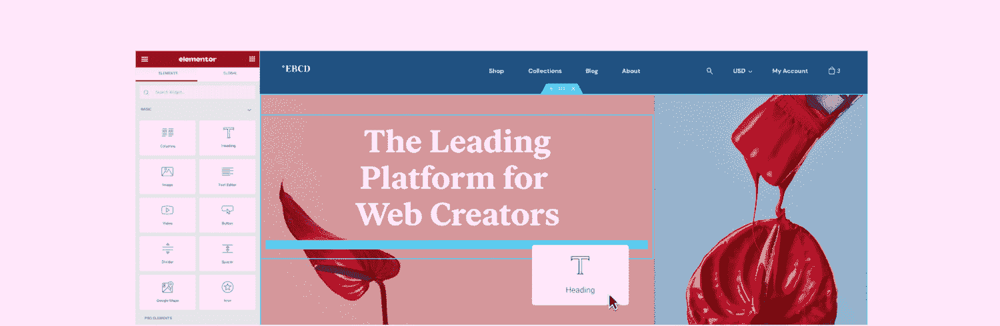

Elementor Template example

因为它们被限制在一个页面中，所以您可以同时使用多个元素或模板。例如，你可以为你的主页使用一个模板，为你的博客布局使用另一个模板。

有些 Elementor 模板是整页布局。其他模板控制单个块的外观。这些部分包含预构建的小部件，如页眉、页脚和评价。您甚至可以在一个网页上使用多个块模板:

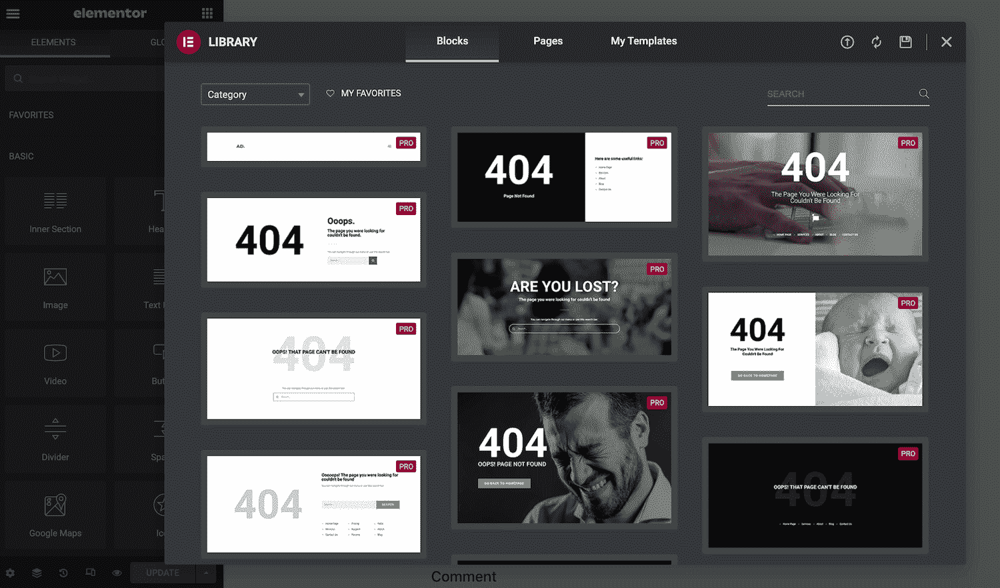

Elementor Blocks

虽然你可以下载和安装多个主题，但是你一次只能激活一个主题。这意味着不可能在同一个网站上同时使用几个主题，或者在同一页面上混合搭配多个主题:

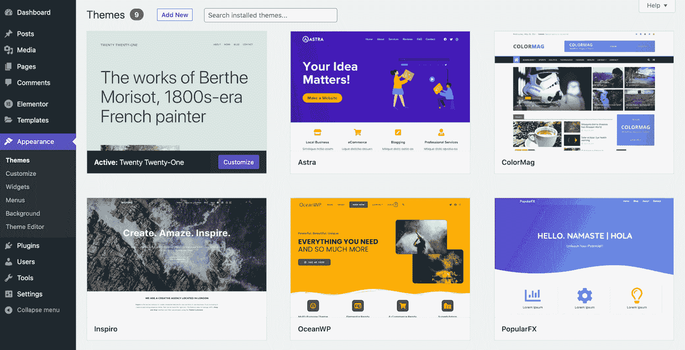

WordPress themes

作为一个开源平台，你可以自由创建自己的 WordPress 主题。这包括[定制第三方的作品](https://kinsta.com/blog/how-to-customize-wordpress-theme/)和[创造独特的儿童主题](https://kinsta.com/blog/wordpress-child-theme/)。然而，这需要专业技能和一定程度的技术知识。

使用 Elementor，您可以使用直观的拖放编辑器来设计页面或块。然后，只需点击几下，您就可以将该设计保存为模板。

与开发你自己的 WordPress 主题相比，创建一个 Elementor 模板既快速又简单。你甚至不用写一行代码。

[多亏了 Elementor 页面生成器，你不用写一行代码就能设计一个网站。👩‍💻在本指南中找到 27 个漂亮的模板🤩 点击推文](https://twitter.com/intent/tweet?url=https%3A%2F%2Fbit.ly%2F371bvnh&via=kinsta&text=Thanks+to+the+Elementor+page+builder%2C+you+can+design+a+website+without+having+to+write+a+single+line+of+code.+%F0%9F%91%A9%E2%80%8D%F0%9F%92%BB+Find+27+beautiful+templates+in+this+guide+%F0%9F%A4%A9&hashtags=WebDesign%2CElementor)

### 为什么选择正确的模板很重要

即使使用 Elementor 这样的用户友好的页面生成器，创建专业外观的布局也需要时间和精力。通过使用模板，您可以快速跟踪整个过程。

正确的模板将提供一个坚实的基础，然后你可以调整它，使之符合你自己的品牌。这可以帮助你用最少的麻烦创建一个令人惊叹的网站。

Elementor 模板可以让所有网站所有者受益。然而，你创建的网站越多，好处就越大。

如果你是一个 WordPress 设计者或者开发机构，使用 Elementor 模板意味着你不必每次都从头开始。有了灵活、专业的设计，您可以在更短的时间内创建更多的网站。这对你的利润率来说是个好消息。

建立自己的网站也可能是一项艰巨的工程。如果你没有以前的设计或开发经验，这一点尤其如此。你也可能感觉缺乏创造性的灵感。

正确的模板将为您做许多繁重的工作。一旦你把它添加到你的网站上，你就可以专注于使设计与你的主题保持一致所需要的微小变化。因此，正确的模板可以加速设计和开发过程，[提高您的成品网站的质量](https://kinsta.com/blog/web-design-best-practices/)。

### 选择 Elementor 模板时需要考虑什么

有无数免费和优质的 Elementor 模板。有这么多选择，只选择一个会让人觉得是一种挑战。

货比三家的时候，从你的行业入手是有意义的。许多模板都是针对特定的领域设计的，比如旅游或汽车租赁。这些模板通常附带有占位符功能，可以满足您的特定需求。例如，一个餐馆模板可能有一个[预订表格](https://kinsta.com/blog/wordpress-booking-plugins/)。

你还应该考虑你的网站需要的功能，比如你的 WooCommerce 网站的购物车。虽然 Elementor 使您能够定制其模板，但正确的功能可以最大限度地减少您需要进行的更改。

您可以使用 Elementor 编辑器更改模板的外观。然而，为了让您的生活更轻松，有必要货比三家，寻找一个与您想要的品牌非常相似的模板。

在本帖中，我们将介绍一系列免费和高级的 Elementor 模板。虽然付费模板看起来是更好的选择，但是有很多免费的设计有干净的代码和令人印象深刻的布局。

合适的模板将根据您的预算而有所不同。然而，仔细阅读最近的评论是有帮助的。许多模板开发者也提供交互式演示，这可以帮助你评估设计的质量。

支持是高级和免费模板有所不同的一个方面。许多付费模板提供免费支持。如果你选择免费设计，你可能需要依靠[社区资源](https://kinsta.com/blog/wordpress-support/)，比如在线教程和论坛。因此，考虑您可能需要的支持级别很重要。
T3】

## 如何创建和安装元素或模板

选择 Elementor 模板后，下一步是将其上传到页面生成器的模板库。无论您是购买了模板还是选择了免费设计，您都应该可以选择将该文件下载到您的计算机上。然后，您可以轻松地将它导入到您网站的模板库中。

### 如何导入和安装 Elementor 模板

要导入设计，导航至**模板>保存的模板**。然后，点击**导入模板**:

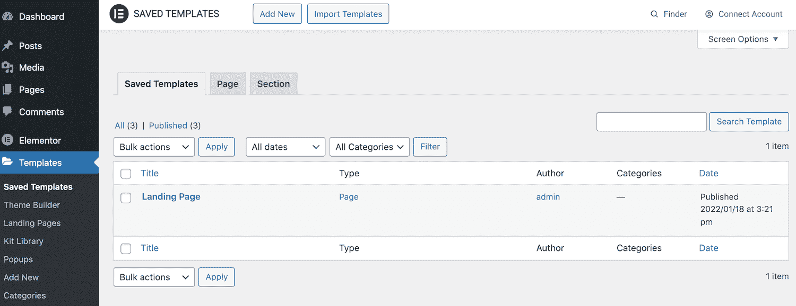

Import Templates

在随后的窗口中，找到要上传到 Elementor 库的模板。然后，点击**立即导入**。

就像[改变一个 WordPress 主题](https://kinsta.com/blog/change-wordpress-theme/)，在切换到一个新的 Elementor 模板之前[创建一个完整的备份](https://kinsta.com/blog/backup-wordpress-site/)是聪明的。一旦你这样做了，你可以通过导航到**模板>保存的模板**来应用你的新模板。

您还可以通过 Elementor 库查看所有自定义模板。要访问该资源，请单击 Elementor 编辑器中的小文件夹图标:

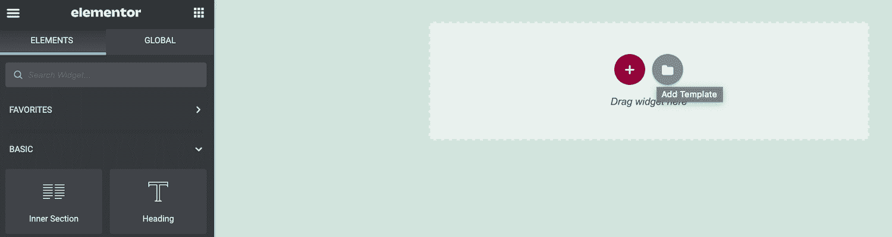

Click on the little folder icon inside the Elementor editor

然后，点击**我的模板**。此选项卡显示您已导入 Elementor 库的所有设计:

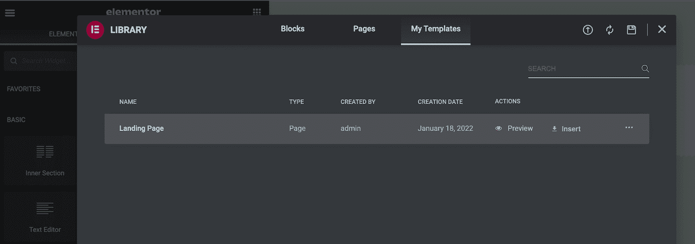

Displaying all your Templates

请注意，一些模板可能包含常用内容，如图像、视频和音频。虽然 Elementor 有权显示这些第三方内容，但不能保证您可以合法地将这些媒体包含在您的公共网站上。

大多数著名的模板创建者都乐于提供许可权，所以查看细则以获取更多信息是明智的。如果您不确定，您可以随时联系模板开发人员获取更多信息。

### 如何在 element 或中将页面保存为模板

如果你想创建你自己的元素或者模板，这个插件可以让你这样做。首先，您需要使用 Elementor 来构建一个您希望在以后重用的设计。

一旦你对页面设计感到满意，在 Elementor 编辑器的左下角找到 **Publish** 按钮。然后，单击该按钮旁边的向上箭头:

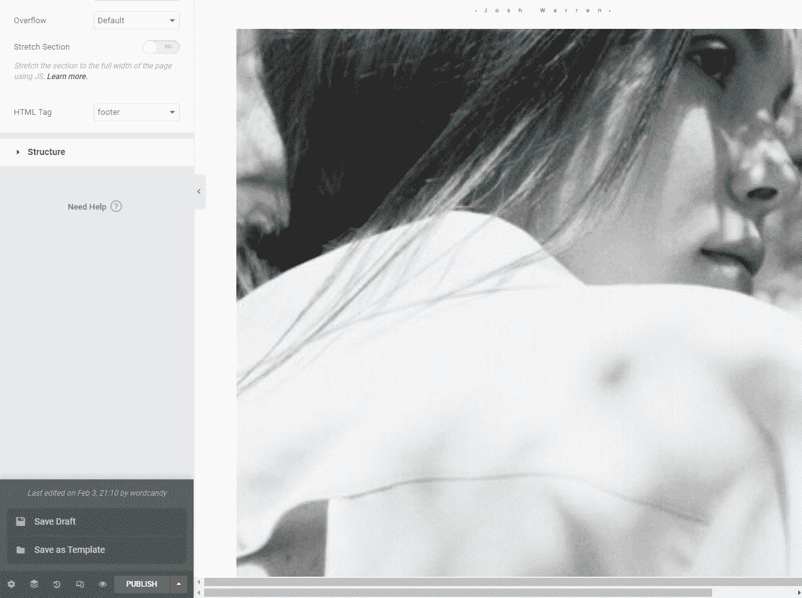

Save a page as a Template

您将看到将设计保存为草稿或模板的选项。如果您选择后者，Elementor 将要求您为模板选择一个名称:

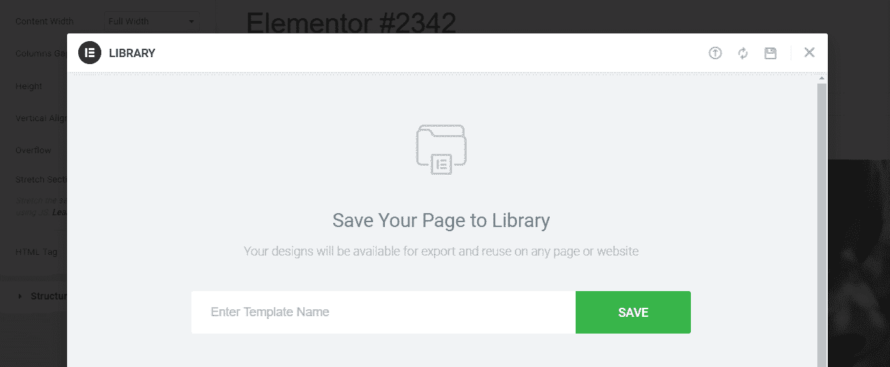

Enter the Template name

选择一个名称并点击**保存**。现在，该模板将出现在 Elementor 库的**“我的模板”**选项卡下。您也可以通过从仪表板导航到**模板>保存的模板**来访问模板(正如我们在上一节中向您展示的)。

使用 Elementor，您可以创建和保存的模板数量没有限制。页面生成器还允许您导出模板，这正是下面列表中大多数创建者所做的。如果你对你的元素或模板制作技能有信心，没有理由你不能卖掉你的设计。

### 如何使用 Elementor 创建 WordPress 页眉和页脚模板

如果你使用的是 Elementor Pro，插件会给你创建多种类型的页面模板的选项。您可以使用这些模板来构建整个主题:

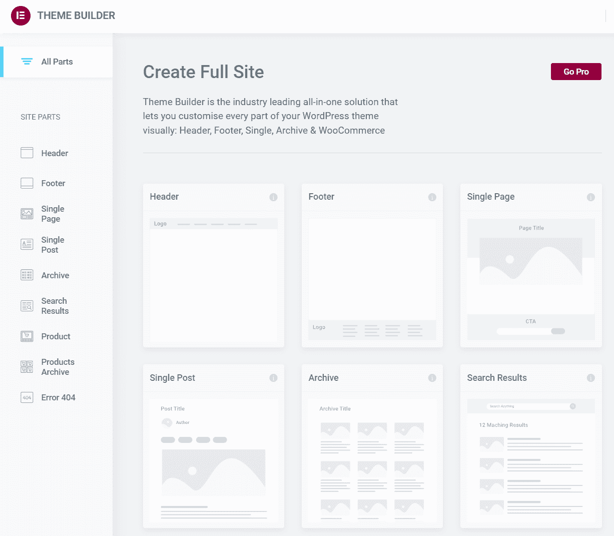

Page Templates in Elementor

要设计新的元素或页眉页脚模板，请进入**模板>主题生成器**并点击**添加新模板**。选择显示**页眉**(或**页脚**)的选项，Elementor 编辑器将打开。

在这个阶段，您可以从多个页眉和页脚模板中进行选择，也可以从头开始设计自己的模板。完成后，点击 **Publish** ，Elementor 会让你选择要应用新模板的页面。

默认情况下，Elementor 将为每个页面添加页眉和页脚模板。但是，您也可以挑选在哪里使用新模板。

## WordPress 网站前 24 个元素或模板

Elementor 拥有超过 500 万的活跃安装数，是 T2 最受欢迎的页面创建者之一。这意味着不缺少可供选择的模板。然而，有时过多的选择可能是一件坏事。

为了帮助您找到合适的设计，我们为您做了调查。这里有 24 个最适合你的 WordPress 网站的 Elementor 模板，包括大量针对不同领域和行业的设计。

### 1.有机商店

如果你要开一家杂货店、农场商店或食品主题商店，那么[有机商店](https://websitedemos.net/organic-shop-02/)是你新事业的绝佳选择。该模板设计简洁，将产品图片放在前面和中央:

Organic Shop

突出的功能包括一个计算器，显示您的产品和类别的总数。你还可以找到一个[评论和推荐区](https://kinsta.com/blog/best-wordpress-review-plugins/)，在这里你可以展示强大的社会证明。

**特性:**

*   包含社交链接的信息页脚，以及推广您的电子商务移动应用的空间
*   支持客户评审
*   互动且[引人入胜的 FAQ 页面](https://kinsta.com/blog/wordpress-faq-plugins/)

**定价:**有机商店免费[雅特首发模板](https://wpastra.com/starter-templates/?page-builder=elementor)。你可以从官方 WordPress 知识库免费下载 [Astra 主题](https://wordpress.org/themes/astra/)。

### 2.正念曼波

随着冥想和正念越来越受欢迎，你可能正在寻找一个促进健康的模板。[mindent Mambo](https://library.easythemepacks.com/demos/mindful-mambo/)使用宁静的绿色配色方案和自然主题意象来实现宁静的设计:

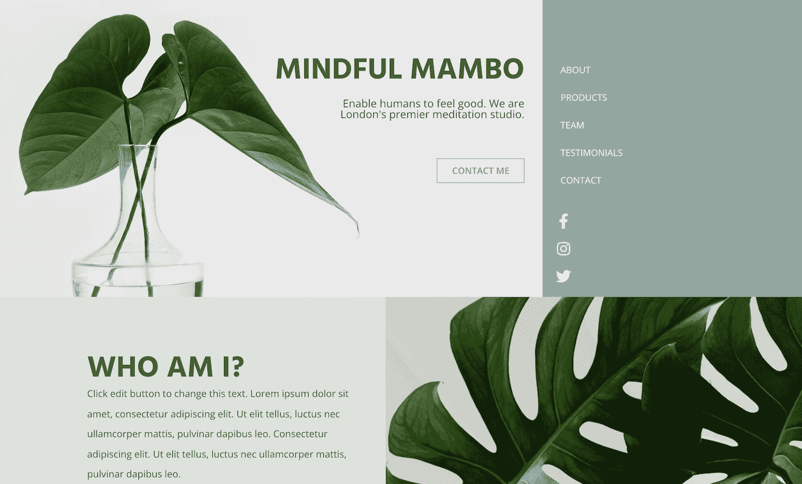

Mindful Mambo

Mindful Mambo 是一个灵活的模板，提供各种电子商务的部分，包括一个区域来展示你的产品。然而，它也包括访问者可以安排课程和约会的部分。这使得 Mindful Mambo 非常适合各种健康主题的网站。

**特性:**

*   一个功能丰富的主页，可以用于在线商店或基于预约的业务
*   一个不寻常的和引人注目的块状布局
*   内置滑块，具有多个行动号召(CTA)
*   [手机友好型](https://kinsta.com/blog/google-mobile-first-index/)

**定价:**mindent Mambo 作为 [30 模板套装](https://www.easythemepacks.com/templates/)的一部分，售价 49 美元。

### 3.教育

来自唐小蓝的[教育模板](https://zitademo.wpzita.com/education/)拥有[为大学](https://kinsta.com/wordpress-hosting-for-education/)、学校或学院建立网站所需的一切。它有各种教育主题的部分，包括学生图书馆、课程和活动新闻:

Education Template

为了鼓励注册，教育包括一个实时跟踪。这显示了课程、学生和教职员工的总数。

这个模板有一个简单的设计，偶尔流行的大胆的颜色。它很好地将注意力吸引到了模板最重要的内容上。

**特性:**

*   大型英雄形象
*   引人注目的重叠部分
*   色彩的克制但有效的运用
*   专业设计

**定价:**你可以花 59 美元购买一个[唐小蓝 Pro 授权](https://wpzita.com/pricing/)。

### 4.设计会议

如果你正在[安排一个活动](https://kinsta.com/blog/wordpress-events/),[design conf 模板](https://www.cssigniter.com/elementor/designconf)有你需要的一切来为你的会议制造轰动，[收集注册](https://kinsta.com/blog/wordpress-events-plugin/)。该模板包含有用的部分，包括与会者证明、演讲者简介和活动赞助商:

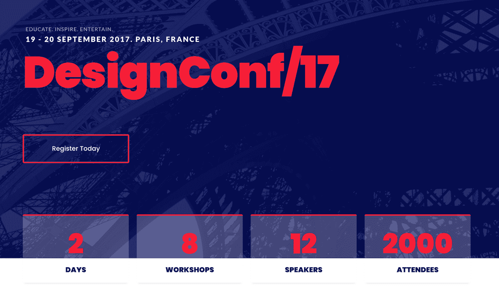

DesignConf

DesignConf 有一个可折叠的时间表，潜在与会者可以在其中浏览您的会议。这使得大量的信息触手可及，而不用强迫他们面对一堵文字墙。

在设计方面，这个模板使用了古怪的倾斜部分和对比色。这使得一个充满活力和现代外观的元素或模板。

**特性:**

*   一个[谷歌地图](https://kinsta.com/blog/wordpress-google-maps/)区块，用于显示您活动的位置
*   社交媒体整合
*   注册 CTA
*   现场倒计时

**定价:**你可以每年支付 34.30 美元购买一个 [DesignConf 许可](https://www.cssigniter.com/pricing/)。

### 5.烧烤餐厅

烧烤餐厅在设计时就考虑到了外卖店、咖啡馆和其他以食物为基础的场所。该模板会立即将您的产品放在最前面和中心位置，并带有引人入胜的[视频横幅](https://kinsta.com/blog/embed-youtube-video-wordpress/):

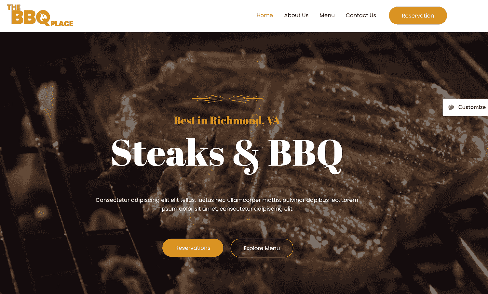

BBQ Restaurant

主页模板有一个不寻常的结构，图像和文本交替出现。它还大量使用动画，当访问者滚动时，动画会自动激活。

除了主页之外，BBQ Restaurant 还有一些区域，你可以在那里展示你的菜单和一些关于你的生意的信息。它还提供了一个谷歌地图区块，这将有助于就餐者找到你的场地。

**特性:**

*   醒目的视频横幅
*   交替视差和纯色背景
*   [客户评论](https://kinsta.com/blog/embed-google-reviews/)部分
*   产品图片空间充足

**定价:**可以[免费下载餐厅烧烤](https://wpbuilt.co/templates/bbq-restaurant/)。

### 6.SEO 魔法

顾名思义， [SEO Magic](https://elementor.thelandingfactory.com/template-demo) 帮助[搜索引擎优化(SEO)](https://kinsta.com/blog/wordpress-seo/) 代理机构和自由职业者为他们的服务做广告。为了帮助将访问者转化为客户，模板有足够的空间在折页上方显示图像、标题、标语和 CTA:

SEO Magic

使用 SEO Magic，您可以将所有服务以结构化网格格式的卡片形式呈现。这是一种有效的方式来提供你所提供的概述，而不会用沉重的文字淹没访问者。

SEO Magic 是[完全响应](https://kinsta.com/blog/responsive-web-design/)。更好的是，您可以使用演示的各种预览设置，轻松检查 Elementor 模板将如何在智能手机和平板电脑上呈现。

**特性:**

*   吸引人的插图
*   滚动动画
*   具有说服力的 CTA 贯穿整个模板
*   独特的蓝色、橙色和紫色配色方案

**定价:**一张个人执照[售价 16 美元](https://elementor.thelandingfactory.com/template/seo-magic-homepage/)。如果你是一家代理商，那么你可以购买 SEO Magic 无限使用，价格 63 美元。

### 7.赫斯泰

Hestate 是一个完全响应的模板工具包，专为 T2 的房地产公司、房地产代理公司、室内设计师和其他需要推销房产的企业而设计。此模板有一个大的视频横幅，非常适合显示您最想要的房地产的视频漫游:

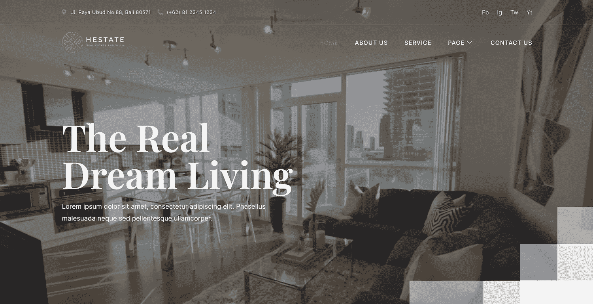

Hestate

Hestate 选择了简单的白色背景，随着访问者的滚动，各种图像在屏幕上滑动。这是一个吸引人的动态模板。

Hestate 有很多展示公寓、房子和其他房产的理想区域。这包括一个将大图片与价格和位置信息相结合的部分。

**特性:**

*   简洁经典的设计。
*   视网膜就绪。
*   超过 14 个现成的模板。
*   专用的[物业列表](https://kinsta.com/blog/directory-website-wordpress/)和物业详情页面。

**定价:**你可以花 24 美元购买整个 [Hestate 模板包。](https://themeforest.net/item/hestate-real-estate-elementor-template-kit/30596384)

### 8.把音乐关掉

如果你是一名音乐家，那么 [Katka Music](https://elementortemplatepack.com/demo/?product_id=musichome) 有你需要的一切来宣传你即将到来的巡演、专辑发行，甚至是你的[整个音乐备份目录](https://kinsta.com/blog/portfolio-website/)。这个大胆的模板有足够的空间来显示多媒体，包括[音频剪辑](https://kinsta.com/blog/wordpress-audio-players/)，视频，甚至[你以前巡演的照片库](https://kinsta.com/blog/wordpress-photo-gallery-plugins/):

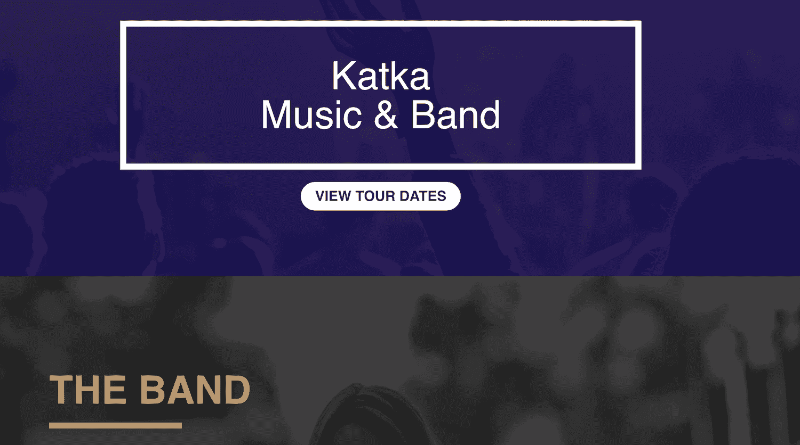

Katka Music

如果你有任何即将到来的活动，Katka Music 有一个完整的部分，你可以列出你的巡演日期，并鼓励粉丝们预订门票。这个模板还拥有全屏设计、[大字体](https://kinsta.com/blog/modern-fonts/)和一个黑暗而富有戏剧性的配色方案。

**特性:**

*   [照片库](https://kinsta.com/blog/wordpress-portfolio-plugins/)
*   [联系方式](https://kinsta.com/blog/wordpress-contact-form-plugins/)
*   引人入胜的多媒体主页
*   CTA 的设计牢牢记住了音乐家

价格:你可以花 5.99 美元下载完整的[卡特卡音乐模板套件](https://barnab.gumroad.com/l/festival)。

### 9.终极旅行套件

你可以为你的旅行社或旅游运营商创建一个专业网站，使用冒险主题的[终极旅行工具包](https://www.templatemonsterpreview.com/demo/191867.html?_gl=1*mhftr3*_ga*NjE1NjgxMjAzLjE2NDI1ODU2MjY.*_ga_FTPYEGT5LY*MTY0MjYwODcxNi4zLjEuMTY0MjYwODc3OS41OA..&_ga=2.141484210.1044992709.1642585626-615681203.1642585626)。当你宣传奢华的度假目的地时，高分辨率的照片和视频是必不可少的。考虑到这一点，您会很高兴地了解到该模板具有完全可定制的媒体背景，支持图像和视频，以及视差效果:

Ultimate Travel Kit

有了一系列的博客模板，这个工具包也非常适合露营、探险和旅游博客。终极旅行工具包提供了各种博客布局，包括网格和砖石风格。

**特性**

*   十多个完全可定制的模板
*   响应式布局
*   24 小时客户支持
*   兼容 [WPML 插件](https://wpml.org/)

**定价:**你可以[花 12 美元购买终极旅行套装](https://www.templatemonster.com/elementor-templates/elementor-s-ultimate-web-kit-for-travel-and-adventure-blogging-191867.html)。这包括未来的更新，加上六个月的支持。

### 10.约会

随着最受欢迎的约会网站每月吸引 1.825 亿访问者，你可能正在寻找进入这个 T2 利润丰厚的会员市场的机会。如果你正在开始自己的相亲事业，我们建议你看看[唐小蓝的约会模板](https://zitademo.wpzita.com/dating/):

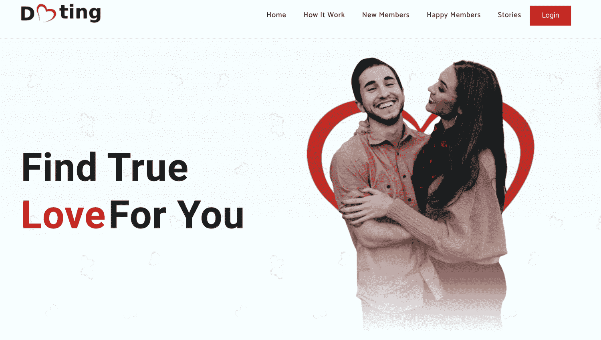

Zita’s Dating

这个模板使用滚动动画来创建一个更吸引人和互动的设计。为了帮助推动注册,《约会》有一个丰富多彩、图片丰富的**成功故事**版块，在这里你可以突出所有通过你的网站找到爱情的人。

约会模板将大量信息打包到其主页中。为了帮助访问者快速找到他们感兴趣的内容，这个模板带有内置的[跳转菜单链接](https://kinsta.com/blog/anchor-links/)。

## 注册订阅时事通讯

### 想知道我们是怎么让流量增长超过 1000%的吗？

加入 20，000 多名获得我们每周时事通讯和内部消息的人的行列吧！

[Subscribe Now](#newsletter)

**特性:**

*   要[实现网站会员功能的领域](https://kinsta.com/blog/wordpress-user-registration-plugins/)
*   对强有力的社会证据的强调
*   一个[信息包装的页脚设计](https://kinsta.com/blog/how-to-edit-footer-in-wordpress/)，包含有用的链接、社交媒体图标，甚至更多的客户证明

**定价:** [唐小蓝 Pro 授权](https://wpzita.com/pricing/)售价 59 美元。

### 11.美丽布吉舞

Beauty Boogie 是一个用户友好的电子商务模板。这种设计主要针对沙龙、美发师、化妆师和其他美容行业:

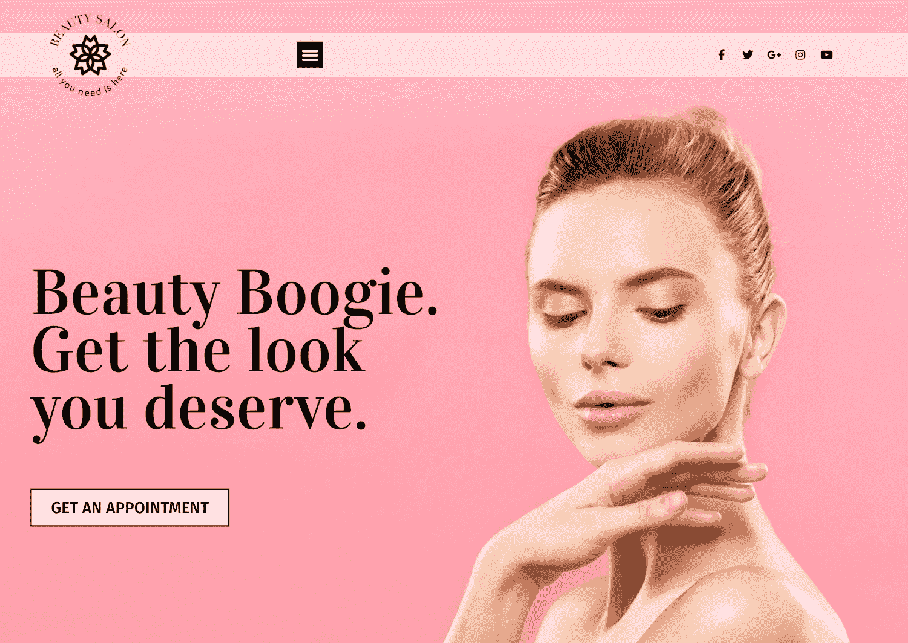

Beauty Boogie

Beauty Boogie 采用大胆的对比配色方案，是一个引人注目的有趣模板。可折叠的菜单承诺提供对所有网站页面的便捷访问，而不会侵犯这种生动的设计。

**特性:**

*   现成的[部分，包括产品](https://kinsta.com/blog/conversions-woocommerce-product-pages/)、约会、推荐等
*   团队部分，每个员工都有单独的社交媒体资料
*   内置[联系我们表单](https://kinsta.com/blog/contact-form-7/)。
*   全程预约 CTA 特色

**定价:** Beauty Boogie 是 [30 模板套装](https://www.easythemepacks.com/templates/)的一部分，售价 49 美元。

### 12.小说的

如果你是一名作家， [Novelistic](https://www.templatemonsterpreview.com/demo/70278.html) 可以帮助你展示你之前发表的所有作品。[内容创作者](https://kinsta.com/learn/blogging-tips/)也可以使用 Novelistic 来宣传他们的服务:

Novelistic

这个模板有一个引人注目的黑色配色方案，带有独特的选项卡块。访问者可以通过点击这些标签来了解你的工作。

此外，Novelistic 还提供了一个板块，你可以用一种吸引人的网格格式为你的书、博客或任何其他出版的作品做广告。它还有一个计数器，可以记录你的读者和页面总数。

**特性:**

*   最重要作者头像全幅英雄图像
*   古怪的布局和配色方案
*   可以显示积极反馈和评论的滑块
*   展示您即将出版的出版物、研讨会、图书巡展和其他作家活动的版块

价格:你可以[花 7 美元](https://www.templatemonster.com/elementor-templates/novelistic-writer-portfolio-pro-elementor-template-70278.html)购买一个网站的小说。这包括六个月的支持。

### 13.元素或 HQ

ElementorHQ 项目采用一种独特的方法来帮助你开发一个令人惊叹的网站。ElemenetorHQ 不是针对特定领域的多个模板，而是一个多用途的 Elementor 模板包。这意味着它提供了少量高度灵活和可定制的模板:

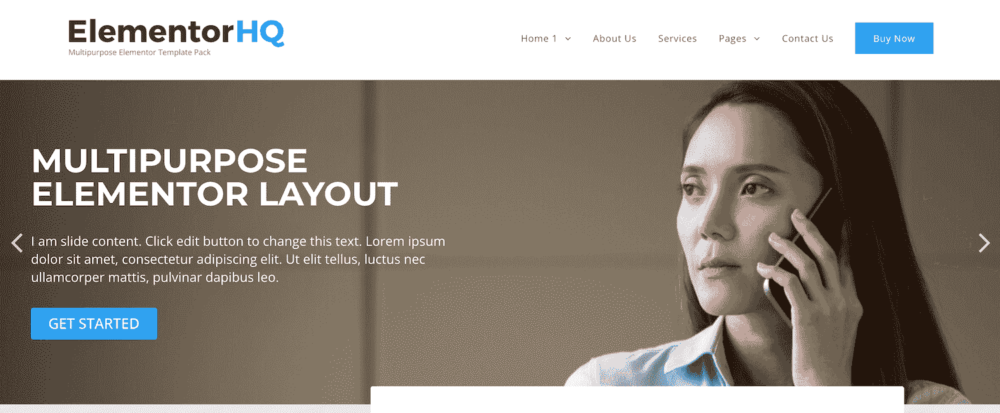

ElementorHQ

然后，您可以使用 Elementor 编辑器来真正制作您自己的设计。这种灵活性使得 ElementorHQ 成为 WordPress 机构或任何需要创建大量网站的人的绝佳选择。

通过使用 ElementorHQ 作为所有项目的基础，您可以最大限度地降低设计和开发成本。一旦你熟悉了使用这个模板包，你也应该能够在更短的时间内创建高质量的网站。这对你的整体生产力和利润都有好处。

**特性:**

*   为所有最常见的 WordPress 页面定制设计的布局
*   完全灵活和可定制的布局
*   时尚专业的设计

价格:你可以[下载这个多用途的 Elementor 模板包](https://elegantmarketplace.com/downloads/elementorhq-multipurpose-elementor-template-pack/)，售价 35 美元。

### 14.现在拖走

[Tow Now](https://preview.themeforest.net/item/tow-now-towing-services-elementor-template-kit/full_screen_preview/32685808) 是一个 Elementor 模板，专注于故障和恢复汽车服务。该模板大量使用滑动磁贴，当访问者滚动页面时，滑动磁贴会自动触发:

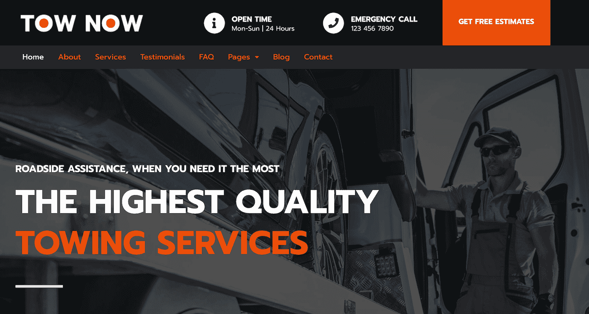

Tow Now

有了这些动画，你应该可以毫不费力地将访问者的注意力吸引到网站最重要的元素上。这包括 Tow Now 预建的[线索捕获表](https://kinsta.com/blog/wordpress-lead-generation/)及其客户证明区。

由于这是一项紧急服务，Tow 现在有不同的部分，您可以突出显示您的电话号码。这确保了任何访问您网站的人都能立即看到如何联系您的企业。

**特性:**

*   一整套 29 个模板
*   完全兼容免费的 Elementor 插件
*   页眉和页脚生成器

**定价:**Tow Now 套餐[售价 19 美元](https://themeforest.net/item/tow-now-towing-services-elementor-template-kit/32685808)。

### 15.食物忧郁

如果你经营一家餐馆、外卖店或咖啡馆，食物蓝调可以帮你大出风头。这个醒目的模板通过全幅横幅和强大的 CTA 吸引您的注意力:

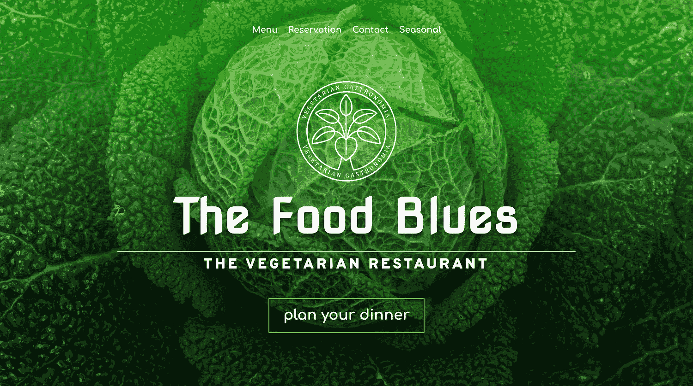

Food Blues

Food Blues 提供了各种现成的菜单部分和一个滑块，您可以在其中展示所有热情洋溢的客户评论。该模板还附带了一个预先构建的联系表单，用于收集您创建餐厅预订所需的所有信息。

**特性:**

*   醒目的视觉效果
*   强烈的白色和红色配色方案
*   信息丰富的主页模板
*   方便导航的内置跳转链接

**定价:**你可以作为 [$49 模板包](https://www.easythemepacks.com/templates/)的一部分访问食物蓝调。

### 16.食品与营养

如果你经营一家健康食品或健康企业，你可能想看看[食品&营养](https://preview.themeforest.net/item/food-nutrition-elementor-template-kit/full_screen_preview/25980836)。这个全面的软件包拥有两个主页变体，页眉和页脚模板，一个帖子模板，以及为您的**关于**和**联系我们**页面定制的设计:

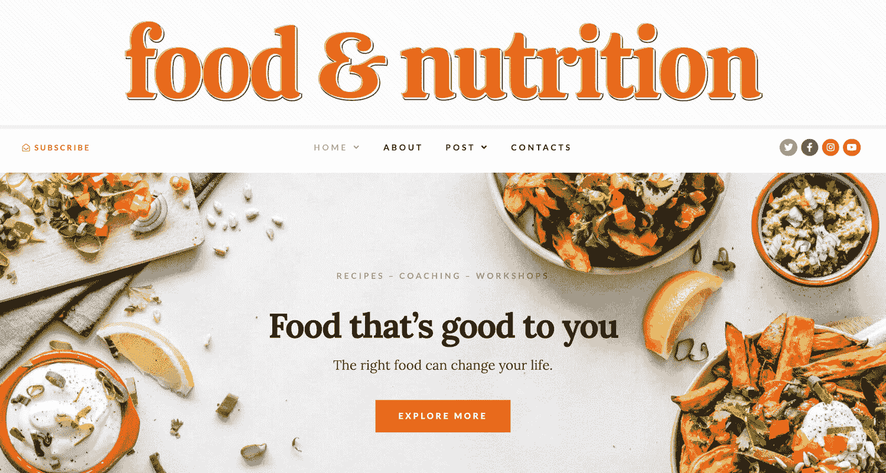

Food & Nutrition

食品与营养也有一个食谱块。这使得它非常适合营养学家，也适合在健康、健身和福利行业经营的其他企业。有了专门的博客存档模板，你甚至可以使用这个工具包来启动你的食物或食谱博客。

Struggling with downtime and WordPress problems? Kinsta is the hosting solution designed to save you time! [Check out our features](https://kinsta.com/features/)

**特性:**

*   专用的[简讯电子邮件](https://kinsta.com/blog/newsletter-examples/)块
*   多媒体主页
*   内置照片库
*   Elementor Pro 和免费 Elementor 插件的独立设计

**定价:**20 美元可以购买一份[食品&营养许可证](https://themeforest.net/item/food-nutrition-elementor-template-kit/25980836)。

### 17\. Pet Care

如果你经营一家宠物看护公司、兽医诊所或狗狗日托中心，宠物护理公司可能是你的理想选择。模板以醒目的英雄形象和多个 CTA 开始:

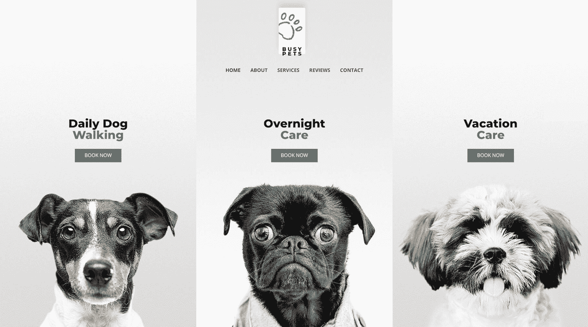

Pet Care

宠物护理侧重于鼓励游客皈依。在它的各种设计中，你会发现常见的 CTA、产品定价信息，以及可以展示包括客户评论在内的社交证明的部分。宠物护理模板也大量使用引人注目的图像，使其成为视觉上特别引人注目的 Elementor 模板。

**特性:**

*   内置联系人表单
*   谷歌地图集成
*   员工页面
*   引人注目的图像和强大的 CTA

**定价:**宠物护理是一个高级模板，是 Astra Pro 模板包的一部分。 [Astra Pro 许可证](https://wpastra.com/pricing/)起价 49 美元。

### 18.音乐节目主持人

音乐节目主持人非常适合推广现场活动，如音乐会、DJ 台和夜总会。如果您有以前事件的镜头，此模板会以全屏视频标题开始。这是让与会者对您的活动感到兴奋的好方法:

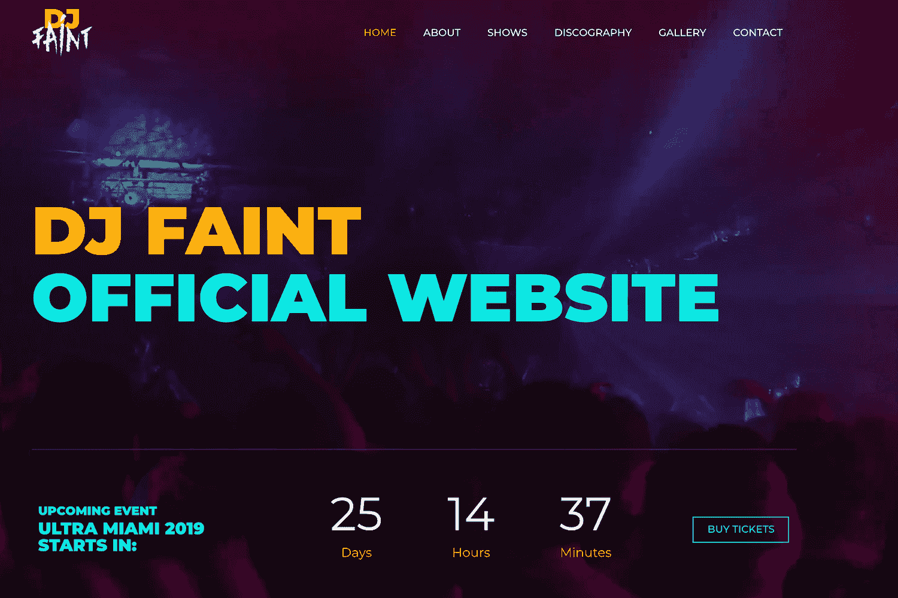

Disc Jockey

为了提高转化率，唱片骑师的标题还具有 CTA 和现场倒计时。模板的其余部分有足够的空间来展示您过去的事件。这包括单独的照片和视频画廊。

**特性:**

*   视频背景和横幅
*   动画倒计时
*   唱片目录部分
*   信息丰富的页脚设计

**定价:**唱片骑师[免费下载](https://wpbuilt.co/templates/disc-jockey/)。

### 19.该死的

Pirus 模板被认为是一种黑暗而现代的设计，它确实不负众望。引人注目的配色方案使其成为您的数字机构或自由职业者的抢眼设计:

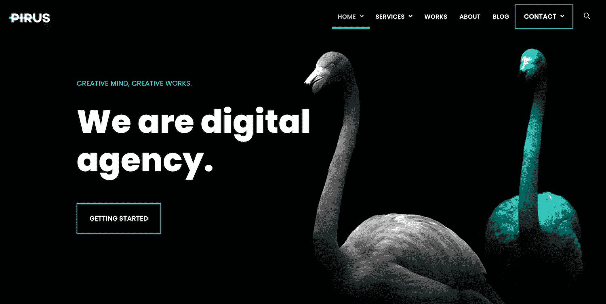

Pirus

由于几个悬停动画，Pirus 脱颖而出。这包括蓝色高光和各种图像的缩放效果。这些动画的繁荣使得这是一个高度互动和迷人的模板。

**特性:**

*   包含超过 15 个现成模板的完整套件
*   完全响应的布局
*   视网膜就绪
*   自始至终大量使用动画

**定价:**你可以花 24 美元下载 [Pirus 模板工具包。](https://themeforest.net/item/pirus-dark-digital-agency-elementor-template-kit/30745187)

### 20.酿酒厂

[Winery](https://websitedemos.net/winery-04/our-story/) 是一个复杂的模板，非常适合葡萄园、品酒活动或任何其他基于食物或饮料的体验。该模板非常强调鼓励访问者注册面对面的会议，这使得它非常适合基于活动的企业:

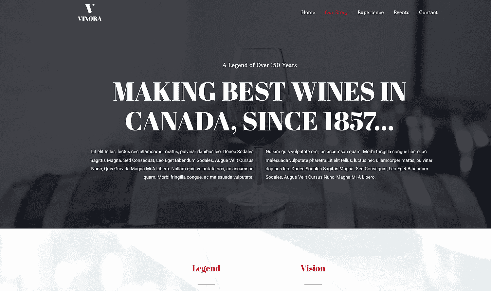

Winery

这个以葡萄酒为主题的 Elementor 模板有一些不寻常的部分。这包括游客可以预订参观，甚至计划婚礼的地方。它还有一个部分，人们可以在那里了解更多关于单种葡萄酒及其价格的信息。

说到设计，Winery 使用了交替的空白块和大图片。特别是，其中一些内容显示为覆盖图，当你滚动这个设计时，会产生引人注目的效果。

**特性:**

*   许多不同的部分和选项
*   内置照相馆
*   有趣的动画和滚动效果

**定价:**该模板包含在 [Astra 基本套装](https://wpastra.com/pricing/)中，售价 169 美元。

### 21.按钮交互式

[按钮交互](https://www.cssigniter.com/elementor/button-interactive/)是一个简单的 Elementor 模板，以其大胆明亮的配色方案给人留下深刻印象。这是一个灵活且可定制的设计，包含许多不同的部分:

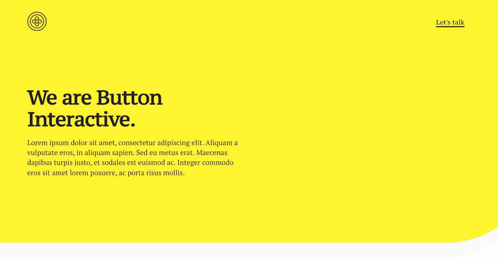

Button Interactive

使用这些区域，你可以添加任何东西，从图片库到客户评价、客户名单，甚至是作品集。虽然这个模板适用于各种网站，但作品集部分让 Button Interactive 特别适合创意产业。如果你想以紧凑和结构化的方式展示你的最佳作品，这可能是适合你的模板。

**特性:**

*   独特的弧形页脚
*   为摄影网站、平面设计师和工作室提供完美的设计
*   许多不同的部分，随时可以定制自己的内容

**定价:**你可以花 34.30 美元购买一张[单主题授权](https://www.cssigniter.com/pricing/)。

### 22.时尚感

时尚感是一种优雅的柔和色调的模板。尽管名为 Fashion Feel，但你可以利用它建立各种各样的在线商店，这要归功于它的 [WooCommerce 整合](https://kinsta.com/blog/woocommerce-plugins/):

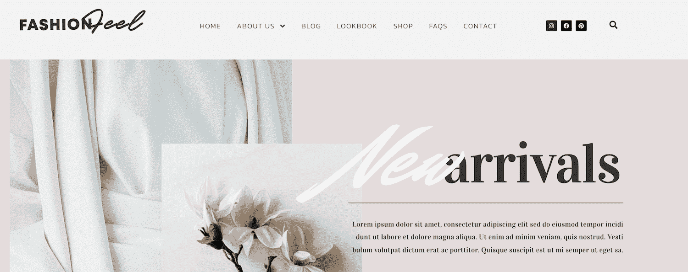

Fashion Feel

这个完整的电子商务套件有十页。如果你正在为一家[时尚主题公司](https://kinsta.com/blog/how-to-start-a-fashion-blog/)设计网站，那么你可能会对 Lookbook 的布局特别感兴趣。这是展示产品图片的理想选择。也有很多布局，你可以重新用于其他行业，包括商店，服务，团队和联系我们的设计。

**特性:**

*   完全兼容 WooCommerce
*   简洁优雅的设计
*   包括样本内容
*   完全响应

**定价:**你可以花 24 美元购买[时尚感模板。这包括未来的更新和六个月的支持。](https://www.templatemonster.com/elementor-templates/fashion-feel-elementor-template-kit-woocommerce-compatible-182852.html)

### 23.工程师

设计网页时，对每一部分内容进行微调是很重要的。然而，出现在文件夹上方的信息尤其重要。这是你向潜在的新客户推销并鼓励他们探索你的网站的机会。

[Engirem](https://www.templatemonsterpreview.com/demo/70273.html) 模板旨在充分利用这一机会，提供了一个包含多个 CTA 和大图像的滑块。如果您从事汽车维修行业，这可能是推广您的服务的绝佳模板:

Engirem

当你滚动时，Engirem 通过一个动画计数器和“翻转”效果来吸引访问者的兴趣。甚至还有一个谷歌地图部分来帮助潜在客户找到你的企业。

**特性:**

*   证明块
*   特价商品区
*   完全响应
*   大胆的颜色和图像

**定价:**如果你在一个网站上使用这个模板，那么你可以[花 7 美元](https://www.templatemonster.com/elementor-templates/engirem-car-repair-pro-elementor-template-70273.html)购买 Engirem。

### 24.专注的

如果你是一个主机提供商或经销商，[专用元素或模板](https://www.cssigniter.com/elementor/dedicated)是为你的业务而设计的。该模板通过在主页的最上方放置一个销售线索捕获表单，开门见山:

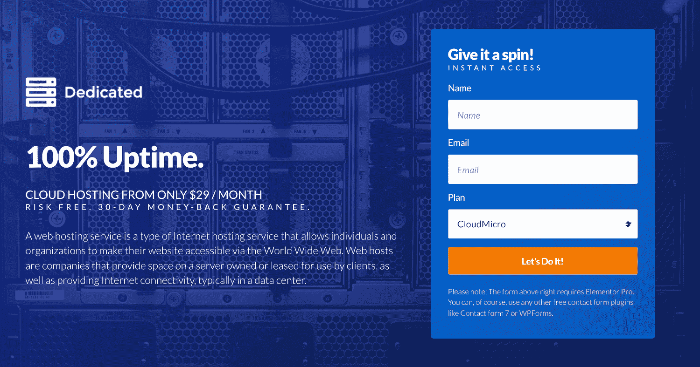

Dedicated

虚拟主机包可能是一个复杂的话题。为了使这些信息更容易理解，专用模板使用了网格布局。在这里，你可以用一张简短的卡片来呈现每一条内容。

**特性:**

*   现成的定价表
*   页脚，包括您可以通知客户任何潜在停机的部分
*   证明部分
*   为您的 CTA 提供充足的空间

**定价:**你可以花 34.30 美元购买[专用模板。](https://www.cssigniter.com/pricing/)

## WordPress 登录页面模板的三大要素

如果你想用 Elementor 来构建高转化率的登陆页面，模板可以帮你省去很多工作。在本节中，我们将向您介绍一些我们最喜欢的 Elementor 登录页面模板，并讨论何时使用它们。

### 1.企业家

许多企业使用电子书作为潜在客户生成工具。这通常包括访问者分享他们的联系信息，以换取免费下载。这样，电子书可以成为通过电子邮件营销和其他个性化内容锁定潜在客户的第一步。

如果你计划使用这种潜在客户生成技术，那么你可能需要[为你的电子书创建一个登陆页面](https://kinsta.com/blog/wordpress-ab-testing-tools/)。在这种情况下，我们建议看一看[企业家模板](https://www.cssigniter.com/elementor/entrepreneur):

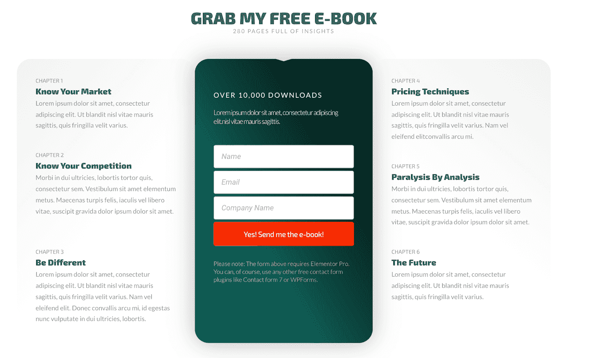

Entrepreneur landing page

这个模板提供了一个表单，访问者可以输入他们的个人信息来换取电子书。为了鼓励注册,《创业家》( Entrepreneur)有一些板块，你可以在上面添加已经下载了你的电子书的知名企业的证明和标识。

**特性:**

*   针对转换进行了优化
*   内置销售线索捕获表单和 CTA
*   大量的部分显示强大的社会证明

**定价:**这个模板是[定价为$34.30](https://www.cssigniter.com/pricing/) 一年。

### 2.福田汽车

如果你想拥有一款成功的应用，仅仅在 iOS 和 Android 商店上发布是不够的。你还需要为这个应用程序创建一个网站或登陆页面。

登录页面应该包括用户决定是否要安装该软件所需的所有信息。幸运的是，这就是[福田](https://themeforest.net/item/foton-a-multiconcept-software-and-app-landing-theme/22251705)所做的:

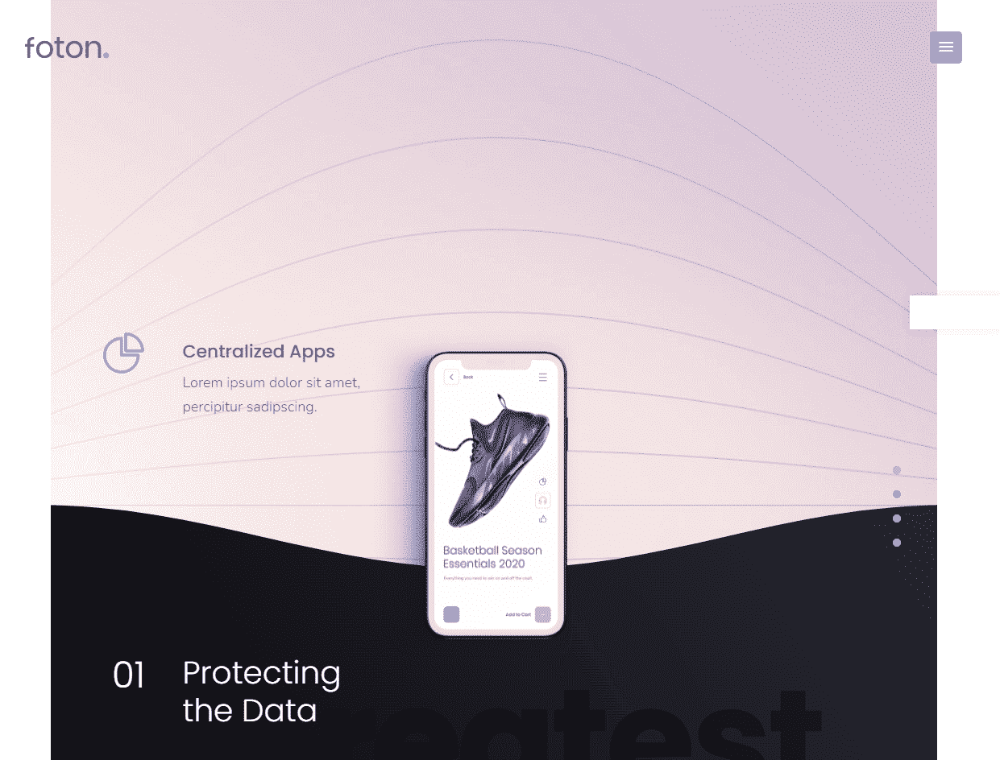

Foton landing page

NextApp Elementor 模板使您能够展示应用程序截图并突出显示软件的主要功能。您还可以包括定价信息和销售线索收集表单。另外，你可以添加链接到你使用的任何一个应用商店。

**特性:**

*   利用内置表单捕捉潜在客户
*   突出你的应用的关键特性
*   将访问者链接到多个 app store 页面

**定价:**该模板定价为 [$69 一年](https://themeforest.net/item/foton-a-multiconcept-software-and-app-landing-theme/22251705)。

### 3.Appway

Appway 为应用程序和托管服务提供登陆页面模板。应用程序模板使您能够展示软件的设计，包括动画。此外，它们包括多个部分，用于展示您的应用程序的主要功能:

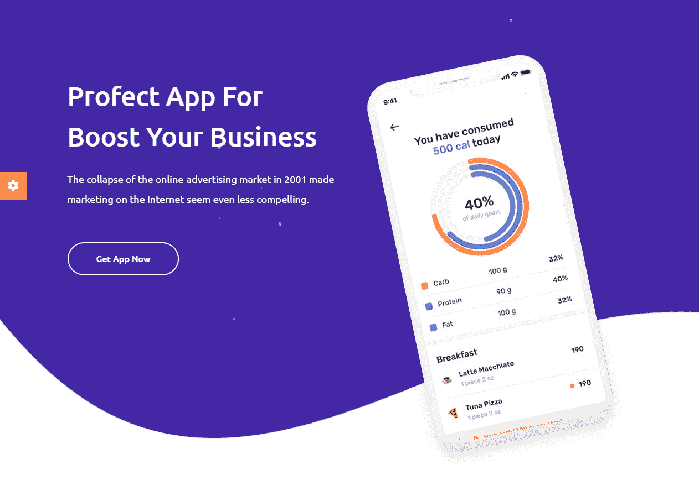

Appway landing page

Appway 包括一个简单的表格，用于检查可用的域名和价目表，显示不同顶级域名(TLD)的平均价格。该模板还提供了多个定制部分，用于讨论您的主要卖点:

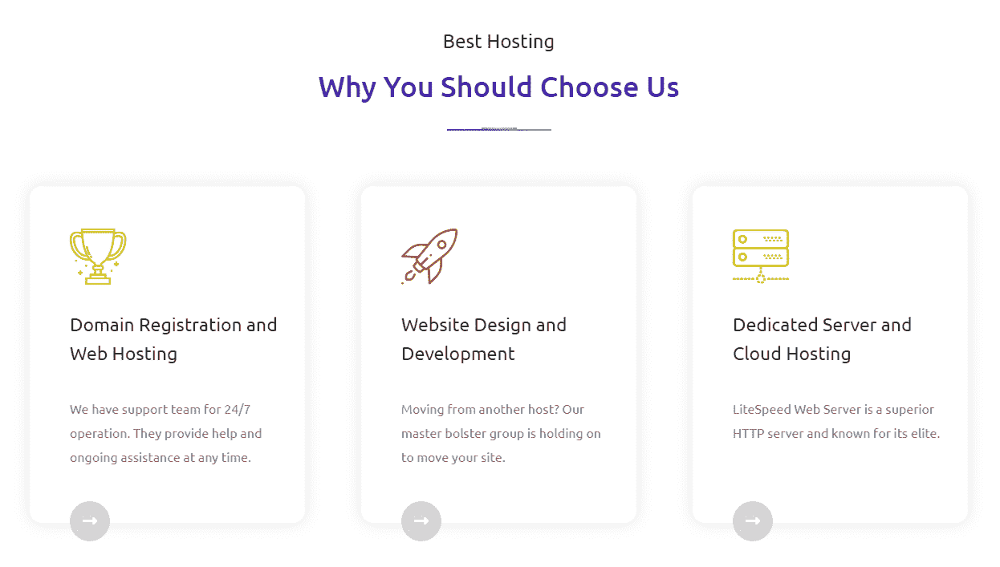

Another Appway landing page

两个登录页面模板都提供了带有大量微交互的现代设计。另外，它们很容易定制，因为每个元素都是使用 Elementor 构建的。

**特性:**

*   访问应用程序和托管登录页面
*   允许用户检查可用的域
*   比较多个顶级域名的价格
*   展示你的应用程序的主要卖点

**定价:**该模板定价为 [$39 一年](https://themeforest.net/item/appway-saas-startup-wordpress-theme/27362196)。

[Learn more about Elementor templates and how to choose the right one for your site✨... plus find 27 stunning templates for your site, all in this guide ⬇️Click to Tweet](https://twitter.com/intent/tweet?url=https%3A%2F%2Fbit.ly%2F371bvnh&via=kinsta&text=Learn+more+about+Elementor+templates+and+how+to+choose+the+right+one+for+your+site%E2%9C%A8...+plus+find+27+stunning+templates+for+your+site%2C+all+in+this+guide+%E2%AC%87%EF%B8%8F&hashtags=WebDesign%2CElementor) ## 摘要

有无数的 Elementor 模板可以帮助你建立一个令人惊叹的功能丰富的网站，再加上一个好的 [Elementor 托管](https://kinsta.com/elementor-hosting/)提供商，让它变得更快。然而，为你的商业网站选择合适的模板可能有点困难。

我们建议从必备功能列表开始。这可能是消除不适合您的特定项目的模板的最快捷、最简单的方法。如果您的模板遇到问题，那么一流的支持将是您的救命稻草。因此，评估社区和专业帮助的水平也是明智的。

对于列表中提到的任何元素或模板，您有任何问题吗？请在下面的评论区告诉我们！

* * *

让你所有的[应用程序](https://kinsta.com/application-hosting/)、[数据库](https://kinsta.com/database-hosting/)和 [WordPress 网站](https://kinsta.com/wordpress-hosting/)在线并在一个屋檐下。我们功能丰富的高性能云平台包括:

*   在 MyKinsta 仪表盘中轻松设置和管理
*   24/7 专家支持
*   最好的谷歌云平台硬件和网络，由 Kubernetes 提供最大的可扩展性
*   面向速度和安全性的企业级 Cloudflare 集成
*   全球受众覆盖全球多达 35 个数据中心和 275 多个 pop

在第一个月使用托管的[应用程序或托管](https://kinsta.com/application-hosting/)的[数据库，您可以享受 20 美元的优惠，亲自测试一下。探索我们的](https://kinsta.com/database-hosting/)[计划](https://kinsta.com/plans/)或[与销售人员交谈](https://kinsta.com/contact-us/)以找到最适合您的方式。