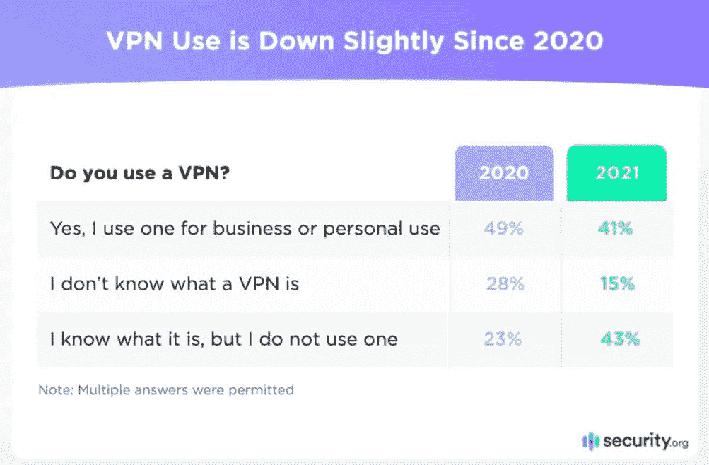
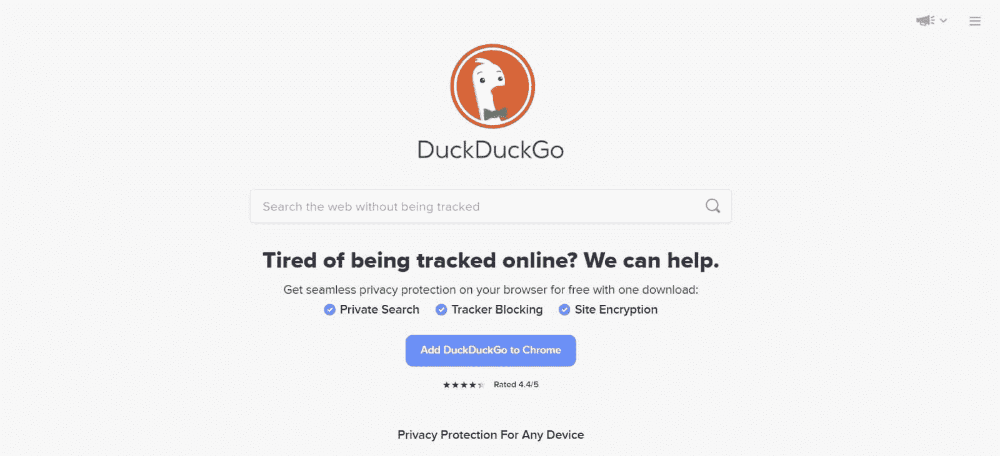
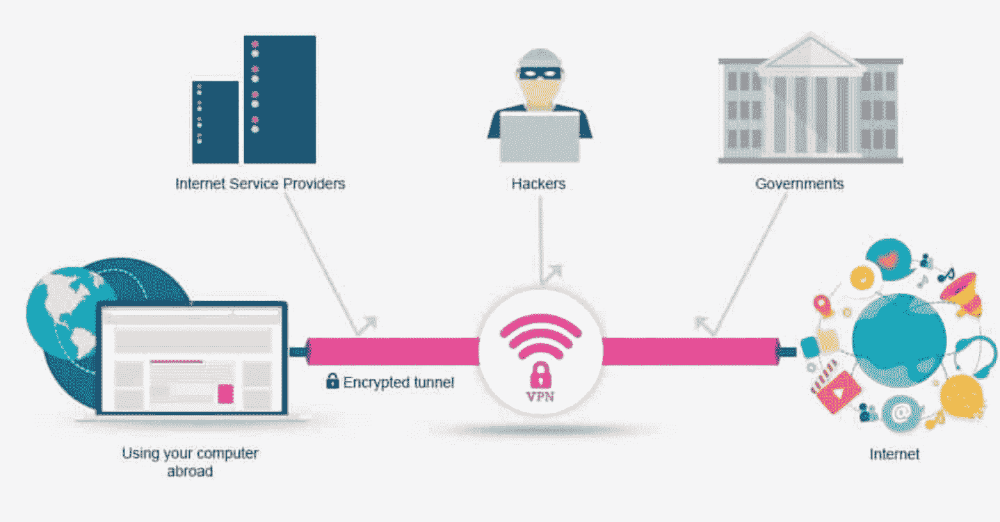
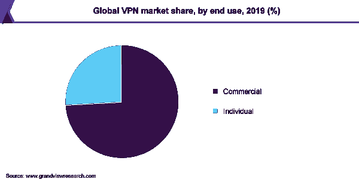
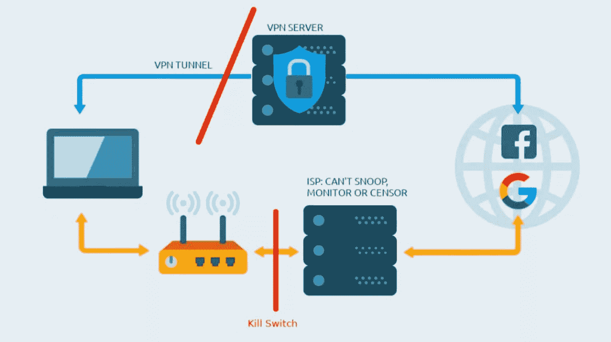
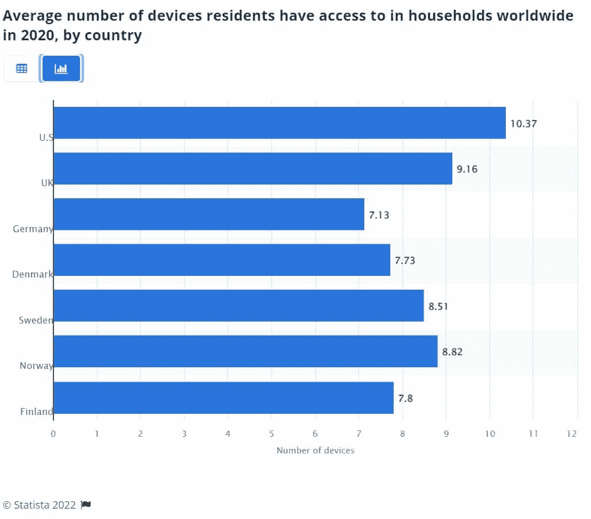
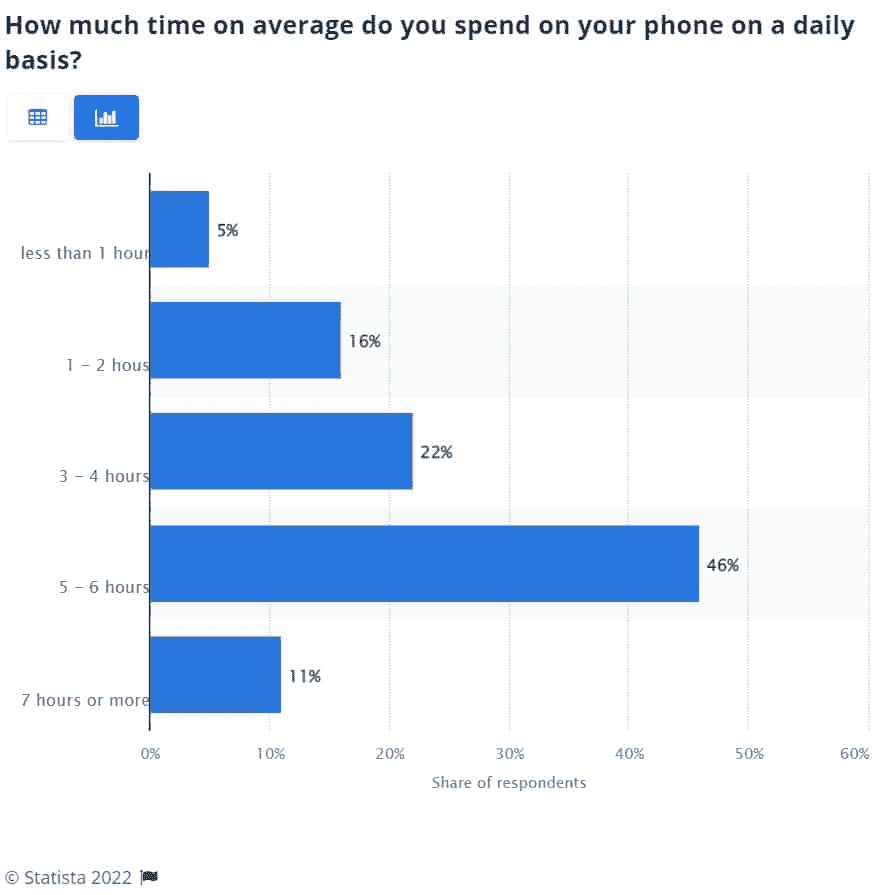

# VPN 是如何工作的？关于 VPN 你需要知道的一切

> 原文：<https://kinsta.com/blog/how-does-a-vpn-work/>

似乎现在几乎每个人都在使用 VPN 来解除网站封锁，保护他们的在线隐私。但是 VPN 到底是什么，它们是如何工作的？

[虚拟专用网络(VPN)](https://kinsta.com/blog/proxy-vs-vpn/)已经成为在线安全的代名词。VPN 通过安全的服务器路由您的互联网流量，有助于保护您的密码和其他有价值的个人数据免受窥探。这种能力也使得 VPN 在[解封受限内容](https://kinsta.com/blog/unblock-websites/)，匿名浏览网页，安全种子等方面有所帮助。

然而，VPN 不仅仅是简单地连接到某种远程服务器。因此，请继续阅读，我们将了解更多关于 VPN 的信息，它们是如何工作的，以及在选择下一个 VPN 提供商时应该注意什么。

### 查看我们的视频指南[VPN](https://www.youtube.com/watch?v=hc_NjbKjAyA)

## 什么是 VPN？

VPN 是一种掩盖你的互联网协议(IP)地址(T1)的服务。这允许你匿名浏览互联网，因为没有人能把你的数据链接到你的 IP 地址。

为了理解 VPN 做什么，你只需要分解“虚拟”、“私有”和“网络”这些词

> 需要在这里大声喊出来。Kinsta 太神奇了，我用它做我的个人网站。支持是迅速和杰出的，他们的服务器是 WordPress 最快的。
> 
> <footer class="wp-block-kinsta-client-quote__footer">
> 
> 
> 
> <cite class="wp-block-kinsta-client-quote__cite">Phillip Stemann</cite></footer>

[View plans](https://kinsta.com/plans/)

*   VPN 是“虚拟的”，因为它们是一种数字服务。你不需要电缆或硬件来使用它们。
*   VPN 是“私有”的，因为它们加密了你的连接，让你在没有政府、互联网服务提供商(ISP)、网络罪犯和其他旁观者窥探你的情况下浏览互联网。
*   VPN 是“网络”,因为它们在您的设备、VPN 服务器和互联网之间建立了安全连接。

### 虚拟专用网简史

根据 security.org 的《2021 年 VPN 消费者使用、采纳和购物研究》， [85%](https://www.security.org/resources/vpn-consumer-report-annual/) 的 18 岁以上互联网用户知道什么是 VPN。这比 2020 年增加了 13%。

Consumers who know what a VPN is.

然而，VPN 并不总是那么出名。

在高级研究计划局网络(ARPANET)启动后，专家们首次意识到世界需要 VPN。由美国政府国防部开发的阿帕网是互联网的早期版本。

阿帕网刺激了传输控制协议/互联网协议(TCP/IP)的产生。TCP/IP 允许设备和本地网络通过共享网络连接。这带来了网络安全风险，因为外部人员可以利用网络访问内部设备。

1993 年，美国电话电报公司·贝尔实验室和哥伦比亚大学的研究人员开发了第一个 VPN，即软件 IP 加密协议(swIPe)。许巍和古尔迪普·辛格·颇尔分别在 1994 年和 1996 年开发了更多的 VPN 技术。徐创建了 IPSec，Singh-Pall(微软员工)创建了对等隧道协议()。

在整个 21 世纪初，许多公司和政府使用 VPN，消费者后来在 2010 年代中期开始采用它们。

>[VPN 到底是什么，它们是如何工作的？🤔这份指南涵盖了你🔒 点击推文](https://twitter.com/intent/tweet?url=https%3A%2F%2Fkinsta.com%2Fblog%2Fhow-does-a-vpn-work%2F&via=kinsta&text=What+exactly+are+VPNs%2C+and+how+do+they+work%3F+%F0%9F%A4%94This+guide+has+you+covered+%F0%9F%94%92&hashtags=VPN%2CWebSecurity)

### VPN 用途

VPN 对于想要:

*   在易受黑客攻击或欺骗的公共场所使用 WiFi(如机场、咖啡店和共同工作空间)
*   匿名浏览互联网
*   避免定向广告
*   对您的 ISP 隐藏数据
*   在航班、酒店、大宗采购等方面获得更优惠的价格。
*   绕过政府审查或监视
*   访问受地理限制的网站和内容
*   保护自己免受[病毒、勒索软件、蠕虫和特洛伊木马](https://kinsta.com/blog/types-of-malware/)

2021 年，人们使用 VPN 的最常见的三个原因是[、](https://www.security.org/resources/vpn-consumer-report-annual/) (55%)、“一般隐私”(54%)和“为工作访问安全网络”(41%)。

Security.org 的研究显示，41%的美国人将 VPN 用于商业或个人用途。然而，更高比例的人可能在工作或学校设备上使用 VPN，并且根本不知道 VPN 的存在。

### 用 VPN 违法吗？

截至 2022 年初，包括中国、伊拉克、朝鲜、俄罗斯、土耳其、白俄罗斯和土库曼斯坦在内的几个国家已经将使用 VPN 定为非法。一些国家部分阻止 VPN，包括乌干达、阿拉伯联合酋长国(UAE)和阿曼。

但是 VPN 在大多数国家是 100%合法的，包括美国、澳大利亚、英国和新西兰。

尽管 VPN 在许多地方是合法的，但你不能用它来犯罪或向执法部门隐瞒你的在线活动。VPN 是一种更安全的互联网浏览服务，而不是实施网络犯罪的许可证。

此外，使用 VPN 可能会违反流媒体服务的服务条款(ToS)，如[网飞](https://help.netflix.com/legal/termsofuse)和 [Hulu](https://www.hulu.com/terms) 。如果流媒体服务发现你浏览 VPN，他们可能会取消你的会员资格或禁止你使用该平台。

流媒体服务已经打击了 VPN 的使用，因为它违反了他们与内容提供商的许可协议。这些许可协议通常是针对特定国家的，所以当你观看来自不同国家的内容时，网飞在技术上违反了合同。

由于协议是内容提供商和流媒体平台之间的协议，内容提供商可以让流媒体服务负责向您显示内容。

### vpn 的类型

尽管在本文中我们已经将 VPN 作为一个整体提及，但是它还有许多不同的类型。三种最常见的包括:

#### 基于客户端的 VPN

基于客户机的 VPN 是大多数人听到“VPN”时想到的工具这些 VPN 通过[浏览器扩展](https://kinsta.com/blog/firefox-extensions/)、应用程序或桌面客户端，围绕单个用户和远程网络创建一个专用网络。一些最流行的基于客户端的 VPN 提供商包括 NordVPN、StrongVPN 和 ExpressVPN。

#### ssl vpn

有出差员工的组织通常使用 SSL VPNs 让人们在办公室外或在家时远程访问他们的工作互联网。这些 VPN 还允许人们使用私人设备来访问他们的工作网络，从而保护公司的网络免受外来者的攻击，并保护员工的设备免受恶意行为者的攻击。

#### 站点到站点 VPN

站点到站点 VPN 在本地接入网(LAN)周围创建受保护的气泡，只有其他(经批准的)网络可以访问。这些 VPN 在大型组织中最常见，这些组织有多个位置，需要访问彼此的内部网。

一个站点到站点 VPN 可以包括多个内部网，只要它们连接到广域网(WAN)上。

## VPN 是做什么的？

VPN 不仅仅适用于那些想要保护商业秘密的组织或者那些希望无忧无虑地使用机场 WiFi 的旅行者。VPN 可以使任何在家、工作或学校浏览互联网的人受益。

以下是 VPN 可以做的一些事情:

### 隐藏你的网络活动

您的 ISP 和搜索引擎会跟踪您在网上搜索的内容，以发送个性化广告、提供本地化体验并出售您的数据。由于 VPN 允许你浏览不同的 IP 地址，搜索引擎不能锁定你，因为数据是与 VPN 而不是你联系在一起的。

然而，如果你仍然登录像谷歌和脸书这样的服务，他们会跟踪你做的一切，除非你屏蔽广告跟踪器。

即使你更换了 IP 地址，大公司也会使用设备指纹等技术来跟踪你，尽管这种技术不太可靠。

### 阻止恶意软件和追踪器

许多网络犯罪分子利用脆弱的公共 WiFi 网络，用恶意软件和键盘记录器(记录你键入的一切，包括密码)等跟踪设备感染人们的计算机。具体来说，网络犯罪分子拦截流经公共服务器的流量，并使用这些数据来锁定潜在的受害者。

使用 VPN 应用程序时，您的 VPN 提供商会加密您的电脑与目的服务器的通信。这种端到端加密可以阻止网络罪犯和黑客访问您的数据。

### 加密您的数据

VPN 服务会加密您在当前网络活动中发送的任何数据。加密这些数据可以阻止政府和企业间谍访问您需要共享的任何敏感信息或数据。

### DuckDuckGo 是 VPN 吗？

听说 VPN 是做什么的，经常有人问“DuckDuckGo 是 VPN 吗？”DuckDuckGo 是一个搜索引擎，可以让你在不收集个人信息的情况下浏览互联网。

DuckDuckGo 不是 VPN，尽管它提供类似的服务:

*   未被追踪的互联网搜索
*   加密搜索
*   一个“烧录条”,用于在每次会话结束时删除您的互联网历史记录
*   防止搜索泄漏(防止网站所有者看到您如何找到他们的网站)
*   通过扩展阻止跟踪器(通常作为 VPN 的一部分)

DuckDuckGo.

## 使用 VPN 的好处

是什么推动人们使用 VPN？让我们探讨一下它们的一些好处。

### 他们保护你免受身份盗窃

身份盗窃是一个日益严重的问题。2020 年，身份盗窃造成的损失增加了 [42%](https://giact.com/identity/us-identity-theft-the-stark-reality-report/) 至 7124 亿美元——高于 2019 年的 5025 亿美元。

VPN 保护您免受身份盗窃，阻止网络罪犯利用您的互联网习惯窃取您的银行、金融、就业和身份识别数据(如您的地址)。

### 他们停止价格歧视

许多电子商务网站用 T2 cookies 跟踪你的浏览行为，这样他们可以根据你的位置、性别和浏览习惯改变价格。价格歧视发生在很多事情上，包括航班、教科书、技术和酒店。

使用 VPN 隐藏了你的浏览行为和位置，从而防止你成为价格歧视的受害者。

### 他们保护你免受攻击

你是一个狂热的游戏玩家或玩家吗？如果你想在玩游戏的时候没有受到[分布式拒绝服务(DDoS)攻击](https://kinsta.com/blog/ddos-attack/)破坏连接的风险，VPN 是你最好的选择。

如果没人知道你的真实 IP 地址，他们就无法针对你。

但是 VPN 只能帮助保护你的个人电脑和连接，而不能保护你的网络服务器或主机。如果你想了解更多关于保护你的网站的信息，下载[“网站安全备忘单”](https://kinsta.com/cheatsheets/site-security-cheat-sheet/)

一个安全的网站是全面防范电子商务欺诈的第一步。

### 它们帮助您安全地在家工作

当[远程工作](https://kinsta.com/blog/work-from-home-security/)时，VPN 允许您使用您组织的网络，确保您可以访问您的工作材料，并通过您组织的安全功能得到保护。

### 它们帮助您访问受地理限制的内容

由于 VPN 允许您从本国以外的服务器浏览互联网，因此您可以访问否则会受到地理限制(受 IP 地址限制)的内容。这包括视频流服务、网站和社交媒体平台上受地理限制的内容。

## 注册订阅时事通讯

### 想知道我们是怎么让流量增长超过 1000%的吗？

加入 20，000 多名获得我们每周时事通讯和内部消息的人的行列吧！

[Subscribe Now](#newsletter)

### 他们帮助你绕过互联网审查

VPN 允许您访问被学校、雇主、ISP 或政府屏蔽的网站和网页。这些块通常应用于您的本地网络或特定区域，因此使用 VPN 更改您的位置会绕过它们。

## VPN 是如何工作的？

你需要注册一个好的 VPN 提供商，并安装 VPN 软件或扩展来开始使用 VPN。

一旦你成为会员，以下是 VPN 如何帮助保护你的互联网连接。

### 第一步。您连接到 VPN 服务器

首先，你通过应用程序中的一个按钮打开 VPN 软件。该软件将把你的计算机连接到一个 VPN 服务器，它将作为你的计算机和任何你想访问的服务器之间的中介。

许多 VPN 提供商让您选择服务器的国家或城市，以便您可以浏览本地内容。

### 第二步。VPN 隧道

一旦您连接到 VPN 服务器，它将加密您下载或上传的任何数据，并通过“VPN 隧道”来回发送 VPN 隧道是一种安全连接，VPN 服务器通过它访问任何服务器，并使用端到端加密来发送或接收来自 VPN 客户端的数据。

然后，您的客户端解密数据，并显示您访问的网站或内容。

这些数据仍然通过您的 ISP 传输，但是您的 ISP 看不到它，因为它是加密的。您的 ISP 只能看到您与 VPN 服务器之间的数据传输。

大多数 VPN 都有“无日志”政策，所以它们也不会存储你的任何网络浏览数据。

**注意:**加密数据没有一种“正确”的方法，因为 VPN 使用不同的安全协议。2022 年最流行的 VPN 协议包括:

*   OpenVPN
*   互联网密钥交换版本 2 (IKEv2)
*   PPTP
*   安全套接字隧道协议(SSTP)
*   第 2 层隧道协议(L2TP)
*   铁丝网

### 第三步。VPN 加密、封装和解密

当您访问一个网站或在线服务时，VPN 服务器首先下载您需要的数据并对其进行加密。然后它将加密的数据传输回你的电脑。然后，您的计算机通过您使用的 VPN 客户端或扩展对数据进行解密。

许多 VPN 还使用封装将单个“数据包”包装在由 VPN 创建的数据包中，因此 ISP 无法对您正在做的事情做出任何明智的猜测。

虽然这个过程看起来很耗时，但只需要几分之一秒。当你浏览互联网时，你的计算机和 VPN 服务器将会无数次地遵循这三个步骤。如果你不知道 VPN 已经打开，你不会注意到任何异常，因为 VPN 在后台运行。

Diagram showing how a VPN works. (**Source:** [Stream Telly](//streamtelly.com/%E2%80%9D))

概念化 VPN 如何工作的最简单的方法是想象一个通过邮件传输的包裹。首先，你用气泡纸把包裹包好，然后把它送到邮局。邮局会检查地址并把它寄给你的收件人。一旦它到达，你的接收者打开包裹并且使用它。

在本例中，数据包是来自服务器的数据，气泡包装代表加密，邮政服务是 VPN 隧道，收件人是您的计算机和 VPN 客户端。

## 如何选择 VPN 服务

如果你以前没有使用过 VPN，选择满足你需求的服务可能会很棘手，但我们将涵盖你需要知道的一切，以便在 2022 年为你选择正确的 VPN。

### 第一步。列出潜在选项

选择 VPN 的第一步是确定几个潜在的选项进行比较。

Struggling with downtime and WordPress problems? Kinsta is the hosting solution designed to save you time! [Check out our features](https://kinsta.com/features/)

2020 年，VPN 市场价值 300.5 亿美元，到 2027 年，预计将带来 926 亿美元的收入。可供选择的 VPN 选项越来越多。以下是一些最受欢迎和最成熟的提供商:

*   NordVPN
*   ExpressVPN
*   冲浪者
*   隧道熊
*   网络幽灵

在考虑 VPN 提供商时，您必须将商业提供商与个人提供商区分开来。商业提供商与大型组织、教育机构和公司合作。个人提供商专注于个人使用 VPN 的人群。

截至 2019 年，74.1%的 VPN 用户符合“商业用途”类别。

VPN market share by end-use.

### 第二步。评估每个 VPN 提供商的功能

接下来，研究每个提供商，以确定它提供什么功能。寻找这些特征:

#### 无日志策略

无日志策略(有时称为“零日志策略”)声明 VPN 提供商不会收集、跟踪或记录您的数据。具有此政策的提供商仅存储您的登录信息和客户数据(姓名、电子邮件地址、电话号码等)。)，对你在网上做什么一无所知。

#### adblock

[广告拦截器](https://kinsta.com/blog/ad-blockers/)防止您在浏览互联网时看到弹出广告、搜索引擎广告和网站广告。广告拦截非常重要，因为网络罪犯可以利用广告让您点击受损网站、下载恶意软件或联系使用社交工程来诈骗您的人。

他们还阻止那些想要跟踪你在许多网站上的浏览习惯的脚本。

广告拦截器也可以加快你的浏览体验。Opera 的研究表明，当你不使用广告拦截器时，网站加载速度比使用广告拦截器时慢 51%。在这项研究中，网站加载广告平均需要 3.8 秒，加载无广告平均需要 1.89 秒。

#### 关闭开关

如果您的 VPN 连接中断，kill switch 会立即切断您的互联网连接。如果没有删除开关，任何怀有恶意的人都会看到您的数据，直到您重新连接到 VPN。

How a VPN kill switch works. (**Source:** [VPN Expert](//vpn-expert.info/what-is-vpn-kill-switch-why-do-i-need-it/%E2%80%9D))

#### 共享 IP 地址

该功能允许许多用户使用一个 IP 地址。使用单个地址可能看起来违反直觉，但它非常聪明。由于人们同时使用互联网，任何跟踪数据的人都不可能确定单个用户在网上做什么。

当你浏览[共享的 IP 地址](https://kinsta.com/blog/dedicated-ip-address/)时，与你共享的人看不到你的位置数据，你也看不到他们的。您的加密连接保护您免受外来者和其他 VPN 用户的攻击。

### 第三步。根据您的需求评估每个选项的适用性

由于每个人都有不同的需求，您可能需要一个不同于其他人的 VPN。要找到理想的工具，请仔细研究您的潜在选择，并问自己以下问题:

#### 可以在多台设备上使用这个 VPN 吗？

平均每个美国家庭有 [10.37 台设备](https://www.statista.com/statistics/1107307/average-number-connected-devices-households-worldwide/)可能需要 VPN 保护。其他国家的平均设备数量更少，排在美国之后的是英国，每户 9.16 台，挪威 8.82 台，瑞典 8.51 台。

Average devices per household.

选择 VPN 时要考虑所有设备。

许多 VPN 提供商在其基本计划中限制您可以连接到 VPN 的设备数量。看看每个供应商的价格，找到最好的整体交易。获得一个可以在多种设备上运行的 VPN 可能比购买 Mac、iPhone 和工作电脑计划更便宜。

#### 有数据限制吗？

由于 VPN 维护服务器的成本很高，一些提供商通过带宽限制来限制您的互联网接入(例如，对客户施加带宽限制)。如果你需要高带宽，检查你的潜在供应商是否能处理它。

#### 服务器位于哪里？

如果你需要使用 VPN 在一个特定的国家浏览互联网(比如视频流)，检查你的潜在 VPN 客户端是否有服务器。

#### 在手机上能用吗？

2021 年最后一个季度， [54.4%](https://www.statista.com/statistics/277125/share-of-website-traffic-coming-from-mobile-devices/) 的网络流量来自移动设备。此外， [46%](https://www.statista.com/statistics/1224510/time-spent-per-day-on-smartphone-us/) 的美国人每天花五到六个小时在手机上。

虽然很容易陷入为你的电脑选择 VPN 提供商，但不要忘记保护你的手机。在投资之前，检查一下你潜在的 VPN 在你的手机上是否有效。

How much time do Americans spend on their mobile phones daily.

#### 支持哪些操作系统？

最后，检查你的潜在供应商可以支持什么操作系统。如果您的 VPN 提供商不支持您的操作系统，VPN 将不会为您工作。

#### 速度和可靠性

对你的浏览体验来说，最后也可能是最关键的因素是提供商的 VPN 服务器的速度和可靠性。

VPN 提供商通常会宣传他们的平均速度，但在决定之前，您还应该查看特定国家的第三方速度测试。

### 第四步。排名选项

最后，比较你对每个潜在平台的研究，选择最符合你需求的平台。

为了帮助您做到这一点，我们根据上面列出的因素比较了五种不同的平台。

|  | **NordVPN** | **ExpressVPN** | **冲浪者** | 隧道熊 | 网络幽灵 |
| 无日志策略 | 是 | 是 | 是 | 是 | 是 |
| 广告拦截器 | 是 | 不 | 是 | 是 | 是 |
| 切断开关 | 是 | 是 | 是 | 是 | 是 |
| 共享 IP 地址 | 是 | 是 | 是 | 是 | 是的(但它也提供专用的 IP 地址) |
| 同时支持的设备 | six | five | 无限的 | five | seven |
| 数据限制 | 不 | 不 | 不 | 是(取决于计划) | 是(取决于计划) |
| 服务器数量 | 大约 5465 台服务器分布在 59 个国家 | 94 个国家的 3，000 多台服务器 | 超过 63 个国家的 1，700 多台服务器 | 23 个国家的 1，800 台服务器 | 90 个国家的 6，600 多台服务器 |
| 在手机上工作？ | 是 | 是 | 是 | 是 | 是 |
| 支持的操作系统 | iOS、Android、macOS、Windows、Linux | iOS、Android、macOS、Windows、Linux | iOS、Android、macOS、Windows、Linux | iOS、Android、macOS、Windows、Linux | iOS、Android、macOS、Windows、Linux |

[There's more to a VPN than simply connecting to a remote server 🔒 Read on to learn more about VPNs, how they work, and what to look for when choosing your next VPN provider 🚀Click to Tweet](https://twitter.com/intent/tweet?url=https%3A%2F%2Fkinsta.com%2Fblog%2Fhow-does-a-vpn-work%2F&via=kinsta&text=There%27s+more+to+a+VPN+than+simply+connecting+to+a+remote+server+%F0%9F%94%92+Read+on+to+learn+more+about+VPNs%2C+how+they+work%2C+and+what+to+look+for+when+choosing+your+next+VPN+provider+%F0%9F%9A%80&hashtags=VPN%2CWebSecurity) ## 摘要

41%的美国成年人在工作或休闲时使用 VPN，原因显而易见。VPN 可以保护您免受网络犯罪的侵害，让您匿名浏览互联网，并帮助您绕过地理限制，从您的国家/地区之外访问视频流内容。

当然，所有的 VPN 提供商并不都是平等的。寻找 VPN 提供商时，请寻找:

*   无日志策略
*   广告阻断
*   断路开关
*   多个服务器位置
*   移动功能
*   支持多种操作系统
*   可靠的高速服务器

当然，寻找一个有竞争力的价格和退款保证的 VPN。

既然我们已经与您分享了我们所知道的关于 VPN 的一切，我们很想听听您对 VPN 的建议。在你看来，最好的 VPN 是什么？你试过免费的 VPN 吗？请在下面的评论中告诉我们！

* * *

让你所有的[应用程序](https://kinsta.com/application-hosting/)、[数据库](https://kinsta.com/database-hosting/)和 [WordPress 网站](https://kinsta.com/wordpress-hosting/)在线并在一个屋檐下。我们功能丰富的高性能云平台包括:

*   在 MyKinsta 仪表盘中轻松设置和管理
*   24/7 专家支持
*   最好的谷歌云平台硬件和网络，由 Kubernetes 提供最大的可扩展性
*   面向速度和安全性的企业级 Cloudflare 集成
*   全球受众覆盖全球多达 35 个数据中心和 275 多个 pop

在第一个月使用托管的[应用程序或托管](https://kinsta.com/application-hosting/)的[数据库，您可以享受 20 美元的优惠，亲自测试一下。探索我们的](https://kinsta.com/database-hosting/)[计划](https://kinsta.com/plans/)或[与销售人员交谈](https://kinsta.com/contact-us/)以找到最适合您的方式。