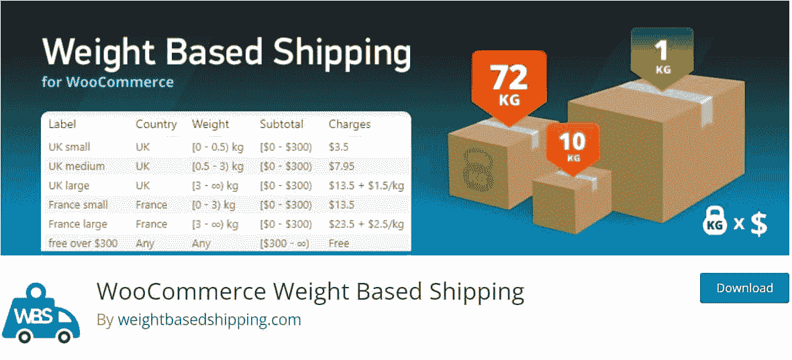
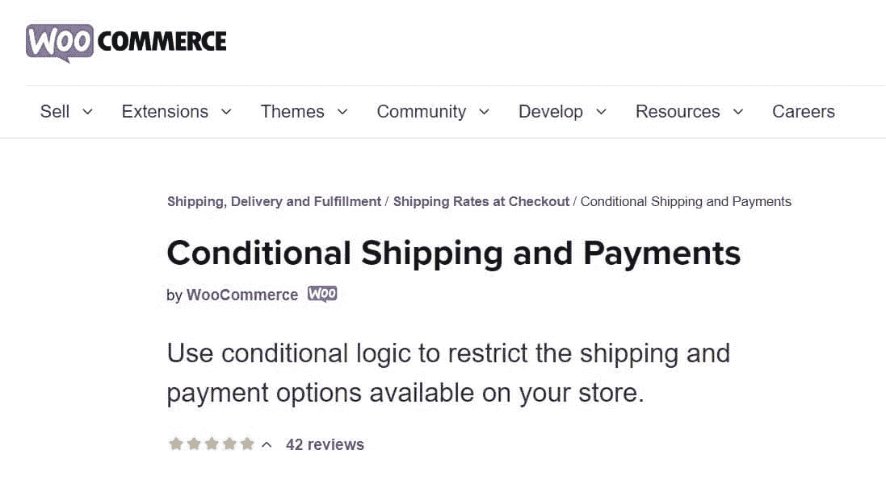
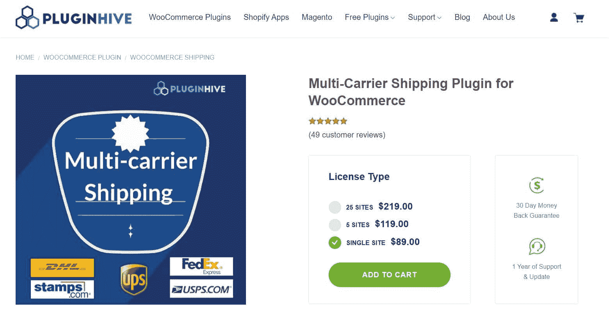
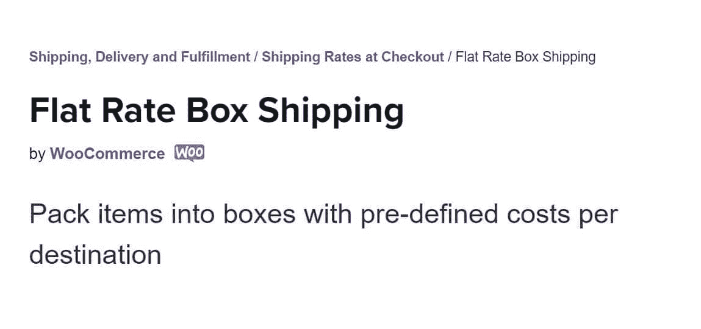
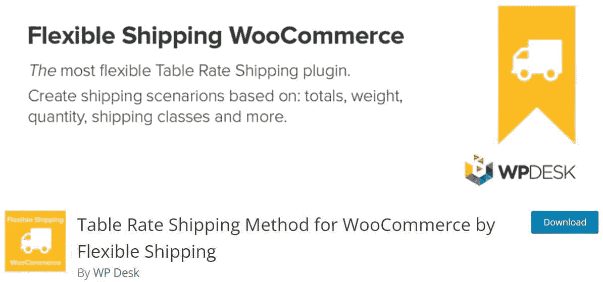
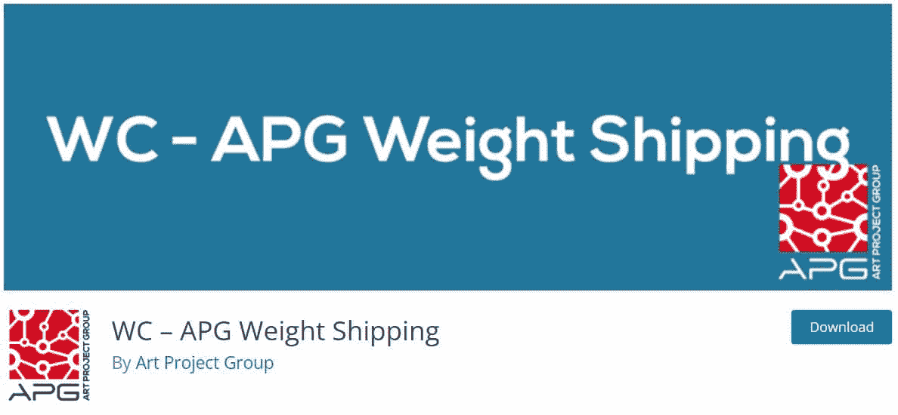
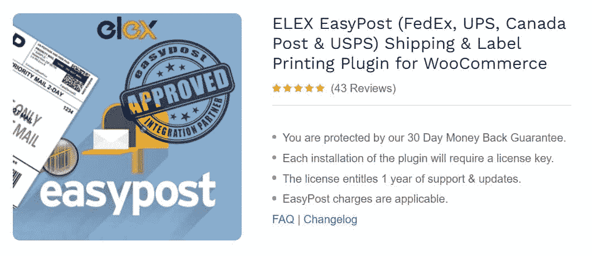
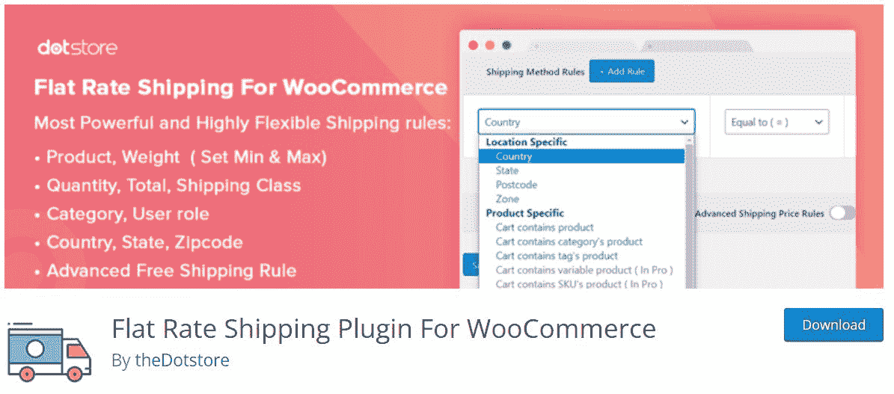
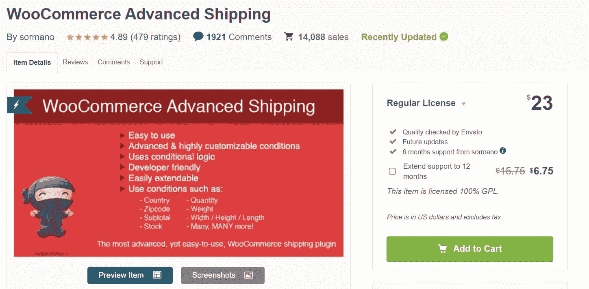
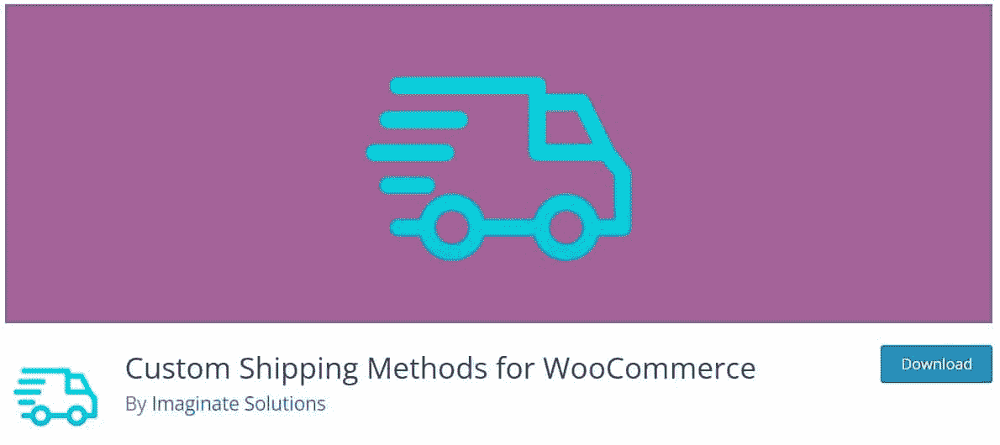

# 基于重量的运输插件(11 个最佳选项)

> 原文：<https://kinsta.com/blog/woocommerce-weight-based-shipping/>

建立一个网上商店可以是一个令人兴奋的努力。然而，当处理送货等日常物流时，您可能会感到有些不知所措。如果你想根据重量设定运费，这个过程会更有挑战性。

幸运的是，一些工具可以帮助简化这个过程。选择正确的 WooCommerce 基于重量的运输插件可以确保在您的在线商店中为[的每个订单正确计算成本。](https://kinsta.com/blog/woocommerce-tutorial/)

在本帖中，我们将进一步了解基于重量的运输及其工作原理。我们还将讨论为什么你应该考虑使用 WooCommerce 插件来处理这个过程。最后，我们将探索一些市场上最好的基于权重的 WooCommerce 运输插件。我们开始吧！

### 查看我们的视频指南 [WooCommerce 基于重量的运输插件](https://www.youtube.com/watch?v=yC5HmwQop-w)

## 什么是基于重量的运输？

一些网上商店收取固定运费。其他人根据收件人的位置来决定他们的递送费用。但是，如果您销售的产品在尺寸和重量上差异很大，您可能希望选择更先进的解决方案。

基于重量的运输使您能够根据产品的重量设定费率。购买大件商品的顾客将比购买小件商品的顾客支付更多的运费。

> Kinsta 把我宠坏了，所以我现在要求每个供应商都提供这样的服务。我们还试图通过我们的 SaaS 工具支持达到这一水平。
> 
> <footer class="wp-block-kinsta-client-quote__footer">
> 
> 
> 
> <cite class="wp-block-kinsta-client-quote__cite">Suganthan Mohanadasan from @Suganthanmn</cite></footer>

[View plans](https://kinsta.com/plans/)

通过基于重量的运输，您可以对大订单和小订单收取合理的价格。此外，您可以避免少收或多收客户的运费。

## 为什么要使用 WooCommerce 基于重量的运输插件？

开箱即用，WooCommerce 不提供基于重量的运输功能。然而，有很多插件可以根据产品的重量设置运费。

WooCommerce 基于重量的运输插件使您能够为您的客户创建不同的费率和条件。它还将帮助购物者计算订单的总配送成本。因此，他们不必担心隐藏的费用或过高的运费。

### 要查找的功能

幸运的是，有很多 WooCommerce 插件可以设置基于重量的运费。但是，我们建议在选购最佳工具时，注意以下特性:

*   **灵活性。**为了确保公平的运输价格，您可能希望选择一个插件，让您创建几个选项和条件。例如，除了根据重量计算费率之外，您还可以包括尺寸和数量等其他因素。
*   **追踪信息。**此功能使用户能够监控其订单的进度。因此，它可以提供心灵的平静。如果用户能够跟踪他们的货物，他们在购买大宗商品时可能会感到更安全。
*   **易用性。**设置多个自定义费率既耗时又繁琐。因此，寻找一个界面简单的插件是很重要的，这样你就可以很容易地计算成本。

一些 WooCommerce 基于重量的运输插件是免费的。但是，您可能希望创建多种定制运输方式和条件。在这种情况下，你可以考虑投资一个更先进的工具。

## 基于重量的 11 大 WooCommerce 运输插件

现在我们已经了解了基于重量的运输是如何工作的，让我们来看看一些可以帮助您更有效地处理这一过程的工具。这里有一些市场上最好的基于权重的 WooCommerce 插件！

### 1.基于重量的运输

WooCommerce Weight Based Shipping.

woo commerce Weight Based Shipping 是一个用户友好的插件，可以根据订单重量设置多个运费。此外，您还可以使用该工具根据其他条件创建定价规则。

**主要特性:**

*   您可以为不同的目的地、订单重量和小计范围创建多个发运规则。
*   您可以选择根据小计、总重量和其他条件提供免费运输。
*   您可以覆盖用于每个装运类别的计算方法。

**价格:**可以免费使用插件。但是，要获得更多高级功能，您需要升级到 Plus 版本。它[售价 19](https://weightbasedshipping.com/#buy) ，给你一年的[自动更新](https://kinsta.com/blog/wordpress-automatic-updates/)和支持。

### 2.运费表

Table Rate Shipping.

[表价运输](https://woocommerce.com/products/table-rate-shipping/)是一个 [WooCommerce 插件](https://kinsta.com/blog/woocommerce-extensions/)，它扩展了平台的默认运输选项。它使您能够根据各种因素(包括重量和数量)设置多种运费率。此外，它有一个直观的界面，让您可以建立自己的规则，没有太多的麻烦。

**主要特性:**

*   您可以为每个装运区域创建多个表费率。
*   您可以根据订单重量、商品数量和其他条件配置发货规则。
*   有不同的计算方法，包括每个订单和项目的费率。

**价格:**表价运费[每年 99 美元](https://woocommerce.com/products/table-rate-shipping/)并有 30 天退款保证。

### 3.有条件运输和支付

Conditional Shipping and Payments.

[有条件的运输和支付](https://woocommerce.com/products/conditional-shipping-and-payments/)是一个 WooCommerce 插件，它让店主可以很好地控制他们的运输方式。您可以设置各种费率和条件，以实现更加简单和[高效的结账流程](https://kinsta.com/blog/woocommerce-checkout/)。该插件还使您能够根据不同的因素(包括订单重量和数量)限制交付方式。

**主要特性:**

*   根据包裹重量和其他因素限制运输方式和实时费率的能力
*   超过特定金额时提供免费送货的选项
*   多种操作和过滤器可帮助您设置多个自定义条件

**价格:**有条件运输和付款[每年花费 79 美元](https://woocommerce.com/products/conditional-shipping-and-payments/)，并有 30 天退款保证。

### 4.WooCommerce 的多运营商运输插件

Multi-Carrier Shipping for WooCommerce.

顾名思义，【WooCommerce 的多承运商运输插件可以显示不同承运商的运费，包括联邦快递、DHL 和 UPS。此外，该插件可以根据重量设置有条件的运输规则。您还可以使用其它参数来建立限制，如项目数量和产品类别。

**主要特性:**

*   您可以灵活地为不同的运输公司创建不同的规则。
*   该插件根据产品重量、包裹数量、总重量等从运输公司获取实时费率。
*   您可以配置该插件来自动确定包装物品的最佳方式，或者单独包装，或者基于箱子的最大重量。

价格:插件[单个网站售价 89 美元](https://www.pluginhive.com/product/multiple-carrier-shipping-plugin-woocommerce/)，并附带一年的支持和更新。你还可以获得 30 天的退款保证。

## 注册订阅时事通讯

### 想知道我们是怎么让流量增长超过 1000%的吗？

加入 20，000 多名获得我们每周时事通讯和内部消息的人的行列吧！

[Subscribe Now](#newsletter)

### 5.统一费率箱运输

Flat Rate Box Shipping.

[统一费率箱运输](https://woocommerce.com/products/flat-rate-box-shipping/)的工作方式与我们目前看到的其他基于重量的 WooCommerce 运输插件略有不同。有了这个工具，你可以为箱子而不是单个物品设定固定运费。费用取决于盒子的大小和体积。

**主要特性:**

*   您可以在每个运输地点添加多个箱子尺寸。
*   您可以为每个箱子设定一个固定的价格，并增加每个重量单位的费用，或箱子内物品的百分比费用。
*   您可以选择为不可打包的项目(例如，太大而无法装入箱子的产品)定义价格。

**价格:**统一运费为 49 美元(按年计费)，并有 30 天退款保证。

### 6.灵活运输的表费率运输方法

able Rate Shipping Method by Flexible Shipping.

[灵活运输的表价运输方法](https://wordpress.org/plugins/flexible-shipping/)是另一种基于重量运输的强大工具。这个 WooCommerce 插件可以让你根据购物车重量和/或购物车总数来计算运费。专业版提供了更多选择，包括基于体积重量和购物车中产品体积的运费。

**主要特性:**

*   无限制的运输方式和成本计算规则
*   仅向登录用户显示运输方式的选项
*   购物车总重量和/或重量的最小和最大值
*   当客户达到一定的订单总额时，提供免费送货的能力

**价格:**你可以免费将插件添加到你的 WooCommerce 商店。要获得更多高级功能，您需要升级到灵活运输专业版。价格从[开始，每年 89 美元](https://flexibleshipping.com/products/flexible-shipping-pro-woocommerce/)。

### 7.WC–APG 重量航运

WC – APG Weight Shipping.

你可以使用的另一个免费工具是[WC-APG 重量运输](https://wordpress.org/plugins/woocommerce-apg-weight-and-postcodestatecountry-shipping/)。这个插件可以让你根据重量和目的地增加运费。您还可以选择手续费，设定包装的固定价格，以及创建具有最大重量和/或尺寸的费率。

**主要特性:**

Struggling with downtime and WordPress problems? Kinsta is the hosting solution designed to save you time! [Check out our features](https://kinsta.com/features/)

*   根据重量和位置创建无限数量的费率
*   根据不同的因素设置高级发运规则
*   显示预计交货时间
*   排除特定产品、类别、产品标签或运输类别的运输

**价格:**WC-APG 重量航运是一个免费插件。

### 8.WooCommerce 的 ELEX EasyPost 运输和标签打印插件

ELEX EasyPost.

如果你正在寻找一种有效的方式将不同公司的运费整合到你的 WooCommerce 商店中，看看 ELEX 的这个插件就知道了。[Easy Post Shipping&woo commerce 标签打印插件](https://elextensions.com/plugin/easypost-shipping-method-plugin-for-woocommerce/)根据产品重量、箱子尺寸和其他选项，从联邦快递、UPS 和其他运输公司获取邮费。

**主要特性:**

*   根据产品重量和尺寸显示实时运费
*   打印运输标签
*   显示预计交货时间和货件跟踪信息
*   设置包裹的最大重量

价格:插件[单个网站售价 69 美元](https://elextensions.com/plugin/easypost-shipping-method-plugin-for-woocommerce/)。

### 9.WooCommerce 的统一运费插件

Flat Rate Shipping.

WooCommerce 的统一运费插件是一个简单而灵活的工具，可以让你创建多种自定义的统一运费方式。这些费率可以基于各种因素，包括产品类别、数量或重量。而且，高级版给你无限的送货方式和费用计算规则。

**主要特性:**

*   为不同的目的地创建多种运输方式
*   设定产品重量的最小和最大运输成本
*   计算装运方法的税
*   满足不同条件时启用免费送货

**价格:**可以免费使用插件。同时，高级版为您提供了更多配置运费的选项。价格[从单个网站 129 美元](https://www.thedotstore.com/flat-rate-shipping-plugin-for-woocommerce/)起(按年计费)。

### 10.WooCommerce 高级航运

WooCommerce Advanced Shipping.

[woo commerce Advanced Shipping](https://codecanyon.net/item/woocommerce-advanced-shipping/8634573)让您根据体积和重量等条件设定运费。这个插件非常容易使用，由于其简单的界面。此外，您可以根据需要创建任意多的交付方式。

**主要特性:**

*   为不同地点设置基于重量的运输成本
*   当用户消费超过一定金额时，提供免费送货
*   根据您的需求创建多种运输条件

**价格:**你可以在恩瓦托市场购买 WooCommerce 高级航运。常规许可费用为 23 美元，并附带 6 个月的支持。

### 11.WooCommerce 的定制运输方式

Custom Shipping Methods for WooCommerce.

我们列表中的最后一个插件和其他的有点不同。【WooCommerce 的定制运输方式有一个[品种的短码](https://kinsta.com/blog/wordpress-shortcodes/)，你可以用它来设置不同的运输条件。其中包括根据购物车中商品的总重量计算成本的简码。

**主要特性:**

*   为每种运输方式设定规则，包括最小和最大购物车重量
*   定义免费送货的最低订单金额
*   按类别或订单收取运费
*   为与运输方式标题一起显示的图标创建自定义模板

**价格:**基本功能可以用免费版。高级版[的定价从 29.99 美元](https://wpfactory.com/item/custom-shipping-methods-for-woocommerce/)起。

[Small business owners, this one is for you! 🚀 Check out these shipping plugins to get your business off the ground 😌Click to Tweet](https://twitter.com/intent/tweet?url=https%3A%2F%2Fkinsta.com%2Fblog%2Fwoocommerce-weight-based-shipping%2F&via=kinsta&text=Small+business+owners%2C+this+one+is+for+you%21+%F0%9F%9A%80+Check+out+these+shipping+plugins+to+get+your+business+off+the+ground+%F0%9F%98%8C&hashtags=Ecommerce%2CWooCommerce)

## 摘要

如果你出售不同重量的产品，在你的网上商店提供基于重量的运输是有意义的。使用这种设置，您可以对各种规模的订单收取合理的价格。此外，你可以从几个 WooCommerce 插件中进行选择，根据重量设置送货费用。

例如，统一费率箱运输使您能够为每个箱子设定固定费率(基于尺寸和体积)并增加每重量单位的费用。同时，表价运输允许您根据订单重量和其他因素配置多种交货价格。

你对使用 WooCommerce 基于重量的运输插件有任何疑问吗？请在下面的评论区告诉我们！

* * *

让你所有的[应用程序](https://kinsta.com/application-hosting/)、[数据库](https://kinsta.com/database-hosting/)和 [WordPress 网站](https://kinsta.com/wordpress-hosting/)在线并在一个屋檐下。我们功能丰富的高性能云平台包括:

*   在 MyKinsta 仪表盘中轻松设置和管理
*   24/7 专家支持
*   最好的谷歌云平台硬件和网络，由 Kubernetes 提供最大的可扩展性
*   面向速度和安全性的企业级 Cloudflare 集成
*   全球受众覆盖全球多达 35 个数据中心和 275 多个 pop

在第一个月使用托管的[应用程序或托管](https://kinsta.com/application-hosting/)的[数据库，您可以享受 20 美元的优惠，亲自测试一下。探索我们的](https://kinsta.com/database-hosting/)[计划](https://kinsta.com/plans/)或[与销售人员交谈](https://kinsta.com/contact-us/)以找到最适合您的方式。